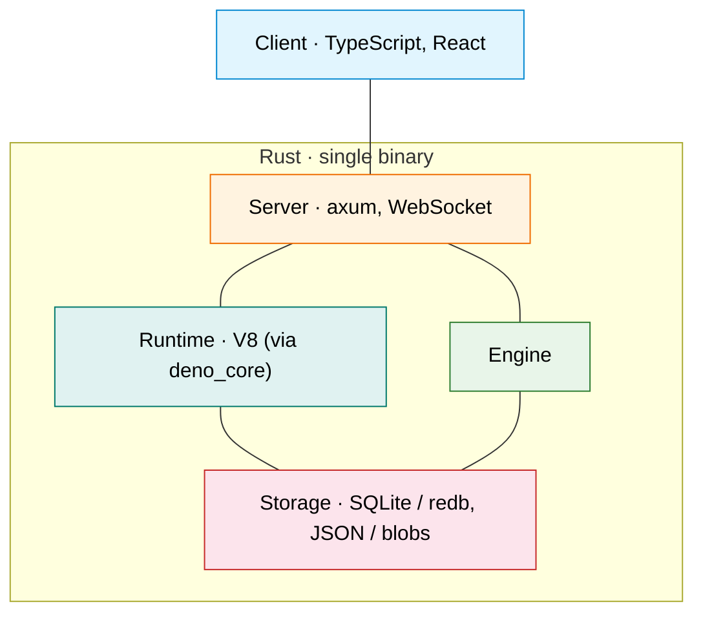
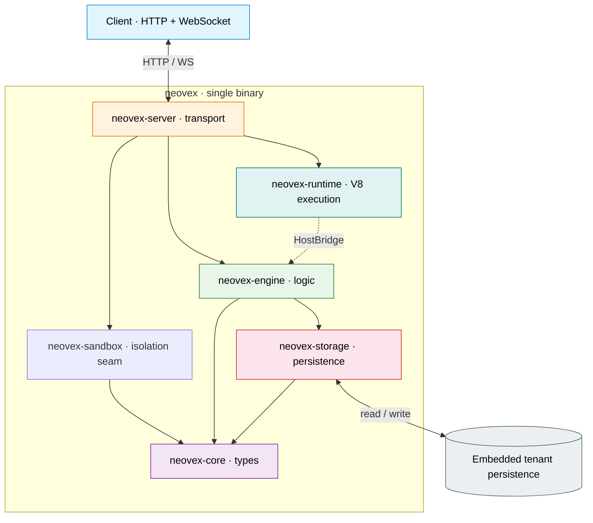
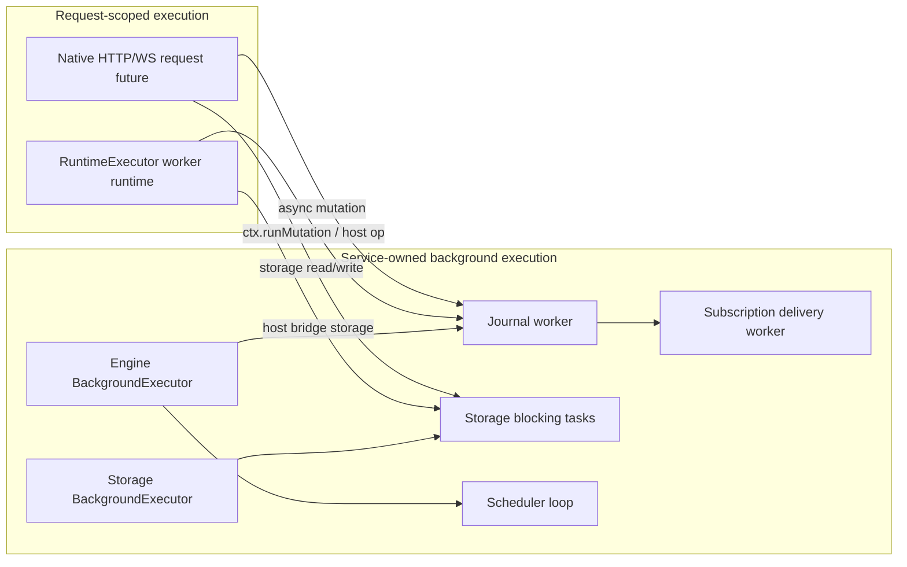
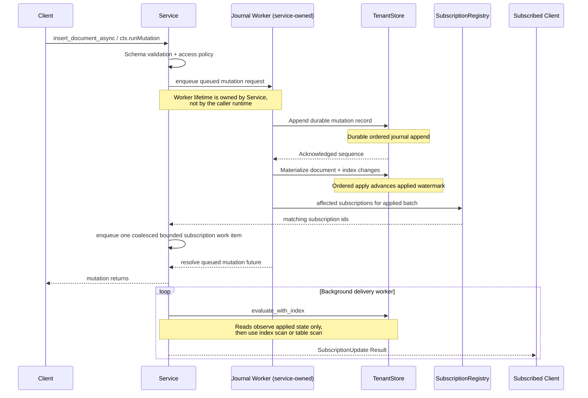
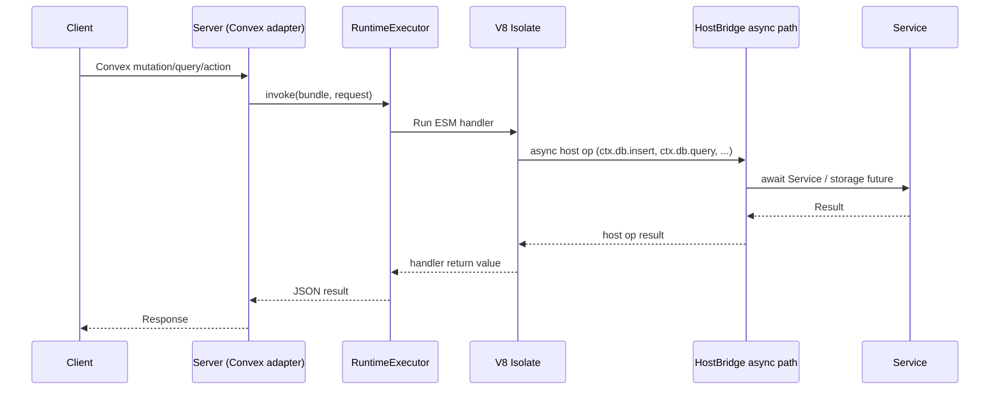
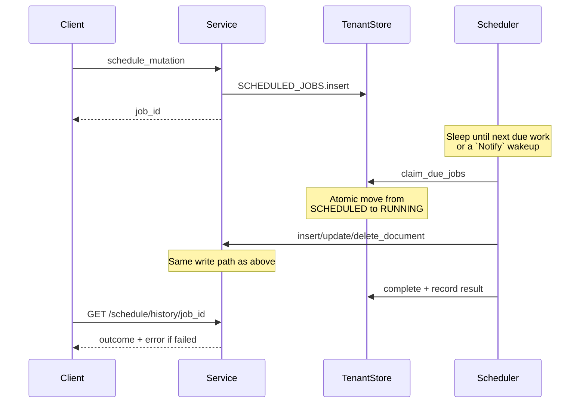

# Architecture

Neovex is a single-binary reactive document database. Clients subscribe to
queries over WebSocket and receive automatic pushes when data changes. Each
tenant gets an isolated persistence namespace: embedded deployments use local
per-tenant databases, while external providers preserve the same isolation
through provider-owned schemas or databases. Scaling is by distributing tenants
across nodes, not by sharding within one logical tenant database.

This document describes the stable architecture. It is intentionally kept at
the level of crates, key types, and data flows — not individual functions.
Keep it in sync with every commit.

---

## Tech Stack

Colors match the overview diagram below. The subgraph communicates the
language; each node lists only the technologies that define that layer. Engine
has no framework — it is pure Rust logic. Cross-cutting dependencies used
across all layers include `tokio` (async runtime), `serde` (serialization),
and `tracing` (observability). Additional dependencies include `ring`
(JWT/JWKS auth), `clap` (CLI), and `reqwest` (JWKS fetching).

---

## Overview

Solid arrows are Cargo dependencies. The dotted arrow is a runtime data flow:
V8 handler code makes host calls that the server's bridge implementation
routes to the engine. At the crate level, the runtime has zero workspace
dependencies.

**neovex-server** is the integration point. It owns all network I/O and
connects the two independent subsystems below it:

- **neovex-engine** is the central coordinator. Every read, write,
  subscription, and scheduled job flows through its `Service` struct. It
  depends on `neovex-storage` for persistence and `neovex-core` for shared
  types. This is the data path: server → engine → storage → core.

- **neovex-runtime** is a standalone V8 execution environment with zero
  workspace dependencies. It defines a `HostBridge` trait that declares what
  host operations a V8 handler can perform (`ctx.db.*`, `ctx.scheduler.*`,
  `ctx.run*`). The server implements that trait in
  `adapters/convex/host_bridge/` by calling into the engine's `Service` — so
  at runtime, V8 handler code reaches the engine, but at the crate level, the
  runtime knows nothing about it. This is dependency inversion: the runtime
  declares what it needs; the server provides it.

- **neovex-sandbox** is the generic isolation and sandbox-orchestration seam.
  It currently exposes backend-agnostic sandbox lifecycle contracts and the
  first server-facing catalog seam, while concrete krun-backed, Firecracker,
  and other backend implementations remain deferred.

The server has two request paths. **Native** requests (Neovex HTTP/WS API) go
directly to async engine methods; read and write paths now await an explicit
async storage boundary that owns backend blocking work. Durable writes cross
that boundary through `TenantWriteTransaction`, which defines an explicit
pre-commit versus post-commit split: cancellation may abort before durable
commit, but once the durable commit point is crossed the engine returns a
committed result even if the transport disconnects before observing it. Tenant
persistence now lowers through `ServicePersistenceConfig`: SQLite is the
default embedded provider, redb is retained as another embedded provider, and
Postgres, MySQL, plus replica-connected SQLite are opt-in external provider
families. The cross-tenant usage or control path lowers through a separate
control-plane provider seam and remains embedded redb-backed today. **Convex**
requests go to the runtime, which executes a V8 handler; async host operations
inside that handler now await the engine and storage futures directly instead
of bouncing through a Tokio `spawn_blocking(...)` adapter layer.

This leads to a deliberate two-tier logic model. V8 and `deno_core` remain a
first-class execution surface for Convex compatibility, JavaScript portability,
and the existing function-oriented developer model. At the same time, the
long-term Neovex-native surface should keep moving toward schema-driven CRUD,
planner-enforced policy, and, when needed, a database-native WASM plugin ABI
for tightly scoped extensions. WASM is therefore an additive path for Neovex,
not a planned replacement for the Convex compatibility runtime.

When that Neovex-native path lands, it should follow the same broad patterns
used by systems such as PostgREST, Hasura, and Wasmtime: a schema-owned public
API contract, planner-enforced policy, and a typed, capability-scoped plugin
ABI rather than an untyped general escape hatch.

The Convex surface also depends on a build-time pipeline: `packages/codegen`
(Node.js) reads application source and emits a function manifest
(`functions.json`), a runtime ESM bundle (`bundle.mjs`), and an integrity hash
(`bundle.sha256`). The server loads these at startup; the runtime verifies the
hash before every invocation.

The **neovex** facade crate re-exports the public surface of all workspace
crates so embedders depend on a single crate. The **neovex-bin** crate is the
CLI entry point.

---

## Code Map

Each crate has a single responsibility. When looking for where something
lives, use this map. Search for type and function names rather than following
file links (links go stale; symbol search does not).

**`neovex-core`** — Shared types and validation. Zero I/O, zero external deps.

- `auth/` — auth and access-policy composition root. `mod.rs` owns
  `PrincipalContext`, `PrincipalSnapshot`, `PrincipalClaimSource`, and policy
  revision fingerprinting; `access.rs` owns table access-policy structures,
  predicate evaluation, and read-filter compilation.
- `types.rs` — `TenantId`, `TableName`, `DocumentId`, `SequenceNumber`, `Timestamp`. All validated on construction (alphanumeric + `_` + `-`, max 128 chars).
- `document.rs` — `Document` struct. Serializes to JSON for wire, while
  backend-specific persistence codecs live below the engine (`MessagePack` in
  legacy redb paths, JSON-at-rest in SQLite). System fields `_id` and
  `_creationTime` are added during JSON serialization.
- `mutation.rs` — `Mutation` enum (`Insert`/`Update`/`Delete`),
  `DurableMutationRecord`, `CommitEntry`, `WriteOp`. The durable journal
  records every mutation; `CommitEntry` is the applied compatibility view used
  by existing engine and transport surfaces.
- `query.rs` — `Query`, `Filter`, `FilterOp`, `OrderBy`. Also `PaginatedQuery`, `Cursor`, `Page` for cursor-based pagination.
- `schema.rs` — `Schema`, `TableSchema`, `FieldSchema`, `FieldType`, `IndexDefinition`. Schema is optional per-table. Validation checks required fields and type matching.
- `scheduled.rs` — `ScheduledJob`, `CronJob`, `CronSchedule`, `ScheduledJobResult`. Interval-based cron.
- `error.rs` — `Error` enum with variants mapped to HTTP status codes in the server layer.

**`neovex-storage`** — Persistence layer. Tenant persistence now runs behind
the durable provider seam, with SQLite as the default embedded provider, redb
retained as another embedded provider, and the global usage store lowered
through a separate embedded redb control-plane provider for cross-tenant
metering.

- `async_storage/` — internal async storage boundary composition root.
  `traits.rs` owns the async storage contracts and `TenantWriteOutcome`,
  `read.rs` owns blocking read execution plus backend-specific tenant and usage
  read adapters, `write.rs` owns blocking write execution and the tenant write
  adapter, `engine.rs` owns `EmbeddedProviderKind` plus the retained embedded
  tenant providers, `control.rs` owns the explicit embedded redb control-plane
  provider, and `helpers.rs` owns shared blocking-task error mapping. The
  boundary still preserves the same cancellable pre-commit versus
  committed-write semantics.
- `store.rs` — `TenantStore` wrapping a redb `Database`: the storage
  composition root. It now keeps the shared table definitions and public store
  types while routing the remaining storage concerns through the
  `store/` module tree.
- `store/write.rs` — durable write-path composition root. It now composes
  `store/write/transaction.rs` (`TenantWriteTransaction` lifecycle and commit
  ownership), `scheduled.rs` (scheduled-write deduplication and scheduled-op
  batch integration), `direct.rs` (direct document CRUD helpers plus the
  public `TenantStore` CRUD write surface), `batch.rs` (execution-unit batch
  apply and durable batch commit ownership), and `store_entry.rs`
  (`TenantStore` construction, transaction entry, and write-execution
  helpers).
- `store/journal.rs` — durable journal append, read, replay, apply, recovery,
  and metadata-sequence ownership.
- `store/read.rs` — `TenantReadSnapshot`, document reads, table scans,
  sequence and journal progress reads, and read-snapshot ownership.
- `store/scan.rs` — conservative scan pushdown, scan metrics, and low-level
  MessagePack field probing for scan-time filtering.
- `store/schema_rewrite.rs` — durable schema-aware index rewrite helpers used
  during journal replay and recovery.
- `store/journal_snapshot.rs` / `store/journal_stream.rs` — materialized
  snapshot export/restore/rebuild and durable-journal bootstrap/streaming
  helpers for the authoritative journal model.
- `keys.rs` — Key construction for the DOCUMENTS table. Prefix-based range scans for table isolation.
- `index/` — Composition root for storage indexing ownership. `encoding.rs`
  owns order-preserving scalar and tuple encoding, `keyspace.rs` owns index
  key construction and prefix layout, `bounds.rs` owns composite range-bound
  synthesis, `scan.rs` is now the read-side composition root over
  `scan/read.rs`, `exact.rs`, `prefix.rs`, `range.rs`, and `adapters.rs`, and
  `maintenance.rs` is now the write-side composition root over
  `maintenance/transaction.rs`, `writes.rs`, and `rebuild.rs`.
- `schema_store.rs` — Schema persistence. `replace_table_schema` atomically updates schema and rebuilds indexes in one transaction.
- `scheduler/` — scheduled-work persistence composition root. `jobs.rs` owns
  pending or running job transitions plus the public scheduled-job CRUD
  surface, `results.rs` owns executed-job result persistence and lookup,
  `cron.rs` owns cron CRUD plus enabled-cron next-run scans, `inspection.rs`
  owns next-work and has-work inspection helpers, `recovery.rs` owns
  orphaned-running-job recovery, and `codec.rs` owns the shared scheduler
  key and MessagePack helpers. `claim_due_jobs` still atomically moves due
  jobs from pending to running, and `recover_running_jobs` still handles
  crash recovery.
- `commit_log.rs` — Durable mutation journal serialization plus the internal
  `CommitEntry` projection used by legacy storage-facing helpers and tests.
- `usage_store.rs` — `UsageStore` backed by a separate redb database (`neovex-control.db`). Tracks monthly active users (MAU) by token identifier with per-month counters.

**`neovex-engine`** — Central coordinator. Every read, write, subscription, and scheduled job flows through the `Service` struct — whether the request originates from native HTTP, WebSocket, the background scheduler, or a runtime host operation.

- `service/mod.rs` — `Service` struct: tenant registry plus the async storage
  boundary, the embedded provider selector, the still-local redb usage/control
  storage handle, simulation seams, scheduler wakeups, and a process-wide
  background Tokio runtime handle used for long-lived engine workers.
  Lazy-loads tenants from disk on first access.
- `service/mutations.rs` — Composition root for the write path. Public
  `apply_mutation` behavior still flows through the same single durable contract
  while the implementation is split across
  `service/mutations/direct/`, where `api.rs` owns the direct CRUD service
  surface plus async/principal/cancellable wrapper normalization, `execution.rs`
  owns execution-mode dispatch and mutation auth staging, `store.rs` owns the
  direct store-apply helpers, and `types.rs` owns the shared execution
  mode/result contract. The remaining write implementation is split across
  `service/mutations/authorization.rs` (shared mutation
  access-policy enforcement), `service/mutations/commit_processing.rs`
  (post-commit cache invalidation plus subscription work enqueue after the
  applied watermark advances), and `service/mutations/journal.rs` (queued async
  journal flow). A tenant-local background worker still owns reactive
  re-evaluation so committed writes no longer wait on full subscription fan-out.
  The durable-journal batch path still coalesces cache invalidation and
  subscription wakeups across multi-record apply batches before handing work to
  that background queue.
- `service/mutations/journal.rs` — Queued async mutation path. Async mutations
  first enter a tenant-local outer admission gate with CoDel shedding. A
  journal worker task spawned on the Service-owned background runtime drains
  that gate into the commit path, preserves admitted work once it crosses into
  the journal path, and owns durable append, ordered apply, and resolution of
  queued async mutation futures.
- `service/execution_units/` — Runtime multi-step mutation execution-unit
  ownership. `mod.rs` owns `MutationExecutionUnit` construction plus the stable
  public surface, `reads.rs` owns snapshot-backed read helpers and dependency
  capture, `staging.rs` owns staged document and scheduler mutation state
  transitions, `state.rs` owns staged-state lifecycle plus resolved write or
  schedule-op construction, and `commit.rs` owns finalization, schema-stability
  checks, and OCC conflict validation before the batch commit path.
- `service/queries.rs` — Composition root for the read path. The public
  `Service` read surface is now split across `service/queries/documents.rs`
  (list/get document reads), `query_api.rs` (query and pagination entrypoints),
  `journal.rs` (durable-journal and latest-sequence reads), `verification.rs`
  (shadow-materializer and consistency verification helpers), and
  `test_hooks.rs` (test-only read instrumentation and pause handles), while the
  private capability tree stays in `authorization.rs`, `planner/`,
  `prepared.rs`, `materialized.rs`, and `snapshot.rs`. The planner root now
  composes `exact.rs` (exact-prefix planning), `range.rs` (range-bound
  derivation and range-plan selection), and `scoring.rs` (candidate scoring and
  order support). Physical document loading now flows through the narrow
  storage-owned `QueryReadStore` seam rather than a redb-specific loading
  adapter. Read planning still merges declarative authorization predicates
  before selecting a semantic index-equality, range, or table-scan path, and
  async read paths still route the same prepared planner/evaluator logic
  through the storage-owned async executor.
- `service/subscriptions.rs` — `subscribe`/`unsubscribe` plus subscription
  lifecycle ownership. Initial evaluation and activation handoff now live under
  `service/subscriptions/bootstrap.rs`, which owns materialized-surface reuse,
  principal snapshot capture, policy revision tracking, and covered-sequence
  bootstrap semantics for conservative auth invalidation and catch-up.
- `service/schema.rs` — Schema CRUD. Setting a schema backfills indexes for existing documents.
- `service/scheduler.rs` — Composition root for the scheduler service
  surface. `service/scheduler/scheduled_jobs.rs` owns scheduled-job CRUD,
  result persistence, and async/cancellable scheduled-write helpers;
  `service/scheduler/cron.rs` owns cron CRUD; `service/scheduler/access.rs`
  owns the shared tenant-runtime/store access wrappers used by scheduler
  operations; and `service/scheduler/coordination.rs` owns loaded-tenant
  scans, next-due work discovery, and startup recovery via
  `load_tenants_with_scheduled_work`.
- `service/tenants.rs` — Tenant CRUD and lifecycle management. Create/delete now use async storage-engine control APIs; deletion evicts the tenant from the registry, rejects new work through a tenant-local lifecycle primitive, waits for in-flight operations to drain, then removes the on-disk store.
- `service/usage.rs` — `record_monthly_active_user` and `current_monthly_active_users` — delegates to the global `UsageStore` through the same async storage boundary used elsewhere.
- `tenant.rs` — `TenantRuntime` is the tenant-local facade and composition root.
  The root now keeps only tenant structure, constructors, lifecycle, and
  cross-domain diagnostics while grouped facade files
  (`tenant/document_cache_facade.rs`, `tenant/materialized_reads_facade.rs`,
  `tenant/mutation_facade.rs`, `tenant/query_planning_facade.rs`, and
  `tenant/subscription_delivery_facade.rs`) own the thin delegation surface
  over `tenant/document_cache.rs`, `tenant/lifecycle.rs`,
  `tenant/materialized_reads/`, `tenant/mutation.rs`,
  `tenant/query_planning.rs`, and `tenant/subscription_delivery.rs`. That
  materialized-read root now composes `snapshot.rs`
  (`ServingSnapshot`, tenant-scoped snapshot retention, waiter wakeups, and
  reader pins), `backend/` (the in-memory `MaterializedServingBackend`
  composition root, with `state.rs` owning table residency plus access
  tracking, `loading.rs` owning warm-load catch-up plus waiter behavior,
  `publication.rs` owning publication ordering and retained-version
  management, and `diagnostics.rs` owning backend stats plus test hooks),
  `warm_load.rs` (shared warm-load coordination and waiter ownership),
  `stats.rs` (public serving metrics snapshot types), and `pause.rs`
  (test-only publish pause control). That
  mutation root now composes `tenant/mutation/requests.rs`
  (queued mutation request or response models plus queue defaults),
  `admission.rs` (the outer mutation admission gate and queue ownership),
  `codel.rs` (CoDel shedding state and drop scheduling),
  `journal.rs` (journal queue state, applied-sequence waiting, and worker
  progress ownership), `stats.rs` (public mutation diagnostics snapshot
  types), and `pause.rs` (test-only pause control reused by the journal worker
  and subscription-bootstrap hooks). That
  subscription-delivery root now composes
  `tenant/subscription_delivery/queue.rs` (queue state, bounded enqueue, and
  drain batching), `worker.rs` (dedicated worker lifecycle and shutdown),
  `stats.rs` (delivery metrics and stats snapshots), and `pause.rs`
  (test-only pause control). `TenantRuntime` still holds tenant-scoped
  persistence handles, async storage handles, `SubscriptionRegistry`,
  `RwLock<Schema>`, a
  tenant-local close-then-drain lifecycle primitive, a bounded
  subscription-delivery worker queue, and per-tenant durable versus applied
  mutation-journal progress. Operation entry still uses RAII guards to keep
  the in-flight count correct; sync waiters use a `Condvar`, async waiters use
  `Notify`, and both share the same deleted-plus-active-operations state. The
  subscription-delivery queue still drains small ready batches, merges
  overlapping queued delivery work before reevaluation, and tracks both
  journal-batch and queue-level coalescing metrics, while the journal worker
  still exposes an async-friendly test pause seam for deterministic
  multi-record apply coverage.
- `evaluator.rs` — Pure evaluation composition root. It now composes
  `evaluator/query.rs` (store-backed and preloaded query evaluation surfaces),
  `pagination.rs` (paginated windowing and page assembly), `filtering.rs`
  (filter evaluation and shared scalar comparison rules), `ordering.rs`
  (document ordering and order-domain validation), and `cursor.rs` (cursor
  encode/decode, query-shape validation, and cursor boundary comparison). No
  I/O.
- `subscriptions.rs` — Composition root for tenant-local subscription
  ownership. The implementation now lives in `subscriptions/registry.rs`
  (registration, activation, cleanup handles, and live delivery projections),
  `dependencies.rs` (dependency derivation plus affected-subscription scans),
  `queue.rs` (queued wakeup work and coalescing), `delivery.rs`
  (reevaluation, monotonic delivery, and terminal error dispatch), and
  `invalidation.rs` (policy-revision teardown and shutdown). `SubscriptionRegistry`
  still tracks the latest delivered sequence per subscription so async
  delivery never publishes older visible state after newer visible state. When
  multiple applied commits are merged into one delivery unit, subscribers
  receive the latest applied sequence and current query result, but not
  per-commit metadata for the intermediate records.
- `scheduler.rs` — Background loop: `run_scheduler` sleeps until the next due tenant-local scheduled or cron work (or a wakeup notification), then fans loaded tenants out through a bounded concurrent scheduler tick so one slow tenant does not stall other due work.

**`neovex-runtime`** — Standalone execution runtime, currently V8-backed, with
zero workspace dependencies. Defines the `HostBridge` trait for
dependency-inverted host integration; the runtime never imports engine or
storage types directly.

- `runtime.rs` — `NeovexRuntime`: the runtime composition root. It now keeps
  the public type surface while delegating public runtime
  construction and convenience invocation entrypoints to `runtime/facade.rs`,
  invocation-driver ownership to the `runtime/driver/` module tree
  (`invocation.rs` for driver lifecycle and finalize paths, `loading.rs` for
  bundle load or invoke flow, `construction.rs` for snapshot bootstrap,
  runtime creation, and retained-runtime reset helpers, and `tracing.rs` for
  snapshot-seeded tracing), cooperative slot startup plus wake/poll handling
  to `runtime/cooperative.rs`, error/serialization helpers to
  `runtime/helpers.rs`, invocation/auth types to `runtime/invocation.rs`,
  bundle identity and integrity handling to `runtime/bundle.rs`, and the
  current V8-backed bootstrap layer to the `runtime/bootstrap/` module tree.
- `runtime/invocation.rs` — `InvocationKind`, `InvocationRequest`, `InvocationAuth`, `RuntimeUserIdentity`, and `VerifiedUserIdentity`: the public invocation and auth payload surface for runtime calls.
- `runtime/bundle.rs` — `RuntimeBundle`: bundle path identity, canonicalization, and per-invocation SHA-256 integrity verification.
- `backends/mod.rs` — worker-local `RuntimeBackendFactory` /
  `RuntimeBackend` traits plus the shared invocation envelope that keeps
  backend-specific state out of `RuntimeExecutor`.
- `backends/v8/` — current V8 backend implementation. `mod.rs` owns the
  worker-local backend adapter plus deferred V8-runtime drop handling,
  `embedder.rs` centralizes the current `deno_core` integration behind a
  V8-owned namespace, `startup.rs` owns startup-snapshot construction and
  build accounting, and `warm_pool.rs` owns reusable-runtime state,
  affinity-aware warm-pool reuse, and pool-bounds enforcement.
- `runtime/bootstrap/mod.rs` — thin composition root for the current V8-backed
  bootstrap module tree. This remains bootstrap glue for the existing V8
  backend, not a proven backend-neutral abstraction.
- `runtime/bootstrap/payloads.rs` — host-call payload schemas plus the runtime host-call envelope used by the bootstrap op surface.
- `runtime/bootstrap/ops.rs` — thin bootstrap op composition root for the
  current V8/`deno_core` host-op surface. It keeps the extension registration
  surface while delegating sync query-builder ops to `ops/sync_query_builder.rs`,
  async query and terminal ops to `ops/async_query.rs`,
  mutation/action/scheduler plus write-effect ops to `ops/async_effects.rs`,
  nested runtime ops to `ops/nested_runtime.rs`, and shared sync/async
  host-call permit glue to `ops/shared.rs`.
- `runtime/bootstrap/source.rs` — bootstrap JavaScript source plus the
  installation/finalization helpers that load it into a `JsRuntime`.
- `runtime/bootstrap/state.rs` — installation of host bridge, cancellation
  state, and shared permit state into V8 `OpState`, plus runtime
  timeout-controller ownership.
- `executor.rs` — `RuntimeExecutor`: the executor composition root and inline
  executor regression surface. `executor/facade.rs` owns the public executor
  type, worker-thread startup and shutdown, and executor test-state scaffolds;
  `executor/invoke.rs` owns direct and worker-backed async or blocking invoke
  entrypoints; and the remaining executor concerns still route through
  `executor/queue/`, `executor/admission.rs`, and `executor/lifecycle.rs`.
- `executor/queue/` — runtime worker-queue composition root. `job.rs` owns
  worker job envelopes plus result channels, `signal.rs` owns worker activity
  signaling, `shutdown.rs` owns executor shutdown state, `router.rs` owns
  affinity-aware worker routing plus dispatch/load tracking, and
  `controller.rs` owns the worker-local queue controller surface that workers
  drain and complete against.
- `executor/admission.rs` — thin executor-admission composition root.
  `admission/dispatch.rs` owns dispatch-handle lifecycle, `admission/permit.rs`
  owns shared permit state plus async host-call suspend/resume behavior, and
  `admission/tenant_fairness.rs` owns queued-tenant bookkeeping and the active
  versus parked versus queued fairness model.
- `executor/lifecycle.rs` — the canonical invocation lifecycle shared by the direct executor path and the worker-loop path: queue admission, execution metrics, cancellation and timeout accounting, debug logging, and permit completion.
- `worker_loop/mod.rs` — `WorkerLoopFactory`, `WorkerLoop`, and execution-model routing for runtime workers.
- `worker_loop/cooperative.rs` — composition root for the cooperative worker loop (the default execution model). Delegates admission and completion flow to `cooperative/execution.rs`, slot-state and parked/runnable scheduling to `cooperative/scheduler.rs`, warm-pool return plus deferred-drop ownership to `cooperative/retention.rs`, and the main worker run/shutdown loop to `cooperative/run.rs`.
- `worker_loop/run_to_completion.rs` — run-to-completion worker-loop implementation, available as an explicit per-bundle execution model option for bundles that need guaranteed fresh-per-invocation isolation.
- `host.rs` — `HostBridge` trait plus `HostCallRequest` /
  `HostCallOperation`: the generic runtime-side contract between V8 guest code
  and Rust host operations (db queries, mutations, scheduler commands,
  `ctx.run*` delegation). Adapter-specific wire names such as Convex
  `convex.*` labels now live at the server adapter boundary rather than in the
  runtime crate.
- `context.rs` — `RuntimeInvocationContext`: per-request metadata (invocation ID, function name, kind, auth identity) threaded through the runtime and host bridge.
- `limits.rs` — `RuntimeLimits` (heap, timeout, max runtime instances, worker
  threads, per-tenant active/in-flight/queued caps, max nested calls) and
  `RuntimePolicy` (enforces limits + owns the runtime concurrency semaphore).
- `metrics.rs` — runtime metrics composition root. It now composes
  `metrics/global.rs` (global runtime-instance, queue, pool, bundle, timeout,
  and
  cancellation counters), `host_operations.rs` (per-operation host-call
  metrics), `tenants.rs` (per-tenant counters plus queue or execution
  distributions), and `correlations.rs` (recent request-correlation retention
  and snapshot assembly) behind the stable `RuntimeMetrics` /
  `RuntimeMetricsSnapshot` surface.
- `module_loader.rs` — `RestrictedModuleLoader`: custom `deno_core` module
  loader that restricts ESM imports to the bundle root.
- `watchdog.rs` — `WatchdogTimer`: shared timeout and external-cancellation watchdog owned by `RuntimeExecutor`, replacing the old per-invocation watchdog OS threads.
- `error.rs` — `NeovexRuntimeError` with variants for timeout, cancellation,
  heap exceeded, contract violations, and user-thrown errors.

**`neovex-sandbox`** — Generic isolation and sandbox-orchestration seam. This
crate owns the stable sandbox nouns plus the first backend-owned krun
implementation slice. The public seam stays generic, while backend-specific
bundle generation, buildah command assembly, conmon/crun launch planning, and
manifest-backed lifecycle scaffolding now live under `backends/krun/`. The
remaining VMM work is host-level smoke execution and restart/log-persistence
proof on Linux.

- `backend.rs` — `SandboxBackend` plus `SandboxBackendKind` and the async
  future alias used for sandbox lifecycle operations.
- `spec.rs` — `SandboxSpec` plus `SandboxFilesystemSpec`,
  `SandboxProcessSpec`, and `SandboxPortBinding`: tenant-scoped sandbox launch
  intent, generic process/filesystem inputs, and published-port intent.
- `instance.rs` — `SandboxId`, `SandboxHandle`, and `SandboxStatus`: stable
  sandbox-instance identity and status projection.
- `endpoint.rs` — `PublishedEndpoint` plus `PublishedEndpointProtocol`: the
  canonical endpoint-publication surface that server-side registries can map
  into runtime-facing service discovery.
- `error.rs` — `SandboxError`: generic backend-unavailable, not-found, and
  operation-failed variants for the sandbox seam.
- `backends/krun/` — backend-owned krun internals. `bundle.rs` writes OCI
  bundle config with the krun handler and TSI port-map annotation,
  `buildah.rs` owns buildah command assembly, `conmon.rs` builds the
  `conmon -> /usr/libexec/neovex/crun` launch plan, `command.rs` holds the
  reusable backend-local command spec, and `vm.rs` owns manifest-backed
  `start`/`inspect`/`stop` lowering plus the current plan-only mode used for
  cross-platform verification.

### Async Ownership Boundaries

Request executors may enqueue work onto Service-owned background workers, but
they must not own the lifetime of those workers. Runtime executor threads are
for request execution. Journal apply, queued async mutation completion, and
similar durable background work are Service responsibilities.

### Execution Domains

| Domain | Owner | Primitive | Live responsibility |
| --- | --- | --- | --- |
| Main server runtime | `neovex-bin` | process Tokio runtime from `#[tokio::main]` | axum HTTP/WS request handling and the root scheduler task |
| Scheduler loop | `neovex-bin` + `Service` | long-lived Tokio task with `watch` shutdown + `Notify` wakeup | sleeps until the next due scheduled or cron work, then fans out a bounded set of per-tenant ticks via `Service` so one slow tenant cannot stall others |
| Service background runtime | `Service` | owned `BackgroundExecutor` field with `TaskTracker`, `CancellationToken`, and explicit `quiesce()` | stable home for long-lived engine async workers with service-owned shutdown semantics |
| Mutation journal worker | `Service` + `TenantRuntime` | service-owned async task | drains the outer mutation admission gate, applies CoDel shedding before journal ownership transfer, durably appends and applies queued mutations in order, and resolves mutation futures |
| Subscription delivery worker | `TenantRuntime` | tenant-owned dedicated OS thread with `Condvar` queue | bounded subscription reevaluation and delivery preparation, including small-batch queue draining and overlap-aware work merging before reevaluation |
| Runtime executor | Convex adapter | oversubscribed OS worker pool; each worker owns one current-thread Tokio runtime and one worker loop; JS permits remain separately bounded | V8 invocation execution, permit suspend/resume during async host I/O, and per-tenant active/in-flight/queued runtime admission |
| Storage async boundary | `Service` + backend-specific tenant or usage adapters | storage-owned `BackgroundExecutor` handle plus read/write semaphores | bounded tenant reads, writes, journal work, and usage operations on the service-owned storage executor; the tenant path is migration-selectable today while the usage path remains redb-backed |
| Session child tasks | WebSocket session / runtime subscription | `OwnedTaskSet` over Tokio `JoinSet` | sender, forwarder, bridge, and bootstrap tasks owned by the parent session |
| Invocation watchdogs | `RuntimeExecutor` | shared `WatchdogTimer` thread plus per-invocation registrations | timeout and external-cancellation termination of a V8 isolate without per-invocation watchdog thread churn |

The most important ownership split is between request execution and durable
background work. Request-scoped paths may wait on Service-owned work, but they
must not be the lifetime owner of that work.

Service owns its engine and storage executors as struct fields, not process-wide
statics. Both executors support a two-phase shutdown model: `quiesce()`
refuses new work and drains in-flight tasks, then runtime drop provides the
stop phase. Storage blocking work runs on the storage-owned executor instead of
borrowing whichever request or V8 runtime happened to call into storage.

`RuntimeExecutor` now also owns a shared `WatchdogTimer`. Runtime invocations
register timeout and external-cancellation termination callbacks against that
timer and explicitly disarm them before `JsRuntime` teardown. This keeps the
watchdog lifecycle executor-owned and replaces the old "up to two watchdog
threads per invocation" model with one shared watchdog thread per executor.

`RuntimeExecutor` also decouples worker threads from JS permits. Parked V8-backed
invocations hold their worker thread because `JsRuntime` is `!Send` and only
one runtime may safely exist per thread, but async host ops now release the JS
permit and the per-tenant active slot through `SharedInvocationPermit`. Another
worker can use that freed capacity while the parked invocation waits to
re-acquire its permit. The executor's primary extensibility seam is
`WorkerLoopFactory` / `WorkerLoop`; the current V8 backend stays
worker-local beneath that seam.

**`neovex-server`** — Network I/O and integration. Neovex-native routes are the default surface. The Convex adapter is an opt-in layer that owns the runtime executor, the `HostBridge` implementation, auth verification, and the function registry — it is the code that bridges the runtime into the engine.

- `lib.rs` — `build_router` defines the Neovex-native routes. `build_router_with_convex` adds the Convex adapter routes and demos. Variants with `_and_license` accept a `LicenseState`, and the new `_and_sandbox_catalog` variants expose the first explicit server-facing sandbox seam. `serve` starts the axum listener.
- `http/` — Neovex-native HTTP handlers. Read, control, and durable write routes all await async engine methods directly. Write handlers thread request disconnect cancellation to the engine, but post-commit disconnects remain transport-only failures and do not roll back durable writes.
- `ws.rs` / `ws/socket.rs` — Neovex-native WebSocket upgrade and session
  composition. `ws/socket/transport.rs` owns socket reader, writer, and
  subscription-forwarder tasks, `ws/socket/pending.rs` owns pending bootstrap
  cancellation tracking, and `ws/socket/session.rs` owns generic subscription
  registration, unsubscribe handling, and disconnect cleanup. The native
  session still explicitly unsubscribes active subscriptions on disconnect and
  owns its child tasks through `OwnedTaskSet`.
- `license/` — `LicenseState`, `LicenseDocument`, `LicenseSnapshot`, `LicenseEntitlements`. Loads from `--license-file`, `NEOVEX_LICENSE_FILE` env, or `.neovex/license.json`. Supports community, trial, and enterprise tiers. Exposes status at `GET /debug/license/status` including MAU usage.
- `convex/mod.rs` — Convex shim request/response types plus the public Convex support handlers. Owns the `RuntimeExecutor`, runtime policy, auth verifier, registry state, and the server-side `HostBridge` implementation.
- `convex/auth/` — Convex auth adapter: OIDC and custom JWT provider config, JWKS key fetching, JWT validation with clock-skew tolerance, and identity extraction for `InvocationAuth`.
- `convex/registry/` and `convex/manifest.rs` — Manifest loading, runtime bundle discovery, function lookup, and Convex support route resolution.
- `convex/host_bridge/` — The `HostBridge` implementation that adapts Neovex
  engine operations into the contract the runtime expects. Async host-call
  routes now await real engine or storage futures directly; only inherently
  synchronous host-side setup stays on the sync bridge path. The async bridge
  now parses serialized host `operation` strings once into a typed internal
  `ConvexHostOperation` dispatcher so sync, cancellable, and async entrypoints
  share one operation registry without changing the external runtime contract.
  The direct ctx-op surface now keeps
  `function_ops/ctx_ops/direct/execution.rs` as the canonical home for direct
  execution-context dispatch and execution-unit short-circuiting, while
  `function_ops/ctx_ops/direct/invocation.rs` owns runtime payload
  decode/validate/encode plus the default-cancellation wrapper flow for
  `ctx.db`, `ctx.mutation`, pagination, and action entrypoints.
- `convex/subscriptions/socket/` — Convex WebSocket session orchestration,
  message handling, runtime transform application, and active-subscription
  cleanup. `named_subscriptions.rs` is now the composition root over
  `named_subscriptions/direct.rs` (native direct-registration flow) and
  `named_subscriptions/runtime_backed.rs` (runtime-backed bootstrap, initial
  publish, and forwarding ownership). The session still owns its sender and
  forwarder tasks through `OwnedTaskSet`, and runtime-backed active
  subscriptions own their bridge tasks so auth changes, unsubscribe, and
  disconnect drain those children explicitly.
- `execution/subscriptions.rs` — Runtime subscription bootstrap for derived base
  queries. It registers the underlying engine subscriptions, rewrites their
  events onto the public subscription id, and now keeps those bridge tasks
  attached to the active subscription lifecycle instead of detaching them.
- `convex/execution/`, `convex/http_actions/`, `convex/subscriptions/`, and `convex/handlers/` — Shared Convex support execution, HTTP route dispatch, and live subscription plumbing.
- `convex/host_bridge/read_tracking/` — Runtime read-set tracking used by runtime-backed Convex support subscriptions for narrower-than-table-level invalidation.
- `protocol.rs` — Request/response DTOs. `ClientMessage` (Subscribe/Unsubscribe) and `ServerMessage` (SubscriptionResult/Error).
- `sandbox.rs` — `SandboxCatalog` and `EmptySandboxCatalog`: server-owned
  service-discovery seam for mapping tenant-and-name lookups onto sandbox
  handles without coupling `neovex-sandbox` directly into request handlers.
- `state.rs` — `AppState` holds the shared `Service`, optional Convex support registry, `LicenseState`, and the injected `SandboxCatalog`. `AppError` maps `Error` variants to HTTP status codes.

**`neovex`** — Public facade crate for embedders. Re-exports stable types from `neovex-core`, `neovex-engine`, `neovex-runtime`, `neovex-sandbox`, `neovex-server`, and `neovex-storage` so downstream consumers depend on a single crate.

**`neovex-bin`** — CLI entry point. Lowers runtime CLI, env, and JSON config
into typed `ServicePersistenceConfig`, then parses `--port`,
local data-directory and control-plane overrides, provider-specific settings
such as `--postgres-url`, `--convex-app-dir`, `--license-file`, and runtime
limit flags (`--runtime-heap-mb`, `--runtime-initial-heap-mb`,
`--runtime-timeout-secs`, `--runtime-max-instances`,
`--runtime-worker-threads`, `--runtime-max-nested-calls`). Loads tenants with
scheduled work, spawns the scheduler, optionally loads the Convex registry and
license state, starts the server, and handles graceful shutdown.

**`packages/codegen`** — Node.js code generation tool. Reads Convex source files (`convex/*.ts`) and a `convex/schema.ts`, emits `.neovex/convex/functions.json` (named-function manifest), `.neovex/convex/bundle.mjs` (runtime ESM entrypoint), `.neovex/convex/bundle.sha256` (integrity hash), and generated `convex/_generated/` TypeScript (api, server, dataModel, scheduled_functions).

**`packages/convex`** — In-repo Convex compatibility package. Provides `convex/browser` (`ConvexHttpClient`), `convex/react` (`ConvexReactClient`, hooks), `convex/server` (handler wrappers), and `convex/values` (validators). These talk the Neovex Convex-shaped WebSocket/HTTP protocol.

**`neovex-testing`** — Shared test fixtures (`HttpApiFixture`) for
integration tests. `http_api_fixture/` is now a route-family composition root:
`debug.rs` owns diagnostics helpers, `convex.rs` owns Convex runtime and HTTP
helpers, `tenants.rs` owns tenant lifecycle helpers, `schedule.rs` owns native
scheduling and cron helpers, `schema.rs` owns schema helpers, `documents.rs`
owns document and journal helpers, and `queries.rs` owns native query helpers.

---

## Persistence Seams

Neovex should keep two different seams explicit instead of collapsing them into
one generic "backend" abstraction.

### Durable engine-facing behavior seam

The durable seam is the tenant-scoped persistence contract that the engine
depends on. This is the seam that should survive the SQLite migration and later
support retained embedded providers plus future non-local provider families.

Use `TenantPersistence` as the umbrella name for that seam. It may be one trait
or a composed family of semantically named capabilities, but the capability
names should stay behavior-oriented:

- `TenantQueryRead`
- `TenantMutationPersistence`
- `TenantJournalPersistence`
- `TenantSchedulerPersistence`
- `TenantSnapshotPersistence`
- `TenantSchemaPersistence`

The current `QueryReadStore` in
`crates/neovex-storage/src/query_read.rs` is already a good example of the
intended direction: narrow, planner-driven, and derived from live call sites
rather than from a greenfield CRUD sketch.

This seam belongs between `TenantRuntime` and backend-native persistence. The
engine should keep ownership of:

- auth, validation, and policy merge behavior
- mutation admission and batching
- execution-unit dependency and OCC semantics
- `CommitEntry` and durable or applied head semantics
- subscription fan-out and materialized-read publication semantics
- journal bootstrap, replay, and snapshot product behavior
- tenant routing and request-level coalescing

Backends should keep ownership of:

- transactions, WAL or MVCC, and physical recovery primitives
- SQL or key-value storage layout
- indexes, ordering, range scans, and physical query execution
- prepared statements, pooling, and backend-local caching
- backend-native concurrency behavior

### Separate construction/config seam

Construction and configuration are a different concern and should not be fused
with the durable behavior seam.

Use `PersistenceProvider` as the long-term name for the typed
construction/config seam. It should own backend selection, typed config, tenant
routing, pools, and lifecycle entrypoints for embedded or external backends.

At the service boundary, model persistence inputs as:

- `ServicePersistenceConfig` for the whole service
- `TenantProviderConfig` for tenant-scoped persistence
- `ControlPlaneConfig` for cross-tenant control and usage state

`ServicePersistenceConfig` should keep tenant persistence and cross-tenant
control-path configuration separate so a provider change for tenant data does
not silently move global metering or future control-plane state with it.

The live implementation now reflects that split directly: `Service` lowers
tenant persistence through `PersistenceProvider` and lowers the cross-tenant
usage/control path through a separate control-plane provider role instead of
piggybacking usage-store construction on a tenant provider.

Use names like:

- `EmbeddedRedbProvider`
- `EmbeddedSqliteProvider`
- `LibsqlReplicaProvider`
- `PostgresProvider`
- `MySqlProvider`

Do not treat path-shaped tenant construction as the durable cross-backend API.
That shape is acceptable only for the migration window.

Provider config should distinguish storage dialect from deployment topology.
`sqlite` alone is not enough, because local-file SQLite and replica-connected
SQLite have different latency, consistency, and operational models. The same
principle applies to future retained embedded providers: their coordination or
replication mode should be provider/topology config, not a change to
`TenantPersistence`.

Use separate validated axes such as:

- `PersistenceDialect` with values like `Redb`, `Sqlite`, `Postgres`, and
  `MySql`
- `PersistenceTopology` with values like `EmbeddedStandalone`,
  `ExternalPrimary`, `ExternalPrimaryWithReplicas`, and
  `CoordinatedEmbedded`

Then layer provider-owned `TenantRoutingConfig`, `PoolConfig`, and credential
configuration on top of those axes.

Current embedded constructors such as `Service::new(data_dir)` and
`Service::new_with_embedded_provider(data_dir, EmbeddedProviderKind)` are
still useful convenience wrappers, but they should eventually lower into the
typed config model above instead of becoming the universal construction API.

Operator-facing startup config should follow the same rule. CLI flags,
environment variables, and config files should lower into one typed
`ServicePersistenceConfig` model. Resource identity and execution intent
should stay separate, so a canonical Postgres connection value such as
`NEOVEX_POSTGRES_URL` can be reused across runtime, test, and benchmark
surfaces while the invoking command or profile chooses the intent.

### Naming rules

- Use `persistence` for stable engine-facing contracts that must work for both
  embedded and networked databases.
- Use `provider` for typed backend construction/config and tenant routing.
- Use `backend` only for temporary migration switches or for naming concrete
  implementation families.
- Use `store` only for backend-local physical adapters such as
  `SqliteTenantStore`.

That means migration-only names such as `StorageBackendKind`,
`BackendStorageEngine`, `BackendTenantStore`, and `BackendTenantReadStorage`
should not reappear as the durable public architecture vocabulary; they belong
in the historical migration record, while the live code and docs use
`TenantPersistence` / `PersistenceProvider` terminology instead.

### Embedded vs external cost model

Embedded backends such as SQLite or redb mainly pay local CPU, memory, disk,
and lock costs. External backends such as Postgres or MySQL also pay network
round trips, pool checkout, TLS, remote planning, and server-side concurrency
costs.

That makes the Neovex-owned pre-storage layer even more important for external
SQL, but only for the right kind of work:

- do more semantic shaping above the seam
- do less chatty storage interaction across the seam
- keep physical filtering, ordering, and set execution inside the backend

The architectural consequence is that the stable seam should stay coarse and
semantic. It should expose operations like execution-unit apply, journal
append/stream/bootstrap, scheduler claim/complete, and query-read behavior
derived from the planner. It should not degenerate into tiny CRUD or
scan-shaped primitives that force many remote round trips.

For future external providers, refine the current umbrella
`TenantPersistence` composition root toward explicit capability families:

- `TenantQueryRead`
- `TenantMutationPersistence`
- `TenantJournalPersistence`
- `TenantSchedulerPersistence`
- `TenantSnapshotPersistence`
- `TenantSchemaPersistence`

Those capability seams should remain semantic. They must not be replaced by:

- filesystem-path construction as the universal provider API
- hook- or trigger-driven reactivity as the canonical engine contract
- row-at-a-time remote iterator contracts that make the engine emulate a query
  planner
- chatty document CRUD verbs that turn one logical operation into many network
  round trips

External providers may still optimize aggressively below that seam by bundling
round trips, using server-side planning, or choosing backend-native
notification and recovery mechanisms, as long as the Neovex-owned semantics
above the seam stay unchanged.

### Postgres-first provider shape

The first concrete non-local mode should be `PostgresProvider`.

Its intended shape is:

- one provider-owned Postgres database for the Neovex service
- one small provider metadata schema for tenant registry and routing metadata
- one Postgres schema per Neovex tenant
- the same logical per-tenant tables Neovex already uses in SQLite
- fully qualified tenant-schema SQL instead of mutable session `search_path`

The journal model should remain Neovex-owned:

- `commit_log` stores serialized `DurableMutationRecord` blobs
- Postgres sequence or identity allocation owns physical sequence numbering
- provider-owned serialization preserves per-tenant ordered append and apply
- durable-head and applied-head stay explicit metadata, not inferred from
  notification delivery

Notifications such as `LISTEN` / `NOTIFY` may be used as wake hints, but not
as the authoritative reactive contract. Lost notifications must recover from
head metadata plus journal replay. The cross-tenant usage/control path remains
local redb in this first Postgres slice.

The readiness gate for this mode must measure more than local throughput. At a
minimum, it needs steady-state, cold-start, and latency-injected RTT lanes;
CRUD, indexed query, journal, subscription, mixed-load, and tenant-lifecycle
workloads; and operational drills for reconnect, listener loss, restart, pool
pressure, and tenant cleanup.

### Replica-connected SQLite provider shape

The concrete first replica-connected SQLite family is
`LibsqlReplicaProvider`. It must not mean "open a SQLite file across the
network." SQLite's own network and WAL guidance make raw network-mounted
database files an unacceptable provider shape.

The admissible future shape is a concrete client/server or embedded-replica
provider family with:

- one authoritative primary that owns writes, schema changes, scheduler
  mutations, journal append, and head metadata
- read replicas or embedded replicas that may serve read-only queries only
  behind a provider-owned durable or applied sequence barrier
- provider-owned refresh/catch-up whenever replica progress cannot be proven
  sufficient for the requested semantic boundary; any future direct
  primary-read fallback would still belong behind that same provider boundary

If we activate this path, the best first-fit Rust connector family is
`libsql`, not a local-only SQLite driver stretched into a replication story.
`libsql` already exposes remote and local replica builders, synced databases,
delegated remote writes, `read_your_writes`, and `sync_until`, which is much
closer to the provider semantics Neovex needs. Plain `rusqlite` or
`sqlx::Sqlite` remain good local SQLite tools, but they do not solve the
replica-topology problem on their own.

The current concrete activation is narrower than "any libsql mode." The
`LibsqlReplicaProvider` family pairs a remote-primary `libsql` connection for
writes and authoritative state with provider-owned per-tenant local SQLite
cache files for read-serving only.

That distinction matters:

- embedded SQLite means the local tenant file is authoritative state
- `LibsqlReplicaProvider` means the remote `libsql` primary is authoritative
  and the local SQLite file is derivative cache state
- replica reads remain correct only when the provider-owned durable/applied
  sequence barrier proves that cache freshness is sufficient
Today the safest first sync model is a Neovex-owned snapshot or catch-up
refresher over the remote `libsql` SQL connection, producing provider-owned
local SQLite cache files directly. The main Neovex process must not assume it
can host `new_remote_replica(...)` directly until that runtime path is proven
stable in the live harness. That means:

- keep the public typed config on `dialect = Sqlite` plus a replica topology,
  not on a new filesystem-shaped provider seam
- use a provider metadata namespace plus one tenant namespace per tenant on
  the remote primary
- keep local replica files provider-owned under an explicit cache root rather
  than accepting arbitrary SQLite files as the topology contract
- keep the sync owner for those replica files explicit: the first activation
  may refresh them via deterministic remote snapshot or catch-up work, and any
  future `libsql` embedded-replica client still belongs behind the same
  provider-owned boundary until the in-process runtime path is proven safe
- keep journal append, scheduler mutation paths, bootstrap/export, and other
  mutation-adjacent reads on the primary or behind an explicit provider-owned
  barrier refresh / catch-up path
- let only planner-driven read-only query lanes serve from the embedded
  replica, and only after provider-owned sequence-barrier proof or explicit
  `sync_until` catch-up

The current implementation state follows that split explicitly: the engine now
lazy-loads replica-backed tenants through the normal `TenantPersistence` seam,
routes writes, scheduler mutations, and durable journal apply or recovery to
the remote primary, and serves planner-driven reads from the provider-owned
local SQLite cache after explicit cache refresh or poll-driven catch-up. The
embedded cache remains derivative rather than authoritative, while the provider
poll worker keeps loaded and unloaded tenants aligned with remote schema,
journal, and scheduled-work state.

The first slice should explicitly defer `libsql` synced/offline-write database
shapes. Neovex does not need disconnected local writes for this activation,
and bringing them in early would expand the roadmap into conflict resolution,
multi-writer policy, and promotion semantics that do not belong in the first
replica-connected SQLite pass.

Failover, promotion, and replica catch-up policy belong in provider and
topology config, not in `TenantPersistence`. Any actual implementation should
start from a new dedicated active plan for one named provider family rather
than from a generic "remote SQLite" promise.

### MySQL provider shape

The first MySQL mode should preserve the same Neovex semantics as the
Postgres-first path while using MySQL-native physical mechanics.

Its intended shape is:

- one provider-owned MySQL deployment for the Neovex service
- one small provider metadata database for tenant registry and routing
- one tenant database per Neovex tenant, using fully qualified
  `tenant_db.table_name` SQL
- InnoDB MVCC transactions for consistent reads, execution-unit OCC, and
  durable journal append behavior
- tenant-local `AUTO_INCREMENT` commit-log sequencing plus explicit durable and
  applied head metadata
- generated-column-backed JSON indexing instead of assuming Postgres-style
  expression indexes or SQLite JSON-expression indexes

If we activate this path, the best first-fit Rust connector stack is
`mysql_async` directly. It is Tokio-native, already ships with a pooled async
connection model and explicit transaction APIs, and fits Neovex's need for
dynamic fully qualified SQL, locking reads, and provider-owned statement
control. `sqlx` and `diesel-async` remain valid options in the abstract, but
they are not the best first fit for a provider that will rely on dynamic
tenant-database SQL rather than on macro-checked literal queries or an ORM
query builder.

Queue-like scheduler claim paths may use `FOR UPDATE SKIP LOCKED`, but if a
replicated MySQL deployment is used, that path should be treated as
row-based-replication territory rather than relying on statement-based
replication behavior. Recovery and catch-up should assume durable-progress
polling or provider-owned wake hints, not a Postgres-style in-database pub/sub
primitive.

---

## Architecture Invariants

These rules must not be violated. If a change would break one, it requires an
architecture discussion.

1. **`neovex-core` has zero I/O.** It defines types and validation only. If
   you need to read a file or make a network call, it belongs in another crate.

2. **`neovex-runtime` has zero workspace dependencies.** It defines the V8
   execution surface and the `HostBridge` trait. All Neovex-specific
   integration lives in the server's bridge implementation, not in the runtime
   crate.

3. **Durability and visibility are separate, explicit phases.** A mutation is
   acknowledged only after its durable journal record is appended in commit
   order. Read visibility, cache publication, and subscription fan-out happen
   only after ordered materialization updates document and index state and
   advances the applied watermark. Both async and sync serving reads wait for
   that applied watermark before consulting the materialized document or index
   state, and async waits remain cancellable while they are blocked on that
   visibility boundary.

4. **Every mutation — whether from HTTP, WebSocket, the scheduler, or the
   runtime — flows through `Service::apply_mutation`.** There is no separate
   code path for scheduled or runtime-originated mutations. Schema validation
   and subscription fan-out are guaranteed.

5. **Runtime multi-step mutations use an explicit execution unit with
   serializable OCC validation.** Runtime `ctx.db.*`, `ctx.scheduler.*`, and
   direct `ctx.runQuery` or `ctx.runMutation` calls inside a mutation execute
   against a stable read snapshot, stage their writes locally, and commit once
   after validating shared dependency metadata against commits that landed
   after the same applied snapshot sequence they actually read. Repeated
   writes to the same document must collapse to the final logical write before
   commit instead of manufacturing intermediate conflicts. Execution units are
   single-use: once `commit()` is attempted, the unit is finalized whether the
   attempt succeeds, conflicts, or becomes a no-op, and later reads, writes,
   or repeat commits are rejected.

6. **The evaluator is pure.** `evaluate_query` and `evaluate_paginated` take
   data in, return data out. No I/O, no state, no side effects. The service
   layer handles schema lookup and index selection.

7. **Schema is optional.** A table without a schema accepts any document.
   Setting a schema only adds constraints — it never removes the ability to
   write to a previously schemaless table.

8. **Tenant deletion blocks until in-flight operations complete.**
   `begin_delete()` acquires an exclusive lifecycle lock. `enter_operation()`
   acquires a shared lock. New operations after the `deleted` flag is set
   return `TenantNotFound`.

9. **Runtime bundles are integrity-checked.** The SHA-256 hash of the bundle
   is verified before every invocation. A tampered or stale bundle is rejected.

10. **Runtime host operations go through the same Service path as direct
   calls.** `ctx.db.insert(...)` inside a V8 handler ultimately calls the
   same `Service::apply_mutation` as an HTTP `POST`. No bypass.

11. **Long-lived async engine workers are service-owned.** Journal workers and
   similar background write-path tasks must be spawned from a stable runtime
   owned by `Service`, not from request-scoped executors or per-invocation
   current-thread runtimes. Otherwise queued durable writes can outlive the
   runtime that was supposed to resolve their futures.

---

## Key Data Flows

### Write Path (mutation to subscription push)

### Runtime Bundle Execution Path

### Scheduled Mutation Path

---

## Persistence Engine

The live tenant-data path is in transition from a redb-only implementation to a
SQLite-first provider model. During the migration window:

- tenant persistence can be backed by redb or SQLite behind a temporary
  selector
- the engine-visible behavior contract stays the same across both
- the intended end state is SQLite as the default embedded backend with redb
  retained as a supported embedded provider
- the cross-tenant usage or control database remains redb-backed for now

### SQLite tenant layout (target embedded backend)

Each SQLite tenant database keeps documents as JSON at rest, durable journal
rows as serialized `DurableMutationRecord` blobs, and scheduler or metadata
state in relational tables:

| Table | Columns | Purpose |
|-------|---------|---------|
| `documents` | `table_name`, `id`, `data_json`, `creation_time` | Primary document store with JSON-at-rest payloads |
| `schemas` | `table_name`, `schema_json` | Per-table schema definitions |
| `scheduled_jobs` | `id`, `data_json` | Pending scheduled mutations |
| `running_scheduled_jobs` | `id`, `data_json` | In-flight jobs for crash recovery |
| `scheduled_job_results` | `job_id`, `data_json` | Execution outcomes |
| `scheduled_job_executions` | `execution_id` | Dedup guard for scheduled execution ids |
| `cron_jobs` | `name`, `data_json` | Recurring job definitions |
| `commit_log` | `sequence`, `record_blob` | Append-only durable mutation journal |
| `metadata` | `key`, `value_blob` | Applied head and related per-tenant metadata |

SQLite expression indexes are derived from table schema definitions and own the
physical indexed-read path.

### redb tenant layout (retained embedded provider)

The legacy redb tenant file contains key-value tables for documents, indexes,
schemas, the durable journal, scheduler state, and metadata:

| Table | Key | Value | Purpose |
|-------|-----|-------|---------|
| `DOCUMENTS` | `table\0doc_id` | msgpack(Document) | Primary document store |
| `INDEXES` | `table\0idx\0encoded_val+doc_id` | empty | Secondary index entries |
| `SCHEMAS` | `table_name` | msgpack(TableSchema) | Per-table schema definitions |
| `COMMIT_LOG` | `sequence (u64)` | msgpack(DurableMutationRecord) | Append-only durable mutation journal |
| `METADATA` | `"next_sequence"` / `"applied_sequence"` | `u64` | Durable-sequence and applied-head tracking |
| `SCHEDULED_JOBS` | `run_at(8B)+job_id(16B)` | msgpack(ScheduledJob) | Pending scheduled mutations |
| `RUNNING_SCHEDULED_JOBS` | `job_id(16B)` | msgpack(ScheduledJob) | In-flight jobs (crash recovery) |
| `SCHEDULED_JOB_RESULTS` | `job_id(16B)` | msgpack(Result) | Execution outcomes |
| `SCHEDULED_JOB_EXECUTIONS` | `job_id(16B)` | empty | Dedup guard for crash-replayed jobs |
| `CRON_JOBS` | `cron_name` | msgpack(CronJob) | Recurring job definitions |

The global `neovex-control.db` remains redb-backed and local today and
contains 3 tables for MAU tracking:

| Table | Key | Value | Purpose |
|-------|-----|-------|---------|
| `monthly_active_identities` | `month_prefix\0token_id` | empty | Per-identity dedup |
| `monthly_active_counts` | `month_start_unix_ms (u64)` | msgpack(count) | Monthly counters |
| `monthly_active_last_recorded` | `month_start_unix_ms (u64)` | msgpack(timestamp) | Last-seen timestamps |

The first Postgres-first non-local activation is intentionally tenant-scoped,
so this cross-tenant usage/control database stays local and redb-backed for
that first slice.

### Query Planning

The engine planner chooses the semantic path, then hands physical execution to
the backend-specific read layer:

1. **Eq filter on indexed field** — exact-index path with residual filters
2. **Range filters on indexed field** — range-index path with residual filters
3. **Fallback** — full table scan

SQLite executes the physical read path through parameterized SQL plus
expression indexes. redb executes the physical read path through encoded
secondary-index key scans. Residual semantics, auth, and final query meaning
stay in Neovex.

---

## Design Decisions

**Why SQLite as the default embedded backend?** SQLite gives Neovex
transactions, WAL durability, physical query execution, JSON-at-rest
documents, and expression indexes without forcing the engine to keep
redb-specific physical scan or key-encoding machinery. The benchmarks in
`docs/research/sqlite-storage-benchmark-report.md` show that once the read path
leans into SQLite-native execution, SQLite is the stronger long-term embedded
backend for the current service shape. redb can still remain as a supported
embedded provider as long as the engine-facing seam is no longer redb-shaped.

**Why a durable journal instead of a traditional storage WAL?** The underlying
embedded backend already provides crash-safe atomic commit, so Neovex does not
need a page-level WAL to make today's writes safe. The next architectural step
is a richer logical
ordered history that can drive replay, dependency-aware invalidation, CDC,
streaming, and future replicas. If Neovex later adds a custom write-optimized
materializer such as an LSM-style layer, it should consume that same logical
journal as its log-before-materialization contract. A third-party storage engine
may still keep an internal WAL or journal, but Neovex should avoid inventing a
second application-level durability log when one logical ordered-history
contract can serve the write path, recovery, and downstream consumers.

**Architectural decision: Neovex owns the durable journal.** For this project,
the durable journal is a Neovex-defined logical ordered-history layer built
above backend internals. Agents should not reinterpret the storage migration as
permission to adopt a generic external log as the primary design.

This is the right decision for Neovex because:

- the reactive architecture needs logical mutation records, not just a physical
  recovery stream
- dependency-aware invalidation, replay, and future replica consumption all
  need the same tenant-scoped ordered history
- keeping the journal above storage-engine internals preserves freedom to change
  materializers later without redefining the application-level durability
  contract

**The durable journal is now the authoritative per-tenant history.** The
ordered `DurableMutationRecord` stream is the source of truth for replay,
rebuild, and future CDC or replica consumers. Document and index tables remain
an applied materialized view maintained from that history, with
`applied_sequence` defining the snapshot boundary between what is already
materialized and what still lives only in the journal tail.

Materialized snapshot boundaries now carry explicit metadata as well: at
minimum the snapshot format records the applied sequence it materialized
through and the durable head observed at export time. That lets rebuild reject
an incomplete journal tail loudly instead of silently reconstructing only the
applied prefix when a snapshot is taken during apply lag.

**External journal consumers now use the same ordered history contract.** Phase
8A exposes the authoritative journal through tenant-scoped sequence cursors
rather than inventing a second replication log. Consumers read durable
`DurableMutationRecord` pages with at-least-once, duplicate-tolerant replay
semantics: retrying an older cursor replays the same suffix, and later
compaction can invalidate cursors below an explicit cursor floor instead of
silently skipping history.

**Bootstrap is snapshot plus the same stream, not a separate export format.**
Bootstrapping a downstream consumer now returns a materialized snapshot, the
applied sequence to resume after, and the durable cut that bounded the snapshot
export. To reconstruct the same logical state, a consumer restores the
snapshot, then applies streamed journal records with
`resume_after < sequence <= bootstrap_cut`. If newer writes arrive while that
consumer is catching up, they remain part of the same ordered stream and can be
processed after the bootstrap cut without switching formats.

**Replica-local reads are now a validated path, but not the default serving
path.** Neovex now has a narrow read-only `EmbeddedReplica` that bootstraps
from the authoritative snapshot-plus-stream contract, applies the same durable
journal records into a local materialized store, and evaluates queries or
pagination locally against that store. This is an architectural proof point for
edge and embedded read offload, not a change to write authority or subscription
fan-out.

**Replica catch-up synchronizes schema state as well as journal state.** Schema
changes still live outside the durable mutation journal, so replica catch-up
must refresh local schema state even when there are no new durable mutation
records to apply. Replica-local query and pagination evaluation now reuses the
same schema- and principal-aware planning helpers as the live service rather
than treating local replayed documents as sufficient on their own.

**Server-side re-evaluation remains the near-term production path.** The main
server still owns writes, subscription re-evaluation, and pushed results. The
embedded replica work proves that local read evaluation can stay consistent
with the authoritative journal, but it does not replace the server-driven
reactive path yet. Future promotion of replica-local evaluation should build on
this contract rather than bypassing the durable journal or inventing a second
materialization format.

**Committed does not immediately mean read-visible.** The durable journal now
defines commit order and durability, while the serving read path still comes
from applied materialized state. Async mutations acknowledge after the durable
append, but reads, subscriptions, and cache publication wait for
`applied_sequence >= required_sequence` instead of overlaying journal-only
records directly into point reads, scans, subscriptions, or cache lookups.
Rebuild and bootstrap use a materialized snapshot plus journal tail rather than
inventing a second serving read path. That keeps visibility rules explicit,
preserves one serving read path, and avoids introducing a second
correctness-critical overlay engine too early.

**Durable journal integrity hashes use a canonical payload shape.** Journal
records are now hashed over a stable serialized representation that keeps
optional fields explicit, so a normal serde or MessagePack round-trip cannot
change the integrity payload shape and falsely mark an untampered durable
record as corrupt.

**What should guide the durable journal design?** Use external systems as
reference implementations, not as accidental architecture replacements. The
current direction is:

- `docs/research/tigerbeetle-code-reference.md` for the Neovex-specific code
  reading map into TigerBeetle
- TigerBeetle as the main reference for durability discipline, recovery
  semantics, and deterministic test expectations
- OpenRaft log-storage invariants as a reference for append ordering, flush
  notification, and no-hole sequence behavior
- storage-engine WALs such as RocksDB or Fjall as references for batching,
  recovery, and materialization lifecycle, but not as direct justification to
  replace the Phase 6 journal with a storage-engine swap

**Deterministic compaction is now in roadmap scope.** If Neovex adds a custom
journal-driven materializer after Phase 6, it should use deterministic
compaction principles inspired by TigerBeetle and ship first in shadow mode
against the redb-backed serving path. Promotion onto any serving path requires
replay, corruption, and shadow-parity testing rather than benchmark-only
confidence.

**The first custom materializer remains shadow-only and checkpoint-driven.**
Phase 9A introduces a storage-owned `ShadowMaterializer` that rebuilds from an
explicit `MaterializedJournalSnapshot` plus an ordered durable-journal suffix,
then maintains a versioned manifest with the checkpoint sequence, current
sequence, buffered tail length, compaction count, and configured compaction
threshold. Recovery validates those manifest fields against the checkpoint
boundary before replaying the pending suffix again.

**Compaction is triggered by explicit journal state, not time.** The current
shadow materializer compacts only when its buffered durable-journal tail reaches
the configured record-count threshold. A compaction rewrites the current
materialized view into a new checkpoint snapshot, advances the checkpoint
sequence to the current sequence, and clears the pending tail. Given the same
checkpoint snapshot, journal suffix, and threshold configuration, rebuild and
compaction converge on the same logical state without relying on timers or
background races.

**redb remains the serving oracle while the materializer proves parity.** The
shadow materializer is not on a live serving path yet. The current role is to
replay authoritative `DurableMutationRecord`s and compare query or pagination
results against the existing redb-backed service path. Any future serving
promotion should build on that shadow-parity evidence rather than bypassing the
authoritative journal or weakening the redb correctness path.

**Measured read-format guidance: promote materialized reads before inventing a
new binary format.** The `SA8` evaluation compared release-mode fallback scans
over redb-backed MessagePack rows, the `SA5` partial-decode pushdown path, and
queries over already-materialized `Document` values on the same 20,000-row
dataset with 1 KiB payloads. Pushdown improved the selective scan by about
`1.59x`, but already-materialized reads were roughly `50x` faster on the
selective workload and `84x` faster on a broad scan. The current decision is
to keep zero-copy format work deferred: if Neovex needs another major read-path
gain, it should first promote selected serving paths onto existing
materialized-document surfaces such as the shadow materializer or embedded
replica. A new on-disk or zero-copy format should only be revisited if that
promotion still leaves MessagePack decode as the dominant measured cost.

That decision now has a first concrete serving-path implementation behind it.
The engine keeps a tenant-local materialized table surface for warmed
full-scan tables and reuses it for full-scan query reads, full-scan paginated
reads, warmed `get_document` lookups, and subscription re-evaluation on those
same shapes. On the current release-mode service benchmark
(`3` tables, `2,000` rows per table, `1 KiB` payloads, `keep_every=97`), cold
full-scan service queries averaged `6.530611 ms` while warm materialized-
surface reads averaged `1.485014 ms`, a measured `4.40x` improvement
(`-77.26%` change). The implementation also tightened the causal visibility
contract around that surface: local warmed read state is updated before the
applied watermark advances, and subscription bootstrap now evaluates against a
consistent storage snapshot, carries the exact covered apply sequence of that
result through activation, and enqueues one catch-up re-evaluation if newer
applied commits landed while the subscription was still inactive during
bootstrap. That closes both sides of the bootstrap/live handoff: reconnects
that begin during apply lag neither duplicate a commit already covered by the
bootstrap snapshot nor miss one that landed after the snapshot but before live
delivery began. Warmed tables themselves now publish as explicit
`{generation, covered_sequence, documents}` state instead of being inserted
and then caught up in place: readers sample the sequence they already waited
for, reuse a warmed table only if its published `covered_sequence` meets that
requirement, and otherwise rebuild privately and publish atomically once the
table is caught up. After publication, commit apply advances both the table
contents and the covered sequence together, so readers never observe a
partially caught-up first load. The surface is now bounded and observable as a
subsystem rather than an unbounded cache: each tenant has table-count and
byte-budget limits, eviction is deterministic at table granularity using an
LRU access order, and the engine tracks resident tables/documents/bytes,
earliest/latest covered sequence, load count, query/paginated/get reuse hits,
coverage bypasses, evictions, and in-flight warm loads. The adversarial
verification pass now covers the remaining high-risk race boundaries too:
engine regressions prove repeated warm/load, eviction, invalidation, and
rewarm cycles at exact coverage frontiers, while the reactive-loop suite proves
that a generic `/ws` client disconnecting after the initial bootstrap result
but before activation cancels the pending subscription promptly and can
reconnect cleanly. Supporting that transport race required one small ownership
fix in the server: pending generic-websocket subscription bootstraps now run as
session-owned tasks instead of being awaited inline in the socket read loop, so
connection teardown can cancel them before activation. The engine also now
guards subscription-delivery shutdown against self-joining the worker thread
during teardown.

**The canonical next serving abstraction is a versioned snapshot manager, not a
bigger cache.** After hardening the first promoted materialized-serving slice,
the next architecture step should be a tenant-local `ServingSnapshotManager`
that publishes immutable serving snapshots at exact covered sequences, lets
readers pin a serving handle to one published frontier, retains only a bounded
version window, and exposes lag, retention, waiters, and bypass reasons as
first-class metrics. The current warmed-table surface should be treated as the
first backend for that abstraction, not the abstraction itself. For the main
server path, the preferred longer-term backend is a shadow-materializer-backed
serving surface that reuses the same serving contract. A serving replica or
embedded replica remains a later optional backend for offloaded or local-first
reads, not the first server-side promotion target. The implementation-grade
north-star for this direction is
`docs/research/versioned-serving-snapshot-design-note.md`.

The first implementation slice of that direction is now in place on the
promoted full-scan read shapes. Query, pagination, and warmed `get_document`
paths no longer rely on direct access to the warmed-table map; they acquire an
explicit internal serving snapshot assembled from published table versions. The
current backend is still the tenant-local warmed-table surface, but published
table documents are now `Arc`-backed and updated with clone-on-write semantics,
so later applies can advance the current publication without mutating a
snapshot that was already pinned by an in-flight reader. That freezes the
serving seam before a later move to retained multiversion snapshots or a
shadow-materializer-backed serving backend.

The next retained-version slice is also now in place inside that same backend.
Each loaded table keeps a bounded history of older published versions, and
serving-snapshot assembly now chooses the oldest published table version that
still covers the required frontier instead of always collapsing to the newest
one. That means retained versions win when they exist, while first-load
publication can still satisfy an older reader safely if no earlier retained
version exists for that table yet. This gives Neovex a real historical
publication concept for the currently promoted full-scan shapes while keeping
the implementation narrow: the reader-facing API is now tenant-scoped, but
retention is still table-scoped inside the in-memory backend rather than the
full tenant-level `ServingSnapshotManager` described in the design note.

The next manager slice is now in place above that backend. Neovex now retains a
bounded tenant-level window of published serving snapshots, wakes exact-frontier
waiters when newer snapshots are published, and only prunes old tenant
snapshots once they fall outside the retained window and no reader still pins
them. Promoted full-scan `get`, query, and pagination paths now acquire the
earliest tenant snapshot that safely covers their required frontier for the
target table, which means retained exact-frontier snapshots win when they
exist, while first-load publication can still satisfy an older reader safely if
the table had not been warmed yet. The remaining gap to the north-star
`ServingSnapshotManager` is alternative backend maturity, not internal
ownership. The current in-memory path now sits behind an explicit
`MaterializedServingBackend` that owns per-table publication, warm-load
coordination, and retained table versions, while `ServingSnapshotManager`
itself owns tenant-scoped snapshot retention, waiter wakeups, and reader pins.
The next backend step is therefore to teach that same manager-facing contract
to a dedicated serving materializer rather than to keep growing the current
in-memory backend ad hoc.

The next backend slice now removes one of the remaining waste paths in that
in-memory implementation. Concurrent readers no longer rebuild the same table
independently while a warm load is already in flight; they wait behind one
shared load and then acquire the published tenant snapshot it produces. The
loader itself also rechecks the applied frontier immediately before publish and
catches up again if newer commits landed meanwhile, so the first load no longer
intentionally publishes a stale table image that the next reader must bypass.

The next reader-adoption slice now extends that same contract to subscriptions
for promoted full-scan shapes. Subscription bootstrap and later
re-evaluation no longer bypass the serving layer and go straight to storage for
those shapes; they reuse the same serving snapshots as `get`, query, and
pagination. The important semantic constraint remains intact: bootstrap still
pins the current applied frontier rather than waiting for the latest durable
head, so durable-but-unapplied writes continue to flow through the existing
bootstrap-to-live catch-up handoff instead of silently changing what the
initial result means.

The runtime and scheduler closeout for this slice is now explicit too. Read-only
runtime host operations on the promoted full-scan shapes already inherit the
same serving contract because they flow through the public `Service` read APIs:
server regressions now prove that runtime-only full-scan query, warmed
`ctx.db.get`, and runtime paginated full-scan query paths all warm and reuse
the serving layer rather than bypassing it. Runtime mutation reads remain a
deliberate exception because they must preserve OCC snapshot semantics plus
staged writes inside `MutationExecutionUnit`; a dedicated regression now proves
they still read their own writes even when a serving snapshot is already warm
for the same table. There is also still no separate scheduler-side runtime read
surface today: schedulable Convex mutations resolve manifest `Mutation` plans,
so runtime-only handlers are rejected at schedule time instead of being run by
the scheduler through a second serving path.

**Shadow parity now covers planner-aware, schema-aware external behavior.** The
engine's shadow-query harness routes replayed documents through the same
schema-, principal-, and planner-aware evaluation helpers as the live service,
including residual-query cursor semantics for indexed pagination. That keeps the
shadow evidence focused on externally visible behavior rather than only matching
raw document sets.

**Serving promotion now requires a robustness harness, not just parity on clean
inputs.** The current shadow-materializer bar includes replay after interrupted
materialization, replay after interrupted compaction, loud rejection of
corrupted journal or manifest inputs, and seeded rebuild sequences that compare
shadow results against the redb-backed oracle across multiple generated
histories. This is the minimum evidence floor before any query class is allowed
to read from a custom materializer instead of redb.

**Explicit non-decisions.**

- OpenRaft is not the local journal implementation; it solves a different
  distributed-consensus problem
- Fjall, RocksDB, or another LSM engine are not Phase 6 substitutions for redb
- a thin generic append-only log crate is not enough on its own because Neovex
  needs logical replay payloads, dependency metadata, visibility rules, and
  tenant-scoped recovery semantics

**Why keep V8 and still leave room for WASM?** The research guide is right
that schema-generated APIs and WASM plugins are attractive for a database: WASM
is language-agnostic, sandbox-friendly, and a better fit for tightly bounded
engine-local extensions such as policies, triggers, or deterministic compute.
But Neovex also has an explicit Convex-compatibility goal today, and that goal
is best served by keeping the V8 and `deno_core` runtime first-class. The
project decision is therefore:

- keep V8 for the Convex compatibility surface and JavaScript function model
- keep the engine and planner language-agnostic
- treat future WASM support as a complementary Neovex-native extension path,
  not a forced replacement for the compatibility runtime

TigerBeetle is not the reference system for this layer. For runtime surface,
schema API design, and extension boundaries, the better references remain
Convex, Hasura, PostgREST, and Wasmtime.

**Why database-per-tenant?** Tenant boundaries are scaling boundaries. Each
tenant is a self-contained redb file. No distributed transactions, no
cross-tenant interference, trivial data isolation. Horizontal scaling (future)
means distributing tenant files across nodes, not sharding within a database.

**Why `std::sync::RwLock` instead of `tokio::sync::RwLock`?** redb is still a
synchronous engine, but read paths now enter it through explicit async storage
executors that acquire lifecycle and schema guards inside the blocking storage
task instead of holding tokio locks across awaits. Using `std::sync::RwLock`
for tenant registry, schema, and lifecycle state keeps those critical sections
small and lets the storage boundary control where blocking actually happens.

**Why conservative subscription invalidation?** Native subscriptions still
prefer conservative correctness over fragile exactness, but they are no longer
purely table-level. Unfiltered native subscriptions still re-evaluate on any
write to the table, filtered native subscriptions register predicate
dependencies so clearly non-matching writes can be skipped, and limited native
subscriptions now retain a visible-window dependency so writes beyond the
current ordered result boundary can also be skipped. Index-accelerated
re-evaluation keeps the remaining wakeups fast, and the tenant-local delivery
queue moves that work off the synchronous mutation return path while preserving
per-subscription sequence monotonicity. Multi-record journal apply batches now
reuse that same queue by coalescing repeated wakeups for the same subscription
into one delivery unit whenever the visible result can be represented by the
latest applied sequence plus current query output. Runtime-backed subscriptions
still go further by using read-set tracking for returned document IDs and
visible-window boundaries. Narrower native tracking for non-limited ordered
queries remains future work.

Runtime-backed subscriptions now also retain their last emitted runtime value
and suppress duplicate pushes when an approximate wakeup or delayed catch-up
re-evaluation computes the same externally visible result. That keeps the
transport contract aligned with the database contract: Neovex may bootstrap at
an older applied frontier and then catch up, but it should not spam clients
with duplicate payloads just because the runtime subscription wakeup path is a
conservative approximation.

**Why no `Running` state for scheduled jobs?** The scheduler uses a two-phase
pattern: pending (SCHEDULED_JOBS) and running (RUNNING_SCHEDULED_JOBS). If
the server crashes mid-execution, `recover_running_jobs` on startup moves
orphaned jobs back to pending. This avoids the problem of jobs stuck in a
`Running` state that nobody is executing.

**Why execute scheduled mutations through the public Service API?** The
scheduler calls `insert_document`/`update_document`/`delete_document` — the
same methods HTTP handlers use. This guarantees schema validation, index
maintenance, and subscription fan-out happen for scheduled mutations without
any special code path.

**Why a dedicated thread pool for V8?** V8 isolates are not `Send` — they
must run on the thread that created them. The `RuntimeExecutor` spawns a
fixed-size pool of OS threads, each reusing one current-thread Tokio runtime
across jobs. This keeps V8 off the main async executor. Async host operations
from inside V8 currently await engine and storage futures directly through the
server-side `HostBridge`; they do not bounce through an extra runtime-owned
host executor layer.

**Why dependency inversion for the runtime?** The runtime crate has zero
workspace dependencies so it can be tested, fuzzed, and evolved independently.
The `HostBridge` trait is the only contract between V8 guest code and the host.
The server provides the implementation. This means changes to the engine's
internals never require changes to the runtime, and vice versa.

**Why a separate usage database?** MAU tracking is global (not per-tenant),
so it lives in a dedicated `neovex-control.db` redb file managed by
`UsageStore`. This avoids coupling usage metering to any single tenant's
lifecycle. It is also why the first Postgres-first non-local activation stays
tenant-scoped: the cross-tenant usage/control path remains local and
redb-backed until a later provider-topology slice gives it an explicit design.

---

## Cross-Cutting Concerns

**Concurrency.** `Service` uses `std::sync::RwLock` for the tenant registry.
`TenantRuntime` uses `std::sync::RwLock` for schema plus a tenant-local
close-then-drain lifecycle primitive for operation admission and deletion
coordination. redb enforces single-writer per database. Read and control paths
enter storage through per-tenant async executors that preserve multiple
concurrent readers with semaphore-based admission while still providing
cooperative cancellation. Durable writes use a separate per-tenant async write
executor with an explicit commit point: cancellation is re-checked
immediately before redb commit, while post-commit cancellation is reported as a
transport concern instead of rewriting the engine result. Runtime-backed async
host calls await those engine or storage futures directly instead of wrapping
them in an extra blocking task. The scheduler loop sleeps until the next due
work or a wakeup notification. The `RuntimeExecutor` runs V8 on dedicated OS
threads with worker-local current-thread Tokio runtimes. Long-lived engine
workers such as the mutation journal run on the Service-owned background
runtime, while subscription delivery remains a tenant-owned dedicated thread.
Timeout and external-cancellation termination for V8 now run through one shared
executor-owned `WatchdogTimer` thread instead of spawning per-invocation
watchdog threads.
That delivery worker drains a small ready batch and merges overlapping queued
subscription work before reevaluation so write storms collapse redundant
delivery passes earlier than the stale-sequence check alone.
Storage blocking work is executed through the Service-owned storage
`BackgroundExecutor`, still bounded by semaphores at the storage layer. Async
mutations enter a per-tenant outer admission gate before the journal queue, so
overload shedding happens at admission while admitted journal work retains its
commit-path guarantee. An isolate concurrency semaphore caps the number of
simultaneous V8 invocations.

**Error handling.** All fallible operations return `neovex_core::Result<T>`.
Runtime errors use `NeovexRuntimeError` with variants for timeout,
cancellation, heap limits, and user-thrown exceptions. The server maps error
variants to HTTP status codes in one place (`state.rs`). Subscription
re-evaluation errors are logged and sent to the client as
`SubscriptionUpdate::Error` — they do not crash the server or abort the
mutation that triggered them.

**Licensing.** `LicenseState` is loaded once at startup and threaded through
`AppState`. The community tier is the default (no file needed). Trial and
enterprise tiers are loaded from a JSON license file. The
`GET /debug/license/status` endpoint exposes the current license kind, status,
entitlements, warnings, and MAU usage.

**Auth.** Authentication and authorization are separate architecture concerns.
The Convex adapter layer supports OIDC and custom JWT providers via
`convex/auth/`. JWT validation uses `ring` for signature verification with JWKS
key fetching and clock-skew tolerance, and validated identities are passed to
runtime handlers as `InvocationAuth`. Neovex-native routes still do not
prescribe one built-in transport authentication mechanism. Authorization now
lives in the engine and planner as declarative schema-level policy so reads,
writes, subscriptions, and runtime host calls share one enforcement model. In
other words: adapters authenticate and normalize principals; the engine
authorizes data access. Live subscriptions capture both a principal snapshot
and a policy revision, and a policy or principal-context change must trigger
revalidation or teardown before more data is delivered.

**Testing.** Unit tests live in each crate's `tests.rs`. Integration tests
(HTTP + WebSocket end-to-end) live in `neovex-server/tests/reactive_loop.rs`.
Shared fixtures live in `neovex-testing`. The `TenantStore::create_in_memory()`
and `UsageStore::create_in_memory()` constructors enable fast storage tests
without disk I/O. The roadmap also commits Neovex to stronger deterministic
simulation seams for new durability-critical subsystems: clock, journal,
checkpoint, and fault-injection boundaries should become swappable and
seed-reproducible as journal, materializer, and OCC work lands.

The highest-value regression clusters now live closer to the concepts they
protect instead of piling up only in crate-root `tests.rs` files. Scheduler
persistence regressions now sit beside `scheduler/`, execution-unit OCC and
finalization regressions now sit beside `service/execution_units/`, and the
seeded Convex demo-flow surface now splits model, support, and scenario
ownership under `demo_flow/seeded_usage/`. `crates/neovex-engine/src/test_support.rs`
also now carries the shared engine-only policy, schema, and blocking-fault
fixtures so concept-owned tests do not need to reach back into the giant root
test file for reusable setup.

The remaining broad engine integration root is now a composition surface over
`tests/subscriptions.rs`, `tests/queries.rs`, `tests/materialized_serving.rs`,
`tests/mutation_journal.rs`, `tests/consistency.rs`, and `tests/policy.rs`,
while `crates/neovex-engine/src/tests.rs` keeps the shared helpers and a small
set of basic service and schema validations. New engine-wide regressions should
prefer those concept-owned files over appending back into one flat root.

The remaining storage integration root now follows the same pattern:
`crates/neovex-storage/src/tests.rs` is a helper-and-module composition
surface over `tests/crud_and_journal.rs`, `tests/recovery.rs`,
`tests/store_basics.rs`, `tests/usage_store.rs`, `tests/async_faults.rs`, and
`tests/generated_history.rs`. New storage regressions should prefer those
concept-owned files over reopening one mixed storage root.

The next test-surface cleanup layer now also moved broad generated-history and
fault helper clusters out of the remaining mixed roots. Storage seed-oracle and
recovery-campaign tests now live under `crates/neovex-storage/src/tests/generated_history.rs`,
the native HTTP documents-and-commits surface now owns generated-history and
blocking-fault helpers under `core_http/documents_and_commits/`, where
`lifecycle.rs`, `journal.rs`, and `consistency.rs` now own the main native HTTP
scenario families, and the top-level Convex demo-flow root now reads as a
fixture composition surface over `manifest.rs`, `bundle.rs`, `registry.rs`,
`helpers.rs`, `scenarios.rs`, and `seeded_usage/`.

The first concrete seam layer now lives in `neovex-storage::simulation`.
`Clock` and `FaultInjector` are production-owned interfaces, not ad hoc test
helpers. `TenantStore::*_with_simulation(...)` and `Service::new_with_simulation(...)`
accept deterministic implementations, storage commit visibility exposes a
named fault point, and engine scheduler tests can advance time without
wall-clock sleeps. Later journal, checkpoint, and compaction work should
extend these same seam types instead of inventing parallel harness APIs.
That module is now a composition root over `simulation/clocks.rs`,
`faults.rs`, `coordination.rs`, `harness.rs`, `generated.rs`, and
`verification.rs` so clock or fault seams, scenario coordination,
generated-history models, and verification-corpus helpers have clearer local
ownership instead of living in one mixed implementation file.

The shared `DeterministicHarness` now also lives on that same seam layer rather
than in a higher-level test-only island. It carries explicit scenario metadata
(`name`, `seed`), supports scripted or seeded fault schedules, and exposes
named cancellation, disconnect, and restart markers so storage, engine, and
server tests can share one reproducible scenario vocabulary. `ServiceFixture`
also has a `new_with_harness(...)` helper so higher layers can consume the same
deterministic harness without re-specifying clock and fault plumbing in every
test.

Runtime-facing harness ownership now follows the same rule. Runtime semantic
tests no longer rely on drifting `RuntimeLimits::default()` behavior unless the
default itself is the subject under test: `neovex-runtime::test_support` owns
named runtime test profiles, subprocess-isolation helpers for V8-sensitive
cooperative and warm-pool tests, and stable runtime repro case metadata. Cross-
crate campaigns then share the same vocabulary through `neovex-testing`,
which now owns common eventual-assertion helpers, `DeterministicTestCase`
failure context, reusable runtime profile helpers used by server and transport
campaigns, and the canonical shared fault-gate primitives used by engine and
server adversarial tests.

That same simulation layer now also owns the first generated-history oracle
slice. `GeneratedTaskHistory` models logical-slot insert/update/delete
workloads, exposes canonical filtered query and paginated-query builders, and
ships sync plus async replay helpers so higher layers do not have to rewrite
scenario logic per surface. The current verification pass replays the same
seeded history across `TenantStore`, engine `Service`, native HTTP,
shadow-materializer query evaluation, and embedded-replica reads, then checks
final state plus query/pagination behavior against one local model. This is
still only the first workload family, but it moves Neovex from hand-authored
parity examples toward seed-reproducible multi-surface properties.

The same module now also carries recovery-oriented restart scheduling via
`ScriptedRestartSchedule`, `RestartBoundary`, and `RestartPoint`. Those types
give storage and engine tests one shared way to describe restart boundaries
such as durable-append-before-apply, scheduler claim, and scheduler completion.
The current recovery slice uses that vocabulary for repeated journal recovery
campaigns that verify authoritative convergence plus shadow rebuild parity
after restarts, and for scheduler campaigns that verify claimed work is
recovered without double-applying completed jobs across repeated service
reloads.

`neovex-testing` now complements that shared scenario vocabulary with reusable
`BlockingFaultInjector` and `ArmedBlockingFaultInjector` primitives for
adversarial engine and server tests. The current transport/runtime liveness
slice uses them to pause the authoritative write path after durable append but
before apply, drop and re-establish a WebSocket subscription under that lag,
and then prove the reconnected subscription both catches up and resumes
reactive pushes once the fault is released. The same verification pass also
stamps runtime cancellation campaigns with shared scenario metadata and proves
queued plus in-flight request drops recover into fresh exactly-once work once
isolate pressure clears.

The first external Convex semantic oracle now lives in
`packages/convex/src/differential.mjs`. It reuses one shared messages fixture
app, can start an official local Convex deployment automatically from a nearby
`convex-backend` checkout, and compares Neovex against the supported Convex
subset across mutations, queries, manual pagination, and subscriptions. The
runner compares named semantic slices independently so one mismatch does not
hide the rest of the corpus.

Closing that external differential loop also tightened the Convex adapter
itself. `@neovex/codegen` now treats imported server validators such as
`paginationOptsValidator` as real parse-time bindings, Convex app schema
manifests bootstrap Neovex table schemas when new tenants are created under a
Convex app, and runtime `ctx.db.query(...).paginate(...)` preserves the
official manual-pagination contract where a full non-empty terminal page still
returns a continuation cursor until the next call proves exhaustion.

Neovex now also has its first online trust-but-verify path for authoritative
and derived state. `Service::verify_consistency_async(...)` captures one
durable bootstrap cut, rebuilds an authoritative in-memory projection from the
raw materialized snapshot plus journal suffix, then compares that projection
against a shadow-materializer replay and an embedded replica built from the
same inputs. The report fingerprints each surface canonically and records the
first deterministic diff path per failed comparison instead of relying on
opaque deep-equality errors. Raw bootstrap metadata is checked separately so
applied-lag snapshots are validated as metadata invariants rather than being
misreported as divergence. Operators can request that report through
`GET /debug/tenants/{tenant_id}/consistency`.

The harness also now has an operational seed corpus rather than only ad hoc
scenario constructors. `neovex-storage::simulation` defines named generated-
history seeds for explicit `pr` and `nightly` modes, and the failure context
for those corpus runs prints a one-command repro that pins the exact named case
through `NEOVEX_VERIFY_CASE`. CI now runs the focused PR corpus separately from
the heavier scheduled nightly corpus, and local entrypoints live in
`scripts/verification-harness.sh` plus the matching `make verify-harness-*`
targets. That taxonomy now includes a first-class `runtime` surface in
addition to `storage`, `engine`, and `server`, so runtime queue-accounting,
cooperative-dispatch, and bundle-integrity campaigns use the same
`pr`/`nightly`/`repro` story as the generated-history corpora instead of only
ad hoc unit-test filters. The server harness surface now also owns a transport-
liveness corpus in addition to the generated-history replay corpus: websocket
disconnect cleanup, auth-change resubscribe semantics, scheduler history
publication, and runtime fairness rejection paths all run through the same
named `pr`/`nightly`/`repro` entrypoints instead of remaining isolated to
ordinary unit-test names.

Those harness corpus tests are now ignored by default inside the ordinary
workspace suite and only run through the dedicated verification-harness lanes.
That keeps the main `make test` / `cargo test --workspace` path honest about
what it covers while preserving explicit PR and nightly adversarial campaigns.
The harness launcher now fails if a requested corpus surface matches zero
tests, and only the server harness surface currently narrows to
`--test-threads=1` because that dedicated ignored corpus boots multiple
ephemeral HTTP fixtures that still need serialized port binding.

The first composite-index slice is also in place behind that verification
discipline. Table schemas now treat indexes as `IndexDefinition { name, fields
}` so single-field and multi-field indexes share one canonical shape, storage
builds tuple-ordered composite keys during normal writes and schema backfill,
and missing indexed fields suppress the whole index entry instead of encoding
partial tuples. The planner still intentionally treats composite indexes as
opaque metadata for now, so Stage A widens schema and storage semantics without
quietly changing query, cursor, or dependency behavior before the next planner
slice is fully tested.

The next verified slice now makes a narrower planner promise on top of that
storage base: ordinary query reads can use composite indexes for the longest
exact equality prefix, and for one additional range on the next indexed field.
That is enough to accelerate shapes like `status == "open"` or
`status == "open" AND rank >= 10` against an index on `["status", "rank"]`,
and the planner prefers the composite candidate when it also satisfies the
requested `ORDER BY` field better than a weaker single-field alternative.
Paginated reads can now use that same composite narrowing when the engine still
sorts and pages on the user-visible order field after loading candidate
documents. In other words, the current slice treats the composite index as a
better prefilter, not as a new externally visible pagination order contract.
The follow-through slice therefore generalizes cursor payloads and dependency
boundary payloads to tuple-capable vectors while still populating one visible
order slot today, which removes the old single-slot assumption from execution-
unit dependencies and runtime read tracking without changing the current client
contract. The tenant runtime also records query-plan stats that distinguish
composite-index selections from single-field index and full-scan fallback
paths, so deterministic service tests can verify the composite planner is
actually being exercised instead of silently falling back.

Fallback table scans now also have their first conservative raw-value pushdown
slice. `neovex-storage` can probe just the targeted MessagePack field values
for simple `Eq/Gt/Gte/Lt/Lte` filters, reject rows that are definite
non-matches before building a full `Document`, and expose scan stats that
differentiate scanned rows, decoded rows, and pushdown-rejected rows in tests.
`neovex-engine` only uses that seam as a reject-fast prefilter: unsupported
operators, unsupported value domains, and anything the probe cannot decide all
fall back to the full decode-and-evaluate path so query, pagination, and error
semantics stay unchanged.

The follow-on hot-path clone cleanup now tightens two more steady-state seams
without changing the external contract. Owned Convex execution-unit reads use
`Document::into_json()` all the way through the remaining direct host-bridge
path, so staged runtime reads stop cloning full field maps just to add `_id`
and `_creationTime`. The durable journal path also now keeps only minimal
queued-request state after planning, borrows one durable-record slice across
append and apply, and derives subscription deleted-document payloads from
committed writes instead of carrying duplicate owned vectors through the batch.
One subtle semantic rule is still intentional: insert invalidation uses the new
document as its candidate, delete invalidation uses the removed document as its
candidate, and update invalidation stays conservative by providing no candidate
document so maybe-affected filtered subscriptions still get re-evaluated.

**Serialization.** MessagePack (via `rmp-serde`) for storage. JSON (via
`serde_json`) for HTTP and WebSocket wire format. Documents carry both
representations: `to_msgpack()` for disk, `to_json()` for clients.

**Runtime observability.** When Convex support is enabled, the
`GET /debug/runtime/metrics` endpoint exposes live executor/runtime counters:
active runtime instances, queued invocations, worker dispatches,
cancellations, timeouts, nested local dispatches, and fallback cross-runtime
dispatches. This endpoint is not available in the native-only router.

**Engine observability.** On both the native-only and Convex-enabled routers,
`GET /debug/tenants/{tenant_id}/engine/metrics` exposes per-tenant engine
health: mutation admission-gate state, mutation journal progress and queue
state, subscription-delivery queue state and queue-level merge counters,
materialized-serving residency and coverage, serving-snapshot retention, and
query-planning counters. This is the canonical operator-facing snapshot for
tenant-local durability and derived-state health.
