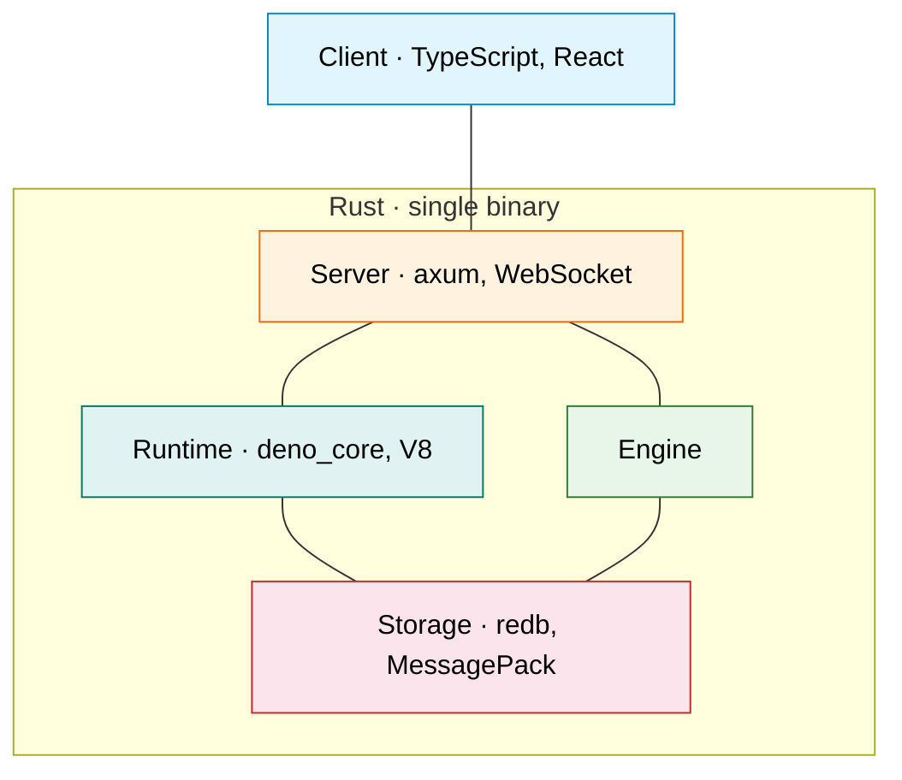
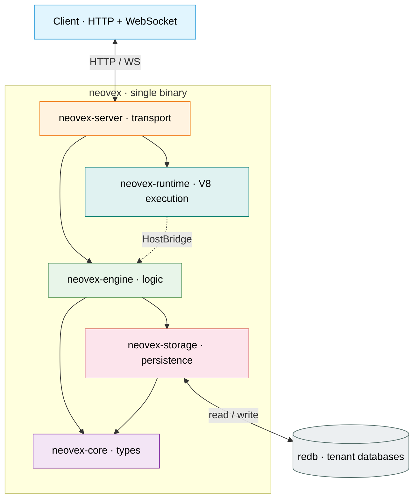
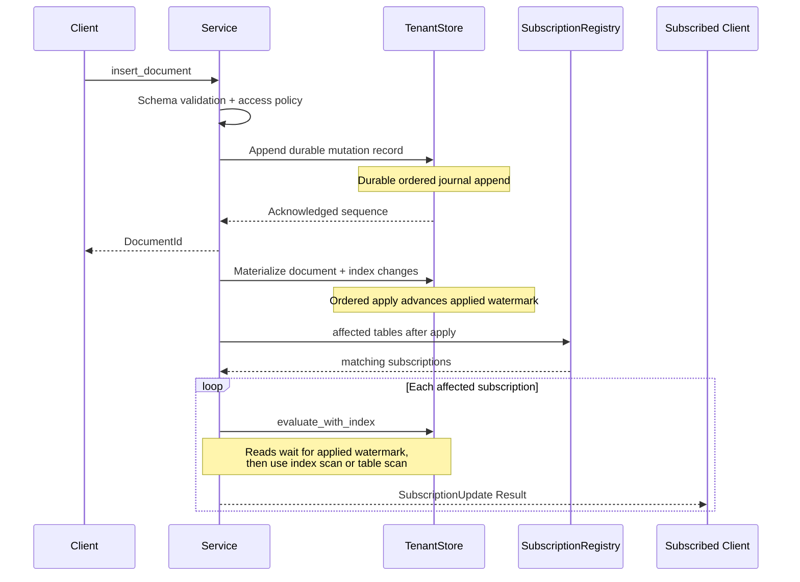
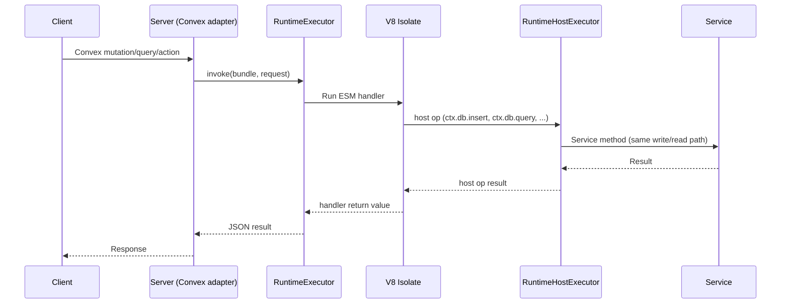
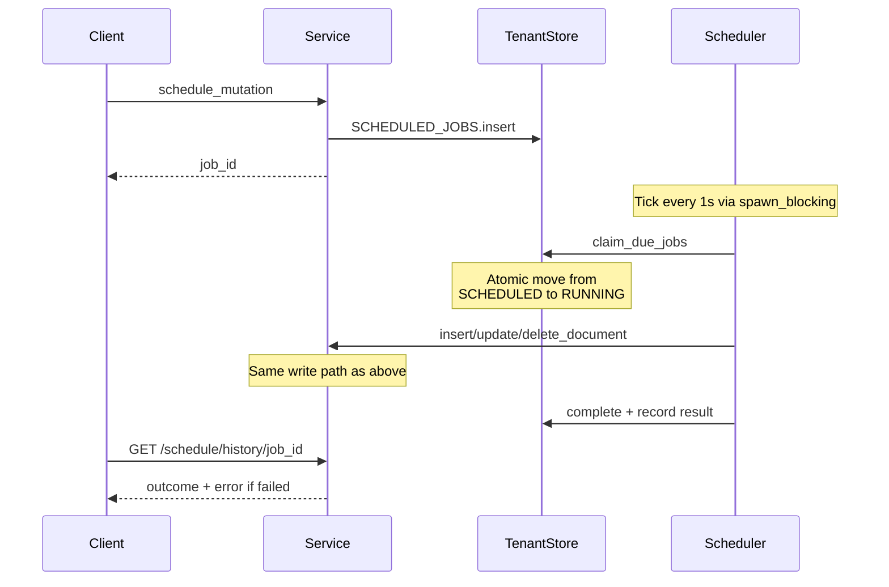

# Architecture

Neovex is a single-binary reactive document database. Clients subscribe to
queries over WebSocket and receive automatic pushes when data changes. Each
tenant gets an isolated embedded database — scaling is by distributing tenants
across nodes, not by sharding within a database.

This document describes the stable architecture. It is intentionally kept at
the level of crates, key types, and data flows — not individual functions.
Keep it in sync with every commit.

---

## Tech Stack

Colors match the overview diagram below. The subgraph communicates the
language; each node lists only the technologies that define that layer. Engine
has no framework — it is pure Rust logic. Cross-cutting dependencies used
across all layers include `tokio` (async runtime), `serde` (serialization),
and `tracing` (observability). Additional dependencies include `ring`
(JWT/JWKS auth), `clap` (CLI), and `reqwest` (JWKS fetching).

---

## Overview

Solid arrows are Cargo dependencies. The dotted arrow is a runtime data flow:
V8 handler code makes host calls that the server's bridge implementation
routes to the engine. At the crate level, the runtime has zero workspace
dependencies.

**neovex-server** is the integration point. It owns all network I/O and
connects the two independent subsystems below it:

- **neovex-engine** is the central coordinator. Every read, write,
  subscription, and scheduled job flows through its `Service` struct. It
  depends on `neovex-storage` for persistence and `neovex-core` for shared
  types. This is the data path: server → engine → storage → core.

- **neovex-runtime** is a standalone V8 execution environment with zero
  workspace dependencies. It defines a `HostBridge` trait that declares what
  host operations a V8 handler can perform (`ctx.db.*`, `ctx.scheduler.*`,
  `ctx.run*`). The server implements that trait in
  `adapters/convex/host_bridge/` by calling into the engine's `Service` — so
  at runtime, V8 handler code reaches the engine, but at the crate level, the
  runtime knows nothing about it. This is dependency inversion: the runtime
  declares what it needs; the server provides it.

The server has two request paths. **Native** requests (Neovex HTTP/WS API) go
directly to async engine methods; read and write paths now await an explicit
async storage boundary that owns the redb blocking work. Durable writes cross
that boundary through `TenantWriteTransaction`, which defines an explicit
pre-commit versus post-commit split: cancellation may abort before redb commit,
but once the durable commit point is crossed the engine returns a committed
result even if the transport disconnects before observing it. **Convex**
requests go to the runtime, which executes a V8 handler; async host operations
inside that handler now await the engine and storage futures directly instead
of bouncing through a Tokio `spawn_blocking(...)` adapter layer.

This leads to a deliberate two-tier logic model. V8 and `deno_core` remain a
first-class execution surface for Convex compatibility, JavaScript portability,
and the existing function-oriented developer model. At the same time, the
long-term Neovex-native surface should keep moving toward schema-driven CRUD,
planner-enforced policy, and, when needed, a database-native WASM plugin ABI
for tightly scoped extensions. WASM is therefore an additive path for Neovex,
not a planned replacement for the Convex compatibility runtime.

When that Neovex-native path lands, it should follow the same broad patterns
used by systems such as PostgREST, Hasura, and Wasmtime: a schema-owned public
API contract, planner-enforced policy, and a typed, capability-scoped plugin
ABI rather than an untyped general escape hatch.

The Convex surface also depends on a build-time pipeline: `packages/codegen`
(Node.js) reads application source and emits a function manifest
(`functions.json`), a runtime ESM bundle (`bundle.mjs`), and an integrity hash
(`bundle.sha256`). The server loads these at startup; the runtime verifies the
hash before every invocation.

The **neovex** facade crate re-exports the public surface of all workspace
crates so embedders depend on a single crate. The **neovex-bin** crate is the
CLI entry point.

---

## Code Map

Each crate has a single responsibility. When looking for where something
lives, use this map. Search for type and function names rather than following
file links (links go stale; symbol search does not).

**`neovex-core`** — Shared types and validation. Zero I/O, zero external deps.

- `types.rs` — `TenantId`, `TableName`, `DocumentId`, `SequenceNumber`, `Timestamp`. All validated on construction (alphanumeric + `_` + `-`, max 128 chars).
- `document.rs` — `Document` struct. Serializes to MessagePack for storage, JSON for wire. System fields `_id` and `_creationTime` added during JSON serialization.
- `mutation.rs` — `Mutation` enum (`Insert`/`Update`/`Delete`),
  `DurableMutationRecord`, `CommitEntry`, `WriteOp`. The durable journal
  records every mutation; `CommitEntry` is the applied compatibility view used
  by existing engine and transport surfaces.
- `query.rs` — `Query`, `Filter`, `FilterOp`, `OrderBy`. Also `PaginatedQuery`, `Cursor`, `Page` for cursor-based pagination.
- `schema.rs` — `Schema`, `TableSchema`, `FieldSchema`, `FieldType`, `IndexDefinition`. Schema is optional per-table. Validation checks required fields and type matching.
- `scheduled.rs` — `ScheduledJob`, `CronJob`, `CronSchedule`, `ScheduledJobResult`. Interval-based cron.
- `error.rs` — `Error` enum with variants mapped to HTTP status codes in the server layer.

**`neovex-storage`** — Persistence layer. One `TenantStore` per tenant redb file, plus a global `UsageStore` for cross-tenant metering.

- `async_storage.rs` — Internal async storage boundary. Defines the redb-backed read and write executors, cooperative cancellation, queued-write admission, and the write outcome model that distinguishes canceled-before-commit from committed results.
- `store.rs` — `TenantStore` wrapping a redb `Database`. Defines 10 redb
  tables plus `TenantWriteTransaction`, journal progress tracking, and
  materialized snapshot-plus-tail rebuild helpers for the authoritative journal
  model.
- `keys.rs` — Key construction for the DOCUMENTS table. Prefix-based range scans for table isolation.
- `index.rs` — Order-preserving value encoding, index key construction, `index_scan_eq`, `index_scan_range`, index maintenance during writes.
- `schema_store.rs` — Schema persistence. `replace_table_schema` atomically updates schema and rebuilds indexes in one transaction.
- `scheduler.rs` — Scheduled job and cron job persistence. `claim_due_jobs` atomically moves due jobs from pending to running. `recover_running_jobs` handles crash recovery.
- `commit_log.rs` — Durable mutation journal serialization and compatibility
  projection back to `CommitEntry`.
- `usage_store.rs` — `UsageStore` backed by a separate redb database (`neovex-control.db`). Tracks monthly active users (MAU) by token identifier with per-month counters.

**`neovex-engine`** — Central coordinator. Every read, write, subscription, and scheduled job flows through the `Service` struct — whether the request originates from native HTTP, WebSocket, the background scheduler, or a runtime host operation.

- `service/mod.rs` — `Service` struct: tenant registry plus the async storage boundary (`RedbStorageEngine`, tenant storage handles, usage storage handle), simulation seams, and scheduler wakeups. Lazy-loads tenants from disk on first access.
- `service/mutations.rs` — `apply_mutation`: schema validation, declarative
  access-policy enforcement, durable journal append, ordered materialization
  into document or index state, and subscription fan-out after the applied
  watermark advances. This is the core write path.
- `service/queries.rs` — `evaluate_with_index`: merges declarative authorization predicates into planning, tries index Eq scan, then range scan, then falls back to table scan. Sync paths call it directly; async read paths route the same planner and evaluator logic through the storage-owned async executor.
- `service/subscriptions.rs` — `subscribe`/`unsubscribe`. Initial evaluation uses the index-aware path and captures principal snapshots plus policy revisions for conservative auth invalidation.
- `service/schema.rs` — Schema CRUD. Setting a schema backfills indexes for existing documents.
- `service/scheduler.rs` — Schedule/cron CRUD. `load_tenants_with_scheduled_work` eagerly loads tenants on startup.
- `service/tenants.rs` — Tenant CRUD and lifecycle management. Create/delete now use async storage-engine control APIs; deletion evicts the tenant from the registry, rejects new work through a tenant-local lifecycle primitive, waits for in-flight operations to drain, then removes the on-disk store.
- `service/usage.rs` — `record_monthly_active_user` and `current_monthly_active_users` — delegates to the global `UsageStore` through the same async storage boundary used elsewhere.
- `tenant.rs` — `TenantRuntime`: holds `Arc<TenantStore>`, async storage
  handles, `SubscriptionRegistry`, `RwLock<Schema>`, a tenant-local
  close-then-drain lifecycle primitive, and per-tenant durable versus applied
  mutation-journal progress. Operation entry uses RAII guards to keep the
  in-flight count correct; sync waiters use a `Condvar`, async waiters use
  `Notify`, and both share the same deleted-plus-active-operations state.
- `evaluator.rs` — Pure functions: `evaluate_query`, `evaluate_paginated`. Filter, sort, limit, cursor decode/encode. No I/O.
- `subscriptions.rs` — `SubscriptionRegistry`: per-tenant in-memory registry. `affected(tables)` returns subscriptions that need re-evaluation.
- `scheduler.rs` — Background loop: `run_scheduler` sleeps until the next due tenant-local scheduled or cron work (or a wakeup notification) and dispatches mutations through the public Service API.

**`neovex-runtime`** — Standalone V8 execution environment with zero workspace dependencies. Defines the `HostBridge` trait for dependency-inverted host integration; the runtime never imports engine or storage types directly.

- `runtime.rs` — `NeovexRuntime` and `ConvexRuntime`: V8 isolate creation, heap/timeout limits, process-global bootstrap snapshot initialization, and the `invoke_bundle_unmanaged` entry point. `RuntimeBundle` holds the ESM source + SHA-256 integrity hash. `InvocationRequest` describes the function name, kind, and args.
- `executor.rs` — `RuntimeExecutor`: a fixed-size worker thread pool that dispatches `InvocationRequest`s to V8 isolates. Each worker owns one current-thread tokio runtime that is reused across jobs. Supports both direct invocation and worker-pool-mediated invocation with cancellation.
- `host_executor.rs` — `RuntimeHostExecutor`: a companion thread pool for synchronous host-side operations (db reads/writes) dispatched from inside V8. Keeps host work off the V8 isolate thread.
- `host.rs` — `HostBridge` trait and `HostCallRequest` struct defining the contract between V8 guest code and Rust host operations (db queries, mutations, scheduler commands, `ctx.run*` delegation).
- `context.rs` — `RuntimeInvocationContext`: per-request metadata (invocation ID, function name, kind, auth identity) threaded through the runtime and host bridge.
- `limits.rs` — `RuntimeLimits` (heap, timeout, max isolates, max nested calls) and `RuntimePolicy` (enforces limits + owns the isolate concurrency semaphore).
- `metrics.rs` — `RuntimeMetrics` / `RuntimeMetricsSnapshot`: live counters for active isolates, queued invocations, worker dispatches, cancellations, timeouts, host ops, and same-isolate nested dispatches.
- `module_loader.rs` — Custom `deno_core` module loader that restricts ESM imports to the bundle root.
- `error.rs` — `NeovexRuntimeError` and `ConvexRuntimeError` with variants for timeout, cancellation, heap exceeded, contract violations, and user-thrown errors.

**`neovex-server`** — Network I/O and integration. Neovex-native routes are the default surface. The Convex adapter is an opt-in layer that owns the runtime executor, the `HostBridge` implementation, auth verification, and the function registry — it is the code that bridges the runtime into the engine.

- `lib.rs` — `build_router` defines the Neovex-native routes. `build_router_with_convex` adds the Convex adapter routes and demos. Variants with `_and_license` accept a `LicenseState`. `serve` starts the axum listener.
- `http/` — Neovex-native HTTP handlers. Read, control, and durable write routes all await async engine methods directly. Write handlers thread request disconnect cancellation to the engine, but post-commit disconnects remain transport-only failures and do not roll back durable writes.
- `ws.rs` — Neovex-native WebSocket upgrade, message loop, and subscription cleanup.
- `license/` — `LicenseState`, `LicenseDocument`, `LicenseSnapshot`, `LicenseEntitlements`. Loads from `--license-file`, `NEOVEX_LICENSE_FILE` env, or `.neovex/license.json`. Supports community, trial, and enterprise tiers. Exposes status at `GET /debug/license/status` including MAU usage.
- `convex/mod.rs` — Convex shim request/response types plus the public Convex support handlers. Owns the `RuntimeExecutor` and `RuntimeHostExecutor` instances.
- `convex/auth/` — Convex auth adapter: OIDC and custom JWT provider config, JWKS key fetching, JWT validation with clock-skew tolerance, and identity extraction for `InvocationAuth`.
- `convex/registry/` and `convex/manifest.rs` — Manifest loading, runtime bundle discovery, function lookup, and Convex support route resolution.
- `convex/host_bridge/` — The `HostBridge` implementation that adapts Neovex engine operations into the contract the runtime expects. Async host-call routes now await real engine or storage futures directly; only inherently synchronous host-side setup stays on the sync bridge path.
- `convex/execution/`, `convex/http_actions/`, `convex/subscriptions/`, and `convex/handlers/` — Shared Convex support execution, HTTP route dispatch, and live subscription plumbing.
- `convex/host_bridge/read_tracking/` — Runtime read-set tracking used by runtime-backed Convex support subscriptions for narrower-than-table-level invalidation.
- `protocol.rs` — Request/response DTOs. `ClientMessage` (Subscribe/Unsubscribe) and `ServerMessage` (SubscriptionResult/Error).
- `state.rs` — `AppState` holds the shared `Service`, optional Convex support registry, and `LicenseState`. `AppError` maps `Error` variants to HTTP status codes.

**`neovex`** — Public facade crate for embedders. Re-exports stable types from `neovex-core`, `neovex-engine`, `neovex-runtime`, `neovex-server`, and `neovex-storage` so downstream consumers depend on a single crate.

**`neovex-bin`** — CLI entry point. Parses `--port`, `--data-dir`, `--convex-app-dir`, `--license-file`, and runtime limit flags (`--runtime-heap-mb`, `--runtime-initial-heap-mb`, `--runtime-timeout-secs`, `--runtime-max-isolates`, `--runtime-max-nested-calls`). Loads tenants with scheduled work, spawns the scheduler, optionally loads the Convex registry and license state, starts the server, handles graceful shutdown.

**`packages/codegen`** — Node.js code generation tool. Reads Convex source files (`convex/*.ts`) and a `convex/schema.ts`, emits `.neovex/convex/functions.json` (named-function manifest), `.neovex/convex/bundle.mjs` (runtime ESM entrypoint), `.neovex/convex/bundle.sha256` (integrity hash), and generated `convex/_generated/` TypeScript (api, server, dataModel, scheduled_functions).

**`packages/convex`** — In-repo Convex compatibility package. Provides `convex/browser` (`ConvexHttpClient`), `convex/react` (`ConvexReactClient`, hooks), `convex/server` (handler wrappers), and `convex/values` (validators). These talk the Neovex Convex-shaped WebSocket/HTTP protocol.

**`neovex-test-support`** — Shared test fixtures (`HttpApiFixture`) for integration tests.

---

## Architecture Invariants

These rules must not be violated. If a change would break one, it requires an
architecture discussion.

1. **`neovex-core` has zero I/O.** It defines types and validation only. If
   you need to read a file or make a network call, it belongs in another crate.

2. **`neovex-runtime` has zero workspace dependencies.** It defines the V8
   execution surface and the `HostBridge` trait. All Neovex-specific
   integration lives in the server's bridge implementation, not in the runtime
   crate.

3. **Durability and visibility are separate, explicit phases.** A mutation is
   acknowledged only after its durable journal record is appended in commit
   order. Read visibility, cache publication, and subscription fan-out happen
   only after ordered materialization updates document and index state and
   advances the applied watermark. Both async and sync serving reads wait for
   that applied watermark before consulting the materialized document or index
   state, and async waits remain cancellable while they are blocked on that
   visibility boundary.

4. **Every mutation — whether from HTTP, WebSocket, the scheduler, or the
   runtime — flows through `Service::apply_mutation`.** There is no separate
   code path for scheduled or runtime-originated mutations. Schema validation
   and subscription fan-out are guaranteed.

5. **Runtime multi-step mutations use an explicit execution unit with
   serializable OCC validation.** Runtime `ctx.db.*`, `ctx.scheduler.*`, and
   direct `ctx.runQuery` or `ctx.runMutation` calls inside a mutation execute
   against a stable read snapshot, stage their writes locally, and commit once
   after validating shared dependency metadata against commits that landed
   after the same applied snapshot sequence they actually read. Repeated
   writes to the same document must collapse to the final logical write before
   commit instead of manufacturing intermediate conflicts.

6. **The evaluator is pure.** `evaluate_query` and `evaluate_paginated` take
   data in, return data out. No I/O, no state, no side effects. The service
   layer handles schema lookup and index selection.

7. **Schema is optional.** A table without a schema accepts any document.
   Setting a schema only adds constraints — it never removes the ability to
   write to a previously schemaless table.

8. **Tenant deletion blocks until in-flight operations complete.**
   `begin_delete()` acquires an exclusive lifecycle lock. `enter_operation()`
   acquires a shared lock. New operations after the `deleted` flag is set
   return `TenantNotFound`.

9. **Runtime bundles are integrity-checked.** The SHA-256 hash of the bundle
   is verified before every invocation. A tampered or stale bundle is rejected.

10. **Runtime host operations go through the same Service path as direct
   calls.** `ctx.db.insert(...)` inside a V8 handler ultimately calls the
   same `Service::apply_mutation` as an HTTP `POST`. No bypass.

---

## Key Data Flows

### Write Path (mutation to subscription push)

### Runtime Bundle Execution Path

### Scheduled Mutation Path

---

## Storage Engine

Each tenant's redb file contains 10 key-value tables:

| Table | Key | Value | Purpose |
|-------|-----|-------|---------|
| `DOCUMENTS` | `table\0doc_id` | msgpack(Document) | Primary document store |
| `INDEXES` | `table\0idx\0encoded_val+doc_id` | empty | Secondary index entries |
| `SCHEMAS` | `table_name` | msgpack(TableSchema) | Per-table schema definitions |
| `COMMIT_LOG` | `sequence (u64)` | msgpack(DurableMutationRecord) | Append-only durable mutation journal. `CommitEntry` reads are a compatibility projection over the logical journal format. |
| `METADATA` | `"next_sequence"` / `"applied_sequence"` | `u64` | Tracks the next durable sequence to allocate and the latest applied read-visible sequence. |
| `SCHEDULED_JOBS` | `run_at(8B)+job_id(16B)` | msgpack(ScheduledJob) | Pending scheduled mutations |
| `RUNNING_SCHEDULED_JOBS` | `job_id(16B)` | msgpack(ScheduledJob) | In-flight jobs (crash recovery) |
| `SCHEDULED_JOB_RESULTS` | `job_id(16B)` | msgpack(Result) | Execution outcomes |
| `SCHEDULED_JOB_EXECUTIONS` | `job_id(16B)` | empty | Dedup guard for crash-replayed jobs |
| `CRON_JOBS` | `cron_name` | msgpack(CronJob) | Recurring job definitions |

The global `neovex-control.db` contains 3 tables for MAU tracking:

| Table | Key | Value | Purpose |
|-------|-----|-------|---------|
| `monthly_active_identities` | `month_prefix\0token_id` | empty | Per-identity dedup |
| `monthly_active_counts` | `month_start_unix_ms (u64)` | msgpack(count) | Monthly counters |
| `monthly_active_last_recorded` | `month_start_unix_ms (u64)` | msgpack(timestamp) | Last-seen timestamps |

### Index Value Encoding

Index keys must sort correctly as raw bytes. Values are encoded with a type
prefix to ensure cross-type ordering (`null < bool < number < string`):

| Type | Tag | Encoding |
|------|-----|----------|
| null | `0x00` | Single byte |
| bool | `0x01` | `+0x00` (false) or `+0x01` (true) |
| number | `0x02` | IEEE 754 bits with sign flip for byte ordering |
| string | `0x03` | UTF-8 with null escaping (`0x00`->`0x00 0xFF`), terminated `0x00 0x00` |

### Query Planning

The evaluator selects the fastest path automatically:

1. **Eq filter on indexed field** — `index_scan_eq`, strips satisfied filter from residual query
2. **Range filters on indexed field** — `index_scan_range`, compiles multiple filters into tightest bounds
3. **Fallback** — full table scan via `scan_table`

All paths apply residual filters, sort, and limit in memory after the scan.

---

## Design Decisions

**Why redb?** Pure Rust, zero FFI, copy-on-write B-trees give free MVCC
snapshots, ACID transactions, and a single-file database per tenant.
Alternatives considered: SQLite (FFI boundary), RocksDB (FFI + complexity),
sled (unmaintained). redb is the simplest correct choice for an embedded
single-writer database. Neovex treats those redb snapshots as the storage
primitive, then layers engine-level serializable OCC on top so read and write
sets can also drive reactive invalidation.

**Why a durable journal instead of a traditional storage WAL?** redb already
provides crash-safe atomic commit, so Neovex does not need a page-level WAL to
make today's writes safe. The next architectural step is a richer logical
ordered history that can drive replay, dependency-aware invalidation, CDC,
streaming, and future replicas. If Neovex later adds a custom write-optimized
materializer such as an LSM-style layer, it should consume that same logical
journal as its log-before-materialization contract. A third-party storage engine
may still keep an internal WAL or journal, but Neovex should avoid inventing a
second application-level durability log when one logical ordered-history
contract can serve the write path, recovery, and downstream consumers.

**Architectural decision: Neovex owns the durable journal.** For this project,
the durable journal is a Neovex-defined logical ordered-history layer built
inside the current redb-based architecture. Agents should not reinterpret Phase
6 as permission to adopt a different storage engine or a generic external log as
the primary design.

This is the right decision for Neovex because:

- the reactive architecture needs logical mutation records, not just a physical
  recovery stream
- dependency-aware invalidation, replay, and future replica consumption all
  need the same tenant-scoped ordered history
- keeping the journal above storage-engine internals preserves freedom to change
  materializers later without redefining the application-level durability
  contract

**The durable journal is now the authoritative per-tenant history.** The
ordered `DurableMutationRecord` stream is the source of truth for replay,
rebuild, and future CDC or replica consumers. Document and index tables remain
an applied materialized view maintained from that history, with
`applied_sequence` defining the snapshot boundary between what is already
materialized and what still lives only in the journal tail.

Materialized snapshot boundaries now carry explicit metadata as well: at
minimum the snapshot format records the applied sequence it materialized
through and the durable head observed at export time. That lets rebuild reject
an incomplete journal tail loudly instead of silently reconstructing only the
applied prefix when a snapshot is taken during apply lag.

**External journal consumers now use the same ordered history contract.** Phase
8A exposes the authoritative journal through tenant-scoped sequence cursors
rather than inventing a second replication log. Consumers read durable
`DurableMutationRecord` pages with at-least-once, duplicate-tolerant replay
semantics: retrying an older cursor replays the same suffix, and later
compaction can invalidate cursors below an explicit cursor floor instead of
silently skipping history.

**Bootstrap is snapshot plus the same stream, not a separate export format.**
Bootstrapping a downstream consumer now returns a materialized snapshot, the
applied sequence to resume after, and the durable cut that bounded the snapshot
export. To reconstruct the same logical state, a consumer restores the
snapshot, then applies streamed journal records with
`resume_after < sequence <= bootstrap_cut`. If newer writes arrive while that
consumer is catching up, they remain part of the same ordered stream and can be
processed after the bootstrap cut without switching formats.

**Replica-local reads are now a validated path, but not the default serving
path.** Neovex now has a narrow read-only `EmbeddedReplica` that bootstraps
from the authoritative snapshot-plus-stream contract, applies the same durable
journal records into a local materialized store, and evaluates queries or
pagination locally against that store. This is an architectural proof point for
edge and embedded read offload, not a change to write authority or subscription
fan-out.

**Replica catch-up synchronizes schema state as well as journal state.** Schema
changes still live outside the durable mutation journal, so replica catch-up
must refresh local schema state even when there are no new durable mutation
records to apply. Replica-local query and pagination evaluation now reuses the
same schema- and principal-aware planning helpers as the live service rather
than treating local replayed documents as sufficient on their own.

**Server-side re-evaluation remains the near-term production path.** The main
server still owns writes, subscription re-evaluation, and pushed results. The
embedded replica work proves that local read evaluation can stay consistent
with the authoritative journal, but it does not replace the server-driven
reactive path yet. Future promotion of replica-local evaluation should build on
this contract rather than bypassing the durable journal or inventing a second
materialization format.

**Committed does not immediately mean read-visible.** The durable journal now
defines commit order and durability, while the serving read path still comes
from applied materialized state. Async mutations acknowledge after the durable
append, but reads, subscriptions, and cache publication wait for
`applied_sequence >= required_sequence` instead of overlaying journal-only
records directly into point reads, scans, subscriptions, or cache lookups.
Rebuild and bootstrap use a materialized snapshot plus journal tail rather than
inventing a second serving read path. That keeps visibility rules explicit,
preserves one serving read path, and avoids introducing a second
correctness-critical overlay engine too early.

**Durable journal integrity hashes use a canonical payload shape.** Journal
records are now hashed over a stable serialized representation that keeps
optional fields explicit, so a normal serde or MessagePack round-trip cannot
change the integrity payload shape and falsely mark an untampered durable
record as corrupt.

**What should guide the durable journal design?** Use external systems as
reference implementations, not as accidental architecture replacements. The
current direction is:

- `docs/research/tigerbeetle-code-reference.md` for the Neovex-specific code
  reading map into TigerBeetle
- TigerBeetle as the main reference for durability discipline, recovery
  semantics, and deterministic test expectations
- OpenRaft log-storage invariants as a reference for append ordering, flush
  notification, and no-hole sequence behavior
- storage-engine WALs such as RocksDB or Fjall as references for batching,
  recovery, and materialization lifecycle, but not as direct justification to
  replace the Phase 6 journal with a storage-engine swap

**Deterministic compaction is now in roadmap scope.** If Neovex adds a custom
journal-driven materializer after Phase 6, it should use deterministic
compaction principles inspired by TigerBeetle and ship first in shadow mode
against the redb-backed serving path. Promotion onto any serving path requires
replay, corruption, and shadow-parity testing rather than benchmark-only
confidence.

**The first custom materializer remains shadow-only and checkpoint-driven.**
Phase 9A introduces a storage-owned `ShadowMaterializer` that rebuilds from an
explicit `MaterializedJournalSnapshot` plus an ordered durable-journal suffix,
then maintains a versioned manifest with the checkpoint sequence, current
sequence, buffered tail length, compaction count, and configured compaction
threshold. Recovery validates those manifest fields against the checkpoint
boundary before replaying the pending suffix again.

**Compaction is triggered by explicit journal state, not time.** The current
shadow materializer compacts only when its buffered durable-journal tail reaches
the configured record-count threshold. A compaction rewrites the current
materialized view into a new checkpoint snapshot, advances the checkpoint
sequence to the current sequence, and clears the pending tail. Given the same
checkpoint snapshot, journal suffix, and threshold configuration, rebuild and
compaction converge on the same logical state without relying on timers or
background races.

**redb remains the serving oracle while the materializer proves parity.** The
shadow materializer is not on a live serving path yet. The current role is to
replay authoritative `DurableMutationRecord`s and compare query or pagination
results against the existing redb-backed service path. Any future serving
promotion should build on that shadow-parity evidence rather than bypassing the
authoritative journal or weakening the redb correctness path.

**Shadow parity now covers planner-aware, schema-aware external behavior.** The
engine's shadow-query harness routes replayed documents through the same
schema-, principal-, and planner-aware evaluation helpers as the live service,
including residual-query cursor semantics for indexed pagination. That keeps the
shadow evidence focused on externally visible behavior rather than only matching
raw document sets.

**Serving promotion now requires a robustness harness, not just parity on clean
inputs.** The current shadow-materializer bar includes replay after interrupted
materialization, replay after interrupted compaction, loud rejection of
corrupted journal or manifest inputs, and seeded rebuild sequences that compare
shadow results against the redb-backed oracle across multiple generated
histories. This is the minimum evidence floor before any query class is allowed
to read from a custom materializer instead of redb.

**Explicit non-decisions.**

- OpenRaft is not the local journal implementation; it solves a different
  distributed-consensus problem
- Fjall, RocksDB, or another LSM engine are not Phase 6 substitutions for redb
- a thin generic append-only log crate is not enough on its own because Neovex
  needs logical replay payloads, dependency metadata, visibility rules, and
  tenant-scoped recovery semantics

**Why keep V8 and still leave room for WASM?** The research guide is right
that schema-generated APIs and WASM plugins are attractive for a database: WASM
is language-agnostic, sandbox-friendly, and a better fit for tightly bounded
engine-local extensions such as policies, triggers, or deterministic compute.
But Neovex also has an explicit Convex-compatibility goal today, and that goal
is best served by keeping the V8 and `deno_core` runtime first-class. The
project decision is therefore:

- keep V8 for the Convex compatibility surface and JavaScript function model
- keep the engine and planner language-agnostic
- treat future WASM support as a complementary Neovex-native extension path,
  not a forced replacement for the compatibility runtime

TigerBeetle is not the reference system for this layer. For runtime surface,
schema API design, and extension boundaries, the better references remain
Convex, Hasura, PostgREST, and Wasmtime.

**Why database-per-tenant?** Tenant boundaries are scaling boundaries. Each
tenant is a self-contained redb file. No distributed transactions, no
cross-tenant interference, trivial data isolation. Horizontal scaling (future)
means distributing tenant files across nodes, not sharding within a database.

**Why `std::sync::RwLock` instead of `tokio::sync::RwLock`?** redb is still a
synchronous engine, but read paths now enter it through explicit async storage
executors that acquire lifecycle and schema guards inside the blocking storage
task instead of holding tokio locks across awaits. Using `std::sync::RwLock`
for tenant registry, schema, and lifecycle state keeps those critical sections
small and lets the storage boundary control where blocking actually happens.

**Why table-level subscription invalidation?** A write to any row in a table
triggers re-evaluation of all subscriptions on that table — even if the
subscription's filter would exclude the changed row. This is coarse but
simple. Index-accelerated re-evaluation makes each re-evaluation fast.
Runtime-backed subscriptions use read-set tracking to narrow this: they track
returned document IDs and visible-window boundaries so unrelated writes can be
skipped. Full filter-level dependency tracking for non-runtime subscriptions
is a future optimization.

**Why no `Running` state for scheduled jobs?** The scheduler uses a two-phase
pattern: pending (SCHEDULED_JOBS) and running (RUNNING_SCHEDULED_JOBS). If
the server crashes mid-execution, `recover_running_jobs` on startup moves
orphaned jobs back to pending. This avoids the problem of jobs stuck in a
`Running` state that nobody is executing.

**Why execute scheduled mutations through the public Service API?** The
scheduler calls `insert_document`/`update_document`/`delete_document` — the
same methods HTTP handlers use. This guarantees schema validation, index
maintenance, and subscription fan-out happen for scheduled mutations without
any special code path.

**Why a dedicated thread pool for V8?** V8 isolates are not `Send` — they
must run on the thread that created them. The `RuntimeExecutor` spawns a
fixed-size pool of OS threads, each creating a per-job current-thread tokio
runtime. This keeps V8 off the main async executor. The companion
`RuntimeHostExecutor` runs synchronous host-side operations (db reads/writes
triggered by `ctx.db.*` calls) on a separate thread pool so the V8 thread is
not blocked by Rust I/O.

**Why dependency inversion for the runtime?** The runtime crate has zero
workspace dependencies so it can be tested, fuzzed, and evolved independently.
The `HostBridge` trait is the only contract between V8 guest code and the host.
The server provides the implementation. This means changes to the engine's
internals never require changes to the runtime, and vice versa.

**Why a separate usage database?** MAU tracking is global (not per-tenant),
so it lives in a dedicated `neovex-control.db` redb file managed by
`UsageStore`. This avoids coupling usage metering to any single tenant's
lifecycle.

---

## Cross-Cutting Concerns

**Concurrency.** `Service` uses `std::sync::RwLock` for the tenant registry.
`TenantRuntime` uses `std::sync::RwLock` for schema plus a tenant-local
close-then-drain lifecycle primitive for operation admission and deletion
coordination. redb enforces single-writer per database. Read and control paths
enter storage through per-tenant async executors that preserve multiple
concurrent readers with semaphore-based admission while still providing
cooperative cancellation. Durable writes use a separate per-tenant async write
executor with an explicit commit point: cancellation is re-checked
immediately before redb commit, while post-commit cancellation is reported as a
transport concern instead of rewriting the engine result. Runtime-backed async
host calls await those engine or storage futures directly instead of wrapping
them in an extra blocking task. The scheduler loop sleeps until the next due
work or a wakeup notification. The `RuntimeExecutor` runs V8 on dedicated OS
threads with worker-local current-thread tokio runtimes. The `RuntimeHostExecutor`
runs host-side sync work on a separate thread pool. An isolate concurrency
semaphore caps the number of simultaneous V8 invocations.

**Error handling.** All fallible operations return `neovex_core::Result<T>`.
Runtime errors use `NeovexRuntimeError` with variants for timeout,
cancellation, heap limits, and user-thrown exceptions. The server maps error
variants to HTTP status codes in one place (`state.rs`). Subscription
re-evaluation errors are logged and sent to the client as
`SubscriptionUpdate::Error` — they do not crash the server or abort the
mutation that triggered them.

**Licensing.** `LicenseState` is loaded once at startup and threaded through
`AppState`. The community tier is the default (no file needed). Trial and
enterprise tiers are loaded from a JSON license file. The
`GET /debug/license/status` endpoint exposes the current license kind, status,
entitlements, warnings, and MAU usage.

**Auth.** Authentication and authorization are separate architecture concerns.
The Convex adapter layer supports OIDC and custom JWT providers via
`convex/auth/`. JWT validation uses `ring` for signature verification with JWKS
key fetching and clock-skew tolerance, and validated identities are passed to
runtime handlers as `InvocationAuth`. Neovex-native routes still do not
prescribe one built-in transport authentication mechanism. Authorization now
lives in the engine and planner as declarative schema-level policy so reads,
writes, subscriptions, and runtime host calls share one enforcement model. In
other words: adapters authenticate and normalize principals; the engine
authorizes data access. Live subscriptions capture both a principal snapshot
and a policy revision, and a policy or principal-context change must trigger
revalidation or teardown before more data is delivered.

**Testing.** Unit tests live in each crate's `tests.rs`. Integration tests
(HTTP + WebSocket end-to-end) live in `neovex-server/tests/reactive_loop.rs`.
Shared fixtures live in `neovex-test-support`. The `TenantStore::create_in_memory()`
and `UsageStore::create_in_memory()` constructors enable fast storage tests
without disk I/O. The roadmap also commits Neovex to stronger deterministic
simulation seams for new durability-critical subsystems: clock, journal,
checkpoint, and fault-injection boundaries should become swappable and
seed-reproducible as journal, materializer, and OCC work lands.

The first concrete seam layer now lives in `neovex-storage::simulation`.
`Clock` and `FaultInjector` are production-owned interfaces, not ad hoc test
helpers. `TenantStore::*_with_simulation(...)` and `Service::new_with_simulation(...)`
accept deterministic implementations, storage commit visibility exposes a
named fault point, and engine scheduler tests can advance time without
wall-clock sleeps. Later journal, checkpoint, and compaction work should
extend these same seam types instead of inventing parallel harness APIs.

The shared `DeterministicHarness` now also lives on that same seam layer rather
than in a higher-level test-only island. It carries explicit scenario metadata
(`name`, `seed`), supports scripted or seeded fault schedules, and exposes
named cancellation, disconnect, and restart markers so storage, engine, and
server tests can share one reproducible scenario vocabulary. `ServiceFixture`
also has a `new_with_harness(...)` helper so higher layers can consume the same
deterministic harness without re-specifying clock and fault plumbing in every
test.

That same simulation layer now also owns the first generated-history oracle
slice. `GeneratedTaskHistory` models logical-slot insert/update/delete
workloads, exposes canonical filtered query and paginated-query builders, and
ships sync plus async replay helpers so higher layers do not have to rewrite
scenario logic per surface. The current verification pass replays the same
seeded history across `TenantStore`, engine `Service`, native HTTP,
shadow-materializer query evaluation, and embedded-replica reads, then checks
final state plus query/pagination behavior against one local model. This is
still only the first workload family, but it moves Neovex from hand-authored
parity examples toward seed-reproducible multi-surface properties.

The same module now also carries recovery-oriented restart scheduling via
`ScriptedRestartSchedule`, `RestartBoundary`, and `RestartPoint`. Those types
give storage and engine tests one shared way to describe restart boundaries
such as durable-append-before-apply, scheduler claim, and scheduler completion.
The current recovery slice uses that vocabulary for repeated journal recovery
campaigns that verify authoritative convergence plus shadow rebuild parity
after restarts, and for scheduler campaigns that verify claimed work is
recovered without double-applying completed jobs across repeated service
reloads.

`neovex-test-support` now complements that shared scenario vocabulary with a
reusable `BlockingFaultInjector` for adversarial server tests. The current
transport/runtime liveness slice uses it to pause the authoritative write path
after durable append but before apply, drop and re-establish a WebSocket
subscription under that lag, and then prove the reconnected subscription both
catches up and resumes reactive pushes once the fault is released. The same
verification pass also stamps runtime cancellation campaigns with shared
scenario metadata and proves queued plus in-flight request drops recover into
fresh exactly-once work once isolate pressure clears.

The first external Convex semantic oracle now lives in
`packages/convex/src/differential.mjs`. It reuses one shared messages fixture
app, can start an official local Convex deployment automatically from a nearby
`convex-backend` checkout, and compares Neovex against the supported Convex
subset across mutations, queries, manual pagination, and subscriptions. The
runner compares named semantic slices independently so one mismatch does not
hide the rest of the corpus.

Closing that external differential loop also tightened the Convex adapter
itself. `@neovex/codegen` now treats imported server validators such as
`paginationOptsValidator` as real parse-time bindings, Convex app schema
manifests bootstrap Neovex table schemas when new tenants are created under a
Convex app, and runtime `ctx.db.query(...).paginate(...)` preserves the
official manual-pagination contract where a full non-empty terminal page still
returns a continuation cursor until the next call proves exhaustion.

Neovex now also has its first online trust-but-verify path for authoritative
and derived state. `Service::verify_consistency_async(...)` captures one
durable bootstrap cut, rebuilds an authoritative in-memory projection from the
raw materialized snapshot plus journal suffix, then compares that projection
against a shadow-materializer replay and an embedded replica built from the
same inputs. The report fingerprints each surface canonically and records the
first deterministic diff path per failed comparison instead of relying on
opaque deep-equality errors. Raw bootstrap metadata is checked separately so
applied-lag snapshots are validated as metadata invariants rather than being
misreported as divergence. Operators can request that report through
`GET /debug/tenants/{tenant_id}/consistency`.

The harness also now has an operational seed corpus rather than only ad hoc
scenario constructors. `neovex-storage::simulation` defines named generated-
history seeds for explicit `pr` and `nightly` modes, and the failure context
for those corpus runs prints a one-command repro that pins the exact named case
through `NEOVEX_VERIFY_CASE`. CI now runs the focused PR corpus separately from
the heavier scheduled nightly corpus, and local entrypoints live in
`scripts/verification-harness.sh` plus the matching `make verify-harness-*`
targets.

**Serialization.** MessagePack (via `rmp-serde`) for storage. JSON (via
`serde_json`) for HTTP and WebSocket wire format. Documents carry both
representations: `to_msgpack()` for disk, `to_json()` for clients.

**Runtime observability.** When Convex support is enabled, the
`GET /debug/runtime/metrics` endpoint exposes live executor/runtime counters:
active isolates, queued invocations, worker dispatches, cancellations,
timeouts, same-isolate nested dispatches, and cross-isolate fallback
dispatches. This endpoint is not available in the native-only router.
