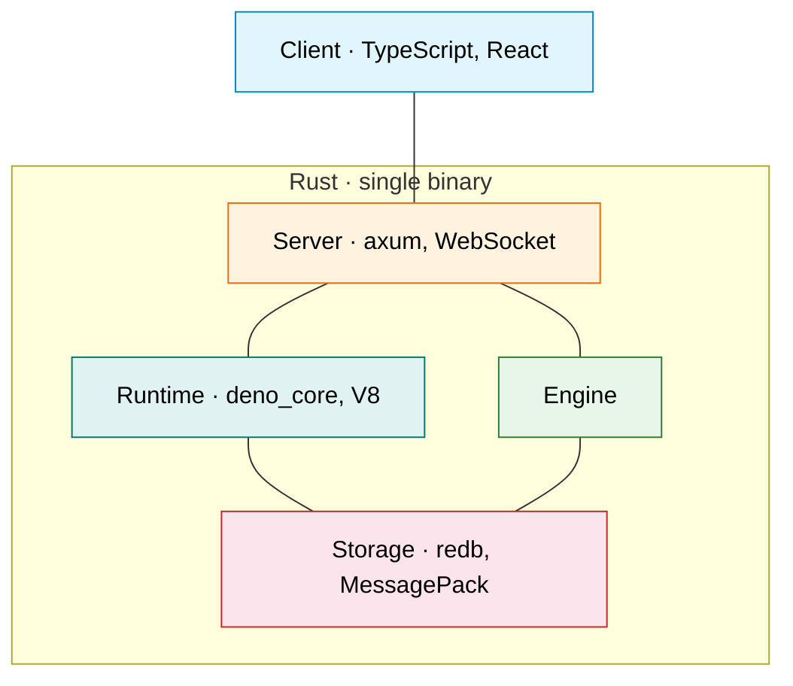
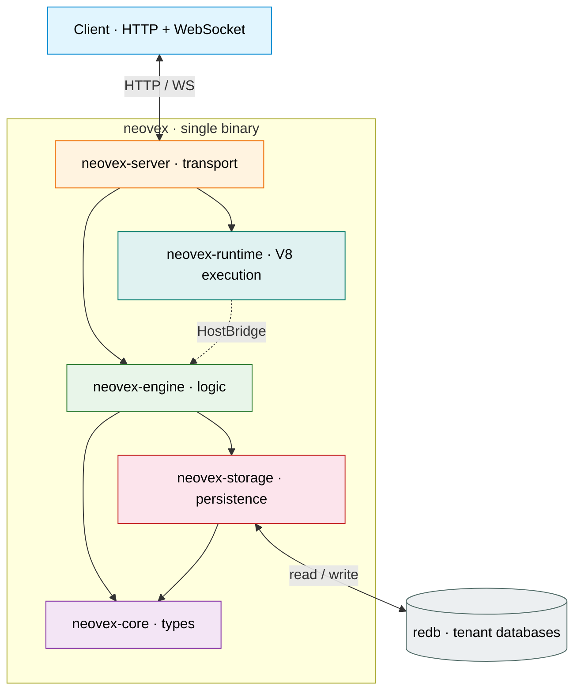
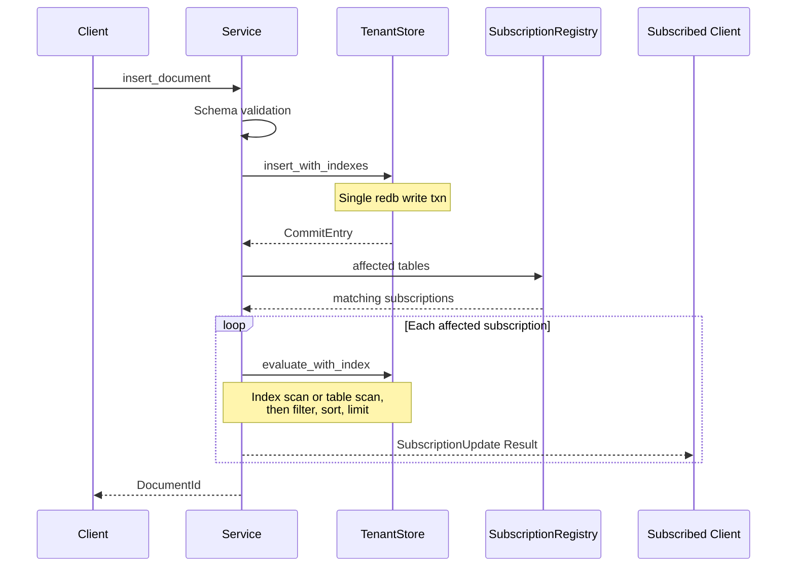
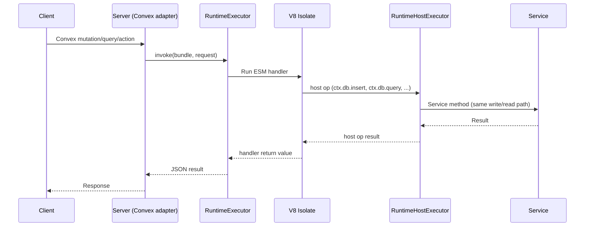
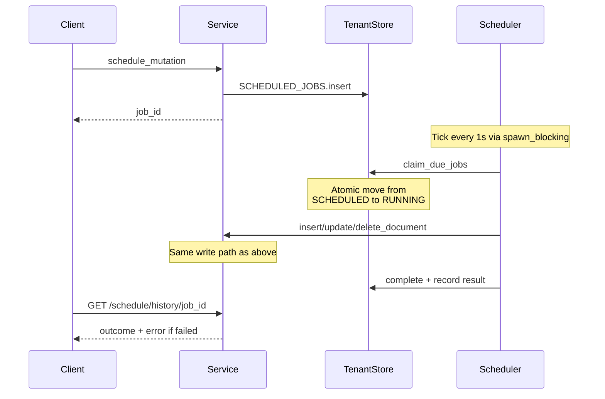

# Architecture

Neovex is a single-binary reactive document database. Clients subscribe to
queries over WebSocket and receive automatic pushes when data changes. Each
tenant gets an isolated embedded database — scaling is by distributing tenants
across nodes, not by sharding within a database.

This document describes the stable architecture. It is intentionally kept at
the level of crates, key types, and data flows — not individual functions.
Keep it in sync with every commit.

---

## Tech Stack

Colors match the overview diagram below. The subgraph communicates the
language; each node lists only the technologies that define that layer. Engine
has no framework — it is pure Rust logic. Cross-cutting dependencies used
across all layers include `tokio` (async runtime), `serde` (serialization),
and `tracing` (observability). Additional dependencies include `ring`
(JWT/JWKS auth), `clap` (CLI), and `reqwest` (JWKS fetching).

---

## Overview

Solid arrows are Cargo dependencies. The dotted arrow is a runtime data flow:
V8 handler code makes host calls that the server's bridge implementation
routes to the engine. At the crate level, the runtime has zero workspace
dependencies.

**neovex-server** is the integration point. It owns all network I/O and
connects the two independent subsystems below it:

- **neovex-engine** is the central coordinator. Every read, write,
  subscription, and scheduled job flows through its `Service` struct. It
  depends on `neovex-storage` for persistence and `neovex-core` for shared
  types. This is the data path: server → engine → storage → core.

- **neovex-runtime** is a standalone V8 execution environment with zero
  workspace dependencies. It defines a `HostBridge` trait that declares what
  host operations a V8 handler can perform (`ctx.db.*`, `ctx.scheduler.*`,
  `ctx.run*`). The server implements that trait in `runtime_bridge.rs` by
  calling into the engine's `Service` — so at runtime, V8 handler code reaches
  the engine, but at the crate level, the runtime knows nothing about it. This
  is dependency inversion: the runtime declares what it needs; the server
  provides it.

The server has two request paths. **Native** requests (Neovex HTTP/WS API) go
directly to the engine via `spawn_blocking`. **Convex** requests go to the
runtime, which executes a V8 handler; host operations inside that handler flow
back through the bridge into the engine.

This leads to a deliberate two-tier logic model. V8 and `deno_core` remain a
first-class execution surface for Convex compatibility, JavaScript portability,
and the existing function-oriented developer model. At the same time, the
long-term Neovex-native surface should keep moving toward schema-driven CRUD,
planner-enforced policy, and, when needed, a database-native WASM plugin ABI
for tightly scoped extensions. WASM is therefore an additive path for Neovex,
not a planned replacement for the Convex compatibility runtime.

When that Neovex-native path lands, it should follow the same broad patterns
used by systems such as PostgREST, Hasura, and Wasmtime: a schema-owned public
API contract, planner-enforced policy, and a typed, capability-scoped plugin
ABI rather than an untyped general escape hatch.

The Convex surface also depends on a build-time pipeline: `packages/codegen`
(Node.js) reads application source and emits a function manifest
(`functions.json`), a runtime ESM bundle (`bundle.mjs`), and an integrity hash
(`bundle.sha256`). The server loads these at startup; the runtime verifies the
hash before every invocation.

The **neovex** facade crate re-exports the public surface of all workspace
crates so embedders depend on a single crate. The **neovex-bin** crate is the
CLI entry point.

---

## Code Map

Each crate has a single responsibility. When looking for where something
lives, use this map. Search for type and function names rather than following
file links (links go stale; symbol search does not).

**`neovex-core`** — Shared types and validation. Zero I/O, zero external deps.

- `types.rs` — `TenantId`, `TableName`, `DocumentId`, `SequenceNumber`, `Timestamp`. All validated on construction (alphanumeric + `_` + `-`, max 128 chars).
- `document.rs` — `Document` struct. Serializes to MessagePack for storage, JSON for wire. System fields `_id` and `_creationTime` added during JSON serialization.
- `mutation.rs` — `Mutation` enum (`Insert`/`Update`/`Delete`), `CommitEntry`, `WriteOp`. The commit log records every mutation.
- `query.rs` — `Query`, `Filter`, `FilterOp`, `OrderBy`. Also `PaginatedQuery`, `Cursor`, `Page` for cursor-based pagination.
- `schema.rs` — `Schema`, `TableSchema`, `FieldSchema`, `FieldType`, `IndexDefinition`. Schema is optional per-table. Validation checks required fields and type matching.
- `scheduled.rs` — `ScheduledJob`, `CronJob`, `CronSchedule`, `ScheduledJobResult`. Interval-based cron.
- `error.rs` — `Error` enum with variants mapped to HTTP status codes in the server layer.

**`neovex-storage`** — Persistence layer. One `TenantStore` per tenant redb file, plus a global `UsageStore` for cross-tenant metering.

- `store.rs` — `TenantStore` wrapping a redb `Database`. Defines 10 redb tables. CRUD operations, commit log, metadata.
- `keys.rs` — Key construction for the DOCUMENTS table. Prefix-based range scans for table isolation.
- `index.rs` — Order-preserving value encoding, index key construction, `index_scan_eq`, `index_scan_range`, index maintenance during writes.
- `schema_store.rs` — Schema persistence. `replace_table_schema` atomically updates schema and rebuilds indexes in one transaction.
- `scheduler.rs` — Scheduled job and cron job persistence. `claim_due_jobs` atomically moves due jobs from pending to running. `recover_running_jobs` handles crash recovery.
- `commit_log.rs` — Commit log append and read operations.
- `usage_store.rs` — `UsageStore` backed by a separate redb database (`neovex-control.db`). Tracks monthly active users (MAU) by token identifier with per-month counters.

**`neovex-engine`** — Central coordinator. Every read, write, subscription, and scheduled job flows through the `Service` struct — whether the request originates from native HTTP, WebSocket, the background scheduler, or a runtime host operation.

- `service/mod.rs` — `Service` struct: `data_dir` + `RwLock<HashMap<TenantId, Arc<TenantRuntime>>>` + `Arc<UsageStore>`. Lazy-loads tenants from disk on first access.
- `service/mutations.rs` — `apply_mutation`: schema validation, index-aware storage write, commit log append, subscription fan-out. This is the core write path.
- `service/queries.rs` — `evaluate_with_index`: tries index Eq scan, then range scan, then falls back to table scan. Used by queries, pagination, and subscription re-evaluation.
- `service/subscriptions.rs` — `subscribe`/`unsubscribe`. Initial evaluation uses the index-aware path.
- `service/schema.rs` — Schema CRUD. Setting a schema backfills indexes for existing documents.
- `service/scheduler.rs` — Schedule/cron CRUD. `load_tenants_with_scheduled_work` eagerly loads tenants on startup.
- `service/tenants.rs` — Tenant CRUD and lifecycle management.
- `service/usage.rs` — `record_monthly_active_user` and `current_monthly_active_users` — delegates to the global `UsageStore` for MAU tracking.
- `tenant.rs` — `TenantRuntime`: holds `Arc<TenantStore>`, `SubscriptionRegistry`, `RwLock<Schema>`, and lifecycle guards (`enter_operation`/`begin_delete`).
- `evaluator.rs` — Pure functions: `evaluate_query`, `evaluate_paginated`. Filter, sort, limit, cursor decode/encode. No I/O.
- `subscriptions.rs` — `SubscriptionRegistry`: per-tenant in-memory registry. `affected(tables)` returns subscriptions that need re-evaluation.
- `scheduler.rs` — Background loop: `run_scheduler` ticks every 1 second via `spawn_blocking`. Dispatches mutations through the public Service API.

**`neovex-runtime`** — Standalone V8 execution environment with zero workspace dependencies. Defines the `HostBridge` trait for dependency-inverted host integration; the runtime never imports engine or storage types directly.

- `runtime.rs` — `NeovexRuntime` and `ConvexRuntime`: V8 isolate creation, heap/timeout limits, `invoke_bundle_unmanaged` entry point. `RuntimeBundle` holds the ESM source + SHA-256 integrity hash. `InvocationRequest` describes the function name, kind, and args.
- `executor.rs` — `RuntimeExecutor`: a fixed-size worker thread pool that dispatches `InvocationRequest`s to V8 isolates. Workers build a per-job current-thread tokio runtime. Supports both direct invocation and worker-pool-mediated invocation with cancellation.
- `host_executor.rs` — `RuntimeHostExecutor`: a companion thread pool for synchronous host-side operations (db reads/writes) dispatched from inside V8. Keeps host work off the V8 isolate thread.
- `host.rs` — `HostBridge` trait and `HostCallRequest` struct defining the contract between V8 guest code and Rust host operations (db queries, mutations, scheduler commands, `ctx.run*` delegation).
- `context.rs` — `RuntimeInvocationContext`: per-request metadata (invocation ID, function name, kind, auth identity) threaded through the runtime and host bridge.
- `limits.rs` — `RuntimeLimits` (heap, timeout, max isolates, max nested calls) and `RuntimePolicy` (enforces limits + owns the isolate concurrency semaphore).
- `metrics.rs` — `RuntimeMetrics` / `RuntimeMetricsSnapshot`: live counters for active isolates, queued invocations, worker dispatches, cancellations, timeouts, host ops, and same-isolate nested dispatches.
- `module_loader.rs` — Custom `deno_core` module loader that restricts ESM imports to the bundle root.
- `error.rs` — `NeovexRuntimeError` and `ConvexRuntimeError` with variants for timeout, cancellation, heap exceeded, contract violations, and user-thrown errors.

**`neovex-server`** — Network I/O and integration. Neovex-native routes are the default surface. The Convex adapter is an opt-in layer that owns the runtime executor, the `HostBridge` implementation, auth verification, and the function registry — it is the code that bridges the runtime into the engine.

- `lib.rs` — `build_router` defines the Neovex-native routes. `build_router_with_convex` adds the Convex adapter routes and demos. Variants with `_and_license` accept a `LicenseState`. `serve` starts the axum listener.
- `http.rs` — Neovex-native HTTP handlers. They delegate to `spawn_blocking(|| service.method())`.
- `ws.rs` — Neovex-native WebSocket upgrade, message loop, and subscription cleanup.
- `license.rs` — `LicenseState`, `LicenseDocument`, `LicenseSnapshot`, `LicenseEntitlements`. Loads from `--license-file`, `NEOVEX_LICENSE_FILE` env, or `.neovex/license.json`. Supports community, trial, and enterprise tiers. Exposes status at `GET /debug/license/status` including MAU usage.
- `convex/mod.rs` — Convex shim request/response types plus the public Convex support handlers. Owns the `RuntimeExecutor` and `RuntimeHostExecutor` instances.
- `convex/auth.rs` — Convex auth adapter: OIDC and custom JWT provider config, JWKS key fetching, JWT validation with clock-skew tolerance, and identity extraction for `InvocationAuth`.
- `convex/registry.rs` — Manifest loading, runtime bundle discovery, function lookup, and Convex support route resolution.
- `convex/runtime_bridge.rs` — The `HostBridge` implementation that adapts Neovex engine operations into the contract the runtime expects.
- `convex/dispatch.rs`, `http_actions.rs`, `subscriptions.rs` — Shared Convex support execution, HTTP route dispatch, and live subscription plumbing.
- `convex/runtime_reads.rs` — Runtime read-set tracking used by runtime-backed Convex support subscriptions for narrower-than-table-level invalidation.
- `protocol.rs` — Request/response DTOs. `ClientMessage` (Subscribe/Unsubscribe) and `ServerMessage` (SubscriptionResult/Error).
- `state.rs` — `AppState` holds the shared `Service`, optional Convex support registry, and `LicenseState`. `AppError` maps `Error` variants to HTTP status codes.

**`neovex`** — Public facade crate for embedders. Re-exports stable types from `neovex-core`, `neovex-engine`, `neovex-runtime`, `neovex-server`, and `neovex-storage` so downstream consumers depend on a single crate.

**`neovex-bin`** — CLI entry point. Parses `--port`, `--data-dir`, `--convex-app-dir`, `--license-file`, and runtime limit flags (`--runtime-heap-mb`, `--runtime-initial-heap-mb`, `--runtime-timeout-secs`, `--runtime-max-isolates`, `--runtime-max-nested-calls`). Loads tenants with scheduled work, spawns the scheduler, optionally loads the Convex registry and license state, starts the server, handles graceful shutdown.

**`packages/codegen`** — Node.js code generation tool. Reads Convex source files (`convex/*.ts`) and a `convex/schema.ts`, emits `.neovex/convex/functions.json` (named-function manifest), `.neovex/convex/bundle.mjs` (runtime ESM entrypoint), `.neovex/convex/bundle.sha256` (integrity hash), and generated `convex/_generated/` TypeScript (api, server, dataModel, scheduled_functions).

**`packages/convex`** — In-repo Convex compatibility package. Provides `convex/browser` (`ConvexHttpClient`), `convex/react` (`ConvexReactClient`, hooks), `convex/server` (handler wrappers), and `convex/values` (validators). These talk the Neovex Convex-shaped WebSocket/HTTP protocol.

**`neovex-test-support`** — Shared test fixtures (`HttpApiFixture`) for integration tests.

---

## Architecture Invariants

These rules must not be violated. If a change would break one, it requires an
architecture discussion.

1. **`neovex-core` has zero I/O.** It defines types and validation only. If
   you need to read a file or make a network call, it belongs in another crate.

2. **`neovex-runtime` has zero workspace dependencies.** It defines the V8
   execution surface and the `HostBridge` trait. All Neovex-specific
   integration lives in the server's bridge implementation, not in the runtime
   crate.

3. **Document write + index update + commit log append are a single redb
   transaction.** Never commit a document without its index entries. Never
   append a commit without the document write.

4. **Every mutation — whether from HTTP, WebSocket, the scheduler, or the
   runtime — flows through `Service::apply_mutation`.** There is no separate
   code path for scheduled or runtime-originated mutations. Schema validation
   and subscription fan-out are guaranteed.

5. **The evaluator is pure.** `evaluate_query` and `evaluate_paginated` take
   data in, return data out. No I/O, no state, no side effects. The service
   layer handles schema lookup and index selection.

6. **Schema is optional.** A table without a schema accepts any document.
   Setting a schema only adds constraints — it never removes the ability to
   write to a previously schemaless table.

7. **Tenant deletion blocks until in-flight operations complete.**
   `begin_delete()` acquires an exclusive lifecycle lock. `enter_operation()`
   acquires a shared lock. New operations after the `deleted` flag is set
   return `TenantNotFound`.

8. **Runtime bundles are integrity-checked.** The SHA-256 hash of the bundle
   is verified before every invocation. A tampered or stale bundle is rejected.

9. **Runtime host operations go through the same Service path as direct
   calls.** `ctx.db.insert(...)` inside a V8 handler ultimately calls the
   same `Service::apply_mutation` as an HTTP `POST`. No bypass.

---

## Key Data Flows

### Write Path (mutation to subscription push)

### Runtime Bundle Execution Path

### Scheduled Mutation Path

---

## Storage Engine

Each tenant's redb file contains 10 key-value tables:

| Table | Key | Value | Purpose |
|-------|-----|-------|---------|
| `DOCUMENTS` | `table\0doc_id` | msgpack(Document) | Primary document store |
| `INDEXES` | `table\0idx\0encoded_val+doc_id` | empty | Secondary index entries |
| `SCHEMAS` | `table_name` | msgpack(TableSchema) | Per-table schema definitions |
| `COMMIT_LOG` | `sequence (u64)` | msgpack(CommitEntry) | Append-only mutation log. Today this is a transactional side effect; the roadmap grows it into a richer durable logical journal. |
| `METADATA` | `"next_sequence"` | `u64` | Sequence counter |
| `SCHEDULED_JOBS` | `run_at(8B)+job_id(16B)` | msgpack(ScheduledJob) | Pending scheduled mutations |
| `RUNNING_SCHEDULED_JOBS` | `job_id(16B)` | msgpack(ScheduledJob) | In-flight jobs (crash recovery) |
| `SCHEDULED_JOB_RESULTS` | `job_id(16B)` | msgpack(Result) | Execution outcomes |
| `SCHEDULED_JOB_EXECUTIONS` | `job_id(16B)` | empty | Dedup guard for crash-replayed jobs |
| `CRON_JOBS` | `cron_name` | msgpack(CronJob) | Recurring job definitions |

The global `neovex-control.db` contains 3 tables for MAU tracking:

| Table | Key | Value | Purpose |
|-------|-----|-------|---------|
| `monthly_active_identities` | `month_prefix\0token_id` | empty | Per-identity dedup |
| `monthly_active_counts` | `month_start_unix_ms (u64)` | msgpack(count) | Monthly counters |
| `monthly_active_last_recorded` | `month_start_unix_ms (u64)` | msgpack(timestamp) | Last-seen timestamps |

### Index Value Encoding

Index keys must sort correctly as raw bytes. Values are encoded with a type
prefix to ensure cross-type ordering (`null < bool < number < string`):

| Type | Tag | Encoding |
|------|-----|----------|
| null | `0x00` | Single byte |
| bool | `0x01` | `+0x00` (false) or `+0x01` (true) |
| number | `0x02` | IEEE 754 bits with sign flip for byte ordering |
| string | `0x03` | UTF-8 with null escaping (`0x00`->`0x00 0xFF`), terminated `0x00 0x00` |

### Query Planning

The evaluator selects the fastest path automatically:

1. **Eq filter on indexed field** — `index_scan_eq`, strips satisfied filter from residual query
2. **Range filters on indexed field** — `index_scan_range`, compiles multiple filters into tightest bounds
3. **Fallback** — full table scan via `scan_table`

All paths apply residual filters, sort, and limit in memory after the scan.

---

## Design Decisions

**Why redb?** Pure Rust, zero FFI, copy-on-write B-trees give free MVCC
snapshots, ACID transactions, and a single-file database per tenant.
Alternatives considered: SQLite (FFI boundary), RocksDB (FFI + complexity),
sled (unmaintained). redb is the simplest correct choice for an embedded
single-writer database.

**Why a durable journal instead of a traditional storage WAL?** redb already
provides crash-safe atomic commit, so Neovex does not need a page-level WAL to
make today's writes safe. The next architectural step is a richer logical
ordered history that can drive replay, dependency-aware invalidation, CDC,
streaming, and future replicas. If Neovex later adds a custom write-optimized
materializer such as an LSM-style layer, it should consume that same logical
journal as its log-before-materialization contract. A third-party storage engine
may still keep an internal WAL or journal, but Neovex should avoid inventing a
second application-level durability log when one logical ordered-history
contract can serve the write path, recovery, and downstream consumers.

**Architectural decision: Neovex owns the durable journal.** For this project,
the durable journal is a Neovex-defined logical ordered-history layer built
inside the current redb-based architecture. Agents should not reinterpret Phase
6 as permission to adopt a different storage engine or a generic external log as
the primary design.

This is the right decision for Neovex because:

- the reactive architecture needs logical mutation records, not just a physical
  recovery stream
- dependency-aware invalidation, replay, and future replica consumption all
  need the same tenant-scoped ordered history
- keeping the journal above storage-engine internals preserves freedom to change
  materializers later without redefining the application-level durability
  contract

**What should guide the durable journal design?** Use external systems as
reference implementations, not as accidental architecture replacements. The
current direction is:

- `docs/research/tigerbeetle-code-reference.md` for the Neovex-specific code
  reading map into TigerBeetle
- TigerBeetle as the main reference for durability discipline, recovery
  semantics, and deterministic test expectations
- OpenRaft log-storage invariants as a reference for append ordering, flush
  notification, and no-hole sequence behavior
- storage-engine WALs such as RocksDB or Fjall as references for batching,
  recovery, and materialization lifecycle, but not as direct justification to
  replace the Phase 6 journal with a storage-engine swap

**Deterministic compaction is now in roadmap scope.** If Neovex adds a custom
journal-driven materializer after Phase 6, it should use deterministic
compaction principles inspired by TigerBeetle and ship first in shadow mode
against the redb-backed serving path. Promotion onto any serving path requires
replay, corruption, and shadow-parity testing rather than benchmark-only
confidence.

**Explicit non-decisions.**

- OpenRaft is not the local journal implementation; it solves a different
  distributed-consensus problem
- Fjall, RocksDB, or another LSM engine are not Phase 6 substitutions for redb
- a thin generic append-only log crate is not enough on its own because Neovex
  needs logical replay payloads, dependency metadata, visibility rules, and
  tenant-scoped recovery semantics

**Why keep V8 and still leave room for WASM?** The research guide is right
that schema-generated APIs and WASM plugins are attractive for a database: WASM
is language-agnostic, sandbox-friendly, and a better fit for tightly bounded
engine-local extensions such as policies, triggers, or deterministic compute.
But Neovex also has an explicit Convex-compatibility goal today, and that goal
is best served by keeping the V8 and `deno_core` runtime first-class. The
project decision is therefore:

- keep V8 for the Convex compatibility surface and JavaScript function model
- keep the engine and planner language-agnostic
- treat future WASM support as a complementary Neovex-native extension path,
  not a forced replacement for the compatibility runtime

TigerBeetle is not the reference system for this layer. For runtime surface,
schema API design, and extension boundaries, the better references remain
Convex, Hasura, PostgREST, and Wasmtime.

**Why database-per-tenant?** Tenant boundaries are scaling boundaries. Each
tenant is a self-contained redb file. No distributed transactions, no
cross-tenant interference, trivial data isolation. Horizontal scaling (future)
means distributing tenant files across nodes, not sharding within a database.

**Why `std::sync::RwLock` instead of `tokio::sync::RwLock`?** All storage
operations are synchronous (redb is sync). The server wraps them with
`spawn_blocking()` to avoid blocking the tokio runtime. Using
`std::sync::RwLock` inside `spawn_blocking` is correct and avoids the footgun
of holding a tokio lock across an await point.

**Why table-level subscription invalidation?** A write to any row in a table
triggers re-evaluation of all subscriptions on that table — even if the
subscription's filter would exclude the changed row. This is coarse but
simple. Index-accelerated re-evaluation makes each re-evaluation fast.
Runtime-backed subscriptions use read-set tracking to narrow this: they track
returned document IDs and visible-window boundaries so unrelated writes can be
skipped. Full filter-level dependency tracking for non-runtime subscriptions
is a future optimization.

**Why no `Running` state for scheduled jobs?** The scheduler uses a two-phase
pattern: pending (SCHEDULED_JOBS) and running (RUNNING_SCHEDULED_JOBS). If
the server crashes mid-execution, `recover_running_jobs` on startup moves
orphaned jobs back to pending. This avoids the problem of jobs stuck in a
`Running` state that nobody is executing.

**Why execute scheduled mutations through the public Service API?** The
scheduler calls `insert_document`/`update_document`/`delete_document` — the
same methods HTTP handlers use. This guarantees schema validation, index
maintenance, and subscription fan-out happen for scheduled mutations without
any special code path.

**Why a dedicated thread pool for V8?** V8 isolates are not `Send` — they
must run on the thread that created them. The `RuntimeExecutor` spawns a
fixed-size pool of OS threads, each creating a per-job current-thread tokio
runtime. This keeps V8 off the main async executor. The companion
`RuntimeHostExecutor` runs synchronous host-side operations (db reads/writes
triggered by `ctx.db.*` calls) on a separate thread pool so the V8 thread is
not blocked by Rust I/O.

**Why dependency inversion for the runtime?** The runtime crate has zero
workspace dependencies so it can be tested, fuzzed, and evolved independently.
The `HostBridge` trait is the only contract between V8 guest code and the host.
The server provides the implementation. This means changes to the engine's
internals never require changes to the runtime, and vice versa.

**Why a separate usage database?** MAU tracking is global (not per-tenant),
so it lives in a dedicated `neovex-control.db` redb file managed by
`UsageStore`. This avoids coupling usage metering to any single tenant's
lifecycle.

---

## Cross-Cutting Concerns

**Concurrency.** `Service` uses `std::sync::RwLock` for the tenant registry.
`TenantRuntime` uses `std::sync::RwLock` for schema and lifecycle. redb
enforces single-writer per database. The server calls all engine methods via
`tokio::task::spawn_blocking`. The scheduler loop wraps its entire tick in
`spawn_blocking`. The `RuntimeExecutor` runs V8 on dedicated OS threads with
per-job current-thread tokio runtimes. The `RuntimeHostExecutor` runs host-side
sync work on a separate thread pool. An isolate concurrency semaphore caps
the number of simultaneous V8 invocations.

**Error handling.** All fallible operations return `neovex_core::Result<T>`.
Runtime errors use `NeovexRuntimeError` with variants for timeout,
cancellation, heap limits, and user-thrown exceptions. The server maps error
variants to HTTP status codes in one place (`state.rs`). Subscription
re-evaluation errors are logged and sent to the client as
`SubscriptionUpdate::Error` — they do not crash the server or abort the
mutation that triggered them.

**Licensing.** `LicenseState` is loaded once at startup and threaded through
`AppState`. The community tier is the default (no file needed). Trial and
enterprise tiers are loaded from a JSON license file. The
`GET /debug/license/status` endpoint exposes the current license kind, status,
entitlements, warnings, and MAU usage.

**Auth.** Authentication and authorization are separate architecture concerns.
Today the Convex adapter layer supports OIDC and custom JWT providers via
`convex/auth.rs`. JWT validation uses `ring` for signature verification with
JWKS key fetching and clock-skew tolerance, and validated identities are passed
to runtime handlers as `InvocationAuth`. Neovex-native routes still do not
prescribe a built-in authentication mechanism. The roadmap moves authorization
into the engine and planner as declarative schema-level policy so reads,
writes, subscriptions, and runtime host calls share one enforcement model. In
other words: adapters authenticate and normalize principals; the engine
authorizes data access. A live subscription or cache entry must not continue to
serve data across a policy revision or principal-context change without
revalidation or teardown.

**Testing.** Unit tests live in each crate's `tests.rs`. Integration tests
(HTTP + WebSocket end-to-end) live in `neovex-server/tests/reactive_loop.rs`.
Shared fixtures live in `neovex-test-support`. The `TenantStore::create_in_memory()`
and `UsageStore::create_in_memory()` constructors enable fast storage tests
without disk I/O. The roadmap also commits Neovex to stronger deterministic
simulation seams for new durability-critical subsystems: clock, journal,
checkpoint, and fault-injection boundaries should become swappable and
seed-reproducible as journal, materializer, and OCC work lands.

**Serialization.** MessagePack (via `rmp-serde`) for storage. JSON (via
`serde_json`) for HTTP and WebSocket wire format. Documents carry both
representations: `to_msgpack()` for disk, `to_json()` for clients.

**Runtime observability.** When Convex support is enabled, the
`GET /debug/runtime/metrics` endpoint exposes live executor/runtime counters:
active isolates, queued invocations, worker dispatches, cancellations,
timeouts, same-isolate nested dispatches, and cross-isolate fallback
dispatches. This endpoint is not available in the native-only router.
