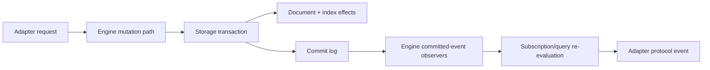

# Adapter Event Capture

Nimbus uses a hybrid event-capture pattern:

- Storage owns atomic mutation, index effects, and commit-log append.
- The engine owns generic committed-event metadata and subscription
  invalidation.
- Adapters own protocol-specific event shape.

This keeps transaction safety in one place without forcing storage to know
about Convex WebSocket frames, Firestore listen responses, CloudEvent payloads,
or future adapter wire formats.

## Flow

## Rules

- Adapters do not open storage transactions to emit subscription events.
- Storage does not construct adapter wire-format events.
- Subscription delivery carries generic document snapshots, deleted documents,
  commit hints, and sequence metadata across the engine boundary.
- Adapter code translates that generic state into Convex subscription payloads,
  Firebase listen responses, CloudEvent records, or future protocol shapes.

The storage atomicity invariant remains unchanged: document write, index
effects, and commit-log append are one storage transaction.
