# Horizontal Scaling Architecture

This document describes how the single Nimbus binary scales from one node to
many, across different compute models (V8 isolates, microVMs) and storage
backends (embedded, external, replicated).

---

## 1. Single Node (Current Baseline)

Everything runs in one process. No cluster coordination needed.

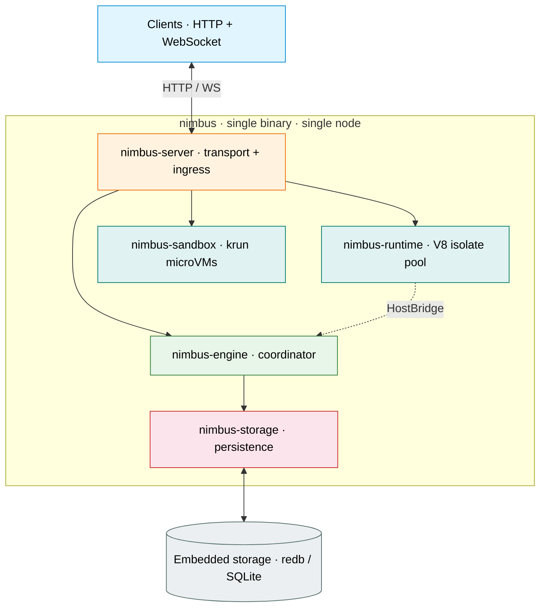
```mermaid
flowchart TD
    Client["Clients · HTTP + WebSocket"]

    subgraph binary["nimbus · single binary · single node"]
        Server["nimbus-server · transport + ingress"]
        Engine["nimbus-engine · coordinator"]
        Runtime["nimbus-runtime · V8 isolate pool"]
        Sandbox["nimbus-sandbox · krun microVMs"]
        Storage["nimbus-storage · persistence"]

        Server --> Engine
        Server --> Runtime
        Server --> Sandbox
        Runtime -.->|HostBridge| Engine
        Engine --> Storage
    end

    Disk[("Embedded storage · redb / SQLite")]

    Client <-->|HTTP / WS| Server
    Storage <--> Disk

    classDef client fill:#e1f5fe,stroke:#0288d1,color:#000
    classDef transport fill:#fff3e0,stroke:#ef6c00,color:#000
    classDef runtime fill:#e0f2f1,stroke:#00796b,color:#000
    classDef logic fill:#e8f5e9,stroke:#2e7d32,color:#000
    classDef storage fill:#fce4ec,stroke:#c62828,color:#000
    classDef disk fill:#eceff1,stroke:#546e6a,color:#000

    class Client client
    class Server transport
    class Runtime runtime
    class Engine logic
    class Storage storage
    class Sandbox runtime
    class Disk disk
```

Single node handles both compute models:
- **V8 isolates** — sub-millisecond cold start, serverless function invocations
- **MicroVMs** — OCI images via krun, longer-lived service workloads

Storage is embedded (redb or SQLite), all tenants isolated by namespace on the
same disk.

---

## 2. Design Thesis

**The deployment story IS the product.**

Most distributed systems assume controlled infrastructure: VPCs, DNS, load
balancers, service meshes. Nimbus bets on a different story: run the binary on
any machine, anywhere, and it joins the cluster. No infrastructure. No
orchestrator. The binary IS the orchestrator.

This means:
- Nodes must find each other without DNS or seed services (NAT traversal, relay)
- Identity is cryptographic, not network-based (public keys, not IP addresses)
- The cluster is self-forming and self-healing
- One binary handles dev laptop, 3-node cluster, and 50-node fleet

This thesis drives the library choices below. We prefer transformative
architectural bets over conservative stability when the upside reshapes what
the product can be. Nimbus is pre-stable — we can absorb API churn in
dependencies.

---

## 3. Cluster Substrate — Iroh Ecosystem + openraft

The cluster layer uses two ecosystems: **Iroh** (all networking, messaging,
and content distribution) and **openraft** (linearizable consensus). Everything
else is built on Iroh's composable protocol stack rather than adding separate
libraries.

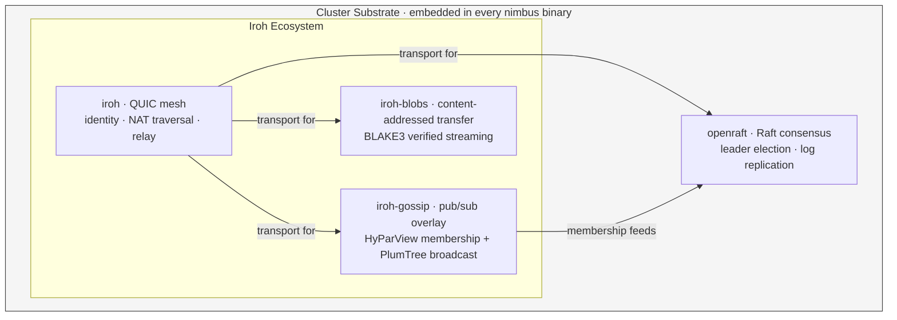
```mermaid
flowchart TD
    subgraph cluster["Cluster Substrate · embedded in every nimbus binary"]
        subgraph iroh_stack["Iroh Ecosystem"]
            Iroh["iroh · QUIC mesh\nidentity · NAT traversal · relay"]
            Gossip["iroh-gossip · pub/sub overlay\nHyParView membership + PlumTree broadcast"]
            Blobs["iroh-blobs · content-addressed transfer\nBLAKE3 verified streaming"]
        end

        Raft["openraft · Raft consensus\nleader election · log replication"]

        Iroh -->|transport for| Gossip & Blobs & Raft
        Gossip -->|membership feeds| Raft
    end

    style cluster fill:#f5f5f5,stroke:#424242
```

### Iroh protocols — what each does

| Protocol | Built on | Purpose in Nimbus |
|----------|----------|-------------------|
| **iroh** (core) | Quinn QUIC | Encrypted mesh. Public-key identity. NAT holepunching + relay fallback. Connection lifecycle events. |
| **iroh-gossip** | iroh streams | Topic-based pub/sub overlay. HyParView handles membership + liveness detection (connection-based, logarithmic scaling). PlumTree handles efficient broadcast (eager-push + lazy-push trees). Scales to 2000+ nodes on phone-grade resources. |
| **iroh-blobs** | iroh streams | BLAKE3 content-addressed P2P blob transfer. Verified streaming (bao-tree) — integrity checked incrementally, not just at end. Any node is both provider and requester. Kilobytes to terabytes. |

### What each protocol replaces

| Concern | Traditional approach | Nimbus (Iroh-native) |
|---------|---------------------|----------------------|
| Node mesh + NAT | VPC + Tailscale + service mesh | **iroh** core |
| Membership + failure detection | Foca / Chitchat / SWIM library | **iroh-gossip** HyParView layer |
| Subscription invalidation fanout | Custom pub/sub or Zenoh | **iroh-gossip** topics (one per tenant or table) |
| Capacity/load gossip | SWIM metadata dissemination | **iroh-gossip** broadcast on a cluster-state topic |
| Function bundle distribution | Registry pull / SCP / custom | **iroh-blobs** (P2P, content-addressed) |
| OCI image layer transfer | Container registry | **iroh-blobs** (layers as blobs, manifest as HashSeq) |
| Inter-node RPC | tonic / gRPC / custom | **iroh** bidirectional QUIC streams + serde frames |
| Consensus | etcd / external Raft | **openraft** over iroh streams |

### Why iroh-gossip replaces Foca/SWIM

iroh-gossip uses HyParView for swarm membership — each peer maintains active
connections and a passive address book. When a peer goes offline, its slot is
filled from the passive set automatically. This is connection-liveness-based
detection: dead peers are detected through broken QUIC connections rather than
explicit ping probes.

For clusters under 20 nodes (where Nimbus maintains a full mesh of QUIC
connections via iroh), this is strictly sufficient. Every node has a direct
connection to every other node — a broken connection IS instant failure
detection. SWIM's indirect-probe and suspicion sub-protocol exist for large
clusters where you CAN'T maintain full connectivity. At our initial scale,
they're unnecessary complexity.

If Nimbus grows past 20+ nodes where full mesh becomes impractical,
iroh-gossip's partial-view protocol (logarithmic resource growth) handles it
natively — this is exactly what HyParView was designed for.

### Why iroh-gossip replaces "Zenoh-inspired key-expression matching"

iroh-gossip provides topic-based pub/sub out of the box. For subscription
invalidation:

```
Topic model (maps directly to Nimbus semantics):
├── topic:<tenant_id>:mutations     → all mutations for a tenant
├── topic:<tenant_id>:<table_name>  → per-table granularity (if needed)
└── topic:cluster:state             → node capacity, scheduling metadata
```

At 3-5 nodes, a single per-tenant topic with broadcast is sufficient — local
filtering at each node determines which WebSocket clients care. At 20+ nodes,
per-table topics reduce unnecessary traffic. iroh-gossip handles both models
with the same API.

Zenoh's key-expression hierarchy (`tenant/123/table/users/**`) is elegant but
solves a problem we don't have yet — we'd need hundreds of nodes before
topic-per-table broadcast becomes a bottleneck. Start simple, add granularity
when profiling shows it matters.

---

## 4. Multi-Node — V8 Serverless (Isolate Scaling)

Stateless V8 invocations distributed across nodes. The leader places work;
any node can execute any function.

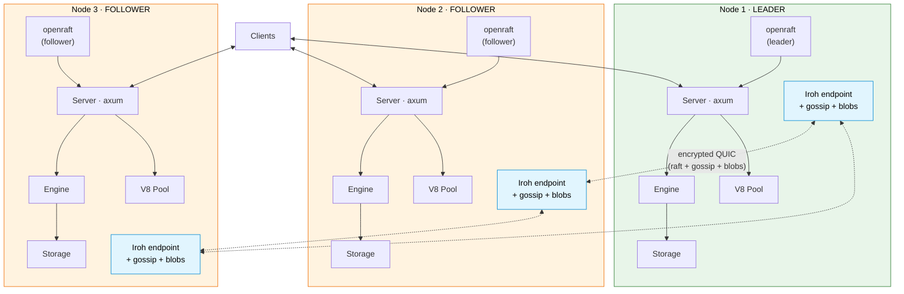
```mermaid
flowchart TD
    subgraph node1["Node 1 · LEADER"]
        direction TB
        S1["Server · axum"]
        E1["Engine"]
        R1["V8 Pool"]
        Raft1["openraft\n(leader)"]
        Iroh1["Iroh endpoint\n+ gossip + blobs"]
        Store1["Storage"]

        S1 --> E1
        S1 --> R1
        E1 --> Store1
        Raft1 --> S1
    end

    subgraph node2["Node 2 · FOLLOWER"]
        direction TB
        S2["Server · axum"]
        E2["Engine"]
        R2["V8 Pool"]
        Raft2["openraft\n(follower)"]
        Iroh2["Iroh endpoint\n+ gossip + blobs"]
        Store2["Storage"]

        S2 --> E2
        S2 --> R2
        E2 --> Store2
        Raft2 --> S2
    end

    subgraph node3["Node 3 · FOLLOWER"]
        direction TB
        S3["Server · axum"]
        E3["Engine"]
        R3["V8 Pool"]
        Raft3["openraft\n(follower)"]
        Iroh3["Iroh endpoint\n+ gossip + blobs"]
        Store3["Storage"]

        S3 --> E3
        S3 --> R3
        E3 --> Store3
        Raft3 --> S3
    end

    Client["Clients"] <--> S1 & S2 & S3

    Iroh1 <-.->|"encrypted QUIC\n(raft + gossip + blobs)"| Iroh2
    Iroh2 <-.-> Iroh3
    Iroh1 <-.-> Iroh3

    classDef leader fill:#e8f5e9,stroke:#2e7d32,color:#000
    classDef follower fill:#fff3e0,stroke:#ef6c00,color:#000
    classDef mesh fill:#e1f5fe,stroke:#0288d1,color:#000

    class node1 leader
    class node2,node3 follower
    class Iroh1,Iroh2,Iroh3 mesh
```

**Scaling properties:**
- V8 isolates are stateless — any node can run any tenant's function
- Leader assigns tenant affinity for subscription locality (not hard pinning)
- Subscription invalidation: mutation on node A → gossip broadcast on tenant
  topic → node B pushes to affected WebSocket clients
- Bundle distribution: new deploy → leader hashes bundle → iroh-blobs
  distributes to all nodes (P2P, verified streaming, no registry)
- Adding a node: binary starts, connects via Iroh (public key + relay),
  gossip overlay absorbs it, openraft adds voter, leader rebalances

**Multi-Raft for tenant parallelism:** At scale (10+ nodes), partition tenants
into separate Raft groups. Each node leads some tenant groups — distributes
write leadership across the cluster.

---

## 5. Multi-Node — MicroVM Workloads (OCI / K8s Replacement)

Heavier, longer-lived workloads scheduled like K8s pods but without K8s.

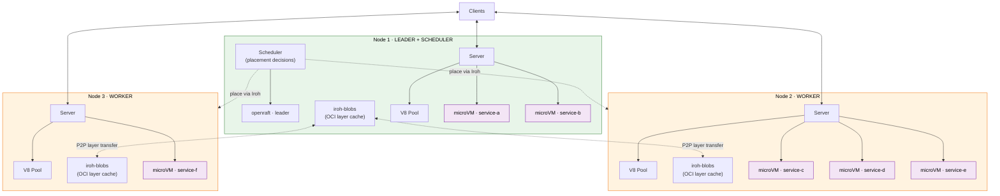
```mermaid
flowchart TD
    subgraph node1["Node 1 · LEADER + SCHEDULER"]
        direction TB
        Sched["Scheduler\n(placement decisions)"]
        Raft1["openraft · leader"]
        Blobs1["iroh-blobs\n(OCI layer cache)"]
        S1["Server"]
        R1["V8 Pool"]
        VM1a["microVM · service-a"]
        VM1b["microVM · service-b"]

        Sched --> Raft1
        S1 --> R1
        S1 --> VM1a & VM1b
    end

    subgraph node2["Node 2 · WORKER"]
        direction TB
        S2["Server"]
        R2["V8 Pool"]
        Blobs2["iroh-blobs\n(OCI layer cache)"]
        VM2a["microVM · service-c"]
        VM2b["microVM · service-d"]
        VM2c["microVM · service-e"]

        S2 --> R2
        S2 --> VM2a & VM2b & VM2c
    end

    subgraph node3["Node 3 · WORKER"]
        direction TB
        S3["Server"]
        R3["V8 Pool"]
        Blobs3["iroh-blobs\n(OCI layer cache)"]
        VM3a["microVM · service-f"]

        S3 --> R3
        S3 --> VM3a
    end

    Client["Clients"] <--> S1
    Client <--> S2
    Client <--> S3

    Sched -.->|"place via Iroh"| node2
    Sched -.->|"place via Iroh"| node3
    Blobs1 <-.->|"P2P layer transfer"| Blobs2 & Blobs3

    classDef leader fill:#e8f5e9,stroke:#2e7d32,color:#000
    classDef worker fill:#fff3e0,stroke:#ef6c00,color:#000
    classDef vm fill:#f3e5f5,stroke:#7b1fa2,color:#000

    class node1 leader
    class node2,node3 worker
    class VM1a,VM1b,VM2a,VM2b,VM2c,VM3a vm
```

**Scheduling model:**
- Leader maintains desired-state manifest (replicated via Raft)
- iroh-gossip broadcasts node capacity (CPU, memory, running VMs) on cluster
  state topic
- Leader places new microVMs on nodes with available resources
- OCI image pull: leader requests blob hash → iroh-blobs streams layers P2P
  from any node that has them (no central registry needed within cluster)
- Health checking: iroh-gossip HyParView detects node failure → leader
  reschedules VMs
- Rolling deploys: leader drains old VMs, places new OCI version progressively

---

## 6. Content Distribution — iroh-blobs

Function bundles and OCI images flow through iroh-blobs for P2P distribution:

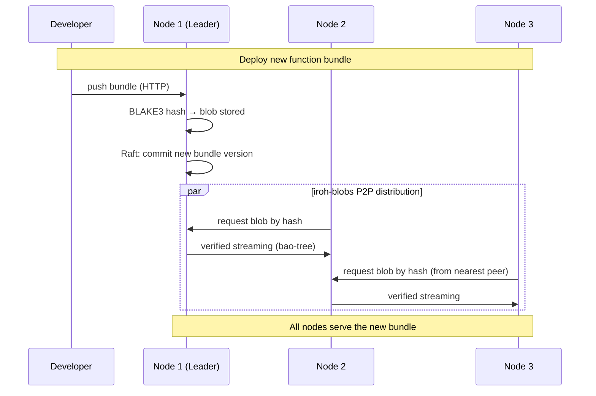
```mermaid
sequenceDiagram
    participant Dev as Developer
    participant N1 as Node 1 (Leader)
    participant N2 as Node 2
    participant N3 as Node 3

    Note over Dev,N3: Deploy new function bundle

    Dev->>N1: push bundle (HTTP)
    N1->>N1: BLAKE3 hash → blob stored
    N1->>N1: Raft: commit new bundle version

    par iroh-blobs P2P distribution
        N2->>N1: request blob by hash
        N1->>N2: verified streaming (bao-tree)
        N3->>N2: request blob by hash (from nearest peer)
        N2->>N3: verified streaming
    end

    Note over N1,N3: All nodes serve the new bundle
```

**Key properties:**
- Content-addressed: BLAKE3 hash IS the bundle identity (replaces SHA-256 checks)
- Verified streaming: integrity checked incrementally during transfer, not just
  at the end — safe to start using before full transfer completes
- P2P: nodes pull from the nearest peer that has the content, not just the
  origin. Natural fan-out reduces load on the uploading node.
- No registry: bundle distribution is cluster-internal, no external service

For OCI images: each layer is a blob, manifests are HashSeqs (ordered lists of
blob hashes). Pulling an image = requesting the HashSeq + resolving each layer
blob from the cluster peer mesh.

---

## 7. Storage Plugin Matrix

Storage is orthogonal to compute scaling. Each mode works at any cluster size:

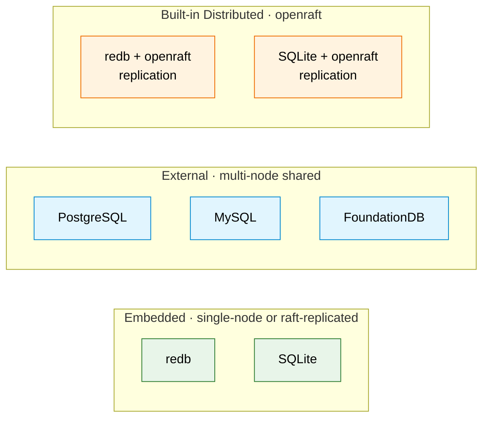
```mermaid
flowchart LR
    subgraph embedded["Embedded · single-node or raft-replicated"]
        redb["redb"]
        SQLite["SQLite"]
    end

    subgraph external["External · multi-node shared"]
        PG["PostgreSQL"]
        MySQL["MySQL"]
        FDB["FoundationDB"]
    end

    subgraph replicated["Built-in Distributed · openraft"]
        RaftRedb["redb + openraft\nreplication"]
        RaftSQLite["SQLite + openraft\nreplication"]
    end

    classDef emb fill:#e8f5e9,stroke:#2e7d32,color:#000
    classDef ext fill:#e1f5fe,stroke:#0288d1,color:#000
    classDef rep fill:#fff3e0,stroke:#ef6c00,color:#000

    class redb,SQLite emb
    class PG,MySQL,FDB ext
    class RaftRedb,RaftSQLite rep
```

| Storage Mode | Nodes | Consensus | Who owns replication | Best for |
|---|---|---|---|---|
| **redb / SQLite** | 1 | None | N/A | Dev, single-machine prod |
| **redb + openraft** | 3-5 | Built-in Raft | Nimbus binary | Self-contained clusters, no external deps |
| **SQLite + openraft** | 3-5 | Built-in Raft | Nimbus binary | Same, with SQLite ecosystem tools |
| **PostgreSQL** | N | External (PG replication) | Postgres | Teams with existing PG infrastructure |
| **MySQL** | N | External (MySQL replication) | MySQL | Teams with existing MySQL infrastructure |
| **FoundationDB** | N | External (FDB consensus) | FoundationDB | Convex-grade distributed KV, enterprise |

---

## 8. Unified Architecture — All Modes, One Binary

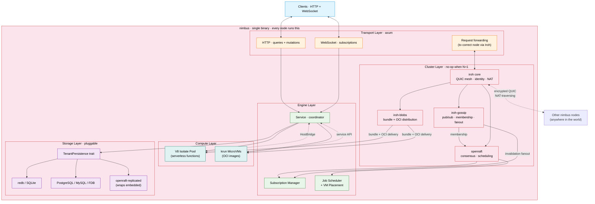
```mermaid
flowchart TD
    Client["Clients · HTTP + WebSocket"]

    subgraph binary["nimbus · single binary · every node runs this"]
        direction TB

        subgraph transport["Transport Layer · axum"]
            WS["WebSocket · subscriptions"]
            HTTP["HTTP · queries + mutations"]
            Forward["Request forwarding\n(to correct node via Iroh)"]
        end

        subgraph cluster["Cluster Layer · no-op when N=1"]
            Iroh["iroh core\nQUIC mesh · identity · NAT"]
            Gossip["iroh-gossip\npub/sub · membership · fanout"]
            Blobs["iroh-blobs\nbundle + OCI distribution"]
            Raft["openraft\nconsensus · scheduling"]
        end

        subgraph compute["Compute Layer"]
            V8["V8 Isolate Pool\n(serverless functions)"]
            MicroVM["krun MicroVMs\n(OCI images)"]
        end

        subgraph engine["Engine Layer"]
            Service["Service · coordinator"]
            Subscriptions["Subscription Manager"]
            Scheduler["Job Scheduler\n+ VM Placement"]
        end

        subgraph storage["Storage Layer · pluggable"]
            Trait["TenantPersistence trait"]
            Embedded["redb / SQLite"]
            External["PostgreSQL / MySQL / FDB"]
            Replicated["openraft-replicated\n(wraps embedded)"]
        end

        HTTP & WS --> Service
        Forward <--> Iroh
        Service --> V8 & MicroVM
        V8 -.->|HostBridge| Service
        MicroVM -.->|service API| Service
        Service --> Trait
        Trait --> Embedded & External & Replicated
        Raft --> Subscriptions & Scheduler
        Gossip -->|"membership"| Raft
        Gossip -->|"invalidation fanout"| Subscriptions
        Blobs -->|"bundle + OCI delivery"| V8 & MicroVM
        Iroh --> Gossip & Blobs & Raft
    end

    Peers["Other nimbus nodes\n(anywhere in the world)"]
    Client <--> HTTP & WS
    Iroh <-.->|"encrypted QUIC\nNAT-traversing"| Peers

    classDef client fill:#e1f5fe,stroke:#0288d1,color:#000
    classDef transport fill:#fff3e0,stroke:#ef6c00,color:#000
    classDef cluster fill:#fce4ec,stroke:#c62828,color:#000
    classDef compute fill:#e0f2f1,stroke:#00796b,color:#000
    classDef engine fill:#e8f5e9,stroke:#2e7d32,color:#000
    classDef storage fill:#f3e5f5,stroke:#7b1fa2,color:#000

    class Client client
    class WS,HTTP,Forward transport
    class Iroh,Gossip,Blobs,Raft cluster
    class V8,MicroVM compute
    class Service,Subscriptions,Scheduler engine
    class Trait,Embedded,External,Replicated storage
```

---

## 9. Deployment Spectrum


```mermaid
flowchart LR
    subgraph dev["Developer Laptop"]
        D1["1 node"]
        D2["SQLite"]
        D3["V8 only"]
        D4["Cluster: no-op"]
    end

    subgraph small["Small Prod · 3 nodes"]
        S1["3 nodes · any network"]
        S2["redb + openraft"]
        S3["V8 isolates"]
        S4["Iroh + gossip + raft"]
    end

    subgraph medium["Medium Prod · 5-20 nodes"]
        M1["5-20 nodes"]
        M2["Postgres or openraft"]
        M3["V8 + microVMs"]
        M4["Multi-Raft per tenant"]
    end

    subgraph large["Large Prod · 50+ nodes"]
        L1["50+ nodes"]
        L2["FoundationDB"]
        L3["V8 + microVMs + WASM"]
        L4["Multi-region Iroh relay"]
    end

    dev --> small --> medium --> large

    classDef dev fill:#e8f5e9,stroke:#2e7d32,color:#000
    classDef small fill:#fff3e0,stroke:#ef6c00,color:#000
    classDef medium fill:#e1f5fe,stroke:#0288d1,color:#000
    classDef large fill:#f3e5f5,stroke:#7b1fa2,color:#000

    class dev dev
    class small small
    class medium medium
    class large large
```

| Deployment | Nodes | Storage | Compute | Cluster |
|---|---|---|---|---|
| **Developer** | 1 | SQLite / redb | V8 only | No-op |
| **Small prod** | 3 | redb + openraft | V8 | Full Iroh ecosystem + openraft |
| **Medium prod** | 5-20 | Postgres or openraft | V8 + microVMs | Multi-Raft tenant groups |
| **Large prod** | 50+ | FoundationDB | V8 + microVMs + WASM | Multi-region Iroh relay mesh |

---

## 10. Data Flows

### Mutation + Subscription Invalidation

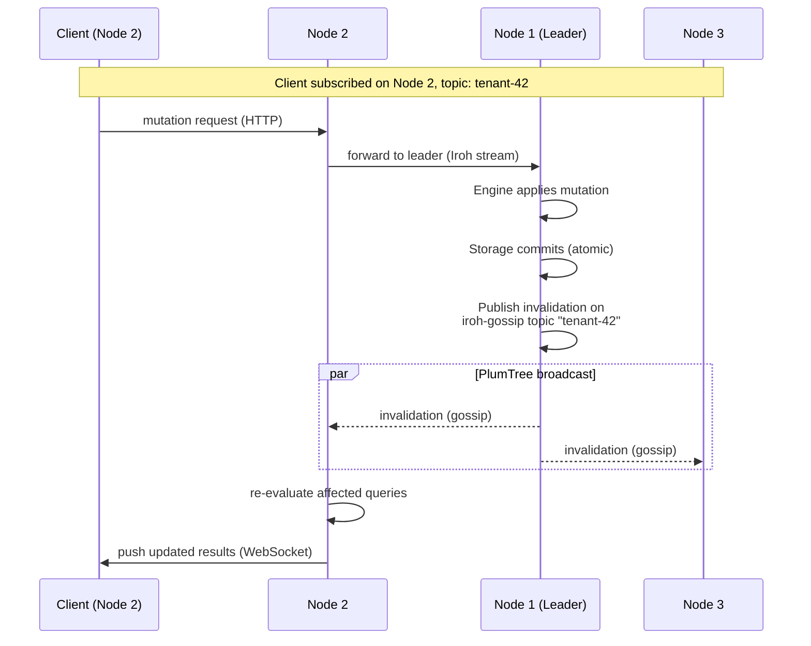
```mermaid
sequenceDiagram
    participant C as Client (Node 2)
    participant N2 as Node 2
    participant N1 as Node 1 (Leader)
    participant N3 as Node 3

    Note over C,N3: Client subscribed on Node 2, topic: tenant-42

    C->>N2: mutation request (HTTP)
    N2->>N1: forward to leader (Iroh stream)
    N1->>N1: Engine applies mutation
    N1->>N1: Storage commits (atomic)

    N1->>N1: Publish invalidation on<br/>iroh-gossip topic "tenant-42"

    par PlumTree broadcast
        N1-->>N2: invalidation (gossip)
        N1-->>N3: invalidation (gossip)
    end

    N2->>N2: re-evaluate affected queries
    N2->>C: push updated results (WebSocket)
```

### Node Join

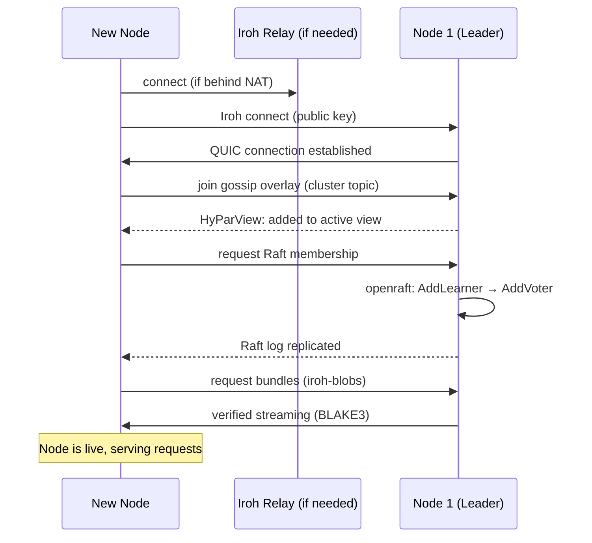
```mermaid
sequenceDiagram
    participant N4 as New Node
    participant Relay as Iroh Relay (if needed)
    participant N1 as Node 1 (Leader)

    N4->>Relay: connect (if behind NAT)
    N4->>N1: Iroh connect (public key)
    N1->>N4: QUIC connection established

    N4->>N1: join gossip overlay (cluster topic)
    N1-->>N4: HyParView: added to active view

    N4->>N1: request Raft membership
    N1->>N1: openraft: AddLearner → AddVoter
    N1-->>N4: Raft log replicated

    N4->>N1: request bundles (iroh-blobs)
    N1->>N4: verified streaming (BLAKE3)

    Note over N4: Node is live, serving requests
```

---

## 11. Library Decisions — Final Stack

### Two ecosystems, complete coverage

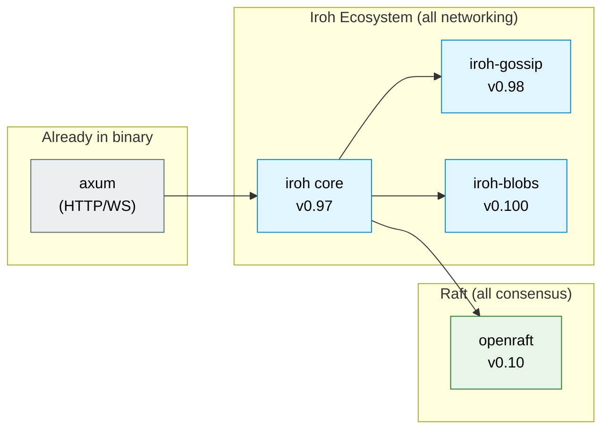
```mermaid
flowchart LR
    subgraph iroh_eco["Iroh Ecosystem (all networking)"]
        direction TB
        IC["iroh core\nv0.97"]
        IG["iroh-gossip\nv0.98"]
        IB["iroh-blobs\nv0.100"]
    end

    subgraph raft_eco["Raft (all consensus)"]
        OR["openraft\nv0.10"]
    end

    subgraph existing["Already in binary"]
        AX["axum\n(HTTP/WS)"]
    end

    IC --> IG & IB
    IC --> OR
    AX --> IC

    classDef iroh fill:#e1f5fe,stroke:#0288d1,color:#000
    classDef raft fill:#e8f5e9,stroke:#2e7d32,color:#000
    classDef existing fill:#eceff1,stroke:#546e6a,color:#000

    class IC,IG,IB iroh
    class OR raft
    class AX existing
```

| Crate | Version | Stability | Role |
|-------|---------|-----------|------|
| `iroh` | 0.97 | Pre-1.0 (active, 500K nodes/mo on public net) | QUIC mesh, identity, NAT traversal, relay, connection lifecycle |
| `iroh-gossip` | 0.98 | Pre-1.0 (2000-node CI stress tests) | Subscription fanout (topics), membership (HyParView), broadcast (PlumTree) |
| `iroh-blobs` | 0.100 | Pre-1.0 (active) | Bundle distribution, OCI layer transfer, content-addressed P2P |
| `openraft` | 0.10 | Alpha (production at Databend/CnosDB/Quickwit) | Consensus, leader election, log replication, scheduling decisions |
| `axum` | 0.8 | Stable | HTTP/WebSocket transport, request forwarding (already in binary) |

### What we no longer need

| Previously considered | Why it's gone |
|-----------------------|---------------|
| **Foca** (SWIM) | iroh-gossip's HyParView provides membership + liveness detection natively. At full-mesh scale (<20 nodes), QUIC connection state IS membership state. At larger scale, HyParView's partial-view protocol handles it with logarithmic resource growth. |
| **Zenoh** (pub/sub) | iroh-gossip's topic-based pub/sub IS the subscription fanout primitive. Topics map to tenants/tables directly. No need for Zenoh's key-expression routing until 100+ nodes — and even then, per-table topics in iroh-gossip likely suffice. |
| **tonic** (gRPC) | Iroh provides bidirectional QUIC streams. Length-prefixed serde frames over those streams are sufficient for Raft RPCs and inter-node calls. No protobuf codegen needed. |
| **pingora** (proxy) | axum handles HTTP routing and request forwarding. Forwarding to the correct node is just an HTTP client call through an Iroh stream. |
| **Custom fanout protocol** | iroh-gossip does this out of the box with PlumTree (eager-push + lazy-push epidemic broadcast). |

### Abstraction boundary (risk mitigation)

All Iroh interaction goes through a cluster trait so the binary isn't
structurally coupled to Iroh internals:

```rust
trait ClusterTransport: Send + Sync {
    type Stream: AsyncRead + AsyncWrite;

    // Core connectivity
    fn connect(&self, peer: NodeId) -> impl Future<Output = Self::Stream>;
    fn accept(&self) -> impl Stream<Item = (NodeId, Self::Stream)>;

    // Pub/sub (maps to iroh-gossip topics)
    fn subscribe(&self, topic: Topic) -> impl Stream<Item = (NodeId, Bytes)>;
    fn broadcast(&self, topic: Topic, msg: Bytes) -> impl Future<Output = ()>;

    // Content distribution (maps to iroh-blobs)
    fn provide_blob(&self, data: Bytes) -> impl Future<Output = BlobHash>;
    fn fetch_blob(&self, hash: BlobHash) -> impl Future<Output = Bytes>;
}
```

If Iroh pivots: reimplement this trait over Quinn + custom relay + custom
gossip. The boundary contains the blast radius.

---

## 12. What Kubernetes Does That We Replace

| K8s concept | Nimbus equivalent | Implementation |
|-------------|-------------------|----------------|
| etcd | openraft (embedded) | Raft log over Iroh streams |
| kube-apiserver | Raft leader | Leader node makes placement decisions |
| kubelet | The binary itself | Every node is the full stack |
| kube-scheduler | Leader scheduler | Gossip capacity metadata → leader places workloads |
| Service discovery / DNS | Iroh public-key routing | Nodes addressed by key, not IP |
| CNI / service mesh | Iroh QUIC mesh | All inter-node traffic on Iroh connections |
| Ingress controller | axum (built-in) | HTTP routing + forwarding |
| Health checks / liveness | iroh-gossip HyParView | Connection-liveness + active/passive views |
| Container registry | iroh-blobs | P2P content-addressed distribution within cluster |
| Helm / operators | Compose declaration | Built into the binary |
| CRI / containerd | krun (direct) | Sandbox crate manages microVM lifecycle |
| Pod restart policy | systemd transient units | `Restart=on-failure`, cgroups, journal — OS-level |
| Rolling updates | Raft-coordinated rollout | Leader drains old, places new; blobs distribute content |
| Resource limits | systemd cgroups | `MemoryMax=`, `CPUQuota=` on transient units |

---

## 13. Discovery + Relay Architecture

Iroh's discovery and relay systems are pluggable. The right configuration
depends on the deployment environment — not all deployments need relays, and
not all need external discovery.

### How Iroh connectivity works

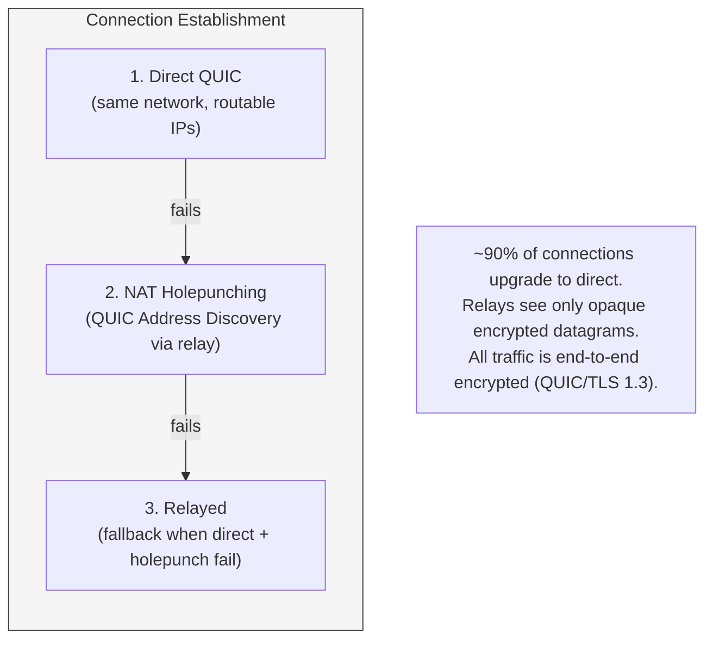
```mermaid
flowchart TD
    subgraph connectivity["Connection Establishment"]
        direction TB
        Direct["1. Direct QUIC\n(same network, routable IPs)"]
        Holepunch["2. NAT Holepunching\n(QUIC Address Discovery via relay)"]
        Relayed["3. Relayed\n(fallback when direct + holepunch fail)"]

        Direct -->|fails| Holepunch
        Holepunch -->|fails| Relayed
    end

    Note["~90% of connections upgrade to direct.\nRelays see only opaque encrypted datagrams.\nAll traffic is end-to-end encrypted (QUIC/TLS 1.3)."]

    style connectivity fill:#f5f5f5,stroke:#424242
```

Iroh always prefers direct connections. Relays are a fallback, not the primary
path. When two nodes are on the same network (LAN, VPC, datacenter), traffic
flows directly over QUIC — no relay involved. The relay only participates when
nodes can't reach each other directly (NAT, firewalls).

Relays are stateless forwarders of opaque encrypted datagrams. They cannot
inspect payload contents — all traffic is end-to-end encrypted via QUIC/TLS
1.3 between peers.

### Discovery mechanisms

Iroh implements the `Discovery` trait with pluggable backends. Multiple
backends run concurrently via `ConcurrentDiscovery`.

| Mechanism | How it works | When to use |
|-----------|--------------|-------------|
| **StaticProvider** | Manual address list — inject known `(public_key, ip:port)` | VPC / datacenter (nodes have stable IPs) |
| **mDNS** (`MdnsAddressLookup`) | Multicast DNS on local subnet | Dev laptop, same-LAN clusters |
| **DNS + Pkarr** (n0 default) | Nodes publish signed DNS records to n0's `iroh-dns-server`; resolvers query `_iroh.<id>.<domain> TXT` | Public internet, zero-config |
| **Mainline DHT** (`DhtDiscovery`) | BitTorrent Mainline DHT (BEP0044) — fully decentralized | No n0 dependency, decentralized |
| **EndpointTicket** | Serialized `(public_key + addrs + relay_url)` as shareable string | Bootstrap / out-of-band sharing |
| **Custom** | Implement `Discovery` trait | Cloud auto-join (e.g., query AWS tags) |

### Deployment topology matrix

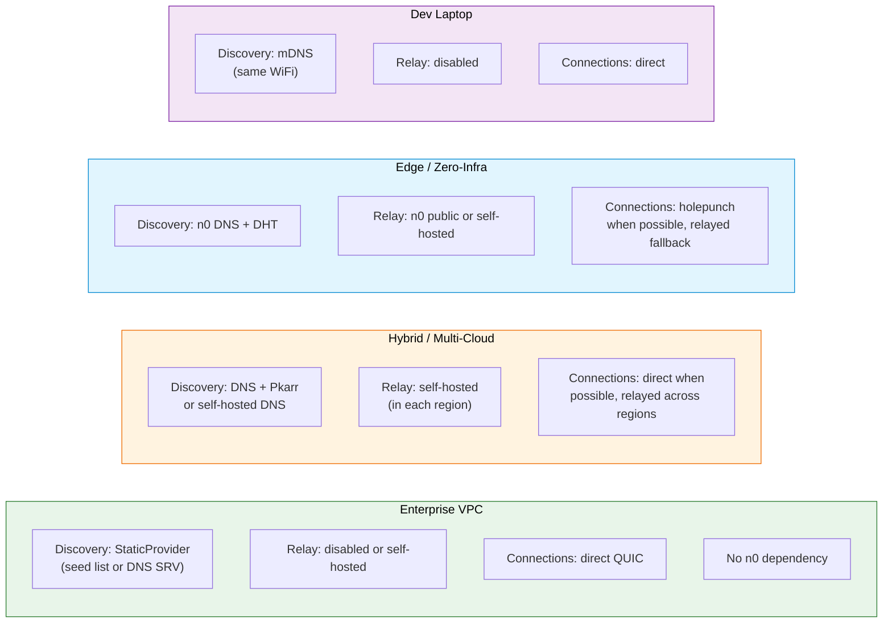
```mermaid
flowchart LR
    subgraph vpc["Enterprise VPC"]
        direction TB
        VP1["Discovery: StaticProvider\n(seed list or DNS SRV)"]
        VP2["Relay: disabled or self-hosted"]
        VP3["Connections: direct QUIC"]
        VP4["No n0 dependency"]
    end

    subgraph hybrid["Hybrid / Multi-Cloud"]
        direction TB
        HY1["Discovery: DNS + Pkarr\nor self-hosted DNS"]
        HY2["Relay: self-hosted\n(in each region)"]
        HY3["Connections: direct when\npossible, relayed across regions"]
    end

    subgraph edge["Edge / Zero-Infra"]
        direction TB
        ED1["Discovery: n0 DNS + DHT"]
        ED2["Relay: n0 public or self-hosted"]
        ED3["Connections: holepunch\nwhen possible, relayed fallback"]
    end

    subgraph dev["Dev Laptop"]
        direction TB
        DV1["Discovery: mDNS\n(same WiFi)"]
        DV2["Relay: disabled"]
        DV3["Connections: direct"]
    end

    classDef vpc_s fill:#e8f5e9,stroke:#2e7d32,color:#000
    classDef hybrid_s fill:#fff3e0,stroke:#ef6c00,color:#000
    classDef edge_s fill:#e1f5fe,stroke:#0288d1,color:#000
    classDef dev_s fill:#f3e5f5,stroke:#7b1fa2,color:#000

    class vpc vpc_s
    class hybrid hybrid_s
    class edge edge_s
    class dev dev_s
```

### Enterprise VPC (most production deployments)

In a VPC, nodes have stable private IPs and can reach each other directly.
No NAT traversal needed. No relay needed. No external discovery needed.

```toml
# nimbus.toml — enterprise VPC configuration
[cluster]
discovery = "static"
relay = "disabled"

[cluster.seeds]
# Seed list: new nodes contact any one of these to join
nodes = [
  "10.0.1.10:4919",
  "10.0.1.11:4919",
  "10.0.1.12:4919",
]
```

This mirrors how Consul, CockroachDB, and Nomad handle VPC discovery: a seed
list of 3-5 known addresses. After initial contact, iroh-gossip disseminates
the full topology — you only need to reach one seed.

Alternatively, use DNS SRV records (`_nimbus._quic.cluster.internal`) pointing
to seed nodes. This is how most enterprise teams prefer it — they manage DNS,
not config files.

**No dependency on n0 infrastructure. No public internet access required.**

### Hybrid / Multi-Cloud

Nodes span multiple networks (VPCs, regions, clouds). NAT traversal needed
between networks but not within.

```toml
[cluster]
discovery = "dns"   # self-hosted iroh-dns-server per region
relay = "self-hosted"

[cluster.relays]
# Self-hosted relay in each region
urls = [
  "https://relay-us.internal.example.com",
  "https://relay-eu.internal.example.com",
]
```

Self-hosted `iroh-relay` binary handles cross-region connectivity. Each relay
instance handles ~60,000 concurrent connections. Built-in ACME for TLS.
Clients failover between relays automatically.

Within each region: direct QUIC (no relay). Across regions: holepunch first
(~90% success), relay fallback for the rest.

### Edge / Zero-Infrastructure

The differentiating story: nodes on arbitrary networks (home labs, edge
devices, mixed environments) with no shared infrastructure.

```toml
[cluster]
discovery = "n0"    # DNS + Pkarr via n0's public infrastructure
relay = "n0"        # n0's public relay network (no SLA)

# Or fully decentralized:
# discovery = "dht"  # Mainline DHT, no n0 dependency at all
```

n0's public relays are documented as **no uptime or performance guarantees**
(they experienced a global outage Nov 5, 2024 from a memory leak). For
production edge deployments, self-host relays and consider adding DHT
discovery for resilience.

### Discovery + join flow

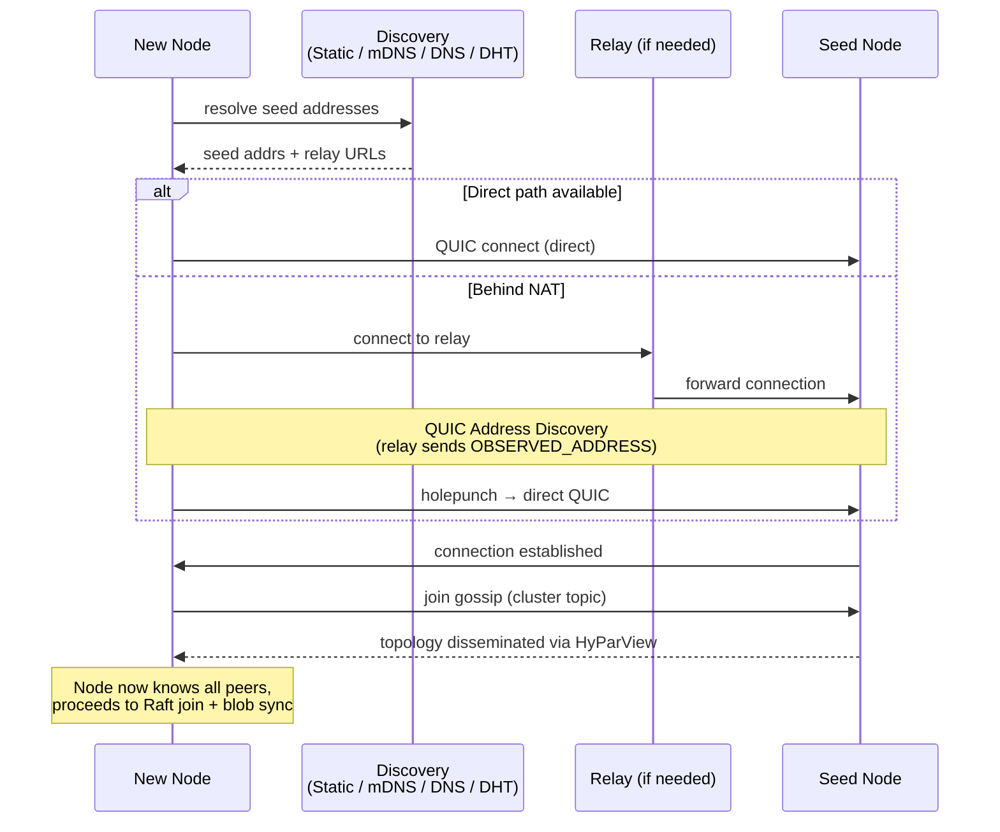
```mermaid
sequenceDiagram
    participant N4 as New Node
    participant DNS as Discovery<br/>(Static / mDNS / DNS / DHT)
    participant Relay as Relay (if needed)
    participant N1 as Seed Node

    N4->>DNS: resolve seed addresses
    DNS-->>N4: seed addrs + relay URLs

    alt Direct path available
        N4->>N1: QUIC connect (direct)
    else Behind NAT
        N4->>Relay: connect to relay
        Relay->>N1: forward connection
        Note over N4,N1: QUIC Address Discovery<br/>(relay sends OBSERVED_ADDRESS)
        N4->>N1: holepunch → direct QUIC
    end

    N1->>N4: connection established
    N4->>N1: join gossip (cluster topic)
    N1-->>N4: topology disseminated via HyParView

    Note over N4: Node now knows all peers,<br/>proceeds to Raft join + blob sync
```

### The minimum information to connect

| What you have | What happens |
|---------------|--------------|
| **Public key only** | Works if a discovery backend is configured (DNS/DHT/mDNS resolves key → addrs) |
| **Public key + relay URL** | Always works — relay forwards until direct path established |
| **Public key + IP:port** | Direct connection, no discovery or relay needed |
| **EndpointTicket** (string) | Bundles all of the above — shareable, one-shot bootstrap |

For VPC deployments: `public_key + IP:port` in a seed list. No discovery
service, no relay.

For edge deployments: `public_key` alone, resolved via DNS/DHT discovery.

---

## 14. Compute Model Scaling — Detailed Mechanics

Three compute models scale differently across the cluster. Each has distinct
lifecycle ownership at the node level vs. cluster level.

### V8 Isolates (serverless functions)

**Nature:** Ephemeral, in-process, sub-millisecond cold start. Stateless per
invocation. The lightest compute unit.

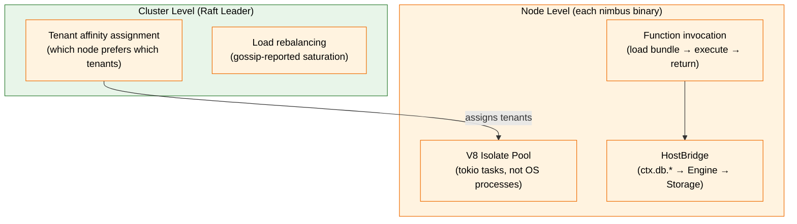
```mermaid
flowchart TD
    subgraph cluster_level["Cluster Level (Raft Leader)"]
        Affinity["Tenant affinity assignment\n(which node prefers which tenants)"]
        Balance["Load rebalancing\n(gossip-reported saturation)"]
    end

    subgraph node_level["Node Level (each nimbus binary)"]
        Pool["V8 Isolate Pool\n(tokio tasks, not OS processes)"]
        Invoke["Function invocation\n(load bundle → execute → return)"]
        Bridge["HostBridge\n(ctx.db.* → Engine → Storage)"]
    end

    Affinity -->|"assigns tenants"| Pool
    Invoke --> Bridge

    classDef cluster fill:#e8f5e9,stroke:#2e7d32,color:#000
    classDef node fill:#fff3e0,stroke:#ef6c00,color:#000

    class cluster_level cluster
    class node_level node
```

| Concern | How it works |
|---------|--------------|
| **Scheduling** | Leader assigns tenant affinity for subscription locality. Any node CAN run any function — affinity is a preference, not a constraint. |
| **Lifecycle** | In-process tokio tasks. No OS processes, no systemd, no conmon. The nimbus binary manages all isolates directly. |
| **Scaling** | Add a node → leader rebalances tenant affinity → new node immediately handles invocations. |
| **Failure** | Node dies → leader reassigns its tenants → other nodes absorb (stateless, instant failover). |
| **Bundle delivery** | iroh-blobs distributes function bundles (BLAKE3 content-addressed). Node fetches bundle on first invocation of a new deploy. |
| **State** | None. All reads go through Engine → Storage. All writes go through Raft leader. Isolates are pure compute. |

### MicroVMs / OCI Images (long-lived services)

**Nature:** Separate processes/VMs. Seconds to start. Potentially stateful.
The heaviest compute unit — this is the "replaces K8s pods" surface.

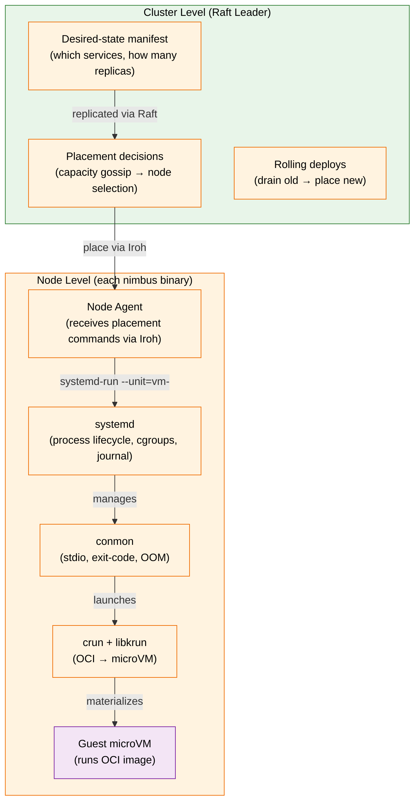
```mermaid
flowchart TD
    subgraph cluster_level["Cluster Level (Raft Leader)"]
        Manifest["Desired-state manifest\n(which services, how many replicas)"]
        Placement["Placement decisions\n(capacity gossip → node selection)"]
        Rollout["Rolling deploys\n(drain old → place new)"]
    end

    subgraph node_level["Node Level (each nimbus binary)"]
        direction TB
        Agent["Node Agent\n(receives placement commands via Iroh)"]
        Systemd["systemd\n(process lifecycle, cgroups, journal)"]
        Conmon["conmon\n(stdio, exit-code, OOM)"]
        Crun["crun + libkrun\n(OCI → microVM)"]
        VM["Guest microVM\n(runs OCI image)"]

        Agent -->|"systemd-run --unit=vm-<id>"| Systemd
        Systemd -->|manages| Conmon
        Conmon -->|launches| Crun
        Crun -->|materializes| VM
    end

    Placement -->|"place via Iroh"| Agent
    Manifest -->|"replicated via Raft"| Placement

    classDef cluster fill:#e8f5e9,stroke:#2e7d32,color:#000
    classDef node fill:#fff3e0,stroke:#ef6c00,color:#000
    classDef vm fill:#f3e5f5,stroke:#7b1fa2,color:#000

    class cluster_level cluster
    class node_level node
    class VM vm
```

**Node-level lifecycle: systemd transient units**

Dynamically scheduled microVMs use `systemd-run` transient service units
(not quadlet files). This gives:

| systemd provides | Why it matters |
|------------------|----------------|
| Restart policies (`Restart=on-failure`) | MicroVM crashes → systemd restarts locally, no Raft round-trip |
| Cgroup delegation | CPU/memory limits enforced by the kernel, not the nimbus process |
| Journal integration | Logs captured via journald, queryable with `journalctl -u vm-<id>` |
| Process tracking | systemd knows exactly which processes belong to each VM |
| Scope isolation | VM cgroup is independent of the nimbus binary's cgroup |

```bash
# What the nimbus node agent does when it receives a placement command:
systemd-run \
  --unit="nimbus-vm-${service_id}" \
  --property=Restart=on-failure \
  --property=RestartSec=2s \
  --property=MemoryMax=${memory_limit} \
  --property=CPUQuota=${cpu_quota} \
  -- conmon --runtime /usr/libexec/nimbus/crun ...
```

**Why transient units, not quadlets:**

| Quadlets (`.container` files) | Transient units (`systemd-run`) |
|------|------|
| Declarative files on disk | No files, no cleanup |
| Requires `daemon-reload` to pick up changes | Immediate start |
| Best for static services (monitoring, agents) | Best for dynamic scheduling (churn-tolerant) |
| Audit trail via file system | Audit trail via journal |

For Raft-scheduled workloads with placement churn, transient units avoid
`daemon-reload` storms. The leader's placement decision is the source of
truth — the node agent translates it into a systemd unit immediately.

**Quadlets are used for:**
- The nimbus binary itself (`nimbus.service` or `nimbus.container`)
- Static infrastructure (monitoring, log shippers, relay servers)
- Not for dynamically scheduled workloads

**Lifecycle split:**

| Event | Who handles it | Why |
|-------|---------------|-----|
| Simple crash → restart | systemd (local) | Fastest recovery, no network round-trip |
| Restart limit exceeded | node agent → Raft leader | Cluster decision: reschedule elsewhere? |
| Node failure | Raft leader detects via gossip | Reschedules all VMs to healthy nodes |
| Rolling deploy | Raft leader coordinates | Drains old version, places new version progressively |
| Scale up/down | Raft leader | Adds/removes VM instances based on desired state |
| Resource limit enforcement | systemd cgroups | Kernel-level, survives nimbus binary crash |

**OCI image distribution:**

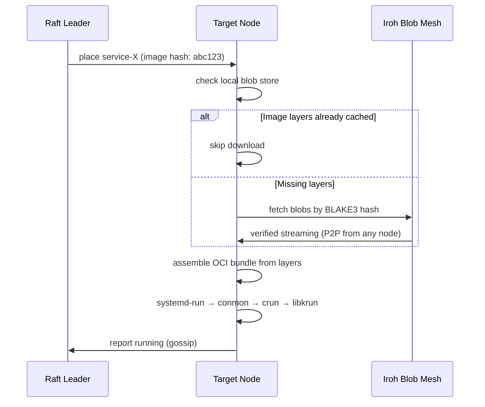
```mermaid
sequenceDiagram
    participant Leader as Raft Leader
    participant N2 as Target Node
    participant Mesh as Iroh Blob Mesh

    Leader->>N2: place service-X (image hash: abc123)
    N2->>N2: check local blob store
    alt Image layers already cached
        N2->>N2: skip download
    else Missing layers
        N2->>Mesh: fetch blobs by BLAKE3 hash
        Mesh->>N2: verified streaming (P2P from any node)
    end
    N2->>N2: assemble OCI bundle from layers
    N2->>N2: systemd-run → conmon → crun → libkrun
    N2->>Leader: report running (gossip)
```

OCI images are decomposed into layers, each stored as an iroh-blob. Manifests
are HashSeqs (ordered blob references). When a node needs an image:
1. Check local cache for each layer blob
2. Fetch missing layers from any peer that has them (P2P, not centralized)
3. Assemble the OCI rootfs from cached layers
4. Launch via the existing krun stack

No container registry needed within the cluster. Images enter the cluster once
(pushed to any node) and propagate via iroh-blobs.

### Storage Plugins — Cluster Integration

Storage is orthogonal to compute but interacts with the cluster layer at the
replication boundary:

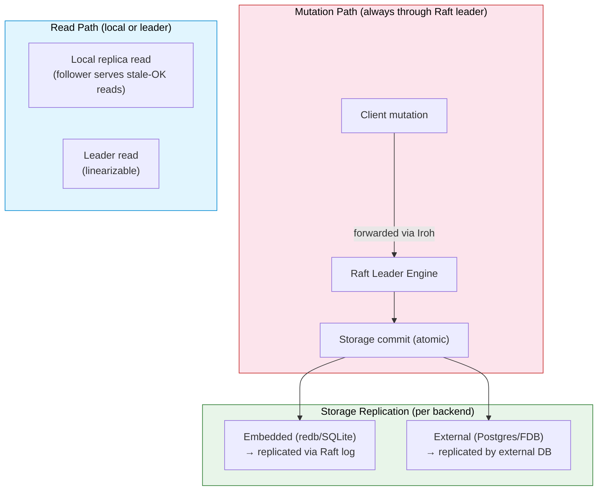
```mermaid
flowchart TD
    subgraph mutation_path["Mutation Path (always through Raft leader)"]
        Client["Client mutation"]
        Leader["Raft Leader Engine"]
        Commit["Storage commit (atomic)"]

        Client -->|"forwarded via Iroh"| Leader
        Leader --> Commit
    end

    subgraph storage_modes["Storage Replication (per backend)"]
        direction TB
        Embedded["Embedded (redb/SQLite)\n→ replicated via Raft log"]
        External["External (Postgres/FDB)\n→ replicated by external DB"]
    end

    Commit --> Embedded & External

    subgraph read_path["Read Path (local or leader)"]
        LocalRead["Local replica read\n(follower serves stale-OK reads)"]
        LeaderRead["Leader read\n(linearizable)"]
    end

    classDef mutation fill:#fce4ec,stroke:#c62828,color:#000
    classDef storage fill:#e8f5e9,stroke:#2e7d32,color:#000
    classDef read fill:#e1f5fe,stroke:#0288d1,color:#000

    class mutation_path mutation
    class storage_modes storage
    class read_path read
```

| Storage backend | Cluster interaction | Write path | Read path |
|---|---|---|---|
| **redb + openraft** | Raft leader applies mutation → replicates log entry to followers → each follower applies to local redb | All writes go through Raft leader | Followers serve subscription reads from local replica (stale by at most one Raft round) |
| **SQLite + openraft** | Same as redb — Raft log replication | Same | Same |
| **PostgreSQL** | Leader connects to Postgres, applies mutation | Raft not involved in storage — Postgres owns durability | Any node can read from Postgres (or PG read replicas) |
| **FoundationDB** | Leader connects to FDB, applies mutation | FDB owns distributed consensus for storage | Any node can read from FDB |

**Key insight for embedded + openraft:**

The Raft log IS the replication mechanism for storage. When the leader commits
a mutation:
1. Raft replicates the log entry (the mutation) to followers
2. Each follower applies the mutation to its local embedded DB
3. Subscriptions on followers see the update via local replica

This means every node has a full local copy of the data — reads are always
local, never cross-node. Only writes cross the network (to the Raft leader).
This is excellent for subscription-heavy workloads where reads vastly outnumber
writes.

### All Three Models — Summary

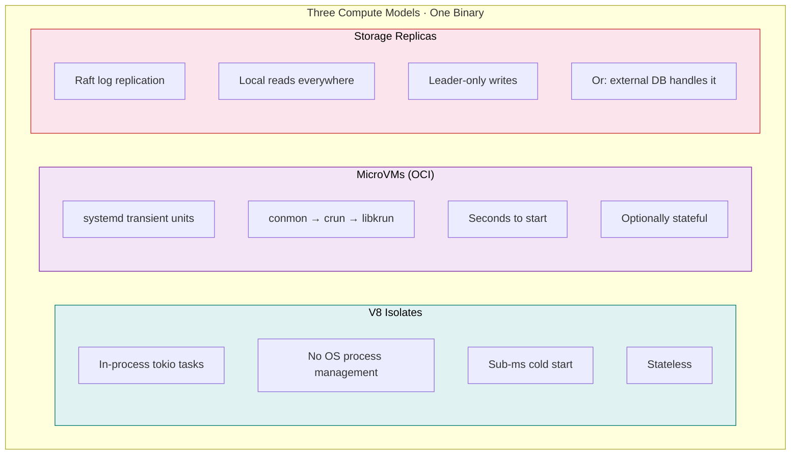
```mermaid
flowchart TD
    subgraph models["Three Compute Models · One Binary"]
        direction LR

        subgraph isolates["V8 Isolates"]
            I1["In-process tokio tasks"]
            I2["No OS process management"]
            I3["Sub-ms cold start"]
            I4["Stateless"]
        end

        subgraph vms["MicroVMs (OCI)"]
            V1["systemd transient units"]
            V2["conmon → crun → libkrun"]
            V3["Seconds to start"]
            V4["Optionally stateful"]
        end

        subgraph storage_r["Storage Replicas"]
            S1["Raft log replication"]
            S2["Local reads everywhere"]
            S3["Leader-only writes"]
            S4["Or: external DB handles it"]
        end
    end

    classDef iso fill:#e0f2f1,stroke:#00796b,color:#000
    classDef vm fill:#f3e5f5,stroke:#7b1fa2,color:#000
    classDef store fill:#fce4ec,stroke:#c62828,color:#000

    class isolates iso
    class vms vm
    class storage_r store
```

| Dimension | V8 Isolates | MicroVMs (OCI) | Storage |
|-----------|-------------|----------------|---------|
| **Scheduling** | Leader tenant affinity | Leader placement + systemd local | Raft log replication |
| **Lifecycle** | In-process (nimbus owns) | systemd (OS owns local restarts) | Raft commit protocol |
| **Failure (local)** | Retry in-process | systemd restarts | Raft leader re-proposes |
| **Failure (node)** | Leader reassigns tenants | Leader reschedules VMs elsewhere | Raft elects new leader, reads continue on remaining replicas |
| **Scaling** | Instant (add node → rebalance) | Seconds (pull image → start VM) | Add follower → Raft snapshot + catch-up |
| **State** | None (pure compute) | Optional (local or shared) | Full replica on each node (embedded) or shared external |
| **systemd** | Not involved | Transient units (restart, cgroups) | Not involved |
| **Content delivery** | iroh-blobs (function bundles) | iroh-blobs (OCI layers) | Raft log entries |

---

## 15. Multi-Tenancy Across The Cluster

Tenants are the unit of horizontal scaling. Nimbus does NOT shard a single
tenant across nodes — it distributes different tenants across different nodes.
Each tenant is a complete, isolated application with its own storage, bundles,
schemas, subscriptions, and optionally its own declared services.

### What is a tenant?

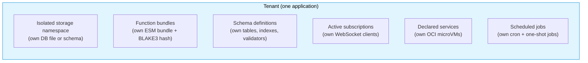
```mermaid
flowchart TD
    subgraph tenant["Tenant (one application)"]
        direction TB
        Storage_t["Isolated storage namespace\n(own DB file or schema)"]
        Bundles_t["Function bundles\n(own ESM bundle + BLAKE3 hash)"]
        Schema_t["Schema definitions\n(own tables, indexes, validators)"]
        Subs_t["Active subscriptions\n(own WebSocket clients)"]
        Services_t["Declared services\n(own OCI microVMs)"]
        Scheduler_t["Scheduled jobs\n(own cron + one-shot jobs)"]
    end

    classDef tenant_c fill:#e1f5fe,stroke:#0288d1,color:#000
    class tenant tenant_c
```

Each tenant is fully isolated:
- **Storage:** separate database file (embedded) or separate schema (external)
- **Runtime:** separate function bundle, separate V8 isolate per invocation
- **Compute:** separate OCI services if declared
- **Subscriptions:** tenant A's mutations never invalidate tenant B's queries
- **Scheduling:** per-tenant job queues, one slow tenant cannot stall others

### Tenant distribution across nodes

```mermaid
flowchart TD
    subgraph cluster["3-Node Cluster"]
        subgraph node1["Node 1 · Leader"]
            direction TB
            T1A["Tenant A\n(storage + subs + V8)"]
            T1B["Tenant B\n(storage + subs + V8)"]
            T1C["Tenant C\n(storage + subs + V8)"]
        end

        subgraph node2["Node 2 · Follower"]
            direction TB
            T2D["Tenant D\n(storage + subs + V8)"]
            T2E["Tenant E\n(storage + subs + V8)"]
            T2F["Tenant F\n(storage + subs + V8)"]
        end

        subgraph node3["Node 3 · Follower"]
            direction TB
            T3G["Tenant G\n(storage + subs + V8)"]
            T3H["Tenant H\n(storage + subs + V8)"]
        end
    end

    Leader["Raft Leader\nassigns tenant affinity"]
    Leader -.-> node1 & node2 & node3

    classDef n1 fill:#e8f5e9,stroke:#2e7d32,color:#000
    classDef n2 fill:#fff3e0,stroke:#ef6c00,color:#000
    classDef n3 fill:#e1f5fe,stroke:#0288d1,color:#000

    class node1,T1A,T1B,T1C n1
    class node2,T2D,T2E,T2F n2
    class node3,T3G,T3H n3
```

**Tenant affinity** is a soft preference, not a hard constraint:
- Leader assigns tenants to nodes to optimize subscription locality
- Any node CAN serve any tenant (V8 is stateless, bundles fetched on demand)
- If a node goes down, its tenants are served by the remaining nodes immediately
- Affinity is rebalanced when nodes join/leave

### Single-Raft vs Multi-Raft tenancy

```mermaid
flowchart LR
    subgraph single["Single Raft Group\n(all tenants share one leader)"]
        direction TB
        SR_L["Node 1 = Leader\nfor ALL tenants"]
        SR_F1["Node 2 = Follower"]
        SR_F2["Node 3 = Follower"]

        SR_L -->|replicates| SR_F1 & SR_F2
    end

    subgraph multi["Multi-Raft Groups\n(each tenant has its own leader)"]
        direction TB
        MR1["Node 1\nLeader: tenants A,B,C\nFollower: tenants D-H"]
        MR2["Node 2\nLeader: tenants D,E,F\nFollower: tenants A-C,G,H"]
        MR3["Node 3\nLeader: tenants G,H\nFollower: tenants A-F"]
    end

    single -->|"scale trigger:\nwrite contention on leader"| multi

    classDef single_c fill:#e8f5e9,stroke:#2e7d32,color:#000
    classDef multi_c fill:#fff3e0,stroke:#ef6c00,color:#000

    class single single_c
    class multi multi_c
```

| Model | When to use | Write throughput | Complexity |
|-------|-------------|-----------------|------------|
| **Single Raft** | <10 nodes, <100 tenants | Bounded by one leader | Simple — one log, one leader election |
| **Multi-Raft** | 10+ nodes or write-heavy tenants | Distributed — each tenant's writes go to its own leader | Complex — many Raft groups, group-level leader election |

**Start with single Raft.** Move to Multi-Raft when either:
- Write throughput on the single leader becomes a bottleneck
- The cluster exceeds ~10 nodes (Raft voter count limit)
- Individual tenants need independent replication factors

### Tenant request flow — complete path

```mermaid
sequenceDiagram
    participant Client as Client (Tenant D)
    participant N3 as Node 3 (any node)
    participant N2 as Node 2 (Tenant D's affinity node)
    participant N1 as Node 1 (Raft Leader)

    Note over Client,N1: Client connects to nearest/any node

    Client->>N3: WebSocket connect (tenant: D)
    N3->>N3: Tenant D has affinity on Node 2

    alt Redirect to affinity node (subscription locality)
        N3-->>Client: redirect → Node 2
        Client->>N2: WebSocket connect (tenant: D)
    else Handle locally (any node can serve)
        N3->>N3: load Tenant D bundle (iroh-blobs if not cached)
    end

    Client->>N2: subscribe(query: "users where active=true")
    N2->>N2: evaluate query against local storage replica
    N2->>Client: initial results

    Note over Client,N1: Later: mutation arrives

    Client->>N2: mutation(insert user {name: "alice"})
    N2->>N1: forward to Raft leader (Iroh stream)
    N1->>N1: apply mutation (Tenant D storage)
    N1->>N1: Raft replicate log entry

    par Raft replication
        N1-->>N2: replicate log entry
        N1-->>N3: replicate log entry
    end

    N1->>N1: publish invalidation on<br/>gossip topic "tenant-D"

    par Gossip fanout
        N1-->>N2: invalidation (gossip)
        N1-->>N3: invalidation (gossip)
    end

    N2->>N2: re-evaluate subscription query
    N2->>Client: push updated results (WebSocket)
```

### Tenant isolation at each layer

```mermaid
flowchart TD
    subgraph layers["Isolation Boundaries Per Tenant"]
        direction TB

        subgraph network["Network Layer"]
            NET["Same Iroh mesh, same QUIC connections\nTenant routing is application-level, not network-level\nNo per-tenant network isolation (unnecessary overhead)"]
        end

        subgraph compute_iso["Compute Layer"]
            V8_ISO["V8: separate isolate per invocation\nSeparate bundle per tenant\nHostBridge scoped to tenant context\nPer-tenant active/in-flight/queued caps"]
            VM_ISO["MicroVM: separate VM per service\nHardware isolation via libkrun\nSeparate cgroup (systemd)"]
        end

        subgraph storage_iso["Storage Layer"]
            STORE_ISO["Embedded: separate DB file per tenant\nExternal: separate schema per tenant\nCross-tenant queries impossible by construction"]
        end

        subgraph sub_iso["Subscription Layer"]
            SUB_ISO["Per-tenant gossip topics\nTenant A's mutations never\ninvalidate Tenant B's subscriptions"]
        end
    end

    classDef net fill:#eceff1,stroke:#546e6a,color:#000
    classDef comp fill:#e0f2f1,stroke:#00796b,color:#000
    classDef store fill:#fce4ec,stroke:#c62828,color:#000
    classDef sub fill:#e1f5fe,stroke:#0288d1,color:#000

    class network net
    class compute_iso comp
    class storage_iso store
    class sub_iso sub
```

| Layer | Isolation mechanism | Cross-tenant leakage? |
|-------|--------------------|-----------------------|
| **Storage** | Separate DB file or schema per tenant | Impossible — no shared namespace |
| **V8 runtime** | Separate isolate per invocation, separate bundle | Impossible — different V8 contexts |
| **MicroVM** | Separate VM, separate cgroup | Impossible — hardware isolation |
| **Subscriptions** | Per-tenant gossip topics | Impossible — topic namespaced by tenant ID |
| **Scheduling** | Per-tenant job queues + admission caps | One slow tenant cannot stall others |
| **Network** | Shared Iroh mesh | Tenant routing is app-level, not network-level |

### Gossip topic model for tenants

```mermaid
flowchart TD
    subgraph topics["iroh-gossip Topic Hierarchy"]
        direction TB

        Cluster["topic: cluster:state\n(all nodes subscribe)\nNode capacity, membership changes"]

        TenantA["topic: tenant:acme-corp\n(nodes with Tenant A subs)\nMutation invalidations for Tenant A"]

        TenantB["topic: tenant:widgets-inc\n(nodes with Tenant B subs)\nMutation invalidations for Tenant B"]

        TenantC["topic: tenant:startup-xyz\n(nodes with Tenant C subs)\nMutation invalidations for Tenant C"]
    end

    subgraph nodes["Which nodes subscribe to which topics"]
        N1["Node 1: cluster:state\n+ tenant:acme-corp\n+ tenant:widgets-inc"]
        N2["Node 2: cluster:state\n+ tenant:widgets-inc\n+ tenant:startup-xyz"]
        N3["Node 3: cluster:state\n+ tenant:acme-corp\n+ tenant:startup-xyz"]
    end

    Cluster --> N1 & N2 & N3
    TenantA --> N1 & N3
    TenantB --> N1 & N2
    TenantC --> N2 & N3

    classDef topic fill:#fff3e0,stroke:#ef6c00,color:#000
    classDef node fill:#e8f5e9,stroke:#2e7d32,color:#000

    class Cluster,TenantA,TenantB,TenantC topic
    class N1,N2,N3 node
```

**Topic subscription is dynamic:**
- When a client connects with a subscription for Tenant X, the node joins
  `tenant:X` gossip topic (if not already subscribed)
- When the last subscription for Tenant X disconnects from a node, the node
  leaves the `tenant:X` topic
- Mutations for Tenant X only reach nodes that currently have active
  subscriptions — no wasted bandwidth

**At small scale (<10 tenants):** a single broadcast topic works fine. All
nodes get all invalidations, filter locally. Simpler to implement.

**At medium scale (10-1000 tenants):** per-tenant topics. Nodes only receive
invalidations for tenants they're serving. iroh-gossip handles this natively
with independent overlay networks per topic.

**At large scale (1000+ tenants):** tenant topics are still efficient because
iroh-gossip's HyParView scales logarithmically. A node with 100 active
tenants maintains 100 topic subscriptions — each with a small partial view,
not a full mesh.

### Tenant lifecycle in a cluster

```mermaid
sequenceDiagram
    participant Admin as Admin / API
    participant Leader as Raft Leader
    participant N2 as Assigned Node
    participant Mesh as Iroh Mesh

    Admin->>Leader: create tenant "acme-corp"
    Leader->>Leader: Raft: commit tenant registration

    Leader->>Leader: assign tenant affinity → Node 2
    Leader-->>N2: tenant assignment (Raft log replicated)

    N2->>N2: initialize storage namespace
    Note over N2: Embedded: create acme-corp.db<br/>External: CREATE SCHEMA acme_corp

    Admin->>Leader: deploy bundle for "acme-corp"
    Leader->>Leader: store bundle, compute BLAKE3 hash

    N2->>Mesh: fetch bundle by hash (iroh-blobs)
    Mesh-->>N2: verified streaming

    Note over N2: Tenant "acme-corp" ready to serve

    Admin->>Leader: declare service for "acme-corp" (OCI image)
    Leader->>Leader: Raft: commit service manifest
    Leader->>N2: place microVM (via Iroh)
    N2->>N2: fetch OCI layers (iroh-blobs)
    N2->>N2: systemd-run → conmon → crun → libkrun

    Note over N2: Tenant fully online: storage + functions + services
```

### Tenant rebalancing on node join/leave

```mermaid
sequenceDiagram
    participant N4 as New Node (Node 4)
    participant Leader as Raft Leader
    participant N1 as Node 1 (overloaded)
    participant Gossip as iroh-gossip

    N4->>Leader: join cluster (Iroh + Raft)
    Leader->>Leader: evaluate tenant distribution

    Note over Leader: Node 1 has 50 tenants<br/>Node 2 has 30 tenants<br/>Node 3 has 40 tenants<br/>Node 4 has 0 tenants

    Leader->>Leader: Raft: reassign tenants E,F,G → Node 4

    par Rebalance
        Leader-->>N4: you now own tenants E,F,G (affinity)
        Leader-->>N1: tenants E,F,G moved to Node 4
    end

    N4->>N4: fetch bundles for E,F,G (iroh-blobs)
    N4->>Gossip: subscribe to tenant:E, tenant:F, tenant:G topics

    Note over N4: Tenant E,F,G subscriptions<br/>migrate as clients reconnect

    Note over N1: Node 1 still CAN serve E,F,G<br/>but new connections prefer Node 4
```

**Rebalancing is gradual, not disruptive:**
- Affinity changes are soft — existing connections stay on the old node
- New connections route to the new preferred node
- Bundle/data availability is immediate (iroh-blobs + Raft replica)
- No "maintenance window" or "draining" required for affinity shifts
- Only microVM services need active migration (stop on old node, start on new)

### Tenant scaling with OCI services

When a tenant declares services (microVMs), those services are placed by the
Raft leader independently of the tenant's V8 affinity:

```mermaid
flowchart TD
    subgraph tenant_d["Tenant D — full deployment"]
        direction TB

        subgraph v8_aff["V8 Functions (affinity: Node 2)"]
            Funcs["queries, mutations, actions\n→ V8 isolates on Node 2"]
        end

        subgraph services["Declared Services (placed by leader)"]
            SvcA["service-redis\n→ microVM on Node 1"]
            SvcB["service-worker\n→ microVM on Node 3"]
            SvcC["service-ml-model\n→ microVM on Node 3"]
        end

        subgraph storage_d["Storage (replicated everywhere)"]
            Store["tenant-d.db\n→ Raft-replicated to all nodes"]
        end
    end

    classDef v8 fill:#e0f2f1,stroke:#00796b,color:#000
    classDef svc fill:#f3e5f5,stroke:#7b1fa2,color:#000
    classDef store fill:#fce4ec,stroke:#c62828,color:#000

    class v8_aff v8
    class services,SvcA,SvcB,SvcC svc
    class storage_d,Store store
```

A single tenant's components can span the cluster:
- V8 functions run where the tenant has subscription affinity
- Services run where the leader finds capacity (may be different nodes)
- Storage is replicated everywhere (embedded + Raft) or centralized (external)
- `ctx.services.get("redis")` from a V8 invocation on Node 2 reaches the
  microVM on Node 1 via Iroh's TSI-mapped host port routing

---

## 16. Open Questions

1. **Multi-Raft granularity** — one Raft group per tenant? Per storage volume?
   Start with one global group, partition when write contention or node count
   demands it.

2. **BLAKE3 vs SHA-256 for bundles** — iroh-blobs uses BLAKE3; current bundle
   integrity uses SHA-256. Options: carry both hashes, or migrate to BLAKE3
   end-to-end (faster, streaming-friendly).

3. **Storage Raft vs. Cluster Raft** — same Raft group for scheduling and
   storage replication, or separate? Same group is simpler (one leader).
   Separate allows independent replication factors. Start with same.

4. **Gossip topic granularity** — per-tenant topics from day one, or single
   broadcast topic with local filtering? Single topic is simpler to implement;
   per-tenant topics reduce bandwidth at scale. Decide based on expected
   tenant-to-node ratio.

5. **Cloud auto-join discovery** — implement a custom `Discovery` backend that
   queries cloud provider APIs (AWS EC2 tags, GCP labels, Azure tags) to find
   cluster peers automatically. This is the Consul `retry_join` pattern and
   is the preferred enterprise onboarding path for cloud-native deployments.
