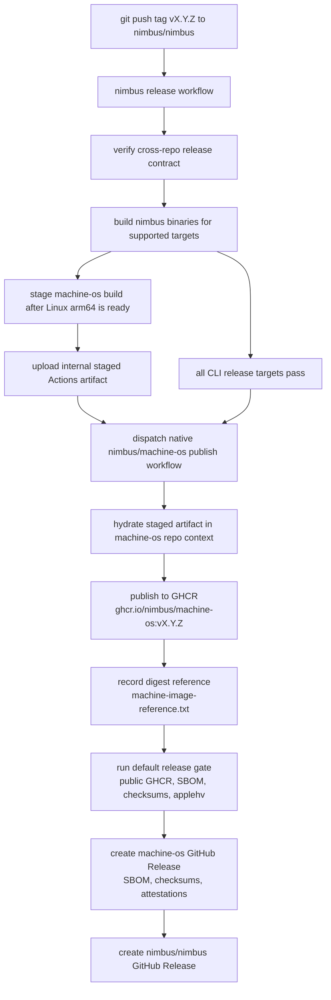
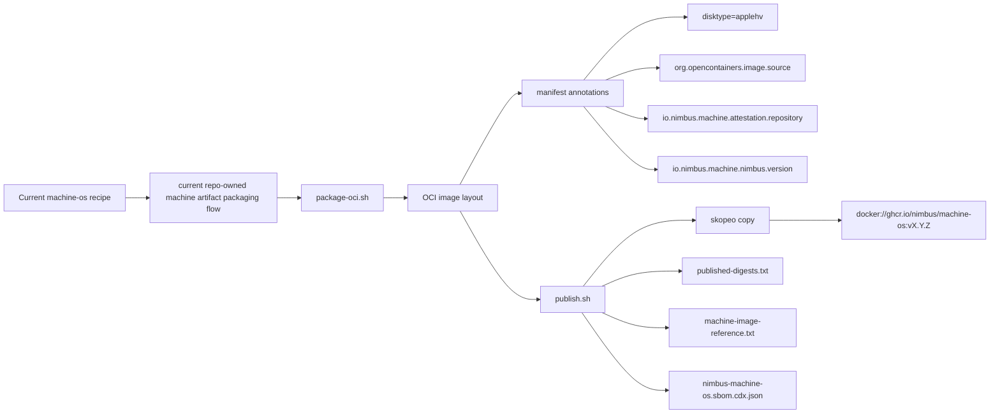
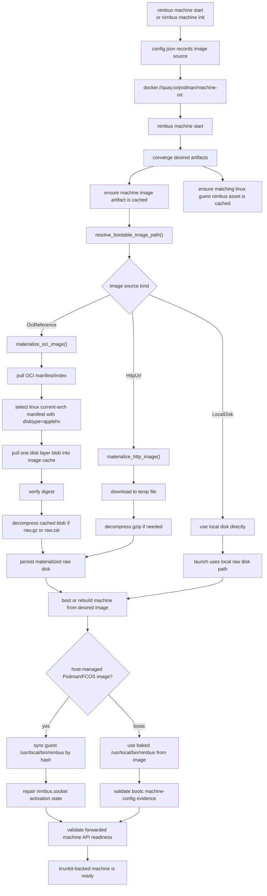
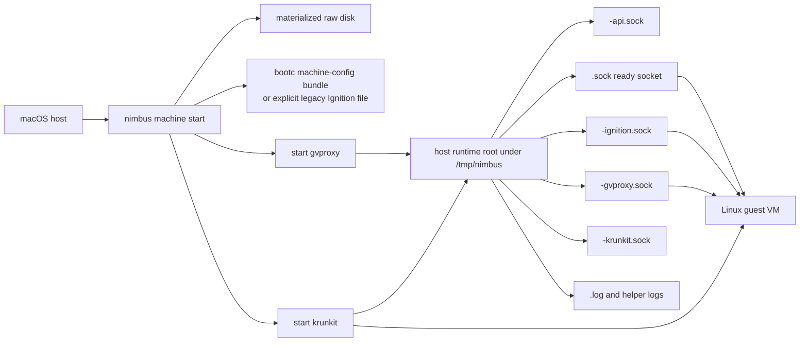
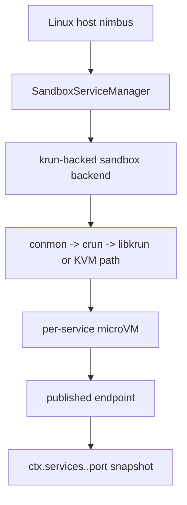

# macOS Machine Image And Control Flows

Current source-backed reference for how Nimbus:

- publishes the macOS guest VM image
- version-links that image to a host `nimbus` release
- pulls and materializes the guest image on a macOS host
- splits control-plane responsibility between the macOS host and the Linux
  guest

The release ownership and host-consumption paths below cover both the current
shipped macOS contract and the direct bootc evidence captured in
[bootc-machine-default-plan.md](/Users/jack/src/github.com/nimbus/nimbus/docs/plans/bootc-machine-default-plan.md).
The settled current macOS contract now uses Nimbus's published bootc image by
pinned immutable reference. Podman's published machine image remains a
compatibility/repair override until the BMD7 legacy-removal phase decides its
final disposition.

Reviewed against:

- `.github/workflows/release.yml`
- `/Users/jack/src/github.com/nimbus/machine-os/.github/workflows/build.yml`
- [crates/nimbus-bin/src/machine/mod.rs](/Users/jack/src/github.com/nimbus/nimbus/crates/nimbus-bin/src/machine/mod.rs)
- [crates/nimbus-bin/src/machine/manager.rs](/Users/jack/src/github.com/nimbus/nimbus/crates/nimbus-bin/src/machine/manager.rs)
- [crates/nimbus-bin/src/machine/api.rs](/Users/jack/src/github.com/nimbus/nimbus/crates/nimbus-bin/src/machine/api.rs)
- [crates/nimbus-bin/src/machine/client.rs](/Users/jack/src/github.com/nimbus/nimbus/crates/nimbus-bin/src/machine/client.rs)
- [crates/nimbus-bin/src/machine/backend.rs](/Users/jack/src/github.com/nimbus/nimbus/crates/nimbus-bin/src/machine/backend.rs)
- [crates/nimbus-bin/src/start/mod.rs](/Users/jack/src/github.com/nimbus/nimbus/crates/nimbus-bin/src/start/mod.rs)
- [crates/nimbus-bin/src/compose/mod.rs](/Users/jack/src/github.com/nimbus/nimbus/crates/nimbus-bin/src/compose/mod.rs)
- `/Users/jack/src/github.com/nimbus/machine-os/scripts/package-oci.sh`
- `/Users/jack/src/github.com/nimbus/machine-os/scripts/publish.sh`
- `/Users/jack/src/github.com/nimbus/machine-os/scripts/check-selinux-avcs.sh`

## Overview

The current macOS architecture is a hybrid control plane:

- the macOS host owns the main Nimbus server, runtime, storage, and
  the `ctx.services` snapshot plus activation path
- the Linux guest owns a narrow machine API and standard-container execution
  lane for service workloads
- the current bring-up image comes from `nimbus/machine-os`, published to
  GHCR as a bootc-native AppleHV disk artifact by immutable digest
- the host `nimbus` release owns the desired machine-os digest and the
  matching Linux guest `nimbus` binary that is baked into that image

The checked-in macOS default image reference recorded when Nimbus creates a
machine (`nimbus machine init` or `nimbus machine start` on a clean host) is
currently:

```text
docker://ghcr.io/nimbus/machine-os:v0.1.30@sha256:f56553e212d2e077d8bedc1db902283f6e12315a621d6046b03d1cb43a0eb08d
```

Current contract note:

- Nimbus's published bootc image is the current bring-up contract for macOS
- the current pinned digest is the public `ghcr.io/nimbus/machine-os:v0.1.30`
  manifest published by the `nimbus/machine-os` repository and proved on
  2026-05-14
- the host `nimbus` release owns the desired machine-os digest and verifies
  that the matching Linux `nimbus` binary is already baked into the guest image
- `nimbus machine start` is the primary convergence path for the bootc
  contract: cache missing artifacts, boot or rebuild from the desired image,
  attach the machine-config bundle, and validate the forwarded machine API
  before reporting success
- the bootc path treats `/usr/local/bin/nimbus` as image content; normal
  startup does not scp or hash-sync a replacement binary into the guest
- this Podman alignment is at the published-image and provider-behavior layer,
  not at the host-state layer; Nimbus does not reuse Podman's machine records,
  VM disks, sockets, or local image store
- the Podman/FCOS image stream remains available only through explicit image
  overrides for compatibility/repair while BMD7 removes or demotes legacy
  reliance
- the bootc image carries a narrow SELinux policy for the
  host-forwarded machine API: `nimbus.service` runs as
  `container_runtime_t`, `/run/nimbus/nimbus.sock` is relabeled
  `container_var_run_t`, and `scripts/check-selinux-avcs.sh` must pass on a
  real guest audit capture before each promotion
- Fedora-base `bootupd`/`lsblk` userdb AVCs are tracked separately from the
  Nimbus machine API policy; `v0.1.30` carries the explicitly approved narrow
  compatibility overlay and passed the real guest AVC gate

## Flow 1: Current Checked-In Host Release To Guest Image Release



### What Each Repo Owns

- `nimbus/nimbus`
  owns host CLI/server/runtime binaries and the host GitHub Release
- `nimbus/machine-os`
  owns the guest VM image build, GHCR publish, machine-image GitHub Release,
  SBOM, checksum, digest-reference, and SELinux AVC gate artifacts

### Why The Flow Is Two-Phase

The host repo builds/stages the machine-os artifact early, but the
externally visible publish step runs later in `nimbus/machine-os` after all
CLI release targets pass:

1. `nimbus/nimbus` stages the artifact from the exact Linux arm64 release
   binary and keeps that staged output internal to Actions
2. `nimbus/machine-os` hydrates that staged artifact for publish, so the
   machine-image repo owns its own GHCR package and GitHub Release

That keeps the release ownership aligned with the repo boundary, which mirrors
Podman's `containers/podman` plus `containers/podman-machine-os` split.

## Flow 2: Current Checked-In Machine Image Packaging Flow



Current decision:

- Nimbus's published bootc image is the current macOS bring-up contract
- the versioned Linux `nimbus` binary is baked into that image; normal bootc
  startup no longer layers guest bootstrap on top of a generic Podman image
- the checked-in `nimbus/machine-os` packaging flow above is the active
  machine-image ownership path
- future `fedora-bootc` image changes in `nimbus/machine-os` must keep
  producing digest-pinned, SELinux-gated, Podman-compatible
  `disktype=applehv` artifacts before promotion

Machine OS lifecycle split:

- explicit Podman-image machines remain host-managed: `machine os apply` and
  `machine os upgrade` record the desired image and rebuild or recreate boot
  artifacts under host control
- bootc-native machines are guest-managed after first boot: `machine os apply`,
  `machine os upgrade`, and `machine os rollback` call the forwarded guest
  machine API, which stages `bootc switch`, `bootc upgrade`, or
  `bootc rollback`; the next restart boots the staged deployment
- host-side disk replacement stays available only as repair/recreate behavior
  when the guest API cannot answer

Current implementation note:

- as of 2026-04-16, the checked-in macOS default already points at the pinned
  immutable Podman digest above
- the full start-time convergence contract has now been proved end to end,
  including guest-binary sync, forwarded machine-API readiness, host service
  control, runtime `ctx.services.<name>.port` snapshot reads,
  `await ctx.services.get("<name>")` activation, and the supported recreate
  drill on isolated roots

### Important Packaging Contract

The host machine manager does not pull an arbitrary OCI image and hope it is a
disk. It looks for a specific artifact shape:

- operating system: `linux`
- architecture: current host-compatible machine arch
- manifest annotation: `disktype=applehv` on the current macOS krunkit path
- exactly one disk layer
- disk layer title suffix such as `.raw`, `.raw.gz`, or `.raw.zst`

That packaging contract is what lets the host treat GHCR as a versioned VM
image registry instead of inventing a separate image service. The provider
capability contract owns that annotation value so the staged Windows path can
select `wsl` without changing the current macOS rule.

## Flow 3: How `nimbus` Pulls The VM Image On macOS



### Where The Image Comes From

By default on the current macOS contract, it comes from Nimbus's published
machine-os stream:

```text
ghcr.io/nimbus/machine-os
```

The host supports three source kinds:

- OCI reference
- `http(s)` URL
- local raw disk path

The OCI reference is the canonical release path. The target contract is an
immutable pinned Nimbus bootc digest owned by the host `nimbus` release, not a
floating tag.

### Where The Image Lands On Disk

For a machine named `default`, Nimbus reserves:

- cache directory:
  `cache/images/`
- guest Linux `nimbus` asset cache:
  `cache/guest-nimbus/`
- materialized bootable raw disk:
  `data/default/images/default.raw`

The manager reuses `default.raw` if it already exists.

Current implementation note:

- the checked-in machine manager now uses that split directly:
  - config under `XDG_CONFIG_HOME`
  - lifecycle state and locks under `XDG_STATE_HOME`
  - durable VM data under `XDG_DATA_HOME`
  - redownloadable machine-image and guest-binary artifacts under
    `XDG_CACHE_HOME`
- the cache-sharing target is **across Nimbus machines only**; Nimbus should
  not couple itself to Podman's or Docker's mutable local stores even though it
  still uses OCI registry conventions and keeps explicit Podman-image
  overrides for repair/compatibility

## Flow 4: macOS Machine Launch Plumbing



### Socket Roles

- `<machine>-ignition.sock`
  first-boot ignition delivery
- `<machine>.sock`
  machine-ready signal
- `<machine>-api.sock`
  host-local forwarded guest machine API
- `<machine>-gvproxy.sock`
  gvproxy networking socket used by krunkit virtio-net
- `<machine>-krunkit.sock`
  krunkit REST/control endpoint

### Transport Reality

`vsock` exists on macOS here, but its role is narrow:

- first-boot bootstrap
- machine-ready signaling

It is not the generic host API transport.

The host control path uses:

- `gvproxy`
- SSH-backed forwarded Unix socket
- guest target socket: `/run/nimbus/nimbus.sock`

## Flow 5: Host Runtime To Guest Service Execution

```mermaid
flowchart TD
    A["developer or runtime code on macOS host"] --> B["host nimbus server"]
    B --> C["await ctx.services.get(\"db\")"]
    C --> D["SandboxServiceManager on host"]
    D --> E["ForwardedMachineApiSandboxBackend"]
    E --> F["MachineApiClient"]
    F --> G["host <machine>-api.sock"]
    G --> H["gvproxy SSH-forwarded socket"]
    H --> I["guest /run/nimbus/nimbus.sock"]
    I --> J["guest nimbus machine api"]
    J --> K["guest ContainerSandboxBackend"]
    K --> L["OCI materializer + conmon + crun + netavark + aardvark-dns"]
    L --> M["guest standard Linux container"]
    M --> N["published localhost port through gvproxy"]
    N --> O["host returns bound service endpoint"]
```

### Current Responsibility Split

Host:

- main Nimbus API
- runtime execution
- storage
- `ctx.services` snapshot plus `ctx.services.get(...)` activation
- service catalog and manager orchestration

Guest:

- machine API
- image-backed service sandbox execution through in-process OCI materialization
- standard-container runtime binaries
- published port plumbing for service workloads

This is intentionally not "guest Nimbus owns the full product surface". The
current architecture keeps the authoritative Nimbus server on the macOS host
and forwards only the service-execution seam into the guest.

## Flow 6: Linux Production Contrast



macOS is different:

- one Linux machine VM per developer environment
- guest standard containers for service workloads
- host Nimbus runtime/server remains on macOS

Linux production:

- no outer machine VM
- service workloads can be real per-service microVMs

## Proof Helpers

The repo now owns four checked-in macOS proof collectors for this flow:

- `make collect-nimbus-machine-cli-proof`
  captures the isolated-root/local-binary machine UX lane: a selected Nimbus
  binary is run under dedicated HOME/XDG/runtime roots, `machine start` is
  PTY-captured, `machine status` is recorded in table/JSON/YAML form, and the
  helper cleans up the temporary machine state afterward. This is the
  copy-pasteable proof lane for current-worktree/local-binary CLI changes; it
  does not touch the installed/Homebrew binary or the user's default machine
  roots. For real contract proof, leave the image unset so the helper
  exercises the shipped pinned-image path; `--image` is a debug-only override
  and can bypass the host-managed machine-image contract
- `make collect-nimbus-machine-guest-proof`
  captures guest-image and guest machine-API proof through `nimbus machine ssh`
- `make collect-nimbus-machine-service-proof`
  captures host `<machine>-api.sock` health/capabilities, direct forwarded
  machine-API sandbox listing, host `nimbus compose up/ps/inspect/top/logs/down`,
  and an optional localhost published-port probe
- `make collect-nimbus-homebrew-cask-proof`
  packages the local release binary plus bundled `libexec/gvproxy` into an
  isolated proof cask, installs it under a temporary Homebrew tap/token, then
  captures host `nimbus --version`, packaged-helper discovery, `machine init`,
  `machine start`, `machine status`, guest `nimbus --version`, nested guest
  machine-API proof, guest SSH, and `machine stop` proof without touching the
  user's shipped `nimbus` cask token or default machine roots. The default
  collector path uses the tagged guest release asset; `--guest-binary` is only
  an explicit override for local guest-build debugging

The repo also now owns deterministic verifiers for the isolated CLI, guest,
service, and Homebrew/cask proof harnesses, including
`make verify-nimbus-machine-cli-proof-helper` for the isolated-root
local-binary flow and `make verify-nimbus-homebrew-cask-proof-helper` for the
packaged macOS path. Those helper verifiers are the CI-safe automation lane
for the harness logic itself; the full `krunkit` guest boot remains a
checked-in local proof lane rather than a GitHub-hosted runner contract.

The current real-host cask-proof bundle at
`/tmp/nimbus-d4a-proof-release-asset` shows `guest.binary.override <none>`,
host `nimbus 0.1.11`, guest `nimbus 0.1.11`,
`runtime.helper_binaries.gvproxy:
/opt/homebrew/Caskroom/nimbus-dev/0.1.11/libexec/gvproxy`, forwarded
`machine_api.reachable: true`, nested guest machine-API `HTTP/1.1 200 OK`
proof plus `protocol_version: v1alpha2`, and `/Users` virtiofs reachability,
then cleans up the temporary `local/nimbus-proof` tap and `nimbus-dev` cask
token afterward.
Current status-output note: `nimbus machine status` now includes a
`guest_binary_contract` block for the macOS host-managed path so operators can
see the desired guest-binary provenance (`release-asset` vs
`explicit-override`), desired version/hash/cache path, and, when the machine is
running, the observed guest `/usr/local/bin/nimbus` version/hash too.
The current no-ambient-`PATH` hardening rerun at
`/tmp/nimbus-d4a-proof-no-path` revalidated that same packaged/Homebrew
contract after helper resolution stopped trusting shell `PATH`; the bundle
again recorded packaged `gvproxy`, guest `nimbus 0.1.10`, machine API
readiness, and `/Users` virtiofs reachability before cleanup.
The current Podman-default-directory rerun at
`/tmp/nimbus-d4a-proof-podman-dirs` then revalidated the same contract after
the named fallback directories were aligned to Podman's darwin
`helper_binaries_dir` defaults; the bundle again recorded packaged
`gvproxy`, guest `nimbus 0.1.10`, machine API readiness, and `/Users`
virtiofs reachability before cleanup.

The current checked-in isolated proof project for that collector is
intentionally `build:`-backed, not `image:`-backed. The validated real-host
bundle at
`/tmp/nimbus-mac-buildproof.nDZ0P4/service-proof-buildstart-pathfix-teardownfix-refreshfix-stalepidfix-crlffix`
shows `service config` lowering with `source.kind: build`, a resolved
`dockerfile_path`, guest machine-API `service-sandboxes.build-start:
available=true`, successful `compose up/ps/inspect/top/logs/down`, and
localhost `HTTP/1.1 200 OK` on `http://127.0.0.1:18080/healthz`.

The current real-host `start` auto-start proof bundle at
`/tmp/nimbus-mac-closeout.FNcv0I/start-proof-d4c-autostart` then closes the
next host-resident DX seam on the same pinned Podman contract: the machine was
stopped before startup, `nimbus start` on port `18084` brought it back to
`running`, `/health` returned `200 {"ok":true}`, `services:activate` returned
`18080`, localhost `http://127.0.0.1:18080/healthz` returned `200 ok`, native
`/ws?tenant_id=demo-ws` captured an initial empty `subscription_result`
followed by a pushed `subscription_result` after an HTTP document insert, and
tenant deletion withdrew the published localhost service again.

The repo also owns one checked-in local guest-binary build helper for the same
contract:

- `make build-nimbus-machine-guest-binary`
  builds the matching Linux guest `nimbus` artifact into
  `target/<triple>/release/nimbus` on the current developer host; use it only
  with an explicit `NIMBUS_MACHINE_GUEST_BINARY=...` override when intentionally
  testing a local guest build instead of the tagged release asset cache

The repo also owns two checked-in operator drill helpers for the same contract:

- `make collect-nimbus-machine-diagnostics`
  captures the persisted config/state records plus the flat short runtime-root
  socket, pid, and log inventory for an isolated machine root
- `make recreate-nimbus-machine`
  performs the supported stop/remove/init/start repair drill on isolated roots;
  by default it follows the current pinned machine-image contract, while
  `IMAGE=...` remains an explicit diagnostic override only

## Current Reliability Notes

- Current Podman/FCOS host convergence stages the guest binary under
  `/usr/local/bin/nimbus`, backed by FCOS's writable `/var/usrlocal`, then
  repairs `nimbus.socket` activation before it trusts the forwarded machine
  API. The active macOS fallback does not rely on Ignition to fetch or version
  that binary, and it does not expect macOS users to build a Linux guest
  binary locally; the normal fallback path is the matching cached release
  asset.
- Bootc-native convergence does not stage a replacement guest binary. The
  matching Linux `nimbus` binary and systemd units are baked into the
  Nimbus-owned bootc image, and host readiness validates the bootc
  machine-config evidence plus the forwarded machine API.
- The supported Homebrew Apple Silicon packaging path keeps `krunkit` as an
  explicit formula dependency and now prefers a bundled `libexec/gvproxy`
  beside the packaged `nimbus` binary, matching Podman's "bundle helper,
  don't require Podman as a dependency manager" installer shape. Helper
  resolution now follows the same general priority as Podman's darwin
  `helper_binaries_dir` search: explicit binary override, optional
  helper-directory override
  (`NIMBUS_MACHINE_HELPER_BINARY_DIR`), packaged helper locations, known
  Podman/Homebrew helper locations, without ambient `PATH` fallback for
  machine helpers.
- Manual macOS tarball installs need to preserve the same relative
  `prefix/bin/nimbus` plus `prefix/libexec/gvproxy` layout that the cask
  provides, or set `NIMBUS_MACHINE_HELPER_BINARY_DIR` explicitly. Moving only
  the `nimbus` binary into `/usr/local/bin` is not a supported machine
  install shape because it strands the bundled helper.
- Machine-API `list` and `inspect-current` refresh only sandboxes that may
  still be live (`starting`, `ready`, `not_ready`, `stopping`). Historical
  stopped sandboxes are intentionally not re-inspected during these reads so a
  reused host port does not let old cleanup paths withdraw the active gvproxy
  forward.
- Both the guest standard-container backend and the krun backend now treat a
  surviving pidfile without a live process as stale state. If shutdown was not
  requested, that state collapses to `failed` instead of lingering in
  `starting`, which keeps post-restart `compose up` from reporting
  `already_running` for dead sandboxes.
- The checked-in service-proof collector now waits for `compose inspect` to
  report `status: ready`, retries the localhost published-port probe, and
  normalizes HTTP CRLF headers before matching the `200 OK` status line. That
  keeps the macOS proof bundle deterministic against real host responses.
- The deterministic proof helper for that collector now mirrors the live macOS
  contract instead of the earlier simplified image-backed fixture: it renders a
  `build:`-backed compose service and a `v1alpha2` guest capability payload
  with `service-sandboxes.build-start` available, so regressions in the
  build-backed lane are caught before the next real-host run.
- When `nimbus start` loads a macOS container-backed Compose project without an
  injected machine-API client, it now auto-starts the initialized default
  machine under the existing machine lock before wiring the forwarded guest
  sandbox backend. That keeps `start` aligned with the documented "machine
  start is the convergence path" contract instead of requiring a manual
  pre-start step.

## Practical Summary

If you want the shortest accurate explanation:

1. A `nimbus` host release owns the desired macOS guest contract: today that
   is a pinned Nimbus-owned bootc image digest that already embeds the
   matching Linux `nimbus` binary.
2. `nimbus machine init` records the machine contract; the checked-in default
   currently uses `ghcr.io/nimbus/machine-os` by immutable digest. `nimbus
   machine start` now also performs that same initialization step
   automatically when no machine exists yet, and `nimbus machine init --now`
   remains the explicit combined shortcut.
3. `nimbus machine start` checks the local caches, pulls any missing image
   artifact, pulls the guest-binary artifact only for explicit Podman/FCOS
   fallback machines, and materializes the bootable raw disk.
4. If the machine's recorded base image already matches the desired digest, the
   host reuses the machine; if it does not match, the host performs a
   controlled rebuild or recreate from the desired image.
5. For the host-managed Podman/FCOS fallback, after boot the host hash-checks
   and syncs `/usr/local/bin/nimbus` inside the guest. On FCOS that is backed
   by the writable `/var/usrlocal/bin/nimbus` path with executable labeling.
   For bootc-native machines, the host treats `/usr/local/bin/nimbus` as image
   content and validates readiness instead of scp-ing a new binary into place.
6. If the host-managed macOS contract does not already have an explicit SSH
   identity recorded, `nimbus machine start` auto-generates a machine-owned
   keypair under the Nimbus machine data root before it boots the guest, so
   first-run SSH and guest-binary sync do not require a separate manual key
   provisioning step.
7. The same host convergence step then repairs guest socket activation
   (`daemon-reload`, clears failed `nimbus` units, removes any stale
   `/run/nimbus/nimbus.sock`, and starts `nimbus.socket`) before validating
   the forwarded machine API, so a fresh Podman-image boot does not get stuck
   on a pre-sync `start-limit-hit`.
8. On macOS container-backed Compose projects, `nimbus start` now reuses that
   same convergence path: if the initialized default machine is stopped, the
   host starts it before it wires the forwarded guest backend.
9. The host Nimbus server talks to the guest machine API through a forwarded
   Unix socket, and the guest starts standard Linux containers for declared
   services.

The direct bootc path changed the release target, not the evidence bar.
Nimbus-owned bootc defaults are promoted only after a published release
artifact and a real macOS guest proof pass
`scripts/verify-bootc-default-promotion-gate.sh`. That composed gate requires
the release bundle, AppleHV OCI metadata, SBOM/checksum/digest evidence, guest
machine API readiness, bootc lifecycle capabilities, runtime service proof,
virtiofs evidence, SELinux enforcing mode, Nimbus socket/domain labels, and a
clean AVC check. `v0.1.30` passed that gate with the approved narrow
Fedora-base `bootupd_t` compatibility overlay.

For rollback, a healthy bootc-native machine should use the guest-mediated
`nimbus machine os rollback --restart` path. When the guest API cannot answer,
or when the released fleet default itself must move back, operators should use
`nimbus machine os apply <previous-digest> --restart` or an explicit
repair/recreate path. The Podman-compatible image remains available only as an
explicit compatibility/repair override until BMD7 removes or further demotes
it.
