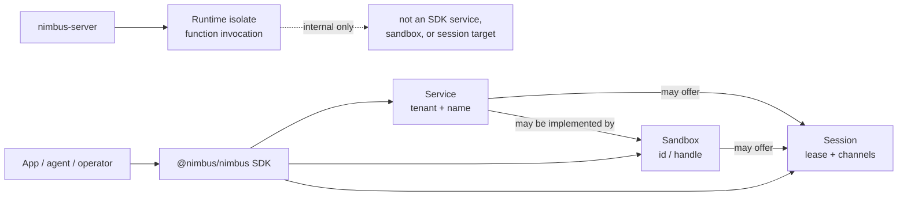
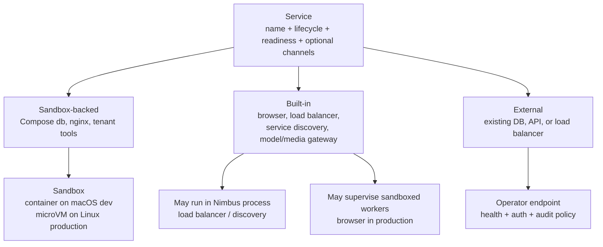
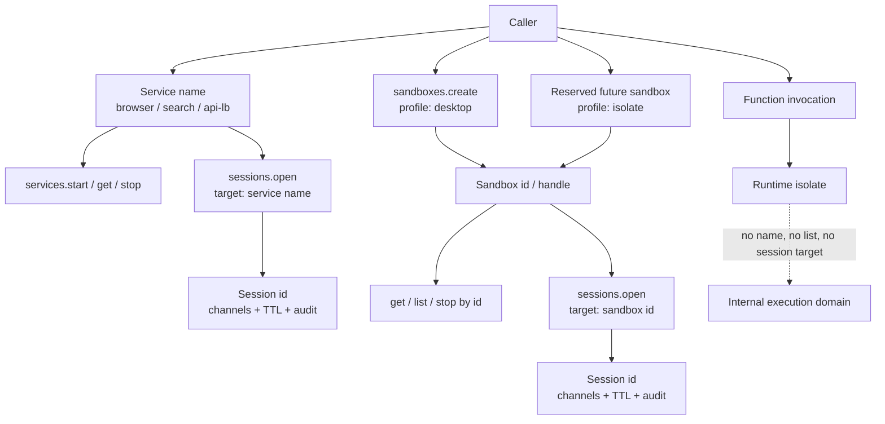

# Service, Sandbox, Session, And Runtime-Isolate Resource Model

This document defines the Nimbus resource vocabulary used by the Rust crates,
the `@nimbus/nimbus` SDK, service-control docs, and sandbox plans.

## Definitions

| Term | User-facing meaning | Rust ownership | Addressing rule |
| --- | --- | --- | --- |
| Service | A named tenant-scoped capability or app dependency with lifecycle, readiness, endpoints, and optional session channels. Examples: `db`, `search`, `mcp-tools`, `model-gateway`, `browser`, `api-lb`. | `nimbus-services` owns service definitions, backend selection, activation, readiness, and runtime bindings; `nimbus-server` owns authority; `nimbus-sandbox` may supply sandbox backends. | Addressed by tenant plus service name. Public SDKs do not have to expose raw binding resolution. |
| Sandbox | An isolated execution environment with a backend, image/profile, filesystem, network, resource policy, and lifecycle. Examples: code runner, desktop VM, GPU workload, one-off agent world. On macOS local development this may lower to a container inside the outer machine; on Linux production it may lower to a microVM. | `nimbus-sandbox` owns backend-agnostic specs, handles, endpoints, egress, quotas, and backend dispatch. | Addressed by sandbox id or returned handle, not by name. |
| Session | A scoped lease/interactions channel to a service or sandbox. Examples: desktop screencast/input, shell/stdio, file transfer, model or tool stream. | Future SDK/server surface; backed by `nimbus-server` authority and the target resource's manager/backend. | Opened against an explicit target: `{ service: { name } }` or `{ sandbox: { id } }`. |
| Runtime isolate | A V8/Bun/Node-compatible invocation execution domain for app code. It may have host capabilities such as `ctx.db` or exact service grants. | `nimbus-runtime` defines the execution and host-bridge surface with zero workspace dependencies; `nimbus-server` constructs and authorizes it. | Not a service, not an SDK sandbox, and not a session target. A future user-created isolate-backed sandbox would use sandbox `profile: "isolate"`, not one of these invocation isolates. |

## Concept Maps

The short version: services are named capabilities, sandboxes are isolated
resources, sessions are scoped interactions, and runtime isolates are internal
invocation machinery.



A service definition chooses a service backend. Sandbox-backed is the
current Compose path; built-in and external services use the same service noun
without forcing everything into containers or microVMs.



Addressing stays intentionally asymmetric. Service names are stable app
dependency names. Sandbox ids are returned resource handles. Sessions target one
of those two things. Runtime isolates are not addressable resources.



## Compose Services

Nimbus inherited the word "service" from Docker Compose intentionally. A Compose
`services:` entry is an app dependency declaration. Today Nimbus lowers that
declaration into a sandbox service backend: `ServiceBackend::Sandbox(SandboxSpec)`
stored in a `ServiceDefinitionCatalog`, then started by `ServiceManager` through
a `SandboxBackend`.

That means current Compose-backed services are sandbox-backed, but the user
resource is still a service:

```text
compose service name
  -> service catalog entry
  -> ServiceBackend::Sandbox(SandboxSpec)
  -> sandbox handle
  -> ready service binding
```

Do not collapse the nouns. The service is the named dependency and readiness
contract. The sandbox is the isolation mechanism used to run it.

A service-backed sandbox spec may carry owner metadata such as
`SandboxOwnerSpec::Service { name }` so backends can scope artifacts, audit
records, and readiness bindings to the owning service. That owner metadata is
not a sandbox lookup key. Public sandbox APIs still use sandbox ids or returned
handles, and sessions target sandboxes by id.

## Sandbox Root Materialization

Sandbox specs declare what root material the sandbox should run, while sandbox
backends own how that material is prepared and started. Build input belongs
under the OCI image branch because a Dockerfile/context build is a way to obtain
OCI image material, not a peer root kind.

```rust
pub enum SandboxRootSpec {
    Rootfs(SandboxRootfsSpec),
    OciImage(SandboxOciImageSpec),
}

pub struct SandboxOciImageSpec {
    pub source: SandboxOciImageSource,
}

pub enum SandboxOciImageSource {
    Reference(SandboxOciImageReferenceSpec),
    Build(SandboxOciBuildSpec),
}
```

The names are intentionally precise: OCI means Open Container Initiative, so
`OciImage` is not acronym stutter. `Rootfs` versus `OciImage` answers what kind
of root material the sandbox uses; `Reference` versus `Build` answers how OCI
image material is obtained. Backend lifecycle remains a single
`SandboxBackend::start(SandboxSpec)` path. There should not be public
`start_from_image` or `start_from_build` lifecycle APIs after the pre-launch
refactor.

Compose `image:` lowers to `SandboxOciImageSource::Reference(...)`. Compose
`build:` lowers to `SandboxOciImageSource::Build(...)` only when build admission
allows it. Local development may allow explicit build input. Production tenant
isolation stays fail-closed by default until an operator-owned build provenance,
cache, SBOM/signature, and admission story exists.

## Service Backends

A service is not synonymous with an OCI container or microVM. The service
definition chooses a backend:

| Service backend | Examples | Runtime backing | Notes |
| --- | --- | --- | --- |
| Sandbox-backed service | Compose `db`, `search`, sandboxed nginx load balancer, tenant tool server | `nimbus-sandbox` handle plus readiness/endpoints | The current Compose path. Local macOS uses the machine-os/container topology; Linux production uses the microVM-capable sandbox backend. |
| Built-in service | load balancer, service discovery, browser supervisor, model/media gateway | Nimbus-owned Rust component, optionally with child workers | Built-in means Nimbus owns the service backend and policy. It does not always mean unsandboxed. Browser execution should still use a sandboxed provider in production. |
| External service | existing database, upstream API, external load balancer | operator-provided endpoint plus health/auth policy | Nimbus manages authorization, endpoint policy, audit, and readiness checks, but does not own the process. |

Load balancers fit the service model cleanly. A built-in load balancer can expose
one named service endpoint and internally route to exact target services,
versions, or generations. A sandbox-backed nginx load balancer is also a service:
its sandbox contains nginx, but the name users/apps depend on is still the
service name. In both cases, grants to the load-balancer service do not
automatically grant direct access to the target services behind it.

Service discovery is mostly an internal service-manager responsibility. Expose
it as a named built-in service only when Nimbus deliberately offers a protocol
endpoint such as DNS, xDS, or Consul-compatible discovery. The ordinary SDK path
does not need to return raw service bindings just to let applications use named
services.

The browser capability is a built-in service that provides sessions. The
`browser` service owns admission, quotas, warm pools, storage-state policy, and
session creation. Production browser processes are still sandbox-backed because
web content is hostile; the built-in service is the supervisor and policy
surface, not proof that Chrome runs inside the Nimbus process.

## Addressing Rules

- Services are name-addressable because stable names are part of the app
  dependency contract. That name can drive internal binding resolution,
  autoscaling, service-targeted sessions, and load-balancer routing.
- Public SDKs do not need to expose a raw `services.resolve(...)` binding API in
  the MVP. `services.start(...)`, `services.get(...)`, and future
  `sessions.open({ target: { service: { name } } })` cover the current product
  shape. A raw resolver can be added later for explicit advanced cases such as a
  sandboxed nginx service that must consume generated upstreams.
- Sandboxes are not name-addressable. They may have labels, descriptions, or
  operator metadata for filtering, but control operations target a sandbox id or
  handle returned by creation/list APIs.
- Sessions are not a name registry. A session opens a scoped interaction with a
  target.
- A service-targeted session uses `{ service: { name } }` because services are
  name-addressable. The server resolves the service at session-open time, records
  the service generation or rebind policy, and returns session channels.
- A sandbox-targeted session uses `{ sandbox: { id } }`. There is no
  `resolveSandboxByName` API.

## SDK Shape

The SDK should preserve these boundaries:

```ts
import { Nimbus } from "@nimbus/nimbus";

const nimbus = new Nimbus();

// Stable app dependency.
await nimbus.services.start({ name: "search", waitUntil: "ready" });
const search = await nimbus.services.get({ name: "search" });

// Future isolated execution resource once server-backed sandbox routes land.
const sandbox = await nimbus.sandboxes.create({
  profile: "desktop",
});

// Future scoped interaction with an existing sandbox.
const desktop = await nimbus.sessions.open({
  target: { sandbox: { id: sandbox.id } },
  channels: ["screen", "input", "files"],
});

// Future scoped interaction with a named service.
const tools = await nimbus.sessions.open({
  target: { service: { name: "mcp-tools" } },
  channels: ["stdio", "events"],
});

// Future built-in browser service session.
const browser = await nimbus.sessions.open({
  target: { service: { name: "browser" } },
  channels: ["cdp", "page", "files"],
  profile: "research",
});
```

Simple service use does not require a session. `services.start(...)`,
`services.stop(...)`, `services.restart(...)`, and `services.get(...)` are the
canonical lifecycle/status verbs. Use a session when the caller needs a scoped
stream, lease, interactive channel, file exchange, audit trail, or resumability.
The current landed SDK service slice exposes service lifecycle/status; sandbox
and session SDK methods stay hidden until their matching server routes land.

## SDK Transport Selection

`@nimbus/nimbus` is the single public product API. Transport selection is an
internal client concern, not a second user-facing API.

Default transport is authenticated network control-plane access: REST today,
with gRPC, WebSocket, SSE, or WebRTC possible behind
`@nimbus/nimbus/transports/*` when a product need appears. This path is used by
external processes, CLIs, app servers, containers, Linux microVM workloads,
macOS guest workloads, and adapter code that imports the SDK.

A host transport is allowed only for a Nimbus-managed isolate backend when the
server explicitly injects an SDK host-transport capability for that isolate,
invocation tier, principal class, and exact grant set. This is backend-neutral:
V8 is the current implementation substrate, while Bun/JSC or another isolate
backend must fail closed until it has equivalent transport gating, grant checks,
pool/session partitioning, and tests.

Adapter-created contexts remain adapter-shaped even when Nimbus hosts the
adapter workload inside an isolate. Convex, Cloud Functions, Firebase,
MongoDB, DynamoDB, and future compatibility surfaces must not expose
`ctx.services`, `ctx.sandboxes`, `ctx.sessions`, or equivalent Nimbus shortcuts.
Adapter code that needs Nimbus features imports the SDK explicitly:

```ts
import { Nimbus } from "@nimbus/nimbus";

const nimbus = new Nimbus();
await nimbus.services.start({ name: "search", waitUntil: "ready" });
```

Invocation tier still matters. Convex queries and mutations keep their
network/control-plane restrictions, so service management belongs in actions,
HTTP actions, Cloud Functions handlers, native workloads, or future tiers that
explicitly widen that authority. The same SDK call may use network transport or
host transport depending on the runtime policy, but the authorization result
must be identical: server-side principal mapping plus exact service grants.

Low-level runtime ops such as `op_nimbus_ctx_service_lookup` are not public SDK
APIs. They are internal host-bridge implementation details. A future SDK host
transport should model SDK/control-plane requests directly; it must not turn
raw service-binding lookup into the public service lifecycle API.

## Dynamic Resources

Agents and apps may need runtime-created resources. The default primitive should
be a sandbox when the caller wants an isolated world for one task. A dynamic
service is appropriate only when the caller wants to publish a named capability
that other code, later sessions, or other agents can resolve by name.

Dynamic services therefore need stricter control-plane fields than dynamic
sandboxes:

- tenant-scoped unique service name
- service backend kind: sandbox, built-in, or external
- sandbox spec, built-in provider reference, or external endpoint reference
- readiness probe and endpoint policy
- session/channel policy when the service offers sessions
- autoscale, warm-pool, and load-balancing policy when applicable
- owner principal and audit correlation
- TTL/idle policy and cleanup behavior
- exact service grants for callers that may reach it
- image/provenance, egress, resource, and secret policy

A sandbox can be promoted or registered as a service only through an explicit
service-definition API that records those fields. Creating a sandbox must not
implicitly create a service name.

## Runtime Isolates Are Not SDK Sandboxes

Nimbus runtime isolates execute app code. They are not user-addressable sandbox
resources, even though V8 isolate execution is an isolation mechanism in the
general security sense. A function invocation cannot be resolved by service name,
listed as an SDK sandbox, or opened as a resource session.

The host may later choose to run a runtime worker inside a process, container, or
microVM for operational reasons. That deployment choice does not make the
runtime isolate a `nimbus.sandboxes` resource. `nimbus-runtime` stays
execution-only; service, sandbox, and session orchestration live in
`nimbus-server`, `nimbus-services`, and `nimbus-sandbox`.

If Nimbus intentionally exposes isolate execution as a user-created sandbox
resource, the reserved sandbox profile spelling is `profile: "isolate"`. That
resource must satisfy the sandbox contract: id/handle lifecycle, policy, quotas,
audit, tenant binding, and supported session channels. It is not a backdoor that
turns ordinary function invocation isolates into listable or attachable SDK
sandboxes.

## Crate Alignment

- `nimbus-sandbox` stays isolation-only: backend-agnostic specs, handles,
  start/inspect/stop, endpoints, egress, quotas, and backend dispatch.
- `nimbus-services` stays the named service layer over service backends:
  catalogs, backend selection, activation, readiness, handles or built-in
  supervisors keyed by tenant plus service name, and runtime service bindings.
- `nimbus-server` owns authorization, principal class checks, route policy,
  audit, and any future session lifecycle.
- `nimbus-runtime` receives only explicitly installed host capabilities for an
  invocation or SDK host-transport surface. It must not own service or sandbox
  orchestration.
- `@nimbus/nimbus` exposes the ergonomic client namespaces without leaking
  adapter ctx shortcuts: `services`, `sandboxes`, and future `sessions`.

## Non-Rules

- "Long-running" is common for services but not the definition. A service can be
  cold-started, warm-pooled, restarted, or TTL-bound as long as the named
  dependency and readiness contract hold.
- "Built-in" is not a synonym for unsandboxed. It means Nimbus owns the service
  implementation and policy surface. Built-in browser service workers still run
  sandboxed in production.
- "MicroVM" is not the definition of sandbox. Containers, libkrun sessions, GPU
  sandboxes, and future backends can all implement the sandbox abstraction.
- "Session" is not another word for WebSocket protocol session. Existing
  transport sessions remain transport-specific; resource sessions are future
  scoped leases/interactions over services or sandboxes.
- "Runtime isolate" is not another word for SDK sandbox. Runtime isolates are
  invocation execution domains, not user-created resources. The reserved future
  SDK sandbox spelling for explicit isolate-backed execution is
  `profile: "isolate"`, not `profile: "js-isolate"`.
