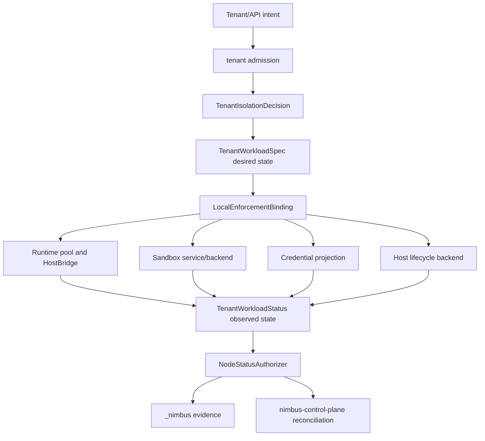

# Local Enforcement Boundary

This document defines the server-local enforcement seam that will become
`nimbus-node` when distributed placement and node membership are extracted from
the single-server shape.

It complements:

- [tenant isolation](../../tenant-isolation.md)
- [tenant isolation runbook](../../operating/tenant-isolation.md)
- [server auth and runtime trust](auth-runtime-trust.md)
- [runtime capability and adapter boundary](../runtime/adapter-boundary.md)
- [table identity](../storage/table-identity.md)
- [container image](../../operating/container-image.md)
- [tenant domain and node enforcement boundary plan](../../plans/tenant-domain-and-node-enforcement-boundary-plan.md)

## Purpose

Nimbus tenant separation depends on a narrow control chain:

```text
tenant intent
  -> tenant admission
  -> admitted decision
  -> desired workload state
  -> local enforcement binding
  -> runtime, sandbox, HostBridge, credentials, host lifecycle, evidence
```

The tenant domain decides what authority exists. Local enforcement applies that
admitted authority to one node, one workload generation, and one runtime or
sandbox instance. It can deny work when local facts do not match the admitted
projection, but it must never invent new authority.

This boundary exists so a compromised or confused lower layer cannot reconstruct
tenant authority from route parameters, raw bearer claims, Compose fields,
process metadata, unit names, provider namespaces, or ambient "current tenant"
state.

## Boundary Map

| Component | Owns | Authority Source | Must Not Do |
| --- | --- | --- | --- |
| Tenant admission (`tenant`, future `nimbus-tenant`) | Tenant identity, policy inputs, grants, quotas, stable workload identity, immutable `TenantIsolationDecision` | Authenticated server request plus policy inputs | Launch processes, render host artifacts, write node status, or trust lower-layer tenant strings |
| Desired workload state | Server-owned `TenantWorkloadSpec`, generation, assignment, deletion state, finalizer-like cleanup records, hard limits | `TenantIsolationDecision` plus server/control-plane placement | Treat observed status as authority or let tenant callers set deletion/finalizer fields directly |
| Local enforcement (`local_enforcement`, future `nimbus-node`) | Binding admitted decisions to runtimes, sandboxes, HostBridge, credentials, egress, host lifecycle, and evidence | `TenantWorkloadSpec` plus admitted projections | Broaden policy, change placement, mint credentials from raw input, or mutate desired state through status |
| Workload supervisor component | Process-local startup controls, proxy hooks, credential delivery hooks, child lifecycle, backend-local operation checks | Narrow policy projection delivered by local enforcement | Act as the policy decision point or grant authority not present in the active projection |
| Runtime primitives (`nimbus-runtime`) | V8/Deno/Node/Bun execution mechanics, heap/pool primitives, runtime host-call boundary | Runtime admission projection from the decision | Reuse a pool for a stricter tenant profile after broader exposure or decide tenant access from runtime context |
| Sandbox primitives (`nimbus-sandbox`) | OCI/container/krun/microVM launch primitives, filesystem/network/volume isolation, backend evidence | Sandbox projection and host lifecycle plan from local enforcement | Accept tenant raw paths, unit names, ports, devices, images, or mounts without admission |
| HostBridge and runtime host calls | Provider-neutral capability execution and adapter-owned shims | Decision-derived storage, service, and credential projections | Dispatch cross-tenant operations from caller-supplied tenant IDs or provider-shaped payloads alone |
| Storage/API PEP | Tenant-scoped storage access, stable `TableId` resolution, transaction atomicity, backend-owned physical layout | `TenantStorageAccessDecision` and explicit table/namespace resolution | Treat public table names, document IDs, or SQL identifiers as isolation proof |
| `_nimbus` system tenant | Operator/system evidence and control data | System/operator authority plus decision/evidence correlation | Expose system records through ordinary tenant APIs or let application principals write broad targets |
| `nimbus-control-plane` | Distributed desired state, node membership, placement, policy delivery, reconciliation | Server/control-plane authority | Treat node-reported status as desired state or let a node promote itself into broader authority |

## Exemplar Pattern Mapping

Nimbus borrows invariants from mature systems, not their whole product shape.

| Source Pattern | Nimbus Adaptation | Required Separation Benefit |
| --- | --- | --- |
| OpenShell gateway and sandbox supervisor | `nimbus-server` and future `nimbus-control-plane` own durable state and admitted policy; local enforcement may run a workload-local `supervisor` component before tenant code | The supervisor is a policy enforcement point. It can deny execution or local operations, but it cannot grant policy, mint broader credentials, or change placement |
| Kubernetes NodeRestriction and status subresources | A `NodeStatusAuthorizer` shape resolves a caller to one concrete Nimbus node before accepting status, lease, heartbeat, or evidence patches | A node can update only observed fields for workloads assigned to that node and matching workload UID, generation, and decision ID |
| Kubernetes observed generation, conditions, finalizers, and quota | `TenantWorkloadStatus` carries `observed_generation`; conditions merge by type; deletion/finalizer state is server-owned; hard limits stay separate from observed usage | Stale status, cleanup progress, and usage evidence cannot become authorization or quota expansion |
| CockroachDB tenant targets and capabilities | `_nimbus`, all-tenant, and cross-tenant targets are system/operator targets; typed capabilities are deny-by-default and narrow | Customer tenants cannot self-target broad keyspaces, and all-tenant aggregation remains read-only unless a specific system capability admits a write |
| Convex namespace and table accounting | System metadata queries name user, system, virtual, hidden, or orphaned/deleting namespaces explicitly; storage uses tenant-qualified table identities | Ambient component or tenant context cannot accidentally move a query into system metadata or old same-name table data |
| workerd isolate and capability model | Runtime pools carry trust classification and contamination bits for multi-tenant sharing, elevated host capabilities, and broader credential exposure | Reuse is monotonic in trust; stricter reuse requires teardown rather than downgrade |
| Podman Quadlet generator constraints | Runtime and node-install paths accept only typed allowlists. Operator export can warn, but product mutation paths fail closed on pass-through fields | Tenant-authored intent cannot become raw systemd text, `PodmanArgs`, host networking, privileged mode, unsafe mounts, or arbitrary unit sections |

Patterns that do not protect these boundaries stay out of scope. Nimbus should
not clone Kubernetes API machinery, CockroachDB span configuration, Convex table
usage internals, workerd isolate-group implementation, or Podman's generator.

## State Flow



`TenantWorkloadSpec` is desired state. `TenantWorkloadStatus` is observed state.
The control plane may reconcile from status, but status never becomes admission
or desired policy.

## Admission And Binding

Local enforcement starts from an admitted binding, not from raw request input.
A future `LocalEnforcementBinding` should be a narrow, immutable envelope with:

- `decision_id`
- `tenant_id`
- `workload_stable_id`
- `workload_uid`
- `generation`
- `assigned_node_id` or signed placement claim
- runtime or sandbox backend choice
- storage, service, HostBridge, egress, credential, and host lifecycle
  projections
- resource hard limits and reservations
- deletion/finalizer state reference
- audit redaction metadata

Every lower enforcement point should accept either this binding or a projection
derived from it. The lower point must not rebuild authority from:

- raw `TenantId` values
- route parameters
- bearer claims
- Compose service names
- process metadata
- systemd unit names
- cgroup paths
- provider namespaces
- public `TableName` or adapter document IDs
- ambient adapter/component context

## Desired Workload State

`TenantWorkloadSpec` is server/control-plane owned. It captures what Nimbus has
decided should exist:

- admitted tenant and stable workload identity
- workload UID and generation
- assigned node or placement claim
- decision ID and policy generation
- runtime lane or sandbox backend
- storage and service projections
- credential projection requirements
- egress and HostBridge grants
- host lifecycle plan
- hard resource limits and reservations
- deletion state and finalizer-like cleanup records

Tenant callers may request changes through ordinary APIs. They do not directly
set generation, assigned node, deletion timestamp, finalizers, credential
subjects, `_nimbus` writes, or provider namespaces.

`nimbus-control-plane` owns distributed desired state and placement when Nimbus
leaves the single-server shape. It delivers desired specs and policy to nodes.
It does not let node-local status mutate desired policy or grant placement.

## Observed Local Status

`TenantWorkloadStatus` is node-reported evidence:

- phase
- typed conditions keyed by condition type
- `observed_generation`
- reporting node ID
- decision ID
- sandbox ID or runtime invocation ID
- host unit/job/process IDs
- observed resource usage
- cleanup progress
- backend capability and health diagnostics
- system evidence correlation IDs

The implementation keeps high-cardinality lifecycle identifiers in structured
status evidence, lifecycle-status audit events, diagnostics, and
`_nimbus.workload_status` records. Metrics labels are deliberately limited to
low-cardinality values such as backend kind, phase, and patch target.

A status writer must be authorized through a restricted subresource shape. The
authorizer first resolves the caller to one concrete `NodeIdentity`, then checks
that the patch targets:

- a workload assigned to that node
- the same workload UID
- the same observed generation
- the same decision ID or an admitted successor transition
- only status, lease, heartbeat, log, diagnostic, or evidence fields

The authorizer rejects attempts to change:

- spec fields
- labels or selectors
- desired policy
- grants or capabilities
- quota hard limits or reservations
- placement or assignment
- credential subjects
- admission results
- deletion/finalizer authority
- user-visible tenant data

Stale status remains useful diagnostics. It is not proof that the workload is
still admitted, that a credential should renew, or that quota is available.

## Workload-Local Supervisor

Some backends need a process-local component that starts before tenant code.
That component may be called `supervisor`, matching the OpenShell vocabulary.
It is managed by local enforcement and receives only a narrow active projection.

It may:

- apply startup-time process, filesystem, proxy, credential, and child
  lifecycle controls
- approve or deny local operations against the active admitted projection
- reload dynamic policy when the backend supports live reload
- keep the last-known-good dynamic policy if a live update is invalid
- emit local health and denial evidence

It must not:

- decide tenant authority
- mint credentials outside the admitted provider/audience scope
- infer tenant identity from process-local metadata
- change placement or desired state
- widen filesystem, network, device, or HostBridge authority
- downgrade a broader trust runtime/sandbox instance into a stricter profile

## Runtime, Sandbox, And HostBridge Enforcement

Runtime pools, sandbox backends, and HostBridge operations are separate policy
enforcement points. They consume admitted projections.

Runtime pools carry a trust classification. Exposure to any of the following
moves the pool to an equal-or-broader trust class:

- multiple tenants
- elevated host capabilities
- broader credential material
- broader isolate group sharing
- debug/inspector or privileged runtime grants

Stricter reuse after that exposure requires teardown. A pool must not be
"cleaned" by clearing in-memory labels alone.

Sandbox launches consume `SandboxSpec` and host lifecycle plans derived from the
binding. Backends may own container, krun, or microVM details, but tenant input
does not directly become host paths, mounts, devices, ports, cgroups, image
references, or service-manager names.

HostBridge calls re-check the active projection for every operation. Live
reload is allowed only where every operation observes the active projection
before use; otherwise policy changes require recreate.

## Storage And System Evidence

Storage authority is tenant-scoped and table-identity-scoped. Local enforcement
and runtime HostBridge paths should pass explicit storage projections such as
`TenantStorageAccessDecision`. Storage then resolves public table names to
stable `TableId` values at the transaction boundary.

System metadata queries must name their namespace explicitly:

- user
- system
- virtual
- hidden
- orphaned/deleting

The `_nimbus` system tenant is not customer data. It stores operator evidence,
control-plane records, diagnostics, and drift information. Writes require a
server-owned system/operator path and carry decision ID, workload identity,
generation, redaction metadata, and correlation IDs where available.

All-tenant and cross-tenant targets are read-only by default. Narrow writes
require typed system capabilities for the exact repair, cleanup, or control
operation.

## Credential Projection

Local enforcement projects scoped credentials into runtime or sandbox
environments. It does not inject raw global service tokens by default.

Credential projections carry:

- tenant ID
- workload stable ID
- workload UID
- generation
- decision ID
- node ID when requested or refreshed by a node-local agent
- sandbox ID or runtime invocation ID when provider policy requires it
- audience/provider scope
- expiration or rotation policy
- redaction metadata

Credential projection fails closed for missing grants, wrong audience, wrong
node, stale generation, wrong invocation, missing redaction metadata, or any
runtime/sandbox attempt to echo back a subject value. Stable provider subjects
may stay placement-neutral only when node, sandbox, invocation, and decision
values are signed audit claims rather than authority.

## Host Lifecycle And Artifacts

Operator-facing lifecycle guidance lives in
[Node lifecycle](../../operating/node-lifecycle.md). This architecture section
defines the enforcement boundary behind that runbook.

Dynamic tenant workloads use typed host lifecycle plans. On Linux, the product
path is `SystemdTransientUnitBackend` over systemd D-Bus
`StartTransientUnit`, not shelling out to `systemd-run`.

Runtime host lifecycle paths are strict:

- unit names come from sanitized or hashed Nimbus-owned identities
- `ExecStart` comes from trusted Nimbus/conmon/crun wrapper paths
- properties are allowlisted
- unsupported properties fail before host mutation
- rendered requests carry provenance back to the decision or admitted plan

Node service installation is a separate operator surface:

- native binary or package install: native `nimbus.service` and optional
  `nimbus.socket`
- `machine-os`: baked native units in the image
- containerized Nimbus node: `nimbus.container` Quadlet artifact that runs the
  foreground Nimbus image under host systemd/Podman
- tests and non-systemd development: direct foreground process or
  `DirectProcessBackend`

Quadlet export is also separate. It is a reviewed operator export from
admitted Compose plans, not the runtime source of truth. Export may produce
warnings for human review; runtime and node-install paths fail closed on raw
unit text, arbitrary systemd sections, `PodmanArgs`, host networking,
privileged mode, unsafe mounts, public ports, or unsupported fields.

## Static And Dynamic Policy

Every policy change must be classified before local enforcement applies it.

| Area | Local Enforcement Rule |
| --- | --- |
| filesystem roots, UID/GID, seccomp, Linux capabilities, OCI devices, microVM envelope | Recreate required |
| runtime backend, heap tier, isolate group, trust class, host capability exposure | Recreate required |
| placement or assigned node | Re-admit and recreate or rebind through a new spec |
| storage namespace, table identity, provider, or system-tenant access class | Re-admit before use; backend/provider changes may require recreate or relocation |
| egress proxy rules | Live reload only when the backend re-checks the active projection for every request |
| HostBridge grants | Live reload only when every host operation re-checks the active projection |
| credential projection | Rotate in place only when the provider supports it and the admitted scope is unchanged |
| deletion and finalizer state | Server-owned desired-state transition; status can report progress only |

Invalid dynamic policy updates fail closed and keep the previous
last-known-good policy active.

## Verification Expectations

Later phases must turn this design into tests and proof notes. The minimum
evidence expected by this boundary is:

- direct runtime, sandbox, HostBridge, storage/API, host-lifecycle, credential,
  and system-tenant paths fail without admitted bindings
- node status tests prove assigned node, workload UID, observed generation, and
  decision ID matching
- status writers cannot mutate spec, labels, policy, grants, quota, placement,
  credentials, admission, deletion authority, or user data
- credential tests cover missing grant, wrong audience, wrong node, stale
  generation, wrong invocation, echo-back subject spoofing, and missing
  redaction metadata
- lifecycle tests cover recreate-required static controls and invalid dynamic
  reload rollback to last-known-good policy
- runtime/sandbox trust tests prove no downgrade reuse after multi-tenant,
  elevated capability, broad credential, or isolate-group exposure
- host lifecycle tests prove D-Bus transient request construction, property
  allowlisting, trusted `ExecStart`, status normalization, and fail-closed
  diagnostics
- artifact tests prove native systemd, Quadlet node install, and Quadlet export
  rendering are strict, provenance-bearing, and protected from pass-through
  escape hatches
