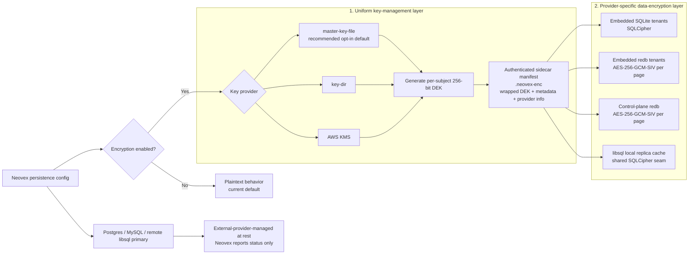
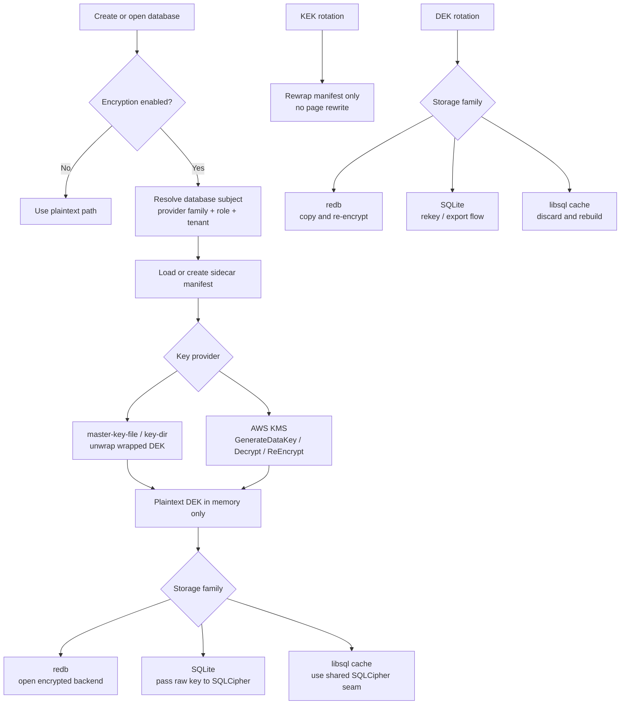

# Storage Encryption Architecture

This document is the stable architecture baseline for optional, enterprise-
ready encryption at rest across Neovex-owned local persistence.

Execution sequencing, rollout, and verification live in
[`docs/plans/encryption-at-rest-plan.md`](../../plans/encryption-at-rest-plan.md).
This document owns the durable design goals, boundaries, and rationale.

---

## Design Goals

- keep encryption **optional and explicit**
- keep the default behavior **unencrypted** unless an operator opts in
- give embedded SQLite, retained redb, and the retained redb control plane a
  first-class local encryption story
- cover Neovex-owned local libsql replica cache files without pretending
  Neovex owns the remote primary
- preserve one cross-provider key-management model while allowing storage-
  specific data-encryption choices
- support a sane self-hosted path and an enterprise-managed KMS path
- report responsibility boundaries honestly for external providers

---

## Ownership Boundaries

Neovex encrypts the local files it owns. It does not claim file-level
encryption for external database systems that it does not physically manage.

| Persistence family | Local file ownership | Architecture posture |
| --- | --- | --- |
| Embedded SQLite tenant provider | Neovex-owned `.sqlite3` tenant files | Neovex encrypts |
| Embedded redb tenant provider | Neovex-owned `.redb` tenant files | Neovex encrypts |
| Control plane | Neovex-owned `neovex-control.db` redb file | Neovex encrypts |
| libsql replica provider | Neovex-owned local replica cache files | Neovex encrypts local cache files; remote primary stays provider-managed |
| Postgres provider | No Neovex-owned tenant data files | External-provider-managed |
| MySQL provider | No Neovex-owned tenant data files | External-provider-managed |
| Remote libsql/Turso primary | No Neovex-owned primary data files | External-provider-managed |

This boundary is the core architectural rule for the entire design.

---

## Secondary Artifacts

When local encryption is enabled for a Neovex-owned store, Neovex-owned
persisted secondary artifacts that contain tenant data, control-plane data, or
durable journal state are also in scope.

Examples include:

- restore or rebuild staging files
- migration working copies
- retired local replica cache files pending cleanup

If Neovex later adds built-in persisted file exports, the same rules apply to
materialized snapshot export files and durable journal bootstrap bundle files.

Rules:

- Neovex-owned on-disk artifacts are encrypted by default when emitted from an
  encryption-enabled local store
- those artifacts use the same key-provider family and wrapped-DEK envelope
  model, with artifact-specific identity metadata
- plaintext artifact emission is disallowed by default once local encryption is
  enabled
- if Neovex supports a plaintext recovery or interoperability export, it must
  require an explicit operator override and surface a durable
  `plaintext-exception` status in diagnostics
- current in-memory structs and HTTP/JSON bootstrap or snapshot responses are
  transport payloads, not on-disk artifacts, unless a built-in Neovex workflow
  persists them to disk
- in-memory copies and network streams are not at-rest artifacts and are not
  covered by this document

This prevents an encryption-enabled deployment from quietly recreating
plaintext state through backup, bootstrap, or recovery tooling.

---

## Layered Model

The design is intentionally split into two layers:

- **uniform key-management semantics** across all Neovex-owned local
  databases and persisted encrypted artifacts
- **provider-appropriate data encryption** inside each storage family

That is the architectural compromise that keeps the operator story coherent
without forcing every storage engine into the same low-level crypto shape.

---

## Key-Management Model

Every Neovex-owned local database and every Neovex-owned persisted encrypted
artifact gets its own random 256-bit data-encryption key (DEK). That includes:

- each embedded SQLite tenant database
- each embedded redb tenant database
- the retained redb control-plane database
- each local libsql replica cache database
- each currently implemented persisted on-disk working artifact protected by
  this architecture, plus any future built-in snapshot/bootstrap/recovery file
  export emitted by Neovex under encrypted mode

Neovex wraps each DEK through a selected key provider and stores the wrapped
DEK plus non-secret metadata in an adjacent authenticated sidecar manifest next
to the protected path:

`<protected-path>.neovex-enc`

The manifest is the cross-provider control-plane contract. It stores:

- format version
- storage family and subject role
- cipher or profile identifier
- wrapped DEK blob
- key-provider descriptor and safe key identifier
- provider-specific reopen parameters
- creation and rotation timestamps

### Why the envelope stays uniform

The wrapped-DEK envelope is where Neovex needs consistency. It is responsible
for:

- key provenance
- auditability
- KEK rotation
- protected-subject identity binding
- status reporting
- recovery tooling

Those are cross-provider concerns, so the architecture keeps one envelope
shape unless a provider offers a materially better control-plane story.

### Key-provider families

| Key provider | Role in the architecture | Why it exists |
| --- | --- | --- |
| `disabled` | Preserve current plaintext behavior | Default-off posture |
| `master-key-file` | One local master key wraps per-subject DEKs | Sane self-hosted opt-in default |
| `key-dir` | Explicit per-subject keying workflow | Advanced operator control |
| `aws-kms` | Managed envelope encryption via KMS APIs | Enterprise audit and access-control path using the same manifest-backed per-subject DEK contract as the local providers |

`master-key-file` is the recommended opt-in default because it is simple,
works across every Neovex-owned local store, and still preserves independent
per-subject DEKs.

---

## Data-Encryption Profiles

| Concern | Applies to | Architecture choice | Rationale |
| --- | --- | --- | --- |
| Local DEK envelope for `master-key-file` and `key-dir` | All Neovex-owned local databases and encrypted artifacts | **AES-256-GCM-SIV** with manifest metadata as AAD | Consistent local envelope, misuse-resistant AEAD, stays in the AES family |
| Managed DEK envelope for `aws-kms` | All Neovex-owned local databases and encrypted artifacts when KMS is selected | **AWS KMS envelope encryption** with stable metadata in `EncryptionContext` | Enterprise governance path with KMS-managed wrapping, IAM control, and CloudTrail visibility while preserving the shared manifest contract |
| redb page encryption | Embedded redb tenant databases and retained redb control plane | **AES-256-GCM-SIV** per page | Neovex owns the custom page layer, so misuse resistance matters |
| Embedded SQLite page encryption | Default embedded SQLite tenant provider | **SQLCipher profile**: AES-256-CBC per page plus HMAC-SHA512 integrity, using raw 256-bit DEKs | Mature SQLite-native pager encryption with WAL and rekey support |
| libsql local cache encryption | Local libsql replica cache files only | **SQLCipher via the shared local-SQLite seam** | The cache materializes as a local SQLite file and is reopened through the same `SqliteTenantStore` seam as embedded SQLite |
| Persisted artifact encryption | Current Neovex-owned on-disk migration/rebuild/cutover artifacts, plus any future persisted snapshot/bootstrap/recovery export files from encrypted local stores | **Encrypted by default** with per-artifact DEKs and the same envelope family | Prevents backup, rebuild, and recovery flows from silently recreating plaintext state |
| External tenant stores | Postgres, MySQL, remote libsql primary | **External-provider-managed** | Neovex does not own those underlying data files |

Important trust rule: the libsql local-cache profile protects only the local
derivative cache. It does not say anything about the remote libsql primary, and
diagnostics must keep that boundary explicit.

---

## Why These Choices

### Why the local envelope uses AES-256-GCM-SIV

For local key providers, the question is not "what is the most exotic or most
powerful primitive?" It is "what is the safest and clearest envelope for a
Neovex-owned, metadata-binding design that will span multiple storage
families?"

AES-256-GCM-SIV is the architectural default because it:

- provides misuse-resistant AEAD semantics
- binds manifest metadata cleanly as associated data
- keeps the envelope compact and simple
- stays in the AES family, which is easier to explain in enterprise review

This is a fit-for-role choice, not a claim that every other sound option is
weaker.

### Why per-provider data encryption is still allowed

The storage engines do not expose the same integration seam:

- **redb** gives Neovex a custom storage backend seam, so a custom page AEAD
  is appropriate
- **SQLite** is best served by a mature SQLite encryption implementation, not
  a new Neovex pager project
- **libsql replica cache** is still a local SQLite file that Neovex
  materializes and reopens through `SqliteTenantStore`, so the shared
  local-SQLite seam is the most coherent place to apply encryption

That is why the architecture mixes:

- one key-management model
- different provider data-encryption profiles

### Alternatives that are still credible future profiles

These options were considered and remain legitimate if requirements change:

| Option | Why it is attractive | Why it is not the v1 default |
| --- | --- | --- |
| `aws-kms` everywhere | Strongest enterprise governance story | Too opinionated as a universal default; weak self-hosted ergonomics |
| AES-KW / AES-KWP | NIST-reviewed key wrapping specifically for keys | Less natural when Neovex also wants authenticated metadata binding in one envelope |
| AES-SIV | Strong misuse-resistance story | Heavier and less compelling here than AES-GCM-SIV |
| XChaCha20-Poly1305 | Excellent practical nonce story | Weaker enterprise standardization story than AES-family defaults |
| Provider-specific wrap formats | Could optimize per family | Fragments tooling, recovery, rotation, and status reporting |

If Neovex later needs a stricter enterprise profile, the most credible
directions are:

- `aws-kms` as the recommended enterprise baseline
- a NIST-leaning local-envelope profile using AES-KWP or another reviewed
  key-wrap mode
- provider-specific hardened profiles where the operational benefit is clear

---

## Operational Lifecycle

The architecture deliberately separates:

- **KEK rotation**, which rewraps metadata only
- **DEK rotation**, which depends on the storage family's actual data format

---

## Cutover And Retirement

Migration or rotation is not complete when the encrypted target merely exists.
It is complete only after the plaintext predecessor artifacts are retired from
Neovex-managed active paths.

Rules:

- successful cutover switches the active provider path to the encrypted target
- predecessor plaintext databases and adjacent sidecars such as `-wal`,
  `-shm`, rollback journals, temp spill files, migration copies, and retired
  local replica caches must be removed from active Neovex-managed paths after
  validation
- if an operator explicitly requests a plaintext recovery export, it must live
  in an explicit operator-directed location and remain visible as a
  `plaintext-exception`
- diagnostics must surface `retirement_pending` until predecessor plaintext
  artifacts are no longer present in Neovex-managed paths
- startup or admin flows must fail closed for active-path conflicts that could
  still reopen or serve the plaintext predecessor

Neovex can promise retirement from its managed paths and accurate detection of
residual plaintext artifacts. It cannot honestly promise physical media
sanitization on every filesystem or storage device. Secure wipe remains a
platform and operator concern.

---

## Trust and Diagnostics Posture

The operator and compliance story must be explicit, not aspirational.
Diagnostics should report:

- whether local encryption is enabled
- which key-provider family is active
- which local database roles are encrypted
- which external providers are marked `external-provider-managed`
- which artifacts are tracked as `plaintext-exception`
- which migrations or rotations are `retirement_pending`
- which migrations or rotations are pending

Diagnostics must never emit raw key material or wrapped-key blobs.

Neovex should describe this feature as an enterprise-grade control, not as a
standalone compliance guarantee.
