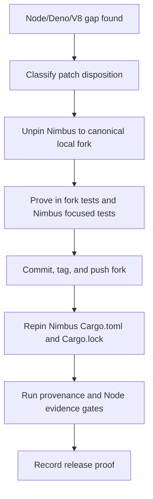

# Deno-Family Runtime Fork Workflow

Nimbus carries a Deno-family runtime fork so Node compatibility fixes,
`rusty_v8` locker safety, and Nimbus host-integration seams can be proven
against the product runtime before release. The fork is an implementation
detail of the runtime, but its maintenance process is an operating contract:
no release should ship an unreviewed or unrepinned Deno/V8 fork delta.

Canonical local sources:

| Fork | Local checkout | Upstream remote | Nimbus remote |
| --- | --- | --- | --- |
| Deno | `/Users/jack/src/github.com/nimbus/deno` | `git@github.com:denoland/deno.git` | `git@github.com:nimbus/deno.git` |
| rusty_v8 | `/Users/jack/src/github.com/nimbus/rusty_v8` | `git@github.com:denoland/rusty_v8.git` | `git@github.com:nimbus/rusty_v8.git` |

Do not use `/private/tmp` checkouts, copied Cargo source directories, or
temporary path overrides as progress state. Temporary local overrides are only
diagnostic scaffolding; the release proof is the published fork tag plus the
repinned Nimbus `Cargo.toml` and `Cargo.lock`.

## Workflow

1. Classify the intended change before landing it in a fork:
   - **Upstream Deno-family**: general Deno, Node compatibility, or
     `rusty_v8` behavior that should be proposed upstream or dropped once an
     upstream release contains the equivalent fix.
   - **Nimbus-only host integration**: release wiring, embedding, naming, or
     product host-boundary code that is not appropriate for upstream Deno.
   - **Temporary carry**: a patch that is needed to prove Nimbus now but has a
     named removal trigger, such as an upstream issue/PR, a replacement API, or
     a future Deno/V8 release.
2. Unpin Nimbus only while proving the change. Point the Deno-family
   dependencies at `/Users/jack/src/github.com/nimbus/deno` or
   `/Users/jack/src/github.com/nimbus/rusty_v8`, run the focused fork tests,
   and run the Nimbus tests that exercise the changed runtime behavior.
3. Commit, tag, and push the fork before changing Nimbus back to a published
   pin. Annotated tags are preferred because they can carry the release note
   and verification summary.
4. Repin Nimbus to the published tag/SHA. Update both the workspace patch table
   in `Cargo.toml` and the resolved sources in `Cargo.lock`.
5. Run the release gates from a clean Nimbus shell:
   - `bash scripts/verify-deno-fork-provenance.sh`
   - `bash scripts/verify-deno-fork-upstream-policy.sh`
   - the focused Node compatibility or runtime tests named by the bump proof
   - the Node evidence publisher/checker when public compatibility claims move
6. Record proof before release. The proof must include the fork tag, commit
   SHA, upstream base tag, patch-disposition table, changelog mapping, repinned
   lockfile evidence, and verification output.

## Required Proof Fields

Every Deno or `rusty_v8` bump needs a row in
[`docs/architecture/runtime/deno-fork-bump-ledger.md`](../architecture/runtime/deno-fork-bump-ledger.md)
with these fields:

| Field | Requirement |
| --- | --- |
| Fork and tag | The published Nimbus fork tag used by `Cargo.toml`. |
| Commit SHA | The exact commit resolved by `Cargo.lock`; annotated tag objects are not enough. |
| Upstream base | The upstream Deno or `rusty_v8` tag the fork delta is based on. |
| Patch disposition | One of upstream Deno-family, Nimbus-only host integration, or temporary carry. |
| Removal or upstream trigger | Required for upstream and temporary carries; use `n/a` only for permanent Nimbus-only host integration. |
| Changelog mapping | Human-readable mapping from carried commit to release note or proof artifact. |
| Verification | Fork-side and Nimbus-side commands with concrete pass/fail output. |

If a carried patch combines upstreamable behavior with Nimbus-only integration,
split it before release or record it as a temporary carry with a split trigger.

## Release Stop Conditions

Stop the release until fixed when any of these are true:

- `scripts/verify-deno-fork-provenance.sh` does not resolve patch-sensitive
  crates to the expected `nimbus/deno` and `nimbus/rusty_v8` tag/SHA.
- `scripts/verify-deno-fork-upstream-policy.sh` cannot find the current fork
  tags, SHAs, disposition categories, and proof requirements in the operating
  docs and ledger.
- A fork commit lacks a patch disposition or removal/upstream trigger.
- Nimbus is still pinned to a local path, temporary checkout, or unpublished
  fork commit.
- Public Node compatibility evidence changed without regenerated evidence and
  an updated proof artifact.
