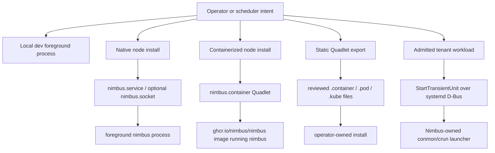

# Nimbus Node Lifecycle

Nimbus does not self-daemonize. A node is either a foreground process, a
host-managed service, a machine-os baked service, or a reviewed export
artifact. Dynamic tenant workloads are a separate local-enforcement path that
manages systemd **transient units** over D-Bus — see
[`node-dbus-binding.md`](node-dbus-binding.md) for the live binding (bus
selection, signal-correlated completion, error taxonomy, privilege model).

## Decision Matrix

| Situation | Operator surface | Lifecycle owner | Use this when |
| --- | --- | --- | --- |
| Local development | `nimbus dev`, `nimbus start`, `nimbus compose up` | The foreground terminal process | You want repeatable local behavior without systemd, Podman, or host mutation. |
| Native Linux node | `nimbus node install --systemd` | Host systemd, through generated `nimbus.service` and optional `nimbus.socket` | You installed a native Nimbus binary or package on a Linux node. |
| `machine-os` node | Baked `nimbus.service` / `nimbus.socket` | systemd inside the machine-os image | You are using `nimbus machine` or the bootable machine image path. |
| Containerized Nimbus node | `nimbus node install --container --image ...` | Host systemd plus Podman Quadlet | You want the Nimbus node daemon to run from the published OCI image. |
| Dynamic tenant workload | `SystemdTransientUnitBackend` | Host systemd transient service unit, requested over D-Bus | Nimbus has admitted and scheduled tenant work onto a Linux node. |
| Static Compose review export | `nimbus compose export quadlet` | Human/operator review, then host systemd/Podman if installed manually | You want Quadlet artifacts from an admitted Compose plan for migration or small static deployments. |
| Tests or non-systemd hosts | `DirectProcessBackend` or foreground process | The test harness or parent process | You need deterministic behavior without PID 1, D-Bus, Podman, conmon, or KVM. |

## Control Flow



The important separation is that Quadlet node install and Quadlet export are
not the dynamic runtime backend. Dynamic tenant work is short-lived desired
state lowered through Nimbus admission into typed transient unit requests.

## Local Development

Use foreground commands:

```bash
nimbus dev
nimbus start
nimbus compose up
```

These commands do not install service-manager artifacts. For deterministic
tests and non-systemd hosts, Nimbus uses direct foreground process semantics or
`DirectProcessBackend`.

## Native Linux Node

Review first:

```bash
nimbus node install --systemd --dry-run
```

Install only after reviewing the generated `nimbus.service` and, when requested,
`nimbus.socket`:

```bash
sudo nimbus node install --systemd --system --enable --now
nimbus node status --systemd --system
nimbus node logs --systemd --system --follow
```

The rendered service owns `ExecStart`; operators do not pass raw unit text,
arbitrary systemd sections, or raw `ExecStart`.

## Containerized Node

The published Nimbus image is an application image. It runs `nimbus` directly
and does not run systemd inside the container. Host systemd and Podman own the
container lifecycle through Quadlet:

```bash
podman volume create nimbus-data
podman run --rm -v nimbus-data:/var/lib/nimbus \
  ghcr.io/nimbus/nimbus:vX.Y.Z@sha256:<digest> auth rotate-admin

nimbus node install --container \
  --image ghcr.io/nimbus/nimbus:vX.Y.Z@sha256:<digest> \
  --user --dry-run
nimbus node doctor --container --user
nimbus node install --container \
  --image ghcr.io/nimbus/nimbus:vX.Y.Z@sha256:<digest> \
  --user --enable --now
```

`latest` is not a production rollout pin. Use the version and digest from the
release evidence.

## Machine OS

The `machine-os` path bakes the matching Nimbus binary and systemd units into
the machine image. Do not run `nimbus node install` inside the guest as a normal
repair step. Use the machine commands from the host:

```bash
nimbus machine status
nimbus machine os upgrade --dry-run
nimbus machine os apply docker://ghcr.io/nimbus/machine-os:vX.Y.Z@sha256:<digest>
```

Machine readiness validates the baked unit and forwarded machine API state.

## Dynamic Tenant Workloads

Dynamic tenant workloads do not use Quadlet. Nimbus admits the tenant workload,
builds a `HostLifecyclePlan`, and asks systemd for a transient service unit over
D-Bus. `systemd-run` is useful for manual reproduction, but product code uses
typed D-Bus requests so Nimbus controls unit names, `ExecStart`, cgroups,
journal selectors, status evidence, and fail-closed feature checks.

## Static Quadlet Export

`nimbus compose export quadlet` is an explicit export/review workflow:

```bash
nimbus compose export quadlet --strict
nimbus compose export quadlet --mode pod --output-dir ./quadlet --overwrite
nimbus compose export quadlet --mode kube --podman-version 5.6.0
```

The exporter reads the admitted Nimbus Compose plan. It may warn when Compose
features are omitted or need review. `--strict` fails if any warning would be
emitted. The exporter does not accept raw `PodmanArgs`, host networking,
privileged mode, arbitrary systemd sections, or arbitrary Quadlet fields.

## Troubleshooting

Start with review and diagnostics:

```bash
nimbus node install --systemd --dry-run
nimbus node install --container --image ghcr.io/nimbus/nimbus:vX.Y.Z@sha256:<digest> --dry-run
nimbus node doctor --systemd --system
nimbus node doctor --container --user
```

Then inspect the host service manager:

```bash
systemctl status nimbus.service
systemctl --user status nimbus.service
journalctl -u nimbus.service -f
journalctl --user-unit nimbus.service -f
```

If generated artifacts changed outside Nimbus, rerender and compare the
provenance hash comments. Do not patch escape hatches into the artifact; change
the Nimbus command, Compose input, or operator policy that generated it.
