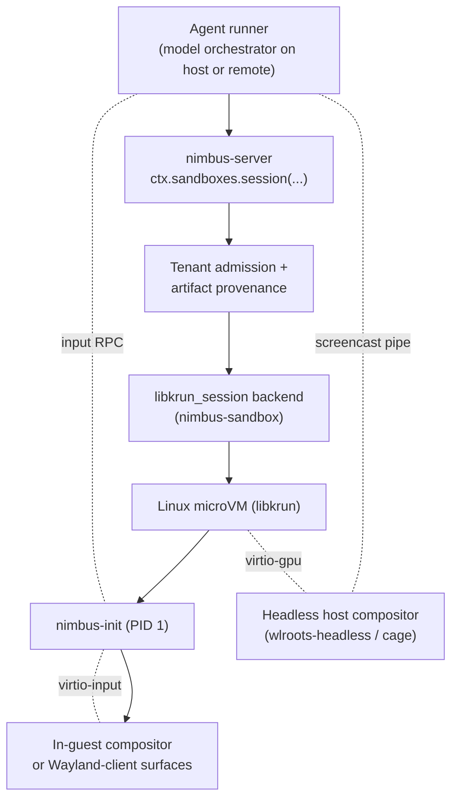

# Plan: Computer Use Sandbox (Desktop Profile) (Archived)

> **Superseded 2026-05-27 by [`docs/plans/nimbus-sandbox-plan.md`](../nimbus-sandbox-plan.md) Band D.**
> The unified sandbox plan rolls CUS1–CUS11 into Band D (D1–D10);
> CUS0 closed into Band B0 and CUS2 (nimbus-init) lifted into Band B2.
> Phase content was lifted verbatim; this file is retained as the
> baseline for the unified plan's Band D section.

Plan for a tenant-safe, libkrun-backed sandbox that hosts a long-lived
desktop session with frame capture and synthetic input injection,
suitable for AI-agent computer-use workloads.

## Status

- **Status:** `proposed`
- **Activation precondition:** finish or explicitly checkpoint the host
  lifecycle backend seam in
  [`docs/plans/tenant-domain-and-node-enforcement-boundary-plan.md`](./tenant-domain-and-node-enforcement-boundary-plan.md);
  research docs
  [`docs/plans/research/libkrun-session-sandbox.md`](./research/libkrun-session-sandbox.md)
  and
  [`docs/plans/research/gpu-sandbox-backends.md`](./research/gpu-sandbox-backends.md)
  must be landed.
- **Primary goal:** stand up a tenant-isolated `libkrun_session` sandbox
  backend that runs one Linux microVM per tenant session, exposes a
  guest-side desktop, forwards frames to a host screencast pipe, and
  accepts synthetic mouse/keyboard input from an agent runner.
- **References:**
  [`docs/plans/research/vmm-landscape-2026.md`](./research/vmm-landscape-2026.md),
  [`docs/plans/research/libkrun-session-sandbox.md`](./research/libkrun-session-sandbox.md),
  [`docs/plans/research/gpu-sandbox-backends.md`](./research/gpu-sandbox-backends.md),
  [`docs/plans/research/nimbus-libkrun-fork-inventory.md`](./research/nimbus-libkrun-fork-inventory.md),
  [`docs/plans/research/computer-use-capabilities-audit.md`](./research/computer-use-capabilities-audit.md),
  [`docs/architecture/sandbox/microvm-service-baseline.md`](../architecture/sandbox/microvm-service-baseline.md),
  [`docs/plans/nimbus-libkrun-snapshot-port-plan.md`](./nimbus-libkrun-snapshot-port-plan.md),
  [`docs/plans/gpu-accelerated-sandbox-plan.md`](./gpu-accelerated-sandbox-plan.md),
  [muvm (AsahiLinux/muvm)](https://github.com/AsahiLinux/muvm).

## Decision Summary

This plan covers the **desktop profile** of the unified `nimbus-libkrun`
sandbox backend (decisions D1–D12 in `vmm-landscape-2026.md`). There is
one VMM family for every Nimbus sandbox workload; the desktop profile
turns on `display: Some(...)`, `input: Some(...)`, and a long-idle
lifetime policy. The GPU profile (GAW plan) and the snapshot/fork
primitive (`nimbus-libkrun-snapshot-port-plan.md`) are sibling concerns
on the same backend.

Per-host topology (D11/D12): the desktop profile runs as a direct
libkrun-on-KVM microVM on Linux production hosts. On macOS dev hosts,
the **outer machine-os VM** (libkrun-on-HVF via krunkit) provides the
Linux environment; computer-use sessions inside it are scheduled as
standard Linux containers managed by the guest machine API, not as
nested libkrun microVMs. The Venus / virtio-gpu display path remains
the same surface in both cases.

| Profile shape | Canonical Nimbus path | This plan? |
| --- | --- | --- |
| Long-lived OCI services | krun service-microVM via conmon/crun | No |
| Desktop / computer-use session | `libkrun_session` backend, this plan | Yes |
| GPU inference workload | `libkrun_session` backend, GAW plan | No |
| Snapshot / fork primitive | nimbus-libkrun snapshot port plan | No (consumer) |

Do not build a separate `computer_use` backend. The desktop profile is
the `libkrun_session` backend with `display: Some(...)`,
`input: Some(...)`, and a long-idle lifetime policy.

## Why a Separate Plan

The `nimbus-libkrun-snapshot-port-plan.md` answers: how does the fork
gain snapshot/restore/fork primitives?

The libkrun-session research doc answers: what is the shared backend
shape across profiles?

This plan answers: how does Nimbus stand up one tenant-isolated desktop
session with frame capture and input injection, and what does the
operator / agent surface look like?

That includes work the research docs do not own: the headless host
compositor, the input injection RPC, the session lifecycle model, the
agent-facing service surface, and the per-tenant evidence shape.

## Target Architecture



## Product Personas

| Persona | Job | Required experience |
| --- | --- | --- |
| Local developer (computer-use agent author) | Run an agent against a real desktop without renting a VM | one-command session start, screencast URL, input RPC ready |
| AI model orchestrator | Drive the agent loop with screenshot in / action out | stable framerate, predictable input latency, clean session teardown |
| Enterprise platform team | Offer tenant-safe computer-use as a service | per-tenant isolation, network egress policy, audit trail, recording on/off |

## Scope

This plan owns:

- `libkrun_session` backend skeleton (shared with GAW plan; whichever
  plan lands first owns CUS2 / GAW2 phases).
- `nimbus-init` PID-1 guest agent (shared with GAW + FSI plans;
  muvm-derived).
- Headless host-side compositor + frame capture pipe.
- Synthetic input injection (virtio-input + RPC).
- Session lifecycle: idle timeout, max session, evict on tenant delete,
  crash recovery.
- Operator CLI for session start / list / stop / inspect / screencast /
  input.
- Per-session tenant isolation, image provenance, egress policy.
- Observability and evidence: session events, frame metrics, input audit.

This plan does not own:

- The GPU mediation choice (owned by GAW plan + research doc).
- Lambda-class workloads (owned by FSI plan).
- Long-lived OCI services (covered by the existing krun service backend).
- Snapshot/checkpoint of running sessions (residual follow-up).
- Audio I/O (residual follow-up).
- Multi-display sessions (residual follow-up).
- Recording-to-storage of full session video for replay (residual
  follow-up).

## Core Invariants

- Sessions are tenant-scoped: one VM per (tenant, session) pair; no
  shared writable state across tenants.
- Frame capture and input injection only flow over the per-session vsock
  channel; tenants cannot read another tenant's screencast pipe.
- Untrusted-by-default guest network: passt with the tenant's
  `SandboxEgressPolicy`. No bypass.
- Image admission is the same artifact-provenance contract as Linux
  production service microVMs.
- Synthetic input events are recorded in the per-session audit log with
  monotonic sequence numbers; recording cannot be silently disabled by
  the agent.
- Idle timeout fails closed: the session is torn down, not paused, on
  expiry.
- Snapshot/checkpoint of a live computer-use session is out of scope for
  v1; the session is treated as ephemeral state.
- The libkrun-session backend runs unprivileged on Linux (`/dev/kvm`
  group + uid/gid mapping). Root mode is only a temporary diagnostic
  fallback.

## Public and Internal Surfaces

### Operator CLI

```text
nimbus sandbox session start --tenant <id> --image <ref@sha256:...> [--display h264|jpeg|raw] [--idle-timeout <duration>]
nimbus sandbox session list
nimbus sandbox session inspect <session-id>
nimbus sandbox session stop <session-id>
nimbus sandbox session screencast <session-id>
nimbus sandbox session input <session-id> -- <input-event-json>
```

Exact namespace may change during implementation; the plan requires
these capabilities at minimum.

### Rust ownership

Use Nimbus-owned domain nouns at public boundaries:

```rust
struct LibkrunSessionSandboxSpec;
struct ComputerUseSessionPolicy;
struct HeadlessCompositorPolicy;
struct VirtioInputInjectionPolicy;
struct ComputerUseSessionStatus;
struct ScreencastPipeBinding;
```

Placement by crate / module:

| Area | Owner |
| --- | --- |
| `libkrun_session` backend | `nimbus-sandbox::backends::libkrun_session` |
| `nimbus-init` guest agent | new crate `crates/nimbus-init` |
| Session lifecycle, tenant binding, status / evidence | `local_enforcement` / future `nimbus-node` |
| Operator CLI | `nimbus-bin` |
| HTTP/gRPC transport | `nimbus-server` |
| Artifact provenance | existing artifact provenance verifier seam |

Do not put libkrun process launch, virtio-gpu config, or screencast pipe
plumbing in `nimbus-runtime`. `nimbus-runtime` stays execution-only.

## Execution Plan

| Phase | Status | Goal | Verification |
| --- | --- | --- | --- |
| CUS0 | `done` | Refresh research against current libkrun, muvm, wlroots-headless, virtio-input upstream. Inventory the `nimbus-libkrun` fork's patch delta vs upstream and vs muvm's `krun-sys`. Update research docs if anything has changed. | Research notes cite current upstream commits/MRs and record findings; fork patch inventory is checked into the repo at `docs/plans/research/nimbus-libkrun-fork-inventory.md`. Closed 2026-05-26: 1 functional libkrun patch (`15bcf49` TSI bind-address) + 9 scaffolding patches; muvm MIT per-component disposition table covers all guest + host modules. |
| CUS1 | `todo` | Define desktop-profile contract types: `LibkrunSessionSandboxSpec`, `ComputerUseSessionPolicy`, `HeadlessCompositorPolicy`, `VirtioInputInjectionPolicy`, `ComputerUseSessionStatus`, `ScreencastPipeBinding`. **v0 also reserves** (per audit §10): `state: StatePolicy` (Ephemeral / Persistent), `time: TimePolicy`, `locale: LocalePolicy`, `display.dpi`, `audio: Option<AudioStreamPolicy>` (reserved, None in v0), `camera: Option<CameraStreamPolicy>` (reserved, None in v0), `recording: Option<RecordingPolicy>` (video-only in v0), `trajectory: TrajectoryPolicy`, `redaction: RedactionPolicy`, `events: EventStreamPolicy`. | Type/unit tests prove tenant ID, session ID, display policy, input policy, lifetime, and egress requirements are required where needed. Spec-shape tests prove reserved fields round-trip wire format without breaking when future implementations land. |
| CUS2 | `todo` | Build the `nimbus-init` static PID-1 binary with vsock control listener, mounts, exec/reap, log streaming, shutdown handling. Start from muvm-guest design; vendor where useful with MIT attribution. Shared with GAW and the lambda profile (snapshot-port plan). **v0 also includes**: `xdg-open` URL/intent injection over vsock; structured trajectory log emitter (CUS-Trace v0 baseline — every HID event, every emitted frame PTS, every control-channel event → JSON lines on a reserved vsock channel); password-focus redaction flag handling for typed-input log entries. | Unit tests cover config parsing, signal handling, child reaping, exit propagation, log framing, secret redaction. Guest smoke runs in a libkrun VM. Trajectory log schema test proves event types are versioned and round-trippable. URL injection smoke proves `xdg-open` opens a registered handler. |
| CUS3 | `todo` | Build the headless host-side compositor seam: per-session wlroots-headless (or cage) instance, screencast capture via `wlr_screencopy_v1`, H264/JPEG/raw output. **v0 also includes**: per-window capture via `wlr_foreign_toplevel_management_v1`, per-region (src-rect) capture, DPI/scaling configurability on `HeadlessCompositorPolicy`, monotonic PTS on every emitted frame (so a future audio track can sync against it), single-frame screenshot one-shot API. **In-guest XWayland enabled by default** so X11-only apps work transparently. | End-to-end test renders a known frame inside the guest and captures it on the host with a checksum match. Per-window capture test proves the captured frame excludes other windows. PTS test proves frame timestamps are monotonic and machine-clock-aligned. XWayland smoke proves an X11-only test app renders and captures. |
| CUS4 | `todo` | Build the virtio-input injection RPC: vsock event channel from host agent runner into guest virtio-input device. **v0 also includes**: IME enablement option in guest config (ibus/fcitx) for CJK and complex scripts; every input event is echoed into the trajectory log emitter from CUS2. | Unit tests cover event serialization; guest smoke proves a synthetic click reaches an in-guest test app. IME smoke proves a non-Latin character can be entered via the configured IME. Audit test proves every injected event is recorded in the trajectory log with a matching seq number. |
| CUS5 | `todo` | Integrate passt for per-session networking with `SandboxEgressPolicy` enforcement. Do not inherit gvproxy into the per-sandbox lane. **v0 also reserves** vsock channel IDs in the control protocol: `MEDIA_SCREEN_OUT` (used), `MEDIA_AUDIO_OUT`, `MEDIA_AUDIO_IN`, `MEDIA_CAM_OUT`, `MEDIA_CAM_IN`, `TRACE`, `EVENTS`, `CLIP`, `DND` (reserved). | Two-tenant harness proves egress policy is enforced and tenants cannot reach each other's listeners. Channel-ID enum test proves reserved IDs are stable across releases. |
| CUS6 | `todo` | Stand up the session lifecycle: idle timeout, max session, evict on tenant delete, recover from crash. **v0 also includes**: tenant output area pattern (a watched virtiofs subdirectory whose contents survive session teardown and are accessible to the operator API for retrieval); a large-file pull helper that streams from the share without filling guest disk. | Failure-injection tests prove sessions tear down cleanly on each path; lifecycle states match the design. Output-area test proves files written inside the watched dir are retrievable after session stop. Large-file pull test proves a >1 GiB file streams out without doubling memory. |
| CUS7 | `todo` | Enforce per-session tenant isolation: storage, network, image, identity, credentials, audit. **v0 also adds**: `Sandbox::snapshot()`, `Sandbox::branch()`, `Sandbox::restore()` trait methods (return `unimplemented!()` in v0; implementations land in CUS-Snap). | Two-tenant harness proves no cross-tenant writable state, no screencast/input cross-talk, forged tenant identity rejected. Trait surface tests prove the reserved lifecycle methods exist and are explicitly unimplemented in v0. |
| CUS8 | `todo` | Add operator CLI commands and HTTP/gRPC transport for session lifecycle and screencast/input. **v0 CLI surface includes**: `start`, `list`, `inspect`, `stop`, `screencast`, `input`, `trajectory` (stream the trajectory log), `screenshot` (single-frame capture), `record` (video-only in v0), `file pull` (stream out from tenant output area), `xdg-open` (inject a URL). | CLI smoke proves start/list/inspect/stop/screencast/input round-trip. Trajectory subcommand smoke proves the JSON-line stream lines up with the in-guest events. Screenshot smoke matches a known checksum. Record subcommand produces a playable MP4. file pull retrieves a known file. |
| CUS9 | `todo` | Observability and evidence: session events, input audit log, frame metrics, OCSF/OpenTelemetry mapping, redaction. | Tests prove high-cardinality IDs stay in events/evidence; secret redaction holds; operator diagnostics explain admission and lifecycle failures. |
| CUS10 | `todo` | CI gates: contract/client tests on every CI; Linux libkrun smoke gated on `/dev/kvm` capability; macOS krunkit smoke gated on Apple Silicon runner. | Gates skip with evidence when capability is missing; fail on real regressions when available. |
| CUS11 | `todo` | Docs, security model, residual risk, selectability posture. | Docs clearly state the desktop profile is opt-in, threat model is documented, and product selectability is gated on plan completion. |

## Initial Success Criteria

This plan may close only when:

- A tenant can start a session and receive a screencast pipe URL plus an
  input RPC endpoint.
- The session runs a real desktop session with a real Linux distribution
  inside the libkrun guest.
- Synthetic input from the agent runner reaches an in-guest test app and
  is recorded in the audit log with monotonic sequence numbers.
- Frame capture round-trips a known test pattern from in-guest renderer
  to on-host pipe with a checksum match.
- Two tenants in parallel never see each other's screencast or input
  channel; egress policy holds.
- Session idle timeout, tenant-delete eviction, and crash recovery all
  fail closed with evidence.
- macOS smoke proves the same flow against krunkit on an Apple Silicon
  runner.
- Backend is opt-in and not default until product selectability is
  approved.
- `cargo fmt --all --check`, focused Rust tests, libkrun-gated smoke,
  krunkit-gated smoke, docs reference validation, and
  `git diff --check` pass.

## Follow-On Phases

These phases are deferred out of v0 and tracked as named follow-ons so
they cannot hide inside this plan. Scope and dependencies come from
[`docs/plans/research/computer-use-capabilities-audit.md`](./research/computer-use-capabilities-audit.md)
§11 and
[`docs/plans/research/nimbus-libkrun-fork-inventory.md`](./research/nimbus-libkrun-fork-inventory.md)
§11.

### Media-flow follow-ons (from fork inventory §11)

| Phase | Scope | Depends on |
| --- | --- | --- |
| **CUS-Aud** | Audio out (PipeWire-in-guest → vsock → host sink) + virtual mic in. Wires `audio: Some(AudioStreamPolicy)` and the `MEDIA_AUDIO_OUT` / `MEDIA_AUDIO_IN` vsock channels reserved in CUS5. | CUS3 PTS contract |
| **CUS-Cam** | Virtual webcam out (host → v4l2loopback in guest) + camera in (guest camera → host). Wires `camera: Some(CameraStreamPolicy)` and the `MEDIA_CAM_OUT` / `MEDIA_CAM_IN` channels. | CUS-Aud (PipeWire baseline) |
| **CUS-Rec** | Synced A/V recording-to-storage with the PTS contract from CUS3, replacing the video-only `record` subcommand. | CUS-Aud + CUS3 |
| **CUS-X86** | x86-on-aarch64 binary translation (Box64 / FEX) so x86-only desktop apps run on Apple-Silicon hosts. | none |

### Capability follow-ons (from capabilities audit §11)

| Phase | Scope | Depends on |
| --- | --- | --- |
| **CUS-Acc** | Accessibility tree export (AT-SPI for GTK/Qt; AX for browsers via CDP). Vsock channel `EVENTS` + structured tree snapshot at action boundaries. Folds DOM access for non-browser apps. | CUS-Trace v0 schema (CUS2) |
| **CUS-Clip** | Clipboard read/write, MIME-aware (text, image, file URIs). Vsock channel `CLIP` + `wl_data_device` proxy. | none |
| **CUS-Snap** | Session snapshot, branch, resume via libkrun snapshot/restore. Bodies for the `Sandbox::snapshot()` / `branch()` / `restore()` methods reserved in CUS7. | none |
| **CUS-Trace v1** | Richer trajectory schema: accessibility-tree snapshots, browser DOM diffs, semantic action labels. | CUS-Acc |
| **CUS-Red** | Screen-content redaction pipeline (OCR-based regex masking, rect masking by app id, secret-token deny-list) + capture pause / privacy mode. | CUS-Acc useful but not required |
| **CUS-Persist** | Persistent named profiles (`StatePolicy::Persistent`): per-profile virtiofs mount backed by tenant storage. | CUS6 tenant output area |
| **CUS-DnD** | Drag-and-drop host↔guest. Vsock channel `DND` + `wl_data_device` drag protocol. | CUS-Clip |
| **CUS-Evt** | Window / dialog / notification events. Vsock channel `EVENTS` + wlroots foreign-toplevel + libnotify bridge. | CUS-Trace v0 (CUS2) |
| **CUS-Out** | Tenant output area auto-upload (watched virtiofs dir → object store). | CUS6 |
| **CUS-Net-Obs** | passt egress mirror + host pcap export for compliance/inspection. | CUS5 |
| **CUS-Multi** | Multi-monitor / multi-output (advertise N wlroots outputs). | CUS3 |

### Other deferred work

- WebRTC transport for the screencast pipe (CUS3 currently emits H264/JPEG/raw over the screencast pipe; WebRTC is a downstream consumer concern).
- Performance budgets (frame rate, input latency) for end-user products.
- A separate `verify-computer-use-sandbox.sh` `/goal` control-plane gate script.

## Suggested Goal Prompt

```text
/goal Complete docs/plans/computer-use-sandbox-plan.md after the tenant-domain/node-enforcement host lifecycle seam is checkpointed and the libkrun-session + gpu-sandbox-backends research docs land. Build a proposed-to-proven libkrun-session sandbox backend that hosts one tenant-isolated Linux microVM per session with a headless host compositor for frame capture and a virtio-input RPC for synthetic input. Desktop profile only; the GPU profile ships under docs/plans/gpu-accelerated-sandbox-plan.md and the lambda profile (snapshot/fork) ships under docs/plans/nimbus-libkrun-snapshot-port-plan.md — all three on the same nimbus-libkrun backend per D1–D12. Verifiable success criteria: a tenant can start a session, receive a screencast pipe URL and input RPC endpoint, run a real desktop inside the guest, see synthetic input round-trip into in-guest test apps, see captured frames round-trip with checksum match, see per-tenant isolation hold under a two-tenant harness, see idle timeout and tenant-delete eviction fail closed, and see macOS krunkit smoke pass on an Apple Silicon runner against the outer machine-os VM lifecycle (D11/D12 — no nested microVM expected on macOS). cargo fmt --all --check plus focused tests plus libkrun-gated smoke plus krunkit-gated smoke plus git diff --check pass.
```
