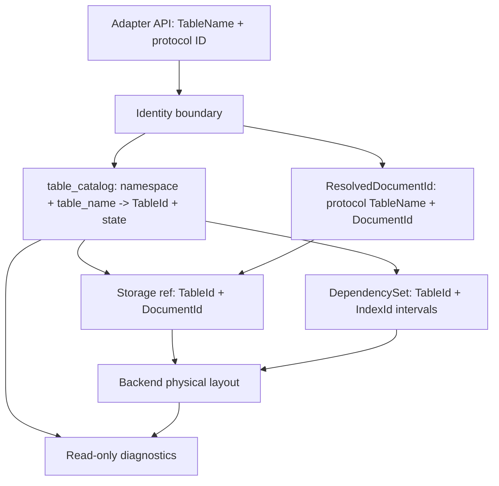

# Convex-Informed Storage Trust Hardening Plan

Nimbus now has the first critical storage-trust primitive from the Convex
comparison: stable logical table identity through `TableId` and the
per-tenant `table_catalog`. This plan closes the remaining gaps that matter
for enterprise trust without copying Convex's full database architecture.

## Status

- **Status:** `done`
- **Primary owner:** this plan
- **Verifier:** `bash scripts/verify-convex-storage-trust-hardening.sh`
- **Convex source reference:** `/Users/jack/src/github.com/get-convex/convex-backend`
- **Baseline proof:** `docs/plans/proof/convex-storage-trust-hardening/cst0-convex-storage-comparison.md`
- **Prior Nimbus baseline:** `docs/plans/archive/multi-backend-adapter-hardening-plan.md`
- **Canonical table identity doc:** `docs/architecture/storage/table-identity.md`

## Goal

Make Nimbus storage identity, lifecycle, read invalidation, index evolution,
and diagnostics auditable enough that an enterprise reviewer can answer:

1. Which logical table did this document, index row, subscription dependency,
   and commit-log entry belong to?
2. Can a dropped, imported, renamed, or recreated table accidentally inherit
   the wrong physical state?
3. Can a public document ID be validated against the table it claims to
   identify?
4. Do all storage backends preserve the same identity and lifecycle guarantees?
5. Which Convex storage patterns did Nimbus intentionally adopt, narrow, or
   reject?

Success means the answer is in typed code, durable storage, cross-backend
tests, and operator-facing diagnostics rather than only in design prose.

## Boundary Decisions

- Keep public adapter APIs table-name based unless the emulated protocol
  itself exposes a richer identity shape.
- Keep storage physical layout backend-owned. Shared SQL
  `documents(table_id, id)` remains the default; per-table physical SQL tables
  need measured evidence before a backend can choose them.
- Do not import Convex's full MVCC, retention, and subscription write-log
  architecture just to look more like Convex. Either adopt a concrete slice
  because Nimbus needs the guarantee, or record the decision and test the
  Nimbus guarantee directly.
- Keep Firebase, MongoDB, DynamoDB, and native document-key semantics
  compatible with their protocols. Convex-style table-bearing ID validation
  must not erase those adapter-specific identity contracts.

## Convex Pattern Map

| Convex pattern | Source shape | Nimbus target |
| --- | --- | --- |
| Stable table identity | `TableMapping`, `TabletId`, `TableNumber` | Already adopted as `TableId` plus `table_catalog`; CST1 closes stale debt and proof gaps. |
| Table lifecycle states | `_tables` metadata with active, hidden, deleting states | CST2 adds an explicit Nimbus table lifecycle before table drop/import/rename can ship. |
| Table-bearing document IDs | developer IDs carry table number and resolve to internal IDs | CST3 adds table-aware document identity and Convex adapter validation without forcing one public ID format on every adapter. |
| Table/index read dependencies | read/write conflict and subscriptions key off internal table/index identity | CST4 moves dependency tracking and invalidation from table names to `TableId` and stable index identity. |
| Index registry and backfill states | `_index` registry with stable index IDs and pending/enabled states | CST5 adds a backend-neutral index identity/lifecycle model for online schema/index evolution. |
| MVCC persistence | versioned document/index rows keyed by timestamp | CST6 makes an explicit repeatable-read/MVCC decision and implements only the minimum guarantee Nimbus chooses. |
| Table summaries | persisted count/shape/size summaries by tablet | CST7 adds read-only diagnostics and summary evidence keyed by `TableId`. |
| Shared SQL physical layout | SQL documents table keyed by internal table ID | Already aligned; CST8 locks it with cross-backend tests and restore/replay probes. |

## Architecture Target

## Execution Plan

| Phase | Status | Goal | Verification |
| --- | --- | --- | --- |
| CST0 | `done` | Record the local Convex storage comparison, source files inspected, Nimbus gap list, and explicit adoption/rejection posture. | Baseline proof exists at `docs/plans/proof/convex-storage-trust-hardening/cst0-convex-storage-comparison.md`; this plan and verifier are routed from `docs/plans/README.md` and `AGENTS.md`. |
| CST1 | `done` | Closed the already-implemented table-catalog proof cleanly. Kept stale `S-004` and `A-003` ledger rows marked done and proved the current backend layout preserves stable `TableId` through storage, replay, snapshot, and restore paths without regenerating identities from table names. | Proof: `docs/plans/proof/convex-storage-trust-hardening/cst1-table-catalog-closeout.md`. Focused storage tests passed for table-id layout, snapshot rebuild, and fixture-aware provider recovery paths. |
| CST2 | `done` | Added an explicit table lifecycle model before adding table drop, import replacement, or rename. Introduced `TableState` semantics equivalent to active, hidden/import-staging, and deleting/hard-deleted where Nimbus needs them. Schema deletion remains metadata deletion, not table deletion. | Proof: `docs/plans/proof/convex-storage-trust-hardening/cst2-table-lifecycle.md`. redb and SQLite have focused lifecycle behavior tests; Postgres, MySQL, and libSQL expose the same lifecycle transitions through tenant write transactions. |
| CST3 | `done` | Added table-aware document identity. Storage keys remain `(TableId, DocumentId)`, `ResolvedDocumentId` resolves Convex protocol IDs back to `(TableName, DocumentId)`, and the Convex adapter validates `v.id(table)`/`ctx.db.get(table, id)`-style usage against the table context it claims to target. | Proof: `docs/plans/proof/convex-storage-trust-hardening/cst3-table-aware-document-identity.md`. Core tests cover valid and wrong-table table-scoped IDs. Convex adapter tests cover generated ID serialization, custom ID round trips, wrong-table get/patch/delete rejection, and raw read-dependency recording. |
| CST4 | `done` | Moved read tracking, dependency sets, subscription invalidation, and mutation intersection from public-name-only matching to stable `TableId` matching, with index-scoped dependencies carrying table identity for CST5. | Proof: `docs/plans/proof/convex-storage-trust-hardening/cst4-table-id-dependencies.md`. Core tests prove same-name/different-`TableId` table and document dependencies do not intersect; subscription and read-tracking tests preserve skip/re-evaluation behavior, including filtered missing-table reads. |
| CST5 | `done` | Added stable index identity and lifecycle metadata for online index evolution. Public index names remain the developer contract, while `IndexId` is the backend identity and `IndexState` tracks pending/backfilling/enabled/deleting. Index maintenance uses maintained states and query paths use only enabled indexes. | Proof: `docs/plans/proof/convex-storage-trust-hardening/cst5-index-identity-lifecycle.md`. Focused core/storage/server tests prove identity reconciliation, lifecycle visibility, redb keying, SQL physical index naming, and runtime dependency propagation. |
| CST6 | `done` | Decided and proved Nimbus's history/repeatable-read posture relative to Convex MVCC. Nimbus intentionally keeps latest-row document/index storage plus the durable logical commit log, materialized snapshot plus journal-tail rebuild, and pinned transaction-session snapshots instead of adopting full versioned rows now. | Proof: `docs/plans/proof/convex-storage-trust-hardening/cst6-history-repeatable-read-decision.md`. Tests cover atomic mutation effects, durable replay, snapshot-plus-stream rebuild, point-in-time rebuild, and repeatable transaction-session reads. |
| CST7 | `done` | Added read-only storage diagnostics for enterprise inspection: `TableIdentityDiagnostic { table_name, table_id, state, backend_layout, document_count, summary_status }`. Mutable catalog helpers remain internal/test-only. | Proof: `docs/plans/proof/convex-storage-trust-hardening/cst7-diagnostics-summaries.md`. Native diagnostic tests cover redb and SQLite layouts, lifecycle state, exact row counts, and summary status; public exports expose DTOs rather than catalog constructors. |
| CST8 | `done` | Locked the backend matrix. redb, SQLite, Postgres, MySQL, and libSQL now have conformance evidence for identity/lifecycle/diagnostics/index behavior, with backend-specific physical-layout checks where the storage model differs. | Proof: `docs/plans/proof/convex-storage-trust-hardening/cst8-cross-backend-conformance.md`. Verification includes the 5-backend `table_lifecycle` filter, MySQL generated-column regression coverage, and the full storage lib suite. |
| CST9 | `done` | Closed the plan with docs, debt, proof, and final verification. | Proof: `docs/plans/proof/convex-storage-trust-hardening/cst9-closeout.md`. `bash scripts/verify-convex-storage-trust-hardening.sh` reports `10 passed, 0 failed`; focused Rust/JS tests and broad verification are recorded in the proof bundle. |

## Completion Gate

The plan is complete only when the reusable verifier reports all conditions
passing:

1. Plan, proof directory, and CST0 Convex comparison proof exist.
2. Routing entries exist in `docs/plans/README.md` and `AGENTS.md`.
3. `docs/technical-debt.md` closes stale `S-004` and `A-003` rows and tracks
   the new CST-owned rows.
4. Table lifecycle state is implemented and documented.
5. Table-aware document identity is implemented and Convex ID validation has
   focused tests.
6. Dependency tracking and invalidation use stable table identity.
7. Index identity/lifecycle is implemented and tested.
8. MVCC/repeatable-read posture is documented and verified by tests.
9. Read-only table identity diagnostics and summary posture exist.
10. Cross-backend conformance evidence and final verification are recorded.

## Proof Bundle

`docs/plans/proof/convex-storage-trust-hardening/`:

- `cst0-convex-storage-comparison.md` - source-backed Convex comparison and
  adoption/rejection map.
- `cst1-table-catalog-closeout.md` - final table-catalog backend evidence.
- `cst2-table-lifecycle.md` - table lifecycle state proof and backend matrix.
- `cst3-table-aware-document-identity.md` - ID codec/validation proof.
- `cst4-table-id-dependencies.md` - read dependency and subscription proof.
- `cst5-index-identity-lifecycle.md` - index registry/lifecycle proof.
- `cst6-history-repeatable-read-decision.md` - MVCC/history decision proof.
- `cst7-diagnostics-summaries.md` - operator diagnostic and summary proof.
- `cst8-cross-backend-conformance.md` - backend conformance matrix.
- `cst9-closeout.md` - final verification log and debt closure.

## Execution Notes

- Work one phase at a time. Each phase should leave tests and proof behind.
- Prefer breaking changes when a clean identity model requires them; Nimbus is
  pre-launch.
- Do not add compatibility shims for old durable mutation records or old table
  catalog layouts unless a test proves the current worktree still needs them.
- Keep `nimbus-core` zero-I/O and keep `nimbus-runtime` free of workspace
  dependencies while moving identity concepts.
- If a Convex pattern is not adopted, write the reason in the phase proof and
  add a test for the Nimbus guarantee that replaces it.

## Execution Log

| Date | Phase | Status | Evidence |
| --- | --- | --- | --- |
| 2026-05-27 | CST0 | `done` | Added this active plan, the source-backed Convex comparison proof, a verifier scaffold, plan routing, and CST debt rows. |
| 2026-05-27 | CST1 | `done` | Added `cst1-table-catalog-closeout.md` with backend evidence for redb, SQLite, Postgres, MySQL, and libSQL. Verified `cargo test -p nimbus-storage table_id --lib` (6 passed), `cargo test -p nimbus-storage materialized_snapshot_plus_journal_tail_rebuild_matches_live_state --lib` (2 passed), and fixture-aware `durable_journal_recovery` tests (3 passed). |
| 2026-05-27 | CST2 | `done` | Added `TableState`, lifecycle state persistence in table catalogs, non-active resolution rejection, snapshot fingerprint state, architecture docs, and explicit stage/activate/mark-deleting/hard-delete transitions for redb, SQLite, Postgres, MySQL, and libSQL. Verification: `cargo check -p nimbus-core -p nimbus-storage`, `cargo test -p nimbus-core table_state --lib`, `cargo test -p nimbus-storage table_id --lib`, `cargo test -p nimbus-storage table_lifecycle --lib`, `cargo check -p nimbus-storage`, and `cargo check -p nimbus-engine -p nimbus-server`. |
| 2026-05-27 | CST3 | `done` | Added `ResolvedDocumentId`, Convex table-scoped ID encoding/decoding, Convex response `_id` rewriting, wrong-table get/patch/delete rejection, manifest/direct/query-builder read resolution, and raw-ID read dependency recording. Verification: `cargo check -p nimbus-core -p nimbus-server`, `cargo test -p nimbus-core resolved_document_id --lib` (2 passed), `cargo test -p nimbus-server adapters::convex::tests::authorization --lib` (11 passed), and `cargo test -p nimbus-server adapters::convex::tests --lib` (23 passed). |
| 2026-05-27 | CST4 | `done` | Added `TableId`-keyed dependency structs, missing-table and missing-predicate sentinels, TableId-aware runtime read tracking, TableId-aware subscription dependencies, and TableId-based commit/durable-record intersection. Verification: `cargo check -p nimbus-core -p nimbus-engine -p nimbus-server`, `cargo test -p nimbus-core dependency --lib` (9 passed), `cargo test -p nimbus-engine subscriptions --lib` (25 passed), `cargo test -p nimbus-server read_tracking --lib` (5 passed), and `cargo test -p nimbus-server adapters::convex::tests::authorization --lib` (11 passed). |
| 2026-05-27 | CST5 | `done` | Added `IndexId`, `IndexState`, stable index metadata reconciliation, `IndexId`-keyed redb index keys, `IndexId`-named SQL physical indexes, enabled-only query resolution, maintained-state write maintenance, and stable `IndexId` runtime dependency propagation. Verification: `cargo check -p nimbus-core -p nimbus-storage -p nimbus-engine -p nimbus-server --all-targets`, `cargo test -p nimbus-core schema --lib` (11 passed), `cargo test -p nimbus-core dependency --lib` (9 passed), `cargo test -p nimbus-storage index --lib` (25 passed), `cargo test -p nimbus-server read_tracking --lib` (5 passed), and `cargo fmt --all --check`. |
| 2026-05-27 | CST6 | `done` | Recorded the explicit `intentionally_latest_row` history posture: latest-row serving state, durable logical commit log, snapshot plus journal-tail rebuild, and pinned transaction-session snapshots are the supported guarantees; full Convex-style MVCC rows are not adopted without a product need for arbitrary historical table/index reads. Verification: `cargo test -p nimbus-storage materialized_snapshot --lib` (5 passed), `cargo test -p nimbus-storage durable_journal_recovery --lib` (3 passed), `cargo test -p nimbus-storage execution_unit_batch_persists --lib` (3 passed), and `cargo test -p nimbus-engine transaction_session_point_reads_stay_on_the_begin_snapshot --lib` (1 passed). |
| 2026-05-27 | CST7 | `done` | Added `TableIdentityDiagnostic`, `TableBackendLayout`, and `TableSummaryStatus`, plus redb/SQLite/Postgres/MySQL/libSQL diagnostic accessors that keep catalog mutation helpers internal. Verification: `cargo check -p nimbus-storage --all-targets` and `cargo test -p nimbus-storage table_identity_diagnostics --lib` (2 passed). |
| 2026-05-27 | CST8 | `done` | Added provider-level lifecycle/diagnostic conformance for Postgres, MySQL, and libSQL to match the existing redb/SQLite behavior tests. The matrix caught and fixed a MySQL generated-column bug by making generated columns table-id-neutral while keeping `table_id` as the leading indexed/query column. Verification: `cargo test -p nimbus-storage table_lifecycle --lib` (5 passed), `cargo test -p nimbus-storage mysql_schema_write --lib` (1 passed), and `cargo test -p nimbus-storage --lib` (222 passed, 2 ignored). |
| 2026-05-27 | CST9 | `done` | Closed the plan with `cst9-closeout.md`, final cross-crate Rust check, JS typecheck, and aggregate verifier evidence. |
