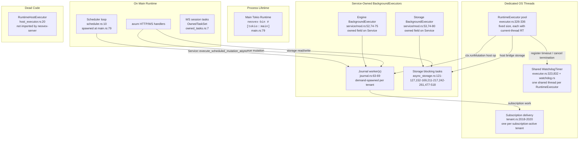
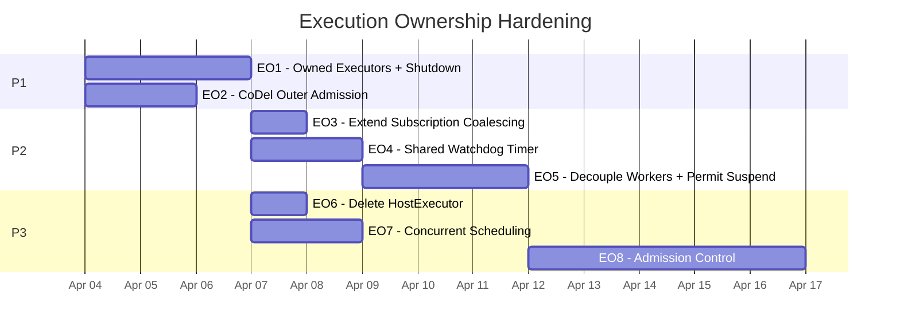
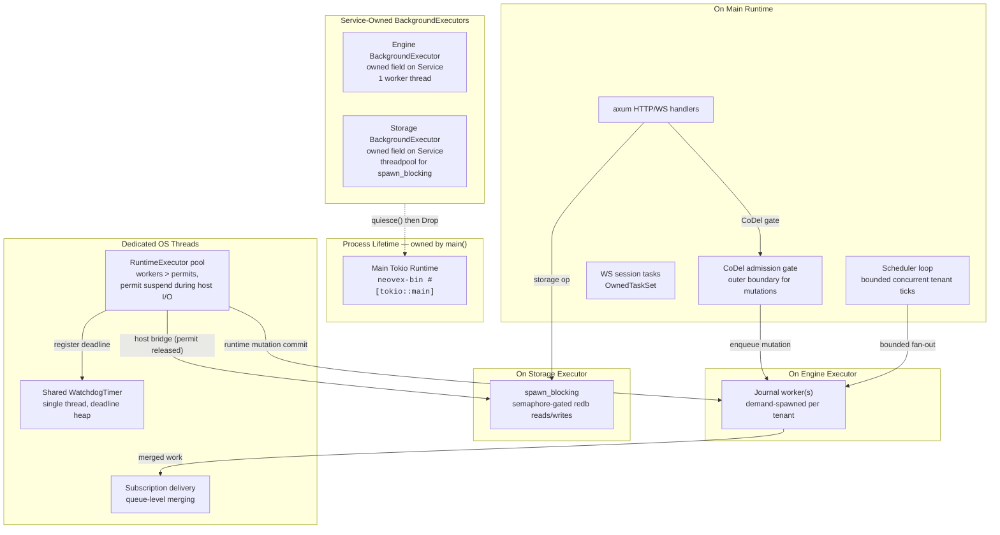

# Archived Execution Ownership Hardening Plan

This archived document was the canonical execution roadmap for the completed
EO1 through EO7 execution-ownership hardening cycle. It is now retained as the
historical execution record for that cycle.

Future layered admission-control work that was previously tracked as `EO8` now
lives in `docs/plans/layered-admission-control-plan.md`. The landed runtime,
executor, shutdown, and backpressure invariants from this completed cycle now
live in `ARCHITECTURE.md`.

Reviewed against (local repos):

- Convex backend (`~/src/github.com/get-convex/convex-backend`)
- TigerBeetle (`~/src/github.com/tigerbeetle/tigerbeetle`)
- CockroachDB (`~/src/github.com/cockroachdb/cockroach`)
- Neovex current state (commit `3f553ad` and dirty worktree)

Reviewed against (docs):

- `ARCHITECTURE.md` (lines 242-286: execution domains, lines 327-392: invariants)
- `CLAUDE.md`
- `docs/reference/current-capabilities.md`
- `docs/reference/http-api.md`

---

## Control Plan Rules

This document is the durable execution control plane for this workstream.

For long-running Codex execution, handoffs, and post-compaction recovery, the
source of truth is:

1. the current git worktree
2. this plan's `Roadmap Status Ledger`, `Implementation Checkpoints`, and
   `Execution Log`
3. the referenced architecture docs and code called out in each phase

The source of truth is not the prior chat transcript.

### Status model

- `todo`: not started; eligible when hard dependencies are `done` and any gate
  note is satisfied
- `in_progress`: actively being implemented; keep exactly one roadmap item in
  this state at a time for a single autonomous Codex run
- `blocked`: cannot proceed until the recorded blocker is resolved
- `done`: acceptance criteria are met and required verification has been
  recorded in `Execution Log`
- `deferred`: intentionally parked behind a load-testing, platform, or product
  gate and not eligible for autonomous pickup yet

### Recovery loop for every new session or post-compaction resume

1. Reread this `Control Plan Rules` section, `Roadmap Status Ledger`,
   `Implementation Checkpoints`, `Dependency Graph`, `Recommended Delivery
   Order`, and `Execution Log`.
2. Inspect the current git worktree and reconcile it against this plan before
   picking new scope.
3. If any item is already `in_progress`, resume that item first.
4. If the worktree is dirty, identify which item owns the changes and update
   that item's checkpoint or log entry before starting new work.
5. If no item is `in_progress`, pick the first eligible item in `Recommended
   Delivery Order` whose hard dependencies are `done` and whose gate note is
   already satisfied.
6. Implement exactly one roadmap item by default.
7. Run the phase-specific verification plus the repo-level checks required by
   this plan before marking an item `done`.
8. Update `Roadmap Status Ledger`, `Implementation Checkpoints`, and
   `Execution Log` in the same change set as the code or document work.
9. If blocked, record the blocker in this plan before stopping.

### Dirty-worktree reconciliation rules

- A dirty worktree outranks remembered intent.
- If code and plan disagree, reconcile the plan to the actual partial
  implementation before choosing new scope.
- Do not treat unstaged or uncommitted changes as disposable scratch work.
- Do not start a later item while an earlier item remains `in_progress`.

### Required write-back after each work session

- update the item's status in `Roadmap Status Ledger`
- update or add the item's note in `Implementation Checkpoints` if the item
  remains partial
- append a row to `Execution Log` with date, item, outcome, verification, and
  next step
- update `ARCHITECTURE.md` in the same change set when the session lands an
  architecture-level behavior change promised by this plan

### Historical autonomous prompt

```text
Use docs/plans/archive/execution-ownership-hardening-plan.md as the control plan.
Reread Control Plan Rules, Roadmap Status Ledger, Implementation Checkpoints,
Dependency Graph, Recommended Delivery Order, Execution Log, and the current git
worktree. If any item is in_progress, resume it first. Reconcile dirty worktree
changes to the owning item before starting new scope. Implement exactly one
item, run the required verification, update the ledger/checkpoint/log, and then
continue. If blocked, record the blocker in the plan before stopping. Do not
rely on chat history as progress state.
```

---

## Roadmap Status Ledger

| Item | Status | Summary | Hard Dependencies | Gate Note |
|------|--------|---------|-------------------|-----------|
| EO1 | `done` | Owned `BackgroundExecutor` lifecycle for engine and storage | none | none |
| EO2 | `done` | Outer admission gate with CoDel before journal ownership | none | none |
| EO3 | `done` | Extend subscription delivery coalescing at queue level | none | none |
| EO4 | `done` | Shared invocation watchdog timer | none | none |
| EO5 | `done` | Decouple V8 workers from JS permits with suspend/resume | EO4 | none |
| EO6 | `done` | Delete dead `RuntimeHostExecutor` path | none | none |
| EO7 | `done` | Concurrent tenant scheduling | EO1 | none |
| EO8 | `deferred` | Broader layered admission control | EO1, EO2 | start only after the EO8 experiment report in `docs/plans/layered-admission-control-plan.md` identifies a concrete binding admission boundary and the specific first gate to promote |

Keep each roadmap item's header `Status` field in sync with this ledger.

---

## Implementation Checkpoints

Update this section whenever an item is left partially complete across sessions.

| Item | Checkpoint | Next Step |
|------|------------|-----------|
| EO1 | completed on 2026-04-03: `Service` now owns engine/storage `BackgroundExecutor` fields, async storage uses the service-owned storage handle for all blocking work, `neovex-bin` drains via `service.quiesce().await`, and executor quiesce semantics are covered by targeted tests. | start `EO2` by adding a separate `MutationAdmissionGate` before journal enqueue |
| EO2 | completed on 2026-04-03: async mutations now enter a separate per-tenant `MutationAdmissionGate`; the journal worker drains that gate before commit-path processing, sheds stale gate items via CoDel, preserves admitted work once it reaches the journal path, and can top off the current batch from gate work that arrives before the batch snapshot closes. Coverage now includes gate shedding, gate buffering while the journal is paused, admitted-work durability, and the full `neovex-engine` crate. | start `EO3` by merging queue-level subscription delivery work across distinct journal batches |
| EO3 | completed on 2026-04-03: the subscription delivery worker now drains a small ready batch, merges `QueuedSubscriptionWork` items before dispatch, preserves the existing journal-batch coalescing behavior, and records `queue_level_merge_count` alongside the existing stale-delivery skip metrics. | start `EO4` by introducing the shared watchdog timer and routing registration through it |
| EO4 | completed on 2026-04-03: `RuntimeExecutor` now owns a shared `WatchdogTimer`; runtime invocations register timeout and external-cancellation termination against that timer, disarm those registrations before `JsRuntime` teardown, and no longer spawn dedicated watchdog OS threads per invocation. Added unit coverage for timeout firing, disarm, and external-cancellation polling. | start `EO5` by decoupling `worker_threads` from JS permits and adding suspend/resume |
| EO5 | completed on 2026-04-03: `RuntimeExecutor` now runs worker threads through `WorkerLoopFactory` / `RunToCompletionWorkerLoop`, uses a worker-local `DenoRuntimeBackend`, decouples `worker_threads` from `max_concurrent_isolates`, and tracks per-tenant active/in-flight/queued admission separately. `SharedInvocationPermit` now lives in `OpState`, async host ops suspend and re-acquire permits through that shared controller, and timeout accounting pauses while an invocation waits to re-acquire its permit. Coverage now includes freed-permit capacity across workers, same-tenant in-flight accounting, parked-invocation resume, timeout exclusion for permit re-acquire wait, the full `neovex-runtime` suite, the Convex demo server flow, and workspace clippy. | start `EO6` by deleting the dead `RuntimeHostExecutor` path |
| EO6 | completed on 2026-04-03: deleted `crates/neovex-runtime/src/host_executor.rs`, removed the dead `mod` / public re-export from `neovex-runtime`, and scrubbed the architecture reference that still described it as a live runtime surface. The runtime crate verification stayed green after the deletion. | start `EO7` by replacing sequential scheduler tenant iteration with bounded concurrent fan-out |
| EO7 | completed on 2026-04-03: `tick_at_async` now fans out loaded tenants with bounded `for_each_concurrent(...)` parallelism, so one tenant's paused or slow scheduled mutation no longer blocks due work for other tenants. Added coverage for a paused-tenant regression and reconciled the server/runtime test suite with the new oversubscribed-worker and applied-visibility contracts before closing the item with workspace-wide verification. | keep `EO8` deferred until load testing identifies the next real admission boundary |
| EO8 | deferred: the full background, prior art, observability map, and experiment design now live in `docs/plans/layered-admission-control-plan.md`. Existing runtime and engine diagnostics provide part of the needed signal surface, but promotion still requires a focused EO8 experiment report that proves which work class is causing cross-class interference and whether the next gate should be query slots, scheduled-job slots, storage sub-budgets, or stronger tenant isolation. | keep deferred until a measurement run selects the first EO8 implementation slice |

---

## Dependency Graph

- `EO1` is the lifecycle foundation for owned executors and shutdown.
- `EO2` is independent of `EO1`, but both are the P1 foundation for the rest of
  the plan.
- `EO3` is independent, but should follow `EO1` in the recommended order so
  ownership and shutdown semantics are stabilized first.
- `EO4` is independent and should land before `EO5`.
- `EO5` depends on `EO4` and assumes the post-EO4 watchdog model.
- `EO6` is independent cleanup and can land once the worktree is otherwise
  clean.
- `EO7` depends on `EO1` because scheduler fan-out needs the owned shutdown
  model.
- `EO8` is deferred until the companion layered-admission-control plan's
  experiment run identifies a concrete next admission boundary beyond `EO2`
  and `EO5`.

---

## Recommended Delivery Order

1. `EO1`
2. `EO2`
3. `EO3`
4. `EO4`
5. `EO5`
6. `EO6`
7. `EO7`
8. `EO8`

---

## Execution Log

Append one row for every session that materially advances, blocks, or completes
an item.

| Date | Item | Outcome | Summary | Verification | Next Step |
|------|------|---------|---------|--------------|-----------|
| 2026-04-03 | meta | documented | Converted this document into a durable control plan with stable item IDs, status ledger, checkpoints, recovery loop, and execution log so autonomous Codex runs can resume after handoffs or compaction without relying on chat history. | document review | start `EO1` unless a future worktree reconciliation marks another earlier item `in_progress` |
| 2026-04-03 | EO1 | in_progress | Started the owned-executor workstream from a clean worktree. This session owns replacing the service `OnceLock<TokioRuntime>` pattern with owned executor fields, threading a storage-owned executor into async storage, and landing the first verification-backed shutdown slice. | worktree reconciliation and control-plan review | inspect current engine/storage runtime ownership code, implement EO1, run targeted verification, then mark done or checkpoint the remaining gap |
| 2026-04-03 | EO1 | done | Replaced the static service runtime with owned engine/storage `BackgroundExecutor` fields, threaded the storage executor handle through async storage and storage-engine constructors, added `Service::quiesce()`, and wired the bin shutdown path to drain service-owned work before exit. Added targeted executor quiesce tests and synced architecture docs to the new ownership model. | `cargo fmt --all --check`; `cargo test -p neovex-storage`; `cargo test -p neovex-engine`; `cargo test -p neovex-server convex_http_demo_ -- --nocapture`; `make clippy` | start `EO2` |
| 2026-04-03 | EO2 | done | Added a per-tenant `MutationAdmissionGate` ahead of the journal queue, routed async mutations through that outer gate, added CoDel shedding plus gate diagnostics, preserved admitted journal work, and tightened the worker handoff so newly admitted gate work can join the current batch before the batch snapshot closes without being transiently rejected by momentary inner-queue fullness. Rewrote the old overflow test around the new buffered-gate semantics and kept the existing journal batch coalescing and reopen recovery behavior green under the new worker loop. | `cargo fmt --all --check`; `CARGO_TARGET_DIR=/tmp/neovex-eo2-admission cargo test -p neovex-engine mutation_admission_gate_codel_ -- --nocapture`; `CARGO_TARGET_DIR=/tmp/neovex-eo2-buffered cargo test -p neovex-engine mutation_admission_gate_buffers_while_journal_is_paused_without_losing_in_flight_response -- --nocapture`; `CARGO_TARGET_DIR=/tmp/neovex-eo2-admitted cargo test -p neovex-engine mutation_journal_never_expires_admitted_work -- --nocapture`; `CARGO_TARGET_DIR=/tmp/neovex-eo2-queued cargo test -p neovex-engine queued_ -- --nocapture`; `CARGO_TARGET_DIR=/tmp/neovex-eo2-queued cargo test -p neovex-engine` | start `EO3` |
| 2026-04-03 | EO3 | done | Extended the subscription delivery worker to drain a small ready batch, merge overlapping `QueuedSubscriptionWork` items before reevaluation, and expose `queue_level_merge_count` in diagnostics. Preserved journal-batch coalescing and overflow monotonicity while removing redundant second-pass delivery work. | `cargo fmt --all --check`; `CARGO_TARGET_DIR=/tmp/neovex-eo3 cargo test -p neovex-engine subscription_delivery_queue_merge_coalesces_overlapping_work_items -- --nocapture`; `CARGO_TARGET_DIR=/tmp/neovex-eo3 cargo test -p neovex-engine subscription_delivery_queue_overflow_falls_back_without_regressing_monotonicity -- --nocapture`; `CARGO_TARGET_DIR=/tmp/neovex-eo3 cargo test -p neovex-engine journal_batch_coalesces_subscription_delivery_into_one_update -- --nocapture`; `CARGO_TARGET_DIR=/tmp/neovex-eo3 cargo test -p neovex-engine` | start `EO4` |
| 2026-04-03 | EO4 | in_progress | Reconciled the dirty worktree and inspected the current `neovex-runtime` watchdog/executor seams. Confirmed the current per-invocation timeout and external-cancellation watchdog threads in `runtime.rs`, and scoped EO4 around a shared executor-owned `WatchdogTimer` that will replace those dedicated threads while preserving timeout and cancellation termination semantics. | control-plan review; `sed -n '860,1015p' docs/plans/execution-ownership-hardening-plan.md`; `sed -n '1380,1585p' crates/neovex-runtime/src/runtime.rs`; `sed -n '300,860p' crates/neovex-runtime/src/executor.rs` | implement the shared watchdog module, wire it through `RuntimeExecutor`, replace runtime thread spawning, then run EO4 verification |
| 2026-04-03 | EO4 | done | Added `neovex-runtime/src/watchdog.rs`, moved timeout and external-cancellation watchdog ownership into a shared `RuntimeExecutor`-owned `WatchdogTimer`, replaced per-invocation `std::thread::spawn` watchdogs in `runtime.rs` with explicit registration/disarm, and shut the shared watchdog down from `RuntimeExecutorInner::drop()` after worker join. Added unit coverage for timeout firing, disarm, and shared cancellation polling. The first isolated runtime test run hit restricted-network `rusty_v8` archive download failure; rerunning with network access succeeded. | `cargo fmt --all --check`; `bash scripts/cargo-isolated.sh -- test -p neovex-runtime` (first attempt failed under restricted network while fetching `rusty_v8`); `cargo test -p neovex-runtime`; `cargo test -p neovex-server convex_http_demo_ -- --nocapture` | start `EO5` |
| 2026-04-03 | meta | documented | Re-scoped EO5 before implementation so the primary extensibility seam is now `WorkerLoop` / `WorkerLoopFactory`, with the current deno_core `RuntimeBackend::invoke(...)` kept as a worker-local helper below that seam. This keeps the current run-to-completion model intact while making later cooperative Locker, workerd-style, and WASM runtime models a clean follow-on instead of an executor retrofit. | document review against `docs/plans/v8-locker-fork-plan.md` and EO5 | update the locker fork plan to match the worker-loop seam before starting EO5 code |
| 2026-04-03 | EO5 | in_progress | Reconciled the current dirty worktree to EO5, re-read the EO5 control-plan section, and inspected the concrete runtime seams in `executor.rs`, `runtime.rs`, `limits.rs`, and `watchdog.rs`. Confirmed the current gaps the implementation must close: executor logic is still embedded directly in `RuntimeExecutor`, tenant fairness still uses a single `in_flight` counter, and host async ops still have no shared permit/timeout controller in `OpState`. | control-plan review; `sed -n '960,1235p' docs/plans/execution-ownership-hardening-plan.md`; `sed -n '1,760p' crates/neovex-runtime/src/executor.rs`; `sed -n '300,380p' crates/neovex-runtime/src/runtime.rs`; `sed -n '1240,1305p' crates/neovex-runtime/src/runtime.rs`; `sed -n '1450,1685p' crates/neovex-runtime/src/runtime.rs`; `sed -n '1,260p' crates/neovex-runtime/src/limits.rs`; `sed -n '1,520p' crates/neovex-runtime/src/watchdog.rs` | implement the worker-loop seam and updated tenant admission accounting first, then wire permit suspend/resume and timeout pause through the runtime host-op path |
| 2026-04-03 | EO5 | done | Introduced `worker_loop.rs` and `backend.rs` so `RuntimeExecutor` now owns an oversubscribed worker pool through `WorkerLoopFactory` / `RunToCompletionWorkerLoop` while the deno-specific `DenoRuntimeBackend` stays worker-local. Split runtime admission into per-tenant active/in-flight/queued accounting, added `worker_threads`, `max_active_top_level_invocations_per_tenant`, and `max_in_flight_top_level_invocations_per_tenant`, and threaded `SharedInvocationPermit` plus `RuntimeInvocationTimeoutController` through `OpState` so async host ops suspend and re-acquire permits with timeout pause during permit re-acquire. Added focused coverage for freed-permit capacity, parked resume, in-flight-limit accounting, and timeout exclusion for permit re-acquire wait. | `cargo fmt --all --check`; `bash scripts/cargo-isolated.sh -- test -p neovex-runtime`; `bash scripts/cargo-isolated.sh -- test -p neovex-server convex_http_demo_ -- --nocapture` (first attempt failed under restricted network while fetching `rusty_v8`; reran with network access and passed); `make clippy` | start `EO6` |
| 2026-04-03 | EO6 | done | Deleted the dead `RuntimeHostExecutor` module and its unit test, removed the stale public re-export from `neovex-runtime/src/lib.rs`, and removed the remaining architecture reference that still documented it as a live runtime surface. This leaves async host work on the real engine/storage futures only, matching the post-EO1-through-EO5 runtime design. | `cargo check -p neovex-runtime`; `bash scripts/cargo-isolated.sh -- test -p neovex-runtime` | start `EO7` |
| 2026-04-03 | EO7 | done | Replaced sequential scheduler tenant iteration with bounded `for_each_concurrent(...)` fan-out in `crates/neovex-engine/src/scheduler.rs` and added a paused-tenant regression test proving one tenant's scheduled mutation no longer blocks another tenant's due work. EO7 closeout also fixed follow-on server assertions to match the landed EO5 runtime model: execution metrics are recorded in the worker-loop path, oversubscribed workers can dispatch more jobs than active isolates, and HTTP/WebSocket write acknowledgements still wait for journal apply visibility. | `cargo test -p neovex-engine scheduler_tick_processes_other_tenants_while_one_tenant_is_paused -- --nocapture`; `cargo test -p neovex-engine scheduler_ -- --nocapture`; `cargo fmt --all --check`; `make clippy`; `make test` | keep `EO8` deferred until load testing identifies a concrete next admission bottleneck |
| 2026-04-03 | EO8 | documented | Expanded EO8 from a design placeholder into a deferred promotion plan with three explicit decision inputs: existing Neovex architecture, battle-tested prior art, and a required experiment report. Added candidate per-work-class gates, mapped the observability already available via `/debug/runtime/metrics` and `/debug/tenants/{tenant}/engine/metrics`, documented instrumentation gaps, and defined a workload matrix plus promotion criteria so a future EO8 implementation is selected by evidence rather than guesswork. | control-plan review; local prior-art review in CockroachDB, Convex, and TigerBeetle sources; official CockroachDB admission-control docs review | keep deferred until an EO8 experiment run produces a concrete first implementation target |
| 2026-04-03 | EO8 | documented | Split the deferred EO8 background into `docs/plans/layered-admission-control-plan.md` so the main execution-ownership control plan can keep only the status and promotion gate while the standalone companion plan holds the codebase review, prior art, observability surfaces, experiment workflow, and promotion matrix. | document review against the EO8 section, current debug endpoints, and local prior-art sources | keep EO8 deferred until a measurement run names the first concrete slice to promote |

---

## Cross-Project Comparison Summary

### What Neovex already does well

| Pattern | Neovex implementation | Industry match |
|---------|----------------------|----------------|
| Service-owned background executors | `Service` owns engine/storage `BackgroundExecutor` fields with explicit `quiesce()` (`service/mod.rs:42-119`, `background_executor.rs:14-97`) | Convex `ProdRuntime::spawn_background` (`local_backend/src/lib.rs:266`) |
| Centralized spawn helper | `Service::spawn_background()` delegates to the owned engine executor (`service/mod.rs:107-114`) | CockroachDB `Stopper.RunAsyncTask` (`pkg/util/stop/stopper.go`) |
| Ownership assertions | `assert_running_on_background_task` debug guard (`journal.rs:72-73`) | TigerBeetle assertion density >= 2/function (`docs/TIGER_STYLE.md:100`) |
| Single mutation path | All mutations flow through `Service::apply_mutation` (`ARCHITECTURE.md:349-352`) | Convex `Committer` single-task serialization (`committer.rs`) |
| Bounded journal queue | `DEFAULT_MUTATION_JOURNAL_QUEUE_CAPACITY = 256` (`tenant.rs:30`) | Convex committer channel capacity 128 |
| Per-tenant subscription delivery | Dedicated OS thread with `Condvar` queue (`tenant.rs:2018-2020`) | Convex `NUM_SUBSCRIPTION_MANAGERS` workers (`subscription.rs`) |
| Fixed V8 worker pool | `RuntimeExecutor` OS thread pool (`executor.rs:325-334`) | Convex `SharedIsolateScheduler` up to 128 OS threads (`client.rs`) |
| Session child task ownership | `OwnedTaskSet` wrapping `JoinSet` (`owned_tasks.rs:7`) | Convex `try_join!` trio per WS session |
| Journal-level subscription coalescing | N commits batched into 1 `QueuedSubscriptionWork` (`journal.rs:173`) | Convex `SingleFlightSender` transition skipping |
| Delivery-level staleness skip | `is_stale_for_sequence` skips re-evaluation (`subscriptions.rs:416,427,445`) | CockroachDB raft scheduler flag coalescing |

### What the battle-tested projects do that Neovex does not

| Pattern | Convex | TigerBeetle | CockroachDB | Neovex gap |
|---------|--------|-------------|-------------|------------|
| Owned executor lifecycle | `TokioRuntime` on stack in `main()`, dropped on exit | Process kill + crash recovery | `Stopper.Quiesce()` then `Stop()` | resolved by `EO1`: `Service` now owns engine/storage executors with explicit quiesce |
| Storage-owned executor | Committer serializes writes through dedicated task | Single thread owns all I/O | Pebble owns goroutine pool | resolved by `EO1`: async storage now runs on the service-owned storage executor handle |
| Outer admission control | CoDel queue expires items before V8 execution starts | Static IOPS budgets | Slots + tokens + IO tokens | resolved by `EO2`: async mutations now enter a per-tenant `MutationAdmissionGate` with CoDel shedding before journal ownership |
| Suspend/resume concurrency | V8 releases isolate slot during async I/O | N/A (single thread) | Admission slots returned on completion | V8 holds slot through entire invocation |
| Shared watchdog timer | N/A | Timer wheel in main loop | N/A | resolved by `EO4`: shared `WatchdogTimer` thread owned by `RuntimeExecutor` |
| Concurrent tenant scheduling | Workers process tenants in parallel | Single thread, deterministic order | Sharded raft scheduler | Serial per-tenant in `tick_at_async` |

---

## Execution Domain Map (Current State)



### Ownership violations and anti-patterns

1. **P2 — Per-tenant subscription threads don't idle-shutdown.** Each
   subscription-active tenant holds a dedicated OS thread
   (`tenant.rs:2018-2020`). Under high tenant count with low subscription
   activity, this wastes OS threads.
   - Convex comparison: fixed `NUM_SUBSCRIPTION_MANAGERS` workers with
     round-robin dispatch.

2. **P3 — RuntimeHostExecutor is dead code.** Defined at `host_executor.rs:20`,
   not imported anywhere in `neovex-server`. Pre-launch repo — delete it.

3. **P3 — Scheduler processes tenants sequentially.** One slow tenant blocks all
   others in `tick_at_async`.
   - CockroachDB comparison: sharded raft scheduler with per-shard workers.

---

## Phases

### EO1. Owned BackgroundExecutor + Storage Executor

**Priority:** P1
**Status:** `done`
**Depends on:** Nothing
**Estimated scope:** ~300 LOC

**Goal:** Replace the `OnceLock<TokioRuntime>` singleton with an owned
`BackgroundExecutor` struct that supports explicit two-phase shutdown. Use the
same type for both the service background runtime and a new storage executor.
This fixes the storage-borrows-caller-runtime ownership violation AND the
shutdown lifecycle gap in a single coherent change.

#### Why not another OnceLock?

Tokio's `Runtime::shutdown_timeout(self, duration)` and
`Runtime::shutdown_background(self)` both take `self` **by value** — they
consume the runtime. `OnceLock` only provides `&T` (borrowed access), never
`T`. So:

- You cannot call `shutdown_timeout` or `shutdown_background` on a runtime
  stored in a static `OnceLock`.
- The runtime is only dropped at process exit (static lifetime).
- In tests, multiple `Service::new()` calls share one runtime with no way to
  isolate or drain tasks per-service.

The Convex pattern is better: `ProdRuntime::init_tokio()` returns an owned
`TokioRuntime` that lives on `main()`'s stack frame
(`get-convex/convex-backend/crates/local_backend/src/main.rs:78`). The handle
is cloned into `ProdRuntime` which is `Clone` and passed by value. When
`main` returns, `Drop` joins all spawned futures.

#### Design: `BackgroundExecutor`

```rust
/// An owned Tokio runtime with two-phase shutdown and task-count tracking.
/// Used for both the service engine background and the storage blocking pool.
pub struct BackgroundExecutor {
    /// Owned runtime — consumed by `stop()` or `Drop`.
    runtime: Option<TokioRuntime>,
    /// Cloned handle for spawning tasks.
    handle: TokioRuntimeHandle,
    /// Prevents a race between quiesce and task registration.
    spawn_gate: RwLock<()>,
    /// Refuses new work once quiesce begins.
    closed: AtomicBool,
    /// Cooperative shutdown signal for long-lived workers.
    shutdown: CancellationToken,
    /// Tracks spawned work and waits for it to exit during quiesce.
    tracker: TaskTracker,
    /// Human-readable name for debug assertions and logging.
    name: &'static str,
}
```

**Construction:**

```rust
impl BackgroundExecutor {
    pub fn new(name: &'static str, worker_threads: usize) -> Self {
        let runtime = tokio::runtime::Builder::new_multi_thread()
            .worker_threads(worker_threads)
            .thread_name(name)
            .enable_all()
            .build()
            .expect("failed to build background runtime");
        let handle = runtime.handle().clone();
        Self {
            runtime: Some(runtime),
            handle,
            spawn_gate: RwLock::new(()),
            closed: AtomicBool::new(false),
            shutdown: CancellationToken::new(),
            tracker: TaskTracker::new(),
            name,
        }
    }
}
```

**Spawn (replaces `Service::spawn_background`):**

```rust
pub fn spawn<F>(&self, future: F) -> Result<JoinHandle<F::Output>, Error>
where F: Future + Send + 'static, F::Output: Send + 'static
{
    let _read = self
        .spawn_gate
        .read()
        .expect("spawn gate should not be poisoned");
    if self.closed.load(Ordering::Acquire) {
        return Err(Error::Unavailable("executor is quiescing"));
    }
    let tracked = self.tracker.track_future(future);
    Ok(self.handle.spawn(tracked))
}
```

Use standard Tokio lifecycle primitives here:
- `tokio_util::task::TaskTracker` for task accounting and drain
- `tokio_util::sync::CancellationToken` for cooperative shutdown
- a tiny `spawn_gate` + `closed` check to make "stop admitting work" atomic

This follows Tokio's own graceful-shutdown guidance more closely than bespoke
task counters.

**Quiesce (phase 1):**

```rust
pub async fn quiesce(&self) {
    let _write = self
        .spawn_gate
        .write()
        .expect("spawn gate should not be poisoned");
    self.closed.store(true, Ordering::Release);
    self.shutdown.cancel();
    self.tracker.close();
    drop(_write);
    self.tracker.wait().await;
}
```

Long-lived workers should receive a child token from `self.shutdown` and select
on it so quiesce can drain them cooperatively.

After `quiesce()` returns, no new tasks will start and all in-flight tasks
have completed. This is CockroachDB's `Stopper.Quiesce()` pattern
(`cockroachdb/cockroach/pkg/util/stop/stopper.go:633-668`).

**Stop (phase 2, consumes self via Drop):**

```rust
impl Drop for BackgroundExecutor {
    fn drop(&mut self) {
        if let Some(rt) = self.runtime.take() {
            // Best-effort: if quiesce wasn't called, block briefly.
            rt.shutdown_timeout(Duration::from_secs(5));
        }
    }
}
```

Callers should call `quiesce().await` cooperatively before dropping. `Drop`
is the safety net, not the primary shutdown path. Consider adding a
`quiesce_with_timeout(duration: Duration)` that falls through to `Drop` if
tasks don't drain in time (validated by axum/tonic/hyper shutdown patterns and
the `tokio-graceful` crate's `shutdown_with_limit`). This mirrors Convex where
`Application::shutdown()` drains workers cooperatively
(`get-convex/convex-backend/crates/application/src/lib.rs:3567-3576`), and
`TokioRuntime::Drop` is the fallback.

**`spawn_blocking` for storage:**

```rust
pub fn spawn_blocking<F, R>(&self, f: F) -> Result<JoinHandle<R>, Error>
where F: FnOnce() -> R + Send + 'static, R: Send + 'static
{
    // Same quiesce gate as spawn()
    // ...
    Ok(self.handle.spawn_blocking(f))
}
```

#### How Service owns it

`Service` stores `BackgroundExecutor` instances as fields, not statics:

```rust
pub struct Service {
    // ... existing fields ...
    engine_executor: BackgroundExecutor,   // replaces OnceLock singleton
    storage_executor: BackgroundExecutor,  // new: owns storage blocking work
}
```

Both are constructed in `Service::new()` and passed through to the storage
layer. In `main.rs`, `Service` is wrapped in `Arc<Service>` — `quiesce` is
called during the shutdown sequence, and `Drop` fires when the last `Arc`
ref is released.

The `assert_running_on_background_task` pattern (`service/mod.rs:126-134`)
transfers directly — use `task_local!` scoped to each executor's name.

#### Files to change

- `crates/neovex-engine/src/service/mod.rs` — Replace `OnceLock<TokioRuntime>`
  (lines 60-73) and `background_runtime: TokioRuntimeHandle` field (line 53)
  with `engine_executor: BackgroundExecutor`. Replace `spawn_background`
  (lines 118-124) with delegation to `self.engine_executor.spawn(...)`.
  Add `Service::quiesce()` and remove `service_background_runtime_handle()`.
- `crates/neovex-engine/src/service/mutations/journal.rs` — Change
  `self.spawn_background("mutation_journal", ...)` (line 66) to
  `self.engine_executor.spawn(...)`.
- `Cargo.toml` — Add `tokio-util = { version = "0.7", features = ["rt"] }` to
  `[workspace.dependencies]` so the repo keeps a single canonical version and
  feature set. The `rt` feature is required for `TaskTracker`;
  `CancellationToken` needs no special feature.
- `crates/neovex-engine/Cargo.toml` — Add `tokio-util.workspace = true` to
  follow the repo's normal dependency style instead of pinning an inline crate
  version in the member manifest.
- `crates/neovex-storage/src/async_storage.rs` — Accept a
  `TokioRuntimeHandle` (from `storage_executor`) at construction. Replace all
  6 `tokio::task::spawn_blocking(...)` calls (lines 117, 147, 203, 233, 456,
  477) with `self.storage_handle.spawn_blocking(...)`.
- `crates/neovex-storage/src/async_storage.rs` — Thread the storage runtime
  handle through `RedbTenantStorage::new()`, `RedbUsageStorage::new()`, and
  `RedbStorageEngine::new()` / `read_storage_for_store()`, which is where the
  storage-engine wiring currently lives.
- `crates/neovex-bin/src/main.rs` — Call `service.quiesce().await` in the
  shutdown sequence (after the `watch` signal at line 79, before server exit).
- `ARCHITECTURE.md` — Update execution domains table (line 280) and add
  lifecycle invariant.

#### Prior art references

| Pattern | Source | File:Line |
|---------|--------|-----------|
| Owned runtime on stack | Convex | `local_backend/src/main.rs:78` |
| Handle cloned from owned runtime | Convex | `runtime/src/prod.rs:189` |
| Cooperative worker drain before drop | Convex | `application/src/lib.rs:3567-3576` |
| Quiesce flag + task count under lock | CockroachDB | `pkg/util/stop/stopper.go:543-554` |
| Two-phase quiesce + stop | CockroachDB | `pkg/util/stop/stopper.go:569-668` |
| Committer serializes writes | Convex | `database/src/committer.rs:1246-1256` |
| Graceful shutdown via cancellation + task tracking | Tokio | `tokio.rs/tokio/topics/shutdown` |

#### Verification

```bash
cargo test -p neovex-storage
cargo test -p neovex-engine
cargo test -p neovex-server convex_http_demo_ -- --nocapture
# New test: shutdown during active journal work completes in-flight batch
cargo test -p neovex-engine shutdown_ -- --nocapture
# New test: spawn after quiesce returns ResourceExhausted
cargo test -p neovex-engine quiesce_ -- --nocapture
# Existing restart/recovery tests still pass
cargo test -p neovex-engine service_reload_ -- --nocapture
```

#### Architecture invariants to add

- "Service owns its engine and storage executors as struct fields. Both support
  two-phase shutdown: quiesce (refuse new work, drain in-flight) then stop
  (drop runtime). No long-lived runtime is stored in a process-wide static."
- "Storage blocking work runs on a storage-owned executor, not borrowed from
  request or engine runtimes."

---

### EO2. Outer Admission Gate with CoDel Load Shedding

**Priority:** P1
**Status:** `done`
**Depends on:** Nothing (can run parallel with EO1)
**Estimated scope:** ~300 LOC

**Goal:** Add a proper outer admission gate with CoDel-style load shedding that
sits **before** work enters the mutation journal. The journal queue remains a
pure commit-path component with simple bounded-capacity rejection. Once work
passes the admission gate and enters the journal, it is committed or fails for
a real execution reason — the system never expires admitted journal work.

#### Why the admission gate must be separate from the journal queue

Before `EO2`, `submit_journaled_async_mutation` (`journal.rs:117`) called
`enqueue_mutation_request` (`tenant.rs:2476`, delegating to the internal
`MutationJournalState::enqueue`) directly and pushed straight into the
journal-owned `VecDeque`. At that point, ownership transferred to the journal
system: the request had a `oneshot::Sender` response channel, and the journal
worker would drain it, apply it, and resolve the future.

Putting CoDel inside the journal queue — even at drain time — creates a
semantic problem: the journal system accepted ownership of the work, then
decided to shed it based on internal queue delay. From the caller's perspective,
their write was accepted into the commit path but silently expired. This blurs
the boundary between "your request was rejected at admission" (clean) and "your
request was accepted then abandoned" (dirty).

Convex's architecture enforces this separation cleanly:

- **Outer gate:** CoDel queue in the isolate scheduler
  (`get-convex/convex-backend/crates/common/src/codel_queue.rs:151-169`).
  Items expire at pop time (`client.rs:1243-1249`) **before worker
  assignment** — before the work enters any internal execution or commit path.
  The expired item was never "accepted" by the execution system.
- **Inner gate:** Committer channel (`database/src/committer.rs:1246-1256`)
  uses `try_send` with hard rejection when full. No CoDel. Once accepted by
  the committer, the transaction will be committed.

The canonical model: **CoDel at the outer gate, bounded capacity at the inner
gate.** Two separate queues with different semantics. The outer queue is the
overload safety valve. The inner queue is the commit-path buffer.

#### Mutation admission path (traced)

All async mutation paths still converge at one function, but now hit the outer
admission gate first:

```
HTTP handler (http/documents.rs:4-43)
  -> Service::apply_mutation_with_mode_async_cancellable (mutations.rs:608-632)
    -> Service::submit_journaled_async_mutation (journal.rs:117-171)
      -> TenantRuntime::enqueue_mutation_admission_request (...)        // <-- outer gate
      -> ensure journal worker is running
Journal worker loop
  -> TenantRuntime::drain_mutation_admission_queue ()
  -> TenantRuntime::drain_mutation_batch (...)                          // may top off the current batch from the gate before snapshot closes
    -> MutationJournalState::enqueue (...)                              // <-- inner gate, when buffering through the journal queue
```

```
Convex named function (adapters/convex/handlers/function_routes/mutations.rs:4-65)
  -> dispatch_convex_mutation_async (adapters/convex/execution/async_ops/mutations.rs:102-126)
    -> Service::insert_document_async_cancellable_with_principal
      -> submit_journaled_async_mutation -> enqueue_mutation_request
```

```
Scheduler (scheduler.rs:153-205)
  -> Service::execute_scheduled_mutation_async
    -> apply_mutation_with_mode_async_cancellable
      -> submit_journaled_async_mutation -> enqueue_mutation_request
```

```
V8 ctx.db mutations (adapters/convex/host_bridge/function_ops/ctx_ops/direct.rs:234)
  -> Buffered in MutationExecutionUnit, committed atomically via execution_unit.commit()
  -> (bridge.rs:89-94) which calls Service::apply_mutation
```

The outer admission boundary is `submit_journaled_async_mutation` — this is
where the caller transitions from "I own this request" to "the Service owns
this work." The admission gate must sit **before** the call to
`enqueue_mutation_request`, not inside the journal's drain path.

#### Design

`EO2` lands a per-tenant `MutationAdmissionGate` that is structurally separate
from `MutationJournalState`. The gate owns its own bounded queue with CoDel
semantics. The journal queue behind it retains its existing simple
capacity-bounded `VecDeque`.

```rust
/// Outer admission gate — sits between callers and the journal queue.
/// Owns the overload-shedding decision. The journal never expires work.
struct MutationAdmissionGate {
    /// Per-tenant bounded queue with CoDel state.
    queue: VecDeque<PendingMutationRequest>,
    capacity: usize,
    codel: CoDelState,
    /// Metrics
    admitted_count: u64,
    shed_count: u64,
}

struct CoDelState {
    /// Target sojourn time. Convex uses 5ms for their isolate CoDel queue.
    target: Duration,
    /// CoDel interval for entering/exiting dropping state.
    interval: Duration,
    /// State machine: Idle or Dropping { drop_next, drop_count }.
    phase: CoDelPhase,
    /// First time sojourn exceeded target (reset when queue drains empty).
    first_above_time: Option<Instant>,
}

enum CoDelPhase {
    Idle,
    Dropping { drop_next: Instant, drop_count: u32 },
}
```

**Flow:**

```
Caller (HTTP / Convex / Scheduler)
  -> submit_journaled_async_mutation (journal.rs:117)
    -> admission_gate.submit(request)            // OUTER GATE: CoDel queue
      -> If gate queue full: reject ResourceExhausted (immediate, no wait)
      -> Push request into gate queue, stamped with enqueued_at
    -> ensure journal worker is running

Journal worker loop
  -> admission_gate.drain_to_journal()           // Pop from gate, CoDel expire, push to journal
    -> Pop items from gate queue
    -> Check sojourn time per CoDel algorithm
    -> Expired items: send Err(ResourceExhausted("mutation shed by admission gate")) on their oneshot
    -> Surviving items: pass to enqueue_mutation_request  // INNER GATE: capacity
      -> If journal queue full: send Err(ResourceExhausted("mutation journal queue full"))
      -> Otherwise: accepted into journal, will be committed
  -> drain_batch() / process_queued_mutation_batch()      // existing commit path
```

When the worker has already reached the pre-drain handoff boundary, freshly
admitted gate work may be pulled directly into the current batch snapshot
instead of being transiently rejected against an inner queue that is about to
be drained. This preserves batching without expiring or abandoning admitted
journal work.

**Key semantics:**

1. **Gate rejection (CoDel shed):** The caller's `oneshot` receives
   `Err(ResourceExhausted("mutation shed by admission gate"))`. The request
   never entered the journal. This is the outer safety valve under sustained
   load.

2. **Journal rejection (capacity):** The caller's `oneshot` receives
   `Err(ResourceExhausted("mutation journal queue full"))`. Same as today.
   This is the inner hard limit.

3. **Journal acceptance:** Once a request enters the journal queue via
   `enqueue_mutation_request`, it will be committed by the journal worker or
   fail for a real execution reason (schema violation, conflict, etc.). The
   journal never sheds accepted work.

**CoDel algorithm at `try_drain_to_journal`:**

The CoDel algorithm runs each time the journal worker drains the outer gate
before touching the inner journal queue:

1. Pop the head of the gate queue.
2. Compute `sojourn = now - enqueued_at`.
3. If `sojourn < target`: deliver to journal. Reset `first_above_time`.
4. If `sojourn >= target`:
   - If `first_above_time` is None, set it to `now`.
   - If `now - first_above_time >= interval`, enter Dropping phase.
5. In Dropping phase: shed items (send `Err(Overloaded)`) until sojourn drops
   below target. Increment `drop_count`, compute next drop time using CoDel's
   `interval / sqrt(drop_count)` schedule.
6. When an item has `sojourn < target`, exit Dropping phase.

This is the standard CoDel algorithm as specified in the original Nichols &
Jacobson paper and implemented in Linux `fq_codel`. The algorithm is ~50-80
lines of Rust. No existing Rust CoDel crate exists (exhaustively searched
crates.io and GitHub). The pseudocode is available at
[ACM Queue appendix](https://queue.acm.org/appendices/codel.html) and
[RFC 8289](https://datatracker.ietf.org/doc/html/rfc8289). Tower's
`load_shed` and `ConcurrencyLimit` layers solve different problems (binary
readiness and concurrency caps, not sojourn-time-based shedding).

#### Why not a single queue with CoDel-at-drain?

The earlier version of this plan put CoDel at `drain_batch` time inside the
journal's `MutationJournalState`. That was wrong for two reasons:

1. **Ownership semantics.** `enqueue_mutation_request` (`tenant.rs:2476`,
   delegating to `MutationJournalState::enqueue` at `tenant.rs:1743`) is the
   ownership handoff into the journal system. Expiring work after that
   handoff means the journal accepted and then abandoned work — a dirty
   semantic even if the caller hadn't received a "committed" response yet.

2. **Not equivalent to Convex.** Convex's CoDel queue
   (`codel_queue.rs:151-169`) sits **before** worker assignment in the isolate
   scheduler (`client.rs:1243-1249`). Their committer (the equivalent of our
   journal) uses hard rejection only. Claiming drain-time expiry is "exactly
   how Convex's CoDel works" was incorrect — Convex's CoDel is a separate
   outer structure, not logic inside the commit-path queue.

#### Files to change

- `crates/neovex-engine/src/tenant.rs` — Add `MutationAdmissionGate` struct
  alongside `MutationJournalState` (separate fields on `TenantRuntime`). The
  journal state keeps its existing `VecDeque` with capacity-only rejection.
- `crates/neovex-engine/src/service/mutations/journal.rs` — Modify
  `submit_journaled_async_mutation` (`journal.rs:117`) to enqueue into the
  admission gate and ensure the journal worker is running. Update the journal
  worker loop so it drains the admission gate into the journal before
  `drain_batch()` / `process_queued_mutation_batch()`. The commit path itself
  remains unchanged.
- `crates/neovex-engine/src/service/diagnostics.rs` — Expose gate metrics:
  `admitted_count`, `shed_count`, `codel_phase`, `gate_queue_depth`,
  `gate_oldest_age`.
- `crates/neovex-engine/src/service/mod.rs` — Thread `MutationAdmissionGate`
  through tenant construction.

#### Prior art references

| Pattern | Source | File:Line |
|---------|--------|-----------|
| CoDel as separate outer queue | Convex | `common/src/codel_queue.rs:151-169` |
| Scheduler pops from CoDel queue, expires before execution | Convex | `isolate/src/client.rs:1243-1249` |
| Committer hard-rejects when full (no CoDel) | Convex | `database/src/committer.rs:1246-1256` |
| Admission control: slots for KV, tokens for SQL | CockroachDB | `pkg/util/admission/admission.go` |
| CoDel original paper | Nichols & Jacobson | RFC 8289 |

#### Verification

```bash
# New test: mutation that sits past CoDel target is shed at admission gate
cargo test -p neovex-engine mutation_admission_gate_codel_ -- --nocapture
# New test: journal queue is never CoDel-expired (only capacity-rejected)
cargo test -p neovex-engine mutation_journal_never_expires_admitted_work -- --nocapture
# New test: work can remain buffered at the outer gate while the inner journal is paused
cargo test -p neovex-engine mutation_admission_gate_buffers_while_journal_is_paused_without_losing_in_flight_response -- --nocapture
# Existing journal tests still pass
cargo test -p neovex-engine queued_ -- --nocapture
# Broader crate-level verification after the worker-loop handoff changes
cargo test -p neovex-engine
```

---

### EO3. Extend Subscription Delivery Coalescing

**Priority:** P2
**Status:** `done`
**Depends on:** Nothing
**Estimated scope:** ~100 LOC

**Goal:** Extend the existing two-layer subscription coalescing with queue-level
work-item merging in the delivery worker, reducing per-subscription staleness
check overhead under write storms.

#### What already exists (not introducing, extending)

Neovex already has two coalescing layers — this phase builds on them:

**Layer 1 — Journal batch coalescing** (`journal.rs:173`):
`process_applied_commit_batch` takes `&[CommitEntry]` (a batch of N commits
drained from the journal queue), computes affected subscriptions across the
entire batch via `affected_subscription_ids_for_batch`, and produces exactly
one `QueuedSubscriptionWork` with the latest commit's sequence. Multi-commit
batches set `commit: None` to avoid surfacing misleading per-commit metadata.
Tracked via `merged_wakeup_count`. Test: `journal_batch_coalesces_subscription_
delivery_into_one_update` (`tests.rs:1385`).

**Layer 2 — Delivery staleness skip** (`subscriptions.rs:416-445`):
`dispatch_subscription_work` calls `is_stale_for_sequence(sequence)` per
subscription ID. If `last_delivered_sequence >= sequence`, the re-evaluation is
skipped entirely (`coalesced_work_count` incremented). This catches the case
where two separate `QueuedSubscriptionWork` items from two separate journal
batches overlap on the same subscription.

**The remaining gap:** The delivery worker (`tenant.rs:2021`) pops one
`QueuedSubscriptionWork` at a time. If two separate journal batches produce
two work items with overlapping subscription IDs, the worker processes them
sequentially. The second item's re-evaluations are skipped via
`is_stale_for_sequence`, but the worker still iterates through each
subscription ID in the second item to check staleness. Under high write
throughput with many overlapping journal batches, this creates unnecessary
loop iterations.

#### Design

Modify the delivery worker to drain-and-merge:

1. Pop up to `DELIVERY_DRAIN_BATCH_SIZE` (e.g., 8) work items from the queue.
2. Merge subscription ID sets, keeping only the highest sequence per ID.
3. Dispatch the merged set as a single `dispatch_subscription_work` call.

This is a small optimization, not an architecture change. The staleness-skip
layer remains the safety net; queue-level merging reduces redundant queue pops
and redundant stale-check passes before reevaluation.

#### Files to change

- `crates/neovex-engine/src/tenant.rs` — Modify delivery worker loop
  (`tenant.rs:2021`) to drain multiple items and merge before dispatch.
- `crates/neovex-engine/src/subscriptions.rs` — Add
  `queue_level_merge_count` metric to `SubscriptionDeliveryStats` and plumb it
  through the tenant diagnostics snapshot.

#### Verification

```bash
# Existing coalescing test still passes
cargo test -p neovex-engine journal_batch_coalesces -- --nocapture
# New test: two journal batches with overlapping subscriptions merge in delivery
cargo test -p neovex-engine subscription_delivery_queue_merge_coalesces_overlapping_work_items -- --nocapture
# Existing overflow monotonicity test still passes with queue-level merge accounting
cargo test -p neovex-engine subscription_delivery_queue_overflow_falls_back_without_regressing_monotonicity -- --nocapture
# Broader crate-level verification after the delivery worker changes
cargo test -p neovex-engine
```

---

### EO4. Shared Invocation Watchdog Timer

**Priority:** P2
**Status:** `done`
**Depends on:** Nothing
**Estimated scope:** ~200 LOC

**Goal:** Replace per-invocation watchdog OS threads with a shared timer worker,
reducing thread churn under high V8 concurrency.

**Current state before EO4:** Each V8 invocation spawned up to 2 OS threads for
timeout and external-cancellation watchdogs. Each polled every 10ms, so with N
concurrent isolates the runtime created 2N short-lived OS threads.

**Design:**

Create a single `WatchdogTimer` background thread (owned by `RuntimeExecutor`)
that manages a sorted deadline queue. Invocations register a
`(deadline, cancel_handle)` pair on start and deregister on completion.

```rust
pub struct WatchdogTimer {
    sender: mpsc::Sender<WatchdogCommand>,
    thread: Option<JoinHandle<()>>,
}

enum WatchdogCommand {
    RegisterTimeout { id: u64, deadline: Instant, cancel: Box<dyn FnOnce() + Send> },
    RegisterCancellation { id: u64, cancellation: HostCallCancellation, cancel: Box<dyn FnOnce() + Send> },
    Cancel { id: u64, ack: Option<oneshot::Sender<()>> },
    Shutdown,
}
```

The background thread uses `mpsc::recv_timeout` (cleaner than `Condvar`, makes
the command protocol explicit):

```rust
loop {
    let timeout = heap.peek()
        .map(|d| d.deadline.saturating_duration_since(Instant::now()))
        .unwrap_or(Duration::MAX);
    match receiver.recv_timeout(timeout) {
        Ok(WatchdogCommand::RegisterTimeout { id, deadline, cancel }) => {
            heap.push(Reverse((deadline, id)));
            handlers.insert(id, cancel);
        }
        Ok(WatchdogCommand::RegisterCancellation { id, cancellation, cancel }) => {
            cancellation_handlers.insert(id, (cancellation, cancel));
        }
        Ok(WatchdogCommand::Cancel { id, ack }) => {
            handlers.remove(&id);
            cancellation_handlers.remove(&id);
            if let Some(ack) = ack { let _ = ack.send(()); }
        }
        Ok(WatchdogCommand::Shutdown) => break,
        Err(RecvTimeoutError::Timeout) => { /* fire expired entries */ }
        Err(RecvTimeoutError::Disconnected) => break,
    }
    // Fire all expired deadlines
    while let Some(Reverse((deadline, id))) = heap.peek() {
        if *deadline > Instant::now() { break; }
        let (_, id) = heap.pop().unwrap().0;
        if let Some(cancel) = handlers.remove(&id) { cancel(); }
    }
    // Fire all externally cancelled registrations
    for id in cancelled_ids(&cancellation_handlers) {
        if let Some((_, cancel)) = cancellation_handlers.remove(&id) { cancel(); }
    }
}
```

Uses `BinaryHeap<Reverse<(Instant, u64)>>` (min-heap) — the same data structure
libuv uses for its production timer facility in every Node.js process. Timer
wheel crates (`hierarchical_hash_wheel_timer`, etc.) are over-engineered for
this scale (tens-to-hundreds of concurrent watchdogs, not millions).

**Landed implementation:** `RuntimeExecutor` now constructs one shared
`WatchdogTimer` in `RuntimeExecutor::new()`, passes it through both worker and
direct executor invocation paths, and shuts it down in `RuntimeExecutorInner::drop()`
after workers have joined. `runtime.rs` registers timeout and external-cancellation
termination callbacks instead of spawning per-invocation watchdog threads, and
explicitly disarms those registrations before `JsRuntime` teardown so late timer
delivery cannot outlive the isolate lifecycle.

**Prior art references:**

- TigerBeetle: all timeouts checked in the main event loop tick
  (`tigerbeetle/src/tigerbeetle/main.zig:508-511`). No separate timer threads.
- libuv: uses a min-heap for all Node.js timers (not a timer wheel).
- `v8::IsolateHandle::terminate_execution()` is `Send + Sync`, so the watchdog
  can safely terminate any isolate from its dedicated thread.
- Node.js `vm` watchdog (`node_watchdog.cc`): spawns one thread per
  `runInContext()` — the exact anti-pattern this phase replaces.

**Files changed:**

- `crates/neovex-runtime/src/watchdog.rs` (new) — `WatchdogTimer`,
  `WatchdogRegistration`, and targeted unit tests.
- `crates/neovex-runtime/src/runtime.rs` — Replaced per-invocation
  `std::thread::spawn(...)` timeout and external-cancellation watchdogs with
  shared watchdog registration and acknowledged disarm.
- `crates/neovex-runtime/src/executor.rs` — Constructed the shared
  `WatchdogTimer` in `RuntimeExecutor::new()`, threaded it through worker and
  direct invocation paths, and shut it down in `Drop`.
- `crates/neovex-runtime/src/lib.rs` — Declared the new `watchdog` module.

**Verification:**

```bash
cargo fmt --all --check
cargo test -p neovex-server convex_http_demo_ -- --nocapture
cargo test -p neovex-runtime
```

---

### EO5. Decouple V8 Workers from JS Permits with Suspend/Resume

**Priority:** P2
**Status:** `done`
**Depends on:** EO4 (shared watchdog simplifies thread lifecycle)
**Estimated scope:** ~500-700 LOC

**Goal:** Decouple the worker thread count from the JS concurrency permit count
so that I/O-bound invocations release their permit without releasing their
thread. More workers than permits means a waiting worker can acquire a freed
permit and start a new invocation on a different thread while the original
thread remains blocked on host I/O. The original thread resumes its invocation
when the host call completes and it re-acquires a permit.

EO5 also establishes the **primary runtime extensibility seam** for Neovex:
the executor should extend by swapping per-thread worker-loop strategies, not
by assuming every runtime model can be expressed as a single run-to-completion
`invoke(...)` call. Today's deno_core path uses a run-to-completion worker loop.
Future cooperative Locker, workerd-style, or other runtime models plug in by
adding new worker-loop implementations above narrower runtime-specific helpers.

This is the canonical architecture for deno_core embedders. Parked invocations
**hold their thread** — they cannot yield it because `JsRuntime` is `!Send`
and only one `JsRuntime` can exist per thread.

#### Why the current model wastes capacity

```
executor.rs:315     worker_count = max_concurrent_isolates  // COUPLED
executor.rs:325     for worker_id in 0..worker_count { spawn OS thread }
executor.rs:336       worker creates current_thread Tokio runtime
executor.rs:352       loop { job = receiver.blocking_recv() }
executor.rs:388         worker_runtime.block_on(invoke_job(...))
  executor.rs:532         _permit = policy.isolate_semaphore().acquire_owned().await
  runtime.rs:1585         invoke_loaded_bundle()
    runtime.rs:1597         runtime.with_event_loop_promise(resolve, ...)
      (deno_core polls async ops internally)
        runtime.rs:1251       op_neovex_async_host_call()
          host.rs               bridge.call_async(request, cancellation) -> HostBridgeFuture
          (future polled by deno_core on worker's current-thread Tokio runtime)
          (worker thread idle in epoll_wait while I/O pending, permit still held)
  executor.rs:547         _permit dropped
```

Workers and permits are 1:1. A worker blocked on host I/O holds both its
thread (unavoidable — `JsRuntime` is `!Send`) AND its permit (avoidable).
The permit gates new work, so holding it during I/O starves queued invocations.

#### Execution model (one authoritative description)

```
RuntimeExecutor (global)
  owns incoming work queue, JS permit semaphore, worker thread handles
  owns Arc<dyn WorkerLoopFactory>
  worker_threads > max_concurrent_isolates (e.g. 2:1 ratio)

WorkerLoopFactory (primary seam)
  creates one WorkerLoop per worker thread

RunToCompletionWorkerLoop (EO5 implementation)
  owns one worker-local runtime backend
  receives admitted jobs from RuntimeExecutor
  acquires/re-acquires JS permits
  invokes the runtime to completion for the current deno_core model

Worker thread lifecycle in EO5:
  1. Create one RunToCompletionWorkerLoop at worker startup
  2. Receive admitted job from the global mpsc channel (blocking_recv)
  3. Acquire JS permit from semaphore (may block if all permits held)
  4. Drive the invocation to completion through the worker-local backend
  5. During host I/O: SharedInvocationPermit releases the permit
     - Thread remains blocked in its Tokio runtime (cannot accept new jobs)
     - When last async host op completes: re-acquire JS permit (may block)
  6. Invocation completes: release permit, drop or recycle JsRuntime
  7. Return to step 2
```

**What the freed permit enables:** While thread A is blocked on host I/O
(step 4, permit released), thread B (which was blocked at step 2 waiting for
a permit) acquires the freed permit and starts a new invocation. The total
active JS execution is still bounded by `max_concurrent_isolates`, but total
in-flight invocations (active + parked) can be up to `worker_threads`.

**What it does NOT do:** The parked thread A does not pick up other work. It
stays blocked on its host-call result. `JsRuntime` is `!Send` (confirmed:
contains `Rc<RefCell<OpState>>`, `Rc<RefCell<SourceMapper>>` — deno_core
0.395.0 `runtime/jsruntime.rs`), and only one `JsRuntime` can exist per
thread ([deno_core issue #708](https://github.com/denoland/deno_core/issues/708)
— multiple instances on one thread cause V8 segfaults).

#### deno_core constraints (hard, verified)

| Constraint | Source | Implication |
|------------|--------|-------------|
| `JsRuntime` is `!Send` | `Rc<RefCell<OpState>>` in `jsruntime.rs` | Parked invocations resume on same thread |
| One `JsRuntime` per thread | [deno_core #708](https://github.com/denoland/deno_core/issues/708) | No multi-isolate time-slicing |
| V8 Locker unavailable | [rusty_v8 #643](https://github.com/denoland/rusty_v8/issues/643) | Cannot unlock/relock isolates across threads |
| `with_event_loop_promise` is opaque | `jsruntime.rs:2098` | No turn-boundary hooks inside deno_core's event loop |

#### Layering and future runtime support

EO5 needs two layers, with different responsibilities:

```rust
trait WorkerLoopFactory: Send + Sync + 'static {
    fn create(&self, worker_id: usize, policy: Arc<RuntimePolicy>) -> Box<dyn WorkerLoop>;
}

trait WorkerLoop: Send + 'static {
    fn run(
        &mut self,
        jobs: RuntimeWorkerJobReceiver,
        shutdown: RuntimeWorkerShutdown,
    );
}
```

- **Primary seam: `WorkerLoopFactory` / `WorkerLoop`.** This is the executor
  boundary. The executor spawns threads and hands each thread one worker loop.
  Future cooperative runtimes change behavior here.
- **Secondary seam: `RuntimeBackendFactory` / `RuntimeBackend`.** This is a
  worker-local helper used by the current run-to-completion loop. It is not the
  executor's primary extension point.

Concrete shapes:

- **EO5 now:** `RunToCompletionWorkerLoopFactory` creates
  `RunToCompletionWorkerLoop`, which owns a worker-local
  `DenoRuntimeBackend`. That backend still exposes a single
  `invoke(...) -> Result<Value>` helper for today's deno_core model.
- **Future Locker/workerd-style path:** `CooperativeWorkerLoopFactory` creates
  a `CooperativeWorkerLoop` that owns runnable/parked queues, warm-runtime
  pools, and routing. It may still use runtime-specific helpers underneath, but
  it cannot be expressed as a single `invoke(...)` call.
- **Future Wasmtime/WASM path:** Neovex can either reuse
  `RunToCompletionWorkerLoop` with a `WasmtimeRuntimeBackend`, or add a
  different loop if benchmarking justifies it.

This keeps today's implementation clean without forcing tomorrow's cooperative
models through the wrong abstraction.

#### Implementation steps

1. **Decouple worker pool sizing from JS permit count.**
   Add `worker_threads` alongside `max_concurrent_isolates` in
   `RuntimeLimits`. Default: `worker_threads = 2 * max_concurrent_isolates`.
   Workers acquire JS permits before starting each invocation; extra workers
   sit blocked on permit acquisition until a parked invocation releases one.
2. **Introduce the worker-loop seam at the executor boundary.**
   Add `WorkerLoopFactory` and `WorkerLoop` as the executor's primary
   extension point. EO5 should implement
   `RunToCompletionWorkerLoopFactory` / `RunToCompletionWorkerLoop` only.
   `RuntimeExecutor` creates one worker loop per worker thread and calls
   `worker_loop.run(...)` instead of embedding the run-to-completion logic
   directly in `executor.rs`.
3. **Keep the runtime-specific backend seam worker-local and secondary.**
   Add `RuntimeBackendFactory` / `RuntimeBackend` below the worker loop. The
   current `DenoRuntimeBackend` keeps the single `invoke(...)` helper, but only
   `RunToCompletionWorkerLoop` consumes it. The executor must not call
   `backend.invoke(...)` directly.
4. **Add permit suspend/resume to the host bridge path.**
   Create a `SharedInvocationPermit` (stored in deno_core `OpState`) that
   tracks in-flight async host ops. In `op_neovex_async_host_call`
   (`runtime.rs:1251`), wrap the host bridge future: increment in-flight
   count on start (release permit if 0→1), decrement on completion
   (re-acquire permit if 1→0). Use `Rc<RefCell<...>>` (safe because
   single-threaded) with an `Arc<Semaphore>` reference for the permit.
5. **Add timeout pausing during permit re-acquire.**
   When the last host op completes and the invocation needs to re-acquire
   its JS permit, the user-visible timeout should pause. The re-acquire wait
   is backpressure, not user code execution.
6. **Split per-tenant admission into active, in-flight, and queued limits.**
   Replace the current single `max_top_level_invocations_per_tenant` knob with
   two explicit limits:
   - `max_active_top_level_invocations_per_tenant`: invocations currently
     holding a JS permit for that tenant.
   - `max_in_flight_top_level_invocations_per_tenant`: active + parked
     invocations already dispatched to worker threads but not yet completed.
   Keep `max_queued_top_level_invocations_per_tenant` for jobs still waiting in
   the tenant queue. `RuntimeExecutorAdmission` should track
   `active_invocations`, `parked_invocations`, and `queued_jobs` separately.
   Invariant:
   `max_active_top_level_invocations_per_tenant <= max_in_flight_top_level_invocations_per_tenant`.

**Note on `tokio::task::unconstrained`:** Upstream deno_core's own
`run_event_loop` and `with_event_loop_promise` do not use `unconstrained`.
If we observe Tokio coop-budget stalls during V8 event loop driving in
benchmarks, add `unconstrained` as a targeted mitigation. Do not add it
preemptively as an architecture invariant.

#### Implementation constraints

1. **Parked invocations hold their thread.** This is not a design choice — it
   is a hard constraint of `JsRuntime` being `!Send` and one-per-thread. The
   throughput gain comes entirely from permit release, not thread reuse.
2. **`RuntimeExecutor` owns invocation lifecycle.** Request handlers enqueue
   work; individual worker threads do not own the scheduling decision.
3. **Timeout semantics must account for permit re-acquire.** Pause user
   timeout during re-acquire wait (backpressure, not user code).

#### Forward compatibility: worker loops first, runtime helpers second

The oversubscribed-workers-with-permit-suspend model is the correct and
complete architecture for deno_core today. Two future changes could unlock
per-thread cooperative multi-isolate switching:

1. **rusty_v8 Locker API reintroduction** ([issue #643](https://github.com/denoland/rusty_v8/issues/643),
   [PR #1896](https://github.com/denoland/rusty_v8/pull/1896) — open, most
   mature attempt). Would allow Unlock/Lock at host-call boundaries.
2. **Alternative runtimes** (workerd, WASM, future Rust V8 embeddings).

To avoid painting ourselves into a corner, keep two boundaries clean:

- **Do not hardcode one execution model into the executor.** Put the primary
  seam at the worker-loop level. The executor should own an
  `Arc<dyn WorkerLoopFactory>` and each worker thread should create its own
  `Box<dyn WorkerLoop>`. Today's run-to-completion deno path is one loop
  implementation; future cooperative Locker or workerd-like runtimes are other
  loop implementations.
- **Do not leak runtime-specific types across the worker-loop boundary.**
  `RunToCompletionWorkerLoop` may own a worker-local
  `RuntimeBackendFactory` / `RuntimeBackend` helper so deno_core types stay out
  of the executor. Future cooperative loops can use different runtime helpers
  without pretending they are just another `invoke(...)` backend.
- **Do not hardcode `worker_threads == 1 per isolate` assumptions in
  admission control.** Track permits and threads as independent resources so
  a future backend that supports cooperative switching can use fewer threads
  than permits without restructuring the admission controller.

When V8 Locker lands in rusty_v8, a future phase can keep the current
run-to-completion loop for standard deno tenants/functions, add a separate
cooperative worker-loop implementation for Locker-enabled V8 backends, and make
routing/config decide which loop model is used per tenant or function. That is
the level where future V8, workerd, and WASM backends should plug in.

#### Files to change

- `crates/neovex-runtime/src/worker_loop.rs` (new) — `WorkerLoop`,
  `WorkerLoopFactory`, `RunToCompletionWorkerLoop`, and
  `RunToCompletionWorkerLoopFactory`. This is the executor's primary seam.
- `crates/neovex-runtime/src/backend.rs` (new) — worker-local
  `RuntimeBackendFactory` / `RuntimeBackend` helper for the current
  run-to-completion loop. `DenoRuntimeBackendFactory` creates worker-local
  `DenoRuntimeBackend` instances that delegate to the existing
  `invoke_loaded_bundle` + `with_event_loop_promise` path.
- `crates/neovex-runtime/src/executor.rs` — Accept
  `Arc<dyn WorkerLoopFactory>` (or generic factory). Each worker thread creates
  one worker loop at startup and calls `worker_loop.run(...)`. Decouple
  `worker_threads` from `max_concurrent_isolates`.
- `crates/neovex-runtime/src/limits.rs` — Add `worker_threads` to
  `RuntimeLimits`. Replace `max_top_level_invocations_per_tenant` with
  `max_active_top_level_invocations_per_tenant` and
  `max_in_flight_top_level_invocations_per_tenant`. Keep
  `max_queued_top_level_invocations_per_tenant`. Add `SharedInvocationPermit`
  with suspend/resume (in-flight-op counting, `Rc<RefCell<...>>` +
  `Arc<Semaphore>`).
- `crates/neovex-runtime/src/runtime.rs` — In `op_neovex_async_host_call`
  (line 1251), wrap the host bridge future with permit suspend/resume.
- `crates/neovex-runtime/src/host.rs` — No trait changes needed.

#### Prior art references

| Pattern | Source | File:Line |
|---------|--------|-----------|
| ConcurrencyPermit::suspend() | Convex | `isolate/src/concurrency_limiter.rs:159-163` |
| Permit re-acquire on resume | Convex | `isolate/src/concurrency_limiter.rs:183-186` |
| UDF suspend during DB syscall | Convex | `isolate/src/environment/udf/mod.rs:875-906` |
| Decoupled workers from permits | Convex | `isolate/src/client.rs:1135-1192` |
| Thread-level cooperative worker loop | Cloudflare | [workerd](https://github.com/cloudflare/workerd) |
| One isolate per thread (production) | Supabase | [edge-runtime](https://github.com/supabase/edge-runtime) |
| Cooperative switching via C++ Locker | Cloudflare | [workerd](https://github.com/cloudflare/workerd) |
| `JsRuntime` is `!Send` | deno_core 0.395.0 | `runtime/jsruntime.rs` struct definition |
| One JsRuntime per thread | deno_core | [issue #708](https://github.com/denoland/deno_core/issues/708) |
| Locker API reintroduction tracking | rusty_v8 | [issue #643](https://github.com/denoland/rusty_v8/issues/643), [PR #1896](https://github.com/denoland/rusty_v8/pull/1896) |

#### Verification

```bash
cargo test -p neovex-runtime
cargo test -p neovex-server convex_http_demo_ -- --nocapture
# New test: with workers > permits, I/O-bound invocation releases permit,
# queued invocation starts on a different worker thread
cargo test -p neovex-runtime permit_suspend_frees_capacity -- --nocapture
# New test: parked invocation resumes correctly after host completion
cargo test -p neovex-runtime parked_invocation_resumes_after_host_completion -- --nocapture
# New test: parked invocation no longer counts toward active limit but still
# counts toward the tenant in-flight limit
cargo test -p neovex-runtime parked_invocation_counts_toward_in_flight_limit -- --nocapture
# New test: timeout accounting excludes permit re-acquire wait
cargo test -p neovex-runtime timeout_excludes_permit_reacquire_wait -- --nocapture
```

---

### EO6. Delete RuntimeHostExecutor

**Priority:** P3
**Status:** `done`
**Depends on:** Nothing
**Estimated scope:** ~50 LOC (deletion)

**Goal:** Remove dead code. `RuntimeHostExecutor` (`host_executor.rs:20`) is not
imported by `neovex-server`. The live Convex async host-call path awaits engine
futures directly. Pre-launch repo — no compatibility concern.

**Files to change:**

- `crates/neovex-runtime/src/host_executor.rs` — Delete file.
- `crates/neovex-runtime/src/lib.rs` — Remove `mod host_executor` and any
  re-exports.
- `ARCHITECTURE.md` line 234 — Remove the `host_executor.rs` entry.

**Verification:**

```bash
cargo check -p neovex-runtime
cargo test -p neovex-runtime
```

---

### EO7. Concurrent Tenant Scheduling

**Priority:** P3
**Status:** `done`
**Depends on:** EO1 (shutdown needed for scheduler drain)
**Estimated scope:** ~200 LOC

**Goal:** The scheduler should not block all tenants when one tenant's scheduled
mutation is slow.

**Current state:** `run_scheduler_with_interval` (`scheduler.rs:14`) calls
`tick_at_async` which iterates tenants sequentially. One slow tenant blocks all
others.

**Design:**

Fan out per-tenant ticks into bounded concurrent tasks. Use
`futures::stream::iter(...).buffer_unordered(max_concurrent_tenant_ticks)` or
a `JoinSet` with a semaphore. The semaphore bound prevents unbounded fan-out.

**Prior art references:**

- CockroachDB raft scheduler:
  `cockroachdb/cockroach/pkg/kv/kvserver/scheduler.go` — sharded worker pool
  with per-shard concurrent processing.
- Convex `ScheduledJobExecutor`:
  `get-convex/convex-backend/crates/application/src/scheduled_jobs/mod.rs` —
  `mpsc::channel(*SCHEDULED_JOB_EXECUTION_PARALLELISM)` bounds concurrent jobs.

**Files to change:**

- `crates/neovex-engine/src/scheduler.rs` — Replace sequential tenant iteration
  with bounded concurrent dispatch.
- `crates/neovex-engine/src/service/scheduler.rs` — Expose tenant list for the
  scheduler to fan out.

**Verification:**

```bash
cargo test -p neovex-engine scheduler_ -- --nocapture
```

---

### EO8. Admission Control (Future)

**Priority:** P3 (design only in this plan, implement when load testing reveals need)
**Status:** `deferred`
**Depends on:** EO1, EO2

**Goal:** Isolate latency and overload between work classes by admitting each
class at the correct resource boundary, with sane default limits and operator
knobs only after the boundary itself is justified by evidence.

**Companion plan:** `docs/plans/layered-admission-control-plan.md`

Keep this section short. The standalone companion plan owns the full EO8
background:

- codebase architecture review
- battle-tested prior art
- current Neovex observability surfaces
- instrumentation gaps
- experiment workflow
- promotion matrix and default-setting guidance

EO8 remains **design-only** until an experiment report identifies the first
specific boundary to promote. The leading candidate slices remain:

- query slots
- scheduled-job slots
- storage sub-budgets
- stronger tenant isolation

If the experiment does not clearly identify one of those, keep `EO8` deferred.

---

## Architecture Doc Updates

After each roadmap item, update `ARCHITECTURE.md`:

| Item | Update |
|------|--------|
| EO1 | Execution domains table (line 280): change "semaphore admission plus `spawn_blocking(...)` on the caller runtime" to "storage-owned `BackgroundExecutor` with semaphore admission". Replace `OnceLock<TokioRuntime>` description with owned `BackgroundExecutor`. Add lifecycle invariant. |
| EO2 | Execution domains table: note CoDel admission at outer gate, capacity at inner gate |
| EO3 | Subscription delivery description: note queue-level work-item merging |
| EO4 | Execution domains table (line 282): change "short-lived OS threads per active invocation" to "shared `WatchdogTimer`" |
| EO5 | Execution domains table: note oversubscribed worker pool with permit suspend/resume during host I/O. Document `JsRuntime` `!Send` and one-isolate-per-thread as architecture invariants. Add `WorkerLoop` / `WorkerLoopFactory` as the primary executor seam, keep the worker-local `RuntimeBackend` helper below it, and document per-tenant active/in-flight runtime admission limits. |
| EO6 | Remove `host_executor.rs` entry (line 234) |
| EO8 | When promoted, document the specific new gate in the execution domains table: protected resource, work class, default bound, overload behavior, and whether the limit is global, per-tenant, or both. |

Add a new architecture invariant after `EO1`:

> **Service owns its engine and storage executors as struct fields, not
> process-wide statics.** Both `BackgroundExecutor` instances support two-phase
> shutdown: quiesce (refuse new work, drain in-flight) then stop (drop
> runtime). Request-scoped execution contexts may enqueue work onto
> service-owned workers but must never own the lifetime of that work. Storage
> blocking work runs on the storage-owned executor, not borrowed from request
> or engine runtimes.

---

## Execution Order



`EO1` and `EO2` can run in parallel from a pure dependency standpoint, but this
control plan still prefers one `in_progress` item at a time. `EO1` is the
foundation that most later items depend on for the owned executor and shutdown
model. `EO5` decouples workers from permits and adds permit suspend/resume —
the canonical pattern for deno_core embedders given the one-isolate-per-thread
constraint. `EO8` stays deferred until load testing identifies the next real
admission boundary worth implementing.

---

## Target Execution Domain Map (After All Phases)



---

## Verification Gates

Each roadmap item must pass its listed verification before merging:

```bash
# Always
cargo fmt --all --check
make clippy

# Per-item verification (listed above) plus full suite before merge
make test
```

---

## Principles (from cross-project analysis)

These are the transferable principles distilled from Convex, TigerBeetle, and
CockroachDB that should guide all implementation in this plan:

1. **Every long-lived worker has exactly one owner.** The owner is responsible
   for spawning, draining, and joining the worker. No worker should outlive its
   owner. (All three projects enforce this.)

2. **Put a limit on everything.** Every queue, every pool, every buffer has a
   fixed upper bound. Backpressure is emergent from limits, not coded
   explicitly. (TigerBeetle `TIGER_STYLE.md:96-100`, CockroachDB admission
   control, Convex bounded channels.)

3. **Durable work is owned by service-level executors.** Request-scoped
   execution contexts may enqueue work but never own the lifetime of
   background workers. (Convex `spawn_background`, CockroachDB
   `Stopper.RunAsyncTask`, TigerBeetle single main thread.)

4. **Two-phase shutdown: quiesce then stop.** Refuse new work first, drain
   in-flight work second, then release resources. (CockroachDB `Stopper`,
   Convex `WorkerHandles`.)

5. **Coalesce events per entity.** Multiple events for the same logical entity
   within a batch window should be merged, not processed individually.
   (CockroachDB raft scheduler flags, Convex `SingleFlightSender`.)

6. **Shed load at a separate outer gate, not inside the commit path.** CoDel
   belongs in a structurally separate admission queue before the commit-path
   buffer. Once work crosses from the admission gate into the commit path,
   it completes or fails for a real execution reason — the commit path never
   expires its own admitted work. Two queues, two semantics: the outer one
   is the overload valve, the inner one is the commit buffer. (Convex CoDel
   as a separate `codel_queue` before worker assignment, Convex committer
   hard-reject when full.)

7. **Assert ownership at runtime.** Debug/test builds should assert that
   workers run on their expected executor. (TigerBeetle assertion density,
   Neovex `assert_running_on_background_task`.)

8. **Executors are owned struct fields, not process-wide statics.** Owned
   executors support explicit lifecycle (construct, quiesce, drop). Statics
   prevent shutdown and complicate testing. (Convex `TokioRuntime` on stack,
   CockroachDB `Stopper` as a field.)

9. **Copy TigerBeetle's discipline, not its architecture.** Strict ownership,
   bounded queues, paired assertions, and deterministic fault tests — yes.
   Single event loop, static allocation, no graceful shutdown — no. Neovex is
   a mixed system with V8, HTTP, WebSocket, and storage execution domains that
   genuinely have different lifecycles.

10. **Put the primary runtime seam at the worker-loop level.** Today's
    constraints (deno_core `JsRuntime` is `!Send`, no V8 Locker, one isolate
    per thread) are current limitations, not permanent architecture. The
    executor should extend through `WorkerLoop` / `WorkerLoopFactory`, with any
    worker-local `RuntimeBackend` helper living below that seam. That keeps the
    current run-to-completion deno path clean while letting future Locker V8,
    workerd, or WASM runtimes add different execution models without retrofitting
    the executor around a per-invocation `invoke(...)` abstraction.
