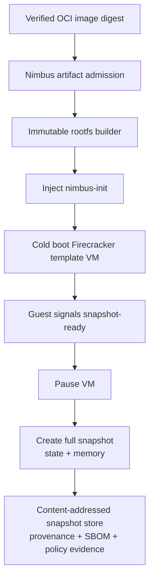
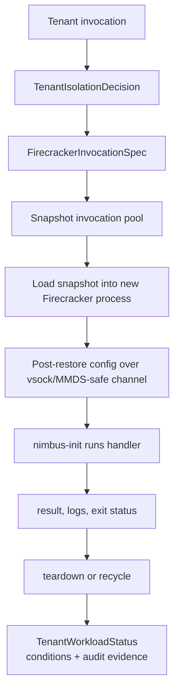
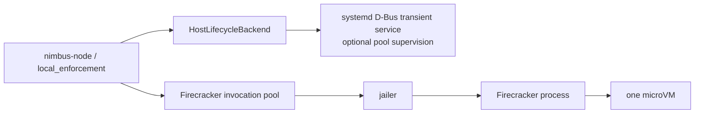

# Plan: Firecracker Snapshot Invocation Backend (ARCHIVED)

> **Closed 2026-05-27 without execution.** Subsumed by the unified
> nimbus-libkrun architecture (decisions D1-D12) in
> `docs/plans/research/vmm-landscape-2026.md`. Snapshot/restore lives in
> `docs/plans/nimbus-sandbox-plan.md` Band S (S0-S5; Linux-KVM only).
> Firecracker stays a reference baseline only — it is no longer a
> Nimbus VMM family.
> See [[project-sandbox-three-tier-roadmap]] in agent memory for the
> updated roadmap.

Plan for a Lambda-like microVM invocation backend that uses Firecracker
snapshot/restore for fast, isolated, full-Linux workloads.

## Status

- **Status:** `archived` (closed 2026-05-27, subsumed by unified libkrun-session architecture)
- **Activation precondition:** finish or explicitly checkpoint
  `docs/plans/tenant-domain-and-node-enforcement-boundary-plan.md` through its
  host lifecycle backend seam.
- **Primary goal:** prove and then implement a tenant-safe Firecracker
  snapshot-backed invocation lane without weakening Nimbus's existing
  single-binary default, krun service-microVM path, or in-process V8/Deno/Node/Bun
  runtime pools.
- **References:** `docs/plans/research/firecracker-container-runtime.md`,
  `docs/architecture/sandbox/microvm-service-baseline.md`,
  `docs/plans/tenant-domain-and-node-enforcement-boundary-plan.md`,
  Firecracker `design.md`, Firecracker `snapshot-support.md`, and Firecracker
  `jailer.md`.

## Decision Summary

This plan covers a different product shape than the dynamic host lifecycle work:

| Shape | Canonical Nimbus path | This plan? |
| --- | --- | --- |
| In-process functions | `nimbus-runtime` V8/Deno/Node/Bun pools | No |
| Long-lived OCI services | `nimbus-sandbox` krun backend via conmon/crun/libkrun, supervised by host lifecycle | No |
| Static node services | native systemd units or Quadlet | No |
| Lambda-like full-Linux invocation | Firecracker snapshot restore, per-invocation config, fast teardown/recycle | Yes |

Do not use `systemd-run` as the Lambda-like fast path. systemd can supervise a
pool manager or low-churn Firecracker worker units through the future
`SystemdTransientBackend`, but fast invocation comes from Firecracker
snapshot/restore, immutable snapshot artifacts, warm pools, and post-restore
configuration. systemd does not make VM boot itself fast.

Use upstream Firecracker as an out-of-process sidecar first. The older research
favored a future custom rust-vmm VMM for eventual single-binary purity, but the
enterprise-ready proof should start with the battle-tested Firecracker binary and
jailer because snapshot semantics, process containment, and operational evidence
matter more than eliminating the external VMM binary in the first product wave.

Custom rust-vmm or in-process VMM work is a residual follow-up, not part of this
plan.

## Why A Separate Plan

The host lifecycle plan answers:

```text
How does Nimbus supervise dynamic long-lived tenant services on a Linux node?
```

This plan answers:

```text
How does Nimbus run one full-Linux tenant invocation quickly inside a fresh,
isolated microVM boundary?
```

Those are related, but not the same. Long-lived services can pay cold-start
costs, keep ports open, and expose service readiness. Lambda-like invocations
need snapshot templates, fast restore, per-invocation identity/config injection,
strict teardown or recycle, and latency/throughput evidence.

## Target Architecture

### Build Template Snapshot



### Invoke From Snapshot



### Relationship To systemd



The default implementation should not create a new `systemd-run` shell command
per invocation. FSI6 must benchmark and choose one of these lifecycle strategies:

| Strategy | Expected use | Gate |
| --- | --- | --- |
| Pool service supervised by systemd D-Bus | production default candidate | prove restart, cgroup, logs, and crash recovery without per-invocation systemd churn |
| Transient unit per Firecracker worker | enterprise isolation fallback | prove latency overhead is acceptable and evidence is better than pool-owned children |
| Direct process pool | tests and non-systemd development | deterministic behavior without PID 1, D-Bus, or root systemd |

## Product Personas

| Persona | Job to be done | Required experience |
| --- | --- | --- |
| Local developer | Run one full-Linux function or agent safely without learning Firecracker | `nimbus firecracker doctor`, actionable missing dependency messages, local fake/direct fallback for tests |
| Startup operator | Run occasional untrusted Linux tasks without Kubernetes | digest-pinned images, simple snapshot build command, clear logs and teardown |
| Enterprise platform team | Offer a tenant-safe serverless microVM lane internally | provenance, quotas, per-tenant isolation, audit evidence, node capability checks, reproducible artifacts, fail-closed policy |

## Scope

This plan owns:

- Firecracker sidecar integration and thin HTTP-over-UDS client.
- Production use of Firecracker `jailer` where available.
- Template snapshot build and restore lifecycle.
- A static `nimbus-init` guest binary that runs as PID 1.
- OCI image to immutable rootfs artifact pipeline for snapshot templates.
- Per-invocation config, identity, grants, and credential projection after
  restore.
- Tenant-scoped storage, network, resource, and evidence contracts.
- Snapshot artifact provenance, compatibility, retention, and invalidation.
- Firecracker operator diagnostics and proof CLI surfaces.

This plan does not own:

- Replacing krun/libkrun as the long-lived OCI service backend.
- Replacing in-process V8/Deno/Node/Bun runtime pools.
- Building a custom rust-vmm VMM.
- Kubernetes integration or Firecracker containerd integration.
- Making Firecracker the default runtime backend.
- macOS nested microVM support.

## Core Invariants

- A snapshot template must be pre-tenant or tenant-scoped by policy. Shared
  templates must contain no tenant secrets, no request data, no provider tokens,
  and no mutable tenant state.
- Snapshot files, rootfs images, kernels, init binaries, and Firecracker binaries
  are admitted artifacts. They must be digest-pinned and verified before use.
- Full snapshots are the baseline. Diff snapshots remain deferred until security,
  compatibility, and restore behavior are proven; Firecracker currently marks
  diff snapshots as developer-preview territory.
- The Firecracker API socket is host-only. Guest and tenant code never receive
  direct access to it.
- Production launches use Firecracker jailer unless the node capability report
  explicitly marks an accepted-risk development mode.
- Per-invocation writable disks, scratch, logs, and vsock sockets are
  tenant/sandbox/invocation-scoped. No cross-tenant writable state is shared.
- Identity and credentials are projected only after restore through an admitted
  decision-derived channel. Raw global provider tokens are never baked into
  snapshots.
- Guest egress is denied by default and must pass Nimbus policy. Firecracker
  itself does not filter guest traffic; Nimbus must own TAP/netns/host firewall
  or proxy enforcement.
- Snapshot restore failure fails closed and records evidence. Nimbus must not
  silently cold-boot as a fallback for a policy requiring snapshot isolation or
  latency.
- High-cardinality identifiers belong in structured events/evidence, not metrics
  labels.

## Public And Internal Surfaces

### Operator CLI

Add proof/operator commands before making this selectable:

```text
nimbus firecracker doctor
nimbus firecracker snapshot build --image <ref@sha256:...> --name <template>
nimbus firecracker snapshot inspect <template>
nimbus firecracker invoke --template <template> -- <handler-args...>
```

The exact command namespace may change during implementation, but the plan needs
equivalent capabilities:

- `doctor`: checks `/dev/kvm`, cgroup v2, Firecracker binary, jailer binary,
  kernel artifact, filesystem reflink support, network prerequisites, and
  required host permissions.
- `snapshot build`: builds an immutable template from verified inputs and records
  provenance/evidence.
- `snapshot inspect`: prints artifact digests, Firecracker version, snapshot
  version, kernel digest, init digest, image digest, rootfs digest, policy
  generation, and compatibility constraints.
- `invoke`: proof path only until admission, identity, egress, and teardown gates
  are complete.

### Rust Ownership

Use Nimbus-owned domain nouns at public boundaries:

```rust
struct FirecrackerInvocationSpec;
struct FirecrackerTemplateSpec;
struct FirecrackerSnapshotArtifact;
struct FirecrackerInvocationStatus;
struct FirecrackerPoolPolicy;
struct FirecrackerNodeCapabilities;
```

Placement by crate/module:

| Area | Owner |
| --- | --- |
| Firecracker sidecar API client, jailer config, snapshot artifact paths | `nimbus-sandbox::backends::firecracker` |
| Invocation pool, tenant binding, host lifecycle strategy, status/evidence | `local_enforcement` / future `nimbus-node` |
| Artifact verification hooks | artifact provenance verifier seam |
| Tenant authority, identity, grants, quotas | `tenant` / future `nimbus-tenant` |
| HTTP/CLI transport | `nimbus-server` / `nimbus-bin` |

Do not put Firecracker process launch or snapshot files in `nimbus-runtime`.
`nimbus-runtime` stays execution-only for in-process engines.

## Execution Plan

| Phase | Status | Goal | Verification |
| --- | --- | --- | --- |
| FSI0 | `todo` | Refresh Firecracker, jailer, snapshot, networking, and rust client research against current upstream docs and local Linux hosts. Update the research doc if any prior assumptions changed. | Research notes cite current Firecracker docs and record node capability output for macOS host, Debian `minicloud`, and any Linux CI target. |
| FSI1 | `todo` | Define the Nimbus contract types: `FirecrackerInvocationSpec`, `FirecrackerTemplateSpec`, `FirecrackerSnapshotArtifact`, `FirecrackerInvocationStatus`, `FirecrackerPoolPolicy`, and `FirecrackerNodeCapabilities`. | Type/unit tests prove tenant ID, workload stable ID, decision ID, artifact digests, snapshot compatibility, resource limits, and egress requirements are required where needed. |
| FSI2 | `todo` | Build a mockable Firecracker HTTP-over-UDS client and sidecar process model. Do not depend on young third-party SDKs unless the audit proves a maintained library is clearly better. | Tests cover request serialization for boot source, drives, network interface, vsock, machine config, pause/resume, snapshot create/load, actions, and error mapping without launching Firecracker. |
| FSI3 | `todo` | Add `nimbus firecracker doctor` and node capability detection. | Linux-gated tests or smoke scripts prove actionable output for missing `/dev/kvm`, missing jailer, cgroup v1/v2 mismatch, missing kernel, missing Firecracker binary, and insufficient permissions. |
| FSI4 | `todo` | Implement the `nimbus-init` guest contract as a static PID 1 proof binary. It mounts required pseudo-filesystems, receives config, starts the handler, reaps children, streams logs/status, and handles shutdown. | Unit tests and a Linux guest smoke prove config parsing, signal handling, child reaping, exit-code propagation, log framing, and no secret logging. |
| FSI5 | `todo` | Build the immutable template pipeline: verified OCI image digest to rootfs artifact, kernel/init injection, cold boot, guest snapshot-ready signal, pause, full snapshot, and artifact manifest. | A proof command builds a tiny template and records image/rootfs/kernel/init/Firecracker/snapshot digests; provenance verification rejects mutable tags, missing digests, and unverified artifacts. |
| FSI6 | `todo` | Decide and implement the host lifecycle strategy for Firecracker pools: systemd-supervised pool service, transient unit per worker, or direct process pool. | Benchmark evidence records p50/p95 cold boot, snapshot restore, and invoke round-trip. The selected strategy proves crash recovery, cgroup limits, log correlation, and acceptable overhead. |
| FSI7 | `todo` | Implement snapshot restore invocation path with per-invocation config after restore, scratch disk or overlay, result collection, timeout, cancellation, and teardown/recycle. | End-to-end Linux smoke invokes a template twice and proves no cross-invocation writable state, stable exit/status mapping, timeout/cancel behavior, and cleanup of sockets, disks, and processes. |
| FSI8 | `todo` | Enforce tenant isolation across storage, network, compute, identity, and credentials. | Two-tenant harness proves snapshots are immutable, writable overlays are tenant/invocation-scoped, network egress follows policy, credentials are post-restore and scoped, and forged tenant identity is rejected. |
| FSI9 | `todo` | Add Firecracker-specific artifact and snapshot provenance policy. | Tests reject snapshot artifacts with mismatched Firecracker version, kernel digest, init digest, image digest, snapshot version, CPU template, architecture, or policy generation. |
| FSI10 | `todo` | Add observability and enterprise evidence: status conditions, audit events, OCSF/OpenTelemetry mapping, logs, metrics, and diagnostics. | Tests prove high-cardinality IDs stay in events/evidence, redaction rules protect secrets, and operator diagnostics explain artifact, capability, lifecycle, and policy failures. |
| FSI11 | `todo` | Add CI and host-gated verification lanes. | Non-Linux CI runs contract/client/fake tests. Linux-capable CI or `minicloud` runs Firecracker-gated smoke behind an explicit capability check. The gate skips with evidence when KVM is unavailable and fails on real regressions when available. |
| FSI12 | `todo` | Document operator usage, security model, residual risk, and selectability posture. | Docs clearly state Firecracker is optional, not default, not a replacement for krun services, and not selectable until all admission/isolation/provenance gates pass. |

## Initial Success Criteria

This plan may close only when:

- `nimbus firecracker doctor` reports capabilities with actionable errors.
- A verified OCI image can build a full template snapshot with recorded artifact
  evidence.
- A Linux host can restore the snapshot and run at least two invocations without
  shared writable state.
- Snapshot artifacts are immutable, content-addressed, and rejected when digest,
  version, policy, architecture, or kernel/init metadata mismatches.
- No tenant secret or request data is present in shared snapshots.
- Per-invocation identity, credentials, egress, storage, CPU, memory, timeout,
  cancellation, logs, and result collection are enforced through admitted
  decision-derived state.
- The plan records p50/p95 cold boot, snapshot restore, and end-to-end invocation
  latency on a real Linux host.
- The backend remains opt-in and not default until product selectability is
  separately approved.
- `cargo fmt --all --check`, focused Rust tests, Firecracker fake-client tests,
  Linux-gated smoke, docs reference validation, and `git diff --check` pass.

## Residual Follow-Ups

Do not hide these inside this plan:

- Custom rust-vmm / `nimbus-vmm` replacement for upstream Firecracker.
- Diff snapshot support.
- Multi-node snapshot distribution over Iroh blobs.
- GPU or device passthrough.
- Kubernetes/firecracker-containerd integration.
- macOS nested per-invocation microVMs.
- Product selectability and pricing/packaging policy.

## Suggested Goal Prompt

```text
/goal Complete docs/plans/firecracker-snapshot-invocation-backend-plan.md after the tenant-domain/node-enforcement host lifecycle seam is checkpointed. Build a proposed-to-proven Firecracker snapshot invocation backend that is optional, Linux-gated, tenant-safe, and not a replacement for krun long-lived service microVMs or in-process V8/Deno/Node/Bun runtime pools. Start with upstream Firecracker sidecar plus jailer, a mockable HTTP-over-UDS client, node capability detection, nimbus firecracker doctor, a static nimbus-init PID 1 guest proof, verified OCI-to-rootfs template snapshot creation, snapshot restore invocation, per-invocation identity/config/credential projection, storage/network/compute isolation, provenance checks, audit/evidence, diagnostics, and CI/minicloud verification. Do not use systemd-run as the Lambda-like fast path; systemd D-Bus may supervise a pool service or worker units only after FSI6 records benchmark and recovery evidence. Verifiable success criteria: Firecracker fake-client tests pass, Linux capability checks are actionable, a verified OCI image builds a full template snapshot, two invocations restore and run without shared writable state, forged identity and unsafe egress are rejected, snapshot artifact mismatches are rejected, latency evidence is recorded, docs state opt-in/not-default posture, and cargo fmt --all --check plus focused tests plus git diff --check pass.
```
