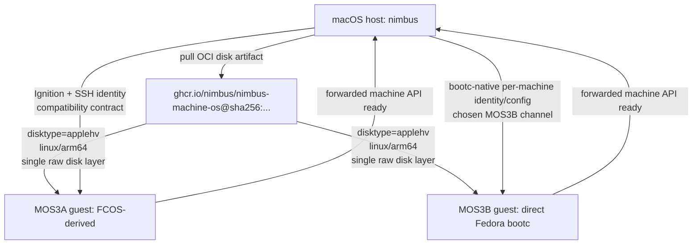

# Plan: Machine OS Adoption

> **Archived warning:** this plan is not active. It is retained only as
> historical evidence for MOS0-MOS2, the current pinned Podman-machine-os
> macOS default, and the abandoned MOS3A/FCOS-derived investigation. Current
> machine OS execution is owned by
> `docs/plans/bootc-machine-default-plan.md`.

Historical evidence plan for MOS0-MOS2 and the abandoned MOS3A
FCOS-derived candidate. Current machine OS execution has pivoted to
`docs/plans/bootc-machine-default-plan.md`.

Do not resume MOS3A from this plan. Use it only for evidence about the
stabilized Podman fallback, refreshed crun/Fedora baselines, OCI artifact
contract fixes, and the failed FCOS-derived build investigation.

---

## Status

- **Status:** `superseded`
- **Primary owner:** `docs/plans/bootc-machine-default-plan.md`
- **Parent plan:** `docs/plans/distribution-plan.md` (Channel 4)
- **Research baseline:** `docs/plans/research/bootc-adoption-evaluation.md`
  and `docs/plans/research/bootc-machine-architecture-for-nimbus.md`
- **Architecture baseline:** `docs/architecture/sandbox/macos-machine-flow.md`
- **Current date of baseline refresh:** 2026-05-13

## Control Plan Rules

This plan is no longer the active source of truth for machine OS execution.
Use `docs/plans/bootc-machine-default-plan.md` for current work. The list
below is retained only to explain the evidence sources used while MOS0-MOS2
and the MOS3A investigation were active.

Source of truth:

1. this plan's `Phase Status Ledger` and `Execution Log`
2. `docs/architecture/sandbox/macos-machine-flow.md`
3. `docs/plans/research/bootc-adoption-evaluation.md`
4. `docs/plans/research/bootc-machine-architecture-for-nimbus.md`
5. the satellite repositories:
   - `/Users/jack/src/github.com/nimbus/nimbus-machine-os`
   - `/Users/jack/src/github.com/nimbus/nimbus-crun`
   - `/Users/jack/src/github.com/containers/podman`
   - `/Users/jack/src/github.com/containers/podman-machine-os`
   - `/Users/jack/src/github.com/containers/crun`

Do not flip the macOS default away from the pinned Podman machine image from
this evidence plan. The active bootc-native replacement and promotion gates now
live in `docs/plans/bootc-machine-default-plan.md`.

---

## Version Policy

This work has two version tracks.

### Stabilization Track

Use a current, retrievable Podman machine image digest to keep the shipped
macOS path working while Nimbus-owned image adoption is under active work.

As of 2026-05-13, the checked-in Nimbus Podman digest is no longer retrievable
from Quay:

```text
docker://quay.io/podman/machine-os@sha256:972a9fb73e96c903320b3bef32cd212eb0c386f9b6a19737878a063d4703c6ff
```

The stabilization candidate is the latest stable Podman machine-os stream
aligned with the latest stable Podman release family:

```text
docker://quay.io/podman/machine-os@sha256:57e19d2a4e3ae698a0f127ec7495067ac4c4df5177625034e1e700aba94ee8c5
```

This digest was observed from `quay.io/podman/machine-os:5.8` on 2026-05-13.
Use it only as the shipped Podman fallback until the Nimbus-owned image passes
the gates below.

### Final Implementation Track

The final `nimbus-machine-os` implementation should target latest stable
supported releases, not `next`, `latest`, or local main-branch development
defaults.

Final default: Nimbus-owned bootc-delivered machine OS. First safe candidate:
FCOS-derived, Podman-compatible, bootc-enabled. Bleeding-edge candidate: direct
Fedora bootc base, built and tested now, promotable only after full Nimbus
machine parity proof.

Current final targets, refreshed 2026-05-13:

| Component | Final supported baseline | Notes |
|-----------|--------------------------|-------|
| Podman contract reference | Podman `v5.8.2` | Latest stable Podman release observed during this refresh. Treat Podman `6.0.0-dev`, `machine-os:6.0`, and `machine-os:next` as future/dev until a stable Podman 6 release exists and Nimbus deliberately promotes it. |
| Podman machine OS stream | `quay.io/podman/machine-os:5.8` by immutable digest | Current stabilization digest above is also the final comparison baseline for first adoption. |
| `nimbus-crun` upstream | crun `1.27.1` on Fedora `44` builder userspace | MOS1 rebased the Nimbus port-map patch from crun `1.27` to `1.27.1` and verified it with Fedora 44 `libkrun-devel`; next release work should tag that Nimbus patch baseline. |
| `nimbus-machine-os` final default | Nimbus-owned bootc-delivered machine OS | The default must be Nimbus-owned, delivered as OCI/bootc infrastructure, and promoted only by immutable digest after macOS parity evidence. |
| `nimbus-machine-os` first safe candidate | FCOS-derived Podman-compatible bootc-enabled image | Preserve Podman/FCOS/Ignition/libkrun semantics first, mirroring `containers/podman-machine-os` closely enough for enterprise-trustworthy promotion. |
| `nimbus-machine-os` bleeding-edge candidate | direct `quay.io/fedora/fedora-bootc:44` proof image, pinned by digest | Start this proof during MOS3B against the latest released Fedora bootc image observed in this plan refresh. Fedora 45/Rawhide tags, if present, are canary-only until Fedora 45 is released and deliberately promoted. The direct Fedora bootc lane can become the final default only if it passes MOS4-equivalent parity; failure records concrete evidence but does not block FCOS-derived promotion. |
| `nimbus-machine-os` builder inputs | pinned image references | Replace mutable `bootc-image-builder:latest` and unqualified base tags with digest-pinned inputs once the target base is selected. |

Re-run this version table before implementation if more than two weeks have
passed or if Podman/crun publishes a new stable release.

---

## Current Findings

### Upstream Direction

The community direction is clear enough for Nimbus to follow it deliberately,
while still keeping proof gates for enterprise trust.

What is confirmed as of 2026-05-13:

- bootc describes its core model as transactional, in-place OS updates using
  OCI/Docker container images; the bootc CLI/API are considered stable.
- Red Hat image mode for RHEL is the enterprise downstream of the upstream
  Fedora bootc work. Red Hat documents image mode in RHEL 9.6+ and RHEL 10 as
  a container-native operating-system lifecycle using bootc images, with
  support across bare metal, VMs, cloud, and edge.
- Red Hat's image-mode guidance explicitly tells users to build operating
  systems from `Containerfile` definitions, version/mirror/sign derived images
  with standard container tooling, and manage OS updates as immutable image
  deployments with rollback.
- Fedora CoreOS is moving in the same direction in stages:
  - Fedora 42 moved FCOS update delivery from the OSTree repository to OCI
    images on Quay.
  - Fedora 43 plans stop publishing FCOS updates to the canonical OSTree repo
    and rely on OCI images.
  - Fedora 43 also plans to build FCOS from a `Containerfile` using
    `podman build`, with FCOS building `FROM` the Fedora bootc image.
- Podman machine already exposes this model to users:
  - `podman machine os apply` rebases a machine from an OCI image using
    `bootc switch`.
  - `podman machine os upgrade` performs digest-aware in-band upgrades and
    major/minor stream upgrades.
  - Podman's default VM distribution remains a customized Fedora CoreOS image,
    except for WSL.

Implication for Nimbus:

- bootc/OCI OS delivery is not a side experiment; it is the Fedora, Podman, and
  Red Hat direction.
- the first enterprise-trustworthy Nimbus path should track Podman's
  FCOS-derived machine image contract, because that is where the macOS/VM
  bootstrap semantics are already proven.
- direct `fedora-bootc` should become a first-class proof lane now, because
  bootc tooling is stable enough for Nimbus to get ahead. The trusted proof
  baseline is the latest released Fedora bootc image, currently
  `quay.io/fedora/fedora-bootc:44` pinned by digest. Fedora 45/Rawhide tags,
  if present, are canary-only until Fedora 45 is released and deliberately
  promoted. The lane must not be promoted merely because the image builds; it
  must prove a bootc-native Nimbus machine contract instead of impersonating
  the FCOS/Ignition contract.

### Local `containers/*` Implementation Map

The local upstream checkouts under `/Users/jack/src/github.com/containers`
match the public direction:

| Repo | Current local observation | Nimbus consequence |
|------|---------------------------|--------------------|
| `containers/podman` | `pkg/machine/os/ostree.go` implements `Apply()` as `sudo bootc switch` and `Upgrade()` as digest-aware `bootc upgrade` / `bootc switch`. | Nimbus final lifecycle should converge on in-guest bootc apply/upgrade once the owned image is proven. |
| `containers/podman` | `docs/source/markdown/podman-machine-init.1.md.in` says Podman's default VM is a custom Fedora CoreOS-based image, and `docs/source/markdown/podman-machine-os-apply.1.md` says OS changes are applied with `bootc switch`. | Do not claim Podman has switched its default to direct Fedora bootc; use Podman as proof that FCOS-derived defaults and bootc lifecycle coexist. |
| `containers/podman` | `pkg/machine/define/vmtype.go` maps both `AppleHvVirt` and `LibKrun` to OCI `disktype=applehv`, with raw disk format as an implementation detail. | Nimbus must reject `disktype=raw` for macOS release artifacts; `applehv` is the provider contract. |
| `containers/podman` | `pkg/machine/ocipull/source.go` selects a disk artifact by OS, architecture, `disktype`, single-layer shape, and original title annotation. | Nimbus should keep the same registry-as-VM-image-store contract and avoid custom image services. |
| `containers/podman-machine-os` | `util.sh` derives release tags from the Podman major/minor version and uses FCOS stable by default, while main-branch CI can use FCOS next. | Nimbus should distinguish stable release baselines from dev/next validation lanes. |
| `containers/podman-machine-os` | `build.sh` builds `Containerfile.COREOS`, runs `rpm-ostree compose build-chunked-oci --bootc --from "${FULL_IMAGE_NAME_ARCH}"`, then converts with `--osname fedora-coreos` and platform disk artifacts. | Nimbus-owned image should adapt this FCOS-derived shape as MOS3A while running a separate direct Fedora bootc MOS3B proof. |
| `containers/podman-machine-os` | `gather.sh` publishes platform disk artifacts with `disktype` equal to the platform name, not the file extension. | `nimbus-machine-os` packaging must emit `disktype=applehv` for macOS Krunkit. |
| `containers/podman-machine-os` | `podman-image/Containerfile.COREOS` keeps FCOS-specific systemd, networking, SSH, and provider behavior. | MOS3A should preserve FCOS/Ignition semantics; MOS3B should replace them with an explicit bootc-native Nimbus provisioning channel. |
| `containers/crun` / `nimbus-crun` | Nimbus patch remains a narrow libkrun TSI port-map extension; latest stable crun observed is `1.27.1`, and MOS1 verified the patch against local upstream crun `1.27.1` at `3ec076b3`. | Keep the patch isolated on the crun `1.27.1` / Fedora 44 baseline and drop `nimbus-crun` once upstream crun carries the needed libkrun port mapping. |

### Nimbus Host Contract

Nimbus already carries two image defaults:

- macOS `Krunkit`: pinned `quay.io/podman/machine-os@sha256:...`
- other providers: `ghcr.io/nimbus/nimbus-machine-os:v{CARGO_PKG_VERSION}`

The current macOS host manager selects OCI disk artifacts by:

- platform OS `linux`
- current host-compatible architecture
- manifest annotation `disktype=applehv`
- exactly one disk layer
- disk title suffix such as `.raw`, `.raw.gz`, or `.raw.zst`

The bootstrap path remains FCOS-shaped:

- Ignition 3.2.0
- default SSH user `core`
- host-managed guest binary sync to `/usr/local/bin/nimbus`
- writable/executable `/usr/local` behavior expected from FCOS
- forwarded machine API readiness before `machine start` succeeds

### Satellite Repo Gaps

`nimbus-machine-os` is not yet a safe default image:

- MOS2 fixed `scripts/package-oci.sh` so macOS release artifacts default to
  `disktype=applehv` and local verifiers reject `disktype=raw`.
- the README claims `cloud-init`, but the build recipe does not install it.
- the pre-MOS3 image recipe was based on `quay.io/fedora/fedora-bootc:42`;
  dirty MOS3A work now moves the default candidate to FCOS-derived semantics,
  while MOS3B keeps direct Fedora bootc as an explicit proof lane.
- the pre-MOS3 README claimed `cloud-init`; dirty MOS3A documentation removed
  that claim and records the Podman-compatible FCOS-derived contract instead.
- the pre-MOS3 `NIMBUS_BIB_IMAGE` default was mutable
  `quay.io/centos-bootc/bootc-image-builder:latest`; dirty MOS3A/MOS3B work
  pins builder inputs by digest.
- a real MOS3A proof on the rootful local Podman machine now builds the
  FCOS-derived bootc OCI image successfully, including Fedora 44 updates to
  Podman `5.8.2` and crun `1.27.1`, but raw AppleHV artifact conversion is
  blocked in `bootc-image-builder` / osbuild with
  `bwrap: execvp /run/osbuild/runner/org.osbuild.linux: No such file or
  directory`. This blocks MOS3A completion until the builder/conversion path
  is fixed or replaced with the Podman-machine-os conversion flow.
- the current `nimbus-machine-os` GitHub Actions build job runs on
  `ubuntu-24.04-arm` and uses a containerized `bootc-image-builder` path. That
  is not equivalent to Podman's upstream machine-os build environment:
  `containers/podman-machine-os` uses Cirrus EC2 Fedora images, disables
  SELinux enforcement for the build, installs host `osbuild` tooling, and runs
  `custom-coreos-disk-images.sh`. If MOS3A adopts the upstream conversion path,
  the GitHub-hosted Ubuntu runner is expected to be the wrong build substrate
  unless replaced with a Fedora VM/self-hosted runner/Cirrus-style lane.
- do not continue implementing MOS3A as a GitHub-hosted Ubuntu Actions +
  containerized BIB build until the builder strategy is deliberately chosen.
  The next MOS3A decision is not a recipe tweak; it is whether Nimbus is
  willing to own a Fedora/CoreOS-specific release builder or whether this
  adoption path should pause in favor of a different machine OS strategy.
- anonymous GHCR pull for `ghcr.io/nimbus/nimbus-machine-os` was denied during
  the 2026-05-13 refresh; package visibility or authentication policy must be
  settled before making it a default image.

`nimbus-crun` is refreshed for the current adoption baseline:

- the Nimbus patch is a single libkrun TSI port-mapping patch.
- `nimbus-crun` has been refreshed from crun `1.27` to crun `1.27.1`.
- the local upstream `/Users/jack/src/github.com/containers/crun` checkout is
  on crun `1.27.1` at `3ec076b3`.
- Fedora 44 is the stable builder userspace target for the `nimbus-crun`
  validation lane; Fedora 45/rawhide can be canary-only.
- MOS1 patch apply and Fedora 44 userspace build verification passed; keep the
  command details in the Execution Log rather than duplicating them here.

---

## Target Architecture

Nimbus will carry two explicit candidates through the build/proof stages.

### A. Default Candidate: FCOS-Derived

The first safe supported Nimbus-owned macOS image should be a
Podman-compatible, FCOS-derived, bootc-enabled machine image published by
`nimbus/nimbus-machine-os` with the same artifact shape Nimbus already
consumes from Podman. This candidate mirrors
`containers/podman-machine-os` semantics: FCOS base, Ignition, `core` SSH user,
libkrun/Krunkit behavior, Podman-compatible container plumbing, and bootc OS
lifecycle.

### B. Bleeding-Edge Candidate: Direct Fedora Bootc

Build and test a direct `quay.io/fedora/fedora-bootc:44` image, pinned by
digest, during MOS3B. This candidate is allowed to get Nimbus ahead of Podman,
but only after it proves a bootc-native macOS machine contract. Fedora
45/Rawhide direct bootc images may be exercised as canaries if tags are
available, but they must be recorded separately and cannot become the trusted
baseline until Fedora 45 is released and deliberately promoted. Ignition is not
a requirement or preferred path for this lane. MOS3B must select and prove an
Ignition-free provisioning mechanism unless a deliberate exception is recorded
with rationale. Acceptable bootc-native mechanisms include bootc-image-builder
config, baked systemd units, sysusers.d/tmpfiles.d, systemd credentials,
kernel args, config drive, virtiofs metadata, or a Nimbus guest-agent channel.
The proof must cover SSH/user identity, `/usr/local/bin/nimbus`, SELinux
behavior, virtiofs, service lifecycle, forwarded machine API readiness, and
rollback.

Both candidates must emit Podman-compatible disk artifacts:

- platform OS `linux`
- host-compatible architecture
- exactly one bootable disk layer
- manifest annotation `disktype=applehv`
- immutable source/version/provenance metadata



Do not flip the default to direct `fedora-bootc` until parity evidence exists.
Failure of the direct Fedora bootc lane does not block promotion of the
FCOS-derived default candidate; it must be recorded with the concrete failure
mode and revisited deliberately.

---

## Enterprise Trust And Removal Policy

Nimbus can be early on bootc while still supporting enterprises if every
promotion is tied to observable upstream contracts, immutable artifacts, and
rollback-tested releases.

Required enterprise controls:

- immutable image references for shipped defaults
- digest and provenance recorded in release notes
- public or explicitly authenticated registry access policy
- SBOM/signing path before broad customer distribution
- documented update/rollback behavior
- real-host macOS proof for every default-image promotion
- no hidden compatibility modes that select different machine semantics without
  an explicit operator command

Removal policy after proof:

- After MOS5, remove the macOS default dependency on
  `quay.io/podman/machine-os`; keep Podman only as an upstream comparison and
  documented manual diagnostic override.
- After MOS5, remove host tests and docs that treat Podman's repository as the
  default macOS contract. Replace them with tests for the generic
  Podman-compatible artifact contract and the Nimbus-owned repository.
- After MOS6, if Nimbus adopts in-guest `bootc switch` / `bootc upgrade`, remove
  host-side disk replacement as the normal `machine os apply/upgrade` path.
  Keep full disk replacement only for explicit machine repair/recreate flows.
- Once upstream crun carries the required libkrun port-map API, drop
  `nimbus-crun` packaging instead of carrying a compatibility fork.
- Do not add feature flags for old Podman image behavior. If a customer needs
  to pin a previous image, use the existing explicit `machine os apply
  <oci-ref-or-digest>` operator path.

---

## Completion Evidence Matrix

Each phase is complete only when the evidence below exists in this plan's
Execution Log or in linked proof artifacts.

| Phase | Required evidence |
|-------|-------------------|
| MOS0 | Quay manifest query for the pinned Podman digest, host default updated, docs updated, focused `nimbus-bin` machine tests passing, `cargo fmt --all --check` passing. |
| MOS1 | Recorded upstream release versions for Podman, podman-machine-os, crun, Fedora builder userspace, and `nimbus-crun`; `nimbus-crun` patch dry-run/build evidence against the selected crun release and Fedora builder image; explicit decision to stay on or advance from the version table. |
| MOS2 | `nimbus-machine-os` verifier rejects `disktype=raw` for macOS release artifacts and accepts `disktype=applehv`; OCI metadata includes source URL, source revision, Nimbus version, and attestation repository; host image selector test proves the Nimbus artifact is selected without special casing. |
| MOS3A | FCOS-derived image build log, pinned FCOS base digest, pinned builder/conversion inputs, package inventory, and proof that the image preserves Ignition, `core`, SSH, `/usr/local`, SELinux, virtiofs, and libkrun expectations. |
| MOS3B | Direct Fedora bootc proof image build log, `quay.io/fedora/fedora-bootc:44` base digest, bootc-image-builder/rootfs choice, AppleHV/raw artifact with `disktype=applehv`, explicit bootc-native provisioning mechanism selection, proof that no Ignition dependency is required for the happy path unless a deliberate exception is documented, SSH/user contract, SELinux, virtiofs, `/usr/local/bin/nimbus`, machine API, service lifecycle, bootc switch/upgrade/rollback, and concrete failure mode if the proof fails. Fedora 45/Rawhide, if tested, is recorded as a separate canary lane and cannot satisfy the stable proof baseline until Fedora 45 is released and deliberately promoted. Failure does not block the FCOS-derived default candidate unless it exposes a shared Nimbus host bug. |
| MOS4 | Real-host macOS proof artifacts for whichever candidate is being promoted, showing init, boot, candidate-appropriate provisioning consumption, SSH/user contract, guest binary/service contract, socket/service convergence, virtiofs, forwarded machine API, service lifecycle, rollback, and recreate. |
| MOS5 | GHCR visibility/auth decision, immutable image digest, provenance/attestation evidence, docs/tests updated to make the strongest proven Nimbus-owned candidate the default, and rollback instructions using explicit `machine os apply`. Direct Fedora bootc wins only if it passes parity. |
| MOS6 | In-guest `bootc switch` and `bootc upgrade` proof, reboot/retry/rollback proof, normal host-side disk replacement removed from `machine os apply/upgrade`, and repair/recreate path retained separately. |

---

## Phase Status Ledger

| Phase | Status | Dependencies | Completion gate |
|-------|--------|--------------|-----------------|
| MOS0: Stabilize current Podman fallback | `done` | none | Nimbus default Podman digest points at a live immutable `machine-os:5.8` digest and docs/tests agree. |
| MOS1: Refresh upstream baselines | `done` | MOS0 | Podman, podman-machine-os, crun, and nimbus-crun baselines are updated or explicitly pinned; final supported versions in this plan are revalidated. |
| MOS2: Fix Nimbus-owned OCI contract | `done` | MOS1 | `nimbus-machine-os` emits Podman-compatible OCI artifacts with `disktype=applehv`, correct platform metadata, one disk layer, source/version annotations, and local verifier coverage. |
| MOS3A: Build FCOS-derived Nimbus image | `blocked-decision` | MOS2 | Image recipe preserves FCOS/Ignition/libkrun semantics, mirrors Podman-compatible machine-os behavior, emits `disktype=applehv`, and pins builder/base inputs by digest. Blocked until Nimbus chooses a release builder strategy that can produce AppleHV artifacts reliably. |
| MOS3B: Build direct Fedora bootc proof image | `in_progress` | MOS2 | Direct `quay.io/fedora/fedora-bootc:44` proof image builds by immutable digest, emits `disktype=applehv`, chooses an Ignition-free bootc-native provisioning channel, and records whether it satisfies or fails each Nimbus machine parity prerequisite. Fedora 45/Rawhide is canary-only until released and deliberately promoted. |
| MOS4: Prove macOS guest parity | `pending` | MOS3A or MOS3B | Real-host proof for the promotion candidate shows boot, provisioning, SSH/user contract, guest binary sync, systemd socket activation, virtiofs, forwarded machine API readiness, service lifecycle behavior, rollback, and recreate. |
| MOS5: Publish and promote | `pending` | MOS4 | GHCR visibility/auth policy, attestations, immutable digest capture, release notes, docs, and default-image flip are complete for the strongest proven candidate; direct Fedora bootc wins only if it passes parity. |
| MOS6: Adopt in-guest bootc lifecycle | `pending` | MOS5 | Nimbus uses Podman-style `bootc switch` / `bootc upgrade` for normal `machine os apply/upgrade`, with host-side disk replacement retained only for explicit repair/recreate flows. |

---

## Execution Detail

### MOS0: Stabilize Current Podman Fallback

Tasks:

- replace the stale Podman digest in host defaults and docs with a live
  immutable digest from `quay.io/podman/machine-os:5.8`
- verify the replacement manifest includes a `linux/arm64` artifact with
  `disktype=applehv`
- keep the fallback pinned by digest, not by floating tag
- run focused machine image selection tests and the macOS machine proof helper
  when on a suitable Apple Silicon host

Acceptance evidence:

- `cargo test -p nimbus-bin machine`
- `cargo fmt --all --check`
- macOS proof collector output if host dependencies are available

### MOS1: Refresh Upstream Baselines

Tasks:

- update `/Users/jack/src/github.com/containers/crun` to latest stable crun
  release source before testing `nimbus-crun`
- dry-run and build the Nimbus port-map patch against crun `1.27.1`
- use Fedora 44 as the stable `nimbus-crun` builder/verification userspace
  when Fedora 44 packages carry the selected `crun`, `libkrun-devel`, and
  `libkrunfw` baselines
- confirm Podman `v5.8.2` remains the latest stable release at implementation
  time
- confirm whether Podman machine-os `5.8` remains the latest stable supported
  machine image stream
- record any changed target versions in this plan before implementation

### MOS2: Fix Nimbus-Owned OCI Contract

Tasks:

- update `nimbus-machine-os` packaging to emit `disktype=applehv` for the
  macOS Krunkit artifact
- keep raw disk file extensions as file format details, not provider metadata
- update the OCI layout verifier to reject `disktype=raw` for macOS release
  artifacts
- ensure annotations include source repo, source revision, Nimbus version, and
  attestation repository
- verify the host manager selects the Nimbus artifact without special casing

### MOS3A: Build FCOS-Derived Nimbus Image

Tasks:

- stop further GitHub-hosted Ubuntu Actions + containerized BIB implementation
  work until the builder decision below is made
- adapt the Podman machine-os FCOS-derived approach instead of treating pure
  `fedora-bootc` as the first default
- preserve Ignition, default `core` user, SSH, `/usr/local` execution behavior,
  SELinux labeling, virtiofs behavior, and libkrun expectations
- install only the guest-side tools Nimbus needs, plus Podman-compatible
  container plumbing required by the service lifecycle
- remove README/build drift such as the stale `cloud-init` claim
- pin base image and bootc-image-builder inputs by digest

Builder decision required before MOS3A resumes:

- **Option A: Fedora/CoreOS-specific release builder.** Adopt a
  Podman-machine-os-like builder on Fedora infrastructure, with root host
  `osbuild` tooling and SELinux permissive mode, then generate AppleHV
  artifacts through `custom-coreos-disk-images.sh`. This follows upstream most
  closely but means Nimbus must own non-standard release infrastructure.
- **Option B: Keep GitHub-hosted Actions and fix BIB.** Continue with
  containerized `bootc-image-builder` only if the raw AppleHV failure can be
  reproduced and fixed on GitHub-hosted `ubuntu-24.04-arm`. This keeps release
  infra simple but is not proven and may diverge from Podman's supported build
  lane.
- **Option C: Pause MOS3A default promotion.** Keep MOS0's Podman fallback as
  the enterprise-safe default while continuing research/proofs, and avoid
  committing Nimbus to an owned FCOS-derived image until the builder story is
  operationally acceptable.

### MOS3B: Build Direct Fedora Bootc Proof Image

Tasks:

- build a direct `quay.io/fedora/fedora-bootc:44` proof image by immutable
  digest during MOS3, not after promotion
- optionally run Fedora 45/Rawhide direct bootc tags as canaries if present,
  recording them separately from the stable Fedora 44 proof baseline
- pin the Fedora bootc base digest and bootc-image-builder input digest
- record the bootc-image-builder output type and rootfs choice explicitly
- emit the same Podman-compatible macOS artifact shape as MOS3A:
  `linux/arm64`, one raw/raw-compressed disk layer, `disktype=applehv`, source
  revision, Nimbus version, and attestation repository
- choose and document an Ignition-free bootc-native provisioning mechanism.
  Candidate mechanisms include bootc-image-builder config, baked systemd units,
  sysusers.d/tmpfiles.d, systemd credentials, kernel args, config drive,
  virtiofs metadata, or a Nimbus guest-agent channel.
- prove that the direct Fedora bootc happy path does not depend on Ignition
  unless a deliberate exception is documented with rationale.
- prove or falsify every bootc-native machine assumption: SSH/user contract,
  SELinux labels, virtiofs, `/usr/local/bin/nimbus`, Nimbus service contract,
  machine API readiness, service lifecycle, and bootc switch/upgrade/rollback
- if the direct Fedora bootc proof fails, record the concrete failure mode and
  continue the FCOS-derived default path unless the failure reveals a shared
  Nimbus host bug

### MOS4: Prove macOS Guest Parity

Required proof:

- machine initializes from the selected
  `ghcr.io/nimbus/nimbus-machine-os@sha256:...` candidate
- guest boots and consumes the candidate-appropriate provisioning mechanism:
  Ignition for MOS3A, or the selected bootc-native channel for MOS3B
- SSH works with the candidate's documented user contract
- `/usr/local/bin/nimbus` can be synced and executed for MOS3A, or is baked
  into the image and updated by bootc for MOS3B
- `nimbus.socket` and `nimbus.service` converge
- `/Users` virtiofs mount works
- forwarded machine API reports reachable
- service start/stop/status behavior matches the Podman fallback image
- `bootc switch` / `bootc upgrade` rollback semantics are observable for the
  candidate or explicitly deferred to MOS6 with a recorded reason
- recreate from scratch produces the same result

### MOS5: Publish and Promote

Tasks:

- make GHCR package access match the install/release policy
- publish immutable digest and provenance with each release
- update `crates/nimbus-bin/src/machine/mod.rs` defaults only after MOS4 proof
- update `docs/architecture/sandbox/macos-machine-flow.md`
- update distribution docs and release notes
- promote the strongest proven candidate; the FCOS-derived candidate remains
  the safe default path unless direct Fedora bootc passes the full parity gate
- keep the Podman digest fallback documented as an emergency rollback path

### MOS6: Adopt In-Guest bootc Lifecycle

The first image-default flip can land before this lifecycle change if MOS4/MOS5
need to be separated, but the final plan direction is to converge on Podman's
in-guest OS lifecycle. That means normal machine OS changes should use:

- `bootc switch` for apply/rebase
- `bootc upgrade` for same-stream upgrades
- explicit reboot/retry semantics
- failure recovery back to the previous deployment

Completion requires removing host-side disk replacement from the normal
`machine os apply/upgrade` path. Keep host-side disk replacement only for
explicit repair/recreate flows where replacing the materialized VM disk is the
user-requested operation.

---

## Verification Commands

Prefer focused checks while editing, then run the broader distribution checks
before promotion:

```sh
cargo test -p nimbus-bin machine
cargo fmt --all --check
make clippy
bash scripts/collect-nimbus-machine-cli-proof.sh
bash scripts/collect-nimbus-machine-guest-proof.sh
bash scripts/collect-nimbus-homebrew-cask-proof.sh
```

Satellite repo checks:

```sh
bash /Users/jack/src/github.com/nimbus/nimbus-machine-os/scripts/verify-oci-layout-helper.sh
bash /Users/jack/src/github.com/nimbus/nimbus-crun/scripts/build.sh --help
```

Use the satellite repos' own README/workflow commands as the source of truth
when the helper interfaces change.

---

## External References

- [Podman `v5.8.2` release](https://github.com/containers/podman/releases/tag/v5.8.2)
- [crun `1.27.1` release](https://github.com/containers/crun/releases/tag/1.27.1)
- [Podman machine os apply](https://docs.podman.io/en/latest/markdown/podman-machine-os-apply.1.html)
- [Podman machine os upgrade](https://docs.podman.io/en/latest/markdown/podman-machine-os-upgrade.1.html)
- [Podman machine init](https://docs.podman.io/en/latest/markdown/podman-machine-init.1.html)
- [bootc project overview](https://bootc.dev/)
- [bootc-image-builder documentation](https://osbuild.org/docs/bootc/)
- [podman-bootc CLI documentation](https://fedora.gitlab.io/bootc/docs/bootc/podman-bootc-cli/)
- [Red Hat image mode for RHEL](https://developers.redhat.com/products/rhel/image-mode)
- [RHEL 10 image mode documentation](https://docs.redhat.com/en/documentation/red_hat_enterprise_linux/10/html-single/using_image_mode_for_rhel_to_build_deploy_and_manage_operating_systems/using_image_mode_for_rhel_to_build_deploy_and_manage_operating_systems)
- [Fedora CoreOS updates from OSTree to OCI](https://fedoraproject.org/wiki/Changes/CoreOSOstree2OCIUpdates)
- [Fedora CoreOS stop publishing OSTree updates](https://fedoraproject.org/wiki/Changes/CoreOSStopPublishingOSTree)
- [Fedora CoreOS build using Containerfile](https://fedoraproject.org/wiki/Changes/BuildFCOSUsingContainerfile)
- [bootc upgrades](https://bootc.dev/bootc/upgrades.html)
- [bootc filesystem guidance](https://bootc.dev/bootc/filesystem.html)

---

## Execution Log

| Date | Phase | Status | Summary | Evidence | Next |
|------|-------|--------|---------|----------|------|
| 2026-05-13 | MOS0-MOS6 | `created` | Created active plan after refreshing Nimbus docs/code, `nimbus-machine-os`, `nimbus-crun`, local Podman repos, Quay registry state, and upstream Podman/crun release references. Initial key decisions: first Nimbus-owned default should be FCOS-derived and Podman-compatible; final baseline targets latest stable supported versions; current Podman fallback digest needs stabilization first. Later side research split MOS3 into FCOS-derived and direct Fedora bootc proof lanes. | Local repo review plus Quay manifest probes for `quay.io/podman/machine-os`; upstream release references for Podman `v5.8.2` and crun `1.27.1`. | Start MOS0 by replacing the stale Podman digest with a live immutable `machine-os:5.8` digest, then run focused machine image selection tests. |
| 2026-05-13 | MOS1-MOS6 | `documented` | Deepened the plan with upstream direction and code-removal policy. Confirmed bootc/OCI OS delivery is the Fedora, Podman, and Red Hat direction; Podman machine already uses bootc for apply/upgrade while preserving a customized FCOS VM contract; Nimbus should follow that FCOS-derived contract first, then remove Podman-default and host-side disk-replacement code paths after proof gates instead of carrying legacy compatibility shims. | External docs: Podman machine OS apply/upgrade/init, Red Hat image mode for RHEL, RHEL 10 image-mode docs, Fedora CoreOS OCI/update/build change pages, bootc project docs. Local source: `/Users/jack/src/github.com/containers/podman/pkg/machine/os/ostree.go`, `pkg/machine/define/vmtype.go`, `pkg/machine/ocipull/source.go`, `/Users/jack/src/github.com/containers/podman-machine-os/{util.sh,build.sh,gather.sh,podman-image/Containerfile.COREOS,podman-image/build_common.sh}`. | Implement MOS0, then MOS1 refreshes and MOS2 packaging-contract fixes. |
| 2026-05-13 | MOS0 | `done` | Stabilized the shipped macOS Podman fallback by replacing the stale `sha256:972a9f...` default with the live `quay.io/podman/machine-os:5.8` index digest `sha256:57e19d2a4e3ae698a0f127ec7495067ac4c4df5177625034e1e700aba94ee8c5`. Updated the current macOS flow doc to record the new digest and its `disktype=applehv` artifacts. | `curl -i -sS -H 'Accept: application/vnd.oci.image.index.v1+json, application/vnd.docker.distribution.manifest.list.v2+json' https://quay.io/v2/podman/machine-os/manifests/5.8` returned HTTP 200, `docker-content-digest: sha256:57e19d2a4e3ae698a0f127ec7495067ac4c4df5177625034e1e700aba94ee8c5`, plus `linux/aarch64` and `linux/x86_64` disk manifests annotated `disktype=applehv`; `cargo test -p nimbus-bin machine` passed 165 tests, 0 failed; `cargo fmt --all --check` passed. | Start MOS1 by refreshing upstream baselines and rebasing/verifying `nimbus-crun` against crun `1.27.1`. |
| 2026-05-13 | MOS1 | `done` | Revalidated the final stable baselines and refreshed `nimbus-crun` from crun `1.27` to `1.27.1` on a Fedora 44 builder userspace. The existing patch failed against upstream `1.27.1` because `krun.c` changed shape, so the patch context and error handling were updated while keeping the same narrow `krun.port_map` behavior. `nimbus-crun` README, local verifier, builder Dockerfile, and release workflow now pin crun `1.27.1` and `fedora:44`. | GitHub release pages show Podman `v5.8.2` as latest and crun `1.27.1` as latest. Official Fedora package pages show Fedora 44 stable `crun 1.27.1-1.fc44`, `libkrun 1.17.4-1.fc44`, and `libkrunfw 5.3.0-1.fc44`; Docker Hub lists `fedora:44` as a supported official image tag. Local `/Users/jack/src/github.com/containers/crun` fetched tags and checked out `1.27.1` at `3ec076b3` (`NEWS: tag 1.27.1`). `bash scripts/verify-patch.sh /Users/jack/src/github.com/containers/crun` passed. `bash -n scripts/verify-patch.sh`, `bash -n scripts/build.sh`, `bash -n scripts/verify-fedora-userspace.sh`, `bash scripts/build.sh --help`, and `bash scripts/verify-fedora-userspace.sh --help` passed. `bash scripts/verify-fedora-userspace.sh --crun-source /Users/jack/src/github.com/containers/crun --output-dir /private/tmp/nimbus-crun-fedora44-output --work-dir /private/tmp/nimbus-crun-fedora44-build` passed through Docker Desktop with `fedora:44`, installed `libkrun-devel 1.17.4-1.fc44`, `libkrun 1.17.4-1.fc44`, and `libkrunfw 5.3.0-1.fc44`, built `/private/tmp/nimbus-crun-fedora44-output/crun`, and reported `crun version 1.27.1-dirty`, commit `3ec076b3...`, with `+LIBKRUN`. | Start MOS2 in `nimbus-machine-os`: fix the OCI artifact contract so macOS Krunkit release artifacts use `disktype=applehv` and verifier coverage rejects `disktype=raw`. |
| 2026-05-13 | MOS2 | `done` | Fixed the Nimbus-owned OCI artifact contract. `nimbus-machine-os` packaging now defaults to `disktype=applehv`, keeps raw disk extensions as payload/media-type details, records source URL, source revision, Nimbus version, and attestation repository, and stages that metadata through build/package/publish helpers. The host selector fixture now proves a preceding `disktype=raw` artifact is ignored by serving different bytes for the raw artifact and the `applehv` artifact. | In `/Users/jack/src/github.com/nimbus/nimbus-machine-os`: `bash -n scripts/package-oci.sh`, `bash -n scripts/build.sh`, `bash -n images/build.sh`, `bash -n scripts/verify-build-helper.sh`, `bash -n scripts/verify-oci-layout-helper.sh`, and `bash -n scripts/verify-publish-helper.sh` passed; `bash scripts/verify-build-helper.sh` passed; `bash scripts/verify-oci-layout-helper.sh` passed and asserted `disktype=applehv` plus rejection of `disktype=raw`; `bash scripts/verify-publish-helper.sh` passed and asserted `disk_type=applehv`; `bash scripts/package-oci.sh --help` shows `--disk-type` and `--source-revision`; `git diff --check` passed. In `/Users/jack/src/github.com/nimbus/nimbus`: `cargo test -p nimbus-bin registry_image_reference_materializes_raw_disk_from_oci_registry` passed 1 test; `cargo test -p nimbus-bin machine` passed 165 tests, 0 failed; `cargo fmt --all --check` passed; `git diff --check` passed. | Start MOS3A by replacing the prototype direct `fedora-bootc` recipe path with an FCOS-derived, Podman-compatible image recipe and pinning base/builder inputs by digest; start MOS3B as a separate direct Fedora bootc proof lane. |
| 2026-05-13 | MOS3A-MOS3B | `plan-corrected` | Side research corrected the MOS3 shape. Podman currently uses a customized FCOS-derived machine-os default, while `podman machine os apply` and `upgrade` use bootc for lifecycle operations. bootc tooling is stable enough to justify an immediate direct Fedora bootc proof lane, but the plan must let Nimbus get ahead without pretending Podman has already switched. The plan now has MOS3A for the safe FCOS-derived Podman-compatible candidate and MOS3B for a direct `quay.io/fedora/fedora-bootc:44` proof candidate, with Fedora 45/Rawhide treated as canary-only until Fedora 45 is released and deliberately promoted. | Local facts: `/Users/jack/src/github.com/containers/podman-machine-os/util.sh` uses `FCOS_BASE_IMAGE="quay.io/fedora/fedora-coreos:$FCOS_STREAM"`; `podman-image/Containerfile.COREOS` uses `ARG FCOS_BASE_IMAGE=${FCOS_BASE_IMAGE}` and `FROM ${FCOS_BASE_IMAGE}`; `build.sh` builds `Containerfile.COREOS`, runs `rpm-ostree compose build-chunked-oci --bootc --from "${FULL_IMAGE_NAME_ARCH}"`, and converts with `--osname fedora-coreos`; `/Users/jack/src/github.com/containers/podman/pkg/machine/os/ostree.go` uses `bootc switch` / `bootc upgrade`; Podman docs say the default VM is customized Fedora CoreOS and OS apply uses bootc switch. External refs: bootc overview/stable CLI+API, bootc-image-builder docs, podman-bootc CLI docs, Fedora CoreOS build-from-Fedora-bootc change, Podman machine init/apply docs. | Resume MOS3A without discarding current dirty work, then start MOS3B as a first-class proof lane. Do not flip defaults to direct Fedora bootc unless MOS4-equivalent parity evidence exists. |
| 2026-05-13 | MOS3A-MOS3B | `in_progress` | Prepared the `nimbus-machine-os` MOS3A/MOS3B recipe surface. MOS3A dirty work moves the default candidate to a digest-pinned FCOS-derived recipe with Podman-compatible container config, user delegation, `ostree container commit`, source revision metadata, and a digest-pinned bootc-image-builder input. MOS3B now has a separate `proofs/direct-fedora-bootc/` lane with digest-pinned Fedora bootc input, explicit `--type raw --rootfs ext4` build metadata, a `core` user creation proof, and shared OCI packaging through `disktype=applehv`. These checks prove script shape and artifact metadata only; real image build logs and macOS parity evidence are still required before MOS3A/MOS3B completion or promotion. | Quay manifest probes on 2026-05-13: `quay.io/fedora/fedora-coreos:stable` resolved to `sha256:375ae15a4ffd30521e07f64af025fed0553c00e1ca1e3029b7eeec26fa390468`; `quay.io/fedora/fedora-bootc:44` and `:latest` resolved to `sha256:cf43a66c464a71c08f479a834716d54a94830001aecaef7e9e23d7c5ef1c4dfd`; `quay.io/centos-bootc/bootc-image-builder:latest` resolved to `sha256:754fc17718f977313885379e2c779066aba7d15af88fe04b486baec74759f574`. In `/Users/jack/src/github.com/nimbus/nimbus-machine-os`: `bash -n scripts/verify-fedora-bootc-proof.sh`, `bash -n proofs/direct-fedora-bootc/build.sh`, `bash -n proofs/direct-fedora-bootc/build-common.sh`, `bash proofs/direct-fedora-bootc/build.sh --help`, and `git diff --check` passed; `bash scripts/verify-fedora-bootc-proof.sh` passed and packaged the proof output with `disk_type=applehv`; `bash scripts/verify-recipe.sh`, `bash scripts/verify-build-helper.sh`, `bash scripts/verify-oci-layout-helper.sh`, and `bash scripts/verify-publish-helper.sh` all passed. | Attempt a real MOS3A image build in an adequately provisioned Linux/root Podman environment and record the concrete build log/package inventory; keep MOS3B as a proof lane and record failure modes separately from FCOS-derived promotion. |
| 2026-05-13 | MOS3B | `plan-corrected` | Corrected the direct Fedora bootc lane to avoid judging it against the old FCOS/Ignition contract. MOS3A remains the FCOS-derived compatibility lane that consumes Ignition. MOS3B is now explicitly an Ignition-free bootc-native proof unless a deliberate exception is recorded, with provisioning expected through bootc-image-builder config, baked systemd units, sysusers.d/tmpfiles.d, systemd credentials, kernel args, config drive, virtiofs metadata, or a Nimbus guest-agent channel. | Updated Target Architecture, Completion Evidence Matrix, MOS3B tasks, MOS4 proof wording, and `proofs/direct-fedora-bootc` summary metadata so direct Fedora bootc records `provisioning_contract=bootc-native-no-ignition-proof-required` rather than implying Ignition is preferred. | Re-run deterministic verification, then continue MOS3A real-build fixups and preserve MOS3B as a separate bootc-native proof lane. |
| 2026-05-13 | MOS3A-MOS3B | `in_progress` | Retried MOS3 with a real rootful Podman Desktop machine on macOS. Added reproducible `--no-cache` support to the FCOS-derived and direct Fedora bootc builders, fixed FCOS `/usr/local` handling for the real `../var/usrlocal` symlink target, made `rhsmcertd` enabling conditional, aligned the BIB container SELinux option with upstream docs, and removed unsupported raw-image filesystem customization from the BIB config. The FCOS-derived container image now builds and saves as an OCI archive; MOS3A remains incomplete because raw disk generation fails inside bootc-image-builder/osbuild before producing the AppleHV artifact. | Local host cleanup freed space first: `cargo clean` in `/Users/jack/src/github.com/nimbus/nimbus` removed 249.5 GiB, and `/Users/jack/.cache/neovex` plus `/Users/jack/.local/share/neovex` were removed at user request. `podman machine inspect podman-machine-default` shows the VM is rootful, running, AppleHV/libkrun, 6 CPUs, 3814 MiB memory, 10 GiB disk. Deterministic checks in `/Users/jack/src/github.com/nimbus/nimbus-machine-os` passed: `bash scripts/verify-recipe.sh`, `bash scripts/verify-build-helper.sh`, `bash scripts/verify-fedora-bootc-proof.sh`, `bash scripts/verify-oci-layout-helper.sh`, `bash scripts/verify-publish-helper.sh`, and `git diff --check`. Real MOS3A command: `podman machine ssh -- env NIMBUS_MACHINE_OS_BUILD_TEST_UNAME=Linux NIMBUS_MACHINE_OS_BUILD_TEST_UID=0 bash /Users/jack/src/github.com/nimbus/nimbus-machine-os/images/build.sh --nimbus-binary /var/tmp/nimbus-mos3a-nimbus --nimbus-version v0.0.0-mos3a-proof --source-revision mos3a-local-proof --output-dir /var/tmp/nimbus-mos3a-build-nocache2 --context-dir /var/tmp/nimbus-mos3a-context-nocache2 --image-name localhost/nimbus-machine-os:mos3a-proof-nocache2 --no-cache`. It updated FCOS packages to Fedora 44 `podman-5.8.2-1.fc44` and `crun-1.27.1-1.fc44`, removed `moby-engine`, `containerd`, `runc`, `toolbox`, `docker-cli`, and `zincati`, ran `ostree container commit`, copied `/usr/local/bin/nimbus`, and produced `/var/tmp/nimbus-mos3a-build-nocache2/nimbus-machine-os.ociarchive` at 896 MiB. The BIB raw disk step failed with `bwrap: execvp /run/osbuild/runner/org.osbuild.linux: No such file or directory` after `org.osbuild.truncate` in `manifest-raw.json`. Targeted retries against `localhost/nimbus-machine-os:mos3a-proof-nocache2` with minimal BIB config and with upstream-documented `--security-opt label=type:unconfined_t` failed the same way. The BIB image contains `/usr/lib/osbuild/runners/org.osbuild.linux`, so the current blocker is the BIB/osbuild runner path during nested execution, not the Nimbus image recipe itself. | Fix or replace the raw disk conversion path before marking MOS3A done. Highest-probability next path is to compare directly against `containers/podman-machine-os` conversion (`rpm-ostree compose build-chunked-oci --bootc` plus its platform conversion/gather flow) and decide whether Nimbus should adopt that conversion path instead of BIB for MOS3A/MOS3B AppleHV artifacts. |
| 2026-05-13 | MOS3A CI | `risk-recorded` | Confirmed the current GitHub Actions build substrate is probably why Nimbus used a containerized BIB workaround. The workflow builds on GitHub-hosted `ubuntu-24.04-arm`, while Podman's upstream machine-os build uses Cirrus EC2 Fedora images with SELinux set permissive and host-installed osbuild conversion tooling. A plain GitHub Ubuntu ARM runner should not be assumed capable of the FCOS AppleHV conversion path. | Local source comparison: `/Users/jack/src/github.com/nimbus/nimbus-machine-os/.github/workflows/build.yml` uses `runs-on: ubuntu-24.04-arm`, pulls FCOS/BIB images, and calls `sudo bash scripts/build.sh`; `/Users/jack/src/github.com/containers/podman-machine-os/.cirrus.yml` uses Fedora EC2 images for `image_build_task` and runs `setenforce 0`; `/Users/jack/src/github.com/containers/podman-machine-os/custom-coreos-disk-images/custom-coreos-disk-images.sh` requires Fedora host RPMs `osbuild`, `osbuild-tools`, `osbuild-ostree`, `podman`, `jq`, `xfsprogs`, and `e2fsprogs`, root, and SELinux permissive mode. | Decide MOS3A CI architecture before promotion: either fix the BIB container path on GitHub-hosted Ubuntu, move the release build to a Fedora VM/self-hosted/Cirrus-style runner, or adopt an upstream-compatible remote build lane for AppleHV artifacts. |
| 2026-05-13 | MOS3A | `blocked-decision` | Paused continued MOS3A implementation on the current GitHub-hosted Ubuntu Actions + containerized BIB path. The concern is no longer just one failing local command: upstream Podman uses Fedora/CoreOS-specific release infrastructure for this artifact class, and Nimbus should not promote a machine-os path that cannot be built reproducibly in its chosen release environment. The FCOS-derived recipe work remains useful evidence, but the next gate is a builder-strategy decision. | User raised the explicit concern that MOS3A may not be buildable on GitHub Actions runners and that Nimbus should consider not continuing on this path. Plan updated with a `blocked-decision` MOS3A status and three explicit options: adopt a Fedora/CoreOS-specific release builder, keep GitHub-hosted Actions only if BIB can be fixed and proven there, or pause MOS3A promotion while keeping the Podman fallback as the safe default. | Do not continue MOS3A implementation until the builder strategy is chosen. Recommended next discussion: whether Nimbus is willing to own Fedora/Cirrus-style release infrastructure for machine OS artifacts, or whether owned machine-os promotion should pause while the Podman fallback remains the enterprise-safe default. |
