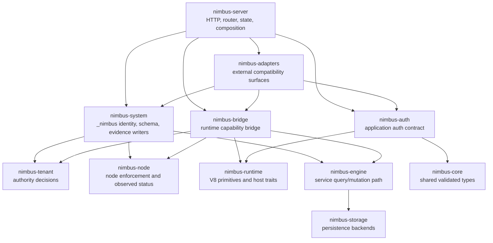

# Nimbus System, Bridge, and Adapters Extraction Plan

Status: completed
Owner: architecture / server hardening
Created: 2026-05-27

## Purpose

This plan reduces `nimbus-server` from a broad ownership bucket into a thin
composition crate with four earned boundaries:

- `nimbus-system`: `_nimbus` system identity, schema, inventory, record inputs,
  observed evidence persistence, and system-owned writers.
- `nimbus-bridge`: the Nimbus runtime capability bridge between tenant
  JavaScript and admitted server capabilities.
- `nimbus-auth`: shared application-auth contracts, principal normalization,
  bearer parsing, and auth error classification.
- `nimbus-adapters`: compatibility adapters for Convex, Firebase, Cloud
  Functions, MongoDB, and related external surfaces.

The goal is not "more crates." The goal is to make the control-plane trust
boundaries independently reviewable and difficult to accidentally bypass.

After `nimbus-system` and `nimbus-bridge`, this plan extracts `nimbus-auth`
before `nimbus-adapters`. The architecture review decided this now: application
auth is shared by multiple adapter families and server composition, but it is
not adapter-owned and must not remain a server-private import after adapter
extraction.

The follow-on extraction order after `nimbus-adapters` is:

1. `nimbus-artifacts`
2. `nimbus-provenance`
3. `nimbus-operator`
4. `nimbus-services`
5. `nimbus-license`

## First-Principles Assessment

The current tenant/node split created two clear security primitives:

- `nimbus-tenant`: who is allowed to do what.
- `nimbus-node`: how admitted work is enforced on a machine.

The remaining `nimbus-server` pressure comes from four different jobs living
in one crate:

- system control-plane persistence and `_nimbus` evidence,
- runtime host capability enforcement,
- shared application-auth contracts,
- external adapter compatibility surfaces.

Those jobs have different threat models, dependency rules, and review
questions. Splitting them is architecturally useful only if the dependency
graph proves those differences.

## Target Shape

`nimbus-server` remains important, but it should be a composition root, not the
place where every boundary accumulates.

## Extraction Order

The intended extraction order is:

1. `nimbus-system`
2. `nimbus-bridge`
3. `nimbus-auth`
4. `nimbus-adapters`
5. `nimbus-artifacts`
6. `nimbus-provenance`
7. `nimbus-operator`
8. `nimbus-services`
9. `nimbus-license`

This order matters. `nimbus-system` and `nimbus-bridge` create the public
control-plane interfaces that adapters should consume. `nimbus-auth` then
provides the shared application-auth contract adapters consume without reaching
back into server-private helpers. `nimbus-adapters` then removes compatibility
protocol bulk from server. The later crates should only extract after adapter
ownership is clear, because they are more likely to share interfaces with
adapters, server composition, or both.

## Verified Baseline

The initial audit ran against the current workspace on 2026-05-27.

Cargo graph findings:

- `nimbus-server` has normal workspace dependencies on `nimbus-core`,
  `nimbus-engine`, `nimbus-machine`, `nimbus-node`, `nimbus-runtime`,
  `nimbus-sandbox`, and `nimbus-tenant`.
- Only `nimbus` and `nimbus-bin` depend on `nimbus-server` as normal
  workspace dependencies.
- This means new extraction crates can sit below `nimbus-server` without
  introducing a Cargo cycle, provided extracted crates never depend on
  `nimbus-server`.

Source graph findings:

- `system_tenant/records.rs` still imports
  `crate::adapters::convex::ConvexRegistryDeploySummary`; this blocks a clean
  `nimbus-system` extraction until deployment summaries are converted into
  neutral system record inputs.
- `runtime_host/*` still imports server-private `execution::*` helpers and the
  server-local `local_enforcement` shim; this blocks `nimbus-bridge` until
  bridge-owned execution helpers are classified and the shim is replaced by
  direct `nimbus-node` imports where appropriate.
- `adapters/*` imports server-private `state`, `application_auth`,
  `local_server`, `system_tenant`, `runtime_host`, `service_registry`,
  `execution`, `tenant`, and `router` modules. That confirms
  `nimbus-adapters` is valuable, but not ready to extract until small
  composition interfaces replace these imports.
- `application_auth.rs` imports `AppState`, `DeploymentState`, `axum` headers,
  `tonic` metadata, and `nimbus_runtime::InvocationAuth`. This confirms
  `nimbus-auth` should be extracted, but only after auth is split into neutral
  contracts plus server-owned transport/deployment adapters.
- `artifact_verifier_effects/*` depends on tenant artifact contracts and owns
  process-backed verifier runners; `execution/invocations` currently owns
  `RuntimeBundleProvenanceConfig`. This supports separate artifact and
  provenance follow-ons, but only after bridge/adapters stop owning runtime
  provenance plumbing.
- `local_enforcement.rs` is only a `pub use nimbus_node::*` shim. Future work
  should remove server-private imports of this shim and use `nimbus-node`
  directly from extracted crates.

Size findings:

- `crates/nimbus-server/src` is about 88k lines.
- `crates/nimbus-server/src/adapters` is about 40k lines.
- `system_tenant`, `runtime_host`, and `artifact_verifier_effects` together are
  about 5k lines, but they sit on higher-trust boundaries than their size alone
  suggests.

The proof record for this audit lives under
`docs/plans/proof/nimbus-system-bridge-adapters-extraction/`.

## Non-Goals

- Do not extract crates just to reduce line count.
- Do not move HTTP routing, listener lifecycle, server state construction, or
  deployment composition out of `nimbus-server` unless a later phase proves a
  tighter owner.
- Do not let `nimbus-adapters` become a new server-shaped catch-all crate.
- Do not let `nimbus-auth` own `AppState`, `DeploymentState`, router
  registration, local admin token authority, adapter registries, or
  transport-specific request handling.
- Do not hide artifacts, provenance, admin, services, or license ownership
  inside `nimbus-adapters`.
- Do not let `nimbus-system` depend on adapter-specific deployment summaries.
- Do not let `nimbus-bridge` depend on HTTP, routers, `_nimbus` persistence, or
  adapter-private request shapes.

## Current Observations

The current server layout shows real extraction pressure:

- `crates/nimbus-server/src/adapters/` is about 39k lines and contains several
  adapter-specific protocol implementations above 1k lines.
- `crates/nimbus-server/src/system_tenant/` is about 2.4k lines and owns
  `_nimbus` identity, schema, keys, inventory, projections, and records.
- `crates/nimbus-server/src/runtime_host/` is about 900 lines, but it sits on a
  high-trust boundary: tenant JS host calls to admitted Nimbus capabilities.
- `crates/nimbus-server/src/execution/host_state.rs`,
  `execution/read_tracking.rs`, `execution/errors.rs`, and
  `execution/runtime_admission.rs` are bridge-adjacent and must be classified
  before extracting `nimbus-bridge`.

Line count alone is not the reason to extract. The reason is that each cluster
answers a different enterprise-trust question.

## Enterprise-Trust Questions

### `nimbus-system`

Reviewers should be able to ask:

- Where are `_nimbus` records shaped?
- Who is allowed to write observed control-plane evidence?
- Can adapter code write system evidence directly?
- Are node status writes observed-only?
- Are system records neutral, or do they import adapter-private types?

### `nimbus-bridge`

Reviewers should be able to ask:

- Does tenant JavaScript reach storage, scheduling, auth, or service bindings
  only through admitted projections?
- Does the bridge consume `TenantIsolationDecision` and narrow decisions instead
  of deriving authority from raw tenant IDs, paths, or request metadata?
- Does runtime cancellation and read-set tracking remain enforced for every host
  call?
- Can adapters bypass the bridge for database operations?

### `nimbus-auth`

Reviewers should be able to ask:

- Where is tenant/user application auth normalized?
- Is application auth separate from local admin/operator authority?
- Can adapters consume auth contracts without importing server state?
- Are malformed bearer values and missing verifier cases classified
  consistently across HTTP, gRPC, and WebSocket surfaces?

### `nimbus-adapters`

Reviewers should be able to ask:

- Which code is compatibility surface, and which code is core Nimbus authority?
- Can an adapter mutate `_nimbus` directly?
- Can an adapter call runtime internals directly instead of using
  `nimbus-bridge`?
- Are adapter-specific quirks isolated from server composition and tenant
  authority?

## Requirements

### REQ-SBA-001: Server Composition Boundary

`nimbus-server` must remain the root that wires HTTP, routers, state, adapters,
runtime bridge, system evidence, storage, and engine services together.

Success criteria:

- `nimbus-server` owns route registration and listener lifecycle.
- Extracted crates do not depend on `nimbus-server`.
- Cross-crate dependencies point inward from server to extracted crates.
- A dependency audit proves no cycle through server.

### REQ-SBA-002: System Boundary

`nimbus-system` owns `_nimbus` system identity, keys, schema, inventory,
record inputs, projections, and system-owned evidence writers.

Success criteria:

- `nimbus-system` has no dependency on `nimbus-server`.
- `nimbus-system` has no dependency on `nimbus-adapters`.
- Adapter-specific deployment summaries are converted into neutral system
  record inputs before they enter `nimbus-system`.
- `_nimbus` writes remain system-owned and auditable.
- Node status evidence remains observed-only and cannot mutate spec, policy,
  grants, quota, placement, or credentials.

### REQ-SBA-003: Bridge Boundary

`nimbus-bridge` owns the Nimbus runtime capability bridge between
`nimbus-runtime` and admitted Nimbus capabilities.

Success criteria:

- Runtime host calls consume `TenantIsolationDecision` or narrow projections.
- Bridge code does not derive tenant authority from raw strings, paths, ports,
  claims, headers, or request metadata.
- Bridge code has no dependency on HTTP routers, adapter modules, storage
  providers, or `_nimbus` persistence.
- Cancellation, nested invocation limits, session validation, read-set tracking,
  and runtime policy admission remain covered by tests.
- Existing Convex and Cloud Functions runtime host behavior is preserved through
  bridge APIs rather than server-private modules.

### REQ-SBA-004: Auth Boundary

`nimbus-auth` owns shared application-auth contracts and normalization.

Success criteria:

- `nimbus-auth` has no dependency on `nimbus-server` or `nimbus-adapters`.
- `nimbus-auth` does not import `AppState`, `DeploymentState`, routers, local
  admin token authority, or adapter registries.
- Application auth and local admin/operator auth remain separate trust
  domains.
- Adapters consume `nimbus-auth` contracts or server-supplied auth traits, not
  server-private auth helpers.
- HTTP, gRPC, and WebSocket surfaces map the same classified auth errors to
  protocol-specific responses.

### REQ-SBA-005: Adapter Boundary

`nimbus-adapters` owns external compatibility protocols and their adapter-local
translation logic.

Success criteria:

- Adapter code does not import `nimbus-server`.
- Adapter code does not write `_nimbus` directly; it uses `nimbus-system`
  interfaces supplied by server composition.
- Adapter runtime calls use `nimbus-bridge`, not runtime-host internals.
- Shared adapter traits are small and capability-oriented.
- The plan explicitly decides whether to use one aggregate `nimbus-adapters`
  crate or per-adapter crates after the readiness audit.

### REQ-SBA-006: No Decorative Extraction

Each extraction must be preceded by a readiness phase that removes false
ownership edges before files move.

Success criteria:

- Every extracted crate has a documented allowed dependency list.
- Every extracted crate has a documented denied dependency list.
- The verifier checks forbidden imports.
- The verifier checks crate existence and Cargo workspace wiring.
- Tests pass before and after the move.

## Dependency Rules

These rules are the target dependency contract. If implementation discovers a
rule is wrong, update the proof file first, then update this plan before moving
code.

| Crate | Allowed workspace dependencies | Denied dependencies |
| --- | --- | --- |
| `nimbus-system` | `nimbus-core`, `nimbus-engine`, `nimbus-machine`, `nimbus-node`, `nimbus-sandbox`, `nimbus-tenant` | `nimbus-server`, `nimbus-adapters`, HTTP/router/state modules, adapter-private types |
| `nimbus-bridge` | `nimbus-core`, `nimbus-engine`, `nimbus-runtime`, `nimbus-tenant`, `nimbus-node` | `nimbus-server`, `nimbus-system`, `nimbus-adapters`, HTTP/router/state modules, `_nimbus` persistence |
| `nimbus-auth` | `nimbus-core`, `nimbus-runtime` for the existing `InvocationAuth` shape | `nimbus-server`, `nimbus-adapters`, `AppState`, `DeploymentState`, routers, local admin token authority, adapter registries |
| `nimbus-adapters` | `nimbus-core`, `nimbus-engine`, `nimbus-runtime`, `nimbus-tenant`, `nimbus-system`, `nimbus-bridge`, `nimbus-auth` | `nimbus-server`, server-private state, direct `_nimbus` writes, runtime internals |
| `nimbus-artifacts` | `nimbus-core`, `nimbus-runtime` only if runtime bundle artifact types remain there, `nimbus-tenant` until artifact contracts move | `nimbus-server`, `nimbus-adapters`, `_nimbus` persistence, tenant admission decisions |
| `nimbus-provenance` | `nimbus-core`, `nimbus-artifacts`, possibly `nimbus-runtime` | `nimbus-server`, adapter-private registries, process launching unless explicitly proven |
| `nimbus-operator` | `nimbus-core`, `nimbus-auth`, `nimbus-system` for audit evidence interfaces | `nimbus-server`, adapters, tenant workload execution, direct storage providers |
| `nimbus-services` | `nimbus-core`, `nimbus-sandbox`, `nimbus-tenant`, `nimbus-system` interfaces, `nimbus-artifacts` if image verification remains service-owned | `nimbus-server`, adapters, router/listener lifecycle |
| `nimbus-license` | `nimbus-core` if shared types are required | `nimbus-server`, adapters, storage providers, runtime/bridge internals |

Dependency success criteria:

- `cargo metadata` or `cargo tree` proof shows no extracted crate depends on
  `nimbus-server`.
- Text audit proves no extracted crate imports `crate::state`, `crate::router`,
  `crate::http`, or adapter-private modules from server.
- Public APIs use narrow capability traits or value types instead of
  accepting server state objects.

## Control Plane Protocol

Coding agents running this plan must treat it as a control plane:

- On start or resume, read this plan, the phase ledger, the current phase proof
  file, and `git status --short` before editing.
- Work on the first `in_progress` phase. If none exists, start the first
  `pending` phase in the ledger.
- Keep at most one phase `in_progress`.
- Load only the active phase plus its immediately relevant code and tests.
- Before editing a phase, write or update that phase's proof file with current
  blockers, intended moves, forbidden imports, and planned verification.
- Do not mark a phase `completed` unless all phase success criteria and all
  task-level checks in the verification matrix pass.
- Record every verification command with pass counts or exact output summary in
  the phase proof file.
- If compaction happens, resume from the first incomplete phase and its proof
  file.
- Do not skip a failed extraction by silently broadening another crate. Record
  an extract/keep decision and preserve the dependency rules.
- For every new crate, add at least one positive behavioral test and one
  negative boundary test when the crate enforces security or authority.
- Before stopping, update this ledger and the active proof file so the next
  agent can resume without conversational context.

Status values:

- `pending`: no implementation work has started.
- `in_progress`: implementation work has started and the proof file is active.
- `completed`: all task-level and phase-level success criteria are satisfied.
- `blocked`: the same blocker has prevented progress for at least three
  consecutive goal turns and requires user input or an external change.

## Phase Ledger

| Phase | Status | Proof file | Resume instruction |
| --- | --- | --- | --- |
| SBA0 Baseline ownership audit | completed | `docs/plans/proof/nimbus-system-bridge-adapters-extraction/sba0-current-dependency-audit.md` | Refresh the audit if code changed before implementation starts. |
| SBA1 Prepare `nimbus-system` | completed | `docs/plans/proof/nimbus-system-bridge-adapters-extraction/sba1-system-readiness.md` | Remove adapter-specific system evidence inputs first. |
| SBA2 Extract `nimbus-system` | completed | `docs/plans/proof/nimbus-system-bridge-adapters-extraction/sba2-system-extraction.md` | Move only after SBA1 forbidden imports are gone. |
| SBA3 Prepare `nimbus-bridge` | completed | `docs/plans/proof/nimbus-system-bridge-adapters-extraction/sba3-bridge-readiness.md` | Classify runtime host and execution helpers before moving files. |
| SBA4 Extract `nimbus-bridge` | completed | `docs/plans/proof/nimbus-system-bridge-adapters-extraction/sba4-bridge-extraction.md` | Move only provider-neutral bridge code. |
| SBA4.5 Extract `nimbus-auth` | completed | `docs/plans/proof/nimbus-system-bridge-adapters-extraction/sba45-auth-extraction.md` | Extract neutral auth contracts before adapter extraction. |
| SBA5 Prepare `nimbus-adapters` | completed | `docs/plans/proof/nimbus-system-bridge-adapters-extraction/sba5-adapters-readiness.md` | Replace server-private adapter imports with narrow interfaces. |
| SBA6 Extract `nimbus-adapters` | completed | `docs/plans/proof/nimbus-system-bridge-adapters-extraction/sba6-adapters-extraction.md` | Move adapter protocols without listener/state ownership. |
| SBA7 Ordered follow-on extractions | completed | `docs/plans/proof/nimbus-system-bridge-adapters-extraction/sba7-follow-on-decisions.md` | Evaluate `artifacts`, `provenance`, `operator`, `services`, `license` in order. |
| SBA8 Verification harness | completed | `docs/plans/proof/nimbus-system-bridge-adapters-extraction/sba8-verifier-closeout.md` | Add and run the final verifier. |

## Task Verification Matrix

Every task below must be checked off in its phase proof file before that phase
can be marked `completed`.

| ID | Task | Required evidence |
| --- | --- | --- |
| SBA0.1 | Inventory server modules by owner. | Proof file has an owner table covering composition, system, bridge, auth, adapter, artifact, provenance, operator, service, license, and tests. |
| SBA0.2 | Record adapter imports into server-private modules. | Proof file records `rg` output or summarized counts for `adapters/*` imports of `state`, `application_auth`, `local_server`, `system_tenant`, `runtime_host`, `service_registry`, `execution`, `tenant`, and `router`. |
| SBA0.3 | Record system and bridge blockers. | Proof file names the exact blocker symbols for `nimbus-system` and `nimbus-bridge`. |
| SBA0.4 | Decide auth ownership. | Proof file records the decided `nimbus-auth` extraction and denied ownership of `AppState`, `DeploymentState`, routers, local admin tokens, and adapter registries. |
| SBA0.5 | Record dependency graph baseline. | Proof file records `cargo metadata` or `cargo tree` findings showing only `nimbus` and `nimbus-bin` depend on `nimbus-server`. |
| SBA1.1 | Introduce neutral system deployment record inputs. | `rg "ConvexRegistryDeploySummary" crates/nimbus-server/src/system_tenant` returns no production references. |
| SBA1.2 | Move adapter-specific conversion out of system code. | Convex deployment summary conversion lives in adapter or server composition code; focused deployment/system tests pass. |
| SBA1.3 | Define system record inputs for required evidence classes. | Deployment, listener, scheduler, table, machine, sandbox, and node evidence inputs are present or explicitly proven unnecessary. |
| SBA1.4 | Keep `_nimbus` writes centralized. | `rg "record_.*_state|upsert_system_document|system_tenant" crates/nimbus-server/src/adapters` shows adapters route through system interfaces only. |
| SBA1.5 | Prove observed-only node status. | Tests or proof show node status writers cannot mutate spec, policy, grants, quota, placement, or credentials. |
| SBA2.1 | Create `crates/nimbus-system`. | `cargo metadata --no-deps` lists `nimbus-system` as a workspace member. |
| SBA2.2 | Move system-owned modules. | `nimbus-system` owns identity, keys, schema, inventory, projections, record inputs, and writers or proof explains retained server ownership. |
| SBA2.3 | Enforce system dependency rules. | `cargo tree -p nimbus-system --edges normal` has no `nimbus-server` or `nimbus-adapters`; `rg "nimbus_server|crate::adapters|crate::router|crate::state" crates/nimbus-system` returns no forbidden production imports. |
| SBA2.4 | Preserve behavior. | Focused system tenant tests and server integration tests proving `_nimbus` evidence writes pass with counts recorded. |
| SBA3.1 | Classify runtime host and execution helpers. | Proof file assigns each `runtime_host/*` and bridge-adjacent `execution/*` module to bridge, server, runtime, or adapter ownership. |
| SBA3.2 | Separate provider-neutral bridge from adapter shims. | `rg "convex|firebase|firestore|cloud_functions|mongodb" <bridge-candidate-files>` has no provider-specific production references unless justified. |
| SBA3.3 | Define bridge context/request API. | Bridge construction accepts admitted decisions/projections and does not accept raw tenant strings as authority. |
| SBA3.4 | Remove server-local shim dependence. | Bridge candidate code imports `nimbus-node` directly or proof documents an intentional compatibility re-export; no `crate::local_enforcement` remains in bridge candidate production files. |
| SBA3.5 | Preserve runtime enforcement semantics. | Tests cover cancellation, session validation, nested invocation budget, read-set tracking, and runtime policy admission. |
| SBA4.1 | Create `crates/nimbus-bridge`. | `cargo metadata --no-deps` lists `nimbus-bridge` as a workspace member. |
| SBA4.2 | Move provider-neutral bridge code. | Runtime host context, capability host, generic ABI document calls, responses, and selected execution helpers live in `nimbus-bridge`. |
| SBA4.3 | Enforce bridge dependency rules. | `cargo tree -p nimbus-bridge --edges normal` has no `nimbus-server`, `nimbus-system`, or `nimbus-adapters`; forbidden import `rg` checks are recorded. |
| SBA4.4 | Route adapters through bridge APIs. | `rg "crate::runtime_host|runtime_host::" crates/nimbus-server/src/adapters crates/nimbus-adapters` finds no server-private runtime host imports after extraction. |
| SBA4.5 | Preserve runtime behavior. | Runtime host tests, adapter runtime tests, and `cargo check --workspace` pass with counts recorded. |
| SBA45.1 | Create `crates/nimbus-auth`. | `cargo metadata --no-deps` lists `nimbus-auth` as a workspace member. |
| SBA45.2 | Move neutral auth contracts. | `ApplicationAuthVerifier`, `ResolvedApplicationAuth`, principal normalization, neutral bearer parsing, subject alias normalization, and classified auth errors live in `nimbus-auth`. |
| SBA45.3 | Keep deployment and transport wrappers in server. | `rg "AppState|DeploymentState|axum|tonic|router|LocalAdmin|local_admin" crates/nimbus-auth` returns no forbidden production imports. |
| SBA45.4 | Update consumers. | Adapter and server code import shared auth contracts from `nimbus-auth`; no extracted adapter code imports `crate::application_auth`. |
| SBA45.5 | Test auth behavior. | Positive tests cover verifier success and principal normalization; negative tests cover malformed bearer values and missing verifier classification. |
| SBA5.1 | Audit adapter server-private imports. | Proof file records import counts and owner decisions for Convex, Firebase, Cloud Functions, MongoDB, and provider-family helpers. |
| SBA5.2 | Introduce composition traits. | System evidence, runtime bridge, auth, service lookup, sandbox catalog, and local audit access are represented by narrow traits or value inputs. |
| SBA5.3 | Decide aggregate versus per-adapter crates. | Proof file records the decision and rationale before files move. |
| SBA5.4 | Keep listener/state ownership in server. | Adapter candidate APIs accept explicit state/capability inputs; route registration and listener lifecycle remain in `nimbus-server`. |
| SBA5.5 | Preserve adapter test ownership. | Proof file names tests moving with adapters and integration tests staying in server. |
| SBA6.1 | Create `crates/nimbus-adapters`. | `cargo metadata --no-deps` lists `nimbus-adapters` as a workspace member. |
| SBA6.2 | Move true adapter protocol code. | Convex, Firebase, Cloud Functions, MongoDB compatibility modules move, excluding global server state and listener lifecycle. |
| SBA6.3 | Enforce adapter dependency rules. | `cargo tree -p nimbus-adapters --edges normal` has no `nimbus-server`; `rg "crate::state|crate::router|crate::http|crate::system_tenant|crate::runtime_host" crates/nimbus-adapters` returns no forbidden production imports. |
| SBA6.4 | Preserve adapter behavior. | Adapter crate tests and server integration tests pass with counts recorded. |
| SBA7.1 | Decide `nimbus-artifacts`. | Proof file records extract/keep decision; if extracted, tests prove fail-closed verifier errors and redaction. |
| SBA7.2 | Decide `nimbus-provenance`. | Proof file records extract/keep decision; if extracted, process launching is denied or inverted behind a trait. |
| SBA7.3 | Decide `nimbus-operator`. | Proof file records extract/keep decision; if extracted, no `AppState`, routers, adapters, or tenant workload execution ownership leaks in. |
| SBA7.4 | Decide `nimbus-services`. | Proof file records extract/keep decision; if extracted, no router/listener lifecycle or adapter ownership leaks in. |
| SBA7.5 | Decide `nimbus-license`. | Proof file records extract/keep decision; if extracted, license tests pass and no runtime/adapter/storage ownership leaks in. |
| SBA8.1 | Add final verifier script. | `scripts/verify-server-system-bridge-adapters-extraction.sh` exists, is executable, and checks all completed extraction boundaries. |
| SBA8.2 | Run final verifier. | Verifier output is recorded in the closeout proof with pass/fail counts. |
| SBA8.3 | Run workspace verification. | `cargo check --workspace` and all focused tests named in phase proofs pass with counts recorded. |
| SBA8.4 | Update closeout. | Closeout template records final decisions, extracted crates, retained server modules, commands, pass counts, and follow-up plans. |

## Phase SBA0: Baseline Ownership Audit

Goal: classify `nimbus-server` code by real owner before extraction.

Tasks:

- Inventory server modules by ownership: composition, system, bridge, adapter,
  local admin, artifact provenance, service manager, and tests.
- Record all imports from `adapters/` into `runtime_host`, `system_tenant`,
  `tenant`, `local_enforcement`, `execution`, and server-private state.
- Record all imports from `runtime_host/` and bridge-adjacent execution modules.
- Record all imports from `system_tenant/`.
- Identify tests that must move with each owner and tests that must remain as
  server integration tests.

Success criteria:

- Proof file lists every candidate module and final owner.
- Proof file lists blocker imports for `nimbus-system`, `nimbus-bridge`, and
  `nimbus-adapters`.
- Proof file records the `nimbus-auth` extraction decision: which auth helpers
  are neutral, which are server transport/deployment wiring, and which adapters
  consume them.
- Proof file records provider-family shared code, including Firestore-family
  helpers, and decides whether it moves with `nimbus-adapters`.
- No extraction work starts until blocker imports are classified.

## Phase SBA1: Prepare `nimbus-system`

Goal: remove adapter-specific inputs from system evidence code.

Tasks:

- Replace direct `ConvexRegistryDeploySummary` usage in system record writing
  with neutral system deployment record inputs.
- Keep adapter-specific conversion near the adapter or server composition root.
- Define system-owned record input structs for deployment, listener, scheduler,
  table, machine, sandbox, and node evidence where needed.
- Define the persistence interface that server composition will supply or call.
- Audit `_nimbus` writes for observed-only versus desired-state authority.

Success criteria:

- `system_tenant` production code has no dependency on adapter-private types.
- Adapter summary types convert into neutral system inputs outside the system
  module.
- Existing system tenant tests pass.
- A text audit proves `_nimbus` system writes remain centralized.

## Phase SBA2: Extract `nimbus-system`

Goal: move the true system control-plane model and writers into
`crates/nimbus-system`.

Likely contents:

- system tenant identity,
- system keys,
- system schema,
- system inventory,
- system projections,
- system record inputs,
- system record writers,
- status evidence writer implementation or traits as appropriate.

Not allowed:

- HTTP routers,
- adapter-private summaries,
- server state construction,
- storage-provider-specific code,
- runtime bridge internals,
- host lifecycle backends.

Success criteria:

- `crates/nimbus-system` exists and is wired into the workspace.
- `nimbus-system` does not depend on `nimbus-server` or `nimbus-adapters`.
- `cargo check --workspace` passes.
- Focused system tenant tests pass after moving.
- Server integration tests continue proving `_nimbus` evidence writes.

## Phase SBA3: Prepare `nimbus-bridge`

Goal: make the runtime capability bridge independent from server-private module
layout.

Tasks:

- Classify `runtime_host/` and bridge-adjacent `execution/` code into bridge,
  server composition, or adapter-specific owners.
- Keep generic capability host logic separate from Convex and Cloud Functions
  adapter-specific host APIs.
- Introduce bridge-facing request/context types if current types pull in
  server-private state.
- Ensure bridge construction requires admitted tenant decisions and narrow
  projections.
- Preserve cancellation, read tracking, nested invocation, and runtime policy
  admission semantics.

Success criteria:

- Bridge candidate code has no dependency on HTTP, router, adapter modules, or
  system persistence.
- Adapters can call bridge APIs without reaching into server-private
  `runtime_host` modules.
- Server-local `local_enforcement` shim usage is replaced with direct
  `nimbus-node` imports or a documented compatibility re-export.
- Focused runtime host tests pass before extraction.
- Dependency audit proves authority inputs are admitted decisions/projections,
  not raw strings.

## Phase SBA4: Extract `nimbus-bridge`

Goal: move the runtime capability bridge into `crates/nimbus-bridge`.

Likely contents:

- runtime host context and bootstrap types,
- runtime capability host implementation,
- runtime host ABI document-call dispatch where generic,
- runtime host response encoding where generic,
- runtime session/read-set tracking if it is not more naturally owned by
  `nimbus-runtime`,
- runtime admission mapping from tenant policy to runtime policy.

Not allowed:

- HTTP/router/server transport,
- Convex/Firebase/Cloud Functions/MongoDB adapter-private protocol handlers,
- `_nimbus` persistence,
- concrete storage providers,
- server state construction.

Success criteria:

- `crates/nimbus-bridge` exists and is wired into the workspace.
- `nimbus-bridge` does not depend on `nimbus-server`, `nimbus-system`, or
  `nimbus-adapters` unless a proof file justifies a narrower trait dependency.
- Runtime host tests pass.
- Adapter runtime tests pass through public bridge APIs.
- `cargo check --workspace` passes.

## Phase SBA4.5: Extract `nimbus-auth`

Goal: move shared application-auth contracts out of server-private modules
before adapter extraction.

Decision:

- Extract `nimbus-auth`.
- Keep deployment activation, Firebase emulator toggles, router wiring, local
  admin token authority, and transport-specific request extraction in
  `nimbus-server` or later `nimbus-operator`.

Current blocker:

- `application_auth.rs` mixes neutral auth concepts with server deployment
  state and transport parsing. It imports `AppState`, `DeploymentState`, axum
  headers, tonic metadata, and `InvocationAuth`.

Tasks:

- Create `crates/nimbus-auth`.
- Move neutral application-auth contracts into `nimbus-auth`.
- Introduce a crate-local `ApplicationAuthError` or equivalent classified error
  type so `nimbus-auth` does not depend on server `AppError`.
- Replace header/metadata-specific parsing with neutral bearer-value parsing;
  server and adapters may keep thin axum/tonic extraction wrappers.
- Keep active deployment resolution in `nimbus-server`.
- Keep local admin token storage, rotation, and route-family authorization out
  of `nimbus-auth`.
- Update adapters to import shared auth contracts from `nimbus-auth`, not
  `crate::application_auth`.

Likely contents:

- `ApplicationAuthVerifier` trait,
- `ResolvedApplicationAuth`,
- principal normalization,
- bearer token parsing over neutral string inputs,
- subject alias normalization for emulator-compatible identities,
- auth error classification that adapters can map to HTTP, gRPC, or WebSocket
  responses.

Not allowed:

- `AppState`,
- `DeploymentState`,
- router registration,
- local admin token storage or rotation,
- adapter registries,
- tenant admission decisions.

Success criteria:

- Proof file records the `nimbus-auth` extraction decision.
- `crates/nimbus-auth` exists and is wired into the workspace.
- `nimbus-auth` does not depend on `nimbus-server` or `nimbus-adapters`.
- `nimbus-auth` has positive tests for principal normalization and verifier
  success.
- `nimbus-auth` has negative tests for malformed bearer values and missing
  verifier behavior.
- Server-local deployment auth wrappers remain thin and covered by existing
  server tests.
- Adapter extraction has no direct `crate::application_auth` imports.

## Phase SBA5: Prepare `nimbus-adapters`

Goal: decide whether adapter extraction should be aggregate or per-adapter.

Starting preference:

- Use `nimbus-adapters` only if the extracted crate can stay adapter-owned and
  avoid becoming a second server crate.
- Prefer per-adapter feature modules inside `nimbus-adapters` initially if
  they share enough composition traits and test harness.
- Promote per-adapter crates later only if dependency sets or release ownership
  diverge.

Tasks:

- Audit Convex, Firebase, Cloud Functions, and MongoDB modules for server-only
  dependencies.
- Introduce small composition traits for system evidence, runtime bridge
  construction, service lookup, sandbox catalog access, and auth context where
  needed.
- Move Firestore-family shared helpers with adapters unless a proof file shows
  they are core data-model primitives.
- Keep HTTP listener ownership in `nimbus-server`; adapter route builders may
  move only if they remain transport-neutral or accept explicit server wiring.
- Keep compatibility-specific tests with the adapters and cross-adapter
  integration tests in server.

Success criteria:

- A proof file decides aggregate `nimbus-adapters` versus per-adapter crates.
- All server-private dependencies are replaced by small interfaces or moved
  back to server composition.
- Adapter modules no longer import `runtime_host` internals.
- Adapter modules no longer import `system_tenant` internals except through
  `nimbus-system` interfaces.
- Adapter modules no longer import `application_auth` internals except through
  `nimbus-auth` or explicit server-supplied auth traits.

## Phase SBA6: Extract `nimbus-adapters`

Goal: move true external compatibility surfaces out of `nimbus-server`.

Likely contents:

- Convex compatibility routes and runtime translations,
- Firebase compatibility protocol handlers,
- Cloud Functions compatibility handlers,
- MongoDB command compatibility handlers,
- adapter-local tests and fixtures,
- shared adapter interfaces only when they reduce real duplication.

Not allowed:

- server listener lifecycle,
- global server state ownership,
- `_nimbus` persistence implementation,
- runtime bridge internals,
- tenant authority decisions,
- concrete storage providers.

Success criteria:

- `crates/nimbus-adapters` exists and is wired into the workspace.
- `nimbus-adapters` does not depend on `nimbus-server`.
- Adapter tests pass in their new owning crate.
- Server integration tests pass with adapters wired through public APIs.
- Dependency audit proves adapters cannot bypass `nimbus-system` or
  `nimbus-bridge` for system evidence or runtime host calls.

## Phase SBA7: Ordered Follow-On Extractions

Goal: continue reducing server ownership after `nimbus-adapters` in a fixed,
reviewable order without turning the plan into an unbounded refactor campaign.

Order:

1. `nimbus-artifacts`
2. `nimbus-provenance`
3. `nimbus-operator`
4. `nimbus-services`
5. `nimbus-license`

Expected ownership:

- `nimbus-artifacts`: artifact references, artifact verification inputs,
  artifact verifier contracts, and artifact-oriented result models that are not
  tenant authority or server composition.
- `nimbus-provenance`: supply-chain evidence, attestation, SBOM, SLSA, and
  audit lineage models that need to be shared across system evidence, artifact
  verification, and operator workflows.
- `nimbus-operator`: operator security surfaces such as local server security,
  operator console access, local admin-token handling, deploy admin admission,
  and operator-only request admission. The crate name uses "operator" for the
  human/control-plane role; local admin tokens and deploy admin API names remain
  credential or route names.
- `nimbus-services`: service manager and sandbox/service registry composition
  if the ownership proves broader than server wiring.
- `nimbus-license`: license enforcement only if it is shared by CLI, server,
  distribution, or operator paths.

Tasks:

- Run the same readiness audit for each crate before moving files.
- Document the allowed dependency list, denied dependency list, owner modules,
  tests, and forbidden imports for each candidate.
- Extract each crate only when the boundary is real.
- If a candidate is not earned, record the keep decision and continue to the
  next ordered candidate only if doing so does not depend on the skipped split.

Per-crate success criteria:

- `nimbus-artifacts` separates artifact contracts from process-backed verifier
  effects, and has tests proving verifier failures fail closed with redacted
  output.
- `nimbus-provenance` owns provenance/SBOM/SLSA evidence models and runtime
  provenance gating only after process execution effects are inverted or
  explicitly denied.
- `nimbus-operator` owns operator security models only if local admin token
  persistence and route middleware can be expressed without importing server
  routers or `AppState`.
- `nimbus-services` owns service manager or sandbox service registry code only
  if it can consume `nimbus-system` and `nimbus-tenant` interfaces without
  owning HTTP service routes.
- `nimbus-license` owns license parsing/snapshot/entitlement logic only if the
  license surface is shared outside server metadata routes.

Success criteria:

- Every follow-on candidate has a proof file with extract/keep reasoning.
- Extracted follow-on crates do not depend on `nimbus-server`.
- `nimbus-operator`, `nimbus-services`, and `nimbus-license` do not become
  generic dumping grounds for unrelated server code.
- No candidate is extracted unless it has a real owner, allowed dependency
  list, denied dependency list, tests, and verifier checks.

## Phase SBA8: Verification Harness

Goal: make completion enforceable after compaction events.

Add `scripts/verify-server-system-bridge-adapters-extraction.sh`.

The verifier should check:

- `nimbus-system`, `nimbus-bridge`, and `nimbus-adapters` workspace crates
  exist after their extraction phases are marked complete.
- Extracted crates do not import `nimbus-server`.
- `nimbus-auth` exists and does not import `nimbus-server` or
  `nimbus-adapters`.
- `nimbus-system` does not import adapter-private modules or types.
- `nimbus-bridge` does not import HTTP, router, adapter, or system persistence
  modules.
- `nimbus-adapters` does not import server-private modules.
- Ordered follow-on extraction decisions exist for `nimbus-artifacts`,
  `nimbus-provenance`, `nimbus-operator`, `nimbus-services`, and
  `nimbus-license`.
- Runtime bridge code references admitted tenant decisions or projections.
- `_nimbus` writes route through system-owned writers.
- Auth code used by extracted adapters routes through `nimbus-auth` or
  server-supplied traits, not server-private helper imports.
- Required focused tests are named in the plan closeout.
- `cargo check --workspace` passes.

Success criteria:

- The verifier is committed with the plan.
- The plan closeout records verifier output, focused test names, and pass
  counts.
- Every phase has proof artifacts under
  `docs/plans/proof/nimbus-system-bridge-adapters-extraction/`.

## Completion Gates

This plan is complete only when:

- `nimbus-system` is extracted or a proof file explains why extraction was not
  earned yet.
- `nimbus-bridge` is extracted or a proof file explains why extraction was not
  earned yet.
- `nimbus-auth` is extracted and passes its dependency and behavior tests.
- `nimbus-adapters` is extracted or a proof file explains why aggregate adapter
  extraction was rejected in favor of per-adapter follow-up plans.
- `nimbus-artifacts`, `nimbus-provenance`, `nimbus-operator`,
  `nimbus-services`, and `nimbus-license` are each extracted or have proof
  files explaining why extraction was not earned yet.
- `nimbus-server` has no direct ownership of system model logic, runtime bridge
  capability enforcement, or adapter protocol internals beyond composition
  wiring.
- The verifier passes.
- Focused tests and workspace check pass.

## Closeout Template

Record the final result here before archiving:

- Final `nimbus-system` decision: extracted into `crates/nimbus-system`.
- Final `nimbus-bridge` decision: extracted into `crates/nimbus-bridge`.
- Final `nimbus-auth` decision: extracted into `crates/nimbus-auth`.
- Final `nimbus-adapters` decision: not extracted; aggregate adapter crate
  rejected until per-adapter readiness removes server-shaped imports.
- Final `nimbus-artifacts` decision: not extracted; pure artifact contracts
  stay in `nimbus-tenant`, process-backed verifier effects stay in server
  wiring.
- Final `nimbus-provenance` decision: not extracted; provenance remains split
  across tenant authority, runtime integrity, execution admission, and verifier
  effects.
- Final `nimbus-operator` decision: not extracted; operator middleware/routes
  still close over Axum, `AppState`, audit, shutdown, and system evidence.
- Final `nimbus-services` decision: not extracted; service manager still
  depends on server-owned sandbox/service traits, system evidence, and adapter
  runtime wiring.
- Final `nimbus-license` decision: extracted into `crates/nimbus-license`.
- Extracted crates: `nimbus-system`, `nimbus-bridge`, `nimbus-auth`,
  `nimbus-license`.
- Intentionally retained server-owned modules: adapters, application-auth
  transport/deployment glue, artifact verifier effects, runtime invocation
  provenance wiring, local server/operator routes, service manager/service
  registry, sandbox service traits.
- Verification commands and pass counts:
  `bash scripts/verify-server-system-bridge-adapters-extraction.sh` passed
  12/12 checks and ran `cargo check --workspace`;
  `cargo test -p nimbus-system -p nimbus-bridge -p nimbus-auth -p nimbus-license -- --nocapture`
  passed 8/7/5/2 crate tests respectively;
  `cargo test -p nimbus-server system_tenant -- --nocapture` passed 7 tests;
  `cargo test -p nimbus-server runtime_host -- --nocapture` passed 5 tests;
  `cargo test -p nimbus-server auth -- --nocapture` passed 63 tests;
  `cargo test -p nimbus-server cloud_functions -- --nocapture` passed 39
  tests;
  `cargo test -p nimbus-server license -- --nocapture` passed 22 tests;
  `cargo fmt --all --check` passed.
- Remaining follow-up plans: per-adapter extraction readiness,
  artifact-effects readiness, services readiness, and operator readiness.
