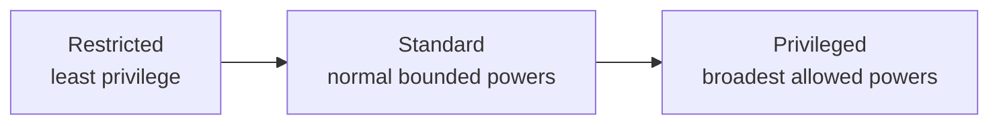

# Runtime Permission Modes Plan

Status: done

Follow-on proposal for replacing the current purpose-heavy runtime permission
story with a permissions-first model that is easier to explain to users,
safer for AI-generated code, and more consistent with modern serverless and
agent-hosting platforms.

This document is the active control plane for permission-mode work.

## Status

- **Plan status:** `done`
- **Primary owner when activated:** this plan for runtime permission taxonomy,
  fine-grained grant design, migration from `Application` / `Tooling`, and
  verification posture
- **Current baseline:** `docs/plans/archive/node-compatible-runtime-plan.md`
- **Relationship to current runtime contract:** follow-on refinement, not a
  second runtime implementation plan
- **Hard constraint:** preserve the existing separation of runtime axes:
  permission mode, compatibility target, runtime language, and execution
  purpose must not collapse back into one enum or one product term
- **Runtime language scope:** `JavaScript` is the only implementation target
  for this slice, and remains the default when no runtime language is
  specified. `Python` and other runtime languages are taxonomy placeholders for
  future plans, not implementation commitments here.

## Readiness Audit

Reviewed 2026-05-12 before activation. This readiness section records the
pre-work starting point; the progress log below records subsequent cutovers.

The implementation surface is concentrated enough to execute safely:

- At activation, `crates/nimbus-runtime/src/limits.rs` owned the current
  `RuntimeProfile::{Application, Tooling}` terminology, constructor helpers,
  normalization invariants, and exported runtime policy shape.
- At activation, `crates/nimbus-runtime/src/runtime_capabilities.rs` owned the effective
  filesystem, env, subprocess, network, FFI, and sys permission construction,
  currently deriving most decisions from `RuntimeProfile` plus
  `RuntimeSubprocessPolicy`.
- `crates/nimbus-runtime/src/runtime/bootstrap/state.rs` and
  `crates/nimbus-runtime/src/runtime/bootstrap/ops/shared.rs` expose runtime
  contract metadata to JavaScript and must move from preset language to
  mode/preset language without changing compatibility-target semantics.
- `crates/nimbus-server/src/protocol.rs` exposes runtime diagnostics and must
  report permission mode, grants, language, and preset distinctly once the new
  model lands.
- `crates/nimbus-server/src/adapters/convex/**` creates the product runtime
  lanes and should keep Convex adapter decisions at the adapter boundary while
  lowering into core runtime mode/grant/preset primitives.
- `crates/nimbus-bin/src/codegen.rs` is the embedded tooling lane and should
  become a `RuntimePreset::Tooling` user rather than a permission-mode special
  case.
- Node compatibility manifests and docs may retain historical
  `application_node20` / `application_node22` / `application_node24` preset
  labels only while the execution harness is being migrated; closeout requires
  either migration or an explicit compatibility-evidence naming note.

Implementation guardrails:

- Do not widen host access while renaming terms; RPM1 should be behavior
  preserving.
- Add the data model before broad call-site churn so compile errors guide the
  migration.
- Keep compatibility targets (`WebStandardIsolate`, `Node20`, `Node22`,
  `Node24`) orthogonal to permission modes.
- Keep JavaScript as the only implemented runtime language for this plan; do
  not introduce Python execution while adding `RuntimeLanguage`.
- Prefer typed grant structs over stringly typed ad hoc fields, but keep
  defaults small and serializable so diagnostics and docs can report them.
- Every enforcement widening must be paired with a negative test and an audit
  or diagnostic representation.

## Objective

Replace the current `Application` / `Tooling` permission framing with a
permissions-first model that:

- uses exactly three capability modes:
  - `Restricted`
  - `Standard`
  - `Privileged`
- preserves named internal presets for common Nimbus-owned workload shapes,
  but makes those presets subordinate to the real `Mode + Grants` model
- keeps fine-grained grants explicit, Deno-style, instead of relying on one
  broad mode name to imply every resource decision
- treats AI-generated code as ordinary code that must be classified by the
  same mode-and-grants policy as any other execution surface
- allows enterprises running Nimbus to assign `Privileged` to their own code
  when they intentionally need it
- keeps compatibility target orthogonal:
  - `WebStandardIsolate`
  - `Node22`
  - future targets
- keeps runtime language orthogonal:
  - `JavaScript`
  - `Python`
  - future runtime languages
- keeps execution purpose orthogonal:
  - application request handling
  - build/package/tooling tasks
  - canaries
  - oracle runs
  - operator workflows

## Migration Posture

Nimbus is still pre-launch, so this plan prefers direct breaking changes over
compatibility layers.

That means:

- `Application` / `Tooling` should be replaced as permission-mode names, not
  kept as long-lived aliases
- docs, config, runtime entrypoints, and policy surfaces should converge on
  `Restricted` / `Standard` / `Privileged` as the canonical names
- Nimbus may keep internal convenience presets for recurring workload shapes,
  but those presets must compile down to explicit mode-and-grant bundles
- any temporary translation layer must be narrowly scoped to one implementation
  step and removed before plan closeout
- this plan should not preserve legacy terminology “for compatibility” unless a
  concrete bootstrap blocker is documented

## Why This Plan Exists

The current runtime model proved an important baseline:

- one canonical V8-backed runtime
- explicit compatibility targets
- capability boundaries instead of a raw host model
- a distinction between narrower deployed execution and broader local tooling

But the current public names mix multiple axes:

- `Application` sounds like product shape, not permission posture
- `Tooling` sounds like purpose, not just permission posture
- neither name makes it obvious how enterprises should think about
  high-trust internal code or AI-generated code

The result is avoidable ambiguity:

- users think in terms of permissions
- operators think in terms of least privilege
- AI-generated code should not be trusted just because it is convenient
- enterprise customers may legitimately want high-trust workloads of their own

The mode names should therefore answer the simplest user question first:

**what is this code allowed to do?**

## Decision Summary

Nimbus should use three permission modes:

| Mode | Meaning | Default use |
| --- | --- | --- |
| `Restricted` | Least privilege; explicit narrow resource access only | Tenant code and explicitly sandboxed or untrusted execution surfaces |
| `Standard` | Normal bounded runtime mode with broader but still explicit and scoped powers | Common service code, framework/package integration, most tooling, and the platform baseline when no stricter mode is selected |
| `Privileged` | Highest-power mode for explicitly trusted workloads | Admin/operator workflows, enterprise-approved high-trust jobs |

`Standard` is intentionally the middle name instead of `Default` or `Elevated`.

Why `Standard`:

- it reads naturally as the normal non-admin runtime lane
- it can serve as the implicit platform baseline without overloading the word
  “default” into both policy semantics and fallback behavior
- it stays broader than `Restricted` without sounding exceptional
- it does not imply a hidden trust guarantee
- it is easier to explain than `Elevated` in product UX and policy docs

The canonical implementation vocabulary should also be explicit:

- `RuntimeMode`
  - `Restricted`
  - `Standard`
  - `Privileged`
- `RuntimeGrants`
  - the explicit machine-readable resource surface
- `RuntimeLanguage`
  - `JavaScript`
  - `Python`
  - future runtime languages
- `RuntimePreset`
  - an internal convenience bundle that resolves to `RuntimeMode +
    RuntimeGrants`

At the same time, Nimbus source code may still benefit from a small set of
named internal presets for common workload shapes. Those presets are useful as
ergonomic defaults, but they must not replace the canonical permission model.

For this plan, `RuntimeLanguage::JavaScript` is the only runtime language that
must be implemented. If runtime language is omitted, JavaScript is selected.
`RuntimeLanguage::Python` is included only to reserve the separate language axis
and prevent future guest-language work from being modeled as another permission
mode or preset.

## Core Model

The important design rule is:

- **mode sets the baseline ceiling**
- **fine-grained grants set the exact resource surface**
- **presets are convenience bundles on top of mode + grants**

Examples:

- `Restricted + net.connect=api.openai.com:443 + secret=openai/api-key`
- `Standard + read=/workspace + write=/tmp,/workspace/out + run=node,npm`
- `Privileged + read=* + write=* + run=* + net.connect=*`

Optional internal preset examples:

- `Application = Standard + application_grants`
- `Tooling = Standard + tooling_grants`
- `Oracle = Standard or Privileged + oracle_grants`
- `Operator = Privileged + operator_grants`
- `Code = Restricted + code_grants`

## Non-Goals

- Adding a fourth or fifth fixed permission tier.
- Encoding ownership into the mode names.
- Treating AI-generated code as a separate mode.
- Replacing outer sandboxing, IAM, or network isolation with runtime flags
  alone.
- Mixing modules with different permission modes inside a single execution
  context.
- Introducing a second JS runtime implementation.
- Letting presets become a second competing permission model.

## Architectural Rules

### 1. Permission Mode Is Its Own Axis

Permission mode must be distinct from:

- compatibility target
- runtime language
- execution purpose
- code provenance

This means Nimbus should not model:

- `Tooling` as a permission mode name
- `Application` as a permission mode name
- `JavaScript` as a permission mode name
- `Python` as a permission mode name
- `AI-generated` as a permission mode name

Those are useful metadata labels, but they are not the permission axis.

### 2. Fine-Grained Grants Are Required

Modes alone are not enough. Nimbus should pair modes with explicit grants.

Recommended top-level grant families:

| Grant family | Example values | Notes |
| --- | --- | --- |
| `read` | `/bundle`, `/workspace/data` | Path-scoped reads |
| `write` | `/tmp`, `/workspace/out` | Path-scoped writes |
| `net.connect` | `api.openai.com:443`, `*.stripe.com` | Outbound network |
| `net.listen` | `127.0.0.1:3000` | Local listeners |
| `env.read` | `OPENAI_API_KEY`, `AWS_*` | Explicit names or prefixes |
| `env.write` | `TMPDIR` | Rare; often unnecessary |
| `secret` | `OPENAI_API_KEY`, `stripe/live` | Explicit secret handles; avoid overloading plain env reads when possible |
| `identity` | `service:agent-prod`, `oidc:github-actions` | Service identity, token minting, or delegated-principal surface |
| `service` | `bucket:uploads`, `queue:jobs`, `kv:sessions`, `db:analytics` | Resource-bound capabilities analogous to bindings or managed service handles |
| `run` | `node`, `npm`, `python` | Command allowlist |
| `sys` | `hostname`, `systemMemoryInfo` | System metadata |
| `ffi` | shared-library paths | Native code boundary |
| `worker` | worker threads / background workers | Explicit concurrency surface |
| `tool` | named connectors or MCP tools | Explicit tool access |

Additional rule:

- not every capability should be modeled as raw host access; when Nimbus is
  exposing a managed resource or platform service, prefer explicit
  service/binding-style grants and identities over ambient env secrets plus
  unrestricted network reachability
- keep `secret`, `identity`, and `service` distinct in declarations, storage,
  audit output, and policy review even when their runtime materialization uses
  an env-style or binding-style API. Secret material may appear as an env value
  for compatibility, but it should not be governed only by `env.read`.
- `env.read` is for non-sensitive environment/config values and compatibility
  surfaces. `secret` is for sensitive values or secret handles. `service` is
  for managed resource bindings. `identity` is for token minting,
  delegated-principal, or service-account authority.

### 2.5 Internal Presets Are Allowed, But Subordinate

Nimbus may keep a small set of internal presets for recurring workload shapes.

Good preset examples:

- `Application`
- `Tooling`
- `Oracle`
- `Operator`
- `Code`

Typical preset intent:

| Preset | What it is for | Typical resolution |
| --- | --- | --- |
| `Application` | First-party product or service execution paths that need the normal bounded backend/runtime surface | `Standard + application_grants` |
| `Tooling` | Build, codegen, package, test, and developer-automation workflows that need workspace access and allowlisted subprocesses | `Standard + tooling_grants` |
| `Oracle` | Evidence, comparison, or compatibility runs against external binaries, upstream fixtures, or reference environments | `Standard + oracle_grants` or `Privileged + oracle_grants`, depending host needs |
| `Operator` | Explicit admin, repair, maintenance, or enterprise-approved high-trust workflows | `Privileged + operator_grants` |
| `Code` | Short-lived provided-code execution, including AI-generated or tenant-supplied code, where the product wants a repeatable least-privilege preset | `Restricted + code_grants` |

Rules:

- presets are an internal ergonomics layer, not the canonical security model
- presets must resolve to explicit `RuntimeMode + RuntimeGrants`
- docs, audits, and security reviews should reason in terms of modes and
  grants, not rely on preset names alone
- if a workload needs an exception, specify mode and grants directly instead of
  stretching a preset name
- `Code` is for short-lived provided-code execution, not for durable
  environment/session semantics
- `Code` is not the generic command/process orchestration lane; reserve `Exec`
  for a future explicit subprocess-oriented preset if the product needs one
- `Code` is not the future environment-like isolated surface; reserve
  `Sandbox` for that heavier workload shape
- reserve names such as `Exec` and `Sandbox` for distinct future workload
  shapes instead of overloading `Code`

### 3. Same-Context Code Shares One Permission Surface

Nimbus should adopt the same high-level rule Deno documents:
code in the same execution context shares the same privilege level.

That means:

- do not try to run `Restricted` and `Privileged` modules in one isolate and
  pretend imports will keep them separate
- mode changes require a separate runtime boundary, process boundary, or
  sandbox boundary

### 4. Untrusted Or Tenant-Scoped Code Defaults To `Restricted`

AI-generated code is not a special-trust category by itself.

The platform default and the least-privilege default are separate questions.
The rule should be:

- the platform baseline mode may be `Standard`
- `Restricted` is the explicit default for untrusted, tenant-supplied, or
  deliberately sandboxed execution surfaces
- a preset such as `RuntimePreset::Code` should normally resolve to
  `Restricted + explicit narrow grants`
- promotion to `Privileged` must be explicit in config or policy

### 5. `Privileged` Does Not Mean “Host Root”

Even `Privileged` should still run inside the outer Nimbus sandbox and product
security boundary. It means “broadest Nimbus-approved powers,” not “escape the
platform.”

## Recommended Default Policy

| Capability | `Restricted` | `Standard` | `Privileged` |
| --- | --- | --- | --- |
| Subprocesses | denied by default | allowed only by explicit command allowlist | allowed by explicit broad grant |
| Filesystem reads | narrow explicit roots only | broader scoped roots | broad |
| Filesystem writes | usually `/tmp` or generated roots only | scoped write roots | broad |
| Env reads | explicit allowlist only | explicit allowlist or prefixes | broad |
| Env writes | denied by default | limited and explicit | broad |
| Secrets | explicit handles only | explicit handles only | broad only by explicit grant |
| Identity / token minting | denied unless explicit | scoped identities only | broad only by explicit grant |
| Managed service bindings | explicit bindings only | scoped bindings only | broad only by explicit grant |
| Outbound network | explicit host allowlist only | scoped allowlist; optionally broader | broad |
| Local listeners | usually denied | explicit only | broad |
| Native addons / FFI | denied | usually denied | explicit only |
| Worker threads | limited / explicit | allowed when needed | broad |
| Tool / connector access | explicit per tool | explicit per tool | broad |

## Migration Direction From Current Runtime Terms

The current baseline uses:

- `RuntimeProfile::Application`
- `RuntimeProfile::Tooling`

This plan recommends replacing that permission story, not the whole runtime
shape.

Target migration:

| Current term | Main issue | Recommended destination |
| --- | --- | --- |
| `RuntimeProfile::Application` | mixes product shape and permission posture | rename to internal `RuntimePreset::Application`, resolving to `Standard + application_grants` |
| `RuntimeProfile::Tooling` | mixes purpose and permissions | rename to internal `RuntimePreset::Tooling`, resolving to `Standard + tooling_grants` |

Important rule:

- “tooling” should remain a workload purpose label, not the name of a
  permission mode
- the repo should prefer a direct breaking terminology cutover over indefinite
  dual naming
- workloads that need non-default posture should specify mode and grants
  directly instead of stretching the legacy preset names

Transitional implementation rule:

- do not keep `RuntimeProfile` as the lasting name of the preset layer
- perform a direct breaking rename to `RuntimePreset`
- only keep temporary translation glue if one implementation step requires it,
  and remove that glue before plan closeout

## Research-Backed Reasoning

### Deno

Deno is useful because it proves the value of:

- secure-by-default execution
- explicit grants for `read`, `write`, `net`, `env`, `run`
- deny rules
- an optional permission broker

Deno also documents the key limitation that all code on the same thread shares
the same privilege level, and it recommends OS- or VM-level sandboxing for
truly untrusted code. This is an argument for explicit grants and separate
execution boundaries, not for more and more named modes.

Deno Deploy then shows the hosted-product lesson: a managed platform may run
with broad internal runtime permissions and rely on the outer sandbox/product
boundary instead of exposing raw CLI-style permission flags to end users.

Implication for Nimbus:

- adopt Deno-like grants
- keep outer sandboxing as a separate control
- do not assume runtime flags alone make untrusted execution safe

### Cloudflare Workers

Cloudflare Workers is the clearest `Restricted` precedent:

- isolate-first
- no local filesystem
- no general host subprocess model
- capability-style bindings
- strong multi-tenant framing

Implication for Nimbus:

- `Restricted` should feel Workers-like
- bindings/grants are a better mental model than ambient host access

### Convex

Convex is the cleanest split-model precedent:

- default runtime similar to Cloudflare Workers
- explicit opt-in Node.js runtime
- Node restricted to actions via `"use node"`

Implication for Nimbus:

- keep the least-privileged default narrow
- use explicit escape hatches instead of widening everything
- separate runtime purpose from permission posture

### Supabase Edge Functions

Supabase Edge Functions is more permissive than Workers:

- Deno-based edge runtime
- gateway applies auth and policies before function execution
- explicit `/tmp` ephemeral storage

Implication for Nimbus:

- `Standard` can be broader than Workers without abandoning a serverless story
- gateway/policy enforcement still matters outside the runtime itself

### AWS Lambda

Lambda is a heavier isolated execution environment:

- secure isolated runtime environment
- normal runtime/process model
- separate tenant isolation mode for end-user supplied code

Implication for Nimbus:

- enterprise users may reasonably expect broader powers in a managed
  serverless/container-like environment
- but truly multi-tenant or code-execution workloads still benefit from a
  stricter posture

### Azure Functions

Azure Functions is useful as a mainstream bindings-first and multi-language
reference:

- event-driven triggers and bindings are first-class
- multiple languages are supported, but the chosen runtime language remains a
  separate concern
- hosting plan and identity choices are separate from function purpose

Implication for Nimbus:

- managed resources should not all collapse into `env.read` plus
  `net.connect`; some should be modeled as first-class service/binding grants
- runtime language should stay separate from permission mode and preset naming

### Modal Sandboxes

Modal Sandboxes is useful because it models the future heavier-weight
agent/untrusted-code lane explicitly:

- secure containers for executing untrusted user or agent code
- default networking is narrow, with explicit outbound controls
- sandboxes can be reused, hold state, run commands, and act more like a
  durable environment than a one-shot code eval

Implication for Nimbus:

- `RuntimePreset::Code` should remain the short-lived provided-code lane
- a future `RuntimePreset::Sandbox` can be a distinct environment-like surface
  without forcing the current preset to carry that meaning
- command execution, reusable environments, and tighter networking controls are
  strong candidates for a later sandbox-specific design wave

### Google Cloud Run

Cloud Run is the clearest proof that AI-generated or untrusted code execution
is not inherently a bad product idea:

- writable ephemeral filesystem
- child processes inside the container model
- strong outer sandboxing
- explicit documentation for AI agents
- explicit documentation for safer execution of untrusted LLM-generated code,
  including restricted IAM and network controls

Implication for Nimbus:

- broad execution can be a valid product posture
- but it must be paired with strong outer isolation and explicit policy
- this argues for `Privileged` as a real enterprise mode, not a Nimbus-only
  internal concept

### Secrets, Env, Identity, And Service Bindings

The major platforms split along two implementation styles:

- Cloudflare Workers, Deno Deploy, and Supabase Edge Functions expose secret
  values through the same runtime access path as environment variables or
  bindings, while keeping secret classification and management distinct.
- AWS Lambda, Azure Functions, and Google Cloud commonly encourage managed
  secret stores, identity-backed access, Key Vault/Secret Manager references,
  local caches, or service bindings instead of treating all sensitive data as
  ordinary environment configuration.

Implication for Nimbus:

- keep `secret` as a first-class grant family rather than folding it into
  `env.read`
- allow secrets to materialize through env-compatible APIs when compatibility
  needs it, but require the declaration, storage source, audit trail, and
  verification matrix to preserve the secret classification
- model managed resources as `service` grants when the platform can provide a
  binding-style handle, instead of forcing users to combine ambient env secrets
  and broad network grants
- model service-account authority, OIDC/token minting, and delegated principal
  behavior as `identity` grants so authority is reviewable independently from
  the transport used to reach a downstream service

## Why Three Modes Is The Right Size

Three modes are enough because they cover the three real ceilings:

1. **Least privilege**
2. **Normal bounded backend/runtime powers**
3. **Broadest approved powers**

Adding more fixed modes usually mixes axes again:

- trust
- purpose
- ownership
- deployment environment
- compatibility target

When more differentiation is needed, Nimbus should add grants, not more modes.

## Roadmap

| Item | Status | Depends on | Outcome |
| --- | --- | --- | --- |
| RPM1 Permission taxonomy and terminology closeout | `done` | none | The repo adopts `RuntimeMode::{Restricted, Standard, Privileged}` as the canonical permission vocabulary through a direct breaking rename, with explicit migration guidance from `Application` / `Tooling`. |
| RPM2 Grant vocabulary, data model, and preset layer | `done` | RPM1 | Runtime configuration supports a Deno-like `RuntimeGrants` model with path-, host-, env-, secret-, identity-, service-, and command-scoped declarations, plus a small internal `RuntimePreset` layer that resolves to explicit mode-and-grant bundles. |
| RPM3 Runtime enforcement hardening | `done` | RPM2 | Filesystem, subprocess, env, network, FFI, worker, service, and metadata boundaries are enforced by mode plus grants rather than by scattered ad hoc checks. |
| RPM4 Product and adapter contract migration | `done` | RPM3 | Public docs, surface matrices, and runtime entrypoints use the new mode language consistently, and any temporary alias layer is removed before closeout. |
| RPM5 Verification and operator evidence | `done` | RPM4 | Negative tests, canaries, and audit/reporting prove that `Restricted`, `Standard`, and `Privileged` actually enforce their intended ceilings. |

## Progress Log

- 2026-05-12: Activated the plan, promoted it into `docs/plans/README.md`,
  added the readiness audit, and landed the behavior-preserving foundation:
  `RuntimeMode`, `RuntimeLanguage`, `RuntimePreset`, and `RuntimeGrants` now
  exist in the runtime policy surface. Existing application and tooling
  behavior still lowers through the same enforcement paths, while runtime
  diagnostics and the JS runtime contract now expose mode/language/preset/grant
  metadata separately from compatibility target.
- 2026-05-12: Moved filesystem, environment, network, and system metadata
  permission construction to `RuntimeGrants` and added focused negative tests
  proving that preset names and Node target selection do not silently widen
  access. Added the active architecture reference at
  `docs/architecture/runtime/permission-model.md` and updated runtime-facing
  docs to explain permission posture separately from Node compatibility.
- 2026-05-12: Removed the remaining subprocess policy enum from the active
  runtime surface. Subprocess access now comes from `RuntimeGrants::run` with
  explicit symbolic grants for the compat self-exec seam, host self-exec seam,
  and discovered tooling binaries; focused tests prove run targets are grant
  driven rather than preset-name driven.
- 2026-05-12: Added host-call enforcement for `RuntimeGrants::service`.
  `ctx.services.get(...)` now fails before reaching the host bridge unless the
  runtime contract grants the requested service name; snapshot-only service
  property reads remain host-call-free.
- 2026-05-12: Closed the remaining runtime admission gaps. Mode ceilings now
  reject disallowed grant families during normalization, FFI permissions are
  sourced from `RuntimeGrants::ffi`, and worker-thread creation requires
  `RuntimeGrants::worker = ["thread"]`. Focused tests cover restricted,
  standard, privileged, service, worker, and secret/identity non-materialization
  behavior.
- 2026-05-12: Regenerated the checked-in Node compatibility evidence and
  user-facing runtime docs with `preset` terminology, removing stale
  `runtime_profile` / `runtime_limits_profile` keys from active evidence while
  preserving unrelated profiling/timing vocabulary.

## Phase Details

### RPM1 Permission Taxonomy And Terminology Closeout

- Replace permission-mode references to `Application` / `Tooling` in active
  runtime contract docs with the new canonical mode names.
- Preserve `Application` and `Tooling` only where they refer to workload
  purpose or existing compatibility evidence, not permission posture.
- Add a migration table to the active runtime contract docs so the repo has one
  truth about the renaming.
- Prefer a direct breaking cutover instead of adding long-lived alias support.

### RPM2 Grant Vocabulary And Data Model

- Introduce a canonical grant schema covering:
  - read/write paths
  - outbound network
  - listeners
  - environment reads/writes
  - secret handles and secret materialization rules
  - service identities and delegated-principal authority
  - managed service or binding handles
  - subprocess commands
  - sys metadata
  - native code
  - worker/thread surface
  - external tools/connectors
- Decide where grants live:
  - runtime config
  - deployment metadata
  - bundle metadata
  - CLI or API overrides
- Define the internal preset layer explicitly:
  - rename `RuntimeProfile` to `RuntimePreset`
  - preset names
  - preset-to-mode mapping
  - preset-to-grant-bundle mapping
  - which presets are internal-only versus externally configurable
- Define the separate guest-runtime/language axis explicitly so that
  `JavaScript`, `Python`, and future runtime languages cannot be smuggled into
  modes or presets. For this plan, only JavaScript is implemented and selected
  by default when no runtime language is provided; Python and future languages
  require separate future plans.
- Decide whether Nimbus wants a future centralized policy broker analogous to
  Deno's permission broker.

### RPM3 Runtime Enforcement Hardening

- Audit existing runtime capability checks against the new mode + grants model.
- Remove cases where a purpose label accidentally widens permissions.
- Add explicit negative tests for:
  - `child_process`
  - filesystem ancestor metadata leakage
  - env overexposure
  - secret overexposure, including accidental exposure through env-compatible
    APIs
  - unauthorized identity/token minting
  - service binding access without a matching `service` grant
  - overly broad network access
  - FFI / native addon admission
  - worker-thread admission without a matching `worker` grant

Secret and identity grants are represented in `RuntimeGrants` and surfaced in
diagnostics, but this slice intentionally does not add a secret-store or
service-identity materialization API. The verified runtime rule is that a
declared `secret` grant does not place secret material in env or globals, and a
declared `identity` grant does not synthesize request auth identity.

### RPM4 Product And Adapter Contract Migration

- Update runtime-facing docs to explain permission posture separately from
  compatibility target.
- Keep Node compatibility evidence factual and orthogonal to the permission
  mode change.
- Ensure adapter-facing language does not imply that “Node-compatible” means
  “host-powerful.”
- Remove any temporary compatibility alias introduced during implementation so
  the final contract has one canonical permission vocabulary.

### RPM5 Verification And Operator Evidence

- Add a durable verification matrix proving:
  - which grants are denied by default in each mode
  - which grants can be enabled in each mode
  - how `secret`, `identity`, and `service` grants are declared,
    materialized, audited, and denied when absent
  - which resources remain impossible even in `Privileged`
- Add audit evidence for granted resource access.
- Ensure canary/oracle workflows do not require undocumented implicit powers.
- Add reuse-isolation evidence for:
  - stale temp data
  - lingering background work
  - stale secret or binding derivations
  - tenant/session reuse boundaries for `RuntimePreset::Code`

## Verification Contract

This plan is not done until the repo can prove:

- `Standard` is the normal bounded backend/runtime mode and the implicit
  platform baseline when no stricter mode is selected
- `Restricted` is the explicit least-privilege mode for generated, tenant, or
  deliberately sandboxed code paths
- `Privileged` is available for enterprise-approved high-trust workloads
- each mode has a clearly documented default ceiling
- grants are explicit and machine-readable
- `RuntimeLanguage` is used consistently as the separate guest-language axis,
  with JavaScript as this slice's implemented/default language and Python or
  other languages left to future plans
- secret, identity, and service grants have documented default ceilings,
  runtime materialization rules, negative tests, and audit evidence
- negative tests prove the denial paths
- reuse tests prove that temp data, background work, secret material, and
  binding-derived clients do not leak across the declared tenant/session
  boundary
- public docs explain permission posture without mixing it with runtime purpose

## Proposed Canonical Examples

| Example workload | Recommended mode | Example grants |
| --- | --- | --- |
| Tenant function calling one model API | `Restricted` | `net.connect=api.openai.com:443`, `secret=openai/api-key` materialized as `OPENAI_API_KEY` only if the compatibility surface requires env access |
| Framework codegen / package smoke task | `Standard` | `read=/workspace`, `write=/workspace/out,/tmp`, `run=node,npm`, `env.read=NODE_ENV` |
| Short-lived AI or tenant supplied code task | `Restricted` | `read=/bundle,/workspace/input`, `write=/tmp/session-123`, optional narrow `net.connect`, no ambient `run` by default |
| Function using a managed upload bucket | `Standard` | `service=bucket:uploads`, no bucket credential in plain env |
| Operator workflow minting downstream service tokens | `Privileged` | `identity=service:agent-prod`, scoped `service` grants for each downstream resource |
| Enterprise-owned admin repair job | `Privileged` | broad `read`, broad `write`, explicit `run`, broad `net.connect` |
| Oracle or canary evidence workflow | `Standard` or `Privileged` depending host needs | explicit `run`, `read`, `write`, `net.connect` as required |

## External Research Inputs

These sources were reviewed on 2026-05-11 and support the model above:

- Deno security and permissions:
  [https://docs.deno.com/runtime/fundamentals/security/](https://docs.deno.com/runtime/fundamentals/security/)
- Deno Deploy runtime:
  [https://docs.deno.com/deploy/reference/runtime/](https://docs.deno.com/deploy/reference/runtime/)
- Cloudflare Workers security model:
  [https://developers.cloudflare.com/workers/reference/security-model/](https://developers.cloudflare.com/workers/reference/security-model/)
- Cloudflare Workers bindings:
  [https://developers.cloudflare.com/workers/runtime-apis/bindings/](https://developers.cloudflare.com/workers/runtime-apis/bindings/)
- Cloudflare Workers environment variables:
  [https://developers.cloudflare.com/workers/configuration/environment-variables/](https://developers.cloudflare.com/workers/configuration/environment-variables/)
- Cloudflare Workers secrets:
  [https://developers.cloudflare.com/workers/configuration/secrets/](https://developers.cloudflare.com/workers/configuration/secrets/)
- Convex runtimes:
  [https://docs.convex.dev/functions/runtimes](https://docs.convex.dev/functions/runtimes)
- Convex actions:
  [https://docs.convex.dev/functions/actions](https://docs.convex.dev/functions/actions)
- Supabase Edge Functions:
  [https://supabase.com/docs/guides/functions](https://supabase.com/docs/guides/functions)
- Supabase Edge Function secrets:
  [https://supabase.com/docs/guides/functions/secrets](https://supabase.com/docs/guides/functions/secrets)
- Supabase file storage / `/tmp`:
  [https://supabase.com/docs/guides/functions/ephemeral-storage](https://supabase.com/docs/guides/functions/ephemeral-storage)
- AWS Lambda execution environment:
  [https://docs.aws.amazon.com/lambda/latest/dg/lambda-runtime-environment.html](https://docs.aws.amazon.com/lambda/latest/dg/lambda-runtime-environment.html)
- AWS Lambda environment variables:
  [https://docs.aws.amazon.com/lambda/latest/dg/configuration-envvars.html](https://docs.aws.amazon.com/lambda/latest/dg/configuration-envvars.html)
- AWS Lambda with Secrets Manager:
  [https://docs.aws.amazon.com/lambda/latest/dg/with-secrets-manager.html](https://docs.aws.amazon.com/lambda/latest/dg/with-secrets-manager.html)
- AWS Lambda tenant isolation mode:
  [https://docs.aws.amazon.com/lambda/latest/dg/tenant-isolation.html](https://docs.aws.amazon.com/lambda/latest/dg/tenant-isolation.html)
- Azure Functions overview:
  [https://learn.microsoft.com/en-us/azure/azure-functions/functions-overview](https://learn.microsoft.com/en-us/azure/azure-functions/functions-overview)
- Azure Functions runtime/runtime-language notes:
  [https://learn.microsoft.com/en-us/azure/azure-functions/functions-versions](https://learn.microsoft.com/en-us/azure/azure-functions/functions-versions)
- Azure Functions Key Vault references:
  [https://learn.microsoft.com/en-us/azure/app-service/app-service-key-vault-references](https://learn.microsoft.com/en-us/azure/app-service/app-service-key-vault-references)
- Deno Deploy environment variables and contexts:
  [https://docs.deno.com/deploy/reference/env_vars_and_contexts/](https://docs.deno.com/deploy/reference/env_vars_and_contexts/)
- Cloud Run container runtime contract:
  [https://docs.cloud.google.com/run/docs/container-contract](https://docs.cloud.google.com/run/docs/container-contract)
- Cloud Run functions runtimes:
  [https://docs.cloud.google.com/run/docs/runtimes/function-runtimes](https://docs.cloud.google.com/run/docs/runtimes/function-runtimes)
- Cloud Run secrets:
  [https://docs.cloud.google.com/run/docs/configuring/jobs/secrets](https://docs.cloud.google.com/run/docs/configuring/jobs/secrets)
- Cloud Run code execution for untrusted / LLM-generated code:
  [https://cloud.google.com/run/docs/code-execution](https://cloud.google.com/run/docs/code-execution)
- Cloud Run AI agents:
  [https://cloud.google.com/run/docs/ai-agents](https://cloud.google.com/run/docs/ai-agents)
- Modal Sandboxes:
  [https://frontend.modal.com/docs/guide/sandboxes](https://frontend.modal.com/docs/guide/sandboxes)
- Modal Sandboxes networking and security:
  [https://frontend.modal.com/docs/guide/sandbox-networking](https://frontend.modal.com/docs/guide/sandbox-networking)

## Closeout Criteria

This plan should be considered complete only when:

- the runtime contract uses `Restricted`, `Standard`, and `Privileged`
  consistently
- the implementation vocabulary uses `RuntimeMode`, `RuntimeGrants`,
  `RuntimeLanguage`, and `RuntimePreset` consistently
- the grant model is implemented and documented
- `secret`, `identity`, and `service` are carried through implementation,
  documentation, verification, and audit/reporting
- JavaScript is documented and implemented as the default runtime language when
  the field is omitted, and non-JavaScript runtime languages are left to future
  plans
- the old purpose-heavy permission framing is removed from active runtime docs
- enforcement and verification are strong enough to support enterprise trust
