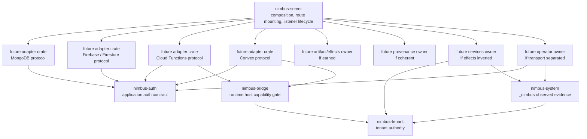
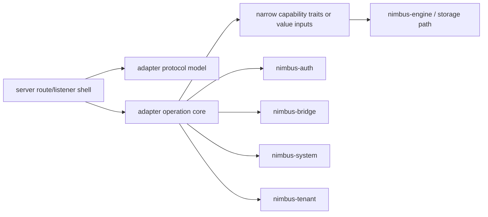

# Server Seam Extraction Readiness Plan

Status: completed
Owner: architecture / server hardening
Created: 2026-05-28

## Purpose

This plan continues the completed
`docs/plans/archive/nimbus-system-bridge-adapters-extraction-plan.md` work by making
the remaining `nimbus-server` seams extractable without creating decorative
crates.

This is a readiness plan, but readiness is active work. Each phase must remove
tractable server-private imports, introduce narrow capability seams, prove the
new boundary with tests, and then record whether extraction is now earned. It
does not move code into new crates until a candidate can be reviewed without
server-private authority leaking through it.

## Core Principle

Extract only after all of these are true:

- the candidate crate does not need `nimbus-server`,
- the candidate does not accept `AppState`, router, or listener lifecycle
  types,
- host effects are behind narrow traits,
- authority flows through `nimbus-tenant`, `nimbus-system`, `nimbus-bridge`,
  and `nimbus-auth`,
- tests prove the seam cannot bypass tenant isolation, runtime bridge
  admission, application auth, or `_nimbus` ownership.

The goal is enterprise-trust clarity: reviewers should be able to ask which
crate owns authority, which crate owns host effects, and which crate only wires
composition.

## Enterprise Seam Cleanup Doctrine

Every phase follows this workflow:

1. Classify the current owner and denied imports.
2. Replace server shims with canonical architecture crates when they already
   exist. Examples: use `nimbus-tenant` instead of `crate::tenant`,
   `nimbus-auth` instead of server-private neutral auth, `nimbus-system`
   instead of direct `_nimbus` helpers, and `nimbus-bridge` instead of runtime
   host internals.
3. Introduce narrow traits only where the candidate otherwise needs broad
   composition objects such as `AppState`, router state, system evidence
   writers, process runners, or service registries.
4. Keep effectful adapters honest: listener startup, route mounting, shutdown,
   process spawning, and persistence wiring stay in `nimbus-server` unless the
   target crate is explicitly classified as effectful and has tests for that
   effect boundary.
5. Add or preserve behavior tests plus at least one negative boundary/security
   test for seams that enforce tenant, auth, system evidence, runtime bridge, or
   operator authority.
6. Update the verifier in the same phase so the new boundary survives
   compaction and future edits.

A phase is not complete if it only describes a problem that can be cleaned up
locally. A keep decision is allowed only when the proof identifies a concrete
blocker, explains why solving it in the phase would blur ownership, and names
the next implementation move.

## Starting Point

The previous extraction wave completed these earned boundaries:

- `nimbus-system`: `_nimbus` identity, schema, records, and observed evidence
  writers.
- `nimbus-bridge`: runtime capability bridge and provider-neutral host-call
  helpers.
- `nimbus-auth`: neutral application-auth contracts and normalization.
- `nimbus-license`: license document, loading, snapshot, entitlement, and
  usage-limit logic.

The previous wave deliberately kept these server-owned areas:

- adapters,
- artifact verifier effects,
- runtime bundle provenance admission,
- local operator/admin security surfaces,
- service manager / service registry / sandbox service traits.

Those keep decisions were correct because the boundaries were not yet true.
This plan removes the blockers.

## Target Shape



The target is not necessarily all of these crates. The target is that every
extract/keep decision is backed by a narrow interface, dependency audit, and
behavior test.

## Adapter Seam Extraction Pattern

This plan exists to make adapter seams extractable. For each adapter phase,
the coding agent must separate the current server module into these ownership
lanes and record the result in the phase proof:

| Lane | Owner | Extraction rule |
| --- | --- | --- |
| Composition shell | `nimbus-server` | Route mounting, listener startup, global `AppState` access, shutdown, process supervision, and server lifecycle stay here. |
| Protocol model | Adapter candidate | Request/response structs, wire parsing, path validation, error mapping, and protocol tests should move or become movable first. |
| Operation core | Adapter candidate behind narrow capabilities | Protocol-to-engine/runtime/storage translation may move only after `AppState` is replaced by explicit capabilities or value inputs. |
| Authority/effects bridge | Existing architecture crates or server wiring | Tenant, auth, runtime, system evidence, process, and provenance effects route through `nimbus-tenant`, `nimbus-auth`, `nimbus-bridge`, `nimbus-system`, or a documented server-owned effect trait. |

The expected software pattern is:



For enterprise review, each adapter phase must make these statements true or
record the exact blocker:

- protocol code cannot mount routes, start listeners, or read global server
  state,
- operation code cannot infer tenant, auth, system, or runtime authority from
  raw strings when an admitted decision/projection exists,
- adapter code cannot write `_nimbus` evidence directly,
- runtime-backed adapter code cannot bypass `nimbus-bridge`,
- application-auth adapter code cannot bypass `nimbus-auth`,
- remaining server-owned code is limited to composition and host effects.

Each adapter phase leaves the candidate in one of three states:

- `ready`: a named subtree can be extracted with the recorded allowed
  dependencies and denied-import audit,
- `extracted`: the crate was created and the verifier proves it is
  server-free,
- `blocked`: the proof names the server-private import, explains the ownership
  reason it remains, and states the next narrow interface or code move needed.

## Non-Goals

- Do not extract an aggregate `nimbus-adapters` crate unless the adapter
  readiness phases prove it would not become a second server crate.
- Do not move HTTP listener lifecycle, global router mounting, or
  `RouterBuildConfig` out of `nimbus-server`.
- Do not let adapters own `_nimbus` persistence.
- Do not let adapters bypass `nimbus-bridge` for runtime host operations.
- Do not let adapters bypass `nimbus-auth` for application-auth contracts.
- Do not move tenant authority out of `nimbus-tenant`.
- Do not move process launching into pure artifact or provenance crates.
- Do not merge local operator/admin authority with tenant application auth.
- Do not split files or crates to reduce line count alone.

## Requirements

### REQ-SSE-001: Server Composition Boundary

`nimbus-server` remains the root that owns process startup, listener lifecycle,
route mounting, global state construction, and composition wiring.

Success criteria:

- Candidates do not accept `AppState`, `DeploymentState`, `Router`,
  `RouterBuildConfig`, or listener lifecycle types.
- Route mounting remains in `nimbus-server`.
- Extracted or readiness candidate APIs accept narrow capabilities or value
  inputs.

### REQ-SSE-002: Authority Routing

Every retained or extracted seam routes authority through the existing security
primitives.

Success criteria:

- Tenant/workload authority flows through `TenantIsolationDecision` or narrow
  projections from `nimbus-tenant`.
- `_nimbus` observed evidence flows through `nimbus-system` APIs or
  system-owned writer traits.
- Runtime host operations flow through `nimbus-bridge`.
- Application auth contracts flow through `nimbus-auth`.

### REQ-SSE-003: Effects Are Inverted

Host effects must not leak into pure model crates.

Success criteria:

- Process execution, filesystem writes, shutdown, route audit persistence, and
  system evidence writes are behind narrow traits before extraction.
- Pure candidate crates do not import `std::process::Command`, `axum`,
  `tonic`, router types, server state, or concrete storage providers unless a
  proof explicitly classifies that candidate as effectful.

### REQ-SSE-004: Adapter Readiness Is Per-Adapter

Adapters must be prepared in dependency-order and may extract separately.

Success criteria:

- MongoDB, Firebase/provider-family, Cloud Functions, and Convex each have
  their own proof section and forbidden-import audit.
- Each adapter records whether it is ready for per-adapter extraction,
  aggregate extraction, or keep-in-server.
- Each adapter proof names the composition shell, protocol model, operation
  core, authority/effects bridge, and remaining blockers.
- Extraction-ready adapter subtrees have verifier-enforced denials for
  `AppState`, server-local route/auth/system/runtime shims, and listener
  lifecycle imports.
- Listener lifecycle and route mounting stay in server even if protocol
  handlers become extractable.

### REQ-SSE-005: No Decorative Extraction

Every candidate must have a real owner before extraction.

Success criteria:

- Every candidate has allowed dependencies, denied dependencies, owning
  modules, tests, and verifier checks.
- If ownership is not real, the proof records a keep decision and the next
  required readiness move.
- The verifier enforces the keep/extract decision instead of relying on memory.

### REQ-SSE-006: Active Seam Cleanup

Readiness phases must improve the dependency graph, not merely audit it.

Success criteria:

- Each phase records at least one of: removed server-private import, new narrow
  capability trait, extracted pure value module, deleted obsolete shim, or a
  specific proof that no cleanup was necessary because the candidate already
  satisfies the denied-import audit.
- Any server-private import that remains is classified as composition,
  transport, host effect, or named blocker.
- Verifier checks are added for the cleaned seam or the recorded blocker.

### REQ-SSE-007: Verifiable Completion

The plan must be resumable after compaction and enforceable by script.

Success criteria:

- `scripts/verify-server-seam-extraction-readiness.sh` is added in SSE0 and
  grows with each phase.
- Each phase has a proof file under
  `docs/plans/proof/server-seam-extraction-readiness/`.
- Final closeout records verifier output, focused tests, pass counts, and
  remaining follow-up plans.
- `cargo check --workspace` passes at closeout.

## Candidate Dependency Rules

These are target rules. If implementation discovers a rule is wrong, update
the active proof first, then update this plan before moving code.

| Candidate | Allowed workspace dependencies | Denied dependencies |
| --- | --- | --- |
| MongoDB adapter | `nimbus-core`, `nimbus-engine` only for explicit service/query capability traits, `nimbus-auth` if app auth is used | `nimbus-server`, `AppState`, router/listener lifecycle, local-server auth, `_nimbus` writers, runtime host internals |
| Firebase/provider-family adapter | `nimbus-core`, `nimbus-engine` through narrow data/query capabilities, `nimbus-auth`, `nimbus-system` only through evidence writer traits if required | `nimbus-server`, `AppState`, router/listener lifecycle, `crate::system_tenant`, `crate::application_auth`, local-server auth |
| Cloud Functions adapter | `nimbus-core`, `nimbus-engine` through narrow capabilities, `nimbus-runtime`, `nimbus-bridge`, `nimbus-auth`, `nimbus-system` through evidence traits | `nimbus-server`, `AppState`, router/listener lifecycle, runtime host internals, process/provenance orchestration unless inverted |
| Convex adapter | `nimbus-core`, `nimbus-engine` through narrow capabilities, `nimbus-runtime`, `nimbus-bridge`, `nimbus-auth`, `nimbus-system` through evidence traits | `nimbus-server`, `AppState`, router/listener lifecycle, runtime host internals, `_nimbus` direct writes, local-server auth |
| Artifact effects | `nimbus-core`, `nimbus-tenant`, possibly `nimbus-runtime` for runtime bundle subject values | `nimbus-server` for pure contracts, tenant authority relocation, process launching in pure candidates |
| Provenance | `nimbus-core`, possibly `nimbus-tenant`, `nimbus-runtime`, and artifact contracts after ownership is proven | `nimbus-server`, adapter registries, process launching unless trait-inverted |
| Services | `nimbus-core`, `nimbus-sandbox`, `nimbus-tenant`, `nimbus-system` evidence traits, `nimbus-node` direct APIs | `nimbus-server`, router/listener lifecycle, `crate::local_enforcement`, `crate::system_tenant`, adapter modules |
| Operator | `nimbus-core`, `nimbus-auth`, `nimbus-system` audit/event traits if needed | `nimbus-server`, `AppState`, Axum middleware in pure model, routers, adapters, tenant workload execution |

## Control Plane Protocol

Coding agents running this plan must treat it as a control plane:

- On start or resume, read this plan, the phase ledger, the current phase
  proof file, and `git status --short` before editing.
- Work on the first `in_progress` phase. If none exists, start the first
  `pending` phase in the ledger.
- Keep at most one phase `in_progress`.
- Load only the active phase plus immediately relevant code, tests, and docs.
- Before editing code in a phase, update that phase proof with current
  blockers, intended moves, forbidden imports, and planned verification.
- Do not mark a phase `completed` unless all phase success criteria and all
  task-level checks in the verification matrix pass.
- Record every verification command with pass counts or exact output summary
  in the phase proof file.
- If compaction happens, resume from the first incomplete phase and its proof
  file.
- Do not skip a failed extraction by broadening another crate. Record a
  keep/extract decision and preserve the dependency rules.
- For every new crate, add at least one positive behavior test and one
  negative boundary test when the crate enforces security or authority.
- Before stopping, update this ledger and the active proof file.

Every phase proof must use this evidence shape before the phase can be marked
`completed`:

- status and current ledger position,
- current import graph and owner classification,
- target seam shape, including candidate modules and server-only modules,
- active cleanup performed in the phase,
- denied-import audit and verifier updates,
- positive behavior tests and negative security/boundary tests where the seam
  enforces authority,
- extraction decision: `ready`, `extracted`, or `blocked`,
- exact resume cursor for the next phase.

An audit-only proof is not sufficient unless the proof shows that the candidate
already satisfies the denied-import audit and no cleanup is needed.

Status values:

- `pending`: no implementation work has started.
- `in_progress`: implementation work has started and the proof file is active.
- `completed`: all task-level and phase-level success criteria are satisfied.
- `blocked`: the same blocker has prevented progress for at least three
  consecutive goal turns and requires user input or an external change.

## Phase Ledger

| Phase | Status | Proof file | Resume instruction |
| --- | --- | --- | --- |
| SSE0 Baseline seam audit and verifier skeleton | completed | `docs/plans/proof/server-seam-extraction-readiness/sse0-baseline-seam-audit.md` | Inventory retained server seams and add the verifier skeleton first. |
| SSE1A MongoDB adapter readiness | completed | `docs/plans/proof/server-seam-extraction-readiness/sse1a-mongodb-adapter-readiness.md` | Split MongoDB protocol handling from listener/server state assumptions. |
| SSE1B Firebase/provider-family adapter readiness | completed | `docs/plans/proof/server-seam-extraction-readiness/sse1b-firebase-provider-readiness.md` | Classify Firestore/provider-family helpers before moving Firebase code. |
| SSE1C Cloud Functions adapter readiness | completed | `docs/plans/proof/server-seam-extraction-readiness/sse1c-cloud-functions-readiness.md` | Separate generated-function protocol handling from runtime/provenance/server effects. |
| SSE1D Convex adapter readiness | completed | `docs/plans/proof/server-seam-extraction-readiness/sse1d-convex-adapter-readiness.md` | Prepare the largest adapter last, after bridge/auth/system interfaces are proven by smaller adapters. |
| SSE2 Artifact effects readiness | completed | `docs/plans/proof/server-seam-extraction-readiness/sse2-artifact-effects-readiness.md` | Separate pure artifact contracts from process-backed verifier execution. |
| SSE3 Provenance readiness | completed | `docs/plans/proof/server-seam-extraction-readiness/sse3-provenance-readiness.md` | Decide whether provenance is one model or remains split by owner. |
| SSE4 Services readiness | completed | `docs/plans/proof/server-seam-extraction-readiness/sse4-services-readiness.md` | Invert system evidence writes and remove server-local enforcement shims. |
| SSE5 Operator readiness | completed | `docs/plans/proof/server-seam-extraction-readiness/sse5-operator-readiness.md` | Split local admin/operator value logic from Axum middleware and server effects. |
| SSE6 Extraction decisions | completed | `docs/plans/proof/server-seam-extraction-readiness/sse6-extraction-decisions.md` | Record extract/keep decisions after all readiness phases. |
| SSE7 Final verifier closeout | completed | `docs/plans/proof/server-seam-extraction-readiness/sse7-verifier-closeout.md` | Run final verifier, focused tests, formatting, and workspace check. |

## Task Verification Matrix

Every task below must be checked off in its phase proof before that phase can
be marked `completed`.

| ID | Task | Required evidence |
| --- | --- | --- |
| SSE0.1 | Inventory retained server seams. | Proof has an owner table covering adapters, artifact effects, provenance/runtime bundle admission, operator/local admin, services/service registry, sandbox service traits, and composition-only modules. |
| SSE0.2 | Record import graph. | Proof records `rg` summaries for imports of `AppState`, `DeploymentState`, `router`, `local_server`, `system_tenant`, `runtime_host`, `service_registry`, `service_manager`, `sandbox`, `tenant`, `local_enforcement`, `application_auth`, and `artifact_verifier_effects`. |
| SSE0.3 | Add verifier skeleton. | `scripts/verify-server-seam-extraction-readiness.sh` exists, is executable, and checks plan/proof presence plus completed prior extraction verifier. |
| SSE0.4 | Establish denied-import patterns. | Proof lists forbidden imports for each candidate and the verifier checks at least the baseline patterns. |
| SSE0.5 | Preserve previous extraction gate. | `bash scripts/verify-server-system-bridge-adapters-extraction.sh` passes and is recorded. |
| SSE1A.1 | Audit MongoDB listener/protocol split. | Proof records which MongoDB files are listener/server composition versus protocol parsing/execution. |
| SSE1A.2 | Remove or isolate server-private assumptions. | MongoDB candidate code has no `AppState`, router, local-server, system-tenant, runtime-host, or `crate::tenant` imports; proof records whether `nimbus_engine::Service` is the explicit capability or a new trait is required. |
| SSE1A.3 | Preserve MongoDB auth/protocol behavior. | Focused MongoDB auth/wire/spec tests pass with counts recorded. |
| SSE1A.4 | Record extraction decision for MongoDB. | Proof says ready for per-adapter extraction, extracted, or blocked by a precise capability/interface gap, with denied dependency audit. |
| SSE1A.5 | Update verifier for MongoDB seam. | Verifier denies server-private imports in the MongoDB candidate subtree and checks focused test evidence. |
| SSE1B.1 | Audit provider-family helpers. | Proof decides whether `provider_family` and Firestore helpers are adapter-owned, core data-model owned, or server-owned. |
| SSE1B.2 | Isolate Firebase server state and auth. | REST/gRPC/listen candidate code consumes `nimbus-auth` or explicit auth traits, replaces `AppState` access with narrow Firestore capabilities where practical, and avoids server-private auth helpers. |
| SSE1B.3 | Preserve Firebase REST/gRPC/listen behavior. | Focused Firebase tests pass with counts recorded. |
| SSE1B.4 | Record extraction decision for Firebase/provider-family. | Proof records ready/extracted/blocked with forbidden import audit and named remaining composition effects. |
| SSE1B.5 | Update verifier for Firebase seam. | Verifier checks provider-family ownership, `AppState` removal where cleaned, denied server shims, and focused test evidence. |
| SSE1C.1 | Audit Cloud Functions runtime/provenance effects. | Proof separates protocol handling, generated bundle execution, runtime bridge use, and artifact/provenance effects. |
| SSE1C.2 | Route runtime calls through `nimbus-bridge`. | Candidate code has no server-private runtime-host imports and bridge use is recorded. |
| SSE1C.3 | Route app auth through `nimbus-auth`. | Candidate code has no server-private neutral auth imports. |
| SSE1C.4 | Preserve Cloud Functions behavior. | Focused Cloud Functions tests pass with counts recorded. |
| SSE1C.5 | Record extraction decision for Cloud Functions. | Proof records ready/extracted/blocked with denied dependency audit and named runtime/provenance/server effects. |
| SSE1C.6 | Update verifier for Cloud Functions seam. | Verifier denies `AppState`, server runtime-host, provider-family, system-tenant, and tenant-shim imports in cleaned candidate modules. |
| SSE1D.1 | Audit Convex adapter by sub-owner. | Proof classifies registry/loading, routes, handlers, host bridge, subscriptions, runtime-backed execution, scheduler, WebSocket, and tests. |
| SSE1D.2 | Replace broad server imports with narrow interfaces where practical. | Proof records removed imports or blockers for `AppState`, router, system tenant, local server, service registry, and execution internals. |
| SSE1D.3 | Preserve Convex runtime/host behavior. | Focused Convex runtime, auth, subscription, and deploy tests pass with counts recorded. |
| SSE1D.4 | Record extraction decision for Convex. | Proof records ready/extracted/blocked and whether an aggregate adapter crate remains rejected. |
| SSE1D.5 | Update verifier for Convex seam. | Verifier checks Convex proof status, denied runtime-host/system/auth bypasses, focused test evidence, and the aggregate-adapter decision. |
| SSE2.1 | Classify artifact contracts versus effects. | Proof lists tenant-owned contracts, server-owned process effects, and any shared candidate types. |
| SSE2.2 | Introduce verifier effect boundary if needed. | Process runner construction is isolated behind a narrow trait or proof records why it remains server-owned. |
| SSE2.3 | Keep fail-closed redaction. | Tests cover missing tool, timeout, failed signature, malformed output, and redaction. |
| SSE2.4 | Record artifact extraction decision. | Proof decides `nimbus-artifacts`, effectful server wiring, or blocked split-by-owner with next cleanup move. |
| SSE3.1 | Classify provenance models. | Proof separates tenant image provenance policy, runtime adapter manifest integrity, runtime bundle admission, and SLSA/SBOM verifier effects. |
| SSE3.2 | Deny or invert process execution. | Provenance candidate code has no direct process launching, or proof records an effect trait and tests. |
| SSE3.3 | Preserve provenance failure behavior. | Tests cover bad/missing provenance, checksum mismatch, unsafe paths, and wrong SLSA/SBOM evidence where relevant. |
| SSE3.4 | Record provenance extraction decision. | Proof decides `nimbus-provenance`, `nimbus-artifacts`, or blocked split-by-owner with next cleanup move. |
| SSE4.1 | Move sandbox/service traits to a neutral owner or prove server ownership. | Proof records final owner for `SandboxCatalog`, `SandboxServiceCatalog`, `SandboxServiceLaunch`, and `RuntimeServiceRegistry`. |
| SSE4.2 | Invert service evidence writes. | Service manager no longer imports server `system_tenant` shim, or proof records a narrow evidence-writer blocker. |
| SSE4.3 | Remove local enforcement shim usage. | Service candidate code imports `nimbus-node` directly or proof records blocker. |
| SSE4.4 | Preserve service behavior. | Tests cover start, stop, restart, denied grant, wrong tenant handle, runtime service lookup, and system evidence. |
| SSE4.5 | Record services extraction decision. | Proof decides `nimbus-services`, extracted neutral traits, or blocked with next evidence/enforcement cleanup move. |
| SSE5.1 | Split operator value logic from transport. | Proof classifies token file, session cookie, origin/route-family policy, middleware, UI bootstrap, deploy-admin gate, shutdown, and audit. |
| SSE5.2 | Keep operator auth separate from application auth. | Tests or proof show local admin/deploy admin authority does not flow through tenant application auth. |
| SSE5.3 | Invert audit/shutdown/system-event effects if needed. | Operator candidate code has no `AppState`, Axum middleware, router, or system-event direct writes unless kept in server. |
| SSE5.4 | Preserve operator behavior. | Tests cover invalid token, revoked session, stale rotation, bad origin, deploy-admin gating, and local-admin/application-auth separation. |
| SSE5.5 | Record operator extraction decision. | Proof decides `nimbus-operator`, extracted pure value logic, or blocked with next transport/effect cleanup move. |
| SSE6.1 | Decide per-adapter crates. | Proof records MongoDB, Firebase/provider-family, Cloud Functions, and Convex extract/keep decisions. |
| SSE6.2 | Decide artifact/provenance crates. | Proof records `nimbus-artifacts` and `nimbus-provenance` extract/keep decisions. |
| SSE6.3 | Decide services/operator crates. | Proof records `nimbus-services` and `nimbus-operator` extract/keep decisions. |
| SSE6.4 | Enforce no decorative extraction. | Any created crate has dependency audit, denied import audit, behavior tests, and verifier checks; any skipped crate has a blocker and next readiness move. |
| SSE7.1 | Complete final verifier. | Verifier checks every completed phase decision and passes. |
| SSE7.2 | Run focused tests. | Proof records focused tests for all changed seams with pass counts. |
| SSE7.3 | Run workspace verification. | `cargo fmt --all --check` and `cargo check --workspace` pass. |
| SSE7.4 | Update closeout. | Plan closeout records final decisions, commands, counts, retained modules, and follow-up plans. |

## Phase SSE0: Baseline Seam Audit And Verifier Skeleton

Goal: establish the current source/import graph and create the verifier before
readiness work starts.

Tasks:

- Inventory all retained server seams by owner.
- Record import graph and forbidden imports by candidate.
- Add `scripts/verify-server-seam-extraction-readiness.sh`.
- Have the verifier call or require the previous
  `verify-server-system-bridge-adapters-extraction.sh` gate.
- Record initial focused test set for adapters, artifacts, services, and
  operator surfaces.

Success criteria:

- Proof file has owner table, import summaries, and denied dependency table.
- Verifier exists, is executable, and checks plan/proof presence.
- Previous extraction verifier passes.
- Phase ledger marks only SSE0 completed when the proof and script are real.

## Phase SSE1A: MongoDB Adapter Readiness

Goal: prepare the smallest adapter surface first.

Tasks:

- Split listener/socket lifecycle from protocol parsing and command handling.
- Audit MongoDB auth, BSON bridge, wire protocol, connection state, and tests.
- Replace server shim imports with canonical crate imports.
- Decide whether direct `nimbus_engine::Service` is an intentional explicit
  capability or introduce a MongoDB command capability trait.
- Name the extraction-ready protocol/operation subtree and the server-only
  composition shell.
- Preserve MongoDB wire/spec tests.

Success criteria:

- Candidate protocol files do not need `AppState`, `RouterBuildConfig`,
  local-server middleware, `_nimbus`, runtime host, server auth helpers, or
  `crate::tenant`.
- Proof records either ready-for-extraction or a precise capability gap.
- Focused MongoDB tests pass.

## Phase SSE1B: Firebase And Provider-Family Readiness

Goal: separate Firebase/Firestore protocol handling from server composition and
classify shared provider-family helpers.

Tasks:

- Classify `provider_family` and Firestore helpers.
- Split REST/gRPC/listen request parsing from route mounting.
- Ensure application auth uses `nimbus-auth` or explicit auth traits.
- Replace broad `AppState` use with a narrow Firestore service capability where
  practical.
- Ensure system evidence, if any, routes through `nimbus-system` interfaces.
- Name the extraction-ready Firestore model/protocol/operation subtree and the
  remaining server-only HTTP/gRPC shell.

Success criteria:

- Candidate code has no server-private neutral auth imports.
- Candidate code has no direct `_nimbus` writer imports.
- Remaining `AppState` use is limited to route/service composition or recorded
  as a blocker with the exact capability that must replace it.
- Focused Firebase REST, gRPC, listen, and auth tests pass.
- Proof records extract/keep decision for Firebase/provider-family.

## Phase SSE1C: Cloud Functions Adapter Readiness

Goal: separate Cloud Functions protocol handling from runtime/provenance/server
effects.

Tasks:

- Classify callable HTTP, function HTTP, runtime API, generated bundle
  execution, Firestore admin bridge, registry, and tests.
- Ensure runtime calls go through `nimbus-bridge`.
- Ensure auth contracts come from `nimbus-auth`.
- Record artifact/provenance blockers for generated bundles.
- Replace broad runtime invocation state with a named runtime context or narrow
  runtime capability before marking any runtime-backed code ready.

Success criteria:

- Candidate code has no server-private runtime-host imports.
- Candidate code has no server-private neutral auth imports.
- Focused Cloud Functions tests pass.
- Proof records extract/keep decision for Cloud Functions.

## Phase SSE1D: Convex Adapter Readiness

Goal: prepare the largest adapter last, after smaller adapter seams have
proved the composition interfaces.

Tasks:

- Classify registry/loading, handlers, routes, HTTP actions, host bridge,
  subscriptions, WebSockets, runtime-backed execution, scheduler, deployment,
  and tests.
- Replace broad server-private imports with narrow interfaces where practical.
- Split Convex candidate code into protocol/handler/core/effect groups before
  choosing ready, extracted, or blocked.
- Move tractable tenant/auth/bridge/system imports to canonical crates rather
  than server shims.
- Leave route mounting, WebSocket listener lifecycle, deployment composition,
  and server process lifecycle in `nimbus-server`.
- Keep server route mounting and listener lifecycle in server.
- Preserve Convex runtime, auth, subscription, deployment, and host bridge
  behavior.

Success criteria:

- Proof records remaining server-private imports by sub-owner.
- Runtime host operations route through `nimbus-bridge`.
- Auth contracts route through `nimbus-auth`.
- `_nimbus` evidence routes through `nimbus-system`.
- Focused Convex tests pass.
- Proof records extract/keep decision for Convex and reaffirms or revises the
  aggregate adapter decision.

## Phase SSE2: Artifact Effects Readiness

Goal: separate pure artifact contracts from process-backed verifier effects.

Tasks:

- Keep tenant artifact authority in `nimbus-tenant`.
- Classify `ArtifactVerifierCommandBackend`, `ProcessArtifactVerifierCommandRunner`,
  Cosign, SLSA, and SBOM backends.
- Introduce or confirm a host-effect boundary for verifier runners.
- Move default verifier construction toward server/operator wiring if needed.
- Preserve fail-closed verifier output redaction.

Success criteria:

- Pure artifact/provenance candidates do not launch processes.
- Effectful process runner code is isolated or intentionally retained in
  server wiring.
- Missing tool, timeout, command failure, malformed output, and redaction tests
  pass.
- Proof records extract/keep decision for `nimbus-artifacts`.

## Phase SSE3: Provenance Readiness

Goal: make provenance ownership coherent before extraction.

Tasks:

- Separate tenant image provenance policy from runtime adapter manifest
  integrity.
- Separate runtime bundle provenance admission from process-backed
  verification.
- Decide whether SLSA/SBOM models belong in `nimbus-artifacts`,
  `nimbus-provenance`, or stay split by current owner.
- Preserve runtime manifest integrity checks.

Success criteria:

- SLSA/SBOM model ownership is explicit.
- Runtime manifest checks do not depend on `nimbus-server`.
- Process execution is denied or trait-inverted for any pure candidate.
- Tests prove bad/missing provenance fails closed.
- Proof records extract/keep decision for `nimbus-provenance`.

## Phase SSE4: Services Readiness

Goal: make service management extractable without dragging server composition.

Tasks:

- Decide owner for sandbox/service traits and runtime service registry.
- Replace direct `system_tenant` service evidence writes with a narrow writer
  trait or record blocker.
- Remove server-local `local_enforcement` shim usage from candidate service
  code.
- Keep HTTP service lifecycle routes in server.

Success criteria:

- Service manager candidate code no longer imports the server system shim, or
  proof records the exact evidence-writer blocker.
- Evidence writes remain observed-only.
- Runtime service lookup cannot bypass tenant service grants.
- Tests cover start, stop, restart, denied grant, wrong tenant handle, runtime
  lookup, and system evidence.
- Proof records extract/keep decision for `nimbus-services`.

## Phase SSE5: Operator Readiness

Goal: separate operator security model from server transport.

Tasks:

- Split token/session value logic from Axum middleware.
- Isolate route-family and origin policy from route mounting.
- Introduce audit/shutdown/system-event traits if extraction is still valuable.
- Keep actual route mounting and listener lifecycle in server.

Success criteria:

- Pure operator candidate code has no `AppState`, Axum middleware, router,
  adapter, or tenant workload execution imports.
- Local admin and deploy admin remain separate from application auth.
- Tests cover invalid token, revoked session, stale rotation, bad origin,
  deploy-admin gating, and application-auth separation.
- Proof records extract/keep decision for `nimbus-operator`.

## Phase SSE6: Extraction Decisions

Goal: record decisions after readiness, without forcing extraction.

Possible outcomes:

- Extract MongoDB, Firebase/provider-family, Cloud Functions, or Convex
  adapter crates only if the per-adapter dependency graph is clean.
- Extract `nimbus-artifacts` only if pure contracts and process effects are
  cleanly separated.
- Extract `nimbus-provenance` only if it has a single coherent owner.
- Extract `nimbus-services` only after evidence and enforcement seams are
  inverted.
- Extract `nimbus-operator` only after transport is separated from operator
  security.
- Keep any candidate in server when server composition remains the honest
  owner.

Success criteria:

- Every candidate has an extract/keep decision.
- Every extracted crate has behavior tests and denied dependency audits.
- Every kept candidate has blocker and next readiness move.
- The verifier enforces the decisions.

## Phase SSE7: Final Verifier Closeout

Goal: make completion enforceable after compaction events.

Tasks:

- Finish `scripts/verify-server-seam-extraction-readiness.sh`.
- Run the final verifier.
- Run focused tests named in proof files.
- Run `cargo fmt --all --check`.
- Run `cargo check --workspace`.
- Update this plan's closeout and the SSE7 proof file.

The verifier should check:

- completed proof files for every phase,
- no extracted crate depends on `nimbus-server`,
- no extracted crate imports server-private modules,
- adapters cannot bypass `nimbus-bridge`, `nimbus-auth`, or `nimbus-system`,
- artifact/provenance process effects are isolated or explicitly retained,
- service and operator effects are trait-inverted or explicitly retained,
- all extract/keep decisions are recorded,
- focused tests and `cargo check --workspace` pass.

Success criteria:

- Verifier passes.
- Focused tests pass with counts recorded.
- `cargo fmt --all --check` passes.
- `cargo check --workspace` passes.
- Closeout records final decisions and remaining follow-up plans.

## Completion Gates

This plan is complete only when:

- MongoDB, Firebase/provider-family, Cloud Functions, and Convex adapter
  readiness decisions are recorded.
- `nimbus-artifacts`, `nimbus-provenance`, `nimbus-services`, and
  `nimbus-operator` extract/keep decisions are recorded.
- Any extracted crate has no `nimbus-server` dependency and no server-private
  imports.
- Any kept candidate has a blocker and a precise next readiness move.
- Adapters cannot bypass `nimbus-bridge`, `nimbus-auth`, or `nimbus-system`.
- Service and operator effects are trait-inverted or intentionally retained in
  server with proof.
- The verifier passes.
- Focused tests, formatting, and workspace check pass.

## Closeout Template

Record the final result here before archiving:

- Final MongoDB adapter decision:
- Final Firebase/provider-family decision:
- Final Cloud Functions decision:
- Final Convex adapter decision:
- Final `nimbus-artifacts` decision:
- Final `nimbus-provenance` decision:
- Final `nimbus-services` decision:
- Final `nimbus-operator` decision:
- Extracted crates:
- Intentionally retained server-owned modules:
- Verifier output:
- Focused tests and pass counts:
- Formatting/workspace verification:
- Remaining follow-up plans:

## Goal Prompt

Use this prompt to run the plan:

```text
/goal Complete docs/plans/server-seam-extraction-readiness-plan.md end to end as an active enterprise seam-cleanup control plane, not an audit-only roadmap: execute SSE0 through SSE7 in order; keep exactly one ledger phase in_progress; keep every proof file current; maintain scripts/verify-server-seam-extraction-readiness.sh in the same phase as each cleanup; for MongoDB, Firebase/provider-family, Cloud Functions, and Convex, split server composition shells from protocol models, operation cores, and authority/effects bridges; remove tractable server-private imports; introduce narrow capabilities or canonical crate imports through nimbus-tenant, nimbus-auth, nimbus-bridge, and nimbus-system; prepare artifact effects, provenance, services, and operator seams with effect inversion; extract only where the proof shows true ownership, otherwise record blocked keep decisions with exact next moves; do not mark any phase completed without active cleanup evidence, denied-import verifier checks, focused behavior/security tests with pass counts, and a resume cursor; finish only after the final verifier, focused tests, cargo fmt --all --check, and cargo check --workspace pass with recorded evidence.
```
