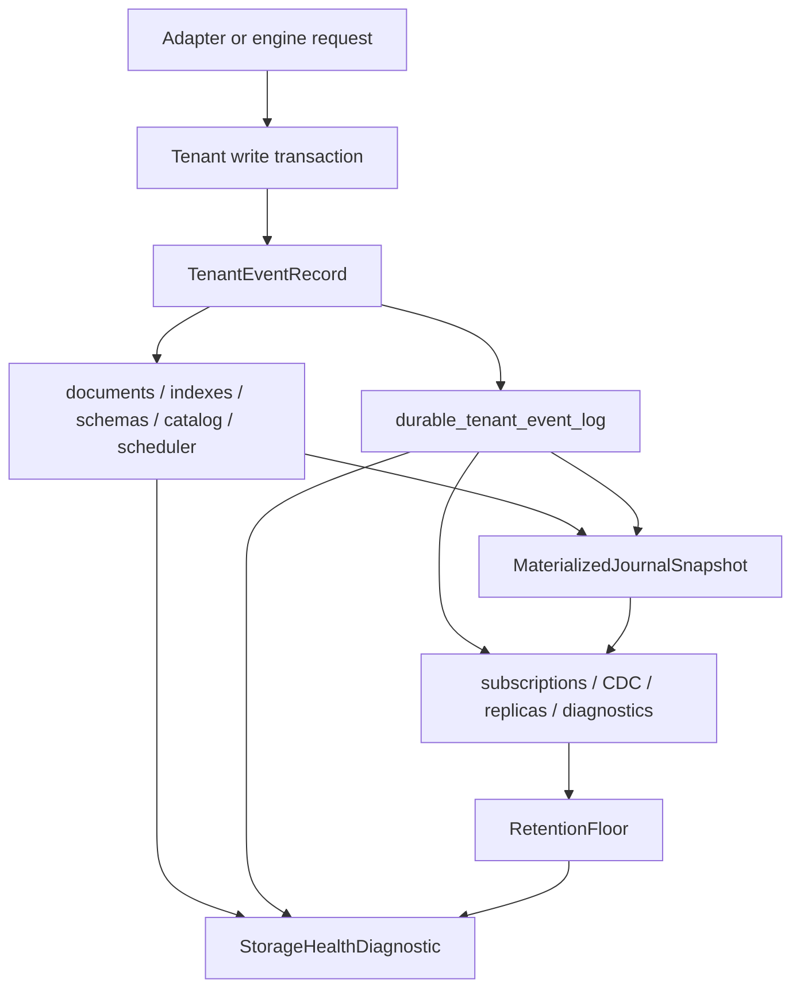

# Storage Architecture Trust Hardening Plan

This plan turns the storage architecture review into an execution plan for the
concrete gaps that should be fixed before Nimbus claims enterprise-grade
storage trust. It builds on the completed multi-backend and Convex-informed
storage baselines, but it is narrower than a full MVCC or distributed storage
rewrite.

## Status

- **Status:** `done`
- **Primary owner:** this plan
- **Verifier:** `bash scripts/verify-storage-architecture-trust-hardening.sh`
- **Prior baselines:**
  - `docs/plans/archive/multi-backend-adapter-hardening-plan.md`
  - `docs/plans/archive/convex-storage-trust-hardening-plan.md`
- **Current architecture docs:**
  - `docs/architecture/storage/persistence-engine-baseline.md`
  - `docs/architecture/storage/table-identity.md`
  - `docs/architecture/storage/consistency-routing.md`
  - `docs/architecture/storage/trait-segregation.md`

## Goal

Close the identified storage architecture gaps so an enterprise reviewer can
answer, from typed code, durable state, diagnostics, and cross-backend tests:

1. Which ordered tenant event caused every visible document, schema, index,
   table lifecycle, scheduler, and trigger-delivery state transition?
2. Can snapshot, replay, CDC, subscription invalidation, and diagnostics rebuild
   the same state after a crash without relying on out-of-band metadata?
3. Can destructive lifecycle operations prove they are safe relative to retained
   snapshots, transaction sessions, journal consumers, replicas, and retention
   floors?
4. What storage capabilities, consistency behavior, format version, freshness,
   encryption posture, and recovery status does each backend expose right now?
5. Do redb, SQLite, Postgres, MySQL, and libSQL pass the same generated storage
   contract, not only hand-written happy-path tests?

Success means these answers are observable and testable across every current
backend. The plan should make breaking changes cleanly because Nimbus is
pre-launch.

## Severity Map

| Severity | Gap | Target |
| --- | --- | --- |
| Critical | Durable history is document-centric while schema, table lifecycle, index lifecycle, and some control state can commit without a journal event. | Replace the document-only mutation journal with a durable tenant event journal covering every state transition that affects replay, diagnostics, or consumers. |
| High | Hard delete is immediate once a table is `deleting`. | Add retention floors and hard-delete gates for snapshots, transaction sessions, journal consumers, replicas, and materializers. |
| High | Read visibility is documented but not a first-class API boundary. | Introduce typed read visibility and serving snapshot boundaries without adopting MVCC in this plan. |
| High | Backend storage format versions are implicit in ad hoc table creation. | Add per-backend format/version metadata, startup validation, and fail-loud behavior for unknown versions. |
| Medium | Capabilities and health are split between traits, docs, and narrow diagnostics. | Add machine-readable `StorageCapabilities` and `StorageHealthDiagnostic` surfaces. |
| Medium | Cross-backend confidence comes mostly from named regression tests. | Add generated/metamorphic storage conformance over random histories and crash/replay points. |
| Medium | Table lifecycle state transitions are duplicated across backends. | Centralize pure lifecycle transition rules and prove every backend applies them. |
| Low | Operator docs and proof bundles do not yet present one storage-trust evidence path. | Add operating docs, proof files, debt rows, and verifier output for the whole plan. |
| Nice to have | Storage diagnostics can become richer without changing semantics. | Add table/index summary posture, retention lag, freshness lag, last recovery outcome, and backend layout evidence. |

## Reference Patterns

| Source | Pattern to adopt | Pattern to reject or defer |
| --- | --- | --- |
| Convex | Stable internal table identity, table lifecycle states, table/index-aware dependencies, explicit snapshot manager and write-log concepts. | Full Convex MVCC row retention in this plan. |
| CockroachDB | Explicit MVCC/read-as-of contracts, format/version gating, metamorphic storage tests. | Distributed MVCC, range tombstones, and cluster-version negotiation until Nimbus needs that product class. |
| TigerBeetle | Retention and compaction safety based on visibility to snapshots; deterministic storage equivalence checks. | Custom direct-I/O storage engine or consensus machinery. |
| ElectricSQL | Explicit snapshot plus log-offset protocols and storage capability callbacks for streaming consumers. | Shape-specific storage as the core Nimbus model. |
| ExtendDB | Table-name reuse paranoia, dual-target testing discipline, clear backend/runtime-hook split. | Per-table physical SQL tables as the default Nimbus document layout. |

## Boundary Decisions

- This plan does not implement full MVCC or arbitrary historical queries. It
  makes the current latest-row plus ordered-journal posture complete and
  observable.
- Public adapter APIs remain protocol-shaped. Storage can break internal
  durable record formats, trait shapes, and tests freely.
- The shared SQL `documents(table_id, id)` layout remains the default unless a
  measured backend-specific bottleneck proves otherwise.
- Lifecycle and schema/index metadata changes must be in the same durable
  transaction as their event-log append.
- No compatibility shims are required for old prelaunch durable records unless
  a current fixture still depends on them.

## Architecture Target

## Execution Plan

| Phase | Status | Goal | Verification |
| --- | --- | --- | --- |
| SATH0 | `done` | Create the plan proof bundle, technical-debt rows, and reusable verifier. Record the local architecture review and severity map with source references. | `docs/plans/proof/storage-architecture-trust-hardening/sath0-review.md` exists; `scripts/verify-storage-architecture-trust-hardening.sh` checks plan/doc/debt/proof wiring. |
| SATH1 | `done` | Replace the document-only durable mutation record with a typed tenant event journal. Events must cover document writes, schema changes, table lifecycle, index lifecycle, scheduler state that affects replay, trigger-delivery cursor state when required, and no-op barriers. | Core serialization tests prove event integrity hashes; all storage write transactions append an event for replay-affecting changes; direct schema/lifecycle commits no longer return `None` while changing durable state. |
| SATH2 | `done` | Update replay, snapshot, shadow materializer, embedded replica, and bootstrap code to consume tenant events rather than inferring metadata state from document writes. | Snapshot plus event-tail rebuild matches live state for document, schema, table lifecycle, index lifecycle, scheduler, and trigger-delivery cases across redb and SQLite. |
| SATH3 | `done` | Port Postgres, MySQL, and libSQL to the same event-journal contract with backend-owned SQL layout and atomic append/apply. | Provider tests prove every external backend persists and replays mixed document/schema/index/table-lifecycle histories with identical snapshot fingerprints. |
| SATH4 | `done` | Add retention floors and hard-delete gates. Track open transaction sessions, exported snapshots, journal stream cursors, embedded replicas, shadow materializers, and CDC/subscription consumers that pin state. | Hard delete is denied while any participant pins an older table identity or event sequence; GC succeeds only after the retention floor advances; crash recovery preserves floor state. |
| SATH5 | `done` | Add first-class read visibility APIs: `ReadVisibility`, `RequiredSequence`, `PinnedServingSnapshot`, and serving snapshot manager boundaries for current latest-row semantics. | Queries, point reads, subscriptions, and cache publication route through the typed visibility boundary; tests prove reads wait for required sequence and do not overlay journal-only records. |
| SATH6 | `done` | Add machine-readable backend capability and health diagnostics. Include layout, strong/eventual read support, journal support, retention floor, event-log head/applied head, format version, encryption posture, freshness lag, last recovery status, and exact-summary support. | Native operator/API tests assert DTO shape and backend-specific values for redb, SQLite, Postgres, MySQL, and libSQL. |
| SATH7 | `done` | Add per-backend storage format/version metadata and startup validation. Unknown future versions fail closed; missing versions are only accepted for fresh prelaunch stores or explicitly initialized test fixtures. | Focused tests prove fresh initialization, known-version reopen, unknown-version rejection, and format version visibility in diagnostics. |
| SATH8 | `done` | Centralize table lifecycle transition rules into a pure state machine used by backend implementations. Keep SQL dialect and storage writes backend-specific. | Shared transition tests cover active, hidden, deleting, activation, recreate, mark-deleting, hard-delete, and invalid duplicate-id cases; every backend conformance test consumes the same cases. |
| SATH9 | `done` | Add generated/metamorphic storage conformance. Random histories should include docs, schemas, indexes, lifecycle, scheduler dedup, snapshots, crash points, replay, retention, and diagnostics. | Required seed corpus passes for redb and SQLite in normal CI; external-provider seed corpus passes when fixtures are available; nightly corpus can be replayed by seed. |
| SATH10 | `done` | Add operator docs and evidence. Update persistence baseline, storage backends, diagnostics docs, and any adapter notes affected by the tenant event journal. | Docs validation passes; proof bundle records command output, test counts, and source-backed decisions. |
| SATH11 | `done` | Close the plan and prune obsolete surfaces. Remove stale document-only journal names, unused compatibility helpers, and duplicated lifecycle logic after all backends pass. | `bash scripts/verify-storage-architecture-trust-hardening.sh` passes; focused Rust tests, docs validation, `cargo fmt --all --check`, and `git diff --check` are recorded. |

## Completion Gate

The plan is complete only when the reusable verifier proves:

1. Plan, proof bundle, technical-debt rows, and verifier script exist.
2. Durable tenant events cover document, schema, table lifecycle, index
   lifecycle, replay-affecting scheduler state, and relevant trigger-delivery
   state.
3. Every replay-affecting write appends its event atomically with materialized
   storage changes.
4. Snapshot plus event-tail rebuild matches live state across redb, SQLite,
   Postgres, MySQL, and libSQL.
5. Hard delete is retention-gated and cannot race retained snapshots,
   transaction sessions, consumers, replicas, or materializers.
6. Read visibility routes through typed APIs and preserves the current
   latest-row, no-journal-overlay guarantee.
7. Storage capability and health diagnostics are implemented for every backend.
8. Storage format/version metadata exists and unknown future versions fail
   closed.
9. Table lifecycle transition rules are shared and backend conformance proves
   the shared state machine.
10. Generated/metamorphic storage histories pass required seeds and can replay
    failed seeds deterministically.
11. Operating docs and architecture docs describe the new event journal,
    retention, diagnostics, and format-version contracts.
12. Final verification output includes test counts and command results.

## Proof Bundle

`docs/plans/proof/storage-architecture-trust-hardening/`:

- `sath0-review.md` - source-backed architecture review and severity map.
- `sath1-tenant-event-journal.md` - event model and durable format proof.
- `sath2-replay-snapshot-materializer.md` - replay and snapshot proof.
- `sath3-external-backend-event-journal.md` - Postgres/MySQL/libSQL proof.
- `sath4-retention-hard-delete.md` - retention floor and hard-delete proof.
- `sath5-read-visibility.md` - read visibility boundary proof.
- `sath6-capabilities-health.md` - diagnostics and capability proof.
- `sath7-format-versioning.md` - format/version gate proof.
- `sath8-lifecycle-state-machine.md` - shared lifecycle transition proof.
- `sath9-generated-conformance.md` - generated storage history proof.
- `sath10-docs-operator-evidence.md` - docs and operator evidence.
- `sath11-closeout.md` - final verification and cleanup log.

## Follow-On

After this plan is closed, use
`docs/plans/storage-engine-quality-and-mvcc-plan.md` for MVCC, historical
queries, PITR, retention compaction, and deeper storage-engine quality work.
That follow-on plan must consume this plan's event journal, retention floors,
read visibility, diagnostics, and conformance harness instead of replacing
them.
