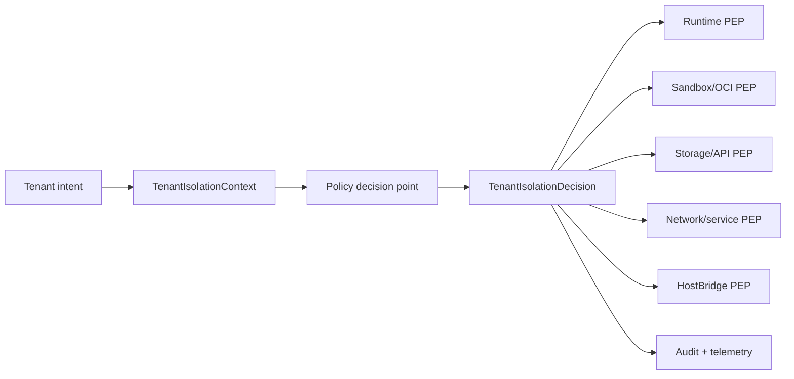

# Plan: Tenant Isolation Enterprise Hardening

Follow-on plan after
`docs/plans/archive/tenant-isolation-control-plane-plan.md`. The completed
baseline made tenant isolation explicit across runtime, microVM, storage,
network, HostBridge, volumes, images, secrets, quotas, cleanup, and system
metadata. This completed plan made that foundation enterprise-grade:
auditable, policy-driven, externally reviewable, and easier to extend without
reopening isolation seams.

Prior-art research lives at
`docs/plans/research/tenant-isolation-enterprise-hardening-prior-art.md`.

---

## Status

- **Status:** `done` (closed 2026-05-22; archived alongside this revision)
- **Activated:** 2026-05-22
- **Primary owner:** this plan
- **Current posture docs:**
  - `docs/tenant-isolation.md`
  - `docs/operating/tenant-isolation.md`
- **Parent baseline:**
  - `docs/plans/archive/tenant-isolation-control-plane-plan.md`
- **Sibling references:**
  - `docs/plans/security/sandbox-isolation-audit.md`
  - `docs/architecture/sandbox/microvm-service-baseline.md`
  - `docs/architecture/runtime/permission-model.md`
  - `docs/architecture/storage/provider-topologies.md`
  - `docs/plans/secret-management-plan.md`
  - `docs/plans/archive/execution-isolation-and-runtime-backends-plan.md`

## Goal

Make Nimbus's tenant-isolation story independently inspectable and robust
enough for enterprise review by introducing explicit policy-decision records,
durable conformance tests, drift/audit reporting, hard quota enforcement
proofs, workload identity shape, image provenance policy, and observability
contracts.

This plan does not replace the completed tenant-isolation control plane. It
hardens the seams it created.

## Control Plan Rules

The source of truth is:

1. the current git worktree
2. this plan's `Phase Ledger`, `Implementation Checkpoints`, and `Execution
   Log`
3. `docs/plans/research/tenant-isolation-enterprise-hardening-prior-art.md`
4. `docs/plans/archive/tenant-isolation-control-plane-plan.md`
5. the current architecture docs listed above

Do not rely on chat transcripts as progress state.

### Status Model

- `todo`: not started; eligible when dependencies are satisfied
- `in_progress`: actively being implemented; keep exactly one phase in this
  state per autonomous execution run
- `blocked`: cannot proceed until the recorded blocker is resolved
- `done`: acceptance criteria are met and verification has been recorded
- `deferred`: parked behind another product or platform gate

### Recovery Loop

1. Read this plan, the prior-art research doc, and the archived tenant
   isolation baseline.
2. Inspect `git status --short` and reconcile dirty files with this plan
   before changing code.
3. Resume any `in_progress` phase before starting another phase.
4. Implement one phase at a time unless the plan is explicitly updated.
5. Record exact verification commands and results before marking a phase
   `done`.
6. Preserve unrelated user changes.

## Architecture Direction

The next stable seam should be a typed decision envelope:

```text
TenantIsolationContext  ->  TenantIsolationDecision  ->  enforcement seams
```

`TenantIsolationContext` remains the server-owned request/workload authority.
`TenantIsolationDecision` is the immutable output of admission. Enforcement
points should consume the decision instead of recomputing or open-coding
tenant, policy, quota, image, mount, network, or runtime grant state.



This mirrors the common pattern in Kubernetes admission, OPA Gatekeeper,
Vault policy/token issuance, and sandbox launchers such as Firecracker's
jailer: decide once at the boundary, enforce everywhere that intent becomes
host authority.

## Success Criteria

This plan is complete when:

1. A durable research record maps at least Kubernetes, Gatekeeper,
   Firecracker, Kata, gVisor, SPIFFE/SPIRE, Vault, Sigstore/SLSA, and
   OpenTelemetry patterns to concrete Nimbus follow-up decisions.
2. Nimbus has a typed admission decision artifact or equivalent whose fields
   cover tenant, authority, deployment/workload identity, runtime policy,
   service grants, network endpoints, storage namespace, volume/image/secret
   policy, quota reservations, audit redactions, and decision ID.
3. Runtime, sandbox, storage/API, network/service, and HostBridge enforcement
   seams consume the decision record rather than independent ad hoc pieces
   where practical.
4. The two-tenant harness is promoted into a reusable conformance suite with
   scenario fixtures and a single verification command.
5. A drift/audit scanner can detect tenant-isolation state that violates the
   current policy contract.
6. At least one Linux path proves hard resource enforcement below launch
   reservation for CPU/memory/process/file/log/disk or records a precise
   platform blocker.
7. The plan records a workload identity model compatible with future
   SPIFFE-style identities and the deferred secret-management plan.
8. Production image admission has a concrete provenance/signature policy
   design and at least one verifiable proof path, or records a narrow
   implementation blocker.
9. Admission decisions, rejections, materialization, cleanup, and drift
   reports have an observability/audit schema with redaction rules.
10. Focused tests plus `cargo fmt --all --check`, a relevant clippy lane, and
    a relevant conformance command are recorded with counts/results.

## Phase Ledger

| Phase | Status | Goal | Verification |
| --- | --- | --- | --- |
| EIH0 | `done` | Prior-art and codebase research. | Research doc records primary/code-source evidence, Nimbus decisions, rejected options, and follow-up code-reading targets. |
| EIH1 | `done` | Define `TenantIsolationDecision` or equivalent typed admission artifact. | `cargo test -p nimbus-server tenant_isolation -- --nocapture`, `cargo test -p nimbus-server runtime_execution_admission -- --nocapture`, `cargo fmt --all --check`, and `cargo clippy -p nimbus-server --all-targets` passed. |
| EIH2 | `done` | Separate policy decision point from policy enforcement points. | Runtime, sandbox, storage/API, service lookup, and HostBridge seams consume the decision in focused tests. |
| EIH3 | `done` | Promote TIC8 into tenant-isolation conformance suite. | `make verify-tenant-isolation-conformance` passed with 21 server scenarios (12 allowed, 9 denied) plus 4 production image-admission tests. |
| EIH4 | `done` | Add drift/audit scanner for existing state. | `cargo test -p nimbus-server tenant_isolation_drift -- --nocapture` passed with clean and malformed-state fixtures. |
| EIH5 | `done` | Prove hard quota enforcement below launch reservation. | `scripts/prove-linux-cgroup-memory-limit.sh` passed on minicloud: cgroup v2 reported `oom 1` and `oom_kill 1` under `memory.max=33554432` with swap disabled. |
| EIH6 | `done` | Define workload identity shape. | `TenantWorkloadStableIdentity` renders stable Nimbus and SPIFFE-style IDs, includes node/machine location in the decision fingerprint, and is documented as the future secret-provider auth subject. |
| EIH7 | `done` | Define image provenance/signature admission. | `TenantImageVerificationProvider` admits digest-pinned images and tests tag-only, unsigned, wrong signature identity, wrong provenance builder, SBOM, and local-build rejection paths. |
| EIH8 | `done` | Add audit/observability contract. | `TenantIsolationEvent` covers admission, rejection, materialization, runtime, sandbox, storage, HostBridge, cleanup, and drift events with schema-level redaction tests. |
| EIH9 | `done` | Enterprise readiness closeout. | `docs/tenant-isolation.md` and `docs/operating/tenant-isolation.md` publish threat model, isolation matrix, residual risks, review targets, and runbook references; this plan is archived. |

## Phase Details

### EIH0: Prior-Art And Codebase Research

Acceptance criteria:

- Research doc records durable findings from primary sources and codebase
  reading targets.
- Research explicitly separates already-landed Nimbus behavior from future
  hardening.
- Research maps each external pattern to a concrete Nimbus decision or
  rejection.
- At least one future implementation phase cites each major source family:
  Kubernetes/Gatekeeper, Firecracker/Kata/gVisor, SPIFFE/Vault, Sigstore/SLSA,
  and OpenTelemetry.

### EIH1: Typed Admission Decision

Acceptance criteria:

- Add a typed `TenantIsolationDecision` or equivalent with a stable decision
  ID.
- Decision construction consumes `TenantIsolationContext` plus admitted
  policy inputs.
- Decision fields are read-only after construction.
- Decision serialization/redaction shape exists for audit/telemetry.
- Tests prove tenant, deployment, service/runtime identity, and authority
  cannot be widened after admission.

### EIH2: PDP/PEP Separation

Acceptance criteria:

- Policy-decision code is owned in one module instead of scattered across
  leaf materializers.
- Runtime invocation admission consumes the decision.
- Sandbox service launch consumes the decision.
- Storage/API tenant access consumes the decision or a narrow projection of
  it.
- HostBridge operations consume decision-derived grants.
- Tests prove a forged tenant/path/service cannot bypass by targeting a lower
  enforcement seam directly.

### EIH3: Tenant Isolation Conformance Suite

Acceptance criteria:

- Move the TIC8 harness into a reusable suite with named scenarios.
- Include allowed and denied fixtures for path/header tenant swaps, bearer
  tenant claim swaps, mismatched service handles, same service name across
  tenants, same named volume across tenants, generic localhost grants,
  `_nimbus` access, production image admission, and tenant cleanup.
- Add one command or script that runs the suite and prints scenario counts.
- Document the suite as the gate for future runtime/sandbox/storage changes.

### EIH4: Drift/Audit Scanner

Acceptance criteria:

- Read-only scanner reports tenant-isolation drift in existing state.
- Scanner covers sandbox manifests, service handles, system port records,
  volume roots, route metadata, and admission decision/audit presence.
- Tests inject bad state and assert precise violation messages.
- Scanner does not delete or repair state unless a future remediation plan
  explicitly adds that behavior.

### EIH5: Hard Quota Enforcement

Acceptance criteria:

- Identify the platform-specific hard quota mechanism for Linux service
  sandboxes: cgroup v2, project quotas, quota-backed disks, file-size limits,
  or a documented combination.
- Implement or prove at least one hard enforcement path beyond launch
  reservation.
- Tests or minicloud proof demonstrate the limit firing and the operator error
  surface.
- Any unsupported platform path records a precise blocker and fallback.

### EIH6: Workload Identity Shape

Acceptance criteria:

- Define a stable workload identity string/schema.
- Identity includes tenant, deployment generation, service/function,
  runtime tier/backend, node/machine, and sandbox/invocation where applicable.
- Identity can be mapped to future SPIFFE-style IDs without breaking the
  current runtime/HostBridge API.
- Secret-management plan references this identity as the future provider-auth
  input.

### EIH7: Image Provenance And Signature Admission

Acceptance criteria:

- Define production image policy inputs: allowed registries, digest required,
  signature required, issuer/subject/build identity, attestation predicates,
  SBOM requirement, and local-build behavior.
- Add a provider seam for signature/provenance verification.
- Tests cover digest-only allowed floor, tag-only rejection, unsigned image
  rejection, wrong identity rejection, and local-build rejection without
  operator policy.
- Record whether Sigstore/Cosign is used directly or behind an adapter.

### EIH8: Audit And Observability Contract

Acceptance criteria:

- Define structured events for admission, rejection, materialization,
  runtime invocation, sandbox launch, storage access, HostBridge operation,
  cleanup, and drift violation.
- Every event has decision ID, tenant ID, surface, principal class,
  workload/service/function, runtime tier, sandbox/invocation ID where
  relevant, result, reason code, and correlation IDs.
- Sensitive values are redacted by schema, not by caller memory.
- Tests prove rejection and cleanup events are emitted without leaking secret
  values or bearer claims.

### EIH9: Enterprise Readiness Closeout

Acceptance criteria:

- Publish a customer-facing threat model or architecture note.
- Publish an isolation matrix with claims, enforcing layer, test evidence, and
  residual risks.
- Publish an operator runbook for debugging rejected admission decisions and
  tenant drift findings.
- Record external security review targets and open residual risks.
- Archive this plan when all phases are complete.

## Implementation Checkpoints

### 2026-05-22 EIH0 Research Plan Started

Completed in this checkpoint:

- Added the prior-art research note at
  `docs/plans/research/tenant-isolation-enterprise-hardening-prior-art.md`.
- Created this follow-on plan with phases for admission decision records,
  PDP/PEP separation, conformance, drift scanning, hard quotas, workload
  identity, image provenance, audit/observability, and enterprise readiness.
- Routed the plan from the completed tenant-isolation baseline instead of
  reopening the archived control-plane plan.

Verification evidence:

- `git diff --check`
  - result: pass.
- `rg -n "tenant-isolation-enterprise-hardening|tenant-isolation-control-plane" docs/plans/README.md docs/plans/tenant-isolation-enterprise-hardening-plan.md docs/plans/research/tenant-isolation-enterprise-hardening-prior-art.md`
  - result: pass; plan index, follow-on plan, research note, and archived
    baseline references are linked.

### 2026-05-22 EIH0 Primary/Code-Source Closure

Completed in this checkpoint:

- Expanded the prior-art research note with a source-by-source evidence table
  covering Kubernetes multi-tenancy/admission/quota, OPA Gatekeeper policy
  fixtures and audit, Firecracker jailer/seccomp, Kata's OCI/VM architecture,
  gVisor security/resource model, SPIFFE/SPIRE registration and selectors,
  Vault leases/audit redaction, Sigstore/Cosign/SLSA provenance, and
  OpenTelemetry logs/semantic conventions.
- Added the Nimbus decision/rejection ledger required before implementation:
  typed decision artifact first, PDP/PEP separation, conformance suite,
  read-only drift scanner, Linux hard quota proof, stable workload identity,
  image-verification provider seam, and structured redacted audit events.
- Renamed the remaining research list to follow-up implementation reading so
  EIH0 can close while later phases still read code at the seam they modify.

Verification evidence:

- `git diff --check`
  - result: pass.
- `rg -n "Primary And Code-Source|Nimbus Decisions And Rejections|EIH0 |tenant-isolation-enterprise-hardening" docs/plans/tenant-isolation-enterprise-hardening-plan.md docs/plans/research/tenant-isolation-enterprise-hardening-prior-art.md docs/plans/README.md`
  - result: pass; source-evidence section, decision/rejection ledger,
    EIH0 ledger row, plan index, and follow-up reading note are present.

### 2026-05-22 EIH1 Typed Decision Artifact

Completed in this checkpoint:

- Added `TenantIsolationDecision` and stable `TenantIsolationDecisionId`
  construction from a deterministic fingerprint of tenant, surface,
  authority projection, deployment generation, workload identity, runtime
  policy, service grants, network endpoints, storage namespace, volume/image/
  secret policy, quotas, and audit redaction policy.
- Added typed policy projections for runtime admission, service grants,
  network endpoints, storage namespace, named volumes, digest-pinned image
  policy, secret handles, quota reservations, workload identity, and
  audit-redaction metadata.
- Added an audit-safe `TenantIsolationAuditRecord` projection that carries
  decision ID and policy shape while redacting principal claims, bearer
  claims, raw credentials, and secret handles by schema.
- Routed `RuntimeExecutionAdmission::for_policy` through the decision artifact
  so at least one enforcement seam now consumes the typed snapshot instead of
  recomputing the runtime policy admission result directly.
- Re-exported `RuntimeTenantBudget` from `nimbus-runtime` because the server
  decision artifact records the existing public runtime budget type.

Verification evidence:

- `cargo test -p nimbus-server tenant_isolation -- --nocapture`
  - result: pass; 20 passed, 0 failed, 0 ignored, 723 filtered out. Includes
    new stable-ID, audit-redaction, immutable-snapshot, tenant/deployment
    binding, and mismatched-application-claim tests, plus the TIC8 harness.
- `cargo test -p nimbus-server runtime_execution_admission -- --nocapture`
  - result: pass; 2 passed, 0 failed, 0 ignored, 741 filtered out.
- `cargo fmt --all --check`
  - result: pass.
- `cargo clippy -p nimbus-server --all-targets`
  - result: pass; finished dev profile in 26.03s.

Dirty-worktree caveat:

- Unrelated generated Convex files, `package-lock.json`,
  `docs/architecture/horizontal-scaling.md`, desktop-auth proof images, and
  other untracked plan/research docs were already present and intentionally
  left untouched.

### 2026-05-22 EIH2 PDP/PEP Separation

Completed in this checkpoint:

- Added narrow decision-derived access projections for tenant storage and
  tenant services, including decision ID, tenant binding, service/namespace
  binding, and lower-seam validation helpers for runtime bundle and sandbox
  launch checks.
- Moved runtime invocation admission for Convex and Cloud Functions from the
  raw context/policy pair to a single admitted `TenantIsolationDecision`; the
  runtime gate now consumes `RuntimeExecutionAdmission::for_decision`.
- Changed Convex `HostBridge` scopes to carry the admitted decision and
  decision-derived storage access. `ctx.services.get(...)` now requires a
  decision-derived service grant before touching the runtime service registry.
- Changed generic runtime host storage operations to consume
  `TenantStorageAccessDecision` rather than raw tenant IDs at the storage/API
  capability seam.
- Changed sandbox service activation to create and consume a service
  activation decision before catalog materialization or backend launch, with
  tests proving an unadmitted service name fails before the backend is called.
- Removed the product-path `TenantServiceIsolationContext` helper because
  sandbox service launch enforcement now flows through
  `TenantServiceAccessDecision`.

Verification evidence:

- `cargo check -p nimbus-server`
  - result: pass; finished dev profile in 11.56s.
- `cargo test -p nimbus-server tenant_isolation -- --nocapture`
  - result: pass; 23 passed, 0 failed, 0 ignored, 725 filtered out.
- `cargo test -p nimbus-server service_manager -- --nocapture`
  - result: pass; 9 passed, 0 failed, 0 ignored, 739 filtered out.
- `cargo test -p nimbus-server runtime_execution_admission -- --nocapture`
  - result: pass; 2 passed, 0 failed, 0 ignored, 746 filtered out.
- `cargo test -p nimbus-server host_bridge_service_lookup_rejects_service_missing_from_decision_grants -- --nocapture`
  - result: pass; 1 passed, 0 failed, 0 ignored, 747 filtered out.
- `cargo test -p nimbus-server convex_runtime_query_resolves_missing_service_bindings_via_services_get -- --nocapture`
  - result: pass; 1 passed, 0 failed, 0 ignored, 747 filtered out.
- `cargo fmt --all --check`
  - result: pass.
- `cargo clippy -p nimbus-server --all-targets`
  - result: pass; finished dev profile in 1.34s after the final test/doc
    checkpoint.
- `git diff --check`
  - result: pass.

Dirty-worktree caveat:

- Unrelated generated Convex files, `package-lock.json`,
  `docs/architecture/horizontal-scaling.md`, desktop-auth proof images, and
  other untracked plan/research docs remain present and intentionally
  untouched.

### 2026-05-22 EIH3 Tenant Isolation Conformance Gate

Completed in this checkpoint:

- Promoted the TIC8 two-tenant harness into
  `tenant_isolation_conformance_suite_covers_runtime_services_storage_and_system_control`
  with a reusable `TenantIsolationConformanceReport`.
- Added named allowed/denied scenario evidence for native tenant path/operator
  admission, tenant bearer claim swaps, service-grant denial, generic
  localhost denial, same service name across tenants, distinct sandbox
  handles, same named volume across tenants, `_nimbus` application denial and
  operator access, digest-pinned service image launch, and tenant cleanup.
- Extended the harness sandbox record to preserve the admitted image reference
  so the conformance suite can prove the production image digest floor in the
  server path.
- Added `scripts/verify-tenant-isolation-conformance.sh` and the
  `make verify-tenant-isolation-conformance` target. The command runs the
  server conformance scenario report and production Compose image-admission
  fixtures in one gate.
- Documented the conformance gate in
  `docs/architecture/testing/verification-architecture.md` as the check to run
  for runtime, sandbox, storage, HostBridge, service lookup, and production
  image-admission changes that could widen tenant authority.

Verification evidence:

- `bash -n scripts/verify-tenant-isolation-conformance.sh`
  - result: pass.
- `make verify-tenant-isolation-conformance`
  - initial sandboxed result: blocked by local listener bind
    `PermissionDenied` in the Mac execution sandbox.
  - approved rerun result: pass.
  - server conformance result: 1 passed, 0 failed, 0 ignored, 747 filtered
    out; report printed 21 scenarios, 12 allowed, 9 denied.
  - production image-admission result: 4 passed, 0 failed, 0 ignored, 523
    filtered out.
- `cargo fmt --all --check`
  - result: pass.
- `cargo clippy -p nimbus-server --all-targets`
  - result: pass; finished dev profile in 16.46s.
- `git diff --check`
  - result: pass.

Dirty-worktree caveat:

- Unrelated generated Convex files, `package-lock.json`,
  `docs/architecture/horizontal-scaling.md`, desktop-auth proof images, and
  other untracked plan/research docs remain present and intentionally
  untouched.

### 2026-05-22 EIH4 Read-Only Drift/Audit Scanner

Completed in this checkpoint:

- Added `tenant_isolation_drift` as the server-owned read-only scanner for
  tenant-isolation state.
- The scanner correlates sandbox manifest roots, tenant volume roots,
  `_nimbus.services`, `_nimbus.ports`, and `_nimbus.routes` without repairing
  or deleting state.
- Sandbox checks report malformed manifests, tenant/path/handle mismatches,
  duplicate active service manifests, duplicate sandbox IDs, invalid mounts,
  missing tenant volume roots, and non-loopback host-port bindings.
- System-state checks report malformed or orphaned service handles and port
  records, manifest/service/port mismatches, route metadata drift, unexpected
  route documents, and optional missing tenant-isolation decision/audit
  anchors for active service handles.
- Tests prove a clean service projection stays clean, and injected malformed
  manifests, handles, ports, volume roots, route metadata, and missing
  decision/audit anchors are reported without mutating the bad state.

Verification evidence:

- `cargo test -p nimbus-server tenant_isolation_drift -- --nocapture`
  - result: pass; 2 passed, 0 failed, 0 ignored, 748 filtered out.
- `cargo fmt --all --check`
  - result: pass.
- `cargo clippy -p nimbus-server --all-targets`
  - result: pass; finished dev profile in 8.15s.
- `git diff --check`
  - result: pass.

Dirty-worktree caveat:

- Unrelated generated Convex files, `package-lock.json`,
  `docs/architecture/horizontal-scaling.md`, desktop-auth proof images, and
  other untracked plan/research docs remain present and intentionally
  untouched.

### 2026-05-22 EIH5 Hard Quota Enforcement Proof

Completed in this checkpoint:

- Added `scripts/prove-linux-cgroup-memory-limit.sh`, a Linux cgroup v2 proof
  helper that creates a temporary cgroup, sets `memory.max`, disables cgroup
  swap where supported, runs a child allocator inside the cgroup, and reports
  `memory.events` plus the child exit status.
- Added the `make prove-linux-cgroup-memory-limit` convenience target and
  included the proof script in `proof-helpers` syntax checks.
- Recorded minicloud proof evidence in
  `docs/plans/proof/tenant-isolation-enterprise-hardening/eih5-minicloud-cgroup-memory.md`.
- Confirmed the product shape: Nimbus reservation/quota admission remains in
  `oci/resource_quota.rs`, while hard enforcement is lowered into cgroup/OCI,
  conmon, and libkrun-facing launch artifacts at the sandbox seam.
- Fixed three sandbox test-helper clippy findings that blocked the focused
  `nimbus-sandbox` clippy lane.

Verification evidence:

- `bash -n scripts/prove-linux-cgroup-memory-limit.sh`
  - result: pass.
- `ssh nimbus@192.168.4.29 'bash -s' < scripts/prove-linux-cgroup-memory-limit.sh`
  - result: pass on Debian 13 minicloud.
  - evidence: `memory.max=33554432`, `memory.high=max`,
    `memory.swap.max=0`, allocator `allocation_exit_status=137`,
    `memory.events.after` recorded `oom 1` and `oom_kill 1`,
    `result=pass`, `reason=cgroup-v2-memory-limit-fired`.
- `cargo test -p nimbus-sandbox resource -- --nocapture`
  - result: pass; 5 passed, 0 failed, 0 ignored, 108 filtered out.
- `cargo test -p nimbus-sandbox conmon_launch_plan_injects_mount_prelude_for_image_backed_sandboxes -- --nocapture`
  - result: pass; 1 passed, 0 failed, 0 ignored, 112 filtered out.
- `cargo fmt --all --check`
  - result: pass.
- `cargo clippy -p nimbus-sandbox --all-targets`
  - result: pass; finished dev profile in 2.69s after the clippy helper
    cleanups.
- `git diff --check`
  - result: pass.
- `ssh nimbus@192.168.4.29 'find /sys/fs/cgroup -maxdepth 1 -type d -name "nimbus-eih5-memory-*" -print'`
  - result: pass; no temporary proof cgroups remained.

Verification caveat:

- `make proof-helpers` was attempted after adding the proof script syntax
  check. It passed the new `bash -n scripts/prove-linux-cgroup-memory-limit.sh`
  line and earlier helper checks, then failed in the existing Homebrew cask
  proof helper at `assert.guest_proof_health` because the fake guest machine
  API health capture returned curl status 7. That failure is unrelated to
  EIH5 and was not repaired in this checkpoint.

Dirty-worktree caveat:

- Unrelated generated Convex files, `package-lock.json`,
  `docs/architecture/horizontal-scaling.md`, desktop-auth proof images, and
  other untracked plan/research docs remain present and intentionally
  untouched.

### 2026-05-22 EIH6 Workload Identity Shape

Completed in this checkpoint:

- Added `TenantWorkloadStableIdentity` as a projection from an admitted
  `TenantIsolationDecision`.
- The identity schema renders stable Nimbus IDs as
  `nimbus-workload:v1/...` and SPIFFE-style paths as
  `/nimbus/workload/v1/...`, with full `spiffe://<trust-domain>/...`
  rendering behind trust-domain validation.
- The schema includes tenant ID, deployment generation, admission surface,
  workload kind/name, runtime tier, runtime backend, sandbox backend,
  node/machine location, sandbox ID, and invocation ID. Non-applicable fields
  render as `none`.
- Added `TenantWorkloadLocation` on `TenantIsolationContext`; node/machine
  location now participates in the immutable decision fingerprint and is
  preserved across `reauthorize_application(...)`.
- Added `workload_stable_id` to `TenantIsolationAuditRecord` so audit and
  future provider-auth paths use the same canonical subject string.
- Documented the contract in
  `docs/architecture/server/auth-runtime-trust.md`, including the rule that
  future secret-management and service-identity providers must use the stable
  workload identity rather than raw tenant strings, bearer claims, or local
  runtime context.

Verification evidence:

- `cargo test -p nimbus-server tenant_workload_stable_identity -- --nocapture`
  - result: pass; 3 passed, 0 failed, 0 ignored, 750 filtered out.
- `cargo test -p nimbus-server tenant_isolation -- --nocapture`
  - result: pass; 28 passed, 0 failed, 0 ignored, 725 filtered out.
- `cargo test -p nimbus-server runtime_execution_admission -- --nocapture`
  - result: pass; 2 passed, 0 failed, 0 ignored, 751 filtered out.
- `cargo fmt --all --check`
  - result: pass.
- `cargo clippy -p nimbus-server --all-targets`
  - result: pass; finished dev profile in 19.18s.
- `git diff --check`
  - result: pass.

Dirty-worktree caveat:

- `docs/plans/secret-management-plan.md` and related secret-management
  research drafts are currently untracked in the local worktree, so this
  checkpoint intentionally records the provider-auth subject in the tracked
  tenant-isolation plan and architecture contract without staging those
  untracked drafts.
- Other unrelated generated Convex files, `package-lock.json`,
  `docs/architecture/horizontal-scaling.md`, desktop-auth proof images, and
  untracked plan/research docs remain present and intentionally untouched.

### 2026-05-22 EIH7 Image Provenance And Signature Admission

Completed in this checkpoint:

- Added the `tenant_isolation::image_admission` module with the
  `TenantImageVerificationProvider` seam.
- Extended `TenantImagePolicyDecision` with production policy inputs:
  allowed registries, digest requirement, signature issuer/subject,
  provenance builder ID, required attestation predicates, SBOM requirement,
  and explicit local-build allowance.
- Added registry-image and local-build admission sources plus structured
  verification evidence for signatures, attestations, and SBOM presence.
- Kept the production digest-pinned floor provider-free; signature,
  provenance, and SBOM requirements call the provider seam.
- Documented the architecture in
  `docs/architecture/sandbox/microvm-service-baseline.md`: Sigstore/Cosign is
  intended to plug in behind `TenantImageVerificationProvider`, not directly in
  the decision artifact.

Verification evidence:

- `cargo test -p nimbus-server image_admission -- --nocapture`
  - result: pass; 7 passed, 0 failed, 0 ignored, 753 filtered out.
- `cargo test -p nimbus-server tenant_isolation -- --nocapture`
  - result: pass; 35 passed, 0 failed, 0 ignored, 725 filtered out.
- `make verify-tenant-isolation-conformance`
  - initial sandboxed result: blocked by local listener bind
    `PermissionDenied` in the Mac execution sandbox.
  - approved rerun result: pass.
  - server conformance result: 1 passed, 0 failed, 0 ignored, 759 filtered
    out; report printed 21 scenarios, 12 allowed, 9 denied.
  - production image-admission result: 4 passed, 0 failed, 0 ignored, 523
    filtered out.
- `cargo fmt --all --check`
  - result: pass.
- `cargo clippy -p nimbus-server --all-targets`
  - result: pass; finished dev profile in 14.68s.
- `git diff --check`
  - result: pass.

Dirty-worktree caveat:

- Unrelated generated Convex files, `package-lock.json`,
  `docs/architecture/horizontal-scaling.md`, desktop-auth proof images, and
  untracked plan/research docs remain present and intentionally untouched.

### 2026-05-22 EIH8 Audit And Observability Contract

Completed in this checkpoint:

- Added the `tenant_isolation::audit_events` module with
  `TenantIsolationEvent`, `TenantIsolationEventKind`,
  `TenantIsolationEventResult`, `TenantIsolationEventValue`, and the
  `nimbus.tenant_isolation.event.v1` schema version.
- Event kinds now cover admission, rejection, materialization, runtime
  invocation, sandbox launch, storage access, HostBridge operation, cleanup,
  and drift violation.
- Decision-backed events derive decision ID, tenant ID, surface, principal
  class, stable workload ID, workload kind/name, runtime tier, sandbox ID,
  and invocation ID from the admitted `TenantIsolationDecision`.
- No-decision events cover pre-admission rejection, cleanup, and drift cases
  while still carrying tenant ID, surface, principal class, result, reason
  code, correlation IDs, and redaction metadata.
- Attribute and correlation-ID insertion redacts sensitive caller-provided
  keys such as bearer claims, authorization headers, cookies, credentials,
  passwords, raw credentials, secret handles, secrets, and tokens by schema.
- Documented the event contract and redaction rules in
  `docs/architecture/server/auth-runtime-trust.md`.

Verification evidence:

- `cargo test -p nimbus-server audit_events -- --nocapture`
  - result: pass; 2 passed, 0 failed, 0 ignored, 760 filtered out.
- `cargo test -p nimbus-server tenant_isolation -- --nocapture`
  - result: pass; 37 passed, 0 failed, 0 ignored, 725 filtered out.
- `make verify-tenant-isolation-conformance`
  - initial sandboxed result: blocked by local listener bind
    `PermissionDenied` in the Mac execution sandbox.
  - approved rerun result: pass.
  - server conformance result: 1 passed, 0 failed, 0 ignored, 761 filtered
    out; report printed 21 scenarios, 12 allowed, 9 denied.
  - production image-admission result: 4 passed, 0 failed, 0 ignored, 523
    filtered out.
- `cargo fmt --all --check`
  - result: pass.
- `cargo clippy -p nimbus-server --all-targets`
  - result: pass; finished dev profile in 16.69s.
- `git diff --check`
  - result: pass.

Dirty-worktree caveat:

- Unrelated generated Convex files, `package-lock.json`,
  `docs/architecture/horizontal-scaling.md`, desktop-auth proof images, and
  untracked plan/research docs remain present and intentionally untouched.

### 2026-05-22 EIH9 Enterprise Readiness Closeout

Completed in this checkpoint:

- Published `docs/tenant-isolation.md` as the customer-facing posture note
  with scope, architecture claim, threat model, isolation matrix, evidence
  commands, residual risks, and external review targets.
- Published `docs/operating/tenant-isolation.md` as the operator runbook for
  rejected admission decisions, drift findings, conformance gates, evidence
  preservation, and incident closeout.
- Linked the readiness docs from `docs/README.md`,
  `docs/plans/README.md`, the research note, and the sandbox isolation audit.
- Moved this plan to
  `docs/plans/archive/tenant-isolation-enterprise-hardening-plan.md` and
  removed it from the active plan list.
- Recorded the completed tenant-isolation posture as starting from current
  docs plus the archived control-plane and enterprise-hardening ledgers.

Verification evidence:

- `npm run docs:validate-refs:strict`
  - result: unavailable; `package.json` does not define that script.
- `ls docs/tenant-isolation.md docs/operating/tenant-isolation.md docs/plans/archive/tenant-isolation-enterprise-hardening-plan.md`
  - result: pass; all published readiness/archive docs exist.
- `test ! -e docs/plans/tenant-isolation-enterprise-hardening-plan.md`
  - result: pass; active plan path is gone after archive.
- `rg -n "docs/tenant-isolation.md|operating/tenant-isolation.md|archive/tenant-isolation-enterprise-hardening-plan.md|Tenant isolation" docs/README.md docs/plans/README.md docs/plans/research/tenant-isolation-enterprise-hardening-prior-art.md docs/plans/security/sandbox-isolation-audit.md docs/architecture/README.md`
  - result: pass; index, research, sandbox audit, and architecture routing
    docs point to the new posture/runbook/archive locations.
- `make verify-tenant-isolation-conformance`
  - result: pass.
  - server conformance result: 1 passed, 0 failed, 0 ignored, 761 filtered
    out; report printed 21 scenarios, 12 allowed, 9 denied.
  - production image-admission result: 4 passed, 0 failed, 0 ignored, 523
    filtered out.
- `cargo fmt --all --check`
  - result: pass.
- `cargo clippy -p nimbus-server --all-targets`
  - result: pass; finished dev profile in 0.84s after the docs-only closeout.
- `git diff --check`
  - result: pass.

Dirty-worktree caveat:

- Unrelated generated Convex files, `package-lock.json`,
  `docs/architecture/horizontal-scaling.md`, desktop-auth proof images, and
  untracked plan/research docs remain present and intentionally untouched.

## Execution Log

| Date | Phase | Status | Files | Summary | Verification |
| --- | --- | --- | --- | --- | --- |
| 2026-05-22 | EIH0 | `done` | `docs/plans/research/tenant-isolation-enterprise-hardening-prior-art.md`, `docs/plans/tenant-isolation-enterprise-hardening-plan.md`, `docs/plans/README.md` | Started the follow-on enterprise hardening plan, then closed EIH0 by mapping Kubernetes/Gatekeeper, Firecracker/Kata/gVisor, SPIFFE/SPIRE/Vault, Sigstore/SLSA, and OpenTelemetry primary/code-source patterns to Nimbus decisions and rejected options. Next phase is EIH1 typed admission decision. | `git diff --check` passed; `rg -n "tenant-isolation-enterprise-hardening|tenant-isolation-control-plane" docs/plans/README.md docs/plans/tenant-isolation-enterprise-hardening-plan.md docs/plans/research/tenant-isolation-enterprise-hardening-prior-art.md` passed; `rg -n "Primary And Code-Source|Nimbus Decisions And Rejections|EIH0 |tenant-isolation-enterprise-hardening" docs/plans/tenant-isolation-enterprise-hardening-plan.md docs/plans/research/tenant-isolation-enterprise-hardening-prior-art.md docs/plans/README.md` passed. |
| 2026-05-22 | EIH1 | `done` | `crates/nimbus-server/src/tenant_isolation.rs`, `crates/nimbus-server/src/execution/runtime_admission.rs`, `crates/nimbus-server/src/lib.rs`, `crates/nimbus-runtime/src/lib.rs`, `docs/plans/tenant-isolation-enterprise-hardening-plan.md` | Added the typed immutable tenant-isolation decision artifact, deterministic decision IDs, workload/policy/quota/audit projections, audit-safe redaction projection, unit coverage for immutability and mismatched authority, and routed runtime execution admission through the decision snapshot. Next phase is EIH2 broader PDP/PEP consumption across sandbox, storage/API, service lookup, and HostBridge seams. | `cargo test -p nimbus-server tenant_isolation -- --nocapture` passed: 20 passed, 0 failed, 0 ignored, 723 filtered out; `cargo test -p nimbus-server runtime_execution_admission -- --nocapture` passed: 2 passed, 0 failed, 0 ignored, 741 filtered out; `cargo fmt --all --check` passed; `cargo clippy -p nimbus-server --all-targets` passed. |
| 2026-05-22 | EIH2 | `done` | `crates/nimbus-server/src/tenant_isolation.rs`, `crates/nimbus-server/src/execution/runtime_admission.rs`, `crates/nimbus-server/src/service_registry.rs`, `crates/nimbus-server/src/service_manager.rs`, `crates/nimbus-server/src/runtime_host/*`, `crates/nimbus-server/src/adapters/convex/**`, `crates/nimbus-server/src/adapters/cloud_functions/**`, `crates/nimbus-server/src/lib.rs`, `docs/plans/tenant-isolation-enterprise-hardening-plan.md` | Separated the policy decision point from runtime/sandbox/storage/service/HostBridge policy enforcement points. Runtime invocations now admit one decision, HostBridge and runtime storage consume decision-derived projections, service lookup requires service grants, and sandbox launch consumes a service activation decision. Next phase is EIH3 tenant-isolation conformance suite promotion. | `cargo check -p nimbus-server` passed; `cargo test -p nimbus-server tenant_isolation -- --nocapture` passed: 23 passed, 0 failed, 0 ignored, 725 filtered out; `cargo test -p nimbus-server service_manager -- --nocapture` passed: 9 passed, 0 failed, 0 ignored, 739 filtered out; `cargo test -p nimbus-server runtime_execution_admission -- --nocapture` passed: 2 passed, 0 failed, 0 ignored, 746 filtered out; `cargo test -p nimbus-server host_bridge_service_lookup_rejects_service_missing_from_decision_grants -- --nocapture` passed: 1 passed, 0 failed, 0 ignored, 747 filtered out; `cargo test -p nimbus-server convex_runtime_query_resolves_missing_service_bindings_via_services_get -- --nocapture` passed: 1 passed, 0 failed, 0 ignored, 747 filtered out; `cargo fmt --all --check` passed; `cargo clippy -p nimbus-server --all-targets` passed; `git diff --check` passed. |
| 2026-05-22 | EIH3 | `done` | `crates/nimbus-server/src/tests/tenant_isolation_harness.rs`, `scripts/verify-tenant-isolation-conformance.sh`, `Makefile`, `docs/architecture/testing/verification-architecture.md`, `docs/plans/tenant-isolation-enterprise-hardening-plan.md` | Promoted the TIC8 two-tenant harness into a reusable conformance suite with printed allowed/denied scenario counts, added the one-command conformance gate, and documented it as the required isolation gate for runtime/sandbox/storage/HostBridge/service/image-admission changes. Next phase is EIH4 drift/audit scanner. | `bash -n scripts/verify-tenant-isolation-conformance.sh` passed; `make verify-tenant-isolation-conformance` passed after approved listener-bind rerun: server conformance 1 passed with 21 scenarios (12 allowed, 9 denied), production image admission 4 passed; `cargo fmt --all --check` passed; `cargo clippy -p nimbus-server --all-targets` passed; `git diff --check` passed. |
| 2026-05-22 | EIH4 | `done` | `crates/nimbus-server/src/tenant_isolation_drift.rs`, `crates/nimbus-server/src/lib.rs`, `crates/nimbus-server/src/system_tenant.rs`, `docs/plans/tenant-isolation-enterprise-hardening-plan.md` | Added a read-only tenant-isolation drift scanner that correlates sandbox manifests, tenant volume roots, service handles, port records, route metadata, and optional decision/audit anchors, with clean and malformed-state fixtures. Next phase is EIH5 hard quota enforcement proof. | `cargo test -p nimbus-server tenant_isolation_drift -- --nocapture` passed: 2 passed, 0 failed, 0 ignored, 748 filtered out; `cargo fmt --all --check` passed; `cargo clippy -p nimbus-server --all-targets` passed; `git diff --check` passed. |
| 2026-05-22 | EIH5 | `done` | `scripts/prove-linux-cgroup-memory-limit.sh`, `Makefile`, `docs/plans/proof/tenant-isolation-enterprise-hardening/eih5-minicloud-cgroup-memory.md`, `crates/nimbus-sandbox/src/backends/container/state.rs`, `crates/nimbus-sandbox/src/backends/krun/state.rs`, `crates/nimbus-sandbox/src/backends/oci/port_manager.rs`, `docs/plans/tenant-isolation-enterprise-hardening-plan.md` | Added a reusable Linux cgroup v2 memory-limit proof, proved the limit firing on Debian minicloud, recorded the sandbox hard-enforcement paths below reservation, and fixed focused sandbox clippy helper findings. Next phase is EIH6 workload identity shape. | `bash -n scripts/prove-linux-cgroup-memory-limit.sh` passed; minicloud proof passed with `allocation_exit_status=137`, `oom 1`, `oom_kill 1`, and no leftover proof cgroups; `cargo test -p nimbus-sandbox resource -- --nocapture` passed: 5 passed, 0 failed, 0 ignored, 108 filtered out; `cargo test -p nimbus-sandbox conmon_launch_plan_injects_mount_prelude_for_image_backed_sandboxes -- --nocapture` passed: 1 passed, 0 failed, 0 ignored, 112 filtered out; `cargo fmt --all --check` passed; `cargo clippy -p nimbus-sandbox --all-targets` passed; `git diff --check` passed. `make proof-helpers` still has an unrelated local Homebrew cask helper failure at `assert.guest_proof_health`. |
| 2026-05-22 | EIH6 | `done` | `crates/nimbus-server/src/tenant_isolation.rs`, `crates/nimbus-server/src/lib.rs`, `docs/architecture/server/auth-runtime-trust.md`, `docs/plans/tenant-isolation-enterprise-hardening-plan.md` | Added the stable workload identity projection, node/machine location in decision fingerprints, SPIFFE-style rendering, audit exposure via `workload_stable_id`, and architecture guidance for future secret-provider auth. Next phase is EIH7 image provenance and signature admission. | `cargo test -p nimbus-server tenant_workload_stable_identity -- --nocapture` passed: 3 passed, 0 failed, 0 ignored, 750 filtered out; `cargo test -p nimbus-server tenant_isolation -- --nocapture` passed: 28 passed, 0 failed, 0 ignored, 725 filtered out; `cargo test -p nimbus-server runtime_execution_admission -- --nocapture` passed: 2 passed, 0 failed, 0 ignored, 751 filtered out; `cargo fmt --all --check` passed; `cargo clippy -p nimbus-server --all-targets` passed; `git diff --check` passed. |
| 2026-05-22 | EIH7 | `done` | `crates/nimbus-server/src/tenant_isolation/image_admission.rs`, `crates/nimbus-server/src/tenant_isolation.rs`, `crates/nimbus-server/src/lib.rs`, `docs/architecture/sandbox/microvm-service-baseline.md`, `docs/plans/tenant-isolation-enterprise-hardening-plan.md` | Added production image verification policy inputs and the provider seam for signature/provenance/SBOM evidence, with explicit local-build rejection and documentation that Sigstore/Cosign belongs behind the provider. Next phase is EIH8 audit and observability. | `cargo test -p nimbus-server image_admission -- --nocapture` passed: 7 passed, 0 failed, 0 ignored, 753 filtered out; `cargo test -p nimbus-server tenant_isolation -- --nocapture` passed: 35 passed, 0 failed, 0 ignored, 725 filtered out; `make verify-tenant-isolation-conformance` passed after approved listener-bind rerun: server conformance 1 passed with 21 scenarios (12 allowed, 9 denied), production image admission 4 passed; `cargo fmt --all --check` passed; `cargo clippy -p nimbus-server --all-targets` passed; `git diff --check` passed. |
| 2026-05-22 | EIH8 | `done` | `crates/nimbus-server/src/tenant_isolation/audit_events.rs`, `crates/nimbus-server/src/tenant_isolation.rs`, `crates/nimbus-server/src/lib.rs`, `docs/architecture/server/auth-runtime-trust.md`, `docs/plans/tenant-isolation-enterprise-hardening-plan.md` | Added the structured tenant-isolation event schema, decision-backed and no-decision constructors, correlation IDs, tenant-safe attributes, schema-level sensitive-key redaction, and architecture documentation. Next phase is EIH9 enterprise readiness closeout. | `cargo test -p nimbus-server audit_events -- --nocapture` passed: 2 passed, 0 failed, 0 ignored, 760 filtered out; `cargo test -p nimbus-server tenant_isolation -- --nocapture` passed: 37 passed, 0 failed, 0 ignored, 725 filtered out; `make verify-tenant-isolation-conformance` passed after approved listener-bind rerun: server conformance 1 passed with 21 scenarios (12 allowed, 9 denied), production image admission 4 passed; `cargo fmt --all --check` passed; `cargo clippy -p nimbus-server --all-targets` passed; `git diff --check` passed. |
| 2026-05-22 | EIH9 | `done` | `docs/tenant-isolation.md`, `docs/operating/tenant-isolation.md`, `docs/README.md`, `docs/architecture/README.md`, `docs/plans/README.md`, `docs/plans/research/tenant-isolation-enterprise-hardening-prior-art.md`, `docs/plans/security/sandbox-isolation-audit.md`, `docs/plans/archive/tenant-isolation-enterprise-hardening-plan.md` | Published enterprise readiness posture and operator runbook, routed current docs/indexes to them, recorded residual risks and external review targets, and archived this plan. | `npm run docs:validate-refs:strict` unavailable because no script exists; readiness/archive file checks passed; routing `rg` check passed; `make verify-tenant-isolation-conformance` passed with 21 server scenarios (12 allowed, 9 denied) and 4 production image-admission tests; `cargo fmt --all --check` passed; `cargo clippy -p nimbus-server --all-targets` passed; `git diff --check` passed. |
