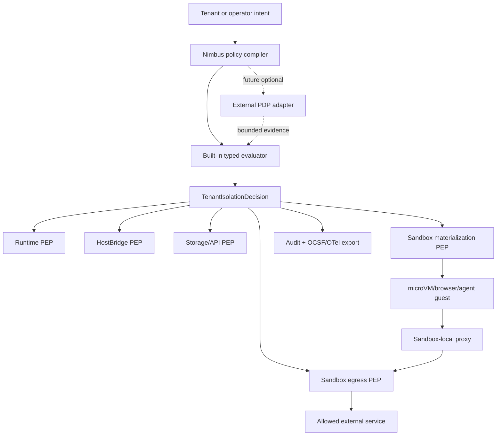

# Plan: Enterprise Policy And Sandbox Egress

Canonical active plan for turning the OpenShell competitor review into a
Nimbus-native enterprise trust surface without giving up single-binary
simplicity.

## Status

- **Status:** `active`
- **Primary owner:** this plan
- **Activation gate:** met on 2026-05-22 for operator-authored
  tenant/sandbox policy and local policy explain/diff UX.
- **Research:** `docs/plans/research/openshell-competitor-analysis.md`
- **Current posture references:** `docs/tenant-isolation.md`,
  `docs/architecture/runtime/permission-model.md`,
  `docs/architecture/sandbox/microvm-service-baseline.md`,
  `docs/architecture/server/auth-runtime-trust.md`

## Goal

Make Nimbus enterprise policy and sandbox egress controls explicit, explainable,
testable, and exportable while preserving the single-binary product model.

Nimbus should provide:

- great DX: policy files validate locally, failures explain themselves, and
  local development does not require a policy-engine stack
- enterprise trust: deny-by-default controls, evidence-grade logs, stable
  decision IDs, conformance gates, and optional integration with customer policy
  systems
- a clear safety rule: untrusted runtime or guest code never enforces its own
  authority

## Scope

This plan owns:

- a typed operator policy artifact that compiles into
  `TenantIsolationDecision` inputs
- policy validation, explain, and diff commands
- built-in Rust policy evaluator semantics for tenant isolation, tenant-scoped
  storage, sandbox egress, service grants, network endpoints, image/secret/volume
  policy, quota classes, and audit redaction
- optional external policy backend seam for OPA/Rego, Cedar, or future customer
  PDPs after the built-in evaluator is stable
- sandbox-local egress enforcement for `microvm_service`, browser-service, and
  agent workloads that run normal OS processes
- SSRF/internal-address denial, host wildcard validation, L4/L7 endpoint
  policy, and explicit internal-IP allowlists for guest egress
- dynamic versus recreate-required policy lifecycle, including last-known-good
  reload behavior
- OCSF and OpenTelemetry log export mapping for tenant isolation and sandbox
  egress events
- conformance gates for policy evaluation, egress denial, redaction, and drift
- deferred policy advisor and policy prover lanes

This plan does not own:

- replacing `TenantIsolationDecision`
- replacing `RuntimeGrants` or the HostBridge permission model
- secret value storage or provider-auth credential minting
- image signature, SLSA, SBOM, or OCI referrer verification backends
- cluster membership, iroh transport, or openraft replication
- app-level customer authorization inside a tenant

## Policy Engine Posture

Nimbus starts with a built-in typed Rust evaluator. OPA/Rego, Cedar, and
customer PDPs are future optional backends, not mandatory dependencies.

Rationale:

- Nimbus core policy is a product safety contract across runtime, storage,
  sandbox, image, secret, quota, HostBridge, and audit seams. Typed Rust keeps
  that contract refactorable and directly testable.
- OPA/Rego is excellent when customers need general-purpose policy-as-code over
  arbitrary structured inputs. It should be supported only after Nimbus can
  define a stable input/output envelope and fail-closed behavior.
- Cedar is promising for fine-grained application authorization and analyzable
  policy sets. It may become a better fit than OPA for some app/resource
  authorization use cases, but it should not own sandbox materialization or
  egress hardening before the Nimbus policy model stabilizes.
- External policy engines must not override hard built-in denies for tenant
  mismatch, forged identity, raw secrets, unsafe host binds, unverified image
  floors, broad loopback/wildcard runtime grants, or SSRF/internal-address
  hardening.

External policy backend requirements when promoted:

- stable typed input envelope
- versioned output envelope
- policy backend name and version in the decision evidence
- policy bundle hash and input digest in audit output
- timeout and failure modes that fail closed
- deterministic fixture tests for allow, deny, malformed policy, timeout, and
  backend unavailable
- no raw secrets, bearer tokens, or credential material in inputs, outputs, or
  logs

## Architecture Direction



Single-binary shape:

```text
nimbus start
nimbus compose ...
nimbus policy validate|explain|diff|prove
nimbus sandbox-supervisor ...
```

The supervisor may be launched inside a guest by the sandbox backend, but it
should remain packaged and versioned with Nimbus.

## Phase Ledger

| Phase | Status | Goal | Verification |
| --- | --- | --- | --- |
| EPS0 | `done` | Define typed policy artifact schema and ownership boundaries. | `cargo test -p nimbus-server operator_policy -- --nocapture`: golden YAML fixtures reject unknown fields, unsafe defaults, and invalid wildcard/port/secret/image shapes. |
| EPS1 | `done` | Implement built-in policy compiler into `TenantIsolationDecision` inputs. | `cargo test -p nimbus-server operator_policy -- --nocapture`: compiled decisions use real `TenantIsolationDecision` IDs, runtime admission, audit records, and fail-closed validation. |
| EPS2 | `done` | Add `nimbus policy validate`, `explain`, and `diff`. | `cargo test -p nimbus-bin policy -- --nocapture`: CLI parse and render fixtures cover stable diagnostics, decision traces, and authority delta summaries. |
| EPS3 | `done` | Define dynamic versus recreate-required policy lifecycle. | `cargo test -p nimbus-server operator_policy -- --nocapture`: launch-materialized egress diffs and static authority changes classify as `recreate_required`, no-op reload stays dynamic, and invalid reload keeps last-known-good. |
| EPS4a | `done` | Add typed sandbox egress PEP contract and launch materialization seam. | `cargo test -p nimbus-sandbox egress -- --nocapture`, `cargo test -p nimbus-server service_manager -- --nocapture`, and `cargo test -p nimbus-bin x_nimbus_egress -- --nocapture`: default deny, explicit allow, SSRF/internal denial, wildcard validation, L7 method/path denial, service-manager policy mismatch, and Compose lowering. |
| EPS4b0 | `done` | Add a typed egress enforcement contract for the future sandbox supervisor/proxy. | `cargo test -p nimbus-sandbox egress -- --nocapture`: launch metadata is schema-versioned, default-deny by default, explicit allows compile to canonical policy, invalid raw policy fails closed, and launch metadata cannot claim live reload. |
| EPS4b1 | `done` | Package a sandbox-local supervisor/proxy entrypoint with Nimbus. | `cargo test -p nimbus-bin sandbox_supervisor -- --nocapture`: hidden `nimbus sandbox-supervisor` entrypoint parses, consumes env-backed `SandboxEgressEnforcementPlan`, rejects missing/invalid contracts, and reports validation-only status with `packet_enforcement_active=false`. |
| EPS4b2a | `done` | Select the supervisor/proxy enforcement contract for process-capable sandbox launches. | `cargo test -p nimbus-sandbox egress -- --nocapture` and focused krun/container bundle egress tests prove default-deny and explicit-allow bundles emit `supervisor_proxy` + `recreate_required`, spoofed env is replaced, and invalid egress policy fails closed. |
| EPS4b2b | `in_progress` | Force process-capable guest egress through the supervisor/proxy or equivalent kernel-enforced path. | Current evidence: `cargo test -p nimbus-sandbox netavark_request -- --nocapture` and `cargo test -p nimbus-sandbox container_launch_network_config_denies_direct_egress_for_supervised_processes -- --nocapture` prove container execute-mode network intent uses a netavark internal bridge that denies ambient direct egress. Remaining evidence: Linux integration tests must prove real guest traffic cannot bypass the egress PEP. |
| EPS4b3 | `todo` | Add Linux network conformance and live egress reload proof. | Linux conformance proves real guest traffic default deny, allowed endpoint success, SSRF denial after DNS resolution, loopback/internal denial, L7 method/path denial, and egress-only reload through the proxy or kernel-enforced path. |
| EPS5 | `todo` | Add OCSF and OpenTelemetry export mapping. | Fixtures prove tenant/sandbox events redact secrets and map to stable OCSF/OTel records with decision IDs. |
| EPS6 | `todo` | Add external policy backend seam without making it mandatory. | Fake OPA/Cedar-style adapters prove allow, deny, malformed output, timeout, and unavailable-backend fail-closed behavior. |
| EPS7 | `todo` | Add denied-event policy draft workflow. | Denied egress fixtures produce minimal draft policy, never auto-apply, and require explicit approval. |
| EPS8 | `todo` | Add policy prove/advisory lane after policy schema stabilizes. | Prover fixtures detect broad egress, write-bypass, secret exposure, or cross-tenant policy regressions with accepted-risk support. |
| EPS9 | `todo` | Publish operator docs and conformance runbook. | One command proves policy validation, egress enforcement, export redaction, external-backend fail-closed, and drift behavior. |

## Success Criteria

- A clean checkout can understand the policy model from docs and run a local
  validation command without installing OPA, Cedar, SPIRE, or a SIEM.
- Built-in policy evaluation is deterministic, typed, and covered by fixtures
  for allowed, denied, malformed, and drifted inputs.
- External policy backends are optional, fail closed, and cannot override hard
  built-in security denies.
- Arbitrary guest egress from process-capable sandboxes is denied by default
  and can be narrowed by host, port, protocol, method/path, and explicit
  internal-IP allowlist.
- Tenant isolation events and sandbox egress events export to an
  enterprise-ingestable format without leaking tokens, credentials, query
  parameters, secret handles, or raw bearer claims.
- Policy reload has last-known-good semantics. Controls that are only
  materialized at launch, including the current egress policy contract, require
  sandbox recreation until EPS4b2b-EPS4b3 land a live enforcement/reload path.
- Operator docs explain when to use in-process runtime grants, `ctx.services`,
  microVM service egress policy, and external policy engines.

## Current Implementation

Batch 1 landed EPS0-EPS2:

- `OperatorPolicyDocument` is the typed, strict YAML artifact. It rejects
  unknown fields and validates tenant IDs, storage namespaces, service grants,
  network endpoints, image references, secret handles, quota charges, and audit
  redaction fields before producing authority.
- The built-in compiler evaluates each workload through the existing
  `TenantIsolationContext` and `TenantIsolationDecision` path. Runtime policy
  admission therefore reuses the existing production routing rule that sends
  broad Node compatibility grants away from `in_process_untrusted`.
- `image.digest_required` is a real compiled default even when the policy admits
  a registry instead of one concrete image reference. Registry-wide policy still
  rejects tag-only launches.
- `storage.namespace` is intentionally restricted to `tenant` until the storage
  PEP consumes namespace decisions. Custom storage namespace syntax should not
  appear policy-valid before it is enforceable.
- `policy diff` compares the compiled authority surface rather than only a small
  display subset. Volume grants, quota charges, audit redactions, image policy,
  runtime profile/tier/mode, sandbox identity, and same-count secret-handle
  changes are covered without printing raw secret handles.
- `nimbus policy validate`, `nimbus policy explain`, and
  `nimbus policy diff` provide local policy UX without requiring OPA, Cedar,
  SPIRE, or a SIEM.

Batch 2 landed EPS3 and EPS4a:

- Policy diffs now classify launch-materialized egress changes and static
  authority changes such as runtime, service, endpoint, sandbox identity,
  storage, volume, image, secret, quota, or runtime-admission changes as
  `recreate_required`. Egress-only changes can become `dynamic_reload` only
  after EPS4b2b-EPS4b3 land a live proxy/supervisor or equivalent enforcement
  reload path.
- `OperatorPolicyReloadState` gives reloads last-known-good semantics: valid
  policy candidates update the desired evaluation and report whether recreation
  is required, while invalid candidates are rejected without replacing the
  active evaluation.
- `SandboxEgressPolicy` is the shared sandbox-local PEP contract. Its default
  is deny-all. Explicit allow rules can narrow by protocol, host, port, HTTP
  method, path prefix, and `allow_internal_ips`. Admission and launch seams
  compile the raw policy into a validated canonical policy before comparing or
  authorizing it.
- The current implementation has an evaluator and materialization seam, not
  packet-level enforcement. krun and container OCI bundle generation now use
  `SandboxEgressLaunchEnforcement` to inject a
  `NIMBUS_SANDBOX_EGRESS_ENFORCEMENT_JSON` contract. Process-capable launches
  select `supervisor_proxy` with `recreate_required` reload, which is the
  intended sandbox-local enforcement path, but EPS4b2b still owns the Linux
  packet-routing proof that guest traffic cannot bypass that path. A future
  supervisor/proxy mode can advertise `live_reload` only after live reload is
  implemented and proven. The prior
  `NIMBUS_SANDBOX_EGRESS_POLICY_JSON` name remains reserved and scrubbed but
  is no longer emitted. The
  server service manager rejects sandbox launches whose spec asks for egress
  policy not present in the admitted `TenantIsolationDecision`.
- Compose supports `x-nimbus.egress.allow` and validates the same sandbox
  egress policy shape before lowering to `SandboxSpec`.
- `nimbus sandbox-supervisor` is a hidden/internal single-binary entrypoint for
  sandbox-local supervisor packaging. It consumes and validates
  `SandboxEgressEnforcementPlan` from
  `NIMBUS_SANDBOX_EGRESS_ENFORCEMENT_JSON`; there is no CLI override for the
  launch-materialized contract. It intentionally reports
  `packet_enforcement_active=false` until EPS4b2b wires traffic through the
  supervisor/proxy or equivalent kernel path.
- Modularity note: `operator_policy.rs` remains the schema/compiler
  composition root and is intentionally under the 2,000-line hard limit.
  Concept-owned policy children now own egress and reload state; future policy
  concepts should follow that pattern instead of growing the composition root.

Batch 3 started EPS4b by landing EPS4b0-EPS4b1: a typed enforcement contract
and hidden single-binary supervisor entrypoint that can consume it without
changing the runtime or bundle seams again. EPS4b2a then moved process-capable
krun/container launch contracts onto the `supervisor_proxy` enforcement path
while keeping `recreate_required` reload semantics. The remaining EPS4b work is
EPS4b2b-EPS4b3: force process-capable guest traffic through the
supervisor/proxy or an equivalent kernel-enforced path, and run the Linux
conformance proof.

Batch 4 started EPS4b2b by making container execute-mode network intent deny
ambient direct egress before the workload starts. `OciNetworkConfig` now carries
an explicit direct-egress mode, netavark bridge requests render `internal: true`
and an `io.nimbus.egress.direct=deny` label by default, and the container backend
selects that denied mode for process-capable launches. This is necessary but not
sufficient: EPS4b2b remains in progress until the Linux/minicloud proof shows
real guest traffic cannot bypass the egress PEP, and EPS4b3 still owns allowed
endpoint success plus L7 and reload conformance.

## Open Questions

- Should the first external policy adapter target OPA/Rego because of ecosystem
  familiarity, or Cedar because of Rust-native authorization and analyzability?
- Should policy prove start as custom Rust property/conformance checks before
  SMT integration, or adopt a solver once the policy schema lands?
- How much L7 policy belongs in Nimbus versus a future service-mesh or proxy
  integration for cluster deployments?
- Should OCSF export be direct JSONL first, or should the first implementation
  emit OpenTelemetry log records with OCSF payload attributes?

## Consumer Rules

- Runtime engine work must not add broad networking or secret grants to
  `in_process_untrusted` code to compensate for missing sandbox egress policy.
- Browser, WASI agent, and microVM service plans should consume this plan for
  process-capable guest egress rather than inventing separate network policy
  dialects.
- Secret-management and service-identity plans may attach policy evidence and
  OCSF/OTel events, but they still own secret values and credential minting.
- Artifact provenance verification may feed image policy evidence into this
  plan, but cryptographic verification remains owned by
  `docs/plans/artifact-provenance-verification-plan.md`.

## References

- `docs/plans/research/openshell-competitor-analysis.md`
- `docs/tenant-isolation.md`
- `docs/architecture/runtime/permission-model.md`
- `docs/architecture/sandbox/microvm-service-baseline.md`
- `docs/architecture/server/auth-runtime-trust.md`
- `docs/plans/service-identity-provider-auth-plan.md`
- `docs/plans/secret-management-plan.md`
- `docs/plans/artifact-provenance-verification-plan.md`
- `docs/plans/agent-browser-service-plan.md`
- `docs/plans/wasi-agent-capabilities-plan.md`
