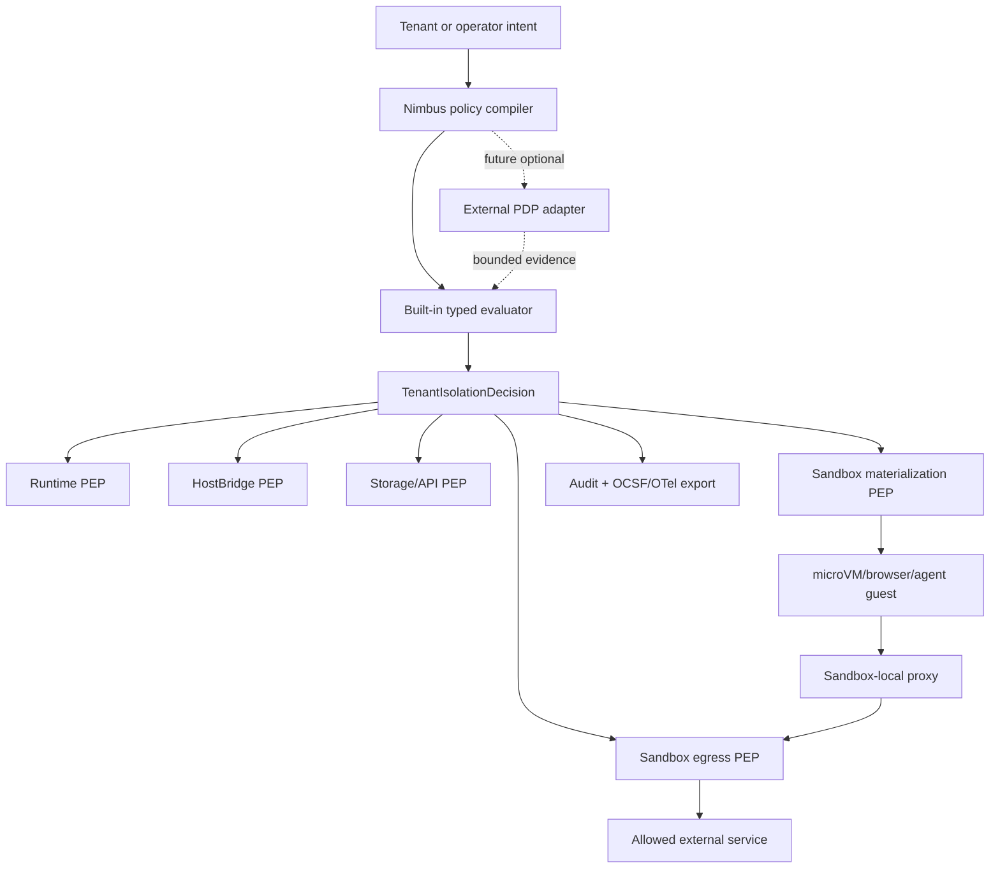

# Plan: Enterprise Policy And Sandbox Egress

Canonical active plan for turning the OpenShell competitor review into a
Nimbus-native enterprise trust surface without giving up single-binary
simplicity.

## Status

- **Status:** `active`
- **Primary owner:** this plan
- **Activation gate:** met on 2026-05-22 for operator-authored
  tenant/sandbox policy and local policy explain/diff UX.
- **Research:** `docs/plans/research/openshell-competitor-analysis.md`
- **Current posture references:** `docs/tenant-isolation.md`,
  `docs/architecture/runtime/permission-model.md`,
  `docs/architecture/sandbox/microvm-service-baseline.md`,
  `docs/architecture/server/auth-runtime-trust.md`

## Goal

Make Nimbus enterprise policy and sandbox egress controls explicit, explainable,
testable, and exportable while preserving the single-binary product model.

Nimbus should provide:

- great DX: policy files validate locally, failures explain themselves, and
  local development does not require a policy-engine stack
- enterprise trust: deny-by-default controls, evidence-grade logs, stable
  decision IDs, conformance gates, and optional integration with customer policy
  systems
- a clear safety rule: untrusted runtime or guest code never enforces its own
  authority

## Scope

This plan owns:

- a typed operator policy artifact that compiles into
  `TenantIsolationDecision` inputs
- policy validation, explain, and diff commands
- built-in Rust policy evaluator semantics for tenant isolation, tenant-scoped
  storage, sandbox egress, service grants, network endpoints, image/secret/volume
  policy, quota classes, and audit redaction
- optional external policy backend seam for OPA/Rego, Cedar, or future customer
  PDPs after the built-in evaluator is stable
- sandbox-local egress enforcement for `microvm_service`, browser-service, and
  agent workloads that run normal OS processes
- SSRF/internal-address denial, host wildcard validation, L4/L7 endpoint
  policy, and explicit internal-IP allowlists for guest egress
- dynamic versus recreate-required policy lifecycle, including last-known-good
  reload behavior
- OCSF and OpenTelemetry log export mapping for tenant isolation and sandbox
  egress events
- conformance gates for policy evaluation, egress denial, redaction, and drift
- denied-event policy draft and policy prover/advisory lanes

This plan does not own:

- replacing `TenantIsolationDecision`
- replacing `RuntimeGrants` or the HostBridge permission model
- secret value storage or provider-auth credential minting
- image signature, SLSA, SBOM, or OCI referrer verification backends
- cluster membership, iroh transport, or openraft replication
- app-level customer authorization inside a tenant

## Policy Engine Posture

Nimbus starts with a built-in typed Rust evaluator. OPA/Rego, Cedar, and
customer PDPs are future optional backends, not mandatory dependencies.

Rationale:

- Nimbus core policy is a product safety contract across runtime, storage,
  sandbox, image, secret, quota, HostBridge, and audit seams. Typed Rust keeps
  that contract refactorable and directly testable.
- OPA/Rego is excellent when customers need general-purpose policy-as-code over
  arbitrary structured inputs. It should be supported only after Nimbus can
  define a stable input/output envelope and fail-closed behavior.
- Cedar is promising for fine-grained application authorization and analyzable
  policy sets. It may become a better fit than OPA for some app/resource
  authorization use cases, but it should not own sandbox materialization or
  egress hardening before the Nimbus policy model stabilizes.
- External policy engines must not override hard built-in denies for tenant
  mismatch, forged identity, raw secrets, unsafe host binds, unverified image
  floors, broad loopback/wildcard runtime grants, or SSRF/internal-address
  hardening.

External policy backend requirements when promoted:

- stable typed input envelope
- versioned output envelope
- policy backend name and version in the decision evidence
- policy bundle hash and input digest in audit output
- timeout and failure modes that fail closed
- deterministic fixture tests for allow, deny, malformed policy, timeout, and
  backend unavailable
- no raw secrets, bearer tokens, or credential material in inputs, outputs, or
  logs

## Architecture Direction



Single-binary shape:

```text
nimbus start
nimbus compose ...
nimbus policy validate|explain|diff|prove
nimbus sandbox-supervisor ...
```

The supervisor may be launched inside a guest by the sandbox backend, but it
should remain packaged and versioned with Nimbus.

## Phase Ledger

| Phase | Status | Goal | Verification |
| --- | --- | --- | --- |
| EPS0 | `done` | Define typed policy artifact schema and ownership boundaries. | `cargo test -p nimbus-server operator_policy -- --nocapture`: golden YAML fixtures reject unknown fields, unsafe defaults, and invalid wildcard/port/secret/image shapes. |
| EPS1 | `done` | Implement built-in policy compiler into `TenantIsolationDecision` inputs. | `cargo test -p nimbus-server operator_policy -- --nocapture`: compiled decisions use real `TenantIsolationDecision` IDs, runtime admission, audit records, and fail-closed validation. |
| EPS2 | `done` | Add `nimbus policy validate`, `explain`, and `diff`. | `cargo test -p nimbus-bin policy -- --nocapture`: CLI parse and render fixtures cover stable diagnostics, decision traces, and authority delta summaries. |
| EPS3 | `done` | Define dynamic versus recreate-required policy lifecycle. | `cargo test -p nimbus-server operator_policy -- --nocapture`: backend-aware sandbox egress diffs classify container egress-only changes as `dynamic_reload` and krun egress changes as `recreate_required`; static authority changes classify as `recreate_required`, no-op reload stays dynamic, and invalid reload keeps last-known-good. |
| EPS4a | `done` | Add typed sandbox egress PEP contract and launch materialization seam. | `cargo test -p nimbus-sandbox egress -- --nocapture`, `cargo test -p nimbus-server service_manager -- --nocapture`, and `cargo test -p nimbus-bin x_nimbus_egress -- --nocapture`: default deny, explicit allow, SSRF/internal denial, wildcard validation, L7 method/path denial, service-manager policy mismatch, and Compose lowering. |
| EPS4b0 | `done` | Add a typed egress enforcement contract for the future sandbox supervisor/proxy. | `cargo test -p nimbus-sandbox egress -- --nocapture`: launch metadata is schema-versioned, default-deny by default, explicit allows compile to canonical policy, invalid raw policy fails closed, and launch metadata cannot claim live reload. |
| EPS4b1 | `done` | Package a sandbox-local supervisor/proxy entrypoint with Nimbus. | `cargo test -p nimbus-bin sandbox_supervisor -- --nocapture`: hidden `nimbus sandbox-supervisor` entrypoint parses, consumes env-backed `SandboxEgressEnforcementPlan`, rejects missing/invalid contracts, and reports validation-only status with `packet_enforcement_active=false`. |
| EPS4b2a | `done` | Select the supervisor/proxy enforcement contract for process-capable sandbox launches. | `cargo test -p nimbus-sandbox egress -- --nocapture` and focused krun/container bundle egress tests prove default-deny and explicit-allow bundles emit `supervisor_proxy`, spoofed env is replaced, and invalid egress policy fails closed. Container bundles now advertise `live_reload`; krun bundles remain `recreate_required` while execute-mode is fail-closed. |
| EPS4b2b | `done` | Force process-capable guest egress through the supervisor/proxy or equivalent kernel-enforced path. | `cargo test -p nimbus-sandbox netavark_request -- --nocapture` and `cargo test -p nimbus-sandbox container_launch_network_config_denies_direct_egress_for_supervised_processes -- --nocapture` prove container execute-mode network intent uses a netavark internal bridge that denies ambient direct egress. Minicloud evidence: `sudo -E NIMBUS_CONTAINER_EGRESS_WORKDIR=/tmp/nimbus-container-egress-proof target/debug/deps/container_linux_egress-* --ignored --nocapture` passed, proving a real BusyBox guest records direct external HTTP egress as `denied`. `cargo test -p nimbus-sandbox krun::vm -- --nocapture` proves krun execute-mode now fails closed before bundle/state artifact materialization until a packet-level libkrun TSI egress PEP exists. |
| EPS4b3 | `done` | Add Linux network conformance and live egress reload proof. | `cargo test -p nimbus-sandbox egress_proxy -- --nocapture` proves the reusable egress proxy enforces default deny, allowed HTTP endpoint success, HTTPS CONNECT tunneling, HTTPS absolute-URI fail-closed behavior, DNS-resolved internal/SSRF denial, L7 method/path denial, hop-by-hop proxy header cleanup, and live policy reload without restart. `cargo test -p nimbus-sandbox container -- --nocapture` proves container execute plans inject a bridge-reachable proxy URL, scrub spoofed proxy env, reserve proxy ports without colliding with service ports, advertise `live_reload`, stop proxy listeners during cleanup, and reload policy into a running proxy. `cargo test -p nimbus-server operator_policy -- --nocapture` and `cargo test -p nimbus-server service_manager -- --nocapture` prove the control plane classifies container egress-only diffs as dynamic, keeps krun egress recreate-required, and can call the sandbox reload seam for an active service. Minicloud evidence: `sudo -E NIMBUS_CONTAINER_EGRESS_WORKDIR=/tmp/nimbus-container-egress-proof target/debug/deps/container_linux_egress-* --ignored --test-threads=1 --nocapture` passed with 2 Linux root tests, proving direct proxy bypass denial, proxy-allowed endpoint success, loopback/default denial, L7 denial, DNS-resolved internal denial, and live reload inside a real BusyBox guest. |
| EPS5 | `done` | Add OCSF and OpenTelemetry export mapping. | `cargo test -p nimbus-server audit_events -- --nocapture`: fixtures prove tenant isolation events export stable OCSF Base Event and OpenTelemetry log-record shaped JSON with decision IDs, trace/span correlation, namespaced Nimbus attributes, and redactions for tokens, credentials, query parameters, secret handles, authorization values, and raw bearer claims. |
| EPS6 | `done` | Add external policy backend seam without making it mandatory. | `cargo test -p nimbus-server operator_policy -- --nocapture`: fake OPA/Cedar-style adapters prove allow evidence, deny fail-closed, malformed output fail-closed, timeout fail-closed, unavailable-backend fail-closed, no raw secret handles in backend requests, and built-in hard-deny precedence before external allow. |
| EPS7 | `done` | Add denied-event policy draft workflow. | `cargo test -p nimbus-server operator_policy -- --nocapture`: denied egress fixtures produce minimal review-required draft policy, strip query parameters from suggested paths, never mutate the source policy, reject tenant/workload mismatches, fail apply without explicit approval, and apply only to a cloned policy after approval. |
| EPS8 | `done` | Add policy prove/advisory lane after policy schema stabilizes. | `cargo test -p nimbus-server operator_policy -- --nocapture` and `cargo test -p nimbus-bin policy -- --nocapture`: prover fixtures detect broad egress, write-bypass, secret exposure, and cross-tenant policy regressions; accepted risks mark matching advisories without hiding unaccepted regressions; malformed accepted-risk records fail closed; `nimbus policy prove` parses and renders. |
| EPS9 | `done` | Publish operator docs and conformance runbook. | `bash scripts/verify-enterprise-policy-egress.sh`: one command proves policy validation, egress enforcement, export redaction, external-backend fail-closed, and drift behavior. Operator docs cover `policy prove`, denied-egress drafts, accepted risks, container live egress reload, and krun fail-closed semantics. |

## Success Criteria

- A clean checkout can understand the policy model from docs and run a local
  validation command without installing OPA, Cedar, SPIRE, or a SIEM.
- Built-in policy evaluation is deterministic, typed, and covered by fixtures
  for allowed, denied, malformed, and drifted inputs.
- External policy backends are optional, fail closed, and cannot override hard
  built-in security denies.
- Arbitrary guest egress from process-capable sandboxes is denied by default
  and can be narrowed by host, port, protocol, method/path, and explicit
  internal-IP allowlist.
- Tenant isolation events and sandbox egress events export to an
  enterprise-ingestable format without leaking tokens, credentials, query
  parameters, secret handles, or raw bearer claims.
- Policy reload has last-known-good semantics. Controls that are only
  materialized at launch require sandbox recreation. Container sandbox egress is
  dynamically reloadable through the sandbox backend reload seam; krun egress
  remains recreate-required/fail-closed until a packet-level libkrun TSI PEP
  exists.
- Operator docs explain when to use in-process runtime grants, `ctx.services`,
  microVM service egress policy, and external policy engines.

## Current Implementation

Batch 1 landed EPS0-EPS2:

- `OperatorPolicyDocument` is the typed, strict YAML artifact. It rejects
  unknown fields and validates tenant IDs, storage namespaces, service grants,
  network endpoints, image references, secret handles, quota charges, and audit
  redaction fields before producing authority.
- The built-in compiler evaluates each workload through the existing
  `TenantIsolationContext` and `TenantIsolationDecision` path. Runtime policy
  admission therefore reuses the existing production routing rule that sends
  broad Node compatibility grants away from `in_process_untrusted`.
- `image.digest_required` is a real compiled default even when the policy admits
  a registry instead of one concrete image reference. Registry-wide policy still
  rejects tag-only launches.
- `storage.namespace` is intentionally restricted to `tenant` until the storage
  PEP consumes namespace decisions. Custom storage namespace syntax should not
  appear policy-valid before it is enforceable.
- `policy diff` compares the compiled authority surface rather than only a small
  display subset. Volume grants, quota charges, audit redactions, image policy,
  runtime profile/tier/mode, sandbox identity, and same-count secret-handle
  changes are covered without printing raw secret handles.
- `nimbus policy validate`, `nimbus policy explain`, and
  `nimbus policy diff` provide local policy UX without requiring OPA, Cedar,
  SPIRE, or a SIEM.

Batch 2 landed EPS3 and EPS4a:

- Policy diffs classify static authority changes such as runtime, service,
  endpoint, sandbox identity, storage, volume, image, secret, quota, or
  runtime-admission changes as `recreate_required`. After EPS4b3, sandbox
  egress-only changes are backend-aware: container egress is `dynamic_reload`
  through the live proxy reload seam, while krun egress remains
  `recreate_required`.
- `OperatorPolicyReloadState` gives reloads last-known-good semantics: valid
  policy candidates update the desired evaluation and report whether recreation
  is required, while invalid candidates are rejected without replacing the
  active evaluation.
- `SandboxEgressPolicy` is the shared sandbox-local PEP contract. Its default
  is deny-all. Explicit allow rules can narrow by protocol, host, port, HTTP
  method, path prefix, and `allow_internal_ips`. Admission and launch seams
  compile the raw policy into a validated canonical policy before comparing or
  authorizing it.
- The current implementation has an evaluator and materialization seam, a
  container kernel/network deny for ambient direct egress, and a live container
  egress proxy path. krun and container OCI bundle generation inject a
  `NIMBUS_SANDBOX_EGRESS_ENFORCEMENT_JSON` contract. Container process-capable
  launches select `supervisor_proxy` with `live_reload`, while krun execute-mode
  fails closed until Nimbus has a packet-level libkrun TSI egress PEP, because
  the current TSI path can proxy outbound guest `connect()` calls on the host
  side without consulting the Nimbus egress policy. The prior
  `NIMBUS_SANDBOX_EGRESS_POLICY_JSON` name remains reserved and scrubbed but
  is no longer emitted. The
  server service manager rejects sandbox launches whose spec asks for egress
  policy not present in the admitted `TenantIsolationDecision`.
- Compose supports `x-nimbus.egress.allow` and validates the same sandbox
  egress policy shape before lowering to `SandboxSpec`.
- `nimbus sandbox-supervisor` is a hidden/internal single-binary entrypoint for
  sandbox-local supervisor packaging. It consumes and validates
  `SandboxEgressEnforcementPlan` from
  `NIMBUS_SANDBOX_EGRESS_ENFORCEMENT_JSON`; there is no CLI override for the
  launch-materialized contract. The entrypoint itself still reports
  `packet_enforcement_active=false`; container execute-mode now uses the
  host-side egress proxy as the proven enforcement path.
- Modularity note: `operator_policy.rs` remains the schema/compiler
  composition root and is intentionally under the 2,000-line hard limit.
  Concept-owned policy children now own egress and reload state; future policy
  concepts should follow that pattern instead of growing the composition root.

Batch 3 started EPS4b by landing EPS4b0-EPS4b1: a typed enforcement contract
and hidden single-binary supervisor entrypoint that can consume it without
changing the runtime or bundle seams again. EPS4b2a then moved process-capable
krun/container launch contracts onto the `supervisor_proxy` enforcement path
while keeping conservative reload semantics until the backend proof landed.
EPS4b2b then made the
existing process-capable execution paths safe to ship: container execute-mode
gets a netavark internal bridge that denies ambient direct egress, while krun
execute-mode fails closed until a packet-level libkrun TSI egress PEP exists.
EPS4b3 then closed the live container proxy proof and kept krun recreate/fail-
closed until it has its own packet-level PEP.

Batch 4 closed EPS4b2b by making container execute-mode network intent deny
ambient direct egress before the workload starts and making krun execute-mode
fail closed. `OciNetworkConfig` now carries an explicit direct-egress mode,
netavark bridge requests render `internal: true` and an
`io.nimbus.egress.direct=deny` label by default, and the container backend
selects that denied mode for process-capable launches. An ignored Linux smoke
test, `container_execute_mode_denies_direct_external_egress`, now starts a real
BusyBox container on minicloud, attempts direct external HTTP, writes the result
through a tenant volume, and passed with `denied`. `KrunSandboxBackend` refuses
execute-mode before bundle/state artifact materialization until Nimbus has a
packet-level egress policy hook for libkrun TSI. EPS4b3 later added the allowed
endpoint, SSRF/internal, L7 denial, and reload conformance.

Batch 5 started EPS4b3 with the reusable egress proxy enforcement core. The
proxy listens on loopback by default, parses HTTP forward-proxy absolute URIs
with the shared typed policy model, resolves DNS before authorization so
name-based SSRF/internal targets are denied, strips hop-by-hop proxy headers,
forwards allowed requests in origin-form, supports HTTPS CONNECT tunnels, and
supports live policy reload by swapping the compiled policy without restarting
the listener. Unsupported HTTPS absolute-form requests fail closed without
contacting upstream. This became the product seam consumed by container
execute-mode in Batch 6 and proven against a Linux guest in Batch 7.

Batch 6 wired the proxy core into container execute-mode. Execute plans now
assign an internal proxy listener on the container bridge gateway, reserve the
proxy port alongside active sandbox ports, inject `HTTP_PROXY`/`http_proxy` and
the Nimbus proxy metadata env while scrubbing tenant-provided proxy bypass env,
and keep plan-only bundles free of live proxy claims. The container backend owns
the live proxy listener handles in a runtime registry, restarts a missing proxy
from manifest state during inspect, stops the listener during cleanup, and
offers a reload method that swaps a running proxy to the new compiled egress
policy while persisting the manifest.

Batch 7 closed EPS4b3. `SandboxBackend` now exposes a live egress reload seam;
the container backend implements it, and `SandboxServiceManager` can reload an
active service's admitted egress policy through that seam. Operator policy diff
classification is backend-aware: container-only egress changes are
`dynamic_reload`, while krun egress remains `recreate_required` because krun
execute-mode is still fail-closed pending a libkrun TSI packet-level PEP.
Container bundles now advertise `live_reload`; krun bundles stay
`recreate_required`. The minicloud BusyBox conformance matrix proved direct
proxy bypass denial, default/loopback denial, L7 denial, DNS-resolved internal
denial, allowed endpoint success, and live reload in a real Linux guest.

Batch 8 closed EPS5. `TenantIsolationEvent` remains the internal canonical
audit schema, and enterprise formats are explicit mappings from that schema
rather than separate event sources. The OCSF export emits a conservative OCSF
1.8.0 Base Event with `category_uid=0`, `class_uid=0`, `activity_id=99`,
source-specific Nimbus reason codes in `status_code`, normalized status and
severity, and all Nimbus context in `unmapped` under `nimbus.*` keys. The
OpenTelemetry export emits a log-record shaped event with low-cardinality
`event_name`, OTel severity numbers, trace/span correlation when present, a
display body, and the same namespaced Nimbus attributes. Sensitive caller
attributes and correlation IDs are redacted before either export can serialize
them, including tokens, credentials, query parameters, secret handles,
authorization values, and raw bearer claims.

Batch 9 closed EPS6. The operator policy evaluator now has an optional
`OperatorExternalPolicyBackend` seam. The normal `evaluate()` path remains pure
typed Rust and requires no OPA, Cedar, SPIRE, or SIEM. Operators or future
integrations can call `evaluate_with_external_policy(...)` with a backend that
receives a serializable `OperatorExternalPolicyRequest` built only after the
built-in compiler admits the workload. That ordering gives built-in hard denies
precedence: unsafe image, storage, egress, secret, or runtime shapes reject
before any external backend can return allow. External allow attaches
`OperatorExternalPolicyEvidence` to the decision evidence and explain output,
including backend name, version, outcome, and reason. External deny, malformed
backend output, timeout, or unavailable backend all fail closed without
producing an admitted evaluation. Requests carry counts and summaries, not raw
secret handles. Modularity note: `operator_policy.rs` is still a composition
root and is intentionally kept below the 2,000-line hard limit; EPS6 split its
tests into `operator_policy/tests.rs` and put the external backend seam in
`operator_policy/external.rs`, leaving the root as the schema/compiler/diff
coordinator for this active plan.

Batch 10 closed EPS7. `OperatorDeniedEgressEvent` can now generate an
`OperatorPolicyDraft` for sandbox egress allow-list changes. Draft generation
is intentionally review-first: the draft is marked `review_required`, records
`requires_explicit_approval=true`, sets `auto_apply=false`, and leaves the
source `OperatorPolicyDocument` unchanged. The generated rule is minimal: it
uses the denied protocol, host, port, HTTP method when present, and a sanitized
path prefix with query and fragment data stripped so denial evidence cannot
persist tokens or other query secrets into policy text. Applying a draft
requires an `OperatorPolicyDraftApproval`; without approval it fails closed,
and with approval it returns a cloned updated policy that must still pass the
normal policy evaluator. Tenant and workload mismatches are rejected before a
draft is produced. Modularity note: after EPS7, `operator_policy.rs` was a
1,604-line
composition root over concept-owned children `egress.rs`, `external.rs`,
`draft.rs`, `reload.rs`, and `tests.rs`.

Batch 11 closed EPS8. `OperatorPolicyDocument::prove()` now provides the
custom Rust advisory lane we chose before introducing solver dependencies. It
evaluates the same typed policy artifact, emits stable advisory IDs, and
detects four enterprise-risk classes: broad sandbox egress, direct
write-capable endpoint bypass for runtime workloads, secret-handle exposure to
in-process untrusted workloads, and cross-tenant-looking secret handle
namespaces. The report separates accepted and unaccepted advisories, and
top-level `accepted_risks` records require advisory ID, reviewer, and reason.
Accepted risks attach to matching advisories but do not suppress unrelated
regressions. `nimbus policy prove` exposes the lane through the CLI in text and
JSON formats. Modularity note: `operator_policy.rs` is now a 1,613-line
composition root over concept-owned children `egress.rs`, `external.rs`,
`draft.rs`, `prove.rs`, `reload.rs`, and `tests.rs`.

Batch 12 closed EPS9. The operator-facing docs now describe the completed
policy workflow: `nimbus policy validate`, `explain`, `diff`, and `prove`;
denied-egress drafts as review inputs that require explicit approval;
accepted-risk records as advisory markers rather than suppressions; container
egress as proxy-enforced and live-reloadable; and krun execute-mode as
fail-closed/recreate-required until a packet-level libkrun TSI egress PEP
exists. The reusable conformance gate is
`bash scripts/verify-enterprise-policy-egress.sh`, also exposed as
`make verify-enterprise-policy-egress`. Its five lanes prove operator policy
validation/external-backend/draft/prove behavior, sandbox egress contracts,
egress proxy enforcement, audit export redaction, and drift detection.

## Open Questions

- Which production external policy adapter should ship first: OPA/Rego because
  of ecosystem familiarity, or Cedar because of Rust-native authorization and
  analyzability? EPS6 intentionally landed only the optional typed seam and fake
  adapters.
- Should policy prove start as custom Rust property/conformance checks before
  SMT integration, or adopt a solver once the policy schema lands?
- How much L7 policy belongs in Nimbus versus a future service-mesh or proxy
  integration for cluster deployments?

## Consumer Rules

- Runtime engine work must not add broad networking or secret grants to
  `in_process_untrusted` code to compensate for missing sandbox egress policy.
- Browser, WASI agent, and microVM service plans should consume this plan for
  process-capable guest egress rather than inventing separate network policy
  dialects.
- Secret-management and service-identity plans may attach policy evidence and
  OCSF/OTel events, but they still own secret values and credential minting.
- Artifact provenance verification may feed image policy evidence into this
  plan, but cryptographic verification remains owned by
  `docs/plans/artifact-provenance-verification-plan.md`.

## References

- `docs/plans/research/openshell-competitor-analysis.md`
- `docs/tenant-isolation.md`
- `docs/architecture/runtime/permission-model.md`
- `docs/architecture/sandbox/microvm-service-baseline.md`
- `docs/architecture/server/auth-runtime-trust.md`
- `docs/plans/service-identity-provider-auth-plan.md`
- `docs/plans/secret-management-plan.md`
- `docs/plans/artifact-provenance-verification-plan.md`
- `docs/plans/agent-browser-service-plan.md`
- `docs/plans/wasi-agent-capabilities-plan.md`
