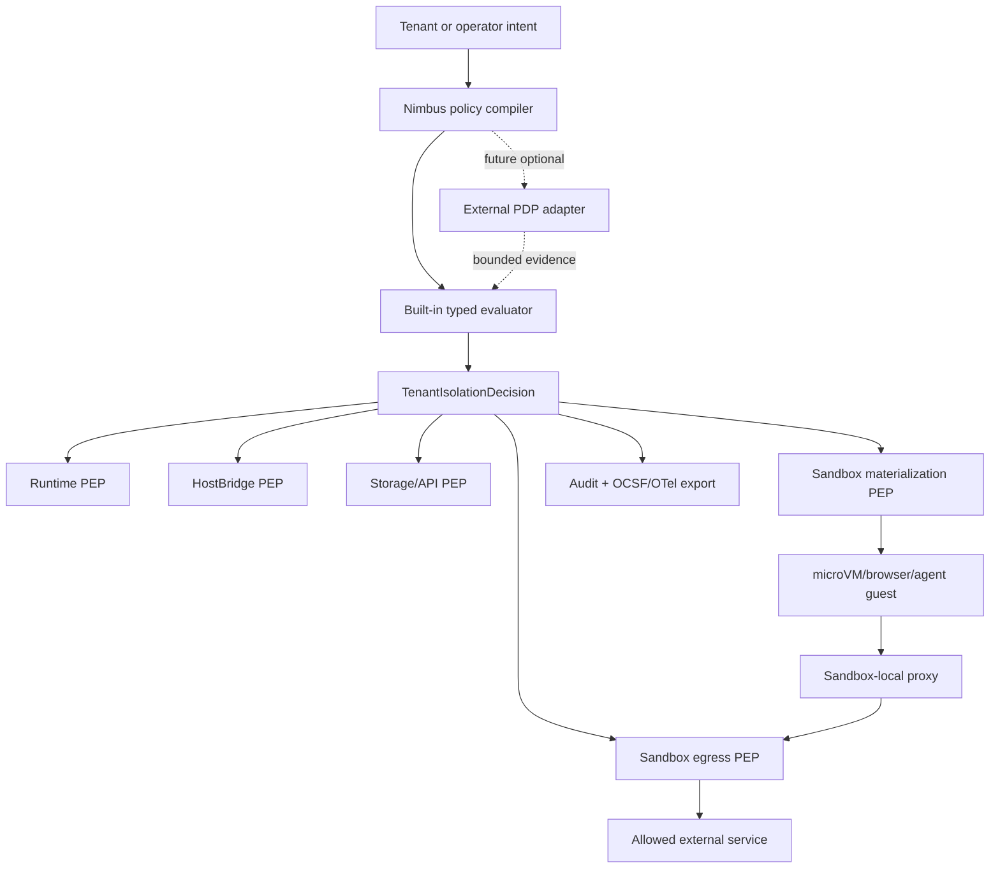

# Plan: Enterprise Policy And Sandbox Egress

Canonical deferred plan for turning the OpenShell competitor review into a
Nimbus-native enterprise trust surface without giving up single-binary
simplicity.

## Status

- **Status:** `deferred`
- **Primary owner:** this plan
- **Activation gate:** promote when one of these becomes product-critical:
  operator-authored tenant/sandbox policy, arbitrary microVM/agent/browser
  guest egress, SIEM-grade security event export, or enterprise policy
  explain/prove/advisor requirements.
- **Research:** `docs/plans/research/openshell-competitor-analysis.md`
- **Current posture references:** `docs/tenant-isolation.md`,
  `docs/architecture/runtime/permission-model.md`,
  `docs/architecture/sandbox/microvm-service-baseline.md`,
  `docs/architecture/server/auth-runtime-trust.md`

## Goal

Make Nimbus enterprise policy and sandbox egress controls explicit, explainable,
testable, and exportable while preserving the single-binary product model.

Nimbus should provide:

- great DX: policy files validate locally, failures explain themselves, and
  local development does not require a policy-engine stack
- enterprise trust: deny-by-default controls, evidence-grade logs, stable
  decision IDs, conformance gates, and optional integration with customer policy
  systems
- a clear safety rule: untrusted runtime or guest code never enforces its own
  authority

## Scope

This plan owns:

- a typed operator policy artifact that compiles into
  `TenantIsolationDecision` inputs
- policy validation, explain, and diff commands
- built-in Rust policy evaluator semantics for tenant isolation, sandbox
  egress, service grants, network endpoints, image/secret/volume policy, quota
  classes, and audit redaction
- optional external policy backend seam for OPA/Rego, Cedar, or future customer
  PDPs after the built-in evaluator is stable
- sandbox-local egress enforcement for `microvm_service`, browser-service, and
  agent workloads that run normal OS processes
- SSRF/internal-address denial, host wildcard validation, L4/L7 endpoint
  policy, and explicit internal-IP allowlists for guest egress
- dynamic versus recreate-required policy lifecycle, including last-known-good
  reload behavior
- OCSF and OpenTelemetry log export mapping for tenant isolation and sandbox
  egress events
- conformance gates for policy evaluation, egress denial, redaction, and drift
- deferred policy advisor and policy prover lanes

This plan does not own:

- replacing `TenantIsolationDecision`
- replacing `RuntimeGrants` or the HostBridge permission model
- secret value storage or provider-auth credential minting
- image signature, SLSA, SBOM, or OCI referrer verification backends
- cluster membership, iroh transport, or openraft replication
- app-level customer authorization inside a tenant

## Policy Engine Posture

Nimbus starts with a built-in typed Rust evaluator. OPA/Rego, Cedar, and
customer PDPs are future optional backends, not mandatory dependencies.

Rationale:

- Nimbus core policy is a product safety contract across runtime, storage,
  sandbox, image, secret, quota, HostBridge, and audit seams. Typed Rust keeps
  that contract refactorable and directly testable.
- OPA/Rego is excellent when customers need general-purpose policy-as-code over
  arbitrary structured inputs. It should be supported only after Nimbus can
  define a stable input/output envelope and fail-closed behavior.
- Cedar is promising for fine-grained application authorization and analyzable
  policy sets. It may become a better fit than OPA for some app/resource
  authorization use cases, but it should not own sandbox materialization or
  egress hardening before the Nimbus policy model stabilizes.
- External policy engines must not override hard built-in denies for tenant
  mismatch, forged identity, raw secrets, unsafe host binds, unverified image
  floors, broad loopback/wildcard runtime grants, or SSRF/internal-address
  hardening.

External policy backend requirements when promoted:

- stable typed input envelope
- versioned output envelope
- policy backend name and version in the decision evidence
- policy bundle hash and input digest in audit output
- timeout and failure modes that fail closed
- deterministic fixture tests for allow, deny, malformed policy, timeout, and
  backend unavailable
- no raw secrets, bearer tokens, or credential material in inputs, outputs, or
  logs

## Architecture Direction



Single-binary shape:

```text
nimbus start
nimbus compose ...
nimbus policy validate|explain|diff|prove
nimbus sandbox-supervisor ...
```

The supervisor may be launched inside a guest by the sandbox backend, but it
should remain packaged and versioned with Nimbus.

## Phase Ledger

| Phase | Status | Goal | Verification |
| --- | --- | --- | --- |
| EPS0 | `todo` | Define typed policy artifact schema and ownership boundaries. | Golden YAML fixtures reject unknown fields, unsafe defaults, and invalid wildcard/port/secret/image shapes. |
| EPS1 | `todo` | Implement built-in policy compiler into `TenantIsolationDecision` inputs. | Unit tests prove compiled decisions match existing tenant isolation decisions and fail closed on malformed policy. |
| EPS2 | `todo` | Add `nimbus policy validate`, `explain`, and `diff`. | CLI fixtures show stable diagnostics, decision traces, and authority delta summaries. |
| EPS3 | `todo` | Define dynamic versus recreate-required policy lifecycle. | Tests prove dynamic egress policy can reload, invalid reload keeps last-known-good, and filesystem/process changes require sandbox recreate. |
| EPS4 | `todo` | Add sandbox-local egress PEP/proxy for process-capable guests. | Linux conformance proves default deny, allowed endpoint success, SSRF denial, wildcard validation, loopback/internal denial, and L7 method/path denial. |
| EPS5 | `todo` | Add OCSF and OpenTelemetry export mapping. | Fixtures prove tenant/sandbox events redact secrets and map to stable OCSF/OTel records with decision IDs. |
| EPS6 | `todo` | Add external policy backend seam without making it mandatory. | Fake OPA/Cedar-style adapters prove allow, deny, malformed output, timeout, and unavailable-backend fail-closed behavior. |
| EPS7 | `todo` | Add denied-event policy draft workflow. | Denied egress fixtures produce minimal draft policy, never auto-apply, and require explicit approval. |
| EPS8 | `todo` | Add policy prove/advisory lane after policy schema stabilizes. | Prover fixtures detect broad egress, write-bypass, secret exposure, or cross-tenant policy regressions with accepted-risk support. |
| EPS9 | `todo` | Publish operator docs and conformance runbook. | One command proves policy validation, egress enforcement, export redaction, external-backend fail-closed, and drift behavior. |

## Success Criteria

- A clean checkout can understand the policy model from docs and run a local
  validation command without installing OPA, Cedar, SPIRE, or a SIEM.
- Built-in policy evaluation is deterministic, typed, and covered by fixtures
  for allowed, denied, malformed, and drifted inputs.
- External policy backends are optional, fail closed, and cannot override hard
  built-in security denies.
- Arbitrary guest egress from process-capable sandboxes is denied by default
  and can be narrowed by host, port, protocol, method/path, and explicit
  internal-IP allowlist.
- Tenant isolation events and sandbox egress events export to an
  enterprise-ingestable format without leaking tokens, credentials, query
  parameters, secret handles, or raw bearer claims.
- Dynamic policy reload has last-known-good semantics; static controls require
  sandbox recreation.
- Operator docs explain when to use in-process runtime grants, `ctx.services`,
  microVM service egress policy, and external policy engines.

## Open Questions

- Should the first external policy adapter target OPA/Rego because of ecosystem
  familiarity, or Cedar because of Rust-native authorization and analyzability?
- Should policy prove start as custom Rust property/conformance checks before
  SMT integration, or adopt a solver once the policy schema lands?
- How much L7 policy belongs in Nimbus versus a future service-mesh or proxy
  integration for cluster deployments?
- Should OCSF export be direct JSONL first, or should the first implementation
  emit OpenTelemetry log records with OCSF payload attributes?

## Consumer Rules

- Runtime engine work must not add broad networking or secret grants to
  `in_process_untrusted` code to compensate for missing sandbox egress policy.
- Browser, WASI agent, and microVM service plans should consume this plan for
  process-capable guest egress rather than inventing separate network policy
  dialects.
- Secret-management and service-identity plans may attach policy evidence and
  OCSF/OTel events, but they still own secret values and credential minting.
- Artifact provenance verification may feed image policy evidence into this
  plan, but cryptographic verification remains owned by
  `docs/plans/artifact-provenance-verification-plan.md`.

## References

- `docs/plans/research/openshell-competitor-analysis.md`
- `docs/tenant-isolation.md`
- `docs/architecture/runtime/permission-model.md`
- `docs/architecture/sandbox/microvm-service-baseline.md`
- `docs/architecture/server/auth-runtime-trust.md`
- `docs/plans/service-identity-provider-auth-plan.md`
- `docs/plans/secret-management-plan.md`
- `docs/plans/artifact-provenance-verification-plan.md`
- `docs/plans/agent-browser-service-plan.md`
- `docs/plans/wasi-agent-capabilities-plan.md`
