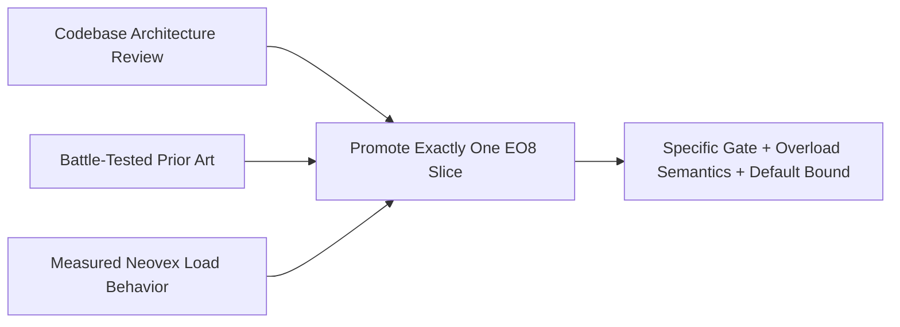

# Plan: Layered Admission Control

Primary deferred design and experiment plan for future `EO8`-style layered
admission-control work.

This document owns the durable forward-looking context for layered admission
control: codebase architecture review, prior art, observability,
instrumentation gaps, experiment design, and promotion criteria.

---

## Status

- **Status:** `deferred`
- **Primary owner:** this plan
- **Activation gate:** promote only after an EO8 experiment report identifies a
  concrete binding admission boundary and the first implementation slice to
  land

## How To Use This Plan

- Read this before promoting any new admission-control work.
- Use it to decide whether a new gate should exist at all, not to justify a
  gate after coding it.
- Treat codebase architecture, battle-tested prior art, and measured Neovex
  behavior as equal inputs.
- If a specific EO8 slice is promoted, update this document with the experiment
  result and then add a concrete implementation plan in this document or in a
  new dedicated execution plan if the slice is large.

## Current Architecture Boundary

- `ARCHITECTURE.md` is the source of truth for the landed runtime, executor,
  shutdown, and backpressure invariants from the completed `EO1` through `EO7`
  cycle.
- This document should not reopen those completed architecture decisions unless
  new measurements or a later active plan justify doing so.

## Why EO8 Exists

`EO1` through `EO7` already landed the first-order ownership and backpressure
controls:

- engine and storage work run on service-owned executors (`EO1`)
- mutations hit an outer CoDel gate before journal ownership transfer (`EO2`)
- subscription work is merged before redundant delivery reevaluation (`EO3`)
- runtime cancellation uses a shared watchdog instead of per-invocation thread
  churn (`EO4`)
- runtime invocations use oversubscribed workers, explicit permits, and
  per-tenant active/in-flight/queued admission (`EO5`)
- dead runtime-host execution paths are gone (`EO6`)
- scheduled jobs fan out across tenants concurrently instead of serializing on
  one slow tenant (`EO7`)

`EO8` is the next layer: isolate latency and overload between work classes only
where those classes still interfere after the existing boundaries are healthy.

`EO8` is **not** "add a queue for every work type." The key architectural
decisions are:

- whether a work class needs its own admission boundary at all
- what resource that boundary protects
- whether overload should wait, shed, reject, or bypass
- whether the limit is global, per-tenant, or both

The specific numeric bound then becomes a default and an operator knob on top
of that architectural decision.

## Current Baseline After EO1 Through EO7

| Work class | Current control | What EO8 would answer next |
|------------|-----------------|----------------------------|
| Mutations | Outer CoDel gate plus journal capacity (`EO2`) | whether any further mutation-specific layering is needed beyond the existing outer/inner split |
| Queries | no dedicated query slot gate today | whether read-serving concurrency needs its own admission boundary |
| Runtime invocations | oversubscribed workers, JS permits, and per-tenant active/in-flight/queued limits (`EO5`) | whether runtime is still the next bottleneck or already sufficiently isolated |
| Storage I/O | service-owned bounded executors and semaphore control (`EO1`) | whether read/write or foreground/background storage budgets need a finer split |
| Scheduled jobs | bounded concurrent tenant fan-out (`EO7`) | whether scheduled jobs need explicit slots separate from foreground work |

## Candidate Admission Map

| Work type | Candidate mechanism | Protected resource | Candidate bound | Promotion trigger |
|-----------|---------------------|--------------------|-----------------|-------------------|
| Mutations (HTTP, WS) | `EO2` outer CoDel gate plus inner queue capacity | journal worker and durable apply path | `mutation_journal_queue_capacity` | already implemented in `EO2` |
| Queries (HTTP, WS) | slots returned on completion | read-serving and query execution concurrency | `max_concurrent_queries` | query latency degrades under mixed load while other existing gates remain below saturation |
| V8 invocations | oversubscribed workers plus JS permits and per-tenant active/in-flight caps | isolate execution and worker occupancy | `max_concurrent_runtime_instances`, `worker_threads`, per-tenant active/in-flight caps | already implemented in `EO5` |
| Storage I/O | semaphore or IOPS-style budget | bounded read/write executor capacity | read/write semaphore counts or explicit IOPS slots | storage wait dominates multiple work classes even when upstream gates are healthy |
| Scheduled jobs | slots returned on completion | scheduler fan-out and scheduled mutation execution concurrency | `max_concurrent_scheduled_jobs` | foreground latency regresses under scheduled-job bursts despite `EO7` bounded fan-out |

## Codebase Architecture Review

The current codebase already tells us where cross-class interference is
possible.

### Mutations

- `crates/neovex-engine/src/service/mutations/journal.rs`
- `crates/neovex-engine/src/tenant.rs`

Mutations already enter a tenant-local outer admission gate before journal
ownership transfer. They are the canonical example of layered admission done on
purpose: shed stale work before it becomes durable journal work, but never
expire once it has crossed the journal boundary.

### Queries

- `crates/neovex-engine/src/service/queries.rs`
- `crates/neovex-engine/src/tenant.rs`

Queries currently have no dedicated slot gate analogous to runtime permits or
mutation admission. That does not automatically mean they need one. It means
query-serving remains a candidate place where mixed load could bleed across
work classes if storage or execution resources are shared.

### Runtime

- `crates/neovex-runtime/src/executor.rs`
- `crates/neovex-runtime/src/worker_loop.rs`
- `crates/neovex-runtime/src/limits.rs`
- `crates/neovex-runtime/src/runtime.rs`

Runtime work already has explicit admission boundaries:

- worker threads are decoupled from JS permits
- parked invocations hold their thread but release their permit
- per-tenant active, in-flight, and queued limits are tracked separately

That means `EO8` should not reopen runtime admission casually. Runtime should
only re-enter the `EO8` discussion if measurements show the current boundaries
still allow a harmful spillover path.

### Storage

- `crates/neovex-storage/src/async_storage.rs`
- `crates/neovex-engine/src/service/background_executor.rs`

Storage already runs on service-owned bounded executors with explicit semaphore
control. The open `EO8` question is not whether storage is bounded. It is
whether the existing storage budgets are too coarse and should eventually split
foreground and background paths or reads and writes.

### Scheduled jobs

- `crates/neovex-engine/src/scheduler.rs`
- `crates/neovex-engine/src/service/scheduler.rs`

Scheduled jobs now have bounded tenant fan-out, which prevents one paused or
slow tenant from serializing all due work. They do not yet have an explicit
scheduled-job slot gate separate from foreground work. `EO8` would only add one
if mixed-load experiments show scheduled bursts still harm user-facing
latencies.

## Prior Art And Best Practices

### CockroachDB

- Local source:
  `cockroachdb/cockroach/pkg/util/admission/admission.go`
- Official docs:
  [Admission control](https://www.cockroachlabs.com/docs/stable/admission-control)
- Official background:
  [Surviving unexpected overload with admission control](https://www.cockroachlabs.com/blog/admission-control-unexpected-overload/)

Why it matters:

- admission is explicitly about limiting overload and isolating important work
  from less important work
- queueing is pushed into a named admission layer instead of being left as an
  emergent property of lower runtime schedulers
- different grant types are modeled differently: slots, tokens, and
  class-specific control are all first-class tools

### Convex

- Local source:
  `get-convex/convex-backend/crates/isolate/src/client.rs`

Why it matters:

- isolate execution fairness is enforced with an explicit scheduler worker pool
- `max_workers` is separate from per-client fairness caps
- one client or tenant is not allowed to monopolize shared execution capacity

### TigerBeetle

- Local source:
  `tigerbeetle/src/stdx/iops.zig`

Why it matters:

- small explicit slot budgets are often better than complex adaptive control
  when the protected resource is obvious
- `acquire()` failing fast and `release()` immediately returning capacity gives
  very clear overload behavior

### Best-practice synthesis

Across these systems, the durable pattern is:

1. gate at the real bottleneck resource
2. keep overload behavior explicit and observable
3. prefer a small number of well-named controls over many overlapping knobs
4. isolate by work class only when the classes materially compete
5. tune from measurements, not from intuition alone

## Observability Already Available In Neovex

Neovex already exposes enough surface to begin an `EO8` experiment without
inventing a new control plane first.

### Runtime diagnostics

- Route: `GET /debug/runtime/metrics`
- Wiring:
  `crates/neovex-server/src/router.rs`,
  `crates/neovex-server/src/http/metadata.rs`
- Snapshot type:
  `crates/neovex-runtime/src/metrics.rs` (`RuntimeMetricsSnapshot`)

Available signal includes:

- active runtime instances
- queued invocations
- worker dispatch totals
- queue wait totals
- execution totals
- rejection and cancellation counts
- per-tenant runtime metrics
- recent request correlations

### Per-tenant engine diagnostics

- Route: `GET /debug/tenants/{tenant_id}/engine/metrics`
- Wiring:
  `crates/neovex-server/src/router.rs`,
  `crates/neovex-server/src/http/metadata.rs`
- Snapshot types:
  `crates/neovex-engine/src/tenant.rs`
  (`TenantEngineDiagnosticsSnapshot`, `MutationAdmissionStats`,
  `MutationJournalStats`, `SubscriptionDeliveryStats`, `QueryPlanningStats`)

Available signal includes:

- mutation admission queue depth, shed count, and CoDel phase
- mutation journal apply lag, queue depth, and wait counts
- subscription delivery queue depth, merge counts, and reevaluation time
- query-planning counts for full scans versus index-backed paths

### Deterministic test surfaces

- `crates/neovex-server/src/tests.rs` includes
  `wait_for_runtime_metrics(...)`
- server integration suites already exercise HTTP, WebSocket, runtime,
  scheduler, and subscription flows deterministically

This is useful for repeatable mixed-load experiments, even though it is not
yet a dedicated long-running load harness.

## Instrumentation Gaps

The current diagnostics are good enough to start experiments. Promote new
instrumentation only when the missing signal blocks a concrete decision.

Likely candidates:

- explicit query concurrency and query wait-time metrics
- scheduled-job concurrency and scheduler-lag metrics
- storage executor wait distributions split by read versus write path
- per-work-class request latency summaries at the server boundary
- tenant skew summaries for query and scheduled-job classes

Avoid adding all of these preemptively. Instrument only what the experiment
actually needs.

## How To Get The Data

There is no first-class `EO8` load harness in the repo today. That is okay.
The data can still be gathered in a disciplined way from existing surfaces.

### Minimum data-collection workflow

1. Start Neovex with representative runtime, scheduler, and storage limits.
2. Drive one workload mix at a time through the existing HTTP, WebSocket,
   runtime, and scheduler-facing interfaces.
3. Capture client-side latency by work class:
   - mutations
   - queries
   - runtime-backed calls
   - scheduled jobs
4. Poll and persist snapshots from:
   - `/debug/runtime/metrics`
   - `/debug/tenants/{tenant_id}/engine/metrics`
5. Correlate the client-side latency shift with queue depth, queue age, wait
   counts, rejection counts, runtime pressure, and scheduler lag.
6. Write a short experiment report that identifies the first clearly binding
   boundary and explicitly states which candidate gates were **not** justified.

### If repeated experiments become common

Add a small dedicated experiment harness rather than ad hoc scripts. That
harness should:

- drive repeatable mixed traffic for mutations, queries, runtime, and scheduled
  jobs
- sample the existing debug endpoints on a fixed cadence
- emit a single per-run artifact with workload parameters and observed metrics

Do **not** implement a new gate just to avoid writing a small harness.

## EO8 Experiment Plan

Treat `EO8` as scientific experimentation before it becomes an implementation
phase.

### Hypotheses to test

- scheduled-job bursts degrade foreground mutation or query latency
- query storms dominate shared read capacity and need their own slot gate
- storage wait, not runtime permits, is the next real bottleneck
- one noisy tenant can still monopolize a work class despite `EO2` and `EO5`

### Workload matrix

| Workload | What it tries to expose |
|----------|--------------------------|
| Mutation-heavy | whether journal apply or storage write pressure spills into other classes |
| Query-heavy | whether read-serving needs its own concurrency boundary |
| Runtime-heavy | whether runtime pressure still bleeds into non-runtime requests despite `EO5` |
| Scheduled-job-heavy | whether background due work harms foreground work despite `EO7` |
| Mixed foreground | whether multiple "healthy alone" classes interfere when combined |
| One noisy tenant plus many quiet tenants | whether fairness gaps remain at the class boundary |
| Reconnect or subscription churn plus writes | whether serving and mutation paths need further isolation |

### Signals to record in every run

- p50, p95, and p99 latency by work class
- wait depth, wait age, and rejection counts at existing gates
- runtime queued, active, and in-flight pressure
- mutation journal apply lag
- storage executor saturation and wait time
- tenant skew and starvation symptoms

### Report format

Every EO8 experiment report should answer:

1. What workload mix was applied?
2. Which existing gate or resource saturated first?
3. Which user-visible symptom regressed first?
4. What is the smallest candidate gate that would isolate that symptom?
5. Why are the other candidate gates not the first move?

## Promotion Matrix

Promote exactly one EO8 slice at a time.

| Promote this slice | Only when the experiment shows |
|--------------------|--------------------------------|
| Query slots | query latency or starvation is the dominant issue and existing runtime or mutation gates are not the binding limit |
| Scheduled-job slots | foreground latency regresses under scheduled-job bursts even after `EO7` bounded fan-out |
| Storage sub-budgets | storage wait dominates across multiple classes and upstream admission is healthy |
| Stronger tenant isolation | one tenant can still monopolize a work class despite current mutation and runtime tenant caps |

If the report does not clearly identify one of those, keep `EO8` deferred.

## Default-Setting Principles

When an EO8 slice is eventually promoted, its initial default should be tied to
an existing protected resource rather than invented as an independent magic
number.

- query-slot defaults should derive from the actual read-serving or storage
  capacity they protect
- scheduled-job slot defaults should derive from scheduler fan-out and the
  downstream capacity scheduled work consumes
- storage budgets should derive from actual executor or semaphore capacity
- tenant caps should derive from the global bound and the intended fairness
  target

This keeps operator knobs sane and avoids double-throttling unrelated paths.

## Verification For A Promoted EO8 Slice

Any future EO8 implementation must prove all of the following:

- the chosen gate improves the targeted p95 or p99 latency or starvation
  symptom
- it does not materially regress unrelated work classes
- overload behavior is explicit and observable
- the default bound is sane under the mixed-load matrix
- the new gate can be tuned independently without creating accidental
  double-throttling

## What Not To Do

- Do not add every candidate gate at once.
- Do not create a separate gate just because a work class exists on paper.
- Do not add knobs whose protected resource is unclear.
- Do not promote a gate without an experiment report that says why it is the
  first correct move.
- Do not let this document drift from `EO8` in the execution-ownership plan.
