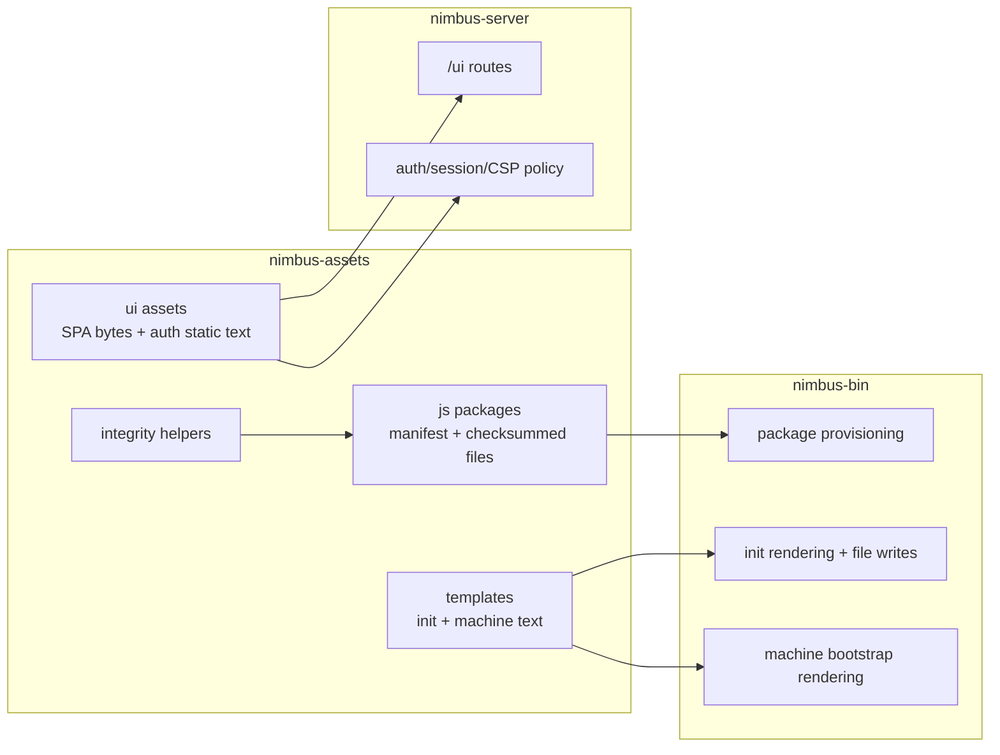

# Nimbus Assets Crate Plan

- **Status:** `proposed`
- **Primary owner:** this plan once activated
- **Goal:** extract in-scope production distribution/UI/template assets into a
  focused `nimbus-assets` crate without turning it into a behavior or policy
  crate.
- **Activation gate:** none yet. Promote when we are ready to touch the
  binary/server build graph and the completed BPD package staging paths.
- **Related plans / references:**
  - `docs/plans/archive/binary-embedded-package-distribution-plan.md` -
    completed baseline for private JS packages embedded in the binary and
    provisioned from `.nimbus/packages/`
  - `docs/plans/distribution-plan.md` - parent binary, release, OCI, and
    install-channel plan
  - `docs/operating/local-dev.md` - canonical local build graph contract
  - `docs/plans/archive/server-crate-extraction-completion-plan.md` -
    precedent for extracting owned seams without moving composition roots

---

## Control Plan Rules

Once activated, this document is the control plane for the asset-crate
extraction. Source of truth, in order:

1. the `Phase Status Ledger`
2. each roadmap phase's success criteria
3. `scripts/verify-nimbus-assets-crate.sh`
4. the `Execution Log`

Rules for execution:

- Work phases in order unless this plan is updated with a dated reason.
- Mark exactly one phase `in_progress` while active work is happening.
- Mark a phase `done` only after its success criteria and required evidence
  are recorded in the execution log.
- Do not move behavior into `nimbus-assets` to satisfy an asset movement gate.
- If a phase touches BPD staging, package closure, CI artifact paths, or
  release asset flow, rerun the BPD verifier before marking the phase done.
- Keep this plan updated before stopping, handing off, or likely context loss.

## Phase Status Ledger

| Phase | Status | Completion gate |
| --- | --- | --- |
| AE0. Inventory and verifier scaffold | `pending` | `scripts/verify-nimbus-assets-crate.sh` records the current in-scope production embed inventory, domain-owned embed allowlist, and passes on the baseline. |
| AE1. Add `nimbus-assets` skeleton | `pending` | Private workspace crate exists with empty default features, feature-gated modules, and feature-gated build checks. |
| AE2. Move JS package embedding | `pending` | BPD package bytes and integrity APIs are owned by `nimbus-assets::js_packages`; BPD verifier still passes. |
| AE3. Move UI asset embedding | `pending` | UI bytes are owned by `nimbus-assets::ui`; server UI/auth behavior tests still pass. |
| AE4. Move production templates | `pending` | Init and machine production templates are owned by `nimbus-assets::templates`; CLI output stays equivalent. |
| AE5. Dependency and build cleanup | `pending` | Old direct embed dependencies/checks are removed or explicitly justified; build comments point at the asset owner. |
| AE6. Closeout | `pending` | Final verifier, BPD verifier, docs validation, format check, focused tests, and agreed broad gate pass. |

## Why this plan exists

The `nimbus` binary and server path now embed several distinct classes of
distribution-facing bytes:

- dependency-closed JS package payloads staged by
  `scripts/stage-embedded-packages.mjs` under
  `crates/nimbus-bin/embedded-packages/`
- the operator UI SPA built under `packages/nimbus-ui/dist/`
- local auth page assets in `crates/nimbus-server/assets/`
- `nimbus init` scaffold templates under `crates/nimbus-bin/templates/`
- machine bootstrap and systemd templates under
  `crates/nimbus-bin/src/machine/assets/`

That spread is understandable historically, but it makes asset ownership look
incidental: the server owns some bytes, the binary owns some bytes, and the
BPD package payload is staged under a binary crate even though other crates
must reason about the product's embedded-asset contract.

The extraction should make enterprise-facing behavior easier to audit:

- all in-scope distribution assets have one catalog crate
- each consumer enables only the asset family it needs
- integrity checks, missing-asset build failures, and asset enumeration live
  beside the embedded bytes
- routing, auth, provisioning, codegen policy, and runtime behavior stay in
  their current owning crates

This is not a "junk drawer" if the crate has a narrow job: own embedded bytes
and expose typed accessors. It becomes a problem only if product logic starts
moving into it.

## Decision

Create a private workspace crate named `nimbus-assets`.

Use `nimbus-assets`, not `nimbus-embed`, because "assets" describes the
crate's domain while "embed" sounds like an embedder-facing API or a generic
mechanism crate. The crate is an asset catalog, not a new product facade.

`nimbus-assets` owns:

- compile-time embedding of in-scope production asset families
- feature-gated asset accessors
- shared integrity helpers for embedded bytes
- build-time checks that generated or staged asset roots exist when a feature
  requires them
- tests that prove the embedded catalog matches manifests and expected files

`nimbus-assets` does not own:

- HTTP route behavior, CSP policy, auth/session flow, or UI redirects
- package provisioning, app selection, dependency installation, or codegen
  execution policy
- adapter semantics or runtime bundle admission
- release packaging, OCI image layout, or install-script policy
- domain-owned runtime shims, adapter system bundles, or generated registries
- test fixtures that are deliberately local to a crate

## Scope Boundary

This plan intentionally targets the asset families currently split across
`nimbus-bin` and `nimbus-server` for product distribution, UI serving, app
scaffolding, and machine bootstrap. It does not mean every `include_str!` or
`include_bytes!` in the workspace should move.

Domain-owned embeds that should remain with their owning crate unless a future
plan says otherwise:

- `crates/nimbus-runtime/src/module_loader/embedded_builtins.rs` - Node
  compatibility shims are runtime semantics, not distribution assets.
- `crates/nimbus-runtime/src/limits/axes.rs` - the Node LTS lane registry is
  runtime-support policy data owned by the runtime plan.
- `crates/nimbus-convex/src/registry/loading.rs` - the generated system Convex
  bundle and manifests carry Convex registry semantics.
- crate-local tests, golden files, policy fixtures, compatibility corpora, and
  source self-inspection includes stay beside their owner unless this plan
  explicitly names them.

The verifier must encode this allowlist so the plan is enforceable without
pretending that domain-specific embedded code/data belongs in a shared asset
catalog.

## Current State

### JS package payload

`crates/nimbus-bin/src/embedded_packages.rs` owns the BPD payload:

- `#[derive(Embed)]` with
  `#[folder = "$CARGO_MANIFEST_DIR/embedded-packages/"]`
- manifest parsing and validation
- per-file checksum verification
- package materialization for provisioned packages
- embedded tooling lookup
- tests for expected embedded packages

The payload root is generated by `scripts/stage-embedded-packages.mjs` and
currently hard-coded in:

- `Makefile`
- `scripts/check-package-closure.mjs`
- `scripts/stage-embedded-packages.mjs`
- `.github/workflows/ci.yml`
- `.github/workflows/coverage.yml`
- `.github/workflows/release.yml`
- `crates/nimbus-bin/build.rs`
- `scripts/verify-binary-embedded-package-distribution.sh`

### UI assets

`crates/nimbus-server/src/http/ui.rs` owns the operator UI embedding:

- `#[derive(Embed)]` over `packages/nimbus-ui/dist/`
- `include_str!` for `crates/nimbus-server/assets/auth.html`
- `include_str!` for `crates/nimbus-server/assets/auth.js`
- SPA fallback, asset content-type handling, auth page rendering, and CSP hash
  tests

Only the bytes and byte lookup belong in the asset crate. Route behavior,
auth decisions, cookie/session handling, and CSP header assembly stay in
`nimbus-server`.

### Templates

`crates/nimbus-bin/src/init.rs` embeds scaffold templates with `include_str!`:

- Convex schema, messages, package template, `tsconfig`, and gitignore
- Cloud Functions Firebase config, package template, `tsconfig`, entrypoint,
  and gitignore

`crates/nimbus-bin/src/machine/bootstrap.rs` embeds machine bootstrap templates:

- ready service
- nimbus service and socket units
- virtiofs service and mount templates

These are production templates and should move into `nimbus-assets::templates`.
The CLI commands still own rendering, prompting, filesystem writes, and
installation behavior.

### Local fixtures

Some `include_str!` uses should stay where they are:

- crate-local tests and golden files
- policy fixtures owned by the crate being tested
- any future corpus or compatibility fixtures intentionally scoped to a test
  module

The verifier must distinguish production assets from local fixtures so the
plan does not become a mechanical "move every include" exercise.

## Target Shape

```text
crates/nimbus-assets/
  Cargo.toml
  build.rs
  src/
    lib.rs
    integrity.rs
    js_packages.rs
    templates.rs
    ui.rs
  embedded/
    packages/
      manifest.json
      ...
    templates/
      convex/
      cloud-functions/
      machine/
```

`packages/nimbus-ui/dist/` remains the built UI output. Do not copy committed
UI build products into the crate. The assets crate embeds that generated
directory by path and makes the missing-dist error actionable from its own
`build.rs`.

### Feature Contract

`nimbus-assets` uses explicit features:

```toml
[features]
default = []
ui = ["dep:rust-embed"]
js-packages = ["dep:rust-embed", "dep:serde", "dep:serde_json", "dep:sha2"]
templates = []
all = ["ui", "js-packages", "templates"]
```

Expected consumers:

- `nimbus-server` enables `ui`
- `nimbus-bin` enables `js-packages` and `templates`
- the public Rust facade crate does not re-export `nimbus-assets`

The exact dependency list may change during implementation, but the principle
does not: consumers opt into asset families precisely.

### Public API Shape

`nimbus_assets::ui`:

- `asset(path: &str) -> Option<EmbeddedAsset>`
- `iter() -> impl Iterator<Item = Cow<'static, str>>`
- `index_html() -> Option<EmbeddedAsset>`
- `auth_page_template() -> &'static str`
- `auth_page_script() -> &'static str`

`nimbus_assets::js_packages`:

- `manifest() -> EmbeddedPackageManifest`
- `manifest_digest() -> String`
- `package_names() -> impl Iterator<Item = &'static str>`
- `file(path: &str) -> Option<EmbeddedAsset>`
- `verify_manifest_integrity() -> Result<()>`
- `materialize_package(...) -> Result<MaterializedPackage>`
- `materialize_tooling(...) -> Result<ToolingPackage>`

`nimbus_assets::templates`:

- `templates::convex::*` accessors for init scaffolding
- `templates::cloud_functions::*` accessors for Cloud Functions scaffolding
- `templates::machine::*` accessors for systemd and virtiofs bootstrap files

The API returns typed bytes and text. It should not know whether a CLI command
is running `init`, `dev`, `packages provision`, or `machine bootstrap`.

### Boundary Diagram



## Roadmap

### AE0. Inventory and Verifier Scaffold

Status: `pending`

Add `scripts/verify-nimbus-assets-crate.sh` before moving code. The first
version is an inventory gate that records current in-scope production embed
sites and fails if new in-scope asset embedding is added outside the plan.

Verifier conditions:

- identifies `crates/nimbus-bin/src/embedded_packages.rs` as the current BPD
  package embedding owner
- identifies `crates/nimbus-server/src/http/ui.rs` as the current UI embedding
  owner
- identifies production `include_str!` template sites in `init.rs` and
  `machine/bootstrap.rs`
- allowlists domain-owned embeds that remain outside this plan, with a short
  reason for each allowlist entry
- excludes crate-local tests and fixtures from production-asset movement
- requires this plan to be listed from `docs/plans/README.md`

Success criteria:

- The verifier script exists, is executable, and uses named checks with
  readable PASS/FAIL output.
- The script passes against the current baseline before any asset movement.
- The script fails if a new in-scope production `rust-embed` root or production
  distribution/template `include_str!` appears outside the inventoried owners.
- The phase ledger and execution log record AE0 evidence.

Required evidence:

- `bash scripts/verify-nimbus-assets-crate.sh`
- `npm run docs:validate-refs:strict`
- `git diff --check -- docs/plans/nimbus-assets-crate-plan.md scripts/verify-nimbus-assets-crate.sh`

### AE1. Add `nimbus-assets` Skeleton

Status: `pending`

Add the workspace crate with empty-default features and narrow modules:

- `integrity`
- `ui`
- `js_packages`
- `templates`

Add feature-gated `build.rs` checks:

- `ui` requires `packages/nimbus-ui/dist/index.html`
- `js-packages` requires the staged package manifest at the current BPD root
- `templates` requires the template directories once they move

At the end of AE1, consumers may not yet use the crate. The win is that the
catalog boundary, build errors, and verifier are real before ownership moves.

Success criteria:

- `crates/nimbus-assets/Cargo.toml` is a workspace member and is private
  (`publish.workspace = true`, using the workspace `publish = false` policy).
- `default = []`, `ui`, `js-packages`, `templates`, and `all` features exist.
- `src/lib.rs` exposes only feature-gated asset modules and shared integrity
  helpers.
- `build.rs` reports actionable missing-asset messages for every enabled asset
  family.
- Existing consumers have not changed behavior yet, except for any mechanical
  dependency wiring explicitly recorded in this phase.
- The verifier now checks the crate skeleton and feature contract.

Required evidence:

- `npm run build -w nimbus-ui`
- `npm run build:embedded-packages`
- `cargo fmt --all --check`
- `cargo check -p nimbus-assets --no-default-features`
- `cargo check -p nimbus-assets --features all`
- `bash scripts/verify-nimbus-assets-crate.sh`

### AE2. Move JS Package Embedding

Status: `pending`

Move the BPD payload API from `nimbus-bin` into
`nimbus_assets::js_packages`.

Recommended sequencing:

1. First move Rust API ownership while preserving the existing generated root
   path, so package provisioning behavior remains byte-for-byte comparable.
2. Then move the generated package root to
   `crates/nimbus-assets/embedded/packages/`.
3. Update every BPD touchpoint in one bounded patch:
   - `Makefile`
   - `scripts/stage-embedded-packages.mjs`
   - `scripts/check-package-closure.mjs`
   - `.github/workflows/ci.yml`
   - `.github/workflows/coverage.yml`
   - `.github/workflows/release.yml`
   - `crates/nimbus-bin/build.rs`
   - `scripts/verify-binary-embedded-package-distribution.sh`
4. Keep BPD closeout claims true: provisioned package roots remain private,
   dependency-closed, checksummed, and generated from the same source packages.

`nimbus-bin` keeps package selection, destination paths, app reconciliation,
and user-facing CLI behavior.

Success criteria:

- `nimbus_assets::js_packages` owns the embed root, manifest parsing, digest
  calculation, checksum verification, embedded file lookup, package
  materialization primitives, and embedded tooling lookup.
- `nimbus-bin` owns only provisioning decisions, destination paths, CLI
  messages, app reconciliation, and filesystem orchestration.
- If the generated payload root moves, all BPD hard-coded paths move in the
  same phase.
- Package names, staged manifests, checksums, and provisioned output remain
  semantically unchanged.
- The BPD verifier and asset verifier both cover the new root.

Required evidence:

- `npm run build:embedded-packages`
- `node scripts/check-package-closure.mjs`
- `cargo test -p nimbus-assets --features js-packages`
- `cargo test -p nimbus-bin provision::tests`
- `bash scripts/verify-binary-embedded-package-distribution.sh`
- `bash scripts/verify-nimbus-assets-crate.sh`

### AE3. Move UI Asset Embedding

Status: `pending`

Move UI byte access into `nimbus_assets::ui`.

`nimbus-server` keeps:

- HTTP route mounting
- SPA fallback behavior
- content-type decisions
- auth-page rendering flow
- CSP header construction
- redirect/session/cookie behavior

`nimbus-assets` owns:

- `UiAssets`
- static auth page template and script bytes
- iteration and lookup over embedded UI files
- tests that prove `index.html`, `auth.html`, and `auth.js` are available

Server tests should exercise behavior through the server API while using the
asset crate as the byte source.

Success criteria:

- `nimbus_assets::ui` owns the SPA embed root and auth static bytes.
- `nimbus-server` no longer declares the production UI `rust-embed` root.
- UI asset lookup, index fallback, auth page script/template bytes, content
  type behavior, and CSP hash behavior remain unchanged.
- `nimbus-server` keeps all route, auth, session, redirect, and CSP policy
  decisions.
- The verifier rejects new production UI embedding outside `nimbus-assets`.

Required evidence:

- `npm run build -w nimbus-ui`
- `cargo test -p nimbus-assets --features ui`
- `cargo test -p nimbus-server http::ui::tests`
- `cargo test -p nimbus-server local_ui`
- `bash scripts/verify-nimbus-assets-crate.sh`

### AE4. Move Production Templates

Status: `pending`

Move production templates into `nimbus_assets::templates`:

- Convex init scaffold templates
- Cloud Functions init scaffold templates
- machine bootstrap unit and virtiofs templates

`nimbus-bin` keeps:

- template rendering and substitutions
- filesystem writes and overwrite prompts
- package provisioning/install decisions
- machine bootstrap command flow

Avoid migrating unrelated test fixtures or policy fixture files in this phase.

Success criteria:

- Convex and Cloud Functions init templates live under
  `nimbus_assets::templates`.
- Machine bootstrap unit and virtiofs templates live under
  `nimbus_assets::templates`.
- `nimbus-bin` owns rendering, substitution, prompts, writes, install
  decisions, and machine bootstrap flow.
- Existing init and machine tests either assert byte-for-byte output
  equivalence or explicitly document intentional template changes.
- Local fixtures and golden files remain beside their owning tests.

Required evidence:

- `cargo test -p nimbus-assets --features templates`
- `cargo test -p nimbus-bin init::tests`
- `cargo test -p nimbus-bin machine::bootstrap::tests`
- `bash scripts/verify-nimbus-assets-crate.sh`

### AE5. Dependency and Build Cleanup

Status: `pending`

Remove duplicate embedding dependencies and checks:

- remove direct `rust-embed` dependency from `nimbus-bin` if no other direct
  use remains
- remove direct `rust-embed` dependency from `nimbus-server` if no other direct
  use remains
- retire asset-existence checks from `nimbus-bin/build.rs` and
  `nimbus-server/build.rs` once `nimbus-assets/build.rs` owns them
- keep any non-asset build metadata generation in the original crate
- update build comments in `Makefile` and CI workflow comments so they point
  at the new asset owner

This phase is complete only when the old crate-local embed code cannot drift
from the asset catalog.

Success criteria:

- `nimbus-bin` has no direct `rust-embed` dependency unless a local exception
  is documented here.
- `nimbus-server` has no direct `rust-embed` dependency unless a local
  exception is documented here.
- Asset existence checks live in `nimbus-assets/build.rs`; old build scripts
  retain only non-asset responsibilities.
- `Makefile`, CI comments, and release workflow comments point at the new
  asset owner where relevant.
- The verifier checks for old direct embed roots and old direct embed
  dependencies, plus any accidental production use of the `all` feature.

Required evidence:

- `cargo fmt --all --check`
- `cargo check -p nimbus-bin`
- `cargo check -p nimbus-server`
- `bash scripts/verify-nimbus-assets-crate.sh`
- `bash scripts/verify-binary-embedded-package-distribution.sh`

### AE6. Closeout

Status: `pending`

Close the plan when all in-scope production distribution/UI/template assets
have a clear owner and all behavioral consumers remain behavior owners.

Required evidence:

- `bash scripts/verify-nimbus-assets-crate.sh`
- `bash scripts/verify-binary-embedded-package-distribution.sh`
- `npm run docs:validate-refs:strict`
- `cargo fmt --all --check`
- the focused `nimbus-assets`, `nimbus-bin`, and `nimbus-server` test commands
  named in AE2, AE3, and AE4
- broader `make check` unless the owning goal explicitly records a narrower
  accepted gate

Success criteria:

- Every ledger row is `done`.
- The final verifier passes and covers all final success criteria.
- BPD closeout guarantees still hold after the package payload ownership move.
- Docs and local-dev comments no longer describe stale asset ownership.
- The execution log records exact commands and outcomes.
- No open decision remains unresolved unless converted into a follow-up plan.

## Success Criteria

- `crates/nimbus-assets` exists as a private workspace crate.
- In-scope production distribution/UI/template asset bytes are owned by
  `nimbus-assets`.
- `nimbus-bin` and `nimbus-server` consume asset accessors instead of owning
  in-scope production `rust-embed` roots.
- The BPD package payload remains dependency-closed, private, checksummed, and
  provisioned from the binary.
- The UI serving behavior is unchanged from a user perspective.
- Init and machine bootstrap output remains byte-for-byte equivalent except
  for intentional template changes explicitly recorded in this plan.
- Missing generated/staged assets fail with actionable build errors from the
  asset crate.
- The public Rust facade does not re-export the asset crate.
- No auth, routing, provisioning, codegen, adapter, or release policy migrates
  into `nimbus-assets`.

## Control-plane Verifier

The final verifier should be a shell script with explicit named checks rather
than a single large grep block. Suggested conditions:

1. `crates/nimbus-assets/Cargo.toml` exists and is a workspace member.
2. `nimbus-assets` declares `ui`, `js-packages`, `templates`, and `all`
   features with an empty default.
3. `nimbus-server` depends on `nimbus-assets` with the `ui` feature.
4. `nimbus-bin` depends on `nimbus-assets` with `js-packages` and `templates`
   features.
5. In-scope production `#[derive(Embed)]` sites live only under
   `crates/nimbus-assets`.
6. Production scaffold and machine templates are not embedded directly from
   `nimbus-bin`.
7. `nimbus-bin` and `nimbus-server` do not directly depend on `rust-embed`
   unless a local exception is documented in this plan.
8. BPD package staging and closure scripts point at the `nimbus-assets`
   package payload root.
9. `nimbus-assets` tests verify package manifest integrity.
10. `nimbus-server` UI behavior tests still pass.
11. `nimbus-bin` init/provisioning tests still pass.
12. `crates/nimbus/src/lib.rs` does not re-export `nimbus_assets`.
13. `docs/plans/README.md` references this plan.
14. Domain-owned embeds outside `nimbus-assets` are explicitly allowlisted with
    owner and rationale.
15. No production dependency enables `nimbus-assets` with the `all` feature.

## Autonomous `/goal` Prompt

Use this prompt to run the whole plan to completion:

```text
/goal Execute docs/plans/nimbus-assets-crate-plan.md to completion.

Treat the plan as the control plane. Start by reading README.md,
ARCHITECTURE.md, docs/README.md, docs/plans/README.md, and
docs/plans/nimbus-assets-crate-plan.md, then inspect the current asset owners
and domain-owned embed allowlist before editing. Work the ledger in order from
AE0 through AE6. Keep exactly one phase in_progress at a time, update the phase
ledger before and after each phase, and add execution-log evidence with exact
commands and outcomes.

Do not move behavior into nimbus-assets. The crate may own embedded bytes,
typed accessors, integrity helpers, feature-gated build checks, and tests.
Routing, auth, CSP policy, provisioning decisions, codegen execution, adapter
semantics, release policy, prompts, filesystem writes, and machine bootstrap
flow stay in their current owner crates.

For each phase, satisfy the phase success criteria and run the required
evidence commands before marking it done. If a phase touches BPD staging,
package closure, CI artifact paths, or release asset flow, also run
bash scripts/verify-binary-embedded-package-distribution.sh before marking the
phase done. Keep scripts/verify-nimbus-assets-crate.sh current as the final
control-plane verifier.

Do not mark the goal complete until every ledger row is done, all open
decisions are resolved or converted into an explicit follow-up, the final
verifier passes, BPD still passes, docs validation passes, format passes,
focused nimbus-assets/nimbus-bin/nimbus-server tests pass, and make check has
passed or the plan records a concrete accepted narrower gate.
```

## Risks and Mitigations

- **Risk: The asset crate becomes a behavior dump.**
  Mitigation: keep API return types byte/text oriented and reject auth,
  routing, provisioning, codegen, adapter, and release-policy imports.

- **Risk: Moving the BPD staging root breaks CI artifact flow.**
  Mitigation: phase the Rust API move separately from the generated-root move,
  and run the BPD verifier after the root move.

- **Risk: The public facade accidentally exposes or pulls every asset family.**
  Mitigation: keep default features empty, do not re-export `nimbus-assets`
  from `crates/nimbus`, and ensure consumers never use the `all` feature in
  production dependencies. The existing facade already depends on
  `nimbus-server`, so compiling UI assets through that path is current
  baseline behavior; this plan must not add JS package or template assets to
  that facade path.

- **Risk: Missing UI or package payload errors become harder to understand.**
  Mitigation: move the actionable build messages into
  `nimbus-assets/build.rs` before deleting the old build checks.

## Open Decisions

- Should the staged JS package root move immediately in AE2, or should the
  first implementation keep the generated root under `nimbus-bin` until the
  asset API migration is proven?
- Should `auth.html` and `auth.js` live under
  `crates/nimbus-assets/embedded/ui-auth/`, or under
  `crates/nimbus-assets/embedded/templates/server-auth/`?
- Should machine bootstrap templates share one `templates::machine` module, or
  split into `templates::machine::systemd` and `templates::machine::virtiofs`
  if the set grows?

## Execution Log

| Date | Change | Evidence |
| --- | --- | --- |
| 2026-06-01 | Created proposed plan for `nimbus-assets` extraction. | `npm run docs:validate-refs:strict`; `git diff --check -- docs/plans/README.md docs/plans/nimbus-assets-crate-plan.md`; trailing-whitespace scan. |
| 2026-06-01 | Added control-plane rules, phase ledger, per-phase success criteria, required evidence, and autonomous `/goal` prompt. | `npm run docs:validate-refs:strict`; `git diff --check -- docs/plans/nimbus-assets-crate-plan.md docs/plans/README.md`; trailing-whitespace scan. |
| 2026-06-01 | Audited scope wording against current workspace embeds; narrowed this plan to in-scope distribution/UI/template assets, added domain-owned embed allowlist requirement, and added generated-asset prerequisites before the early `--features all` check. | `npm run docs:validate-refs:strict`; `git diff --check -- docs/plans/nimbus-assets-crate-plan.md docs/plans/README.md`; trailing-whitespace scan. |
