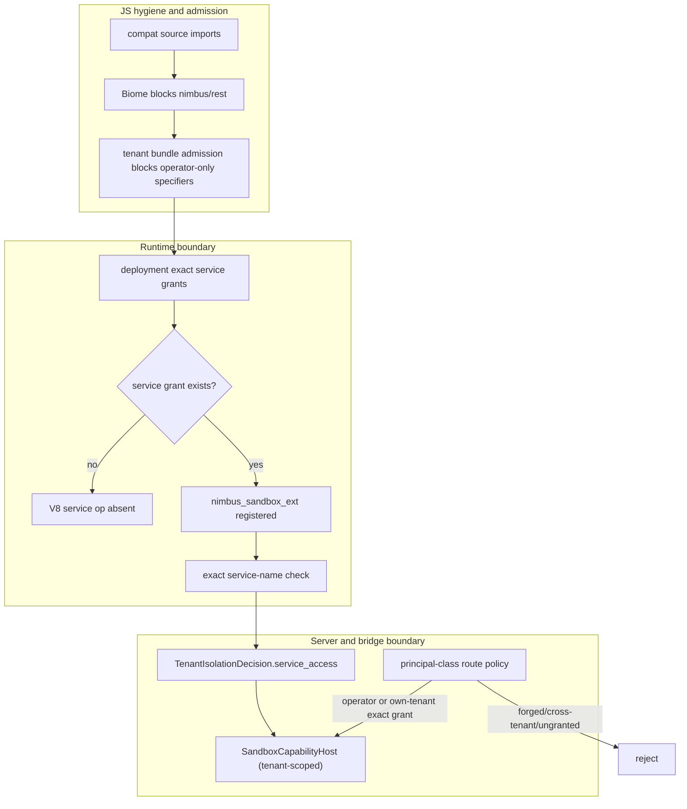

# Nimbus Capability Segregation Plan

Status: proposed; goal-ready control plane
Created: 2026-05-30
Research backing: docs/plans/research/capability-isolation-prior-art.md
Last readiness review: 2026-06-01 (rebased after BPD completion; JS boundary is lint/admission-only)
Control gate: bash scripts/verify-nimbus-capability-segregation.sh

---

## 0. Orientation for a fresh agent (read this first)

What this plan does. It hardens the privileged "services" capability (sandbox
microVM service lookup/lifecycle) and the REST control plane so they are reachable
only by AUTHORIZED PRINCIPALS, while keeping the Convex/Firebase/MongoDB/DynamoDB
compatibility surfaces pure. It also renames one overloaded type so the word
"service" has a single meaning repo-wide.

Two consumers of the `nimbus` package, two principal classes:

- Operators (the `nimbus-ui` admin console, which already depends on `nimbus`)
  act ACROSS tenants over HTTP -- create/list/delete tenants, grant services,
  manage any tenant's machines and services.
- Apps / adapters / dynamic workers / dynamic sandboxes act WITHIN one tenant.
  Deployed tenant function code reaches services only for its own tenant, only
  when that tenant is granted.

Authorization is by PRINCIPAL CLASS resolved server-side, never by which package
was imported (section 2a).

The capability already exists and is partially gated today. In-isolate, services
are reached via `ctx.services.<name>` -> `op_nimbus_ctx_service_lookup`
(`HostCallOperation::CtxServiceLookup`) -> the runtime's exact
`RuntimeGrants.service` check -> the bridge's `TenantIsolationDecision`
`service_access(...)` check -> the server-owned service registry. A missing exact
service grant is already denied before the host bridge is called, and the Convex
bridge re-checks the tenant decision before resolving the binding. The remaining
hardening target is narrower and more auditable: remove the service op from the
always-registered V8 extension/snapshot, express granted service access as an
explicit tenant-scoped capability object, and put HTTP service lifecycle routes
behind principal-class authorization.

Two distinct reach paths to services (gate both):

- In-isolate path: tenant function -> CtxServiceLookup op -> exact
  `RuntimeGrants.service` + tenant-decision check -> tenant-scoped
  SandboxCapabilityHost -> services. Today the exact grant/decision checks exist;
  CB5 adds V8 op absence unless at least one service is granted, and CB4 turns
  the bridge side into an explicit optional capability object.
- HTTP path: operator console / client -> `nimbus/rest` ->
  `/api/tenants/.../services/*` -> services. Today these routes live in the local
  admin route family; CB8 makes the principal-class rule explicit and testable.

One-paragraph mental model. A tenant's JS function runs in a V8 isolate built by
a Rust host bridge. The function can only call capabilities the host registered
as deno_core ops. The runtime registers ~83 typed `op_nimbus_*` ops in one
extension (`nimbus_runtime_ext`); the host-facing ones funnel through a shared
`op_nimbus_async_host_call(HostCallOperation, payload)` dispatcher into the
`HostBridge` trait. The current exact service grant already denies unauthorized
lookup payloads; this plan also moves the privileged service op(s)
(CtxServiceLookup, plus any future service ops) into a SEPARATE extension
(`nimbus_sandbox_ext`) added to a deployment's isolate only when that deployment
has one or more exact service grants, and removes them from the shared extension
and the snapshot. Ungranted means the op is not registered -> unreachable from
JS. Granted means the op is present, but the requested service name is still
checked against exact grants and the tenant decision. Operators do not go through
a tenant isolate; they call the control plane over HTTP as a cross-tenant
principal, gated server-side. The JS import/lint boundary is for developer
ergonomics, not security.

The three things called "service" (do not conflate):

| Term | What it is | This plan |
| --- | --- | --- |
| `nimbus_engine::Service` | engine coordinator (tenant registry, persistence, scheduler, triggers) | renamed to `Engine` (CB1); stays shared by all adapters |
| `nimbus_services` / `SandboxServiceManager` / `ctx.services.<name>` / `/services/*` / compose `services:` | sandbox/microVM service lifecycle + lookup | kept; the privileged, grant-gated capability |
| REST control plane (`/api/tenants/*` admin, `/api/machines/*`) | direct platform admin | kept; privileged, principal-gated |

Decisions are settled (section 7). Implement and verify -- no architecture
choices remain. The hard/high-effort parts are flagged in section 5a (Risks);
read it before estimating.

How to execute: this document is the durable control plane for CB0..CB9. The
source of truth is the current git worktree plus this plan's control rules,
phase ledger, success criteria, verifier contract, and execution log. Do not
rely on chat history as progress state. Each phase lists files to touch and an
evidence-bearing gate. Do them in order; CB1 (a mechanical rename) lands first
and alone.

Pre-launch rules apply (root AGENTS.md/CLAUDE.md): breaking changes over shims,
no back-compat aliases, fix root causes, tests assert behavior.

Recent completed baseline to honor (section 5b): binary-embedded-package-
distribution controls the private, binary-embedded package roots and makes
`@nimbus/core` a deliberately rejected extraction in this plan. Active plan to
coordinate with: node-default-runtime-support-hardening (touches the
`nimbus`/`nimbus/deno` shim surface).

## 0a. Control plan rules

This plan is the autonomous execution record for capability segregation. A fresh
agent must be able to resume it from disk without prior transcript context.

Source of truth, in order:

1. current git worktree and branch state;
2. this plan's `Control plan rules`, `Phase status ledger`, `Verifiable success
   criteria`, `Control-plane verifier`, `/goal` prompt, and `Execution log`;
3. `docs/adapters/convex/ai-guidelines.md` before touching Convex-compatible code
   or generated Convex import surfaces;
4. `docs/architecture/server/auth-runtime-trust.md` and
   `docs/architecture/runtime/adapter-boundary.md` for the landed auth/runtime
   boundary.

Status model:

- `todo`: not started; eligible when hard dependencies are satisfied.
- `in_progress`: actively being implemented; keep exactly one phase in this
  state during an autonomous execution run.
- `blocked`: cannot proceed without violating a plan invariant or weakening a
  gate; record the blocker in the execution log before stopping.
- `done`: the phase gate passed and concrete verification evidence is recorded.
- `retired`: pre-execution design branch intentionally removed; do not implement
  it. The verifier asserts the retired design stays absent.

Recovery loop for every new session:

1. Reread this section, the phase ledger, the success criteria, the verifier
   contract, and the execution log.
2. Inspect `git status --short` and reconcile existing changes to the responsible
   phase before starting new work.
3. If any phase is `in_progress`, resume that phase first.
4. Otherwise start the lowest-numbered `todo` phase whose dependencies are
   satisfied.
5. Update the phase ledger when a phase moves `todo -> in_progress -> done`, and
   add an execution-log row with the exact verification command output summary.
6. Run the phase gate before marking a phase done; run the control-plane verifier
   before final closeout.

---

## 1. Current state (As-Is)

JS packages (root package.json `workspaces` = explicit list of `packages/*` +
`demos/*`; there is NO `packages/*` glob -- new packages must be added by name):

- BPD completed on 2026-05-31: every `packages/*` workspace is `"private": true`
  and Nimbus-owned JS surfaces are distributed through the `nimbus` binary as
  embedded/provisioned package roots under `<app>/.nimbus/packages/*`.
- packages/nimbus -- canonical SDK; exports ./server ./values ./browser ./react
  ./rest; no `dependencies` (no upstream convex).
- packages/convex -- compat; exports ./server ./values ./browser ./react; deps:
  nimbus, @nimbus/codegen, esbuild in the source workspace. Its provisioned
  manifest keeps only the embedded `nimbus` runtime dependency; in-binary codegen
  means `@nimbus/codegen` is not installed into apps.
- packages/firebase (@nimbus/firebase), packages/mongodb (@nimbus/mongodb),
  packages/dynamodb (@nimbus/dynamodb) -- protobuf/connect/mongodb/aws deps; none
  import `nimbus`.
- packages/nimbus-ui -- the OPERATOR console; depends on nimbus (imports
  nimbus/react + nimbus/browser today; NOT nimbus/rest yet). routes/operator/* +
  routes/developer/*.
- NimbusRestClient lives in packages/nimbus/src/rest.ts (zero internal imports --
  fully self-contained). Its only in-repo user is demos/nimbus/html (app code).
  No JS services() API exists.
- Linter is Biome, configured only in packages/nimbus-ui/biome.json. No root
  Biome config, no ESLint, no dependency-cruiser anywhere. Root npm scripts:
  build, test, typecheck (no `lint`).
- No `packages/core` / `@nimbus/core` package exists, and this plan must not add
  one. The only JS separation retained here is import lint plus tenant runtime
  bundle admission for operator-only entries such as `nimbus/rest`.

Rust:

- HTTP -> router.rs -> adapter surface builds a per-deployment HOST BRIDGE.
- The `HostBridge` trait has exactly TWO production impls: `ConvexHostBridge`
  (crates/nimbus-server/src/adapters/convex/host_bridge/) and
  `CloudFunctionsHostBridge` (the SEPARATE crate crates/nimbus-cloud-functions/).
  firebase/mongodb/dynamodb adapters have NO host bridge -- they are wire-protocol
  adapters that hit the engine directly, never running tenant JS in an isolate.
- ALL bridges impl `RuntimeCapabilityHost` (capabilities.rs `fn service()`).
- No SandboxCapabilityHost trait or explicit granted-capability object. Exact
  per-deployment service grants DO exist today as `RuntimeGrants.service` and as
  `TenantIsolationDecision.services`, both empty by default.
- Tenant fn runs in a V8 isolate; host calls go through ~83 typed ops in the
  single `nimbus_runtime_ext` extension (ops.rs), each host-facing op funneling
  through `op_nimbus_async_host_call(HostCallOperation, payload)` into the bridge.
  The privileged service op `op_nimbus_ctx_service_lookup`
  (HostCallOperation::CtxServiceLookup) is registered there UNCONDITIONALLY, but
  `ops/shared.rs` already rejects requests whose service name is absent from the
  exact runtime grant list before calling the bridge.
- The runtime extension set is also baked into a process-wide V8 STARTUP SNAPSHOT
  (runtime/bootstrap/snapshot.rs); warm isolates are pooled and reused across
  invocations. So the op surface is fixed once, not per-deployment.
- A SECOND backend exists: crates/nimbus-runtime/src/backends/bun_jsc/
  (JavaScriptCore/Bun) does NOT use deno_core ops; it exposes host operations
  through a single JSON C-ABI host-call callback (one channel, all operations).
  v8/ is the primary backend; bun_jsc is feature-gated and not the default.
- The Convex bridge already calls `local_enforcement().service_access(...)` before
  resolving service bindings, so a service missing from the tenant isolation
  decision returns `PermissionDenied`.
- Services routes exist in the local-admin router:
  `/api/tenants/{tenant}/services/{name}/start|stop|restart`, backed by
  nimbus_services::SandboxServiceManager. They are protected by local admin
  access when `local_server_security` is configured, but they are not yet modeled
  as a server-authoritative principal-class policy that distinguishes operator,
  tenant, and spawned-resource callers.
- deno_permissions profiles are built in runtime_capabilities.rs
  (`build_permissions_container`) but not specialized per function tier.
- nimbus_engine::Service -- the overloaded name.
- Identity primitives ALREADY EXIST (reuse, do not reinvent):
  - operator principal: crates/nimbus-server/src/local_server/ (re-exporting
    nimbus_operator: LocalAdminTokenRecord, LocalServerCredentialMode) --
    operator sessions + local admin token.
  - tenant/deployment principal: `nimbus_auth::ApplicationAuthVerifier`
    (crates/nimbus-auth/src/lib.rs), with nimbus-server helper resolution in
    crates/nimbus-server/src/application_auth.rs and the Convex verifier factory
    in crates/nimbus-server/src/router.rs.
  - spawned-resource identity: TenantWorkloadStableIdentity from
    TenantIsolationDecision.
  - the bridge already carries tenant_id, invocation_kind (the tier),
    TenantIsolationDecision, and a PrincipalContext per invocation
    (adapters/convex/host_bridge/bridge.rs).
  - PrincipalContext (nimbus-core/src/auth/mod.rs) is the IN-FUNCTION end-user
    identity (ctx.auth) and a claims bag -- it has NO operator/tenant/spawned
    discriminant. Do not conflate it with the authz principal class.
  (all documented in docs/architecture/server/auth-runtime-trust.md)

Problems:

1. "services" the engine-coordinator and "services" the sandbox concept collide
   in one word.
2. The privileged services/control-plane surface has uneven gates. Exact runtime
   service grants and tenant-decision checks exist, but the V8 op is still
   registered for every deployment/snapshot, there is no explicit
   `SandboxCapabilityHost` capability object, and HTTP service lifecycle routes
   are not yet governed by one principal-class authorization model.
3. Authorization does not distinguish PRINCIPAL CLASSES. An operator
   (cross-tenant, over HTTP) and a tenant deployment (own-tenant) are not
   separated at the gate, so one flat rule cannot serve both correctly.

## 2. End state (To-Be)

JS packages:

- `nimbus` stays the single embedded app-facing package for the Nimbus JS
  surface: unprivileged entries (`./server`, `./values`, `./browser`, `./react`)
  plus the privileged `./rest` entry (tenants/schema/docs +
  startService/stopService/restartService).
- nimbus-ui (operator) depends on nimbus and uses nimbus/rest for the control
  plane (plus nimbus/react + nimbus/browser for the realtime surface).
- Compat packages may continue depending on `nimbus` for unprivileged re-exports
  such as `nimbus/server`, `nimbus/browser`, `nimbus/react`, and `nimbus/values`.
  This is an internal embedded-package dependency, not a security boundary.
- Do NOT add `@nimbus/core` / `packages/core` in this plan. BPD made the
  structural JS package wall an extra embedded root plus closure edge, while the
  research already grounds JS separation as ergonomics only.
- Codegen output UNCHANGED: generated _generated/* stays adapter-namespaced
  (`convex/server` or `nimbus/server`, driven by codegen's `packageNamespace`).
  Do NOT retarget generated code to any `@nimbus/core` package (that would break
  Cvx fidelity, the convex selftest, and the convex demos).
- Lint (Biome `noRestrictedImports`): compat PACKAGE SOURCE
  (packages/{convex,firebase,mongodb,dynamodb}/src/**) must not import
  `nimbus/rest` or any future operator-only JS entry. Unprivileged `nimbus/*`
  entries remain allowed. Scope as a target-allowlist on those dirs; nimbus-ui,
  demos/**, and end-user app code are exempt.

Rust:

- nimbus_engine::Engine (renamed); RuntimeCapabilityHost::engine() is shared.
- The existing exact `RuntimeGrants.service` plus `TenantIsolationDecision`
  services set is the canonical per-deployment service grant (off by default);
  do not replace it with a broad boolean or wildcard grant.
- NEW SandboxCapabilityHost capability object (nimbus-bridge): tenant-scoped
  service binding lookup and allowed service activation only. It must not expose
  `/api/tenants`, `/api/machines`, local-admin tokens, operator sessions, or any
  other control-plane authority. Bridges expose it through an optional accessor
  such as `sandbox_capabilities() -> Option<&dyn SandboxCapabilityHost>`; the
  underlying trait is implemented by a granted capability wrapper, not magically
  per instance by an otherwise identical bridge type.
- NEW grant-gated op extension `nimbus_sandbox_ext`: the relocated service op(s)
  (CtxServiceLookup + future service ops), added to a deployment's V8 isolates by
  the execution path ONLY when granted, and REMOVED from the shared
  `nimbus_runtime_ext` and the snapshot. Ungranted V8 isolate -> op absent ->
  unreachable.
- Backend-agnostic floor: the bridge's `HostBridge::call` refuses the
  CtxServiceLookup-class operations unless the requested service is exact-granted
  and the tenant decision authorizes it. This covers bun_jsc (single JSON
  channel, no per-op surface) and is defense-in-depth for V8.
- Server gate (auth-runtime-trust) authorizes by PRINCIPAL CLASS: operator =
  cross-tenant (audited); tenant = own-tenant + grant; spawned resource =
  spawning-tenant scope. (section 2a)
- Per-tier deno_permissions: query/mutation = no net/fs; action = widened.
- microVM isolation (nimbus-libkrun) remains the backstop for service workloads
  and for host-heavy runtimes routed to the `microvm_service` tier; it is not
  claimed as containment for an in-process V8 engine escape.

Reachability rule, end state:

- Operator (nimbus-ui): operator session over HTTP -> /api/tenants,
  /api/machines/*, /services/* across ANY tenant: ALLOWED, audited.
- Tenant function, NOT granted for any service: the in-function service op is
  absent on V8 and refused at the bridge/host-call floor on every backend.
- Tenant function, GRANTED for service `db`: the op may be present, but only
  `db` is accepted; any other service name is rejected by exact grant and tenant
  decision checks. Every successful call is scoped to THIS tenant.

## 2a. Principal and Authorization Model

Authorization is by PRINCIPAL CLASS, resolved server-side at the nimbus-server
middleware layer from the existing seams below. This is NOT the in-function
`PrincipalContext` (that is the end-user identity inside ctx.auth, a claims bag
with no class discriminant -- CB8 adds the class as a new discriminant/wrapper,
not by overloading PrincipalContext).

| Principal | Authenticates via (existing seam) | Authority | Reaches services how |
| --- | --- | --- | --- |
| Operator | local_server session / local admin token (local_server/ -> nimbus_operator) | global cross-tenant: create/list/delete tenants, grant services, manage any tenant's machines/services; every action audited | HTTP control plane (nimbus/rest from nimbus-ui); never through a tenant isolate |
| Tenant | deployment identity (`nimbus_auth::ApplicationAuthVerifier`; nimbus-server `application_auth.rs` helpers) | own tenant only; services only if that exact service is granted | grant-gated service op in its isolate (CB5) + exact grant/decision refusal unless granted (CB4); server re-checks own-tenant scope (CB8) |
| Spawned resource (dynamic worker / sandbox) | TenantWorkloadStableIdentity from its TenantIsolationDecision | inherits the spawning tenant's scope; never escalates, never wildcards | same grant-gated path as its tenant; identity is decision-derived |

Hard rules:

- Operator credentials never resolve inside a tenant isolate -- the local admin
  token / operator session is not reachable from tenant JS (the auth doc already
  mandates this for agents). Enforced by CB7a.
- A tenant principal can never resolve to operator -- distinct credential classes
  (deployment bearer via `nimbus_auth::ApplicationAuthVerifier` vs local_server
  session/token).
- Spawned-resource identity is decision-derived -- a worker/sandbox gets its
  tenant scope from the admitted TenantIsolationDecision, not from any string it
  passes, so it cannot claim another tenant.
- Operator control plane and tenant service plane stay separate: no Rust trait
  passed into a tenant isolate may expose operator route authority, machine
  management, tenant creation/deletion, admin-token rotation, or local session
  material.

## 3. Why this design

Full sourcing in docs/plans/research/capability-isolation-prior-art.md.

- An unregistered op is unreachable from JS (V8/deno_core). JS can only call Rust
  through registered ops; an op the host never adds to an isolate has no V8 entry
  point. The existing exact service-grant checks remain authoritative, and
  moving the service op behind grant-gated registration reduces the exposed host
  surface for ungranted isolates. Convex (runtime tier), Cloudflare Workers
  (bindings on env), and Deno embedders use this "binding/op exists only when
  configured" model.
- The op-absence boundary is V8-specific. bun_jsc uses one JSON host-call channel
  with no per-op surface, so op-absence cannot express "deny services" there. For
  bun_jsc (and as defense-in-depth on V8) the boundary is the bridge refusing the
  CtxServiceLookup-class operations unless the requested service is
  exact-authorized (CB4), plus the server gate (CB8). The exact grant must drive
  every effect together -- optional capability object, V8 op registration, and
  backend-agnostic dispatch refusal -- so no backend is looser than another.
- One thread is one privilege level. Code in one V8 realm shares one privilege
  level, so privileged services lives in the Rust host path and the grant-gated
  op is the only crossing. CB7a enforces this as a tested invariant.
- Three limits of op gating shape later phases: it does not contain a V8 engine
  escape inside the same Nimbus process; it does not replace exact service-name
  grant checks once the op is present; and it breaks if a shared op internally
  calls privileged code (CB6 guard). Host-heavy or broader-OS workloads must move
  to the `microvm_service` tier instead of pretending in-process V8 is a VM.
- In-process JS hardening (SES/LavaMoat) is not needed. It only helps when
  privileged and untrusted JS share a realm, which CB7a forbids. Non-goal, with a
  documented re-open condition.
- Privileged routes use principal-class + identity gating -- the client is never
  trusted. Attenuated tokens (macaroon/Biscuit) are out of scope unless
  delegation is required.

## 4. Grounding (verified 2026-06-01; anchor on the symbol/string, not the line)

Line numbers drift every commit; grep the anchor.

| Anchor (grep this) | Location |
| --- | --- |
| `pub struct Service` ("Top-level Nimbus engine service") | crates/nimbus-engine/src/service/mod.rs |
| `ServiceBootstrapParts`, `SERVICE_BACKGROUND_TASK`, `ServicePersistenceConfig` | same file (rename satellites) |
| `fn service(&self) -> &Arc<Service>` | crates/nimbus-bridge/src/capabilities.rs (trait) + lib.rs (impl) |
| whole-word `Service` rename blast radius | large -- well over a thousand refs across ~290 .rs files; use rust-analyzer rename, not manual sed |
| `op_nimbus_ctx_service_lookup` / `HostCallOperation::CtxServiceLookup` (privileged in-isolate capability) | runtime: runtime/bootstrap/ops/async_services.rs + host.rs; grant check in runtime/bootstrap/ops/shared.rs; bridge handler: adapters/convex/host_bridge/function_ops/ctx_ops/runtime_calls.rs (`local_enforcement().service_access(...)`) |
| `extension!( nimbus_runtime_ext, ops = [...~83 ops...] )` + `fn runtime_extension()` | crates/nimbus-runtime/src/runtime/bootstrap/ops.rs |
| shared host-call dispatcher | `op_nimbus_async_host_call(state, HostCallOperation::X, payload)` (ops/async_*.rs) |
| V8 startup snapshot (bakes the op set) | crates/nimbus-runtime/src/runtime/bootstrap/snapshot.rs; `snapshot_extensions` + `execution_extensions` both push `runtime_extension()` (extensions.rs) |
| bun_jsc backend (single JSON host-call channel, no deno ops) | crates/nimbus-runtime/src/backends/bun_jsc/ |
| `/services/{service_name}/start|stop|restart`; `/api/tenants`; `/api/machines/*` | crates/nimbus-server/src/router.rs |
| `SandboxServiceManager` | nimbus_services; imported in nimbus-server construction.rs, service_manager.rs |
| `pub trait HostBridge` | crates/nimbus-runtime/src/host.rs |
| `PermissionsContainer` builder | crates/nimbus-runtime/src/runtime_capabilities.rs (`build_permissions_container`) |
| `deno_permissions` pin | Cargo.toml (workspace dep; also git-overridden to the nimbus/deno fork) |
| CloudFunctions bridge (separate crate) | crates/nimbus-cloud-functions/src/host_bridge.rs |
| operator principal seam | crates/nimbus-server/src/local_server/ (re-exports nimbus_operator) |
| tenant principal seam | crates/nimbus-auth/src/lib.rs (`ApplicationAuthVerifier`); nimbus-server helpers in crates/nimbus-server/src/application_auth.rs |
| in-function end-user identity (NOT the authz principal) | crates/nimbus-core/src/auth/mod.rs `PrincipalContext`, `PrincipalClaimSource` |
| readiness audit proof | docs/plans/proof/nimbus-capability-segregation/readiness-audit-2026-06-01.md |
| codegen import target (packageNamespace; NOT @nimbus/core) | packages/codegen/src/{app.mjs,main.mjs,emit/generated_files.mjs}; managed set `MANAGED_PACKAGE_NAMES` in module_specifiers.mjs |
| BPD embedded package roots / closure gates | Makefile `EMBEDDED_PKG_DIRS`; root package.json `build:embedded-packages`; scripts/stage-embedded-packages.mjs `PROVISIONED`; scripts/check-package-closure.mjs `REQUIRED_PROVISIONED`; scripts/build-js-package.mjs `SANITIZE`; crates/nimbus-bin/src/embedded_packages.rs `EXPECTED` |
| JS linter | packages/nimbus-ui/biome.json (Biome; no ESLint / dependency-cruiser anywhere) |
| engine-Service prose to sweep in CB1 | ARCHITECTURE.md (~33 `Service` hits incl. the Execution Domains table, `ServicePersistenceConfig`, Service-owned background runtime) + docs/architecture/** |
| de-brand: browser strings | packages/nimbus/src/browser.ts (4 "convex ..." strings incl. the `convex-` request-id prefix) |
| de-brand: react string | packages/nimbus/src/react.ts ("convex paginated query failed") |
| de-brand: runtime string | crates/nimbus-runtime/src/runtime/bootstrap/source.rs ("convex httpAction requires an authenticated identity") |
| de-brand: `.nimbus/convex` path (grep `\.nimbus/convex`) | 5 files: runtime_capabilities.rs; runtime/bootstrap/ops/test_runtime/bundle.rs; runtime/tests/basic_invocation/node_capabilities.rs; runtime/tests/basic_invocation/support.rs; runtime/tests/node/mod.rs |

## 5. Defense-in-depth layering

- Layer 1 SOURCE IMPORT HYGIENE (ergonomics): compat package source may depend on
  `nimbus` for unprivileged entries but must never import `nimbus/rest` or any
  future operator-only JS entry.
- Layer 2 STATIC LINT (ergonomics): Biome noRestrictedImports in compat package
  source, not app code, in CI.
- Layer 2' TENANT BUNDLE ADMISSION (real boundary for tenant code): add codegen
  and runtime bundle admission checks that reject tenant function graphs importing
  `nimbus/rest` or any future operator-only JS entry.
- Layer 3 GRANT-GATED OP (REAL boundary, V8): the service op is added to a
  deployment's isolates ONLY when the deployment has at least one exact service
  grant, via the execution path, NOT the snapshot. Ungranted -> op absent ->
  unreachable.
- Layer 3' PERMISSION TIER: per-isolate deny-by-default deno_permissions profile
  (query/mutation = no net/fs; action = widened).
- Layer 4 SERVER GATE BY PRINCIPAL + BRIDGE REFUSAL (REAL boundary; AWS-Lambda
  "client never trusted"): /services/* + control plane authorize by principal
  class -- operator = cross-tenant (audited); tenant = own-tenant + exact
  service grant; spawned = spawning-tenant scope. The bridge refuses service ops
  without exact authorization, covering every backend (incl. bun_jsc).
- Layer 5 MICROVM ISOLATION: nimbus-libkrun bounds service workloads and any
  runtime routed to the `microvm_service` tier; it is not cited as containment for
  same-process V8.

Layers 1-2 are developer ergonomics. Layers 3 and 4 are the real boundaries.
Layer 5 bounds blast radius.

Boundary diagram:



Rust capability split. SandboxCapabilityHost is a tenant-scoped granted
capability object, not an operator-control trait and not a compile-time impl that
magically varies per bridge instance. A bridge exposes `None` or `Some(granted
capability)` through an explicit accessor. The existing exact service grant
decides three things together: (a) the optional capability object exists for the
granted service set, (b) the execution path adds nimbus_sandbox_ext to that
deployment's V8 isolates when at least one service is granted, (c) dispatch
refuses service ops whose service name is not exact-authorized (the
backend-agnostic floor).

- RuntimeCapabilityHost: shared -- engine() (coordinator), storage, principal;
  implemented by both production bridges.
- SandboxCapabilityHost: privileged but tenant-scoped -- service binding lookup
  and permitted activation only. No operator control-plane methods.
  firebase/mongodb/dynamodb have no bridge, so the in-isolate path is N/A for
  them; their only services reach would be the HTTP path (CB8).

## 5a. Risks / hard parts (read before estimating)

- HARDEST -- snapshot + warm-pool vs per-deployment ops (CB5). The op set is
  baked into a process-wide V8 startup snapshot and warm isolates are pooled and
  reused across invocations. "Add the service op only when granted" therefore
  requires: (a) remove the service op(s) from `nimbus_runtime_ext` and the
  snapshot; (b) add `nimbus_sandbox_ext` only via the per-runtime execution path,
  keyed on a grant flag threaded from where the bridge/deployment is known down
  to the extension-assembly point (extensions.rs / driver construction); and (c)
  segment the warm isolate pool so granted and ungranted isolates never share a
  pooled instance. This is the highest-effort, highest-risk phase.
- bun_jsc backend has no per-op surface (single JSON host-call channel), so
  op-absence does not apply; rely on the CB4 bridge refusal + CB8. Today bun_jsc
  is feature-gated and not default, so the gap is latent -- state it, don't skip
  it.
- The privileged op already exists (`CtxServiceLookup`) and is in the shared
  extension/snapshot today. It is exact-grant checked today, so CB5 is a
  RELOCATION + op-surface minimization of an existing op, not the first
  authorization check. It must confirm the exact privileged op set (any other
  `op_nimbus_ctx_service_*` or future lifecycle ops) before moving them.
- Per-instance trait semantics are easy to get wrong. Rust trait impls are
  type-level; CB4 must use a granted wrapper or optional capability accessor, not
  claim the same bridge type both implements and does not implement a trait per
  deployment instance.
- Per-tier permissions (CB7) hit the same snapshot/warm-pool wall: tier
  (InvocationKind) is known at the bridge/context but NOT at the permission/
  extension assembly point; threading it down implies pool segmentation by tier
  too.
- PrincipalContext has no class discriminant; CB8 adds a new principal-class type
  rather than overloading it.
- The retired `@nimbus/core` extraction is now a trap, not a phase. BPD made it a
  new embedded root plus closure edge across package staging, closure checking,
  sanitized manifests, Makefile build inputs, workspace metadata, embedded-package
  tests, provisioning, and optional codegen management. Do not reintroduce it in
  this plan.

## 5b. Coordination with BPD and active plans

- binary-embedded-package-distribution (BPD0..BPD8) is complete and archived. It
  keeps every `packages/*` package private and distributes app-facing JS from
  embedded, dependency-closed package roots provisioned to
  `<app>/.nimbus/packages/*`.
- Because BPD is now the baseline, CB2 is retired: do not add `packages/core`,
  do not add `@nimbus/core` to root workspaces, `EMBEDDED_PKG_DIRS`,
  `build:embedded-packages`, `stage-embedded-packages.mjs`, closure
  `REQUIRED_PROVISIONED`, build `SANITIZE`, embedded-package `EXPECTED`, package
  provisioning selection, or `MANAGED_PACKAGE_NAMES`.
- If a future plan wants a structural JS package wall anyway, it must own the
  full BPD touchpoint list as a separate packaging change. This capability plan
  keeps the JS boundary to lint plus tenant bundle admission because JS is
  ergonomics here; Rust op absence, bridge refusal, and server authorization are
  the security boundaries.
- node-default-runtime-support-hardening: references a `nimbus`/`nimbus/deno`
  shim surface; coordinate naming so lint/admission rules for `nimbus/rest` do
  not diverge from that shim.

## 6. Phases

Each non-retired phase lists Goal, Files, Steps, Gate. Do not advance until the
gate passes.

Dependency chain:

- CB0 then CB1 (CB1 lands alone, first).
- JS track: CB2 is retired; CB3 is the only JS implementation phase.
- Rust capability track: CB4 then CB5 then CB6.
- Runtime hardening: CB7, CB7a.
- CB8 (server gate) depends on CB4 (explicit capability object/refusal exists).
- CB9 (de-brand + guards) is last.

JS track (CB3) and Rust track (CB4..CB8) are independent after CB1 and may
run in parallel.

### Phase status ledger

| Phase | Status | Hard dependencies | Verifiable success signal |
| --- | --- | --- | --- |
| CB0 | `todo` | none | Baseline contract test and verifier stub land; current public compat exports are frozen. |
| CB1 | `todo` | CB0 | Engine coordinator is renamed from `Service` to `Engine`; no stale engine-`Service` references outside archive; full Rust gates pass. |
| CB2 | `retired` | BPD completed baseline | No `packages/core` / `@nimbus/core` root is added; compat packages may keep the embedded `nimbus` dependency; generated imports stay adapter-namespaced. |
| CB3 | `todo` | CB1 | `nimbus/rest` is the privileged JS REST client; Biome lint blocks operator-only imports in compat source while allowing operator/demo code. |
| CB4 | `todo` | CB1 | `SandboxCapabilityHost` is optional and tenant-scoped; both production bridges refuse ungranted service ops and reject non-exact service names. |
| CB5 | `todo` | CB4 | V8 ungranted isolates do not register the service op or snapshot it; granted isolates register it only when exact service grants exist; warm pool is capability-segmented. |
| CB6 | `todo` | CB5 | Tests prove no ungranted V8 op or bun_jsc host call reaches the sandbox capability path indirectly. |
| CB7 | `todo` | CB5 | Per-tier deno permissions are threaded to isolate construction and pool segmentation; query/mutation deny ambient net/fs while actions get only configured authority. |
| CB7a | `todo` | CB3; CB5 | Tenant runtime bundle admission rejects operator-only JS imports; realm-separation and operator-credential absence tests pass. |
| CB8 | `todo` | CB4 | Principal-class route policy is enforced for operator, tenant, and spawned-resource callers with positive and negative integration tests. |
| CB9 | `todo` | CB1-CB8 | De-brand/regression guards pass; final closeout gates and the control-plane verifier pass. |

### CB0 - Baseline and frozen contract
- Goal: lock the consumer-visible compat API so later phases cannot regress it.
- Files: new test under packages/; scripts/verify-nimbus-capability-segregation.sh
  (stub, gate-style: `#!/usr/bin/env bash`, `set -u`, PASS/FAIL counters,
  numbered conditions, final "N passed, N failed", exit 1 on any fail -- match
  the existing gate verifiers such as scripts/verify-node-dbus-binding.sh, NOT the
  `set -euo pipefail` build scripts).
- Steps: snapshot the public export surface of convex, @nimbus/firebase,
  @nimbus/mongodb, @nimbus/dynamodb, and the unprivileged surface of
  nimbus as a contract test.
- Gate: contract test green on current main.

### CB1 - Rename engine coordinator Service to Engine (foundational; commit alone)
- Goal: free the word "service" for the sandbox concept only.
- Files: crates/nimbus-engine/src/service/** (Service to Engine,
  ServiceBootstrapParts to EngineBootstrapParts, ServicePersistenceConfig to
  EnginePersistenceConfig, SERVICE_BACKGROUND_TASK to ENGINE_BACKGROUND_TASK);
  nimbus-bridge capabilities.rs + lib.rs (service() to engine()); every
  Arc<Service> / service: field across the affected ~290 files. Optionally rename
  dir service/ to engine/. ALSO sweep rustdoc + prose that names the engine
  Service: ARCHITECTURE.md (~33 hits incl. the Execution Domains table,
  ServicePersistenceConfig, Service-owned background runtime) and
  docs/architecture/** (adapter-boundary.md, auth-runtime-trust.md,
  adapter-expectations.md). Leave docs/plans/archive/** untouched (history).
- Steps: prefer rust-analyzer rename; else scoped sed + cargo check loop. Do NOT
  touch nimbus_services, SandboxServiceManager, ctx.services, /services/*,
  service_manager.rs, op_nimbus_ctx_service_lookup, or any sandbox-services usage.
- Gate: cargo fmt --all --check, make check, make test green;
  `grep -rn 'nimbus_engine::Service\b'` returns nothing outside
  docs/plans/archive/; ARCHITECTURE.md has no stale engine-`Service` prose.

### CB2 - Retired @nimbus/core extraction (JS structural wall)
- Goal: document the rejected branch so execution does not recreate stale BPD
  work.
- Files: none during implementation. The verifier may inspect package metadata,
  Makefile, BPD staging scripts, codegen managed package names, and
  embedded-package tests to prove the retired root stayed absent.
- Steps: do NOT create `packages/core`; do NOT add `@nimbus/core` to root
  workspaces, `EMBEDDED_PKG_DIRS`, root `build:embedded-packages`,
  stage-embedded-packages `PROVISIONED`, closure `REQUIRED_PROVISIONED`,
  build-js-package `SANITIZE`, crates/nimbus-bin embedded-package `EXPECTED`,
  package-provision selection, or codegen `MANAGED_PACKAGE_NAMES`. Compat
  packages may keep depending on the embedded `nimbus` package for unprivileged
  re-exports.
- Gate: verifier proves no `@nimbus/core` package/root exists and generated
  imports remain adapter-namespaced (`convex/*` or `nimbus/*`). This row stays
  `retired`, not `done`.

### CB3 - nimbus/rest as the privileged JS entry + Biome import lint (JS Layer 2)
- Goal: one privileged JS client; lint keeps it out of compat package source.
- Files: packages/nimbus/src/rest.ts (add startService/stopService/restartService
  wrapping /api/tenants/{t}/services/{name}/*); a Biome config covering the compat
  packages (today only nimbus-ui has biome.json -- add a shared/root config or
  per-compat-package config); CI wiring.
- Steps: use Biome `noRestrictedImports` (the repo standard; do NOT add ESLint or
  dependency-cruiser) to forbid importing `nimbus/rest` and any future
  operator-only JS entry, scoped as a target-allowlist on
  packages/{convex,firebase,mongodb,dynamodb}/src/**. Do NOT match demos/** or
  nimbus-ui (they may import `nimbus/rest`), and do NOT forbid unprivileged
  compat imports such as `nimbus/server`, `nimbus/browser`, `nimbus/react`, or
  `nimbus/values`. Add a `lint` step (`biome lint`) to the `js` job in
  .github/workflows/ci.yml -- which today runs build+test only; ALSO add the
  missing `npm run typecheck` step there. To make the lint a true merge gate,
  either add `js` to `rust-gate-summary.needs` or mark it required. Add verifier
  assertions for the restricted-import rule and for CB2's retired
  `@nimbus/core` absence.
- Gate: a planted import in compat package source fails CI lint; legitimate
  nimbus/rest use in nimbus, nimbus-ui, and demos/nimbus/html all pass.

### CB4 - SandboxCapabilityHost object + exact-grant bridge refusal (Rust)
- Goal: represent service access as an explicit tenant-scoped capability object,
  while preserving the backend-agnostic floor that refuses ungranted service ops.
- Files: crates/nimbus-bridge/src/capabilities.rs (new trait); deployment
  config/state (nimbus-server construction.rs/state.rs); BOTH production bridges --
  crates/nimbus-server/src/adapters/convex/host_bridge/** AND the separate crate
  crates/nimbus-cloud-functions/src/host_bridge.rs; the HostBridge dispatch path
  that handles HostCallOperation::CtxServiceLookup (and any sibling service ops).
- Steps: add SandboxCapabilityHost exposing only tenant-scoped service binding
  lookup and allowed activation; no operator control-plane methods. Reuse the
  existing exact `RuntimeGrants.service` and `TenantIsolationDecision.services`
  inputs; do not add a broad boolean or wildcard grant. Bridges expose an
  optional granted capability object (`None` when no service is exact-granted;
  `Some(&dyn SandboxCapabilityHost)` through a wrapper such as
  `GrantedSandboxCapabilities` when exact grants exist). In dispatch, refuse
  CtxServiceLookup-class operations with a deterministic capability error unless
  the requested service name is exact-granted and authorized by the tenant
  decision. This is the boundary that covers bun_jsc and is defense-in-depth for
  V8.
- Gate: for both bridges, an ungranted deployment's service-op dispatch returns a
  capability error and `sandbox_capabilities()` returns None; a deployment granted
  only `db` returns Some, succeeds for `db`, and rejects any other service name;
  make check green.

### CB5 - Relocate the service op into a grant-gated extension (Rust Layer 3, V8)
- Goal: the service op exists in a V8 isolate only when the deployment has one or
  more exact service grants.
- Files: crates/nimbus-runtime/src/runtime/bootstrap/ops.rs (new
  `nimbus_sandbox_ext` holding the relocated service op(s); remove them from
  `nimbus_runtime_ext`); extensions.rs (execution path adds nimbus_sandbox_ext
  conditionally; snapshot path never includes it); snapshot.rs (ensure the
  service op is no longer baked in); driver construction + warm-pool code (thread
  the grant; segment the pool so granted/ungranted isolates never share an
  instance).
- Steps: first confirm the exact privileged op set (CtxServiceLookup today; check
  for other service ops). Move them to nimbus_sandbox_ext. Thread a
  `service_capability_enabled` flag derived from the existing exact service-grant
  set to the execution-extension assembly point. Add nimbus_sandbox_ext ONLY in
  execution_extensions when at least one service is exact-granted; never in
  snapshot_extensions. Partition the warm isolate pool by capability-enabled vs
  disabled state. Do not weaken to "register always, gate at dispatch" -- CB4
  already provides the dispatch floor; CB5's value is true op-absence on V8.
- Gate: an ungranted V8 deployment calling the service op fails because the op is
  ABSENT (not merely refused); a V8 deployment granted only `db` has the op,
  succeeds for `db`, rejects any other service name through existing exact-grant
  checks, and is tenant-scoped; the op is not present in the snapshot;
  capability-enabled and disabled isolates are not drawn from the same warm pool.

### CB6 - Shared-op dispatch guard
- Goal: ensure no op reachable by ungranted/compat isolates reaches privileged
  code indirectly.
- Files: test/lint in nimbus-runtime; review checklist. Cover BOTH the
  nimbus_runtime_ext surface AND the bun_jsc JSON host-call surface.
- Steps: enumerate ops/host-calls available to an ungranted deployment; assert
  none dispatches to the services catalog/lifecycle or returns an over-broad
  reference.
- Gate: test asserts no ungranted-reachable op or bun_jsc host call resolves a
  SandboxCapabilityHost path; checklist documented.

### CB7 - Per-tier deno_permissions profiles (Rust Layer 3')
- Goal: deny-by-default ambient authority by function tier.
- Files: crates/nimbus-runtime/src/runtime_capabilities.rs
  (build_permissions_container); the construction/warm-pool site (thread the tier
  -- InvocationKind is known at the bridge/context but not at the permission
  builder today; segment the pool by tier as in CB5).
- Steps: profiles -- query/mutation: no Net/Read/Write/Run/Ffi; action: widened.
  Scope: per-isolate.
- Gate: a query-tier isolate is denied net/fs; an action-tier isolate gets only
  its configured set.

### CB7a - Realm-separation invariant (tested architecture rule)
- Goal: make "privileged JS never shares a realm with tenant code" and "operator
  credentials never reach a tenant isolate" enforceable.
- Files: a guard test; codegen/runtime bundle admission where tenant function
  module graphs are accepted (packages/codegen/src/module_specifiers.mjs is the
  natural static classification seam, and the runtime resolver/bundle loader must
  enforce the same operator-only denylist); docs/architecture/runtime/adapter-boundary.md.
- Steps: assert (1) tenant function source/bundles cannot statically import,
  dynamically import, or otherwise resolve operator-only JS entries such as
  `nimbus/rest` (frontend/demo app code remains exempt from CB3's import lint;
  this guard is only for tenant runtime graphs);
  (2) no privileged op outside the service capability extension is reachable from
  an ungranted tenant isolate; (3) operator session / local admin token material
  is not reachable from any tenant isolate. These checks keep SES/LavaMoat out of
  scope without pretending package import hygiene is a security boundary.
- Gate: guard tests pass for tenant bundle import rejection, ungranted op
  reachability, and operator credential absence; doc updated.

### CB8 - Server-authoritative gate by principal class (Rust Layer 4 - real boundary)
- Goal: authorize the control plane and services routes by principal class,
  serving operators (cross-tenant) and tenants (own-tenant) correctly, even
  against a forged client.
- Files: auth-runtime-trust enforcement path; router.rs control-plane + services
  + /api/machines/* handlers; deployment grant state (CB4); a new principal-class
  discriminant (new type/wrapper, since PrincipalContext does not carry class);
  docs/architecture/server/auth-runtime-trust.md,
  docs/architecture/runtime/adapter-boundary.md.
- Steps: resolve each request to a principal class from the EXISTING seams --
  operator = local_server session/token; tenant =
  `nimbus_auth::ApplicationAuthVerifier`; spawned =
  TenantWorkloadStableIdentity -- then authorize via explicit route policy:
  - operator-only admin routes (/api/tenants, /api/machines/*, local admin token
    rotation, system shutdown): operator cross-tenant allowed and audited; tenant
    and spawned principals always rejected.
  - service lifecycle routes (/api/tenants/{id}/services/*): operator
    cross-tenant allowed and audited; tenant must target its OWN tenant and hold
    the exact requested service grant; spawned resource is scoped from its
    TenantWorkloadStableIdentity and never wildcarded.
    Note: these routes are operator-only today through `build_local_admin_router`;
    CB8 deliberately introduces the scoped tenant path instead of merely
    formalizing existing reachability.
  Reject everything else, regardless of adapter type or client.
- Gate: integration tests -- (1) operator reaches another tenant's services:
  succeeds + audited; (2) tenant reaching another tenant: rejected; (3) ungranted
  tenant reaching its own services: rejected; (4) tenant granted `db` can manage
  its own `db` service but not `cache`; (5) a tenant credential cannot resolve to
  operator; (6) tenant/spawned principals cannot call operator-only admin routes.

### CB9 - De-brand + regression guards (last)
- Goal: remove residual Convex branding from neutral surfaces; lock it in.
- Files and exact targets (grep the string; lines drift):
  - packages/nimbus/src/browser.ts -- the four "convex ..." error strings and the
    `convex-` request-id prefix: neutral wording.
  - packages/nimbus/src/react.ts -- "convex paginated query failed".
  - crates/nimbus-runtime/src/runtime/bootstrap/source.rs -- "convex httpAction
    requires an authenticated identity".
  - `.nimbus/convex` bundle path -> neutral bundle dir name. grep `\.nimbus/convex`
    (currently 5 files: runtime_capabilities.rs; bootstrap/ops/test_runtime/
    bundle.rs; tests/basic_invocation/node_capabilities.rs;
    tests/basic_invocation/support.rs; tests/node/mod.rs).
- Steps: add a regression guard -- no new adapter-branded identifiers in
  nimbus/nimbus-core/nimbus-runtime; compat packages cannot reach privileged JS
  entries.
- Gate: lint/test green; full make ci + npm run build green.

## 7. Decisions

- Services capability model: the existing exact `RuntimeGrants.service` plus
  `TenantIsolationDecision.services` set is the canonical grant, off by default
  and service-name scoped. The grant relocates/registers the service op (V8,
  execution-only), materializes an optional SandboxCapabilityHost capability
  object, and enables bridge dispatch only for exact-authorized service names.
- In-isolate guarantee: V8 op absent unless granted (strongest form); bun_jsc and
  HTTP gated by exact bridge refusal + server authorization.
- Authorization model: by principal class -- operator = global cross-tenant
  (audited); tenant = own-tenant + grant; spawned = spawning-tenant scope. Reuses
  the two existing principal seams (local_server vs
  `nimbus_auth::ApplicationAuthVerifier`) + TenantWorkloadStableIdentity; a new
  principal-class discriminant is added; not the in-function PrincipalContext.
- Service lifecycle HTTP routes: operator-only today through
  `build_local_admin_router`; CB8 intentionally adds a scoped tenant/spawned path
  for own-tenant + exact service grant. This is a deliberate widening, not a
  description of existing tenant reachability.
- Operator credentials: never resolvable inside a tenant isolate; a tenant
  credential can never resolve to operator (CB7a/CB8).
- Engine coordinator name: nimbus_engine::Engine.
- JS boundary: no `@nimbus/core` extraction in this plan. Compat packages may
  continue to depend on embedded `nimbus`; `nimbus/rest` and future operator-only
  entries are blocked by compat-source lint and tenant bundle admission. Reopen a
  structural package wall only in a future packaging plan that owns the full BPD
  embedded-root touchpoint list.
- Privileged Rust trait: SandboxCapabilityHost, tenant-scoped only; operator
  control-plane authority remains route/middleware-owned.
- Privileged JS entry: nimbus/rest (mirrors the server REST surface 1:1; services
  start/stop/restart included).
- Privileged-route auth: principal-class + identity gating now; attenuated tokens
  out of scope unless delegation appears.
- Per-tier permission scope: per-isolate.
- JS lint tooling: Biome noRestrictedImports (repo standard); no ESLint /
  dependency-cruiser.
- SES/LavaMoat: not adopted (re-open only if privileged + untrusted JS share a
  realm).

## 8. Non-goals

- Changing the shared Engine execution path -- all adapters keep routing through
  it (intentional invariant).
- Changing Convex/Firebase wire protocols or document/value model.
- Changing codegen emitted import targets -- generated code stays
  adapter-namespaced.
- Adding `@nimbus/core` / `packages/core` or any new embedded JS root as part of
  this plan.
- Back-compat shims (pre-launch) -- including no Service type alias after CB1.
- Restricting scheduler/crons at the function layer (Convex parity preserved;
  only the REST control-plane admin routes are gated).
- In-process JS hardening (SES/LavaMoat) -- unnecessary while the realm-separation
  invariant (CB7a) holds.
- A JS capability token as a security mechanism -- the boundaries are the
  grant-gated op (CB5) + bridge refusal (CB4) + server gate (CB8).
- Exposing operator control-plane authority through SandboxCapabilityHost or any
  tenant isolate. Operators use HTTP/local-server authority; tenant code never
  receives that object.
- A new operator identity system -- reuse local_server /
  `nimbus_auth::ApplicationAuthVerifier` / TenantWorkloadStableIdentity.
- Renaming archived plans (docs/plans/archive/**) during CB1.

## 9. Verifiable success criteria

The plan is complete only when all of the following are true and recorded in the
execution log with concrete command output summaries:

1. CB0-CB9 are all marked `done` in the phase status ledger except CB2, which
   remains `retired`; no gates are skipped and no assertions are weakened.
2. `scripts/verify-nimbus-capability-segregation.sh` exists, follows the
   repo-standard PASS/FAIL-counter verifier shape, and passes locally.
3. The plan is registered in `docs/plans/README.md` and AGENTS.md routing, and
   the verifier checks both references.
4. Existing exact service grants remain the only service authorization source:
   no broad service boolean, wildcard grant, compatibility shim, or operator
   authority path is introduced.
5. V8 ungranted tenant isolates cannot reach the service op because it is absent;
   every backend, including bun_jsc, still refuses service calls unless the
   requested service name is exact-granted and tenant-authorized.
6. Tenant runtime bundle admission rejects operator-only JS imports such as
   `nimbus/rest`, while nimbus-ui, demos, and other non-runtime app code remain
   free to use the operator REST client.
7. No `@nimbus/core` / `packages/core` root exists, and the embedded-package
   graph is not expanded for a JS-only structural wall.
8. Principal-class route tests prove the complete policy matrix: operator
   cross-tenant access succeeds and is audited; tenant and spawned callers are
   scoped to their own tenant; ungranted service access fails; exact service
   grants do not wildcard; tenant/spawned callers cannot invoke operator-only
   admin routes.
9. Convex compatibility remains source-compatible: generated imports stay
   adapter-namespaced, the Convex selftest/demos still import `convex/*`, and the
   Convex AI guidelines were followed for touched Convex-compatible code.
10. Ambient runtime authority is tiered and tested: query/mutation isolates have
   no net/fs/run/ffi authority, and action isolates receive only their configured
   authority.
11. Final closeout passes `cargo fmt --all --check`, `make check`, `make test`,
    `npm run typecheck`, `npm run test`, `npm run build`,
    `npm run docs:validate-refs:strict`, `git diff --check`, and the
    capability-segregation verifier. Run `make ci` before archive/PR closeout if
    this plan is being landed as one integrated branch.

## 10. Control-plane verifier

`scripts/verify-nimbus-capability-segregation.sh` is the required local closeout
gate. It uses the gate-script style already used by repo control-plane
verifiers: `set -u`, PASS/FAIL counters, numbered conditions, a final
`N passed, N failed` summary, and exit 1 on any failed condition. Invoke it as:

```sh
bash scripts/verify-nimbus-capability-segregation.sh
```

The verifier self-checks control-plane registration by asserting this plan is
referenced in both AGENTS.md and `docs/plans/README.md`. Conditions:

1. no engine-Service references remain outside archive (CB1);
2. no `packages/core` / `@nimbus/core` workspace, embedded root, closure root,
   provision selection, or codegen managed package name exists (CB2 retired);
3. Biome noRestrictedImports forbids operator-only imports (`nimbus/rest` now) in
   compat package source while allowing unprivileged `nimbus/*` imports;
   nimbus-ui/demos/app code exempt (CB3);
4. both production bridges refuse service ops when ungranted; optional
   SandboxCapabilityHost is None without grants and Some only for exact-granted
   services, with non-granted service names rejected (CB4);
5. nimbus_sandbox_ext absent from an ungranted V8 isolate and from the snapshot;
   present when at least one service is exact-granted; warm pool segmented by
   capability-enabled state (CB5);
6. no ungranted-reachable op or bun_jsc host call dispatches to a privileged path
   (CB6);
7. per-isolate per-tier permission profile test passes (CB7);
8. tenant runtime bundle rejects operator-only JS imports, realm-separation guard
   passes, and operator credentials are unreachable from a tenant isolate (CB7a);
9. principal-class gating tests: operator cross-tenant succeeds+audited, tenant
   cross-tenant rejected, ungranted-own rejected, exact-granted own-service
   succeeds while other services fail, tenant credential cannot resolve to
   operator, tenant/spawned admin-route attempts fail (CB8);
10. de-brand regression guard passes (CB9).

Verifier implementation shape: keep `scripts/verify-nimbus-capability-segregation.sh`
small and auditable by using named condition helpers from CB0 instead of growing a
single inline shell script. Expected helpers include at least `check()`,
`require_contains()`, `require_absent()`, `require_command_passes()`, and one
condition function per numbered verifier condition (`condition_1_engine_rename`,
`condition_2_no_core_package`, etc.). Each condition must print its own evidence
summary before feeding the shared PASS/FAIL counter.

## 11. Promotion checklist

- Add this plan to the `## Active execution plans` list in docs/plans/README.md.
- Add an AGENTS.md `### Routing By Work Type` entry (capability segregation /
  services grant / engine rename) pointing to
  docs/architecture/server/auth-runtime-trust.md + this plan +
  `bash scripts/verify-nimbus-capability-segregation.sh`.
- Gate `/goal` on the verifier (10 conditions).
- Honor the completed BPD baseline: CB2 is retired, and this plan must not add a
  new embedded package root for `@nimbus/core`.
- The `convex-ai-start/end` block in AGENTS.md (shown through the CLAUDE.md
  symlink) is hand-maintained with sentinel comments; do not hand-edit inside the
  markers, and it needs no change for this plan.

## 12. /goal prompt

```text
/goal Complete docs/plans/nimbus-capability-segregation-plan.md autonomously.

Use the plan, not chat history, as the control plane. First reread the plan's
Control plan rules, Phase status ledger, Verifiable success criteria,
Control-plane verifier, Promotion checklist, and Execution log. Inspect
git status --short and reconcile any existing dirty work to the responsible
phase before starting new scope. Before touching Convex-compatible code,
generated Convex import surfaces, or packages/convex, reread
docs/adapters/convex/ai-guidelines.md and follow it.

Execute CB0-CB9 in dependency order, with CB2 treated as a retired branch that
must remain absent rather than implemented. Keep exactly one non-retired phase
in_progress at a time, update the phase status ledger as work starts and
completes, and append an Execution log row after each phase with the exact
verification commands and the important pass/fail counts. If a phase is already
in_progress, resume it before starting another. Do not skip a phase gate, weaken
an assertion, add a compatibility shim, introduce a broad/wildcard service
grant, or recreate the retired `@nimbus/core` package split.

Bootstrap the control plane in CB0: add this plan to docs/plans/README.md and
AGENTS.md routing, create scripts/verify-nimbus-capability-segregation.sh with
the repo-standard PASS/FAIL-counter shape, and make the verifier self-check both
registrations. Then implement the phases exactly as specified: CB1 rename the
engine coordinator Service to Engine; CB2 stays retired and the verifier proves
no `@nimbus/core` / `packages/core` embedded root exists; CB3 make nimbus/rest
the privileged JS entry and add Biome import lint for operator-only imports in
compat source; CB4 add the tenant-scoped optional SandboxCapabilityHost and
exact-grant bridge refusal for both production bridges; CB5 move service ops to
grant-gated nimbus_sandbox_ext outside the snapshot and segment warm pools; CB6
prove no shared op or bun_jsc host call reaches services indirectly; CB7 thread
per-tier deno permissions; CB7a reject operator-only JS imports in tenant
runtime bundles and prove operator credentials cannot reach tenant isolates; CB8
enforce the principal-class route policy; CB9 de-brand neutral surfaces and add
regression guards.

Verifiable success criteria: all non-retired CB0-CB9 ledger rows are done with
evidence and CB2 remains retired; the existing exact RuntimeGrants.service plus
TenantIsolationDecision.services set is still the only service grant source; V8
ungranted isolates lack the service op; all backends refuse non-exact service
names; tenant runtime bundles reject nimbus/rest while operator/demo code may use
it; no `@nimbus/core` embedded root appears; operator, tenant, and spawned
route-policy tests cover both allowed and rejected cases; Convex selftest/demos
remain source-compatible; and final closeout passes cargo fmt --all --check,
make check, make test, npm run typecheck, npm run test, npm run build,
npm run docs:validate-refs:strict, git diff --check, and
bash scripts/verify-nimbus-capability-segregation.sh. Run make ci before
archive/PR closeout if landing as one integrated branch. Mark the goal complete
only after the verifier and final gates pass and the plan records the evidence.
```

## 13. Execution log

| Date | Phase | Outcome | Verification | Next step |
| --- | --- | --- | --- | --- |
| 2026-05-31 | Plan readiness/control-plane conversion | plan-only | `npm run docs:validate-refs:strict` pass (241 working-tree Markdown files); `git diff --check -- docs/plans/nimbus-capability-segregation-plan.md` pass; focused contradiction sweep clean except intentional non-goal/guardrail text | Start CB0 |
| 2026-06-01 | BPD rebase / JS decision | plan-only | Grounded against BPD baseline: `packages/convex` source still depends on `nimbus`; BPD embeds/provisions private package roots through `scripts/stage-embedded-packages.mjs`, `scripts/check-package-closure.mjs`, `scripts/build-js-package.mjs`, Makefile, root `build:embedded-packages`, and `crates/nimbus-bin/src/embedded_packages.rs`; `ApplicationAuthVerifier` anchor corrected to `crates/nimbus-auth/src/lib.rs` | Start CB0; CB2 remains retired |
| 2026-06-01 | Review tightening | plan-only | Clarified that CB7a bundle admission is net-new and that CB8 intentionally opens a scoped tenant service-lifecycle path; no implementation run | Start CB0 |
| 2026-06-01 | Enterprise-trust polish | plan-only | Added boundary diagram, readiness audit proof reference, static+dynamic operator-only import rejection wording, CB8 widening decision, and verifier helper shape | Start CB0 |

## 14. Future trigger (not a pending decision)

A separate nimbus/services JS entry is added only if/when a live, streaming VMM
link is built (exec-into-VM with streamed output, port-forward, desktop attach)
-- long-lived sockets, not REST, so they need their own client. Until then
nimbus/rest is the sole privileged JS entry.
