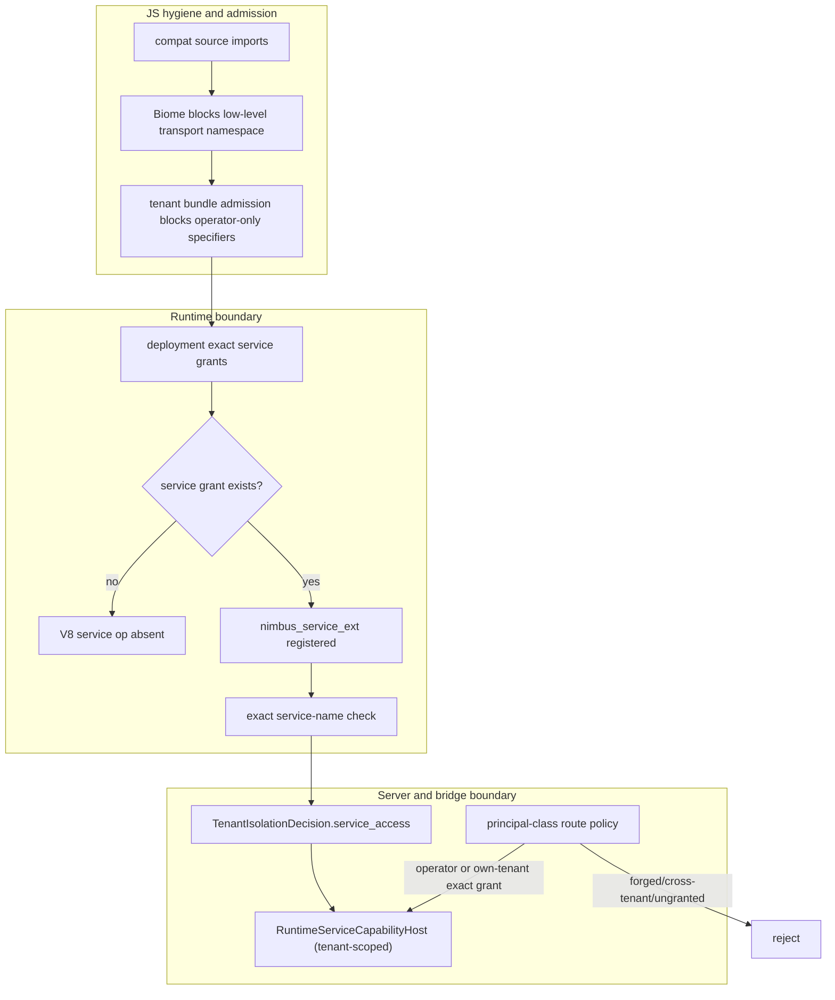

# Nimbus Capability Segregation Plan

Status: done; verifier-green control plane
Created: 2026-05-30
Research backing: docs/plans/research/capability-isolation-prior-art.md
Last readiness review: 2026-06-08 (final audit; SDK/resource model, workload identity naming, and SDK host-transport boundary reconciled)
Control gate: bash scripts/verify-nimbus-capability-segregation.sh

---

## 0. Orientation for a fresh agent (read this first)

What this plan does. It hardens the privileged "services" capability (sandbox
microVM service lookup/lifecycle) and the REST control plane so they are reachable
only by AUTHORIZED PRINCIPALS, while keeping the Convex/Firebase/MongoDB/DynamoDB
compatibility surfaces pure. It also renames one overloaded type so the word
"service" has a single meaning repo-wide.

Two consumers of the Nimbus SDK package, two principal classes:

- Operators (the `nimbus-ui` admin console, which already depends on the current
  `nimbus` package and moves to `@nimbus/nimbus` in CB3) act ACROSS tenants over
  HTTP -- create/list/delete tenants, grant services, manage any tenant's
  machines and services.
- Apps / dynamic workers / dynamic sandboxes act WITHIN one tenant. Deployed
  tenant function code reaches Nimbus services only through the explicit
  `@nimbus/nimbus` SDK/client. That SDK normally uses authenticated
  control-plane transport and may use a private host transport only when Nimbus
  has explicitly installed an SDK host-transport capability for the isolate,
  invocation tier, principal class, and exact grant set. It never reaches
  services through an adapter `ctx` shortcut. Any service call is still
  own-tenant and exact-grant gated.

Authorization is by PRINCIPAL CLASS resolved server-side, never by which package
was imported (section 2a).

The low-level service capability already exists and is partially gated today.
In-isolate, the current runtime service lookup path reaches
`op_nimbus_ctx_service_lookup`
(`HostCallOperation::CtxServiceLookup`) -> the runtime's exact
`RuntimeGrants.service` check -> the bridge's `TenantIsolationDecision`
`service_access(...)` check -> the server-owned service registry. A missing exact
service grant is already denied before the host bridge is called, and the Convex
bridge re-checks the tenant decision before resolving the binding. The important
product correction is that this path must not be exposed as `ctx.services` on
Convex, Cloud Functions, Firebase/Firestore, MongoDB, DynamoDB, or any other
adapter-shaped context. The completed hardening target is narrower and more
auditable: adapter-visible `ctx.services` is gone, the service op is removed
from the always-registered V8 extension/snapshot, granted service access is an
explicit tenant-scoped capability object for defense-in-depth, and HTTP service
lifecycle routes are behind principal-class authorization.

Two distinct reach paths to services (gate both):

- Legacy in-isolate path to retire from adapter contexts: tenant function ->
  `ctx.services` / CtxServiceLookup op -> exact `RuntimeGrants.service` +
  tenant-decision check -> tenant-scoped RuntimeServiceCapabilityHost ->
  services. Today the exact grant/decision checks exist; CB4 turns the bridge
  side into an explicit optional capability object for defense-in-depth, and
  CB5/CB6 remove adapter-visible `ctx.services` while adding V8 op absence unless
  an explicit Nimbus-managed isolate service capability grants the service op.
- HTTP path: operator console / SDK client -> `nimbus/rest` today, then
  `@nimbus/nimbus` / `@nimbus/nimbus/transports/rest` after CB3 ->
  `/api/tenants/.../services/*` -> services. CB8 made the route policy
  principal-class explicit and testable: local operator credentials may manage
  cross-tenant services with audit, while tenant/spawned application credentials
  must be own-tenant and exact-granted.

One-paragraph mental model. A tenant's JS function may run in a
Nimbus-managed isolate backend: V8/deno_core today, Bun/JSC or another isolate
backend later. The function can only call capabilities the host registered for
that backend. In the current V8 implementation, the runtime registers typed
`op_nimbus_*` ops through deno_core extensions, and the host-facing ones funnel
through a shared `op_nimbus_async_host_call(HostCallOperation, payload)`
dispatcher into the `HostBridge` trait. The current exact service grant already
denies unauthorized lookup payloads; this plan also moves the privileged V8
service op(s) (CtxServiceLookup, plus any future V8 service ops) into a
SEPARATE extension (`nimbus_service_ext`) added to an isolate only when an
explicit Nimbus-managed isolate service capability and exact grants are both
present, and removes them from the shared extension and the snapshot. CB5/CB6
also remove the adapter-created `ctx.services` registry; adapter `ctx` objects
stay adapter-shaped even when Nimbus hosts that adapter inside an isolate.
Ungranted means the op is not registered -> unreachable from JS. Granted means
the op is present only for an explicit Nimbus-managed isolate service
capability, and the requested service name is still checked against exact
grants and the tenant decision. Bun/JSC must fail closed for this capability
until it has equivalent host-transport gating, grant checks, pool/session
partitioning, and tests. Operators do not go through a tenant isolate; they call
the control plane over HTTP as a cross-tenant principal, gated server-side. The
JS import/lint boundary is for developer ergonomics, not security.

The three things called "service" (do not conflate):

| Term | What it is | This plan |
| --- | --- | --- |
| `nimbus_engine::Engine` (formerly `Service`) | engine coordinator (tenant registry, persistence, scheduler, triggers) | named `Engine` so "service" is reserved for Nimbus service resources; stays shared by all adapters |
| `nimbus_services` / `ServiceManager` / current Nimbus-native service lookup / `/api/tenants/{tenant}/services/*` / compose `services:` | tenant-scoped service lifecycle + lookup; current implementation is sandbox-backed, while the canonical noun also reserves built-in and external services | kept as privileged, grant-gated capability; not exposed as adapter `ctx.services` |
| REST control plane (`/api/tenants/*` admin, `/api/machines/*`) | direct platform admin | kept; privileged, principal-gated |

Service/sandbox/session vocabulary is canonical in
`docs/architecture/sandbox/service-sandbox-session-model.md`: services are
addressed by tenant plus service name and may be sandbox-backed, built in, or
external; the MVP SDK does not expose raw service-binding resolution; sandboxes
are isolated execution resources addressed by id/handle; future sessions are
scoped interaction leases targeting either a service name or a sandbox id;
runtime isolates are not SDK sandboxes. If isolate-backed execution later
becomes a user-created sandbox resource, the reserved profile spelling is
`profile: "isolate"` and the resource must obey sandbox lifecycle, policy,
audit, and id/handle addressing.

Decisions are settled (section 7). Implement and verify -- no architecture
choices remain. The hard/high-effort parts are flagged in section 5a (Risks);
read it before estimating.

How to execute: this document is the durable control plane for CB0..CB9. The
source of truth is the current git worktree plus this plan's control rules,
phase ledger, success criteria, verifier contract, and execution log. Do not
rely on chat history as progress state. Each phase lists files to touch and an
evidence-bearing gate. Do them in order; CB1 (a mechanical rename) lands first
and alone.

Pre-launch rules apply (root AGENTS.md/CLAUDE.md): breaking changes over shims,
no back-compat aliases, fix root causes, tests assert behavior.

Recent completed baseline to honor (section 5b): binary-embedded-package-
distribution controls the private, binary-embedded package roots and makes
`@nimbus/core` a deliberately rejected extraction in this plan. Active plan to
coordinate with: node-default-runtime-support-hardening (touches the
`nimbus`/`nimbus/deno` shim surface).

## 0a. Control plan rules

This plan is the autonomous execution record for capability segregation. A fresh
agent must be able to resume it from disk without prior transcript context.

Source of truth, in order:

1. current git worktree and branch state;
2. this plan's `Control plan rules`, `Phase status ledger`, `Verifiable success
   criteria`, `Control-plane verifier`, `/goal` prompt, and `Execution log`;
3. `docs/adapters/convex/ai-guidelines.md` before touching Convex-compatible code
   or generated Convex import surfaces;
4. `docs/architecture/server/auth-runtime-trust.md` and
   `docs/architecture/runtime/adapter-boundary.md` for the landed auth/runtime
   boundary.

Status model:

- `todo`: not started; eligible when hard dependencies are satisfied.
- `in_progress`: actively being implemented; keep exactly one phase in this
  state during an autonomous execution run.
- `blocked`: cannot proceed without violating a plan invariant or weakening a
  gate; record the blocker in the execution log before stopping.
- `done`: the phase gate passed and concrete verification evidence is recorded.
- `retired`: pre-execution design branch intentionally removed; do not implement
  it. The verifier asserts the retired design stays absent.

Recovery loop for every new session:

1. Reread this section, the phase ledger, the success criteria, the verifier
   contract, and the execution log.
2. Inspect `git status --short` and reconcile existing changes to the responsible
   phase before starting new work.
3. If any phase is `in_progress`, resume that phase first.
4. Otherwise start the lowest-numbered `todo` phase whose dependencies are
   satisfied.
5. Update the phase ledger when a phase moves `todo -> in_progress -> done`, and
   add an execution-log row with the exact verification command output summary.
6. Run the phase gate before marking a phase done; run the control-plane verifier
   before final closeout.

---

## 1. Current state (As-Is)

This section records the CB0 baseline that motivated the work. For the current
completion state, use the phase status ledger and execution log below.

JS packages (root package.json `workspaces` = explicit list of `packages/*` +
`demos/*`; there is NO `packages/*` glob -- new packages must be added by name):

- BPD completed on 2026-05-31: every `packages/*` workspace is `"private": true`
  and Nimbus-owned JS surfaces are distributed through the `nimbus` binary as
  embedded/provisioned package roots under `<app>/.nimbus/packages/*`.
- packages/nimbus -- canonical SDK source directory; package name is currently
  `nimbus`, exports only ./server ./values ./browser ./react ./rest, has no root
  "." export, has no `Nimbus` class, and has no `dependencies` (no upstream
  convex). CB3 owns the in-place rename to `@nimbus/nimbus`; do not create a
  second SDK package.
- packages/convex -- compat; exports ./server ./values ./browser ./react; deps:
  nimbus, @nimbus/codegen, esbuild in the source workspace. Its provisioned
  manifest keeps only the embedded `nimbus` runtime dependency; in-binary codegen
  means `@nimbus/codegen` is not installed into apps.
- packages/firebase (@nimbus/firebase), packages/mongodb (@nimbus/mongodb),
  packages/dynamodb (@nimbus/dynamodb) -- protobuf/connect/mongodb/aws deps; none
  import `nimbus`.
- packages/nimbus-ui -- the OPERATOR console; depends on nimbus today (imports
  nimbus/react + nimbus/browser today; NOT nimbus/rest yet). routes/operator/* +
  routes/developer/*.
- NimbusRestClient lives in packages/nimbus/src/rest.ts (zero internal imports --
  fully self-contained). Its only in-repo user is demos/nimbus/html (app code).
  No top-level `Nimbus` SDK client, default credentials, endpoint discovery, or
  JS services() API exists.
- Linter is Biome, configured only in packages/nimbus-ui/biome.json. No root
  Biome config, no ESLint, no dependency-cruiser anywhere. Root npm scripts:
  build, test, typecheck (no `lint`).
- No `packages/core` / `@nimbus/core` package exists, and this plan must not add
  one. The only JS separation retained here is SDK/transport import lint plus
  tenant runtime bundle admission for operator-only entries such as `nimbus/rest`
  today / `@nimbus/nimbus/transports/rest` after CB3.

Rust:

- HTTP -> router.rs -> adapter surface builds a per-deployment HOST BRIDGE.
- The `HostBridge` trait has exactly TWO production impls: `ConvexHostBridge`
  (crates/nimbus-server/src/adapters/convex/host_bridge/) and
  `CloudFunctionsHostBridge` (the SEPARATE crate crates/nimbus-cloud-functions/).
  firebase/mongodb/dynamodb adapters have NO host bridge -- they are wire-protocol
  adapters that hit the engine directly, never running tenant JS in an isolate.
- ALL bridges impl `RuntimeCapabilityHost` (capabilities.rs `fn engine()`).
- No RuntimeServiceCapabilityHost trait or explicit granted-capability object. Exact
  per-deployment service grants DO exist today as `RuntimeGrants.service` and as
  `TenantIsolationDecision.services`, both empty by default.
- Tenant fn currently runs through the V8/deno_core isolate backend for this
  path; host calls go through typed ops in the single `nimbus_runtime_ext`
  extension (ops.rs), each host-facing op funneling through
  `op_nimbus_async_host_call(HostCallOperation, payload)` into the bridge.
  The privileged service op `op_nimbus_ctx_service_lookup`
  (HostCallOperation::CtxServiceLookup) is registered there UNCONDITIONALLY, but
  `ops/shared.rs` already rejects requests whose service name is absent from the
  exact runtime grant list before calling the bridge.
- The V8 runtime extension set is also baked into a process-wide STARTUP SNAPSHOT
  assembled from runtime/driver/construction.rs and runtime/bootstrap/extensions.rs;
  warm isolates are pooled and reused across invocations. So the op surface is
  fixed once, not per-deployment.
- A SECOND backend exists: crates/nimbus-runtime/src/backends/bun_jsc/
  (JavaScriptCore/Bun) does NOT use deno_core ops; it exposes host operations
  through a single JSON C-ABI host-call callback (one channel, all operations).
  v8/ is the primary backend; bun_jsc is feature-gated and not the default.
- The Convex bridge already calls `local_enforcement().service_access(...)` before
  resolving service bindings, so a service missing from the tenant isolation
  decision returns `PermissionDenied`.
- Service routes are tenant-scoped:
  `GET /api/tenants/{tenant}/services/{name}` plus
  `POST /api/tenants/{tenant}/services/{name}/start|stop|restart`, backed by
  nimbus_services::ServiceManager. They must stay governed by server-side
  principal-class policy: configured operator auth for operator authority, or
  authenticated tenant/spawned workload identity with exact service grants.
- deno_permissions profiles are built in runtime_capabilities.rs
  (`build_permissions_container`) but not specialized per function tier.
- `nimbus_engine::Engine` is now the coordinator name; any remaining engine-as-service wording is stale and should be removed rather than aliased.
- Identity primitives ALREADY EXIST (reuse, do not reinvent):
  - operator principal: crates/nimbus-server/src/local_server/ (re-exporting
    nimbus_operator: LocalAdminTokenRecord, LocalServerCredentialMode) --
    operator sessions + local admin token.
  - tenant/deployment principal: `nimbus_auth::ApplicationAuthVerifier`
    (crates/nimbus-auth/src/lib.rs), with nimbus-server helper resolution in
    crates/nimbus-server/src/application_auth.rs and the Convex verifier factory
    in crates/nimbus-server/src/router.rs.
  - workload attributes: `WorkloadAttributes` captures requested work before
    admission.
  - spawned-workload identity: `WorkloadIdentity` is produced from an admitted
    `TenantIsolationDecision`; its `subject()` is the low-cardinality policy
    subject and its `audit_projection()` is the full evidence projection. The
    serialized audit/credential field remains `workload_subject` because that
    field leaves the `WorkloadIdentity` type context.
  - the bridge already carries tenant_id, invocation_kind (the tier),
    TenantIsolationDecision, and a PrincipalContext per invocation
    (adapters/convex/host_bridge/bridge.rs).
  - PrincipalContext (nimbus-core/src/auth/mod.rs) is the IN-FUNCTION end-user
    identity (ctx.auth) and a claims bag -- it has NO operator/tenant/spawned
    discriminant. Do not conflate it with the authz principal class.
  (all documented in docs/architecture/server/auth-runtime-trust.md)

Problems:

1. "services" the engine-coordinator and "services" the tenant-scoped app
   dependency concept collide in one word.
2. The privileged services/control-plane surface has uneven gates. Exact runtime
   service grants and tenant-decision checks exist, but the V8 op is still
   registered for every deployment/snapshot, there is no explicit
   `RuntimeServiceCapabilityHost` capability object, and HTTP service lifecycle routes
   are not yet governed by one principal-class authorization model.
3. Authorization does not distinguish PRINCIPAL CLASSES. An operator
   (cross-tenant, over HTTP) and a tenant deployment (own-tenant) are not
   separated at the gate, so one flat rule cannot serve both correctly.

## 2. End state (To-Be)

JS packages:

- `packages/nimbus` remains the single embedded app-facing Nimbus SDK source
  directory, but CB3 renames the package in place from `nimbus` to
  `@nimbus/nimbus` and adds a root "." export. Do not create a second SDK package,
  `packages/sdk`, `@nimbus/rest`, or `@nimbus/core`.
- Scoped package layout: the source directory stays `packages/nimbus`, but the
  embedded/provisioned package root must use the canonical scoped npm path
  `.nimbus/packages/@nimbus/nimbus`. Do not leave a scoped manifest staged under
  `.nimbus/packages/nimbus`, and do not create a private alias layout. Update BPD
  scripts/tests to separate source directory (`packages/nimbus`) from package
  identity/staged directory (`@nimbus/nimbus`) for this one package.
- The top-level `@nimbus/nimbus` export provides the ergonomic Nimbus client:

  ```ts
  import { Nimbus } from "@nimbus/nimbus";

  const nimbus = new Nimbus();

  await nimbus.services.start({ name: "db", waitUntil: "ready" });
  ```

  `new Nimbus()` is the canonical API. `Nimbus.defaultClient()` or explicit
  lower-level credential/provider APIs may exist for eager initialization,
  diagnostics, or tests, but they are not the normal app shape.
- `@nimbus/nimbus/transports/rest` is the explicit low-level REST transport. It
  requires an explicit endpoint/token/key-like credential and may underlie the
  SDK. The old `nimbus/rest` spelling is only the current pre-CB3 name; after
  CB3, plan text, lint, demos, and verifier conditions use
  `@nimbus/nimbus/transports/rest`. Do not add a shorter
  `@nimbus/nimbus/rest` alias in this plan; the `transports/*` namespace is
  reserved for low-level transport plumbing.
- nimbus-ui (operator) depends on the SDK package and may use the top-level
  `Nimbus` client for operator workflows or `@nimbus/nimbus/transports/rest` when
  it needs the explicit low-level transport.
- Compat packages may continue depending on the SDK package for unprivileged
  re-exports such as `@nimbus/nimbus/server`, `@nimbus/nimbus/browser`,
  `@nimbus/nimbus/react`, and `@nimbus/nimbus/values`. All adapter APIs stay
  adapter-shaped: do not add or retain Nimbus-specific `ctx.services`,
  `ctx.sandboxes`, `ctx.sessions`, Firebase/Firestore API extensions, MongoDB
  command extensions, DynamoDB command extensions, Cloud Functions host-context
  extensions, or any adapter-branded services/sandboxes/sessions/control-plane
  shortcut. User-facing Nimbus features require importing the Nimbus SDK
  explicitly.
- Do NOT add `@nimbus/core` / `packages/core` in this plan. BPD made the
  structural JS package wall an extra embedded root plus closure edge, while the
  research already grounds JS separation as ergonomics only.
- Codegen output: adapter-generated _generated/* remains adapter-namespaced
  (`convex/server`, `@nimbus/firebase/*`, etc., driven by codegen's
  `packageNamespace`) and source-compatible. Nimbus-native generated imports
  retarget from `nimbus/*` to `@nimbus/nimbus/*` as part of the single-package
  rename. CB3 updates codegen's managed-package classifier so
  `@nimbus/nimbus/*` is treated as managed, not external. Do NOT retarget
  generated code to any `@nimbus/core` package.
- Lint (Biome `noRestrictedImports`): compat PACKAGE SOURCE
  (packages/{convex,firebase,mongodb,dynamodb}/src/**) must not import the
  low-level privileged transport namespace (`nimbus/rest` before CB3,
  `@nimbus/nimbus/transports/*` after CB3) or any future operator-only JS entry.
  Unprivileged SDK subpaths and the high-level root `@nimbus/nimbus` SDK import
  are not blanket-banned, but compat packages must not expose Nimbus-specific
  services/sandboxes/control-plane features through adapter ctx/API surfaces.
- Public adapter export rule: compat packages may re-export or wrap
  unprivileged SDK compatibility types, but their public exports and generated
  `.d.ts` surfaces must not expose top-level `Nimbus`, `services`, `sandboxes`,
  `sessions`, `models`, `audio`, `video`, `content`, control-plane clients, or
  low-level transport entrypoints. Nimbus features are reached by a separate
  user import from `@nimbus/nimbus`.
- Transport namespace rule: `@nimbus/nimbus/transports/*` is for replaceable
  protocol plumbing (REST today; future gRPC/SSE/WebSocket/WebRTC transports if
  needed). Product capabilities stay on the high-level `Nimbus` client, for
  example `nimbus.services`, `nimbus.sandboxes`, `nimbus.models`,
  future `nimbus.sessions`, `nimbus.audio`, `nimbus.video`, and
  `nimbus.content`. Do not add a public
  `@nimbus/nimbus/transports/host` entry; any SDK host transport is private
  runtime plumbing selected internally by `new Nimbus()` only when the server
  grants the exact isolate/backend/tier/principal/grant-set authority.
- SDK resource nouns must follow
  `docs/architecture/sandbox/service-sandbox-session-model.md`: services are
  addressed by tenant plus service name and may be sandbox-backed, built in, or
  external; the MVP SDK exposes explicit service lifecycle/status, not raw
  service-binding resolution; sandboxes are addressed by id/handle and never by
  authority-bearing name; future sessions are scoped target leases over
  `{ service: { name } }` or `{ sandbox: { id } }` and are not a third name
  registry; runtime isolates are not SDK sandboxes. Reserve
  `profile: "isolate"` for a future explicit isolate-backed sandbox resource;
  do not introduce `profile: "js-isolate"` or expose ordinary invocation
  isolates as sandbox resources.

Rust:

- nimbus_engine::Engine (renamed); RuntimeCapabilityHost::engine() is shared.
- The existing exact `RuntimeGrants.service` plus `TenantIsolationDecision`
  services set is the canonical per-deployment service grant (off by default);
  do not replace it with a broad boolean or wildcard grant.
- NEW RuntimeServiceCapabilityHost capability object (nimbus-bridge):
  tenant-scoped service binding lookup and allowed service activation only. It
  must not expose `/api/tenants`, `/api/machines`, local-admin tokens, operator
  sessions, or any other control-plane authority. Bridges expose it through an
  optional accessor such as
  `service_capabilities() -> Option<&dyn RuntimeServiceCapabilityHost>`; the
  underlying trait is implemented by a granted capability wrapper, not magically
  per instance by an otherwise identical bridge type.
- NEW grant-gated op extension `nimbus_service_ext`: the relocated V8 service
  op(s) (CtxServiceLookup + future V8 service ops), added to a deployment's V8
  isolates by the execution path ONLY when an explicit Nimbus-managed isolate
  service capability and exact grants are both present, and REMOVED from the
  shared `nimbus_runtime_ext` and the snapshot. Ungranted V8 isolate -> op
  absent -> unreachable. Bun/JSC must reject the service-capability bit until an
  equivalent backend-specific host transport exists with the same grant,
  partitioning, and test guarantees.
- Backend-agnostic floor: the bridge's `HostBridge::call` refuses the
  CtxServiceLookup-class operations unless the requested service is exact-granted
  and the tenant decision authorizes it. This covers bun_jsc (single JSON
  channel, no per-op surface) and is defense-in-depth for V8.
- Server gate (auth-runtime-trust) authorizes by PRINCIPAL CLASS: operator =
  cross-tenant (audited); tenant = own-tenant + grant; spawned workload =
  spawning-tenant scope. (section 2a)
- Per-tier deno_permissions: query/mutation = no net/fs; action = widened.
- microVM isolation (nimbus-libkrun) remains the backstop for service workloads
  and for host-heavy runtimes routed to the `microvm_service` tier; it is not
  claimed as containment for an in-process V8 engine escape.

Reachability rule, end state:

- Operator (nimbus-ui): operator session over HTTP -> /api/tenants,
  /api/machines/*, `/api/tenants/{tenant}/services/*` across ANY tenant:
  ALLOWED, audited.
- Tenant function, NOT granted for any service: the in-function service op is
  absent on V8 and refused at the bridge/host-call floor on every backend.
- Tenant function, GRANTED for service `db`: the op may be present, but only
  `db` is accepted; any other service name is rejected by exact grant and tenant
  decision checks. Every successful call is scoped to THIS tenant.

## 2a. Principal and Authorization Model

Authorization is by PRINCIPAL CLASS, resolved server-side at the nimbus-server
middleware layer from the existing seams below. This is NOT the in-function
`PrincipalContext` (that is the end-user identity inside ctx.auth, a claims bag
with no class discriminant -- CB8 adds the class as a new discriminant/wrapper,
not by overloading PrincipalContext).

| Principal | Authenticates via (existing seam) | Authority | Reaches services how |
| --- | --- | --- | --- |
| Operator | local_server session / local admin token (local_server/ -> nimbus_operator) | global cross-tenant: create/list/delete tenants, grant services, manage any tenant's machines/services; every action audited | HTTP control plane (`Nimbus` SDK or explicit low-level REST transport from nimbus-ui); never through a tenant isolate |
| Tenant | deployment identity (`nimbus_auth::ApplicationAuthVerifier`; nimbus-server `application_auth.rs` helpers) | own tenant only; services only if that exact service is granted | grant-gated service op in its isolate (CB5) + exact grant/decision refusal unless granted (CB4); server re-checks own-tenant scope (CB8) |
| Spawned resource (dynamic worker / sandbox) | short-lived workload credential mapped to admitted `WorkloadIdentity.subject()` from its `TenantIsolationDecision` | inherits the spawning tenant's scope; never escalates, never wildcards | same grant-gated path as its tenant; identity is decision-derived |

Hard rules:

- Operator credentials never resolve inside a tenant isolate -- the local admin
  token / operator session is not reachable from tenant JS (the auth doc already
  mandates this for agents). Enforced by CB7a.
- A tenant principal can never resolve to operator -- distinct credential classes
  (deployment bearer via `nimbus_auth::ApplicationAuthVerifier` vs local_server
  session/token).
- Spawned-resource identity is decision-derived -- a worker/sandbox gets its
  tenant scope from the admitted TenantIsolationDecision, not from any string it
  passes, so it cannot claim another tenant.
- Operator control plane and tenant service plane stay separate: no Rust trait
  passed into a tenant isolate may expose operator route authority, machine
  management, tenant creation/deletion, admin-token rotation, or local session
  material.

## 2b. Nimbus SDK Client And Default Credentials

The user-facing Nimbus feature surface is the Nimbus SDK, not adapter ctx APIs.
Adapter APIs stay adapter-shaped, and Nimbus-specific services/sandboxes/control
plane features require an explicit SDK import:

```ts
import { Nimbus } from "@nimbus/nimbus";

const nimbus = new Nimbus();

await nimbus.services.start({ name: "db", waitUntil: "ready" });
```

`new Nimbus()` separates two discovery questions:

- Credential discovery answers: "who is this workload?"
- Endpoint discovery answers: "which Nimbus control plane should this client
  call?"

Default credentials are modeled after the proven cloud SDK pattern used by
Google ADC, AWS default provider chains, and Azure DefaultAzureCredential, while
staying Nimbus-specific:

1. explicit constructor options (`new Nimbus({ endpoint, credential })`);
2. `NIMBUS_ENDPOINT` plus an explicit token/env credential when present;
3. local developer credential file, for example
   `~/.config/nimbus/application_default_credentials.json`;
4. workload identity from platform metadata, OIDC, SPIFFE, or external account
   config;
5. actionable failure naming the missing endpoint or credential provider.

Short-lived workload identity credentials are preferred over long-lived
service-account keys. The server validates issuer, audience, and subject; maps
the workload identity to operator, tenant, or spawned principal class; and then
authorizes service actions server-side with the same exact service-grant source.
Default credentials never imply a wildcard service grant or operator authority.

Transport selection is internal to the SDK and must not change the public API.
The default SDK transport is authenticated control-plane access
(`@nimbus/nimbus/transports/rest` today; future gRPC/WebSocket/SSE/WebRTC
transports only when a product need appears). External processes, CLIs, app
servers, containers, Linux microVM workloads, macOS guest workloads, and adapter
code that imports the SDK use this default transport unless the server
explicitly installs a host transport for the current isolate.

A private SDK host transport is allowed only for a Nimbus-managed isolate
backend when the server explicitly grants it for that isolate, invocation tier,
principal class, and exact service grant set. This rule is backend-neutral: V8
is the current implementation substrate, while Bun/JSC or another isolate
backend must fail closed until it has equivalent host-transport gating, grant
checks, warm-pool/session partitioning, and tests. Adapter-created contexts stay
adapter-shaped even when Nimbus hosts the adapter workload in an isolate; the
SDK may be imported separately, but `ctx.services`/`ctx.sandboxes`/`ctx.sessions`
must not appear.

The low-level `op_nimbus_ctx_service_lookup` operation is not the public SDK
service API. It is a current internal service-binding lookup capability. A
future SDK host transport for `nimbus.services.start(...)`,
`nimbus.services.get(...)`, and related lifecycle/status calls should model
SDK/control-plane requests directly, or use typed internal operations with the
same principal and exact-grant checks; it must not expose raw binding lookup as
the lifecycle API.

SDK resource nouns follow the architecture model:

- `nimbus.services` manages named tenant-scoped app dependencies for
  explicit lifecycle/status. A service may be
  Compose-declared, built in, external, or dynamically registered by a future
  plan, but it is always addressed by tenant plus service name and has
  lifecycle/readiness. The MVP SDK does not expose raw service-binding
  resolution.
- `nimbus.sandboxes` creates and manages isolated execution resources by
  sandbox id/handle. There is no sandbox-name resolver. Labels may support
  filtering and diagnostics, but not name-based authority. If a future
  isolate-backed sandbox resource is exposed, its profile is
  `profile: "isolate"` and it must satisfy normal sandbox lifecycle, policy,
  audit, and id/handle addressing.
- `nimbus.sessions` is a future namespace for scoped interaction leases. A
  session target is either `{ service: { name } }` or `{ sandbox: { id } }`;
  sessions do not form a third resource registry and are not needed for simple
  service lifecycle/status.

## 2c. Adapter Category Examples

Convex action, explicit SDK import:

```ts
import { action } from "./_generated/server";
import { Nimbus } from "@nimbus/nimbus";

const nimbus = new Nimbus();

export const warmSearch = action({
  args: {},
  handler: async () => {
    await nimbus.services.start({ name: "search", waitUntil: "ready" });
  },
});
```

Do not add `ctx.services`. Query/mutation network restrictions still apply, so
service management belongs in action/native workloads unless a future plan
explicitly widens another tier.

Cloud Functions:

```ts
import { onRequest } from "firebase-functions/v2/https";
import { Nimbus } from "@nimbus/nimbus";

const nimbus = new Nimbus();

export const resize = onRequest(async (_req, res) => {
  await nimbus.services.start({ name: "image-resizer", waitUntil: "ready" });
  res.status(204).send();
});
```

CloudFunctionsHostBridge still refuses CtxServiceLookup. This is HTTP/client
authority through SDK default credentials and server-side workload identity.

Firebase/Firestore:

```ts
import { initializeApp } from "@nimbus/firebase/app";
import { getFirestore } from "@nimbus/firebase/firestore";
import { Nimbus } from "@nimbus/nimbus";

const app = initializeApp({ projectId: "demo" });
const db = getFirestore(app);
const nimbus = new Nimbus();

await nimbus.services.start({ name: "firestore-worker", waitUntil: "ready" });
```

Firestore APIs remain Firestore-shaped; Nimbus control-plane calls are separate
SDK calls.

MongoDB:

```ts
import { MongoClient } from "mongodb";
import { Nimbus } from "@nimbus/nimbus";

const mongo = new MongoClient(process.env.MONGO_URI!);
const nimbus = new Nimbus();

await nimbus.services.start({ name: "mongo-sidecar", waitUntil: "ready" });
```

MongoDB wire protocol remains stock; no Nimbus feature appears in MongoDB command
shape.

DynamoDB:

```ts
import { DynamoDBClient } from "@aws-sdk/client-dynamodb";
import { Nimbus } from "@nimbus/nimbus";

const dynamodb = new DynamoDBClient({
  endpoint: process.env.NIMBUS_DDB_ENDPOINT,
});
const nimbus = new Nimbus();

await nimbus.services.start({ name: "ddb-stream-worker", waitUntil: "ready" });
```

DynamoDB SDK remains the stock endpoint-overridden AWS SDK; Nimbus control-plane
access is separate.

Native/Nimbus app:

```ts
import { Nimbus } from "@nimbus/nimbus";

const nimbus = new Nimbus();

await nimbus.services.start({ name: "db", waitUntil: "ready" });

// Future sandbox routes land in the SDK resource-model plan, not this
// capability-boundary plan.
```

## 3. Why this design

Full sourcing in docs/plans/research/capability-isolation-prior-art.md.

- An unregistered op is unreachable from JS (V8/deno_core). JS can only call Rust
  through registered ops; an op the host never adds to an isolate has no V8 entry
  point. The existing exact service-grant checks remain authoritative, and
  moving the service op behind grant-gated registration reduces the exposed host
  surface for ungranted isolates. Convex (runtime tier), Cloudflare Workers
  (bindings on env), and Deno embedders use this "binding/op exists only when
  configured" model.
- The op-absence boundary is V8-specific. bun_jsc uses one JSON host-call channel
  with no per-op surface, so op-absence cannot express "deny services" there. For
  bun_jsc (and as defense-in-depth on V8) the boundary is the bridge refusing the
  CtxServiceLookup-class operations unless the requested service is
  exact-authorized (CB4), plus the server gate (CB8). The exact grant must drive
  every effect together -- optional capability object, V8 op registration, and
  backend-agnostic dispatch refusal -- so no backend is looser than another.
- One thread is one privilege level. Code in one V8 realm shares one privilege
  level, so privileged services lives in the Rust host path and the grant-gated
  op is the only crossing. CB7a enforces this as a tested invariant.
- Three limits of op gating shape later phases: it does not contain a V8 engine
  escape inside the same Nimbus process; it does not replace exact service-name
  grant checks once the op is present; and it breaks if a shared op internally
  calls privileged code (CB6 guard). Host-heavy or broader-OS workloads must move
  to the `microvm_service` tier instead of pretending in-process V8 is a VM.
- In-process JS hardening (SES/LavaMoat) is not needed. It only helps when
  privileged and untrusted JS share a realm, which CB7a forbids. Non-goal, with a
  documented re-open condition.
- Privileged routes use principal-class + identity gating -- the client is never
  trusted. Attenuated tokens (macaroon/Biscuit) are out of scope unless
  delegation is required.

## 4. Grounding (verified 2026-06-01; anchor on the symbol/string, not the line)

Line numbers drift every commit; grep the anchor.

| Anchor (grep this) | Location |
| --- | --- |
| `pub struct Engine` ("Top-level Nimbus engine coordinator") | crates/nimbus-engine/src/engine/mod.rs |
| `EngineBootstrapParts`, `ENGINE_BACKGROUND_TASK`, `EnginePersistenceConfig` | same file plus `persistence_config.rs` for typed persistence config |
| `fn engine(&self) -> &Arc<Engine>` | crates/nimbus-bridge/src/capabilities.rs (trait) + lib.rs (impl) |
| old engine-`Service` rename blast radius | large -- old refs spanned hundreds of Rust files; keep future sweeps symbol-scoped so `nimbus_services`, `ServiceManager`, and service-resource APIs are not renamed |
| `op_nimbus_ctx_service_lookup` / `HostCallOperation::CtxServiceLookup` (privileged in-isolate capability) | runtime: runtime/bootstrap/ops/async_services.rs + host.rs; grant check in runtime/bootstrap/ops/shared.rs; bridge handler: adapters/convex/host_bridge/function_ops/ctx_ops/runtime_calls.rs (`local_enforcement().service_access(...)`) |
| `extension!( nimbus_runtime_ext, ops = [...~83 ops...] )` + `fn runtime_extension()` | crates/nimbus-runtime/src/runtime/bootstrap/ops.rs |
| shared host-call dispatcher | `op_nimbus_async_host_call(state, HostCallOperation::X, payload)` (ops/async_*.rs) |
| V8 startup snapshot (bakes the op set) | crates/nimbus-runtime/src/runtime/driver/construction.rs (`bootstrap_snapshot`, `create_bootstrap_snapshot`, `runtime_options`) + crates/nimbus-runtime/src/runtime/bootstrap/extensions.rs (`snapshot_extensions` and `execution_extensions` both push `runtime_extension()` today); crates/nimbus-runtime/src/backends/v8/startup.rs owns the snapshot type |
| bun_jsc backend (single JSON host-call channel, no deno ops) | crates/nimbus-runtime/src/backends/bun_jsc/ |
| `GET /api/tenants/{tenant}/services/{service}`; `POST /api/tenants/{tenant}/services/{service}/start|stop|restart`; `/api/tenants`; `/api/machines/*` | crates/nimbus-server/src/router.rs |
| `ServiceManager` | nimbus_services; imported in nimbus-server construction.rs, service_manager.rs |
| `pub trait HostBridge` | crates/nimbus-runtime/src/host.rs |
| `PermissionsContainer` builder | crates/nimbus-runtime/src/runtime_capabilities.rs (`build_permissions_container`) |
| `deno_permissions` pin | Cargo.toml (workspace dep; also git-overridden to the nimbus/deno fork) |
| CloudFunctions bridge (separate crate) | crates/nimbus-cloud-functions/src/host_bridge.rs |
| operator principal seam | crates/nimbus-server/src/local_server/ (re-exports nimbus_operator) |
| tenant principal seam | crates/nimbus-auth/src/lib.rs (`ApplicationAuthVerifier`); nimbus-server helpers in crates/nimbus-server/src/application_auth.rs |
| in-function end-user identity (NOT the authz principal) | crates/nimbus-core/src/auth/mod.rs `PrincipalContext`, `PrincipalClaimSource` |
| readiness audit proof | docs/plans/proof/nimbus-capability-segregation/readiness-audit-2026-06-01.md |
| codegen import target (packageNamespace; NOT @nimbus/core) | packages/codegen/src/{app.mjs,main.mjs,emit/generated_files.mjs}; managed set `MANAGED_PACKAGE_NAMES` in module_specifiers.mjs |
| BPD embedded package roots / closure gates | Makefile `EMBEDDED_PKG_DIRS`; root package.json `build:embedded-packages`; scripts/stage-embedded-packages.mjs `PROVISIONED`; scripts/check-package-closure.mjs `REQUIRED_PROVISIONED`; scripts/build-js-package.mjs `SANITIZE`; crates/nimbus-bin/src/embedded_packages.rs `EXPECTED` |
| JS linter | packages/nimbus-ui/biome.json (Biome; no ESLint / dependency-cruiser anywhere) |
| stale engine-as-service prose to sweep in CB1 | ARCHITECTURE.md, docs/architecture/**, and active prompts/plans outside archive |
| de-brand: browser strings | packages/nimbus/src/browser.ts (4 "convex ..." strings incl. the `convex-` request-id prefix) |
| de-brand: react string | packages/nimbus/src/react.ts ("convex paginated query failed") |
| de-brand: runtime string | crates/nimbus-runtime/src/runtime/bootstrap/source.rs ("convex httpAction requires an authenticated identity") |
| de-brand: `.nimbus/convex` path (grep `\.nimbus/convex`) | 5 files: runtime_capabilities.rs; runtime/bootstrap/ops/test_runtime/bundle.rs; runtime/tests/basic_invocation/node_capabilities.rs; runtime/tests/basic_invocation/support.rs; runtime/tests/node/mod.rs |

## 5. Defense-in-depth layering

- Layer 1 SOURCE IMPORT HYGIENE (ergonomics): compat package source may depend on
  the SDK package for unprivileged entries and may allow explicit high-level
  `@nimbus/nimbus` app imports, but must never import the low-level transport
  namespace (`nimbus/rest` before CB3, `@nimbus/nimbus/transports/*` after CB3)
  or any future operator-only JS entry.
- Layer 2 STATIC LINT (ergonomics): Biome noRestrictedImports in compat package
  source, not app code, in CI.
- Layer 2' TENANT BUNDLE ADMISSION (real boundary for tenant code): add codegen
  and runtime bundle admission checks that reject tenant function graphs importing
  the low-level transport namespace or any future operator-only JS entry, and
  reject operator credentials. Do not blanket-ban the high-level
  `@nimbus/nimbus` root SDK import when it authenticates through tenant/spawned
  workload identity and route policy.
- Layer 3 GRANT-GATED OP (REAL boundary, V8): the service op is added to a
  deployment's isolates ONLY when the deployment has at least one exact service
  grant, via the execution path, NOT the snapshot. Ungranted -> op absent ->
  unreachable.
- Layer 3' PERMISSION TIER: per-isolate deny-by-default deno_permissions profile
  (query/mutation = no net/fs; action = widened).
- Layer 4 SERVER GATE BY PRINCIPAL + BRIDGE REFUSAL (REAL boundary; AWS-Lambda
  "client never trusted"): tenant-scoped service control routes authorize by
  principal class -- operator = cross-tenant with configured operator auth
  (audited); tenant = own-tenant + exact service grant; spawned =
  spawning-tenant scope. The bridge refuses service ops without exact
  authorization, covering every backend (incl. bun_jsc).
- Layer 5 MICROVM ISOLATION: nimbus-libkrun bounds service workloads and any
  runtime routed to the `microvm_service` tier; it is not cited as containment for
  same-process V8.

Layers 1-2 are developer ergonomics. Layers 3 and 4 are the real boundaries.
Layer 5 bounds blast radius.

Boundary diagram:



Rust capability split. RuntimeServiceCapabilityHost is a tenant-scoped granted
capability object, not an operator-control trait and not a compile-time impl that
magically varies per bridge instance. A bridge exposes `None` or `Some(granted
capability)` through an explicit accessor. The existing exact service grant
participates in three decisions without replacing the explicit capability bit:
(a) the optional capability object exists for the granted service set, (b) the
execution path adds nimbus_service_ext to that deployment's V8 isolates only
when an explicit Nimbus-managed isolate service capability is enabled and at
least one service is exact-granted, and (c) dispatch refuses service ops whose
service name is not exact-authorized (the backend-agnostic floor).

- RuntimeCapabilityHost: shared -- engine() (coordinator), storage, principal;
  implemented by production bridges where needed. This does not imply a positive
  RuntimeServiceCapabilityHost path for Cloud Functions.
- RuntimeServiceCapabilityHost: privileged but tenant-scoped -- service binding
  lookup and permitted activation only. No operator control-plane methods.
  firebase/mongodb/dynamodb have no bridge, so the in-isolate path is N/A for
  them; their only services reach would be the HTTP path (CB8).

## 5a. Risks / hard parts (read before estimating)

- HARDEST -- snapshot + warm-pool vs per-deployment ops (CB5). The op set is
  baked into a process-wide V8 startup snapshot and warm isolates are pooled and
  reused across invocations. "Add the service op only when granted" therefore
  requires: (a) remove the service op(s) from `nimbus_runtime_ext` and the
  snapshot; (b) add `nimbus_service_ext` only via the per-runtime execution path,
  keyed on the exact grant set threaded from where the bridge/deployment is known
  down to the extension-assembly point (extensions.rs / driver construction); and
  (c) segment the warm isolate pool with an explicit partition key so isolates
  with different service-op state, exact service grants, runtime tiers, permission
  profiles, compatibility targets, backends, or construction modes never share a
  pooled instance. This is the highest-effort, highest-risk phase.
- bun_jsc backend has no per-op surface (single JSON host-call channel), so
  V8-style op absence does not apply. It must reject service-capability
  enablement until it has an equivalent SDK host-transport design, exact-grant
  checks, backend/session partitioning, and tests. CB4 bridge refusal and CB8
  server authorization remain the defense-in-depth floor for any backend.
- The privileged op already exists (`CtxServiceLookup`) and is in the shared
  extension/snapshot today. It is exact-grant checked today, so CB5 is a
  RELOCATION + op-surface minimization of an existing op, not the first
  authorization check. It must confirm the exact privileged op set (any other
  `op_nimbus_ctx_service_*` or future lifecycle ops) before moving them.
- Per-instance trait semantics are easy to get wrong. Rust trait impls are
  type-level; CB4 must use a granted wrapper or optional capability accessor, not
  claim the same bridge type both implements and does not implement a trait per
  deployment instance.
- Per-tier permissions (CB7) hit the same snapshot/warm-pool wall: tier
  (InvocationKind) is known at the bridge/context but NOT at the permission/
  extension assembly point; threading it down implies pool segmentation by tier
  too.
- PrincipalContext has no class discriminant; CB8 adds a new principal-class type
  rather than overloading it.
- The retired `@nimbus/core` extraction is now a trap, not a phase. BPD made it a
  new embedded root plus closure edge across package staging, closure checking,
  sanitized manifests, Makefile build inputs, workspace metadata, embedded-package
  tests, provisioning, and optional codegen management. Do not reintroduce it in
  this plan.

## 5b. Coordination with BPD and active plans

- binary-embedded-package-distribution (BPD0..BPD8) is complete and archived. It
  keeps every `packages/*` package private and distributes app-facing JS from
  embedded, dependency-closed package roots provisioned to
  `<app>/.nimbus/packages/*`.
- Because BPD is now the baseline, CB2 is retired: do not add `packages/core`,
  do not add `@nimbus/core` to root workspaces, `EMBEDDED_PKG_DIRS`,
  `build:embedded-packages`, `stage-embedded-packages.mjs`, closure
  `REQUIRED_PROVISIONED`, build `SANITIZE`, embedded-package `EXPECTED`, package
  provisioning selection, or `MANAGED_PACKAGE_NAMES`.
- CB3 does own one package-identity change: rename the single existing
  `packages/nimbus` package from `nimbus` to `@nimbus/nimbus`, update the
  embedded-package/BPD touchpoints that already refer to that one root, and add a
  root SDK export. This is not a structural package wall and must not create a
  duplicate SDK package.
- CB3 also owns the scoped-name mechanics introduced by that rename. The
  canonical embedded layout is `.nimbus/packages/@nimbus/nimbus`, matching npm's
  scoped package path. BPD touchpoints must decouple source directory from
  package identity where necessary: `packages/nimbus` remains the source/workspace
  directory; `@nimbus/nimbus` is the manifest name, closure root, expected
  embedded package name, staged package directory, and `file:../@nimbus/nimbus`
  target for co-provisioned dependencies.
- If a future plan wants a structural JS package wall anyway, it must own the
  full BPD touchpoint list as a separate packaging change. This capability plan
  keeps the JS boundary to lint plus tenant bundle admission because JS is
  ergonomics here; Rust op absence, bridge refusal, and server authorization are
  the security boundaries.
- node-default-runtime-support-hardening: references a `nimbus`/`nimbus/deno`
  shim surface; coordinate naming so lint/admission rules for `@nimbus/nimbus`
  and `@nimbus/nimbus/transports/rest` do not diverge from that shim.

## 6. Phases

Each non-retired phase lists Goal, Files, Steps, Gate. Do not advance until the
gate passes.

Dependency chain:

- CB0 then CB1 (CB1 lands alone, first).
- JS track: CB2 is retired; CB3 is the only JS implementation phase.
- Rust capability track: CB4 then CB5 then CB6.
- Runtime hardening: CB7, CB7a.
- CB8 (server gate) depends on CB4 (explicit capability object/refusal exists).
- CB9 (de-brand + guards) is last.

JS track (CB3) and Rust track (CB4..CB8) are independent after CB1 and may
run in parallel.

### Phase status ledger

| Phase | Status | Hard dependencies | Verifiable success signal |
| --- | --- | --- | --- |
| CB0 | `done` | none | Baseline contract test and verifier stub land; current public compat exports are frozen. Evidence recorded 2026-06-08. |
| CB1 | `done` | CB0 | Engine coordinator is renamed from `Service` to `Engine`; no stale engine-`Service` references outside archive; focused Rust/docs gates passed, with the full workspace test deferred only for the active Node-compat workstream and recorded below. |
| CB2 | `retired` | BPD completed baseline | No `packages/core` / `@nimbus/core` root is added; compat packages may keep the single embedded SDK dependency; adapter generated imports stay adapter-namespaced. |
| CB3 | `done` | CB1 | `@nimbus/nimbus` root exports `Nimbus`; low-level REST transport stays explicit; scoped embedded layout is canonical; codegen treats `@nimbus/nimbus/*` as managed; Biome lint blocks low-level/operator-only imports in compat source while allowing high-level SDK app imports; adapter public exports stay adapter-shaped. Evidence recorded 2026-06-08. |
| CB4 | `done` | CB1 | `RuntimeServiceCapabilityHost` is optional and tenant-scoped on service-capable bridges; Cloud Functions remains refusal-only; all service paths reject non-exact service names. Evidence recorded 2026-06-08. |
| CB5 | `done` | CB4 | Adapter-created contexts expose no Nimbus service shortcut; V8 service op registers only for explicit Nimbus-managed isolate service authority plus exact grants; Bun/JSC fails closed for that authority until equivalent host-transport gating exists; warm pool is segmented by the full runtime partition key. Evidence recorded 2026-06-08. |
| CB6 | `done` | CB5 | Tests prove no adapter-created context, ungranted V8 op, or bun_jsc host call reaches the runtime service capability path indirectly. Evidence recorded 2026-06-08. |
| CB7 | `done` | CB5 | Per-tier deno permissions are threaded to isolate construction and pool segmentation; query/mutation deny ambient net/fs/run/ffi while actions get only configured authority. Evidence recorded 2026-06-08. |
| CB7a | `done` | CB3; CB5 | Tenant runtime bundle admission rejects low-level/operator-only imports and operator credentials, allows high-level SDK imports that use tenant/spawned workload identity, and realm-separation tests pass. Evidence recorded 2026-06-08. |
| CB8 | `done` | CB4 | Principal-class route policy is enforced for operator, tenant, and spawned-workload callers with positive and negative integration tests. Evidence recorded 2026-06-08. |
| CB9 | `done` | CB1-CB8 | De-brand/regression guards pass; focused closeout gates and the control-plane verifier pass. Evidence recorded 2026-06-08. |

### CB0 - Baseline and frozen contract
- Goal: lock the consumer-visible compat API so later phases cannot regress it.
- Files: new test under packages/; scripts/verify-nimbus-capability-segregation.sh
  (stub, gate-style: `#!/usr/bin/env bash`, `set -u`, PASS/FAIL counters,
  numbered conditions, final "N passed, N failed", exit 1 on any fail -- match
  the existing gate verifiers such as scripts/verify-node-dbus-binding.sh, NOT the
  `set -euo pipefail` build scripts).
- Steps: snapshot the public export surface of convex, @nimbus/firebase,
  @nimbus/mongodb, @nimbus/dynamodb, and the unprivileged surface of
  nimbus as a contract test.
- Gate: contract test green on current main.

### CB1 - Rename engine coordinator Service to Engine (foundational; commit alone)
- Goal: free the word "service" for Nimbus service resources, not the Rust
  coordinator.
- Files: crates/nimbus-engine/src/engine/** (`Engine`,
  `EngineBootstrapParts`, `ENGINE_BACKGROUND_TASK`); crates/nimbus-engine/src/
  persistence_config.rs (`EnginePersistenceConfig`, `EngineBootstrapPlan`);
  nimbus-bridge capabilities.rs + lib.rs (`engine()`); every coordinator-owned
  `Arc<Engine>` / `engine:` field across affected Rust files. The source module
  directory is `engine/`, not `service/`. Also sweep rustdoc and live prose that
  names the coordinator as a service: ARCHITECTURE.md, docs/architecture/**,
  docs/private/**, and active prompts/plans outside archive. Leave
  docs/plans/archive/** and proof ledgers untouched as history.
- Steps: prefer rust-analyzer rename; else scoped sed + cargo check loop. Do
  not touch `nimbus_services`, `ServiceManager`, existing Nimbus-native
  service-control concepts, tenant-scoped service routes, `service_manager.rs`,
  `op_nimbus_ctx_service_lookup`, compose `services:`, or any service-resource
  usage.
- Gate: cargo fmt --all --check, make check, focused test compilation for
  affected downstream crates, and stale old engine coordinator type names and
  old nimbus-engine service-module paths absent outside docs/plans/archive/ and
  historical proof docs; ARCHITECTURE.md has no stale engine-as-service prose.
  Prefer `make test` when available. If the active Node-compat workstream makes
  the full workspace test intentionally noisy/expensive, record the attempted
  run and the focused substitute evidence instead of treating unrelated
  Node-runtime failures as CB1 scope.

### CB2 - Retired @nimbus/core extraction (JS structural wall)
- Goal: document the rejected branch so execution does not recreate stale BPD
  work.
- Files: none during implementation. The verifier may inspect package metadata,
  Makefile, BPD staging scripts, codegen managed package names, and
  embedded-package tests to prove the retired root stayed absent.
- Steps: do NOT create `packages/core`; do NOT add `@nimbus/core` to root
  workspaces, `EMBEDDED_PKG_DIRS`, root `build:embedded-packages`,
  stage-embedded-packages `PROVISIONED`, closure `REQUIRED_PROVISIONED`,
  build-js-package `SANITIZE`, crates/nimbus-bin embedded-package `EXPECTED`,
  package-provision selection, or codegen `MANAGED_PACKAGE_NAMES`. Compat
  packages may keep depending on the single embedded SDK package for unprivileged
  re-exports.
- Gate: verifier proves no `@nimbus/core` package/root exists and generated
  adapter imports remain adapter-namespaced (`convex/*`, `@nimbus/firebase/*`,
  etc.). This row stays `retired`, not `done`.

### CB3 - Top-level Nimbus SDK, default credentials, and REST lint (JS Layer 2)
- Goal: make `new Nimbus()` the canonical user-facing Nimbus feature API, keep
  the low-level REST transport explicit, and keep adapter APIs adapter-shaped.
- Files: packages/nimbus/package.json (rename the existing package from `nimbus`
  to `@nimbus/nimbus`; add "." and keep subpath exports); packages/nimbus/src/**
  (add root `Nimbus` class/client, default credentials, endpoint discovery,
  service/sandbox namespaces, and low-level REST transport updates);
  packages/codegen source for Nimbus-native import targets, `packageNamespace`,
  and `MANAGED_PACKAGE_NAMES`; root package.json,
  Makefile, scripts/stage-embedded-packages.mjs, scripts/check-package-closure.mjs,
  scripts/build-js-package.mjs, crates/nimbus-assets/src/js_packages.rs,
  crates/nimbus-bin/src/embedded_packages.rs, and
  package-provision selection as needed for the single-package rename; a Biome
  config covering the compat packages (today only nimbus-ui has biome.json -- add
  a shared/root config or per-compat-package config); CI wiring.
- Steps: rename the single existing `packages/nimbus` package in place to
  `@nimbus/nimbus`; do not create a duplicate package and do not create
  `@nimbus/core`. Add the root SDK export with `Nimbus`, where `new Nimbus()` is
  the canonical API. Add the service lifecycle/status namespace that follows
  `docs/architecture/sandbox/service-sandbox-session-model.md`: services are
  addressed by tenant plus service name and may be sandbox-backed, built in, or
  external; the MVP SDK exposes explicit `start`, `stop`, `restart`, `get`, and
  optional `wait` lifecycle/status calls, not raw service-binding resolution.
  Sandbox and session SDK methods stay hidden until their server-backed routes
  land in the SDK resource-model plan; future sessions are scoped target leases
  over `{ service: { name } }` or `{ sandbox: { id } }`, not sandbox-name lookup;
  runtime isolates are not SDK sandboxes; a future explicit isolate-backed
  sandbox uses `profile: "isolate"`, not `profile: "js-isolate"`. Separate
  default credential discovery from endpoint
  discovery, using this provider order: explicit constructor options;
  `NIMBUS_ENDPOINT` plus explicit token/env credential; local developer
  `~/.config/nimbus/application_default_credentials.json`; workload identity from
  platform metadata/OIDC/SPIFFE/external account config; actionable failure. Add
  `nimbus.services.start({ name })`,
  `nimbus.services.start({ name, waitUntil: "ready" })`,
  `nimbus.services.stop({ name })`, `nimbus.services.restart({ name })`, and
  `nimbus.services.get({ name })`, and leave any public raw service-binding
  resolver to a later explicit product
  need such as sandboxed nginx/load-balancer upstream generation. Keep lower-level
  `@nimbus/nimbus/transports/rest` as explicit endpoint/token/key-like transport
  that may underlie the SDK. Stage the scoped package under
  `.nimbus/packages/@nimbus/nimbus`, not `.nimbus/packages/nimbus`; update BPD
  script data structures as needed so source dir `nimbus` maps to package/staged
  identity `@nimbus/nimbus`, and make sanitized co-provisioned dependencies point
  at `file:../@nimbus/nimbus`. Update closure `REQUIRED_PROVISIONED`,
  embedded-package `EXPECTED`, root `build:embedded-packages`, and package
  provisioning tests to use the scoped name. Update codegen so Nimbus-native
  app sources emit `@nimbus/nimbus/*` and `MANAGED_PACKAGE_NAMES` treats
  `@nimbus/nimbus` as managed. Use Biome `noRestrictedImports` (the repo standard;
  do NOT add ESLint or dependency-cruiser) to forbid importing the low-level
  transport namespace (`nimbus/rest` before rename,
  `@nimbus/nimbus/transports/*` after rename) and any future operator-only JS
  entry in packages/{convex,firebase,mongodb,dynamodb}/src/**.
  Do NOT match demos/** or nimbus-ui, and do NOT forbid the high-level
  `@nimbus/nimbus` root SDK import in app/native examples. Add a public adapter
  export/type-surface guard: generated package declarations and export maps for
  `convex`, `@nimbus/firebase`, `@nimbus/mongodb`, and `@nimbus/dynamodb` must not
  expose `Nimbus`, `services`, `sandboxes`, `sessions`, `models`, `audio`,
  `video`, `content`, control-plane clients, or low-level transport entries. Add
  a `lint` step
  (`biome lint`) to the `js` job in .github/workflows/ci.yml -- which today runs
  build+test only; ALSO add the missing `npm run typecheck` step there. To make
  the lint a true merge gate, either add `js` to `rust-gate-summary.needs` or mark
  it required. Add verifier assertions for the restricted-import rule, the
  single-package rename/root export/scoped staging, the codegen managed-name
  update, the public adapter export guard, the default-credential chain, and
  CB2's retired `@nimbus/core` absence.
- Gate: `import { Nimbus } from "@nimbus/nimbus"` typechecks; `new Nimbus()`
  can resolve explicit constructor credentials, env credentials, local developer
  credentials, and workload identity or fails actionably; a planted low-level REST
  transport import in compat package source fails CI lint; legitimate high-level
  SDK examples for Convex action, Cloud Functions, Firebase/Firestore, MongoDB,
  DynamoDB, native Nimbus app code, nimbus-ui, and demos pass typecheck through
  owned fixtures with the required developer-supplied or virtualized dependencies
  present/stubbed; verifier proves there is one SDK package root, the embedded
  staging path is `.nimbus/packages/@nimbus/nimbus`, codegen does not treat
  `@nimbus/nimbus/*` as external, compat package public exports remain
  adapter-shaped, and no duplicate `@nimbus/core` / `packages/core` root exists.

### CB4 - RuntimeServiceCapabilityHost object + exact-grant bridge refusal (Rust)
- Goal: represent service access as an explicit tenant-scoped capability object,
  while preserving the backend-agnostic floor that refuses ungranted service ops.
- Files: crates/nimbus-bridge/src/capabilities.rs (new trait); deployment
  config/state (nimbus-server construction.rs/state.rs); production bridge matrix
  -- crates/nimbus-server/src/adapters/convex/host_bridge/** is service-capable
  and crates/nimbus-cloud-functions/src/host_bridge.rs stays refusal-only in this
  plan; the HostBridge dispatch path that handles
  HostCallOperation::CtxServiceLookup (and any sibling service ops).
- Steps: add RuntimeServiceCapabilityHost exposing only tenant-scoped service
  binding lookup and allowed activation; no operator control-plane methods. Reuse
  the existing exact `RuntimeGrants.service` and `TenantIsolationDecision.services`
  inputs; do not add a broad boolean or wildcard grant. Service-capable bridges
  expose an optional granted capability object (`None` when no service is
  exact-granted; `Some(&dyn RuntimeServiceCapabilityHost)` through a wrapper such
  as `GrantedRuntimeServiceCapabilities` when exact grants exist). In dispatch,
  refuse CtxServiceLookup-class operations with a deterministic capability error
  unless the requested service name is exact-granted and authorized by the tenant
  decision. Cloud Functions is not widened in this plan: its bridge keeps
  `service_capabilities()` as None and rejects CtxServiceLookup-class operations
  with deterministic unsupported/capability errors even if a deployment grant
  exists. Adding a positive Cloud Functions service surface requires a separate
  plan plus Cloud Functions compatibility docs/tests. This bridge refusal is the
  boundary that covers bun_jsc and is defense-in-depth for V8.
- Gate: for the service-capable production bridge, an ungranted deployment's
  service-op dispatch returns a capability error and `service_capabilities()`
  returns None; a deployment granted only `db` returns Some, succeeds for `db`,
  and rejects any other service name. For the Cloud Functions bridge, service-op
  dispatch remains unsupported/refusal-only and `service_capabilities()` remains
  None for both ungranted and granted deployments. make check green.

### CB5 - Relocate the service op into a grant-gated extension (Rust Layer 3, isolate backend)
- Goal: service host authority exists only when a Nimbus-managed isolate
  backend is explicitly granted SDK/native service authority for the current
  tier, principal, and exact service set; adapter-created contexts do not expose
  service APIs at all. The current V8 implementation proves this through
  service-op absence; Bun/JSC must fail closed until it has equivalent gating.
- Files: crates/nimbus-runtime/src/runtime/bootstrap/ops.rs (new
  `nimbus_service_ext` holding the relocated service op(s); remove them from
  `nimbus_runtime_ext`); extensions.rs (execution path adds nimbus_service_ext
  conditionally; snapshot path never includes it); runtime/driver/construction.rs
  (`bootstrap_snapshot`, `create_bootstrap_snapshot`, `runtime_options`) and
  backends/v8/startup.rs as needed to ensure the service op is no longer baked
  in; driver construction + warm-pool code (thread the exact grants; segment the
  pool by a full partition key).
- Steps: first confirm the exact privileged op set (CtxServiceLookup today; check
  for other service ops). Remove `ctx.services` from every adapter-created
  runtime context, generated fixture, and public compatibility surface. Do not
  replace it with another adapter shortcut. Move service ops to
  nimbus_service_ext. Thread a `service_capability_enabled` flag plus a canonical
  sorted exact service grants to the execution-extension assembly
  point. Add nimbus_service_ext ONLY for an explicit Nimbus-managed isolate
  service capability with at least one exact service grant; never for
  adapter-created contexts and never in snapshot_extensions. Reject or otherwise
  fail closed for Bun/JSC until that backend has equivalent host-transport
  gating and tests; do not silently ignore the capability bit. Introduce an
  explicit `RuntimePoolPartitionKey` (or
  equivalent existing name if one already exists) checked before any warm-pool
  reuse. The key must include service-capability enabled/disabled state, the
  canonical exact service grants, runtime tier, permission-profile
  fingerprint, compatibility target, backend/construction mode, and the existing
  bundle identity / affinity dimensions. Do not rely on `RuntimeBundleIdentity`
  or `RuntimeAffinityKey` alone, and do not let two service-enabled isolates with
  different grants (for example `db` vs `cache`) share an installed runtime
  contract. Do not weaken to "register always, gate at dispatch" -- CB4 already
  provides the dispatch floor; CB5's value is true op-absence on V8.
- Gate: adapter-created isolate contexts have no `ctx.services` property and cannot
  call service lookup through any adapter API; an ungranted V8 deployment calling
  the raw service op fails because the op is ABSENT (not merely refused); a
  Nimbus-managed V8 service-capable surface granted only `db` has the op,
  succeeds for `db`, rejects any other service name through existing exact-grant
  checks, and is tenant-scoped; Bun/JSC rejects service-capability enablement
  before any shared host path can reach services; the op is not present in the
  snapshot; warm-pool reuse refuses
  entries whose `RuntimePoolPartitionKey` differs in service-op state, exact
  service grants, runtime tier, permission profile, compatibility target,
  backend, construction mode, bundle identity, or affinity.

### CB6 - Shared-op dispatch guard
- Goal: ensure no op reachable by ungranted/compat isolates reaches privileged
  code indirectly.
- Files: test/lint in nimbus-runtime; review checklist. Cover BOTH the
  nimbus_runtime_ext surface AND the bun_jsc JSON host-call surface.
- Steps: enumerate ops/host-calls available to ungranted deployments and every
  adapter-created runtime context; assert none dispatches to the services
  catalog/lifecycle, exposes `ctx.services`, or returns an over-broad reference.
  Cover Convex, Cloud Functions, Firebase/Firestore, MongoDB, DynamoDB, and any
  shared adapter runtime/bootstrap path.
- Gate: tests assert no adapter-created context exposes `ctx.services` or another
  Nimbus-specific service/sandbox/session/control-plane shortcut; no
  ungranted-reachable op or bun_jsc host call resolves a
  RuntimeServiceCapabilityHost path; checklist documented.

### CB7 - Per-tier deno_permissions profiles (Rust Layer 3')
- Goal: deny-by-default ambient authority by function tier.
- Files: crates/nimbus-runtime/src/runtime_capabilities.rs
  (build_permissions_container); the construction/warm-pool site (thread the tier
  -- InvocationKind is known at the bridge/context but not at the permission
  builder today; segment the pool by tier as in CB5, using the same
  `RuntimePoolPartitionKey` tier/permission-profile components).
- Steps: profiles -- query/mutation: no Net/Read/Write/Run/Ffi; action: widened.
  Scope: per-isolate.
- Gate: a query-tier isolate is denied net/fs; an action-tier isolate gets only
  its configured set.

### CB7a - Realm-separation invariant (tested architecture rule)
- Goal: make "privileged JS never shares a realm with tenant code" and "operator
  credentials never reach a tenant isolate" enforceable without blanket-banning
  the high-level Nimbus SDK.
- Files: a guard test; codegen/runtime bundle admission where tenant function
  module graphs are accepted (packages/codegen/src/module_specifiers.mjs is the
  natural static classification seam, and the runtime resolver/bundle loader must
  enforce the same operator-only denylist); docs/architecture/runtime/adapter-boundary.md.
- Steps: assert (1) tenant function source/bundles cannot statically import,
  dynamically import, or otherwise resolve low-level/operator-only JS entries such
  as `nimbus/rest` before CB3 and `@nimbus/nimbus/transports/*` after CB3.
  Tenant bundles may import the high-level `@nimbus/nimbus` root SDK when it
  authenticates through tenant/spawned workload identity and server route policy;
  admission must reject
  attempts to package operator/local-admin credentials, static tokens, or
  low-level explicit REST credentials into tenant bundles. Frontend/demo app code
  remains exempt from CB3's compat-source import lint; this guard is only for
  tenant runtime graphs;
  (2) no privileged op outside the service capability extension is reachable from
  an ungranted tenant isolate; (3) operator session / local admin token material
  is not reachable from any tenant isolate. These checks keep SES/LavaMoat out of
  scope without pretending package import hygiene is a security boundary.
- Gate: guard tests pass for low-level/operator-only tenant bundle import
  rejection, high-level SDK tenant/spawned workload-identity admission,
  ungranted op reachability, and operator credential absence; doc updated.

### CB8 - Server-authoritative gate by principal class (Rust Layer 4 - real boundary)
- Goal: authorize the control plane and services routes by principal class,
  serving operators (cross-tenant) and tenants (own-tenant) correctly, even
  against a forged client.
- Files: auth-runtime-trust enforcement path; router.rs control-plane + services
  + /api/machines/* handlers; deployment grant state (CB4); a new principal-class
  discriminant (new type/wrapper, since PrincipalContext does not carry class);
  docs/architecture/server/auth-runtime-trust.md,
  docs/architecture/runtime/adapter-boundary.md.
- Steps: resolve each request to a principal class from the EXISTING seams --
  operator = local_server session/token; tenant =
  `nimbus_auth::ApplicationAuthVerifier`; spawned =
  short-lived workload credential mapped to admitted `WorkloadIdentity` -- then
  authorize via explicit route policy:
  - operator-only admin routes (/api/tenants, /api/machines/*, local admin token
    rotation, system shutdown): operator cross-tenant allowed and audited; tenant
    and spawned principals always rejected.
  - service lifecycle routes (/api/tenants/{id}/services/*): operator
    cross-tenant allowed and audited; tenant must target its OWN tenant and hold
    the exact requested service grant; spawned workload is scoped from its
    WorkloadIdentity and never wildcarded.
    Note: these routes are operator-only today through `build_local_admin_router`;
    CB8 deliberately introduces the scoped tenant path instead of merely
    formalizing existing reachability.
  Reject everything else, regardless of adapter type or client.
- Gate: integration tests -- (1) operator reaches another tenant's services:
  succeeds + audited; (2) tenant reaching another tenant: rejected; (3) ungranted
  tenant reaching its own services: rejected; (4) tenant granted `db` can manage
  its own `db` service but not `cache`; (5) a tenant credential cannot resolve to
  operator; (6) spawned workload granted `db` can manage its own `db` service,
  cannot cross tenants, and cannot manage `cache`; (7) tenant/spawned principals
  cannot call operator-only admin routes.

### CB9 - De-brand + regression guards (last)
- Goal: remove residual Convex branding from neutral surfaces; lock it in.
- Files and exact targets (grep the string; lines drift):
  - packages/nimbus/src/browser.ts -- the four "convex ..." error strings and the
    `convex-` request-id prefix: neutral wording.
  - packages/nimbus/src/react.ts -- "convex paginated query failed".
  - crates/nimbus-runtime/src/runtime/bootstrap/source.rs -- "convex httpAction
    requires an authenticated identity".
  - `.nimbus/convex` bundle path -> neutral bundle dir name. grep `\.nimbus/convex`
    (currently 5 files: runtime_capabilities.rs; bootstrap/ops/test_runtime/
    bundle.rs; tests/basic_invocation/node_capabilities.rs;
    tests/basic_invocation/support.rs; tests/node/mod.rs).
- Steps: add a regression guard -- no new adapter-branded identifiers in
  nimbus/nimbus-core/nimbus-runtime; compat packages cannot reach privileged JS
  entries.
- Gate: lint/test green; full make ci + npm run build green.

## 7. Decisions

- Services capability model: the existing exact `RuntimeGrants.service` plus
  `TenantIsolationDecision.services` set is the canonical grant, off by default
  and service-name scoped. Exact grants do not by themselves expose a host
  transport. An explicit Nimbus-managed isolate service capability plus exact
  grants relocates/registers the service op for V8 execution, materializes an
  optional RuntimeServiceCapabilityHost capability object on service-capable
  bridges, and enables bridge dispatch only for exact-authorized service names.
  Cloud Functions remains refusal-only unless a separate plan intentionally adds
  a positive service surface.
- In-isolate guarantee: V8 op absent unless explicit service capability plus
  exact grants are present (strongest current form); bun_jsc fails closed until
  it has equivalent host-transport gating; HTTP is gated by server
  authorization; Cloud Functions keeps refusing service operations rather than
  growing `ctx.services` here.
- Authorization model: by principal class -- operator = global cross-tenant
  (audited); tenant = own-tenant + grant; spawned = spawning-tenant scope. Reuses
  the two existing principal seams (local_server vs
  `nimbus_auth::ApplicationAuthVerifier`) + WorkloadIdentity; a new
  principal-class discriminant is added; not the in-function PrincipalContext.
- SDK credential model: `new Nimbus()` is the canonical app API. Default
  credentials discover workload identity; endpoint discovery separately discovers
  the Nimbus control-plane endpoint. Server authorization validates
  issuer/audience/subject, maps to operator/tenant/spawned principal class, then
  checks exact service grants. Prefer short-lived workload identity credentials
  over long-lived service-account keys.
- Workload identity naming: pre-admission facts use `WorkloadAttributes`; the
  admitted tenant-scoped projection is `WorkloadIdentity`; the provider-policy
  method is `WorkloadIdentity.subject()`; the serialized/audit field is
  `workload_subject`; the full evidence method is
  `WorkloadIdentity.audit_projection()`; and the serialized/audit field is
  `workload_audit_projection`. Do not add aliases for retired tenant-prefixed
  identity names or the retired `WorkloadIdentity.workload_subject()` method;
  this is a pre-launch breaking rename.
- Service lifecycle HTTP routes: operator-only today through
  `build_local_admin_router`; CB8 intentionally adds a scoped tenant/spawned path
  for own-tenant + exact service grant. This is a deliberate widening, not a
  description of existing tenant reachability.
- Operator credentials: never resolvable inside a tenant isolate; a tenant
  credential can never resolve to operator (CB7a/CB8).
- Engine coordinator name: nimbus_engine::Engine.
- JS boundary: no `@nimbus/core` extraction in this plan. CB3 renames the single
  embedded SDK package root from `nimbus` to `@nimbus/nimbus` and adds the root
  `Nimbus` export; this is an in-place package identity change, not a second
  package. Low-level REST transport (`@nimbus/nimbus/transports/rest`) and future
  operator-only entries are blocked by compat-source lint and tenant bundle
  admission. High-level `@nimbus/nimbus` SDK imports are allowed in app/native
  code and tenant/spawned workloads when they authenticate through workload
  identity and route policy; adapter ctx surfaces must not expose Nimbus-specific
  services/sandboxes/control-plane features. Reopen a structural package wall only
  in a future packaging plan that owns the full BPD embedded-root touchpoint list.
- Privileged Rust trait: RuntimeServiceCapabilityHost, tenant-scoped only; operator
  control-plane authority remains route/middleware-owned.
- JS client split: top-level `Nimbus` SDK is the ergonomic Nimbus feature client;
  `@nimbus/nimbus/transports/rest` remains the low-level explicit transport and
  may underlie the SDK. Do not add `ctx.services` or adapter-shaped shortcuts for
  Nimbus control-plane features.
- JS auth-key casing: keep Convex-compatible `auth.config` surfaces
  Convex-shaped, including `applicationID`, because that is the upstream Convex
  config key and `packages/codegen/src/auth_config.mjs` plus
  `crates/nimbus-convex/src/auth/config.rs` intentionally parse it. Nimbus-native
  SDK APIs should use ordinary lower-camel-case names such as `applicationId`
  when they introduce their own config objects.
- Privileged-route auth: principal-class + identity gating now; attenuated tokens
  out of scope unless delegation appears.
- Per-tier permission scope: per-isolate.
- JS lint tooling: Biome noRestrictedImports (repo standard); no ESLint /
  dependency-cruiser.
- SES/LavaMoat: not adopted (re-open only if privileged + untrusted JS share a
  realm).

## 8. Non-goals

- Changing the shared Engine execution path -- all adapters keep routing through
  it (intentional invariant).
- Changing Convex/Firebase wire protocols or document/value model.
- Changing adapter codegen emitted import targets -- adapter generated code stays
  adapter-namespaced. Nimbus-native generated imports may retarget to
  `@nimbus/nimbus/*` as part of CB3's single-package rename.
- Adding `@nimbus/core` / `packages/core` or any new embedded JS root as part of
  this plan. CB3 renames the one existing `packages/nimbus` root; it does not add
  another root.
- Back-compat shims (pre-launch) -- including no Service type alias after CB1.
- Restricting scheduler/crons at the function layer (Convex parity preserved;
  only the REST control-plane admin routes are gated).
- In-process JS hardening (SES/LavaMoat) -- unnecessary while the realm-separation
  invariant (CB7a) holds.
- A JS capability token as a security mechanism -- the boundaries are the
  grant-gated op (CB5) + bridge refusal (CB4) + server gate (CB8).
- Exposing operator control-plane authority through RuntimeServiceCapabilityHost or any
  tenant isolate. Operators use HTTP/local-server authority; tenant code never
  receives that object.
- A new operator identity system -- reuse local_server /
  `nimbus_auth::ApplicationAuthVerifier` / `WorkloadIdentity`.
- Renaming archived plans (docs/plans/archive/**) during CB1.

## 9. Verifiable success criteria

The plan is complete only when all of the following are true and recorded in the
execution log with concrete command output summaries:

1. CB0-CB9 are all marked `done` in the phase status ledger except CB2, which
   remains `retired`; no gates are skipped and no assertions are weakened.
2. `scripts/verify-nimbus-capability-segregation.sh` exists, follows the
   repo-standard PASS/FAIL-counter verifier shape, and passes locally.
3. The plan is registered in `docs/plans/README.md` and AGENTS.md routing, and
   the verifier checks both references.
4. Existing exact service grants remain the only service authorization source:
   no broad service boolean, wildcard grant, compatibility shim, or operator
   authority path is introduced.
5. V8 ungranted tenant isolates cannot reach the service op because it is absent;
   every service-capable backend, including bun_jsc if it supports service host
   calls, refuses service calls unless the requested service name is exact-granted
   and tenant-authorized; no adapter-created context or wire/API compatibility
   surface exposes `ctx.services` or any Nimbus-specific service/sandbox/session/
   control-plane shortcut; Cloud Functions remains refusal-only and gains no
   positive service path in this plan.
6. `@nimbus/nimbus` is the single SDK package root with a top-level `Nimbus`
   export; no duplicate SDK package exists; no `@nimbus/core` / `packages/core`
   root exists; the scoped package is staged/provisioned at
   `.nimbus/packages/@nimbus/nimbus`; and the embedded-package graph is changed
   only for the in-place single-package rename/root export, not expanded for a
   JS-only structural wall.
7. Tenant runtime bundle admission rejects low-level/operator-only JS imports,
   including the whole `@nimbus/nimbus/transports/*` namespace and legacy
   `nimbus/rest`, and rejects packaged operator credentials, while allowing the
   high-level `@nimbus/nimbus` SDK when it authenticates via tenant/spawned
   workload identity and server route policy. nimbus-ui, demos, and other
   non-runtime app code remain free to use the SDK and explicit low-level
   transport.
8. Codegen and adapter public surfaces enforce the SDK boundary:
   `MANAGED_PACKAGE_NAMES` treats `@nimbus/nimbus` as managed, Nimbus-native
   generated imports use `@nimbus/nimbus/*`, adapter-generated imports stay
   adapter-namespaced, and compat package public exports/type declarations do not
   expose Nimbus-specific services/sandboxes/sessions/control-plane/model/audio/
   video/content APIs, low-level transport entries, adapter `ctx` shortcuts,
   Firebase/Firestore API extensions, MongoDB command extensions, DynamoDB command
   extensions, or Cloud Functions host-context extensions for Nimbus features.
9. Principal-class route tests prove the complete policy matrix: operator
   cross-tenant access succeeds and is audited; tenant and spawned callers are
   scoped to their own tenant; spawned exact-granted service access succeeds;
   ungranted service access fails; exact service grants do not wildcard;
   tenant/spawned callers cannot invoke operator-only admin routes.
10. Workload identity naming is fully renamed without compatibility aliases:
    live code/docs use `WorkloadAttributes`, `WorkloadIdentity`, `WorkloadKind`,
    `WorkloadLocation`, `WorkloadIdentity.subject()`,
    `WorkloadIdentity.audit_projection()`, and serialized/audit fields
    `workload_subject` plus `workload_audit_projection`; retired
    tenant-prefixed identity names and `WorkloadIdentity.workload_subject()`
    remain only in archived historical records if present.
11. Convex compatibility remains source-compatible: generated imports stay
   adapter-namespaced, the Convex selftest/demos still import `convex/*`, and the
   Convex AI guidelines were followed for touched Convex-compatible code.
12. Ambient runtime authority is tiered and tested: query/mutation isolates have
   no net/fs/run/ffi authority, and action isolates receive only their configured
   authority.
13. Final closeout passes focused Rust runtime/server/bin/sandbox gates,
    focused `@nimbus/nimbus` and `@nimbus/codegen` package gates, adapter
    capability-boundary lint, `npm run docs:validate-refs:strict`,
    `git diff --check`, and the capability-segregation verifier. Keep Node
    compatibility suites intentionally skipped while the separate Node-compat
    workstream owns that lane. Run broader `make check`, `make test`, and
    `make ci` before archive/PR closeout only when the Node-compat lane is not
    actively owned elsewhere.

## 10. Control-plane verifier

`scripts/verify-nimbus-capability-segregation.sh` is the required local closeout
gate. It uses the gate-script style already used by repo control-plane
verifiers: `set -u`, PASS/FAIL counters, numbered conditions, a final
`N passed, N failed` summary, and exit 1 on any failed condition. Invoke it as:

```sh
bash scripts/verify-nimbus-capability-segregation.sh
```

The verifier self-checks control-plane registration by asserting this plan is
referenced in both AGENTS.md and `docs/plans/README.md`. Conditions:

1. no stale old engine coordinator type names, engine-as-service references, or
   old nimbus-engine service-module paths remain outside archive and historical
   proof docs (CB1);
2. no `packages/core` / `@nimbus/core` workspace, embedded root, closure root,
   provision selection, or codegen managed package name exists (CB2 retired);
3. single `packages/nimbus` SDK package is named `@nimbus/nimbus`, exports root
   `Nimbus`, implements the default credential/endpoint discovery chain, and
   exposes `@nimbus/nimbus/transports/rest` only as an explicit low-level
   transport, with no public `@nimbus/nimbus/transports/host` export or source
   entry; embedded package staging/provisioning uses
   `.nimbus/packages/@nimbus/nimbus`, closure and expected-package tests require
   the scoped name, and co-provisioned `file:` dependencies point at
   `file:../@nimbus/nimbus`; codegen `MANAGED_PACKAGE_NAMES` includes
   `@nimbus/nimbus`, Nimbus-native generated imports emit `@nimbus/nimbus/*`, and
   adapter-generated imports remain adapter-namespaced; Biome noRestrictedImports
   forbids low-level/operator-only imports (`nimbus/rest` before rename,
   `@nimbus/nimbus/transports/*` after rename) in compat package source while
   allowing unprivileged SDK subpaths and explicit high-level `@nimbus/nimbus` app
   imports; compat package export maps and generated `.d.ts` surfaces do not
   expose top-level `Nimbus`, `services`, `sandboxes`, `sessions`, `models`,
   `audio`, `video`, `content`, control-plane clients, low-level transport
   entries, adapter `ctx` shortcuts, or protocol/command/host-context extensions
   for Nimbus-specific features; nimbus-ui, demos, and app code are exempt from
   compat-source import lint (CB3);
4. service-capable production bridge refuses service ops when ungranted; optional
   RuntimeServiceCapabilityHost is None without grants and Some only for
   exact-granted services, with non-granted service names rejected; Cloud
   Functions remains refusal-only with RuntimeServiceCapabilityHost None even
   when a deployment grant exists (CB4);
5. adapter-created contexts expose no `ctx.services` or equivalent
   Nimbus-specific service/sandbox/session/control-plane shortcut;
   nimbus_service_ext absent from adapter-created and ungranted V8 isolates and
   from the snapshot; present only for an explicit Nimbus-managed isolate
   service-capable surface with at least one exact service grant; Bun/JSC fails
   closed until it has equivalent host-transport gating; warm pool segmented by
   a full RuntimePoolPartitionKey covering service-op state, exact grant
   fingerprint, runtime tier, permission profile, compatibility target,
   backend, construction mode, bundle identity, and affinity (CB5);
6. no ungranted-reachable op, adapter-created context, or bun_jsc host call
   dispatches to a privileged path (CB6);
7. per-isolate per-tier permission profile test passes, and warm-pool reuse
   refuses entries with mismatched tier/permission-profile keys (CB7);
8. tenant runtime bundle rejects low-level/operator-only JS imports including
   `@nimbus/nimbus/transports/*` and any would-be host transport, rejects
   operator credentials, admits high-level SDK imports backed by tenant/spawned
   workload identity, realm-separation guard passes, and operator credentials
   are unreachable from a tenant isolate (CB7a);
9. principal-class gating tests: operator cross-tenant succeeds+audited, tenant
   cross-tenant rejected, ungranted-own rejected, exact-granted own-service
   succeeds while other services fail, tenant credential cannot resolve to
   operator, tenant/spawned admin-route attempts fail, and live code/docs have no
   compatibility aliases for the retired tenant-prefixed identity names (CB8);
10. de-brand regression guard passes (CB9).

Verifier implementation shape: keep `scripts/verify-nimbus-capability-segregation.sh`
small and auditable by using named condition helpers from CB0 instead of growing a
single inline shell script. Expected helpers include at least `check()`,
`require_contains()`, `require_absent()`, `require_command_passes()`, and one
condition function per numbered verifier condition (`condition_1_engine_rename`,
`condition_2_no_core_package`, etc.). Each condition must print its own evidence
summary before feeding the shared PASS/FAIL counter.

## 11. Promotion checklist

- Keep this plan registered in the `## Active execution plans` list in
  docs/plans/README.md.
- Keep the AGENTS.md `### Routing By Work Type` entry (capability segregation /
  services grant / engine rename) pointing to
  docs/architecture/server/auth-runtime-trust.md + this plan +
  `bash scripts/verify-nimbus-capability-segregation.sh`.
- Gate `/goal` on the verifier (10 conditions).
- Honor the completed BPD baseline: CB2 is retired, and this plan must not add a
  new embedded package root for `@nimbus/core`.
- The `convex-ai-start/end` block in AGENTS.md (shown through the CLAUDE.md
  symlink) is hand-maintained with sentinel comments; do not hand-edit inside the
  markers, and it needs no change for this plan.

## 12. /goal prompt

```text
/goal Complete docs/plans/nimbus-capability-segregation-plan.md autonomously.

Use the plan, not chat history, as the control plane. First reread the plan's
Control plan rules, Phase status ledger, Verifiable success criteria,
Control-plane verifier, Promotion checklist, and Execution log. Inspect
git status --short and reconcile any existing dirty work to the responsible
phase before starting new scope. Before touching Convex-compatible code,
generated Convex import surfaces, or packages/convex, reread
docs/adapters/convex/ai-guidelines.md and follow it.

Execute CB0-CB9 in dependency order, with CB2 treated as a retired branch that
must remain absent rather than implemented. Keep exactly one non-retired phase
in_progress at a time, update the phase status ledger as work starts and
completes, and append an Execution log row after each phase with the exact
verification commands and the important pass/fail counts. If a phase is already
in_progress, resume it before starting another. Do not skip a phase gate, weaken
an assertion, add a compatibility shim, introduce a broad/wildcard service
grant, or recreate the retired `@nimbus/core` package split.

Bootstrap the control plane in CB0: add this plan to docs/plans/README.md and
AGENTS.md routing, create scripts/verify-nimbus-capability-segregation.sh with
the repo-standard PASS/FAIL-counter shape, and make the verifier self-check both
registrations. Then implement the phases exactly as specified: CB1 rename the
engine coordinator Service to Engine; CB2 stays retired and the verifier proves
no `@nimbus/core` / `packages/core` embedded root exists; CB3 rename the single
existing `packages/nimbus` SDK package to `@nimbus/nimbus`, add the top-level
`Nimbus` export, make `new Nimbus()` the canonical app API with default
credential plus endpoint discovery, keep `@nimbus/nimbus/transports/rest` as the
explicit low-level transport, stage/provision the package at the scoped path
`.nimbus/packages/@nimbus/nimbus`, update BPD closure/build/provisioning
touchpoints so `packages/nimbus` is only the source directory and
  `@nimbus/nimbus` is the package/staged identity, update codegen so
  `@nimbus/nimbus/*` is managed and Nimbus-native generated imports use the scoped
  package, make service/sandbox SDK namespaces follow the architecture resource
  model, add Biome import lint for low-level/operator-only imports in compat
  source, prove compat package public exports stay adapter-shaped, and do not
  create a duplicate SDK package; CB4 add the tenant-scoped optional
RuntimeServiceCapabilityHost for the service-capable bridge while keeping Cloud
Functions refusal-only, with exact-grant bridge refusal everywhere;
CB5 remove adapter-visible `ctx.services` and equivalent Nimbus-specific
adapter shortcuts across every adapter surface, then move service ops to
grant-gated nimbus_service_ext outside the snapshot for explicit
Nimbus-managed isolate service capability plus exact grants, make Bun/JSC fail
closed until it has equivalent SDK host-transport gating, and segment warm
pools by a full RuntimePoolPartitionKey; CB6 prove no adapter-created context,
shared op, or bun_jsc host call reaches services indirectly; CB7 thread
per-tier deno permissions; CB7a reject
low-level/operator-only JS imports and operator credentials in tenant runtime
bundles while allowing the high-level SDK through tenant/spawned workload
identity; CB8
enforce the principal-class route policy; CB9 de-brand neutral surfaces and add
regression guards.

Verifiable success criteria: all non-retired CB0-CB9 ledger rows are done with
evidence and CB2 remains retired; the existing exact RuntimeGrants.service plus
TenantIsolationDecision.services set is still the only service grant source; V8
ungranted isolates lack the service op; adapter-created contexts expose no
`ctx.services` or equivalent Nimbus-specific service/sandbox/session/control-plane
shortcut; service-capable backends refuse non-exact service names; Cloud
Functions keeps no positive service path; `@nimbus/nimbus` is the single SDK
package root with top-level `Nimbus` and scoped embedded layout
`.nimbus/packages/@nimbus/nimbus`; tenant runtime bundles reject the whole
low-level `@nimbus/nimbus/transports/*` namespace, including any would-be host
transport, and operator credentials while allowing high-level SDK
workload-identity auth; codegen treats `@nimbus/nimbus/*` as
managed; compat package public exports/type declarations expose no
Nimbus-specific control-plane capabilities; services are addressed by name
without requiring an MVP public raw binding resolver, sandboxes are
id/handle-addressed, sessions are future target leases rather than a sandbox name
registry, runtime isolates are not SDK sandboxes, and any future explicit
isolate-backed sandbox uses `profile: "isolate"`; no duplicate SDK package or
`@nimbus/core` embedded root appears; operator, tenant, and spawned route-policy
tests cover both allowed and rejected cases; Convex selftest/demos remain
source-compatible; adapter/native examples typecheck through owned fixtures with
required virtualized or developer-supplied dependencies present; and final
closeout passes focused Rust runtime/server/bin/sandbox gates, focused
`@nimbus/nimbus` and `@nimbus/codegen` package gates, adapter capability-boundary
lint, `npm run docs:validate-refs:strict`, `git diff --check`, and
`bash scripts/verify-nimbus-capability-segregation.sh`. Keep Node compatibility
suites intentionally skipped while the separate Node-compat workstream owns that
lane. Run broader `make check`, `make test`, and `make ci` before archive/PR
closeout only when the Node-compat lane is not actively owned elsewhere. Mark
the goal complete only after the verifier and focused final gates pass and the
plan records the evidence.
```

## 13. Execution log

| Date | Phase | Outcome | Verification | Next step |
| --- | --- | --- | --- | --- |
| 2026-05-31 | Plan readiness/control-plane conversion | plan-only | `npm run docs:validate-refs:strict` pass (241 working-tree Markdown files); `git diff --check -- docs/plans/nimbus-capability-segregation-plan.md` pass; focused contradiction sweep clean except intentional non-goal/guardrail text | Start CB0 |
| 2026-06-01 | BPD rebase / JS decision | plan-only | Grounded against BPD baseline: `packages/convex` source still depends on `nimbus`; BPD embeds/provisions private package roots through `scripts/stage-embedded-packages.mjs`, `scripts/check-package-closure.mjs`, `scripts/build-js-package.mjs`, Makefile, root `build:embedded-packages`, and `crates/nimbus-bin/src/embedded_packages.rs`; `ApplicationAuthVerifier` anchor corrected to `crates/nimbus-auth/src/lib.rs` | Start CB0; CB2 remains retired |
| 2026-06-01 | Review tightening | plan-only | Clarified that CB7a bundle admission is net-new and that CB8 intentionally opens a scoped tenant service-lifecycle path; no implementation run | Start CB0 |
| 2026-06-01 | Enterprise-trust polish | plan-only | Added boundary diagram, readiness audit proof reference, static+dynamic operator-only import rejection wording, CB8 widening decision, and verifier helper shape | Start CB0 |
| 2026-06-07 | SDK/workload-identity decision | plan-only | Encoded `@nimbus/nimbus` root SDK, `new Nimbus()` default-credential chain, low-level transport split, adapter-shaped API examples, tenant workload-identity admission, scoped embedded staging, codegen managed-name gates, adapter public-export guards, service implementation kinds, no MVP raw service-binding resolver, and the service/sandbox/session/runtime-isolate resource vocabulary; `npm run docs:validate-refs:strict` pass (245 working-tree Markdown files); `git diff --check` pass for touched tracked docs; no-index check clean for new docs | Start CB0 |
| 2026-06-07 | Isolate profile refinement | plan-only | Reserved `profile: "isolate"` as the only future SDK spelling for a user-created isolate-backed sandbox resource, while preserving the rule that ordinary runtime invocation isolates are not services, SDK sandboxes, or session targets; `npm run docs:validate-refs:strict` pass (245 working-tree Markdown files); `git diff --check` pass for touched tracked docs; no-index check clean for new docs | Start CB0 |
| 2026-06-08 | Final audit cleanup | plan/code/docs | Registered the capability-segregation plan in routing docs; resolved `WorkloadIdentity` method stutter by using `WorkloadIdentity.subject()` while preserving serialized/audit `workload_subject`; refreshed review metadata; `cargo fmt --all` pass; `cargo test -p nimbus-tenant -p nimbus-node` pass (`nimbus-node`: 30 passed; `nimbus-node` live test target: 0 run; `nimbus-tenant`: 79 passed); `npm run docs:validate-refs:strict` pass (245 working-tree Markdown files); touched-file `git diff --check` pass | Start CB0 |
| 2026-06-08 | CB0 baseline and verifier bootstrap | done | Added `packages/nimbus/src/capability_surface_contract.mjs`, wired it into the Nimbus package selftest/typecheck lane, created `scripts/verify-nimbus-capability-segregation.sh` with PASS/FAIL counters and numbered condition helpers. `npm run test --workspace nimbus` pass; `npm run typecheck --workspace nimbus` pass; verifier baseline run produced expected failing control-gate posture: 1 passed, 9 failed (CB2 passed; CB1/CB3-CB9 failed). | Start CB1 |
| 2026-06-08 | CB1 engine rename completion | done | Finished remaining rename fallout: aliased `base64::Engine` in `nimbus-server` tests to avoid collision with `nimbus_engine::Engine`, updated Cloud Functions trigger fixtures to the canonical `CloudFunctionsExecutionPrincipal::ServiceAccount`, swept active docs for old engine service-module paths, and verified stale old coordinator names/paths absent outside archive/proof history. `cargo fmt --all --check` pass; `make check` pass; `cargo test -p nimbus-server --no-run` pass; `npm run docs:validate-refs:strict` pass (245 working-tree Markdown files); touched-file `git diff --check` pass; prior `make test` attempt proved `nimbus-engine` itself (`272 passed, 0 failed, 2 ignored`) and later hit unrelated `nimbus-runtime` Node/cooperative compatibility scope before being intentionally stopped per active Node-compat workstream; current verifier posture: 2 passed, 8 failed (CB1/CB2 pass, CB3-CB9 pending). | Start CB3 and CB4 |
| 2026-06-08 | CB3 SDK/package boundary | done | Renamed the existing JS SDK package in place to `@nimbus/nimbus`, added root `Nimbus` client with lazy default credential plus endpoint discovery, moved low-level REST to `@nimbus/nimbus/transports/rest`, retargeted compat/UI/demo/codegen imports, added Biome capability-boundary lint for adapter source, staged embedded packages under `.nimbus/packages/@nimbus/nimbus` with source-dir metadata, and refreshed the workspace lockfile. `npm run test --workspace @nimbus/nimbus` pass; `npm run typecheck --workspace @nimbus/nimbus` pass; `npm run lint:capability-boundary` pass; `npm run test --workspace @nimbus/codegen` pass; `npm run typecheck --workspace @nimbus/codegen` pass; `npm run test --workspace convex` pass; `npm run typecheck --workspace convex` pass; `npm run build:embedded-packages` pass; `node scripts/check-package-closure.mjs` pass; `cargo test -p nimbus-assets --features js-packages` pass (`5 passed`); `npm run typecheck --workspace nimbus-ui` pass with pre-existing route-generator warnings; `npm run build --workspace nimbus-html` pass; verifier posture: 3 passed, 7 failed (CB1-CB3 pass, CB4-CB9 pending). Full Node compatibility tests remain intentionally skipped per active Node-compat workstream. | Start CB4 |
| 2026-06-08 | CB4 runtime service capability host | done | Added `RuntimeServiceCapabilityHost` and `GrantedRuntimeServiceCapabilities` so service-capable bridges expose service lookup as an optional tenant-scoped object backed by exact `LocalEnforcementBinding` service grants; Convex `CtxServiceLookup` now refuses ungranted deployments before registry lookup, succeeds for the exact `db` grant, and rejects non-granted names; Cloud Functions stays refusal-only with no positive service capability path. `cargo test -p nimbus-server host_bridge_service -- --nocapture` pass (`2 passed`); `cargo test -p nimbus-cloud-functions cloud_functions_service_lookup_stays_refusal_only -- --nocapture` pass (`1 passed`); `cargo fmt --all --check` pass; `cargo check -p nimbus-server -p nimbus-cloud-functions` pass; `make check` pass with existing route-generation warnings; `bash scripts/verify-nimbus-capability-segregation.sh` now reports 4 passed, 6 failed (CB1-CB4 pass, CB5-CB9 pending). Full Node compatibility tests remain intentionally skipped per active Node-compat workstream. | Start CB5 |
| 2026-06-08 | CB5 V8 service extension and pool partitioning | superseded | Pre-correction implementation moved `op_nimbus_ctx_service_lookup` out of `nimbus_runtime_ext` into `nimbus_service_ext`, but still treated exact service grants alone as enough to register the service op and still preserved adapter-visible `ctx.services` expectations in live tests/docs. The adapter-surface service shortcut correction below supersedes this checkpoint. | Continue corrected CB5 |
| 2026-06-08 | Adapter-surface service shortcut correction | plan-only | Tightened CB5/CB6 and the success criteria so `ctx.services` and any equivalent Nimbus-specific service/sandbox/session/control-plane shortcut are removed from every adapter-created context and compatibility surface, not only Convex. Bridge refusal remains defense-in-depth; user-facing Nimbus features require explicit `@nimbus/nimbus` SDK import or a future Nimbus-native runtime/session surface. `npm run docs:validate-refs:strict` pass (245 working-tree Markdown files); `git diff --check -- docs/plans/nimbus-capability-segregation-plan.md scripts/verify-nimbus-capability-segregation.sh` pass. | Continue CB5 with adapter-wide `ctx.services` removal before V8 service extension work |
| 2026-06-08 | Corrected CB5/CB6 adapter service boundary | done | Removed the adapter-created `ctx.services` registry from runtime bootstrap and stopped serializing invocation service snapshots into JS requests; added `RuntimeLimits.service_capability_enabled` so `nimbus_service_ext` registers only for explicit Nimbus-managed isolate service authority plus exact grants; kept snapshot extension assembly service-op-free; expanded `RuntimePoolPartitionKey` to include full runtime limits, service-op state, exact service grants, construction mode, bundle identity, and affinity; made Bun/JSC fail closed for that authority until equivalent SDK host-transport gating exists; replaced stale Convex/server/CLI service shortcut expectations with adapter absence tests and moved tenant service activation proof to Rust-owned `ServiceManager`; refreshed active service architecture docs away from adapter shortcuts. `cargo test -p nimbus-runtime adapter_context_ -- --nocapture` pass (`2 passed`); `cargo test -p nimbus-runtime nimbus_native_service_op_ -- --nocapture` pass (`2 passed`); `cargo test -p nimbus-runtime warm_pool_partitions_by_exact_service_grants -- --nocapture` pass (`1 passed`, `1 ignored` subprocess target); `cargo test -p nimbus-runtime bun_jsc_service -- --nocapture` pass (`1 passed`); `cargo test -p nimbus-runtime bun_jsc_rejects_service_capability_enabled_before_any_host_path -- --nocapture` pass (`1 passed` should-panic); `cargo test -p nimbus-server convex_runtime_query_ -- --nocapture` pass (filtered server/reactive targets all green); `cargo test -p nimbus-server tenant_isolation_conformance_suite_covers_runtime_services_storage_and_system_control -- --nocapture` pass (`21 scenarios, 12 allowed, 9 denied`); `cargo check -p nimbus-server -p nimbus-bin` pass. Full Node compatibility tests remain intentionally skipped per active Node-compat workstream. | Start CB7 |
| 2026-06-08 | SDK host-transport boundary clarification | plan/docs | Clarified that the public API is always `@nimbus/nimbus`; network control-plane transport is the default for external processes, containers, microVMs, CLIs, and adapter code that imports the SDK; a private SDK host transport is allowed only for a Nimbus-managed isolate backend when the server explicitly grants that isolate, tier, principal, and exact service set. Recorded that this rule is backend-neutral: V8 is the current implementation, and Bun/JSC must fail closed until it has equivalent host-transport gating, grant checks, partitioning, and tests. Also clarified that `op_nimbus_ctx_service_lookup` is an internal binding lookup, not the public implementation of `nimbus.services.start(...)` / `nimbus.services.get(...)`. | Continue CB7 with this transport rule preserved |
| 2026-06-08 | CB5/CB6 verification checkpoint | done | Post-format gates passed: `cargo fmt --all`; `cargo fmt --all --check`; `cargo check -p nimbus-runtime -p nimbus-server -p nimbus-bin`; `npm run test --workspace @nimbus/nimbus`; `npm run typecheck --workspace @nimbus/nimbus`; `npm run lint:capability-boundary`; `npm run docs:validate-refs:strict`; touched-file `git diff --check` for the corrected CB5/CB6 code/docs set. `bash scripts/verify-nimbus-capability-segregation.sh` now reports 6 passed, 4 failed: CB1-CB6 pass, CB7-CB9 remain pending. Node compatibility tests remain intentionally skipped per active Node-compat workstream. | Start CB7 |
| 2026-06-08 | CB7 permission profile partitioning | done | Added `RuntimePermissionProfile` and threaded query/mutation/action profiles from `InvocationKind` through runtime context, V8 construction, deno permissions, and `RuntimePoolPartitionKey`; query and mutation profiles deny ambient net/fs/run/ffi even when the deployment carries those grants, while action preserves only the configured authority. `cargo test -p nimbus-runtime permission_profile -- --nocapture` pass (`5 passed, 1 ignored`); `cargo test -p nimbus-runtime warm_pool_partitions_by_permission_profile -- --nocapture` pass (`1 passed, 1 ignored`); `cargo check -p nimbus-runtime` pass; `bash scripts/verify-nimbus-capability-segregation.sh` now reports 7 passed, 3 failed: CB1-CB7 pass, CB7a-CB9 remain pending. Node compatibility tests remain intentionally skipped per active Node-compat workstream. | Start CB7a |
| 2026-06-08 | CB7a tenant bundle admission and realm separation | done | Added codegen tenant bundle admission guards that reject static imports, dynamic imports, requires, and re-exports of operator-only low-level Nimbus transports (`@nimbus/nimbus/transports/rest`, legacy `nimbus/rest`) plus obvious operator credential markers (`LocalAdminTokenRecord`, local-admin/deploy/static token env names), while allowing the high-level `@nimbus/nimbus` SDK with workload identity. Added the same operator-only transport denylist to the V8 runtime module loader for defense in depth and documented the realm-separation invariant in `docs/architecture/runtime/adapter-boundary.md`. `npm run test --workspace @nimbus/codegen` pass; `cargo test -p nimbus-runtime tenant_bundle_admission -- --nocapture` pass (`1 passed`); `bash scripts/verify-nimbus-capability-segregation.sh` now reports 8 passed, 2 failed: CB1-CB7a pass, CB8-CB9 remain pending. Node compatibility tests remain intentionally skipped per active Node-compat workstream. | Start CB8 |
| 2026-06-08 | CB8/CB9 principal route policy and de-brand closeout | done | Moved service lifecycle routes out of the local-admin router and made the handlers resolve `PrincipalClass` at the server boundary: local operator credentials can manage cross-tenant services with audit, while tenant/spawned application credentials must match the target tenant and carry the exact requested service grant; application credentials cannot resolve to operator. Kept the runtime service capability host/bridge path as defense in depth, not an adapter API. Renamed lagging pre-rebrand docs/helper filenames, updated references, and removed retired-brand leakage from live docs/private proof surfaces. `cargo check -p nimbus-runtime -p nimbus-server -p nimbus-bin -p nimbus-sandbox` pass; `cargo test -p nimbus-server principal_class_service_route_policy -- --nocapture` pass (`4 passed` plus filtered integration targets); `cargo test -p nimbus-sandbox --bin nimbus-guest-user-switch -- --nocapture` pass (`2 passed`); `npm run test --workspace @nimbus/nimbus` pass; `npm run typecheck --workspace @nimbus/nimbus` pass; `npm run test --workspace @nimbus/codegen` pass; `npm run typecheck --workspace @nimbus/codegen` pass; `npm run lint:capability-boundary` pass (`48 files`); `npm run docs:validate-refs:strict` pass (`245 working-tree Markdown files`); `cargo fmt --all --check` pass; `git diff --check` pass; `bash scripts/verify-nimbus-capability-segregation.sh` pass (`10 passed, 0 failed`). Node compatibility tests remain intentionally skipped per active Node-compat workstream. | Archive/PR closeout when desired |
| 2026-06-08 | SDK host-transport boundary verifier hardening | done | Generalized tenant bundle admission and V8 runtime module-loader defense from REST-only to the full low-level `@nimbus/nimbus/transports/*` namespace, including future `host`/`grpc` transport attempts; kept public API on `import { Nimbus } from "@nimbus/nimbus"` and no public `@nimbus/nimbus/transports/host`; tightened the verifier for internal default SDK transport selection, no public host transport source/export, exact-grant service-extension gating, no adapter `ctx.services`/`ctx.sandboxes`/`ctx.sessions`/`ctx.browser` shortcuts, and transport-namespace admission. `cargo fmt --all` pass; `cargo check -p nimbus-runtime -p nimbus-server -p nimbus-bin -p nimbus-sandbox` pass; `cargo test -p nimbus-runtime tenant_bundle_admission -- --nocapture` pass (`1 passed`); `cargo test -p nimbus-runtime nimbus_native_service_op_ -- --nocapture` pass (`2 passed`); `cargo test -p nimbus-runtime adapter_context_ -- --nocapture` pass (`2 passed`); `cargo test -p nimbus-runtime bun_jsc_ -- --nocapture` pass (`13 passed`, `1 ignored` external Bun proof); `cargo test -p nimbus-runtime permission_profile -- --nocapture` pass (`5 passed`, `1 ignored` subprocess helper); `cargo test -p nimbus-server principal_class_service_route_policy -- --nocapture` pass (`4 passed` plus filtered integration targets); `npm run test --workspace @nimbus/nimbus` pass; `npm run typecheck --workspace @nimbus/nimbus` pass; `npm run test --workspace @nimbus/codegen` pass; `npm run typecheck --workspace @nimbus/codegen` pass; `npm run lint:capability-boundary` pass (`48 files`); `cargo fmt --all --check` pass; `npm run docs:validate-refs:strict` pass (`245 working-tree Markdown files`); `git diff --check` pass; `bash scripts/verify-nimbus-capability-segregation.sh` pass (`10 passed, 0 failed`). Node compatibility tests remain intentionally skipped per active Node-compat workstream. | Ready for archive/PR closeout when desired |
| 2026-06-08 | Review-finding cleanup: compat-source transport namespace lint | done | Fixed the code-review finding that Biome compat-source lint only blocked `@nimbus/nimbus/transports/rest` while the plan required the whole low-level transport namespace. Switched `biome.json` to Biome `noRestrictedImports.patterns` for `@nimbus/nimbus/transports` and `@nimbus/nimbus/transports/**`, kept legacy `nimbus/rest` as an exact path, and tightened the verifier to create compat-source probes proving `@nimbus/nimbus/transports/rest` and `@nimbus/nimbus/transports/host` fail with `noRestrictedImports` while the high-level `@nimbus/nimbus` SDK import passes. Also swept stale REST-only lint wording in this plan. `npm run lint:capability-boundary` pass (`48 files`); `npm run test --workspace @nimbus/codegen` pass; `npm run docs:validate-refs:strict` pass (`245 working-tree Markdown files`); `git diff --check` pass; `bash scripts/verify-nimbus-capability-segregation.sh` pass (`10 passed, 0 failed`). Node compatibility tests remain intentionally skipped per active Node-compat workstream. | Ready for archive/PR closeout when desired |
| 2026-06-08 | Review-finding cleanup: SDK lifecycle/status routes and fail-closed service control | done | Replaced the public SDK service API with explicit `start`, `stop`, `restart`, `get`, and real polling `wait`; removed public sandbox/session route callers until server-backed resource routes land; added canonical `GET /api/tenants/{tenant}/services/{service}` status/info route; made service control fail closed unless a configured operator credential or authenticated tenant/spawned workload identity with exact service grant is present; refreshed service/sandbox/session docs and verifier guards. `npm run test --workspace @nimbus/nimbus` pass; `npm run typecheck --workspace @nimbus/nimbus` pass; `npm run test --workspace @nimbus/codegen` pass; `npm run lint:capability-boundary` pass (`48 files`); `cargo test -p nimbus-server service_manager -- --nocapture` pass (`8 passed` plus filtered integration targets); `python3 scripts/runtime/node/docs_guard.py` pass; `bash scripts/verify-release-oci-image-helper.sh` pass; `cargo fmt --all --check` pass; `npm run docs:validate-refs:strict` pass (`245 working-tree Markdown files`); `git diff --check` pass; `bash scripts/verify-nimbus-capability-segregation.sh` pass (`10 passed, 0 failed`). Node compatibility tests remain intentionally skipped per active Node-compat workstream. | Ready for archive/PR closeout when desired |
| 2026-06-08 | Review-finding cleanup: spawned service-route matrix proof | done | Closed the audit gap where CB8 claimed spawned-workload positive service-route coverage but tests/verifier only proved spawned admin-route rejection. Added an integration test proving a spawned workload with exact `db` grant can `start` and `get` its own tenant's `db`, cannot cross tenants, and cannot manage non-granted `cache`; tightened the verifier to require spawned service-route evidence in addition to spawned admin rejection. `cargo test -p nimbus-server service_manager -- --nocapture` pass (`9 passed` plus filtered integration targets); `cargo fmt --all --check` pass; `npm run test --workspace @nimbus/nimbus` pass; `npm run typecheck --workspace @nimbus/nimbus` pass; `npm run docs:validate-refs:strict` pass (`245 working-tree Markdown files`); `git diff --check` pass; `bash scripts/verify-nimbus-capability-segregation.sh` pass (`10 passed, 0 failed`). Node compatibility tests remain intentionally skipped per active Node-compat workstream. | Ready for archive/PR closeout when desired |
| 2026-06-08 | Review-finding cleanup: shipped SDK artifact drift and root transport boundary | done | Regenerated `packages/nimbus/dist` and the embedded `.nimbus/packages/@nimbus/nimbus` payload so shipped artifacts match the service-only root SDK; made the root SDK control-plane request path an ECMAScript-private `#controlPlaneRequest` rather than a public `request(path)` method; changed default credential discovery so explicit constructor endpoint plus explicit credential do not parse a bad local ADC file; tightened the package selftest, `build-js-package`, `stage-embedded-packages`, and capability verifier to inspect source, dist, embedded root SDK artifacts, and provisioned manifests for stale `ensureRunning`, `/api/services`, sandbox/session route callers, public raw root request, and missing tenant service route fragments. `npm run build:embedded-packages` pass; `npm run test --workspace @nimbus/nimbus` pass; `npm run typecheck --workspace @nimbus/nimbus` pass; `node scripts/check-package-closure.mjs` pass (`5 Nimbus + 3 co-provisioned third-party roots`); `npm run lint:capability-boundary` pass (`48 files`); `npm run test --workspace @nimbus/codegen` pass; `npm run docs:validate-refs:strict` pass (`245 working-tree Markdown files`); `bash scripts/verify-release-oci-image-helper.sh` pass; `git diff --check` pass; `bash scripts/verify-nimbus-capability-segregation.sh` pass (`10 passed, 0 failed`); `cargo test -p nimbus-server service_manager -- --nocapture` pass (`9 passed` plus filtered integration targets); `cargo test -p nimbus-assets --features js-packages` pass (`5 passed`). Node compatibility tests remain intentionally skipped per active Node-compat workstream. | Ready for archive/PR closeout when desired |
| 2026-06-08 | Final review cleanup: strict tenant binding, manager grant symmetry, shared SDK artifact policy | done | Tightened service-control application authorization so tenant/spawned workload credentials must carry a tenant claim matching the route tenant, not merely an exact service grant; made `ServiceManager` stop/restart decision APIs require the same `LocalEnforcementBinding` exact service grant before touching active sandboxes; changed root `Nimbus` SDK low-level client resolution to ECMAScript-private `#resolveRestClient`; consolidated root SDK artifact checks into `scripts/nimbus-root-sdk-artifact-policy.mjs` so build, staging, package contract, and verifier enforce one policy. `npm run build:embedded-packages` pass; `npm run test --workspace @nimbus/nimbus` pass; `npm run typecheck --workspace @nimbus/nimbus` pass; `node scripts/check-package-closure.mjs` pass (`5 Nimbus + 3 co-provisioned third-party roots`); `cargo test -p nimbus-tenant application_context_can_require_tenant_claim_for_control_plane_routes -- --nocapture` pass (`1 passed`); `cargo test -p nimbus-services -- --nocapture` pass (`24 passed`); `cargo test -p nimbus-server service_manager -- --nocapture` pass (`9 passed` plus filtered integration targets); `cargo test -p nimbus-assets --features js-packages` pass (`5 passed`); `npm run test --workspace @nimbus/codegen` pass; `npm run lint:capability-boundary` pass (`48 files`); `bash scripts/verify-release-oci-image-helper.sh` pass; `cargo fmt --all --check` pass; `npm run docs:validate-refs:strict` pass (`245 working-tree Markdown files`); `git diff --check` pass; `bash scripts/verify-nimbus-capability-segregation.sh` pass (`10 passed, 0 failed`). Node compatibility tests remain intentionally skipped per active Node-compat workstream. | Ready for archive/PR closeout when desired |
| 2026-06-08 | Final naming/stutter closeout | done | Replaced remaining ambiguous or stuttering names with scope-accurate ones: service route auth now carries `tenant_context`, service route responses use `ServiceResourceResponse`, the public SDK exports `NimbusService` instead of `NimbusServiceStatus`, SDK internals use `ControlPlaneRequest`/`sendControlPlaneRequest`, runtime grants use `sorted_service_grants()` and `has_service_grants()`, warm-pool tests say exact service grants rather than grant fingerprints, and active docs use spawned workload wording. Regenerated `packages/nimbus/dist` and embedded `@nimbus/nimbus` artifacts; stale-name scans found no retired symbols in live source/docs or generated SDK artifacts. `npm run build:embedded-packages` pass; `npm run test --workspace @nimbus/nimbus` pass (`capability segregation package surface contract verified`); `npm run typecheck --workspace @nimbus/nimbus` pass; `npm run test --workspace @nimbus/codegen` pass; `npm run typecheck --workspace @nimbus/codegen` pass; `npm run lint:capability-boundary` pass (`48 files`); `cargo test -p nimbus-tenant application_context_can_require_tenant_claim_for_control_plane_routes -- --nocapture` pass (`1 passed`); `cargo test -p nimbus-services -- --nocapture` pass (`24 passed`); `cargo test -p nimbus-runtime warm_pool_partitions_by_exact_service_grants -- --nocapture` pass (`1 passed`, `1 ignored`); `cargo test -p nimbus-server service_manager -- --nocapture` pass (`9 passed` plus filtered integration targets); `cargo test -p nimbus-assets --features js-packages` pass (`5 passed`); `node scripts/check-package-closure.mjs` pass (`5 Nimbus + 3 co-provisioned third-party roots`); `cargo fmt --all --check` pass; `npm run docs:validate-refs:strict` pass (`245 working-tree Markdown files`); `git diff --check` pass; `bash scripts/verify-nimbus-capability-segregation.sh` pass (`10 passed, 0 failed`); `bash scripts/verify-release-oci-image-helper.sh` pass. Node compatibility tests remain intentionally skipped per active Node-compat workstream. | Ready for archive/PR closeout when desired |

## 14. Future trigger (not a pending decision)

Additional transport subpaths under `@nimbus/nimbus/transports/*` are added only
by the feature plan that needs a non-REST transport: for example gRPC, SSE,
WebSocket, WebRTC, or a live streaming VMM link (exec-into-VM with streamed
output, port-forward, desktop attach). The trigger is a real protocol need, not
a naming preference. Product features still land first on high-level SDK
surfaces such as `Nimbus.services`, `Nimbus.sandboxes`, `Nimbus.models`,
future `Nimbus.sessions`, `Nimbus.audio`, `Nimbus.video`, and `Nimbus.content`;
low-level transport
subpaths remain explicit plumbing that app code rarely imports directly.

A private SDK host transport is not a reason to add a public
`@nimbus/nimbus/transports/host` entry. It is an internal runtime capability
selected by `new Nimbus()` only when the server has installed that capability
for the current Nimbus-managed isolate backend, tier, principal, and exact grant
set. If Bun/JSC or another backend later supports it, the owning plan must prove
the same fail-closed behavior, authorization, partitioning, and tests as the V8
path.
