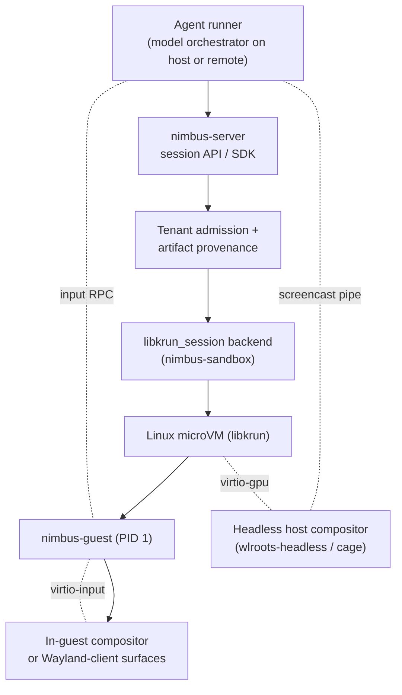
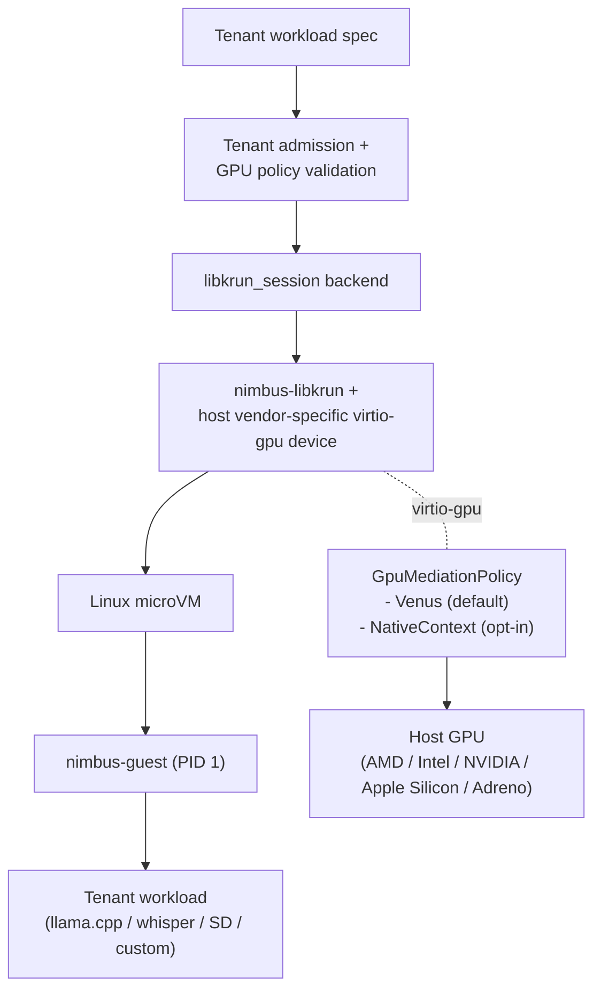

# Plan: Nimbus Sandbox (Unified)

One execution plan for every Nimbus sandbox workload — Lambda-style
invocation, agentic desktop sessions, and GPU inference — all running on
the unified `nimbus-libkrun` backend with capability profiles. Replaces
three previously-separate plans: `nimbus-libkrun-snapshot-port-plan.md`,
`computer-use-sandbox-plan.md`, and `gpu-accelerated-sandbox-plan.md`
(all archived 2026-05-27).

## Status

- **Status:** `proposed` (per-band gates ship semi-independently)
- **Activation precondition:** finish or explicitly checkpoint the host
  lifecycle backend seam in
  [`docs/plans/archive/tenant-domain-and-node-enforcement-boundary-plan.md`](archive/tenant-domain-and-node-enforcement-boundary-plan.md);
  the six research baselines below must be landed.
- **Primary goal:** stand up a tenant-isolated `libkrun_session` sandbox
  backend on the `nimbus-libkrun` fork, with capability profiles for
  Lambda-style invocation (snapshot/fork), agentic desktop sessions
  (display + input), and GPU inference workloads (Venus default,
  native-context opt-in).
- **References (research baselines):**
  - [`docs/plans/research/vmm-landscape-2026.md`](./research/vmm-landscape-2026.md) — decision baseline (D1–D12) and snapshot/fork mechanism research (§6–§8)
  - [`docs/plans/research/libkrun-session-sandbox.md`](./research/libkrun-session-sandbox.md) — backend shape, components, lifecycle, capability profiles, per-host topology
  - [`docs/plans/research/gpu-sandbox-backends.md`](./research/gpu-sandbox-backends.md) — GPU mediation evidence (Venus / native-context / CUDA / ROCm)
  - [`docs/plans/research/computer-use-capabilities-audit.md`](./research/computer-use-capabilities-audit.md) — desktop product capability audit
  - [`docs/plans/research/nimbus-libkrun-fork-inventory.md`](./research/nimbus-libkrun-fork-inventory.md) — fork patch inventory and anticipated-patch list
  - [`docs/plans/research/macos-host-vs-guest-control-plane-rationale.md`](./research/macos-host-vs-guest-control-plane-rationale.md) — Option-A host topology rationale
- **References (architecture / upstream):**
  - [`docs/architecture/sandbox/service-sandbox-session-model.md`](../architecture/sandbox/service-sandbox-session-model.md), [`docs/architecture/sandbox/microvm-service-baseline.md`](../architecture/sandbox/microvm-service-baseline.md), [`docs/architecture/sandbox/macos-machine-flow.md`](../architecture/sandbox/macos-machine-flow.md)
  - libkrun v1.18.1 (`~/src/github.com/nimbus/nimbus-libkrun`, branch `nimbus/v1.18.1`)
  - Firecracker `snapshot-support.md` and `src/vmm/src/persist.rs` (`~/src/github.com/firecracker-microvm/firecracker`, head `eaa62396d`, Apache-2.0)
  - zeroboot prototype (`~/src/github.com/zerobootdev/zeroboot`, Apache-2.0)
  - [muvm (AsahiLinux/muvm)](https://github.com/AsahiLinux/muvm), [Mesa Venus driver docs](https://docs.mesa3d.org/drivers/venus.html)

## Decision Summary

This plan executes the unified-lift decisions D1–D12 from
[`vmm-landscape-2026.md`](./research/vmm-landscape-2026.md): one VMM
family (`nimbus-libkrun`) carries every workload through capability
profiles, not separate VMMs. The previously-separate Firecracker plan
(`firecracker-snapshot-invocation-backend-plan.md`) was archived
without execution per D2.

| Profile shape | Path | Owning band |
| --- | --- | --- |
| Lambda-style invocation (snapshot/fork) | `libkrun_session` w/ `lambda` profile | Band S (mechanism) + Band B (skeleton) |
| Desktop / computer-use session (display + input) | `libkrun_session` w/ `desktop` profile | Band D |
| GPU inference workload (Venus default, native-context opt-in) | `libkrun_session` w/ `gpu` profile | Band G |
| CUDA-only workload | separate NVIDIA fleet (vGPU or bare-metal) | not owned here |
| ROCm workload | deferred until amdgpu HSAKMT path proves out | not owned here |
| Long-lived OCI services | existing krun service-microVM via conmon/crun | not owned here |

Do not build a separate `computer_use` backend or a separate
`firecracker_snapshot` backend. The three profiles are the same
`libkrun_session` backend with different spec options.

Resource vocabulary follows
[`service-sandbox-session-model.md`](../architecture/sandbox/service-sandbox-session-model.md):
services are named tenant dependencies managed by `nimbus-services` with
sandbox-backed, built-in, or external implementations; sandboxes are isolated
execution resources addressed by id/handle; sessions are scoped interaction
leases over a target; runtime isolates are not SDK sandboxes. This plan owns
sandbox/session backend mechanics for desktop/GPU/lambda profiles; it does not
rename Compose services, implement built-in services, or make arbitrary
sandboxes resolvable by name. A future isolate-backed user-created sandbox
profile is reserved as `profile: "isolate"`; ordinary runtime invocation
isolates remain internal `nimbus-runtime` execution domains.

## Per-Host Topology (D11 + D12)

Snapshot/fork (Band S) is **Linux-KVM-only by construction**. The
deployed Nimbus topology has no HVF consumer for the snapshot/fork
mechanism:

- **Linux hosts** (every production class): per-request workloads run as
  direct libkrun-on-KVM microVMs. Bands B / S / D / G all execute here.
  This is where the snapshot mechanism, UFFD lazy loading, and
  MAP_PRIVATE fork primitive actually run.
- **macOS dev hosts:** krunkit (libkrun-on-HVF) boots **one** outer
  machine-os Linux VM
  (`ghcr.io/nimbus/machine-os:v0.1.30`, pinned 2026-05-14). That outer
  VM is single-instance and long-lived per developer environment; it
  does not need snapshot/restore or sub-ms fork. Per-service workloads
  inside the outer VM run as **standard Linux containers** managed by
  the guest machine API
  ([`docs/architecture/sandbox/macos-machine-flow.md`](../architecture/sandbox/macos-machine-flow.md) §"Flow 6"),
  not as nested libkrun microVMs. macOS dev gets crun's ~10–50 ms
  container cold start; production parity for fork-semantics is enforced
  via Linux CI.

Implementation implication: Band S CI matrix and microbenchmarks target
Linux KVM only. Existing macOS proof helpers
(`make collect-nimbus-machine-cli-proof`,
`make collect-nimbus-machine-guest-proof`,
`make collect-nimbus-machine-service-proof`,
`make collect-nimbus-homebrew-cask-proof`) continue to cover the
outer-VM lifecycle but do **not** exercise the snapshot/fork code
paths added by this plan. Desktop and GPU profile smokes on macOS run
inside the outer VM as standard containers, not nested microVMs.

## Sizing Convention

Each phase is sized as `~X LoC net new + ~Y LoC tests` against the
`nimbus-libkrun` fork (Band S) or the Nimbus workspace (Bands B / D / G).
SWAG can swing 30-50%; figures are concrete enough to falsify when the
code lands. See [[feedback_engineering_sizing_loc_swag]] for the framing.

## Fork-Health Guardrails

The unified-lift strategy concentrates roughly ten thousand LoC of
Nimbus-permanent delta into a single fork (`~/src/github.com/nimbus/nimbus-libkrun`).
That is a maintainable scale **only** if the lift stays additive, the
upstream-touch surface stays minimal, and fork health is measured rather
than assumed. Each band ships under the seven posture rules below;
failing any of them is a stop condition, not a TODO.

### G1 — Sister-crate-first for snapshot/restore

**Rule.** Snapshot/restore and fork-primitive code that *can* live in a
sister crate (linking libkrun without modifying upstream files) *must*
live in a sister crate. The bar to touch an upstream libkrun file is
"there is no other way." The target ratio is **≥70% sister crate,
≤30% in-fork modification** measured by net-new LoC.

**Why.** Every modified upstream file is a rebase-conflict surface;
sister-crate code is rebase-free. This single lever has the largest
effect on per-quarter rebase cost.

**How applied.** S0 partitions every subsequent phase between
`crates/nimbus-libkrun-snapshot` (sister) and in-fork. Each S1–S5
phase reports its sister-crate vs in-fork LoC ratio in the closeout.
Candidates for the sister crate: snapshot file format + serde, vCPU
state capture (KVM ioctl wrappers), memory snapshot machinery, the
MAP_PRIVATE fork primitive, kick/wake orchestration, restore-time
re-init coordinator. Candidates that must live in-fork: per-device
`SaveState` / `RestoreState` trait impls and the device registration
glue.

### G2 — Device Save/Restore via trait-impl sidecar

**Rule.** Per-device snapshot state lives in a Nimbus-side trait
impl, registered into a Nimbus-owned module — not as new methods on
the upstream device struct. The trait shape is small:
`fn save_state(&self) -> Result<Box<dyn SerializableState>>; fn
restore_state(&mut self, state: &dyn SerializableState) -> Result<()>;`.

**Why.** Adding methods to upstream device structs is the worst
rebase pattern: every upstream change to that struct collides with
ours. A sidecar registration pattern lets upstream device evolution
flow through without conflict, and lets a new libkrun device land
without breaking our snapshot lane.

**How applied.** S2 lands the trait shape + registration pattern as
its first deliverable. The remaining S2 / S3 work adds sidecar impls,
not inline methods.

### G3 — S0 re-estimate gate

**Rule.** The Band S0 spike produces a tightened estimate sized
against the G1 partition (sister vs in-fork). S1 commit is
**conditional** on the new estimate landing within **1.5× of the
original SWAG (≤14,175 total LoC, ≥70% sister-crate share)**. A
return above 1.5× SWAG or below the 70% sister-crate share is a
re-plan signal, not a continue-anyway signal.

**Why.** Estimates fit the 2× rule. A SWAG that survives a real
spike is real; a SWAG that doubles under a spike is unbounded
scope.

**How applied.** S0's deliverable is a sized partition document
(per-phase LoC for sister + in-fork; identified device save/restore
surface). S1 success criteria explicitly include "S0 estimate within
1.5× SWAG and ≥70% sister-crate share" as a gate.

### G4 — CI-enforced license attribution

**Rule.** `scripts/verify-third-party-attribution.sh` runs on every
PR. It fails if any file under `crates/nimbus-guest/` or
`crates/nimbus-libkrun-*/` is missing a provenance header
(`Lifted from <project>@<sha>` or `Adapted from <project>@<sha>`),
and verifies `LICENSE-MIT-muvm` is present in
`crates/nimbus-guest/`.

**Why.** Apache-2.0 + MIT composition (Appendix A) is permissive
**only** if attribution is correct. Honor-system attribution drifts
under iteration pressure; CI-enforced attribution doesn't.

**How applied.** Band B's pre-band guardrail bootstrap (see "Band B —
Shared Backend" below) ships the script and the deny-lane CI wiring
before B1/B2 begin lifting muvm files.

### G5 — Quarterly fork-health metric

**Rule.** Each quarter, `docs/operating/fork-health.md` is updated
with four numbers:

- **LoC delta vs upstream:** `git diff --shortstat <upstream-tag>..HEAD`.
- **Time since last upstream pull:** clock between newest libkrun
  upstream tag and our pin.
- **Rebase pain:** subjective 1–5 from the most recent rebase
  (5 = "we considered abandoning").
- **Upstreamable patches awaiting submission:** count of identified
  upstreamable Nimbus patches that haven't been sent.

A trend of `LoC delta ↑↑`, `time since pull ↑`, or `rebase pain ≥4
two quarters in a row` is the early-warning signal to invest a
sprint in upstreaming and rebase work.

**Why.** Fork health degrades silently; quarterly metrics make
silent degradation visible.

**How applied.** Band B's pre-band guardrail bootstrap ships the
`fork-health.md` template. Quarterly updates are owned by whoever
last touched Band S/D/G.

### G6 — Named maintenance budget

**Rule.** Post-S5 steady-state carries an explicit
**0.5–1 engineer-week per quarter** maintenance budget covering:
upstream rebase, security patch propagation, and Save/Restore for
new upstream devices. Major libkrun version bumps may consume one
sprint. If per-quarter actuals exceed 1.5 engineer-weeks for **two
consecutive quarters**, that triggers an architecture review (is the
sister-crate ratio drifting? Is upstream churning device internals?).

**Why.** Maintenance time consumed silently is technical debt
accrued silently. Naming the budget makes it visible to staffing
and to the architecture review process.

**How applied.** Documented in `docs/operating/fork-health.md`.
Referenced when the team plans quarterly capacity.

### G7 — Upstream relationship posture

**Rule.** Engage libkrun maintainers proactively, not after a
collision:

- Open a discussion issue when starting S0: "We are prototyping
  out-of-tree snapshot/restore. Interested in eventual upstreaming
  of the patterns?" Cost: a single GitHub issue.
- Submit TSI bind-address (already-landed `15bcf49`) and the
  anticipated passt-mode bind-address patch (fork-inventory §8 item
  #1) upstream when each stabilizes.
- Track upstream releases monthly. Patch releases: merge within one
  quarter. Minor releases: merge within two quarters.

**Why.** Friendly upstream relationships shrink the fork delta over
time; adversarial fork relationships grow it monotonically. The
cost of being a friendly fork is near-zero; the long-term cost of
being an unfriendly one is unbounded.

**How applied.** Band B's pre-band guardrail bootstrap opens the
snapshot/restore discussion issue and records the URL in
`docs/operating/fork-health.md`. Each subsequent upstreamed patch is
logged there.

## Bands

The plan is organized into four bands. Each band has its own success
criteria and its own `/goal` prompt so it can ship semi-independently:

- **Band B — Shared Backend.** The `libkrun_session` skeleton, profile
  dispatch trait surface, and the `nimbus-guest` PID-1 binary. Every
  other band depends on B.
- **Band S — Snapshot/Fork Mechanism.** P0–P5 work to add
  snapshot/restore and the MAP_PRIVATE fork primitive to the
  `nimbus-libkrun` fork. Linux-KVM-only per D11.
- **Band D — Desktop Profile.** Tenant-safe desktop sessions with frame
  capture and synthetic input injection. Consumes B.
- **Band G — GPU Profile.** Tenant-safe GPU mediation with Venus default
  and native-context opt-in. Consumes B.

Dependency edges: D and G require B1+B2; D's snapshot/restore (CUS-Snap
follow-on) requires S3; G's restore semantics (re-init on restore, D5
decision) ride S3.

### Band B — Shared Backend

Owns the cross-profile skeleton: the `libkrun_session` backend type,
the profile dispatch trait surface, and the `nimbus-guest` PID-1 guest
agent.

#### Pre-band guardrail bootstrap

Before B1 begins, three small deliverables wire the Fork-Health
Guardrails (§G1–§G7) into the workflow so every subsequent phase ships
under them rather than retrofitting compliance later:

- **Attribution gate (G4).** Add `scripts/verify-third-party-attribution.sh`
  and a deny-lane CI job that runs it on every PR. The script fails
  when any file under `crates/nimbus-guest/` or
  `crates/nimbus-libkrun-*/` is missing a `Lifted from <project>@<sha>`
  or `Adapted from <project>@<sha>` provenance header, or when
  `LICENSE-MIT-muvm` is absent from `crates/nimbus-guest/`.
- **Fork-health template (G5/G6).** Land `docs/operating/fork-health.md`
  with the quarterly columns (LoC delta vs upstream, time since last
  upstream pull, rebase pain 1–5, upstreamable patches awaiting
  submission) and the named 0.5–1 engineer-week/quarter maintenance
  budget. First entry seeded against the current `nimbus/v1.18.1` pin.
- **Upstream engagement (G7).** Open a single discussion issue with
  the libkrun maintainers describing the out-of-tree snapshot/restore
  prototype intent and asking whether eventual upstreaming is welcome.
  Record the URL in `fork-health.md`.

These three items are tracked as a single closeout (no separate phase
row to avoid renumbering B1/B2). Closeout artifacts:
`scripts/verify-third-party-attribution.sh` present, deny-lane CI
green on a probe PR, `docs/operating/fork-health.md` checked in with
its first quarterly row, discussion-issue URL logged in
`fork-health.md`.

| Phase | Status | Goal | Verification |
| --- | --- | --- | --- |
| B0 | `done` | Research baselines landed: `vmm-landscape-2026.md` (D1–D12), `libkrun-session-sandbox.md`, `gpu-sandbox-backends.md`, `computer-use-capabilities-audit.md`, `nimbus-libkrun-fork-inventory.md`, `macos-host-vs-guest-control-plane-rationale.md`. Inventory the `nimbus-libkrun` fork's patch delta vs upstream and vs muvm's `krun-sys`. | Research notes cite current upstream commits/MRs; fork patch inventory checked in at `docs/plans/research/nimbus-libkrun-fork-inventory.md`. Closed 2026-05-26: 1 functional libkrun patch (`15bcf49` TSI bind-address) + 9 scaffolding patches; muvm MIT per-component disposition table covers all guest + host modules; canonical `krun_set_gpu_options2` shape captured at §7; anticipated per-tenant native-context ioctl filter recorded as a likely future fork patch. |
| B1 | `todo` | Build the `libkrun_session` backend skeleton in `nimbus-sandbox::backends::libkrun_session`. Profile dispatch trait surface (`Sandbox` trait with `snapshot()` / `branch()` / `restore()` reserved methods returning `unimplemented!()` until S band lands), `LibkrunSessionSandboxSpec`, profile enum (`lambda` / `desktop` / `gpu`). Image admission contract + tenant binding. | Type/unit tests prove tenant ID, session ID, profile selection, and egress policy are required where needed. Trait-surface tests prove the reserved snapshot/branch/restore methods exist and are explicitly unimplemented until S3. |
| B2 | `todo` | Build the `nimbus-guest` static PID-1 binary in new crate `crates/nimbus-guest` with vsock control listener, mounts, exec/reap, log streaming, shutdown handling. Start from muvm-guest design; vendor where useful with MIT attribution. **v0 also includes**: `xdg-open` URL/intent injection over vsock; structured trajectory log emitter (CUS-Trace v0 baseline — every HID event, every emitted frame PTS, every control-channel event → JSON lines on a reserved vsock channel); password-focus redaction flag handling for typed-input log entries. | Unit tests cover config parsing, signal handling, child reaping, exit propagation, log framing, secret redaction. Guest smoke runs in a libkrun VM. Trajectory log schema test proves event types are versioned and round-trippable. URL injection smoke proves `xdg-open` opens a registered handler. |

**Band B exit:** The pre-band guardrail bootstrap closeout is logged
(attribution CI green on a probe PR, `docs/operating/fork-health.md`
seeded, upstream libkrun discussion issue open); a `libkrun_session`
backend can launch a guest with a chosen profile and a tenant binding;
`nimbus-guest` PID-1 supervises the guest workload with structured
logging and the reserved trajectory emitter. Bands D, G, S can build
against this skeleton under the fork-health guardrails.

### Band S — Snapshot/Fork Mechanism (Linux-KVM only per D11)

Port snapshot/restore and a sub-millisecond fork-on-demand primitive
into `nimbus-libkrun` without giving up libkrun's existing virtio-fs,
virtio-gpu (Venus + native-context), virtio-input, and virtio-snd
device wiring. Mechanism research lives in
[`vmm-landscape-2026.md`](./research/vmm-landscape-2026.md) §6–§8;
license composition in [Appendix A](#appendix-a-license-composition).

#### Why a port, not a re-platform

libkrun and Firecracker share part of the `rust-vmm` substrate —
specifically `kvm-ioctls` 0.22, `vm-memory` 0.17, and `linux-loader`
0.13.2 (verified in `~/src/github.com/nimbus/nimbus-libkrun/src/*/Cargo.toml`).
libkrun does **not** depend on the rust-vmm `virtio-queue` or `vm-superio`
crates; it carries its own forked virtio queue impl at
`src/devices/src/virtio/queue.rs`. libkrun's `snapshot-support.md`
equivalent does not exist yet (libkrun upstream issue #67, closed
2022 without implementation); Firecracker's does. The mechanism is
portable because the underlying KVM state surface (`KVM_GET_REGS`,
`KVM_GET_SREGS`, `KVM_GET_LAPIC`, `KVM_GET_MSRS`, `KVM_GET_XSAVE`) and
`MAP_PRIVATE` memory-backing pattern are not Firecracker-specific. The
device-side serializers must be ported against libkrun's forked queue
impl, not lifted verbatim.

| Phase | Status | Goal | Verification |
| --- | --- | --- | --- |
| S0 | `todo` | Scoping spike: vCPU + memory snapshot prototype on a stripped libkrun guest (no devices beyond `serial`). Wire `KVM_GET_REGS` / `KVM_GET_SREGS` / `KVM_GET_LAPIC` / `KVM_GET_MSRS` / `KVM_GET_XSAVE` capture on a paused libkrun vCPU thread; write captured state + a copy of guest memory to disk; restore into a freshly-launched libkrun process and resume. **Also produces the G1/G3 sized partition document** (`docs/plans/research/nimbus-libkrun-snapshot-partition.md`): per-phase LoC split between `crates/nimbus-libkrun-snapshot` (sister) and in-fork modification, identified device save/restore surface, anticipated `crates/nimbus-libkrun-fork-primitive` candidacy. **SWAG: ~500 LoC net new (tests inline).** | One end-to-end test asserts a guest register value (e.g., `rip`) survives the round-trip. Sized partition document checked in; reviewed total stays within 1.5× original SWAG (≤14,175 LoC) and projected sister-crate share is ≥70%. **Exit:** a paused minimal guest can be resumed in a new libkrun process with `rip` and a memory marker intact, and the G1/G3 partition document is checked in. |
| S1 | `todo` | Productionize the S0 spike behind a stable wire format. Define `SnapshotV1` envelope (header + version + payload sections) modeled on Firecracker's `MicrovmState`. Save/Restore for: VM state (TSC, CPUID), all vCPUs, GIC (arm64), IRQ chip (x86_64), MSRs. Memory: serialize via the existing `vm-memory` backing-file path; restore by re-mapping the file with `MAP_SHARED` or `MAP_PRIVATE` (choice deferred to S4). UFFD eager-load mode (no lazy faults yet — see S5). **Lands in `crates/nimbus-libkrun-snapshot` (sister crate per G1).** **SWAG: ~1,800 LoC net new + ~500 LoC tests.** | **G3 commit gate:** S0's partition document is checked in and shows ≤14,175 total LoC and ≥70% projected sister-crate share — re-plan signal otherwise. Round-trip tests for boot → workload → pause → snapshot → restore → resume, asserting workload progress. S1 closeout reports actual sister-crate vs in-fork LoC ratio. **Exit:** a device-less guest running a CPU-bound workload survives snapshot/restore with bit-exact register and memory state; S1 sister-crate share is ≥70%. |
| S2 | `todo` | Cover libkrun's simple virtio devices using Firecracker's Save/Restore trait pattern. **First deliverable (per G2):** land the trait-impl sidecar shape — `trait DeviceSnapshot { fn save_state(&self) -> Result<Box<dyn SerializableState>>; fn restore_state(&mut self, state: &dyn SerializableState) -> Result<()>; }` defined in `crates/nimbus-libkrun-snapshot`, plus a Nimbus-owned registration module in the fork (`src/devices/src/nimbus_snapshot_registry.rs`) that wires per-device impls without adding methods to upstream device structs. Devices in scope: `virtio-block`, `virtio-net`, `virtio-vsock`, `virtio-rng`, `virtio-balloon`, `virtio-pmem`. Port Firecracker's `MmioTransport` save/restore behind the sidecar. **SWAG: ~1,400 LoC net new + ~500 LoC tests.** | Per-device unit tests + an integration test that boots a guest with one of each device, snapshots, restores, and asserts queue continuity. Pattern-conformance test proves zero new methods were added to upstream device structs (sidecar-only). S2 closeout reports sister-crate vs in-fork LoC ratio against the G1 target. **Exit:** a guest with the full simple-device set survives snapshot/restore without packet/block-IO duplication or loss on restore; trait-impl sidecar pattern is the only registration path. |
| S3 | `todo` | The hardest devices (virtio-gpu Venus/native-ctx, virtio-input, virtio-snd, virtio-fs) hold large external state. libkrun's virtio-fs is **in-process passthrough** (`src/devices/src/virtio/fs/linux/passthrough.rs`, ~2,200 LoC on Linux; ~2,500 LoC on macOS) — not an out-of-process virtiofsd. Per D5/D6 (revised 2026-05-27): **re-init on restore** for all four devices. virtio-fs re-mounts each tag from clean state; virtio-gpu re-creates the Venus renderer (guest userspace must handle `VK_ERROR_DEVICE_LOST` or equivalent); virtio-input re-registers devices, drops in-flight events; virtio-snd re-opens the host audio backend. Guest-side: a `nimbus-guest` hook drives the re-init dance idempotently. **SWAG: ~1,050 LoC net new + ~600 LoC tests.** | Tests cover restore from snapshot with each device active, asserting the guest reaches a usable state within a bounded recovery window. Include one test that snapshots a session with an active GPU-accelerated browser render. **Exit:** a desktop-profile guest survives snapshot/restore with working display, input, audio, and shared-filesystem mounts within a bounded recovery window. Guest userspace that cannot tolerate GPU context loss is documented as a known limitation. |
| S4 | `todo` | Port the zeroboot mechanism: a parent template VM is paused with its memory backed by `MAP_PRIVATE` on a sealed file; child VMs are forked by spawning a new libkrun process that maps the same file `MAP_PRIVATE`, inheriting the parent's memory via copy-on-write at the kernel level. Add a `forkable` snapshot mode that seals the memory backing file and the device-Save metadata. Add `libkrun_session_fork(template_handle) -> session_handle` API that spawns a child sharing the parent's `MAP_PRIVATE` backing file. vCPU state: clone from template, scribble a per-child nonce into a reserved guest page. **SWAG: ~1,150 LoC net new + ~400 LoC tests.** | Microbenchmark: p50 spawn time + per-child resident memory. The zeroboot baseline (0.79 ms p50 / 265 KB per sandbox) is on minimal serial-only guests; a full desktop-profile session forks more slowly — target is "within one order of magnitude," not parity. **Exit:** `libkrun_session_fork` returns a running child guest in under ~10 ms p50 for the desktop profile and under ~3 ms p50 for the lambda profile on a Linux dev box, with per-child RSS overhead in the low MB / low hundreds of KB respectively. |
| S5 | `todo` | Add the latency wins that depend on the snapshot wire format being stable. Diff snapshots: capture only dirty pages since a base snapshot (KVM dirty-page bitmap). UFFD lazy page-fault loading: serve pages on demand from the snapshot file instead of eager-loading at restore. **SWAG: ~1,150 LoC net new + ~400 LoC tests.** | Restore-latency microbench: full snapshot vs. diff vs. UFFD lazy on a representative agentic workload. **Exit:** UFFD lazy restore brings cold-restore latency under the Firecracker reference number (~125 ms for a 128 MB guest) on the same hardware class. |

**Band S totals:** **~7,050 LoC net new + ~2,400 LoC tests = ~9,450 LoC**
across the fork. Phases are individually shippable: S0–S2 are
sufficient for the `lambda` profile; S3 is required for the `desktop`
and `gpu` profiles' restore semantics; S4 unlocks the sub-ms fork
product story; S5 is pure latency optimization.

### Band D — Desktop Profile

Tenant-safe, libkrun-backed sandbox that hosts a long-lived desktop
session with frame capture and synthetic input injection, suitable for
AI-agent computer-use workloads.

#### Target architecture



#### Core invariants

- Sessions are tenant-scoped: one VM per (tenant, session) pair; no
  shared writable state across tenants.
- Sessions target a sandbox id/handle created by the sandbox lifecycle. They do
  not resolve sandboxes by name. Named app dependencies stay in the service
  model and may be session targets only through `{ service: { name } }` in the
  future SDK/control-plane plan.
- Runtime isolates are not SDK sandboxes. If a future runtime worker is deployed
  inside a sandbox backend for operational isolation, that remains a deployment
  choice and does not create a user-addressable sandbox resource.
- If Nimbus later adds an explicit isolate-backed sandbox resource, its profile
  is `profile: "isolate"` and it must be created, inspected, stopped, audited,
  and session-targeted by sandbox id/handle like every other sandbox.
- Frame capture and input injection only flow over the per-session vsock
  channel; tenants cannot read another tenant's screencast pipe.
- Untrusted-by-default guest network: passt with the tenant's
  `SandboxEgressPolicy`. No bypass.
- Image admission is the same artifact-provenance contract as Linux
  production service microVMs.
- Synthetic input events are recorded in the per-session audit log with
  monotonic sequence numbers; recording cannot be silently disabled by
  the agent.
- Idle timeout fails closed: the session is torn down, not paused, on
  expiry.
- Snapshot/checkpoint of a live computer-use session is reserved for
  the **CUS-Snap** follow-on (depends on Band S3).
- The libkrun-session backend runs unprivileged on Linux (`/dev/kvm`
  group + uid/gid mapping). Root mode is only a temporary diagnostic
  fallback.

#### Operator CLI

```text
nimbus sandbox session start --tenant <id> --image <ref@sha256:...> [--display h264|jpeg|raw] [--idle-timeout <duration>]
nimbus sandbox session list
nimbus sandbox session inspect <session-id>
nimbus sandbox session stop <session-id>
nimbus sandbox session screencast <session-id>
nimbus sandbox session input <session-id> -- <input-event-json>
```

Exact namespace may change during implementation.

#### Rust ownership

```rust
struct LibkrunSessionSandboxSpec;     // Band B1
struct ComputerUseSessionPolicy;
struct HeadlessCompositorPolicy;
struct VirtioInputInjectionPolicy;
struct ComputerUseSessionStatus;
struct ScreencastPipeBinding;
```

| Area | Owner |
| --- | --- |
| `libkrun_session` backend | `nimbus-sandbox::backends::libkrun_session` (Band B1) |
| `nimbus-guest` guest agent | `crates/nimbus-guest` (Band B2) |
| Session lifecycle, tenant binding, status / evidence | `local_enforcement` / future `nimbus-node` |
| Operator CLI | `nimbus-bin` |
| HTTP/gRPC transport | `nimbus-server` |
| Artifact provenance | existing artifact provenance verifier seam |

Do not put libkrun process launch, virtio-gpu config, or screencast pipe
plumbing in `nimbus-runtime`. `nimbus-runtime` stays execution-only.

#### Phases

| Phase | Status | Goal | Verification |
| --- | --- | --- | --- |
| D1 | `todo` | Define desktop-profile contract types: `LibkrunSessionSandboxSpec` (extension), `ComputerUseSessionPolicy`, `HeadlessCompositorPolicy`, `VirtioInputInjectionPolicy`, `ComputerUseSessionStatus`, `ScreencastPipeBinding`. **v0 also reserves** (per audit §10): `state: StatePolicy` (Ephemeral / Persistent), `time: TimePolicy`, `locale: LocalePolicy`, `display.dpi`, `audio: Option<AudioStreamPolicy>` (reserved, None in v0), `camera: Option<CameraStreamPolicy>` (reserved, None in v0), `recording: Option<RecordingPolicy>` (video-only in v0), `trajectory: TrajectoryPolicy`, `redaction: RedactionPolicy`, `events: EventStreamPolicy`. | Type/unit tests prove tenant ID, session ID, display policy, input policy, lifetime, and egress requirements are required where needed. Spec-shape tests prove reserved fields round-trip wire format without breaking when future implementations land. |
| D2 | `todo` | Build the headless host-side compositor seam: per-session wlroots-headless (or cage) instance, screencast capture via `wlr_screencopy_v1`, H264/JPEG/raw output. **v0 also includes**: per-window capture via `wlr_foreign_toplevel_management_v1`, per-region (src-rect) capture, DPI/scaling configurability on `HeadlessCompositorPolicy`, monotonic PTS on every emitted frame (so a future audio track can sync against it), single-frame screenshot one-shot API. **In-guest XWayland enabled by default** so X11-only apps work transparently. | End-to-end test renders a known frame inside the guest and captures it on the host with a checksum match. Per-window capture test proves the captured frame excludes other windows. PTS test proves frame timestamps are monotonic and machine-clock-aligned. XWayland smoke proves an X11-only test app renders and captures. |
| D3 | `todo` | Build the virtio-input injection RPC: vsock event channel from host agent runner into guest virtio-input device. **v0 also includes**: IME enablement option in guest config (ibus/fcitx) for CJK and complex scripts; every input event is echoed into the trajectory log emitter from B2. | Unit tests cover event serialization; guest smoke proves a synthetic click reaches an in-guest test app. IME smoke proves a non-Latin character can be entered via the configured IME. Audit test proves every injected event is recorded in the trajectory log with a matching seq number. |
| D4 | `todo` | Integrate passt for per-session networking with `SandboxEgressPolicy` enforcement. Do not inherit gvproxy into the per-sandbox lane. **v0 also reserves** vsock channel IDs in the control protocol: `MEDIA_SCREEN_OUT` (used), `MEDIA_AUDIO_OUT`, `MEDIA_AUDIO_IN`, `MEDIA_CAM_OUT`, `MEDIA_CAM_IN`, `TRACE`, `EVENTS`, `CLIP`, `DND` (reserved). | Two-tenant harness proves egress policy is enforced and tenants cannot reach each other's listeners. Channel-ID enum test proves reserved IDs are stable across releases. |
| D5 | `todo` | Stand up the session lifecycle: idle timeout, max session, evict on tenant delete, recover from crash. **v0 also includes**: tenant output area pattern (a watched virtiofs subdirectory whose contents survive session teardown and are accessible to the operator API for retrieval); a large-file pull helper that streams from the share without filling guest disk. | Failure-injection tests prove sessions tear down cleanly on each path; lifecycle states match the design. Output-area test proves files written inside the watched dir are retrievable after session stop. Large-file pull test proves a >1 GiB file streams out without doubling memory. |
| D6 | `todo` | Enforce per-session tenant isolation: storage, network, image, identity, credentials, audit. **v0 also adds**: `Sandbox::snapshot()`, `Sandbox::branch()`, `Sandbox::restore()` trait methods (return `unimplemented!()` in v0; implementations land via CUS-Snap follow-on, which depends on S3). | Two-tenant harness proves no cross-tenant writable state, no screencast/input cross-talk, forged tenant identity rejected. Trait surface tests prove the reserved lifecycle methods exist and are explicitly unimplemented in v0. |
| D7 | `todo` | Add operator CLI commands and HTTP/gRPC transport for session lifecycle and screencast/input. **v0 CLI surface includes**: `start`, `list`, `inspect`, `stop`, `screencast`, `input`, `trajectory` (stream the trajectory log), `screenshot` (single-frame capture), `record` (video-only in v0), `file pull` (stream out from tenant output area), `xdg-open` (inject a URL). | CLI smoke proves start/list/inspect/stop/screencast/input round-trip. Trajectory subcommand smoke proves the JSON-line stream lines up with the in-guest events. Screenshot smoke matches a known checksum. Record subcommand produces a playable MP4. file pull retrieves a known file. |
| D8 | `todo` | Observability and evidence: session events, input audit log, frame metrics, OCSF/OpenTelemetry mapping, redaction. | Tests prove high-cardinality IDs stay in events/evidence; secret redaction holds; operator diagnostics explain admission and lifecycle failures. |
| D9 | `todo` | CI gates: contract/client tests on every CI; Linux libkrun smoke gated on `/dev/kvm` capability; macOS krunkit smoke gated on Apple Silicon runner against the outer machine-os VM lifecycle (D11/D12 — no nested microVM expected on macOS). | Gates skip with evidence when capability is missing; fail on real regressions when available. |
| D10 | `todo` | Docs, security model, residual risk, selectability posture. | Docs clearly state the desktop profile is opt-in, threat model is documented, and product selectability is gated on plan completion. |

### Band G — GPU Profile

Tenant-safe, libkrun-backed sandbox that exposes a host GPU to the
guest via Venus (default) or per-vendor native-context (opt-in,
trusted-only), suitable for AI inference and training workloads.

#### Target architecture



#### Core invariants

- Default GPU mediation is Venus. Untrusted-workload classes (default
  classification) cannot use native-context.
- Native-context is opt-in per tenant, per spec, and requires matching
  host vendor and a recorded operator-policy approval.
- The host render-server runs in its own OS-level sandbox separate
  from the VMM (Venus's `VIRGLRENDERER_RENDER_SERVER`).
- Per-tenant render-server pinning: one render-server process per VM.
- ioctl filter on native-context paths defaults to `Strict` (allowlist
  derived from observed-safe ioctls); `Permissive` requires explicit
  operator approval recorded in the admission decision.
- CUDA tenants are admitted only on a separate NVIDIA fleet (out of
  scope for `libkrun_session`); admission rejects CUDA requests on
  `libkrun_session` with an actionable error.
- ROCm tenants are rejected until the amdgpu HSAKMT path lands and the
  cross-tenant safety story is proven.
- Benchmark gate: no backend (Venus or native-context) is promoted
  until at least one well-known ML workload runs end-to-end with
  recorded throughput evidence on a real host of that vendor.
- macOS GPU-profile path is Venus-only and gated on real-host stability
  evidence; [libkrun #377](https://github.com/containers/libkrun/issues/377)
  must be closed or worked around before promotion.

#### Operator CLI

```text
nimbus sandbox gpu doctor
nimbus sandbox gpu benchmark --image <ref@sha256:...> --workload llama.cpp [--policy venus|native-context-amdgpu|...]
nimbus sandbox gpu admit --tenant <id> --image <ref@sha256:...> --policy venus|native-context-amdgpu|...
```

#### Rust ownership

```rust
enum GpuMediationPolicy {
    Venus,
    NativeContext {
        driver: NativeContextDriver,
        ioctl_filter: TenantIoctlFilter,
    },
}

enum NativeContextDriver { Amdgpu, Freedreno, Asahi }

enum TenantIoctlFilter { Strict, Permissive }

struct GpuNodeCapabilities;
struct GpuAdmissionDecision;
struct GpuBenchmarkEvidence;
```

| Area | Owner |
| --- | --- |
| GPU policy types | `nimbus-core` (public boundary) |
| GPU admission + capability detection | `nimbus-sandbox::backends::libkrun_session::gpu` |
| Render-server lifecycle, ioctl filter | `nimbus-sandbox::backends::libkrun_session` |
| Benchmark gate, evidence shape | `local_enforcement` / future `nimbus-node` |
| Operator CLI | `nimbus-bin` |
| HTTP/gRPC transport | `nimbus-server` |

Do not put virtio-gpu config or virglrenderer process launch in
`nimbus-runtime`. `nimbus-runtime` stays execution-only.

#### Phases

| Phase | Status | Goal | Verification |
| --- | --- | --- | --- |
| G1 | `todo` | Define `GpuMediationPolicy`, `NativeContextDriver`, `TenantIoctlFilter`, `GpuNodeCapabilities`, `GpuAdmissionDecision`, `GpuBenchmarkEvidence`. | Type/unit tests prove admission rejects native-context for untrusted workloads, rejects mismatched vendors, rejects `Permissive` without operator approval, rejects CUDA, rejects ROCm. |
| G2 | `todo` | Implement Venus wiring through `libkrun_session`: virtio-gpu device with `VIRGLRENDERER_VENUS \| VIRGLRENDERER_RENDER_SERVER`, per-VM render-server process, host-capability check. | Linux-gated end-to-end runs llama.cpp Vulkan in the guest and records throughput; non-Linux CI runs contract tests. |
| G3 | `todo` | Add `nimbus sandbox gpu doctor` for capability and admission diagnostics. | Tests prove actionable errors for missing Vulkan loader, missing render server, missing virglrenderer, wrong Mesa version, ungranted `/dev/dri/renderD*` permission, mismatched vendor. |
| G4 | `todo` | Wire native-context-amdgpu as an opt-in path. Add `Strict` ioctl filter derived from an observed-safe baseline. | Two-workload harness proves the `Strict` filter passes legitimate amdgpu workloads and blocks unexpected ioctls; trusted tenant opt-in is required at admission. |
| G5 | `todo` | Wire native-context-freedreno as a follow-on opt-in path for Adreno hosts. | Aarch64 Adreno smoke proves the path works end-to-end on a trusted-workload spec. |
| G6 | `todo` | Enforce per-tenant render-server pinning and lifecycle: one render server per VM, crash recovery, log correlation, audit. | Failure-injection tests prove render-server crash takes down only one VM; lifecycle / state matches design. |
| G7 | `todo` | Tenant isolation harness: two tenants in parallel, mixed Venus and native-context, hostile guest in one tenant attempts cross-tenant leak. | Harness records no cross-tenant leak across GPU memory residue, ioctl path, render-server state, host file descriptors. |
| G8 | `todo` | NVIDIA fleet split: admission rejects CUDA requests on `libkrun_session`, documents the separate-fleet path, surfaces the operator policy record. | Tests prove the rejection is actionable; documentation describes the NVIDIA fleet posture. |
| G9 | `todo` | ROCm posture: track the amdgpu HSAKMT MR, document the deferred status, fail closed on ROCm admission. | Tests prove ROCm requests are rejected; docs describe the deferral and tracking. |
| G10 | `todo` | Benchmark gate: at least one ML workload runs end-to-end with throughput evidence on each promoted backend (Venus on each host vendor, native-context-amdgpu, native-context-freedreno). | Recorded throughput meets the documented promotion bar; macOS Venus path records ~75–80 % of native Metal as a baseline. |
| G11 | `todo` | Observability and evidence: GPU admission events, ioctl filter audit, render-server lifecycle, OCSF/OpenTelemetry mapping, redaction. | Tests prove high-cardinality IDs stay in events / evidence; ioctl audit is complete for native-context; operator diagnostics explain failures. |
| G12 | `todo` | CI gates: contract tests on every CI; Venus smoke on Linux + Apple Silicon Mac; native-context smoke on a fleet runner with the matching GPU vendor. | Gates skip with evidence when capability is missing; fail on real regressions when available. |
| G13 | `todo` | Docs: security model, threat model, vendor support, CUDA / ROCm posture, selectability. | Docs clearly state defaults, opt-ins, fleet splits, and product selectability gating. |

## Initial Success Criteria

Each band closes against its own bar; the plan as a whole closes when
all four bands close.

### Band B

- **Pre-band guardrail bootstrap closed (G4/G5/G7):**
  `scripts/verify-third-party-attribution.sh` is checked in and wired
  to the deny-lane CI; `docs/operating/fork-health.md` is checked in
  with its first quarterly row seeded against `nimbus/v1.18.1`; the
  upstream libkrun discussion issue is open with its URL logged in
  `fork-health.md`.
- A `libkrun_session` backend can launch a guest with a chosen profile
  (`lambda` / `desktop` / `gpu`) and a tenant binding.
- `nimbus-guest` PID-1 supervises the guest workload with structured
  logging, the reserved trajectory emitter, and `xdg-open` injection.
- The `Sandbox` trait surface exposes `snapshot()` / `branch()` /
  `restore()` as reserved methods returning `unimplemented!()`.
- `cargo fmt --all --check`, focused Rust tests, libkrun-gated smoke,
  krunkit-gated smoke, docs reference validation, and
  `git diff --check` pass.

### Band S

- **S0 G3 partition gate passed:** the sized partition document is
  checked in at `docs/plans/research/nimbus-libkrun-snapshot-partition.md`
  and its reviewed total stays within 1.5× original SWAG
  (≤14,175 LoC) with ≥70% projected sister-crate share. S1 commit is
  conditional on this.
- **G1 sister-crate ratio holds:** each S phase closeout reports
  ≥70% net-new LoC in `crates/nimbus-libkrun-snapshot` (sister) vs in-fork
  modification.
- **G2 trait-impl sidecar:** per-device save/restore impls live in the
  Nimbus-owned `nimbus_snapshot_registry` module; zero new methods are
  added to upstream device structs.
- S1 round-trip survives boot → workload → pause → snapshot → restore
  → resume with bit-exact register and memory state.
- S2 boots a guest with the full simple-device set and survives
  snapshot/restore without packet/block-IO duplication or loss.
- S3 desktop-profile guest survives snapshot/restore with working
  display, input, audio, and shared-filesystem mounts within a bounded
  recovery window.
- S4 `libkrun_session_fork` returns a running child guest in under
  ~10 ms p50 (desktop) / ~3 ms p50 (lambda) on a Linux dev box.
- S5 UFFD lazy restore brings cold-restore latency under the
  Firecracker reference number (~125 ms for a 128 MB guest) on the
  same hardware class.
- `cargo fmt --all --check`, focused Rust tests, Linux-KVM-gated
  snapshot/fork smoke, docs reference validation, and `git diff
  --check` pass.

### Band D

- A tenant can start a session and receive a screencast pipe URL plus
  an input RPC endpoint.
- The session runs a real desktop session with a real Linux
  distribution inside the libkrun guest.
- Synthetic input from the agent runner reaches an in-guest test app
  and is recorded in the audit log with monotonic sequence numbers.
- Frame capture round-trips a known test pattern from in-guest renderer
  to on-host pipe with a checksum match.
- Two tenants in parallel never see each other's screencast or input
  channel; egress policy holds.
- Session idle timeout, tenant-delete eviction, and crash recovery all
  fail closed with evidence.
- macOS smoke proves the same flow against krunkit on an Apple Silicon
  runner against the outer machine-os VM lifecycle (D11/D12 — no
  nested microVM expected on macOS).
- Backend is opt-in and not default until product selectability is
  approved.
- `cargo fmt --all --check`, focused Rust tests, libkrun-gated smoke,
  krunkit-gated smoke, docs reference validation, and
  `git diff --check` pass.

### Band G

- A tenant on a Vulkan-capable host (AMD / Intel / NVIDIA Linux, Apple
  Silicon macOS via krunkit, Adreno aarch64) can start a
  `libkrun_session` sandbox with `GpuMediationPolicy::Venus` and run
  llama.cpp Vulkan end-to-end with recorded throughput.
- A trusted tenant on an AMD Linux host can opt into
  `GpuMediationPolicy::NativeContext { driver: Amdgpu, ioctl_filter: Strict }`
  and run a Vulkan or VK-compute workload end-to-end with recorded
  throughput.
- Untrusted-workload classes are rejected for native-context with an
  actionable error.
- CUDA and ROCm requests on `libkrun_session` are rejected with an
  actionable error pointing at the NVIDIA fleet / ROCm deferral.
- A two-tenant isolation harness records no cross-tenant leak across
  GPU memory, ioctl paths, render-server state, or host file
  descriptors.
- macOS Venus path records the documented ~75–80 % native Metal
  baseline on llama.cpp Vulkan and runs the real-host stability gate
  cleanly.
- `cargo fmt --all --check`, focused Rust tests, Venus-gated smoke,
  native-context-gated smoke, docs reference validation, and
  `git diff --check` pass.

## Risk Register

### Band S risks

- **Device-state escape hatches break under live workloads.** Mitigation:
  S3 acceptance includes a stress test that snapshots a guest with
  active GPU/input/audio rather than idle ones.
- **MAP_PRIVATE primitive interacts badly with in-process virtio-fs FUSE
  handles.** Mitigation: S4 lands after S3; the fork primitive triggers
  a virtio-fs re-init on the child (host filesystem data persists; only
  the in-process FUSE state resets).
- **GPU device-lost handling in guest userspace is uneven.** Vulkan apps
  that don't handle `VK_ERROR_DEVICE_LOST` will crash on restore. Most
  CLI inference loops (`llama.cpp`, `whisper.cpp`) are fine; browser GL
  contexts and stateful render pipelines are not. Mitigation: document
  the limitation; offer `snapshot --quiesce-gpu` flag in S3 that pauses
  the agent before snapshotting so the guest can drain GPU work.
- **Sub-ms fork target may not hold for full desktop sessions.**
  zeroboot's 0.79 ms is on minimal serial-only guests. Mitigation: S4
  exit criterion has profile-specific thresholds (lambda ~3 ms p50;
  desktop ~10 ms p50); fall-back is still 10× better than cold boot.
- **Snapshot wire-format churn during S5.** Mitigation: freeze
  `SnapshotV1` at end of S2; diff/UFFD changes ride a `SnapshotV2`
  capability flag.
- **Upstream libkrun rebase friction.** Mitigation: keep each S phase as
  a patch series that rebases cleanly on `nimbus/v1.18.1`; track
  upstream release cadence in `vmm-landscape-2026.md`.

### Fork-health risks (cross-cutting Bands B / S / D / G)

- **Sister-crate ratio drift toward in-fork modification.** A device
  Save/Restore impl that "should" be sidecar gets written inline
  because it's two lines shorter; over many such choices the rebase
  surface grows. Mitigation: each S phase closeout reports the
  sister-crate vs in-fork LoC ratio against the G1 ≥70% target.
  Drop below 70% on a single phase is a re-design signal for that
  phase, not a continue-anyway signal. Tracked in `fork-health.md`
  alongside the quarterly LoC-delta number (G5).
- **License attribution drift.** A muvm-derived file lands without a
  provenance header, or `LICENSE-MIT-muvm` gets deleted in a refactor.
  Mitigation: G4 deny-lane CI script
  (`scripts/verify-third-party-attribution.sh`) fails the PR before
  merge. Honor-system attribution is explicitly out of scope.
- **Quarterly metric capture lapsing.** `docs/operating/fork-health.md`
  goes one quarter without an update, then two, and the early-warning
  signal stops working. Mitigation: G5 names the owner ("whoever last
  touched Band S/D/G"); a quarter without an update is itself logged
  as a 1-point rebase-pain entry the next quarter so the lapse is
  visible.
- **Upstream relationship neglect.** Months pass without a libkrun
  pull or a submitted patch; rebase surface grows monotonically.
  Mitigation: G6 maintenance budget is named (0.5–1
  engineer-week/quarter); G7 commits to monthly upstream-release
  tracking. Two consecutive quarters at >1.5 engineer-weeks triggers
  an architecture review of the sister-crate ratio and upstream-touch
  surface.
- **S0 spike under-estimates the in-fork surface.** S0 produces a
  partition document but the real per-device save/restore surface
  turns out 2× the projected LoC. Mitigation: G3 re-estimate gate.
  S1 commit is conditional on the S0 estimate landing within 1.5× of
  the original SWAG (≤14,175 total LoC, ≥70% sister-crate). A return
  above 1.5× is a re-plan signal — re-scope the band, do not roll the
  number forward silently.

### Band D / G risks

- **Backend skeleton churn between B1 and D/G consumers.** Mitigation:
  B band lands B1+B2 before D and G start their first non-types phase;
  the trait surface is frozen at end of B1.
- **Headless compositor brittleness.** wlroots-headless + screencopy is
  the supported v0 path; cage is the fallback. Mitigation: D2 tests
  cover both compositor backends.
- **Native-context ioctl baseline drift.** AMD kernel ioctl surface
  evolves between Mesa releases. Mitigation: G4 ioctl filter is
  versioned per Mesa minor; admission records the baseline version.
- **macOS Venus instability under sustained load.** libkrun #377
  tracks. Mitigation: G10 macOS smoke is gated; rollout waits on issue
  closure.

## Open Follow-Ups

Tracked as named follow-ons so they cannot hide inside this plan.

### Snapshot/fork follow-ups (post Band S)

- KVM PV-clock save/restore semantics on Linux 6.x. Validate during S1.
- macOS HVF parity for snapshot/restore: **out of scope by construction**
  per D11. The macOS deployment topology runs a single long-lived outer
  VM via libkrun-on-HVF; there is no per-request HVF consumer for the
  snapshot mechanism. Re-open only if D12 is revisited (nested
  libkrun-on-libkrun on Apple Silicon for production fork-parity in
  dev).
- Snapshot signing / attestation: integrate with Nimbus artifact
  admission in a follow-on plan once S2 lands.

### Media-flow follow-ons (post Band D, from fork inventory §11)

| Phase | Scope | Depends on |
| --- | --- | --- |
| **CUS-Aud** | Audio out (PipeWire-in-guest → vsock → host sink) + virtual mic in. Wires `audio: Some(AudioStreamPolicy)` and the `MEDIA_AUDIO_OUT` / `MEDIA_AUDIO_IN` vsock channels reserved in D4. | D2 PTS contract |
| **CUS-Cam** | Virtual webcam out (host → v4l2loopback in guest) + camera in (guest camera → host). Wires `camera: Some(CameraStreamPolicy)` and the `MEDIA_CAM_OUT` / `MEDIA_CAM_IN` channels. | CUS-Aud (PipeWire baseline) |
| **CUS-Rec** | Synced A/V recording-to-storage with the PTS contract from D2, replacing the video-only `record` subcommand. | CUS-Aud + D2 |
| **CUS-X86** | x86-on-aarch64 binary translation (Box64 / FEX) so x86-only desktop apps run on Apple-Silicon hosts. | none |

### Capability follow-ons (post Band D, from capabilities audit §11)

| Phase | Scope | Depends on |
| --- | --- | --- |
| **CUS-Acc** | Accessibility tree export (AT-SPI for GTK/Qt; AX for browsers via CDP). Vsock channel `EVENTS` + structured tree snapshot at action boundaries. Folds DOM access for non-browser apps. | CUS-Trace v0 schema (B2) |
| **CUS-Clip** | Clipboard read/write, MIME-aware (text, image, file URIs). Vsock channel `CLIP` + `wl_data_device` proxy. | none |
| **CUS-Snap** | Session snapshot, branch, resume via libkrun snapshot/restore. Bodies for the `Sandbox::snapshot()` / `branch()` / `restore()` methods reserved in D6. | Band S3 |
| **CUS-Trace v1** | Richer trajectory schema: accessibility-tree snapshots, browser DOM diffs, semantic action labels. | CUS-Acc |
| **CUS-Red** | Screen-content redaction pipeline (OCR-based regex masking, rect masking by app id, secret-token deny-list) + capture pause / privacy mode. | CUS-Acc useful but not required |
| **CUS-Persist** | Persistent named profiles (`StatePolicy::Persistent`): per-profile virtiofs mount backed by tenant storage. | D5 tenant output area |
| **CUS-DnD** | Drag-and-drop host↔guest. Vsock channel `DND` + `wl_data_device` drag protocol. | CUS-Clip |
| **CUS-Evt** | Window / dialog / notification events. Vsock channel `EVENTS` + wlroots foreign-toplevel + libnotify bridge. | CUS-Trace v0 (B2) |
| **CUS-Out** | Tenant output area auto-upload (watched virtiofs dir → object store). | D5 |
| **CUS-Net-Obs** | passt egress mirror + host pcap export for compliance/inspection. | D4 |
| **CUS-Multi** | Multi-monitor / multi-output (advertise N wlroots outputs). | D2 |

### GPU follow-ups (post Band G)

- NVIDIA vGPU operator support.
- scuda / rCUDA RPC forwarding research.
- ROCm path once virglrenderer HSAKMT MR lands and cross-tenant safety
  is proven.
- API remoting ([libkrun PR #508](https://github.com/containers/libkrun/pull/508))
  as a near-native macOS path for specific frameworks.
- native-context-intel once the Mesa MR lands.
- native-context-asahi when Nimbus runs on Asahi Linux hosts.
- Per-vendor GPU memory-residue scrubbing investigation.
- Multi-GPU host scheduling for warm-pool sessions.

### Cross-band follow-ups

- WebRTC transport for the screencast pipe (D2 currently emits
  H264/JPEG/raw; WebRTC is a downstream consumer concern).
- Performance budgets (frame rate, input latency, snapshot/restore
  tail latency) for end-user products.
- A `scripts/verify-nimbus-sandbox.sh` `/goal` control-plane gate
  script covering all four bands.

## Suggested Goal Prompts

Each band has its own goal prompt so it can ship semi-independently.

### Band B — Shared Backend

```text
/goal Complete Band B of docs/plans/nimbus-sandbox-plan.md. First, ship the pre-band guardrail bootstrap (G4/G5/G7): scripts/verify-third-party-attribution.sh wired to a deny-lane CI job that fails when crates/nimbus-guest/ or crates/nimbus-libkrun-*/ files miss a Lifted-from/Adapted-from provenance header or when LICENSE-MIT-muvm is absent; docs/operating/fork-health.md template with the quarterly columns (LoC delta, time since pull, rebase pain, upstreamable patches) plus the named 0.5–1 engineer-week/quarter maintenance budget seeded against nimbus/v1.18.1; a single discussion issue opened with upstream libkrun maintainers about out-of-tree snapshot/restore and its URL recorded in fork-health.md. Then build the libkrun_session backend skeleton with profile dispatch trait surface (Sandbox trait with snapshot/branch/restore reserved as unimplemented!()), LibkrunSessionSandboxSpec, profile enum (lambda/desktop/gpu), image admission contract, tenant binding; and the nimbus-guest static PID-1 binary in crates/nimbus-guest with vsock control, mounts, exec/reap, log streaming, shutdown, xdg-open injection, structured trajectory log emitter, password-focus redaction. Verifiable success criteria: deny-lane CI green on a probe PR; fork-health.md checked in with first quarterly row and discussion-issue URL; a guest can launch with each profile under a tenant binding; nimbus-guest supervises with structured logging and the trajectory emitter; reserved trait methods exist; cargo fmt --all --check plus focused tests plus libkrun-gated smoke plus krunkit-gated smoke plus docs reference validation plus git diff --check pass.
```

### Band S — Snapshot/Fork Mechanism (Linux-KVM only)

```text
/goal Complete Band S of docs/plans/nimbus-sandbox-plan.md. Port snapshot/restore and a sub-ms MAP_PRIVATE fork primitive into nimbus-libkrun (Apache-2.0) by lifting Firecracker's snapshot patterns (Apache-2.0) and zeroboot's MAP_PRIVATE primitive (Apache-2.0) into the fork. Linux-KVM-only by construction per D11; no macOS HVF code path. Follow the Fork-Health Guardrails (§G1–§G7) throughout: ≥70% of net-new LoC lands in crates/nimbus-libkrun-snapshot (sister) per G1; per-device save/restore uses the trait-impl sidecar pattern only (no methods added to upstream device structs) per G2; S0 produces docs/plans/research/nimbus-libkrun-snapshot-partition.md and S1 is gated on that estimate landing within 1.5× original SWAG and ≥70% projected sister-crate share per G3; every lifted file carries Lifted-from/Adapted-from provenance per G4; each phase closeout reports actual sister-crate vs in-fork LoC ratio. Phases S0–S5: scoping spike, vCPU+memory snapshot, simple device Save/Restore via sidecar pattern, virtio-fs+re-init-on-restore for GPU/input/snd, MAP_PRIVATE fork, diff snapshots + UFFD lazy loading. Verifiable success criteria: G3 partition document checked in and within 1.5×/≥70%; bit-exact CPU-bound round-trip (S1); full simple-device set round-trip without packet/block-IO loss with sidecar-only registration (S2); desktop-profile guest survives restore within bounded recovery window (S3); libkrun_session_fork returns under ~10 ms p50 desktop / ~3 ms p50 lambda (S4); UFFD lazy restore beats Firecracker reference (~125 ms for 128 MB) (S5). cargo fmt --all --check plus focused tests plus Linux-KVM-gated smoke plus docs reference validation plus git diff --check pass.
```

### Band D — Desktop Profile

```text
/goal Complete Band D of docs/plans/nimbus-sandbox-plan.md after the tenant-domain/node-enforcement host lifecycle seam is checkpointed and Band B1+B2 land. Build a proposed-to-proven libkrun-session sandbox backend that hosts one tenant-isolated Linux microVM per session with a headless host compositor for frame capture and a virtio-input RPC for synthetic input. Desktop profile only; GPU profile is Band G; lambda profile (snapshot/fork) is Band S — all three on the same nimbus-libkrun backend per D1–D12. Verifiable success criteria: a tenant can start a session, receive a screencast pipe URL and input RPC endpoint, run a real desktop inside the guest, see synthetic input round-trip into in-guest test apps, see captured frames round-trip with checksum match, see per-tenant isolation hold under a two-tenant harness, see idle timeout and tenant-delete eviction fail closed, and see macOS krunkit smoke pass on an Apple Silicon runner against the outer machine-os VM lifecycle (D11/D12 — no nested microVM expected on macOS). cargo fmt --all --check plus focused tests plus libkrun-gated smoke plus krunkit-gated smoke plus git diff --check pass.
```

### Band G — GPU Profile

```text
/goal Complete Band G of docs/plans/nimbus-sandbox-plan.md after the tenant-domain/node-enforcement host lifecycle seam is checkpointed and Band B1+B2 land. Build a proposed-to-proven libkrun-session GPU sandbox backend with Venus default (multi-vendor) and native-context opt-in for trusted AMD/Adreno tenants. CUDA tenants are routed to a separate NVIDIA fleet; ROCm is deferred until the virglrenderer HSAKMT MR lands. GPU profile only; desktop profile is Band D; lambda profile (snapshot/fork) is Band S — all three on the same nimbus-libkrun backend per D1–D12. Per-host topology (D11/D12): Linux production runs direct libkrun-on-KVM microVMs per service; macOS dev reaches Venus through the outer machine-os VM (libkrun-on-HVF via krunkit) and per-workload sandboxes inside that outer VM are standard Linux containers with GPU device access, not nested microVMs. Verifiable success criteria: Venus end-to-end on Linux + Apple Silicon macOS runs llama.cpp Vulkan with recorded throughput; native-context-amdgpu on a trusted-workload opt-in runs with recorded throughput; untrusted-workload class is rejected for native-context with actionable error; CUDA and ROCm are rejected with actionable error; two-tenant isolation harness records no cross-tenant leak; macOS Venus records ~75-80% native Metal baseline and passes the real-host stability gate. cargo fmt --all --check plus focused tests plus Venus-gated smoke plus native-context-gated smoke plus git diff --check pass.
```

## Appendix A — License Composition

All ingredients are permissive and mutually compatible — verified
2026-05-27 against upstream and the local fork. No LGPL relinking
constraint applies.

- libkrun base: **Apache-2.0**
  (`~/src/github.com/nimbus/nimbus-libkrun/LICENSE` and upstream
  `containers/libkrun/LICENSE` both declare Apache-2.0;
  `krun-sys/Cargo.toml` declares `license = "Apache-2.0"`).
- Firecracker patterns lifted into the fork (Band S): Apache-2.0.
- zeroboot primitive (Band S4): Apache-2.0
  (`zerobootdev/zeroboot/LICENSE` declares Apache-2.0).
- muvm-derived bits (Band B2 nimbus-guest baseline): MIT
  (`AsahiLinux/muvm/crates/muvm/Cargo.toml` declares
  `license = "MIT"`; the repo has no root LICENSE file, so the
  Cargo.toml SPDX is authoritative for now).

See [[feedback_apache_license_posture]] — Apache-2.0 upstream code is
freely incorporable.
