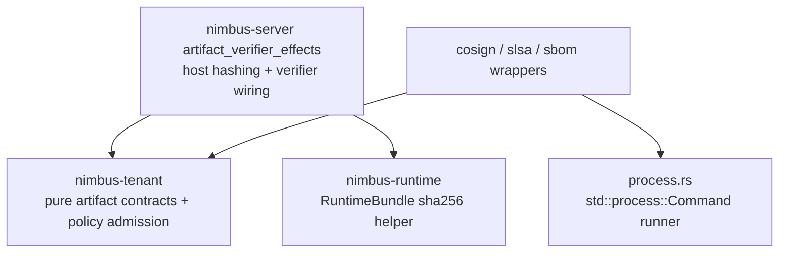

# SSE2 - Artifact Effects Readiness

Status: completed

Ledger position: `SSE2 Artifact effects readiness` completed; `SSE3
Provenance readiness` is the next phase.

## Current Import Graph And Owner Classification

Artifact authority is already owned by `nimbus-tenant`:

- `crates/nimbus-tenant/src/artifact_provenance.rs` owns pure
  `ArtifactVerificationRequest`, `ArtifactVerificationSubject`,
  `ArtifactVerificationPolicy`, verifier traits, evidence, errors,
  `CompositeArtifactVerifierBackend`, and tenant-image verification provider
  adaptation.
- `crates/nimbus-tenant/src/artifact_provenance/admission.rs` owns pure
  artifact admission, sha256 normalization, and policy/evidence matching.

Server artifact effects are owned by `nimbus-server`:

- `crates/nimbus-server/src/artifact_verifier_effects.rs` owns runtime-bundle
  and guest-executable host hashing before pure tenant admission, the generic
  command-backed verifier adapter, normalized verifier-output parsing, and
  offline trusted-root filesystem validation.
- `crates/nimbus-server/src/artifact_verifier_effects/process.rs` owns the
  only `std::process::Command` runner.
- `crates/nimbus-server/src/artifact_verifier_effects/cosign.rs`,
  `slsa.rs`, and `sbom.rs` own concrete CLI verifier wrappers.

The server module now imports artifact contracts directly from
`nimbus_tenant`, not through `crate::tenant`.

## Target Seam Shape



Pure artifact/provenance candidates must not launch processes. Process
execution is intentionally retained in server/operator wiring until a future
`nimbus-artifacts` extraction has a real non-server owner.

## Active Cleanup Performed

- Moved `ProcessArtifactVerifierCommandRunner` from
  `crates/nimbus-server/src/artifact_verifier_effects.rs` to
  `crates/nimbus-server/src/artifact_verifier_effects/process.rs`.
- Removed `std::process::{Command, Stdio}`, `std::io::Write`, `std::thread`,
  and `Instant` imports from the artifact-effect composition root.
- Changed artifact-effect root imports from `crate::tenant::{...}` to
  `nimbus_tenant::{...}`.
- Changed Cosign, SLSA, and SBOM backend production imports from
  `crate::tenant::{has_sha256_digest, parse_oci_image_reference}` to
  `nimbus_tenant::{has_sha256_digest, parse_oci_image_reference}`.
- Updated artifact-effect tests to import pure contract types from
  `nimbus_tenant` directly.

## Denied-Import Audit And Verifier Updates

Command:

```text
rg -n "std::process|Command::new|Stdio|std::fs::metadata|fs::metadata|ProcessArtifactVerifierCommandRunner|crate::tenant" crates/nimbus-tenant/src crates/nimbus-server/src/artifact_verifier_effects.rs crates/nimbus-server/src/artifact_verifier_effects -g '*.rs'
```

Result:

- No matches in `crates/nimbus-tenant/src`.
- No `crate::tenant` matches in server artifact-effect files.
- `std::process::{Command, Stdio}` and `Command::new` match only
  `crates/nimbus-server/src/artifact_verifier_effects/process.rs`.
- `ProcessArtifactVerifierCommandRunner` appears only as server-owned
  effect wiring in `artifact_verifier_effects.rs`, `process.rs`, and the
  concrete CLI backend modules.
- `std::fs::metadata` remains server-owned trusted-root validation in
  `OfflineVerificationConfig::validate`; it is not part of the pure
  artifact/provenance candidate.

The verifier now checks that this proof is completed, the process runner is
isolated in `process.rs`, `nimbus-tenant` contains no process runner or
`std::process` usage, server artifact-effect files no longer import through
`crate::tenant`, the root and concrete backend modules do not directly import
`std::process`, `Command::new`, or `Stdio`, and the focused server and tenant
artifact test counts are recorded.

## Behavior And Security Tests

```text
cargo test -p nimbus-server artifact_verifier_effects -- --nocapture
```

Result: 37 passed, 0 failed, 0 ignored, 729 filtered out.

Covered behavior includes Cosign success, wrong issuer/subject, wrong digest,
malformed output, missing tool, mutable tag-only image denial, offline
trusted-root success, offline trusted-root missing-file fail-closed behavior,
SLSA image/file success, mutable image denial, wrong builder, wrong predicate,
wrong subject digest, malformed output, timeout redaction, missing tool,
missing immutable subject/provenance path fail-closed behavior, SBOM present
success, missing SBOM command failure redaction, empty output fail-closed
behavior, mutable image denial, missing tool, tenant image policy satisfaction,
missing SBOM policy denial, generic command backend success, non-zero exit
redaction, missing executable, malformed output, timeout redaction, unsupported
artifact denial, runtime-bundle sha256 pre-admission, and guest-executable
sha256 pre-admission.

```text
cargo test -p nimbus-tenant artifact -- --nocapture
```

Result: 7 passed, 0 failed, 0 ignored, 72 filtered out.

Covered behavior includes pure tenant artifact admission, wrong
builder/predicate denial, invalid digest denial before verifier invocation,
redaction, library verifier fail-closed behavior, and composite evidence
merging.

## Extraction Decision

Decision: `nimbus-artifacts` remains blocked.

Reason: the pure artifact authority contracts are already in `nimbus-tenant`,
while the concrete artifact verifier implementations still belong to
server/operator host-effect wiring. Extracting `nimbus-artifacts` now would
either duplicate `nimbus-tenant` contracts or move process execution into a
crate with a misleadingly pure name.

Next readiness move:

- During SSE3, decide whether SLSA/SBOM provenance models are a coherent
  `nimbus-provenance` owner or should remain split between tenant policy
  contracts and server-owned verifier effects.
- If a future artifact crate is still valuable, first separate command
  invocation contracts from default process-backed constructors so the crate
  can be audited as either pure model or explicitly effectful tooling.

## Resume Cursor

Start `SSE3 Provenance readiness` by mapping tenant image provenance policy,
runtime bundle provenance admission, runtime adapter manifest integrity, and
process-backed SLSA/SBOM verifier effects into their current owners before
choosing `nimbus-provenance`, `nimbus-artifacts`, or retained split ownership.
