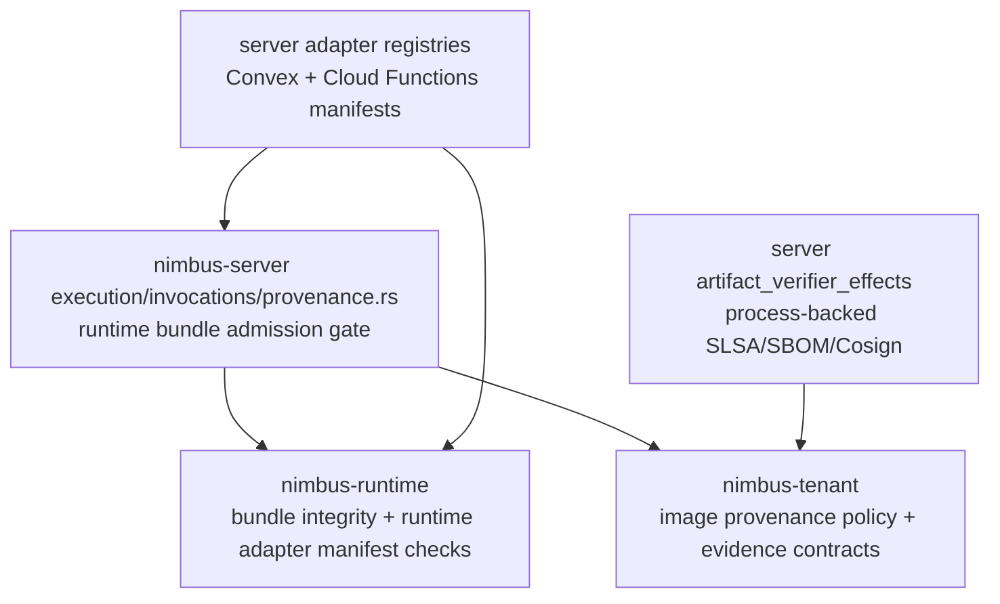

# SSE3 - Provenance Readiness

Status: completed

Ledger position: `SSE3 Provenance readiness` completed; `SSE4 Services
readiness` is the next phase.

## Current Import Graph And Owner Classification

Provenance is intentionally split by owner:

- Tenant image provenance policy and SLSA/SBOM evidence contracts live in
  `crates/nimbus-tenant/src/artifact_provenance.rs` and
  `crates/nimbus-tenant/src/operator_policy/*`.
- Runtime bundle byte integrity lives in `nimbus-runtime::RuntimeBundle`.
  Runtime re-hashes the bundle on every invocation when an expected sha256 is
  present.
- Runtime bundle provenance admission lives in
  `crates/nimbus-server/src/execution/invocations/provenance.rs`. It adapts
  runtime invocation options to tenant artifact admission before executor
  entry.
- Cloud Functions artifact manifest and bundle hash sidecar validation live in
  `crates/nimbus-server/src/adapters/cloud_functions/*`.
- Convex generated manifest, bundle hash sidecar, runtime lane selection, and
  Node external package manifest validation live in
  `crates/nimbus-server/src/adapters/convex/*`.
- Bun/JSC execution adapter manifest integrity, checksum verification, safe
  artifact path validation, SLSA/SBOM evidence-file presence, and diagnostic
  redaction live in `crates/nimbus-runtime/src/backends/bun_jsc/*`.
- Process-backed Cosign/SLSA/SBOM verification effects remain isolated in
  `crates/nimbus-server/src/artifact_verifier_effects/*` from SSE2.

## Target Seam Shape



The seam is explicit: tenant policy decides what evidence is required,
runtime owns byte and adapter integrity, server invocation wiring decides when
to apply provenance admission, and process-backed verification stays effectful.

## Active Cleanup Performed

- Extracted runtime bundle provenance gate logic from
  `crates/nimbus-server/src/execution/invocations/mod.rs` into
  `crates/nimbus-server/src/execution/invocations/provenance.rs`.
- Added focused negative tests proving the runtime provenance gate fails
  closed for:
  - missing bundle sha256 identity,
  - bundle checksum mismatch,
  - wrong provenance attestation evidence.
- Replaced parent wildcard import reliance in `blocking.rs` and `worker.rs`
  with explicit invocation/runtime imports.
- Changed Cloud Functions and Convex registry provenance verifier signatures
  to depend on `nimbus_tenant::{ArtifactVerificationPolicy,
  ArtifactVerifierBackend}` instead of server facade re-exports.

## Denied-Import Audit And Verifier Updates

Command:

```text
rg -n "crate::ArtifactVerificationPolicy|crate::ArtifactVerifierBackend|crate::tenant::Artifact|crate::tenant::SLSA|crate::tenant::TenantImage|crate::tenant::ArtifactVerifier" crates/nimbus-server/src/execution crates/nimbus-server/src/adapters/cloud_functions crates/nimbus-server/src/adapters/convex -g '*.rs'
```

Result: no matches.

Verifier updates require:

- this proof is completed,
- `execution/invocations/provenance.rs` exists and owns
  `RuntimeBundleProvenanceConfig`,
- Cloud Functions and Convex registry loading import artifact verifier
  contracts from `nimbus_tenant`,
- server execution and adapter provenance code do not use server facade or
  `crate::tenant` artifact aliases,
- process-backed verification remains isolated in artifact effects from SSE2,
- focused test counts are recorded.

## Behavior And Security Tests

```text
cargo test -p nimbus-server runtime_bundle_provenance -- --nocapture
```

Result: 4 passed, 0 failed, 0 ignored, 765 filtered out.

```text
cargo test -p nimbus-server cloud_functions_registry -- --nocapture
```

Result: 2 passed, 0 failed, 0 ignored, 767 filtered out.

```text
cargo test -p nimbus-server registry_and_license::registry -- --nocapture
```

Result: 15 passed, 0 failed, 0 ignored, 754 filtered out.

```text
cargo test -p nimbus-runtime bun_jsc -- --nocapture
```

Result: 11 passed, 0 failed, 1 ignored. The ignored
`bun_jsc_build_gate_reproduces_from_bun_build_graph` test requires a local Bun
checkout and external Bun build prerequisites.

```text
cargo test -p nimbus-runtime runtime_rejects_bundle_integrity_mismatch -- --nocapture
```

Result: 1 passed, 0 failed, 0 ignored, 510 filtered out.

Coverage summary:

- Runtime bundle provenance admission admits matching evidence before executor
  entry and fails closed before verifier invocation on missing or mismatched
  bundle sha256.
- Wrong attestation evidence fails closed at the tenant artifact admission
  boundary.
- Cloud Functions artifact manifests reject invalid artifact contracts and load
  bundle/target pairs through hash sidecars.
- Convex registries require runtime bundle hash sidecars, reject target and
  runtime metadata mismatches, reject path traversal in Node external package
  manifests, and validate Bun/JSC program bundle artifact metadata.
- Runtime bundle integrity mismatch is rejected by `nimbus-runtime`.
- Bun/JSC adapter diagnostics and trust posture still fail closed when a linked
  adapter is absent or unsuitable.

## Extraction Decision

Decision: `nimbus-provenance` remains blocked.

Reason: provenance is not one coherent ownership unit yet. The current split is
more trustworthy:

- `nimbus-tenant` owns policy and evidence contracts.
- `nimbus-runtime` owns runtime byte integrity and Bun/JSC adapter manifest
  checks.
- `nimbus-server` owns invocation-time admission composition and adapter
  registry loading.
- `artifact_verifier_effects` owns process-backed verifier effects.

Extracting `nimbus-provenance` now would either pull server adapter registries
into a model crate or duplicate tenant/runtime contracts. The next valuable
move is not a crate extraction; it is preserving the explicit sub-owner seams
and only extracting a provenance crate if a future, non-server caller needs the
same pure model.

## Resume Cursor

Start `SSE4 Services readiness` by mapping service manager, runtime service
registry, sandbox service traits, local enforcement shims, and `_nimbus`
service evidence writes. The key question is whether service evidence can be
inverted behind a writer trait without dragging server composition into a
future `nimbus-services` crate.
