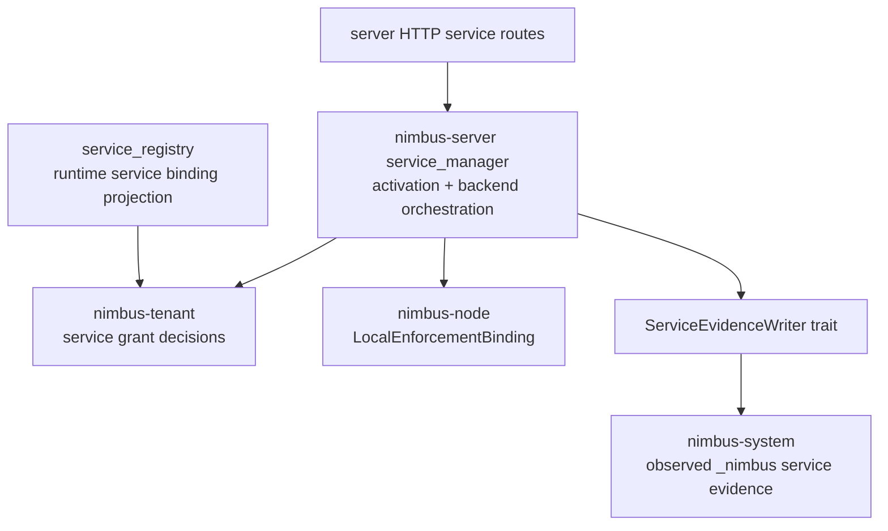

# SSE4 - Services Readiness

Status: completed

Ledger position: `SSE4 Services readiness` completed; `SSE5 Operator
readiness` is the next phase.

## Current Import Graph And Owner Classification

Service ownership after cleanup:

- `crates/nimbus-server/src/service_manager.rs` remains the server-owned
  sandbox service composition root.
- `crates/nimbus-server/src/service_manager/{activation,launch,registry}` owns
  service activation, start/stop/restart orchestration, runtime service
  registry implementation, and sandbox backend calls.
- `crates/nimbus-server/src/service_manager/system_state.rs` now owns a narrow
  `ServiceEvidenceWriter` boundary plus the server-owned
  `SystemTenantServiceEvidenceWriter` adapter.
- `crates/nimbus-server/src/service_registry.rs` owns runtime-visible service
  binding projection from sandbox handles.
- `crates/nimbus-server/src/sandbox.rs` owns server-local sandbox catalog
  traits for now.
- `crates/nimbus-node` owns `LocalEnforcementBinding` and
  `TenantEgressReloadRequest`.
- `nimbus-system` owns observed `_nimbus.services` / `_nimbus.ports`
  persistence.
- HTTP service lifecycle routes remain server-owned.

## Target Seam Shape



Service authority flows through tenant decisions and node-local projections.
Evidence writes are observed-only and inverted behind a writer trait. Server
transport and route mounting remain out of any future service crate.

## Active Cleanup Performed

- Added `ServiceEvidenceWriter` and `ServiceEvidenceFuture` in
  `crates/nimbus-server/src/service_manager/system_state.rs`.
- Added `NoopServiceEvidenceWriter` as the default manager writer so a service
  manager can run without `_nimbus` persistence attached.
- Added `SystemTenantServiceEvidenceWriter` as the server-owned adapter that
  calls `nimbus_system::record_service_handle_async`.
- Replaced `SandboxServiceManager`'s stored `Arc<Service>` with
  `Mutex<Arc<dyn ServiceEvidenceWriter>>`.
- Changed `attach_system_state_service` to install the system writer adapter.
- Changed service manager candidate imports from server shims to canonical
  crates:
  - `nimbus_tenant::TenantImageVerificationProvider`,
  - `nimbus_tenant::TenantServiceAccessDecision`,
  - `nimbus_node::LocalEnforcementBinding`,
  - `nimbus_node::TenantEgressReloadRequest`.
- Updated service manager tests away from `crate::tenant` and
  `crate::system_tenant` aliases.

## Denied-Import Audit And Verifier Updates

Command:

```text
rg -n "crate::system_tenant|crate::local_enforcement|crate::tenant::|use crate::tenant|crate::ArtifactVerification|crate::ArtifactVerifier|AppState|RouterBuildConfig|axum::Router" crates/nimbus-server/src/service_manager.rs crates/nimbus-server/src/service_manager crates/nimbus-server/src/service_registry.rs crates/nimbus-server/src/sandbox.rs -g '*.rs'
```

Result:

- No `crate::system_tenant`, `crate::local_enforcement`, `crate::tenant`, broad
  `AppState`, or Axum router imports remain in service manager candidate code.
- The only `RouterBuildConfig` match is inside the service manager test module
  to prove local admin HTTP lifecycle routes still project system state.

Verifier updates require:

- this proof is completed,
- `ServiceEvidenceWriter` exists,
- service manager records through the writer and not `crate::system_tenant`,
- `nimbus_system::record_service_handle_async` is confined to the writer
  adapter,
- service manager imports `nimbus_node` local enforcement primitives directly,
- service registry imports `nimbus_tenant::TenantServiceAccessDecision`
  directly,
- focused service tests and the documented ignored real-KVM service test are
  recorded.

```text
bash scripts/verify-server-seam-extraction-readiness.sh
```

Result after adding the SSE4 gate: 13 passed, 0 failed.

## Behavior And Security Tests

```text
cargo test -p nimbus-server service_manager -- --nocapture
```

Result: 14 passed, 0 failed, 0 ignored, 755 filtered out.

Coverage includes declared image service start, build-backed service start,
stop/teardown, local admin lifecycle route start/stop, egress reload, denied
unadmitted service, denied unadmitted egress, wrong backend tenant handle
rejection, image verification before materialization, cancellation, and system
service-state evidence projection.

```text
cargo test -p nimbus-server service_registry -- --nocapture
```

Result: 5 passed, 0 failed, 0 ignored, 764 filtered out.

Coverage includes runtime service lookup, tenant-scoped snapshots, wrong
tenant handle rejection, missing/starting sandbox omission, and primary
endpoint selection.

```text
cargo test -p nimbus-server services -- --nocapture
```

Result: 7 passed, 0 failed, 1 ignored, 761 filtered out.

The ignored test is
`convex_runtime_query_starts_real_krun_service_under_manager_and_tears_it_down`;
it requires a Linux host with KVM, buildah, conmon, and network access.

The `services` lane additionally covers runtime `services.get`, activation
waiting, manager-owned sandbox service start, tenant delete stopping managed
services, rejection of loopback network grants before production node runtime
invocation, and the tenant isolation conformance suite for service grants,
same service-name tenant scoping, system-route denial, and cleanup behavior.

## Extraction Decision

Decision: `nimbus-services` remains blocked.

Reason: the most important seam is now inverted, but ownership is not clean
enough for extraction. The manager still composes server-local sandbox service
catalog traits, runtime service registry behavior, HTTP lifecycle tests, and
sandbox backend activation. Extracting now would either drag server
composition into `nimbus-services` or create another broad aggregate crate.

Next readiness move:

- Promote `SandboxCatalog`, `SandboxServiceCatalog`, and
  `SandboxServiceLaunch` to a neutral owner only if both runtime service
  registry and service manager can depend on that owner without server route
  or system persistence imports.
- Keep `SystemTenantServiceEvidenceWriter` server/system-owned and implement a
  future `nimbus-services` evidence trait from server composition if the crate
  split becomes real.
- Keep HTTP service lifecycle routes in `nimbus-server`.

## Resume Cursor

Start `SSE5 Operator readiness` by separating local admin/operator token,
session, route-family, origin, audit, and shutdown value logic from Axum
middleware and route mounting while preserving deploy-admin/application-auth
separation.
