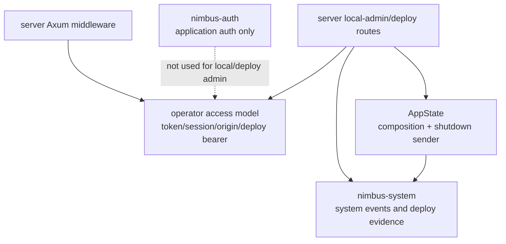

# SSE5 - Operator Readiness

Status: completed

Ledger position: `SSE5 Operator readiness` completed; `SSE6 Extraction
decisions` is the next phase.

## Current Import Graph And Owner Classification

Operator/local-admin ownership before cleanup:

- `crates/nimbus-server/src/local_server/token.rs` owns token file format,
  generation, validation, rotation freshness, file locking, and secure
  persistence.
- `crates/nimbus-server/src/local_server/access.rs` owns in-memory local
  server sessions, launch tickets, session-cookie signing, revocation on token
  rotation, and local audit-log access.
- `crates/nimbus-server/src/local_server/policy.rs` owns route-family
  classification and loopback origin parsing.
- `crates/nimbus-server/src/local_server/middleware.rs` currently mixes Axum
  middleware transport with credential extraction, origin enforcement, deploy
  header policy, and route-gate decisions.
- `crates/nimbus-server/src/http/local_admin.rs` owns live token rotation and
  shutdown routes; shutdown still records system events through server
  composition.
- `crates/nimbus-server/src/http/deploy.rs` owns deploy-admin bearer
  validation, deploy staging, registry activation, runtime hook installation,
  and deployment evidence.
- `crates/nimbus-server/src/router.rs` owns route mounting, middleware layers,
  listener state evidence, and `AppState` construction.
- `nimbus-auth` owns tenant application-auth contracts only; local admin and
  deploy admin must remain separate from tenant application bearer auth.

## Target Seam Shape



The operator access model should be reviewable without `AppState`, Axum
middleware, router mounting, adapters, tenant workload execution, or
application-auth verifier state.

## Active Cleanup Performed

- Added `crates/nimbus-server/src/local_server/access_policy.rs` as the
  transport-free operator access model.
- Moved credential extraction, access status classification, deploy-admin
  bearer validation, required local-admin bearer parsing, and origin validation
  out of `middleware.rs`.
- Kept Axum middleware, request extensions, route mounting, and audit emission
  in server-owned transport modules.
- Changed `http/local_admin.rs` to use the shared operator bearer parser for
  live token rotation.
- Changed `http/deploy.rs` to use `authorize_deploy_admin_bearer` instead of
  ad hoc deploy bearer parsing.
- Converted operator policy errors to `AppError` at the server boundary through
  `impl From<LocalServerPolicyError> for AppError`.
- Routed shutdown system-event evidence and deploy/listener evidence through
  `nimbus-system` APIs instead of the server `system_tenant` shim in the
  operator/server composition files touched by this phase.
- Preserved explicit separation between deploy admin bearer, local admin
  token/session, and tenant application auth; `nimbus-auth` remains the
  application-auth owner only.

## Denied-Import Audit And Verifier Updates

The cleaned operator access model must not import:

- `AppState`,
- `axum::middleware`,
- `axum::Router`,
- router builders,
- adapters,
- tenant workload execution,
- `ApplicationAuthVerifier`,
- server `system_tenant` shims.

Remaining server-owned transport/effect code may import `AppState`, Axum, and
router types, but the proof must classify those imports as route mounting,
middleware wiring, shutdown, audit, deploy activation, or system evidence
effects.

Command:

```text
rg -n "AppState|axum::middleware|axum::Router|RouterBuildConfig|ApplicationAuthVerifier|crate::system_tenant|crate::adapters|TenantIsolation|nimbus_auth" crates/nimbus-server/src/local_server/access_policy.rs
```

Result: no matches.

Command:

```text
rg -n "crate::system_tenant" crates/nimbus-server/src/http/local_admin.rs crates/nimbus-server/src/http/deploy.rs crates/nimbus-server/src/router.rs crates/nimbus-server/src/local_server -g '*.rs'
```

Result: no matches.

Verifier updates require:

- this proof is completed,
- `access_policy.rs` exists,
- access-policy code has no `AppState`, Axum middleware/router, adapter,
  application-auth verifier, tenant workload execution, or server
  `system_tenant` shim imports,
- deploy admin calls `authorize_deploy_admin_bearer`,
- local admin rotation calls `extract_required_bearer_token`,
- system/deploy/listener evidence writes route through `nimbus-system`,
- focused operator tests and counts are recorded,
- `nimbus-operator` remains blocked with next ownership moves.

## Behavior And Security Tests

```text
cargo test -p nimbus-server access_policy -- --nocapture
```

Result: 3 passed, 0 failed, 0 ignored, 767 filtered out.

Coverage includes bearer/admin-header extraction, deploy-admin bearer
separation from local-admin header gating, and bad-origin/PNA rejection.

```text
cargo test -p nimbus-server local_server_security -- --nocapture
```

Result: 13 passed, 0 failed, 0 ignored, 757 filtered out.

Coverage includes bad origin before local admin auth, native API/debug local
admin enforcement, deploy-admin local-admin header gating, native WebSocket
auth, Firebase routes staying application surfaces, Convex application-auth
separation, system-tenant Convex operator auth, and tenant runtime denial of
`_nimbus` routes.

```text
cargo test -p nimbus-server local_admin -- --nocapture
```

Result: 13 passed, 0 failed, 0 ignored, 757 filtered out.

Coverage includes token rotation rejecting the previous bearer, live shutdown,
local admin route enforcement, audit without secret leakage, deploy-admin
header gating, system route protection, and local admin service lifecycle
projection.

```text
cargo test -p nimbus-server local_audit -- --nocapture
```

Result: 4 passed, 0 failed, 0 ignored, 766 filtered out.

Coverage includes local-admin failures, bad-origin audit, session creation and
rotation audit, Firebase route-family audit classification, and
application-auth audit separation.

```text
cargo test -p nimbus-server deploy_admin -- --nocapture
```

Result: 3 passed, 0 failed, 0 ignored, 767 filtered out.

Coverage includes disabled deploy-admin token rejection, deploy bearer plus
local-admin header gating, and the direct policy unit for deploy bearer
matching.

```text
cargo test -p nimbus-server deploy -- --nocapture
```

Result: 10 passed, 0 failed, 0 ignored, 760 filtered out.

Coverage includes deploy-admin auth, dry-run diffing, activation, validation
failure rollback, Cloud Functions deploy artifacts, schema validation rollback,
and restart persistence.

The focused lane must cover invalid token, revoked session, stale rotation,
bad origin, deploy-admin gating, and local-admin/application-auth separation.

## Extraction Decision

Decision: `nimbus-operator` remains blocked.

Reason: the operator access model is now transport-free, but the extraction
owner is still not clean enough. `LocalServerSecurityState` still combines
token/session state with audit persistence and token-file effects; shutdown
uses server-owned lifecycle state; deploy admin still owns artifact staging,
registry activation, runtime hook installation, and system deployment
evidence. Extracting now would either create a crate that owns too many server
effects or move only a thin policy module while the real operator authority
remains in server.

Next readiness move:

- Split local operator state into pure token/session/route-family value logic
  and explicit audit/file persistence adapters.
- Introduce a shutdown/system-event effect trait only if `nimbus-operator`
  needs to own shutdown admission rather than server route effects.
- Keep deploy artifact staging and registry activation in server unless a
  future deploy-admin model crate proves a narrower owner.
- Keep application auth in `nimbus-auth`; do not let local/deploy admin
  credential checks depend on tenant application auth.

## Resume Cursor

Start `SSE6 Extraction decisions` by recording the final extract/keep decision
for every candidate: MongoDB, Firebase/provider-family, Cloud Functions,
Convex, `nimbus-artifacts`, `nimbus-provenance`, `nimbus-services`, and
`nimbus-operator`.
