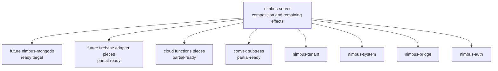

# SSE6 - Extraction Decisions

Status: completed

Ledger position: `SSE6 Extraction decisions` completed; `SSE7 Final verifier
closeout` is the next phase.

## Current Import Graph And Owner Classification

SSE0-SSE5 cleaned and classified the retained server seams. This phase makes
the extraction/keep decisions explicit so future work cannot infer a broader
crate split from partial readiness.

No new crates are created in SSE6. That is intentional: the trustworthy output
of this readiness wave is a verified decision table, not a decorative crate
set.

## Decision Table

| Candidate | Decision | Rationale |
| --- | --- | --- |
| Aggregate `nimbus-adapters` | rejected | Adapter seams are at different readiness levels. Aggregating MongoDB, Firebase, Cloud Functions, and Convex now would create a second server crate and hide real transport/runtime/effect blockers. |
| MongoDB adapter | ready for targeted per-adapter extraction | Protocol, BSON bridge, SCRAM auth, command logic, and error mapping have no server-private imports. Listener startup remains server-owned. Extraction should either allow an explicit `nimbus-engine` capability dependency or introduce a MongoDB command trait. |
| Firebase/provider-family | partial-ready; full extraction blocked | Firestore model/protocol/operation code is clean enough to extract behind engine/auth capabilities. REST/gRPC/listen entrypoints still need server-owned deployment auth resolution, adapter enablement, and transport state. |
| Cloud Functions | partial-ready; full extraction blocked | Protocol/model/manifest and request/response shaping are candidates. Runtime invocation, provenance admission, service registry, generated artifact effects, and active deployment composition still require server-owned seams. |
| Convex | selected subtrees ready; whole adapter blocked | Document identity, host-bridge payloads/responses, registry value logic, and subscription transform planning are candidates. Routes, WebSockets, HTTP actions, runtime-backed execution, service registry, and auth/audit context still need narrow traits. |
| `nimbus-artifacts` | blocked | Pure artifact authority contracts already live in `nimbus-tenant`; concrete verifier effects remain server/operator host effects. A separate crate would duplicate tenant contracts or mislabel process execution as pure model. |
| `nimbus-provenance` | blocked | Provenance is split by real owner: tenant policy/evidence, runtime byte integrity/manifest checks, server invocation admission, and process-backed verifier effects. No single non-server owner exists yet. |
| `nimbus-services` | blocked | Service evidence is now inverted, but manager/runtime-registry/sandbox catalog ownership still crosses server composition, sandbox backend activation, and HTTP lifecycle routes. |
| `nimbus-operator` | blocked | Operator access policy is now transport-free, but token/session state, audit persistence, shutdown, deploy staging, runtime hook installation, and system evidence effects are not split into a coherent crate owner. |

## Target Seam Shape After Decisions

The only extraction-ready whole candidate is the MongoDB protocol/command
adapter, and even that should be done as a targeted per-adapter extraction
with listener lifecycle kept in `nimbus-server`. The remaining candidates need
one or more named capability seams first.

## Active Cleanup Performed

This phase did not move code. It closed the readiness wave's decision ledger
and made the no-decorative-extraction posture enforceable by verifier.

The implementation cleanup occurred in SSE1-SSE5:

- canonical tenant/system/auth/bridge imports for adapters,
- Firebase operation and streaming cores narrowed away from `AppState`,
- Cloud Functions runtime execution narrowed to explicit capabilities,
- Convex table-scoped document identity fixed in subscription planning,
- artifact verifier process effects isolated from tenant contracts,
- runtime bundle provenance admission isolated,
- service evidence writes inverted,
- operator access policy separated from Axum middleware.

## Denied-Import Audit And Verifier Updates

Verifier updates require:

- this proof is completed,
- every candidate decision above is present,
- no aggregate `crates/nimbus-adapters` crate exists,
- no premature `crates/nimbus-artifacts`, `crates/nimbus-provenance`,
  `crates/nimbus-services`, or `crates/nimbus-operator` crate exists,
- MongoDB remains the only whole-adapter ready target,
- blocked/partial-ready candidates record the concrete next ownership move.

## Behavior And Security Tests

SSE6 does not add behavior code. It inherits the focused behavior/security
evidence from SSE1-SSE5:

- MongoDB: 266 unit tests and 23 integration tests passed.
- Firebase/provider-family: 142 focused tests passed.
- Cloud Functions: 39 focused tests passed.
- Convex: 132 focused tests passed with 5 expected ignored tests, plus 18
  reactive-loop tests passed.
- Artifact effects: 37 server verifier-effect tests and 7 tenant artifact
  tests passed.
- Provenance: runtime/admission/provenance lanes passed with 4, 2, 15, 11,
  and 1 focused tests respectively; the 11-test runtime lane has 1 expected
  ignored Bun/JSC build-gate test.
- Services: 14 service-manager tests, 5 service-registry tests, and 7 service
  tests passed; the services lane has 1 expected ignored real-KVM service test.
- Operator: access-policy, local-server-security, local-admin, local-audit,
  deploy-admin, and deploy lanes passed with counts recorded in SSE5.

## Extraction Decision

Decision: no new crate extraction in this phase.

`MongoDB` is ready for a future targeted per-adapter extraction. Every other
candidate is partial-ready or blocked, and the proof files name the exact
seam that must be inverted before extraction. This keeps the architecture
honest: readiness is earned, but crate creation waits for true ownership.

## Resume Cursor

Start `SSE7 Final verifier closeout` by running the final verifier, focused
tests needed for changed seams, `cargo fmt --all --check`, and
`cargo check --workspace`, then record the closeout proof and final ledger.
