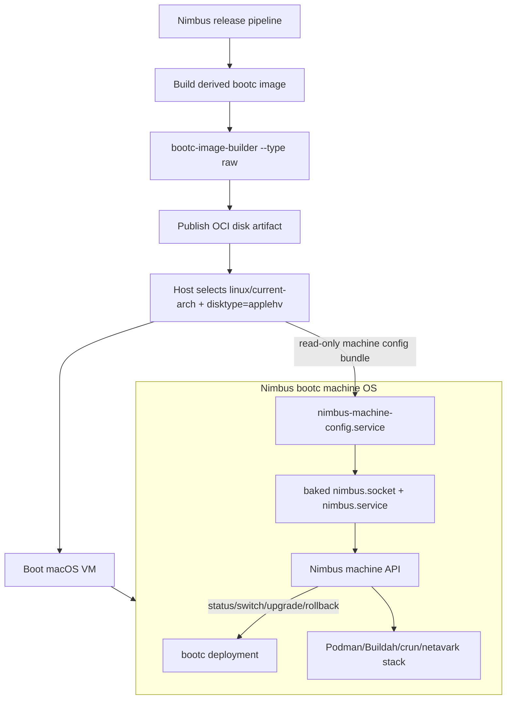

# Bootc Machine Architecture For Nimbus

Bootc-only research and implementation guidance for a Nimbus-owned macOS
machine OS.

Date: 2026-05-13
Last refreshed: 2026-05-14

## Executive Summary

Nimbus can move to a direct bootc machine architecture now. The target is not a
host-mutated VM image. The target is a Nimbus-owned bootc-derived operating
system image, built with container tooling, converted to a macOS bootable disk
artifact, selected by OCI metadata, and updated in place by bootc inside the
guest.

```text
Nimbus release
  -> builds a Nimbus-derived bootc image
  -> pins the base image, builder image, and release image by digest
  -> converts the bootc image to a raw disk artifact
  -> publishes the disk as an OCI artifact with disktype=applehv
  -> macOS host pulls and boots that artifact
  -> host passes only per-machine config through a small Nimbus channel
  -> guest starts baked Nimbus units
  -> normal OS lifecycle uses bootc status/switch/upgrade/rollback
```

The stable baseline for this wave should be `quay.io/fedora/fedora-bootc:44`,
pinned by digest. Fedora 45/Rawhide may be tested as a canary because tags
exist ahead of the final Fedora 45 release train, but it should not be the
stable baseline until Fedora 45 is actually released and Nimbus deliberately
promotes it.

As of the 2026-05-14 refresh, `quay.io/fedora/fedora-bootc:44` resolves to the
arm64 manifest digest
`sha256:187d480948fe37a4cc55211b8a594adfc4f85a7d17ac1991331bf98272eb8f94`.
That refreshed image still carries `selinux-policy-44.1-1.fc44` and
`bootupd-0.2.33-1.fc44`, so it is the correct freshness update but not, by
itself, evidence that the Fedora-base `bootupd_t` AVC blocker is resolved.

The target document is intentionally bootc-only. Transition sequencing now
belongs in `docs/plans/bootc-machine-default-plan.md`; prior MOS0-MOS2 and
MOS3A investigation evidence is archived in
`docs/plans/archive/machine-os-adoption-plan.md`.

The matching Linux arm64 `nimbus` binary belongs inside the bootc image at
`/usr/local/bin/nimbus`. That binary is the guest control plane for
machine-config apply, socket-activated machine API, service sandboxing, and
bootc lifecycle operations. Normal bootc machines boot with the versioned
`nimbus` binary and systemd units already present; host-side binary sync is a
repair/debug escape hatch for the legacy path, not the default bootc path.

## High-Confidence Findings

### bootc Is The Right Lifecycle Primitive

The bootc project defines transactional in-place OS updates using OCI images.
A bootc image includes the bootable OS content, including kernel and userspace.
After boot, the host is a normal Linux system with systemd as PID 1, not an
application container. The bootc CLI/API is now considered stable.

Nimbus implication:

- treat the machine OS as a registry-delivered OCI artifact
- make the image digest the release identity
- move normal update, apply, and rollback into guest bootc operations
- use host disk replacement only for repair or recreate
- expose current image origin/digest in Nimbus diagnostics

Sources:

- [bootc overview](https://bootc.dev/bootc/)
- [bootc upgrade and rollback](https://bootc.dev/bootc/upgrades.html)

### Fedora bootc Is The Right Bleeding-Edge Base

Fedora bootc documentation describes Fedora/CentOS bootc base images as
reference bootable containers associated with Fedora and CentOS. The full
Fedora bootc image is intentionally broad: it includes bootc, a kernel,
systemd, NetworkManager, Podman, filesystem tooling, and other operational
utilities. The minimal images are explicitly much smaller development
references and require the caller to add networking and other core content.

Nimbus implication:

- use the full `quay.io/fedora/fedora-bootc:44` baseline for the first stable
  direct bootc architecture
- avoid starting from the minimal image until a smaller-image optimization pass
  is justified by proof data
- pin the base by digest in the recipe and record the tag-to-digest resolution
  in the build summary
- run Fedora 45/Rawhide only as a canary lane until release promotion

Sources:

- [Fedora/CentOS bootc documentation](https://fedora.gitlab.io/bootc/docs/bootc/)
- [Fedora bootc base images](https://fedora.gitlab.io/bootc/docs/bootc/base-images/)
- [Fedora 44 announcement](https://www.redhat.com/en/blog/announcing-fedora-44)
- [Fedora 45 schedule](https://fedorapeople.org/groups/schedule/f-45/f-45-key-tasks.html)

### Red Hat Enterprise Direction Supports The Model

Red Hat image mode uses bootc to build, deploy, and manage operating systems
with container tooling. RHEL 10 documentation describes image mode as an
OCI-container-based OS deployment model with immutable updates and rollback.
Red Hat also documents bootc-image-builder as the disk conversion tool and
positions bootc as the tool for installing, updating, and switching systems.

Nimbus implication:

- adopting bootc is aligned with the enterprise Linux direction, not a
  boutique one-off path
- enterprise trust comes from digest pinning, provenance, signed artifacts,
  rollback proof, and reproducible build evidence
- Fedora bootc is the leading-edge upstream path; RHEL image mode is the
  downstream enterprise validation path

Sources:

- [Red Hat image mode overview](https://developers.redhat.com/products/rhel/image-mode)
- [RHEL 10 image mode documentation](https://docs.redhat.com/en/documentation/red_hat_enterprise_linux/10/html/using_image_mode_for_rhel_to_build_deploy_and_manage_operating_systems/introducing-image-mode-for-rhel)

### bootc-image-builder Is The Disk Conversion Layer

bootc-image-builder converts bootc container images into bootable disk image
formats, including raw disks. Its documentation explicitly covers macOS use via
Podman Desktop with a rootful Podman machine, supports `--type raw`, supports
`--rootfs`, and notes that Fedora bootc images require an explicit rootfs
selection.

Nimbus implication:

- the `nimbus-machine-os` build should first build a Nimbus-derived bootc
  container image, then convert it to the macOS raw disk artifact
- CI/release summaries must record base digest, builder digest, rootfs,
  builder config, output checksums, and source revisions
- the production path should use the same builder machinery as local proof
  runs so failures are reproducible
- rootfs choice is a product decision; `ext4` is acceptable for the current
  proof, while `xfs` deserves a comparative canary because official local
  bootc examples commonly select it for Fedora bootc

Sources:

- [bootc-image-builder](https://osbuild.org/docs/bootc/)
- [podman-bootc local provisioning](https://fedora.gitlab.io/bootc/docs/bootc/podman-bootc-cli/)

### Direct Local Virtualization Has Prior Art

`podman-bootc` can self-install a bootc image to a local disk and launch it for
interactive testing. The official docs show it running `quay.io/fedora/fedora-bootc`
directly and also running custom derived images. The docs also describe
development-time login by injecting SSH access through systemd credentials
provided to the hypervisor.

Nimbus implication:

- direct Fedora bootc local virtualization is a real upstream-supported proof
  point
- Nimbus should derive and run its own image instead of treating a generic base
  image as the product
- systemd credentials are a useful proof mechanism if the selected macOS
  hypervisor path exposes them cleanly
- production should still prefer a Nimbus-owned machine-config contract over
  ad hoc developer SSH injection

Source:

- [podman-bootc local provisioning](https://fedora.gitlab.io/bootc/docs/bootc/podman-bootc-cli/)

### Podman Source Gives Two Contracts Worth Keeping

The local Podman source is valuable as implementation evidence, even though
Nimbus should not copy Podman's whole machine manager.

Podman's custom `quay.io/podman/machine-os` image is built from
`/Users/jack/src/github.com/containers/podman-machine-os`. That repository is
currently FCOS-derived: `util.sh` sets `FCOS_BASE_IMAGE`, the primary CoreOS
recipe starts from `quay.io/fedora/fedora-coreos`, and the build flow produces
a bootc-capable machine artifact from that FCOS base. Nimbus should use this
as a reference for artifact shape and lifecycle behavior, not as the
bootc-native recipe target.

Local findings:

- `/Users/jack/src/github.com/containers/podman/pkg/machine/os/ostree.go:31`
  applies a machine OS image by running `sudo bootc switch`.
- `/Users/jack/src/github.com/containers/podman/pkg/machine/os/ostree.go:49`
  implements upgrade logic around `bootc status`, digest comparison,
  `bootc upgrade`, and explicit `bootc switch`.
- `/Users/jack/src/github.com/containers/podman/pkg/machine/os/bootc.go:138`
  obtains machine OS state with `sudo bootc status --format json`.
- `/Users/jack/src/github.com/containers/podman/pkg/machine/os/ostree.go:201`
  parses bootc transports instead of inventing a Podman-specific apply
  reference format.
- `/Users/jack/src/github.com/containers/podman/pkg/machine/define/vmtype.go:45`
  maps both AppleHV and libkrun to `disktype=applehv`.
- `/Users/jack/src/github.com/containers/podman/pkg/machine/ocipull/source.go:45`
  selects a disk artifact from an OCI index by platform and `disktype`, then
  requires a single disk layer with a title annotation.

Nimbus implication:

- retain the OCI disk artifact selector shape already present in Nimbus
- keep `disktype=applehv` as the macOS artifact selector
- model `nimbus machine os apply/upgrade` around bootc commands and resolved
  digests
- keep bootc transport parsing if user-supplied apply refs support local OCI
  archives or storage references

Sources:

- [Podman machine OS apply](https://docs.podman.io/en/latest/markdown/podman-machine-os-apply.1.html)
- [Podman machine providers](https://docs.podman.io/en/latest/markdown/podman-machine.1.html)
- local Podman paths listed above

### SELinux And bootupd Need A Stricter Nimbus Gate

Podman and Fedora provide useful direction, but not a complete enforcing
SELinux template for Nimbus's direct bootc path.

Local comparison evidence:

- `/Users/jack/src/github.com/containers/podman-machine-os/README.md:19`
  lists SELinux permissive mode as a build requirement question.
- `/Users/jack/src/github.com/containers/podman-machine-os/build.sh:28`
  opportunistically downloads updated `container-selinux` and `crun` packages
  for PR builds; it does not carry a local CIL policy overlay for machine
  image boot-time AVCs.
- `/Users/jack/src/github.com/containers/podman-machine-os/custom-coreos-disk-images/README.md:95`
  tells builders to use a fully updated Fedora machine with SELinux in
  permissive mode.
- `/Users/jack/src/github.com/containers/podman-machine-os/custom-coreos-disk-images/cosa-imports/coreos.osbuild.aarch64.mpp.yaml:434`
  and `:692` run `org.osbuild.bootupd`, so bootupd is part of the
  CoreOS/Fedora machine-image world rather than a Nimbus-only component.
- `find /Users/jack/src/github.com/containers -maxdepth 4 \( -iname '*.cil'
  -o -iname '*.te' -o -iname '*selinux*' -o -iname '*bootupd*' \) -print`
  found Podman SELinux tests/helpers but no local containers-org policy module
  for the observed `bootupd_t`/`systemd-userdbd` AVC class.

External evidence:

- Red Hat Bugzilla 2300306 records bootupd AVC denials on Fedora CoreOS and
  links Fedora SELinux policy PR work for `bootupd_t`.
- Red Hat Bugzilla 2320395 records missing `bootupd` policy rules for Fedora
  CoreOS/Silverblue and shows the fix landing through Fedora's
  `selinux-policy` update path, with verification reporting no AVC matches
  after the policy update.
- Fedora's `selinux-policy` package is the distribution owner for the policy
  surface and currently publishes Fedora 44 stable policy.
- Fedora's BootLoaderUpdatesPhase1 change targets Fedora 44 and describes
  bootupd as the direction for safer bootloader updates across RPM/image
  environments.
- bootc-image-builder documents SELinux policy requirements on enforcing build
  hosts and uses `--security-opt label=type:unconfined_t` in examples, so the
  builder path does not remove the need for a real booted-guest AVC gate.

Current security decision:

- A local policy overlay for the remaining `bootupd_t`/`lsblk` userdb AVCs is
  not verified as the canonical enterprise stance yet. Fedora owns that domain,
  and prior missing `bootupd_t` permissions have been corrected through the
  Fedora `selinux-policy` package rather than downstream machine-image forks.
- The observed Nimbus proof AVCs are generated by `bootloader-update.service`
  under `bootupd_t`, with `lsblk` touching `/run/mount`, `/etc/group`, and
  systemd userdb/homed sockets. They are permissive Fedora-base denials, not a
  Nimbus machine API denial.
- A stricter 2026-05-14 macOS proof of the SELinux-hardened image closed the
  Nimbus-owned socket class (`nimbus_socket_avcs=0`) and did not reproduce the
  Netavark sysctl class (`netavark_sysctl_avcs=0`), but still recorded ten
  `bootupd_t`/`lsblk` AVCs against `/run/mount`, `/etc/group`, and
  `/run/systemd/userdb` with `bootupd-0.2.33-1.fc44` and
  `selinux-policy-44.1-1.fc44`.
- Downstream policy is acceptable only as a temporary compatibility overlay if
  it is observed-permission-only, version/evidence-gated by the captured
  Fedora packages and AVC lines, kept separate from Nimbus-owned policy, and
  paired with an upstream/Fedora issue or disposition so removal is obvious.
- Broad `audit2allow` output, global SELinux booleans, disabling SELinux,
  masking bootloader-update behavior, or weakening the final AVC gate are not
  acceptable promotion shortcuts.

Nimbus implication:

- keep `scripts/check-selinux-avcs.sh` as a zero-AVC promotion gate for real
  macOS guest audit captures
- treat the `nimbus.service` socket AVC as Nimbus-owned policy because it is
  caused by the host-forwarded machine API path
- treat `bootupd_t` userdb/passwd AVCs as Fedora-base policy findings, not as
  proof that bootc is unsuitable
- do not flip the macOS default with unresolved Fedora-base AVCs unless there
  is a concrete upstream disposition or an explicitly approved, narrow Nimbus
  compatibility policy overlay
- if a local overlay is approved, keep it separate from the Nimbus machine API
  policy module so future removal is straightforward when Fedora policy catches
  up
- the current verified stance is to keep the Fedora-base AVC as a blocker
  rather than bake a downstream policy module merely to quiet permissive audit
  noise

### Nimbus Already Has A Direct bootc Proof Skeleton

The local `nimbus-machine-os` proof lane already contains most of the supply
chain pieces:

- `/Users/jack/src/github.com/nimbus/nimbus-machine-os/proofs/direct-fedora-bootc/Containerfile:1`
  starts from a digest-pinned Fedora bootc base.
- `/Users/jack/src/github.com/nimbus/nimbus-machine-os/proofs/direct-fedora-bootc/Containerfile:7`
  copies the guest `nimbus` binary into the image.
- `/Users/jack/src/github.com/nimbus/nimbus-machine-os/proofs/direct-fedora-bootc/build.sh:65`
  records the current Fedora bootc digest baseline.
- `/Users/jack/src/github.com/nimbus/nimbus-machine-os/proofs/direct-fedora-bootc/build.sh:66`
  pins bootc-image-builder by digest.
- `/Users/jack/src/github.com/nimbus/nimbus-machine-os/proofs/direct-fedora-bootc/build.sh:179`
  invokes bootc-image-builder with `--type raw`.
- `/Users/jack/src/github.com/nimbus/nimbus-machine-os/proofs/direct-fedora-bootc/build.sh:210`
  writes build evidence including base image, builder image, rootfs, and
  output checksums.
- `/Users/jack/src/github.com/nimbus/nimbus-machine-os/proofs/direct-fedora-bootc/build-common.sh:50`
  installs the container runtime package set.

Required correction before this becomes the target implementation:

- replace proof-only user creation with an explicit Nimbus administrative user
- add baked Nimbus guest config and machine API units
- add a real machine-config channel contract
- prove SELinux labels for the guest binary, sockets, units, and mutable
  machine config
- decide whether the current composefs builder override is still necessary
- package the proof output into the same OCI disk artifact shape the host
  manager consumes

## Target Architecture



## Image Architecture

### Base And Build Inputs

The release recipe should pin:

- Fedora bootc base image digest
- bootc-image-builder image digest
- Nimbus source revision
- `nimbus-machine-os` source revision
- `nimbus-crun` source or release if included
- rootfs type
- builder config checksum
- package inventory

The build should produce:

- derived bootc container image
- OCI archive for provenance/debugging
- raw disk
- compressed raw disk
- OCI disk layout
- summary file
- checksums for every release artifact

### Static Image Contents

The bootc image should contain stable release content:

- Linux kernel and OS userspace from the pinned Fedora bootc base
- `/usr/local/bin/nimbus` as the matching versioned guest control-plane binary
- `nimbus-machine-config.service`
- `nimbus.socket`
- `nimbus.service`
- `nimbus-machine-api.service` if split from the main service
- `podman`
- `buildah`
- `crun`
- `conmon`
- `netavark`
- `aardvark-dns`
- `fuse-overlayfs`
- `gvisor-tap-vsock-gvforwarder` if the host networking path still needs it
- `socat` only if a verified host/guest path still depends on it
- SSH server for operator and verification access
- container registry configuration
- helper binary configuration
- systemd delegation defaults
- sysctl defaults
- tmpfiles/sysusers definitions
- SELinux file contexts or install-time relabel strategy

### Mutable Machine State

Per-machine state should not be baked into the image:

- machine id/name
- generated SSH authorized keys
- host volume declarations
- trust roots and registry auth that vary per machine
- forwarded API/socket ports
- diagnostics overrides
- host-specific volume mount units

Those belong in the Nimbus machine-config channel and persistent guest state
under `/etc` and `/var`.

## Machine-Config Channel

The direct bootc path still needs a small configuration channel because
machine identity and host paths are not image release content. This is not an
OS installer payload. It is a Nimbus runtime contract.

Recommended first implementation:

1. Host writes a versioned config bundle under the machine state directory.
2. Host attaches the bundle read-only to the guest.
3. A baked systemd unit mounts or discovers the bundle early in boot.
4. `nimbus machine guest-config apply` validates and applies it.
5. The service writes readiness evidence.
6. The host waits for readiness through SSH and the machine API.

Concrete bundle shape:

```text
/run/nimbus-machine-config/
  machine.json
  authorized_keys
  volumes.json
  trust/
  registry-auth/
```

`machine.json` should be versioned:

```json
{
  "version": 1,
  "machine_id": "default",
  "hostname": "nimbus-default",
  "api_socket": "/run/nimbus/nimbus.sock",
  "ready_signal": {
    "kind": "vsock",
    "port": 12345
  }
}
```

Preferred channel order:

1. Read-only virtiofs metadata mount, because Nimbus already needs host volume
   plumbing and the contract is inspectable from both sides.
2. Hypervisor-injected systemd credentials, if the selected macOS VM path
   exposes them reliably.
3. A small read-only config disk, if early mount ordering makes virtiofs
   unsuitable.

The proof should test all viable channels, but the product should choose one
primary channel and make it boring.

## Host Manager Architecture

The host should own:

- desired machine OS image reference and digest
- registry/cache pull
- OCI artifact selection
- disk materialization
- VM launch
- machine-config bundle generation
- readiness monitoring
- operator routing
- repair/recreate

The host should stop owning release-path guest mutation:

- no stable-path copy of the guest `nimbus` binary after parity
- no stable-path systemd unit installation after parity
- no disk replacement for normal OS updates
- no SSH-first provisioning loop

Required Nimbus host changes:

- add a bootc-native machine startup mode
- generate the machine-config bundle
- attach the config bundle to AppleHV/libkrun launches
- wait for guest config evidence before treating machine startup as ready
- preserve OCI disk artifact selection by OS, architecture, and `disktype=applehv`
- add guest-mediated `bootc status`, `bootc switch`, `bootc upgrade`, and
  `bootc rollback`
- report resolved digest before and after every OS lifecycle operation
- keep developer binary sync only as an explicit debug override

## Guest Architecture

The guest should own:

- stable package set
- stable systemd units
- guest `nimbus` binary
- machine-config apply logic
- socket activation
- machine API
- bootc lifecycle commands
- persistent `/etc` and `/var` state

Recommended guest commands:

```text
nimbus machine guest-config apply --config-dir /run/nimbus-machine-config
nimbus machine api --socket-activation --control-data-dir /var/lib/nimbus/control
```

Recommended machine API:

```text
GET  /machine/ready
GET  /machine/os/status
POST /machine/os/switch
POST /machine/os/upgrade
POST /machine/os/rollback
POST /machine/reboot
GET  /machine/diagnostics
```

`/machine/os/status` should expose the parsed `bootc status --format json`
result plus Nimbus release metadata. Mutating endpoints should return staged
deployment details, resolved digests, whether a reboot is required, and
post-reboot verification instructions.

## Update And Rollback Design

### Apply

```text
nimbus machine os apply ghcr.io/nimbus/nimbus-machine-os@sha256:...
  -> host validates reference and policy
  -> host calls guest machine API
  -> guest runs bootc switch <image>
  -> guest records staged deployment evidence
  -> host reboots if requested
  -> host verifies bootc status, digest, and Nimbus readiness
```

### Upgrade

```text
nimbus machine os upgrade
  -> host asks guest for current origin/digest
  -> guest runs bootc upgrade
  -> guest records current/new digests
  -> reboot boundary
  -> host verifies booted digest and readiness
```

### Rollback

```text
nimbus machine os rollback
  -> host asks guest for available rollback deployment
  -> guest runs bootc rollback
  -> reboot boundary
  -> host verifies previous deployment and readiness
```

### Repair

```text
nimbus machine recreate --image <digest>
  -> host discards broken materialized disk
  -> host rematerializes image from registry/cache
  -> host boots with the same machine-config bundle
  -> host verifies readiness from a clean disk
```

Repair is not the normal update path. It is the escape hatch when the guest
cannot boot or cannot answer.

## OCI Disk Artifact Contract

Nimbus should publish macOS machine disks as OCI artifacts with:

- image index or manifest list
- platform OS `linux`
- host-compatible architecture
- manifest annotation `disktype=applehv`
- exactly one bootable disk layer
- `org.opencontainers.image.title` on the layer
- source URL annotation
- source revision annotation
- Nimbus version annotation
- machine OS revision annotation
- base image digest annotation
- builder image digest annotation
- checksums in release evidence

Important distinction:

- `applehv` is the provider disk artifact selector
- `raw` is the disk payload format

Do not publish the macOS release artifact as `disktype=raw`.

## Security And Enterprise Trust

Enterprise-grade bootc adoption should prove:

- immutable digest-pinned release inputs
- signed derived bootc image
- signed or attested disk artifact
- SBOM for OS packages and Nimbus binaries
- vulnerability scan for base and derived image
- provenance from source revision to published digest
- reproducible local proof instructions
- rollback proof
- repair/recreate proof
- SELinux mode and AVC evidence
- registry auth and trust-root handling
- no SSH dependency for first successful service configuration

For enterprise customers, the message should be:

```text
Fedora bootc gives Nimbus the leading-edge upstream OS model.
RHEL image mode confirms the enterprise direction.
Nimbus adds pinned builds, provenance, rollback proof, and a narrow guest API.
```

## Verification Gates

### Build Verification

Required evidence:

- Fedora bootc base digest
- bootc-image-builder digest
- rootfs choice
- builder config checksum
- package inventory
- systemd unit inventory
- user/group inventory
- SELinux label policy or relabel evidence
- guest `nimbus` binary hash/version
- raw disk checksum
- compressed raw disk checksum
- OCI layout summary
- `disktype=applehv` assertion
- provenance/source annotations

### macOS Boot Verification

Required evidence:

- VM boots from the published artifact
- guest reaches multi-user target
- machine-config channel is mounted or otherwise available
- guest config service applies machine config
- documented Nimbus administrative user can connect over SSH
- `/usr/local/bin/nimbus --version` executes
- `nimbus.socket` activates
- forwarded machine API reports ready
- host volume declarations are applied
- volume read/write checks pass
- SELinux mode and labels are recorded
- no relevant AVC denials appear
- `podman info` works
- a representative Nimbus Compose service starts
- service is reachable from macOS

### bootc Lifecycle Verification

Required evidence:

- `bootc status --format json` reports expected origin/digest
- `bootc switch` stages a new deployment
- reboot lands on the staged deployment
- post-reboot machine API readiness succeeds
- `bootc upgrade` handles same-stream updates
- `bootc rollback` restores the previous deployment
- host repair/recreate works when the guest cannot answer

### Config Channel Verification

Required evidence:

- missing config bundle produces a clear startup error
- invalid config version is rejected
- invalid volume declarations are rejected without partial mounts
- SSH key application is idempotent
- host trust material is installed only in the documented location
- readiness is withheld until config apply succeeds
- config apply logs are available through diagnostics

## Implementation Tasks

1. Promote the direct bootc proof into the primary `nimbus-machine-os` recipe.
2. Add the Nimbus administrative user, tmpfiles, sysusers, units, and SELinux
   checks to the image.
3. Add `nimbus machine guest-config apply`.
4. Add the machine-config bundle writer in `nimbus-bin`.
5. Attach the config bundle to macOS VM launches.
6. Add guest readiness evidence and host wait logic.
7. Add guest machine API endpoints for bootc lifecycle operations.
8. Wire `nimbus machine os apply/upgrade/rollback` through the guest API.
9. Package raw disks as OCI artifacts with `disktype=applehv`.
10. Add build, boot, lifecycle, rollback, and repair proof scripts.
11. Delete or demote host code that mutates bootc guest binaries or units
    after bootc parity is proven; the Podman/FCOS fallback can retain its
    scoped repair path until legacy removal.

## Known Risks And Mitigations

| Risk | Mitigation |
| --- | --- |
| Per-machine config is applied too late | Baked early guest config service; readiness depends on config evidence. |
| SSH becomes a provisioning dependency | Configure SSH keys through the machine-config channel before readiness. |
| Guest binary and OS drift | Bake the matching Linux `nimbus` binary into the bootc image; update through bootc. |
| Mutable tags drift | Pin base, builder, and release image inputs by digest. |
| Fedora 45 tag exists before release | Treat as canary-only until Fedora 45 is released and promoted. |
| SELinux blocks service execution | Verify labels in image proof and after guest boot. |
| composefs/rootfs behavior differs under macOS virtualization | Keep explicit rootfs proof matrix; document any builder kernel arg override. |
| bootc update breaks the guest | Require rollback proof and host-side recreate repair. |
| OCI disk artifact selection regresses | Keep verifier coverage for `disktype=applehv`, platform, single-layer shape, and title annotation. |

## Decision

The bootc-only Nimbus target is:

```text
quay.io/fedora/fedora-bootc:44 by digest
  -> Nimbus-derived bootc image
  -> baked versioned Linux nimbus binary and units
  -> Nimbus machine-config channel
  -> raw disk via bootc-image-builder
  -> OCI artifact with disktype=applehv
  -> macOS VM boot
  -> machine API readiness
  -> bootc status/switch/upgrade/rollback for lifecycle
```

This is the clean architecture because the image owns the OS, packages, guest
binary, and stable units. The host owns selection, launch, per-machine config,
verification, and repair.

## References

External:

- [bootc overview](https://bootc.dev/bootc/)
- [bootc filesystem guidance](https://bootc.dev/bootc/filesystem.html)
- [bootc upgrade and rollback](https://bootc.dev/bootc/upgrades.html)
- [bootc-image-builder](https://osbuild.org/docs/bootc/)
- [Fedora/CentOS bootc documentation](https://fedora.gitlab.io/bootc/docs/bootc/)
- [Fedora bootc base images](https://fedora.gitlab.io/bootc/docs/bootc/base-images/)
- [podman-bootc local provisioning](https://fedora.gitlab.io/bootc/docs/bootc/podman-bootc-cli/)
- [Podman Desktop bootc extension](https://github.com/podman-desktop/extension-bootc)
- [Podman machine OS apply](https://docs.podman.io/en/latest/markdown/podman-machine-os-apply.1.html)
- [Podman machine providers](https://docs.podman.io/en/latest/markdown/podman-machine.1.html)
- [Red Hat image mode overview](https://developers.redhat.com/products/rhel/image-mode)
- [RHEL 10 image mode documentation](https://docs.redhat.com/en/documentation/red_hat_enterprise_linux/10/html/using_image_mode_for_rhel_to_build_deploy_and_manage_operating_systems/introducing-image-mode-for-rhel)
- [Fedora 44 announcement](https://www.redhat.com/en/blog/announcing-fedora-44)
- [Fedora 45 schedule](https://fedorapeople.org/groups/schedule/f-45/f-45-key-tasks.html)

Local:

- `/Users/jack/src/github.com/containers/podman/pkg/machine/os/ostree.go`
- `/Users/jack/src/github.com/containers/podman/pkg/machine/os/bootc.go`
- `/Users/jack/src/github.com/containers/podman/pkg/machine/define/vmtype.go`
- `/Users/jack/src/github.com/containers/podman/pkg/machine/ocipull/source.go`
- `/Users/jack/src/github.com/nimbus/nimbus-machine-os/proofs/direct-fedora-bootc/Containerfile`
- `/Users/jack/src/github.com/nimbus/nimbus-machine-os/proofs/direct-fedora-bootc/build.sh`
- `/Users/jack/src/github.com/nimbus/nimbus-machine-os/proofs/direct-fedora-bootc/build-common.sh`
- `crates/nimbus-bin/src/machine/manager/image.rs`
- `crates/nimbus-bin/src/machine/bootstrap.rs`
- `docs/plans/archive/machine-os-adoption-plan.md`
- `docs/plans/bootc-machine-default-plan.md`
