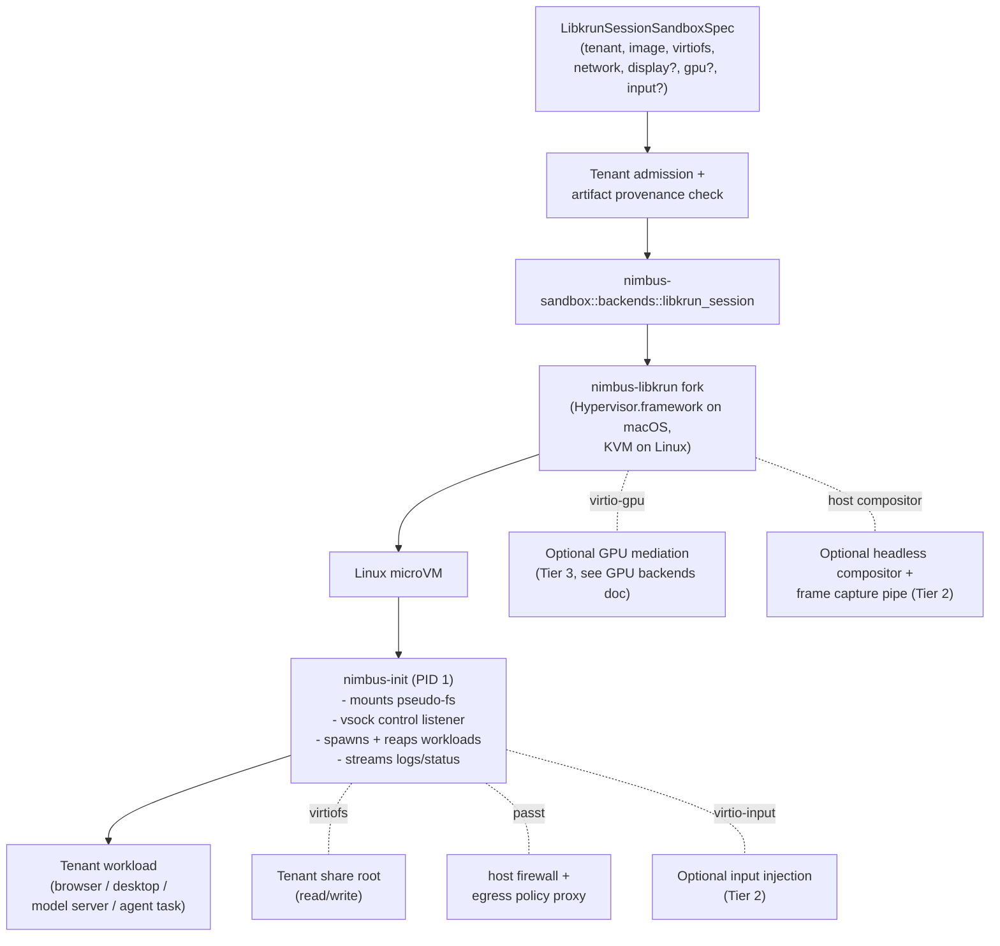

# Research: libkrun Session Sandbox Backend

Design rationale for a unified libkrun-backed sandbox backend that covers
two of Nimbus's three sandbox tiers (computer use and GPU-accelerated AI
workloads) under a single `libkrun_session` backend, with a shared
lifecycle, a single in-guest agent, and per-tier spec options.

This is a research document, not an execution plan. The active execution
plans that consume this design are:

- [`docs/plans/computer-use-sandbox-plan.md`](../computer-use-sandbox-plan.md) (CUS, Tier 2)
- [`docs/plans/gpu-accelerated-sandbox-plan.md`](../gpu-accelerated-sandbox-plan.md) (GAW, Tier 3)

The GPU mediation question is owned by a sibling research doc:

- [`docs/plans/research/gpu-sandbox-backends.md`](./gpu-sandbox-backends.md)

The Lambda-class sandbox tier (Tier 1) is owned by an unrelated VMM:

- [`docs/plans/firecracker-snapshot-invocation-backend-plan.md`](../firecracker-snapshot-invocation-backend-plan.md) (FSI)

## The Three Sandbox Tiers

| Tier | Workload class | Boot model | Lifetime | VMM impl |
| --- | --- | --- | --- | --- |
| 1 Lambda | Stateless code, untrusted input | Snapshot/restore | Sub-second to seconds | Firecracker (Linux) |
| 2 Computer use | Desktop session, agent loop | Cold boot + warm in-guest agent | Minutes to hours | libkrun (Linux + macOS) |
| 3 GPU AI | Model inference/training | Cold boot + warm pool | Minutes to days | libkrun (Linux + macOS for Vulkan) |

All three share the same `Sandbox` trait and tenant-isolation contract.
Two VMM implementations live underneath: `firecracker_snapshot` (Tier 1)
and `libkrun_session` (Tier 2 and Tier 3). This doc covers
`libkrun_session`.

## Why Tier 2 and Tier 3 Share One Backend

Both tiers want the same primitives:

- libkrun as the VMM, on both Linux production hosts and macOS developer
  hosts.
- A long-lived in-guest PID-1 agent that accepts multiple exec/session
  requests over vsock, so the VM stays warm across invocations from the
  same tenant.
- virtiofs for tenant-scoped read/write share roots.
- passt for unprivileged user-mode networking with `SandboxEgressPolicy`
  enforcement.
- vsock for the host↔guest control plane.
- Per-session lifecycle, not per-invocation.
- Per-tenant identity, credentials, audit, and image admission contracts
  shared with Tier 1 and Linux service microVMs.

They differ only in two optional components:

- **Display.** Tier 2 attaches a headless host-side compositor and a frame
  capture pipe; Tier 3 generally does not.
- **GPU.** Tier 3 attaches a virtio-gpu device backed by Venus (default)
  or a native-context driver (opt-in, trusted-only — see GPU backends
  research doc). Tier 2 may attach virtio-gpu purely for display
  rendering.

A single backend with optional components is cleaner than two near-duplicate
backends. The spec carries the optionality:

```rust
struct LibkrunSessionSandboxSpec {
    tenant: TenantId,
    image: ImageRef,
    virtiofs: Option<TenantShare>,
    network: PasstPolicy,
    display: Option<HeadlessCompositorPolicy>,   // Tier 2
    gpu: Option<GpuMediationPolicy>,             // Tier 3 (and Tier 2 for display)
    input: Option<VirtioInputInjectionPolicy>,   // Tier 2
    lifetime: SessionLifetime,
    // ...shared spec fields
}
```

## Why Tier 1 Does Not Collapse In

Firecracker exists for one property: snapshot/restore in ~10 ms, which is
materially faster than any cold-boot path. For Lambda-class workloads
with sub-second SLAs that delta is load-bearing.

libkrun cold boot is ~50–150 ms on a minimal initramfs. Acceptable for
session sandboxes; not acceptable for Lambda-class invocations under
heavy load.

Two VMMs is a real maintenance tax, accepted deliberately:

- libkrun owns Tier 2/3, the existing production service-microVM lane, and
  the macOS machine VMM (via krunkit). Three product lanes, one VMM
  family.
- Firecracker owns only Tier 1, but pays for itself with the 10 ms
  restore.

If Firecracker snapshot proves unnecessary in practice (e.g., libkrun cold
boot is fast enough for Nimbus's Lambda SLA after FSI6 benchmarks),
Tier 1 can collapse into `libkrun_session` as a secondary lane. Do not
rule this out, but do not plan for it either — execute the Firecracker
plan as written.

## Architecture



## Components

### libkrun VMM via `nimbus-libkrun` fork

Existing private patched libkrun fork at
`~/src/github.com/nimbus/nimbus-libkrun`. Keep the fork for Nimbus-specific
patches that do not fit upstream (e.g., the `SandboxPortBinding::host_address`
bind-address hook on TSI). The fork should:

- Track current upstream libkrun (latest stable is 1.9.x as of late 2025;
  the existing fork base predates this — see "Fork posture" below).
- Compare patches against upstream and against muvm's MIT-licensed
  `krun-sys` 1.9.1 bindings; upstream what can move upstream, drop what is
  redundant.

The fork is reused by **all three sandbox tiers** plus the macOS machine
VMM via krunkit. Keeping it current is load-bearing for the whole microVM
strategy.

### `nimbus-init` guest PID-1 agent

A static binary that runs as PID 1 inside the guest. Responsibilities:

- Mount `/proc`, `/sys`, `/dev`, `/dev/pts`, `/run`.
- Bind a vsock control listener for session/exec RPCs from the host.
- Spawn and reap child workloads.
- Stream stdout/stderr/exit-status back to the host.
- Propagate shutdown / SIGTERM cleanly.
- (Tier 3) Coordinate GPU device initialization before workloads start.

Design reference:
[AsahiLinux/muvm](https://github.com/AsahiLinux/muvm)'s `muvm-guest` is
exactly this shape (MIT-licensed). Lift the design — and where useful, the
code — with attribution.

Crate placement: new crate `crates/nimbus-init`, builds a `nimbus-init`
binary linked statically against musl. The crate is consumed by the
template rootfs builder.

The same `nimbus-init` binary serves Tier 1 (Firecracker) too — the FSI
plan calls for this exact shape in phase FSI4. Implementing it once under
this design avoids the Firecracker plan and the libkrun-session plans
each writing their own.

### virtiofs share contract

Tenant-scoped read/write share root mounted at a well-known guest path
(e.g., `/mnt/tenant`). uid/gid mapping done at the libkrun config level so
the guest sees files owned by the workload uid rather than the host user.
muvm's uid/gid mapping logic is the working reference for the
unprivileged case (see "Unprivileged `/dev/kvm`" below).

### passt networking

Replace gvproxy for per-sandbox networking on libkrun-session sandboxes.
Reasons:

- passt is libkrun upstream's default and is smaller, faster, and lower
  overhead than gvproxy.
- Per-flow policy fits `SandboxEgressEnforcementPlan` naturally.
- gvproxy stays for the macOS *machine* VM (Podman parity); do not
  inherit it into per-sandbox networking a second time.

Standardize on passt for every libkrun-session sandbox. The Linux
production service-microVM lane keeps TSI port mapping for backwards
compatibility unless a separate plan retires it.

### vsock control transport

One vsock CID per VM. A multiplexed message protocol over the control
socket carries: open session, exec request, signal forward, stdio streams,
status events, shutdown. Versioned message format from day one.

### virtio-input device + injection RPC (Tier 2 only)

The host sends synthetic mouse / keyboard / touch events to the guest via
a virtio-input device the guest exposes inside its compositor session.
Wire format and event marshaling can reuse the `input-linux` /
`input-linux-sys` crates that muvm uses. Note that muvm uses these for the
*forward* direction (real HID forwarded into guest); Nimbus's case is
similar in shape but the source is the agent runner, not real hardware.

### Optional headless compositor + frame capture (Tier 2 only)

A per-session host-side headless Wayland compositor (e.g.,
`wlroots-headless` / `cage` / a custom screencap compositor) receives
guest Wayland surfaces via muvm-style protocol bridging, composes them,
and captures frames via `wlr_screencopy_v1` into a screencast pipe the
orchestrator consumes.

Open question owned by the CUS plan: whether the guest runs its own
compositor and the host just captures a virtio-gpu framebuffer, or the
guest is a Wayland *client* to the host compositor (muvm's existing
pattern). Both are viable; the choice affects display-server attack
surface, GPU rendering location, and snapshot/checkpoint feasibility.

### Optional virtio-gpu (Tier 3, see GPU backends doc)

Either Venus (default, multi-tenant safe) or a native-context driver
(opt-in, trusted tenants only). Selection logic and policy types live in
[`gpu-sandbox-backends.md`](./gpu-sandbox-backends.md). GPU device
configuration plugs into the libkrun-session backend via the
`GpuMediationPolicy` field on the sandbox spec.

### Unprivileged `/dev/kvm`

muvm runs as the calling user — no root, no privileged helper. It uses
`/dev/kvm` group access plus uid/gid mapping into the guest. The Linux
production service-microVM baseline currently requires root for `/dev/kvm`
and tracks the unprivileged path as the F5 hardening lane.

Tier 2/3 sessions are long-lived and tenant-bound; the security delta
from VMs-as-root vs VMs-as-tenant-uid is bigger than for stateless Lambda.
The libkrun-session backend should adopt the unprivileged model from day
one and treat root-mode as a temporary diagnostic fallback. F5 then
becomes a concern only for the existing service-microVM lane, not for the
new tiers.

## Per-Tier Configuration

A single backend serves both Tier 2 and Tier 3 via spec options. Worked
examples:

**Tier 2 computer-use session:**

```rust
LibkrunSessionSandboxSpec {
    tenant,
    image: tenant_image_digest,
    virtiofs: Some(TenantShare { root, readonly: false }),
    network: PasstPolicy { egress: tenant_egress_policy },
    display: Some(HeadlessCompositorPolicy::Wlroots { capture_format: H264 }),
    gpu: Some(GpuMediationPolicy::Venus),  // for display rendering, not compute
    input: Some(VirtioInputInjectionPolicy::default()),
    lifetime: SessionLifetime::Idle(Duration::from_secs(900)),
}
```

**Tier 3 GPU AI workload (untrusted by default):**

```rust
LibkrunSessionSandboxSpec {
    tenant,
    image: tenant_image_digest,
    virtiofs: Some(TenantShare { root, readonly: false }),
    network: PasstPolicy { egress: tenant_egress_policy },
    display: None,
    gpu: Some(GpuMediationPolicy::Venus),
    input: None,
    lifetime: SessionLifetime::WarmPool { idle: Duration::from_secs(60) },
}
```

**Tier 3 GPU AI workload (trusted tenant, AMD host, opt-in to native-context):**

```rust
LibkrunSessionSandboxSpec {
    // ...
    gpu: Some(GpuMediationPolicy::NativeContext {
        driver: NativeContextDriver::Amdgpu,
        ioctl_filter: TenantIoctlFilter::Strict,
    }),
    // ...
}
```

## Host-OS Support Matrix

| Host OS | VMM | Tier 2 display | Tier 3 Venus | Tier 3 native-context | Tier 3 CUDA |
| --- | --- | --- | --- | --- | --- |
| Linux x86_64 + AMD | libkrun (KVM) | Yes | Yes | Yes (amdgpu) | No |
| Linux x86_64 + Intel | libkrun (KVM) | Yes | Yes | Dev only | No |
| Linux x86_64 + NVIDIA | libkrun (KVM) | Yes | Yes (Vulkan only) | No | vGPU only |
| Linux aarch64 (Adreno) | libkrun (KVM) | Yes | Yes | Yes (freedreno) | No |
| Linux aarch64 (Asahi) | libkrun (KVM) | Yes | Yes | Yes (asahi) | No |
| macOS aarch64 (Apple Silicon) | libkrun (Hypervisor.framework via krunkit) | Yes (untested at scale) | **Yes (~75–80% native Metal via MoltenVK)** | No (no host DRM driver) | No |
| macOS x86_64 (Intel Macs) | libkrun (Hypervisor.framework) | Untested | Likely yes | No | No |

**Critical finding — corrects prior assumption.** Venus on macOS host +
libkrun guest **works today** at ~75–80% of native Metal performance for
Vulkan compute workloads like llama.cpp. The pipeline is Venus →
virglrenderer → MoltenVK → Metal, and krunkit enables it by default
(`VIRGLRENDERER_VENUS | VIRGLRENDERER_NO_VIRGL` in
[krunkit/src/context.rs](https://github.com/containers/krunkit/blob/main/src/context.rs)).
Real-workload evidence: llama.cpp Vulkan backend identifies the device as
`Virtio-GPU Venus (Apple M4 Pro) (venus)` and runs at the published
ratios. See [Red Hat Developer
2025-09](https://developers.redhat.com/articles/2025/09/18/reach-native-speed-macos-llamacpp-container-inference)
and libkrun issues
[#353](https://github.com/containers/libkrun/issues/353),
[#377](https://github.com/containers/libkrun/issues/377).

This means macOS Tier-3 is **not** "develop against a remote Linux GPU
node." Vulkan-compatible ML workloads (llama.cpp, whisper.cpp, ggml-vulkan
family, Vulkan-backed PyTorch/diffusers) run locally with acceptable
performance. CUDA-only workloads and ROCm-only workloads still need a
Linux fleet.

Known stability caveat: libkrun #377 tracks `vn_ring_submit` aborts under
heavy load. Under active investigation by Red Hat's CI but not closed.
The GAW plan owns a real-host stability gate.

## muvm Code Reuse Posture

muvm is MIT-licensed
([crates/muvm/LICENSE](https://github.com/AsahiLinux/muvm/blob/main/crates/muvm/LICENSE)).
MIT combines cleanly with Nimbus's Apache-2.0 posture; the combined work
carries MIT attribution for muvm-derived code. See
[[feedback_apache_license_posture]] in user-memory: license interplay does
not gate adoption.

**Direct vendor candidates:**

- `muvm-guest` source as the starting point for `nimbus-init`.
- `hidpipe_server.rs` / `hidpipe_common.rs` for virtio-input event
  marshaling.
- `krun-sys` FFI bindings, to compare against the `nimbus-libkrun` fork's
  own bindings — may simplify or replace them.
- GPU mode selection logic (`muvm/src/cli_options.rs` `GpuMode` enum) as
  the Rust shape for `GpuMediationPolicy`.

**Patterns to reimplement, not lift:**

- libkrun config builder — Nimbus has its own already in
  `nimbus-sandbox::backends::krun`.
- `launch.rs` — Nimbus's launch path is service-microVM-shaped, not
  game-launcher-shaped.
- Wayland passthrough (sommelier integration) — Tier 2 needs the inverse
  shape, so design fresh.

**Not relevant:**

- FEX-emu integration (no x86-on-aarch64 need; guest arch matches host
  arch by Nimbus's image admission contract).
- PulseAudio/PipeWire forwarding (no audio surface in computer use yet —
  residual follow-up in the CUS plan).
- Game-mode tuning (`SCHED_FIFO`, latency knobs).
- macOS-host code path — muvm has none; macOS is libkrun's own concern
  via krunkit.

## Fork Posture: `nimbus-libkrun`

Current state: a checked-out fork at
`~/src/github.com/nimbus/nimbus-libkrun` with `Cargo.toml`, `Cargo.lock`,
examples, headers, and `hvf-entitlements.plist`.

Independent investigation needed before the Tier-2/3 plans freeze on a
libkrun baseline:

- Inventory the current patch delta vs upstream libkrun.
- Compare against muvm's MIT-licensed `krun-sys` 1.9.1 bindings.
- Identify which patches must stay private (e.g., the bind-address hook
  for the TSI `host_address` contract) vs which could move upstream.
- Decide whether to rebase the fork onto current upstream libkrun (1.9.x)
  or to track muvm's pinned baseline.

This is a sub-task of both Tier-2 and Tier-3 plans (CUS0/GAW0 research
refresh covers it). The Firecracker plan does not block on it. Recorded
here so the work is not lost.

## Open Questions Owned by Tier-2 / Tier-3 Plans

These are not settled in this research doc; they belong to the plans that
consume it:

1. Tier-2 display: guest-side compositor + virtio-gpu framebuffer
   capture, or guest-as-Wayland-client to host compositor (muvm pattern)?
2. Tier-2 snapshot/checkpoint for idle sessions — feasible with active
   display? Likely deferred to a follow-on lane.
3. Tier-3 NVIDIA fleet strategy — separate sandbox fleet, vGPU, or
   out-of-VM inference path? Default plan: separate NVIDIA fleet.
4. Tier-3 native-context for untrusted tenants — accept higher ioctl
   attack surface, or hard-deny? Default is hard-deny; trusted opt-in
   only.
5. Tier-3 ROCm posture — track the draft virglrenderer HSAKMT MR
   ([virglrenderer MR 1370](https://gitlab.freedesktop.org/virgl/virglrenderer/-/merge_requests/1370)),
   but do not ship.
6. Lifetime model: idle timeout, max session, max invocations per warm
   VM. Probably tenant-policy-configurable within operator-set bounds.

## References

- [muvm (AsahiLinux/muvm)](https://github.com/AsahiLinux/muvm) — MIT
- [libkrun (containers/libkrun)](https://github.com/containers/libkrun) — Apache-2.0
- [krunkit (containers/krunkit)](https://github.com/containers/krunkit) — Apache-2.0
- [`docs/plans/research/gpu-sandbox-backends.md`](./gpu-sandbox-backends.md)
- [`docs/plans/firecracker-snapshot-invocation-backend-plan.md`](../firecracker-snapshot-invocation-backend-plan.md)
- [`docs/architecture/sandbox/microvm-service-baseline.md`](../../architecture/sandbox/microvm-service-baseline.md)
- [Red Hat Developer 2025-09: macOS llama.cpp container inference at native speed](https://developers.redhat.com/articles/2025/09/18/reach-native-speed-macos-llamacpp-container-inference)
- [Collabora 2025-01: state of GFX virtualization with virglrenderer](https://www.collabora.com/news-and-blog/blog/2025/01/15/the-state-of-gfx-virtualization-using-virglrenderer/)
