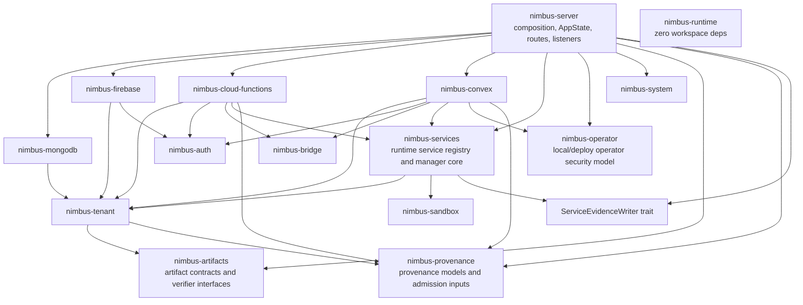

# Server Crate Extraction Completion Plan

Status: active
Owner: architecture / server hardening
Created: 2026-05-28
Predecessor: `docs/plans/server-seam-extraction-readiness-plan.md`

## Purpose

The previous readiness plan proved which seams are clean, which are partial,
and which are still effect-bound. This plan turns that evidence into final
crate extraction.

The answer to "is extraction possible?" is yes, with one qualifier: the final
shape must extract real owners, not broad buckets. `nimbus-server` will still
own composition, route mounting, listener lifecycle, global process startup,
shutdown signaling, and AppState construction. Extracted crates will own
protocol models, operation cores, policy/value models, and explicit effect
interfaces.

The plan therefore ends in these earned crates:

- `nimbus-mongodb`
- `nimbus-firebase`
- `nimbus-cloud-functions`
- `nimbus-convex`
- `nimbus-artifacts`
- `nimbus-provenance`
- `nimbus-services`
- `nimbus-operator`

An aggregate `nimbus-adapters` crate is allowed only as a final thin facade
that re-exports the per-adapter crates. It must not contain implementation
logic, server state, route mounting, listener lifecycle, or hidden composition.

## Why Blockers Remained

The completed readiness plan used "blocked" in the engineering sense, not in
the "impossible" sense. A blocker means extraction would have moved the wrong
thing into the wrong owner:

- Firebase still had transport/auth composition around otherwise clean
  Firestore model and operation code.
- Cloud Functions still depended on runtime invocation, provenance admission,
  service registry, deploy state, and generated artifact effects.
- Convex still mixed protocol code with routes, WebSockets, system-route
  operator auth, runtime-backed execution, service registry, and audit
  context.
- `nimbus-artifacts` was blocked because pure artifact contracts were still
  tenant-owned while process-backed verifier effects were server-owned.
- `nimbus-provenance` was blocked because tenant policy, runtime integrity,
  server admission, and verifier effects were split by real owner.
- `nimbus-services` was blocked because service manager, runtime registry,
  sandbox catalog traits, evidence writes, backend activation, and HTTP
  lifecycle were not yet separated.
- `nimbus-operator` was blocked because token/session policy had been split
  from Axum, but audit persistence, token-file effects, shutdown, deploy
  staging, runtime hook installation, and system evidence still had mixed
  ownership.

Those blockers are solvable by introducing the missing capability traits and
moving value models before moving effectful code.

## Final Target Shape



`nimbus-runtime` remains zero workspace dependencies. If provenance needs
runtime byte-integrity data, `nimbus-server` or an adapter crate translates
runtime-owned values into provenance-owned evidence. `nimbus-runtime` must not
start depending on `nimbus-provenance`.

## Non-Negotiable Rules

- `nimbus-server` remains the only crate that owns route mounting, listener
  lifecycle, AppState construction, global shutdown, and process startup.
- Extracted crates must not depend on `nimbus-server`.
- Extracted crates must not accept `AppState`, `RouterBuildConfig`, Axum
  routers, listener handles, or server-private modules.
- `_nimbus` persistence stays in `nimbus-system` or server-implemented writer
  traits.
- Tenant authority stays in `nimbus-tenant`; lower crates consume admitted
  decisions or narrow projections.
- Application auth stays in `nimbus-auth`.
- Local/deploy operator auth stays in `nimbus-operator`; it must not be folded
  into tenant application auth.
- `nimbus-runtime` keeps zero workspace dependencies.
- `nimbus-core` keeps zero I/O.
- Process execution may move only to a crate whose name and proof explicitly
  classify it as effectful. Pure `nimbus-artifacts` and pure
  `nimbus-provenance` must not launch processes.

## Enterprise Trust Bar

This plan is complete only if the resulting architecture is easier for a
security reviewer, operator, and future maintainer to reason about than the
current server-centered layout.

Every extracted crate must prove:

- authority is explicit: tenant authority flows through `nimbus-tenant`,
  application auth flows through `nimbus-auth`, operator authority flows
  through `nimbus-operator`, and runtime capabilities flow through
  `nimbus-bridge`;
- side effects are named and inverted: storage, `_nimbus` writes, process
  execution, route mounting, listener lifecycle, shutdown, and filesystem
  effects are either server-owned or behind narrow traits with negative tests;
- failure is fail-closed: missing provenance, failed verifier output, wrong
  tenant handles, denied service grants, bad operator tokens, stale sessions,
  malformed adapter inputs, and runtime grant denials must reject rather than
  degrade to broad server access;
- dependency direction is mechanically checked with `cargo tree` and denied
  import scans, not reviewed by inspection alone;
- tests record exact pass/fail/ignored counts in proof files, and any ignored
  tests are listed by name with a reason;
- public APIs are minimal and owner-named. New crates expose value models,
  capability traits, and operation cores, not convenience access to server
  internals;
- maintainability improves: composition roots stay thin, concept-owned modules
  remain below the repository line-count thresholds or carry a plan-backed
  exception, and no new `helpers`, `misc`, or broad catch-all module becomes a
  hidden ownership sink.

## Global Requirements

These requirements are the audit contract for every phase. A phase proof must
cite the requirement IDs it satisfies.

| ID | Requirement | Verifiable success criteria |
| --- | --- | --- |
| FCE-REQ-001 | Server composition boundary | Extracted crates have no `AppState`, `RouterBuildConfig`, Axum router, listener lifecycle, shutdown sender, route mounting, or global process-start ownership. Server route/listener shells remain in `nimbus-server` unless an explicit effectful crate decision is recorded. |
| FCE-REQ-002 | Dependency direction | `cargo tree -p <extracted-crate>` is recorded and shows no `nimbus-server` dependency. Denied-import scans prove no `crate::state`, `crate::router`, `crate::local_server`, `crate::system_tenant`, or other server-private module references from extracted crates. |
| FCE-REQ-003 | Authority routing | Tenant authority flows through `nimbus-tenant`; application auth through `nimbus-auth`; operator authority through `nimbus-operator`; runtime capabilities through `nimbus-bridge`; `_nimbus` writes through `nimbus-system` or server-implemented writer traits. Negative tests cover bypass attempts. |
| FCE-REQ-004 | Effect ownership | Pure crates have no process execution, filesystem persistence, network listeners, direct storage writes, or `_nimbus` persistence. Effectful choices are named in the proof and covered by failure tests. |
| FCE-REQ-005 | Runtime/core invariants | `nimbus-runtime` keeps zero workspace dependencies, and `nimbus-core` keeps zero I/O. Any provenance/runtime translation happens at the server or adapter boundary. |
| FCE-REQ-006 | Fail-closed behavior | Missing/invalid provenance, verifier failure, wrong tenant handles, denied service grants, invalid operator tokens, stale sessions, malformed adapter input, and runtime grant denial reject with asserted errors. |
| FCE-REQ-007 | Verification evidence | Proof files record exact commands, exact pass/fail/ignored counts, denied-import output, dependency output, and the final verifier condition count. Ignored tests are listed by name with a reason. |
| FCE-REQ-008 | Maintainability | New public APIs are owner-named and minimal. Composition roots stay thin. Files over repository line-count thresholds are split or documented as ownership-based exceptions. |
| FCE-REQ-009 | Optional facade discipline | `nimbus-adapters`, if created, is re-export-only except feature wiring and docs; it has no implementation logic, server state, route mounting, listener lifecycle, process execution, or hidden composition. |
| FCE-REQ-010 | Active seam repair | A phase may not stop at "not extractable" or "ready to extract." For every unclean seam, the proof records the right-sized ownership-correct repair performed, the result, and either actual extraction into the target crate or a specific rule-backed blocker. |

## Control Plane Protocol

Agents running this plan must:

- read this plan, the predecessor SSE proofs, and `git status --short` before
  editing,
- keep exactly one phase `in_progress`,
- create a proof file for every phase under
  `docs/plans/proof/server-crate-extraction-completion/`,
- update `scripts/verify-server-crate-extraction-completion.sh` in the same
  phase as every extraction,
- never mark a crate extracted until `cargo tree -p <crate>` proves no
  `nimbus-server` dependency,
- record denied-import audits for every extracted crate,
- record exact focused-test output counts, including ignored tests,
- run focused behavior and negative boundary tests for every moved authority
  or effect seam,
- preserve route/listener shells in server unless a proof explicitly
  classifies a moved crate as effectful and server-free,
- finish only after the final verifier, focused tests, `cargo fmt --all
  --check`, and `cargo check --workspace` pass.

## Compaction-Resilient Resume Protocol

This file, the phase proof files, and the verifier script are the source of
truth. Chat history is useful context, but it is not progress state.

On every resume, interruption, or context compaction:

1. Read this plan from the top.
2. Read `docs/plans/README.md` to confirm this plan is still active.
3. Read all existing proof files under
   `docs/plans/proof/server-crate-extraction-completion/`.
4. Read `scripts/verify-server-crate-extraction-completion.sh` if it exists.
5. Run `git status --short` and do not overwrite unrelated dirty work.
6. Find the single `in_progress` phase in the ledger. Resume it. If no phase
   is `in_progress`, start the first `pending` phase. If more than one phase is
   `in_progress`, fix the ledger before editing code.
7. Re-run the current verifier before marking a phase complete.

Phase status values are `pending`, `in_progress`, `completed`, and `blocked`.
`blocked` is an interim engineering state only; FCE10 cannot complete while any
required extraction phase is still blocked. A blocked proof must name the exact
import, dependency, ownership conflict, or missing trait that prevents progress,
the right-sized ownership-correct seam repair that was attempted, the verification
result from that attempt, and the next code move that will unblock extraction.

For extraction phases FCE1 through FCE8, `completed` means the named crate
exists in `crates/`, the intended owner code has moved into that crate, server
call sites use the crate through explicit APIs or traits, and the verifier
proves the crate has no `nimbus-server` dependency or denied server-private
imports. A clean seam that has not been extracted is still `in_progress`, not
`completed`. FCE9 is optional by design; it may complete by creating the thin
facade or by recording a proof-backed skip. FCE0 and FCE10 are verifier and
closeout phases, not extraction phases.

`blocked` must not mean "the seam is not clean." The expected behavior is to
clean the seam inside the phase whenever that can be done without violating the
non-negotiable rules. Mark a phase `blocked` only when at least one of these is
true:

- the required fix belongs to an earlier phase that is not complete,
- the fix would move server composition, process lifecycle, route/listener
  ownership, `_nimbus` persistence, or tenant authority into the wrong crate,
- the fix requires a new architectural crate or trait not named in this plan,
  and adding it would change the target architecture,
- the fix cannot be verified with the current test or verifier surface, and
  the proof adds the missing verifier/test task before pausing.

For every messy seam, the agent must perform the right-sized repair that makes
the boundary actually correct when feasible. That can mean introducing a narrow
capability trait, moving a complete pure value model, splitting protocol from
transport, routing authority through an existing architecture crate, preserving
only the composition shell in `nimbus-server`, or decomposing a module enough
that the future crate has a truthful owner. The agent should avoid ornamental
micro-fixes that leave the seam ambiguous, and also avoid broad refactors that
pull unrelated ownership into the phase. Recording the mess without a real
repair attempt is not valid evidence.

Before editing code for a phase, mark that phase `in_progress` in the ledger
and create its proof file with the template below. Before ending a work session,
update the proof file and ledger so a future agent can resume without reading
the conversation.

Every task bullet in this plan must be closed with task-specific evidence:

- `Create` means the crate/file exists, is in `Cargo.toml` when applicable,
  and is checked by the verifier.
- `Move` means the proof lists source path, destination path, exported symbol
  or module, and the focused test or compile check that proves call sites were
  updated.
- `Make ... depend on` means `cargo tree -p <crate>` output is recorded and
  denied dependencies are absent.
- `Keep ... in server` means the proof names the retained file/module and the
  verifier denies importing it from extracted crates.
- `Introduce ... trait` means the trait owner, implementor, and at least one
  positive and one negative behavior test are recorded.
- `Decide` means the proof records the chosen owner, rejected alternative, and
  dependency/effect reason.
- `Block` means the proof records the seam repair that was attempted or the
  specific architectural rule that made the attempted fix unsafe, plus the
  next implementation move.
- `Run` means exact command output is recorded with pass/fail/ignored counts.

If a task cannot be verified in one of those forms, rewrite the task and its
success criteria before implementing it.

Proof files must use this schema:

````markdown
# FCE<N>: <phase name>

Status: pending | in_progress | completed | blocked
Started: YYYY-MM-DD
Completed: YYYY-MM-DD or n/a
Requirements: FCE-REQ-...

## Scope

- Files/modules moved:
- Files/modules intentionally left in `nimbus-server`:
- Crates created or updated:

## Ownership Decisions

- Authority owner:
- Effect owner:
- Server composition shell:
- Explicit keep decisions:

## Seam Fix Attempts

- Messy seam found:
- Right-sized ownership-correct repair attempted:
- Files changed or spike/proof performed:
- Result:
- If blocked, exact architectural reason:
- Next implementation move:

## Dependency Evidence

```text
<cargo tree -p ... output or exact no-server check output>
```

## Denied-Import Evidence

```text
<rg/verification output proving denied imports are absent>
```

## Tests

```text
<exact commands and exact pass/fail/ignored counts>
```

Ignored tests:

- `<test name>`: `<reason>`

## Verifier Update

- Conditions added or updated:
- Current verifier result:

## Residual Risk And Resume Notes

- Remaining risk:
- Next action:
````

## Phase Ledger

| Phase | Status | Proof file | Resume instruction |
| --- | --- | --- | --- |
| FCE0 Baseline and verifier skeleton | completed | `docs/plans/proof/server-crate-extraction-completion/fce0-baseline.md` | Record current SSE decisions and add the verifier skeleton. |
| FCE1 Extract `nimbus-artifacts` | completed | `docs/plans/proof/server-crate-extraction-completion/fce1-artifacts.md` | Move pure artifact contracts out of tenant/server without moving process execution. |
| FCE2 Extract `nimbus-provenance` | completed | `docs/plans/proof/server-crate-extraction-completion/fce2-provenance.md` | Move coherent provenance models/admission inputs while preserving runtime zero-dep. |
| FCE3 Extract `nimbus-services` | completed | `docs/plans/proof/server-crate-extraction-completion/fce3-services.md` | Move service registry/manager core behind evidence and sandbox traits. |
| FCE4 Extract `nimbus-operator` | completed | `docs/plans/proof/server-crate-extraction-completion/fce4-operator.md` | Move local/deploy operator security model without Axum/AppState. |
| FCE5 Extract `nimbus-mongodb` | completed | `docs/plans/proof/server-crate-extraction-completion/fce5-mongodb.md` | Extract MongoDB protocol/command code; keep TCP listener shell in server. |
| FCE6 Extract `nimbus-firebase` | completed | `docs/plans/proof/server-crate-extraction-completion/fce6-firebase.md` | Extract Firestore model/protocol/operation and invert auth/usage composition. |
| FCE7 Extract `nimbus-cloud-functions` | completed | `docs/plans/proof/server-crate-extraction-completion/fce7-cloud-functions.md` | Extract protocol/runtime adapter after provenance and services are available. |
| FCE8 Extract `nimbus-convex` | completed | `docs/plans/proof/server-crate-extraction-completion/fce8-convex.md` | Extract Convex subtrees after operator/services/runtime seams are available. |
| FCE9 Optional `nimbus-adapters` facade | completed | `docs/plans/proof/server-crate-extraction-completion/fce9-adapters-facade.md` | Create only a thin re-export facade if every per-adapter crate is clean. |
| FCE10 Final closeout | completed | `docs/plans/proof/server-crate-extraction-completion/fce10-closeout.md` | Run final verifier, focused tests, formatting, and workspace check. |

## Phase-Level Verification Gates

Each phase must add verifier conditions for its own success criteria. The
verifier should fail loudly on missing proof files, stale ledger state, missing
crates, forbidden dependencies, denied imports, or skipped final evidence.

| Phase | Required task proof | Required verification |
| --- | --- | --- |
| FCE0 | Proof records target crates, forbidden imports, server-only shells, and predecessor SSE state. | Verifier exists, is executable, runs the predecessor SSE verifier, and checks proof-file presence plus phase ledger consistency. |
| FCE1 | Proof lists artifact symbols moved, tenant admission symbols kept, and process runner location. | `cargo tree -p nimbus-artifacts`; denied scan for `nimbus-server`, `nimbus-tenant`, `nimbus-system`, Axum, storage, `std::process`, and `Command`; artifact fail-closed/redaction tests. |
| FCE2 | Proof lists provenance models moved, runtime integrity values kept in runtime, and translation boundary. | `cargo tree -p nimbus-provenance`; denied scan for `nimbus-server`, Axum, process execution, adapter registry loading, storage, and `nimbus-runtime`; bad/missing provenance tests. |
| FCE3 | Proof lists service registry/manager pieces moved, evidence trait shape, and HTTP lifecycle code kept in server. | `cargo tree -p nimbus-services`; denied scan for `nimbus-server`, Axum, router, AppState, and direct `_nimbus` persistence; service lifecycle, grant-denial, wrong-tenant, runtime lookup, and evidence tests. |
| FCE4 | Proof records token/session/operator policy moved, persistence decision, and Axum/shutdown/deploy effects kept in server. | `cargo tree -p nimbus-operator`; denied scan for `nimbus-server`, Axum, router, adapters, `nimbus-engine`, tenant workload execution, and `nimbus-auth`; invalid/revoked/stale/origin/deploy-admin tests. |
| FCE5 | Proof records MongoDB protocol/command/auth/error modules moved and listener shell retained. | `cargo test -p nimbus-mongodb`; server MongoDB integration/spec tests; `cargo tree` and denied scan proving no `nimbus-server`, AppState, listener, route, operator, or `_nimbus` ownership. |
| FCE6 | Proof records Firestore model/protocol/operation/streaming modules moved and REST/gRPC transport shells retained. | Focused Firebase REST/gRPC/listen/auth tests; wrong-tenant bearer rejection; `cargo tree` and denied scan proving no `nimbus-server`, AppState, Axum router, local operator auth, system shim, or runtime host internals. |
| FCE7 | Proof records Cloud Functions app/manifest/binding/runtime-adapter modules moved and deploy/artifact process effects retained. | Cloud Functions focused tests; runtime invocation and provenance failure tests; `cargo tree` and denied scan proving no `nimbus-server`, AppState, RouterBuildConfig, server execution internals, process construction, or direct `_nimbus` writes. |
| FCE8 | Proof records Convex protocol/value/registry/subscription modules moved and route/WebSocket/server lifecycle shells retained. | Convex focused and reactive-loop tests; security tests for wrong-table IDs, runtime grant denial, application-auth rejection, system-tenant operator auth, and service grant rejection; `cargo tree` and denied scan proving no server-private imports. |
| FCE9 | Proof records facade creation or explicit skip reason. | If created, verifier proves `nimbus-adapters` is re-export-only except feature wiring/docs and has no server/effect/composition imports. |
| FCE10 | Proof records final dependency graph, ownership table, exact test counts, ignored-test reasons, and enterprise-trust review. | Final extraction verifier passes; all focused tests pass; `cargo fmt --all --check` passes; `cargo check --workspace` passes; every required phase is `completed`, not `blocked`. |

## Phase FCE0: Baseline And Verifier Skeleton

Goal: freeze the completed readiness evidence and start an extraction-specific
verifier.

Tasks:

- Add `scripts/verify-server-crate-extraction-completion.sh`.
- Require `scripts/verify-server-seam-extraction-readiness.sh` to pass.
- Record the crate list, forbidden imports, and current server-only modules.
- Add helper checks for "crate exists", "crate has no `nimbus-server`
  dependency", and "crate source has no server-private imports".

Success criteria:

- Verifier exists and is executable.
- Verifier passes the predecessor SSE gate.
- Verifier includes reusable checks for crate existence, no `nimbus-server`
  dependency, denied server-private imports, proof-file presence, and exactly
  one `in_progress` phase.
- Proof records every target crate and every non-extractable server shell.

## Phase FCE1: Extract `nimbus-artifacts`

Goal: make artifact contracts a real non-server, non-tenant primitive.

Target owner:

- artifact reference and digest parsing,
- artifact verification request/response/evidence value types,
- verifier backend traits,
- redaction helpers for verifier evidence,
- pure SLSA/SBOM/cosign subject value helpers that do not perform I/O.

Not allowed:

- tenant authority decisions,
- default process runner construction,
- `std::process::Command`,
- server/operator wiring,
- `_nimbus` persistence.

Tasks:

- Move pure artifact contract types from `nimbus-tenant` into
  `nimbus-artifacts`.
- Make `nimbus-tenant` depend on `nimbus-artifacts` for artifact evidence
  inputs while keeping admission decisions tenant-owned.
- Make server verifier effects depend on `nimbus-artifacts` contracts.
- Keep `ProcessArtifactVerifierCommandRunner` in server until a separate
  effectful verifier crate is explicitly justified.

Success criteria:

- `nimbus-artifacts` has no `nimbus-server`, `nimbus-tenant`,
  `nimbus-system`, Axum, storage, or process dependency.
- `nimbus-tenant` still owns artifact admission decisions.
- Artifact fail-closed and redaction tests pass.
- Verifier denies process execution in `nimbus-artifacts`.

## Phase FCE2: Extract `nimbus-provenance`

Goal: create a coherent pure provenance model crate without violating runtime
dependency rules.

Target owner:

- SLSA/SBOM provenance value models,
- runtime bundle provenance admission inputs,
- adapter manifest provenance models,
- provenance verification result/evidence shapes shared by tenant and server.

Not allowed:

- `nimbus-runtime` depending on `nimbus-provenance`,
- process execution,
- adapter registry loading,
- server invocation plumbing,
- tenant authority decisions.

Tasks:

- Move shared provenance value types out of tenant/server modules into
  `nimbus-provenance`.
- Make `nimbus-tenant` consume provenance evidence for policy decisions.
- Make Cloud Functions and Convex registry loading consume provenance value
  types without owning verifier effects.
- Keep runtime byte integrity in `nimbus-runtime`; translate values at the
  server/adapter boundary.

Success criteria:

- `nimbus-provenance` has no `nimbus-server`, Axum, process, adapter registry,
  storage, or runtime dependency.
- `nimbus-runtime` still has zero workspace dependencies.
- Bad/missing provenance tests fail closed.
- Verifier proves process-backed verification is not in `nimbus-provenance`.

## Phase FCE3: Extract `nimbus-services`

Goal: move service registry and service manager core out of server without
moving HTTP lifecycle routes or `_nimbus` persistence.

Target owner:

- `RuntimeServiceRegistry`,
- service binding projection,
- service manager activation core,
- service evidence writer trait,
- neutral sandbox service catalog and launch contracts,
- tenant service grant enforcement through `nimbus-tenant`,
- local enforcement projections through `nimbus-node`.

Not allowed:

- Axum routes,
- `AppState`,
- `RouterBuildConfig`,
- direct `_nimbus` persistence implementation,
- concrete server system state writes.

Tasks:

- Move `RuntimeServiceRegistry` and service binding projection into
  `nimbus-services`.
- Promote `SandboxCatalog`, `SandboxServiceCatalog`, and
  `SandboxServiceLaunch` to `nimbus-services` or `nimbus-sandbox` with a
  proof-backed owner decision.
- Move `SandboxServiceManager` core if it depends only on service, sandbox,
  tenant, node, and evidence traits.
- Keep HTTP lifecycle routes in server.
- Implement service evidence writer in server using `nimbus-system`.

Success criteria:

- `nimbus-services` has no `nimbus-server`, Axum, router, AppState, or direct
  `_nimbus` persistence.
- Service tests cover start, stop, restart, denied grant, wrong tenant handle,
  runtime service lookup, and system evidence.
- Server route tests prove lifecycle routes still work through the extracted
  crate.

## Phase FCE4: Extract `nimbus-operator`

Goal: move local/deploy operator security out of server transport.

Target owner:

- local admin token record and freshness rules,
- local session and launch-ticket model,
- route-family and origin policy,
- deploy admin bearer policy,
- operator audit event/record model,
- file-backed token/audit persistence if kept explicitly effectful.

Not allowed:

- Axum middleware,
- route mounting,
- `AppState`,
- tenant application auth,
- deploy artifact staging,
- registry activation,
- runtime hook installation,
- shutdown sender ownership.

Tasks:

- Move `local_server/access_policy.rs`, token/session value logic, route-family
  policy, and audit record model into `nimbus-operator`.
- Decide whether token/audit file persistence is owned by `nimbus-operator` as
  explicit local operator I/O or inverted behind server traits. Record the
  decision before moving files.
- Make server Axum middleware call `nimbus-operator` policy APIs.
- Keep shutdown route effects and deploy activation in server.

Success criteria:

- `nimbus-operator` has no `nimbus-server`, Axum, router, adapters,
  `nimbus-engine`, tenant workload execution, or `nimbus-auth` dependency.
- Tests cover invalid token, revoked session, stale rotation, bad origin,
  deploy-admin gating, and local-admin/application-auth separation.
- Audit tests prove no token/session secret material is persisted.

## Phase FCE5: Extract `nimbus-mongodb`

Goal: extract the already-ready MongoDB adapter code.

Target owner:

- MongoDB wire protocol,
- BSON bridge,
- SCRAM auth,
- command handling,
- cursor/session/change-stream state,
- MongoDB error mapping.

Not allowed:

- TCP listener startup,
- process lifecycle,
- `AppState`,
- route mounting,
- local operator auth,
- `_nimbus` persistence.

Tasks:

- Create `crates/nimbus-mongodb`.
- Move protocol/command/auth/error/connection code.
- Keep listener accept loop in server as a composition shell.
- Either keep explicit `nimbus-engine` service capability or introduce a
  MongoDB command trait before moving command code.

Success criteria:

- `cargo test -p nimbus-mongodb`.
- Server MongoDB integration/spec tests pass.
- Verifier proves no `nimbus-server` dependency from the adapter crate.

## Phase FCE6: Extract `nimbus-firebase`

Goal: extract Firebase/Firestore model, protocol, operation, and streaming
core while keeping server transport and deployment composition in server.

Tasks:

- Create `crates/nimbus-firebase`.
- Move Firestore model/resource/path/serializer/error/request/response code.
- Move operations behind explicit engine and auth/usage capabilities.
- Move gRPC write/listen stream core behind transport-provided capabilities.
- Keep Axum REST handlers, tonic service construction, websocket upgrade, and
  deployment lookup in server until represented as traits.

Success criteria:

- `nimbus-firebase` has no `nimbus-server`, AppState, Axum router,
  local operator auth, system tenant shim, or runtime host internals.
- Focused Firebase REST/gRPC/listen/auth tests pass through server shells.
- Wrong-tenant bearer tests still fail closed.

## Phase FCE7: Extract `nimbus-cloud-functions`

Goal: extract Cloud Functions protocol/runtime adapter code after artifacts,
provenance, and services are available.

Tasks:

- Create `crates/nimbus-cloud-functions`.
- Move app contract, manifests, target binding, HTTP request/response shaping,
  Firebase Admin runtime extension model, and runtime host adapter code.
- Replace server execution calls with narrow runtime invocation traits.
- Consume `nimbus-provenance` value types and `nimbus-services` service
  registry traits.
- Keep active deployment lookup, route fallback, deploy activation, and
  generated artifact process fixtures in server.

Success criteria:

- Crate has no `nimbus-server`, AppState, RouterBuildConfig, server execution
  internals, process construction, or direct `_nimbus` writes.
- Cloud Functions focused tests pass.
- Runtime invocation and provenance failure tests fail closed.

## Phase FCE8: Extract `nimbus-convex`

Goal: extract Convex adapter code after services, operator, provenance, auth,
and bridge seams are available.

Tasks:

- Create `crates/nimbus-convex`.
- Move protocol/value subtrees first: document identity, requests, templates,
  manifest, registry schema/resolution/deploy summaries, host payloads and
  responses, and subscription transform planning.
- Introduce route auth/audit context traits using `nimbus-operator`.
- Introduce runtime invocation and service registry traits using
  `nimbus-bridge` and `nimbus-services`.
- Keep route mounting, WebSocket upgrade/listener lifecycle, AppState
  construction, and server process lifecycle in server.

Success criteria:

- Crate has no `nimbus-server`, AppState, router/listener lifecycle,
  server-local auth/system/runtime shims, or direct `_nimbus` upserts.
- Convex focused tests and reactive-loop tests pass.
- Security tests cover wrong-table IDs, runtime bridge grant denial,
  application-auth tenant rejection, system-tenant operator auth, and service
  grant rejection.

## Phase FCE9: Optional `nimbus-adapters` Facade

Goal: create an aggregate crate only if it is genuinely a facade.

Tasks:

- Create `crates/nimbus-adapters` only after all per-adapter crates pass their
  no-server dependency audits.
- Re-export per-adapter crates behind feature flags.
- Do not move implementation logic into this facade.

Success criteria:

- `nimbus-adapters` has no `nimbus-server`, Axum, AppState, router, listener,
  `_nimbus`, process, or deployment composition imports.
- Verifier proves the facade is re-export-only except feature wiring and docs.

## Phase FCE10: Final Closeout

Goal: prove the extraction wave is complete.

Tasks:

- Run the final extraction verifier.
- Run focused tests for every moved crate.
- Run `cargo fmt --all --check`.
- Run `cargo check --workspace`.
- Record final dependency graph and crate ownership table.
- Record exact focused-test pass/fail/ignored counts and justify every
  remaining ignored test by name.
- Record the final enterprise-trust review: authority flow, side-effect
  ownership, fail-closed coverage, dependency direction, and maintainability
  posture.

Success criteria:

- Every target crate exists or the optional facade is explicitly skipped by
  proof.
- No extracted crate depends on `nimbus-server`.
- No extracted crate imports server-private modules.
- `nimbus-runtime` still has zero workspace dependencies.
- `nimbus-core` still has zero I/O.
- Proof files contain exact verification outputs, not summary-only claims.
- Closeout proof explicitly maps FCE-REQ-001 through FCE-REQ-010 to passing
  evidence.
- Final verifier, focused tests, formatting, and workspace check pass.

## Recommended Goal Prompt

```text
/goal Complete docs/plans/server-crate-extraction-completion-plan.md end to end as the final crate extraction wave. Treat the plan, proof files under docs/plans/proof/server-crate-extraction-completion/, and scripts/verify-server-crate-extraction-completion.sh as the control plane and source of truth across compaction events. Execute FCE0 through FCE10 in order; keep exactly one phase in_progress; update the phase ledger and proof file before every pause; maintain the verifier with every phase; do not treat "the seam is not clean" or "ready to extract" as completion evidence; for every messy seam, perform the right-sized ownership-correct repair that makes the boundary actually correct when feasible, and mark blocked only with a rule-backed reason, repair-attempt evidence, and next implementation move. Extract nimbus-artifacts, nimbus-provenance, nimbus-services, nimbus-operator, nimbus-mongodb, nimbus-firebase, nimbus-cloud-functions, and nimbus-convex; FCE1-FCE8 are complete only when the named crate exists, the owner code has moved into it, server call sites use it through explicit APIs or traits, and verifier/dependency/denied-import/security-test evidence passes. Keep route mounting, listener lifecycle, AppState construction, shutdown, and global composition in nimbus-server; create nimbus-adapters only as a thin re-export facade after per-adapter crates are clean; preserve nimbus-runtime zero workspace dependencies and nimbus-core zero I/O; finish only after every required phase is completed, the final verifier, focused tests, cargo fmt --all --check, and cargo check --workspace pass with proof files recording exact results and the final enterprise-trust review.
```
