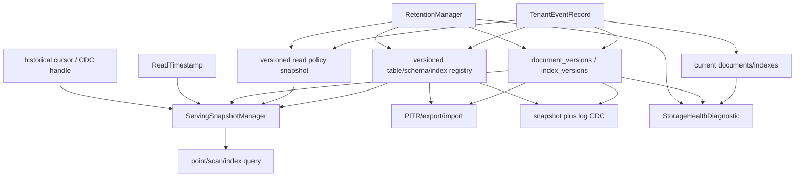

# Storage Engine Quality And MVCC Plan

This is the follow-on roadmap after the completed
`docs/plans/archive/storage-architecture-trust-hardening-plan.md` baseline. Its
purpose is to raise Nimbus storage from a trustworthy latest-row reactive
document store to a storage engine with quality comparable to the codebases
reviewed locally: Convex for application-level MVCC and table/index identity,
CockroachDB for clear MVCC contracts and metamorphic testing, TigerBeetle for
deterministic checkpoint discipline, ElectricSQL for snapshot plus log
protocols, and ExtendDB for compatibility-facing proof.

## Status

- **Status:** `seq14-done`
- **Current baseline:** `bash scripts/verify-storage-architecture-trust-hardening.sh`
  passes on `main` as of `4a9e6a77` with `12 passed, 0 failed`.
- **SEQ0 gate:** complete. `SEQ0` created the proof bundle, reusable verifier,
  enterprise guarantee charter, all-supported backend/adapter matrix, staged
  proof order, performance budgets, explicit external-provider benchmark gaps,
  and starting decisions for historical authorization, cursor identity,
  storage-format gates, retention watermarks, and CDC handoff. Re-run the SATH
  verifier if the base commit moves.
- **Execution worktree:** run SEQ work from a dedicated Git worktree based on
  `main` with a `codex/` branch. The primary checkout remains the review
  baseline; implementation and proof commits live in the SEQ worktree.
- **Owning control plane:** this plan, the proof bundle, technical-debt rows,
  and the SEQ verifier are the execution control plane.
- **Verifier:** `bash scripts/verify-storage-engine-quality-and-mvcc.sh` passes
  with `20 passed, 0 failed` after SEQ14 closeout and the post-review hardening
  fixes, including live SEQ3/SEQ4 provider evidence, SEQ13 performance
  evidence, architecture docs, pushed branch, and draft PR
  `https://github.com/nimbus/nimbus/pull/13`.
- **Post-closeout challenge prompt:**
  `docs/plans/prompts/storage-engine-quality-and-mvcc-post-closeout-architecture-review.md`
  is the durable follow-up audit prompt. Use it only after verifying the local
  checkout, remote branch, and PR #13 head all match, then re-check the local
  Convex, CockroachDB, TigerBeetle, ElectricSQL, and ExtendDB source refs before
  accepting the completed architecture as the enterprise baseline.
- **Depends on:**
  - durable tenant event journal
  - retention floors and hard-delete gates
  - first-class read visibility APIs
  - storage capability and health diagnostics
  - generated cross-backend conformance harness

## Goal

Add the storage-engine features that make Nimbus worthy of deeper enterprise
database trust:

1. MVCC document and index retention with explicit read timestamps.
2. Repeatable historical point reads, scans, indexed queries, and paginated
   queries within a configured retention window.
3. Point-in-time restore and export/import built from the same MVCC and event
   journal primitives.
4. Versioned table, schema, index, and read-policy lifecycle so historical reads
   can resolve the correct identity, authorization rule, and query plan.
5. Safe retention compaction and garbage collection that only remove versions
   invisible to retained snapshots and consumers.
6. Model, metamorphic, crash/replay, and deterministic equivalence tests that
   make regressions hard to hide.

The plan should make Nimbus better by adopting the right ideas, not by copying
distributed database machinery wholesale.

## Enterprise Requirement

Nimbus plans to sell to enterprise customers, so enterprise storage guarantees
are a product premise for this roadmap, not a speculative SEQ0 gate. SEQ0 does
not decide whether Nimbus needs historical correctness, recovery, CDC,
multi-backend reliability, and verifiable operator evidence. It records the
exact guarantee charter, supported surfaces, first-proof order, and budgets so
the implementation is disciplined.

All currently supported storage backends and adapter surfaces must be accounted
for. It is acceptable to prove the implementation in stages, starting with the
smallest backend set that exposes semantic bugs quickly, but final completion
requires one of two explicit outcomes for every supported backend and adapter:
the enterprise guarantee is implemented and verified, or the support matrix
documents a typed fail-closed unsupported state with customer-facing caveats.

Current adapter inventory for this plan:

| Adapter surface | Canonical docs | SEQ requirement |
| --- | --- | --- |
| Convex adapter surface | `docs/adapters/convex/compatibility.md`, `docs/adapters/convex/ai-guidelines.md` | Preserve Convex-compatible mutation/query/subscription semantics; expose historical reads, PITR, or CDC only as documented Nimbus extensions after historical authorization and dependency tracking are proved. |
| Firebase/Firestore adapter surface | `docs/adapters/firebase/compatibility.md` | Keep first-party `@nimbus/firebase` CRUD/query/listen/transaction guarantees on the shared storage path; document or fail closed for PITR, CDC, historical reads, and unclaimed stock SDK/admin breadth. |
| Cloud Functions trigger surface | `docs/adapters/cloud-functions/compatibility.md` | Keep trigger event ordering, retry, and replay derived from durable tenant events and the SEQ CDC cuts; deferred/non-default database gaps remain fail-fast. |
| DynamoDB adapter surface | `docs/adapters/dynamodb/enterprise-readiness.md`, `docs/adapters/dynamodb/feature-coverage.md` | Keep Streams, TTL-attributed removes, transactions, auth isolation, and DynamoDB divergences explicit relative to SEQ CDC/PITR/import/export semantics. |
| MongoDB adapter surface | `docs/adapters/mongodb/README.md`, `docs/adapters/mongodb/operations.md` | Keep CRUD, cursors, transactions, and indexes on the shared engine/storage path; `$changeStream` must fail closed until it is backed by the SEQ durable CDC cut model; historical reads and PITR require documented extensions or clear unsupported errors. |
| Native HTTP/WebSocket surface | `docs/adapters/native/README.md`, `docs/adapters/native/http-api.md`, `docs/adapters/native/websocket-protocol.md` | Primary place to expose Nimbus-native historical read, PITR, CDC, diagnostics, support-state, and typed expired/unsupported/format-mismatch errors. |

## Non-Goals

- Do not add distributed consensus, range leasing, Raft, or Cockroach-style
  multi-node transaction coordination in this plan.
- Do not replace SQLite/Postgres/MySQL/libSQL with a custom storage engine
  unless benchmarks and requirements prove the current backend-owned layout
  cannot meet product goals.
- Do not expose MVCC internals through adapter protocols that do not have an
  equivalent concept.
- Do not treat supported backends or adapters as optional scope. Staging proof
  is allowed; silently dropping a supported backend or adapter from the final
  enterprise contract is not.
- Do not implement arbitrary infinite history. Historical reads are bounded by
  explicit retention policy.
- Do not make MVCC a substitute for the tenant event journal. The event journal
  remains the ordered logical history; MVCC rows are a queryable retained state
  representation.
- Do not copy CockroachDB range leases, Raft, timestamp cache, or intent
  machinery. Borrow its MVCC vocabulary and test discipline only where those
  concepts map to Nimbus' single-tenant ordered event journal and storage
  backends.

## Quality Bar

| Dimension | Enterprise-quality target |
| --- | --- |
| Semantics | Read timestamps, commit timestamps, visibility windows, historical authorization, cursor identity, retention floors, and GC rules are typed and documented. |
| Correctness | Randomized histories, crash/replay, snapshot restore, and cross-backend parity tests are part of the required gate. |
| Observability | Operators can inspect MVCC oldest retained timestamp, latest applied timestamp, GC lag, compaction progress, table/index/policy version counts, storage-format state, and historical-query eligibility. |
| Performance | Latest reads stay fast through current-row/materialized caches; historical reads are measured separately and bounded. |
| Safety | Hard delete, compaction, and retention prune only data invisible to pinned readers and retained recovery points. |
| Portability | Backends own physical layout but must expose the same semantic contract. |

## Current Main Baseline

The post-SATH baseline already has several pieces this plan must extend rather
than rebuild:

- A durable tenant event journal covers document writes, schema changes, table
  lifecycle, index lifecycle, scheduled execution, trigger delivery, and barrier
  events.
- Retention floors and hard-delete decisions already model pinned readers,
  consumers, replicas, materializers, and transaction sessions.
- `ReadVisibility`, `RequiredSequence`, and `PinnedServingSnapshot` already
  encode latest-row serving visibility.
- `StorageCapabilities` and `StorageHealthDiagnostic` already expose backend
  layout, event-log heads, retention state, format version, freshness, and
  recovery posture.
- `StorageFormatVersion` already rejects unsupported old and unknown future
  durable formats at validation time. SEQ must preserve this fail-closed startup
  posture as MVCC adds version tables, registry history, and metadata.
- Table schemas can carry `TableAccessPolicy`, and current query authorization
  compiles the read rule from the current `TableSchema`. SEQ must define and
  test historical authorization before serving old rows through current query
  paths.
- A first tenant-level `ServingSnapshotManager` already exists for promoted
  full-scan materialized serving snapshots. SEQ must extend this boundary for
  MVCC and historical reads rather than building a second manager.
- Transaction sessions and execution units already pin begin snapshots and
  perform tracked-read conflict checks before commit. SEQ must integrate MVCC
  visibility with that path instead of creating a parallel OCC engine.
- SQLite currently stores latest-only `table_catalog`, `documents`, `schemas`,
  and indexes over `documents`. Historical document and index reads cannot be
  correct across table/schema/index churn until registry snapshots exist.

## Source-Backed Design Constraints

`SEQ0` must refresh these local sources and record exact commit/ref evidence
before implementation starts:

- **Last reviewed local refs for this audit (2026-06-06):** Convex
  `602dc945`, CockroachDB `5f5932a2bf5`, TigerBeetle `64899c7a4`,
  ElectricSQL `8bcadb7`, and ExtendDB `93de8e3`. These refs are audit
  evidence, not a substitute for the SEQ0 refresh before implementation.
- **Convex** (`~/src/github.com/get-convex/convex-backend`): borrow typed
  repeatable timestamps, separate pending-vs-committed write timestamps,
  repeatable persistence snapshots, retention validation, and
  table/index/schema registry snapshots. Nimbus should not deserialize an
  arbitrary timestamp into historical-read authority without validation.
- **CockroachDB** (`~/src/github.com/cockroachdb/cockroach`): borrow versioned
  key visibility rules, explicit read/write timestamp vocabulary, GC-history
  command coverage, metamorphic iterator coverage, deterministic range-boundary
  tests, and reproducible seed logs. Reject distributed range, lease, intent,
  and consensus machinery in this plan.
- **TigerBeetle** (`~/src/github.com/tigerbeetle/tigerbeetle`): borrow
  deterministic seeds, broad storage fuzz surfaces, checkpoint callbacks, and
  manifest/checkpoint consistency checks. Nimbus should compare versioned
  canonical logical digests across rebuild paths, not backend file bytes.
- **ElectricSQL** (`~/src/github.com/electric-sql/electric`): borrow the
  snapshot-plus-changelog framing, shape/handle lifecycle, and explicit
  snapshot filtering for CDC consumers. Nimbus' CDC surface must define the
  initial-snapshot cut, log handoff, cursor/handle lifecycle, and retention
  errors while remaining tied to the tenant event journal and retention floor.
- **ExtendDB** (`~/src/github.com/ExtendDB/extenddb`): borrow compatibility
  transparency, explicit differences documentation, and atomic stream capture
  with data writes for adapter-facing proof. Nimbus should keep API-facing
  unsupported states explicit rather than silently degrading.

## Audit Findings Added As Plan Requirements

This 2026-06-06 review found several plan-level bugs: they were not current
implementation bugs, but they were underspecified enough that an implementation
could satisfy the older wording while still missing enterprise-grade behavior.
They are now attached to SEQ work:

- Historical reads must define authorization semantics. Current query
  authorization is compiled from the table schema/access policy visible to the
  current service path; MVCC must explicitly choose and test policy-at-read,
  policy-at-now, or fail-closed semantics before exposing historical data.
- Historical pagination cursors must include the read shape and visibility
  coordinate. A cursor that only signs the latest-row query shape is not enough
  for repeatable historical pages across writes, index churn, or schema churn.
- Retention must use separate, inspectable watermarks for documents, indexes,
  registry snapshots, CDC consumers, PITR points, and transaction/session pins
  instead of one vague retention floor.
- Persistent layout changes must be covered by storage-format gates and
  backend-specific migration or clean-break startup behavior. Unknown future
  formats already fail closed; MVCC phases must preserve that contract.
- CDC must define snapshot-to-log handoff, no-miss/no-duplicate guarantees,
  cursor/handle rotation, and retention-expired errors before adapter-visible
  surfaces are claimed.
- Transaction sessions must define pending-write overlay semantics, not only
  committed-version visibility, so read-your-writes and OCC conflict checks stay
  on the existing execution-unit path.

## Rust Implementation Guardrails

- Put new semantic types in `nimbus-core` without I/O. Storage backends own
  physical layout and expose typed contracts upward.
- Keep document writes, index effects, MVCC version rows, and tenant-event
  append in one storage transaction.
- Keep latest-row reads on the current fast path unless a phase explicitly
  proves a replacement is faster and equally correct.
- Prefer small enums/newtypes for visibility, retention, and eligibility states
  over boolean flag combinations.
- Make unsupported or expired historical reads fail closed with typed errors.
- Extend the existing mutation execution unit, transaction session, retention,
  and serving snapshot surfaces instead of adding parallel paths.
- Because Nimbus is pre-launch, make clean breaking changes when the model is
  wrong. Do not add compatibility shims for old internal storage shapes.
- SEQ14 closeout accepts a narrow ownership-based modularity exception for
  `crates/nimbus-storage/src/tests/postgres_provider.rs`,
  `crates/nimbus-storage/src/tests/mysql_provider.rs`, and
  `crates/nimbus-storage/src/tests/libsql_provider.rs`: these files are live
  external-provider conformance roots that keep provider lifecycle, direct
  write, journal, version-history, scheduler, table-lifecycle, and fixture
  setup tests next to the single provider connection harness. Splitting them
  during this reliability wave would duplicate expensive fixture wiring and
  make live-provider evidence harder to audit. Future provider scenarios must
  land in concept-owned child modules once a provider file grows again.
- SEQ14 also justifies
  `crates/nimbus-storage/src/tests/crud_and_journal.rs` as a 1,500-1,999 line
  embedded redb composition root for latest-row, MVCC history, PITR/CDC,
  lifecycle, fault-injection, and journal invariants that share one in-memory
  harness. New embedded storage scenarios should move into concept-owned
  children instead of continuing to expand this root.

## Control Plane Rules

- Treat this file, the current git worktree, the proof bundle, and the verifier
  as the source of truth. Do not rely on chat history to decide what phase is
  complete.
- Before editing SEQ implementation artifacts, create or switch to a dedicated
  Git worktree based on `main` and a `codex/` branch. Record the worktree path,
  branch name, base commit, and `git status --short --branch` output in SEQ0
  proof.
- Start at the first `todo` phase unless exactly one phase is already marked
  `in_progress`. There must never be more than one `in_progress` phase.
  `external_evidence_pending` is allowed only when implementation and
  deterministic local verification are complete but required live
  external-provider fixtures are unavailable; it is not a completion state and
  SEQ14 cannot close while any phase remains in that status.
- `SEQ0` is the bootstrap phase. It must create the verifier, proof directory,
  debt rows, enterprise guarantee charter, all-supported backend/adapter matrix,
  staged proof order, and updated `/goal` validation before any MVCC
  implementation phase begins.
- A phase is not complete until its Verification cell passes with recorded
  command output, test counts, and a matching proof file under
  `docs/plans/proof/storage-engine-quality-and-mvcc/`.
- If implementation discovers a missing semantic requirement, backend
  divergence, or unverifiable claim, add or revise the relevant SEQ task before
  continuing. Do not bury enterprise trust gaps in closeout prose.
- Keep the verifier current with each phase. The verifier must fail for missing
  proof files, missing required commands, stale architecture docs at SEQ14, or a
  support matrix that omits a supported backend/adapter surface.
- Checkpoint plan state before stopping, handing off, or any likely context
  loss: update the phase status, proof file, verifier expectations, and any
  newly discovered follow-on requirement.
- Closeout must leave the SEQ work on a pushed branch with a pull request. The
  PR body must summarize the completed enterprise guarantees, backend/adapter
  support matrix, verification counts, performance evidence, and any typed
  fail-closed unsupported states.

## Verifier Contract

`SEQ0` must add `bash scripts/verify-storage-engine-quality-and-mvcc.sh`. The
script is part of the control plane, not a decorative final check. It must be
runnable from a clean checkout without transcript context and, as phases land,
must verify:

1. The plan, proof bundle, debt rows, and routing entry exist and agree on the
   active phase state.
2. The SATH baseline still passes before SEQ implementation begins.
3. Every completed or in-progress SEQ phase has a proof file with recorded
   commands, counts, source refs where relevant, and explicit pass/fail evidence.
4. The enterprise guarantee charter and all-supported backend/adapter matrix are
   present and every supported surface is either verified or typed fail-closed
   with customer-facing caveats.
5. MVCC semantic tests, historical authorization tests, cursor tests,
   transaction/OCC tests, retention/GC tests, PITR/CDC tests, generated
   conformance, deterministic digest checks, and benchmarks are wired in as soon
   as their owning phase lands.
6. SEQ14 cannot pass until `ARCHITECTURE.md`,
   `docs/architecture/storage/persistence-engine-baseline.md`, relevant adapter
   compatibility docs, and `docs/plans/README.md` describe the completed
   architecture.

## Architecture Direction



## Canonical Data Flow

The end-state data flow must stay boring and inspectable. Enterprise trust comes
from one authoritative path per operation, typed boundaries, and replayable
evidence:

1. **Write path:** the engine validates auth, schema, table/index lifecycle, and
   write preconditions, then writes current rows, document versions, index
   versions, registry/read-policy version effects, and the tenant event record
   in one storage transaction. There is no adapter-specific write bypass.
2. **Latest read path:** latest point reads, scans, indexed queries, and
   subscriptions keep using current materialized rows and current query planning
   through `ReadVisibility`/`RequiredSequence`. MVCC must not make the common
   latest path slower or more complicated unless benchmarks prove the replacement
   is both faster and equally correct.
3. **Historical read path:** a historical request maps product time to a
   validated retained `SequenceNumber`, resolves the table/schema/index/read
   policy bundle at that sequence, validates retention eligibility, then reads
   document and index versions through the single `ServingSnapshotManager`
   boundary. Pagination cursors carry the same read-shape and sequence identity.
4. **Transaction path:** transaction sessions keep their begin snapshot,
   dependency tracking, and execution-unit commit authority. Pending writes are
   visible only through the transaction overlay, then become committed versions
   through the normal write path.
5. **PITR/export/import path:** restore and export use the same retained
   sequence, registry/read-policy bundle, document/index versions, and tenant
   event journal. Restored tenants must match canonical snapshot fingerprints.
6. **CDC path:** consumers start from an explicit snapshot cut, resume through
   the tenant event journal/log position, and use typed handles/cursors. The
   implementation must prove no missed or duplicated logical events across
   snapshot, catch-up, live tail, restart, and retention-expired transitions.
7. **Retention/GC path:** GC computes separate watermarks for document, index,
   registry, read-policy, transaction/session, PITR, CDC, replica, and
   materializer pins, then prunes only data that no retained reader or consumer
   can observe.

## Final-State Architecture Contracts

The final architecture must be reviewed and proven at each layer, from product
semantics down to backend layout:

- **Product and adapter contract:** historical reads, PITR, CDC, and
  serializable/repeatable transaction claims are covered across supported
  backends and adapter surfaces. Adapter protocols expose the feature only where
  they have an equivalent concept or a documented Nimbus-native extension.
  Unsupported combinations fail closed with typed errors and compatibility docs.
- **MVCC semantic contract:** `SequenceNumber` is the primary visibility
  coordinate. Product timestamps map to validated retained sequences before they
  authorize historical reads. Pending transaction writes are distinct from
  committed versions.
- **Identity and authorization contract:** table, schema, index, and read-policy
  snapshots resolve as one read-shape bundle at the selected sequence. Historical
  reads cannot mix current authorization with old data unless SEQ1 documents
  that as the explicit product rule and tests the leakage boundaries.
- **Physical layout contract:** latest-row reads stay on the current fast path;
  historical reads use backend-owned version lookup indexes and typed index-key
  encodings. Backend layout choices differ, but the visible semantics,
  diagnostics, and verification obligations do not.
- **Read serving contract:** `ServingSnapshotManager` remains the single manager
  for pinned read boundaries. Historical point reads, scans, index queries, and
  pagination all route through this boundary rather than inventing a second
  serving cache.
- **Write and OCC contract:** document writes, index effects, version rows, and
  tenant-event appends remain one storage transaction. Transaction-session
  dependency tracking and execution-unit conflict checks remain the only commit
  authority.
- **Retention and recovery contract:** document/index/registry/policy versions
  are pruned only after every retained reader, consumer, PITR point, materializer,
  replica, and transaction/session pin can no longer observe them.
- **CDC and PITR contract:** bootstrap snapshot cuts and journal/log resume
  positions are explicit. Consumers can prove no missed or duplicate logical
  events across snapshot, catch-up, live tail, restart, and retention-expired
  transitions.
- **Testing and operations contract:** pure-model, datadriven history,
  metamorphic, crash/replay, deterministic digest, cross-backend, and benchmark
  gates all record reproducible evidence before any phase is complete.

## Candidate Physical Layout

The exact layout should be finalized in `SEQ1` and `SEQ2`, but the likely
direction is:

| Backend | MVCC layout direction |
| --- | --- |
| SQLite | Keep `documents(table_id, id)` as current-row cache. Add `document_versions(table_id, id, commit_sequence, commit_time, tombstone, payload)` and versioned index tables keyed by `table_id`, `index_id`, indexed values, `commit_sequence`, and `document_id`. |
| Postgres | Same logical layout as SQLite, with backend-owned indexes and query plans for latest and historical reads. |
| MySQL | Same logical layout, with index-prefix limits and generated-column constraints handled as backend-owned details. |
| libSQL | Remote primary owns MVCC writes; local cache refresh proves freshness before serving historical queries. |
| redb | Keep current keyspaces as current-row cache. Add versioned key prefixes encoded by `table_id`, `doc_id`, and descending commit sequence for efficient latest-at-or-before reads. |

The plan should prefer `SequenceNumber` as the primary visibility coordinate
because it is backend-portable and already orders the tenant event log. Wall
clock `Timestamp` remains query metadata and product-facing time, but tests
must define how timestamp ties map to sequence visibility. A timestamp can only
authorize a historical read after it is mapped to a validated retained sequence.

Layout requirements that every backend design must satisfy:

- Document history lookup must be efficient for "latest at or before sequence"
  through a backend-owned descending sequence index or equivalent key encoding;
  historical reads must not full-scan the entire version table for normal point
  lookups.
- Versioned index entries must carry `table_id`, stable `index_id`, typed
  encoded index values, `document_id`, and visibility interval information
  (`visible_from`/`visible_until` or an equivalent tombstone-aware model).
- Historical index pagination cursors must bind the query signature, table
  identity, index identity, sort tuple, document id, and retained read sequence.
- Table, schema, index, and read-policy registry versions must share the same
  sequence coordinate as document/index versions.
- Any durable format or metadata shape change must bump or validate
  `StorageFormatVersion` and fail closed on unsupported versions.

## Phase Ordering Rules

- `SEQ2` registry snapshots must land before historical index correctness.
  Index queries need table identity, schema, enabled-index state, and read-policy
  semantics as of the read timestamp.
- `SEQ1` must settle historical authorization, historical cursor, timestamp
  mapping, and retention-watermark vocabulary before any adapter-visible
  historical-read surface lands.
- `SEQ5` extends the existing `ServingSnapshotManager`; it does not introduce a
  second serving snapshot boundary.
- `SEQ6` extends existing transaction sessions and execution-unit conflict
  checks, including pending-write overlay semantics; it does not introduce a
  parallel transaction path.
- Every phase that adds history retention must update retention-floor
  diagnostics and GC safety before marking the phase complete. Retention proof
  must distinguish document, index, registry, read-policy, CDC, PITR,
  materializer, replica, and transaction/session pins.
- Generated histories must emit reproducible seed commands before they can gate
  required verification.
- CDC claims require a tested initial-snapshot cut and journal/log handoff before
  consumer-facing cursor resume is marked complete.

## Execution Plan

| Phase | Status | Goal | Verification |
| --- | --- | --- | --- |
| SEQ0 | `done` | Create or verify the dedicated `main`-based `codex/` worktree, then create the follow-on proof bundle, debt rows, feature gates, reusable verifier, enterprise guarantee charter, all-supported backend/adapter matrix, staged proof order, performance budgets, and adapter-facing support matrix. Re-check Convex, CockroachDB, TigerBeetle, ElectricSQL, and ExtendDB source against the completed SATH baseline, then validate or revise the `/goal` prompt below. | `seq0-design-refresh.md` records worktree path, branch, base commit, status output, source references, SATH activation evidence, enterprise guarantees, verifier contract, `/goal` prompt, explicit no-go decisions, staged proof order, support/error matrix, focused embedded baseline, and external-service benchmark gaps. |
| SEQ1 | `done` | Define the MVCC semantic contract: `CommitSequence`, `CommitTimestamp`, `ReadTimestamp`, `HistoricalReadSnapshot`, `RetentionFloor`, `HistoryWindow`, historical cursor identity, historical authorization semantics, pending-vs-committed writes, and historical eligibility errors. | `crates/nimbus-core/src/mvcc.rs` and `crates/nimbus-core/src/error.rs` add typed semantics and fail-closed error kinds. `cargo test -p nimbus-core mvcc -- --nocapture` passed `11 passed, 0 failed` after the post-review non-monotonic timestamp guard; `cargo test -p nimbus-core historical_read -- --nocapture` passed `2 passed, 0 failed`; `cargo check -p nimbus-core` passed. The former server verification blocker was cleared by correcting `packages/nimbus-ui` codegen to the repo-owned `@nimbus/codegen` CLI; `npm run build -w nimbus-ui` passed and `cargo test -p nimbus-server snapshot_unavailable_historical_read_maps_to_service_unavailable -- --nocapture` passed `1 passed, 0 failed`. |
| SEQ2 | `done` | Add versioned table/schema/index/read-policy registry snapshots. Historical reads must resolve table identity, schema, enabled indexes, and read-policy semantics as one read-shape bundle before document/index history is trusted. | `crates/nimbus-core/src/versioned_registry.rs` adds an event-derived `VersionedRegistry` and `HistoricalReadShape` oracle over `TenantEventRecord`s. `cargo test -p nimbus-core versioned_registry -- --nocapture` passed `8 passed, 0 failed`; `cargo check -p nimbus-core` passed. Tests cover policy/index as-of snapshots, hidden-to-active replacement without old `TableId` leakage, deleting/hard-delete states, schema deletion with schemaless identity, index lifecycle promotion, duplicate event sequence rejection, and format-generation fail-closed behavior. |
| SEQ3 | `done` | Design and implement versioned document storage beside the current-row cache, including durable format gates and efficient latest-at-or-before lookup indexes. Current reads must remain on the fast path; historical reads use versions and the SEQ2 read-shape bundle. | Core `DocumentVersionHistory` oracle is tested. redb, SQLite, Postgres, MySQL, and libSQL have provider-owned physical document-version rows for direct writes and durable recovery, durable document-version storage-format gates, and `StorageHealthDiagnostic` version count/range reporting. Live explicit Postgres fixture coverage caught and verified the generated DDL tokenization fix for the document-version live/tombstone check constraint; `cargo test -p nimbus-storage tenant_init -- --nocapture` protects the Postgres/MySQL generated-DDL regression. Docker-backed live `cargo test -p nimbus-storage document_versions -- --nocapture` passed `17 passed, 0 failed`, proving MySQL and libSQL live document-version conformance without fixture skip paths. |
| SEQ4 | `done` | Add versioned index storage, typed ordered index-key encoding, tombstone-aware visibility intervals, historical index selection, and stable historical pagination. Index lifecycle state must be resolved from the SEQ2 registry as of the read timestamp. | Core `HistoricalIndexHistory` oracle landed in `crates/nimbus-core/src/index_history.rs`: `cargo test -p nimbus-core index_history -- --nocapture` passed `6 passed, 0 failed` after cursor policy-snapshot and storage-format drift regressions were added. redb, SQLite, Postgres, MySQL, and libSQL have provider-owned physical `index_versions` rows, index-version storage format markers where applicable, same-transaction direct/replay recording, durable-recovery tests, and embedded fail-closed future-format tests. redb, SQLite, Postgres, MySQL, and libSQL route historical equality, range, composite prefix-range, and cursor-bound pages through physical `index_versions` plus `document_versions` using the SEQ2 `HistoricalReadShape`; libSQL uses its freshness barrier and refreshed SQLite replica cache. Docker-backed live `cargo test -p nimbus-storage index_versions -- --nocapture` passed `12 passed, 0 failed`; Docker-backed live `cargo test -p nimbus-storage historical_index -- --nocapture` passed `10 passed, 0 failed`. The live gate found and fixed a libSQL table-identity diagnostic freshness bug by routing `table_identity_diagnostics()` through `current_query_cache_store()`. |
| SEQ5 | `done` | Extend the existing `ServingSnapshotManager` into the MVCC read boundary. Use copy-on-write or immutable snapshot metadata where it simplifies pinned reads, and carry the resolved read-shape bundle through point/scan/index paths. | `crates/nimbus-engine/src/tenant/materialized_reads/snapshot.rs` now adds `PinnedServingReadSnapshot` on the existing `ServingSnapshotManager` boundary. The pinned handle carries the SEQ2 `HistoricalReadShape`, preserves stable table/index/read-snapshot identity, validates snapshot coverage, and fails closed with `HistoricalReadErrorKind::SnapshotUnavailable` when a serving snapshot does not cover the requested read sequence or table. `cargo test -p nimbus-engine pinned_serving_read_shape -- --nocapture` passed `2 passed, 0 failed`. |
| SEQ6 | `done` | Integrate MVCC visibility with the existing transaction-session and execution-unit conflict path where product semantics require serializable or repeatable write transactions. Define read-your-writes and pending-write overlay semantics while keeping the API scoped to adapters that need it. | `Service::stage_atomic_write_batch_in_transaction(...)` stages pending writes in the existing transaction execution unit without committing, `Service::query_documents_in_transaction(...)` routes simple query reads through the pinned session overlay, read-only sessions reject staged writes, and commits still use existing dependency/OCC checks plus one storage transaction. MongoDB transactions now stage writes in the engine instead of adapter-local buffers and route active-`lsid` reads through the session token. DynamoDB/Firebase error mappers cover the new historical-read error taxonomy. `cargo test -p nimbus-engine transaction_session -- --nocapture` passed `9 passed, 0 failed`; `cargo test -p nimbus-mongodb transaction_ -- --nocapture` passed `9 passed, 0 failed`; `cargo test -p nimbus-dynamodb transact -- --nocapture` passed the unit and failure-injection transaction lanes; `cargo test -p nimbus-firebase transaction -- --nocapture` passed `7 passed, 0 failed`. Firebase server REST transaction lanes remain blocked by the pre-existing missing `packages/nimbus-ui/dist/index.html` build prerequisite. |
| SEQ7 | `done` | Implement retention compaction and GC with separate document, index, registry, read-policy, CDC, PITR, materializer, replica, and transaction/session watermarks. Versions and metadata may be removed only when older than the configured history window and invisible to all pins. | `RetentionGcConfig`, `RetentionGcWatermarks`, and `RetentionGcSummary` now define explicit history-window compaction, resource-specific safe prune floors, active pin counts, and exact document/index prune counts. redb, SQLite, Postgres, MySQL, and libSQL compact document versions while preserving the latest anchor at or before the safe floor for each document, and compact only closed index intervals with `visible_until <= safe_prune_before`. `StorageHealthDiagnostic` reports active retention pins and GC watermarks. `cargo test -p nimbus-storage retention_gc -- --nocapture` passed `3 passed, 0 failed`; fixture-disabled `document_versions` passed `17 passed, 0 failed`; fixture-disabled `index_versions` passed `12 passed, 0 failed`; `cargo check -p nimbus-storage` passed. Live provider document/index evidence is complete through SEQ3/SEQ4. |
| SEQ8 | `done` | Add PITR/export/import on top of MVCC plus tenant event log. This supports restore-to-sequence and restore-to-timestamp within retention and defines how schema, index, table identity, and scheduled execution metadata are restored through durable journal replay. | `PointInTimeRestoreArchive` and `PointInTimeRestoreTarget` now define the archive contract, storage-format markers, target fingerprint, and sequence/timestamp targets. redb and SQLite export/import archives through materialized snapshot rebuild and verify canonical restored fingerprints. Postgres, MySQL, and libSQL expose production PITR APIs that import by appending the validated archive journal tail into an empty tenant and calling normal durable recovery, then comparing canonical fingerprints. `cargo test -p nimbus-storage point_in_time -- --nocapture` passed `4 passed, 0 failed`; `cargo test -p nimbus-storage journal_snapshot -- --nocapture` passed `6 passed, 0 failed`; `cargo check -p nimbus-storage` passed. Live provider document/index evidence is complete through SEQ3/SEQ4. |
| SEQ9 | `done` | Add changefeed/CDC surfaces backed by the event journal and MVCC retention. Consumers use typed cursors/handles, explicit retention errors, and a tested initial-snapshot cut plus journal/log handoff. | `ChangefeedHandle`, `ChangefeedCursor`, `ChangefeedBootstrap`, `ChangefeedPage`, and `ChangefeedEvent` now wrap the existing durable tenant journal without creating a second log. redb, SQLite, Postgres, MySQL, and libSQL tenant stores expose storage-level CDC APIs through the shared implementation and `DurableJournal` default methods; engine `Service` exposes sync and async CDC bootstrap/stream methods. `cargo test -p nimbus-storage changefeed -- --nocapture` passed `2 passed, 0 failed`; `cargo check -p nimbus-engine` passed. The tests cover no-miss/no-duplicate snapshot-to-log handoff, handle rotation, retention-expired mapping, table lifecycle, schema, index lifecycle, document write, and trigger delivery event payloads. Live provider document/index evidence is complete through SEQ3/SEQ4. |
| SEQ10 | `done` | Expand generated/metamorphic conformance to MVCC with a pure model and datadriven history DSL. Random and script-driven histories cover latest prefixes, PITR historical prefixes, CDC handoff, recovery, lifecycle, scheduler, retention, and shadow-materializer rebuilds in the required embedded lane. | `GeneratedTaskHistory::datadriven(...)` now parses line-numbered `insert`/`update`/`delete` scripts, and `assert_generated_task_mvcc_history_matches_model(...)` verifies latest materialized prefixes, PITR-restored first/middle/final historical prefixes, and CDC document-write sequences against the pure model. `cargo test -p nimbus-storage generated_mvcc -- --nocapture` passed `1 passed, 0 failed`; `cargo test -p nimbus-storage datadriven_generated_task_history -- --nocapture` passed `1 passed, 0 failed`; `cargo test -p nimbus-storage generated_history -- --nocapture` passed `8 passed, 0 failed`, `2 ignored`; `cargo check -p nimbus-storage` passed. Provider-aware live document/index execution is complete through SEQ3/SEQ4. |
| SEQ11 | `done` | Add deterministic checkpoint and parity checks inspired by TigerBeetle. Compare versioned canonical snapshot digests across rebuild paths and backends, not byte-for-byte backend files. | `canonical_digest_generated_history_matches_redb_sqlite_pitr_cdc_and_rebuild_paths` now replays the same generated history through redb and SQLite with a shared `ManualClock`, stable `TableId`, and shared document ids. It compares latest canonical snapshot fingerprints, midpoint/final PITR archive fingerprints, restored replay fingerprints, and CDC document-write sequence cuts. The gate found and fixed a real redb direct-update divergence where `update_time` was not advanced on updates; redb now patches through `Document::set_field(...)` and records `document.update_time = self.clock.now()` like the SQL-family backends. `cargo test -p nimbus-storage canonical_digest_generated_history -- --nocapture` passed `1 passed, 0 failed`; `cargo test -p nimbus-storage generated_history -- --nocapture` passed `9 passed, 0 failed`, `2 ignored`; `cargo check -p nimbus-storage` passed. |
| SEQ12 | `done` | Add operator diagnostics and knobs for MVCC retention, historical query admission, GC, compaction, table/index/policy version counts, storage pressure, all-supported backend/adapter support state, and typed unsupported/expired states. | `StorageHealthDiagnostic` now includes `IndexVersionStorageDiagnostic`, `MvccOperatorDiagnostic`, `HistoricalQueryAdmissionDiagnostic`, `StoragePressureDiagnostic`, backend feature support, and adapter support matrices. All backends expose `index_version_storage_diagnostic(...)`; each backend also has `storage_health_diagnostic_with_retention_config(...)` so operators can inspect shorter retention-window pressure without mutating storage. `BackendParityDiagnostic::compare(...)` reports operator-visible backend divergence. Focused tests cover healthy, lagging, compacting, expired, unsupported, format-mismatch, backend-divergence, and policy-gated states. `cargo test -p nimbus-storage diagnostic -- --nocapture` passed `15 passed, 0 failed`; `cargo check -p nimbus-storage` passed. |
| SEQ13 | `done` | Benchmark and profile latest-read, historical-read, historical-pagination, index-backfill, write-amplification, compaction, CDC, and restore paths. Keep latest-path regressions within an explicit budget. | Existing benchmark reports remain recorded in `docs/plans/research/sqlite-storage-benchmark-report.md`, `seq0-embedded-point-read-baseline.md`, `docs/plans/research/postgres-provider-benchmark-report.md`, `docs/plans/research/mysql-provider-benchmark-report.md`, and `docs/plans/research/sqlite-replica-provider-benchmark-report.md`. `redb_storage_engine_quality_performance_budget_covers_latest_historical_cdc_pitr_and_gc` adds a deterministic redb smoke budget for latest point reads, historical point reads, historical index pagination, CDC streaming, PITR export/import, retention compaction, and bounded document/index version write amplification. `cargo test -p nimbus-storage redb_storage_engine_quality_performance_budget -- --nocapture` passed `1 passed, 0 failed` with current budget markers: latest point reads `1.283209ms <= 200ms`, historical point reads `2.257625ms <= 300ms`, historical index pagination `23.009417ms <= 500ms`, CDC stream `10.979417ms <= 300ms`, PITR export/import `264.958375ms <= 1s`, and retention compaction `1.386792ms <= 500ms`; `cargo check -p nimbus-storage` passed. |
| SEQ14 | `done` | Close the plan with docs, architecture updates, compatibility matrix, cleanup, final verification, pushed branch, and pull request. Update `ARCHITECTURE.md`, `docs/architecture/storage/persistence-engine-baseline.md`, relevant adapter compatibility docs, and routing docs so the completed architecture is the new canonical contract. Remove stale latest-row-only assumptions from docs and tests. | `seq14-closeout.md` records final architecture docs, Docker-backed live provider closeout, the libSQL diagnostics freshness bug and fix, SEQ13 performance evidence, post-review fixes for `SnapshotUnavailable` HTTP mapping, non-monotonic timestamp-target PITR rejection, Mongo transaction `findAndModify` return-new overlay reads, typed history format mismatches, truthful diagnostics support states, debt ledger closure, and modularity exceptions. It also records `bash scripts/verify-storage-engine-quality-and-mvcc.sh` passing `20 passed, 0 failed`, `cargo fmt --all --check`, `npm run docs:validate-refs:strict`, `git diff --check`, pushed branch `codex/storage-engine-quality-and-mvcc`, and draft PR `https://github.com/nimbus/nimbus/pull/13`. |

## Completion Gate

The plan is complete only when:

1. The SATH verifier passes on the active base before SEQ implementation starts.
2. SEQ0 creates the proof bundle, verifier, debt rows, feature gates,
   enterprise guarantee charter, all-supported backend/adapter matrix, staged
   proof order, performance budgets, and adapter support/error matrix from a
   dedicated `main`-based `codex/` worktree, then validates the `/goal` prompt.
3. MVCC semantics are typed, documented, and tested in `nimbus-core`.
4. Latest-row current-state reads remain correct and measured.
5. Historical authorization semantics are explicit, tested, and leak-safe across
   policy changes, table recreation, imports, restores, and current-policy
   updates.
6. Historical point reads, scans, indexed queries, and paginated queries work
   within retention with stable cursor identity.
7. Table, schema, index, and read-policy identity resolve correctly as of
   historical reads.
8. Retention GC is safe relative to pinned snapshots, transaction sessions,
   consumers, replicas, materializers, CDC handles, read-policy snapshots, and
   PITR points.
9. Storage format gates reject unsupported old/future MVCC layouts and preserve
   clean pre-launch breaking-change behavior.
10. PITR/export/import restores exact canonical historical snapshots.
11. CDC/changefeed cursors use explicit retention errors, include metadata
    lifecycle events, and prove no-miss/no-duplicate snapshot-to-log handoff.
12. Generated MVCC conformance passes required seeds across embedded backends
    and provider-aware seeds across external backends.
13. Deterministic canonical digest checks cover latest state, historical state,
    CDC cuts, PITR snapshots, and rebuild paths.
14. Operator diagnostics expose MVCC health, retention lag, GC progress,
    historical-query eligibility, policy/version counts, format mismatch, and
    backend/adapter support state.
15. Final docs clearly distinguish latest-row serving, MVCC historical reads,
    historical authorization, PITR, CDC, retention, and unsupported
    distributed-storage features.
16. `ARCHITECTURE.md`, `docs/architecture/storage/persistence-engine-baseline.md`,
    relevant adapter compatibility docs, and `docs/plans/README.md` describe the
    completed architecture and no longer leave the enterprise MVCC/PITR/CDC
    contract hidden in this plan.
17. The SEQ branch is pushed and a pull request exists with closeout proof,
    verification counts, performance evidence, backend/adapter support matrix,
    and any typed fail-closed unsupported states.

## Proof Bundle

`docs/plans/proof/storage-engine-quality-and-mvcc/`:

- `seq0-design-refresh.md` - source-backed design refresh after SATH,
  worktree/branch proof, enterprise guarantee charter, all-supported
  backend/adapter matrix, staged proof order, support matrix, and verifier
  contract.
- `seq1-mvcc-semantics.md` - timestamp/sequence/retention/cursor/policy
  contract.
- `seq2-versioned-registries.md` - table/schema/index/read-policy registry
  proof.
- `seq3-versioned-documents.md` - document version storage and format-gate
  proof.
- `seq4-versioned-indexes.md` - historical index and pagination proof.
- `seq5-serving-snapshot-manager.md` - pinned snapshot and read-shape proof.
- `seq6-occ-conflict-detection.md` - transaction conflict and pending-write
  overlay proof.
- `seq7-retention-gc.md` - retention, watermarks, compaction, and long-read
  validation proof.
- `seq8-pitr-export-import.md` - restore and export proof.
- `seq9-cdc-changefeed.md` - cursor, handle, snapshot-cut, and event-stream
  proof.
- `seq10-metamorphic-mvcc.md` - generated/datadriven test proof.
- `seq11-deterministic-parity.md` - canonical digest proof.
- `seq12-diagnostics-knobs.md` - operator diagnostic and adapter-support proof.
- `seq13-performance.md` - benchmark and regression evidence.
- `seq14-closeout.md` - final verification, cleanup log, pushed branch, and PR
  link.

## SEQ1 Promotion Checklist

Before moving past `SEQ0` into MVCC implementation phases, confirm:

1. SATH still passes on the active base. It passed on `main@4a9e6a77` with
   `12 passed, 0 failed`; re-run if `main` moves.
2. The SEQ worktree path, branch, base commit, and clean/expected dirty status
   are recorded in `seq0-design-refresh.md`.
3. The enterprise guarantee charter is recorded as an accepted product premise,
   including historical reads, PITR, CDC retention, serializable/repeatable
   transaction semantics where claimed, recovery evidence, and operator
   diagnostics.
4. Every currently supported storage backend and adapter surface is represented
   in the support matrix. It may be valid to prove the semantics first on SQLite
   and redb, then graduate external providers, but the final gate must cover all
   supported backends/adapters or document typed fail-closed unsupported states
   with customer-facing caveats.
5. Performance budgets are explicit for latest reads, writes, historical reads,
   historical pagination, CDC, compaction, and restore so MVCC does not silently
   slow the common path or hide an expensive enterprise feature.
6. `SEQ0` has added the verifier script, proof directory, and debt rows, then
   validated the `/goal` entry with measurable success criteria.
7. The source refresh records exact local refs for Convex, CockroachDB,
   TigerBeetle, ElectricSQL, and ExtendDB, plus explicit decisions about which
   ideas Nimbus borrows and which it rejects.
8. Historical authorization, cursor identity, storage-format behavior,
   retention watermarks, and CDC snapshot-to-log handoff have explicit SEQ1/SEQ9
   decisions before implementation starts.

## `/goal` Prompt

This prompt is paste-ready from the current bootstrap state. It starts with
`SEQ0`, validates the control plane, then continues through every phase:

```text
/goal Execute docs/plans/storage-engine-quality-and-mvcc-plan.md to completion.
Start by reading README.md, ARCHITECTURE.md, docs/README.md,
docs/plans/README.md, docs/adapters/convex/ai-guidelines.md, and the plan
itself. Treat the plan, proof bundle, technical-debt rows, verifier script, and
current git worktree as the source of truth. Enterprise storage guarantees are
an accepted Nimbus product premise; SEQ0 records the exact guarantee charter,
all-supported backend/adapter matrix, and staged proof order rather than
deciding whether the guarantees are needed. Start at SEQ0 unless exactly one SEQ
phase is already marked in_progress. Keep at most one phase in_progress at a
time. Treat external_evidence_pending as implemented but not closeable until
the named live provider fixture commands pass; do not count it as done and do
not close SEQ14 while any phase remains in that state. Before SEQ0 edits,
create or switch to a dedicated Git worktree based on main and a codex/ branch,
then record the worktree path, branch, base commit, and status output in
seq0-design-refresh.md. SEQ0 must create the verifier,
proof directory, debt rows, enterprise guarantee charter, all-supported
backend/adapter matrix, staged proof order, support/error matrix, performance
budgets, and validated control-plane prompt before SEQ1 begins. For every
phase, read the owning Nimbus code and tests first, refresh the local comparison
source refs named in SEQ0, implement only the phase's scoped behavior, record
proof in the matching
docs/plans/proof/storage-engine-quality-and-mvcc/seq*.md file, and keep the
verifier current. A phase is complete only when its Verification cell passes
with recorded commands and counts. Preserve latest-row fast-path budgets, keep
writes/index effects/version rows/tenant events atomic, extend existing
transaction-session and ServingSnapshotManager paths rather than creating
parallel paths, bind historical cursors to read shape and retained sequence,
preserve storage-format fail-closed behavior, prove historical authorization
semantics, cover every supported backend/adapter or document typed fail-closed
unsupported states, and make unsupported or expired historical reads fail
closed. Do not stop until bash
scripts/verify-storage-engine-quality-and-mvcc.sh, the required focused Rust
tests, external-provider tests required by the support matrix, npm run
docs:validate-refs:strict, cargo fmt --all --check, and git diff --check pass
with recorded counts and closeout proof, then push the SEQ branch and open a
pull request whose body includes the enterprise guarantees, backend/adapter
support matrix, verification counts, performance evidence, and any typed
fail-closed unsupported states.
```
