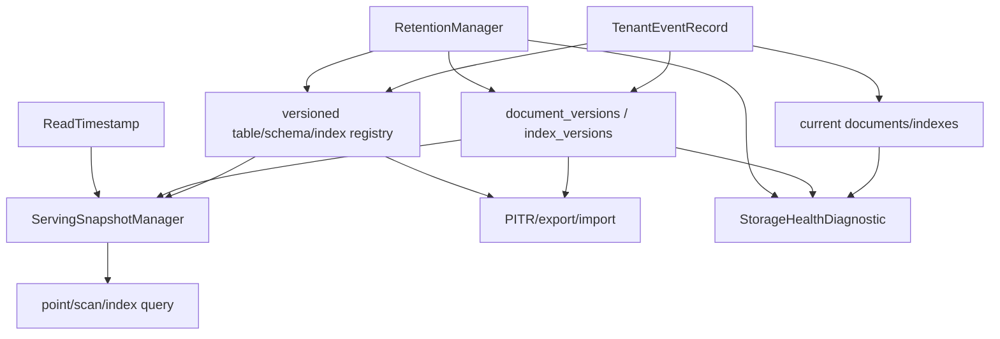

# Storage Engine Quality And MVCC Plan

This is the follow-on roadmap after
`docs/plans/storage-architecture-trust-hardening-plan.md`. Its purpose is to
raise Nimbus storage from a trustworthy latest-row reactive document store to a
storage engine with quality comparable to the codebases reviewed locally:
Convex for application-level MVCC and table/index identity, CockroachDB for
clear MVCC contracts and metamorphic testing, TigerBeetle for deterministic
checkpoint discipline, ElectricSQL for snapshot plus log protocols, and
ExtendDB for compatibility-facing proof.

## Status

- **Status:** `proposed-follow-on`
- **Activation gate:** do not start implementation until
  `bash scripts/verify-storage-architecture-trust-hardening.sh` passes.
- **Primary owner:** future active storage-engine quality plan
- **Verifier:** `bash scripts/verify-storage-engine-quality-and-mvcc.sh` to be
  added in `SEQ0`
- **Depends on:**
  - durable tenant event journal
  - retention floors and hard-delete gates
  - first-class read visibility APIs
  - storage capability and health diagnostics
  - generated cross-backend conformance harness

## Goal

Add the storage-engine features that make Nimbus worthy of deeper enterprise
database trust:

1. MVCC document and index retention with explicit read timestamps.
2. Repeatable historical point reads, scans, and indexed queries within a
   configured retention window.
3. Point-in-time restore and export/import built from the same MVCC and event
   journal primitives.
4. Versioned table, schema, and index lifecycle so historical reads can resolve
   the correct identity and query plan.
5. Safe retention compaction and garbage collection that only remove versions
   invisible to retained snapshots and consumers.
6. Model, metamorphic, crash/replay, and deterministic equivalence tests that
   make regressions hard to hide.

The plan should make Nimbus better by adopting the right ideas, not by copying
distributed database machinery wholesale.

## Non-Goals

- Do not add distributed consensus, range leasing, Raft, or Cockroach-style
  multi-node transaction coordination in this plan.
- Do not replace SQLite/Postgres/MySQL/libSQL with a custom storage engine
  unless benchmarks and requirements prove the current backend-owned layout
  cannot meet product goals.
- Do not expose MVCC internals through adapter protocols that do not have an
  equivalent concept.
- Do not implement arbitrary infinite history. Historical reads are bounded by
  explicit retention policy.
- Do not make MVCC a substitute for the tenant event journal. The event journal
  remains the ordered logical history; MVCC rows are a queryable retained state
  representation.

## Quality Bar

| Dimension | Enterprise-quality target |
| --- | --- |
| Semantics | Read timestamps, commit timestamps, visibility windows, retention floors, and GC rules are typed and documented. |
| Correctness | Randomized histories, crash/replay, snapshot restore, and cross-backend parity tests are part of the required gate. |
| Observability | Operators can inspect MVCC oldest retained timestamp, latest applied timestamp, GC lag, compaction progress, table/index version counts, and historical-query eligibility. |
| Performance | Latest reads stay fast through current-row/materialized caches; historical reads are measured separately and bounded. |
| Safety | Hard delete, compaction, and retention prune only data invisible to pinned readers and retained recovery points. |
| Portability | Backends own physical layout but must expose the same semantic contract. |

## Architecture Direction

## Candidate Physical Layout

The exact layout should be finalized in `SEQ1`, but the likely direction is:

| Backend | MVCC layout direction |
| --- | --- |
| SQLite | Keep `documents(table_id, id)` as current-row cache. Add `document_versions(table_id, id, commit_sequence, commit_time, tombstone, payload)` and versioned index tables keyed by `table_id`, `index_id`, indexed values, `commit_sequence`, and `document_id`. |
| Postgres | Same logical layout as SQLite, with backend-owned indexes and query plans for latest and historical reads. |
| MySQL | Same logical layout, with index-prefix limits and generated-column constraints handled as backend-owned details. |
| libSQL | Remote primary owns MVCC writes; local cache refresh proves freshness before serving historical queries. |
| redb | Keep current keyspaces as current-row cache. Add versioned key prefixes encoded by `table_id`, `doc_id`, and descending commit sequence for efficient latest-at-or-before reads. |

The plan should prefer `SequenceNumber` as the primary visibility coordinate
because it is backend-portable and already orders the tenant event log. Wall
clock `Timestamp` remains query metadata and product-facing time, but tests
must define how timestamp ties map to sequence visibility.

## Execution Plan

| Phase | Status | Goal | Verification |
| --- | --- | --- | --- |
| SEQ0 | `blocked-on-sath` | Create the follow-on proof bundle, debt rows, feature gates, and reusable verifier. Re-check Convex, CockroachDB, TigerBeetle, ElectricSQL, and ExtendDB source against the completed SATH baseline. | `seq0-design-refresh.md` records source references, activation evidence, and the chosen scope. |
| SEQ1 | `todo` | Define the MVCC semantic contract: `CommitSequence`, `CommitTimestamp`, `ReadTimestamp`, `RetentionFloor`, `HistoryWindow`, and historical eligibility errors. | Core tests prove ordering, timestamp tie handling, retention-window validation, and fail-closed behavior for unsupported backends or expired reads. |
| SEQ2 | `todo` | Design and implement versioned document storage beside the current-row cache. Current reads must remain on the fast path; historical reads use versions. | Document insert/update/delete histories can be read at multiple timestamps; latest path parity holds; storage diagnostics report version counts. |
| SEQ3 | `todo` | Add versioned index storage and historical index selection. Index lifecycle state must be resolved as of the read timestamp. | Historical indexed equality, prefix, range, and composite range queries match full-scan oracle results across retained timestamps. |
| SEQ4 | `todo` | Add versioned table/schema/index registry snapshots. Historical reads must resolve table identity, schema, and enabled indexes as of the read timestamp. | Rename/recreate/import/drop histories do not leak old rows into new table identities; historical reads use the correct schema/index set. |
| SEQ5 | `todo` | Build the `ServingSnapshotManager` as a real versioned read boundary. Use copy-on-write or immutable snapshot metadata where it simplifies pinned reads. | Concurrent transaction sessions pin begin snapshots; writes advance latest state without mutating pinned historical read views. |
| SEQ6 | `todo` | Add OCC/read-set conflict detection where product semantics require serializable or repeatable write transactions. Keep the API scoped to adapters that need it. | Conflicting read/write histories are rejected; non-overlapping histories commit; dependency and subscription semantics remain correct. |
| SEQ7 | `todo` | Implement retention compaction and GC. Versions and metadata may be removed only when older than the configured history window and invisible to all pins. | GC denies unsafe prune, succeeds after pins release, preserves PITR boundaries, and reports lag/progress in diagnostics. |
| SEQ8 | `todo` | Add PITR/export/import on top of MVCC plus tenant event log. This should support restore-to-sequence and restore-to-timestamp within retention. | Restored tenants match historical snapshot fingerprints; expired restore points fail clearly; import/export preserves table/index identities. |
| SEQ9 | `todo` | Add changefeed/CDC surfaces backed by the event journal and MVCC retention. Consumers must use typed cursors and explicit retention errors. | Cursor resume, retention-floor errors, table lifecycle events, schema/index changes, and document changes are tested. |
| SEQ10 | `todo` | Expand generated/metamorphic conformance to MVCC. Random histories should include historical reads, GC, PITR, lifecycle churn, index backfill, crash points, and replica refresh. | Required and nightly seed corpora run against model oracles; failed seeds emit reproducible commands. |
| SEQ11 | `todo` | Add deterministic checkpoint and parity checks inspired by TigerBeetle. Compare canonical snapshot digests across rebuild paths and backends, not byte-for-byte backend files. | Equivalent histories produce identical canonical digests for latest state, selected historical reads, PITR snapshots, and retained metadata. |
| SEQ12 | `todo` | Add operator diagnostics and knobs for MVCC retention, historical query admission, GC, compaction, table/index version counts, and storage pressure. | Diagnostics tests cover healthy, lagging, compacting, expired, and unsupported states. |
| SEQ13 | `todo` | Benchmark and profile latest-read, historical-read, write, compaction, and restore paths. Keep latest-path regressions within an explicit budget. | Bench reports are recorded; latest read/write budgets remain within agreed thresholds or the phase fails. |
| SEQ14 | `todo` | Close the plan with docs, cleanup, and final verification. Remove stale latest-row-only assumptions from docs and tests. | `bash scripts/verify-storage-engine-quality-and-mvcc.sh`, focused Rust tests, external provider tests, docs validation, `cargo fmt --all --check`, and `git diff --check` pass with recorded counts. |

## Completion Gate

The plan is complete only when:

1. The SATH verifier passes before SEQ implementation starts.
2. MVCC semantics are typed, documented, and tested in `nimbus-core`.
3. Latest-row current-state reads remain correct and measured.
4. Historical point reads, scans, and indexed queries work within retention.
5. Table, schema, and index identity resolve correctly as of historical reads.
6. Retention GC is safe relative to pinned snapshots, transaction sessions,
   consumers, replicas, materializers, and PITR points.
7. PITR/export/import restores exact canonical historical snapshots.
8. CDC/changefeed cursors use explicit retention errors and include metadata
   lifecycle events.
9. Generated MVCC conformance passes required seeds across embedded backends
   and provider-aware seeds across external backends.
10. Deterministic canonical digest checks cover latest state, historical state,
    and rebuild paths.
11. Operator diagnostics expose MVCC health, retention lag, GC progress, and
    historical-query eligibility.
12. Final docs clearly distinguish latest-row serving, MVCC historical reads,
    PITR, retention, and unsupported distributed-storage features.

## Proof Bundle

`docs/plans/proof/storage-engine-quality-and-mvcc/`:

- `seq0-design-refresh.md` - source-backed design refresh after SATH.
- `seq1-mvcc-semantics.md` - timestamp/sequence/retention contract.
- `seq2-versioned-documents.md` - document version storage proof.
- `seq3-versioned-indexes.md` - historical index proof.
- `seq4-versioned-registries.md` - table/schema/index registry proof.
- `seq5-serving-snapshot-manager.md` - pinned snapshot proof.
- `seq6-occ-conflict-detection.md` - transaction conflict proof.
- `seq7-retention-gc.md` - retention and compaction proof.
- `seq8-pitr-export-import.md` - restore and export proof.
- `seq9-cdc-changefeed.md` - cursor and event stream proof.
- `seq10-metamorphic-mvcc.md` - generated test proof.
- `seq11-deterministic-parity.md` - canonical digest proof.
- `seq12-diagnostics-knobs.md` - operator diagnostic proof.
- `seq13-performance.md` - benchmark and regression evidence.
- `seq14-closeout.md` - final verification and cleanup log.

## Activation Checklist

Before promoting this from `proposed-follow-on` to active execution, confirm:

1. SATH has landed the durable tenant event journal and retention floor.
2. A product requirement exists for historical reads, PITR, CDC retention, or
   serializable write transactions.
3. Backend owners agree on the first supported backend set. It may be valid to
   start with SQLite and redb, then graduate external providers once the
   semantic contract is proven.
4. Performance budgets are explicit for latest reads and writes so MVCC does
   not silently slow the common path.
5. The plan has a verifier script and a `/goal` entry with measurable success
   criteria.
