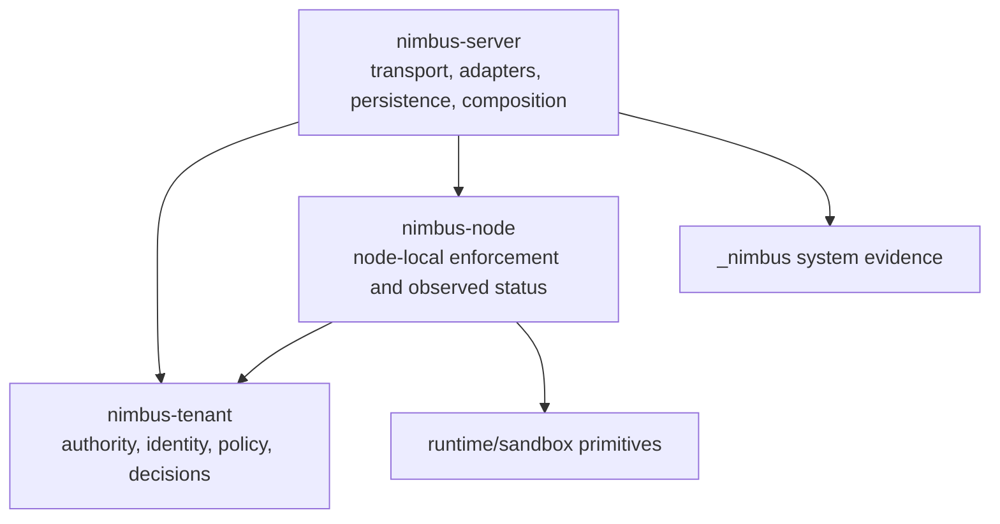
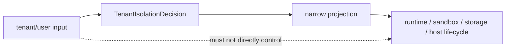
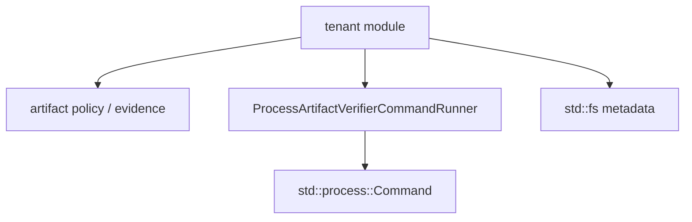
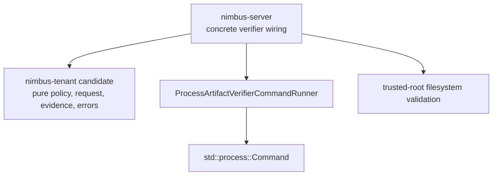
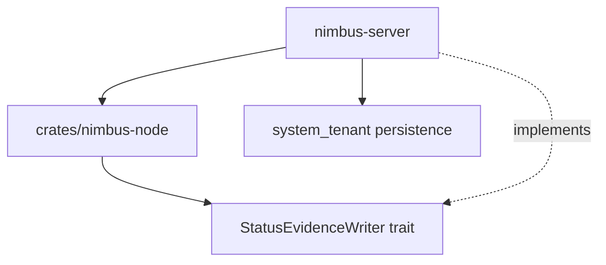

# Plan: Tenant And Node Crate Extraction Readiness

Plan for finishing the crate extraction work that
`docs/plans/tenant-domain-and-node-enforcement-boundary-plan.md` intentionally
deferred. This is an extraction-readiness plan, not a decorative crate split.
The goal is to remove the remaining false boundaries first, then extract
`nimbus-tenant` and `nimbus-node` only when the ownership is true.

## Status

- **Status:** `active`
- **Activation precondition:** the tenant-domain and node-enforcement boundary
  plan is complete through TSB14, with closeout proof at
  `docs/plans/proof/tenant-domain-and-node-enforcement-boundary/completion-audit.md`.
- **Primary goal:** split host effects out of the tenant domain, extract a pure
  `nimbus-tenant`, add a real node-local host-lifecycle reconciler, and then
  extract `nimbus-node`.
- **Security goal:** preserve tenant separation while making crate names match
  real authority boundaries. Tenant authority decides what is allowed; node
  enforcement applies admitted work on a machine and reports observed status;
  server code wires transports, adapters, persistence, and host-effect
  implementations.
- **Non-goal:** extracting crates before the dependency proof is clean.

## Current Baseline

The previous plan closed with three important facts:

- `crates/nimbus-server/src/tenant/` is mostly tenant-domain shaped, but
  artifact provenance still contains host effects:
  `ProcessArtifactVerifierCommandRunner`, `std::process::{Command, Stdio}`,
  and trusted-root filesystem validation. A pure tenant crate must not own
  process launch or host filesystem probing.
- `crates/nimbus-server/src/local_enforcement.rs` has real production consumers
  for admitted bindings and narrow projections in runtime host, Convex
  HostBridge, sandbox service-manager, and system-tenant evidence projection.
  However, no production node/control-plane reconciler currently calls
  `HostLifecycleBackend::validate`, `start`, `stop`, or `inspect`; those calls
  are test-only.
- Neither `crates/nimbus-tenant` nor `crates/nimbus-node` exists. That is the
  correct current posture: the crate split is not earned until host effects and
  real node ownership are addressed.

Target architecture:



The architecture is trustworthy only if lower layers receive admitted authority
or narrow projections:



## First-Principles Scope Filter

Before borrowing from example repos or adding abstractions, apply this filter:

- Does the change make tenant authority, node-local enforcement, or server
  wiring more explicit?
- Does it reduce the ability for raw tenant values to become host authority,
  credentials, storage namespace, process arguments, unit names, metrics labels,
  or `_nimbus` writes?
- Does it remove a real dependency blocker, or only move code into a nicer file
  tree?
- Can a reviewer answer "who decides?" and "who executes host effects?" without
  reading server transport or adapter code?
- Does the proof include a current dependency audit and behavior tests, not just
  a plausible ownership story?

If the answer is no, do not add the abstraction to this plan.

## Desired Ownership

### Tenant Domain

`nimbus-tenant` owns pure authority and evidence:

- tenant identity and workload identity
- `TenantIsolationContext`, `TenantIsolationDecision`, and decision IDs
- policy input, authority decisions, quotas, typed targets, and redaction
- storage, service, network, volume, image, secret, credential, and audit
  projections
- pure artifact verification contracts: request, policy, subject, evidence,
  error, backend traits, and redaction shapes

`nimbus-tenant` must not own:

- server transport or adapters
- `_nimbus` persistence implementation
- concrete storage providers
- process launching or filesystem probing
- host lifecycle implementations
- runtime executor implementations
- node/control-plane reconciliation internals

### Artifact Verifier Effects

Current shape:



Target shape:



### Node Domain

`nimbus-node` owns node-local enforcement and observed status:

- `LocalEnforcementBinding`
- `TenantWorkloadSpec`, `TenantWorkloadStatus`, and conditions
- node status authorization
- credential projection authorization
- host lifecycle abstractions
- direct-process backend
- systemd transient backend
- node reconciler core
- writer traits for observed status and evidence

`nimbus-node` must not own:

- HTTP/router/server transport
- Convex, Firebase, MongoDB, or Cloud Functions adapters
- concrete storage providers
- `_nimbus` persistence implementation
- control-plane replication internals

Persistence remains inverted:



## Control-Plane Protocol

- Keep at most one execution-plan row `in_progress`.
- Store phase proof notes under
  `docs/plans/proof/tenant-node-extraction-readiness/`.
- Every proof note must record: phase ID, git base, files touched,
  requirement IDs touched, behavior changed, tests added or updated, exact
  verification commands, result counts/output summaries, remaining risks, and
  the next resumable action.
- A phase may be marked `done` only when its execution-plan verification and
  all touched requirement IDs in the matrix below have concrete evidence.
- If a phase is blocked, keep the row `in_progress`, record the blocker in the
  proof note, and name the smallest user or external input needed to resume.
- Before any likely context loss, update this plan row status, update or add the
  phase proof note, and run at least `git diff --check` plus
  `npm run docs:validate-refs:strict` for touched Markdown.

## Requirement Verification Matrix

| ID | Requirement | Applies To | Required Evidence |
| --- | --- | --- | --- |
| REQ-EFFECTS | Tenant-domain production code contains no process launch, shell command execution, trusted-root filesystem probing, host lifecycle, server transport, adapter, or persistence side effects. | TNE0-TNE2 | Dependency audit proves no `std::process`, `Command::new`, `std::fs`, concrete verifier process runner, host lifecycle implementation, server transport, adapter, or storage-provider dependency in `nimbus-tenant` candidate production files. Tests prove verifier behavior still fails closed after effects move. |
| REQ-VERIFIER | Artifact verification host effects are server/operator-owned and injected into pure tenant contracts. | TNE1-TNE2 | Tests cover cosign, SLSA, SBOM, offline-root validation, redaction, missing tool, timeout, malformed output, unsigned/wrong-digest/wrong-builder failures, and no default process runner in tenant-domain constructors. |
| REQ-TENANT-CRATE | `nimbus-tenant` owns pure authority, identity, policy, admission, quota, typed capabilities, projections, and evidence only. | TNE2 | `cargo tree`, `rg`, and workspace manifest audits prove `nimbus-tenant` depends only on approved crates such as `nimbus-core`, `nimbus-runtime`, `nimbus-sandbox`, `serde`, and pure utility crates. No server, adapter, storage-provider, process-launch, host-lifecycle, runtime-executor, or system-tenant persistence dependencies. |
| REQ-ADMIT | Lower layers cannot reconstruct authority; they consume `TenantIsolationDecision` or narrow projections from `nimbus-tenant`. | TNE1-TNE5 | Focused runtime, sandbox service, HostBridge, storage/API, host lifecycle, egress, credential, and system evidence tests prove admission-derived bindings remain required. |
| REQ-RAW | Tenant-controlled values never become raw host authority, paths, process args, unit text, cgroups, provider namespaces, credentials, logs, or metrics labels. | TNE1-TNE5 | Property/golden tests cover sanitization, hashing, allowlists, redaction, denied pass-through fields, and no high-cardinality host IDs in metric labels. |
| REQ-SYSTEM | `_nimbus` remains server/system/operator-owned; node code writes observed status only through narrow writer traits. | TNE3-TNE5 | Tests prove application principals and tenant runtime code cannot read/write `_nimbus`; node reconciler cannot own storage provider or mutate system records outside a server-implemented writer trait. |
| REQ-STATUS | Node-local status, leases, heartbeats, lifecycle evidence, and cleanup evidence are observed-only and node-scoped. | TNE3-TNE5 | Tests prove assigned-node, workload UID, observed generation, decision ID, desired-generation drift, stale status, and denied spec/policy/grant/quota/placement/credential mutation. |
| REQ-CREDS | Credential projection remains workload, audience, node, invocation, and generation scoped. | TNE3-TNE5 | Tests prove missing grant, wrong audience, wrong node, stale generation, wrong invocation, subject echo-back, and missing redaction metadata fail closed after extraction. |
| REQ-HOST | A real production node reconciler drives `HostLifecycleBackend` through typed requests and normalized observed status. | TNE3-TNE4 | Production code calls `validate`, `start`, `stop`, and `inspect`; tests cover direct-process and systemd transient backends, unavailable features, property allowlists, trusted `ExecStart`, cgroup/journal evidence, and stop/inspect mapping. |
| REQ-TRUST | Runtime, sandbox, isolate group, and worker reuse remains monotonic in trust. | TNE3-TNE5 | Unit/property tests prove no downgrade reuse across trust classes, elevated host capabilities, broader credential material, or multi-tenant contamination bits after extraction. |
| REQ-NODE-CRATE | `nimbus-node` owns node-local enforcement but not server transport, adapters, concrete storage providers, `_nimbus` persistence, or control-plane replication internals. | TNE4-TNE5 | Dependency audit proves `nimbus-node` depends on `nimbus-tenant`, `nimbus-core`, `nimbus-runtime`, `nimbus-sandbox`, and pure utility crates only; status persistence is inverted through a trait implemented by `nimbus-server`. |
| REQ-DOCS | Docs, plan state, proof notes, and verifier scripts stay consistent with implementation. | All phases | `npm run docs:validate-refs:strict` passes; proof notes name exact commands, test counts, dependency audit output, remaining risks, and next resumable phase. |

## Execution Plan

| Phase | Status | Goal | Verification |
| --- | --- | --- | --- |
| TNE0 | `done` | Refresh the extraction baseline against the current tree. Classify tenant-domain and local-enforcement symbols as pure tenant contract, verifier effect, server wiring, node enforcement, system persistence, adapter shim, or runtime/sandbox primitive. Include all host effects, not only process launch. | Proof note records current `rg`/`cargo tree`/caller inventories for `tenant`, `local_enforcement`, artifact verifiers, host lifecycle, `_nimbus` writers, and crate manifests. It identifies every blocker before code moves. |
| TNE1 | `done` | Split artifact verifier host effects out of the tenant domain. Move `ProcessArtifactVerifierCommandRunner`, default CLI verifier wiring, trusted-root filesystem validation, and any other concrete host-effect runner into server/operator wiring. Keep pure artifact contracts in the tenant candidate. | Dependency audit proves tenant-domain production files contain no `std::process`, `Command::new`, `Stdio`, `std::fs` trusted-root probing, or default process runner. Artifact verifier tests still cover cosign/SLSA/SBOM success, failure, redaction, timeout, missing tool, malformed output, offline root, wrong digest, wrong issuer/subject, wrong builder, and SBOM-required behavior. |
| TNE2 | `done` | Extract `crates/nimbus-tenant` with only pure tenant authority code. Keep `nimbus-server` re-exports intentional and grouped. Break APIs cleanly rather than adding compatibility shims. | `cargo check --workspace`, focused tenant tests, artifact verifier tests, docs validation, and dependency audits pass. `nimbus-tenant` has no server/adapters/axum/tokio storage-provider/process-launch/host-lifecycle/runtime-executor/system-tenant-persistence dependencies. Tenant separation conformance remains behaviorally unchanged. |
| TNE3 | `done` | Add a real production `NodeWorkloadReconciler` that consumes desired `TenantWorkloadSpec`, drives `HostLifecycleBackend::validate/start/stop/inspect`, normalizes observed `TenantWorkloadStatus`, and writes evidence through a narrow `StatusEvidenceWriter` trait implemented by server wiring. | Tests prove direct-process and systemd transient reconciliation paths call host lifecycle backends, status writes are observed-only, `_nimbus` writes stay server/system-owned, stale generation cannot authorize access, and the reconciler cannot mutate spec, policy, grants, quota, placement, deletion authority, or credentials. |
| TNE4 | `in_progress` | Extract `crates/nimbus-node` only after TNE3 gives host lifecycle real production callers. Move node-local enforcement, host lifecycle abstractions/backends, credential/status authorization, and reconciler core into the crate. Keep server transport, adapters, storage providers, `_nimbus` persistence, and control-plane replication out. | Workspace check, focused local-enforcement/node/system-tenant tests, dependency audits, docs validation, and crate invariant checks pass. `nimbus-node` depends on `nimbus-tenant` and primitives, not `nimbus-server`; server implements writer traits. |
| TNE5 | `todo` | Add a closeout verifier and docs audit for the extracted architecture. Prefer a script such as `scripts/verify-tenant-node-extraction-readiness.sh` that checks forbidden dependencies, required crate members, and focused security tests. | Verifier script passes; final proof note maps every requirement ID to tests/audits; `git diff --check`, `npm run docs:validate-refs:strict`, `cargo check --workspace`, focused security tests, and relevant clippy lanes pass. |

## Extraction Decision Rules

Do not extract `nimbus-tenant` if any candidate production file still:

- launches a process or shells out
- probes host filesystem state as authority
- imports server transport, adapters, concrete storage providers, host lifecycle
  implementations, runtime executors, or system-tenant persistence
- defaults to concrete command runners from pure tenant constructors
- accepts raw tenant-controlled paths, commands, or credential subjects as
  authority

Do not extract `nimbus-node` if:

- no production reconciler calls `HostLifecycleBackend::validate`, `start`,
  `stop`, and `inspect`
- status persistence requires importing `nimbus-server` or concrete storage
  providers
- `_nimbus` writes are not inverted through a server-implemented trait
- node-local status can mutate desired spec, policy, grants, quota, placement,
  deletion authority, or credentials
- the `nimbus-tenant` crate boundary is not already clean

## Completion Gate

This plan is complete when:

- artifact verifier process execution and filesystem trusted-root validation are
  server/operator effects, not tenant-domain effects
- `crates/nimbus-tenant` exists and contains only pure tenant authority,
  identity, policy, decision, quota, projection, and evidence code
- `nimbus-server` intentionally re-exports tenant symbols needed by embedders
  without copy-forwarding parallel logic
- tenant isolation conformance still proves runtime, sandbox services,
  HostBridge, storage/API, `_nimbus`, cleanup, and system-control boundaries
- a production `NodeWorkloadReconciler` drives both direct-process and systemd
  transient host lifecycle paths through typed requests
- node status and evidence writes remain observed-only, node-scoped, and
  generation/decision bound
- `_nimbus` persistence remains server/system/operator-owned and is accessed
  from node code only through narrow writer traits
- `crates/nimbus-node` exists and contains node-local enforcement and
  host-lifecycle core without server transport, adapters, storage providers, or
  control-plane replication internals
- credential projection remains workload/audience/node/invocation/generation
  scoped with redaction metadata required
- runtime/sandbox/pool reuse remains monotonic in trust
- final dependency audits prove both crates respect the forbidden dependency
  lists
- proof notes under `docs/plans/proof/tenant-node-extraction-readiness/` cover
  TNE0 through TNE5 with requirement IDs, exact commands, counts, risks, and
  next actions
- `git diff --check`, `npm run docs:validate-refs:strict`,
  `cargo check --workspace`, focused security tests, and relevant clippy lanes
  pass

## Suggested Goal Prompt

```text
/goal Complete docs/plans/tenant-and-node-crate-extraction-readiness-plan.md from the current tenant-boundary closeout. Treat the plan as the durable control plane. Run TNE0 through TNE5 in order, keep at most one row in_progress, and update the plan plus docs/plans/proof/tenant-node-extraction-readiness/ proof notes before handoff or context loss. Preserve tenant separation above all. First split artifact verifier host effects out of tenant-domain code: process execution, default CLI verifier wiring, trusted-root filesystem probing, and any concrete host-effect runner must be server/operator-owned and injected into pure tenant contracts. Extract nimbus-tenant only after dependency audits prove it owns pure tenant authority, identity, policy, decisions, quotas, projections, and evidence with no server transport, adapter, storage-provider, process-launch, host-lifecycle, runtime-executor, or system-tenant persistence dependencies. Then add a real NodeWorkloadReconciler that drives HostLifecycleBackend validate/start/stop/inspect and writes observed-only status through a server-implemented StatusEvidenceWriter trait. Extract nimbus-node only after that real caller exists and dependency audits prove it owns node-local enforcement without server transport, adapters, concrete storage providers, _nimbus persistence, or control-plane replication internals. For every touched requirement ID, record exact tests, command output counts, dependency audit results, remaining risks, and next action. Required final evidence includes tenant isolation conformance, artifact verifier tests, local enforcement/node reconciler tests, system tenant tests, cargo check --workspace, relevant clippy lanes, git diff --check, and npm run docs:validate-refs:strict.
```
