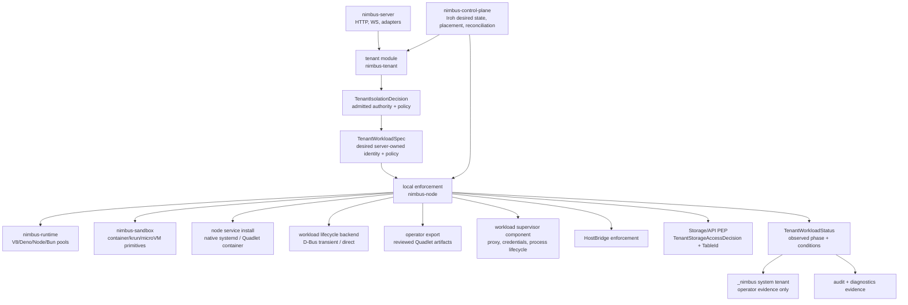

# Plan: Tenant Domain And Node Enforcement Boundary

Plan for adopting OpenShell-style naming and Kubernetes-style node boundaries
while preserving tenant separation as a first-class security contract.

## Status

- **Status:** `proposed; activation precondition met`
- **Activation precondition:** repo architecture quality hardening is archived at
  `docs/plans/archive/repo-architecture-quality-hardening-plan.md`. Start from
  the current tenant-isolation, storage-trust, and container-image baselines
  below rather than from the pre-RAQ module shape.
- **Primary goal:** rename and prepare the tenant/admission domain around
  `nimbus-tenant` while defining the node-local enforcement seam that becomes
  `nimbus-node`.
- **Security goal:** make it impossible for tenant-controlled intent to cross
  tenant, storage, runtime, sandbox, HostBridge, host-lifecycle, credential, or
  system-tenant boundaries without an admitted `TenantIsolationDecision` or a
  narrow decision-derived projection.
- **Current posture references:** `docs/tenant-isolation.md`,
  `docs/operating/tenant-isolation.md`,
  `docs/architecture/server/local-enforcement-boundary.md`,
  `docs/architecture/server/auth-runtime-trust.md`,
  `docs/architecture/storage/table-identity.md`,
  `docs/operating/multi-backend-adapter-hardening.md`, and
  `docs/operating/container-image.md`.
- **Reference:** `~/src/github.com/NVIDIA/OpenShell/docs/about/how-it-works.mdx`,
  `~/src/github.com/NVIDIA/OpenShell/architecture/sandbox.md`, and
  `~/src/github.com/NVIDIA/OpenShell/architecture/security-policy.md`
- **Lifecycle references:** `podman-systemd.unit(5)`, `containers/podlet`,
  `systemd-run(1)`, `org.freedesktop.systemd1(5)`,
  `~/src/github.com/nimbus/machine-os`, OpenShell's Debian/RPM/Snap service
  packaging, and `docs/architecture/horizontal-scaling.md`
- **Comparative source references:** local checkouts of Kubernetes,
  CockroachDB, Convex backend, Cloudflare workerd, Podman, and OpenShell under
  `~/src/github.com/*`. These are used as architecture exemplars, not product
  dependencies.

## Current Baseline

The plan must be executed against the current tree, not the older all-in-one
module assumption:

- `crates/nimbus-server/src/tenant.rs` is now the thin re-export root for the
  tenant domain. Tenant-isolation implementation lives in concept-owned
  children under `crates/nimbus-server/src/tenant/`, such as
  `context.rs`, `decision.rs`, `identity.rs`, `policy_input.rs`,
  `runtime_admission.rs`, `audit_events.rs`, `evidence.rs`,
  `artifact_provenance/`, and `operator_policy/`.
- `TenantWorkloadStableIdentity` already exists and is derived from
  `TenantIsolationDecision`. Future node/local-enforcement work must reuse this
  admitted identity projection instead of inventing a parallel workload ID.
- `crates/nimbus-server/src/system_tenant/` owns `_nimbus` system records and
  operator evidence. It is not customer tenant data and must not become
  application-readable through a broad tenant-domain rename.
- Stable storage table identity has landed. Public adapters still speak
  `TableName`, while storage resolves active tables to `TableId` and durable
  records carry table identity. Tenant work must not weaken this by treating
  table names, document IDs, or external backend physical names as isolation
  proof by themselves.
- The default Nimbus OCI image contract has landed in
  `docs/operating/container-image.md`: foreground `nimbus`, UID/GID
  `10001:10001`, `/var/lib/nimbus` state, `/health`, no systemd-in-container,
  and release SBOM/provenance/vulnerability evidence.

## Decision Summary

Use broad, product-domain names for modules and crates, while keeping precise
security terminology in type names.

```text
Current server module:
  tenant

Former server module:
  tenant_isolation

Target tenant crate:
  nimbus-tenant

Keep explicit type names where they mark the security boundary:
  TenantIsolationContext
  TenantIsolationDecision
  TenantIsolationMode
```

Do not put an OpenShell-like supervisor inside `nimbus-tenant`. The tenant
domain answers what is admitted and under which authority. The node-local
enforcement seam answers how an admitted workload is locally enforced and run.
When a workload needs a process-local supervisor, that supervisor is a component
managed by the node-local seam, not the tenant domain itself.

Host lifecycle is part of `local_enforcement` / `nimbus-node`, not tenant
admission and not `nimbus-sandbox`. Dynamic tenant workloads use a typed
`SystemdTransientUnitBackend` on Linux through systemd D-Bus transient service
units. `systemd-run` remains a diagnostic/proof command, not the product
integration surface. Nimbus node lifecycle uses service-manager installation
artifacts: native systemd units for the native binary and `machine-os`, and
Quadlet only when Nimbus itself is distributed as a Podman-managed OCI image.
Quadlet export for tenant applications is an explicit operator workflow; it is
not the canonical lowering target for dynamic tenant workloads.

### Research Delta

The pre-research recommendation was directionally right:

- `SystemdTransientUnitBackend` for dynamic tenant microVMs.
- native systemd units for the native Nimbus node binary and `machine-os`.
- Quadlet only for containerized Nimbus node installs and explicit operator
  exports.
- `DirectProcessBackend` for dev/test or non-systemd platforms.
- Normalize all backend states into `TenantWorkloadStatus` and
  `TenantWorkloadCondition`.
- Never let tenant input provide raw unit text, raw `ExecStart`, arbitrary
  systemd properties, or arbitrary Quadlet fields.
- Use tenant/sandbox-scoped unit names, cgroups, logs, and evidence.

The research tightened that into execution decisions:

- `SystemdTransientUnitBackend` should call systemd over D-Bus
  (`StartTransientUnit`, `StopUnit`, `GetUnit`, job/unit signals) instead of
  shelling out to `systemd-run`. This gives Nimbus typed properties, structured
  errors, status inspection, and a narrow allowlist.
- Use `TransientUnit` rather than `DynamicUnit` in internal type names because
  systemd's own D-Bus API is `StartTransientUnit` and systemd describes these
  runtime-created service/scope/slice units as transient units. Operator prose
  can still describe tenant workloads as dynamic.
- Quadlet should be split into two concerns: static node service packaging and a
  human-reviewed export command. Static node service packaging itself splits
  again by distribution form: native `.service`/`.socket` units for the binary
  and `machine-os`, and `.container` Quadlet files only for an OCI-packaged
  Nimbus node. Quadlet should not be a live backend for dynamic tenant
  scheduling.
- The local `machine-os` repo already uses baked native units:
  `nimbus.socket`, `nimbus.service`, and `nimbus-machine-config.service`.
  That is the right default for a bootc appliance because the Nimbus binary is
  part of the OS image.
- OpenShell's local packaging follows the same pattern for its gateway:
  Debian/RPM install a systemd user service, and Snap declares a daemon. This is
  a stronger precedent for native CLI/server lifecycle than hidden Quadlet
  generation.
- Podman Quadlet remains the canonical Fedora/RHEL/Podman way to run a
  container image as a systemd-managed service. It is appropriate for
  `nimbus node install --container`, not for a normal native-binary install.
- The landed Nimbus OCI image contract in `docs/operating/container-image.md`
  is the source of truth for ordinary image behavior. The image runs Nimbus
  directly as the container entrypoint, not systemd inside the container. Host
  systemd owns the container lifecycle through Quadlet on Podman hosts;
  Kubernetes owns pod lifecycle through restart policy and probes.
- The standard Nimbus image has an unprivileged server posture suitable for
  Kubernetes, Compose, and ordinary Podman. If a containerized node daemon needs
  host D-Bus, cgroup, KVM, Podman, or workload-management access, that is a
  separate host-integrated mode with explicit mounts/devices/capabilities and
  fail-closed diagnostics; it must not be the default `docker run` story.
- `containers/podlet` is a reference and compatibility oracle for the export
  lane, not a product dependency in the hot path. Podlet is a binary tool, not a
  stable library API, and it explicitly warns that generated Quadlet files should
  be reviewed.
- `compose.yml` remains user intent. Nimbus admission remains the source of
  truth for tenant policy, identity, resources, provenance, storage, networking,
  and evidence.
- Firecracker remains a future `nimbus-sandbox` backend/proof lane for
  snapshot-oriented microVM Lambda-like workloads. It is not required for this
  host lifecycle plan; systemd only supervises the local launcher process and
  does not make VM boot itself fast.

The comparative review adds several enterprise-trust decisions that must stay
visible in the implementation:

- Kubernetes' `NodeRestriction` pattern requires an explicit node-status
  authorizer. A Nimbus node may update only observed status, heartbeats, and
  evidence for workloads assigned to that node and matching the decision,
  workload identity, and generation it was given. Status writes must not mutate
  spec, labels, policy, grants, placement, or desired state.
- Kubernetes' `observedGeneration`, finalizer, and quota patterns mean Nimbus
  status must be treated as stale evidence, not authority. Cleanup needs
  server-owned deletion/finalizer state, and quota needs desired hard limits
  separated from observed used/reserved accounting.
- CockroachDB's tenant-target and tenant-capability patterns mean broad
  `_nimbus` and all-tenant targets are host/operator-only. All-tenant
  aggregation targets are read-only unless an explicit system capability admits
  a narrow write path.
- Convex's namespace and table usage patterns reinforce that system metadata,
  user tables, virtual tables, and orphaned/deleting tables need distinct
  namespaces and accounting semantics. Ambient "current component" or "current
  tenant" context must not decide where system metadata queries run.
- workerd's V8 isolation patterns require runtime-pool trust monotonicity. Once
  a process or pool has hosted multiple tenants, elevated secrets, host
  capabilities, or a broader isolate group, it cannot be downgraded for a
  stricter tenant profile without teardown.
- Podman Quadlet's pass-through affordances require Nimbus-generated host
  artifacts to have a strict mode. Unsupported or pass-through fields should be
  warnings by default for human-reviewed exports and hard failures for runtime
  or node-install paths.

### First-Principles Scope Filter

Comparative patterns belong in this plan only when they protect one of Nimbus's
tenant-separation boundaries:

- admitted authority cannot be reconstructed by lower layers
- a compromised or confused node cannot promote observed status into desired
  state, credentials, policy, placement, or tenant authority
- credentials and host capabilities cannot be requested for the wrong tenant,
  workload UID, generation, node, audience, or runtime invocation
- tenant-authored intent cannot become host service-manager text, container
  runtime escape hatches, host paths, ports, provider namespaces, or system
  tenant writes
- runtime or sandbox reuse cannot carry prior tenant secrets, host
  capabilities, or broader trust assumptions into a stricter tenant profile
- stale status, orphaned resources, retained cleanup bytes, or drift evidence
  cannot be mistaken for active tenant authority

Everything else is reference material. This plan should not clone Kubernetes'
API machinery or garbage collector, CockroachDB's span-configuration system,
Convex's table-accounting internals, workerd's isolate-group implementation, or
Podman's Quadlet generator. Nimbus should carry forward the narrow invariant,
typed projection, and test gate that preserve tenant separation.

### OpenShell Primitive Mapping

Nimbus should use the same architectural primitives as OpenShell at the boundary
level, but with Nimbus-native authority objects:

| OpenShell primitive | Nimbus primitive | Responsibility |
| --- | --- | --- |
| Gateway control plane | `nimbus-server` now; `nimbus-control-plane` when distributed placement lands | Own durable state, authenticated API access, policy/config delivery, provider records, lifecycle intent, and authorization history. |
| Policy/settings bundle | `TenantIsolationDecision` plus narrow projections such as storage, service, credential, egress, and host-lifecycle decisions | Decide what is admitted. This is the source of execution authority. |
| Sandbox supervisor | Workload-local `supervisor` component managed by `local_enforcement` / `nimbus-node` when a backend needs process-local enforcement | Starts before tenant code, applies local static controls, launches the restricted child, runs local proxy/credential hooks, and approves or denies local operations against the admitted policy projection. |
| Policy proxy | Nimbus sandbox/runtime egress and HostBridge enforcement points | Deny network, HostBridge, credential rewrite, connect/exec, and similar runtime requests that do not match the active admitted projection. |

The supervisor is a policy enforcement point, not a policy decision point. It
may deny execution or per-operation requests when local facts do not match the
active admitted decision, but it must not grant new authority, broaden policy,
change placement, mint credentials, or infer tenant access from raw request
metadata. The server-side tenant admission path remains the place where
execution is approved.

## Comparative Pattern Review

This plan was checked against the following local GitHub exemplars before
activation:

| Source | Applicable pattern | Nimbus decision |
| --- | --- | --- |
| `~/src/github.com/NVIDIA/OpenShell/docs/about/how-it-works.mdx`, `architecture/sandbox.md`, `architecture/security-policy.md` | Gateway/control-plane authority is separate from sandbox-local enforcement; the supervisor applies static controls, hot-reloads only dynamic policy, strips caller credentials, and keeps last-known-good config. | Keep `tenant` as admission truth, `local_enforcement` as the node-local coordinator, and workload supervisors as process-local enforcement components. Invalid live updates fail closed and keep the previous policy. |
| `~/src/github.com/kubernetes/kubernetes/plugin/pkg/admission/noderestriction/admission.go` | Node callers are first identified as a concrete node, then limited to narrow resources and subresources. Pod status writes are allowed only for pods bound to that node; labels and resource claims cannot be changed through status. Node leases are system-namespace and node-name bound. | Add a Nimbus `NodeStatusAuthorizer`/status PEP: node agents can write only observed status, node lease/heartbeat, and evidence for assigned workloads. Status cannot become desired state, admission, placement, labels, policy, or grants. |
| `~/src/github.com/kubernetes/kubernetes/plugin/pkg/admission/noderestriction/admission.go` | Node-issued service account tokens must be bound to a pod UID scheduled on the same node, with optional audience checks. | Credential projection must bind to workload UID/generation plus assigned node when a node requests or refreshes credentials. Audience/provider scope is mandatory. |
| `~/src/github.com/kubernetes/kubernetes/staging/src/k8s.io/api/core/v1/types.go` and `staging/src/k8s.io/apimachinery/pkg/apis/meta/v1/types.go` | Status may trail reality, carries `observedGeneration`, conditions merge by type, deletion timestamps are server-owned, finalizers block deletion until removed, and owner references key by UID. | `TenantWorkloadStatus` carries `observed_generation`; conditions are keyed by type; deletion/cleanup uses server-owned deletion state and unordered finalizer-like records keyed by workload UID/generation. |
| `~/src/github.com/kubernetes/kubernetes/staging/src/k8s.io/api/core/v1/types.go` | Quota status separates enforced `Hard` limits from observed `Used` values. | Tenant resource policy separates admitted hard limits/reservations from observed usage. Usage evidence cannot grant capacity. |
| `~/src/github.com/cockroachdb/cockroach/pkg/spanconfig/systemtarget.go` and `pkg/multitenant/tenantcapabilities/*` | Host/system tenants may target broad keyspaces; secondary tenants target only themselves. All-tenant targets are read-only. Sensitive tenant operations require typed capabilities and fail closed when unmapped or missing. Capability caches may be stale. | `_nimbus` broad/system targets are operator-only. All-tenant scans are read-only unless a narrow system capability admits the write. Capability checks are typed, deny-by-default, and cannot rely on cache freshness for tenant escape. |
| `~/src/github.com/get-convex/convex-backend/crates/storage/src/lib.rs`, `crates/database/src/table_usage.rs`, and `npm-packages/system-udfs/convex/_system/frontend/indexes.ts` | Storage cache keys are fully qualified for multi-tenant use; user/system/virtual/orphaned tables have distinct accounting; system UDFs avoid accidental component namespace execution. | Storage projections must use fully qualified tenant/table identities. System metadata reads must pass explicit namespace parameters and never rely on ambient component/tenant context. Orphaned/deleting resources need separate cleanup evidence and must not count as active tenant authority. |
| `~/src/github.com/cloudflare/workerd/docs/jsg.md` and `src/workerd/util/thread-scopes.h` | V8 isolates have independent heaps, isolate groups trade memory for boundary strength, and a process that becomes multi-tenant cannot go back because secrets may persist. workerd favors capability-based security. | Runtime pools need a trust classification and monotonic contamination rule: sharing or elevated capability exposure can only move a pool to an equal-or-broader trust class; stricter reuse requires teardown. |
| `~/src/github.com/containers/podman/docs/source/markdown/podman-systemd.unit.5.md` and `docs/source/markdown/options/*.md` | Quadlet is a generator that passes many systemd sections through; host networking is explicitly dangerous; `PodmanArgs=` is an escape hatch the generator cannot reason about. | Nimbus node install and dynamic runtime paths must use typed allowlists. Quadlet export may include warnings for human review, but runtime/node-install paths fail on unsupported pass-through fields. Generated artifacts carry provenance back to the admitted decision/plan. |

## Why

OpenShell keeps a clear split between the gateway control plane and the
sandbox-local supervisor. The gateway owns durable state and policy delivery;
the supervisor starts before user code, applies static controls, runs the
policy proxy, handles credentials, and enforces local sandbox behavior.

Kubernetes gives us the complementary node-local pattern: admission happens
before persistence, desired workload state is separate from observed workload
status, and a node agent reconciles local runtime/sandbox state while reporting
conditions. Nimbus should use both lessons. The tenant domain produces admitted
authority. `nimbus-node` applies it locally and reports evidence.

Nimbus should adapt the pattern without copying the product shape wholesale:

- keep single-binary simplicity
- use a broad `tenant` domain name instead of a narrow file/path name
- preserve explicit isolation/admission type names for auditability
- make the local enforcement boundary visible before horizontal scaling lands
- leave sandbox primitives in `nimbus-sandbox`
- leave runtime engine primitives in `nimbus-runtime`
- keep tenant admission separate from process/runtime/sandbox execution
- model desired workload state separately from observed local status
- use conditions and decision IDs as the operator-facing evidence contract

## Non-Negotiable Tenant-Separation Invariants

These invariants are the bar for enterprise trust. A coding agent working this
plan must preserve them before, during, and after every phase:

- Tenant-controlled values never directly become tenant authority, storage
  namespaces, backend physical identifiers, host paths, unit names, cgroups,
  network listeners, image references, secret handles, credentials, log
  selectors, or metrics labels.
- Every lower enforcement point consumes an admitted `TenantIsolationDecision`
  or a deliberately narrow projection such as `TenantStorageAccessDecision`,
  `TenantServiceAccessDecision`, or `TenantWorkloadStableIdentity`. Lower seams
  must not reconstruct authority from raw `TenantId`, bearer claims, route
  params, Compose fields, process metadata, gossip topics, or systemd unit
  names.
- Runtime invocation, HostBridge operations, sandbox launch, service lookup,
  egress enforcement, credential projection, node-local lifecycle, cleanup, and
  system-tenant evidence all require decision-derived bindings. No direct
  helper or test-only shortcut may become a production path around admission.
- The `_nimbus` system tenant remains operator/system-owned evidence and
  control data. Application principals and tenant runtime code must not read or
  write it through ordinary tenant APIs.
- Storage isolation is tenant-scoped and table-identity-scoped. External
  provider namespaces and SQL identifiers must use backend-owned allowlisted
  helpers; public `TableName` and Convex-compatible document IDs are adapter
  protocol shapes, not storage isolation proofs.
- Broad tenant targets are system/operator-only. Any all-tenant or
  cross-tenant read path must be explicitly modeled as a read-only system
  aggregation unless a narrow typed capability grants the specific write.
- Placement and observed status are not authorization. A workload rescheduled
  to another node/machine needs a decision whose fingerprint and audit
  projection account for that location; stable provider-auth subjects may stay
  placement-neutral only when placement remains a signed/audit claim.
- Node-local status, leases, and heartbeats are observed evidence only. A node
  can update them only for workloads assigned to itself and matching the
  admitted workload identity, generation, and decision projection. Status
  writers must not mutate desired state, labels, policy, grants, placement, or
  admission fields.
- Dynamic policy reload is allowed only when every affected host operation
  re-checks the active decision projection. Static controls such as filesystem,
  UID/GID, seccomp/capabilities, devices, microVM envelope, runtime backend, and
  host lifecycle plan require recreate.
- Runtime and sandbox reuse is monotonic in trust. A process, isolate group,
  runtime pool, sandbox, or node-local worker that has hosted multiple tenants,
  elevated host capabilities, or broader credential material cannot be reused
  for a stricter profile without full teardown and fresh admission.
- Audit, drift, diagnostics, and incidents must keep redaction guarantees.
  Decision IDs, invocation IDs, unit IDs, cgroup paths, and full workload IDs
  belong in structured evidence, not metrics labels or customer-visible error
  strings.

## Target Architecture



## Ownership Rules

### `tenant` / `nimbus-tenant`

Owns tenant control-plane truth:

- `TenantIsolationContext`
- tenant authority model
- workload identity
- policy input/admission inputs
- immutable isolation/admission decisions
- runtime admission decision metadata
- tenant quota/grant/evidence shapes
- audit-safe redaction metadata

It should not own:

- HTTP/WebSocket transport
- Convex/Firebase/Cloud Functions adapter contracts
- runtime pool execution
- sandbox process or microVM launch
- storage provider implementation
- machine commands
- Iroh networking or cluster membership

The current `tenant_isolation` root is already thin enough that this rename can
be a namespace/domain clarification rather than a second modularity wave. Keep
the concept-owned child files intact unless the inventory proves a specific
symbol belongs in local enforcement, sandbox, runtime, storage, adapter, or
transport ownership instead.

### Local Enforcement / `nimbus-node`

Owns the node-local enforcement binding:

- consume `TenantIsolationDecision`
- materialize a server-owned desired workload spec from admitted authority
- bind admitted decisions to runtime pools and sandbox launches
- apply local egress/resource/credential enforcement
- attach HostBridge capability checks
- authorize node-local status, lease, heartbeat, and evidence writes against
  assigned workload identity, generation, and node identity
- coordinate local lifecycle, health, teardown, and diagnostics
- manage workload-local supervisor components when a backend needs one
- emit observed status, conditions, audit, and system tenant evidence with
  stable decision correlation

The initial module name should be `crates/nimbus-server/src/local_enforcement/`.
The extracted crate name is `nimbus-node`. Use `supervisor` only for the
workload-local component that starts before tenant code and owns process-local
controls such as proxying, credential projection, and child lifecycle.

Extract `nimbus-node` only when the module is boring and the dependency graph is
clean.

The node-local status writer should deliberately mirror Kubernetes'
`NodeRestriction` shape. A node identity is first resolved to one concrete
Nimbus node, then allowed only narrow status/evidence subresources for workloads
whose desired spec binds them to that node. The status path cannot update
labels, desired policy, placement, quota, grants, storage authority, credentials,
or user-visible tenant data.

### System Tenant And Storage Boundaries

Tenant admission may define storage authority, but it must not own storage
implementation details:

- `TenantStoragePolicyDecision` and `TenantStorageAccessDecision` are authority
  projections. `nimbus-engine` and `nimbus-storage` remain responsible for
  transaction boundaries, tenant persistence selection, stable `TableId`
  resolution, durable journal/table identity records, and backend-specific
  physical layout.
- External provider namespaces must follow the SQL-safety ADRs and backend
  naming helpers. Do not use raw tenant strings as database/schema/table/index
  identifiers.
- Convex-compatible document IDs remain table-aware adapter values. They must
  resolve to `ResolvedDocumentId { table, document_id }` before storage
  dispatch so a same-name table replacement cannot inherit old data by
  accident.
- `_nimbus` system tenant writes are evidence/control-plane writes, not
  customer data writes. Local enforcement may emit evidence there only through a
  server-owned system/operator path with the original decision ID and redaction
  metadata.
- `_nimbus` all-tenant scans are read-only aggregations unless the caller has a
  narrow typed system capability for the exact write or repair operation. A
  customer tenant can never self-target another tenant or the entire keyspace.
- System metadata queries must name their target namespace explicitly. Do not
  let ambient adapter/component/tenant context decide whether a query runs
  against user, system, virtual, or orphaned/deleting table metadata.
- Orphaned or deleting tenant resources are cleanup evidence, not active
  authority. They should be visible to operator repair paths and excluded from
  active tenant usage/grant calculations unless a cleanup phase intentionally
  accounts for retained bytes.
- Drift scanners stay read-only. Any cleanup or repair must use normal Nimbus
  lifecycle operations or exact tenant-owned roots after operator review.

### Node Service Installation

`local_enforcement` / `nimbus-node` needs a clear answer for the lifecycle of
Nimbus itself on a Linux node. Do not make the Nimbus binary self-daemonize. The
CLI should install, validate, start, stop, inspect, and remove service-manager
artifacts.

Use this installation matrix:

| Installation path | Canonical artifact | Product role |
| --- | --- | --- |
| `nimbus dev` | foreground process | Local development and demos. No systemd, no daemon install, no hidden background process. |
| native Linux package or binary install | `nimbus.service` plus optional `nimbus.socket` | Default node daemon path. Supports journald, restart policy, socket activation, hardening, and predictable operator commands. |
| `machine-os` bootc image | baked `nimbus.service`, `nimbus.socket`, machine config units | Appliance path. Units are part of the image and enabled by the image build. |
| containerized Nimbus node | `nimbus.container` Quadlet | Optional Podman/systemd path when the node daemon itself is distributed and upgraded as an OCI image. |
| non-systemd development or tests | foreground process or `DirectProcessBackend` harness | Deterministic local execution without assuming PID 1, D-Bus, Podman, conmon, or KVM. |

Implement this as an explicit CLI/operator surface:

```text
nimbus node install --systemd [--user|--system] [--enable] [--now] [--dry-run]
nimbus node install --container --image ghcr.io/nimbus/nimbus:<version> \
  [--user|--system] [--enable] [--now] [--dry-run]
nimbus node status
nimbus node logs [--follow]
nimbus node doctor
nimbus node uninstall [--systemd|--container] [--user|--system]
```

The exact command grouping may be adjusted to match the current CLI tree during
implementation, but the product contract is fixed: node setup is explicit,
auditable, reversible, and reports what it will install before it mutates the
host. Package managers and `machine-os` may install the same artifacts without
calling the CLI.

`NativeSystemdNodeService` must generate or package only Nimbus-owned unit
content:

- `ExecStart` points to a trusted Nimbus binary path and an allowed node command
- optional socket activation uses a matching `.socket` unit
- restart, working directory, state directory, logs, hardening, resource, and
  SELinux settings are generated from Nimbus-owned templates
- tenant-controlled values never become raw unit text, raw environment files,
  arbitrary `ExecStart`, or arbitrary systemd properties
- rendered artifacts include Nimbus template version, image or binary digest
  where available, source command, and a deterministic provenance hash for
  operator diffing
- `--dry-run` and tests produce stable rendered artifacts for review

`QuadletNodeService` must be limited to containerized Nimbus node installs:

- `Image` is a pinned or explicitly selected Nimbus node image
- the container runs a foreground Nimbus process as PID 1 through the image
  entrypoint; it does not run systemd inside the container
- generated `.container` files are installed only through explicit node-install
  commands, package hooks, or operator review
- it must not be used to lower dynamic tenant workloads from Compose
- it must support `--dry-run`, overwrite protection, system/user install
  locations, systemd reload behavior, and clear diagnostics when Podman,
  Quadlet, or cgroup v2 support is missing
- it must reject pass-through escape hatches such as arbitrary systemd
  sections, raw `PodmanArgs`, host networking, privileged mode, host mounts, or
  additional capabilities unless a host-integrated install mode explicitly owns
  and documents the exact field

### OCI Image Publication Contract

`docs/operating/container-image.md` is now the source of truth for the default
published image. This plan must preserve that contract while adding node-install
integration around it. The image is an application image first, not a bootable
OS image and not a nested service manager. It is usable under Kubernetes,
Compose, Docker, and Podman with ordinary container semantics:

- published by the tag-driven Nimbus release workflow as
  `ghcr.io/nimbus/nimbus:<version>`, with `nimbus_oci_image.txt` as the
  release digest report
- `ENTRYPOINT ["nimbus"]` and the foreground default command from the operating
  doc:
  `start --host 0.0.0.0 --allow-network --data-dir /var/lib/nimbus/data --control-data-dir /var/lib/nimbus/control`
- no systemd, OpenRC, supervisord, `systemd-run`, Podman, conmon, buildah,
  crun, or KVM dependency in the default image
- non-root UID/GID `10001:10001`, `/var/lib/nimbus` writable state, HTTP port
  `8080`, and stdout/stderr logging
- `/health` documented for container liveness/readiness checks
- multi-architecture Linux manifest, versioned tags, immutable digest examples,
  OCI annotations, `nimbus_oci_attestation.json`, `nimbus_oci_sbom.json`,
  and `nimbus_oci_vulns.sarif.json`
- rootless-compatible runtime behavior where the selected persistence and
  networking mode allows it

If Nimbus publishes a host-integrated node image that can manage tenant
workloads from inside a container, it must be an explicit variant or explicit
install mode. That mode may require host D-Bus/systemd access, cgroup
delegation, `/dev/kvm`, Podman socket/API access, or Nimbus runtime stack
mounts, but each host capability must be rendered by `nimbus node install
--container --dry-run`, explained by `nimbus node doctor`, and verified before
startup. It must still run Nimbus in the foreground inside the container; host
systemd/Quadlet remains the service manager.

### Workload Host Lifecycle Backend

`local_enforcement` owns tenant workload host lifecycle selection separately
from Nimbus node service installation. It consumes admitted workload authority
and produces a backend-specific launch plan. It must never consume raw
tenant-authored unit files, raw `ExecStart`, arbitrary systemd properties, or
arbitrary Quadlet fields.

Use this workload lifecycle and export matrix:

| Backend | Scope | Product role |
| --- | --- | --- |
| `SystemdTransientUnitBackend` | Linux dynamic tenant OCI/microVM services | Start, stop, inspect, restart, cgroup-limit, and journal-correlate tenant workloads through systemd D-Bus transient service units. |
| `DirectProcessBackend` | tests, local development without systemd, narrow smoke harnesses | Provide deterministic lifecycle semantics without requiring PID 1, D-Bus, Podman, conmon, or KVM. |
| `QuadletExport` | operator UX, not runtime control plane | Render a reviewed Quadlet representation of an admitted Compose project for small static deployments, comparisons, or migration aid. |

The dynamic Linux path is:

```text
compose.yml or API intent
  -> Nimbus admission
  -> TenantWorkloadSpec
  -> local_enforcement validates HostLifecyclePlan
  -> SystemdTransientUnitBackend StartTransientUnit over D-Bus
  -> conmon
  -> nimbus-crun + nimbus-libkrun
  -> tenant microVM
  -> TenantWorkloadStatus + conditions + evidence
```

The product implementation should use D-Bus directly, with `systemd-run` kept in
docs, diagnostics, and manual reproduction snippets. The D-Bus adapter should
use a small, typed Rust seam. `zbus` is the current preferred candidate because
it is stable, async-friendly, and avoids shell parsing; dependency selection
must still be recorded during implementation.

`SystemdTransientUnitBackend` must compile only an allowlisted property set:

- unit name derived from tenant/workload/sandbox identity through a sanitized or
  hashed `SystemdUnitName` newtype
- `Description`, `Slice`, `Type`, `Restart`, `RestartSec`, startup/stop
  timeouts, and kill behavior
- cgroup/resource controls such as memory, CPU, tasks, I/O, and device policy
  where supported by the host
- environment variables or annotations that are Nimbus-owned metadata only
- `ExecStart` generated by Nimbus from a trusted conmon/crun wrapper path

`QuadletExport` is distinct from `QuadletNodeService`. It must be explicit and
non-ambient:

```text
nimbus compose export quadlet [--file <compose.yml>] [--service <name>...]
  [--mode containers|pod|kube] [--output-dir <dir>] [--podman-version <version>]
```

Default behavior prints to stdout and never installs files. Writing to
`--output-dir` must refuse to overwrite unless an explicit overwrite flag is
provided. The command should render warnings when Compose features are omitted,
rewritten, unsupported, or require manual review. Podlet output should be used as
a compatibility fixture for common cases, but Nimbus output must be generated
from Nimbus's admitted `ComposeProjectPlan` / `TenantWorkloadSpec`, not by
executing Podlet in the control path.

Quadlet node-service and export support must preserve the same safety rules as
the D-Bus backend: no tenant raw unit text, no arbitrary systemd sections, no
host-path mounts unless admitted, no public ports unless admitted, and no
unsupported policy silently dropped.

Exports are lenient only in the sense that they can produce review warnings.
Runtime and node-install paths are strict. Any unsupported field, rewritten
security-sensitive setting, pass-through argument, host namespace sharing, or
policy loss must fail before host mutation. Every rendered host artifact carries
a source decision ID or admitted plan ID plus renderer version so operators can
diff and audit drift.

### Enforcement Point Taxonomy

Use this taxonomy while moving code:

| Boundary | Role |
| --- | --- |
| `tenant` / `nimbus-tenant` | Policy decision point: tenant authority, identity, policy inputs, quotas, grants, and immutable admission decisions. |
| `local_enforcement` / `nimbus-node` | Node-local policy enforcement coordinator: apply admitted decisions to runtimes, sandboxes, HostBridge, credential projection, host lifecycle backends, and evidence. |
| workload supervisor component | Process-local policy enforcement point for backends that need startup-time process setup, egress proxying, credential projection, or child-process lifecycle control. |
| `nimbus-runtime` | Runtime primitive policy enforcement point for in-process V8/Deno/Node/Bun execution. |
| `nimbus-sandbox` | Sandbox primitive policy enforcement point for OCI/container/krun/microVM launch, egress contracts, filesystem, networking, volumes, and backend-local evidence. |
| `nimbus-engine` / `nimbus-storage` | Storage/API policy enforcement point: apply tenant storage projections, transaction atomicity, stable table identity, read visibility, and provider namespace rules. |
| `system_tenant` | Operator/system evidence and control data projection. Never an application tenant API surface. |
| `nimbus-control-plane` | Distributed desired-state, placement, membership, and reconciliation. |

### Desired And Observed State

Admitted workload execution should have two explicit shapes:

```text
TenantIsolationDecision
  -> TenantWorkloadSpec
      tenant_id
      workload_stable_id
      workload_uid
      generation
      workload_audit_projection_id
      decision_id
      assigned_node_id or placement claim
      runtime lane or sandbox backend
      policy generation
      storage access projection
      credential projection requirements
      resource hard limits and reservation
      egress enforcement plan
      host lifecycle plan
      deletion state and finalizers
  -> TenantWorkloadStatus
      phase
      conditions: Vec<TenantWorkloadCondition>
      observed_generation
      node_id
      status_writer_node_id
      sandbox_id/runtime_invocation_id
      host_unit_id or process_id
      last_transition_time
      decision_id
      observed resource usage
      system evidence correlation
```

`TenantWorkloadSpec` is desired state. `TenantWorkloadStatus` is observed state.
Status may trail real runtime state, so every node-written status update carries
the spec generation it observed. The control plane treats stale status as
diagnostic evidence, not authority. `TenantWorkloadCondition` carries stable
machine-readable condition names and reasons, keyed by condition type, for
example:

| Condition | Meaning |
| --- | --- |
| `Admitted` | Tenant authority and policy compiled into a decision. |
| `Bound` | The decision was bound to a runtime pool or sandbox backend. |
| `LifecyclePlanned` | The local host lifecycle backend accepted the typed, admitted lifecycle plan. |
| `UnitSubmitted` | A Linux systemd transient unit start/stop/reload request was submitted and correlated with a job or invocation ID. |
| `Running` | The local workload started. |
| `Ready` | The local workload can receive traffic or HostBridge calls. |
| `PolicyReloaded` | Dynamic policy was applied without recreate. |
| `RecreateRequired` | Static controls changed and require a new runtime/sandbox instance. |
| `Deleting` | Server-owned deletion was requested; cleanup finalizers are draining. |
| `Degraded` | The workload is running with a non-fatal enforcement or dependency issue. |
| `Denied` | Admission or local enforcement rejected the workload. |

High-cardinality values such as invocation IDs and decision IDs belong in
structured events and evidence records, not metrics labels.

Deletion is a server-owned transition. Tenant API callers may request deletion,
but they do not set deletion timestamps, finalizers, grace-period extension, or
cleanup authority directly. Finalizer-like cleanup records are unordered,
idempotent, keyed by workload UID/generation, and removed only by the component
that owns the corresponding cleanup action. Grace periods may be shortened or
completed early; they must not be silently extended by node-local status.

Quota and accounting follow the same desired/observed split. Admitted hard
limits and reservations live in the spec or decision projection. Observed usage
and retained cleanup bytes live in status/evidence and cannot by themselves
grant more capacity or broaden tenant authority.

### Static And Dynamic Policy Lifecycle

Policy changes must say whether they are dynamic or recreate-required before
local enforcement applies them:

| Policy Area | Lifecycle |
| --- | --- |
| filesystem, process UID/GID, seccomp/capabilities, OCI devices, microVM envelope | Recreate required. |
| egress proxy rules where a supervisor/proxy is active | Live reload when the backend supports it; otherwise recreate required. |
| HostBridge grants | Live reload only if every host operation re-checks the active decision projection. |
| credential projections | Renew or rotate in place when the provider supports it; otherwise recreate required. |
| runtime heap/memory tier and backend kind | Recreate required. |
| storage namespace, table identity, backend provider, or system-tenant access class | Re-admit before use; backend/provider changes may require recreate or relocation. |
| node or machine placement | Re-admit and recreate/bind a new workload spec before execution on the new location. |
| runtime pool trust class, isolate group, host capability exposure, or multi-tenant contamination bit | Recreate required; stricter reuse requires full teardown. |
| deletion/finalizer state | Server-owned desired-state transition; node status can report progress only. |

Invalid dynamic policy updates must fail closed and leave the previous
last-known-good policy active until a valid policy is admitted.

### Local Enforcement Controller Shape

The in-server module should converge on this shape before crate extraction:

```rust
use std::future::Future;
use std::pin::Pin;

type LocalEnforcementFuture<'a, T> =
    Pin<Box<dyn Future<Output = Result<T, EnforcementError>> + Send + 'a>>;

trait LocalEnforcementController: Send + Sync + 'static {
    fn validate(&self, decision: &TenantIsolationDecision, spec: &TenantWorkloadSpec)
        -> Result<EnforcementPlan, EnforcementError>;
    fn apply(&self, plan: EnforcementPlan) -> LocalEnforcementFuture<'_, TenantWorkloadStatus>;
    fn reload_dynamic_policy(
        &self,
        decision: &TenantIsolationDecision,
    ) -> LocalEnforcementFuture<'_, TenantWorkloadStatus>;
    fn recreate_static_controls(
        &self,
        decision: &TenantIsolationDecision,
    ) -> LocalEnforcementFuture<'_, TenantWorkloadStatus>;
}
```

Status writes should be a separate sub-seam from apply/reload. Its input is a
`TenantWorkloadStatusPatch` plus a `NodeIdentity`/`NodeLease` projection, not a
full mutable workload object. Validation must prove the patch targets the
assigned node, workload UID, observed generation, and decision ID, and must
reject any spec, label, policy, grant, placement, or credential-subject changes.

The host lifecycle sub-seam should converge on this shape:

```rust
use std::future::Future;
use std::pin::Pin;

type HostLifecycleFuture<'a, T> =
    Pin<Box<dyn Future<Output = Result<T, HostLifecycleError>> + Send + 'a>>;

trait HostLifecycleBackend: Send + Sync + 'static {
    fn validate(&self, spec: &TenantWorkloadSpec)
        -> Result<HostLifecyclePlan, HostLifecycleError>;
    fn start(&self, plan: HostLifecyclePlan)
        -> HostLifecycleFuture<'_, TenantWorkloadStatus>;
    fn stop(&self, id: &TenantWorkloadId)
        -> HostLifecycleFuture<'_, TenantWorkloadStatus>;
    fn inspect(&self, id: &TenantWorkloadId)
        -> HostLifecycleFuture<'_, TenantWorkloadStatus>;
}
```

Keep the public seam expressed in Nimbus nouns. Types such as
`SystemdTransientUnitPlan`, `SystemdUnitName`, `SystemdUnitKind`,
`SystemdPropertySet`, `QuadletDocument`, and `PodletCompatibilityFixture` belong
behind backend-owned modules.

The exact Rust API can change during implementation. If the controller remains a
concrete composition root, ordinary `async fn` methods are fine. If it becomes a
trait-object seam, use the boxed-future style above, matching existing Nimbus
backend traits. The contract cannot change: runtime invocation, sandbox launch,
HostBridge attachment, host lifecycle, egress reload, and credential projection
all require an admitted decision-derived binding.

### Credential Projection

Local enforcement consumes service-identity/provider-auth output and projects
only scoped credentials into the runtime or sandbox. It must not inject raw
global service tokens by default. Follow
`docs/plans/service-identity-provider-auth-plan.md`: provider subjects come from
the stable workload projection, while decision ID, node/machine, sandbox, and
invocation values are signed/audit claims unless a provider explicitly requires
a stronger placement-bound subject.

Credential projection must carry:

- `tenant_id`
- `workload_stable_id`
- `workload_uid`
- `generation`
- `decision_id`
- `node_id` when the credential is requested or refreshed by a node-local agent
- `sandbox_id` or runtime invocation ID when the provider requires runtime-bound
  proof
- audience/provider scope
- expiration or rotation policy
- redaction metadata for evidence

Credential projection fails closed when the decision lacks the matching
identity or secret grant, when the provider/audience is not admitted, or when a
runtime/sandbox tries to echo back a tenant/workload/subject value.

Node-mediated credential issuance follows the Kubernetes pod-bound token
pattern: a node may request or refresh credentials only for a workload UID and
generation assigned to that node, and only for an admitted audience/provider
scope. Placement-neutral provider subjects remain allowed only when the
decision explicitly records node, sandbox, and invocation as signed audit
claims instead of authority.

### `nimbus-sandbox`

Owns sandbox primitives, not the whole supervisor:

- `SandboxSpec`
- backend kind and backend contracts
- OCI/container/krun/microVM launch materialization
- sandbox egress policy and proxy contracts
- filesystem/network/volume isolation primitives
- backend-local evidence structs

### `nimbus-control-plane`

Owns distributed desired state:

- Iroh transport integration
- node membership and identity
- placement and reconciliation
- desired/observed workload state
- policy/config delivery to node-local enforcement

## Coding Agent Execution Contract

This plan is security-sensitive. Execute it as a sequence of narrow, evidenced
steps:

1. Re-read `docs/tenant-isolation.md`,
   `docs/operating/tenant-isolation.md`,
   `docs/architecture/server/auth-runtime-trust.md`,
   `docs/architecture/storage/table-identity.md`,
   `docs/operating/container-image.md`, this plan, and the comparative source
   notes in this plan before editing code.
2. Inventory symbols before moving them. Classify each touched item as tenant
   domain, local enforcement, sandbox primitive, runtime primitive, storage/API
   PEP, system-tenant evidence, adapter shim, or server transport.
3. Apply the first-principles scope filter before adding code or tests from an
   exemplar project. Borrow only the tenant-separation invariant and the
   smallest Nimbus-owned type/test needed to enforce it.
4. Preserve behavior during the `tenant_isolation` -> `tenant` path rename. Do
   not broaden visibility to make imports easy; keep `TenantIsolationContext`
   crate-private unless a specific caller requires a reviewed public projection.
5. Treat every "temporary" helper as production-dangerous. No decision-less
   direct storage/runtime/sandbox/HostBridge/host-lifecycle path may land, even
   for tests, unless it is behind a test-only fake that proves production denies
   the same input.
6. Keep user intent and host artifacts separated. Tenant-authored Compose,
   policy, or API fields may be recorded as input, but only Nimbus-owned
   admitted plans may render systemd properties, Quadlet documents, cgroup
   names, host paths, ports, credentials, or provider namespaces.
7. Treat node-local status like a restricted subresource. Node agents may report
   observed status, leases, heartbeats, logs, and evidence for their assigned
   workload generation only; they may not update desired state, labels, policy,
   grants, quota, placement, credentials, or admission.
8. Update evidence with the code. Every phase that changes behavior must either
   add focused tests or record why the existing named tenant-isolation gate
   covers the invariant.
9. Before stopping, update this plan's phase status and proof notes. A future
   agent should be able to resume from the current phase without rediscovering
   the security model.

## Resume And Proof Control Plane

This plan is the durable control plane for coding agents. It must survive
context compaction, interrupted sessions, and handoff between agents.

Use this protocol:

- Keep at most one execution-plan row `in_progress`. Do not start a later phase
  until the current row's verification has a checked-in proof note or an
  explicit blocker.
- Store phase proof notes under
  `docs/plans/proof/tenant-domain-and-node-enforcement-boundary/` using names
  such as `tsb0-baseline.md`, `tsb4-local-enforcement.md`, and
  `tsb14-node-extraction.md`.
- Every proof note must record: phase ID, git base, files touched, requirement
  IDs touched, behavior changed, tests added or updated, exact verification
  commands, result counts/output summaries, remaining risks, and the next
  resumable action.
- A phase may be marked `done` only when its execution-plan verification and
  all touched requirement IDs in the matrix below have concrete evidence.
- If a phase is blocked, keep the row `in_progress`, record the blocker in the
  proof note, and name the smallest user/external input needed to resume.
- Before any likely context loss, update this plan row status, update or add
  the phase proof note, and run at least `git diff --check` plus docs reference
  validation for touched Markdown.

The proof bundle starts at
`docs/plans/proof/tenant-domain-and-node-enforcement-boundary/README.md`.

### Requirement Verification Matrix

Use this matrix to keep requirements, tasks, and completion gates testable. A
task that touches a requirement must satisfy the corresponding evidence before
the phase can close.

| ID | Requirement | Applies To | Required Evidence |
| --- | --- | --- | --- |
| REQ-ADMIT | Lower layers cannot reconstruct authority; they consume `TenantIsolationDecision` or narrow projections. | TSB1-TSB5, TSB7, TSB11-TSB14 | Tests prove direct runtime, sandbox, HostBridge, storage/API, host-lifecycle, credential, and system-tenant paths fail without admitted bindings. Proof notes list each production caller and any test-only fake. |
| REQ-RAW | Tenant-controlled values never become raw authority, host names, paths, ports, unit text, cgroups, provider namespaces, credentials, logs, or metrics labels. | TSB4-TSB9, TSB11 | Property/golden tests cover sanitization, hashing, allowlists, redaction, and denied pass-through fields. `git diff --check` and focused tests are recorded. |
| REQ-SYSTEM | `_nimbus` remains system/operator-owned; all-tenant and cross-tenant targets are read-only by default and require typed capabilities for narrow writes. | TSB2-TSB4, TSB11-TSB13 | Tests prove application principals and tenant runtime code cannot read/write `_nimbus`; system/operator paths include decision ID and redaction metadata; broad targets deny customer tenants. |
| REQ-STORAGE | Storage enforcement remains tenant-scoped and stable-`TableId` scoped; system metadata namespace is explicit. | TSB2-TSB4, TSB11-TSB13 | Tests or proof notes cover same-name table replacement, table-aware document identity, backend-owned physical naming helpers, system/user/virtual/orphaned namespace selection, and transaction atomicity. |
| REQ-STATUS | Node-local status, leases, heartbeats, and evidence are observed-only and node-scoped. | TSB3, TSB4, TSB11, TSB14 | Tests prove assigned-node, workload UID, observed generation, and decision ID matching; status writers cannot mutate spec, labels, policy, grants, quota, placement, credentials, or admission. |
| REQ-CREDS | Credential projection is workload/audience scoped and node-mediated issuance is bound to workload UID/generation and assigned node when relevant. | TSB3, TSB4, TSB11, TSB14 | Tests prove missing grant, wrong audience, wrong node, stale generation, wrong invocation, echo-back subject spoofing, and missing redaction metadata all fail closed. |
| REQ-LIFECYCLE | Static versus dynamic policy changes are explicit; static controls require recreate and invalid dynamic updates keep last-known-good policy. | TSB3-TSB7, TSB10, TSB11 | Tests cover recreate-required decisions for filesystem, UID/GID, capabilities, devices, runtime backend, placement, trust class, and host lifecycle; dynamic reload tests include invalid-update rollback. |
| REQ-TRUST | Runtime, sandbox, isolate group, and worker reuse is monotonic in trust; stricter reuse after multi-tenant or elevated-capability exposure requires teardown. | TSB3-TSB5, TSB11, TSB14 | Unit/property tests prove no downgrade reuse across trust classes, elevated host capabilities, broader credential material, or multi-tenant contamination bits. |
| REQ-HOST | Dynamic tenant workloads use typed host lifecycle plans and systemd D-Bus transient units, not shell-generated product paths. | TSB5-TSB7, TSB10, TSB11 | Tests prove `StartTransientUnit` request construction, property allowlisting, trusted `ExecStart`, status normalization, stop/inspect mapping, and fail-closed behavior when D-Bus/features are unavailable. |
| REQ-ARTIFACT | Native systemd and Quadlet node installs plus Quadlet export are explicit, provenance-bearing, and strict for runtime/node mutation. | TSB8-TSB10 | Golden tests cover `.service`, `.socket`, `.container`, and export output; runtime/node-install paths reject raw `PodmanArgs`, host networking, privileged mode, arbitrary sections, unsupported fields, and overwrite without opt-in. |
| REQ-DELETE | Deletion and cleanup use server-owned deletion state and finalizer-like records keyed by workload UID/generation. | TSB4, TSB11 | Tests prove tenants cannot set deletion timestamps/finalizers directly, node status cannot extend authority or grace, cleanup is idempotent, and retained bytes remain evidence/accounting only. |
| REQ-QUOTA | Quota separates admitted hard limits/reservations from observed usage and cleanup-retained bytes. | TSB4, TSB11-TSB13 | Tests prove observed usage cannot grant capacity, stale status cannot authorize access, and orphaned/deleting resources are excluded from active authority calculations unless explicitly accounted as retained bytes. |
| REQ-CRATE | `nimbus-tenant` and `nimbus-node` extraction happens only after clean dependency evidence. | TSB12-TSB14 | Dependency audit proves no server transport, adapter, storage-provider, system-tenant persistence, process-launch, host-lifecycle implementation, or runtime-executor implementation dependencies cross the wrong crate boundary. |
| REQ-DOCS | Docs, operator guidance, plan state, and proof notes stay consistent with implementation. | All phases | `npm run docs:validate-refs:strict` passes; docs name exact commands, test counts/output summaries, drift/diagnostic behavior, and the next resumable phase. |

## Execution Plan

| Phase | Status | Goal | Verification |
| --- | --- | --- | --- |
| TSB0 | `done` | Refresh the baseline inventory against the current split `tenant_isolation` module, `system_tenant`, table-identity/storage trust docs, container-image contract, comparative pattern review, and local-enforcement consumer plans. | A checked-in proof note lists every touched symbol and classifies it as tenant-domain, local-enforcement, sandbox primitive, runtime primitive, storage/API PEP, system-tenant evidence, adapter shim, or server transport; it also records which comparative patterns are implemented, intentionally deferred, or not applicable; no unrelated generated/proof files are touched. |
| TSB1 | `done` | Rename the server module path from `tenant_isolation` to `tenant` without changing public behavior. Keep `TenantIsolation*` type names where they mark the security boundary. | Focused tenant-isolation tests pass before and after the rename: `cargo test -p nimbus-server tenant_isolation -- --nocapture`, `cargo test -p nimbus-server tenant_isolation_drift -- --nocapture`, `cargo test -p nimbus-server audit_events -- --nocapture`, plus `git diff --check`. If test filters change after the rename, the proof records the old and new filters. |
| TSB2 | `done` | Update docs to describe `tenant` as the domain module and `TenantIsolationDecision` as the admitted security artifact while keeping tenant-isolation as the security concept. | `docs/tenant-isolation.md`, `docs/operating/tenant-isolation.md`, `ARCHITECTURE.md`, and active plans use the new module naming consistently; external review targets point to the new paths; docs still state that admitted decisions are required for runtime, HostBridge, sandbox, storage/API, node-local lifecycle, credentials, and system-tenant evidence. |
| TSB3 | `done` | Add a local enforcement design doc that maps OpenShell's supervisor pattern, Kubernetes' node-agent/NodeRestriction/status pattern, CockroachDB's capability/target pattern, workerd's runtime trust pattern, Convex's namespace/table pattern, and Podman's Quadlet generator constraints to Nimbus runtime pools, HostBridge, sandbox services, credential projection, and system evidence. | The doc clearly separates tenant admission, desired workload state, observed local status, local enforcement, workload-local supervisor components, sandbox primitives, runtime primitives, `_nimbus` system targets, and `nimbus-control-plane` placement. |
| TSB4 | `done` | Introduce an in-server `local_enforcement` module only if it reduces coupling, with `TenantWorkloadSpec`, `TenantWorkloadStatus`, `TenantWorkloadCondition`, storage/service/credential projections, status-writer authorization, resource hard-limit/usage accounting, deletion/finalizer state, and an admitted binding object. | Runtime invocation, sandbox launch, HostBridge attachment, storage/API access, egress reload, credential projection, node status writes, deletion cleanup, and system-tenant evidence tests prove unsafe policy cannot bypass the binding path; no runtime/sandbox/storage semantics change. |
| TSB5 | `done` | Add the host lifecycle backend seam under `local_enforcement`, with `HostLifecycleBackend`, `HostLifecyclePlan`, `TenantWorkloadId`, sanitized `SystemdUnitName`, normalized host lifecycle status, runtime-pool trust classification, and a fake backend for tests. | Unit tests prove unit-name sanitation, property allowlisting, status normalization, trust-class monotonicity/no-downgrade reuse, and that host lifecycle plans cannot be built without an admitted `TenantWorkloadSpec`. |
| TSB6 | `done` | Implement `DirectProcessBackend` for tests, local smoke harnesses, and non-systemd developer environments. | Focused tests prove start/stop/inspect semantics, condition mapping, deterministic logs/evidence, and no dependency on PID 1, D-Bus, Podman, conmon, or KVM. |
| TSB7 | `done` | Implement `SystemdTransientUnitBackend` for Linux dynamic tenant workloads using systemd D-Bus, not shelling out to `systemd-run`. Compile only Nimbus-owned conmon/crun launch plans and an allowlisted property set. | Linux-gated tests or harnesses prove `StartTransientUnit` request construction, disallowed property rejection, trusted `ExecStart` generation, restart/cgroup/journal correlation, stop/inspect mapping, and fail-closed behavior when D-Bus or required systemd features are unavailable. |
| TSB8 | `done` | Add explicit Nimbus node service installation support for native systemd and containerized Quadlet installs. Support dry-run rendering, user/system mode, enable/now, status/logs/doctor/uninstall, package/machine-os integration points, strict artifact validation/provenance, and the landed Nimbus OCI image contract from `docs/operating/container-image.md`. | Golden tests prove native `.service`/`.socket` rendering, Quadlet `.container` rendering for OCI node installs, overwrite protection, no raw tenant-controlled unit input, no raw `PodmanArgs`/host-network/privileged escape hatch, no systemd-in-container default, foreground Nimbus entrypoint assumptions, UID/state/health assumptions matching the operating doc, clear capability diagnostics, provenance hash emission, and compatibility with existing `machine-os` baked units. |
| TSB9 | `done` | Add `nimbus compose export quadlet` as an explicit operator command that renders static Quadlet artifacts from Nimbus-admitted Compose plans. Default to stdout; support `--output-dir`, `--service`, `--mode containers\|pod\|kube`, `--podman-version`, explicit overwrite, strict mode, and review warnings. | Golden tests cover common Compose-to-Quadlet output, unsupported-feature warnings, strict-mode failures, no silent policy drops, no raw tenant systemd text, no arbitrary Quadlet fields, stdout default, output-dir overwrite protection, artifact provenance, and Podlet compatibility comparisons for representative fixtures. |
| TSB10 | `done` | Update operator docs, install docs, and machine-os references to clearly distinguish native node service units, containerized Quadlet node installs, dynamic tenant D-Bus transient units, explicit Quadlet export, and direct-process fallback. | Docs include a lifecycle decision matrix, local dev and enterprise node setup flows, troubleshooting commands, and diagrams showing why Quadlet is canonical for containerized node services but not for dynamic scheduler-owned tenant workloads. |
| TSB11 | `done` | Wire host lifecycle status, unit/job/process IDs, cgroup paths, journal selectors, decision IDs, observed generation, node lease/heartbeat IDs, deletion/finalizer progress, backend capability detection, and `_nimbus` evidence correlation into `TenantWorkloadStatus`, audit events, diagnostics, and system tenant records. | Tests assert high-cardinality IDs stay in evidence/events rather than metrics labels, node status writers cannot mutate spec or policy, stale observed-generation status cannot authorize access, system-tenant writes require system/operator authority, and operator diagnostics show backend capabilities and actionable failure reasons. |
| TSB12 | `done` | Evaluate extracting `nimbus-tenant` from the stabilized `tenant` module. Do not extract if it would pull server transport, storage provider, process launch, host lifecycle, system-tenant persistence, or adapter-specific dependencies into the crate. | A dependency audit shows the proposed crate boundary and confirms `nimbus-tenant` avoids server/adapters/axum/storage-provider/process-launch/host-lifecycle/system-tenant-persistence dependencies. |
| TSB13 | `done` | If extraction is clean, create `crates/nimbus-tenant` and move only tenant-domain code. Keep re-exports in `nimbus-server` and facade crates intentionally grouped. | Workspace check, focused tenant tests, docs reference checks, and crate invariant checks pass. |
| TSB14 | `todo` | Extract `crates/nimbus-node` only after `local_enforcement` has real callers, including host lifecycle callers, and a clean dependency graph. | A dependency audit confirms `nimbus-node` depends on tenant/runtime/sandbox/host-lifecycle abstractions but not server transport, adapters, concrete storage providers, or control-plane replication internals. |

## Naming Guidance

Use these names throughout the plan and implementation:

| Concept | Preferred Name | Reason |
| --- | --- | --- |
| tenant domain module | `tenant` | Broad domain name; avoids repeating isolation in every path. |
| tenant crate | `nimbus-tenant` | Owns tenant/admission truth, not just isolation mechanics. |
| security context type | `TenantIsolationContext` | Explicitly marks the trust/admission boundary. |
| admitted artifact | `TenantIsolationDecision` | Existing name is audit-clear and already understood. |
| local enforcement seam | `local_enforcement` initially | Describes the function while it is still server-local. |
| node-local crate | `nimbus-node` | Aligns with horizontal scaling, Kubernetes' node-agent pattern, and the need to coordinate multiple local enforcement components. |
| workload-local component | `supervisor` | OpenShell-style component that starts before tenant code when a backend needs process-local enforcement. |
| host lifecycle seam | `HostLifecycleBackend` | Owns workload process/service supervision behind Nimbus desired-state nouns. |
| Linux dynamic lifecycle backend | `SystemdTransientUnitBackend` | Uses systemd D-Bus transient service units for tenant workloads. |
| native node service installer | `NativeSystemdNodeService` | Installs or renders native `nimbus.service` and optional `nimbus.socket` for binary and `machine-os` deployments. |
| containerized node service installer | `QuadletNodeService` | Installs or renders `nimbus.container` only when Nimbus itself is run as a Podman-managed OCI image. |
| static application export support | `QuadletExport` | Renders reviewed Quadlet artifacts from admitted Compose plans for operator-owned static deployments. |
| fallback lifecycle backend | `DirectProcessBackend` | Keeps tests and non-systemd local development deterministic. |
| distributed control-plane crate | `nimbus-control-plane` | Owns desired state, placement, membership, and reconciliation. |

In this plan, `node` always means a machine/cluster node. It does not refer to
the Node.js compatibility runtime, which should continue to be written as
`Node.js`, `Node20`, `Node22`, or `Node24`.

## Completion Gate

This plan is complete when:

Every bullet below must have a matching proof note in
`docs/plans/proof/tenant-domain-and-node-enforcement-boundary/` that names the
requirement IDs it satisfies and the exact verification output.

- `tenant_isolation` paths have been renamed to `tenant` or intentionally
  preserved in docs as the security concept, not the module path
- `TenantIsolationContext` and `TenantIsolationDecision` remain explicit and
  behaviorally unchanged unless a separate reviewed rename plan replaces them
- tenant-domain code has a clean dependency boundary suitable for
  `nimbus-tenant`, or the plan records why extraction is premature
- the `_nimbus` system tenant remains operator/system-owned evidence and control
  data; application principals and tenant runtime code cannot access it through
  ordinary tenant APIs
- storage/API enforcement still uses tenant storage projections, backend-owned
  provider namespaces, stable `TableId` resolution, and table-aware adapter
  document identity where applicable
- `_nimbus` all-tenant and cross-tenant targets are system/operator-only,
  modeled with typed capabilities, and read-only by default
- local enforcement and workload-local supervisor responsibilities are
  documented separately from tenant admission and sandbox primitives
- desired workload state and observed workload status are explicit enough for
  `nimbus-control-plane` and `nimbus-node` consumers
- node-local status/lease/heartbeat/evidence writes are restricted to the
  assigned node, workload UID, observed generation, and admitted decision; they
  cannot mutate spec, labels, policy, grants, quota, placement, or credentials
- deletion/cleanup uses server-owned deletion state and finalizer-like records
  keyed by workload UID/generation; node status can report cleanup progress but
  cannot extend authority
- quotas separate admitted hard limits/reservations from observed usage and
  retained cleanup bytes
- host lifecycle has a typed seam with direct-process, systemd-transient-unit,
  and explicit Quadlet-export roles clearly separated
- Nimbus node service installation is explicit and tested for native systemd
  units and containerized Quadlet installs; native systemd is the default for
  binary/package/`machine-os`, while Quadlet is used only when Nimbus itself runs
  as a Podman-managed OCI image
- the default Nimbus OCI image contract in `docs/operating/container-image.md`
  remains a normal foreground application image with no systemd inside the
  container, no bundled host workload toolchain by default, UID/GID
  `10001:10001`, `/health` probe docs, version-plus-digest examples, and
  signature/provenance/SBOM evidence; any host-integrated containerized node
  mode is explicit and separately diagnosed
- Linux dynamic tenant workloads use systemd D-Bus transient units through an
  allowlisted `SystemdTransientUnitBackend`; product code does not shell out to
  `systemd-run`
- `nimbus compose export quadlet` exists as a reviewed operator export path and
  does not become the runtime source of truth
- CLI/operator docs cover `nimbus node install`, `status`, `logs`, `doctor`, and
  `uninstall`, including dry-run and user/system install modes
- tenant input cannot provide raw unit text, raw `ExecStart`, arbitrary systemd
  properties, arbitrary Quadlet fields, raw host paths, public ports, provider
  namespaces, system-tenant writes, or credential subjects without admission
- generated host artifacts carry deterministic provenance back to the admitted
  plan or decision, and runtime/node-install paths fail on unsupported
  pass-through fields instead of only warning
- static versus dynamic policy lifecycle is documented and tested at the
  runtime, sandbox, HostBridge, host lifecycle, storage/API, egress, placement,
  and credential projection seams
- runtime/sandbox/pool reuse is monotonic in trust; stricter reuse after
  multi-tenant or elevated-capability exposure requires teardown
- runtime invocation, sandbox launch, HostBridge, storage/API access, egress,
  host lifecycle, credentials, and evidence tests prove admitted decisions
  remain the required enforcement input
- docs and plans consistently describe the OpenShell-inspired split:
  control plane delivers intent, tenant admission decides authority, local
  enforcement applies controls, sandbox/runtime crates provide primitives

## Suggested Goal Prompt

```text
/goal Complete docs/plans/tenant-domain-and-node-enforcement-boundary-plan.md from the current baseline: split tenant modules, existing TenantWorkloadStableIdentity, system_tenant evidence, table-identity storage trust, comparative pattern review, and the landed docs/operating/container-image.md contract. Preserve explicit TenantIsolation* type names where they mark the security boundary and do not broaden visibility for convenience. Define Nimbus's local_enforcement seam as the in-server precursor to nimbus-node, with TenantWorkloadSpec, TenantWorkloadStatus, TenantWorkloadCondition, admitted storage/service/credential projections, node-status writer authorization, observed-generation status, deletion/finalizer state, quota hard-limit/usage separation, condition/evidence reporting, static-vs-dynamic policy lifecycle, host lifecycle backends, and workload-local supervisor components where a backend requires them. Add a typed HostLifecycleBackend seam with DirectProcessBackend for tests/non-systemd local development and SystemdTransientUnitBackend for Linux dynamic tenant OCI/microVM workloads through systemd D-Bus transient service units, never shelling out to systemd-run in product code, and prove runtime/sandbox/pool trust classification is monotonic so stricter reuse after multi-tenant or elevated-capability exposure requires teardown. Add explicit Nimbus node service installation support: NativeSystemdNodeService for native binary/package/machine-os installs with nimbus.service and optional nimbus.socket, and QuadletNodeService only for containerized Nimbus node installs that run the node daemon as a Podman-managed OCI image while preserving the default foreground, non-systemd, UID 10001, /health OCI image contract. Add `nimbus node install`, `status`, `logs`, `doctor`, and `uninstall` flows with dry-run rendering, user/system modes, enable/now support, strict artifact validation/provenance, capability diagnostics, and no self-daemonizing. Add `nimbus compose export quadlet` so operators can render reviewed Quadlet artifacts from admitted Compose plans without making Quadlet the runtime source of truth; export may warn, but runtime/node-install paths must fail on unsupported pass-through fields. Prove tenant input cannot provide raw unit text, raw ExecStart, arbitrary systemd properties, arbitrary Quadlet fields, raw PodmanArgs, unsafe host mounts, public ports, provider namespaces, all-tenant system targets, system-tenant writes, or credential subjects without admission. Evaluate, and only if dependency evidence is clean, extract nimbus-tenant for tenant identity, authority, policy input, admission decisions, quotas, typed capabilities, and evidence shapes without pulling in server transport, adapter, storage-provider, system-tenant persistence, process-launch, host-lifecycle, or runtime-executor implementation dependencies. Extract nimbus-node only after local_enforcement has real callers and a clean dependency graph. Verifiable success criteria: tenant isolation, tenant drift, audit event, runtime/sandbox/HostBridge/storage/API/host-lifecycle/egress/credential/system-tenant tests prove admitted decision-derived bindings are required; node status tests prove assigned-node/UID/generation/decision matching and no spec or policy mutation; D-Bus transient unit request construction and status normalization are tested; native systemd node units and containerized Quadlet node installs have golden tests; Quadlet export has golden tests plus Podlet compatibility fixtures; docs and plans use the new naming consistently; crate dependency audits are recorded; and git diff --check plus relevant workspace checks pass.
```
