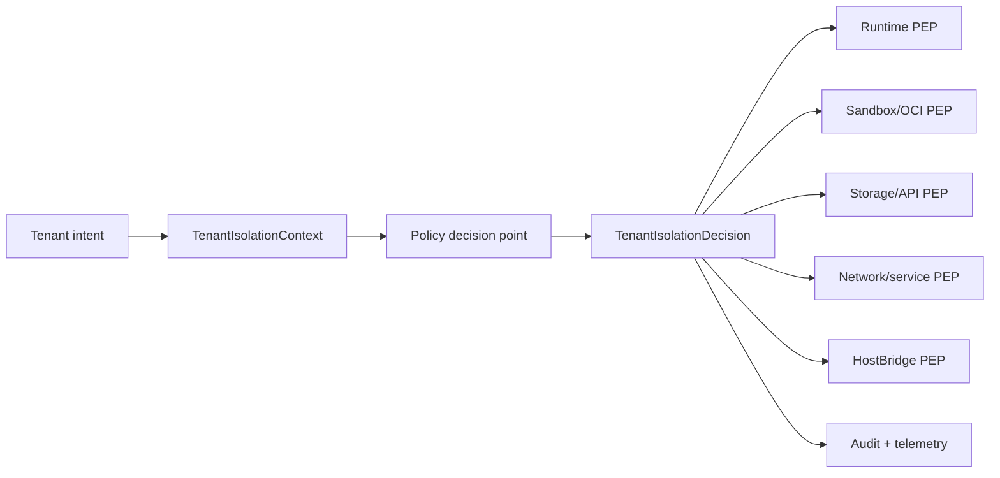

# Plan: Tenant Isolation Enterprise Hardening

Follow-on plan after
`docs/plans/archive/tenant-isolation-control-plane-plan.md`. The completed
baseline made tenant isolation explicit across runtime, microVM, storage,
network, HostBridge, volumes, images, secrets, quotas, cleanup, and system
metadata. This plan makes that foundation enterprise-grade: auditable,
policy-driven, externally reviewable, and easier to extend without reopening
isolation seams.

Prior-art research lives at
`docs/plans/research/tenant-isolation-enterprise-hardening-prior-art.md`.

---

## Status

- **Status:** `active`
- **Activated:** 2026-05-22
- **Primary owner:** this plan
- **Parent baseline:**
  - `docs/plans/archive/tenant-isolation-control-plane-plan.md`
- **Sibling references:**
  - `docs/plans/security/sandbox-isolation-audit.md`
  - `docs/architecture/sandbox/microvm-service-baseline.md`
  - `docs/architecture/runtime/permission-model.md`
  - `docs/architecture/storage/provider-topologies.md`
  - `docs/plans/secret-management-plan.md`
  - `docs/plans/archive/execution-isolation-and-runtime-backends-plan.md`

## Goal

Make Nimbus's tenant-isolation story independently inspectable and robust
enough for enterprise review by introducing explicit policy-decision records,
durable conformance tests, drift/audit reporting, hard quota enforcement
proofs, workload identity shape, image provenance policy, and observability
contracts.

This plan does not replace the completed tenant-isolation control plane. It
hardens the seams it created.

## Control Plan Rules

The source of truth is:

1. the current git worktree
2. this plan's `Phase Ledger`, `Implementation Checkpoints`, and `Execution
   Log`
3. `docs/plans/research/tenant-isolation-enterprise-hardening-prior-art.md`
4. `docs/plans/archive/tenant-isolation-control-plane-plan.md`
5. the current architecture docs listed above

Do not rely on chat transcripts as progress state.

### Status Model

- `todo`: not started; eligible when dependencies are satisfied
- `in_progress`: actively being implemented; keep exactly one phase in this
  state per autonomous execution run
- `blocked`: cannot proceed until the recorded blocker is resolved
- `done`: acceptance criteria are met and verification has been recorded
- `deferred`: parked behind another product or platform gate

### Recovery Loop

1. Read this plan, the prior-art research doc, and the archived tenant
   isolation baseline.
2. Inspect `git status --short` and reconcile dirty files with this plan
   before changing code.
3. Resume any `in_progress` phase before starting another phase.
4. Implement one phase at a time unless the plan is explicitly updated.
5. Record exact verification commands and results before marking a phase
   `done`.
6. Preserve unrelated user changes.

## Architecture Direction

The next stable seam should be a typed decision envelope:

```text
TenantIsolationContext  ->  TenantIsolationDecision  ->  enforcement seams
```

`TenantIsolationContext` remains the server-owned request/workload authority.
`TenantIsolationDecision` is the immutable output of admission. Enforcement
points should consume the decision instead of recomputing or open-coding
tenant, policy, quota, image, mount, network, or runtime grant state.



This mirrors the common pattern in Kubernetes admission, OPA Gatekeeper,
Vault policy/token issuance, and sandbox launchers such as Firecracker's
jailer: decide once at the boundary, enforce everywhere that intent becomes
host authority.

## Success Criteria

This plan is complete when:

1. A durable research record maps at least Kubernetes, Gatekeeper,
   Firecracker, Kata, gVisor, SPIFFE/SPIRE, Vault, Sigstore/SLSA, and
   OpenTelemetry patterns to concrete Nimbus follow-up decisions.
2. Nimbus has a typed admission decision artifact or equivalent whose fields
   cover tenant, authority, deployment/workload identity, runtime policy,
   service grants, network endpoints, storage namespace, volume/image/secret
   policy, quota reservations, audit redactions, and decision ID.
3. Runtime, sandbox, storage/API, network/service, and HostBridge enforcement
   seams consume the decision record rather than independent ad hoc pieces
   where practical.
4. The two-tenant harness is promoted into a reusable conformance suite with
   scenario fixtures and a single verification command.
5. A drift/audit scanner can detect tenant-isolation state that violates the
   current policy contract.
6. At least one Linux path proves hard resource enforcement below launch
   reservation for CPU/memory/process/file/log/disk or records a precise
   platform blocker.
7. The plan records a workload identity model compatible with future
   SPIFFE-style identities and the deferred secret-management plan.
8. Production image admission has a concrete provenance/signature policy
   design and at least one verifiable proof path, or records a narrow
   implementation blocker.
9. Admission decisions, rejections, materialization, cleanup, and drift
   reports have an observability/audit schema with redaction rules.
10. Focused tests plus `cargo fmt --all --check`, a relevant clippy lane, and
    a relevant conformance command are recorded with counts/results.

## Phase Ledger

| Phase | Status | Goal | Verification |
| --- | --- | --- | --- |
| EIH0 | `done` | Prior-art and codebase research. | Research doc records primary/code-source evidence, Nimbus decisions, rejected options, and follow-up code-reading targets. |
| EIH1 | `done` | Define `TenantIsolationDecision` or equivalent typed admission artifact. | `cargo test -p nimbus-server tenant_isolation -- --nocapture`, `cargo test -p nimbus-server runtime_execution_admission -- --nocapture`, `cargo fmt --all --check`, and `cargo clippy -p nimbus-server --all-targets` passed. |
| EIH2 | `todo` | Separate policy decision point from policy enforcement points. | Runtime, sandbox, storage/API, service lookup, and HostBridge seams consume the decision in focused tests. |
| EIH3 | `todo` | Promote TIC8 into tenant-isolation conformance suite. | One command runs allowed/denied scenario fixtures with counts and failure messages. |
| EIH4 | `todo` | Add drift/audit scanner for existing state. | Tests inject malformed manifests/handles/ports/volumes/routes and assert violations are reported without mutating state. |
| EIH5 | `todo` | Prove hard quota enforcement below launch reservation. | Linux-focused tests or minicloud proof show cgroup/project-quota/log/disk enforcement, or a precise platform blocker is recorded. |
| EIH6 | `todo` | Define workload identity shape. | Docs and tests bind tenant, deployment, service/function, runtime tier, node/machine, and sandbox/invocation IDs into a stable identity string. |
| EIH7 | `todo` | Define image provenance/signature admission. | Digest, signature, builder identity, attestation, and local-build rejection paths are tested or explicitly blocked. |
| EIH8 | `todo` | Add audit/observability contract. | Admission/rejection/materialization/cleanup events carry correlation IDs and redacted tenant-safe attributes. |
| EIH9 | `todo` | Enterprise readiness closeout. | Threat model, isolation matrix, residual-risk register, conformance evidence, and operator runbook references are complete. |

## Phase Details

### EIH0: Prior-Art And Codebase Research

Acceptance criteria:

- Research doc records durable findings from primary sources and codebase
  reading targets.
- Research explicitly separates already-landed Nimbus behavior from future
  hardening.
- Research maps each external pattern to a concrete Nimbus decision or
  rejection.
- At least one future implementation phase cites each major source family:
  Kubernetes/Gatekeeper, Firecracker/Kata/gVisor, SPIFFE/Vault, Sigstore/SLSA,
  and OpenTelemetry.

### EIH1: Typed Admission Decision

Acceptance criteria:

- Add a typed `TenantIsolationDecision` or equivalent with a stable decision
  ID.
- Decision construction consumes `TenantIsolationContext` plus admitted
  policy inputs.
- Decision fields are read-only after construction.
- Decision serialization/redaction shape exists for audit/telemetry.
- Tests prove tenant, deployment, service/runtime identity, and authority
  cannot be widened after admission.

### EIH2: PDP/PEP Separation

Acceptance criteria:

- Policy-decision code is owned in one module instead of scattered across
  leaf materializers.
- Runtime invocation admission consumes the decision.
- Sandbox service launch consumes the decision.
- Storage/API tenant access consumes the decision or a narrow projection of
  it.
- HostBridge operations consume decision-derived grants.
- Tests prove a forged tenant/path/service cannot bypass by targeting a lower
  enforcement seam directly.

### EIH3: Tenant Isolation Conformance Suite

Acceptance criteria:

- Move the TIC8 harness into a reusable suite with named scenarios.
- Include allowed and denied fixtures for path/header tenant swaps, bearer
  tenant claim swaps, mismatched service handles, same service name across
  tenants, same named volume across tenants, generic localhost grants,
  `_nimbus` access, production image admission, and tenant cleanup.
- Add one command or script that runs the suite and prints scenario counts.
- Document the suite as the gate for future runtime/sandbox/storage changes.

### EIH4: Drift/Audit Scanner

Acceptance criteria:

- Read-only scanner reports tenant-isolation drift in existing state.
- Scanner covers sandbox manifests, service handles, system port records,
  volume roots, route metadata, and admission decision/audit presence.
- Tests inject bad state and assert precise violation messages.
- Scanner does not delete or repair state unless a future remediation plan
  explicitly adds that behavior.

### EIH5: Hard Quota Enforcement

Acceptance criteria:

- Identify the platform-specific hard quota mechanism for Linux service
  sandboxes: cgroup v2, project quotas, quota-backed disks, file-size limits,
  or a documented combination.
- Implement or prove at least one hard enforcement path beyond launch
  reservation.
- Tests or minicloud proof demonstrate the limit firing and the operator error
  surface.
- Any unsupported platform path records a precise blocker and fallback.

### EIH6: Workload Identity Shape

Acceptance criteria:

- Define a stable workload identity string/schema.
- Identity includes tenant, deployment generation, service/function,
  runtime tier/backend, node/machine, and sandbox/invocation where applicable.
- Identity can be mapped to future SPIFFE-style IDs without breaking the
  current runtime/HostBridge API.
- Secret-management plan references this identity as the future provider-auth
  input.

### EIH7: Image Provenance And Signature Admission

Acceptance criteria:

- Define production image policy inputs: allowed registries, digest required,
  signature required, issuer/subject/build identity, attestation predicates,
  SBOM requirement, and local-build behavior.
- Add a provider seam for signature/provenance verification.
- Tests cover digest-only allowed floor, tag-only rejection, unsigned image
  rejection, wrong identity rejection, and local-build rejection without
  operator policy.
- Record whether Sigstore/Cosign is used directly or behind an adapter.

### EIH8: Audit And Observability Contract

Acceptance criteria:

- Define structured events for admission, rejection, materialization,
  runtime invocation, sandbox launch, storage access, HostBridge operation,
  cleanup, and drift violation.
- Every event has decision ID, tenant ID, surface, principal class,
  workload/service/function, runtime tier, sandbox/invocation ID where
  relevant, result, reason code, and correlation IDs.
- Sensitive values are redacted by schema, not by caller memory.
- Tests prove rejection and cleanup events are emitted without leaking secret
  values or bearer claims.

### EIH9: Enterprise Readiness Closeout

Acceptance criteria:

- Publish a customer-facing threat model or architecture note.
- Publish an isolation matrix with claims, enforcing layer, test evidence, and
  residual risks.
- Publish an operator runbook for debugging rejected admission decisions and
  tenant drift findings.
- Record external security review targets and open residual risks.
- Archive this plan when all phases are complete.

## Implementation Checkpoints

### 2026-05-22 EIH0 Research Plan Started

Completed in this checkpoint:

- Added the prior-art research note at
  `docs/plans/research/tenant-isolation-enterprise-hardening-prior-art.md`.
- Created this follow-on plan with phases for admission decision records,
  PDP/PEP separation, conformance, drift scanning, hard quotas, workload
  identity, image provenance, audit/observability, and enterprise readiness.
- Routed the plan from the completed tenant-isolation baseline instead of
  reopening the archived control-plane plan.

Verification evidence:

- `git diff --check`
  - result: pass.
- `rg -n "tenant-isolation-enterprise-hardening|tenant-isolation-control-plane" docs/plans/README.md docs/plans/tenant-isolation-enterprise-hardening-plan.md docs/plans/research/tenant-isolation-enterprise-hardening-prior-art.md`
  - result: pass; plan index, follow-on plan, research note, and archived
    baseline references are linked.

### 2026-05-22 EIH0 Primary/Code-Source Closure

Completed in this checkpoint:

- Expanded the prior-art research note with a source-by-source evidence table
  covering Kubernetes multi-tenancy/admission/quota, OPA Gatekeeper policy
  fixtures and audit, Firecracker jailer/seccomp, Kata's OCI/VM architecture,
  gVisor security/resource model, SPIFFE/SPIRE registration and selectors,
  Vault leases/audit redaction, Sigstore/Cosign/SLSA provenance, and
  OpenTelemetry logs/semantic conventions.
- Added the Nimbus decision/rejection ledger required before implementation:
  typed decision artifact first, PDP/PEP separation, conformance suite,
  read-only drift scanner, Linux hard quota proof, stable workload identity,
  image-verification provider seam, and structured redacted audit events.
- Renamed the remaining research list to follow-up implementation reading so
  EIH0 can close while later phases still read code at the seam they modify.

Verification evidence:

- `git diff --check`
  - result: pass.
- `rg -n "Primary And Code-Source|Nimbus Decisions And Rejections|EIH0 |tenant-isolation-enterprise-hardening" docs/plans/tenant-isolation-enterprise-hardening-plan.md docs/plans/research/tenant-isolation-enterprise-hardening-prior-art.md docs/plans/README.md`
  - result: pass; source-evidence section, decision/rejection ledger,
    EIH0 ledger row, plan index, and follow-up reading note are present.

### 2026-05-22 EIH1 Typed Decision Artifact

Completed in this checkpoint:

- Added `TenantIsolationDecision` and stable `TenantIsolationDecisionId`
  construction from a deterministic fingerprint of tenant, surface,
  authority projection, deployment generation, workload identity, runtime
  policy, service grants, network endpoints, storage namespace, volume/image/
  secret policy, quotas, and audit redaction policy.
- Added typed policy projections for runtime admission, service grants,
  network endpoints, storage namespace, named volumes, digest-pinned image
  policy, secret handles, quota reservations, workload identity, and
  audit-redaction metadata.
- Added an audit-safe `TenantIsolationAuditRecord` projection that carries
  decision ID and policy shape while redacting principal claims, bearer
  claims, raw credentials, and secret handles by schema.
- Routed `RuntimeExecutionAdmission::for_policy` through the decision artifact
  so at least one enforcement seam now consumes the typed snapshot instead of
  recomputing the runtime policy admission result directly.
- Re-exported `RuntimeTenantBudget` from `nimbus-runtime` because the server
  decision artifact records the existing public runtime budget type.

Verification evidence:

- `cargo test -p nimbus-server tenant_isolation -- --nocapture`
  - result: pass; 20 passed, 0 failed, 0 ignored, 723 filtered out. Includes
    new stable-ID, audit-redaction, immutable-snapshot, tenant/deployment
    binding, and mismatched-application-claim tests, plus the TIC8 harness.
- `cargo test -p nimbus-server runtime_execution_admission -- --nocapture`
  - result: pass; 2 passed, 0 failed, 0 ignored, 741 filtered out.
- `cargo fmt --all --check`
  - result: pass.
- `cargo clippy -p nimbus-server --all-targets`
  - result: pass; finished dev profile in 26.03s.

Dirty-worktree caveat:

- Unrelated generated Convex files, `package-lock.json`,
  `docs/architecture/horizontal-scaling.md`, desktop-auth proof images, and
  other untracked plan/research docs were already present and intentionally
  left untouched.

## Execution Log

| Date | Phase | Status | Files | Summary | Verification |
| --- | --- | --- | --- | --- | --- |
| 2026-05-22 | EIH0 | `done` | `docs/plans/research/tenant-isolation-enterprise-hardening-prior-art.md`, `docs/plans/tenant-isolation-enterprise-hardening-plan.md`, `docs/plans/README.md` | Started the follow-on enterprise hardening plan, then closed EIH0 by mapping Kubernetes/Gatekeeper, Firecracker/Kata/gVisor, SPIFFE/SPIRE/Vault, Sigstore/SLSA, and OpenTelemetry primary/code-source patterns to Nimbus decisions and rejected options. Next phase is EIH1 typed admission decision. | `git diff --check` passed; `rg -n "tenant-isolation-enterprise-hardening|tenant-isolation-control-plane" docs/plans/README.md docs/plans/tenant-isolation-enterprise-hardening-plan.md docs/plans/research/tenant-isolation-enterprise-hardening-prior-art.md` passed; `rg -n "Primary And Code-Source|Nimbus Decisions And Rejections|EIH0 |tenant-isolation-enterprise-hardening" docs/plans/tenant-isolation-enterprise-hardening-plan.md docs/plans/research/tenant-isolation-enterprise-hardening-prior-art.md docs/plans/README.md` passed. |
| 2026-05-22 | EIH1 | `done` | `crates/nimbus-server/src/tenant_isolation.rs`, `crates/nimbus-server/src/execution/runtime_admission.rs`, `crates/nimbus-server/src/lib.rs`, `crates/nimbus-runtime/src/lib.rs`, `docs/plans/tenant-isolation-enterprise-hardening-plan.md` | Added the typed immutable tenant-isolation decision artifact, deterministic decision IDs, workload/policy/quota/audit projections, audit-safe redaction projection, unit coverage for immutability and mismatched authority, and routed runtime execution admission through the decision snapshot. Next phase is EIH2 broader PDP/PEP consumption across sandbox, storage/API, service lookup, and HostBridge seams. | `cargo test -p nimbus-server tenant_isolation -- --nocapture` passed: 20 passed, 0 failed, 0 ignored, 723 filtered out; `cargo test -p nimbus-server runtime_execution_admission -- --nocapture` passed: 2 passed, 0 failed, 0 ignored, 741 filtered out; `cargo fmt --all --check` passed; `cargo clippy -p nimbus-server --all-targets` passed. |
