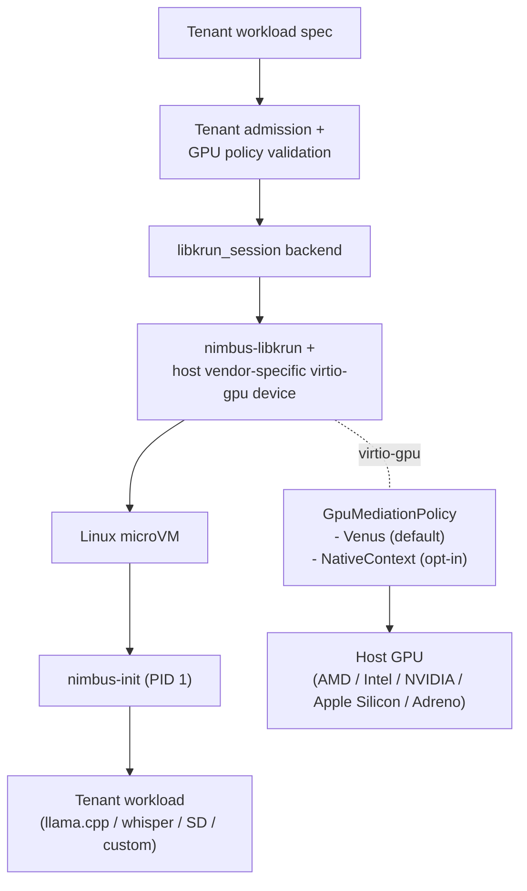

# Plan: GPU-Accelerated Sandbox (GPU Profile) (Archived)

> **Superseded 2026-05-27 by [`docs/plans/nimbus-sandbox-plan.md`](../nimbus-sandbox-plan.md) Band G.**
> The unified sandbox plan rolls GAW1–GAW13 into Band G (G1–G13);
> GAW0 closed into Band B0. Phase content was lifted verbatim; this
> file is retained as the baseline for the unified plan's Band G section.

Plan for a tenant-safe, libkrun-backed sandbox that exposes a host GPU
to the guest via Venus (default) or per-vendor native-context (opt-in,
trusted-only), suitable for AI inference and training workloads.

## Status

- **Status:** `proposed`
- **Activation precondition:** finish or explicitly checkpoint the host
  lifecycle backend seam in
  [`docs/plans/tenant-domain-and-node-enforcement-boundary-plan.md`](./tenant-domain-and-node-enforcement-boundary-plan.md);
  research docs
  [`docs/plans/research/libkrun-session-sandbox.md`](./research/libkrun-session-sandbox.md)
  and
  [`docs/plans/research/gpu-sandbox-backends.md`](./research/gpu-sandbox-backends.md)
  must be landed.
- **Primary goal:** stand up a tenant-isolated `libkrun_session` sandbox
  backend that exposes a host GPU into a Linux microVM via Venus
  (default), with an opt-in native-context path for trusted workloads,
  and an enforceable per-tenant safety model.
- **References:**
  [`docs/plans/research/vmm-landscape-2026.md`](./research/vmm-landscape-2026.md),
  [`docs/plans/research/libkrun-session-sandbox.md`](./research/libkrun-session-sandbox.md),
  [`docs/plans/research/gpu-sandbox-backends.md`](./research/gpu-sandbox-backends.md),
  [`docs/plans/computer-use-sandbox-plan.md`](./computer-use-sandbox-plan.md),
  [`docs/plans/nimbus-libkrun-snapshot-port-plan.md`](./nimbus-libkrun-snapshot-port-plan.md),
  [`docs/architecture/sandbox/microvm-service-baseline.md`](../../architecture/sandbox/microvm-service-baseline.md),
  [muvm (AsahiLinux/muvm)](https://github.com/AsahiLinux/muvm),
  [Mesa Venus driver docs](https://docs.mesa3d.org/drivers/venus.html).

## Decision Summary

This plan covers the **GPU profile** of the unified `nimbus-libkrun`
sandbox backend (decisions D1–D12 in `vmm-landscape-2026.md`). There is
one VMM family for every Nimbus sandbox workload; the GPU profile turns
on a host GPU mediation policy and (optionally) display capture. The
desktop profile (CUS plan) is the sibling consumer of the same backend
with `display`/`input` enabled instead. Snapshot/restore for both
profiles lands through `nimbus-libkrun-snapshot-port-plan.md`; per
decision D5 GPU state is **re-initialized on restore**, not serialized.

Per-host topology (D11/D12): the GPU profile runs as a direct
libkrun-on-KVM microVM on Linux production hosts (every supported GPU
vendor). On macOS dev hosts, Venus / Vulkan compute is reachable
through the **outer machine-os VM** (libkrun-on-HVF via krunkit,
~75–80 % native Metal); the per-workload sandbox inside the outer VM
is a standard Linux container with GPU device access, not a nested
libkrun microVM. CUDA-only / ROCm-only workloads still require a
Linux fleet regardless of dev host.

| Profile shape | Path | This plan? |
| --- | --- | --- |
| Desktop / computer-use session (display, optional GPU for rendering) | CUS plan, `libkrun_session` | No |
| GPU inference workload (GPU for compute, display optional) | this plan, `libkrun_session` | Yes |
| CUDA-only workload | separate NVIDIA fleet (vGPU or bare-metal) | No |
| ROCm workload | deferred until amdgpu HSAKMT path proves out | No |

## Why a Separate Plan

The libkrun-session research doc settles the backend shape. The GPU
backends research doc settles which mediation backend Nimbus defaults to
and when alternatives are allowed.

This plan settles:

- The per-tenant GPU safety model.
- The operator surface for GPU policy.
- The host-capability detection and admission flow.
- The benchmark gate before any backend is promoted.
- The NVIDIA fleet split and how it is exposed to tenants.
- The threat-model-specific isolation harness.

## Target Architecture



## Product Personas

| Persona | Job | Required experience |
| --- | --- | --- |
| Local developer (AI workload author) | Run a model inside a sandbox on my dev machine with GPU acceleration | one-command sandbox, Vulkan device visible inside guest, llama.cpp / whisper.cpp / SD just work |
| Enterprise platform team | Offer GPU AI sandboxes to internal tenants | per-tenant isolation, vendor-aware admission, audit trail, no CUDA promises without NVIDIA fleet |
| Security team | Verify the GPU sandbox isolates untrusted code from the host kernel driver | Venus-only default for untrusted, native-context off without trusted opt-in, recorded threat model, fuzz/red-team evidence |

## Scope

This plan owns:

- GPU policy types and admission for the sandbox spec.
- Host capability detection: GPU vendor, Vulkan support, Mesa /
  virglrenderer versions, render-server installation.
- Venus backend wiring (default).
- Native-context backend wiring (amdgpu first, freedreno follow-on).
- Per-tenant render-server pinning (one render server per VM).
- ioctl filter for native-context paths.
- Benchmark gate: at least one well-known ML workload (llama.cpp
  Vulkan) runs end-to-end with recorded throughput on each promoted
  backend.
- NVIDIA fleet split: documented and enforced at admission.
- ROCm posture: track but do not ship; admission rejects ROCm requests
  until the path is proven.

This plan does not own:

- The desktop-profile display surface (CUS plan).
- The shared `libkrun_session` backend skeleton or `nimbus-init`
  (shared with CUS; whichever plan lands first owns those phases).
- NVIDIA vGPU operator support (separate, residual).
- scuda / rCUDA RPC forwarding (residual research).
- macOS GPU-profile production support beyond Venus (CUDA stays
  Linux-fleet-only).
- API-remoting paths beyond Venus (e.g., libkrun PR #508). Track but do
  not depend on.

## Core Invariants

- Default GPU mediation is Venus. Untrusted-workload classes (default
  classification) cannot use native-context.
- Native-context is opt-in per tenant, per spec, and requires matching
  host vendor and a recorded operator-policy approval.
- The host render-server runs in its own OS-level sandbox separate
  from the VMM (Venus's `VIRGLRENDERER_RENDER_SERVER`).
- Per-tenant render-server pinning: one render-server process per VM.
- ioctl filter on native-context paths defaults to `Strict` (allowlist
  derived from observed-safe ioctls); `Permissive` requires explicit
  operator approval recorded in the admission decision.
- CUDA tenants are admitted only on a separate NVIDIA fleet (out of
  scope for `libkrun_session`); admission rejects CUDA requests on
  `libkrun_session` with an actionable error.
- ROCm tenants are rejected until the amdgpu HSAKMT path lands and the
  cross-tenant safety story is proven.
- Benchmark gate: no backend (Venus or native-context) is promoted
  until at least one well-known ML workload runs end-to-end with
  recorded throughput evidence on a real host of that vendor.
- macOS GPU-profile path is Venus-only and gated on real-host stability
  evidence; [libkrun #377](https://github.com/containers/libkrun/issues/377)
  must be closed or worked around before promotion.

## Public and Internal Surfaces

### Operator CLI

```text
nimbus sandbox gpu doctor
nimbus sandbox gpu benchmark --image <ref@sha256:...> --workload llama.cpp [--policy venus|native-context-amdgpu|...]
nimbus sandbox gpu admit --tenant <id> --image <ref@sha256:...> --policy venus|native-context-amdgpu|...
```

Exact namespace may change during implementation; the plan requires
these capabilities at minimum.

### Rust ownership

Use Nimbus-owned domain nouns at public boundaries:

```rust
enum GpuMediationPolicy {
    Venus,
    NativeContext {
        driver: NativeContextDriver,
        ioctl_filter: TenantIoctlFilter,
    },
}

enum NativeContextDriver { Amdgpu, Freedreno, Asahi }

enum TenantIoctlFilter { Strict, Permissive }

struct GpuNodeCapabilities;
struct GpuAdmissionDecision;
struct GpuBenchmarkEvidence;
```

Placement by crate / module:

| Area | Owner |
| --- | --- |
| GPU policy types | `nimbus-core` (public boundary) |
| GPU admission + capability detection | `nimbus-sandbox::backends::libkrun_session::gpu` |
| Render-server lifecycle, ioctl filter | `nimbus-sandbox::backends::libkrun_session` |
| Benchmark gate, evidence shape | `local_enforcement` / future `nimbus-node` |
| Operator CLI | `nimbus-bin` |
| HTTP/gRPC transport | `nimbus-server` |

Do not put virtio-gpu config or virglrenderer process launch in
`nimbus-runtime`. `nimbus-runtime` stays execution-only.

## Execution Plan

| Phase | Status | Goal | Verification |
| --- | --- | --- | --- |
| GAW0 | `done` | Refresh research against current Mesa Venus, virglrenderer, libkrun, krunkit, and rutabaga_gfx upstream. Inventory the `nimbus-libkrun` fork's patch delta vs upstream and vs muvm's `krun-sys`. Update GPU backends research doc if anything has changed. | Research notes cite current upstream commits/MRs and the macOS Venus posture; fork patch inventory is checked into the repo at `docs/plans/research/nimbus-libkrun-fork-inventory.md`. Closed 2026-05-26: only functional libkrun delta is `15bcf49` (TSI bind-address; not relevant to the gpu-profile passt path); canonical `krun_set_gpu_options2` shape captured at §7 of the inventory; anticipated per-tenant native-context ioctl filter recorded as a likely future fork patch. |
| GAW1 | `todo` | Define `GpuMediationPolicy`, `NativeContextDriver`, `TenantIoctlFilter`, `GpuNodeCapabilities`, `GpuAdmissionDecision`, `GpuBenchmarkEvidence`. | Type/unit tests prove admission rejects native-context for untrusted workloads, rejects mismatched vendors, rejects `Permissive` without operator approval, rejects CUDA, rejects ROCm. |
| GAW2 | `todo` | Implement Venus wiring through `libkrun_session`: virtio-gpu device with `VIRGLRENDERER_VENUS \| VIRGLRENDERER_RENDER_SERVER`, per-VM render-server process, host-capability check. | Linux-gated end-to-end runs llama.cpp Vulkan in the guest and records throughput; non-Linux CI runs contract tests. |
| GAW3 | `todo` | Add `nimbus sandbox gpu doctor` for capability and admission diagnostics. | Tests prove actionable errors for missing Vulkan loader, missing render server, missing virglrenderer, wrong Mesa version, ungranted `/dev/dri/renderD*` permission, mismatched vendor. |
| GAW4 | `todo` | Wire native-context-amdgpu as an opt-in path. Add `Strict` ioctl filter derived from an observed-safe baseline. | Two-workload harness proves the `Strict` filter passes legitimate amdgpu workloads and blocks unexpected ioctls; trusted tenant opt-in is required at admission. |
| GAW5 | `todo` | Wire native-context-freedreno as a follow-on opt-in path for Adreno hosts. | Aarch64 Adreno smoke proves the path works end-to-end on a trusted-workload spec. |
| GAW6 | `todo` | Enforce per-tenant render-server pinning and lifecycle: one render server per VM, crash recovery, log correlation, audit. | Failure-injection tests prove render-server crash takes down only one VM; lifecycle / state matches design. |
| GAW7 | `todo` | Tenant isolation harness: two tenants in parallel, mixed Venus and native-context, hostile guest in one tenant attempts cross-tenant leak. | Harness records no cross-tenant leak across GPU memory residue, ioctl path, render-server state, host file descriptors. |
| GAW8 | `todo` | NVIDIA fleet split: admission rejects CUDA requests on `libkrun_session`, documents the separate-fleet path, surfaces the operator policy record. | Tests prove the rejection is actionable; documentation describes the NVIDIA fleet posture. |
| GAW9 | `todo` | ROCm posture: track the amdgpu HSAKMT MR, document the deferred status, fail closed on ROCm admission. | Tests prove ROCm requests are rejected; docs describe the deferral and tracking. |
| GAW10 | `todo` | Benchmark gate: at least one ML workload runs end-to-end with throughput evidence on each promoted backend (Venus on each host vendor, native-context-amdgpu, native-context-freedreno). | Recorded throughput meets the documented promotion bar; macOS Venus path records ~75–80 % of native Metal as a baseline. |
| GAW11 | `todo` | Observability and evidence: GPU admission events, ioctl filter audit, render-server lifecycle, OCSF/OpenTelemetry mapping, redaction. | Tests prove high-cardinality IDs stay in events / evidence; ioctl audit is complete for native-context; operator diagnostics explain failures. |
| GAW12 | `todo` | CI gates: contract tests on every CI; Venus smoke on Linux + Apple Silicon Mac; native-context smoke on a fleet runner with the matching GPU vendor. | Gates skip with evidence when capability is missing; fail on real regressions when available. |
| GAW13 | `todo` | Docs: security model, threat model, vendor support, CUDA / ROCm posture, selectability. | Docs clearly state defaults, opt-ins, fleet splits, and product selectability gating. |

## Initial Success Criteria

This plan may close only when:

- A tenant on a Vulkan-capable host (AMD / Intel / NVIDIA Linux, Apple
  Silicon macOS via krunkit, Adreno aarch64) can start a
  `libkrun_session` sandbox with `GpuMediationPolicy::Venus` and run
  llama.cpp Vulkan end-to-end with recorded throughput.
- A trusted tenant on an AMD Linux host can opt into
  `GpuMediationPolicy::NativeContext { driver: Amdgpu, ioctl_filter: Strict }`
  and run a Vulkan or VK-compute workload end-to-end with recorded
  throughput.
- Untrusted-workload classes are rejected for native-context with an
  actionable error.
- CUDA and ROCm requests on `libkrun_session` are rejected with an
  actionable error pointing at the NVIDIA fleet / ROCm deferral.
- A two-tenant isolation harness records no cross-tenant leak across
  GPU memory, ioctl paths, render-server state, or host file
  descriptors.
- macOS Venus path records the documented ~75–80 % native Metal
  baseline on llama.cpp Vulkan and runs the real-host stability gate
  cleanly.
- `cargo fmt --all --check`, focused Rust tests, Venus-gated smoke,
  native-context-gated smoke, docs reference validation, and
  `git diff --check` pass.

## Residual Follow-Ups

Do not hide these inside this plan:

- NVIDIA vGPU operator support.
- scuda / rCUDA RPC forwarding research.
- ROCm path once virglrenderer HSAKMT MR lands and cross-tenant safety
  is proven.
- API remoting ([libkrun PR #508](https://github.com/containers/libkrun/pull/508))
  as a near-native macOS path for specific frameworks.
- native-context-intel once the Mesa MR lands.
- native-context-asahi when Nimbus runs on Asahi Linux hosts.
- Per-vendor GPU memory-residue scrubbing investigation.
- Multi-GPU host scheduling for warm-pool sessions.
- A separate `verify-gpu-accelerated-sandbox.sh` `/goal` control-plane
  gate script.

## Suggested Goal Prompt

```text
/goal Complete docs/plans/gpu-accelerated-sandbox-plan.md after the tenant-domain/node-enforcement host lifecycle seam is checkpointed and the libkrun-session + gpu-sandbox-backends research docs land. Build a proposed-to-proven libkrun-session GPU sandbox backend with Venus default (multi-vendor) and native-context opt-in for trusted AMD/Adreno tenants. CUDA tenants are routed to a separate NVIDIA fleet; ROCm is deferred until the virglrenderer HSAKMT MR lands. GPU profile only; the desktop profile ships under docs/plans/computer-use-sandbox-plan.md and the lambda profile (snapshot/fork) ships under docs/plans/nimbus-libkrun-snapshot-port-plan.md — all three on the same nimbus-libkrun backend per D1–D12. Per-host topology (D11/D12): Linux production runs direct libkrun-on-KVM microVMs per service; macOS dev reaches Venus through the outer machine-os VM (libkrun-on-HVF via krunkit) and per-workload sandboxes inside that outer VM are standard Linux containers with GPU device access, not nested microVMs. Verifiable success criteria: Venus end-to-end on Linux + Apple Silicon macOS runs llama.cpp Vulkan with recorded throughput; native-context-amdgpu on a trusted-workload opt-in runs with recorded throughput; untrusted-workload class is rejected for native-context with actionable error; CUDA and ROCm are rejected with actionable error; two-tenant isolation harness records no cross-tenant leak; macOS Venus records ~75-80% native Metal baseline and passes the real-host stability gate. cargo fmt --all --check plus focused tests plus Venus-gated smoke plus native-context-gated smoke plus git diff --check pass.
```
