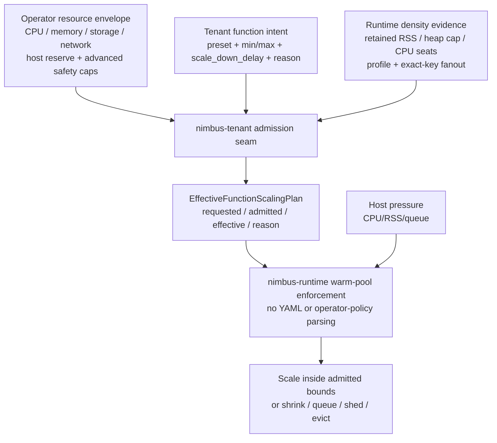

# Tenant Function Autoscaling Contract Plan

## Status

- **Status:** `archived_complete`
- **Lane:** L3 runtime / tenancy follow-on
- **Primary owner:** this plan
- **Predecessors:** PIR7, PIR7L, PIR7M, and REC0-REC5 are complete.
- **Verifier:** `bash scripts/verify-tenant-function-autoscaling.sh` (32 passed,
  0 failed on 2026-06-27)
- **Proof directory:** `docs/private/plans/proof/tenant-function-autoscaling/`

This plan corrects the product contract that remains after PIR7M: tenants should
get autoscaling by default when their requested warm range implies it, inside an
operator-owned resource envelope. Operators may deny autoscaling for a tenant,
but their normal job is to grant CPU, memory, storage, network, and host-safety
limits. Nimbus then derives warm-pool caps from those resources, measured runtime
density, and exact-key materialization.

The implementation must be a clean pre-launch replacement. Do not add
compatibility aliases for `activation_warm`, `live_scaling`, or
`allow_live_scaling`; delete or rename the old contract directly.

## Current Implementation Comparison

| Concern | Current code | Desired contract | Required change |
| --- | --- | --- | --- |
| Tenant app intent | `crates/nimbus-bin/src/function_scaling.rs` accepts public `activation_warm` and `live_scaling` fields in `functions.scaling.default`, classes, and overrides. Baked dev uses `min_warm: 1` and presets set `live_scaling` to `false`. | Public v1 config has only `preset`, `min_warm`, `max_warm`, and `scale_down_delay`. Autoscaling is inferred from the requested range, and active/recent retention is derived from `scale_down_delay`. | Remove public `activation_warm` and `live_scaling`. Infer autoscaling from `preset` + `min_warm` + `max_warm`. Default dev/start to `min_warm: 0`. |
| Runtime target model | `RequestedRuntimeScalingTarget` and `RuntimeScalingTarget` carry public-shaped `activation_warm` and `live_scaling` fields in `crates/nimbus-runtime/src/limits/scaling.rs`. | Runtime may keep internal materialization/activation targets, but the public request model does not expose `activation_warm`; autoscaling is derived evidence, not user-authored state. | Split public request intent from internal effective target. Keep any activation/active-recent value derived and diagnostic-only. Rename live-scaling internals to inferred autoscaling only where a runtime field is still needed. |
| Operator defaults | `OperatorRuntimeScalingLimits` exposes `max_total_warm`, `max_min_warm_total`, `max_warm_per_function`, and `allow_live_scaling`, with `allow_live_scaling: false`. | Operator defaults are resource-first: tenant CPU, memory, storage, network, host reserve, and optional advanced runtime safety caps. Autoscaling is allowed by default unless the operator denies it. | Add a resource-envelope module and demote pool-count caps to optional advanced safety rails. Default autoscaling admission to allowed. |
| Admission path | `nimbus explain`, `nimbus validate`, and `nimbus run functions` admit through `OperatorPolicyDocument::admit_runtime_scaling`; `nimbus start` lowers the effective plan directly from runtime limits. | Every command that resolves effective function scaling crosses the same admission seam. | Move lowering/admission behind one deep module and route `start`, `dev`, `node`, `explain`, `validate`, and `run functions` through it. |
| Diagnostics | `render_effective_plan` shows pool caps and `allow_live_scaling`, but not the inferred autoscaling result or resource-derived cap evidence. | Diagnostics show tenant intent, inferred autoscaling, operator resource envelope, derived pool caps, effective target, pressure reduction, and explicit rejection/clamp reason. | Update `nimbus explain functions`, boot summary, validation errors, and server startup logs. |
| Adaptive controller | `--runtime-adaptive-mode` remains disabled by default and operator-only. | Same. Tenant-inferred autoscaling does not mean "turn on live adaptive controller mode"; it means "runtime may vary ready entries inside admitted bounds." | Preserve the seam and tests that keep `RuntimeAdaptiveControllerSettings::default()` disabled. |

## Product Decision: Infer Autoscaling From The Range

Use a small public v1 surface:

```yaml
functions:
  scaling:
    default:
      preset: warm
      max_warm: auto
      scale_down_delay: 10m
```

Do not expose `activation_warm`, `autoscaling: true`, or
`mode: elastic | fixed` as common v1 tenant fields.

Reasons:

- The desired behavior is already encoded by the range. If `max_warm` is `auto`
  or a concrete value greater than `min_warm`, the function can grow. If
  `min_warm == max_warm`, the function is fixed.
- `activation_warm` is an implementation/materialization policy. Public v1
  should explain "stay warm after traffic for this long" through
  `scale_down_delay`, not ask tenants to author a second activation floor.
- `mode` is too broad and collides with the existing operator-only
  `--runtime-adaptive-mode` wording.
- `autoscaling: true` is usually redundant. Users should not have to ask for the
  default behavior when their range already implies it.
- `fixed` already exists as a preset and has concrete validation semantics:
  fixed capacity requires or derives `min_warm == max_warm`.

Autoscaling inference rules:

| Public input | Inferred result |
| --- | --- |
| `max_warm: auto` and preset is not `fixed` | `autoscaling: inferred=true` |
| Concrete `min_warm != max_warm` | `autoscaling: inferred=true` |
| Concrete `min_warm == max_warm` | `autoscaling: inferred=false` |
| `preset: fixed` | `autoscaling: inferred=false`; if only one bound is supplied, derive the other to match; if both are supplied, they must be equal. |

Diagnostics may show `autoscaling: inferred=true|false`. Tenants should not need
to write it.

## Target Configuration Contract

Tenant/developer app intent in `nimbus.yaml`:

```yaml
functions:
  scaling:
    default:
      preset: warm
      max_warm: auto
      scale_down_delay: 10m

    classes:
      hot-write:
        preset: latency
        min_warm: 2
        max_warm: 16
        scale_down_delay: 30m

    overrides:
      "messages:send":
        class: hot-write
        reason: "primary write path"

      "reports:nightly":
        preset: economy
        min_warm: 0
        max_warm: 1
        scale_down_delay: 30s
        reason: "scheduled cold-tolerant report"
```

Operator policy in `nimbus.policy.yaml`:

```yaml
tenant: tenant-a
defaults:
  resources:
    cpu: 8000m
    memory: 16Gi
    storage: 200Gi
    network_egress: 100Gi/day
  runtime_safety:
    autoscaling: allowed
    host_cpu_reserve: 20%
    max_ready_per_function: auto
    max_reserved_ready_memory: auto

workloads:
  - kind: runtime_function
    name: "messages:send"
    quotas:
      resources:
        cpu: 2000m
        memory: 2Gi
      runtime_safety:
        max_ready: 16
```

Pool-specific operator values stay available only as advanced guardrails. The
operator-facing happy path is resources; Nimbus translates resources to pool caps
using measured retained RSS, configured heap limits, runtime profile, exact-key
fanout, CPU seats, and host pressure.

## Responsibility Model



The deep module is the admission seam: callers provide tenant intent, operator
resources, runtime measurements, and host defaults; they receive one typed
effective plan. The deletion test should fail: if that module is removed, every
CLI/server path would have to reimplement defaulting, resource conversion,
operator denial, pressure clamping, and diagnostics.

## Semantic Rules

- Public tenant v1 knobs are only `preset`, `min_warm`, `max_warm`, and
  `scale_down_delay`.
- Public config must not accept `activation_warm`, `autoscaling`, `live_scaling`,
  pool kind, runtime profile, execution model, or adaptive-controller mode.
- Tenant autoscaling is inferred and allowed by default when the requested range
  implies it.
- Operators can deny autoscaling for a tenant or named workload.
- If autoscaling is denied and the tenant request inferred autoscaling, validation
  must reject with an actionable message that names the range and policy denial.
- `preset: fixed` means the function does not grow above its fixed admitted
  target. It requires or derives `min_warm == max_warm`.
- `min_warm: 0` is the default for `nimbus start`; first traffic materializes the
  runtime and `scale_down_delay` keeps it warm after traffic.
- `nimbus dev` also uses `min_warm: 0`; warm-hit product feel comes from
  development-friendly `scale_down_delay` and internally derived active/recent
  retention, not broad global prewarm.
- `min_warm: 1+` means prewarm before traffic for the admitted function selector
  and materialized exact authority keys only. It must not fan out across every
  tenant/function/script/grant/condition/construction-mode variant.
- `min_warm: 1+` should be reserved for explicit hot functions, generally with a
  reason and quota/resource admission.
- Inferred autoscaling never bypasses exact authority keys. It allocates from an
  admitted function/tenant budget only for demanded or active/recent exact keys.
- Inferred autoscaling never enables `RuntimeAdaptiveControllerMode::Live`.
  Adaptive-controller actuation remains a separate operator implementation
  setting.
- Host pressure can shrink, pause prewarm, evict idle entries, queue, or shed
  below tenant quota even when resource quota remains unused.

## Implementation Bands

### TFA0 — Scaffold And Failing Verifier

Create the proof directory and `scripts/verify-tenant-function-autoscaling.sh`.
The initial verifier must fail until it finds:

- the new plan in `docs/private/plans/README.md`;
- public v1 config tests for `preset`, `min_warm`, `max_warm`, and
  `scale_down_delay`;
- rejection tests for public `activation_warm`, `autoscaling`, `live_scaling`,
  and `allow_live_scaling` config fields;
- resource-first operator policy structs;
- unified admission used by `start`, `explain`, `validate`, and `run functions`;
- proof artifact with exact commands and counts.

Success criteria:

- The verifier runs and reports the missing implementation conditions.
- The plan index routes this work after PIR7M and before any default live
  adaptive-controller promotion.

### TFA1 — Public Function Scaling Intent

Replace public `activation_warm` and `live_scaling` in `nimbus-bin`
function-scaling config with inferred autoscaling.

Implementation requirements:

- `FunctionScalingPolicyConfig` and `FunctionScalingOverrideConfig` accept only
  `preset`, `min_warm`, `max_warm`, and `scale_down_delay`.
- Unknown public `activation_warm`, `autoscaling`, and `live_scaling` fields
  reject actionably.
- Baked `dev` and `start` policies default to `min_warm: 0`.
- Dev warm-hit behavior is derived from `scale_down_delay` and an internal
  active/recent retention policy, not from broad prewarm.
- `economy` compiles to `min_warm: 0`, shorter retention, and conservative max.
- `warm` compiles to `min_warm: 0`, `max_warm: auto`, and medium retention.
- `latency` is an explicit hot-path preset: likely `min_warm: 1`, longer
  retention, and resource admission.
- Add `throughput` only if this implementation gives it distinct semantics such
  as higher derived max, faster scale-up, or target-concurrency inputs. Do not
  rename `latency` to `throughput`.
- `fixed` validates or derives `min_warm == max_warm`.
- Override reason validation treats increased `min_warm`, increased concrete
  `max_warm`, or switching to a hotter preset as a meaningful capacity increase
  when it exceeds the tenant default.

Focused tests:

- no-YAML dev/start default to `min_warm: 0`;
- no public `activation_warm`, `autoscaling`, or `live_scaling` field is
  accepted;
- `max_warm: auto` infers autoscaling;
- concrete `min_warm != max_warm` infers autoscaling;
- concrete `min_warm == max_warm` infers fixed behavior;
- `preset: fixed` derives or validates equal min/max;
- classes and overrides merge range fields deterministically.

### TFA2 — Resource-First Operator Envelope

Add a resource-first tenant envelope to `nimbus-tenant` policy.

Implementation requirements:

- Add typed resource units for CPU, memory, storage, and network egress, with
  parser tests for `m`, whole CPUs, `Mi`, `Gi`, bytes, and per-day egress.
- Add `OperatorTenantResourceEnvelope` and `OperatorRuntimeSafetyPolicy`.
- Default inferred-autoscaling admission is allowed.
- Pool-specific caps are advanced safety rails under `runtime_safety`, not the
  primary operator contract.
- Existing sandbox charges remain separate; do not mix sandbox active charges
  with function pool readiness accounting.

Focused tests:

- a policy with only resources admits ordinary inferred autoscaling;
- an operator can deny autoscaling for the tenant;
- an operator can cap a hot function with advanced `runtime_safety.max_ready`;
- invalid units and impossible resource envelopes reject actionably.

### TFA3 — Unified Admission Seam

Create one concept-owned admission module that all callers use.

Implementation requirements:

- The module accepts tenant intent, operator resource envelope, runtime density
  measurements/defaults, and host resource budget.
- It returns an `EffectiveRuntimeScalingPlan` or successor type with requested,
  admitted, effective, resource-derived caps, inferred autoscaling status, and
  reason.
- `nimbus start` must load the same default/discovered policy path as
  `validate`/`explain` or use an explicit default-policy object through the same
  seam. It must not lower directly from `RuntimeLimits`.
- `nimbus dev`, `nimbus node`, `nimbus explain functions`, `nimbus validate
  functions`, and `nimbus run functions` must cross the same seam.

Focused tests:

- `start` and `explain` produce the same effective plan from the same config and
  policy;
- explicit over-resource requests reject;
- baked default inferred autoscaling clamps or rejects according to the operator
  policy;
- an autoscaling-inferred tenant range rejects if the operator denies
  autoscaling.

### TFA4 — Runtime Model Rename And Enforcement

Separate public request intent from internal effective target materialization
without weakening runtime crate invariants.

Implementation requirements:

- `nimbus-runtime` keeps zero workspace dependencies.
- `RequestedRuntimeScalingTarget` or its successor no longer exposes public
  `activation_warm` or `live_scaling` semantics.
- `RuntimeScalingTarget` or its successor may carry internal derived activation
  and inferred-autoscaling fields, but those are never deserialized from
  `nimbus.yaml`.
- `RuntimeAdaptiveControllerSettings::default()` still disables live adaptive
  controller actuation.
- Runtime enforcement treats inferred autoscaling as an admitted range policy,
  while adaptive-controller mode remains an implementation strategy selected
  only by operator controls.

Focused tests:

- runtime policy carries inferred autoscaling without enabling adaptive defaults;
- adaptive-controller disabled/shadow/canary/live tests remain green;
- host pressure can reduce effective targets while inferred autoscaling remains
  admitted.

### TFA5 — Diagnostics, CLI UX, And Proof

Update human-facing diagnostics to explain the resource contract.

Implementation requirements:

- `nimbus explain functions <name>` shows tenant request, operator resources,
  derived caps, inferred/admitted autoscaling, effective target, host-pressure
  reason, and rejected/clamped reason.
- `nimbus explain config functions.scaling` shows baked defaults without public
  `activation_warm` or explicit `autoscaling`.
- `nimbus validate functions` reports explicit operator-denial and resource
  exhaustion failures with concrete remediation.
- Boot logs and startup summary avoid saying `activation_warm`, `live_scaling`,
  or `allow_live_scaling` as public tenant config.

Focused tests:

- explain output includes `autoscaling: inferred=true admitted=true`;
- operator-denied inferred autoscaling error includes the denied range and policy
  location;
- explain output for `nimbus start` default shows `min_warm=0`,
  `max_warm=auto`, and retention from `scale_down_delay`;
- resource-derived cap output names CPU/memory evidence, not only warm-entry
  counts.

### TFA6 — Closeout

Update proof and verifier evidence.

Required commands:

- `cargo fmt --all --check`
- `cargo test -p nimbus-bin function_scaling -- --nocapture`
- `cargo test -p nimbus-bin runtime_adaptive -- --nocapture`
- `cargo test -p nimbus-tenant runtime_scaling --lib -- --nocapture`
- `cargo test -p nimbus-runtime adaptive_controller --lib -- --nocapture`
- `bash scripts/verify-profile-aware-isolate-runtime.sh`
- `bash scripts/verify-tenant-function-autoscaling.sh`
- `git diff --check`

Closeout criteria:

- The verifier reports every condition passing with counts.
- Proof artifact records exact command output/counts.
- README execution order points future autoscaling contract work here.
- PIR7L remains true: live adaptive controller actuation is not default-on.
- TFA establishes the product default: tenant function autoscaling is inferred
  from range semantics and allowed by default inside resource envelopes.

## Autonomous Goal Prompt

```text
/goal Autonomously execute docs/private/plans/tenant-function-autoscaling-plan.md in /Users/jack/src/github.com/nimbus/nimbus to completion. Treat PIR7/PIR7L/PIR7M and REC0-REC5 as completed predecessors unless current code or verifier state proves otherwise. Implement TFA0 through TFA6 in order. Remove public `activation_warm`, `autoscaling`, `live_scaling`, and `allow_live_scaling` tenant config. Public v1 function scaling knobs are `preset`, `min_warm`, `max_warm`, and `scale_down_delay`; infer autoscaling from `preset` plus min/max range, default dev/start to `min_warm: 0`, and derive active/recent retention from `scale_down_delay` rather than broad prewarm. Make operators resource-envelope owners rather than pool-count owners on the happy path, while preserving advanced runtime-safety caps. Preserve the operator-only `RuntimeAdaptiveControllerSettings` seam: inferred tenant autoscaling must not enable live adaptive-controller actuation. Route `nimbus start`, `nimbus dev`, `nimbus node`, `nimbus explain functions`, `nimbus validate functions`, and `nimbus run functions` through one admission module. Keep `nimbus-runtime` zero-workspace-dep and `nimbus-core` zero-I/O. Use clean pre-launch breaking changes instead of compatibility aliases. Add/extend tests and verifier conditions before marking bands done. At closeout, run cargo fmt, focused cargo tests, bash scripts/verify-profile-aware-isolate-runtime.sh, bash scripts/verify-tenant-function-autoscaling.sh, and git diff --check; update proof artifacts and execution logs with exact outputs and counts.
```
