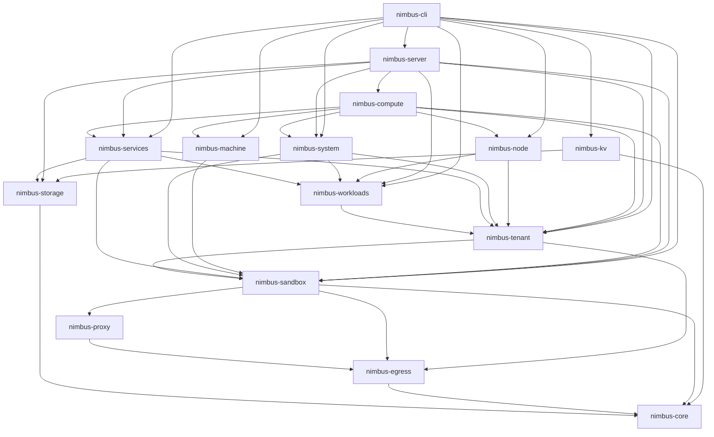
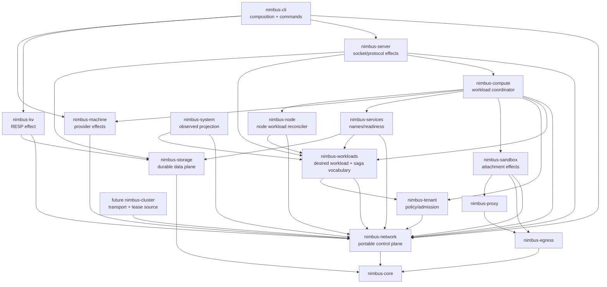

# Nimbus Network Control Plane Plan

Status: `active; NNC0.1b complete; NNC0.2 allocator race baselines in progress`

Owner: this plan is the sole implementation control plane for the
transport-free `nimbus-network` crate and the connectivity-resource lifecycle
it defines. It owns portable network identity, desired plans, durable leases,
generation and epoch fencing, capability satisfaction, reconciliation, and
the shared host-port allocation authority. It does not own packet transport,
protocol bytes, tenant policy, workload execution, service naming, proxy
forwarding, provider effects, system projections, or cluster membership.

Approved direction: Nimbus has three peer infrastructure lifecycles:

- `nimbus-compute` owns workload lifecycle;
- `nimbus-network` owns connectivity-resource lifecycle;
- `nimbus-storage` owns durable-data lifecycle.

The dependency invariant is:

```text
nimbus-network -> nimbus-core
```

`nimbus-network` sits below `nimbus-tenant`, `nimbus-sandbox`,
`nimbus-services`, `nimbus-machine`, `nimbus-kv`, `nimbus-compute`,
`nimbus-server`, `nimbus-system`, and future `nimbus-cluster`. It must not
depend on those crates or on Axum, Pingora, Netavark, nftables, Iroh, openraft,
or a cloud SDK. A future dependency on `nimbus-egress` requires a recorded
owner decision and concrete type-sharing proof; the default is no dependency.

## Recovery Header

This header is the first compaction/restart checkpoint. Update it with every
ledger transition.

| Field | Current value |
| --- | --- |
| Plan status | `active; NNC0.1b complete; NNC0.2 allocator race baselines in progress` |
| Current band | `NNC0 — executable baselines and verifier` |
| Current item | `NNC0.2 — fail-before sandbox/PEP and external machine-port races` |
| Last completed item | `NNC0.1b — persistence-oriented subprocess crash-cut harness` |
| Next action | Read the sandbox `PortManager` and managed-machine probe/drop tests and callers, then use the real-child harness to capture (a) two Nimbus allocator children selecting the same sandbox/PEP port and (b) an acknowledged external binder taking the machine port after probe/drop so the faithful provider bind fails with `AddrInUse` while persisted machine state still claims it. |
| Owner branch | `codex/nimbus-network-architecture-audit` |
| Owner worktree | `/Users/jack/src/github.com/nimbus/nimbus-network-architecture-audit` |
| Audit base | Original architecture audit: `b69007a78a220847812370d9418049f1253f0384`. |
| Execution base | Rebased without conflicts onto `origin/main` at `9c2d4f150c60f43dfdc0a3f1ec6550942e26ab8f` after NNC0.0. |
| Last checkpoint commit | `53ea4986a1e65eebce8504b113943311acdcd52d` — NNC0.1a completion and NNC0.1b activation checkpoint. |
| Audit dirty state | NNC0.1b completion owns the shared process protocol extension, `crates/nimbus-testing/src/process_harness/crash.rs`, the `lib.rs` exports, this plan/routing status, and the force-tracked proof record. No manifest changed. |
| Execution mode | Autonomous implementation goal active; commit each completed item with its ledger/evidence checkpoint; no push or PR without separate authority. |
| Last verification | NNC0.1b: a real child is killed only after the exact named network-shaped boundary, a fresh process reopens the same root and proves state/effect evidence, and wrong-boundary/early-exit/timeout/cleanup/recovery mismatch paths retain complete diagnostics. Focused cargo test and nextest each pass 13 parent tests; check/clippy/format/diff/docs pass. Exact evidence: `docs/private/plans/proof/nimbus-network-control-plane/nnc0.1b-subprocess-crash-cut-harness.md`. |
| Blocking decision | None. NNC0.0 is authorized; no fetch/rebase may precede its durability commit. Exact Rust names otherwise remain band-local decisions subject to NNC0 proofs and the seam-promotion rule. |

Recovery protocol:

1. Before any fetch, rebase, source edit, or cleanup, verify this plan exists,
   inspect `git status --short --branch`, and run
   `git cat-file -e HEAD:docs/private/plans/nimbus-network-control-plane-plan.md`.
   If that proof fails, force-add only this plan plus its routing-index edit and
   commit that checkpoint. Never run `git clean` to recover an owner worktree.
2. Confirm the worktree path and branch before editing; never assume the
   original checkout is clean.
3. Read this header, the Architecture Audit Ledger, Implementation Status
   Ledger, Item Checkpoint Ledger, and current dirty diff.
4. Resume the first `in_progress` row. If none exists, resume the first `todo`
   row whose dependencies are `done`.
5. Re-read only that band, its named files, tests, and overlapping owner plans.
6. Record fail-before evidence before changing the behavior it covers.
7. Update the band row, evidence path, exact command/result, current band, and
   next action in the same checkpoint edit; do not leave more than one item
   uncommitted.
8. If an item is blocked, record the blocker and next safe action here and in
   its ledger row, continue with the next dependency-safe item, and stop with a
   report if no item is executable.
9. A skipped provider lane, missing grep target, unavailable KVM host, or
   command hidden behind a pipe is not a pass.

## Outcome

Nimbus gains one deep module for connectivity-resource lifecycle:

```text
provision: admit -> reserve -> start -> attach -> publish -> observe
teardown:  withdraw -> drain -> stop -> detach -> release -> record
```

The interface hides allocation, fencing, durable transition, provider
selection, compensation, and reconciliation depth. Effect implementations stay
local to the crates that understand them. Callers no longer need to coordinate
several shallow implementations to achieve one network guarantee.

The result must provide:

- stable identity independent of IP address, socket address, process ID, or
  provider handle;
- exactly one host-port lease authority across Nimbus processes on a node;
- portable segment allocation separate from Netavark realization and cluster
  transport;
- explicit host-managed versus provider-managed capability semantics;
- generation-scoped desired, durable, and observed state;
- fail-closed recovery from crash, corruption, stale callbacks, ambiguous
  provider outcomes, and cleanup failure;
- a locally sovereign provider profile with no hidden external dependency;
- deterministic behavior tests at every interface plus structural guards that
  prove no duplicated authority or dependency cycle.

## Binding Architecture Decisions

0. **The implementation control plane is versioned.** Although
   `docs/private/` is ignored by default, this canonical plan is a deliberate,
   narrow force-tracked exception using the precedent established by
   `dd5b178e4`. Staging alone is insufficient: the recovery proof is
   `git cat-file -e HEAD:docs/private/plans/nimbus-network-control-plane-plan.md`.
   No implementation fetch/rebase begins until that proof passes. Private proof
   artifacts remain selectively force-tracked only when a band explicitly
   needs them as durable recovery evidence.
1. **Control plane is not data plane.** `nimbus-network` owns intent, stable
   IDs, lease authority, state transitions, capability satisfaction, and
   reconciliation. Actual binds, packets, forwarding, TLS termination,
   protocol parsing, namespaces, bridges, firewall effects, and machine
   networking remain in their current effect modules.
2. **The crate is low dependency.** Its initial only workspace dependency is
   `nimbus-core`. Upper behavior crates implement injected adapters; the
   contract crate never reaches outward to them.
3. **The module may expose a façade; it does not expose a god provider.**
   Network lifecycle orchestration may have one process composition entrypoint,
   while effect interfaces stay capability-specific and small.
4. **Interfaces must earn their seam.** A product interface is promoted only
   when two real adapters or two materially different consumers demonstrate
   substitution. A fake used only by tests does not by itself justify a public
   abstraction. Capability vocabulary may precede an interface; speculative
   no-op `NameProvider`, `CertificateProvider`, or `ForwardingProvider`
   implementations may not.
5. **Allocation and admission are separate.** `nimbus-tenant` decides whether
   exposure, egress, and quota are allowed. `nimbus-network` allocates only an
   admitted plan and returns attributable usage evidence.
6. **Desired, durable, and observed state are distinct.** `NetworkPlan`
   generation, durable lease/provider state, and `NetworkStatus` are different
   types and stores. `nimbus-system` routes/listeners/ports remain rebuildable
   projections, never desired state or lease authority.
7. **Compute is the sole cross-domain saga coordinator.** `nimbus-compute`
   orders admitted workload, network, service, and retirement work.
   `nimbus-network` reconciles only network-owned identities, leases, and
   provider handles behind idempotent operations. `nimbus-node` remains the
   node workload reconciliation seam and is integrated, not bypassed or
   duplicated. Network recovery never decides by itself whether an ambiguous
   workload should be activated.
8. **Lifecycle uses a persisted state machine and reconciliation, not
   optimistic rollback.** Multi-effect operations are idempotent on stable
   resource ID plus generation. Failure records the exact completed phase;
   compensation proceeds in reverse order or leaves the resource fenced
   `CleanupPending`.
9. **Reuse follows deletion proof.** A port, address, segment, route, listener,
   attachment, or provider identity is reusable only after provider
   detach/unbind is confirmed or a fenced recovery rule proves the old owner
   cannot act.
10. **Cluster allocation and cluster transport are separate seams.** The
   allocator consumes a fenced per-node super-net lease. Future
   `ClusterTransport` owns node identity, membership, discovery, routing, mesh,
   and consensus.
11. **Routed-not-overlay remains binding.** Cluster pool to node super-net to
    tenant segments; cross-node forwarding without VXLAN, Geneve, or a
    stretched tenant L2 domain.
12. **Expired authority fences creation, not cleanup.** An expired or stale
    cluster lease rejects new allocation and publication. It must still permit
    idempotent inspection, detach, quarantine, and release of a durable handle
    from the previously authorized epoch.
13. **Host-global means cross-process.** Sandbox endpoints, PEP listeners,
    server main and sibling listeners, standalone `nimbus-kv`, managed-machine
    listeners, and future providers use one shared node-local lease store and
    lock domain. An in-process singleton alone is insufficient.
14. **Provider bind remains OS truth.** A lease closes races among Nimbus
    owners. The real provider bind closes races with external processes.
    `EADDRINUSE` or equivalent is durable failure evidence; it cannot be hidden
    by the allocator.
15. **Service identity stays logical.** `nimbus-services` owns service names,
    readiness, bindings, and residency. Network owns reachable endpoint and
    attachment handles. DNS/xDS/Consul publication, if ever added, consumes an
    already resolved service binding.
16. **Egress PDP and PEP stay separate.** `nimbus-egress` remains the policy
    decision point and `nimbus-proxy` the enforcement/forwarding point. Network
    composes PEP readiness and listener identity without evaluating or
    weakening policy.
17. **Ingress TLS and interception TLS never share authority.** Public ingress
    certificate material has a separate interface, store, handle type, and
    rotation path from the proxy's per-workload ephemeral interception CA.
18. **Machine networking is capability-described.** Host-managed
    Netavark/gvproxy and provider-managed WSL2 behavior are not represented by
    one boolean and never silently approximate one another. `nimbus-machine`
    remains the single source for each machine provider's facts and maps them
    into network requirement vocabulary; network does not copy the provider
    enum or create a second configuration authority.
19. **The local sovereign profile is mechanically satisfiable.** It starts,
    reconciles, serves local/private endpoints, and tears down without public
    DNS, cloud APIs, hosted certificates, relays, or an external control plane.
20. **Pre-launch migration is direct.** No compatibility aliases, dual lease
    authorities, deprecated endpoint definitions, or legacy readers survive
    closeout.
21. **Network durable state is concept-owned and node-local.**
    `nimbus-network` implements its own local cross-process lease/state store
    and retains `nimbus-core` as its only workspace dependency. It may use
    external filesystem/serialization crates. Existing atomic-write and lock
    implementations in `nimbus-blob`, `nimbus-crypto`, `nimbus-operator`, and
    `nimbus-storage` are design precedents, not reusable workspace
    dependencies. “One authority” prohibits a second store for the same
    network resource; it does not require network state to live in the durable
    data plane.
22. **Workload saga intent is workload-owned and engine-persisted.**
    `nimbus-workloads` owns portable desired-workload and saga-phase
    vocabulary plus its store interface. `nimbus-compute` gains the direct
    `nimbus-workloads` edge and remains the sole cross-domain coordinator. A
    server-owned durable adapter persists saga intent through an existing
    engine-owned internal mutation path; neither the network node store nor
    `nimbus-system` projections may become workload authority. The exact
    internal table/schema and mutation path are recorded before NNC6 begins.
    `nimbus-services` lazy activation and sandbox restart policy are subordinate
    to this durable saga.

## Current Ownership And Dependency Audit

### Current ownership

| Concern | Current module/implementation | Audit result | Target owner |
| --- | --- | --- | --- |
| CIDR validation | `nimbus-core::net::Cidr` | Pure, zero-I/O shared primitive. | Remain `nimbus-core`. |
| Segment vocabulary | `nimbus-core::{NetworkId, NetworkSegment}` | Not provider-neutral: names and identifiers encode Netavark realization, and index-derived IDs can collide across node super-nets. | Stable `NetworkSegmentId` and portable allocation move to `nimbus-network`; bridge/interface/Netavark identity stays in the sandbox adapter handle. |
| Segment allocation | sandbox OCI `network/{segment,cluster}.rs` | Trait is `pub(crate)`, accepts `SandboxId`, and callers expose the concrete single-node allocator. Cluster is not drop-in. | Portable allocator/lease contracts in `nimbus-network`; OCI realization stays sandbox-owned. |
| Per-workload IPAM | sandbox OCI `network/ipam.rs` | Provider-adjacent effect state; direct JSON replacement lacks a recorded crash-durability contract. | Effect remains sandbox-owned; durable/fenced lifecycle must conform to network contracts. |
| Netavark/netns/nft/gvproxy | `nimbus-sandbox` | Correct effect owner; container and krun duplicate lifecycle/compensation knowledge. | Sandbox-owned deep attachment implementation behind the network seam. |
| Endpoint vocabulary | `nimbus-sandbox::endpoint` | Imported by tenant, services, machine, node, server, system, CLI, and facade. Missing stable endpoint ID/generation. | Move/generalize into `nimbus-network`. |
| Exposure and egress admission | `nimbus-tenant` | Policy authority already exists. | Remain `nimbus-tenant`; translate admitted decisions above network. |
| Service naming/readiness | `nimbus-services` | Correct logical owner; stop currently risks withdrawing cached resolution after the awaited backend stop. | Remain services-owned; withdraw/fence before stop. |
| Desired workload/saga state | `nimbus-workloads::DesiredWorkloadStore`, held concretely by `nimbus-services` | Portable interface exists, but the only implementation is in-memory and compute has no workloads dependency. | Workloads keeps vocabulary/interface; compute consumes it; a server-owned adapter persists it through an engine-owned internal mutation path. |
| Workload orchestration | `nimbus-compute::ComputeState` and `nimbus-node::NodeWorkloadReconciler` | Natural composition seams; compute currently has neither a connectivity manager nor a workloads edge, and sandbox backends can self-restart from `inspect()`. | Inject one shared network façade/manager; compute owns the sole saga and drives restart; node reconciliation remains integrated. |
| Main and sibling listeners | `nimbus-server` | Socket/protocol effects are correctly local; `WireProtocolAdapter` has multiple real adapters and is a proven seam. | Preserve implementation; consume shared port leases and report provider status. |
| RESP listener | `nimbus-kv` plus CLI | Can run as a separate process, so process-local port authority is insufficient. | Retain RESP implementation; use the cross-process node lease store or adopt a pre-bound listener. |
| CLI port probes | CLI start adapters and development wire resolver | Production probe/drop checks have no durable reservation and can race an external binder. | Migrate or adopt through the shared authority; classify command-local/test-only ephemeral binds explicitly. |
| Sandbox machine-port proxy | OCI `MachinePortProxy` | Production socket bind is a provider effect outside the current manifest-scanning census. | Keep bind effect sandbox-owned; consume/adopt a shared lease and report its provider state. |
| Egress policy/enforcement | `nimbus-egress` / `nimbus-proxy` | Deliberate PDP/PEP split; sandbox owns proxy lifecycle. | Preserve; migrate only PEP listener reservation and readiness handles. |
| Observed routes/listeners/ports | `nimbus-system` | Projection records lack stable lease/provider generation authority and may record “listening” before task liveness is proven. | Remain observed projection; consume generation-scoped status. |
| Machine capabilities | five-field `nimbus-machine::MachineProviderCapabilities` | Only the networking-ownership axis is a boolean; it is too shallow for exposure, isolation, forwarding, durability, or sovereignty. WSL2 already rejects its unavailable start/stop backend fail closed. | Confirm and extend portable network capability dimensions without merging this VMM-provider record with segment allocation; machine retains effects. |
| Machine port allocation | CLI machine manager | Separate locked JSON allocator plus probe-then-drop bind, leaving a TOCTOU window. | Delete after shared cross-process lease migration. |
| Cluster transport | documentation-only future `nimbus-cluster` | No current crate/product implementation. | Separate future seam under horizontal scaling. |

### Current dependency shape

Arrows mean “depends on.” This is the ownership-relevant production dependency
slice, not the complete workspace graph. NNC0.1 generates the complete
machine-readable normal/dev/target/feature graph with source `HEAD`; the slice
below must stay derivable from that artifact.



The existing edges `nimbus-tenant -> nimbus-sandbox` and
`nimbus-system -> nimbus-tenant + nimbus-sandbox` make any
`nimbus-network -> tenant|sandbox|system` design cyclic.

### Target dependency shape



Some existing upper-crate edges remain intentionally omitted from this relevant
slice and may remain until their owning plans remove them. NNC0.1 and NNC9.3
prove the complete production, dev/test, target-conditioned, and all-feature
graphs separately. The binding assertion is that the new crate has no reverse
edge and creates no cycle.

## Complexity And Reliability Findings

| ID | Severity | Pocket of complexity | Consequence | Required response |
| --- | --- | --- | --- | --- |
| NNCF1 | critical | Sandbox `PortManager` scans manifests and returns the first free number without one atomic host reservation. | Concurrent sandbox/PEP planning can select the same port, and other owners are invisible. | Deterministic collision proof then one cross-process `PortLease` authority. |
| NNCF2 | critical | Machine ports probe with a temporary socket, release it, then bind later; server and KV have separate direct bind paths. | TOCTOU and multiple authorities prevent a node-wide guarantee. | Shared locked store plus bind/adopt protocol; migrate every production owner before deleting old allocators. |
| NNCF3 | critical | Segment release durably frees the allocation before bridge/provider cleanup. | A stale bridge/CIDR can coexist with a newly reused segment after cleanup failure. | Two-phase `CleanupPending` quarantine; release only after inspected detach. |
| NNCF4 | high | Segment and IPAM state use locked direct JSON replacement without an explicit atomic replace/fsync/version/checksum contract. | Crash or torn write can erase authoritative ownership or force unsafe guesswork. | Versioned, checksummed, atomic durable state with fail-closed corruption behavior and subprocess crash proof. |
| NNCF5 | high | Netavark setup can succeed before status persistence fails; partial forwarding loops can succeed before a later step fails. | Provider effects become ambiguous and compensation may miss them. | Stable idempotency key/handle, inspect-before-retry/delete, reverse compensation, ambiguity tests. |
| NNCF6 | high | Container and krun duplicate network setup/cleanup choreography; krun can treat netns-path existence as readiness for firewall pinning. | Caller-local knowledge drifts and can mistake a partial attachment for a safe one. | Sandbox-owned deep attachment lifecycle implementation with phase/generation and shared contract tests. |
| NNCF7 | high | `NetworkSegmentAllocator` is private and concrete accessors leak `SingleNodeSegmentAllocator`; it accepts `SandboxId`. | Cluster-shaped allocator is not substitutable and portable allocation inherits sandbox identity. | Public/injectable allocator contract using neutral `NetworkAttachmentId`; trait-object consumers. |
| NNCF8 | high | `NetworkId` derives from a local index and `NetworkSegment` carries Netavark names. | IDs can collide across node super-nets and portable callers learn provider realization. | Globally stable segment ID; split logical allocation from provider handle. |
| NNCF9 | high | Placement checks block zero and grows a new block when full without revisiting existing secondary blocks. | Capacity can be stranded and repeated growth can diverge from the allocator's comment/intent. | Fail-before existing-secondary-reuse test and atomic allocation operation. |
| NNCF10 | high | `ClusterSegmentAllocator::release` requires an unexpired lease. | Lease expiry can prevent safe cleanup and strand fenced resources. | Separate create authority from cleanup authority; stale epochs cannot create, but durable old handles remain cleanable. |
| NNCF11 | high | Service stop awaits backend stop before the cached endpoint is necessarily withdrawn. | Resolution can continue publishing/routing while teardown is underway. | Fence/withdraw first, then drain/stop; deterministic concurrent lookup/stop test. |
| NNCF12 | medium | Listener/system records are address- and label-oriented and can be written before sustained task liveness. | Stale observation can look authoritative or current. | Stable IDs/generations/conditions; projection remains independently retryable and rebuildable. |
| NNCF13 | medium | `PublishedEndpoint` has no stable identity, generation, exposure class, or provider handle. | Address changes look like identity changes; stale updates cannot be rejected mechanically. | Network-owned endpoint identity and generation. |
| NNCF14 | medium | The networking axis inside the five-field machine capability record is summarized as `uses_provider_networking`. | Existing unavailable WSL2 behavior fails closed, but supported provider modes still cannot describe isolation/exposure/sovereignty requirements precisely. | Confirm-and-extend capability matrix with typed unsatisfied-requirement errors; keep VMM capabilities distinct from segment allocation. |
| NNCF15 | medium | No single interface states the twelve-stage cross-owner lifecycle. | Future adapters can publish early, release early, or fork compensation rules. | Persisted lifecycle state, exact transition guard, and observer-driven contract suite. |
| NNCF16 | critical | Segment hold/attachment identity is acquired after Netavark/netns effects, while manifests are written only after configuration/spawn. | A crash can leave a live effect with no durable owner and make its identity reusable or invisible to manifest scans. | Durably reserve attachment, exact segment association, and effect attempt before the first external effect; inspect/adopt or quarantine on restart. |
| NNCF17 | critical | Sibling listeners start sequentially; failure of a later adapter can detach earlier tasks, and spawned task errors are not supervised as group state. | Startup may return failure while an earlier protocol listener continues accepting without coherent withdrawal/release. | Server-owned structured `ListenerGroup`/ingress runtime that prepares leases/sockets, activates as a group, supervises task death, and unwinds every partial start. |
| NNCF18 | high | Cross-domain recovery authority is ambiguous between compute and network, while desired workload state is not uniformly durable. | Network-only restart logic cannot safely decide whether an attached workload should activate, publish, or compensate. | `nimbus-compute` is sole saga coordinator; define a durable saga intent/phase handoff and integrate `nimbus-node` reconciliation. |
| NNCF19 | medium | `nimbus-system` `routes` denotes HTTP method/path/adapter inventory, not connectivity forwarding routes. | Reusing the name/identity can collide two unrelated projections and blur observed ownership. | Structurally distinct connectivity-route observation kind/table and one conversion locality. |
| NNCF20 | critical | Container and krun `inspect` paths may execute backend restart policy and launch a workload. | An observation interface is a second workload coordinator and can race withdrawal or activate a stale generation without current attachment/PEP proof. | Make inspection side-effect-free; compute alone decides restart through the durable prepare→attach→activate saga; fenced generations veto restart. |
| NNCF21 | high | Production CLI dev/start probe-drop paths and the sandbox `MachinePortProxy` bind sit outside the original listener census. | A “one authority” migration can close while real callers still race or bind without a lease. | Exhaustive source-derived bind/allocation inventory with explicit migrate/adopt/exempt disposition and static unclassified-bind rejection. |

## Independent Review Disposition

The 2026-07-23 Fable review was treated as a set of falsifiable hypotheses and
rechecked independently against source, dependency metadata, git rules, active
plans, and all four explanatory HTML artifacts. Every finding is incorporated;
the amendments below prevent inaccurate evidence from becoming architecture
truth.

| Finding | Disposition | Verified correction or decision | Owning items |
| --- | --- | --- | --- |
| F1 | accepted and strengthened | The ignored plan is not durable; a proof mirror under `docs/private` would also be ignored. Commit `dd5b178e4` establishes a narrow force-track precedent. `HEAD` containment, not staging, is the recovery proof. | NNC0.0, NNC0.8, NNC9.1 |
| F2 | accepted with evidence amendment | Durable-write precedents also exist in blob, crypto, and operator. Network implements one concept-owned local store and retains only the core workspace edge. | decisions 2/21, NNC2.1 |
| F3 | accepted | Workloads owns portable desired/saga vocabulary; compute gains the workloads edge and coordinates; a server adapter persists through an engine-owned mutation path. | decision 22, NNC6.1b-e |
| F4 | accepted and strengthened | Both sandbox `inspect` implementations can launch through restart policy. Inspection becomes side-effect-free; compute is the only restart authority. | NNC0.6a, NNC5.6, NNC6.4a, NNC8.4 |
| F5 | accepted with inventory correction | CLI dev/start probes and `MachinePortProxy` are production gaps. Cited runtime egress and auth/token binds are test-only and remain classified exemptions. | NNC0.1, NNC3.4, NNC3.7a-b, NNC3.9 |
| F6 | accepted with authority guard | The goal now requires a committed plan before fetch, clean-checkpoint rebase, item commits, blocker continuation/stop, and a 150-turn cap. It does not grant push/PR authority. | recovery protocol, autonomous goal |
| F7 | accepted with precedent amendment | Thread barriers and process helpers exist, but no reusable deterministic two-process lease or named crash-cut harness exists. New proof infrastructure cannot create a `nimbus-network -> nimbus-testing` dev edge. | NNC0.1a-b and named consumers |
| F8 | accepted and strengthened | Current reaping is netns-filename/allocator-state based. Durable attachment intent/provider-attempt state—not a manifest alone—is target authority; unmatched effects are removed or quarantined. | NNC0.7, NNC5.2a, NNC8.3 |
| F9 | accepted with graph-kind amendment | The earlier diagram omitted workloads, node, CLI, storage, and KV→storage. Production, dev/test, target-conditioned, and all-feature graphs are proven separately. | diagrams, NNC0.1, NNC9.3 |
| F10 | accepted | Sovereignty needs a privileged Linux isolation/tripwire harness with positive controls, DNS capture, IPv4/IPv6 deny counters, syscall/network evidence, and a complete lifecycle. | NNC4.7, NNC9.2 |
| F11 | accepted | Machine allocation already serializes Nimbus callers; the real unsafe window is an external binder after probe/drop and before gvproxy/provider bind. | NNC0.2, NNC3.3, NNC3.7 |
| F12 | accepted | Advisory locking and durable replacement are supported only on a same-host local filesystem; detectable unsupported network filesystems fail closed. | decision 21, NNC2.1 |
| F13 | accepted cleanup | The plan’s seam-promotion rule wins. All four earlier HTML artifacts are marked superseded where they predeclare provider interfaces or DNS/TLS/LB effects. | NNA7 artifact cleanup |
| F14 | accepted | NNC2 updates the horizontal-scaling ledger/reference in the same shared-seam checkpoint; it does not fork cluster authority. | NNC2.8 |
| F15 | accepted with nuance | Machine capabilities already have five fields and unavailable WSL2 fails closed. Only the networking axis needs confirm-and-extend; VMM capability and segment allocation stay distinct. | NNCF14, NNC4.4 |

### Software-pattern review

The target uses these patterns deliberately:

- **Deep module:** a small transport-free interface hides identity, allocation,
  durability, fencing, compensation, and reconciliation complexity.
- **Ports and adapters:** network defines portable capability and lifecycle
  vocabulary; a product effect interface is promoted only after substitution
  earns it. Sandbox, server, KV, and machine modules retain the implementations
  that know their providers; future cluster transport stays separate.
- **Persisted state machine:** explicit phases and legal transitions replace
  booleans inferred from filesystem paths or observed addresses.
- **Fenced lease:** stable owner plus generation/epoch prevents stale actors
  from republishing or reusing a resource.
- **Reconciliation loop:** provider inspection resolves ambiguous outcomes;
  retries are bounded and idempotent instead of recreating effects blindly.
- **Compensating workflow:** partial multi-provider work is unwound in reverse
  order or quarantined; there is no fictional cross-provider transaction.
- **Anti-corruption boundary:** provider realization names/DTOs remain inside
  the adapter and are represented portably by opaque handles and observations.
- **Command/observation separation:** desired commands and durable authority do
  not depend on eventual `nimbus-system` projections.
- **Capability satisfaction:** deterministic matching explains exactly which
  admitted requirement cannot be met; it never silently weakens a plan.

Patterns explicitly rejected:

- a god `NetworkProvider`;
- speculative interfaces with one product adapter and no real substitution;
- using an IP, port, filesystem path, bridge name, or provider DTO as identity;
- distributed transactions across effects;
- best-effort cleanup followed by immediate reuse;
- polling sleeps as concurrency or readiness proof;
- using system projections as locks, leases, or desired state;
- moving all code containing “network” into the new crate.

### Deletion test

The extraction is deep enough only if it deletes:

- the production sandbox manifest-scanning port allocator;
- the independent machine port allocator/probe authority;
- concrete `SingleNodeSegmentAllocator` accessors at placement consumers;
- `SandboxId` from portable allocation;
- provider bridge/interface naming from portable segment intent;
- duplicated endpoint type definitions or compatibility re-exports;
- caller-local publication/cleanup ordering;
- address-as-identity assumptions in status projection;
- any second production port lease or segment allocation authority.

If the implementation adds a registry and traits without deleting this caller
knowledge, the seam is shallow and the band is not complete.

## Target Resource And State Model

Exact Rust spelling lands in NNC1 only after NNC0 tests constrain behavior.
The semantics are binding:

- `NetworkPlanId`: stable identity of compiled connectivity intent;
- `NetworkResourceGeneration`: monotonic desired generation within a plan;
- `NetworkAttachmentId`: neutral workload-to-network attachment identity;
- `NetworkSegmentId`: globally stable allocation identity, not a local index;
- `PublishedEndpointId` (final spelling may vary): stable published network
  endpoint identity; do not reuse the horizontal-scaling/Iroh `EndpointId`
  vocabulary;
- `ListenerId`: stable listener identity independent of address;
- `IngressRouteId`: stable route identity;
- `PortLeaseId`: stable reservation identity;
- `NetworkProviderId`: stable provider registration identity;
- `NetworkProviderHandle`: opaque, redacted, provider- and generation-scoped;
- `EndpointProtocol`: generalized current published endpoint protocol;
- `EndpointIntent`: admitted requested endpoint shape;
- `PublishedEndpoint`: actual reachable location plus stable ID/generation;
- `NetworkPlan`: provider-neutral desired resources, capability requirements,
  dependency handles, and generation;
- `NetworkCondition` / `NetworkStatus`: observed provider evidence, never
  allocation authority.

`TenantId` and `WorkloadId` remain in `nimbus-core`. `Cidr` remains there while
it is genuinely shared and zero-I/O. `NetworkAttachmentId` must distinguish
multiple named attachments and workload reincarnations; it is not merely a
renamed `WorkloadId`. Address and provider identity remain observations.

Every desired generation carries a canonical plan digest. The same generation
and digest is idempotent; the same generation with different desired content
fails closed. This prevents equal-generation divergence and ABA-like stale
callbacks.

### Portable segment versus provider realization

```text
AllocatedSegment
  { segment_id, cidr, tenant attribution, node lease epoch, generation }
       |
       v
sandbox attachment adapter
  { opaque provider handle, bridge/interface/network names, netns, status }
```

The portable interface never exposes Netavark names. Provider realization is
persisted only as the opaque handle and provider-owned inspectable state needed
for idempotent reconciliation.

### Desired, durable, and observed state

```text
admitted caller intent
  -> NetworkPlan { stable IDs, generation, requirements }
    -> durable transition/lease records
      { phase, epochs, provider IDs/handles, cleanup fence }
        -> provider effects
          -> generation-scoped observations
            -> nimbus-system and operator projections
```

The initial durable node store is implemented directly inside
`nimbus-network`; `nimbus-core` remains its only workspace dependency. It must
provide:

- one cross-process lock/transaction domain;
- atomic temp write, file sync, rename/replace, and parent-directory sync;
- versioned records and checksums;
- explicit incompatible-version and corrupt-record errors;
- no reconstruction by guessing from live addresses;
- deterministic restart/reconciliation ordering;
- bounded retention/compaction that never discards cleanup-pending ownership;
- permissions that do not expose provider secrets or tenant-sensitive handles.

The implementations in `nimbus-blob`, `nimbus-crypto`, `nimbus-operator`, and
`nimbus-storage` are design and test precedents for durable replacement,
checksums, lock ordering, and parent-directory sync. They are not imported
workspace utilities. The network module owns one schema, one lock domain, and
one durable-write implementation for all of its resources; no second network
state authority is permitted.

The state root is supported only on a same-host local filesystem whose advisory
locks, atomic same-filesystem rename/replace, file sync, and parent-directory
sync semantics satisfy the recorded startup capability probe. NFS, SMB, and
other network-mounted state roots are unsupported. When the filesystem type or
required semantics are detectable and unsupported, startup fails closed before
reading or allocating resources; an operator override cannot silently weaken
the contract.

### Durable workload/network saga handoff

The cross-domain saga is not stored in the network node store. Its portable
record belongs to `nimbus-workloads` and identifies at least workload/tenant,
desired workload generation, current saga phase, `NetworkPlanId`, network
generation/digest, activation/publication intent, and last committed
transition. The store interface uses generation/CAS semantics.

A server-owned adapter persists that record through one existing engine-owned
internal mutation path selected and named by NNC6.1b. `nimbus-compute` is the
only writer of saga transitions. Services lazy activation, node reconciliation,
and sandbox exit inspection report inputs or execute issued phase commands;
they do not decide or persist an independent desired phase.

There is no fictional transaction spanning the workload store, network node
store, and provider effects. Compute commits desired saga intent before the
first network reservation, calls idempotent generation-scoped operations, then
commits the next saga phase. After a crash, a fresh process reads the durable
saga plus network/provider inspection and chooses retry, activation,
publication, compensation, or fenced cleanup. It never reconstructs workload
desire from an address, manifest, network phase, or observed system projection.

### `PortLease` semantics

A lease records:

- stable lease and owner resource IDs;
- tenant attribution when applicable;
- desired generation and lease epoch;
- TCP/UDP protocol;
- bind realm, address family, requested exposure, and overlap domain;
- requested exact port/range or provider-assigned mode;
- actual address/port after bind/adoption;
- provider ID/opaque handle;
- provenance: Nimbus-owned bind, provider-assigned bind, or externally
  owned/inherited listener;
- phase: `Reserved`, `Binding`, `Active`, `Withdrawing`,
  `CleanupPending`, `Released`, or terminal failure;
- timestamps/renewal data where the chosen lease model requires them.

Conflict rules:

- TCP and UDP are separate;
- wildcard conflicts conservatively with specific addresses in one bind realm;
- IPv4/IPv6 dual-stack overlap defaults to conflict unless host/provider
  capabilities prove otherwise;
- isolated realms may reuse a number only when the adapter proves non-overlap;
- provider-assigned port `0` is adopted into the durable lease before publish;
- pre-bound/systemd sockets are adopted by stable lease identity and verified
  against the requested plan;
- externally owned/inherited sockets are observed and fenced but never released
  as Nimbus-owned resources;
- failed or ambiguous binds never publish and remain inspectable/fenced;
- tenant quota remains an admission decision above the allocator.

### Provider capabilities and sovereignty

Capabilities describe, at minimum:

- `NimbusHostManaged` versus `ProviderManaged`;
- attachment and tenant-isolation modes;
- address families and bind realms;
- loopback/private/public exposure;
- protocol families;
- exact, Nimbus-allocated, or provider-assigned ports;
- host/path/TLS/WebSocket/streaming ingress features where implemented;
- forwarding and drain behavior;
- durable inspect/reconcile/delete support;
- local-only, operator-local, or third-party control-plane dependencies;
- public-network, DNS, hosted certificate, or relay requirements;
- offline restart/reconciliation support.

Provider selection is deterministic. Missing capability errors name the
provider, requirement, and safe alternatives. Nimbus never silently chooses a
cloud provider, weakens exposure/isolation, bypasses TLS, or makes
proxy-required egress direct.

The local sovereign profile requires:

- local durable segment and port allocation;
- host-managed sandbox attachment;
- loopback/private listener publication;
- required PEP readiness;
- local inspection, teardown, and orphan reconciliation;
- offline restart;
- no DNS, cloud API, hosted certificate, relay, or external control plane.

Public DNS, public load balancing, ACME, tunnels, and provider-managed cloud
networking remain optional providers added only for an approved consumer.

## Lifecycle Contract

### Provision

1. **Admit — tenant/compute.** Resolve principal, tenant, workload, exposure,
   egress, quota, and provider constraints.
   Success: admitted intent has a stable request identity.
   Failure proof: zero durable network record, lease, provider call, or
   projection.
2. **Reserve — network.** Persist plan generation; reserve attachment, segment,
   endpoint, listener, route, and port identities; choose satisfying providers.
   Success: all reservations are durable and fenced.
   Failure proof: exact completed reservations compensate or remain
   `CleanupPending`; none are published.
3. **Start (prepare) — compute/services.** Create an inert workload envelope
   without making the service resolvable or allowing guest application
   execution.
   Success: stable workload handle accepts the reserved attachment identity.
   Binding interpretation: this preserves the approved public word `start`,
   but it means preparation, not tenant execution.
4. **Attach, then activate — provider adapter plus compute.** Realize
   namespace/bridge/IPAM, provider networking, forwarding prerequisites, and
   required PEP path.
   Success: inspection proves the exact generation and all required safety
   effects, including firewall/pin state—not merely netns-path existence.
   Only then may compute activate process/VMM execution. No tenant instruction
   may execute before attachment and required PEP evidence are ready for the
   same generation.
5. **Publish — ingress/name/forwarding effect owners.** Activate reachable
   listeners/routes only after workload, attachment, and required PEP readiness.
   Success: actual endpoint is durably adopted and tied to the plan generation.
6. **Observe — network/system.** Emit status and project actual endpoint,
   provider, generation, conditions, and diagnostics.
   Success: stale observations cannot overwrite a newer generation; projection
   failure does not affect authority.

### Teardown

1. **Withdraw — services/network.** Fence the generation and remove resolution,
   routes, names, and listener admission before awaited backend stop.
   Success: concurrent lookup cannot obtain a newly routable handle.
2. **Drain — services/forwarding owner.** Stop new routing and drain held
   connections under service residency/owner epochs.
   Success: drain is bounded and reports remaining work explicitly.
3. **Stop — compute.** Stop workload execution and obtain confirmation.
   Success: no old workload can act on the fenced identity.
4. **Detach — provider adapter.** Inspect and remove forwarding, PEP lifecycle
   binding, attachment, namespace/bridge, and machine/provider effects.
   Success: provider deletion is confirmed or resource remains
   `CleanupPending`.
5. **Release — network.** Release ports, addresses, holds, and segments only
   after safe detach/unbind proof.
   Success: property/model test permits reuse only after the proof transition.
6. **Record — system/audit.** Publish terminal condition and cleanup evidence.
   Success: projection may retry/rebuild without changing released/fenced
   authority.

## Failure, Rollback, And Reconciliation Contract

| Failure/cut | Required converged behavior | Required proof |
| --- | --- | --- |
| Admission reject | No state/effect. | Zero-call mock plus empty durable store. |
| Saga-intent commit ambiguous | Inspect/CAS the engine-owned record; do not reserve, activate, or infer desire until the committed generation is known. | Response-lost mutation plus fresh-process recovery. |
| Partial reservation | Reverse compensation or fenced cleanup-pending records. | Fault after each durable reservation. |
| Start failure | Never attach/publish; safe release after absence proof. | Lifecycle observer exact sequence. |
| Attach create ambiguous | Inspect stable handle/idempotency key; no duplicate create or segment release. | Provider fake returns effect-created/response-lost. |
| Netns exists but firewall/pin absent | Attachment remains not ready and ingress withdrawn. | Crash cut between each sandbox attachment effect. |
| Required PEP not ready | No ingress; no direct fallback; compensate or fence. | Existing PDP/PEP behavior plus network observer. |
| Listener bind fails | Durable failure; no publication; new retry generation only. | Real external collision and fake ambiguous bind. |
| Partial forwarding/publish | Inspect and withdraw every possibly visible handle. | Fail Nth effect with deterministic injector. |
| Crash after attach | Restart inspects exact generation, publishes once or compensates. | Subprocess crash/restart matrix. |
| Crash after publish | No duplicate publish; stale callback cannot reactivate. | Restart plus delayed callback. |
| Exit inspection races withdrawal | Inspection has no side effect; fenced generation vetoes restart; admitted retry follows prepare→attach→activate. | Container/krun semantic barrier race. |
| Withdrawal fails | Generation fenced; no new routing; resource not reused. | Concurrent lookup/stop and cleanup-pending tests. |
| Stop/detach ambiguous | Quarantine; inspect before retry/reuse. | Provider deletion response lost. |
| Cluster lease expires | Reject new create; allow safe cleanup of durable old handle. | Fake clock/epoch tests. |
| Stale epoch callback | Activation ignored; bounded old-handle cleanup evidence accepted. | Generation/epoch model test. |
| Projection failure | Retry independently; authority unchanged. | Delete/rebuild/lag system tables. |
| Torn/corrupt state | Fail closed with actionable path; never guess allocations. | Truncation/checksum/version/subprocess tests. |
| Unsupported state-root semantics | Refuse startup before opening authority or allocating. | Detectable NFS/SMB/network-root capability test. |
| Lock unavailable | Bounded failure/diagnostic; no unlocked mutation. | Cross-process lock contention test. |
| Provider cleanup fails | Allocation stays `CleanupPending`; no reuse. | Existing segment/port reuse fail-before and pass-after. |
| Orphan evidence incomplete/unknown | Durable owner/effect is adopted, removed, or quarantined; netns filename never proves liveness. | Full hold/intent/effect/manifest/inspection matrix. |

Retry loops must be bounded, cancellable, backoff-aware, and observable.
Metrics use bounded-cardinality labels; stable IDs belong in structured logs or
traces, not unbounded metric labels. Provider handles are redacted.

## Test Architecture And Enterprise Evidence

The network interface is the primary behavioral test surface. Implementation
details receive local unit tests only where they add a distinct invariant.

### Proof layers

1. **Static ownership proof**
   - `cargo metadata` dependency graph;
   - forbidden dependency/import scan;
   - exactly-one endpoint, segment allocator, and port lease authority;
   - no network crate transport/effect implementation.
2. **Pure/model proof**
   - property tests for CIDR/segment disjointness, port conflict keys, stable
     IDs, legal transitions, generation ordering, and safe reuse;
   - a reference state machine checked against randomized transition scripts;
   - seed printed and reproducible on failure.
3. **Deterministic concurrency proof**
   - bounded thread barriers and a semantic parent/child control channel, never
     polling sleeps;
   - real cross-process same-root races with exact ready/entered/release/complete
     acknowledgements;
   - exact winning lease, losing identity/generation, early-exit, timeout, and
     cleanup diagnostics asserted.
4. **Durability/crash proof**
   - the parent kills only after the exact named network write/effect boundary;
   - fsync/replace failure injection where supported;
   - restart the same state root in a fresh process from each persisted phase;
   - corrupt/truncated/incompatible records fail closed.
5. **Adapter contract suites**
   - every real attachment/ingress/forwarding adapter runs the same lifecycle,
     idempotency, ambiguity, and cleanup suite;
   - a skipped environment lane is reported as `SKIPPED`, never `PASS`;
   - KVM/Netavark lanes retain their existing owner proof.
6. **Integration proof**
   - admission through compute to attach/publish/observe;
   - teardown race with concurrent service resolution;
   - cross-owner listener conflicts: sandbox/PEP/server/KV/machine;
   - system projection lag/rebuild cannot affect live authority.
7. **Sovereignty proof**
   - privileged Linux namespace/nft/DNS/syscall tripwire with passing positive
     controls denies and detects external network/control-plane attempts;
   - pre-staged local/private provision, restart, reconcile, and teardown
     succeed;
   - evidence records zero unexpected DNS or denied-output attempts.
8. **Structural closeout**
   - legacy allocators/types deleted;
   - docs and dependency diagrams reflect code;
   - focused suites, clippy, docs gates, and `make ci` record exact results.

Reuse `nimbus-testing` utilities only in upper-layer integration harnesses whose
dependency direction permits it. The low-level network crate may not take the
current upper-layer `nimbus-testing` as a normal or dev dependency. Put its
network-scoped fault points and child-role protocol in a dependency-safe local
test support module; keep provider-local helpers beside the owning adapter until
two owners genuinely need them.

### Test quality rules

- Every test names the invariant and asserts a specific state/effect result.
- Timing tests use bounded semantic waits and fail loudly.
- No test passes only because no panic occurred.
- Fail-before tests must fail for the expected reason before the implementation
  changes.
- Expected-red static checks name the missing target; missing input is not
  success.
- Evidence records command, exit status, test count, environment/capability,
  skipped lanes, seed, and artifact path.
- A proof is not complete while the corresponding old authority remains
  callable in production.

## Staged Extraction Bands

Each task has an independently verifiable success criterion. A band becomes
`done` only when every task and its evidence are recorded in the ledger.

### NNC0 — Executable baselines and expected-red verifier

Dependencies: architecture audit `NNA0-NNA7`.

| Task | Work | Verifiable success criterion |
| --- | --- | --- |
| NNC0.0 | Make this implementation control plane durable before reconciling the branch. | A focused commit contains this force-tracked plan plus its routing edit; `git cat-file -e HEAD:docs/private/plans/nimbus-network-control-plane-plan.md` passes before the first fetch/rebase, and the Recovery Header records the checkpoint commit. |
| NNC0.1 | Record current dependency/owner graph and exhaustive bind/allocation inventory from `cargo metadata` and source scans. | Machine-readable artifacts record source HEAD, command, dependency kind/target/feature/optionality, every production bind/probe/adoption/inherited-socket site, and one disposition per site; normal, dev/test, target-conditioned, and all-feature cycle checks are distinct. |
| NNC0.1a | Build a deterministic two-process contention harness outside the low-level crate. | A parent coordinates two real child roles over one state root with bounded semantic ready/entered/release/complete acknowledgements; exactly one winner is proven, and missing participant, wrong checkpoint, early exit, timeout, and cleanup self-tests report role/stdout/stderr/status/last checkpoint without sleeps. |
| NNC0.1b | Build a persistence-oriented subprocess crash-cut harness with network-scoped fault points. | The parent kills only after the exact named boundary acknowledgement, restarts the same root, asserts durable state/effect, and self-tests wrong boundary/early exit/timeout/cleanup; `nimbus-network` gains no normal or dev edge to the current upper-layer `nimbus-testing`. |
| NNC0.2 | Add fail-before concurrent sandbox/PEP selection and real external-owner machine probe/bind race tests. | Two Nimbus allocator children expose the sandbox/PEP collision; separately, an external binder acknowledges ownership of the exact machine port after probe/drop and before a faithful provider bind, which fails specifically with `AddrInUse` while persisted machine state still claims that port. |
| NNC0.3 | Add fail-before segment cleanup-failure/reuse test. | Provider cleanup is forced to fail and the current allocator demonstrably reuses or exposes the unsafe state. |
| NNC0.4 | Add fail-before torn/corrupt segment/IPAM state tests. | Truncation or exact crash cut produces the named unsafe/unhandled behavior, never an unrelated failure. |
| NNC0.5 | Add fail-before secondary-block reuse and expired-lease cleanup tests. | Current growth/cleanup behavior fails for the exact audited reason. |
| NNC0.6 | Add fail-before concurrent service lookup/stop and partial attachment readiness tests. | A barrier exposes post-withdraw ordering or incomplete-effect readiness without sleeps. |
| NNC0.6a | Add fail-before inspect/self-restart versus withdrawal test for container and krun. | A semantic barrier proves current `inspect` can launch through restart policy and identifies the stale-generation race; the failure cannot be satisfied by a readiness-only assertion. |
| NNC0.7 | Add fail-before effect-before-durable-hold, orphan-reaper blind-spot, and partial sibling-listener startup tests. | Crash after provider effect leaves named missing ownership evidence; the matrix exposes netns/effect-without-hold, hold-without-desired-attachment, and unmatched artifact blind spots; failing the kth adapter proves whether prior tasks remain live. |
| NNC0.8 | Add `scripts/verify-nimbus-network-control-plane.sh` expected red. | Script fails with named missing crate/duplicate-authority/unclassified-production-bind conditions, proves the plan is present in `HEAD`, and never reports missing grep inputs as pass. |
| NNC0.9 | Capture baseline performance/behavior, not optimize. | Listener/start/stop smoke behavior and allocation scale are recorded so extraction regressions are visible. |

Band gate: the plan is branch-durable; every dependency/bind owner is
classified; the net-new child-process harnesses self-test; and every risk
family has reproducible fail-before evidence or a written static proof that the
state is unreachable.

### NNC1 — Low-dependency crate and portable vocabulary

Dependencies: NNC0.

| Task | Work | Verifiable success criterion |
| --- | --- | --- |
| NNC1.1 | Create workspace `nimbus-network` depending only on `nimbus-core`. | `cargo metadata` shows exactly the approved workspace edge and no cycle. |
| NNC1.2 | Add stable plan/attachment/segment/endpoint/listener/route/lease/provider IDs and generation/epoch types. | Round-trip/property tests prove stability, domain separation, and ordering. |
| NNC1.3 | Move/generalize endpoint protocol and published endpoint vocabulary. | Every former sandbox consumer imports the network owner; serialization/API behavior is explicitly tested; no compatibility re-export remains. |
| NNC1.4 | Split portable segment allocation from Netavark realization. | Portable source contains no bridge/interface/Netavark naming; two node super-nets cannot mint colliding segment IDs. |
| NNC1.5 | Define desired/durable/observed types and legal phase transitions. | State-machine tests reject every illegal/backward/stale transition. |
| NNC1.6 | Deepen the static verifier. | Forbidden dependencies/effects, duplicate definitions, and address-as-ID patterns fail by named condition. |

Band gate: the crate is useful without an effect provider and all portable
vocabulary has exactly one owner.

### NNC2 — Crash-safe durable state and segment authority

Dependencies: NNC1.

| Task | Work | Verifiable success criterion |
| --- | --- | --- |
| NNC2.1 | Implement one network-owned atomic, versioned, checksummed local state contract. | Named NNC0 subprocess harnesses prove crash, truncation, incompatible-version, durability-event ordering, restart, and same-host lock contention fail closed; metadata proves only the core workspace edge; startup rejects a detectable NFS/SMB/network state root and records the supported local-filesystem assumptions. |
| NNC2.2 | Move/generalize allocator contracts to `NetworkAttachmentId`. | No portable type mentions `SandboxId`; container and krun consume injected trait objects without downcast. |
| NNC2.3 | Make allocation atomic across all existing tenant blocks. | Property and fail-before regression tests reuse capacity in existing secondary blocks before growth. |
| NNC2.4 | Add globally stable segment ID and node lease epoch. | Cross-node-super-net property tests show no collision; stale epoch cannot allocate. |
| NNC2.5 | Add two-phase detach/release quarantine. | Forced bridge/provider cleanup failure or uncertain orphan inspection leaves segment unavailable; confirmed removal of provider effect, persistent netns artifact, hold, and allocation in the specified order makes it reusable exactly once. |
| NNC2.6 | Separate create authority from cleanup authority on lease expiry. | Expired lease rejects allocate/grow but permits idempotent inspect/detach/release for a durable old handle. |
| NNC2.7 | Preserve completed multi-tenant network invariants. | Disjointness, exhaustion, grow-block, stale epoch, orphan, thread concurrency, and required KVM/Netavark lanes pass non-vacuously. |
| NNC2.8 | Truth up the horizontal-scaling shared-seam ledger when the allocator contract moves. | The same checkpoint updates the horizontal-scaling execution log away from sandbox-owned allocator/install-supernet paths, links this plan as owner, and a source scan finds no stale `nimbus-sandbox::NetworkSegmentAllocator` authority claim. |

Band gate: segment allocation is transport-independent, crash-safe, fully
substitutable, and never reuses before cleanup proof.

### NNC3 — Cross-process host-global `PortLease`

Dependencies: NNC1, NNC2 durable-store contract.

| Task | Work | Verifiable success criterion |
| --- | --- | --- |
| NNC3.1 | Implement atomic lease reserve/adopt/activate/withdraw/release transitions in one node store/lock domain. | The NNC0 contention harness proves cross-thread and real cross-process execution produce no conflicting active lease. |
| NNC3.2 | Model TCP/UDP, wildcard/specific, bind realm, IPv4/IPv6 dual-stack, exact/range/provider-assigned ports. | Positive/negative conflict matrix passes, including conservative unknown host semantics. |
| NNC3.3 | Define provider bind/adoption and pre-bound/systemd socket adoption. | The external-binder harness proves a real bind collision becomes durable `AddrInUse` evidence and cannot publish; adopted socket identity/address matches the durable lease. |
| NNC3.4 | Migrate sandbox endpoint, PEP listener reservation, and OCI `MachinePortProxy`. | Concurrent sandbox/PEP test passes, the machine-port proxy binds only under a current lease, and no manifest scan allocates a production port. |
| NNC3.5 | Migrate server main and sibling wire listeners. | Existing guard/protocol tests serve identical bytes while every production bind owns a lease. |
| NNC3.6 | Migrate standalone `nimbus-kv`. | The NNC0 process harness proves separate processes contend in one authority; fixed conflict reports both owner identities; pre-bound path is tested. |
| NNC3.7 | Migrate machine SSH/forwarding listeners. | Probe-then-drop allocator is deleted and machine/server conflict proof passes. |
| NNC3.7a | Migrate CLI dev conventional/ephemeral resolver and start-adapter availability decisions. | No production CLI probe/drop result becomes desired port authority; conventional conflict and ephemeral adoption use the shared lease/provider-bind contract without behavior drift. |
| NNC3.7b | Close the source-derived bind/allocation census. | Every baseline production site is migrated or explicitly adopted; test-only and command-local ephemeral exemptions are narrow, named, and mechanically classified. |
| NNC3.8 | Prove restart and cleanup-pending semantics. | The NNC0 crash-cut harness proves active leases survive restart; ambiguous unbind prevents reuse; abandoned never-bound reservations follow one explicit fenced rule. |
| NNC3.9 | Delete all old production port allocators and probe/drop decision paths. | Static verifier and source scan show one authority and reject every unclassified production TCP/UDP bind or availability probe; named test-only `127.0.0.1:0` fixtures remain allowed. |

Band gate: every Nimbus-owned production listener on one node is either backed
by a live shared lease or explicitly adopts a pre-bound socket under that
lease. No dual-authority commit boundary remains.

### NNC4 — Evidence-based capability registry and sovereignty profile

Dependencies: NNC1-NNC3.

| Task | Work | Verifiable success criterion |
| --- | --- | --- |
| NNC4.1 | Land capability dimensions and deterministic satisfaction errors. | Every dimension has positive and named-negative tests; no silent fallback. |
| NNC4.2 | Promote only capability interfaces with real substitution. | Seam review records at least two real adapters/consumers or keeps capability implementation concrete and concept-owned. |
| NNC4.3 | Register sandbox host-managed attachment and server/local ingress capabilities. | Registry selects exact satisfying implementation and rejects incomplete combinations. |
| NNC4.4 | Confirm and extend the networking axis for krunkit/vfkit versus WSL2/provider-managed networking. | Tests preserve current unavailable-WSL2 fail-closed behavior, prove neither supported mode can masquerade as the other, and reject unsupported exposure/isolation/sovereignty; VMM capabilities are not reused as segment-allocation capabilities. |
| NNC4.5 | Compose egress readiness as a dependency handle. | Proxy-required plan cannot become ready without current PEP evidence; no PDP/PEP behavior moves. |
| NNC4.6 | Define one composition-root instance plus one shared node store. | Duplicate in-process manager/store-root initialization fails with actionable diagnostics; separate processes share leases safely. |
| NNC4.7 | Build and self-test the local-sovereignty isolation/tripwire profile. | On a named privileged Linux KVM/minicloud host, an outer namespace/private-veth boundary permits only loopback and enumerated private peers; IPv4/IPv6 public output is denied/countable, UDP/TCP DNS is recorded, network syscalls are traced, and positive-control DNS/raw-IP attempts prove detection before reset. macOS or unavailable privilege is `SKIPPED`, never passing evidence. |

Band gate: capability selection is explicit, fail-closed, and does not create
speculative provider abstractions.

### NNC5 — Sandbox-owned deep attachment lifecycle

Dependencies: NNC2, NNC4.

This band deepens the sandbox implementation; it does not move provider effects
into `nimbus-network`.

| Task | Work | Verifiable success criterion |
| --- | --- | --- |
| NNC5.1 | Consolidate container/krun attachment phases and compensation into a sandbox-owned module. | Duplicated caller-local setup/cleanup switchboards are deleted; both backends run one contract suite. |
| NNC5.2 | Persist attachment phase/generation and opaque provider handle. | Restart from every phase inspects rather than blindly recreates. |
| NNC5.2a | Persist reservation, exact attachment-to-segment association, and provider attempt before effects; replace filename-only orphan classification. | Crash after namespace/Netavark creation cannot leave a live effect without a durable owner. A deterministic matrix covers hold+desired+effect, hold+no desired+effect, hold+no netns, effect+no hold, manifest+no hold, hold+netns+no manifest, stale-generation evidence, and unknown inspection; durable intent/attempt is canonical, manifests are supporting evidence, and every case adopts, removes, or quarantines. |
| NNC5.3 | Define complete readiness evidence. | Netns existence alone cannot report ready; required Netavark, IPAM, firewall/pin, forwarding, and PEP conditions are asserted. |
| NNC5.4 | Make partial create/delete outcomes inspectable and idempotent. | Network-scoped named crash cuts and fail-Nth-effect tests converge to one live desired attachment or fenced cleanup-pending. |
| NNC5.5 | Preserve effect ownership/locality. | Netavark, nft, namespace, IPAM, gvproxy, and probe code remain sandbox-owned; network crate imports none. |
| NNC5.6 | Make container/krun inspection side-effect-free. | Calling `inspect` at every exited/restart-eligible state starts no workload or network effect and reports restart eligibility/current evidence to compute instead. |

Band gate: attachment complexity is hidden behind a deep sandbox adapter and
the portable network interface, not duplicated between backends.

### NNC6 — Compute orchestration and exact lifecycle order

Dependencies: NNC3-NNC5.

| Task | Work | Verifiable success criterion |
| --- | --- | --- |
| NNC6.1 | Inject the shared network manager/registry into `ComputeStateConfig` and `ComputeState`. | All supported workload entrypoints receive the same instance; no adapter constructs a parallel manager. |
| NNC6.1a | Name compute as sole cross-domain saga coordinator and integrate `nimbus-node::NodeWorkloadReconciler`. | Static/source proof finds no second coordinator; existing node reconciliation order tests remain canonical and pass. |
| NNC6.1b | Finalize workload-saga vocabulary, store interface, and durable home before implementation. | `nimbus-workloads` owns desired/saga types; the plan records the exact server-owned engine mutation path/table/schema and target dependency edges; network/system stores are statically excluded as workload authority. |
| NNC6.1c | Give compute the workloads dependency and remove services’ concrete in-memory authority. | Metadata shows `compute -> workloads`; `ServiceManagerState` no longer constructs the authoritative in-memory store; one injected store interface reaches every supported entrypoint. |
| NNC6.1d | Implement the server-owned durable workload-saga adapter and transition contract. | Desired intent is durable before network reserve and each saga transition is committed through the chosen engine-owned mutation path with generation/CAS semantics; ambiguous commits fail closed. |
| NNC6.1e | Subordinate services lazy activation and restart recovery to the compute saga. | A killed process is replaced by a genuinely fresh process over the durable store—without handed-over in-memory snapshot—and correctly chooses activate, publish, compensate, or cleanup retention at every named crash cut. |
| NNC6.2 | Compile admitted tenant/service/sandbox intent into `NetworkPlan` above the contract crate. | Admission failure makes zero lease/provider calls; network never imports tenant policy. |
| NNC6.3 | Implement provision choreography. | Observer asserts exact admit→reserve→start→attach→publish→observe order for Convex, Cloud Functions, sandbox API, and service API paths. |
| NNC6.4 | Implement start-as-prepare, attach, then activation semantics for OCI. | No tenant instruction executes before same-generation attachment and required PEP readiness; backend contract test covers the ordering. |
| NNC6.4a | Route eligible container/krun restarts through the same compute saga. | Withdrawal racing exit/inspection cannot restart; a fenced generation is vetoed; an admitted restart reacquires same-generation attachment and required PEP evidence before tenant execution. |
| NNC6.5 | Implement teardown choreography. | Observer asserts withdraw→drain→stop→detach→release→record for stop, delete, failed start, and tenant retirement. |
| NNC6.6 | Fence service resolution before awaited stop. | Concurrent lookup/stop test cannot acquire a newly routable cached handle after withdrawal begins. |

Band gate: every workload family uses one compute/network choreography and no
caller invents an address, port, or cleanup order.

### NNC7 — Listener, service, machine, and projection integration

Dependencies: NNC6.

| Task | Work | Verifiable success criterion |
| --- | --- | --- |
| NNC7.1 | Preserve `WireProtocolAdapter` and socket owners while consuming leases/status. | HTTP/WS/Mongo/Dynamo/S3/RESP protocol and security-guard parity tests pass. |
| NNC7.1a | Add a server-owned structured listener group around existing adapters. | Failing the kth bind/guard/projection/spawn leaves no prior task accepting, reports every cleanup result, propagates task death, and does not release inherited sockets. |
| NNC7.2 | Preserve service logical naming/readiness while carrying stable endpoint IDs/generations. | Service resolution tests remain services-owned; stale endpoint generation is rejected. |
| NNC7.3 | Return portable endpoint/attachment handles from sandbox and machine status. | Address change does not change resource identity; provider handle remains opaque/redacted. |
| NNC7.4 | Extend connectivity-route/listener/port/service projections without overloading HTTP route inventory. | Structural kind/table and IDs cannot collide with protocol route records; records include generation, lease/provider identity, actual address, conditions, and cleanup state. |
| NNC7.5 | Prove projection independence. | Projection loss, lag, deletion, rebuild, and stale update do not change desired/lease/provider state. |
| NNC7.6 | Guard TLS authorities and telemetry cardinality. | Static/type proof keeps ingress certificates and interception CA separate; metric labels are bounded. |

Band gate: integrations preserve behavior and effect locality while consuming
one portable identity/lifecycle authority.

### NNC8 — Full recovery, ambiguity, and state-machine proof

Dependencies: NNC6-NNC7.

| Task | Work | Verifiable success criterion |
| --- | --- | --- |
| NNC8.1 | Rehydrate/reconcile every persisted phase. | The NNC0 crash-cut runner executes every named boundary and the matrix converges to exactly one desired generation or fenced cleanup-pending state. |
| NNC8.2 | Inspect before retry/delete after every ambiguous provider outcome. | No test creates duplicate attachment/listener/route/forwarding effects. |
| NNC8.3 | Reconcile orphan reservations, netns artifacts, manifests, and provider handles. | Netns-path existence alone never proves liveness/readiness; effects without durable owners are removed through the sandbox cleanup seam or quarantined; holds without valid desired intent converge to cleanup/quarantine; unknown inspection remains `CleanupPending`; successful cleanup proves provider effect→persistent netns→hold→allocation removal order. |
| NNC8.4 | Exercise stale generation/epoch callbacks and restart eligibility. | No stale actor can publish/reactivate/restart; a withdrawn or fenced generation vetoes restart, and old-handle cleanup evidence cannot mutate the new generation. |
| NNC8.5 | Bound retries/backoff/cancellation. | Injected permanent failure terminates/degrades with actionable diagnostics and no busy loop or hang. |
| NNC8.6 | Close every failure-table row. | Each row links a deterministic test or static unreachability proof. |

Band gate: crash, ambiguity, stale work, and permanent cleanup failure cannot
duplicate effects, bypass policy, or permit premature reuse.

### NNC9 — Closeout, sovereignty, and architecture truth

Dependencies: NNC0-NNC8.

| Task | Work | Verifiable success criterion |
| --- | --- | --- |
| NNC9.1 | Finish the static dependency/authority/ledger verifier. | Every checklist condition reports named pass/fail; missing input is failure; `done` item without evidence and `in_progress` item without a recovery checkpoint fail. |
| NNC9.2 | Run the complete offline sovereign lifecycle through the NNC4.7 tripwire harness. | Pre-staged binaries/images perform selection, start, private serve/lookup, restart, reconcile, withdrawal, detach, and teardown with no install/download; zero unexpected DNS entries and zero denied-output attempts follow passing positive controls. Evidence records runner/kernel/tools, topology/routes/resolver, nft rules/counters before/after, syscall trace, capability report, logs, exact commands/exits, and skips. |
| NNC9.3 | Delete transitional code/docs and truth up architecture maps. | No legacy type/allocator/authority remains; generated normal/dev/target/all-feature metadata matches diagrams and shared-plan ledgers, and no stale sandbox allocator reference remains. |
| NNC9.4 | Record focused behavior evidence. | Exact test counts/output, environments, seeds, and skipped lanes are stored under the plan proof directory. |
| NNC9.5 | Run repository gates. | `cargo fmt --all --check`, focused suites/verifiers, `make clippy`, docs gates, and `make ci` pass with real exit status. |
| NNC9.6 | Close ledger and recovery header. | Every band/checklist row is `done`; final commit/worktree status and evidence links are recorded. |

Band gate: the plan completion gate is satisfied without exception or hidden
skip.

## Required Behavioral Proof Matrix

| Area | Required proof |
| --- | --- |
| Dependency architecture | `cargo metadata` proves `nimbus-network` below every consumer, approved dependencies only, no cycle. |
| Stable identity | IDs survive retry/restart/address change; two node super-nets cannot collide; IP/port is never identity. |
| Endpoint migration | One network-owned vocabulary; explicit serialization/API parity; no compatibility re-export. |
| Segment allocation | Disjointness, existing-block reuse, growth, exhaustion, orphan recovery, stale/expired epoch, safe cleanup/reuse. |
| Allocator substitution | Container and krun use injected portable allocator without concrete downcast or `SandboxId`. |
| Port concurrency | Cross-thread/process exact/range conflicts across sandbox, PEP, server, KV, and machine. |
| Bind semantics | TCP/UDP, wildcard/specific, bind realms, IPv4/IPv6, provider-assigned, pre-bound, external collision. |
| Admission separation | Denied policy/quota makes zero allocation/provider calls; lease usage stays attributable. |
| Capability selection | Every dimension has positive/named-negative tests; WSL2 and host-managed modes are distinct; no fallback. |
| Provision order | Exact six stages; attach/PEP/workload readiness gates publish. |
| Activation safety | Public `start` means inert preparation; no tenant instruction runs before same-generation attachment and required PEP readiness. |
| Teardown order | Withdrawal fences resolution before stop; release waits for inspected detach. |
| Attachment integrity | Netns path alone is insufficient; partial Netavark/IPAM/firewall/forwarding effects remain not ready. |
| Effect-before-record | Attachment/segment ownership and provider attempt are durable before external effects; restart adopts or quarantines every ambiguous effect. |
| Egress boundary | PDP denial and PEP-required posture remain fail closed; network cannot forward or bypass. |
| TLS boundary | Ingress certificates cannot accept/export interception CA material. |
| Service ownership | Logical lookup/readiness remains in services; optional name provider consumes resolved handle only. |
| Projection | Lag/loss/rebuild/stale generation does not affect authority. |
| Projection vocabulary | HTTP route inventory and connectivity-route observation are structurally distinct and cannot collide. |
| Listener group | Failure of the kth listener start leaves no earlier task serving; task death is supervised; inherited sockets are not released. |
| Durability | Crash cuts, torn/corrupt/versioned state, lock contention, and restart are deterministic and fail closed. |
| Proof harness | Real child processes synchronize through bounded semantic checkpoints; wrong checkpoint, early exit, timeout, and cleanup failures are self-tested without sleeps. |
| State-root contract | Same-host local filesystem semantics pass; detectable NFS/SMB/network roots fail before authority opens. |
| Recovery | Ambiguous create/delete, stale callback, permanent cleanup failure converge or remain fenced. |
| Orphan recovery | Durable intent/attempt, holds, netns/effects, manifests, stale generations, and unknown inspection cover the full adopt/remove/quarantine matrix. |
| Restart authority | Inspection is side-effect-free; only compute may restart; fenced/withdrawn generations cannot execute. |
| Cluster handoff | Fake committed node super-net lease works without transport; expired lease cleans old handles but cannot allocate; no overlay/fallback. |
| Sovereignty | Privileged Linux tripwire positive controls prove DNS/raw-IP attempt detection; the real lifecycle completes with zero unexpected DNS or denied-output attempts. |

## Static Verifier Contract

`scripts/verify-nimbus-network-control-plane.sh` must eventually assert:

1. `crates/nimbus-network` exists and is a workspace member.
2. Its only approved normal or dev workspace dependency is `nimbus-core`,
   absent a recorded amendment here; the current upper-layer
   `nimbus-testing` is forbidden.
3. It contains no Axum, Pingora, Netavark, nft, Iroh, openraft, cloud SDK,
   listener accept loop, protocol parser, or provider command execution.
4. `nimbus-core` remains zero-I/O and `nimbus-runtime` zero-workspace-dependency.
5. Portable segment types contain no Netavark/bridge/interface realization.
6. Endpoint vocabulary has one owner and no sandbox compatibility re-export.
7. Portable allocation mentions `NetworkAttachmentId`, not `SandboxId`.
8. Container/krun placement uses an injected allocator interface and no
   concrete single-node accessor.
9. No production manifest-scanning, machine, CLI dev, or CLI start
   probe-and-drop allocation authority remains.
10. Server main/sibling, KV, sandbox endpoint, OCI machine-port proxy, PEP,
    CLI-resolved, and machine listeners consume/adopt the shared lease
    authority; every other production TCP/UDP bind/probe has a baseline
    disposition, while exemptions are provably test-only or command-local.
11. The shared lease store is cross-process, not merely a process singleton.
12. Inherited/pre-bound listener provenance is explicit and external sockets
    are never released as Nimbus-owned.
13. There is exactly one cross-domain saga coordinator; sandbox inspection has
    no restart side effect, services lazy activation is subordinate, durable
    workload saga intent is not an in-memory snapshot, and existing
    `nimbus-node` reconciliation is integrated rather than forked.
14. `nimbus-system` projection types/stores are not used as authority, and HTTP
    route inventory is distinct from connectivity-route observation.
15. `nimbus-egress`/`nimbus-proxy` retain PDP/PEP and forwarding ownership.
16. Cluster transport, membership, and node identity remain outside network.
17. Ingress certificate and interception-CA types/stores remain separate.
18. No optional name/certificate/forwarding interface/provider exists without
    the recorded seam-promotion evidence.
19. Architecture routing names this file as the sole implementation owner.
20. The current branch `HEAD` contains this canonical plan; a staged or ignored
    working-tree-only file is failure.
21. The complete generated dependency artifacts distinguish normal, dev/test,
    target-conditioned, and all-feature graphs and each is acyclic.
22. The network state root is one network-owned local-filesystem authority,
    rejects unsupported detected network filesystems, and introduces no storage
    workspace edge.
23. Workload/saga vocabulary remains workloads-owned; compute is its
    coordinator; the server-owned durable adapter uses the recorded
    engine-mutation path; network/system stores are not workload authority.
24. Every `done` item has evidence and every `in_progress` item has worktree,
    dirty-path ownership, last green result, next action, and blocker state.

The verifier prints named conditions and a summary. A missing target, missing
grep input, skipped lane, or unavailable provider cannot be reported as pass.

## Explicit Non-Goals

- Moving socket accept loops, HTTP/WebSocket framing, MongoDB/DynamoDB/S3/RESP
  parsing, or Axum routers into `nimbus-network`.
- Moving Netavark, nftables, namespaces, gvproxy, OCI DTOs, firewall commands,
  static per-container IPAM effects, or readiness probes into the new crate.
- Replacing `nimbus-egress` or `nimbus-proxy`, creating a second forwarding
  stack, or changing selective interception policy.
- Moving logical service names, connection residency, invocation, or readiness
  authority out of `nimbus-services`.
- Implementing Iroh, openraft, node identity, membership, gossip, cross-node
  RPC, or an L2 overlay.
- Building DNS, xDS, Consul, ACME, cloud load balancer, or tunnel providers
  without a separately approved concrete consumer.
- Treating `nimbus-system` tables as desired state, lease database, or lock.
- Generalizing test-only ephemeral port `0` binds.
- Changing the public application declaration surface before the internal
  lifecycle is proven.
- Adding backwards-compatibility aliases, migration shims, legacy readers, or
  feature flags for the pre-launch design.

## Plan Coordination And Authority Boundaries

- [`architecture-review-2026-07-plan.md`](architecture-review-2026-07-plan.md)
  remains the owner for the workspace-wide review and completed
  `nimbus-compute` extraction. This plan consumes that seam and owns only the
  network manager injection/lifecycle integration. Record overlapping file
  coordination before NNC6; do not add a second general architecture ledger.
- [`nimbus-sandbox-plan.md`](nimbus-sandbox-plan.md) owns backend families,
  routing, and sandbox capability vocabulary. NNC5 owns only the network
  attachment lifecycle deepening required by this control-plane contract;
  provider effects and backend selection stay sandbox-owned.
- [`research/nimbus-sandbox-modernization-review-2026-07.md`](research/nimbus-sandbox-modernization-review-2026-07.md)
  §3.2 is evidence for the concrete allocator defect. NNC2 is the implementation
  owner; the research review is not a parallel plan.
- [`archive/multi-tenant-node-network-plan.md`](archive/multi-tenant-node-network-plan.md)
  remains the completed authority for routed tenant bridges, disjoint segments,
  DNS-off posture, H1 pinning, growth, and fenced super-net lease behavior.
  NNC2 generalizes the seam without weakening its verifier/KVM evidence.
- [`horizontal-scaling-plan.md`](horizontal-scaling-plan.md) solely owns future
  `nimbus-cluster`, `ClusterTransport`, Iroh/openraft, membership, node
  identity, routing, gossip, and replicated placement. It consumes the
  allocator/forwarding contracts only when those capabilities become real.
  NNC2.8 is a required shared-ledger edit: in the same checkpoint that moves
  the allocator contract, replace its historical/execution references to
  sandbox-owned `NetworkSegmentAllocator`/`install_supernet` with the canonical
  network seam and link this plan. That truth-up does not transfer cluster
  transport authority.
- [`nimbus-sandbox-egress-regression-and-seams-plan.md`](nimbus-sandbox-egress-regression-and-seams-plan.md)
  retains KVM, firewall, readiness parity, and datapath proof work. This plan
  owns shared port leases and lifecycle fencing; link proof rather than fork it.
- Completed egress/proxy plans and
  [`nimbus-proxy-policy-hardening-plan.md`](nimbus-proxy-policy-hardening-plan.md)
  retain PDP, PEP, proxy lifecycle, decision logs, DLP, credentials, and
  interception CA authority.
- `nimbus-services` remains logical service owner. Service identity/auth and
  secret plans own credentials and values; network handles carry only opaque
  references needed by an admitted provider.
- `nimbus-system` remains observed projection owner. `nimbus-server`,
  `nimbus-kv`, sandbox, proxy, and machine modules retain their effect
  implementations while consuming the shared lease/identity contracts.
- `nimbus-node::NodeWorkloadReconciler` remains the node workload reconciliation
  seam. NNC6 integrates network phase/ticket evidence into that ordering rather
  than creating a parallel node reconciler.
- `nimbus-workloads` owns portable desired-workload/saga vocabulary and its
  store interface. NNC6 adds the compute edge and server-owned engine-persisted
  adapter in coordination with the architecture-review owner; it must not
  create a network-owned workload store. `nimbus-services` lazy activation and
  container/krun restart policies become clients of that one coordinator.
- The native transport evolution plan may consume endpoint/listener identity
  but does not define a second lease authority.

Before each band, search the active plan index again. If another active band
touches the same composition root, record one shared edit order in both ledgers
instead of duplicating ownership.

## Seam Checklist

The plan cannot close until every answer is “yes” with linked evidence:

- [ ] Is the canonical plan contained in the current branch `HEAD`, with its
      recovery checkpoint commit recorded?
- [ ] Does `nimbus-network` sit below every consumer with no forbidden edge or
      cycle?
- [ ] Does it avoid socket/protocol/provider/cluster transport implementations?
- [ ] Is `Cidr` pure and is portable segment intent free of Netavark realization?
- [ ] Is there exactly one stable endpoint vocabulary?
- [ ] Is there exactly one portable segment allocation authority?
- [ ] Are segment IDs globally stable across node super-nets?
- [ ] Can allocation adapters substitute without `SandboxId` or concrete
      single-node accessors?
- [ ] Does allocation reuse existing secondary blocks before growth?
- [ ] Does expired create authority still permit safe cleanup of durable old
      handles?
- [ ] Is there exactly one cross-process host-port lease authority?
- [ ] Do all production listeners reserve/adopt through it?
- [ ] Does a source-derived census classify every production bind/probe and
      mechanically separate narrow test-only/command-local exemptions?
- [ ] Are port allocation and tenant quota/admission distinct?
- [ ] Are stable IDs/generations/epochs distinct from observed addresses?
- [ ] Are desired plan, durable lease/provider handle, and observed status
      structurally separate?
- [ ] Is cleanup-pending state durable and non-reusable?
- [ ] Is the node store one network-owned implementation on a supported
      same-host local filesystem, with unsupported detected mounts rejected?
- [ ] Does compute own workload choreography and network own connectivity
      choreography?
- [ ] Is compute the only cross-domain saga coordinator, with durable intent
      sufficient for restart and existing node reconciliation preserved?
- [ ] Is sandbox inspection side-effect-free, with restart and services lazy
      activation subordinate to the durable compute saga?
- [ ] Does public `start` mean inert preparation, with no tenant instruction
      before attachment and required PEP readiness?
- [ ] Is service resolution withdrawn/fenced before stop?
- [ ] Does services retain logical naming/readiness authority?
- [ ] Do sandbox/server/KV/machine/proxy retain their concrete effects?
- [ ] Is sandbox attachment one deep implementation with complete readiness
      inspection rather than duplicated caller knowledge?
- [ ] Do egress PDP/PEP remain separate and fail closed?
- [ ] Are ingress certificates and interception CA keys separate?
- [ ] Is future cluster transport still solely cluster-owned?
- [ ] Is routed-not-overlay preserved?
- [ ] Can every crash/partial/ambiguous/stale state reconcile without duplicate
      effect or premature reuse?
- [ ] Can system projections lag/rebuild without affecting authority?
- [ ] Are HTTP route inventory and connectivity-route observation structurally
      distinct?
- [ ] Does partial listener-group startup unwind/supervise all earlier tasks
      without releasing inherited sockets?
- [ ] Does capability selection fail closed with no silent approximation?
- [ ] Was every product interface justified by real substitution?
- [ ] Is the local sovereign profile proven without external infrastructure?
- [ ] Are all transitional aliases, scanners, duplicate authorities, and
      caller-local ordering deleted?

## Architecture Audit Ledger

| Item | Status | Evidence |
| --- | --- | --- |
| NNA0 — isolated workspace | `done` | Created audit worktree/branch from fetched `origin/main`; base recorded in recovery header; original dirty checkout not edited. |
| NNA1 — bootstrap/routing review | `done` | Read repository bootstrap, architecture, private routing, plan index, active architecture review, sandbox modernization, horizontal scaling, reliability/test guidance, and overlapping plans. |
| NNA2 — dependency/ownership audit | `done` | `cargo metadata --format-version 1 --no-deps` plus source import/caller review produced current/target maps and cycle constraints. |
| NNA3 — lifecycle/reliability audit | `done` | Reviewed segment/cluster/IPAM/Netavark/forwarding/port, container/krun, services stop/readiness, listener groups, node reconciliation, machine, projection, and egress paths; findings NNCF1-NNCF19. |
| NNA4 — software-pattern/modularity audit | `done` | Applied deep-module, interface/substitution, deletion, locality, ports-and-adapters, state-machine, reconciliation, and capability-seam tests; exact decisions recorded above. |
| NNA5 — visual architecture artifact | `done` | `/tmp/nimbus-network-architecture-audit-2026-07-23.html`; current/target ownership, lifecycle, eight deepening candidates, proof stack, and recommendation. |
| NNA6 — plan/routing/audit verification | `done` | This owner plan and plan index were checked for routing, ledger, every-step success criteria, non-goals, coordination, recovery, static verifier, proof matrix, and paste-ready goal. Exact command results are recorded below. |
| NNA7 — independent Fable review disposition | `done` | Re-verified F1-F15 against source, metadata, git policy/precedent, active plans, and all four HTML artifacts; incorporated every required/nice-to-have/cleanup item with evidence corrections recorded in the disposition table. |

## Implementation Status Ledger

Allowed values: `todo`, `in_progress`, `blocked`, `done`. `blocked` requires a
named dependency/owner decision and the next safe action.

| Band | Status | Evidence required before `done` | Evidence path/result |
| --- | --- | --- | --- |
| NNC0 — baselines/verifier | `todo` | All NNC0 task criteria and expected-red evidence. | — |
| NNC1 — crate/vocabulary | `todo` | Acyclic crate, stable IDs/state model, endpoint/segment ownership migration. | — |
| NNC2 — durable state/segment authority | `todo` | Crash-safe store, substitution, capacity reuse, epoch cleanup, no premature reuse. | — |
| NNC3 — cross-process port leases | `todo` | Full conflict/bind matrix, every owner migrated, old allocators deleted. | — |
| NNC4 — capabilities/sovereignty | `todo` | Named negative matrix, evidence-based seams, machine modes, offline local profile. | — |
| NNC5 — sandbox attachment lifecycle | `todo` | Shared implementation, complete readiness, ambiguity/crash convergence. | — |
| NNC6 — compute choreography | `todo` | Exact provision/teardown observers across every workload/retirement path. | — |
| NNC7 — integrations/projections | `todo` | Protocol parity, stable service/machine handles, rebuild-safe projections, TLS guard. | — |
| NNC8 — recovery/fencing | `todo` | Failure table and crash/stale/ambiguity model fully closed. | — |
| NNC9 — closeout | `todo` | Seam checklist, static verifier, sovereign proof, docs truth, repo gates. | — |

## Item Checkpoint Ledger

This is the compaction-grade task ledger. The band tables above define each
item's work and success criterion. The active item must be `in_progress` here
and in the Recovery Header. A `done` item must link an exact evidence record.
An `in_progress` item must record owned dirty paths, last green commit/command,
next safe command, and any blocker in its evidence cell. The final verifier
rejects `done` with missing evidence and `in_progress` without that recovery
checkpoint.

| Item | Status | Evidence / recovery checkpoint |
| --- | --- | --- |
| NNC0.0 | `done` | Bootstrap commit `d692254ad246c5e153aa220fc19cc86e12585486` contains the force-tracked plan and routing edit. Before any fetch/rebase, `git cat-file -e HEAD:docs/private/plans/nimbus-network-control-plane-plan.md` exited 0 and `git status --short --branch` showed a clean worktree. |
| NNC0.1 | `done` | `docs/private/plans/proof/nimbus-network-control-plane/nnc0.1-baseline.md`; source HEAD `e990c018a`; six normal/dev/all-feature/target profiles, 244 declared workspace edges, zero cycles, 24 uniquely classified production sites, zero unclassified sites. Script/JSON assertions and docs/diff checks passed. |
| NNC0.1a | `done` | `docs/private/plans/proof/nimbus-network-control-plane/nnc0.1a-process-contention-harness.md`; upper-layer `nimbus-testing` pipe protocol proves exactly one winner and self-tests missing participant, wrong checkpoint, early exit, timeout, cleanup/reap, and invalid bounds. Cargo test and nextest: 7/7 passed; check/clippy/format/docs passed. |
| NNC0.1b | `done` | `docs/private/plans/proof/nimbus-network-control-plane/nnc0.1b-subprocess-crash-cut-harness.md`; exact-boundary kill plus fresh-process same-root state/effect recovery pass; wrong boundary, crash/recovery early exit and timeout, mismatch, and cleanup are diagnostic. Cargo test/nextest: 13/13 parent tests; check/clippy/format/docs passed. No manifest edge. |
| NNC0.2 | `in_progress` | Owned paths at activation: plan/routing checkpoint only; fail-before tests remain to be placed after reading allocator test owners. Last green: NNC0.1b 13-test cargo + nextest runs and clippy. Next: inspect sandbox and managed-machine allocation APIs and build exact expected-red process races. Blocker: none. |
| NNC0.3 | `todo` | — |
| NNC0.4 | `todo` | — |
| NNC0.5 | `todo` | — |
| NNC0.6 | `todo` | — |
| NNC0.6a | `todo` | — |
| NNC0.7 | `todo` | — |
| NNC0.8 | `todo` | — |
| NNC0.9 | `todo` | — |
| NNC1.1 | `todo` | — |
| NNC1.2 | `todo` | — |
| NNC1.3 | `todo` | — |
| NNC1.4 | `todo` | — |
| NNC1.5 | `todo` | — |
| NNC1.6 | `todo` | — |
| NNC2.1 | `todo` | — |
| NNC2.2 | `todo` | — |
| NNC2.3 | `todo` | — |
| NNC2.4 | `todo` | — |
| NNC2.5 | `todo` | — |
| NNC2.6 | `todo` | — |
| NNC2.7 | `todo` | — |
| NNC2.8 | `todo` | — |
| NNC3.1 | `todo` | — |
| NNC3.2 | `todo` | — |
| NNC3.3 | `todo` | — |
| NNC3.4 | `todo` | — |
| NNC3.5 | `todo` | — |
| NNC3.6 | `todo` | — |
| NNC3.7 | `todo` | — |
| NNC3.7a | `todo` | — |
| NNC3.7b | `todo` | — |
| NNC3.8 | `todo` | — |
| NNC3.9 | `todo` | — |
| NNC4.1 | `todo` | — |
| NNC4.2 | `todo` | — |
| NNC4.3 | `todo` | — |
| NNC4.4 | `todo` | — |
| NNC4.5 | `todo` | — |
| NNC4.6 | `todo` | — |
| NNC4.7 | `todo` | — |
| NNC5.1 | `todo` | — |
| NNC5.2 | `todo` | — |
| NNC5.2a | `todo` | — |
| NNC5.3 | `todo` | — |
| NNC5.4 | `todo` | — |
| NNC5.5 | `todo` | — |
| NNC5.6 | `todo` | — |
| NNC6.1 | `todo` | — |
| NNC6.1a | `todo` | — |
| NNC6.1b | `todo` | — |
| NNC6.1c | `todo` | — |
| NNC6.1d | `todo` | — |
| NNC6.1e | `todo` | — |
| NNC6.2 | `todo` | — |
| NNC6.3 | `todo` | — |
| NNC6.4 | `todo` | — |
| NNC6.4a | `todo` | — |
| NNC6.5 | `todo` | — |
| NNC6.6 | `todo` | — |
| NNC7.1 | `todo` | — |
| NNC7.1a | `todo` | — |
| NNC7.2 | `todo` | — |
| NNC7.3 | `todo` | — |
| NNC7.4 | `todo` | — |
| NNC7.5 | `todo` | — |
| NNC7.6 | `todo` | — |
| NNC8.1 | `todo` | — |
| NNC8.2 | `todo` | — |
| NNC8.3 | `todo` | — |
| NNC8.4 | `todo` | — |
| NNC8.5 | `todo` | — |
| NNC8.6 | `todo` | — |
| NNC9.1 | `todo` | — |
| NNC9.2 | `todo` | — |
| NNC9.3 | `todo` | — |
| NNC9.4 | `todo` | — |
| NNC9.5 | `todo` | — |
| NNC9.6 | `todo` | — |

## Evidence Record

Architecture-audit verification, 2026-07-23:

- audit worktree branch/base:
  `codex/nimbus-network-architecture-audit` /
  `b69007a78a220847812370d9418049f1253f0384`;
- dependency baseline:
  `cargo metadata --format-version 1 --no-deps`;
- visual artifact:
  `/tmp/nimbus-network-architecture-audit-2026-07-23.html` (428 lines; opened
  in the system browser; Chrome headless DOM load exited 0);
- item-ledger coverage:
  every task ID in NNC0-NNC9 has exactly one checkpoint row (`comm` returned no
  missing/extra IDs);
- whitespace/diff:
  `git diff --check` exited 0;
- Rust formatting:
  `cargo fmt --all --check` exited 0;
- private docs:
  `bash scripts/check-docs.sh` exited 0 with `108 pages link-clean, source map
  resolves, private fence intact, titles unique`;
- docs site:
  the first verifier run correctly reported the missing build-artifact
  precondition; after locked local dependency install,
  `npm --prefix website run build` produced 109 pages and
  `bash scripts/verify-nimbus-docs-site.sh` exited 0 with `17/17 conditions
  green`;
- no implementation command, commit, fetch, rebase, push, or PR was run; the
  canonical plan and routing edit were intentionally staged as the narrow
  force-track checkpoint for future NNC0.0, but remain absent from `HEAD`;
- generated `website/node_modules`, `website/dist`, and `website/.astro` were
  moved to uniquely named entries in Trash after verification, so they do not
  remain part of the audit worktree.

Independent-review incorporation verification, 2026-07-23:

- Fable findings:
  all F1-F15 have exactly one disposition row; two independent source audits
  verified F1-F11, and F12-F15 were rechecked against filesystem semantics,
  active-plan references, artifact data, and the five-field machine capability
  implementation;
- task/ledger bijection:
  83 unique NNC task IDs each occur exactly twice—once in a band and once in
  the checkpoint ledger—with zero missing, extra, or duplicate rows;
- autonomous goal:
  3,250 characters including `/goal`, under the 4,000-character limit, with
  plan-in-`HEAD`, clean-checkpoint rebase, per-item commit, blocker, no-eligible
  item, no-PR, and 150-turn guards;
- explanatory artifacts:
  the 428-line architecture report, 359-line ownership map, 298-line lifecycle
  walkthrough, and 158-line earlier review all carry the canonical-plan warning;
  predeclared listener/attachment provider and DNS/TLS/load-balancer wording was
  removed or explicitly deferred; Chrome headless loaded all 4/4 with exit 0;
- source hygiene:
  one current ownership heading, one routing-index entry, and no residual
  predeclared-provider strings targeted by the cleanup scan;
- `bash scripts/check-docs.sh` passed with `108 pages link-clean, source map
  resolves, private fence intact, titles unique`;
- `cargo fmt --all --check` and `git diff --check` exited 0;
- the original checkout remained byte-for-byte outside this work:
  its observed dirty paths were still the user-owned plan README,
  runtime-tenant-isolation plan, concurrent-write research note, and Convex
  browser bundle; it remained `main...origin/main [behind 7]`.

Implementation evidence belongs under:

```text
docs/private/plans/proof/nimbus-network-control-plane/
```

Each band record must include base/HEAD, dirty state, commands with real exit
status, test counts, environment/capabilities, skipped lanes, seeds, and
artifacts.

NNC0.0 durability evidence, 2026-07-23:

- bootstrap commit:
  `d692254ad246c5e153aa220fc19cc86e12585486`
  (`docs(plans): establish nimbus network control plane`) before fetch, rebased
  to `7083e67e59a9c1df7a08d7cfb0772888504c8504`;
- completion checkpoint:
  `0dd92bc791a309a4ba7381a0aa77d29ef2fc2e82` before fetch, rebased to
  `bbe1a0e80f7e4b63a7902956d33407a87d7fb97d`;
- committed paths:
  `docs/private/plans/nimbus-network-control-plane-plan.md` and
  `docs/private/plans/README.md`, with no source or unrelated path;
- pre-fetch recovery proof:
  `git cat-file -e HEAD:docs/private/plans/nimbus-network-control-plane-plan.md`
  exited 0;
- post-commit state:
  `git status --short --branch` showed the owner branch ahead 1/behind 2 and no
  dirty path;
- reconciliation:
  after both checkpoint commits and the plan-in-HEAD proof, `git fetch origin`
  advanced main to `9c2d4f150c60f43dfdc0a3f1ec6550942e26ab8f`;
  `git rebase origin/main` replayed both commits without conflict, and the plan
  remained available from `HEAD`;
- no fetch, rebase, source edit, push, or PR preceded the durability proof; no
  push or PR followed it.

NNC0.1 baseline evidence, 2026-07-23:

- source checkpoint:
  `e990c018a20b063a0ac093ad0e78b8e71117ec70`, based on merged main
  `9c2d4f150c60f43dfdc0a3f1ec6550942e26ab8f`;
- evidence summary:
  `docs/private/plans/proof/nimbus-network-control-plane/nnc0.1-baseline.md`;
- machine-readable dependency graph:
  `docs/private/plans/proof/nimbus-network-control-plane/nnc0.1-dependency-graph.json`;
- machine-readable source census:
  `docs/private/plans/proof/nimbus-network-control-plane/nnc0.1-bind-owner-inventory.json`;
- capture implementation:
  `scripts/capture-nimbus-network-dependency-baseline.mjs`;
- dependency result:
  244 declared workspace edges retain dependency kind, target, feature,
  default-feature, and optionality metadata; six distinct normal, dev/test/build,
  all-feature, and target-conditioned resolved graphs each contain zero cycles;
- census result:
  24 production sites, six portable owner sites, and three trust inputs have
  unique classifications; zero production sites are unclassified and no
  production UDP bind exists in the reconciled source;
- PR #238/#239 reconciliation:
  Cloud Functions trusted tenant binding, Convex silo verifier selection, and
  compute deployment artifact lifetime remain upstream trust/lifecycle
  authorities rather than network authorities;
- verification:
  script syntax, both JSON documents, profile-cycle assertions, summary/count
  assertions, duplicate-ID checks, `git diff --check`, and
  `bash scripts/check-docs.sh` passed; target-conditioned metadata resolution
  did not claim cross-target compilation or provider execution.

NNC0.1a contention-harness evidence, 2026-07-23:

- starting checkpoint:
  `929cf8955098fb8da91e454dd1aea558e88b8342`;
- evidence:
  `docs/private/plans/proof/nimbus-network-control-plane/nnc0.1a-process-contention-harness.md`;
- owner:
  generic process coordination lives in upper-layer `nimbus-testing`; no
  manifest changed and the future low-level network crate takes no normal or
  dev edge to the test-fixture crate;
- protocol:
  two real child roles share one canonical root and acknowledge bounded
  `ready -> entered -> released -> complete` phases after parent `enter` and
  `release` commands, using flushed pipes and no polling sleep;
- positive proof:
  a real cross-process create-new race produces exactly one durable winning
  role and one contender;
- diagnostic proof:
  missing participant, wrong checkpoint, early exit, timeout after release,
  cleanup/reap, and invalid zero bound all report the named failure, with each
  started role retaining stdout, stderr, status, last checkpoint, and cleanup
  outcome;
- verification:
  cargo test and nextest each passed all seven parent tests; the one ignored
  test is the child entrypoint explicitly spawned by those tests; all-target
  check, focused clippy with denied warnings, format, diff, and private-doc
  gates passed;
- independent review:
  Opus 4.8/max found one accepted P3 cleanup-fixture race; the silent fixture
  now parks after stdin EOF so cleanup deterministically kills and reaps it;
  focused proofs were rerun and the second structured pass exited clean with no
  accepted/actionable finding;
- bounded cold build:
  the first 120-second test command expired during dependency compilation
  before any test ran and is not counted as evidence; the subsequent
  300-second bounded run passed after the shared test-profile cache existed.

NNC0.1b crash-cut-harness evidence, 2026-07-23:

- starting checkpoint:
  `53ea4986a1e65eebce8504b113943311acdcd52d`;
- evidence:
  `docs/private/plans/proof/nimbus-network-control-plane/nnc0.1b-subprocess-crash-cut-harness.md`;
- owner:
  generic kill/restart coordination is a concept-owned child of the existing
  `nimbus-testing` process harness; caller-supplied semantic tokens avoid
  moving network or provider fault-point vocabulary into the fixture crate;
- exact-boundary proof:
  the crash child syncs durable state/effect evidence, acknowledges
  `network.store.after-state-and-effect-sync`, remains live, and is killed and
  reaped only after that exact acknowledgement;
- fresh-process proof:
  a different named child process opens the same canonical root and must report
  exact `state-committed:effect-created` evidence before exiting successfully;
- negative proof:
  wrong boundary, crash/recovery early exit, crash/recovery timeout, recovery
  mismatch, and cleanup paths report role, stdout, stderr, status, last
  checkpoint, and reap outcome; recovery never starts after a rejected crash
  boundary;
- verification:
  cargo test and nextest each passed all 13 process-harness parent tests; two
  ignored tests are the explicitly spawned child entrypoints; all-target
  check, focused clippy with denied warnings, format, diff, and private-doc
  gates passed;
- correction:
  the first clippy run found test helpers after a test module; moving them above
  the module fixed the root cause and the final clippy run exited 0;
- independent review:
  Opus 4.8/max audited the exact-boundary kill/reap paths, protocol framing,
  non-`Copy` checkpoint refactor, same-root recovery, bounded waits, contention
  regressions, and dependency direction; the structured run exited clean with
  no accepted/actionable finding;
- dependency:
  no Cargo manifest changed, so the future low-level crate gains no normal or
  dev dependency on `nimbus-testing`.

## Completion Gate

This plan is complete only when:

- the current branch `HEAD` contains this canonical plan and its final ledger
  checkpoint;
- NNC0-NNC9 are `done` with exact evidence and no skipped requirement;
- every seam-checklist item is checked with a proof link;
- `nimbus-network` is the sole portable connectivity-resource control plane and
  its low, acyclic dependency direction is statically verified;
- portable segment intent is provider-neutral and globally identified;
- every production host listener uses one cross-process lease authority;
- segment/port/attachment identity is never reused before confirmed cleanup;
- compute/network lifecycle order is exact across all workload and retirement
  paths;
- durable workloads-owned saga intent survives a killed process, compute is its
  only coordinator, and sandbox inspection has no restart side effect;
- service resolution is withdrawn before stop and publication is readiness
  gated;
- provider capability selection is explicit and fail closed;
- policy, proxy, socket, service registry, provider effect, projection, and
  cluster transport authority were not duplicated;
- crash, corruption, ambiguity, stale callback, lease expiry, cleanup failure,
  restart, and projection loss are proven safe;
- the local sovereign profile is proven with external infrastructure denied;
- all compatibility shims, duplicate types, scanners, and old allocators are
  deleted;
- format, focused tests, architecture/network verifiers, multi-tenant network
  proof, clippy, docs gates, and `make ci` pass with exact recorded output.

## Paste-Ready Autonomous Goal

Run this only after the planning-only handoff closes. Use the dedicated owner
worktree in the Recovery Header unless the owner deliberately transfers both
this ignored plan and the routing edit to another isolated worktree. Never run
it in the original dirty checkout.

```text
/goal Execute docs/private/plans/nimbus-network-control-plane-plan.md autonomously from NNC0.0 through NNC9 in the dedicated owner worktree/branch in its Recovery Header. Before fetch/rebase or source edits, verify the plan exists and run `git cat-file -e HEAD:docs/private/plans/nimbus-network-control-plane-plan.md`; if it fails, force-add only the canonical plan and routing-index edit, commit that durability checkpoint, record it, and re-run the proof. Never use git clean/reset/checkout to recover work. From a clean checkpoint fetch origin/main, rebase onto it, resolve only owned paths, and record base/HEAD/dirty state. Before every item read the Recovery Header, three ledgers, item band, git status, and owned diff. Mark exactly one item in_progress; capture its expected-red evidence; implement only it; run named proofs with real exit status; record commands/counts/environment/capabilities/skips/seeds/artifacts/HEAD/dirty paths/last green/blocker/next command; then commit code plus ledger/evidence together. Never carry more than one completed item uncommitted. If blocked, record the exact blocker and next safe action, continue the next dependency-safe item, and stop/report if none is executable. Stop after 150 goal turns with truthful checkpoint state; never claim completion at the cap. Preserve unrelated changes and never implement in the original dirty checkout. Do not push or open/update a PR without separate explicit authority. Obey every Binding Architecture Decision and non-goal: network is a transport-free deep module with only the core workspace edge; effects/policy/naming/forwarding/projections/cluster transport stay in current owners; workloads owns durable saga vocabulary, compute is sole coordinator, and inspection cannot restart. Start with the complete dependency/bind census, deterministic real-process contention/crash harnesses, all fail-before race/durability/reuse/withdrawal/orphan/restart/listener proofs, and expected-red verifier. Then land stable identities/generation/digest/state, portable segment allocation, the network-owned crash-safe local store, injected allocator substitution, and one cross-process PortLease authority used/adopted by every classified production listener; delete scanners, probe/drop authorities, and duplicate types. Promote interfaces only after real substitution earns the seam. Prove machine modes and the Linux sovereignty tripwire; deepen sandbox attachment/reconciliation without moving effects; make inspect side-effect-free; add the server listener group; persist workload saga intent through the recorded engine path; inject network into compute; subordinate lazy activation/restart; and enforce admit->reserve->prepare->attach->activate/ready->publish->observe plus withdraw->drain->stop->detach->release->record across all workload/retirement paths. Run deterministic model/property/process/crash/ambiguity/stale-generation/projection/adapter/listener/orphan/sovereignty proofs. Finish only when every NNC item, failure-table row, proof-matrix row, seam check, verifier condition, deletion test, shared-plan truth-up, docs map, focused suite, `cargo fmt --all --check`, `make clippy`, docs gates, and `make ci` pass with exact evidence and no hidden skip.
```
