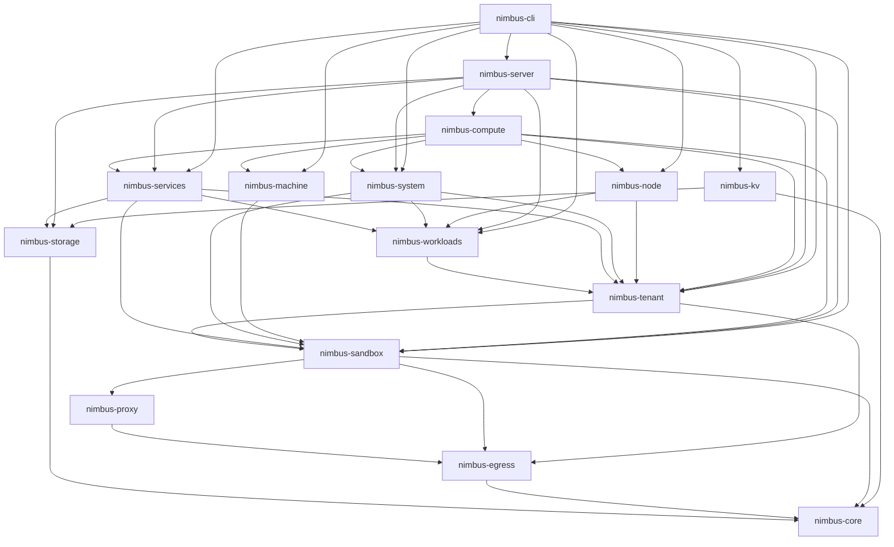
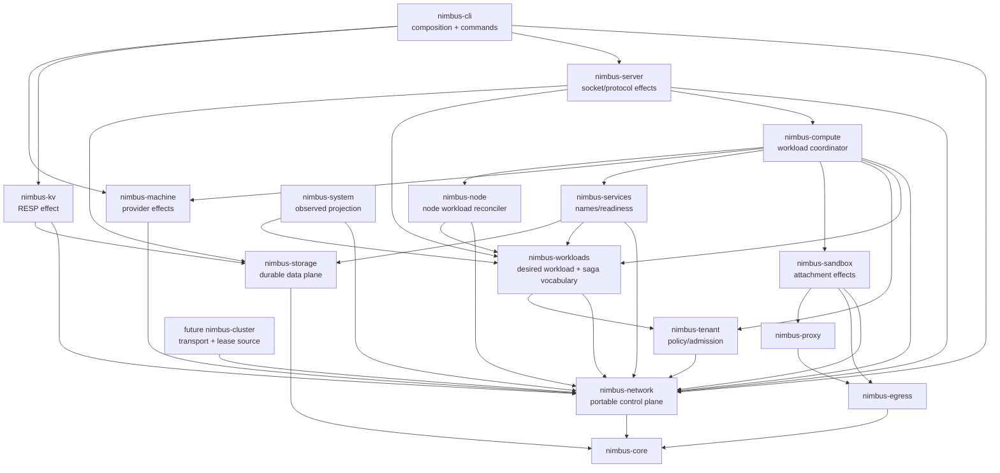

# Nimbus Network Control Plane Plan

Status: `active; NNC6.5d3 complete; NNC6.5d4 in progress`

Owner: this plan is the sole implementation control plane for the
transport-free `nimbus-network` crate and the connectivity-resource lifecycle
it defines. It owns portable network identity, desired plans, durable leases,
generation and epoch fencing, capability satisfaction, reconciliation, and
the shared host-port allocation authority. It does not own packet transport,
protocol bytes, tenant policy, workload execution, service naming, proxy
forwarding, provider effects, system projections, or cluster membership.

Approved direction: Nimbus has three peer infrastructure lifecycles:

- `nimbus-compute` owns workload lifecycle;
- `nimbus-network` owns connectivity-resource lifecycle;
- `nimbus-storage` owns durable-data lifecycle.

The dependency invariant is:

```text
nimbus-network -> nimbus-core
```

`nimbus-network` sits below `nimbus-tenant`, `nimbus-sandbox`,
`nimbus-services`, `nimbus-machine`, `nimbus-kv`, `nimbus-compute`,
`nimbus-server`, `nimbus-system`, and future `nimbus-cluster`. It must not
depend on those crates or on Axum, Pingora, Netavark, nftables, Iroh, openraft,
or a cloud SDK. A future dependency on `nimbus-egress` requires a recorded
owner decision and concrete type-sharing proof; the default is no dependency.

## Recovery Header

This header is the first compaction/restart checkpoint. Update it with every
ledger transition.

| Field | Current value |
| --- | --- |
| Plan status | `active; NNC6.5d3 complete; NNC6.5d4 in progress` |
| Current band | `NNC6 — compute orchestration and exact lifecycle order` |
| Current item | `NNC6.5d4 — end-to-end forwarded-machine teardown provider adapters and exact guest phase envelopes` |
| Last completed item | `NNC6.5d3 — shared host-managed Container/Krun attachment detach and final release`; the commit containing this checkpoint is its durable item commit. |
| Next action | Implement NNC6.5d4 band 6 from `proof/nimbus-network-control-plane/nnc6.5d4-forwarded-machine-teardown-provider.md`: add only the forwarded Container attachment composition. Authenticate the exact prior `ExecutionStopped` receipt and guest machine-publication absence before retained detach. Authenticate the prior `NetworkDetached` receipt and complete compound detached proof before final release. Reuse the existing Container manifest, journal, and NNC6.5d3 shared OCI lifecycle. Do not add the private route, client, parent adapter, caller cutover, or coarse-stop deletion. |
| Current acceptance checkpoint | NNC6.5d4 audit and fail-before are durable at `29137fa000341e48bd9ee41ef37451f5611977f1`. Bands 1-5 are green. K3-K4 pass. The operation-family and injected-journal prerequisites of K7 pass. K11-K14 have their strict wire vocabulary, digest, response correlation, and closed outcomes. K15 has a closed translation without caller-selected provider IDs. K16 passes with deterministic durable Systemd production composition. Band 5a closes Systemd activation admission before drain and authenticates stop with the exact prior drain receipt. Band 5b fences every Container producer under the one lifecycle lock and durable drain barrier and provides a cancellation-safe generic-journal seam plus a nonpublishing Container substep. Band 5c adds the strict guest composite execution sink: one Container-rooted journal sequences exact Systemd then Container drain/stop, requires both child successes before generic publication, applies a deterministic read-only inspection join, fences adjacent retry epochs, and recovers across fresh processes. No-record inspection and evidence-serialization uncertainty remain `Ambiguous`; no second journal exists. The missing private route remains an explicit capability blocker. |
| Owner branch | `codex/nimbus-network-architecture-audit` |
| Owner worktree | `/Users/jack/src/github.com/nimbus/nimbus-network-architecture-audit` |
| Audit base | Original architecture audit: `b69007a78a220847812370d9418049f1253f0384`. |
| Execution base | Rebased without conflicts onto `origin/main` at `9c2d4f150c60f43dfdc0a3f1ec6550942e26ab8f` after NNC0.0. |
| Last checkpoint commit | `0eb5cab62` is the durable NNC6.5d4 band 1 checkpoint. `fb7acb395` is band 2. `690ac9f22` is band 3. `1100cbc04` is band 4. `bf7b61808` is band 5a. `824c2f6f0` is band 5b. The commit containing this header and its matching proof row is band 5c. The prior audit checkpoint is `29137fa000341e48bd9ee41ef37451f5611977f1`. |
| Audit dirty state | The owner worktree was clean after band 5b commit `824c2f6f0`. Preserve only the active band 5c guest composite sink, its generic-journal retry transition, Systemd and Container composition prerequisites, exact inspection and fresh-process tests, capability blocker correction, one shifted NNCV015 census coordinate, routing, proof, and plan paths until their recovery commit. The original checkout remains untouched. After that commit, band 6 owns only forwarded Container attachment composition and its exact retained-detach and final-release proofs. |
| Latest dirty-state checkpoint | Band 5c is candidate-green. The strict guest sink authenticates the installed forwarder, local node, exact translation, provider, source, tenant, and sandbox before mutation. One Container-rooted journal serializes Systemd then Container child effects and publishes generic success only after both exact successes. Inspection is read-only and cannot race a still-startable effect. Adjacent retry requires a real exact predecessor. Fresh processes recover from durable roots only. Two semantic audit findings are corrected with deterministic regressions: missing generic state and serialization failure remain `Ambiguous` and cannot mint retry or terminal evidence. Focused, full affected, quality, static, census, expected-red arithmetic, proof, docs, and site gates pass. The commit containing this header is the band 5c recovery checkpoint. Band 6 is next; NNC6.5d4 remains one review unit. |
| Last completed item review | The one full GPT-5.6 Sol/xhigh/fast NNC6.5d3 review ran at confidence `0.93`. One immutable-version digest claim is rejected with source evidence. The batch snapshot, filesystem replacement race, and contention-test findings are accepted and corrected. No second full review is permitted. |
| Full-review input identity | Staged tree `c15a7b073d581f2c4be4f28349d7edb6d1e2b927`; patch SHA-256 `9198fedb67e64fa860568a34f4143cab428398f493f095e69741c7cdeb3aa1d5`; threads `019fea5e-0015-7b73-9bae-e6be78ee67b2` and `019fea64-a9c9-7f92-a76e-a266c10c3318`. The wrapper's internal two-pass chunking was one item review. |
| Narrow-review input identity | The one narrow Nimbus autoreview ran with GPT-5.6 Sol, `xhigh`, and fast service tier against staged tree `6834896b412ab6a98ef8830417e6e20e36e30508`, patch SHA-256 `300cbd4c6390a04f6c77f3629628fcb2371d91ded4c0415555adbb8d298b2fd6`, 79 paths, and 68 Rust paths. The buffered ephemeral wrapper emitted no persistent thread IDs. Its two internal bundle passes were one review invocation. |
| Narrow-review result | Two P2 findings at overall confidence `0.96`: the plan-snapshot claim is rejected because the second read contributes no mutable field; the final-entry identity defect is accepted and corrected. Inspect/read/remove now pin and revalidate the exact final target, Linux unmount uses the target descriptor, and 12 K14 cases pass. No third review is authorized. |
| NNC6.5d3 corrected candidate identity | Pre-ledger-closeout staged tree `a5540956a7105c50a1c5a4c4d779b30560418763`; patch SHA-256 `0d8a0bf456b643c719bea25b12e575c00a748539074299d9cd4874a6acafcd39`; 79 paths, including 68 Rust paths. The item commit is the final self-authenticating closeout identity. |
| Execution mode | Autonomous implementation goal active; commit each completed item with its ledger/evidence checkpoint; no push or PR without separate authority. Per owner direction on 2026-07-24, all future structured autoreviews use `gpt-5.6-sol` at `xhigh` reasoning with fast mode explicitly enabled; do not use Claude Opus 4.8. |
| Last verification | NNC6.5d4 band 5c guest composition passes `12` with one declared child-process entry point; provider journal passes `38` with two declared child-process entry points; Systemd teardown passes `33`; Container teardown passes `37` with two declared child-process entry points. Full node passes `121`; full Sandbox passes `1,134` with `32` declared platform or child-process ignores; full CLI passes `964` with two declared child-process ignores; full compute passes `381` with one declared child-process ignore. Affected all-target check, strict all-feature Clippy, warning-denied Rustdoc, format, diff, NNCV008, corrected NNCV015 census, NNCV035 self-test `55/55`, and direct expected red `0/7` pass. The aggregate is `35/36` with only NNCV035 red. Proof lint reports zero diagnostics. Docs pass `108`; the site passes `17/17`. No structured review ran. |
| Latest verification checkpoint | Active record: `proof/nimbus-network-control-plane/nnc6.5d4-forwarded-machine-teardown-provider.md`. It records bands 1-5 fail-before, implementation, behavior counts, quality gates, sparse portable semantics, strict forwarded full-chain semantics, injected-journal ownership, production Systemd composition, both activation-admission barriers, the one asynchronous journal, the nonpublishing Container child seam, and the strict guest composite execution sink with deterministic inspection and fresh-process recovery. |
| Blocking decision | No blocker. Commit band 5c, then implement only band 6. Do not run structured review on partial NNC6.5d4 work. |

Recovery protocol:

1. Before any fetch, rebase, source edit, or cleanup, verify this plan exists,
   inspect `git status --short --branch`, and run
   `git cat-file -e HEAD:docs/private/plans/nimbus-network-control-plane-plan.md`.
   If that proof fails, force-add only this plan plus its routing-index edit and
   commit that checkpoint. Never run `git clean` to recover an owner worktree.
2. Confirm the worktree path and branch before editing; never assume the
   original checkout is clean.
3. Read this header, the Architecture Audit Ledger, Implementation Status
   Ledger, Item Checkpoint Ledger, and current dirty diff.
4. Resume the first `in_progress` row. If none exists, resume the first `todo`
   row whose dependencies are `done`.
5. Re-read only that band, its named files, tests, and overlapping owner plans.
6. Record fail-before evidence before changing the behavior it covers.
7. Update the band row, evidence path, exact command/result, current band, and
   next action in the same checkpoint edit; do not leave more than one item
   uncommitted.
8. If an item is blocked, record the blocker and next safe action here and in
   its ledger row, continue with the next dependency-safe item, and stop with a
   report if no item is executable.
9. A skipped provider lane, missing grep target, unavailable KVM host, or
   command hidden behind a pipe is not a pass.

## Outcome

Nimbus gains one deep module for connectivity-resource lifecycle:

```text
provision: admit -> reserve -> start -> attach -> publish -> observe
teardown:  withdraw -> drain -> stop -> detach -> release -> record
```

The interface hides allocation, fencing, durable transition, provider
selection, compensation, and reconciliation depth. Effect implementations stay
local to the crates that understand them. Callers no longer need to coordinate
several shallow implementations to achieve one network guarantee.

The result must provide:

- stable identity independent of IP address, socket address, process ID, or
  provider handle;
- exactly one host-port lease authority across Nimbus processes on a node;
- portable segment allocation separate from Netavark realization and cluster
  transport;
- explicit host-managed versus provider-managed capability semantics;
- generation-scoped desired, durable, and observed state;
- fail-closed recovery from crash, corruption, stale callbacks, ambiguous
  provider outcomes, and cleanup failure;
- a locally sovereign provider profile with no hidden external dependency;
- deterministic behavior tests at every interface plus structural guards that
  prove no duplicated authority or dependency cycle.

## Binding Architecture Decisions

0. **The implementation control plane is versioned.** Although
   `docs/private/` is ignored by default, this canonical plan is a deliberate,
   narrow force-tracked exception using the precedent established by
   `dd5b178e4`. Staging alone is insufficient: the recovery proof is
   `git cat-file -e HEAD:docs/private/plans/nimbus-network-control-plane-plan.md`.
   No implementation fetch/rebase begins until that proof passes. Private proof
   artifacts remain selectively force-tracked only when a band explicitly
   needs them as durable recovery evidence.
1. **Control plane is not data plane.** `nimbus-network` owns intent, stable
   IDs, lease authority, state transitions, capability satisfaction, and
   reconciliation. Actual binds, packets, forwarding, TLS termination,
   protocol parsing, namespaces, bridges, firewall effects, and machine
   networking remain in their current effect modules.
2. **The crate is low dependency.** Its initial only workspace dependency is
   `nimbus-core`. Upper behavior crates implement injected adapters; the
   contract crate never reaches outward to them.
3. **The module may expose a façade; it does not expose a god provider.**
   Network lifecycle orchestration may have one process composition entrypoint,
   while effect interfaces stay capability-specific and small.
4. **Interfaces must earn their seam.** A product interface is promoted only
   when two real adapters or two materially different consumers demonstrate
   substitution. A fake used only by tests does not by itself justify a public
   abstraction. Capability vocabulary may precede an interface; speculative
   no-op `NameProvider`, `CertificateProvider`, or `ForwardingProvider`
   implementations may not.
5. **Allocation and admission are separate.** `nimbus-tenant` decides whether
   exposure, egress, and quota are allowed. `nimbus-network` allocates only an
   admitted plan and returns attributable usage evidence.
6. **Desired, durable, and observed state are distinct.** `NetworkPlan`
   generation, durable lease/provider state, and `NetworkStatus` are different
   types and stores. `nimbus-system` routes/listeners/ports remain rebuildable
   projections, never desired state or lease authority.
7. **Compute is the sole cross-domain saga coordinator.** `nimbus-compute`
   orders admitted workload, network, service, and retirement work.
   `nimbus-network` reconciles only network-owned identities, leases, and
   provider handles behind idempotent operations. `nimbus-node` remains the
   node workload reconciliation seam and is integrated, not bypassed or
   duplicated. Network recovery never decides by itself whether an ambiguous
   workload should be activated.
8. **Lifecycle uses a persisted state machine and reconciliation, not
   optimistic rollback.** Multi-effect operations are idempotent on stable
   resource ID plus generation. Failure records the exact completed phase;
   compensation proceeds in reverse order or leaves the resource fenced
   `CleanupPending`.
9. **Reuse follows deletion proof.** A port, address, segment, route, listener,
   attachment, or provider identity is reusable only after provider
   detach/unbind is confirmed or a fenced recovery rule proves the old owner
   cannot act.
10. **Cluster allocation and cluster transport are separate seams.** The
   allocator consumes a fenced per-node super-net lease. Future
   `ClusterTransport` owns node identity, membership, discovery, routing, mesh,
   and consensus.
11. **Routed-not-overlay remains binding.** Cluster pool to node super-net to
    tenant segments; cross-node forwarding without VXLAN, Geneve, or a
    stretched tenant L2 domain.
12. **Expired authority fences creation, not cleanup.** An expired or stale
    cluster lease rejects new allocation and publication. It must still permit
    idempotent inspection, detach, quarantine, and release of a durable handle
    from the previously authorized epoch.
13. **Host-global means cross-process.** Sandbox endpoints, PEP listeners,
    server main and sibling listeners, standalone `nimbus-kv`, managed-machine
    listeners, and future providers use one shared node-local lease store and
    lock domain. An in-process singleton alone is insufficient.
14. **Provider bind remains OS truth.** A lease closes races among Nimbus
    owners. The real provider bind closes races with external processes.
    `EADDRINUSE` or equivalent is durable failure evidence; it cannot be hidden
    by the allocator.
15. **Service identity stays logical.** `nimbus-services` owns service names,
    readiness, bindings, and residency. Network owns reachable endpoint and
    attachment handles. DNS/xDS/Consul publication, if ever added, consumes an
    already resolved service binding.
16. **Egress PDP and PEP stay separate.** `nimbus-egress` remains the policy
    decision point and `nimbus-proxy` the enforcement/forwarding point. Network
    composes PEP readiness and listener identity without evaluating or
    weakening policy.
17. **Ingress TLS and interception TLS never share authority.** Public ingress
    certificate material has a separate interface, store, handle type, and
    rotation path from the proxy's per-workload ephemeral interception CA.
18. **Machine networking is capability-described.** Host-managed
    Netavark/gvproxy and provider-managed WSL2 behavior are not represented by
    one boolean and never silently approximate one another. `nimbus-machine`
    remains the single source for each machine provider's facts and maps them
    into network requirement vocabulary; network does not copy the provider
    enum or create a second configuration authority.
19. **The local sovereign profile is mechanically satisfiable.** It starts,
    reconciles, serves local/private endpoints, and tears down without public
    DNS, cloud APIs, hosted certificates, relays, or an external control plane.
20. **Pre-launch migration is direct.** No compatibility aliases, dual lease
    authorities, deprecated endpoint definitions, or legacy readers survive
    closeout.
21. **Network durable state is concept-owned and node-local.**
    `nimbus-network` implements its own local cross-process lease/state store
    and retains `nimbus-core` as its only workspace dependency. It may use
    external filesystem/serialization crates. Existing atomic-write and lock
    implementations in `nimbus-blob`, `nimbus-crypto`, `nimbus-operator`, and
    `nimbus-storage` are design precedents, not reusable workspace
    dependencies. “One authority” prohibits a second store for the same
    network resource; it does not require network state to live in the durable
    data plane.
22. **Workload saga intent is workload-owned and engine-persisted.**
    `nimbus-workloads` owns portable desired-workload and saga-phase
    vocabulary plus its store interface. `nimbus-compute` gains the direct
    `nimbus-workloads` edge and remains the sole cross-domain coordinator. A
    server-owned durable adapter persists saga intent through an existing
    engine-owned internal mutation path; neither the network node store nor
    `nimbus-system` projections may become workload authority. The exact
    internal table/schema and mutation path are recorded before NNC6 begins.
    `nimbus-services` lazy activation and sandbox restart policy are subordinate
    to this durable saga.
23. **Production manager construction is staged, consuming, and immutable.**
    `LocalNetworkManager::bootstrap` claims one canonical process root and
    exposes only a paired network-owned authority handle. Upper composition
    code may use that handle to construct and reconcile source owners, then
    gathers their exact reports and consumes the bootstrap exactly once to
    freeze `NetworkCapabilityRegistry` into `LocalNetworkManager`. Authority
    clones retain the process claim; failed assembly releases it only after the
    last clone drops. There is no registry setter, hidden singleton lookup,
    callback into an upper crate, or lower-crate provider type.
24. **One sandbox process composition owns process-local network lifetimes.**
    A sandbox-owned `OciNetworkProcess` binds one manager-derived authority,
    one node super-net/prefix, the shared segment adapter, and the PEP,
    Netavark, and machine-port lifetime registries. Container and krun
    backends authenticate and reuse that object instead of minting parallel
    process-local lifecycle maps. Provider effects remain sandbox/proxy owned;
    persisted `OciNetworkLayout` remains restart evidence rather than runtime
    authority.
25. **Bind realm is relative to an explicit OS node.** A guest wildcard proxy
    bind and gvproxy's parent-host publication are both `Host` binds in
    different node authorities. Forwarded publication therefore owns two
    independently fenced lifetimes: guest proxy authority and parent-host
    provider authority. The parent issues the gvproxy provider handle and
    generation; a guest boot ID cannot mint parent authority. Equal numeric
    ports may coexist across nodes and never become workload identity.
26. **Logical-node root policy is operator-owned and project-independent.**
    `nimbus-operator` owns the typed platform resolver for the local OS-node
    network root. Its default is stable for the current operating realm
    (XDG state on Linux, Application Support on macOS, Local AppData on
    Windows), independent of working directory, application, Compose project,
    engine data, or control-plane data. A dedicated explicit network-root
    flag/environment/config value may select a different logical-node realm;
    `--data-dir`, `--control-data-dir`, and project-local dev state never do so
    implicitly. System services and containers that need a shared durable
    host realm configure that explicit root. Separate OS users or deliberately
    separate realms are serialized against one another by the real provider
    bind as external owners; Nimbus never pretends their inaccessible stores
    are one cross-process lock domain.
27. **Teardown sub-items have exclusive primary product paths.** NNC6.5a-g use
    the source-derived path sets in the NNC6.5 proof. NNC6.5b composes its
    runtime from existing saga and store accessors; `ComputeState::delete_tenant`
    remains exclusively NNC6.5g-owned. NNC6.5g has one explicit deletion-only
    handoff for obsolete node and sandbox stop declarations and implementations.
    The handoff can remove code after every caller owner is green. It cannot add
    behavior or create a second implementation authority. NNC6.5a also owns the
    exact portable provision/restart validators and the named existing test
    fixtures needed to keep its format replacement compile-green. Its three
    compute paths are fixture-only and cannot add compute behavior; NNC6.5b
    does not own them.
28. **Audit path proof and product semantics have different lifetimes.** Before
    the NNC6.5 item commit, NNCV035 checks current audit paths. The post-commit
    recovery row records the exact item commit. Later verifier runs compare the
    NNC6.4a recovery checkpoint to that item commit for the audit-only path
    census. Semantic checks continue to read current source. NNCV035 resolves
    the item checkpoint through Git and maps a missing or invalid commit to its
    named `paths` diagnostic. NNCV008 separately validates the Recovery Header
    checkpoint.

## Current Ownership And Dependency Audit

### Current ownership

| Concern | Current module/implementation | Audit result | Target owner |
| --- | --- | --- | --- |
| CIDR validation | `nimbus-core::net::Cidr` | Pure, zero-I/O shared primitive. | Remain `nimbus-core`. |
| Segment vocabulary | `nimbus-core::{NetworkId, NetworkSegment}` | Not provider-neutral: names and identifiers encode Netavark realization, and index-derived IDs can collide across node super-nets. | Stable `NetworkSegmentId` and portable allocation move to `nimbus-network`; bridge/interface/Netavark identity stays in the sandbox adapter handle. |
| Segment allocation | sandbox OCI `network/{segment,cluster}.rs` | Trait is `pub(crate)`, accepts `SandboxId`, and callers expose the concrete single-node allocator. Cluster is not drop-in. | Portable allocator/lease contracts in `nimbus-network`; OCI realization stays sandbox-owned. |
| Per-workload IPAM | sandbox OCI `network/ipam.rs` | Provider-adjacent effect state; direct JSON replacement lacks a recorded crash-durability contract. | Effect remains sandbox-owned; durable/fenced lifecycle must conform to network contracts. |
| Netavark/netns/nft/gvproxy | `nimbus-sandbox` | Correct effect owner; container and krun duplicate lifecycle/compensation knowledge. | Sandbox-owned deep attachment implementation behind the network seam. |
| Endpoint vocabulary | `nimbus-sandbox::endpoint` | Imported by tenant, services, machine, node, server, system, CLI, and facade. Missing stable endpoint ID/generation. | Move/generalize into `nimbus-network`. |
| Exposure and egress admission | `nimbus-tenant` | Policy authority already exists. | Remain `nimbus-tenant`; translate admitted decisions above network. |
| Service naming/readiness | `nimbus-services` | Correct logical owner; stop currently risks withdrawing cached resolution after the awaited backend stop. | Remain services-owned; withdraw/fence before stop. |
| Desired workload/saga state | `nimbus-workloads::DesiredWorkloadStore`, held concretely by `nimbus-services` | Portable interface exists, but the only implementation is in-memory and compute has no workloads dependency. | Workloads keeps vocabulary/interface; compute consumes it; a server-owned adapter persists it through an engine-owned internal mutation path. |
| Workload orchestration | `nimbus-compute::ComputeState` and `nimbus-node::NodeWorkloadReconciler` | Natural composition seams; compute currently has neither a connectivity manager nor a workloads edge, and sandbox backends can self-restart from `inspect()`. | Inject one shared network façade/manager; compute owns the sole saga and drives restart; node reconciliation remains integrated. |
| Main and sibling listeners | `nimbus-server` | Socket/protocol effects are correctly local; `WireProtocolAdapter` has multiple real adapters and is a proven seam. | Preserve implementation; consume shared port leases and report provider status. |
| RESP listener | `nimbus-kv` plus CLI | Can run as a separate process, so process-local port authority is insufficient. | Retain RESP implementation; use the cross-process node lease store or adopt a pre-bound listener. |
| CLI port probes | CLI start adapters and development wire resolver | Production probe/drop checks have no durable reservation and can race an external binder. | Migrate or adopt through the shared authority; classify command-local/test-only ephemeral binds explicitly. |
| Sandbox machine-port proxy | OCI `MachinePortProxy` | Production socket bind is a provider effect outside the current manifest-scanning census. | Keep bind effect sandbox-owned; consume/adopt a shared lease and report its provider state. |
| Egress policy/enforcement | `nimbus-egress` / `nimbus-proxy` | Deliberate PDP/PEP split; sandbox owns proxy lifecycle. | Preserve; migrate only PEP listener reservation and readiness handles. |
| Observed routes/listeners/ports | `nimbus-system` | Projection records lack stable lease/provider generation authority and may record “listening” before task liveness is proven. | Remain observed projection; consume generation-scoped status. |
| Machine capabilities | five-field `nimbus-machine::MachineProviderCapabilities` | Only the networking-ownership axis is a boolean; it is too shallow for exposure, isolation, forwarding, durability, or sovereignty. WSL2 already rejects its unavailable start/stop backend fail closed. | Confirm and extend portable network capability dimensions without merging this VMM-provider record with segment allocation; machine retains effects. |
| Machine port allocation | CLI machine manager | Separate locked JSON allocator plus probe-then-drop bind, leaving a TOCTOU window. | Delete after shared cross-process lease migration. |
| Cluster transport | documentation-only future `nimbus-cluster` | No current crate/product implementation. | Separate future seam under horizontal scaling. |

### Current dependency shape

Arrows mean “depends on.” This is the ownership-relevant production dependency
slice, not the complete workspace graph. NNC0.1 generates the complete
machine-readable normal/dev/target/feature graph with source `HEAD`; the slice
below must stay derivable from that artifact.



The existing edges `nimbus-tenant -> nimbus-sandbox` and
`nimbus-system -> nimbus-tenant + nimbus-sandbox` make any
`nimbus-network -> tenant|sandbox|system` design cyclic.

### Target dependency shape



Some existing upper-crate edges remain intentionally omitted from this relevant
slice and may remain until their owning plans remove them. NNC0.1 and NNC9.3
prove the complete production, dev/test, target-conditioned, and all-feature
graphs separately. The binding assertion is that the new crate has no reverse
edge and creates no cycle.

## Complexity And Reliability Findings

| ID | Severity | Pocket of complexity | Consequence | Required response |
| --- | --- | --- | --- | --- |
| NNCF1 | critical | Sandbox `PortManager` scans manifests and returns the first free number without one atomic host reservation. | Concurrent sandbox/PEP planning can select the same port, and other owners are invisible. | Deterministic collision proof then one cross-process `PortLease` authority. |
| NNCF2 | critical | Machine ports probe with a temporary socket, release it, then bind later; server and KV have separate direct bind paths. | TOCTOU and multiple authorities prevent a node-wide guarantee. | Shared locked store plus bind/adopt protocol; migrate every production owner before deleting old allocators. |
| NNCF3 | critical | Segment release durably frees the allocation before bridge/provider cleanup. | A stale bridge/CIDR can coexist with a newly reused segment after cleanup failure. | Two-phase `CleanupPending` quarantine; release only after inspected detach. |
| NNCF4 | high | Segment and IPAM state use locked direct JSON replacement without an explicit atomic replace/fsync/version/checksum contract. | Crash or torn write can erase authoritative ownership or force unsafe guesswork. | Versioned, checksummed, atomic durable state with fail-closed corruption behavior and subprocess crash proof. |
| NNCF5 | high | Netavark setup can succeed before status persistence fails; partial forwarding loops can succeed before a later step fails. | Provider effects become ambiguous and compensation may miss them. | Stable idempotency key/handle, inspect-before-retry/delete, reverse compensation, ambiguity tests. |
| NNCF6 | high | Container and krun duplicate network setup/cleanup choreography; krun can treat netns-path existence as readiness for firewall pinning. | Caller-local knowledge drifts and can mistake a partial attachment for a safe one. | Sandbox-owned deep attachment lifecycle implementation with phase/generation and shared contract tests. |
| NNCF7 | high | `NetworkSegmentAllocator` is private and concrete accessors leak `SingleNodeSegmentAllocator`; it accepts `SandboxId`. | Cluster-shaped allocator is not substitutable and portable allocation inherits sandbox identity. | Public/injectable allocator contract using neutral `NetworkAttachmentId`; trait-object consumers. |
| NNCF8 | high | `NetworkId` derives from a local index and `NetworkSegment` carries Netavark names. | IDs can collide across node super-nets and portable callers learn provider realization. | Globally stable segment ID; split logical allocation from provider handle. |
| NNCF9 | high | Placement checks block zero and grows a new block when full without revisiting existing secondary blocks. | Capacity can be stranded and repeated growth can diverge from the allocator's comment/intent. | Fail-before existing-secondary-reuse test and atomic allocation operation. |
| NNCF10 | high | `ClusterSegmentAllocator::release` requires an unexpired lease. | Lease expiry can prevent safe cleanup and strand fenced resources. | Separate create authority from cleanup authority; stale epochs cannot create, but durable old handles remain cleanable. |
| NNCF11 | high | Service stop awaits backend stop before the cached endpoint is necessarily withdrawn. | Resolution can continue publishing/routing while teardown is underway. | Fence/withdraw first, then drain/stop; deterministic concurrent lookup/stop test. |
| NNCF12 | medium | Listener/system records are address- and label-oriented and can be written before sustained task liveness. | Stale observation can look authoritative or current. | Stable IDs/generations/conditions; projection remains independently retryable and rebuildable. |
| NNCF13 | medium | `PublishedEndpoint` has no stable identity, generation, exposure class, or provider handle. | Address changes look like identity changes; stale updates cannot be rejected mechanically. | Network-owned endpoint identity and generation. |
| NNCF14 | medium | The networking axis inside the five-field machine capability record is summarized as `uses_provider_networking`. | Existing unavailable WSL2 behavior fails closed, but supported provider modes still cannot describe isolation/exposure/sovereignty requirements precisely. | Confirm-and-extend capability matrix with typed unsatisfied-requirement errors; keep VMM capabilities distinct from segment allocation. |
| NNCF15 | medium | No single interface states the twelve-stage cross-owner lifecycle. | Future adapters can publish early, release early, or fork compensation rules. | Persisted lifecycle state, exact transition guard, and observer-driven contract suite. |
| NNCF16 | critical | Segment hold/attachment identity is acquired after Netavark/netns effects, while manifests are written only after configuration/spawn. | A crash can leave a live effect with no durable owner and make its identity reusable or invisible to manifest scans. | Durably reserve attachment, exact segment association, and effect attempt before the first external effect; inspect/adopt or quarantine on restart. |
| NNCF17 | critical | Sibling listeners start sequentially; failure of a later adapter can detach earlier tasks, and spawned task errors are not supervised as group state. | Startup may return failure while an earlier protocol listener continues accepting without coherent withdrawal/release. | Server-owned structured `ListenerGroup`/ingress runtime that prepares leases/sockets, activates as a group, supervises task death, and unwinds every partial start. |
| NNCF18 | high | Cross-domain recovery authority is ambiguous between compute and network, while desired workload state is not uniformly durable. | Network-only restart logic cannot safely decide whether an attached workload should activate, publish, or compensate. | `nimbus-compute` is sole saga coordinator; define a durable saga intent/phase handoff and integrate `nimbus-node` reconciliation. |
| NNCF19 | medium | `nimbus-system` `routes` denotes HTTP method/path/adapter inventory, not connectivity forwarding routes. | Reusing the name/identity can collide two unrelated projections and blur observed ownership. | Structurally distinct connectivity-route observation kind/table and one conversion locality. |
| NNCF20 | critical | Container and krun `inspect` paths may execute backend restart policy and launch a workload. | An observation interface is a second workload coordinator and can race withdrawal or activate a stale generation without current attachment/PEP proof. | Make inspection side-effect-free; compute alone decides restart through the durable prepare→attach→activate saga; fenced generations veto restart. |
| NNCF21 | high | Production CLI dev/start probe-drop paths and the sandbox `MachinePortProxy` bind sit outside the original listener census. | A “one authority” migration can close while real callers still race or bind without a lease. | Exhaustive source-derived bind/allocation inventory with explicit migrate/adopt/exempt disposition and static unclassified-bind rejection. |
| NNCF22 | high | `LocalNetworkManager::open` requires the final registry, while truthful sandbox registration requires backend construction and startup reconciliation; those operations need manager-derived authority first. | Production either constructs no manager, freezes speculative facts, or performs reconciliation through an unclaimed parallel root. | Staged process claim with a paired authority handle, followed by consuming one-shot registry freeze after source reconciliation. |
| NNCF23 | high | Container and krun constructors independently mint segment adapters, PEP engines, Netavark lifetime registries, and machine-port registries. | Two backends in one process can hold divergent in-memory lifecycle truth even when durable paths happen to match. | One sandbox-owned `OciNetworkProcess` with injected/root-authenticated backend constructors and cross-backend lifecycle tests. |
| NNCF24 | critical | A machine-forwarded workload leases and binds its wildcard proxy inside the guest, but gvproxy realizes the external publication in the parent host without a parent-host publication lease. | A guest lease cannot serialize the parent bind; conflicts can reach provider I/O, ambiguous outcomes can lose the parent fence, and the two OS-node realms are conflated. | Parent reserves/claims before Machine API I/O, activates from exact gvproxy evidence, withdraws before guest stop, and releases only after authenticated parent-effect absence. |
| NNCF25 | high | Machine deletion reloads serialized roots but releases the SSH lease through the caller's independently resolved roots. | A mismatched caller can delete machine artifacts while leaking the real lease in another authority. | Persist canonical manager provenance, authenticate it before mutation, and pass one manager-derived handle through launch, stop, and delete. |
| NNCF26 | medium | Start/Compose, dev prebinding, standalone KV, and server prebound handoff independently resolve or replace authority roots. | One process can reserve listeners and sandbox resources in different stores; KV may disagree with start under the same environment. | One typed root policy plus manager-derived server/KV handles; divergent prebound authority fails before durable or socket effects. |
| NNCF27 | critical | Desired workload state is an infallible in-memory map with two product constructions, unconditional replacement, whole-map restore, no production recovery reader, and inconsistent intent-before-effect order. | Process loss erases canonical desire, stale generations can overwrite current intent, lazy activation and teardown bypass compute, and recovery cannot distinguish retry from compensation. | Workloads-owned versioned saga record and async CAS port, compute-only transition writer, and server-owned Engine execution-unit adapter in `_nimbus._workload_sagas`; delete every production in-memory authority before activation. |

## Independent Review Disposition

The 2026-07-23 Fable review was treated as a set of falsifiable hypotheses and
rechecked independently against source, dependency metadata, git rules, active
plans, and all four explanatory HTML artifacts. Every finding is incorporated;
the amendments below prevent inaccurate evidence from becoming architecture
truth.

| Finding | Disposition | Verified correction or decision | Owning items |
| --- | --- | --- | --- |
| F1 | accepted and strengthened | The ignored plan is not durable; a proof mirror under `docs/private` would also be ignored. Commit `dd5b178e4` establishes a narrow force-track precedent. `HEAD` containment, not staging, is the recovery proof. | NNC0.0, NNC0.8, NNC9.1 |
| F2 | accepted with evidence amendment | Durable-write precedents also exist in blob, crypto, and operator. Network implements one concept-owned local store and retains only the core workspace edge. | decisions 2/21, NNC2.1 |
| F3 | accepted | Workloads owns portable desired/saga vocabulary; compute gains the workloads edge and coordinates; a server adapter persists through an engine-owned mutation path. | decision 22, NNC6.1b-e |
| F4 | accepted and strengthened | Both sandbox `inspect` implementations can launch through restart policy. Inspection becomes side-effect-free; compute is the only restart authority. | NNC0.6a, NNC5.6, NNC6.4a, NNC8.4 |
| F5 | accepted with inventory correction | CLI dev/start probes and `MachinePortProxy` are production gaps. Cited runtime egress and auth/token binds are test-only and remain classified exemptions. | NNC0.1, NNC3.4, NNC3.7a-b, NNC3.9 |
| F6 | accepted with authority guard | The goal now requires a committed plan before fetch, clean-checkpoint rebase, item commits, blocker continuation/stop, and a 150-turn cap. It does not grant push/PR authority. | recovery protocol, autonomous goal |
| F7 | accepted with precedent amendment | Thread barriers and process helpers exist, but no reusable deterministic two-process lease or named crash-cut harness exists. New proof infrastructure cannot create a `nimbus-network -> nimbus-testing` dev edge. | NNC0.1a-b and named consumers |
| F8 | accepted and strengthened | Current reaping is netns-filename/allocator-state based. Durable attachment intent/provider-attempt state—not a manifest alone—is target authority; unmatched effects are removed or quarantined. | NNC0.7, NNC5.2a, NNC5.2b, NNC8.3 |
| F9 | accepted with graph-kind amendment | The earlier diagram omitted workloads, node, CLI, storage, and KV→storage. Production, dev/test, target-conditioned, and all-feature graphs are proven separately. | diagrams, NNC0.1, NNC9.3 |
| F10 | accepted | Sovereignty needs a privileged Linux isolation/tripwire harness with positive controls, DNS capture, IPv4/IPv6 deny counters, syscall/network evidence, and a complete lifecycle. | NNC4.7, NNC9.2 |
| F11 | accepted | Machine allocation already serializes Nimbus callers; the real unsafe window is an external binder after probe/drop and before gvproxy/provider bind. | NNC0.2, NNC3.3, NNC3.7 |
| F12 | accepted | Advisory locking and durable replacement are supported only on a same-host local filesystem; detectable unsupported network filesystems fail closed. | decision 21, NNC2.1 |
| F13 | accepted cleanup | The plan’s seam-promotion rule wins. All four earlier HTML artifacts are marked superseded where they predeclare provider interfaces or DNS/TLS/LB effects. | NNA7 artifact cleanup |
| F14 | accepted | NNC2 updates the horizontal-scaling ledger/reference in the same shared-seam checkpoint; it does not fork cluster authority. | NNC2.8 |
| F15 | accepted with nuance | Machine capabilities already have five fields and unavailable WSL2 fails closed. Only the networking axis needs confirm-and-extend; VMM capability and segment allocation stay distinct. | NNCF14, NNC4.4 |

### Software-pattern review

The target uses these patterns deliberately:

- **Deep module:** a small transport-free interface hides identity, allocation,
  durability, fencing, compensation, and reconciliation complexity.
- **Ports and adapters:** network defines portable capability and lifecycle
  vocabulary; a product effect interface is promoted only after substitution
  earns it. Sandbox, server, KV, and machine modules retain the implementations
  that know their providers; future cluster transport stays separate.
- **Persisted state machine:** explicit phases and legal transitions replace
  booleans inferred from filesystem paths or observed addresses.
- **Fenced lease:** stable owner plus generation/epoch prevents stale actors
  from republishing or reusing a resource.
- **Reconciliation loop:** provider inspection resolves ambiguous outcomes;
  retries are bounded and idempotent instead of recreating effects blindly.
- **Compensating workflow:** partial multi-provider work is unwound in reverse
  order or quarantined; there is no fictional cross-provider transaction.
- **Anti-corruption boundary:** provider realization names/DTOs remain inside
  the adapter and are represented portably by opaque handles and observations.
- **Command/observation separation:** desired commands and durable authority do
  not depend on eventual `nimbus-system` projections.
- **Capability satisfaction:** deterministic matching explains exactly which
  admitted requirement cannot be met; it never silently weakens a plan.

Patterns explicitly rejected:

- a god `NetworkProvider`;
- speculative interfaces with one product adapter and no real substitution;
- using an IP, port, filesystem path, bridge name, or provider DTO as identity;
- distributed transactions across effects;
- best-effort cleanup followed by immediate reuse;
- polling sleeps as concurrency or readiness proof;
- using system projections as locks, leases, or desired state;
- moving all code containing “network” into the new crate.

### Deletion test

The extraction is deep enough only if it deletes:

- the production sandbox manifest-scanning port allocator;
- the independent machine port allocator/probe authority;
- concrete `SingleNodeSegmentAllocator` accessors at placement consumers;
- `SandboxId` from portable allocation;
- provider bridge/interface naming from portable segment intent;
- duplicated endpoint type definitions or compatibility re-exports;
- caller-local publication/cleanup ordering;
- address-as-identity assumptions in status projection;
- any second production port lease or segment allocation authority.

If the implementation adds a registry and traits without deleting this caller
knowledge, the seam is shallow and the band is not complete.

## Target Resource And State Model

Exact Rust spelling lands in NNC1 only after NNC0 tests constrain behavior.
The semantics are binding:

- `NetworkPlanId`: stable identity of compiled connectivity intent;
- `NetworkResourceGeneration`: monotonic desired generation within a plan;
- `NetworkAttachmentId`: neutral workload-to-network attachment identity;
- `NetworkSegmentId`: globally stable allocation identity, not a local index;
- `PublishedEndpointId` (final spelling may vary): stable published network
  endpoint identity; do not reuse the horizontal-scaling/Iroh `EndpointId`
  vocabulary;
- `ListenerId`: stable listener identity independent of address;
- `IngressRouteId`: stable route identity;
- `PortLeaseId`: stable reservation identity;
- `NetworkProviderId`: stable provider registration identity;
- `NetworkProviderHandle`: opaque, redacted, provider- and generation-scoped;
- `EndpointProtocol`: generalized current published endpoint protocol;
- `EndpointIntent`: admitted requested endpoint shape;
- `PublishedEndpoint`: actual reachable location plus stable ID/generation;
- `NetworkPlan`: provider-neutral desired resources, capability requirements,
  dependency handles, and generation;
- `NetworkCondition` / `NetworkStatus`: observed provider evidence, never
  allocation authority.

`TenantId` and `WorkloadId` remain in `nimbus-core`. `Cidr` remains there while
it is genuinely shared and zero-I/O. `NetworkAttachmentId` must distinguish
multiple named attachments and workload reincarnations; it is not merely a
renamed `WorkloadId`. Address and provider identity remain observations.

Every desired generation carries a canonical plan digest. The same generation
and digest is idempotent; the same generation with different desired content
fails closed. This prevents equal-generation divergence and ABA-like stale
callbacks.

During NNC3.4, container and krun generation/epoch values remain fixed at
`1`, but every public start mints a fresh ULID-backed sandbox ID and that
tenant-qualified ID is the workload-incarnation fence. Reusing the same
internal sandbox ID means the same incarnation, whose terminal resurrection is
rejected; it is not an authority to create a second lifetime. NNC6 replaces
this transitional source with durable saga generation/CAS. An IP address,
port, PID, or provider handle never substitutes for incarnation identity.

### Portable segment versus provider realization

```text
AllocatedSegment
  { segment_id, cidr, tenant attribution, node lease epoch, generation }
       |
       v
sandbox attachment adapter
  { opaque provider handle, bridge/interface/network names, netns, status }
```

The portable interface never exposes Netavark names. Provider realization is
persisted only as the opaque handle and provider-owned inspectable state needed
for idempotent reconciliation.

### Desired, durable, and observed state

```text
admitted caller intent
  -> NetworkPlan { stable IDs, generation, requirements }
    -> durable transition/lease records
      { phase, epochs, provider IDs/handles, cleanup fence }
        -> provider effects
          -> generation-scoped observations
            -> nimbus-system and operator projections
```

The initial durable node store is implemented directly inside
`nimbus-network`; `nimbus-core` remains its only workspace dependency. It must
provide:

- one cross-process lock/transaction domain;
- atomic temp write, file sync, rename/replace, and parent-directory sync;
- versioned records and checksums;
- explicit incompatible-version and corrupt-record errors;
- no reconstruction by guessing from live addresses;
- deterministic restart/reconciliation ordering;
- bounded retention/compaction that never discards cleanup-pending ownership;
- permissions that do not expose provider secrets or tenant-sensitive handles.

The implementations in `nimbus-blob`, `nimbus-crypto`, `nimbus-operator`, and
`nimbus-storage` are design and test precedents for durable replacement,
checksums, lock ordering, and parent-directory sync. They are not imported
workspace utilities. The network module owns one schema, one lock domain, and
one durable-write implementation for all of its resources; no second network
state authority is permitted.

The state root is supported only on a same-host local filesystem whose advisory
locks, atomic same-filesystem rename/replace, file sync, and parent-directory
sync semantics satisfy the recorded startup capability probe. NFS, SMB, and
other network-mounted state roots are unsupported. When the filesystem type or
required semantics are detectable and unsupported, startup fails closed before
reading or allocating resources; an operator override cannot silently weaken
the contract.

Modularity exception: `nimbus-network/src/state_store.rs` remains in the
repository's 1,500–1,999-line explicit-justification band at 1,960 lines. It is a deep,
concept-owned module rather than a composition root: the single
lock/envelope/durable-replacement/filesystem contract stays beside its private
crash-cut tests. Provider effects, allocation policy, orchestration, and
unrelated helpers may not extend it. No further inline growth is permitted:
the next concept-local test change must move the intact test module to a child
before this owner reaches 2,000 lines.

NNC3.4 reduced the sandbox allocator's `oci/network/segment.rs` production
owner to 1,268 lines. Its complete private matrix moved intact to the
1,194-line `segment/tests.rs` child, while attempt-scoped attachment
reservation, adoption, exact compensation, and exact finalization retry form
the 891-line
`segment/reservation.rs` concept owner. The parent still owns the one durable
segment state machine and invariant validation; the children do not create a
second store, lock, or allocation authority.

NNC3.4 keeps `nimbus-network/src/port_lease.rs` as one concept-owned lifecycle
authority: claim/reserve/adopt/fail/activate/withdraw/release transitions,
store transaction integration, and atomic caller-supplied tenant publication
limits. The production parent is 1,766 lines, deliberately in the
1,500–1,999 explicit-justification band: quota must share the same store
transaction as reservation. Named transition vocabulary and operation-local
diagnostics live in the 162-line concept-owned
`port_lease/operation.rs` child. The complete confirmed-stop receipt state
machine moved intact to the 322-line `port_lease/rebind.rs` child when the
parent crossed 2,000 lines; it still invokes the parent's one store
transaction and does not own a second authority. The private
corruption/transition matrix remains in the 1,977-line
`port_lease/tests.rs` owner; exact durable bind-claim requirements and atomic
tenant-publication quota behavior moved intact to 40- and 151-line
concept-owned children. Exact adopted-attempt activation and atomic Active
batch replay live in the 137-line `port_lease/tests/adopted_replay.rs` child.
NNC3.8 extracted portable
process/provider lifetime fencing to the 1,227-line `lifetime.rs` child and
reservation-publication lifetime fencing to the 110-line
`reservation_lifetime.rs` child; their private matrices remain in 886- and
171-line concept-owned test children. Portable request/overlap and concrete
bind-evidence vocabulary remain in `request.rs` and `binding.rs`. No child owns
a second store or transition authority, and no socket/provider effect, policy
decision, or unrelated listener logic may enter the parent. Further growth
must extract an intact concept-owned lifecycle sub-state before crossing 2,000
lines, never mechanically split the authority across generic helpers.

NNC3.8 keeps the production
`nimbus-sandbox/src/backends/oci/port_manager.rs` composition root at 1,936
lines after adding exact launch/restart-batch lifetime reconciliation. It
remains in the 1,500–1,999 explicit-justification band because this one adapter
translates sandbox publication/PEP intent into exact atomic lease batches and
authenticates the returned authority; it owns no store or provider effect. The
381-line
`oci/port_manager/batch_state.rs` child owns provider-batch classification and
restart-retained release without creating another store or effect authority.
The 237-line `oci/port_manager/netavark_lifetime.rs` child owns only the
Netavark lifetime/recovery state machine and delegates every durable transition
to `nimbus-network`. Its intact private behavioral matrix is 1,920 lines and
remains in the concept-owned
`oci/port_manager/tests.rs` child. The test child is deliberately in the
1,500–1,999 explicit-justification band: its exact initial/restart,
Netavark/MachinePortProxy, quota, cross-tenant, and mixed terminal-batch cases
all inspect the same private adapter state machine. It may receive no
production logic or generic fixtures; before 2,000 lines, the next coherent
provider-specific group must move intact to a concept-owned child. The
MachinePortProxy batch group already moved intact to the 342-line
`oci/port_manager/tests/machine_cleanup.rs` child after adding exact
terminal-provider and uniform-coordinator proofs; the 138-line
`oci/port_manager/tests/batch_classification.rs` child owns one-snapshot
reservation-coordinator, exact terminal, and no-effect batch classification;
the 155-line `tests/netavark_lifetime_cleanup.rs` child owns the live/dead owner
and ambiguous-unbind proof. No further inline production growth is permitted:
the next coherent provider-specific group moves intact before the parent
crosses 2,000 lines. Provider effects, quota policy choice, and workload
orchestration remain in their existing owners.

NNC3.4 keeps `nimbus-sandbox/src/backends/oci/network/ipam.rs` at 1,954 lines
as a deliberate deep-module exception. Its first 1,249 lines own one
tenant-scoped IPAM allocation plus Netavark provider-operation state machine,
including the single store transaction boundary, exact
generation/attempt-capability checks, and release/replacement exclusion while
an effect is ambiguous. Its remaining private tests exercise that same state
machine and introduce no second store, provider runner, or allocation
authority. Provider command execution remains in the 443-line
`network/netavark.rs`; the 369-line `network/netavark/tests.rs` child owns the
cross-thread effect-boundary and projection-only retry proofs. Unrelated
allocation policy or provider effects may not extend `ipam.rs`; before 2,000
lines, its intact private test module must move to a concept-owned
`ipam/tests.rs` child.

NNC3.4 keeps
`nimbus-sandbox/src/backends/container/runtime.rs` as a 1,460-line production
composition root. Required manifest schema, exact terminal-network-finality
predicate, and authenticated existing-workload publication remain in the 374-line
`runtime/manifest.rs` concept child; its
370-line `manifest/publication.rs` child owns the single fixed-stage,
per-sandbox OS-lock, file-sync/rename/parent-sync, exact legacy-stage
reconciliation, trusted ancestor creation/sync, and bounded ambiguity
protocol. The 95-line
`runtime/provider_context.rs` child authenticates canonical state-root,
tenant-qualified layout, and launch-time provider context before existing
effects; it owns neither a store nor an effect. The 1,963-line
`runtime/runner.rs` is a deliberate deep-module exception: it
retains one execution-handoff state machine, its allowlisted immutable
execution-identity projection, and bounded
ownership/publication/provider-cleanup convergence with primary-error
preservation.
Separating those mutually authenticating phases would create a second
lifecycle interpretation surface; no provider implementation, unrelated
orchestration, or generic fixture may enter it. No further inline growth is
permitted: before any additional runner change, one complete identity or
cleanup phase and its proofs must move intact to a concept-owned child. Its
96-line test-only `runtime/runner/test_probe.rs` child observes the real
lifecycle-lock contention branch without adding production coordination.
The shared 90-line `runtime/effect_fence.rs` child bounds pre-provider durable
phase convergence at four attempts and diagnoses the exact persisted phase.
The 220-line `runtime/direct_execution.rs` and runner both consume that helper;
neither owns a second phase store or provider effect.

The 1,010-line `backends/conmon/creator.rs` deep module owns the shared,
provider-free creator-process state machine: bounded process-group
cancellation, exact conmon PID-receipt validation, runtime-observed reap, and
fail-closed escaped-process ambiguity. Transient cancellation-acknowledgement
loss retains the dead receipt until creator containment is confirmed so a
bounded retry preserves recoverability. The 151-line `runtime/creator.rs` is
the container manifest adapter. A definitely unspawned attempt whose `Pending`
publication fails must durably publish `Quiesced`, or confirm that exact
post-rename result by readback, before compensation proceeds; its three
ambiguity proofs live in the 167-line
`runtime/tests/creator_persistence.rs` concept child. Container and krun refuse
provider/network cleanup for a truly pending spawned attempt until the shared
owner proves `Quiesced` or `RuntimeObserved`; fresh-process recovery of that
attempt identity remains an explicit NNC3.8 consumer, and neither backend
duplicates process authority.

The 1,937-line `runtime/launch_cleanup.rs` test matrix remains a deliberate
1,500–1,999 exception: its owner-death, cancellation, Netavark ambiguity,
direct terminal-persistence, post-wait/explicit-stop serialization, staging
fault, and ordered-compensation cases inspect one private lifecycle state
machine. It may receive no production logic or generic fixtures. The intact
runner finalization/effect-fence/reload-serialization group lives in the 1,343-line
`runtime/tests/runner_reliability.rs` concept child. Terminal callback,
shutdown-monotonicity, Failed cleanup, and stopped-outcome preservation proofs
live in the 356-line `runtime/tests/status_callbacks.rs` child. Provider cleanup,
including the creator-pending release fence, restart-retained machine receipt
convergence, exact persisted-provider drift, substituted-context fail-before
behavior, fresh/restart partial-start cleanup, and bounded blocking forwarder
observation lives in the 1,429-line
`runtime/tests/provider_cleanup.rs` child plus its 271-line
`provider_cleanup/startup_fencing.rs` and 250-line
`provider_cleanup/forwarder_observer.rs` concept children. The 577-line
`runtime/tests/manifest_durability.rs` child owns the one fixed stage path,
explicit rejection of retired unique-stage compatibility grammar,
startup/next-write crash convergence, complete first-publication ancestor
sync, read-side-effect, lock-contention, and pre-materialization/reload
readiness proofs. Provider-backed cleanup remains in
the 362-line `runtime/execution_cleanup.rs` owner. No child introduces another
manifest path, lifecycle decision authority, or persistence loop.

NNC3.4 keeps the already-separated krun behavior matrix at
`nimbus-sandbox/src/backends/krun/vm/tests.rs` at 1,974 lines. The restart,
PlanOnly, and startup-reconciliation authority proofs keep that coherent
matrix below the hard threshold. This is an explicit test-band exception because
the remaining cases inspect one private VM lifecycle state machine; it may
receive no production logic or generic fixture. Its next line of growth must
move one intact lifecycle group to a concept-owned child before editing.
The first-publication durability proofs live in the 143-line
`tests/manifest_durability.rs` child. The Ready-only
desired/durable/observed endpoint projection proof lives in the
91-line `tests/endpoint_projection.rs` child. The manifest wire-contract proofs live in the 70-line
`tests/manifest_schema.rs` child. Provider-failure recovery and its
effect-boundary crash cuts live in the 422-line
`tests/provider_failure_recovery.rs` child. The launch-compensation proofs moved intact
to the 1,397-line concept-owned
`tests/launch_compensation.rs` child when the parent crossed the 2,000-line
hard threshold. Its restart absence-before-network/provider-effect cases live
in the 222-line `tests/launch_compensation/restart_fencing.rs` child so the
parent gains only one concept-owned declaration. The two natural-exit
final-convergence proofs moved intact to
the 201-line `tests/natural_exit.rs` child when Pass-30 corrections crossed the
threshold again. Explicit-stop convergence and lifecycle-lock serialization
live in 519- and 353-line concept-owned children. Production planning,
lifecycle, state, and start logic remain in their respective ownership files,
and shared fixtures remain in `tests/support.rs`. The restart teardown proof
remains in the coherent VM lifecycle behavior matrix; no production
switchboard or reusable helper may be added to the test parent. The 217-line
`tests/startup_fencing.rs` child proves retained startup failure still fences
relaunch while exact stop and non-restarting terminal cleanup remain available;
restart-eligible inspection is byte-for-byte read-only.
`krun/vm/lifecycle.rs` is 1,761 lines, a deliberate 1,500–1,999 exception. It
is the one krun provider-lifecycle state machine: runtime-stop observation,
Netavark detach, exact restart-claim compensation, namespace removal,
attachment finalization, acknowledged terminal manifest publication, and
separately retryable terminal IPAM retirement must preserve one
ordered error accumulator and one `detach_confirmed` fence. Splitting twenty
lines mechanically would obscure that ordering. Its provider-failure
sub-state durably checkpoints exact runtime absence, network release, artifact
release, and terminal publication so `stop_sync` can resume without a PID;
keeping those transitions beside the ordinary teardown predicates prevents a
second effect authority. New planning, provider
implementation, reusable fixtures, or unrelated status logic may not enter
it; further lifecycle growth must extract one complete phase with its
invariant-preserving inputs and tests. Pass 57 moved first-manifest
serialization, no-replace publication, ambiguity readback, and full trusted
ancestor durability into the 130-line `vm/manifest_publication.rs` concept
owner. Container and krun publication share only the 188-line
`oci/durable_directory.rs` validation/create/fsync algorithm; neither
duplicates provider, manifest, or lifecycle authority. The PEP
migration did not take a similar production exception: `oci/egress.rs` is a
1,464-line production module after moving its private behavior matrix to the
1,938-line concept-owned `oci/egress/tests.rs`, its
intact registration-failure lifecycle group to the 248-line
`oci/egress/tests/registration_failure.rs` child, and its retryable
stop/restart state machine to the 432-line `oci/egress/cleanup.rs` concept
owner. The 786-line `oci/egress/tests/post_activation_cleanup.rs` child owns
the exact post-activation acknowledgement-loss, anchor-failure, restart, and
fresh-registry fencing proofs. The test parent is explicitly in the
1,500–1,999 band because the restart/fresh-launch capability, claim,
trust-anchor exclusivity, and stopping-tombstone proofs inspect one private
registry lifecycle. Registration commit/compensation proofs moved as one
coherent group before the parent crossed 2,000 lines; future growth must follow
the same concept-owned rule. The machine-port listener effect is now a focused
1,038-line `oci/network/proxy.rs` production module whose bounded connection set
owns admission,
completed-worker reaping, checked polling setup, sticky provider-stop failure,
unwind-safe tracked-worker drain, provider-error classification,
connection-local availability, and lossless retryable stream forwarding. Its
intact 1,456-line private provider matrix moved to the concept-owned
`oci/network/proxy/tests.rs` child when the combined file crossed the hard
threshold. No provider, allocation, policy, or orchestration authority moved or
was duplicated. The container runtime composition root is 1,460 lines after
its complete machine-listener registration, activation, publication,
withdrawal, and stop state machine moved to the 1,067-line
`runtime/machine_ports.rs` concept owner. The attempt-scoped network launch
saga, pre-effect/artifact cleanup, and provider-backed ordered teardown are
separate 151-, 162-, and 362-line concept children. Runner execution ownership
lives in the 1,963-line `runtime/runner.rs` concept owner, where a bounded
advisory OS lock, fingerprinted durable Execute/Cancel decision, owner-loss
replay, bounded phase publication, and PlanOnly status/inspect fencing form one
handoff state machine. Cleanup and exclusive-ownership proofs live across the
explicitly justified 1,937-line `runtime/launch_cleanup.rs` child and the
1,343-line concept-owned runner reliability child described above. The
direct-execution, shared effect-fence, creator-handoff, and test-only lock-probe
children keep new coordination and proof logic out of the composition root.

`nimbus-proxy/src/engine.rs` is a 1,505-line deliberate lifecycle-owner
exception. Its process-local preparation, running, stopping, quarantine, and
retirement states share one exact per-workload registry authority; commit
failure must remain beside that state machine because explicit and implicit
retention consume the same unforgeable preparation slot. Private behavior
proofs already live in the 1,427-line `engine/tests.rs` child. No forwarding,
policy, socket implementation, or sandbox cleanup enters this owner; before
further growth, one complete fairness or wait-budget concept must move intact
to a named child without duplicating registry authority.

The test-only container lifecycle matrix is 1,945 lines and remains
deliberately in the 1,500–1,999 explicit-justification band: its private
restart/final teardown ordering, identity-substitution rejection,
ambiguous-unexpose retry, activation-acknowledgement-loss, and tombstone
concurrency proofs form one coherent behavior suite. It may not receive
production logic or generic fixtures. Its provider-cleanup group is already a
concept-owned child; explicit-absence projection behavior lives in the 71-line
`runtime/tests/absent_runtime_projection.rs` child, leaving only its module
declaration in the parent. Future growth must move another intact lifecycle
group before the parent reaches 2,000 lines.

The test-only container planning matrix is a 1,620-line concept-owned child.
Its claim-first PlanOnly/Execute, allocator substitution, atomic port
reservation, compensation, and manifest-shape proofs all exercise the private
planning seam and introduce no production authority or generic fixture. It may
receive no production logic; the next coherent proof group must move intact to
a named child before this matrix reaches 2,000 lines.

`nimbus-cli/src/machine/client.rs` is 1,528 lines and remains a deliberate
protocol-adapter exception for this item. Its production half owns one Unix
socket request/response codec and typed machine API client; its private tests
exercise that same wire contract. NNC3.4 removed hand-authored private
container manifests from those tests and now seeds through the public machine
API, but added no port or lifecycle authority. The next test growth must move
the intact test module to a concept-owned child so the adapter does not become
a switchboard.

The NNC3.4 proof artifact is also an explicit documentation-band exception:
`docs/private/plans/proof/nimbus-network-control-plane/nnc3.4-sandbox-pep-machine-port-migration.md`
is the item-scoped, compaction-safe chronology for fail-before/after evidence,
exact candidate hashes, structured-review dispositions, verification counts,
and recovery checkpoints. Splitting that chronology before the item commit
would create competing status authority and weaken exact recovery. It may
receive only NNC3.4 evidence and closeout corrections, must remain below 2,000
lines, and is frozen when NNC3.4 commits. Later items use their own proof
artifacts.

This canonical owner plan is a deliberate 2,000-line documentation exception.
One recovery header, one binding-decision set, and the architecture, status,
and checkpoint ledgers must remain atomic so compaction recovery cannot select
competing authority. Item chronology and detailed test output live in the
linked proof children; new items may add only a concise owner contract and
ledger checkpoint here. A future deep decision must replace or link from an
existing summary instead of creating a second inline chronology. NNC9 archives
the completed owner as one record.

### Durable workload/network saga handoff

The cross-domain saga is not stored in the network node store. Its portable
record belongs to `nimbus-workloads`. `nimbus-compute` is the only writer of
saga transitions. Service lazy activation, node reconciliation, and sandbox
inspection report inputs or execute issued commands. They do not decide or
persist an independent desired phase.

NNC6.1b freezes the implementation contract in
[`proof/nimbus-network-control-plane/nnc6.1b-workload-saga-vocabulary-store-durable-home.md`](proof/nimbus-network-control-plane/nnc6.1b-workload-saga-vocabulary-store-durable-home.md).
The canonical ownership is:

| Concern | Owner |
| --- | --- |
| Portable record, phase graph, transition validation, CAS request, and CAS outcome | `nimbus-workloads` |
| Cross-domain transition decisions and lifecycle order | `nimbus-compute` |
| Durable adapter, strict codec, private schema bootstrap, and Engine calls | `nimbus-server` |
| OCC, atomic document/index/journal commit, and durable ambiguity handling | `nimbus-engine` |
| Network plan, leases, attachment state, and network provider evidence | `nimbus-network` |
| Rebuildable workload status | `nimbus-system` |

The logical key is `WorkloadSagaKey { TenantId, WorkloadId }`.
`WorkloadSagaId` is a stable `wsg_` identity derived from the length-delimited
key under `nimbus.workloads.saga.id.v1`. An admitted `TenantWorkloadUid` and a
generation-scoped `WorkloadExecutionId` remain incarnation and execution
evidence. NNC6.1c1 replaces the current node-local `TenantWorkloadId` authority
with a projection of `WorkloadExecutionId`. None of these types is the logical
saga key.

`WorkloadGeneration` and `WorkloadSagaRevision` are distinct serializable
`u64` types with checked advancement. `WorkloadDesiredDigest` binds the
canonical desired workload encoding. Equal generations are idempotent only
when the desired digest and complete network tuple match. Their durable Engine
form is canonical unsigned decimal text, not an IEEE-754 JSON number.

Every record carries this complete network tuple:

```text
NetworkPlanId
NetworkResourceGeneration
NetworkPlanDigest
```

The tuple is never partial. A workload with no exposed resource carries an
empty valid `NetworkPlan`. The record also carries these intent values:

```text
WorkloadActivationIntent = PrepareOnly | ActivateWhenAttached
WorkloadPublicationIntent = Withheld | PublishWhenReady
```

`WorkloadSagaTransitionId` hashes a domain-separated canonical encoding of the
complete semantic transition payload. That payload includes both revisions,
both phases, active and optional successor intents, exact phase detail, and
redacted failure evidence. It omits only the transition ID slot it computes.
Any changed next-record content therefore produces a different ID.

The provision graph is:

```text
IntentCommitted
  -> NetworkReserved
  -> WorkloadPrepared
  -> NetworkAttached
  -> WorkloadActivated
  -> Ready
  -> Published -> Observed  (PublishWhenReady)
  -> Observed               (Withheld)
```

The teardown graph is:

```text
WithdrawalCommitted
  -> Withdrawn
  -> Drained
  -> WorkloadStopped
  -> NetworkDetached
  -> NetworkReleased
  -> Recorded
```

A desired stop can move any provision phase to `WithdrawalCommitted`. An
effect-bearing phase can enter `CleanupPending` with its last safe phase and
exact inspection requirement. Cleanup uncertainty retains every identity and
lease fence. NNC8.3 remains the final cleanup and reuse owner.

A higher desired generation received before `Recorded` becomes one complete
`successorIntent`; compute withdraws and records the active generation before
promotion. A still-higher CAS may replace the pending successor. At `Recorded`,
one CAS promotes a Running successor to `IntentCommitted`, or records a Stopped
successor while remaining `Recorded`. Direct higher-generation terminal intent
uses the same rule. Equal generations require exact content; lower generations
are stale. The store never deletes the logical saga to permit restart.

Every record requires admitted workload evidence and a closed tagged
`phaseDetail`. The allowed tags are `intent`, `provision`, `teardown`,
`cleanup_pending`, and `recorded`. Effect references contain only stable
subjects: `N` is the complete network tuple; `E` is `TenantWorkloadUid`,
`NodeIdentity`, `WorkloadExecutionId`, generation, and desired digest; `P` is a
sorted `PublishedEndpointId` set plus the network tuple. Compute persists each
reference before its effect. References never copy provider handles or state.

The provision evidence matrix is exact and cumulative:

| Phase | Required references | Newly required owner observation |
| --- | --- | --- |
| `IntentCommitted` | none | none |
| `NetworkReserved` | `N`, `E` | `NetworkReserved(N)` |
| `WorkloadPrepared` | `N`, `E` | `ExecutionPrepared(E)` |
| `NetworkAttached` | `N`, `E` | `NetworkAttached(N)` |
| `WorkloadActivated` | `N`, `E` | `ExecutionActivated(E)` |
| `Ready` with `Withheld` | `N`, `E` | `Ready(N,E)`; `P` is forbidden |
| `Ready` with `PublishWhenReady` | `N`, `E`, `P` | `Ready(N,E)`; publication is not yet confirmed |
| `Published` | `N`, `E`, `P` | `PublicationPresent(P)` |
| `Observed` | Same set as its publication intent | Same complete owner-observation set as `Ready` or `Published` |

`Published` is legal only with `PublishWhenReady`. Withheld intent moves from
`Ready` directly to `Observed`. `PrepareOnly` may remain at
`NetworkAttached`; it cannot activate in that generation.

For teardown, `T` is the exact reference set from the withdrawal origin. Each
phase retains `T`. `Withdrawn` requires `PublicationAbsent(P)` exactly when `P`
exists. `Drained` adds `ExecutionDrained(E)`, and `WorkloadStopped` adds
`ExecutionStopped(E)`, exactly when `E` exists. `NetworkDetached` adds
`NetworkDetached(N)`, and `NetworkReleased` adds `NetworkReleased(N)`, exactly
when `N` exists. A missing reference makes the step a proven no-op and forbids
its observation. `Recorded` retains no reference and carries completed
generation, desired digest, and a digest of the complete terminal evidence.

`cleanup_pending` requires the last safe phase and a non-empty retained
reference set. Its ordered inspection set has exactly one matching network,
execution, or publication requirement per retained reference, with no missing,
duplicate, or extra subject. Fresh recovery therefore inspects every possibly
affected subject. Provider handles and provider state remain in their owning
stores.

`WorkloadSagaStore` is an object-safe `Send + Sync` port with boxed futures.
It exposes only point load, compare-and-swap, and bounded deterministic
recovery pages. It does not expose mutable store access, whole-map restore,
unconditional upsert, delete, raw Engine values, or provider effects.

CAS expects `Missing` or `Revision(WorkloadSagaRevision)`. It returns `Applied`
or `Unchanged`. An exact transition replay returns `Unchanged` without a new
durable commit. Errors distinguish `Conflict`, `Ambiguous`, `Corrupt`,
`Unavailable`, and `InvalidTransition`.

The server adapter persists through
`Engine::begin_mutation_execution_unit`. This is one of the three canonical
Engine-owned mutation paths, alongside queued journal and direct mutation. The
other two remain canonical for their callers, but their public APIs cannot bind
the saga point read, transition check, and conditional write in one atomic
unit. The server adapter calls Engine, never raw storage, so it does not create
a fourth mutation path.

The physical record lives at `_nimbus._workload_sagas`. This is a private
server-owned control table in the reserved Engine tenant. It is not a
`SystemTable`, and `nimbus-system` cannot define its schema, codec, store, or
transitions.

The format-version-1 schema is exact:

| Field | JSON type | Required |
| --- | --- | --- |
| `formatVersion` | number | yes |
| `sagaId` | string | yes |
| `tenantId` | string | yes |
| `workloadId` | string | yes |
| `workloadKind` | string | yes |
| `desiredState` | string | yes |
| `desiredGeneration` | string | yes |
| `desiredDigest` | string | yes |
| `sagaRevision` | string | yes |
| `phase` | string | yes |
| `recoveryEligible` | boolean | yes |
| `phaseDetail` | object | yes |
| `networkPlanId` | string | yes |
| `networkGeneration` | string | yes |
| `networkPlanDigest` | string | yes |
| `activationIntent` | string | yes |
| `publicationIntent` | string | yes |
| `admission` | object | yes |
| `successorIntent` | object | no |
| `lastTransition` | object | yes |
| `failure` | object | no |

All `u64` values, including nested successor, phase-detail, and transition
counters, use canonical unsigned decimal strings. The codec accepts `0` or a
non-zero digit followed by digits, rejects leading zeroes and overflow, and
round-trips through `u64::MAX`. The strict codec enforces the closed nested
intent, admission, phase-detail, acquired-evidence, inspection, transition,
and failure shapes and cross-checks them against the top-level record. Failure
evidence contains only a stable code and redacted-evidence digest. Free-form
provider text stays in logs and observed projections.

The index set is
`by_tenantId_and_workloadId(tenantId, workloadId)`,
`by_recovery(recoveryEligible, sagaId)`,
`by_tenantId_and_phase(tenantId, phase)`, and
`by_desiredState_and_phase(desiredState, phase)`. The Engine document ID equals
the canonical `WorkloadSagaId`. The strict server codec rejects unknown
versions and fields, non-canonical or out-of-range counters, invalid digests,
partial intents or network tuples, incomplete phase evidence, crossed
identities, and inconsistent transitions.

NNC6.1d's source-derived substitution audit added the required
`recoveryEligible` projection. Its full review then proved that the initially
chosen phase-first cursor could return one saga twice when that saga advanced
between pages. The corrected `by_recovery(recoveryEligible, sagaId)` index uses
only immutable saga identity for storage pagination; workloads-owned phase
rank remains reconciliation priority, not cursor state. The codec cross-checks
the boolean against `WorkloadSagaRecord::requires_recovery`, so it is a derived
query projection rather than a second lifecycle authority. Each page performs
one bounded index window plus one lookahead row. A saga that becomes eligible
behind the cursor waits for the next full reconciliation sweep and cannot
repeat in the current sweep.

Reserved `_nimbus` routing is the primary access boundary. A table policy that
requires the authenticated system principal is defense in depth.
`PrincipalContext::system()` currently uses an ordinary claim, so the policy is
not treated as an unforgeable capability. NNC6.1d proves that each application
protocol and credential binding rejects reserved tenant selection. Explicit
local operator inspection remains permitted.

Each CAS opens one fresh execution unit, reads and validates the current
record, checks exact replay, verifies the expected revision and legal edge,
stages one whole-record set with `exists(false)` or current `update_time`, and
commits once. The store never retries a domain conflict.

The Engine does not expose its internal durable-ambiguity class as a stable
public adapter error. The adapter therefore treats each non-conflict error
returned from `commit` as `Ambiguous`. It never parses error text or rolls back
an uncertain record. A fresh load classifies an exact applied transition, an
unchanged expected record, a stale competing revision, or an unavailable or
corrupt record before any provider effect.

There is no fictional transaction spanning the workload store, network node
store, and provider effects. Compute commits desired saga intent before the
first network reservation, calls idempotent generation-scoped operations, then
commits the next saga phase. After a crash, a fresh process reads the durable
saga plus network/provider inspection and chooses retry, activation,
publication, compensation, or fenced cleanup. It never reconstructs workload
desire from an address, manifest, network phase, or observed system projection.

NNC6.1c adds both direct edges:

```text
nimbus-workloads -> nimbus-network
nimbus-compute -> nimbus-workloads
```

`nimbus-network -> nimbus-core` remains the network crate's only outgoing
workspace edge. `nimbus-workloads -> nimbus-engine|nimbus-server|nimbus-system`
and `nimbus-compute -> nimbus-server|nimbus-storage` remain forbidden.

NNC6.1c constructs no production store or coordinator. NNC6.1c1 performs the
breaking operational identity cutover and deletes the service and CLI
in-memory desired-state authorities. NNC6.1d then owns both the first durable
server adapter and its required workload-capable `ComputeState` injection.
This order keeps every checkpoint compilable without a no-op store, a
production in-memory substitute, or an optional workload-capable coordinator.

### Operational workload identity and false-authority cutover

NNC6.1c1 is frozen in
[`proof/nimbus-network-control-plane/nnc6.1c1-operational-identity-authority-cutover.md`](proof/nimbus-network-control-plane/nnc6.1c1-operational-identity-authority-cutover.md).
It makes one generation-scoped execution identity canonical without composing
the durable saga:

```text
TenantWorkloadUid + assigned NodeIdentity + WorkloadGeneration
  -> WorkloadExecutionId
  -> node backend key + systemd unit + observed execution evidence
```

The node-owned `TenantWorkloadId` and the parallel
`TenantWorkloadGeneration` are deleted without aliases. A missing or crossed
node assignment fails before backend validation, inspection, status writes, or
provider effects. Systemd uses the complete validated `wex_` value and the
`NIMBUS_WORKLOAD_EXECUTION_ID` selector. The rebuildable system projection
records the exact derived execution ID and a lossless decimal generation; it
does not become desired-state or identity authority.

`DesiredWorkloadStore`, its in-memory implementation, snapshot, controller,
both product authorities, all three services-owned upserts, and the manager's
snapshot API are deleted. The CLI retains only a deterministic ordered
`Vec<DesiredWorkload>` as non-authoritative planning input. The deleted stores
have zero recovery readers, so removal deletes false recovery evidence rather
than a recovery capability.

The cutover adds no workspace edge, store implementation, coordinator
construction, Engine adapter, lifecycle rerouting, or compatibility path.
NNC6.1d remains the sole durable-adapter/composition owner. The source-derived
NNC6.1e audit prospectively splits the later work before implementation:

- NNC6.1e owns bounded tenant discovery, pure all-phase recovery decisions,
  and an effect-free fresh-process decision proof;
- NNC6.2 owns the pure compute compiler and one canonical portable compiled
  resource payload without persisting it in the saga;
- NNC6.2a embeds the complete compiled value in the workloads-owned saga and
  proves exact fresh-process reconstruction before any network command;
- NNC6.1e1 consumes NNC6.2a's durable compiled plan and owns one bounded
  compute submission seam that confirms exact durable intent and derives a
  pure repeatable decision without dispatching effects;
- NNC6.1e2 runs after NNC6.3a-NNC6.3b, NNC6.4-NNC6.6 and owns final
  startup-recovery and tenant retirement convergence.

NNC6.3 is the read-only substitution audit. NNC6.3a-NNC6.3b prepare exact
durable content and pure decisions. NNC6.4 atomically replaces every provision
caller and deletes the old paths while adding provider effects. NNC6.4a,
NNC6.5, and NNC6.6 retain restart, teardown, and resolution caller cutover;
NNC8.3 retains cleanup resolution, finalization, release, and reuse authority.
No split item may invent a placeholder network intent or promote an
autoreview chunk into an implementation unit.

### `PortLease` semantics

A lease records:

- stable lease and owner resource IDs;
- tenant attribution when applicable;
- desired generation and lease epoch;
- TCP/UDP protocol;
- bind realm, address family, requested exposure, and overlap domain;
- requested exact port/range or provider-assigned mode;
- actual address/port after bind/adoption;
- provider ID/opaque handle;
- provenance: Nimbus-owned bind, provider-assigned bind, or externally
  owned/inherited listener;
- phase: `Reserved`, `Binding`, `Active`, `Withdrawing`,
  `CleanupPending`, `Released`, or terminal failure;
- timestamps/renewal data where the chosen lease model requires them.

Conflict rules:

- TCP and UDP are separate;
- wildcard conflicts conservatively with specific addresses in one bind realm;
- IPv4/IPv6 dual-stack overlap defaults to conflict unless host/provider
  capabilities prove otherwise;
- isolated realms may reuse a number only when the adapter proves non-overlap;
- provider-assigned port `0` is adopted into the durable lease before publish;
- pre-bound/systemd sockets are adopted by stable lease identity and verified
  against the requested plan;
- externally owned/inherited sockets are observed and fenced but never released
  as Nimbus-owned resources;
- confirmed no-effect bind failures never publish and remain inspectable but
  may become terminal; ambiguous or possibly effected attempts remain fenced
  until provider cleanup is proved;
- tenant quota remains an admission decision above the allocator.

### Provider capabilities and sovereignty

Capabilities describe, at minimum:

- `NimbusHostManaged` versus `ProviderManaged`;
- attachment and tenant-isolation modes;
- address families and bind realms;
- loopback/private/public exposure;
- protocol families;
- exact, Nimbus-allocated, or provider-assigned ports;
- host/path/TLS/WebSocket/streaming ingress features where implemented;
- forwarding and drain behavior;
- durable inspect/reconcile/delete support;
- local-only, operator-local, or third-party control-plane dependencies;
- public-network, DNS, hosted certificate, or relay requirements;
- offline restart/reconciliation support.

Provider selection is deterministic. Missing capability errors name the
provider, requirement, and safe alternatives. Nimbus never silently chooses a
cloud provider, weakens exposure/isolation, bypasses TLS, or makes
proxy-required egress direct.

The local sovereign profile requires:

- local durable segment and port allocation;
- host-managed sandbox attachment;
- loopback/private listener publication;
- required PEP readiness;
- local inspection, teardown, and orphan reconciliation;
- offline restart;
- no DNS, cloud API, hosted certificate, relay, or external control plane.

Public DNS, public load balancing, ACME, tunnels, and provider-managed cloud
networking remain optional providers added only for an approved consumer.

## Lifecycle Contract

### Provision

1. **Admit — tenant/compute.** Resolve principal, tenant, workload, exposure,
   egress, quota, and provider constraints.
   Success: admitted intent has a stable request identity.
   Failure proof: zero durable network record, lease, provider call, or
   projection.
2. **Reserve — network.** Persist plan generation; reserve attachment, segment,
   endpoint, listener, route, and port identities; choose satisfying providers.
   Success: all reservations are durable and fenced.
   Failure proof: exact completed reservations compensate or remain
   `CleanupPending`; none are published.
3. **Start (prepare) — compute/services.** Create an inert workload envelope
   without making the service resolvable or allowing guest application
   execution.
   Success: stable workload handle accepts the reserved attachment identity.
   Binding interpretation: this preserves the approved public word `start`,
   but it means preparation, not tenant execution.
4. **Attach, then activate — provider adapter plus compute.** Realize
   namespace/bridge/IPAM, provider networking, forwarding prerequisites, and
   required PEP path.
   Success: inspection proves the exact generation and all required safety
   effects, including firewall/pin state—not merely netns-path existence.
   Only then may compute activate process/VMM execution. No tenant instruction
   may execute before attachment and required PEP evidence are ready for the
   same generation.
5. **Publish — ingress/name/forwarding effect owners.** Activate reachable
   listeners/routes only after workload, attachment, and required PEP readiness.
   Success: actual endpoint is durably adopted and tied to the plan generation.
6. **Observe — network/system.** Emit status and project actual endpoint,
   provider, generation, conditions, and diagnostics.
   Success: stale observations cannot overwrite a newer generation; projection
   failure does not affect authority.

### Teardown

1. **Withdraw — services/network.** Fence the generation and remove resolution,
   routes, names, and listener admission before awaited backend stop.
   Success: concurrent lookup cannot obtain a newly routable handle.
2. **Drain — services/forwarding owner.** Stop new routing and drain held
   connections under service residency/owner epochs.
   Success: drain is bounded and reports remaining work explicitly.
3. **Stop — compute.** Stop workload execution and obtain confirmation.
   Success: no old workload can act on the fenced identity.
4. **Detach — provider adapter.** Inspect and remove forwarding, PEP lifecycle
   binding, attachment, namespace/bridge, and machine/provider effects.
   Success: provider deletion is confirmed or resource remains
   `CleanupPending`.
5. **Release — network.** Release ports, addresses, holds, and segments only
   after safe detach/unbind proof.
   Success: property/model test permits reuse only after the proof transition.
6. **Record — system/audit.** Publish terminal condition and cleanup evidence.
   Success: projection may retry/rebuild without changing released/fenced
   authority.

## Failure, Rollback, And Reconciliation Contract

| Failure/cut | Required converged behavior | Required proof |
| --- | --- | --- |
| Admission reject | No state/effect. | Zero-call mock plus empty durable store. |
| Saga-intent commit ambiguous | Inspect/CAS the engine-owned record; do not reserve, activate, or infer desire until the committed generation is known. | Response-lost mutation plus fresh-process recovery. |
| Partial reservation | Reverse compensation or fenced cleanup-pending records. | Fault after each durable reservation. |
| Start failure | Never attach/publish; safe release after absence proof. | Lifecycle observer exact sequence. |
| Attach create ambiguous | Inspect stable handle/idempotency key; no duplicate create or segment release. | Provider fake returns effect-created/response-lost. |
| Netns exists but firewall/pin absent | Attachment remains not ready and ingress withdrawn. | Crash cut between each sandbox attachment effect. |
| Required PEP not ready | No ingress; no direct fallback; compensate or fence. | Existing PDP/PEP behavior plus network observer. |
| Listener bind fails | Durable failure; no publication; new retry generation only. | Real external collision and fake ambiguous bind. |
| Partial forwarding/publish | Inspect and withdraw every possibly visible handle. | Fail Nth effect with deterministic injector. |
| Crash after attach | Restart inspects exact generation, publishes once or compensates. | Subprocess crash/restart matrix. |
| Crash after publish | No duplicate publish; stale callback cannot reactivate. | Restart plus delayed callback. |
| Exit inspection races withdrawal | Inspection has no side effect; fenced generation vetoes restart; admitted retry follows prepare→attach→activate. | Container/krun semantic barrier race. |
| Withdrawal fails | Generation fenced; no new routing; resource not reused. | Concurrent lookup/stop and cleanup-pending tests. |
| Stop/detach ambiguous | Quarantine; inspect before retry/reuse. | Provider deletion response lost. |
| Cluster lease expires | Reject new create; allow safe cleanup of durable old handle. | Fake clock/epoch tests. |
| Stale epoch callback | Activation ignored; bounded old-handle cleanup evidence accepted. | Generation/epoch model test. |
| Projection failure | Retry independently; authority unchanged. | Delete/rebuild/lag system tables. |
| Torn/corrupt state | Fail closed with actionable path; never guess allocations. | Truncation/checksum/version/subprocess tests. |
| Unsupported state-root semantics | Refuse startup before opening authority or allocating. | Detectable NFS/SMB/network-root capability test. |
| Lock unavailable | Bounded failure/diagnostic; no unlocked mutation. | Cross-process lock contention test. |
| Provider cleanup fails | Allocation stays `CleanupPending`; no reuse. | Existing segment/port reuse fail-before and pass-after. |
| Orphan evidence incomplete/unknown | Durable owner/effect is adopted, removed, or quarantined; netns filename never proves liveness. | Full hold/intent/effect/manifest/inspection matrix. |

Retry loops must be bounded, cancellable, backoff-aware, and observable.
Metrics use bounded-cardinality labels; stable IDs belong in structured logs or
traces, not unbounded metric labels. Provider handles are redacted.

## Test Architecture And Enterprise Evidence

The network interface is the primary behavioral test surface. Implementation
details receive local unit tests only where they add a distinct invariant.

### Proof layers

1. **Static ownership proof**
   - `cargo metadata` dependency graph;
   - forbidden dependency/import scan;
   - exactly-one endpoint, segment allocator, and port lease authority;
   - no network crate transport/effect implementation.
2. **Pure/model proof**
   - property tests for CIDR/segment disjointness, port conflict keys, stable
     IDs, legal transitions, generation ordering, and safe reuse;
   - a reference state machine checked against randomized transition scripts;
   - seed printed and reproducible on failure.
3. **Deterministic concurrency proof**
   - bounded thread barriers and a semantic parent/child control channel, never
     polling sleeps;
   - real cross-process same-root races with exact ready/entered/release/complete
     acknowledgements;
   - exact winning lease, losing identity/generation, early-exit, timeout, and
     cleanup diagnostics asserted.
4. **Durability/crash proof**
   - the parent kills only after the exact named network write/effect boundary;
   - fsync/replace failure injection where supported;
   - restart the same state root in a fresh process from each persisted phase;
   - corrupt/truncated/incompatible records fail closed.
5. **Adapter contract suites**
   - every real attachment/ingress/forwarding adapter runs the same lifecycle,
     idempotency, ambiguity, and cleanup suite;
   - a skipped environment lane is reported as `SKIPPED`, never `PASS`;
   - KVM/Netavark lanes retain their existing owner proof.
6. **Integration proof**
   - admission through compute to attach/publish/observe;
   - teardown race with concurrent service resolution;
   - cross-owner listener conflicts: sandbox/PEP/server/KV/machine;
   - system projection lag/rebuild cannot affect live authority.
7. **Sovereignty proof**
   - privileged Linux namespace/nft/DNS/syscall tripwire with passing positive
     controls denies and detects external network/control-plane attempts;
   - pre-staged local/private provision, restart, reconcile, and teardown
     succeed;
   - evidence records zero unexpected DNS or denied-output attempts.
8. **Structural closeout**
   - legacy allocators/types deleted;
   - docs and dependency diagrams reflect code;
   - focused suites, clippy, docs gates, and `make ci` record exact results.

Reuse `nimbus-testing` utilities only in upper-layer integration harnesses whose
dependency direction permits it. The low-level network crate may not take the
current upper-layer `nimbus-testing` as a normal or dev dependency. Put its
network-scoped fault points and child-role protocol in a dependency-safe local
test support module; keep provider-local helpers beside the owning adapter until
two owners genuinely need them.

### Test quality rules

- Every test names the invariant and asserts a specific state/effect result.
- Timing tests use bounded semantic waits and fail loudly.
- No test passes only because no panic occurred.
- Fail-before tests must fail for the expected reason before the implementation
  changes.
- Expected-red static checks name the missing target; missing input is not
  success.
- Evidence records command, exit status, test count, environment/capability,
  skipped lanes, seed, and artifact path.
- A proof is not complete while the corresponding old authority remains
  callable in production.

## Staged Extraction Bands

Each task has an independently verifiable success criterion. A band becomes
`done` only when every task and its evidence are recorded in the ledger.

### NNC0 — Executable baselines and expected-red verifier

Dependencies: architecture audit `NNA0-NNA7`.

| Task | Work | Verifiable success criterion |
| --- | --- | --- |
| NNC0.0 | Make this implementation control plane durable before reconciling the branch. | A focused commit contains this force-tracked plan plus its routing edit; `git cat-file -e HEAD:docs/private/plans/nimbus-network-control-plane-plan.md` passes before the first fetch/rebase, and the Recovery Header records the checkpoint commit. |
| NNC0.1 | Record current dependency/owner graph and exhaustive bind/allocation inventory from `cargo metadata` and source scans. | Machine-readable artifacts record source HEAD, command, dependency kind/target/feature/optionality, every production bind/probe/adoption/inherited-socket site, and one disposition per site; normal, dev/test, target-conditioned, and all-feature cycle checks are distinct. |
| NNC0.1a | Build a deterministic two-process contention harness outside the low-level crate. | A parent coordinates two real child roles over one state root with bounded semantic ready/entered/release/complete acknowledgements; exactly one winner is proven, and missing participant, wrong checkpoint, early exit, timeout, and cleanup self-tests report role/stdout/stderr/status/last checkpoint without sleeps. |
| NNC0.1b | Build a persistence-oriented subprocess crash-cut harness with network-scoped fault points. | The parent kills only after the exact named boundary acknowledgement, restarts the same root, asserts durable state/effect, and self-tests wrong boundary/early exit/timeout/cleanup; `nimbus-network` gains no normal or dev edge to the current upper-layer `nimbus-testing`. |
| NNC0.2 | Add fail-before concurrent sandbox/PEP selection and real external-owner machine probe/bind race tests. | Two Nimbus allocator children expose the sandbox/PEP collision; separately, an external binder acknowledges ownership of the exact machine port after probe/drop and before a faithful provider bind, which fails specifically with `AddrInUse` while persisted machine state still claims that port. |
| NNC0.3 | Add fail-before segment cleanup-failure/reuse test. | Provider cleanup is forced to fail and the current allocator demonstrably reuses or exposes the unsafe state. |
| NNC0.4 | Add fail-before torn/corrupt segment/IPAM state tests. | Truncation or exact crash cut produces the named unsafe/unhandled behavior, never an unrelated failure. |
| NNC0.5 | Add fail-before secondary-block reuse and expired-lease cleanup tests. | Current growth/cleanup behavior fails for the exact audited reason. |
| NNC0.6 | Add fail-before concurrent service lookup/stop and partial attachment readiness tests. | A barrier exposes post-withdraw ordering or incomplete-effect readiness without sleeps. |
| NNC0.6a | Add fail-before inspect/self-restart versus withdrawal test for container and krun. | A semantic barrier proves current `inspect` can launch through restart policy and identifies the stale-generation race; the failure cannot be satisfied by a readiness-only assertion. |
| NNC0.7 | Add fail-before effect-before-durable-hold, orphan-reaper blind-spot, and partial sibling-listener startup tests. | Crash after provider effect leaves named missing ownership evidence; the matrix exposes netns/effect-without-hold, hold-without-desired-attachment, and unmatched artifact blind spots; failing the kth adapter proves whether prior tasks remain live. |
| NNC0.8 | Add `scripts/verify-nimbus-network-control-plane.sh` expected red. | Script fails with named missing crate/duplicate-authority/unclassified-production-bind conditions, proves the plan is present in `HEAD`, and never reports missing grep inputs as pass. |
| NNC0.9 | Capture baseline performance/behavior, not optimize. | Listener/start/stop smoke behavior and allocation scale are recorded so extraction regressions are visible. |

Band gate: the plan is branch-durable; every dependency/bind owner is
classified; the net-new child-process harnesses self-test; and every risk
family has reproducible fail-before evidence or a written static proof that the
state is unreachable.

### NNC1 — Low-dependency crate and portable vocabulary

Dependencies: NNC0.

| Task | Work | Verifiable success criterion |
| --- | --- | --- |
| NNC1.1 | Create workspace `nimbus-network` depending only on `nimbus-core`. | `cargo metadata` shows exactly the approved workspace edge and no cycle. |
| NNC1.2 | Add stable plan/attachment/segment/endpoint/listener/route/lease/provider IDs and generation/epoch types. | Round-trip/property tests prove stability, domain separation, and ordering. |
| NNC1.3 | Move/generalize endpoint protocol and published endpoint vocabulary. | Every former sandbox consumer imports the network owner; serialization/API behavior is explicitly tested; no compatibility re-export remains. |
| NNC1.4 | Split portable segment allocation from Netavark realization. | Portable source contains no bridge/interface/Netavark naming; two node super-nets cannot mint colliding segment IDs. |
| NNC1.5 | Define desired/durable/observed types and legal phase transitions. | State-machine tests reject every illegal/backward/stale transition. |
| NNC1.6 | Deepen the static verifier. | Forbidden dependencies/effects, duplicate definitions, and address-as-ID patterns fail by named condition. |

Band gate: the crate is useful without an effect provider and all portable
vocabulary has exactly one owner.

### NNC2 — Crash-safe durable state and segment authority

Dependencies: NNC1.

| Task | Work | Verifiable success criterion |
| --- | --- | --- |
| NNC2.1 | Implement one network-owned atomic, versioned, checksummed local state contract. | Named NNC0 subprocess harnesses prove crash, truncation, incompatible-version, durability-event ordering, restart, and same-host lock contention fail closed; metadata proves only the core workspace edge; startup rejects a detectable NFS/SMB/network state root and records the supported local-filesystem assumptions. |
| NNC2.2 | Move/generalize allocator contracts to `NetworkAttachmentId`. | No portable type mentions `SandboxId`; container and krun consume injected trait objects without downcast. |
| NNC2.3 | Make allocation atomic across all existing tenant blocks. | Property and fail-before regression tests reuse capacity in existing secondary blocks before growth. |
| NNC2.4 | Add globally stable segment ID and node lease epoch. | Cross-node-super-net property tests show no collision; stale epoch cannot allocate. |
| NNC2.5 | Add two-phase detach/release quarantine. | Forced bridge/provider cleanup failure or uncertain orphan inspection leaves segment unavailable; confirmed removal of provider effect, persistent netns artifact, hold, and allocation in the specified order makes it reusable exactly once. |
| NNC2.6 | Separate create authority from cleanup authority on lease expiry. | Expired lease rejects allocate/grow but permits idempotent inspect/detach/release for a durable old handle. |
| NNC2.7 | Preserve completed multi-tenant network invariants. | Disjointness, exhaustion, grow-block, stale epoch, orphan, thread concurrency, and required KVM/Netavark lanes pass non-vacuously. |
| NNC2.8 | Truth up the horizontal-scaling shared-seam ledger when the allocator contract moves. | The same checkpoint updates the horizontal-scaling execution log away from sandbox-owned allocator/install-supernet paths, links this plan as owner, and a source scan finds no stale `nimbus-sandbox::NetworkSegmentAllocator` authority claim. |

Band gate: segment allocation is transport-independent, crash-safe, fully
substitutable, and never reuses before cleanup proof.

### NNC3 — Cross-process host-global `PortLease`

Dependencies: NNC1, NNC2 durable-store contract.

| Task | Work | Verifiable success criterion |
| --- | --- | --- |
| NNC3.1 | Implement atomic lease reserve/adopt/activate/withdraw/release transitions in one node store/lock domain. | The NNC0 contention harness proves cross-thread and real cross-process execution produce no conflicting active lease. |
| NNC3.2 | Model TCP/UDP, wildcard/specific, bind realm, IPv4/IPv6 dual-stack, exact/range/provider-assigned ports. | Positive/negative conflict matrix passes, including conservative unknown host semantics. |
| NNC3.3 | Define provider bind/adoption and pre-bound/systemd socket adoption. | The external-binder harness proves a real bind collision becomes durable `AddrInUse` evidence and cannot publish; adopted socket identity/address matches the durable lease. |
| NNC3.4 | Migrate sandbox endpoint, PEP listener reservation, and OCI `MachinePortProxy`. | Concurrent sandbox/PEP test passes, the machine-port proxy binds only under a current lease, and no manifest scan allocates a production port. |
| NNC3.5 | Migrate server main and sibling wire listeners. | Existing guard/protocol tests serve identical bytes while every production bind owns a lease. |
| NNC3.6 | Migrate standalone `nimbus-kv`. | The NNC0 process harness proves separate processes contend in one authority; fixed conflict reports both owner identities; pre-bound path is tested. |
| NNC3.7 | Migrate machine SSH/forwarding listeners. | Probe-then-drop allocator is deleted and machine/server conflict proof passes. |
| NNC3.7a | Migrate CLI dev conventional/ephemeral resolver and start-adapter availability decisions. | No production CLI probe/drop result becomes desired port authority; conventional conflict and ephemeral adoption use the shared lease/provider-bind contract without behavior drift. |
| NNC3.7b | Close the source-derived bind/allocation census. | Every baseline production site is migrated or explicitly adopted; test-only and command-local ephemeral exemptions are narrow, named, and mechanically classified. |
| NNC3.8 | Prove restart and cleanup-pending semantics after every NNC3 producer is migrated. | The NNC0 crash-cut harness proves active leases survive a genuinely fresh-process restart; lifetime generation locks and sandbox-owned effect receipts distinguish a live owner from owner death before provider cleanup; ambiguous unbind prevents reuse; machine-forwarder withdrawal persists an exact lease/binding plus provider-instance generation and accepts only typed `Withdrawn` or authenticated `ExactAlreadyAbsent` evidence—generic HTTP status, EOF, timeout, connection refusal, and text are `Ambiguous`; egress reload persists desired/attempt generation so provider acknowledgement before manifest persistence reconciles by exact inspection rather than rollback or inference; abandoned never-bound reservations follow one explicit fenced rule; pending creator attempts authenticate exact process birth/containment before `Quiesced` or `RuntimeObserved`; container runner `EffectsStarted` authenticates the exact handoff/effect receipts before promotion or cleanup; krun `Reserved`/`Adopting` observes the claim-fenced allocator outcome and releases or promotes idempotently; Netavark `Provisioning`/`Deleting` inspects exact provider-generation evidence before completing, compensating, or retrying; no provider terminal observation becomes `Stopped`/`Failed` before every retained launch authority is `Released`. |
| NNC3.9 | Delete all old production port allocators and probe/drop decision paths. | Static verifier, current-baseline source census, and compiler-resolved/generated-code evidence show one authority and reject every unclassified production TCP/UDP bind or availability probe; named test-only `127.0.0.1:0` fixtures remain allowed. A source AST matcher is not presented as complete Rust name-resolution, macro-expansion, or generated-code proof. |

Band gate: every Nimbus-owned production listener on one node is either backed
by a live shared lease or explicitly adopts a pre-bound socket under that
lease. No dual-authority commit boundary remains.

### NNC4 — Evidence-based capability registry and sovereignty profile

Dependencies: NNC1-NNC3.

| Task | Work | Verifiable success criterion |
| --- | --- | --- |
| NNC4.1 | Land capability dimensions and deterministic satisfaction errors. | Every dimension has positive and named-negative tests; no silent fallback. |
| NNC4.2 | Promote only capability interfaces with real substitution. | Seam review records at least two real adapters/consumers or keeps capability implementation concrete and concept-owned. |
| NNC4.3 | Register sandbox host-managed attachment and server/local ingress capabilities. | Clauses R1-R10 in `proof/nimbus-network-control-plane/nnc4.3-capability-registration-selection.md` pass: the registry selects one exact pre-admitted role composition, rejects incomplete/implicit combinations, preserves provider-neutral plan identity, and adds no effect seam. |
| NNC4.4 | Confirm and extend the networking axis for krunkit/vfkit versus WSL2/provider-managed networking. | Tests preserve current unavailable-WSL2 fail-closed behavior, prove neither supported mode can masquerade as the other, and reject unsupported exposure/isolation/sovereignty; VMM capabilities are not reused as segment-allocation capabilities. |
| NNC4.5 | Compose egress readiness as a dependency handle. | Proxy-required plan cannot become ready without current PEP evidence; no PDP/PEP behavior moves. |
| NNC4.6 | Define the concrete process-owned `LocalNetworkManager` over one store, port authority, and immutable capability registry. | M1-M12 in `proof/nimbus-network-control-plane/nnc4.6-single-network-composition-root.md` pass: the first manager owns the process composition; a second independent same, aliased, or divergent-root manager fails before attempted-root mutation with typed clone/injection guidance; `Arc` reuse, final-drop reopen, failed-open cleanup, concurrent construction, and separate-process same-root lease contention are deterministic. |
| NNC4.6a | Separate backend workload state from the serialized node network-authority root in container and krun. | Workload artifacts remain project/backend-local; segment/IPAM/port authority uses the exact node root; runner manifests persist both concepts; substituted authority fails before any Netavark, PEP, socket, or cleanup effect; the durable segment authority authenticates its tenant prefix as well as super-net/epoch; direct constructors retain one explicit deterministic default. |
| NNC4.6b | Stage one process claim before consuming immutable registry freeze. | B1-B8 in `proof/nimbus-network-control-plane/nnc4.6b-staged-network-composition.md` pass: bootstrap/derived handles retain one claim; same/alias/divergent roots fail before mutation; consuming freeze is one-shot and fail-closed; direct open delegates to the same path; raw recovery/process primitives remain legal; the core-only/effect-free boundary is unchanged. |
| NNC4.6c | Inject one sandbox-owned OCI process composition into container and krun. | One manager-derived authority freezes node super-net/prefix and shared segment, PEP, Netavark, and machine-port lifecycle state; divergent configs fail before reconciliation/effects; distinct workload roots share only portable node authority; direct and runner construction remain explicit/classified. |
| NNC4.6d | Compose CLI start/dev/Compose and server listeners under one local-node manager. | D1-D14 in `proof/nimbus-network-control-plane/nnc4.6d-local-node-production-composition.md` pass: operator-owned platform policy gives start, dev, and standalone Compose one typed project-independent logical-node root; local project workload roots stay distinct while their network authority is shared; every server listener retains the manager-derived authority; exact source-owned attachment/ingress pairs freeze before effects; partial, stale, crossed, or unavailable sources remain absent rather than fabricated. |
| NNC4.6g | Give standalone KV the same typed local-node authority without coupling its lifecycle to start. | KV uses the shared root policy and retains one manager-derived authority through prepare/bind/adopt/serve; alias retargeting stays pinned, a divergent root fails before mutation, server/KV conflicts are durable before KV bind, KV-only freezes an honestly empty registry, and the listening message follows successful bind. |
| NNC4.6e | Wire host-machine and guest-machine compositions as explicit OS-node authority realms. | Direct and embedded host lifecycle reuse the parent manager; machine config authenticates manager provenance; guest API opens one guest manager and keeps workload artifacts separate; parent publication conflicts before Machine API I/O; guest/parent lifetimes use parent-issued provider generation and converge under exact/ambiguous stop evidence; WSL2 remains fail-closed and separate. |
| NNC4.6f | Close the production manager/root/primitive-handle census and verifier. | A machine-readable census classifies every production constructor/root resolver as owning manager, manager-derived handle, admitted cross-process reconstruction, or test fixture; no unclassified raw root remains; the verifier self-tests missing census, second constructor, divergent resolver, wrong OS-node realm, guest-minted parent identity, and false runtime-proof claims while preserving the exact core-only edge. |
| NNC4.7 | Build and self-test the local-sovereignty isolation/tripwire profile. | On a named privileged Linux KVM/minicloud host, an outer namespace/private-veth boundary permits only loopback and enumerated private peers; IPv4/IPv6 public output is denied/countable, UDP/TCP DNS is recorded, network syscalls are traced, and positive-control DNS/raw-IP attempts prove detection before reset. macOS or unavailable privilege is `SKIPPED`, never passing evidence. |

Band gate: capability selection is explicit, fail-closed, and does not create
speculative provider abstractions.

### NNC5 — Sandbox-owned deep attachment lifecycle

Dependencies: NNC2, NNC4.

This band deepens the sandbox implementation; it does not move provider effects
into `nimbus-network`.

| Task | Work | Verifiable success criterion |
| --- | --- | --- |
| NNC5.1 | Consolidate container/krun attachment phases and compensation into a sandbox-owned module. | Duplicated caller-local setup/cleanup switchboards are deleted; both backends run one contract suite. |
| NNC5.2 | Persist attachment phase/generation and opaque provider handle. | Restart from every phase inspects rather than blindly recreates. |
| NNC5.2a | Persist exact attachment-to-segment association and the sandbox provider attempt before first effects. | Both actual backends prove the portable attachment record authenticates the exact claim, segment, epoch, plan/version, generation, digest, and provider while the sandbox IPAM journal remains the single provider-attempt authority. No namespace, listener, legacy bridge, Netavark, machine-forwarding, or cleanup effect can occur before those records are durable; exact replay adopts, substitution fails byte-preserving, and a clean process reopens the same evidence. |
| NNC5.2b | Add exact read-only durable orphan evidence and candidate enumeration. | The provider-attempt journal persists one reversible sandbox/artifact-realm locator before effects; typed IPAM partitions, attachment intent, exact per-candidate allocator observations, IPAM attempts, and untrusted artifact observations form one deterministic candidate union. Fresh reopen and substitution tests prove exact tenant/attachment/claim/segment/epoch/backend/realm evidence, observation errors remain typed unknown, enumeration is byte-stable, and this item performs no classification, cleanup, release, finalization, or reuse. |
| NNC5.2c | Implement the pure exhaustive orphan classifier. | A total I/O-free classifier covers hold+desired+effect, hold+no desired+effect, hold+no netns, effect+no hold, manifest+no hold, hold+netns+no manifest, stale-generation evidence, and unknown inspection. Only exact current evidence returns `Adopt`; every other row returns a named `Quarantine` reason, with no `Remove` disposition or mutation capability. |
| NNC5.2d | Apply exact startup quarantine and delete filename-derived authority. | Container and Krun inject the same attachment/allocator/IPAM/artifact evidence into one reconciler; exact adoption is read-only, every quarantine is CAS-fenced and idempotent, unmatched no-hold evidence durably blocks admission, and no path runs provider cleanup, artifact removal, release, finalization, or capacity reuse. The old filename live-set API is deleted, verifier mutations prove all seams, and NNC8.3 remains the cleanup-convergence owner. |
| NNC5.3 | Define complete host-managed readiness evidence. | Container and Krun share one read-only exact composer; netns existence alone cannot report ready, and current durable attachment, Netavark, IPAM, status, firewall/pin, host-listener lifetime, and PEP conditions are asserted before launch/status publication. |
| NNC5.3a | Define complete machine-forwarded readiness evidence. | Container machine mode authenticates current gvproxy instance/generation, exact exposed receipts, live local proxy routes/workers/listener lifetimes, base attachment/pin/PEP evidence, and fails closed when the provider cannot prove current forwarding. |
| NNC5.4 | Make shared host-managed create/delete outcomes inspectable and idempotent. | Real process-kill cuts at every named shared Container/Krun attachment boundary reopen from durable state and converge to one live desired attachment, one confirmed terminal detach, or a precisely fenced cleanup-pending outcome without duplicate setup/delete or authority reuse. |
| NNC5.4a | Make machine-forwarded publication/withdrawal batches inspectable and idempotent. | Container-only fail-Nth mutation, response-loss, process-death, and retry tests prove exact provider-generation observation, complete atomic receipt batches, retry-safe expose, withdrawal of every possibly visible route, and no port/segment release while any route remains unknown. |
| NNC5.5 | Preserve effect ownership/locality. | Netavark, nft, namespace, IPAM, gvproxy, and probe code remain sandbox-owned; network crate imports none. |
| NNC5.6 | Make container/krun inspection side-effect-free. | Calling `inspect` at every exited/restart-eligible state starts no workload or network effect and reports restart eligibility/current evidence to compute instead. |

Band gate: attachment complexity is hidden behind a deep sandbox adapter and
the portable network interface, not duplicated between backends.

### NNC6 — Compute orchestration and exact lifecycle order

Dependencies: NNC3-NNC5.

| Task | Work | Verifiable success criterion |
| --- | --- | --- |
| NNC6.1 | Inject the shared network manager/registry into `ComputeStateConfig` and `ComputeState`. | All supported workload entrypoints receive the same instance; no adapter constructs a parallel manager. |
| NNC6.1a | Name compute as sole cross-domain saga coordinator and integrate `nimbus-node::NodeWorkloadReconciler`. | Static/source proof finds no second coordinator; existing node reconciliation order tests remain canonical and pass. |
| NNC6.1b | Finalize workload-saga vocabulary, store interface, and durable home before implementation. | The decision proof records the complete mechanically checked census, logical and execution identities, lossless counters, complete-payload transition ID, active/successor generation rules, closed phase/evidence variants, object-safe CAS port, `_nimbus._workload_sagas` format-version-1 schema and indexes, canonical execution-unit route, both target edges, forbidden edges, ambiguous-result rules, and one later owner for every behavioral proof. The decision contract passes, while its implementation mode fails with the seven named target gaps. |
| NNC6.1c | Implement portable workloads-owned saga vocabulary, store port, and an uncomposed compute coordinator. | Metadata shows both `workloads -> network` and `compute -> workloads`; exhaustive identity, decimal-counter wire, transition-ID, active/successor, phase/evidence, legal-edge, overflow, paging, and two-implementation store-conformance tests pass; the coordinator requires the store port and has no production construction or effect authority; NNCV026 accepts the planned edge, enforces exactly one canonical saga coordinator, and makes all 15 mutations fail exclusively; the old authorities remain byte-unchanged for NNC6.1c1. |
| NNC6.1c1 | Cut over operational workload identity and delete false in-memory desired-state authorities. | The linked R1-R15 matrix passes: `TenantWorkloadGeneration`, node-owned `TenantWorkloadId`, `DesiredWorkloadStore`, its in-memory implementation/snapshot/controller, all three `ServiceManager` writes, and the CLI map are deleted without shims; exact `WorkloadExecutionId`/assigned-node fencing and lossless observed evidence pass; CLI intent order is deterministic; NNCV027 cutover is `1/0` and implementation has only its two later-owned gaps; product saga store/coordinator counts remain zero. |
| NNC6.1d | Implement the server-owned durable workload-saga adapter, transition contract, and required compute injection. | The strict nested codec, lossless decimal counters, and idempotent schema bootstrap protect `_nimbus._workload_sagas`; every application protocol denies reserved tenant access; two contenders produce one CAS winner; exact replay adds no commit; document, indexes, and journal remain atomic; ambiguous commit cuts require a fresh read and produce zero provider effects until resolved; workload-capable `ComputeState` requires the server adapter while protocol-only profiles remain explicitly uncomposed. |
| NNC6.1e | Add bounded tenant-scoped saga discovery and pure compute-owned recovery decisions. | A tenant cursor enumerates every durable saga, including quiescent `Observed` and prepare-only records, without reusing the recovery cursor; a pure exhaustive action selector covers all 16 phases plus activation/publication/successor/cleanup branches; and a distinct process reopening only the Engine root reproduces the exact action matrix without receiving a record snapshot or owning provider effects. |
| NNC6.2 | Compile admitted tenant/service/sandbox intent into an exact canonical `NetworkPlan` payload above the contract crate. | The linked C1-C18 contract passes: pure deterministic compilation binds stable tenant-qualified IDs, exact generation, retained canonical resource bytes, capability and sovereignty requirements, and complete readiness needs; every admission or source mismatch makes zero store/lease/provider/sandbox calls; the transitional OCI caller set does not grow; and `nimbus-network` never imports tenant policy. |
| NNC6.2a | Persist the complete compiled network plan payload in workloads-owned saga intent. | A1-A18 in `proof/nimbus-network-control-plane/nnc6.2a-durable-compiled-network-plan.md` pass: a distinct process reopening only Engine durability reconstructs the exact plan and resource bytes at `IntentCommitted` before any network command; strict saga-v2 decoding rejects partial, digest-only, crossed, or unknown-version payloads; one physical compiled object remains authoritative; and lifecycle evidence carries only derived exact tuples. |
| NNC6.1e1 | Implement the bounded compute-owned durable workload-saga submission seam after NNC6.2a. | I1-I20 in `proof/nimbus-network-control-plane/nnc6.1e1-durable-workload-saga-ingress.md` pass: missing, replay, successor, stale, divergent, conflict, ambiguity, cancellation, contention, and crash outcomes return a decision only from exact confirmed durability; raw CAS is internal; one load/one CAS/one ambiguity read are strict bounds; returned identity, admission, compiled plan, revision, and decision are exact; and the ingress owns no compiler, naming, provider selection, system projection, command, caller cutover, or effect. |
| NNC6.3 | Audit provision choreography and prospectively split the incoherent omnibus item before product edits. | A1-A14 in `proof/nimbus-network-control-plane/nnc6.3-provision-choreography-substitution-audit.md` pass: the source census and call graphs classify every relevant compiler, intent, registry, provider-start, machine/node sink, caller, selection, identity, and Compose authority; prove monolithic Container/Krun start ordering and the missing executable carrier; correct Cloud Functions to snapshot-only; freeze pure NNC6.3a-NNC6.3b preparation plus one atomic NNC6.4 provider/caller replacement with dependencies, path boundaries, failure proofs, publication ownership, deletion gates, retained later owners, exact ledger/routing recovery, and zero product-source changes. The frozen NNC6.1e1 verifier admits later canonical proof docs without admitting an unexpected product path, and its exact positive/negative self-test arithmetic passes. |
| NNC6.3a | Persist one strict workloads-owned executable carrier and derive the closed desired digest. | A strict format/encoding identity, bounded canonical content, content digest, and closed intent digest survive a fresh-process Engine round-trip; missing, unknown, duplicate, crossed, oversized, and digest-divergent content fail before store/effects without mutation; successor validation is exact; debug output redacts content; no compatibility decoder, cache authority, provider effect, or `workloads -> sandbox` edge exists. |
| NNC6.3b | After NNC6.3a, implement the pure provision decision protocol and exact admitted composition inputs without product effects or provider interfaces. | A pure exhaustive selector consumes only confirmed saga state and closed effect-result vocabulary; local node identity and exact source-owned selection are admission-bound and reconstructable; absent/crossed node, selection, source, sovereignty, forwarding, address, publication, or TLS evidence fails before intent persistence or effects with no first-available fallback; definite failure stops at the exact durable phase and permits no later action; ambiguous outcome requires exact inspection; and no provider trait, caller cutover, second store/coordinator, effect, or network-crate edge appears. |
| NNC6.4 | After NNC6.3a-NNC6.3b, atomically install generation-fenced provider commands, the compute provision dispatcher, every provision caller replacement, and every legacy deletion. | E1-E35 in `proof/nimbus-network-control-plane/nnc6.4-atomic-provision-caller-cutover.md` pass. One candidate and commit add direct-CAS provenance, exact absence-authorized monotonic-epoch retry, and a closed provider target that binds network steps to exact Attachment/Ingress selection evidence and workload steps to a neutral execution-provider identity. Resource-free network steps create no fabricated provider target or command. Small capabilities are earned by real Container, Krun, server-ingress, forwarded-machine, DirectProcess, and Systemd adapters. Native service/sandbox, Convex async activation, local/forwarded Compose, Machine API, guest-node, and hidden node-executor paths enter compute; Convex sync naming, invocation snapshots, and Cloud Functions remain read-only. A deterministic observer proves admit→compile→persist→reserve→prepare→attach→activation-ready→activate→workload-ready→publish→observe with an exact phase CAS after every effect. Only the direct claim-CAS winner executes; replay, ambiguity, and fresh-process recovery inspect; only exact absence authorizes the same attempt at the next epoch. Nothing becomes host-routable before idempotent owner-local publish after exact workload readiness. Exact identity/generation/attempt/epoch fencing, stale/crossed fail-before, crash cuts, one effect under concurrency, fresh Engine recovery, every definite-error stop, NNCV033 `40/40` plus `50/50`, aggregate `34/34` plus `327/327`, affected quality/docs gates, and one candidate-frozen Sol review pass. The same candidate deletes `SandboxBackend::start`, coarse Machine API and guest starts, `start_service_launch`, services activation/effect authority, every caller bypass, and every other coarse provision path. NNC6.5 remains sole compensation owner. |
| NNC6.4a | After NNC6.4, route eligible Container/Krun and explicit service restarts through the same compute saga. | A1-A20 in `proof/nimbus-network-control-plane/nnc6.4a-fenced-restart-substitution-audit.md` pass. One nested saga restart state retains the desired and network generation while a monotonic restart epoch and `WorkloadExecutionAttemptId` fence each new execution. Compute alone owns automatic and explicit admission, schedule, count, bounded watch, transition CAS, and exact commands. Restart persists request→withdraw publication→quiesce/reset→wait→prepare attempt→reattach same-generation network and required PEP→activate→ready→publish→observe. Withdrawal or a successor vetoes unissued work; ambiguity inspects before exact-absence retry; cancellation and fresh-process recovery preserve durable truth. Container and Krun earn small real capabilities. The service route and SDK use the same idempotent transition and never compose stop/start. Provider-local scheduling and obsolete deadlines are deleted. NNCV034, behavior/race/crash/process/SDK/quality/docs gates, and one candidate-frozen Sol/xhigh/fast review pass without moving effects or violating later-owner boundaries. |
| NNC6.5 | Audit teardown choreography and prospectively split the incoherent caller-cutover item before product edits. | A1-A24 in `proof/nimbus-network-control-plane/nnc6.5-teardown-choreography-substitution-audit.md` pass: a complete source-derived census names every portable-state, compute, services, server-ingress, sandbox, node, machine/guest, Compose, failed-provision, definition-delete, and tenant-retirement authority; freezes the exact command/race/failure model, small capability map, NNC6.5a-NNC6.5g dependencies and path boundaries; implements NNCV035 as the sole expected-red implementation condition with 55/55 sole-diagnostic mutations; runs static/docs/ledger gates and one full plus one narrow Sol/xhigh/fast item review; and changes no product source. |
| NNC6.5a | Implement the strict workloads-owned teardown protocol and durable reducer without product effects. | A closed cause/step/subject/target/attempt/claim/epoch/result/disposition vocabulary binds exact saga, generation, desired/source/plan digest, retained reference, successor or compensation cause, revision, transition, attempt, and provider evidence. Strict wire and exhaustive state tests prove persist-before-claim, exact order, no fabricated resource-free evidence, stale/crossed/duplicate rejection, inspection-before-retry, same-attempt next-epoch fencing, provision/restart handoff, cleanup retention, and server store round trips. No effect trait, dispatcher, provider adapter, caller cutover, or new network edge exists. |
| NNC6.5b | Add the compute-owned teardown decision, confirmed-command gate, dispatcher, driver, exact capability registry, and explicit runtime. | B1-B24 in `proof/nimbus-network-control-plane/nnc6.5b-compute-confirmed-teardown-driver.md` pass. Only a direct confirmed CAS winner can receive Execute; replay and ambiguous store/effect outcomes receive Inspect; five exact small capabilities have no fallback; same-key blocking contenders join one retained runtime task; cancellation registration loses no watch update; provider inspection cannot report `NotCompleted` while an exact older effect can still finish; CAS conflict, stale/crossed, and ten crash-after-claim/effect cuts prove one effect and durable convergence. NNCV035 becomes exact `0/8` and remains the sole aggregate red. This item adds no provider implementation or product caller cutover. |
| NNC6.5c | Add exact final-ingress plus DirectProcess/Systemd drain/stop capability adapters. | C1-C24 in `proof/nimbus-network-control-plane/nnc6.5c-final-ingress-node-teardown-adapters.md` pass. Network adds an effect-free, complete-plan-authenticated atomic terminal transition for an exact process-bound listener subset. Server final withdrawal retains exact publication identity, fences listener leases, cancels and joins exact workers, closes routes, settles the selected listener subset, and returns exact absence; failure retains recovery evidence and blocks phase progress. Node exposes separate exact drain and stop ports without growing `HostLifecycleBackend`; DirectProcess and Systemd bind the complete confirmed command and provide honest execute/inspect results. Systemd inspection is job aware, DirectProcess never infers absence from an unrelated empty map, crossed commands make zero effects, and real compute substitution tests use both providers. NNCV035 becomes exact `0/7` and remains the sole aggregate red. |
| NNC6.5d | Audit sandbox and forwarded-machine teardown substitution and prospectively split the incoherent provider item before product edits. | A1-A20 in `proof/nimbus-network-control-plane/nnc6.5d-sandbox-machine-teardown-substitution-audit.md` pass: the source census proves coarse Container/Krun stop and combined detach/release; freezes honest drain, authenticated stop, compound detached evidence, release-only terminal authority, one provider-command journal, exact manifest location, direct/forwarded provider realms, NNC6.5d1-NNC6.5d4 dependencies and path boundaries, fail-before and real-process matrices, exact ledger/routing recovery, static/docs gates, and one candidate-frozen Sol/xhigh/fast review; and changes no product source. |
| NNC6.5d1 | Add exact Container execution drain/stop adapters and the earned shared sandbox teardown command substrate. | A complete confirmed command authenticates the retained execution locator, provider, tenant, attempt, epoch, generation, and all digests before one provider-journal claim. Drain is a durable provider-admission barrier and does not stop execution. Stop persists exact intent and an effect-may-exist boundary before TERM/KILL, authenticates runtime/process identity, proves only exact terminality or absence, and leaves every network authority fenced. Replay, ambiguity, two contenders, and fresh-process cuts converge without duplicate signal or network effect. Real compute substitution passes; no detach/release or caller cutover enters the item. |
| NNC6.5d2 | Add exact Krun execution drain/stop adapters over the shared substrate. | Krun provides the same exact drain/stop contract and real compute substitution without a second journal. Creator, activation, and restart work settle before drain; raw PID never authorizes a signal; missing/corrupt/crossed provider evidence is ambiguous or definite-failure as specified; stop leaves attachment, PEP, listener, IPAM, and segment authority fenced. Replay, ambiguity, concurrency, and fresh-process graceful-signal/KILL cuts converge exactly once. |
| NNC6.5d3 | Split shared host-managed Container/Krun attachment detach from final release and add both exact capability adapters. | Detach requires exact execution terminality, enters `Deleting`, quarantines the segment, stops PEP/listener effects into retained state, and proves provider plus namespace absence while retaining every reusable authority. A compound detached proof plus exact command-journal success is required before release. Release alone settles retained PEP/listeners, IPAM, segment, and attachment authority and transitions to `Released`. Both real backends pass replay, ambiguity, contention, fresh-process crash, stale/crossed, and no-premature-reuse matrices. |
| NNC6.5d4 | Add end-to-end forwarded-machine teardown provider adapters and exact guest phase envelopes without caller cutover. | Distinct admitted parent attachment/execution/ingress provider IDs bind every exact command. Parent publication is withdrawn before guest drain/stop; guest execution and attachment phases use the exact remote envelope and local provider journals; parent port authority releases only after exact guest/provider absence. Partial sibling, response-loss, process-death, stale generation, crossed forwarder, and parent/guest ambiguity remain batch-fenced and converge without duplicate remote or lease effects. No Compose, physical-machine, native caller, or legacy-deletion path changes. |
| NNC6.5e | After NNC6.5d3, cut native service/sandbox stop and definition deletion over to the compute teardown runtime. | Service and sandbox stop persist withdrawal before effects and observe the full order. Services loses provider-stop authority, retains names/source/session policy and observed projection only, and exposes an exact source claim/finalize seam. Force deletion fences or settles in-flight provision/restart, drains a late success, keeps source/sessions until safe terminal progression, and unresolved persistence makes zero stop effects. |
| NNC6.5f | After NNC6.5d4, cut Compose, guest/forwarded composition, and physical-machine boundaries over to exact compute teardown. | Local and forwarded Compose down open the canonical Engine store, never create a CLI-local journal, and return durable idempotent outcomes. Every machine caller uses the already-proven exact provider adapters and envelopes; no coarse remote stop remains. Physical machine stop either uses the canonical workload drain or returns a typed conflict while active durable workload authority exists. |
| NNC6.5g | Close failed-provision compensation, tenant-retirement caller cutover, and every legacy teardown deletion gate. | Failed provision/restart races inspect issued work and retire only exact retained effects in reverse order. Tenant deletion drives every known durable child through safe teardown before Engine deletion can finish; NNC6.1e2 retains fresh-process enumeration/final convergence. The candidate deletes coarse `SandboxBackend::stop` product authority, services retirement effects, coarse machine stop envelopes, Compose direct stop, raw teardown action authority, and unused lifecycle bypasses. NNCV035 is green; full order, crash, race, SDK parity, dependency/effect, quality, docs, and one item review pass. |
| NNC6.6 | Fence service resolution before awaited stop. | Concurrent lookup/stop test cannot acquire a newly routable cached handle after withdrawal begins. |
| NNC6.1e2 | Close fresh-process startup recovery and tenant-retirement convergence after NNC6.1e1, NNC6.3a-NNC6.3b, and NNC6.4-NNC6.6. | A killed process is replaced by a genuinely fresh process over Engine durability, without handed-over state, and reconstructs the exact executable source before choosing activate, publish, inspect-before-compensate, cleanup retention, successor withdrawal, or exact higher-generation promotion at every named phase; startup recovery and tenant teardown enumerate durable authority and cannot write desire or call effects outside compute-issued, generation-fenced commands. |

Band gate: every workload family uses one compute/network choreography; Cloud
Functions remains an explicit snapshot-only negative case; no caller invents
an executable cache, node assignment, provider selection, address, port, or
cleanup order.

### NNC7 — Listener, service, machine, and projection integration

Dependencies: NNC6.

| Task | Work | Verifiable success criterion |
| --- | --- | --- |
| NNC7.1 | Preserve `WireProtocolAdapter` and socket owners while consuming leases/status. | HTTP/WS/Mongo/Dynamo/S3/RESP protocol and security-guard parity tests pass. |
| NNC7.1a | Add a server-owned structured listener group around existing adapters. | Failing the kth bind/guard/projection/spawn leaves no prior task accepting, reports every cleanup result, propagates task death, and does not release inherited sockets. |
| NNC7.2 | Preserve service logical naming/readiness while carrying stable endpoint IDs/generations. | Service resolution tests remain services-owned; stale endpoint generation is rejected. |
| NNC7.3 | Return portable endpoint/attachment handles from sandbox and machine status. | Address change does not change resource identity; provider handle remains opaque/redacted. |
| NNC7.4 | Extend connectivity-route/listener/port/service projections without overloading HTTP route inventory. | Structural kind/table and IDs cannot collide with protocol route records; records include generation, lease/provider identity, actual address, conditions, and cleanup state. |
| NNC7.5 | Prove projection independence. | Projection loss, lag, deletion, rebuild, and stale update do not change desired/lease/provider state. |
| NNC7.6 | Guard TLS authorities and telemetry cardinality. | Static/type proof keeps ingress certificates and interception CA separate; metric labels are bounded. |

Band gate: integrations preserve behavior and effect locality while consuming
one portable identity/lifecycle authority.

### NNC8 — Full recovery, ambiguity, and state-machine proof

Dependencies: NNC6-NNC7.

| Task | Work | Verifiable success criterion |
| --- | --- | --- |
| NNC8.1 | Rehydrate/reconcile every persisted phase. | The NNC0 crash-cut runner executes every named boundary and the matrix converges to exactly one desired generation or fenced cleanup-pending state. |
| NNC8.2 | Inspect before retry/delete after every ambiguous provider outcome and close delayed live-claim authority across every provider-command producer. | No test creates duplicate attachment/listener/route/forwarding effects. Deterministic provision, restart, and teardown races prove that an epoch-N claimant cannot start after exact inspection authorizes epoch N+1; each effect owner holds `execute_current_claim` or an equivalent provider-owned lease across its effect boundary. |
| NNC8.3 | Reconcile orphan reservations, netns artifacts, manifests, and provider handles. | Netns-path existence alone never proves liveness/readiness; effects without durable owners are removed through the sandbox cleanup seam or quarantined; holds without valid desired intent converge to cleanup/quarantine; unknown inspection remains `CleanupPending`; successful cleanup proves provider effect→persistent netns→hold→allocation removal order. |
| NNC8.4 | Exercise stale generation/epoch callbacks and restart eligibility. | No stale actor can publish/reactivate/restart; a withdrawn or fenced generation vetoes restart, and old-handle cleanup evidence cannot mutate the new generation. |
| NNC8.5 | Bound retries/backoff/cancellation. | Injected permanent failure terminates/degrades with actionable diagnostics and no busy loop or hang. |
| NNC8.6 | Close every failure-table row. | Each row links a deterministic test or static unreachability proof. |

Band gate: crash, ambiguity, stale work, and permanent cleanup failure cannot
duplicate effects, bypass policy, or permit premature reuse.

### NNC9 — Closeout, sovereignty, and architecture truth

Dependencies: NNC0-NNC8.

| Task | Work | Verifiable success criterion |
| --- | --- | --- |
| NNC9.1 | Finish the static dependency/authority/ledger verifier. | Every checklist condition reports named pass/fail; missing input is failure; `done` item without evidence and `in_progress` item without a recovery checkpoint fail. Authority closure combines the exact source census with compiler-resolved/generated-code evidence for aliases, qself, macro/include expansion, conditional module paths, and standard-library adoption constructors; it does not claim that `syn` alone supplies Rust name resolution. |
| NNC9.2 | Run the complete offline sovereign lifecycle through the NNC4.7 tripwire harness. | Pre-staged binaries/images perform selection, start, private serve/lookup, restart, reconcile, withdrawal, detach, and teardown with no install/download; zero unexpected DNS entries and zero denied-output attempts follow passing positive controls. Evidence records runner/kernel/tools, topology/routes/resolver, nft rules/counters before/after, syscall trace, capability report, logs, exact commands/exits, and skips. |
| NNC9.3 | Delete transitional code/docs and truth up architecture maps. | No legacy type/allocator/authority remains; generated normal/dev/target/all-feature metadata matches diagrams and shared-plan ledgers, and no stale sandbox allocator reference remains. |
| NNC9.4 | Record focused behavior evidence. | Exact test counts/output, environments, seeds, and skipped lanes are stored under the plan proof directory. |
| NNC9.5 | Run repository gates. | `cargo fmt --all --check`, focused suites/verifiers, `make clippy`, docs gates, and `make ci` pass with real exit status. |
| NNC9.6 | Close ledger and recovery header. | Every band/checklist row is `done`; final commit/worktree status and evidence links are recorded. |

Band gate: the plan completion gate is satisfied without exception or hidden
skip.

## Required Behavioral Proof Matrix

| Area | Required proof |
| --- | --- |
| Dependency architecture | `cargo metadata` proves `nimbus-network` below every consumer, approved dependencies only, no cycle. |
| Stable identity | IDs survive retry/restart/address change; two node super-nets cannot collide; IP/port is never identity. |
| Endpoint migration | One network-owned vocabulary; explicit serialization/API parity; no compatibility re-export. |
| Segment allocation | Disjointness, existing-block reuse, growth, exhaustion, orphan recovery, stale/expired epoch, safe cleanup/reuse. |
| Allocator substitution | Container and krun use injected portable allocator without concrete downcast or `SandboxId`. |
| Port concurrency | Cross-thread/process exact/range conflicts across sandbox, PEP, server, KV, and machine. |
| Bind semantics | TCP/UDP, wildcard/specific, bind realms, IPv4/IPv6, provider-assigned, pre-bound, external collision. |
| Admission separation | Denied policy/quota makes zero allocation/provider calls; lease usage stays attributable. |
| Capability selection | Every dimension has positive/named-negative tests; WSL2 and host-managed modes are distinct; no fallback. |
| Provision order | Exact six stages; attach/PEP/workload readiness gates publish. |
| Activation safety | Public `start` means inert preparation; no tenant instruction runs before same-generation attachment and required PEP readiness. |
| Teardown order | Withdrawal fences resolution before stop; release waits for inspected detach. |
| Attachment integrity | Netns path alone is insufficient; partial Netavark/IPAM/firewall/forwarding effects remain not ready. |
| Effect-before-record | Attachment/segment ownership and provider attempt are durable before external effects; restart adopts or quarantines every ambiguous effect. |
| Egress boundary | PDP denial and PEP-required posture remain fail closed; network cannot forward or bypass. |
| TLS boundary | Ingress certificates cannot accept/export interception CA material. |
| Service ownership | Logical lookup/readiness remains in services; optional name provider consumes resolved handle only. |
| Projection | Lag/loss/rebuild/stale generation does not affect authority. |
| Projection vocabulary | HTTP route inventory and connectivity-route observation are structurally distinct and cannot collide. |
| Listener group | Failure of the kth listener start leaves no earlier task serving; task death is supervised; inherited sockets are not released. |
| Durability | Crash cuts, torn/corrupt/versioned state, lock contention, and restart are deterministic and fail closed. |
| Proof harness | Real child processes synchronize through bounded semantic checkpoints; wrong checkpoint, early exit, timeout, and cleanup failures are self-tested without sleeps. |
| State-root contract | Same-host local filesystem semantics pass; detectable NFS/SMB/network roots fail before authority opens. |
| Recovery | Ambiguous create/delete, stale callback, permanent cleanup failure converge or remain fenced. |
| Orphan recovery | Durable intent/attempt, holds, netns/effects, manifests, stale generations, and unknown inspection cover the full adopt/remove/quarantine matrix. |
| Restart authority | Inspection is side-effect-free; only compute may restart; fenced/withdrawn generations cannot execute. |
| Cluster handoff | Fake committed node super-net lease works without transport; expired lease cleans old handles but cannot allocate; no overlay/fallback. |
| Sovereignty | Privileged Linux tripwire positive controls prove DNS/raw-IP attempt detection; the real lifecycle completes with zero unexpected DNS or denied-output attempts. |

## Static Verifier Contract

`scripts/verify-nimbus-network-control-plane.sh` must eventually assert:

1. `crates/nimbus-network` exists and is a workspace member.
2. Its only approved normal or dev workspace dependency is `nimbus-core`,
   absent a recorded amendment here; the current upper-layer
   `nimbus-testing` is forbidden.
3. It contains no Axum, Pingora, Netavark, nft, Iroh, openraft, cloud SDK,
   listener accept loop, protocol parser, or provider command execution.
4. `nimbus-core` remains zero-I/O and `nimbus-runtime` zero-workspace-dependency.
5. Portable segment types contain no Netavark/bridge/interface realization.
6. Endpoint vocabulary has one owner and no sandbox compatibility re-export.
7. Portable allocation mentions `NetworkAttachmentId`, not `SandboxId`.
8. Container/krun placement uses an injected allocator interface and no
   concrete single-node accessor.
9. No production manifest-scanning, machine, CLI dev, or CLI start
   probe-and-drop allocation authority remains.
10. Server main/sibling, KV, sandbox endpoint, OCI machine-port proxy, PEP,
    CLI-resolved, and machine listeners consume/adopt the shared lease
    authority; every other production TCP/UDP bind/probe has a baseline
    disposition, while exemptions are provably test-only or command-local.
11. The shared lease store is cross-process, not merely a process singleton.
12. Inherited/pre-bound listener provenance is explicit and external sockets
    are never released as Nimbus-owned.
13. There is exactly one cross-domain saga coordinator; sandbox inspection has
    no restart side effect, services lazy activation is subordinate, durable
    workload saga intent is not an in-memory snapshot, and existing
    `nimbus-node` reconciliation is integrated rather than forked.
14. `nimbus-system` projection types/stores are not used as authority, and HTTP
    route inventory is distinct from connectivity-route observation.
15. `nimbus-egress`/`nimbus-proxy` retain PDP/PEP and forwarding ownership.
16. Cluster transport, membership, and node identity remain outside network.
17. Ingress certificate and interception-CA types/stores remain separate.
18. No optional name/certificate/forwarding interface/provider exists without
    the recorded seam-promotion evidence.
19. Architecture routing names this file as the sole implementation owner.
20. The current branch `HEAD` contains this canonical plan; a staged or ignored
    working-tree-only file is failure.
21. The complete generated dependency artifacts distinguish normal, dev/test,
    target-conditioned, and all-feature graphs and each is acyclic.
22. The network state root is one network-owned local-filesystem authority,
    rejects unsupported detected network filesystems, and introduces no storage
    workspace edge.
23. Workload/saga vocabulary remains workloads-owned; compute is its sole
    transition writer; the server-owned adapter uses the canonical
    `Engine::begin_mutation_execution_unit` path for
    `_nimbus._workload_sagas`; lossless counters, complete transition IDs,
    higher-generation promotion, and mandatory recovery evidence fail closed;
    network and system define no workload store, schema, or transitions.
24. Every `done` item has evidence and every `in_progress` item has worktree,
    dirty-path ownership, last green result, next action, and blocker state.

The verifier prints named conditions and a summary. A missing target, missing
grep input, skipped lane, or unavailable provider cannot be reported as pass.

## Explicit Non-Goals

- Moving socket accept loops, HTTP/WebSocket framing, MongoDB/DynamoDB/S3/RESP
  parsing, or Axum routers into `nimbus-network`.
- Moving Netavark, nftables, namespaces, gvproxy, OCI DTOs, firewall commands,
  static per-container IPAM effects, or readiness probes into the new crate.
- Replacing `nimbus-egress` or `nimbus-proxy`, creating a second forwarding
  stack, or changing selective interception policy.
- Moving logical service names, connection residency, invocation, or readiness
  authority out of `nimbus-services`.
- Implementing Iroh, openraft, node identity, membership, gossip, cross-node
  RPC, or an L2 overlay.
- Building DNS, xDS, Consul, ACME, cloud load balancer, or tunnel providers
  without a separately approved concrete consumer.
- Treating `nimbus-system` tables as desired state, lease database, or lock.
- Generalizing test-only ephemeral port `0` binds.
- Changing the public application declaration surface before the internal
  lifecycle is proven.
- Adding backwards-compatibility aliases, migration shims, legacy readers, or
  feature flags for the pre-launch design.

## Plan Coordination And Authority Boundaries

- [`architecture-review-2026-07-plan.md`](architecture-review-2026-07-plan.md)
  remains the owner for the workspace-wide review and completed
  `nimbus-compute` extraction. This plan consumes that seam and owns only the
  network manager injection/lifecycle integration. Record overlapping file
  coordination before NNC6; do not add a second general architecture ledger.
- The proposed `nimbus-sandbox-plan.md` owner routed by the plan index owns
  backend families, routing, and sandbox capability vocabulary; no canonical
  plan body exists in this checkout yet. NNC5 owns only the network attachment
  lifecycle deepening required by this control-plane contract; provider effects
  and backend selection stay sandbox-owned.
- The prior sandbox-modernization review's §3.2 finding is retained here as
  historical evidence for the concrete allocator defect, but its named
  research file is not present in this checkout. NNC2 is the completed
  implementation owner; this plan does not invent a parallel research owner.
- [`archive/multi-tenant-node-network-plan.md`](archive/multi-tenant-node-network-plan.md)
  remains the completed authority for routed tenant bridges, disjoint segments,
  DNS-off posture, H1 pinning, growth, and fenced super-net lease behavior.
  NNC2 generalizes the seam without weakening its verifier/KVM evidence.
- [`horizontal-scaling-plan.md`](horizontal-scaling-plan.md) solely owns future
  `nimbus-cluster`, `ClusterTransport`, Iroh/openraft, membership, node
  identity, routing, gossip, and replicated placement. It consumes the
  allocator/forwarding contracts only when those capabilities become real.
  NNC2.8 is a required shared-ledger edit: in the same checkpoint that moves
  the allocator contract, replace its historical/execution references to
  sandbox-owned `NetworkSegmentAllocator`/`install_supernet` with the canonical
  network seam and link this plan. That truth-up does not transfer cluster
  transport authority.
- [`nimbus-sandbox-egress-regression-and-seams-plan.md`](nimbus-sandbox-egress-regression-and-seams-plan.md)
  retains KVM, firewall, readiness parity, and datapath proof work. This plan
  owns shared port leases and lifecycle fencing; link proof rather than fork it.
- Completed egress/proxy plans and
  [`nimbus-proxy-policy-hardening-plan.md`](nimbus-proxy-policy-hardening-plan.md)
  retain PDP, PEP, proxy lifecycle, decision logs, DLP, credentials, and
  interception CA authority.
- `nimbus-services` remains logical service owner. Service identity/auth and
  secret plans own credentials and values; network handles carry only opaque
  references needed by an admitted provider.
- `nimbus-system` remains observed projection owner. The server-owned
  `_workload_sagas` table shares the reserved `_nimbus` Engine tenant but is
  not a `SystemTable` or projection. System cannot define its schema, codec,
  store, or transitions. `nimbus-server`, `nimbus-kv`, sandbox, proxy, and
  machine modules retain their effect implementations while consuming the
  shared lease and identity contracts.
- `nimbus-node::NodeWorkloadReconciler` remains the node workload reconciliation
  seam. NNC6 integrates network phase/ticket evidence into that ordering rather
  than creating a parallel node reconciler. In NNC6.1c1, its current
  `TenantWorkloadId`
  becomes a projection of workloads-owned `WorkloadExecutionId`, so node does
  not retain a second execution-identity authority.
- `nimbus-workloads` owns portable desired-workload/saga vocabulary and its
  store interface. NNC6 adds the compute edge and server-owned engine-persisted
  adapter in coordination with the architecture-review owner; it must not
  create a network-owned workload store. `nimbus-services` lazy activation and
  container/krun restart policies become clients of that one coordinator.
- The service-identity owner retains admitted credential and incarnation
  identity. The saga consumes `TenantWorkloadUid` only as evidence and uses
  `TenantId + WorkloadId` as its stable logical key. It cannot mint credentials
  or redefine admission identity.
- The native transport evolution plan may consume endpoint/listener identity
  but does not define a second lease authority.

Before each band, search the active plan index again. If another active band
touches the same composition root, record one shared edit order in both ledgers
instead of duplicating ownership.

## Seam Checklist

The plan cannot close until every answer is “yes” with linked evidence:

- [ ] Is the canonical plan contained in the current branch `HEAD`, with its
      recovery checkpoint commit recorded?
- [ ] Does `nimbus-network` sit below every consumer with no forbidden edge or
      cycle?
- [ ] Does it avoid socket/protocol/provider/cluster transport implementations?
- [ ] Is `Cidr` pure and is portable segment intent free of Netavark realization?
- [ ] Is there exactly one stable endpoint vocabulary?
- [ ] Is there exactly one portable segment allocation authority?
- [ ] Are segment IDs globally stable across node super-nets?
- [ ] Can allocation adapters substitute without `SandboxId` or concrete
      single-node accessors?
- [ ] Does allocation reuse existing secondary blocks before growth?
- [ ] Does expired create authority still permit safe cleanup of durable old
      handles?
- [ ] Is there exactly one cross-process host-port lease authority?
- [ ] Do all production listeners reserve/adopt through it?
- [ ] Does a source-derived census classify every production bind/probe and
      mechanically separate narrow test-only/command-local exemptions?
- [ ] Are port allocation and tenant quota/admission distinct?
- [ ] Are stable IDs/generations/epochs distinct from observed addresses?
- [ ] Are desired plan, durable lease/provider handle, and observed status
      structurally separate?
- [ ] Is cleanup-pending state durable and non-reusable?
- [ ] Is the node store one network-owned implementation on a supported
      same-host local filesystem, with unsupported detected mounts rejected?
- [ ] Does compute own workload choreography and network own connectivity
      choreography?
- [ ] Is compute the only cross-domain saga coordinator, with durable intent
      sufficient for restart and existing node reconciliation preserved?
- [ ] Is sandbox inspection side-effect-free, with restart and services lazy
      activation subordinate to the durable compute saga?
- [ ] Does public `start` mean inert preparation, with no tenant instruction
      before attachment and required PEP readiness?
- [ ] Is service resolution withdrawn/fenced before stop?
- [ ] Does services retain logical naming/readiness authority?
- [ ] Do sandbox/server/KV/machine/proxy retain their concrete effects?
- [ ] Is sandbox attachment one deep implementation with complete readiness
      inspection rather than duplicated caller knowledge?
- [ ] Do egress PDP/PEP remain separate and fail closed?
- [ ] Are ingress certificates and interception CA keys separate?
- [ ] Is future cluster transport still solely cluster-owned?
- [ ] Is routed-not-overlay preserved?
- [ ] Can every crash/partial/ambiguous/stale state reconcile without duplicate
      effect or premature reuse?
- [ ] Can system projections lag/rebuild without affecting authority?
- [ ] Are HTTP route inventory and connectivity-route observation structurally
      distinct?
- [ ] Does partial listener-group startup unwind/supervise all earlier tasks
      without releasing inherited sockets?
- [ ] Does capability selection fail closed with no silent approximation?
- [ ] Was every product interface justified by real substitution?
- [ ] Is the local sovereign profile proven without external infrastructure?
- [ ] Are all transitional aliases, scanners, duplicate authorities, and
      caller-local ordering deleted?

## Architecture Audit Ledger

| Item | Status | Evidence |
| --- | --- | --- |
| NNA0 — isolated workspace | `done` | Created audit worktree/branch from fetched `origin/main`; base recorded in recovery header; original dirty checkout not edited. |
| NNA1 — bootstrap/routing review | `done` | Read repository bootstrap, architecture, private routing, plan index, active architecture review, sandbox modernization, horizontal scaling, reliability/test guidance, and overlapping plans. |
| NNA2 — dependency/ownership audit | `done` | `cargo metadata --format-version 1 --no-deps` plus source import/caller review produced current/target maps and cycle constraints. |
| NNA3 — lifecycle/reliability audit | `done` | Reviewed segment/cluster/IPAM/Netavark/forwarding/port, container/krun, services stop/readiness, listener groups, node reconciliation, machine, projection, and egress paths; findings NNCF1-NNCF19. |
| NNA4 — software-pattern/modularity audit | `done` | Applied deep-module, interface/substitution, deletion, locality, ports-and-adapters, state-machine, reconciliation, and capability-seam tests; exact decisions recorded above. |
| NNA5 — visual architecture artifact | `done` | `/tmp/nimbus-network-architecture-audit-2026-07-23.html`; current/target ownership, lifecycle, eight deepening candidates, proof stack, and recommendation. |
| NNA6 — plan/routing/audit verification | `done` | This owner plan and plan index were checked for routing, ledger, every-step success criteria, non-goals, coordination, recovery, static verifier, proof matrix, and paste-ready goal. Exact command results are recorded below. |
| NNA7 — independent Fable review disposition | `done` | Re-verified F1-F15 against source, metadata, git policy/precedent, active plans, and all four HTML artifacts; incorporated every required/nice-to-have/cleanup item with evidence corrections recorded in the disposition table. |

## Implementation Status Ledger

Allowed values: `todo`, `in_progress`, `blocked`, `done`. `blocked` requires a
named dependency/owner decision and the next safe action.

| Band | Status | Evidence required before `done` | Evidence path/result |
| --- | --- | --- | --- |
| NNC0 — baselines/verifier | `done` | NNC0.0-NNC0.9 proof records: durable owner, dependency/bind inventories, process/crash harnesses, eight fail-before risk families, expected-red verifier, and behavior/performance baseline. | `docs/private/plans/proof/nimbus-network-control-plane/` |
| NNC1 — crate/vocabulary | `done` | Acyclic crate, stable IDs/state model, endpoint/segment ownership migration. | `docs/private/plans/proof/nimbus-network-control-plane/nnc1.1-low-dependency-crate.md` through `nnc1.6-static-verifier-deepening.md`; every NNC1 item done, network has one outgoing workspace edge, and verifier is 13 pass/2 deliberately later expected fail. |
| NNC2 — durable state/segment authority | `done` | Crash-safe store, substitution, capacity reuse, epoch cleanup, no premature reuse. | NNC2.1 through NNC2.8 passed in `docs/private/plans/proof/nimbus-network-control-plane/`; horizontal-scaling now consumes the canonical network seam without taking transport into the allocator. |
| NNC3 — cross-process port leases | `done` | Full conflict/bind matrix, every owner migrated, old allocators deleted. | NNC3.1-NNC3.9 are complete with exact proofs; every production listener owner is classified, the obsolete sandbox authority vocabulary is deleted, and the live verifier is 15/15. |
| NNC4 — capabilities/sovereignty | `done` | Named negative matrix, evidence-based seams, machine modes, offline local profile. | NNC4.1-NNC4.7 are complete; the final tripwire proof records deterministic, adversarial, structured-review, and two-process privileged evidence. |
| NNC5 — sandbox attachment lifecycle | `done` | Shared implementation, complete readiness, ambiguity/crash convergence. | NNC5.1-NNC5.6 are complete with exact proofs; one deep sandbox adapter owns attachment effects and ambiguity, both host-managed providers share crash/recovery/readiness contracts, Machine forwarding has exact publication convergence, inspection is side-effect-free, and the final live verifier is 25/25. |
| NNC6 — compute choreography | `in_progress` | Exact provision/teardown observers across every workload/retirement path. | NNC6.1-NNC6.5d3 and NNC6.1e1 are complete. NNC6.5d4 is the active forwarded-machine provider unit, and NNC6.5e-NNC6.5g remain later caller/convergence units. No completed item retains a temporary legacy authority. NNC6.6 retains resolver fencing; NNC6.1e2 is the final convergence gate. Provider effects remain with their named owners. |
| NNC7 — integrations/projections | `todo` | Protocol parity, stable service/machine handles, rebuild-safe projections, TLS guard. | — |
| NNC8 — recovery/fencing | `todo` | Failure table and crash/stale/ambiguity model fully closed. | — |
| NNC9 — closeout | `todo` | Seam checklist, static verifier, sovereign proof, docs truth, repo gates. | — |

## Item Checkpoint Ledger

This is the compaction-grade task ledger. The band tables above define each
item's work and success criterion. The active item must be `in_progress` here
and in the Recovery Header. A `done` item must link an exact evidence record.
An `in_progress` item must record owned dirty paths, last green commit/command,
next safe command, and any blocker in its evidence cell. The final verifier
rejects `done` with missing evidence and `in_progress` without that recovery
checkpoint.

| Item | Status | Evidence / recovery checkpoint |
| --- | --- | --- |
| NNC0.0 | `done` | Bootstrap commit `d692254ad246c5e153aa220fc19cc86e12585486` contains the force-tracked plan and routing edit. Before any fetch/rebase, `git cat-file -e HEAD:docs/private/plans/nimbus-network-control-plane-plan.md` exited 0 and `git status --short --branch` showed a clean worktree. |
| NNC0.1 | `done` | `docs/private/plans/proof/nimbus-network-control-plane/nnc0.1-baseline.md`; source HEAD `e990c018a`; six normal/dev/all-feature/target profiles, 244 declared workspace edges, zero cycles, 24 uniquely classified production sites, zero unclassified sites. Script/JSON assertions and docs/diff checks passed. |
| NNC0.1a | `done` | `docs/private/plans/proof/nimbus-network-control-plane/nnc0.1a-process-contention-harness.md`; upper-layer `nimbus-testing` pipe protocol proves exactly one winner and self-tests missing participant, wrong checkpoint, early exit, timeout, cleanup/reap, and invalid bounds. Cargo test and nextest: 7/7 passed; check/clippy/format/docs passed. |
| NNC0.1b | `done` | `docs/private/plans/proof/nimbus-network-control-plane/nnc0.1b-subprocess-crash-cut-harness.md`; exact-boundary kill plus fresh-process same-root state/effect recovery pass; wrong boundary, crash/recovery early exit and timeout, mismatch, and cleanup are diagnostic. Cargo test/nextest: 13/13 parent tests; check/clippy/format/docs passed. No manifest edge. |
| NNC0.2 | `done` | `docs/private/plans/proof/nimbus-network-control-plane/nnc0.2-port-allocation-race-baselines.md`; two real sandbox/PEP allocator children fail the distinct-lease invariant with `41337 == 41337`; a real external owner wins the post-probe machine port, provider bind is `AddrInUse`, and persisted state fails the no-stale-claim invariant with `Some(port) == Some(port)`. Expected-red parents are ignored in ordinary CI; 11 sibling tests, Clippy, format/diff/docs, and second review pass are green. |
| NNC0.3 | `done` | `docs/private/plans/proof/nimbus-network-control-plane/nnc0.3-segment-cleanup-reuse-baseline.md`; forced provider cleanup failure leaves the original bridge effect present, then the real durable allocator gives the replacement tenant the same `10.0.0.0/24` segment. The exact safety assertion exits `101`; 12 ordinary focused tests, all-target check/Clippy, format/diff/docs, and scoped second review pass are green. NNC2.5 owns quarantine and green conversion. |
| NNC0.4 | `done` | `docs/private/plans/proof/nimbus-network-control-plane/nnc0.4-torn-corrupt-state-baselines.md`; torn IPAM JSON fails closed with its authority path, while the segment diagnostic omits the path and valid-looking corruption in either unchecked store reissues the live `10.0.0.0/24` or `10.89.0.2`. Three exact safe assertions exit `101`; 12 ordinary focused tests, all-target Clippy, format/diff/docs, and independent review are green. |
| NNC0.5 | `done` | `docs/private/plans/proof/nimbus-network-control-plane/nnc0.5-block-reuse-expired-cleanup-baselines.md`; a freed secondary `/30` slot is skipped for a newly grown third block, and an expired cluster lease correctly rejects new create but incorrectly rejects release of its durable old hold. Both exact safe assertions exit `101`; six ordinary focused tests, all-target Clippy, format/diff/docs, and independent review are green. |
| NNC0.6 | `done` | `docs/private/plans/proof/nimbus-network-control-plane/nnc0.6-withdrawal-attachment-readiness-baselines.md`; a bounded semantic barrier proves cache-only service resolution remains routable while backend stop is parked, and container/krun tests prove readiness accepts incomplete attachment evidence. All three exact safety assertions exit `101`; 93 ordinary services tests and 245 applicable sandbox unit/bin tests pass, with expected-red/child-role tests ignored; all-target Clippy, format/diff, and independent review are green. |
| NNC0.6a | `done` | `docs/private/plans/proof/nimbus-network-control-plane/nnc0.6a-inspect-restart-withdrawal-baselines.md`; a shared bounded launch-entry probe proves both `inspect_sync` paths traverse restart policy into provider launch authority, then a stale copy overwrites durable withdrawal and records one effect. Both exact safety assertions exit `101`; 245 applicable sandbox unit/bin tests pass with expected-red/child-role tests ignored; all-target Clippy, format/diff, and independent review are green. |
| NNC0.7 | `done` | `docs/private/plans/proof/nimbus-network-control-plane/nnc0.7-orphan-listener-baselines.md`; both OCI implementations perform provider effects before allocator hold, the crash image survives with no durable owner, all eight required evidence rows expose filename/hold-only classification, and a real kth `AddrInUse` leaves the first sibling listener serving. Three exact safety assertions exit `101`; sandbox/focused server seams, both-crate all-target Clippy, format/diff, and independent review are green. The broad server suite's two isolated Cloud Functions failures are recorded without weakening or scope expansion. |
| NNC0.8 | `done` | `docs/private/plans/proof/nimbus-network-control-plane/nnc0.8-expected-red-verifier.md`; normal run exits exactly `1` with eight pass and four intended pre-extraction failures, while seven child-process self-tests prove missing inputs and test/production bind classification cannot false-pass. Bash 3.2 parse, ShellCheck, diff, docs, and independent review are green. |
| NNC0.9 | `done` | `docs/private/plans/proof/nimbus-network-control-plane/nnc0.9-behavior-performance-baseline.md`; two 21-sample ignored scale runners preserve exact lowest-free port/CIDR behavior through 1,024 current records, and the live bind/health/authenticated-shutdown/join smoke is green. Sandbox 243/16, local-admin 4/0, both-crate all-target Clippy, format, diff, docs, and independent review are green. |
| NNC1.1 | `done` | `docs/private/plans/proof/nimbus-network-control-plane/nnc1.1-low-dependency-crate.md` and `nnc1.1-dependency-graph.json`; exactly one declared/resolved network edge (`nimbus-network -> nimbus-core`) in all six profiles, zero cycles, crate test 1/1, all-target check/Clippy, format/diff/docs, expected-red verifier transition, and independent review green. |
| NNC1.2 | `done` | `docs/private/plans/proof/nimbus-network-control-plane/nnc1.2-stable-network-identities.md`; eight pinned domain-prefixed IDs plus distinct generation/lease-epoch fencing types pass 512-case round-trip, cross-domain, ordering, serde, overflow, exact-wire, all-target check/Clippy, rustdoc, format/diff/docs, dependency, expected-red, and independent-review proofs. |
| NNC1.3 | `done` | `docs/private/plans/proof/nimbus-network-control-plane/nnc1.3-endpoint-vocabulary-migration.md`; `EndpointProtocol` and `PublishedEndpoint` have one network owner, exact wire/API parity, zero sandbox alias/re-export, direct consumer edges, 578 affected-library passes plus 165 focused CLI/server passes, all-target check/Clippy, six-profile dependency, source, format/diff, and expected-red proofs. Three guarded system external-provider cases did not execute live providers and are not claimed as provider evidence. Independent Opus 4.8 maximum-reasoning review was clean at 0.83 confidence. |
| NNC1.4 | `done` | `docs/private/plans/proof/nimbus-network-control-plane/nnc1.4-portable-segment-allocation.md`; core retains pure `Cidr` but no provider-coupled segment/ID, network owns `AllocatedSegment`, sandbox owns OCI realization names, durable block records carry global IDs, same local slot across two node super-nets cannot alias identity, restart/reuse behavior is pinned, core/network/sandbox behavior and all-target check/Clippy/rustdoc pass, six profiles remain acyclic, NNCV011 now names only the later allocator-trait extraction, and independent Opus 4.8 review was clean at 0.80 confidence. |
| NNC1.5 | `done` | `docs/private/plans/proof/nimbus-network-control-plane/nnc1.5-network-state-model.md`; distinct desired/durable/observed types, canonical SHA-256 desired digest, exact identity/generation/digest/epoch fencing, explicit 24-edge lifecycle, exhaustive 484-case transition proof, validated provider-handle and observation/status wire boundaries, 40/0/0 network tests, all-target Clippy/rustdoc, six-profile acyclic dependency/effect scans, expected-red verifier at 10/2, and clean second Opus 4.8 maximum-reasoning review after fixing its two accepted serde findings. |
| NNC1.6 | `done` | `docs/private/plans/proof/nimbus-network-control-plane/nnc1.6-static-verifier-deepening.md`; NNCV012-NNCV014 name forbidden dependency/effect, duplicate-definition/alias, and address-as-identity regressions; modular source scanner masks non-code/test items and fails missing inputs; 15/15 meta-tests cover workspace/transport/cloud dependencies, provider effect, duplicate type, CIDR-backed ID, positive lexical control, and missing roots; aggregate advances from 10/2 to 13/2 without hiding later authorities; Bash/ShellCheck/Node/Prettier/diff/docs gates pass; first Opus review finding fixed and scoped rerun clean. |
| NNC2.1 | `done` | `docs/private/plans/proof/nimbus-network-control-plane/nnc2.1-crash-safe-local-state.md`; one network-owned versioned/checksummed envelope and bounded cross-process lock now own segment/IPAM state; exact fsync/replace/parent-sync crash cuts and two-process contention pass; corrupt/version/permission/revision/serialization failures fail closed; cleanup-pending survives; APFS startup probe and known-network-root rejection are explicit; the proof records the required ownership-based exception for the 1,760-line deep store plus private invariant-test module; network tests 59/0/0, process integration 2/0/1, sandbox 249/0/13, testing 62/0/2, three-crate all-target/all-feature Clippy, format/diff, metadata, verifier 15/15 and 13/2 expected red, and final Opus review pass are green. |
| NNC2.2 | `done` | `docs/private/plans/proof/nimbus-network-control-plane/nnc2.2-portable-allocator-contract.md`; network owns the object-safe attachment-ID allocator contract, OCI realization/effects remain sandbox-owned, container and krun consume injected trait objects with real substitution proofs, typed holds/reconcile preserve lifecycle behavior, a reviewed filesystem-scan regression is fixed, network 61/0/0 and sandbox 252/0/13 plus helper 2/0/0 pass, all-target/all-feature check/Clippy/rustdoc/format/diff and the exact core-only metadata edge pass, verifier advances to 14/1 with only NNCV005 expected red, and the final Opus 4.8/max review is clean at 0.80. |
| NNC2.3 | `done` | `docs/private/plans/proof/nimbus-network-control-plane/nnc2.3-atomic-existing-block-allocation.md`; the NNC0.5 fail-before exits `101`, then one locked ordered all-block IPAM transaction reuses every tested free position before growth; complete identity-set CAS rejects concurrent and ABA-stale growers; retry is idempotent; provider effects stay sandbox-owned; network 61/0/0 and sandbox 258/0/12 plus helper 2/0/0 pass; check/Clippy/rustdoc/format/diff/docs, exact dependency, verifier 15/15 self-test and 14/1 expected red, and clean Opus 4.8/max review pass. |
| NNC2.4 | `done` | `docs/private/plans/proof/nimbus-network-control-plane/nnc2.4-stable-segment-identity-lease-epoch.md`; typed epoch crosses installed/durable/cluster lease state, a 16-case generated two-node property proves globally distinct stable IDs and restart, all create/growth entry points reject stale epoch without durable mutation, raw-u64 seam scan is empty, affected suites and quality/dependency/verifier/docs gates pass, and Opus 4.8/max review is clean at 0.82. |
| NNC2.5 | `done` | `docs/private/plans/proof/nimbus-network-control-plane/nnc2.5-two-phase-detach-release-quarantine.md`; expected red exited `101` because a failed-cleanup bridge's `10.0.0.0/24` location was reused. Durable quarantine, explicit hold release, stable-ID/epoch finalization, restart/stale/exact-once/provider-retry/order proofs, and same-process plus cross-process authority locking now prevent premature reuse. Network 63/0/0; sandbox 267/0/11; quality/dependency/verifier/docs gates green; Opus 4.8/max review clean at 0.7. |
| NNC2.6 | `done` | `docs/private/plans/proof/nimbus-network-control-plane/nnc2.6-expired-lease-cleanup-authority.md`; exact fail-before exited `101`, then the restricted durable capability preserved non-mutating inspect/quarantine/release/exact-once finalize across expiry, replacement-epoch observation, restart, and provider-lease loss while all assign/acquire/grow entry points stayed fenced. Checksum-valid incomplete fencing fails without mutation; network 63/0/0 and sandbox 269/0/10 plus helper 2/0/0, quality/dependency/verifier/docs gates, and clean Opus 4.8/max review at 0.77 pass. |
| NNC2.7 | `done` | `docs/private/plans/proof/nimbus-network-control-plane/nnc2.7-multi-tenant-invariants.md`; stale verifier failed 10/16 then canonicalized to 16/16; network 63/0/0, named OCI network 71/0/3, workloads scheduling 2/0/0, and sandbox 269/0/10 plus helper 2/0/0 pass. A fresh privileged Linux run passes both real Netavark/nft/container cases. KVM remains unavailable locally and is not claimed: explicit provider cases now fail rather than silently pass without usable `/dev/kvm`, while durable unchanged real-KVM cross-tenant/growth evidence is identified. Quality/dependency/verifier/docs gates pass except expected later NNCV005; Opus 4.8/max review is clean at 0.8. |
| NNC2.8 | `done` | `docs/private/plans/proof/nimbus-network-control-plane/nnc2.8-horizontal-scaling-seam-truth-up.md`; the ignored source was materialized byte-for-byte and then force-tracked, stale sandbox-owned allocator/install claims were replaced by the canonical network contract plus dependency-safe future lease source, and cluster transport authority remains deferred/cluster-owned. Exact trait/dependency/forbidden-effect scans pass; the aggregate caught a missing Last-green recovery cell, then returned to 14/1 only at expected NNCV005; docs are 108 pages and 17/17; Opus 4.8/max review is clean at 0.8. |
| NNC3.1 | `done` | `docs/private/plans/proof/nimbus-network-control-plane/nnc3.1-atomic-port-lease-lifecycle.md`; exact-only reserve/adopt/activate/withdraw/release transitions share the NNC2 crash-safe store/lock, retain all non-terminal fences, reject stale/divergent requests and checksum-valid semantic corruption without mutation, and perform no provider effect. Thread and real-process contenders each race through activation but produce exactly one durable `Active` lease. Network 69/0/0 and process parent 1/0/1 pass; check/strict Clippy/rustdoc/format/diff, exact core-only dependency, verifier 16/16 self-test and 14/1 expected red pass. NNCV008 now resolves the Recovery Header checkpoint after catching and correcting a nonexistent full hash. |
| NNC3.2 | `done` | `docs/private/plans/proof/nimbus-network-control-plane/nnc3.2-port-conflict-model.md`; portable TCP/UDP, realm, address/family, exposure, exact/range/provider-assigned types feed one atomic conflict authority; unknown host semantics fail closed; range selects one lowest-free slot; provider assignment fences only at atomic adoption. Generated proofs cover 2,304 ordered binding pairs plus 18 named matrix cases; network 79/0/0 and three process parents 3/0/1 pass; check/strict Clippy/rustdoc/format/diff, exact core-only dependency, verifier 16/16 self-test and 14/1 expected-red, docs gates, and clean Opus 4.8/max review at 0.8 pass. |
| NNC3.3 | `done` | `docs/private/plans/proof/nimbus-network-control-plane/nnc3.3-provider-bind-adoption.md`; portable binding evidence names the exact bound endpoint and ownership provenance, while failed attempts truthfully preserve provider-assigned port zero and a redacted attempt handle. Selected-port/failure relationships fail closed even for checksum-valid range/provider-assigned corruption. A separate external binder chooses and retains the real port before the lease request, produces `AddrInUse` evidence that survives restart, and cannot activate; a real inherited listener adopts exact stable identity/address/provenance, remains externally owned and serving after withdrawal, and retains the host-port fence. Network 86/0/0, new binding parents 3/0/1, existing lease parents 3/0/1, strict Clippy/rustdoc/format/diff, exact core-only dependency/effect scans, verifier 16/16 self-test and 14/1 expected red, docs 108 pages/site 17/17, and clean final Sol/xhigh/fast review at 0.88 pass. |
| NNC3.4 | `done` | Final evidence: `docs/private/plans/proof/nimbus-network-control-plane/nnc3.4-sandbox-pep-machine-port-migration.md`. The final actual-Sol/xhigh/fast review produced fourteen fully dispositioned findings; five direct defects have expected-red proof and corrected behavioral coverage, five recovery findings remain fenced under NNC3.8/NNC5, two findings are rejected by the explicit test-only/deep-owner contracts, and two procedural findings are satisfied. The named acceptance matrix passes 3/3; sandbox passes 627/627 with 9 expected skips; affected crates pass 968/968 with 14 expected skips; frozen CLI passes 856/856 with 2 expected skips. Check, strict Clippy, warning-denied rustdoc, format/diff, verifier 16/16 self-tests plus expected live 14/1 solely NNCV005, docs 108 pages, and site 17/17 pass. One reviewed 117-path item commit closes the migration; no push or PR. |
| NNC3.5 | `done` | Final evidence: `docs/private/plans/proof/nimbus-network-control-plane/nnc3.5-server-listener-port-migration.md`. Main and sibling binds reserve/claim before effects, adopt/activate before serve or observation, settle confirmed Nimbus-owned close, retain external and ambiguous fences, and preserve protocol bytes. Written acceptance passes 3/3; focused ownership cases pass 17/17; final affected suites pass 1,446/1,446 with 30 expected skips and exactly two unrelated NNC0.7 baselines excluded after individual reproduction. Check, strict Clippy, rustdoc, format/diff, verifier 16/16 self-tests plus live 14/1 solely later-owned NNCV005, and docs 108 pages/site 17/17 pass. Two actual Sol/xhigh/fast reviews are fully dispositioned; the bounded repeat's two direct defects are fixed, while fresh-process external handoff remains explicitly NNC3.8-owned. One item commit contains implementation, proof, and ledger transition; no push or PR. |
| NNC3.6 | `done` | Final evidence: `docs/private/plans/proof/nimbus-network-control-plane/nnc3.6-kv-listener-port-migration.md`. The `nimbus-kv`-owned adapter reserves/claims before direct bind, records durable no-effect failure, adopts/activates exact address and provenance before serve, preserves externally owned pre-bound descriptors, releases only confirmed Nimbus-owned close, and retains ambiguous cancellation fences for NNC3.8. Written acceptance passes 3/3; focused listener cases pass 8/8 with one child-only ignore; full KV passes 22/22 with two skips; full CLI passes 863/863 with two skips. Check, strict Clippy, rustdoc, format/diff, verifier 16/16 self-tests plus expected live 14/1 solely NNCV005, and docs 108 pages/site 17/17 pass. The one Sol/xhigh/fast review's two test/proof findings are resolved without production-byte changes; no repeat review is required. |
| NNC3.7 | `done` | Final evidence: `docs/private/plans/proof/nimbus-network-control-plane/nnc3.7-machine-listener-port-migration.md`. The machine adapter reserves/claims in the shared root before gvproxy, activates only from exact readiness, fences before stop, retains only confirmed-stopped evidence, fails closed on ambiguity, persists stable listener identity, and deletes the local JSON/probe authority. Provider-managed WSL2 cannot enter the host-managed lease/effect seam. Written acceptance passes 2/2; focused evidence passes 8/0/1 + 4/0/0 + 1/0/0 + 1/0/0; one canonical affected lane passes 1,655/1,655 with 29 declared skips. Check, strict Clippy, warning-denied rustdoc, format/diff, verifier 16/16 and expected live 14/1 solely NNCV005, docs 108, and site 17/17 pass. The one Sol/xhigh/fast review's two findings are accepted and resolved; no repeat review is required. |
| NNC3.7a | `done` | Final evidence: `docs/private/plans/proof/nimbus-network-control-plane/nnc3.7a-cli-dev-start-port-migration.md`. Start resolution is pure desired state; dev claims before real conventional/provider-assigned binds, retains exact sockets and Active leases through same-incarnation server adoption, durably records `AddrInUse` before fallback, preserves truthful endpoints/notices/guidance, and settles every explicit failure plus unconsumed ownership drop. Written acceptance passes 3/3; focused behavior passes 12/12; affected passes 1,648/1,648 with 29 declared skips. Check, strict Clippy, warning-denied rustdoc, format/diff, inventory/dependency, verifier 16/16 plus expected live 14/1 solely later-owned NNCV005, docs 108, and site 17/17 pass. The first Sol/xhigh/fast review's one material lifecycle finding is accepted and fixed; the required rerun is clean with zero findings. |
| NNC3.7b | `done` | Final evidence: `docs/private/plans/proof/nimbus-network-control-plane/nnc3.7b-bind-allocation-census.md`. Written acceptance passes 3/3; the exact current-baseline census reconciles 67/67 authority/ownership occurrences and 36/36 classified risks across 26 logical sites, with no production behavior change. AST tests pass 8/8; verifier self-tests 44/44; live verifier 14/15 solely on NNC3.9-owned NNCV005; network passes 115/115 with zero skips; standalone/network quality, inventory, format/diff, docs 108, and site 17/17 pass. Five actual Sol/xhigh/fast reviews are fully dispositioned. The fifth exposed an overbroad semantic-completeness claim rather than a current authority miss; direct current-source and generated-output scans close the NNC3.7b baseline, and NNC3.9/NNC9.1 now explicitly own compiler-resolved/generated-code closure. No sixth review is required because the post-review correction changes only proof/sequence language, not executable behavior. |
| NNC3.8 | `done` | Final evidence: `docs/private/plans/proof/nimbus-network-control-plane/nnc3.8-restart-cleanup-pending-reconciliation.md`. Written acceptance A1-A11 passes; lifetime 23/23; network 142/142; process parents 6 passed/2 child-only ignored; proxy 158; sandbox 683 passed/24 ignored; KV 23 passed/3 ignored; CLI 875 passed/1 ignored; server listener lifecycle 14/14 and broad lane 505 passes plus two load-only timeouts that pass exact 1/1. All-target affected check, workspace strict Clippy, warning-denied rustdoc, 67/67 authority plus 35/35 classified-risk census, AST 8/8, verifier self-test 44/44, expected live verifier 14/15 solely on NNC3.9-owned NNCV005, docs 108, and site 17/17 pass. All review findings are dispositioned; the final correction-only Sol/xhigh/fast review is clean with zero findings. |
| NNC3.9 | `done` | Final evidence: `docs/private/plans/proof/nimbus-network-control-plane/nnc3.9-single-port-authority-deletion.md`. D1-D5 pass; old allocator/probe/type/module names and compatibility paths are absent; one `LocalPortLeaseAuthority` remains; inventory is 66/66 + 35/35 across 26 sites; live verifier 15/15; self-test 45/45; focused 47/2; sandbox 683/24; AST 8/8; affected MIR/generated output/dependency boundaries and quality/docs gates pass. The full Sol/xhigh/fast review's three P2 findings are corrected and the narrow one-pass correction review is clean at 0.98. |
| NNC4.1 | `done` | Final evidence: `docs/private/plans/proof/nimbus-network-control-plane/nnc4.1-capability-dimensions-satisfaction.md`; durable commit `8907ccada3004238b6442ccbb3e5c9e7f79dff8d`, tree `d4c854d22fabc3a2529034f453a996a22dba3982`. All 14 dimensions have isolated positive/named-negative proofs; explicit provider matching fails closed with deterministic typed diagnostics and canonical alternatives; `NetworkPlan` requires typed requirements and derives its domain-separated digest from a distinct content digest plus canonical requirements. Initial fail-before exited 101 on missing contracts; the first Sol/xhigh/fast review's sole P2 received a focused failing regression and type-level correction; the required narrow correction review is clean at 0.98. Capability 21/21, plan 7/7, integration 3/3, full network 169/169, affected/workspace Clippy, all-target check, warning-denied rustdoc, core-only dependency, verifier 15/15 + self-test 45/45, format/diff, docs 108, and site 17/17 pass. |
| NNC4.2 | `done` | Final evidence: `docs/private/plans/proof/nimbus-network-control-plane/nnc4.2-capability-interface-substitution.md`; durable commit `9c7438765f151f461f2a924328f8227c4284b90e`, tree `420daf9ee3f45720a8b5c4bcb8c1649857fcd71a`. S1-S6 pass; the thirteen-row implementation/consumer census keeps every unearned interface concrete and concept-owned, reuses existing upper/allocator seams, and preserves the exact core-only edge and all effect/trust/transport owners. Structural gates, verifier 15/15 plus self-test 45/45, docs 108, site 17/17, format/diff pass. The one Sol/xhigh/fast review's two proof-only findings are accepted and corrected; no repeat is warranted. |
| NNC4.3 | `done` | Final evidence: `docs/private/plans/proof/nimbus-network-control-plane/nnc4.3-capability-registration-selection.md`; durable commit `f0d36a5bff4ff96dc4c1eb0ca668e391f81af4e4`, tree `5bfaa90f7d1f52ac07b73d35fd8bbd0d5193e074`. R1-R10 pass; exact pre-admitted attachment/ingress selection is deterministic and effect-free; actual sandbox/server facts stay source-owned; public singular matching authority is closed. Network 185, sandbox 690/24, honest server 594/31, quality/boundary/verifier/docs gates pass. The full Sol/xhigh/fast review's three proof findings are corrected and its one narrow correction review is clean at 0.98. |
| NNC4.4 | `done` | Final evidence: `docs/private/plans/proof/nimbus-network-control-plane/nnc4.4-machine-provider-networking-modes.md`; frozen staged tree `3cd1418c0175ebec3a117f8971df037f3b7831f2`, diff SHA-256 `12cadbed16162fde8bd9a86032f6c4cdd948e9fe32f01d6403fc2020c6eed124`. M1-M12 pass: the boolean is deleted; typed source-owned machine profiles distinguish static management, current target availability, and runtime readiness; both management modes reject substitution with ordered diagnostics; unavailable provider-managed start/stop/release paths fail closed without false authority release; the VMM, allocation, registration, and Windows seams remain distinct. Machine 21/21, CLI 879/1, focused 40/40 plus sandbox refusal 1/1, affected check, strict Clippy, warning-denied rustdoc, dependency/effect/authority scans, verifier 15/15 plus self-test 45/45, docs 108/site 17/17, and format/diff pass. The sole full GPT-5.6 Sol/xhigh/fast review reports zero findings and `patch is correct` at 0.96; no correction review is warranted. |
| NNC4.5 | `done` | Final evidence: `docs/private/plans/proof/nimbus-network-control-plane/nnc4.5-egress-readiness-dependency.md`. E1-E18 pass: portable desired/durable/observed readiness is exact and provider-inclusive; the sandbox authenticates current PEP, listener, lease, lifetime, policy, reload attempt, worker, and audit evidence; container/krun/service publication withdraws fail closed; dead pseudo-authority is deleted. Network 198/0/0, proxy 164/0/0, sandbox 697/0/24, services 90/0/1, focused corrections 30/0/2, affected quality/static/dependency/effect/census/verifier/docs gates pass. The sole full Sol/xhigh/fast review's six findings and the one permitted narrow correction review's P1 health/effect race are accepted and corrected; worker/audit transitions now serialize through the proxy-owned health state while reload rejects without policy mutation. No further review ran or is warranted. |
| NNC4.6 | `done` | M1-M12 in `proof/nimbus-network-control-plane/nnc4.6-single-network-composition-root.md`: exact fail-before; manager 1/0/0; manager-backed port 6/0/2; raw store 2/0/1; full network 199/0/0; affected check/Clippy/rustdoc; exact core-only edge; verifier 15/15 plus self-test 45/45; docs 108 and site 17/17. Full Sol review accepted one P2; fail-before 0/1/0 proved it; the narrow correction review is clean at 0.99. |
| NNC4.6a | `done` | Final evidence: `docs/private/plans/proof/nimbus-network-control-plane/nnc4.6a-backend-network-root-separation.md`. R1-R12 pass; prefix and root-seam fail-before proofs are exact; the full review's two accepted split-root defects reproduce at 0/1/0 and their fixes pass 1/0/0. Focused roots 5, prefix 3, substitutions 2, split-root drift 2, CLI compose 43, startup 12, krun launch compensation 23, and corrected sandbox 706 executed/0 failed/24 ignored pass. Affected check, strict Clippy, warning-denied rustdoc, core-only edge, verifier 15/15 plus unchanged self-test 45/45, format/diff, docs 108, and site 17/17 pass. Corrected executable SHA-256 is `26bad585c1365a23c7809034657e5bf727f51754525bba82266676ec6f071400`; the one permitted narrow Sol/xhigh/fast correction review is clean at 0.98. |
| NNC4.6b | `done` | Final evidence: `docs/private/plans/proof/nimbus-network-control-plane/nnc4.6b-staged-network-composition.md`. B1-B8 pass: one staged process claim owns paired store/port authority; every authority clone retains it; same/lexical/symlink/divergent roots are typed and non-mutating; consuming freeze installs the exact immutable registry once; direct open delegates; raw recovery/process primitives remain; the core-only/effect-free boundary is unchanged. Fail-before 14 seam-only errors/exit 101; manager 2/0/0; subprocess port 6/0/2; subprocess store 2/0/1; network 200/0/0; affected check/strict Clippy/rustdoc; verifier 15/15 plus self-test 45/45; format/diff; docs 108; site 17/17. Executable SHA-256 `e15324d8c6ed4f5eef0f5e89b9b9af4b0a28e8d109e4dd1ff7c52782092ba07d`. The sole Sol/xhigh/fast review found one P2 proof-state contradiction and no executable defect; the proof-only correction is applied and requires no repeat review. |
| NNC4.6c | `done` | Final evidence: `docs/private/plans/proof/nimbus-network-control-plane/nnc4.6c-oci-network-process-composition.md`; durable commit `d90199e94dfb722b1e80aa4e937cbbbf701d0364`, tree `1ce12ff27fcec13c393586e300b966d58368d263`. C1-C14 pass: one manager-derived OCI process composition injects exact segment/IPAM/port/PEP/Netavark/machine-lifetime authority into container and krun while workload roots remain artifact-only and direct/runner boundaries stay explicit. Initial reviewed executable digest `c05b3ce10397cf4057e861fab0396055536074dcd84c568f54ebd8f2b54ddf19`; final digest `128b7973b101a33efb713f8601fc9a2579d812c1bd4262e549b44f084e59f5f0`. Full review thread `019fad3e-5ea0-7932-82b9-4b4ab9d45188` and narrow correction thread `019fad58-6d79-74e2-a070-77394bac5b64` accepted three findings; canonical-alias reconciliation, two-layer authority proof, and retarget-after-authentication fencing each have exact failing regressions and corrected behavior. Final process 4/0/0, IPAM 13/0/0, production 5/0/0, sandbox 722/0/24, affected check/strict Clippy/rustdoc, exact core-only edge, verifier 15/15 plus self-test 45/45, format/diff, docs 108, and site 17/17 pass. No further review is warranted. |
| NNC4.6d | `done` | Final evidence: `docs/private/plans/proof/nimbus-network-control-plane/nnc4.6d-local-node-production-composition.md`; durable commit `762d053e974b1b7d8e831b4216a206268f60e238`, tree `a428060a939951de31dd45cd0ef3db21f3581998`. D1-D14 pass: one typed project-independent node root feeds start/dev/standalone Compose; one staged manager and pointer-shared OCI process retain listener/backend authority; exact healthy attachment+ingress freezes positive capability while partial/forwarded/unavailable shapes freeze empty; alias retarget, divergent roots, pre-effect port conflicts, and lifecycle cleanup fail closed. Network/operator 243/0, sandbox 722/24, CLI 895/1, server 601/28 under two independently reproduced execution-base exclusions, affected check/strict Clippy/rustdoc, exact dependency/census, verifier 16/16 plus self-test 51/51, format/diff, docs 108, and site 17/17 pass. Full review thread `019fadf3-f7a8-7171-9fa8-949319748feb` and narrow correction thread `019fae14-1935-7a32-ac53-5e9b745469ab` produced five accepted findings, all reproduced and corrected. Final executable SHA-256 `bdd7536009ff2f205377690a814c3c852d02986dca18cc17032f1eae80fdf064`. |
| NNC4.6g | `done` | Final evidence: `docs/private/plans/proof/nimbus-network-control-plane/nnc4.6g-standalone-kv-network-composition.md`. G1-G14 pass: standalone KV uses the typed project-independent node root, retains manager-derived authority through prepare/bind/serve, freezes an honestly empty registry, pins aliases, rejects divergent composition before effects, conflicts with server through one durable port authority, and emits only the actual post-bind address. Full review thread `019fae60-9997-7170-ab36-a596f6cf4a02` found one accepted public-transition loopback invariant; its bounded fail-before regression timed out at 0/1, the correction rejects and settles at 1/0, and narrow thread `019fae69-a064-72e3-bc44-eb576a581848` is clean at 0.96. KV 25/0/3, CLI 902/0/1, operator 43/0, network 200/0, affected check/strict Clippy/rustdoc, core-only edge/census, verifier 16/16 plus self-test 51/51, format/diff, docs 108, and site 17/17 pass. Final executable SHA-256 `4506cd001b9df11bab5f70fa77a3a33a0324fa0ca9bccb485797f04bf9722acd`; one exact twelve-path item commit, including required plan-index routing truth-up, closes the work with no push or PR. |
| NNC4.6e | `done` | Final evidence: `docs/private/plans/proof/nimbus-network-control-plane/nnc4.6e-machine-network-authority-realms.md`. E1-E17 pass: parent-host and guest-node realms are independent; persisted provenance and parent-issued generations fence mutations; exact complete receipts govern publication; process-birth evidence prevents recycled PID signaling; exact/ambiguous start, per-workload stop, whole-machine stop, restart, and deletion converge without duplicated authority; and WSL2 remains fail-closed. Full review threads `019faf82-4d02-7ee2-8de0-b87403298857` / `019faf88-5d10-7431-aedc-7a325879d7bc` produced nine accepted findings. The one narrow correction review threads `019fafcb-aa4e-7840-9b96-b3cf086dc4bb` / `019fafcf-65a6-7242-8f3c-e6e9a12ca084` produced two accepted P1 findings; both are corrected with focused and aggregate proof. Final counts are network 221, machine 27, sandbox 736/24, CLI 932/1, server 601/28, assets 9; affected check, strict Clippy, rustdoc, format/diff, census, verifier 16/16 plus self-test 51/51, and six `machine-os` lanes pass. Nimbus executable SHA-256 `44099ca802550b3587b934b835a6372b901ccdaa3990e8b4b4c76a13edde7a47`; companion commit `f0cf9eca2878eb07bd24eec6562fcc58b40f0b5e`. |
| NNC4.6f | `done` | Final evidence: `docs/private/plans/proof/nimbus-network-control-plane/nnc4.6f-production-network-authority-census.md`. F1-F13 pass: a versioned 105-row source census classifies 22 owning managers, 37 manager-derived handles, 23 admitted reconstructions, and 23 exact-occurrence fixtures across all OS-node realms; exact parent mint, Rust module resolution, fixture/primitive policies, source-only future evidence, and exclusive failures are fail-closed. Initial digest `fd8b2375015df00be2b8c43cd5f8b7a68844e3a2a257fe0ac51ed02f1f31013b`; narrow-reviewed digest `192ec449f2e0de73183655d945f80687eac72725a569c783aa5db8813aa61d55`; final digest `4e0d223c0eb814569c2c1909ac45ebf060cf439602546fe9c00c95fd20a39cfa`. Scanner 11/11, helpers, verifier 16/16, bind-exemption 3/3, aggregate 60/60, affected behavior 2,585/2,585 with 56 skips, check/Clippy/rustdoc, exact core edge, format/diff, docs 108, site 17/17 pass. One full review's five and one narrow review's three accepted findings are corrected and proven; no further review ran under the exact cadence. |
| NNC4.7 | `done` | Final evidence: `docs/private/plans/proof/nimbus-network-control-plane/nnc4.7-local-sovereignty-tripwire.md`. The provider-neutral root-safe adapter records disjoint PASS/FAIL/SKIPPED outcomes, authenticates exact source/tools/effects/raw artifacts, derives every assertion, and proves two same-ID attempts plus ordered fresh-process re-entry. Deterministic 70/70 with zero skips; aggregate verifier 17/17 plus 62/62 adversarial cases; capability/registration 15/15 + 10/10; exact core-only edge; Ruff/compile/ShellCheck/format/diff/docs pass. Final LinuxKit processes `82387@1398829` and `84795@1402754` each pass 20 assertions, 96 commands, and 210 artifacts under harness digest `ae1c4124b3a8708325aea8ccd7259661f14ca12382741f4902c89cabbf9e17a5`; pair validation passes. The one full and one narrow Sol/xhigh/fast reviews produced fourteen accepted findings, all corrected and dispositioned; no third review ran. No production Rust/API/provider/dependency seam changed. |
| NNC5.1 | `done` | Final evidence: `docs/private/plans/proof/nimbus-network-control-plane/nnc5.1-sandbox-attachment-lifecycle.md`. One crate-private OCI lifecycle owns common reservation, attach, reverse compensation, restart-retained detach, and terminal release. Its raw context is constructed once and adapter construction is private; small host-managed capabilities are implemented by the actual Container/Krun backend types, and only Container implements machine forwarding. Exact adopted attachment, launch claim, published ports, and auxiliary PEP tenant/sandbox/address/provider identity authenticate before effects. Fresh and restart PEP fail-before runs each fail `0/2`; corrected row 12 passes `2/2`. Final contract 30/30, port lifecycle 47/47, affected lane 328/328, direct krun regression 1/1, sandbox 758/758 with 24 skips, affected check/strict Clippy/rustdoc, exact core-only edge, verifier 17/17 plus self-test 62/62, format/diff, docs 108, and site 17/17 pass. The full review's four and sole narrow review's two accepted findings are reproduced, corrected, and dispositioned; no third review ran or is warranted. NNC5.2-NNC5.6 remain honestly red. No push or PR. |
| NNC5.2 | `done` | Final evidence: `docs/private/plans/proof/nimbus-network-control-plane/nnc5.2-durable-attachment-state.md`. One manager-derived, tenant-qualified durable attachment authority persists exact resource version, generation, digest, lease epoch, phase, selected provider, and stable opaque handle. Both real OCI backends authenticate durable desired state plus provider inspection before create/delete/retry; exact evidence adopts, conflicting/unknown evidence fences, explicit deletion-confirmed reprovision is exhaustive, and terminal state cannot resurrect. Production routes 4/4 after informative fixture red 0/4, portable authority/state 15/15, lifecycle/routes 38/38, backend lane 332/332, affected crates 1003/1003 with 24 skips, quality/dependency/effect/verifier/docs gates pass. Corrected executable SHA-256 `fb7838cab3bd63940d8c6d41dc414e876ca522e1c53d33feea9bef22ce7fe0b7`. The full review's sole proof gap is accepted and corrected; the one narrow correction review is clean at 0.99. No further review ran or is warranted. NNC5.2a and later owners remain honestly red. |
| NNC5.2a | `done` | Final evidence: `docs/private/plans/proof/nimbus-network-control-plane/nnc5.2a-durable-association-effect-ordering.md`. One immutable portable association authenticates exact claim, segment, epoch, plan/version, generation, digest, attachment, tenant, and provider; the sandbox IPAM journal alone owns setup/delete attempts before every namespace/listener/Netavark/machine/callback effect. Exact replay and fresh reopen adopt; substitution is byte-preserving; Container, Krun, and machine-forwarded routes share one lifecycle; legacy bridge purge authority is deleted. Full review thread `019fb3a3-d6c1-7d03-b54d-b98cf74b9637` and sole narrow thread `019fb3cf-b1da-78b2-b1a1-9dfb37dd4863` produced two accepted final-detach recovery defects, both reproduced and corrected; the missing-forwarder claim was rejected with caller evidence. Final proofs 2/2, lifecycle 41/41, portable 233/1, backend 332/332, sandbox 785/24, affected check/Clippy/rustdoc, verifier 18/18 plus self-test 67/67, format/diff, docs 108, site 17/17 pass. Final executable SHA-256 `f0c8e7078b55e457776ae7d7cd83cca6f213ce3d8d56e965f1b3a741c90eaf85`. No third review, push, or PR. |
| NNC5.2b | `done` | Final evidence: `docs/private/plans/proof/nimbus-network-control-plane/nnc5.2b-durable-orphan-evidence-enumeration.md`. One exact tenant/sandbox/provider/artifact-realm locator and generation-bound provider-attempt journal precede effects; typed tenant-IPAM inventory, least-authority readers, exact claim-qualified allocator observation, pinned-capability artifact evidence, and a deterministic desired/provider union are read-only. The full review's four and sole narrow review's two accepted defects each have exact fail-before and corrected proofs; provider evidence authenticates the pinned directory handle, and terminal transition/replay/retirement authenticate exact realm/backend across both safe phases. Full-review proof is `0/5` then `5/5`; narrow proof is `0/2` then `3/3`; placement pairing is `1/1`; orphan `18/18`; focused lane `88/88`; affected crates `1048/1048` with 26 skips; check/Clippy/rustdoc; core-only edge; verifier `18/18` plus self-test `67/67`; format/diff/docs pass. Final 40-path executable SHA-256 is `90029aaeb486d651bee4c237e8d6a224ffc17b17b6ad2bb48fab852119f69156`. No classifier, quarantine, cleanup, release, finalization, or capacity reuse entered this item; no third review ran. |
| NNC5.2c | `done` | Final evidence: `docs/private/plans/proof/nimbus-network-control-plane/nnc5.2c-pure-orphan-classifier.md`; durable commit `ae29108f3bd2037557727e0036cf0f7ebfc039c0`, tree `528b4f10a2dd6c765d986dee4c292b7a63ba7455`. One pure total classifier consumes every candidate and unjoined observation, returns only `Adopt` or one of 19 named `Quarantine` reasons, retains the exact evidence subject, and has no I/O, mutation, provider, cleanup, release, finalization, or reuse capability. Historical and item-local fail-before proofs are `0/1`; the full review's stable-handle defect is `0/1` then corrected; the narrow review's proof gap is closed by exact/missing/substituted matrices across Provisioning/Ready/Publishing/Active. Classifier 10/10, orphan 28/28 plus one declared child skip, lifecycle 44/44, IPAM 17/17, affected crates 1,058/1,058 with 26 declared skips, check/strict Clippy/rustdoc, exact core edge, verifier 18/18 plus unchanged self-test 67/67 and NNCV017 5/5, format/diff/docs pass. Final dirty-candidate executable SHA-256 is `385697a35da8ab1599af0a49db2057fbfabacc41d5cdb9d7870fa96d6008495e`. One full and one narrow Sol/xhigh/fast review ran; no third review ran or is warranted. |
| NNC5.2d | `done` | Final evidence: `docs/private/plans/proof/nimbus-network-control-plane/nnc5.2d-startup-quarantine-application.md`; durable commit `fc4827b06c672fae7b5f68c9e718100cec3ba83b`, tree `25a7acfb8c9a5bf63f302cd9ac8563266fb7a92d`. One 227-line concept-owned adapter collects/classifies once and applies only exact version-fenced desired and claim-fenced allocator quarantine; Container and Krun inject the same authorities and durably fence unmatched evidence. Exact adoption, unmatched preservation, crash/restart convergence, existing-work cleanup/inspection, and deletion of every filename-derived live-set authority are proven. State machine 8/8, classifier 12/12, backend startup authority 4/4, affected crates 1,070/1,070 with 24 declared skips, check/strict Clippy/rustdoc, core-only edge, verifier 19/19 plus 72/72 mutations, multi-tenant verifier 16/16, format/diff/docs pass. The sole full Sol/xhigh/fast review is clean with zero findings at confidence 0.87; no correction review is warranted. Cleanup/release/finalization/reuse remains NNC8.3-owned. |
| NNC5.3 | `done` | Final evidence: `docs/private/plans/proof/nimbus-network-control-plane/nnc5.3-complete-attachment-readiness.md`; durable commit `5b1dd5b18bbdcf6d00374a7c5d8edef446530552`, tree `1f03dc4255bb51ba12b5872a1e6e05740de52540`. One read-only host-managed Container/Krun composer authenticates exact desired/durable attachment, attempt-bound Netavark/IPAM/status, active-table and real-shape nft pin, listener lifetimes, and PEP before emitting a portable observation; exact Active attach authority precedes dead-owner lifetime/pin reconciliation without a second setup. Historical false-ready is `0/2` then `2/2`; full-review defects are `0/4` then `4/4`; sole-narrow defects are `0/2` then `2/2`; focused `30/30`, Netavark/provider `47/47`, sandbox `859/859` with 21 skips, portable `235/235` with one skip, verifier `20/20` plus mutations `78/78`, affected quality/dependency/docs gates pass. Full review thread `019fb601-90ee-7313-bb1a-a2877c01da02` at `0.97`; sole narrow thread `019fb62f-556a-79b0-8c37-bf95fb7fde68` at `0.99`; no third review. Final executable SHA-256 `9cc7cf33173f493ebcf152bff5d0714df8a272f432df65425a391d6b6483590d`. Machine-forwarded publication remains NNC5.3a-owned; no push or PR. |
| NNC5.3a | `done` | Final evidence: `docs/private/plans/proof/nimbus-network-control-plane/nnc5.3a-machine-forwarded-readiness.md`. One non-publishable common base is completed only by exact host or machine evidence; required persisted publication mode fences missing/crossed authority including zero bindings; one bounded native gvproxy route-list is translated under lifecycle-issued provider authority with no Nimbus wire fields or invented `/inspect`; native status-only mutation receipts require exact post-effect observation. Historical false-ready is `0/2` then green; review regressions are `0/2` then `2/2`; machine `10/10`, provider `12/12`, cleanup/restart `32/32`, receipt/mode `8/8`, Sandbox `875/875` with 21 skips, network `235/235` with one skip, verifier `20/20`, mutations `92/92`, and affected quality/dependency/docs gates pass. Full review thread `019fb6bf-c23c-75b0-b6e3-a427db6ad3b6` at `0.97`; sole narrow thread `019fb710-06ff-7b40-814a-8cd58490eba7` clean at `0.96`; no further review. Reviewed tree `044565f3cf20d201dda583e0aa726d2ed583a31c`; executable SHA-256 `5eff00940c96fc7f727cc4f57ae530e752e5332edec693e57a81ecab86fd6f17`. No push or PR. |
| NNC5.4 | `done` | Final evidence: `docs/private/plans/proof/nimbus-network-control-plane/nnc5.4-partial-attachment-outcomes.md`; durable commit `239c9a5523d38350c0a74348f1501f0cb014ff2a`, tree `4b7e54e5d1db8cec46de8fa8fab60137e2f3180d`. Both host-managed adapters run the same 20-cut real-process matrix through 40 killed, 40 fresh recovery, and 40 fresh replay children from one synced immutable pre-crash witness. Exact attachment/version/association/epoch/handle/IPAM/allocator/listener fences survive; six create cuts converge Active, four remain precisely CleanupPending, every Final delete converges Released, acknowledged detach is never repeated, and replay is effect-free/byte-stable. Historical reds are `0/1/0`, 892 filtered; full-review reds `0/1/0`, 894 filtered; narrow-review executable reds `0/1/0`, 895 filtered. Durable recovery `6/6`, matrix `1/1`, lifecycle `59` with five child skips, listener lifetime `5/5`, Sandbox `870/870` with 26 skips, verifier `21/21`, mutations `101/101`, and affected quality/dependency/docs gates pass. The sole full Sol review's four accepted defects and the one narrow Sol review's three accepted defects are corrected; the alleged nonexistent phase is source-rejected; no third review ran or is warranted. Exact 17-path executable/script SHA-256 is `f964e7dd2f6a48db5bbbbd96f6dfe410fa9d113e19541926e8f987a6f87f36e6`. No push or PR. |
| NNC5.4a | `done` | Final evidence: `docs/private/plans/proof/nimbus-network-control-plane/nnc5.4a-machine-forwarded-batch-convergence.md`. One strict cross-process-locked SHA-256-enveloped record owns `Absent -> Exposing -> Exposed -> Withdrawing -> Absent`, exact attachment/provider/listener identity, monotonic batch generation, and per-slot ambiguity; a small real/substitutable capability inspects before retrying each provider effect. Real-process response-loss cuts, two-process contention, dead-owner recovery, exact cleanup classification, wildcard and IPv4-mapped overlap, no-release fences, and verifier/census ownership all converge without duplicated authority. Initial red is `0/4/0`, 896 filtered; full-review cleanup/wildcard reds and narrow mapped-address red are exact. Publication/store `19/19`, forwarding `20/20`, provider cleanup `30/30`, core filter `17` with one child skip, real-process parents `5` with one child skip, Sandbox `898/898` with 27 intentional skips, verifier `22/22`, mutations `111/111`, self-test `112/112`, AST `12/12`, and affected quality/dependency/docs gates pass. The sole full Sol review's four accepted and two rejected findings plus the sole narrow review's one accepted finding are dispositioned; no third review ran. Exact executable/script SHA-256 `a5eadd2b4795589ce7cf1244a74d54a3ca5d82edf851cd0cae92944304f940e5`. No push or PR. |
| NNC5.5 | `done` | Final evidence: `docs/private/plans/proof/nimbus-network-control-plane/nnc5.5-effect-ownership-locality.md`. One 560-line sandbox-private readiness capability replaces both direct socket owners; HTTP requires a complete bounded status line; nft observation is least-authority and retains kill/reap/drain ownership; namespace effects stay private; NNCV004/NNCV012/NNCV022/NNCV023 seal the exact portable dependency profile, production effect census, and capability visibility. Corrected affected behavior `1,156/1,156` with 28 skips; substitution `162/162`; readiness `10/10`; egress-pin `12/12`; live verifier `24/24`; isolated mutations `27/27`; aggregate mutations `139/139`; check/strict Clippy/rustdoc/format/diff/syntax/ShellCheck; docs `108`; site `17/17`. The sole full Sol/xhigh/fast review's five accepted defects are corrected; the sole narrow review confirmed four and raised one false-premise test-only-path claim, rejected by exact `#[cfg(test)] -> tests.rs -> lifecycle.rs` routing. No third review, push, or PR. Correction executable/script SHA-256 `47ce93e78e591b7f35925d545452b08ce0aa5111d4d1b9660c33d4bbc3e24190`. |
| NNC5.6 | `done` | Final evidence: `docs/private/plans/proof/nimbus-network-control-plane/nnc5.6-side-effect-free-sandbox-inspection.md`. One typed read-only Container/Krun inspection seam carries execution/restart/cleanup/exact comparison evidence without restart, cleanup, release, PEP repair, publication, or persistence authority. Existing-only shared locks, bounded regular-file command capture, inherited 64 KiB output fencing, safe child/process-group reap ownership, exact retained non-publishable projection, full services/compute/Compose/guest/forwarded Machine passthrough, crossed-identity rejection, unavailable-inspection replacement fencing, and raw terminal runner-handoff version evidence are proven. Historical Container/Krun reds are each `0/1`, 938 filtered; the sole narrow-review fail-before is `0/2` and corrects to `2/2`. Final sandbox `947/947` with 25 skips; upper `1,130/1,130` with two skips; touched server `27/27`; total `2,104/2,104`; live verifier `25/25`; aggregate mutations `158/158`; affected check/strict Clippy/warning-denied rustdoc/format/diff/script/docs/site gates green. The sole full Sol/xhigh/fast review's seven findings at `0.99`, related post-reap race, and sole narrow review's two findings at `0.98` are corrected and dispositioned; no third review ran. Final executable/script SHA-256 `789750cbdcb38e540cfd1152606f68eb9979c810fc7f50e10a44ec95783b1e96`. Exact 69-path HEAD checkpoint; no push/PR. |
| NNC6.1 | `done` | Final evidence: `docs/private/plans/proof/nimbus-network-control-plane/nnc6.1-compute-network-manager-injection.md`. One existing shared manager Arc flows from CLI composition through server construction into compute; workload-capable profiles cannot omit it; protocol-only profiles remain explicit; and no adapter constructs a parallel manager. Expected-red `25/1`; focused `10/10`; compute `72/72`; CLI `937/937` plus one ignore; server `509` plus 26 ignores and only two inherited failures; listener integration `4/4`; live `26/26`; mutations `173/173`, including all 15 NNCV025 cases; affected quality/docs gates pass. The full review's two accepted P2s are corrected and proven, its P1 is source-rejected, and the sole narrow review is clean at `0.98`. No further review is warranted. |
| NNC6.1a | `done` | Final evidence: `docs/private/plans/proof/nimbus-network-control-plane/nnc6.1a-compute-node-workload-coordinator.md`. Compute owns one concrete coordinator over the object-safe node capability. Both production adapters route reconcile/inspect only through compute; the node seam preserves exact local ordering and rejects provider restart before effects. The full review's two P3 findings are corrected: the standalone single-assignment route retains typed lifecycle errors, and protocol-only compute returns `None`. Correction `2/2`; affected `1,060/1,060` with one child-only skip; live verifier `27/27`; NNCV026 mutations `14/14`; earlier aggregate `187/187`; affected quality/docs gates pass. The one narrow review is clean at `0.98`; no further review is warranted. |
| NNC6.1b | `done` | Final evidence: `docs/private/plans/proof/nimbus-network-control-plane/nnc6.1b-workload-saga-vocabulary-store-durable-home.md`. Workloads owns one logical multi-generation saga, complete transition identity, lossless counters, exact phase/evidence matrices, and an object-safe CAS port; compute is sole transition writer; server owns the reserved Engine adapter through the canonical execution-unit path. Census `7/1/2/3/54/0`, decision `1/1`, exact expected-red `0/7`, verifier `27/27`, writing/script/format/diff, docs `108`, and site `17/17` pass. The full review's five accepted findings and narrow review's two accepted findings are corrected; one mutation-path claim is source-rejected. Exactly one full and one narrow review ran. Helper SHA-256 `2452eee9ee9e8e00da441f09d16f4b2ce4dc85ae4d4fffaf3db47b0c2635816c`. No product code, push, or PR. |
| NNC6.1c | `done` | Final evidence: `docs/private/plans/proof/nimbus-network-control-plane/nnc6.1c-workload-saga-vocabulary-store.md`. Workloads owns validated portable saga identity, lossless counters, complete transition identity, active/successor lifecycle, evidence matrices, and an object-safe three-operation store port. Compute owns one uncomposed coordinator with no product construction or effect authority. Corrected saga/store/coordinator behavior is `31/19/10`; affected libraries are `243/243`; metadata profiles are `3/3` acyclic; live verifier is `27/27`; NNCV026 is `15/15`; NNCV027 remains exact `1/1` decision and expected-red `0/3` implementation. The sole full review's eight accepted findings and sole narrow review's one accepted P2 are corrected and proven; no third review ran. Final executable/script SHA-256 is `087907f9669c4673343d2011c3caeab3bd9bcb3ba066eabc65855e640baaeac7`. No push or PR. |
| NNC6.1c1 | `done` | Final evidence: `docs/private/plans/proof/nimbus-network-control-plane/nnc6.1c1-operational-identity-authority-cutover.md`. Workloads-owned generation and execution identity are canonical through operational node paths; crossed/missing node assignments fail before effects; system projection preserves lossless generation; both false in-memory desired-state authorities and all three service writes are deleted. The exact systemd unit, cgroup, selectors, and exported journal fields correlate within one node-status record and the corresponding systemd and journal records. Affected suites pass `66/50/93/938/72`; private encoder `2/2`; live verifier `27/27`; self-test `188/188`; NNCV027 cutover and decision `1/0`; implementation remains expected red `0/2`; docs `108`; site `17/17`. The sole full review's two P2s and sole narrow review's one P2 have exact fail-before and corrected proofs. No third review ran. No push or PR. |
| NNC6.1d | `done` | Final evidence: `docs/private/plans/proof/nimbus-network-control-plane/nnc6.1d-durable-workload-saga-store.md`; durable commit `60c0a1b2388630ce26638d0da84f84f9b76a9c8a`. The server owns one strict Engine saga-store adapter and 21-field/four-index schema; workloads owns the portable record, immutable recovery cursor, and recovery priority; compute owns the sole coordinator and fresh-read ambiguity resolution. Corrected server store `23/23`, workloads `67/67`, compute `15/15`, reserved prefix `21/21`, affected behavior `1,539/1,539` with 32 skips, quality gates, live verifier `28/28`, aggregate mutations `188/188`, docs `108`, and site `17/17` pass. The sole full review's one P2 and two P3 findings are corrected; the one narrow review is clean at confidence `0.97`. No further review, push, or PR. |
| NNC6.1e | `done` | Final evidence: `docs/private/plans/proof/nimbus-network-control-plane/nnc6.1e-durable-discovery-recovery-decisions.md`; durable item commit `2204fa8d7a886b3557709932f02944961c629c4b`; reviewed staged tree `8c9d522263522a874848e6a9516c86fcad931e86`. Workloads owns bounded tenant-qualified inventory including quiescent/terminal records; compute owns one pure exhaustive 16-phase decision plane and one-read bounded recovery page; server owns the indexed Engine adapter and 30-case distinct-process kill/reopen digest proof. Historical reds are portable `24/2`, compute `15/5`, server `0/1`, process digest `0/1`; final affected behavior is `195/195` with one child-only ignore. Direct verifier `1/1`, live `28/28`, focused mutations `10/10`, aggregate mutations `198/198`, quality/docs/site gates pass. The sole full Sol/xhigh/fast review reports zero findings at confidence `0.90`; no correction review. No provider effect, push, or PR. |
| NNC6.2 | `done` | Final evidence: `docs/private/plans/proof/nimbus-network-control-plane/nnc6.2-admitted-network-plan-compiler.md`; durable item commit `0977c17d93f3b39f18b33d504193c6eee6e9ba50`. One pure compute compiler validates already-admitted source correlation, monotonic sovereignty, and exact provider selection before producing a workloads-owned portable payload. Retained tenant-qualified identity rederives every plan/resource ID; retained requirements/resources derive and authenticate the complete envelope. Affected behavior is `1,477/1,477` with 27 declared skips; NNCV028 is `18/18` plus `6/6`; aggregate is `29/29` with exact `198 + 6 = 204` arithmetic and complete split-bound coverage; every quality/docs gate passes. One full Sol/xhigh/fast review reported six findings, five accepted/corrected and one source-contract rejection; the sole narrow review's one accepted P3 count defect is corrected/proven. No lifecycle/provider effect, saga embedding, Cargo edge, push, or PR. |
| NNC6.2a | `done` | Final evidence: `docs/private/plans/proof/nimbus-network-control-plane/nnc6.2a-durable-compiled-network-plan.md`; durable commit `ba78303608a2a48f319e452fc585593c5140445e`, tree `e1e1cb0d9035dcb1a34018da9dcc9fadd58f1b65`. The durable complete compiled-plan carrier is one workloads-owned strict saga-v2 value persisted through the unchanged Engine execution-unit adapter; references remain derived tuples; pure recovery reconstructs exact reservation material in a distinct process before effects. Focused durability `3/3`; affected `844/844` with 29 declared skips; live verifier `30/30`; exact mutations `213/213`; all quality/docs gates pass. The full review's two accepted P2 executable/proof defects and sole narrow review's one P2 test-only content-boundary gap are corrected and proven. No third review, dependency/effect edge, push, or PR. |
| NNC6.1e1 | `done` | Final evidence: `docs/private/plans/proof/nimbus-network-control-plane/nnc6.1e1-durable-workload-saga-ingress.md`. The sole compute coordinator owns one effect-free `submit_intent`: one load, at most one CAS, one fresh ambiguity read, exact confirmed record plus pure decision, and no dispatch. Behavioral ingress passes `10/10`; corrected process proof passes `2/2` with one child-only ignore plus 20 repeated lanes (`40/40` parent executions); compute passes `120/120` plus one ignore; unsplit server passes `640/640` plus 29 skips; direct NNCV030 `10`, mutations `12/12`, aggregate `31/31`, retained mutation arithmetic `227/227`, quality, docs `108`, and site `17/17` gates pass. The full actual Sol/xhigh/fast review's two P2 process defects and one P3 proof defect at `0.96` are corrected. The sole narrow review is clean at `0.94`; no third review ran. Final executable tree `c58924152386425107a6623bf08289258692eff3`, patch SHA-256 `0d7fbd10c14c26fd10c5b4840a8df33b967bcbdb1aec09c85827f52b9d715063`. No caller cutover, provider effect, dependency edge, manifest change, push, or PR. |
| NNC6.3 | `done` | Final evidence: `docs/private/plans/proof/nimbus-network-control-plane/nnc6.3-provision-choreography-substitution-audit.md`. The exact product-source census proves monolithic Container/Krun start, missing executable saga content, absent admitted node/selection inputs, mixed ServiceManager authority, snapshot-only Cloud Functions, and Compose's missing Engine saga composition. The frozen sequence keeps NNC6.3a-NNC6.3b pure and makes NNC6.4 one atomic provider/caller replacement with publication and definite-error proofs. Focused NNCV030 passes `10/10` and `13/13`; live verifier `31/31`; retained mutations `228/228`; docs `108`; site `17/17`; proof lint, syntax, helper ShellCheck, format, and diff pass. The sole full review's two P1 and two P2 findings are corrected; the sole narrow verifier review is clean at `0.99`; no further review ran or is warranted. Product source is unchanged. |
| NNC6.3a | `done` | Final evidence: `docs/private/plans/proof/nimbus-network-control-plane/nnc6.3a-strict-executable-carrier.md`. Workloads owns one strict bounded/redacting v1 executable carrier and derives the closed desired digest; compute alone translates exact canonical `SandboxSpec`; the server persists one required object through the Engine store and recovers it in a fresh process. The real corruption matrix proves schema/store failures do not mutate the relevant physical document, four indexes, or journal. Corrected focused behavior is `2 + 1 + 1 + 1`; affected suites are `106 + 122 + 549` with `1 + 30` ignores; NNCV031 is `25 + 13`; live verifier `32/32`; exact aggregate `241/241`; all quality/docs gates pass. The full review's seven accepted findings are corrected and one claim source-rejected; the sole narrow review's ledger-only P3 is corrected. No further review, provider effect, compatibility path, push, or PR. |
| NNC6.3b | `done` | Final evidence: `docs/private/plans/proof/nimbus-network-control-plane/nnc6.3b-pure-provision-decision.md`. One exact pure composition constructor, authenticated source/node/provider/endpoint evidence, a portable fenced attempt/result/disposition protocol, one compute reducer, and strict Engine durability complete E1-E20 without adding an effect interface, provider caller, compatibility path, manifest edge, second store, or second coordinator. Final affected behavior is network `239` plus one ignore, workloads `125`, compute `147` plus one child-only ignore, and server `645` plus 30 declared skips. NNCV032 passes `32/32` plus `36/36`, live aggregate `33/33`, and bounded retained-plus-additive mutations `277/277`; all affected quality, boundary, proof, docs `108`, and site `17/17` gates pass. The sole full Sol/xhigh/fast item review's eight accepted executable defects are corrected and proven; one claim is source-rejected and one ledger placeholder is closed normally. The one permitted narrow correction review's activation-bypass finding has exact fail-before and corrected proof; its constructor-validation claim is source-rejected. Review cadence is exhausted. Final pre-ledger executable patch SHA-256 is `ff0551ba284866427b2a62fc147e94ab1695f68f1089f2238bb97f0c81be1de3`. No push or PR. |
| NNC6.4 | `done` | **Dependency:** NNC6.3a and NNC6.3b complete. **Evidence:** `docs/private/plans/proof/nimbus-network-control-plane/nnc6.4-atomic-provision-caller-cutover.md`. **Item commit:** `6f4f909a06a20de1003d5aafc2f5ffcba43cf0bd`. E1-E35 pass. NNCV033 passes `40/40` and `50/50`; the aggregate passes `34/34` and `327/327`; affected non-CLI passes `2,502/2,502` with `79` skips; CLI passes `936/936` with one skip; system passes `73/73`; listener passes `18/18`; SDK, docs `108`, site `17/17`, quality, static, and exact `299`-Rust-file/`27`-threshold modularity gates pass. The sole full Sol/xhigh/fast item review reported `41` findings at confidence `0.98`: `33` accepted, `4` rejected, and `4` routed to NNC6.5. The one narrow correction review reported six accepted findings at confidence `0.96`; all are fixed and proven. No further NNC6.4 review is warranted. |
| NNC6.4a | `done` | **Item commit:** `a37a87f86ee80252812fda66d33d23f05e73d0d4`. **Evidence:** `docs/private/plans/proof/nimbus-network-control-plane/nnc6.4a-fenced-restart-substitution-audit.md`. The complete item has `221` paths and `151` R3-and-later paths. A1-A20 pass. NNCV033 passes `40/40 + 50/50`; strengthened NNCV034 passes `86/86`; the aggregate passes `35/35 + 413/413`. Final behavior passes workloads `172`, compute `303 + 1 ignore`, sandbox `1,004 + 27 ignores`, machine `34`, node `72`, server `692 + 32 ignores`, CLI `948 + 1 ignore`, and services `82`. Quality, SDK, docs `108`, site `17/17`, read-surface, fencing, crash/recovery, and modularity proofs pass. The sole full review's `22` accepted findings and the sole narrow review's four accepted findings are corrected and proven. No third review ran or is warranted. |
| NNC6.5 | `done` | **Item commit:** `94b52356ec79ae678f970911c3f82efec44f46b0`. **Evidence:** `docs/private/plans/proof/nimbus-network-control-plane/nnc6.5-teardown-choreography-substitution-audit.md`. A1-A24 pass. The source-derived audit freezes every teardown authority, exact lifecycle/failure contract, NNC6.5a-NNC6.5g dependency and path boundary, and NNCV035 as the sole expected-red implementation condition. Final exact proofs are current `0/11`, green and future-path fixtures, NNCV035 `55/55`, NNCV034 `86/86`, live `35/36` sole NNCV035 red, retained `469/469`, static gates, proof lint zero, docs `108`, and site `17/17`. The full review's five findings and narrow review's three P2 findings are corrected and proven at `0.98`; no third review. Product source is unchanged. |
| NNC6.5a | `done` | **Item commit:** `eefbb7178e304450632f266bdfec35ada2a55d71`. **Tree:** `036c5077cd70e4b2a30ad6a3f57f0ea155f8fd94`. **Evidence:** `docs/private/plans/proof/nimbus-network-control-plane/nnc6.5a-strict-portable-teardown-protocol.md`. One strict workloads protocol/reducer, exact provision/restart handoffs, strict server persistence, and mechanical test-fixture replacement complete the item. Narrow fail-before is `39/43`; focused correction is `44/44`; final behavior is workloads `216`, compute `303` plus one ignore, and server `602` plus 32 ignores. Roster `47/47`, quality/seams, NNCV029 `24/24 + 10/10`, NNCV035 `55/55 + 0/11`, aggregate `35/36` sole NNCV035 red, docs `108`, and site `17/17` pass. The full review's one P1/four P2 and narrow review's one P1/two P2 are corrected. Review cadence is exhausted; no third review ran. Final executable/script SHA-256 `af284c1f7687c801a13aec5528fb3c03e9116828e828f1a54ef2edf7443fcb91`. No provider effects, compute production behavior, caller cutover, push, or PR. |
| NNC6.5b | `done` | **Dependency:** NNC6.5a complete at `eefbb7178e304450632f266bdfec35ada2a55d71`. **Evidence:** `docs/private/plans/proof/nimbus-network-control-plane/nnc6.5b-compute-confirmed-teardown-driver.md`. **Result:** B1-B24 are green. The exact roster is 36/36. Workloads passes 216; compute passes 340 plus one child-only ignore; server store passes 59 plus seven child-only ignores; two parents pass ten real-process cuts. NNCV035 is 55/55 and 0/8; aggregate is 35/36 sole NNCV035 red; NNCV015 is 7/7; NNCV027 is 10/10. Format, strict Clippy, warning-denied Rustdoc, dependency, effect, modularity, proof-lint, docs 108, and site 17/17 pass. **Review:** the full Sol/xhigh/fast review found three issues. The exact-key retention and cancellation races were accepted and corrected with deterministic fail-before tests. The provider-report issue was a process-frozen composition wording correction. The one authorized narrow Sol/xhigh/fast review reported zero findings and classified the patch as correct at 0.98. **Owned value:** compute confirmed-command derivation, durable CAS driver, exact-key retained runtime, and immutable exact five-capability registry only. Driver and dispatcher are not external submission seams. Provider Inspect must synchronize with exact provider-owned in-flight and durable evidence. No provider adapter, product caller, `ComputeState`, manifest, or `nimbus-network` source changed. **Checkpoint:** the commit containing this row is the durable NNC6.5b item commit; reviewed correction tree `d88cbc08974e8a028ee60b9c0bcfc6785d02ded0`. **Blocker:** none. |
| NNC6.5c | `done` | **Dependency:** NNC6.5b complete at `3976a8b6c475bd60dcee347ba39182f3944a701d`. **Evidence:** `docs/private/plans/proof/nimbus-network-control-plane/nnc6.5c-final-ingress-node-teardown-adapters.md`. **Result:** C1-C24 are green. Exact process-bound listener terminal settlement, result-bearing server final withdrawal, DirectProcess/Systemd drain and stop ports, crash-safe exact-attempt Systemd receipts, and real compute substitution are complete without product cutover. **Review:** exactly one full and one narrow Sol/xhigh/fast review ran. The full review's one P1/three P2 and narrow review's two P2/one P3 defects are corrected and proven; no third review ran. **Last green:** network 270 plus one declared ignore; serialized server 709 plus 33 declared ignores; node 105; compute 345 plus one declared ignore; affected quality gates; NNCV035 55/55 and exact 0/7; aggregate 35/36 sole NNCV035 red; proof lint zero; docs 108; site 17/17. **Checkpoint:** the commit containing this row is the durable NNC6.5c item commit. **Blocker:** none. |
| NNC6.5d | `done` | **Dependency:** NNC6.5c. **Evidence:** `docs/private/plans/proof/nimbus-network-control-plane/nnc6.5d-sandbox-machine-teardown-substitution-audit.md`. **Result:** A1-A20 are green. Three read-only source audits freeze honest drain, exact stop, retained detach, release-only terminal authority, one provider journal, retained execution location, authenticated process identity, exact result classifications, four independent capability recovery matrices, a two-realm forwarded-machine matrix, and NNC6.5d1-NNC6.5d4 boundaries. NNCV035 passes `55/55` and remains expected `0/7`; aggregate is `35/36` with sole NNCV035 red; NNCV008, format, diff, proof lint zero, docs `108`, and site `17/17` pass. The one full Sol/xhigh/fast review reported three accepted P2 documentation defects at confidence 0.99. All are corrected and proven. No executable code changed, so no narrow review ran. Product source is unchanged. **Checkpoint:** the commit containing this row is the durable NNC6.5d item commit. **Blocker:** none. |
| NNC6.5d1 | `done` | **Dependency:** NNC6.5d. **Evidence:** `docs/private/plans/proof/nimbus-network-control-plane/nnc6.5d1-container-execution-teardown.md`. **Result:** C1-C25 are green. Exact Container drain is a durable admission barrier; exact stop persists intent and TERM/KILL may-exist boundaries, authenticates runtime/process identity, and retains all network authority. One provider journal owns strict retry lineage, stale-live-claim exclusion, and atomic effect/result publication. Real compute substitution, thread/process contention, eight fresh-process cuts, the five-process retry-claim proof, and the generic compute-CAS proof pass. **Review:** the full Sol/xhigh/fast review accepted two P1 and one P2 defect; a manual audit accepted one stale-claim defect; the one narrow Sol/xhigh/fast review accepted one P2 publication-gap defect at `0.94`. All are corrected and proven; no third review ran. **Last green:** provider journal `19` plus one child-only ignore; Container teardown `19` plus one child-only ignore; compute adapter `6`; full compute `352` plus one ignore; serialized full sandbox `1,049` plus 44 ignores; the earlier unaffected full CLI gate `948` plus one ignore; consumer check, strict quality/static/NNCV035/docs `108`/site `17/17`/proof-lint-zero gates pass. **Identity:** final pre-ledger Rust patch SHA-256 `e51a878979a44b3cd5577d5f9d6a37d985225c5d5fc323da55283c0d180bd10f`. **Routed:** pre-existing provision/restart live-claim debt is NNC8.2-owned. **Checkpoint:** the commit containing this row is the durable NNC6.5d1 item commit. **Blocker:** none. |
| NNC6.5d2 | `done` | **Dependency:** NNC6.5d1. **Evidence:** `proof/nimbus-network-control-plane/nnc6.5d2-krun-execution-teardown.md`. **Result:** K1-K25 pass. One strict provider envelope retains exact failure codes; one Krun manifest state owns independent drain/stop progress; all nine producer admissions fence on drain; exact stop authenticates process identity and may-exist boundaries while retaining all network authority; one real compute adapter reuses the `krun-runtime` journal and shared registry. **Review:** the one full Sol/xhigh/fast review accepted a P1 stale provision-snapshot race and P2 graceful-retry fence defect. Both deterministic regressions failed before correction and now pass. The one narrow correction review is clean at `0.99`; no further review is warranted. **Last green:** exact Krun `27 + 1`, full Krun `173 + 4`, provider journal `25 + 1`, runtime identity `6`, schema `5`, Container `19 + 1`, compute substitution `11`, server process `2 + 1`, full sandbox `1,078 + 45`, full compute `357 + 1`, strict quality/static gates, docs `108`, and site `17/17`. **Identity:** reviewed corrected candidate tree `4dd82b219dfb8f8e46194da7e12da2d8fe757f3c`, patch SHA-256 `9af49413c28fe982a6a41cc8d032c31a96ebbbc9221cd73242c1ade4b5356b8d`. **Checkpoint:** the commit containing this row is the durable NNC6.5d2 item commit. **Blocker:** none. |
| NNC6.5d3 | `done` | **Dependency:** NNC6.5d1 and NNC6.5d2 complete. **Evidence:** `proof/nimbus-network-control-plane/nnc6.5d3-host-managed-attachment-detach-release.md`. **Result:** K1-K29 are green. Exact tenant-qualified preflight precedes journal mutation; Detach and Release have independent claims and strict manifest state; the portable attachment enters `Deleting` before host effects; PEP/listener/IPAM/segment/attachment authority remains retained until proof-gated ordered Release. Thread/process contention, 44 writer deaths plus 44 recovery processes, and real compute substitution pass. One authenticated transaction reads selected members from the complete port plan; namespace inspect/read/remove pins and revalidates the exact no-follow parent and final target; contention tests wait for the actual provider-lock `WouldBlock`; empty release selection is a byte-stable no-op. Each accepted correction has deterministic fail-before evidence. **Owned paths:** neutral sandbox attachment contract; shared OCI attachment lifecycle concept children; narrow PEP/listener/IPAM/segment observation and release seams; Container/Krun attachment-teardown children and strict manifest state; compute attachment adapter/lowering and tests; source-derived bind/composition/order/inspection coordinates; canonical proof/ledger/routing. **Last green:** focused contract `1`; attachment lifecycle `81 + 5`; egress `92 + 4`; Container `1`; Krun `2`; fresh-process `2`; combined network teardown `15 + 2`; compute teardown `23`; substitution `8`; network `273 + 1`; full sandbox `1,117 + 47`; full compute `369 + 1`; strict Clippy/rustdoc; format/diff; NNCV035 `55/55`, direct `0/7`, aggregate `35/36` sole NNCV035 red; dependency/effect and ledger gates. **Review:** the one full GPT-5.6 Sol/xhigh/fast item review reported four findings at confidence `0.93`: one immutable-version digest claim is source-rejected and three executable findings are accepted and corrected. The sole narrow review reported two P2 findings at confidence `0.96`: the redundant plan-read claim is source-rejected because it contributes no mutable state, and the final-entry identity defect is accepted, corrected, and proven. Review cadence is exhausted; no third review is permitted. **Candidate identity:** staged tree `a5540956a7105c50a1c5a4c4d779b30560418763`; patch SHA-256 `0d8a0bf456b643c719bea25b12e575c00a748539074299d9cd4874a6acafcd39`; 79 paths, including 68 Rust paths. **Checkpoint:** the commit containing this row is the durable NNC6.5d3 item commit. **Blocker:** none. |
| NNC6.5d4 | `in_progress` | **Dependency:** NNC6.5d3 complete at `c1c7f1397`. **Evidence:** `proof/nimbus-network-control-plane/nnc6.5d4-forwarded-machine-teardown-provider.md`. **Checkpoints:** audit `29137fa00`; band 1 `0eb5cab62`; band 2 `fb7acb395`; band 3 `690ac9f22`; band 4 `1100cbc04`; band 5a `bf7b61808`; band 5b `824c2f6f0`; the commit containing this row is band 5c. Three read-only audit packets freeze K1-K35 and the exact two-realm contract. **Bands 1-5b:** strict receipt-prefix fencing, one teardown-family final-withdraw stream, injected compute journal ownership, the transport-only Machine API envelope, durable production Systemd composition, both activation-admission barriers, the cancellation-safe current-claim seam, and the nonpublishing Container child are green without a route or product caller. **Band 5c:** one strict guest composite sink authenticates installed forwarder, local node, translation, provider, source, tenant, and sandbox before mutation. It reuses only the Container-rooted journal, sequences Systemd then Container drain/stop, publishes generic success only after both exact successes, joins inspection deterministically, and recovers exact contention and crash cuts from durable roots. Missing state and serialization uncertainty remain `Ambiguous`; an adjacent retry requires a real exact predecessor. Capability remains unavailable because the private route is absent. **Owned paths:** guest service composition and capability reporting; node host/Systemd teardown prerequisites; Container external stop bridge and composition; Sandbox provider-command adjacent retry; concept-owned tests; one NNCV015 census coordinate; this plan, proof, and routing index. No route, client, parent adapter, attachment composition, caller, dependency, `nimbus-network`, protocol version, or coarse-stop path changed. **Last green:** guest `12 + 1`; provider journal `38 + 2`; Systemd teardown `33`; Container teardown `37 + 2`; full node `121`; full Sandbox `1,134 + 32`; full CLI `964 + 2`; full compute `381 + 1`; affected all-target check, strict all-feature Clippy, warning-denied Rustdoc, format/diff, NNCV008, corrected NNCV015, NNCV035 `55/55`, direct expected `0/7`, aggregate `35/36` sole NNCV035 red, proof lint zero, docs `108`, and site `17/17`. **Next:** band 6 adds only forwarded Container attachment composition and proves retained detach then final release without regressing NNC6.5d3. **Forbidden:** a private route before band 7, parent adapter before band 8, compute substitution before band 9, Compose down, product caller cutover, physical-machine stop, tenant policy, service naming, a CLI-local saga store, a public route, or coarse-stop deletion. **Review:** no structured review has run; the only full item review remains deferred until K1-K34 are green and the complete item is candidate-frozen. **Blocker:** none. |
| NNC6.5e | `todo` | **Dependency:** NNC6.5c and NNC6.5d3. Native service/sandbox/definition caller cutover. |
| NNC6.5f | `todo` | **Dependency:** NNC6.5c and NNC6.5d4. Compose, guest/forwarded composition, and physical-machine boundary cutover. |
| NNC6.5g | `todo` | **Dependency:** NNC6.5e and NNC6.5f. Failed-provision, tenant-retirement, legacy-deletion, and final NNCV035 convergence gate. |
| NNC6.6 | `todo` | Owns read-only service-resolution fencing during awaited withdrawal; naming stays services-owned. |
| NNC6.1e2 | `todo` | **Dependency:** NNC6.1e1, NNC6.3a-NNC6.3b, and NNC6.4-NNC6.6. Owns final startup-recovery and tenant-retirement convergence against the original NNC6.1e acceptance; NNC8.3 retains cleanup finalization and reuse. |
| NNC7.1 | `todo` | — |
| NNC7.1a | `todo` | — |
| NNC7.2 | `todo` | — |
| NNC7.3 | `todo` | — |
| NNC7.4 | `todo` | — |
| NNC7.5 | `todo` | — |
| NNC7.6 | `todo` | — |
| NNC8.1 | `todo` | — |
| NNC8.2 | `todo` | **Routed discovery from NNC6.5d1:** earlier provision and restart producers discard `ExecuteClaimed` before their effects. This item must migrate every provider-command producer to `execute_current_claim` or an equivalent provider-owned lease and prove the delayed epoch-N versus inspected epoch-N+1 race. NNC6.5d1 proves the Container teardown producer only. |
| NNC8.3 | `todo` | — |
| NNC8.4 | `todo` | — |
| NNC8.5 | `todo` | — |
| NNC8.6 | `todo` | — |
| NNC9.1 | `todo` | — |
| NNC9.2 | `todo` | — |
| NNC9.3 | `todo` | — |
| NNC9.4 | `todo` | — |
| NNC9.5 | `todo` | — |
| NNC9.6 | `todo` | — |

## Evidence Record

Architecture-audit verification, 2026-07-23:

- audit worktree branch/base:
  `codex/nimbus-network-architecture-audit` /
  `b69007a78a220847812370d9418049f1253f0384`;
- dependency baseline:
  `cargo metadata --format-version 1 --no-deps`;
- visual artifact:
  `/tmp/nimbus-network-architecture-audit-2026-07-23.html` (428 lines; opened
  in the system browser; Chrome headless DOM load exited 0);
- item-ledger coverage:
  every task ID in NNC0-NNC9 has exactly one checkpoint row (`comm` returned no
  missing/extra IDs);
- whitespace/diff:
  `git diff --check` exited 0;
- Rust formatting:
  `cargo fmt --all --check` exited 0;
- private docs:
  `bash scripts/check-docs.sh` exited 0 with `108 pages link-clean, source map
  resolves, private fence intact, titles unique`;
- docs site:
  the first verifier run correctly reported the missing build-artifact
  precondition; after locked local dependency install,
  `npm --prefix website run build` produced 109 pages and
  `bash scripts/verify-nimbus-docs-site.sh` exited 0 with `17/17 conditions
  green`;
- no implementation command, commit, fetch, rebase, push, or PR was run; the
  canonical plan and routing edit were intentionally staged as the narrow
  force-track checkpoint for future NNC0.0, but remain absent from `HEAD`;
- generated `website/node_modules`, `website/dist`, and `website/.astro` were
  moved to uniquely named entries in Trash after verification, so they do not
  remain part of the audit worktree.

Independent-review incorporation verification, 2026-07-23:

- Fable findings:
  all F1-F15 have exactly one disposition row; two independent source audits
  verified F1-F11, and F12-F15 were rechecked against filesystem semantics,
  active-plan references, artifact data, and the five-field machine capability
  implementation;
- task/ledger bijection:
  83 unique NNC task IDs each occur exactly twice—once in a band and once in
  the checkpoint ledger—with zero missing, extra, or duplicate rows;
- autonomous goal:
  3,250 characters including `/goal`, under the 4,000-character limit, with
  plan-in-`HEAD`, clean-checkpoint rebase, per-item commit, blocker, no-eligible
  item, no-PR, and 150-turn guards;
- explanatory artifacts:
  the 428-line architecture report, 359-line ownership map, 298-line lifecycle
  walkthrough, and 158-line earlier review all carry the canonical-plan warning;
  predeclared listener/attachment provider and DNS/TLS/load-balancer wording was
  removed or explicitly deferred; Chrome headless loaded all 4/4 with exit 0;
- source hygiene:
  one current ownership heading, one routing-index entry, and no residual
  predeclared-provider strings targeted by the cleanup scan;
- `bash scripts/check-docs.sh` passed with `108 pages link-clean, source map
  resolves, private fence intact, titles unique`;
- `cargo fmt --all --check` and `git diff --check` exited 0;
- the original checkout remained byte-for-byte outside this work:
  its observed dirty paths were still the user-owned plan README,
  runtime-tenant-isolation plan, concurrent-write research note, and Convex
  browser bundle; it remained `main...origin/main [behind 7]`.

Implementation evidence belongs under:

```text
docs/private/plans/proof/nimbus-network-control-plane/
```

Each band record must include base/HEAD, dirty state, commands with real exit
status, test counts, environment/capabilities, skipped lanes, seeds, and
artifacts.

NNC0.0 durability evidence, 2026-07-23:

- bootstrap commit:
  `d692254ad246c5e153aa220fc19cc86e12585486`
  (`docs(plans): establish nimbus network control plane`) before fetch, rebased
  to `7083e67e59a9c1df7a08d7cfb0772888504c8504`;
- completion checkpoint:
  `0dd92bc791a309a4ba7381a0aa77d29ef2fc2e82` before fetch, rebased to
  `bbe1a0e80f7e4b63a7902956d33407a87d7fb97d`;
- committed paths:
  `docs/private/plans/nimbus-network-control-plane-plan.md` and
  `docs/private/plans/README.md`, with no source or unrelated path;
- pre-fetch recovery proof:
  `git cat-file -e HEAD:docs/private/plans/nimbus-network-control-plane-plan.md`
  exited 0;
- post-commit state:
  `git status --short --branch` showed the owner branch ahead 1/behind 2 and no
  dirty path;
- reconciliation:
  after both checkpoint commits and the plan-in-HEAD proof, `git fetch origin`
  advanced main to `9c2d4f150c60f43dfdc0a3f1ec6550942e26ab8f`;
  `git rebase origin/main` replayed both commits without conflict, and the plan
  remained available from `HEAD`;
- no fetch, rebase, source edit, push, or PR preceded the durability proof; no
  push or PR followed it.

NNC0.1 baseline evidence, 2026-07-23:

- source checkpoint:
  `e990c018a20b063a0ac093ad0e78b8e71117ec70`, based on merged main
  `9c2d4f150c60f43dfdc0a3f1ec6550942e26ab8f`;
- evidence summary:
  `docs/private/plans/proof/nimbus-network-control-plane/nnc0.1-baseline.md`;
- machine-readable dependency graph:
  `docs/private/plans/proof/nimbus-network-control-plane/nnc0.1-dependency-graph.json`;
- machine-readable source census:
  `docs/private/plans/proof/nimbus-network-control-plane/nnc0.1-bind-owner-inventory.json`;
- capture implementation:
  `scripts/capture-nimbus-network-dependency-baseline.mjs`;
- dependency result:
  244 declared workspace edges retain dependency kind, target, feature,
  default-feature, and optionality metadata; six distinct normal, dev/test/build,
  all-feature, and target-conditioned resolved graphs each contain zero cycles;
- census result:
  24 production sites, six portable owner sites, and three trust inputs have
  unique classifications; zero production sites are unclassified and no
  production UDP bind exists in the reconciled source;
- PR #238/#239 reconciliation:
  Cloud Functions trusted tenant binding, Convex silo verifier selection, and
  compute deployment artifact lifetime remain upstream trust/lifecycle
  authorities rather than network authorities;
- verification:
  script syntax, both JSON documents, profile-cycle assertions, summary/count
  assertions, duplicate-ID checks, `git diff --check`, and
  `bash scripts/check-docs.sh` passed; target-conditioned metadata resolution
  did not claim cross-target compilation or provider execution.

NNC0.1a contention-harness evidence, 2026-07-23:

- starting checkpoint:
  `929cf8955098fb8da91e454dd1aea558e88b8342`;
- evidence:
  `docs/private/plans/proof/nimbus-network-control-plane/nnc0.1a-process-contention-harness.md`;
- owner:
  generic process coordination lives in upper-layer `nimbus-testing`; no
  manifest changed and the future low-level network crate takes no normal or
  dev edge to the test-fixture crate;
- protocol:
  two real child roles share one canonical root and acknowledge bounded
  `ready -> entered -> released -> complete` phases after parent `enter` and
  `release` commands, using flushed pipes and no polling sleep;
- positive proof:
  a real cross-process create-new race produces exactly one durable winning
  role and one contender;
- diagnostic proof:
  missing participant, wrong checkpoint, early exit, timeout after release,
  cleanup/reap, and invalid zero bound all report the named failure, with each
  started role retaining stdout, stderr, status, last checkpoint, and cleanup
  outcome;
- verification:
  cargo test and nextest each passed all seven parent tests; the one ignored
  test is the child entrypoint explicitly spawned by those tests; all-target
  check, focused clippy with denied warnings, format, diff, and private-doc
  gates passed;
- independent review:
  Opus 4.8/max found one accepted P3 cleanup-fixture race; the silent fixture
  now parks after stdin EOF so cleanup deterministically kills and reaps it;
  focused proofs were rerun and the second structured pass exited clean with no
  accepted/actionable finding;
- bounded cold build:
  the first 120-second test command expired during dependency compilation
  before any test ran and is not counted as evidence; the subsequent
  300-second bounded run passed after the shared test-profile cache existed.

NNC0.1b crash-cut-harness evidence, 2026-07-23:

- starting checkpoint:
  `53ea4986a1e65eebce8504b113943311acdcd52d`;
- evidence:
  `docs/private/plans/proof/nimbus-network-control-plane/nnc0.1b-subprocess-crash-cut-harness.md`;
- owner:
  generic kill/restart coordination is a concept-owned child of the existing
  `nimbus-testing` process harness; caller-supplied semantic tokens avoid
  moving network or provider fault-point vocabulary into the fixture crate;
- exact-boundary proof:
  the crash child syncs durable state/effect evidence, acknowledges
  `network.store.after-state-and-effect-sync`, remains live, and is killed and
  reaped only after that exact acknowledgement;
- fresh-process proof:
  a different named child process opens the same canonical root and must report
  exact `state-committed:effect-created` evidence before exiting successfully;
- negative proof:
  wrong boundary, crash/recovery early exit, crash/recovery timeout, recovery
  mismatch, and cleanup paths report role, stdout, stderr, status, last
  checkpoint, and reap outcome; recovery never starts after a rejected crash
  boundary;
- verification:
  cargo test and nextest each passed all 13 process-harness parent tests; two
  ignored tests are the explicitly spawned child entrypoints; all-target
  check, focused clippy with denied warnings, format, diff, and private-doc
  gates passed;
- correction:
  the first clippy run found test helpers after a test module; moving them above
  the module fixed the root cause and the final clippy run exited 0;
- independent review:
  Opus 4.8/max audited the exact-boundary kill/reap paths, protocol framing,
  non-`Copy` checkpoint refactor, same-root recovery, bounded waits, contention
  regressions, and dependency direction; the structured run exited clean with
  no accepted/actionable finding;
- dependency:
  no Cargo manifest changed, so the future low-level crate gains no normal or
  dev dependency on `nimbus-testing`.

## Completion Gate

This plan is complete only when:

- the current branch `HEAD` contains this canonical plan and its final ledger
  checkpoint;
- NNC0-NNC9 are `done` with exact evidence and no skipped requirement;
- every seam-checklist item is checked with a proof link;
- `nimbus-network` is the sole portable connectivity-resource control plane and
  its low, acyclic dependency direction is statically verified;
- portable segment intent is provider-neutral and globally identified;
- every production host listener uses one cross-process lease authority;
- segment/port/attachment identity is never reused before confirmed cleanup;
- compute/network lifecycle order is exact across all workload and retirement
  paths;
- durable workloads-owned saga intent survives a killed process, compute is its
  only coordinator, and sandbox inspection has no restart side effect;
- service resolution is withdrawn before stop and publication is readiness
  gated;
- provider capability selection is explicit and fail closed;
- policy, proxy, socket, service registry, provider effect, projection, and
  cluster transport authority were not duplicated;
- crash, corruption, ambiguity, stale callback, lease expiry, cleanup failure,
  restart, and projection loss are proven safe;
- the local sovereign profile is proven with external infrastructure denied;
- all compatibility shims, duplicate types, scanners, and old allocators are
  deleted;
- format, focused tests, architecture/network verifiers, multi-tenant network
  proof, clippy, docs gates, and `make ci` pass with exact recorded output.

## Paste-Ready Autonomous Goal

Run this only after the planning-only handoff closes. Use the dedicated owner
worktree in the Recovery Header unless the owner deliberately transfers both
this ignored plan and the routing edit to another isolated worktree. Never run
it in the original dirty checkout.

```text
/goal Execute docs/private/plans/nimbus-network-control-plane-plan.md autonomously from NNC0.0 through NNC9 in the dedicated owner worktree/branch in its Recovery Header. Before fetch/rebase or source edits, verify the plan exists and run `git cat-file -e HEAD:docs/private/plans/nimbus-network-control-plane-plan.md`; if it fails, force-add only the canonical plan and routing-index edit, commit that durability checkpoint, record it, and re-run the proof. Never use git clean/reset/checkout to recover work. From a clean checkpoint fetch origin/main, rebase onto it, resolve only owned paths, and record base/HEAD/dirty state. Before every item read the Recovery Header, three ledgers, item band, git status, and owned diff. Mark exactly one item in_progress; capture its expected-red evidence; implement only it; run named proofs with real exit status; record commands/counts/environment/capabilities/skips/seeds/artifacts/HEAD/dirty paths/last green/blocker/next command; then commit code plus ledger/evidence together. Never carry more than one completed item uncommitted. If blocked, record the exact blocker and next safe action, continue the next dependency-safe item, and stop/report if none is executable. Stop after 150 goal turns with truthful checkpoint state; never claim completion at the cap. Preserve unrelated changes and never implement in the original dirty checkout. Do not push or open/update a PR without separate explicit authority. Obey every Binding Architecture Decision and non-goal: network is a transport-free deep module with only the core workspace edge; effects/policy/naming/forwarding/projections/cluster transport stay in current owners; workloads owns durable saga vocabulary, compute is sole coordinator, and inspection cannot restart. Start with the complete dependency/bind census, deterministic real-process contention/crash harnesses, all fail-before race/durability/reuse/withdrawal/orphan/restart/listener proofs, and expected-red verifier. Then land stable identities/generation/digest/state, portable segment allocation, the network-owned crash-safe local store, injected allocator substitution, and one cross-process PortLease authority used/adopted by every classified production listener; delete scanners, probe/drop authorities, and duplicate types. Promote interfaces only after real substitution earns the seam. Prove machine modes and the Linux sovereignty tripwire; deepen sandbox attachment/reconciliation without moving effects; make inspect side-effect-free; add the server listener group; persist workload saga intent through the recorded engine path; inject network into compute; subordinate lazy activation/restart; and enforce admit->reserve->prepare->attach->activate/ready->publish->observe plus withdraw->drain->stop->detach->release->record across all workload/retirement paths. Run deterministic model/property/process/crash/ambiguity/stale-generation/projection/adapter/listener/orphan/sovereignty proofs. Finish only when every NNC item, failure-table row, proof-matrix row, seam check, verifier condition, deletion test, shared-plan truth-up, docs map, focused suite, `cargo fmt --all --check`, `make clippy`, docs gates, and `make ci` pass with exact evidence and no hidden skip.
```
