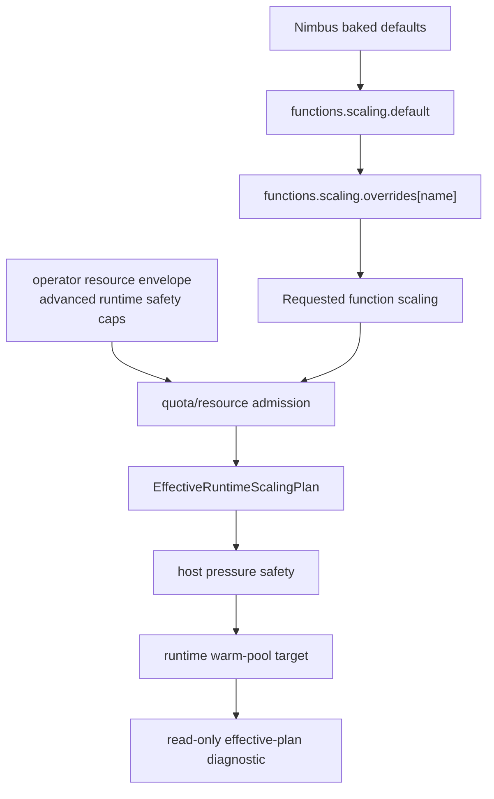

# Plan: Profile-Aware Isolate Runtime Final Architecture

## Status

Decision record for the final PIR architecture. The source of truth remains
`archive/profile-aware-isolate-runtime-plan.md`; this document records the final
shape that follows from PIR0-PIR7 measurements, proof artifacts, and exemplar
review.

This document does not replace the PIR control plane. It summarizes what Nimbus
commits to, what Nimbus rejects, and why.

Runtime-owner correction (2026-07-21): the PIR phrase “authority-keyed” is now
interpreted through the deeper runtime tenant-isolation contract. Mutable
retained state is first partitioned by mandatory runtime-owner class, stable
subject, and Engine/storage incarnation. Deployment, bundle, lane, permission,
capability, construction, and optional routing-locality facts form the exact
reuse authority inside that owner partition. Tenant labels and routing affinity
are not ownership.

## Final Decision

Nimbus commits to:

> Profile-derived runtime policy, authority-keyed warm isolate pools,
> per-profile startup snapshots, module code cache, read-safe cooperative
> isolate scheduling, host-resource governance, and target-bounded pointer
> compression, with live adaptive autoscaling promoted only through the
> replay-gated PIR7L follow-on.

The durable architecture is the one already converged in
`profile-aware-isolate-runtime-plan.md`: profile-aware, authority-keyed,
thread-affine warm isolate pools with bounded context reuse, startup snapshots,
code-cache, LRU/tenant caps, cleanliness gates, and pressure-aware host safety.

The final adjustment from the earlier PIR posture is pointer compression:
pointer compression is no longer just an interesting opt-in experiment. Nimbus
should treat it as a committed production density path and make it default for
Nimbus-owned supported release targets after target-specific CI, artifact, and
benchmark gates pass. It remains explicit at the `nimbus-runtime` crate level
and fail-closed for unsupported targets.

The adaptive-autoscaling adjustment is narrower: PIR7 proved the replay
controller shape, but not live actuation. Live adaptive autoscaling is a
separate PIR7L promotion phase with captured production-style traces, shadow
mode before actuation, canary/rollback controls, host-pressure oscillation
checks, p99 protection, and fairness proof. Until that phase passes, static
measured defaults remain the production behavior.

## Ownership Boundary

The host-resource governor (the CPU/memory/storage/network admission seam) is
**owned by `layered-admission-control-plan.md`**. This decision record *consumes*
that governor rather than defining it: the PIR7L adaptive-controller and PIR7M
UX bands, and the public `functions.scaling` surface, all defer to the governor
contract owned there. Where this record describes host-resource envelopes or
pressure-adjusted admission, treat `layered-admission-control-plan.md` as the
authority and this document as a downstream consumer.

## Primary Sources

- `profile-aware-isolate-runtime-plan.md`
- `proof/profile-aware-isolate-runtime/pir0-baseline.md`
- `proof/profile-aware-isolate-runtime/pir2-closeout-reroute.md`
- `proof/profile-aware-isolate-runtime/pir5-pointer-compression.md`
- `proof/profile-aware-isolate-runtime/pir6-snapshots-code-cache.md`
- `proof/profile-aware-isolate-runtime/pir7-host-resource-budget.md`

The numbers below intentionally repeat the PIR proof artifacts so this decision
record can be audited without reinterpreting the benchmark traces.

## Measured Facts

### PIR0: Node Cold Start Dominates

PIR0 measured the profile matrix with isolate-intrinsic benchmarks and no real
database dependency.

| Profile family | Cold average | Warm average |
| --- | ---: | ---: |
| WebStandard | about 2.03 ms | about 0.042 ms |
| Node20-Node26 | about 210-220 ms | below 0.46 ms |

Conclusion:

- Web cold start is already low enough that complexity-heavy Web-only
  optimizations need exceptional proof.
- Node cold start is the major latency and occupancy problem.
- Node retained-runtime density is materially more important than Web density.
- Pool sizing must use PIR0/PIR7's equation:
  `target_warm = ceil(lambda * occupancy_time) + headroom`, bounded by CPU,
  memory, tenant caps, owner caps, and pressure state.

### PIR6: Startup Snapshots Are The Primary Cold-Start Lever

PIR6 proved node snapshot consumption and measured focused snapshot rows:

| Row | Median / mean | Direction |
| --- | ---: | --- |
| Node22 hostless cooperative startup-snapshot cache | about 10.005 ms | about -95% from previous Node cold baseline |
| Node22 setup-heavy startup-snapshot cache | about 10.362 ms | about -95% from previous Node cold baseline |
| WebStandard hostless startup-snapshot cache | about 1.7965 ms | near-neutral |
| WebStandard setup-heavy startup-snapshot cache | about 2.3096 ms | near-neutral |

Conclusion:

- Startup snapshots are the main Node cold-start win.
- Web snapshots are still useful for shape consistency and bootstrap ownership,
  but they are not the main ROI source.
- Snapshot construction must stay platform-built and must not capture tenant,
  request, host-call session, service grant, or permission-profile state.

### PIR6: Module Code Cache Is Useful But Secondary

Dedicated PIR6 code-cache rows measured the product runtime invocation surface:

| Profile | Fresh bundle median | Primed bundle code-cache median |
| --- | ---: | ---: |
| WebStandard setup-heavy | 2.2957 ms | 2.1007 ms |
| Node22 setup-heavy | 10.624 ms | 10.415 ms |

Conclusion:

- Code cache is worth keeping because it is a real, low-risk measured win.
- It is not the main architectural lever; startup snapshots dominate Node.
- The cache-key owner must remain deep in `RuntimeBundleEngineCacheKey`, with
  profile/config dimensions that can affect compiled semantics.

### PIR2: Fresh-Realm Context Recycling Loses This Release

PIR2 proved WebStandard `WarmContextRecycle` functionally, then rejected it as a
default because it lost the benchmark.

| Workload | Startup snapshot cache | Warm context recycle |
| --- | ---: | ---: |
| setup-heavy | 2.3718 ms | 5.2941 ms |
| hostless | 1.9633 ms | 4.9123 ms |

The phase trace attributes the dominant overhead to `create_realm`:

| Workload | `create_realm` | Bootstrap install/finalize/reset |
| --- | ---: | ---: |
| setup-heavy | 3.054 ms | 0.537 ms |
| hostless | 3.123 ms | 0.537 ms |

Conclusion:

- `WarmContextRecycle` stays internal/diagnostic, not a default.
- PIR4 proceeds only with isolate-level multiplexing and one request per live
  context/global object.
- Any future attempt to revive context recycling needs a separate Deno/V8
  context-template fork plan, authority fuzz, Node extension-JS replay proof,
  and a committed benchmark that beats startup snapshots.

### PIR5: Pointer Compression Wins Retained RSS

PIR5 measured retained current-RSS impact with four retained warm runtimes per
profile in fresh benchmark processes.

| Profile | Baseline bytes/runtime | Ptrcomp bytes/runtime | Delta |
| --- | ---: | ---: | ---: |
| WebStandard | 1,814,528 | 1,007,616 | -44.47% |
| Node20 | 4,444,160 | 3,092,480 | -30.41% |
| Node22 | 4,591,616 | 3,256,320 | -29.08% |
| Node24 | 5,632,000 | 3,600,384 | -36.07% |
| Node26 | 4,558,848 | 2,772,992 | -39.17% |

Conclusion:

- Pointer compression is a strong density optimization for Nimbus's retained
  warm-runtime architecture.
- It should become a production path, not a one-off experiment.
- It cannot be a universal target default until target support is proven.

## Post-PIR Optimization Benchmark Backlog

These benchmarks calibrate the winning architecture; they do not reopen rejected
architecture choices. The goal is to explain where Nimbus still pays overhead
inside the committed profile-aware, authority-keyed, thread-affine runtime
architecture, then turn the measured hotspots into small, testable module
deepening work.

| Priority | Benchmark | Why | Success criteria |
| --- | --- | --- | --- |
| 1 | WebStandard warm-pool parity versus OpenWorkers-style path | Closest apples-to-apples comparison for the canonical Web isolate pool shape. | Nimbus WebStandard warm hits are in the same latency class, or the delta is attributed to named Nimbus layers. |
| 2 | Warm-hit overhead breakdown | Enterprise substrate adds policy, metrics, HostBridge, bundle lookup, scheduler, integrity, and telemetry work. | p50/p95 attribution per layer, with no unexplained warm-hit gap. |
| 3 | Hot-tail prewarm policy | Startup snapshots help first hit; warm pools help repeated hot functions. | Lower p95/p99 under Zipf and hot-tenant traces without exceeding retained-RSS and host-pressure budgets. |
| 4 | Pool sizing and eviction curves | Validate `max_per_thread`, `max_per_owner`, retained entries, LRU, and overcommit behavior. | Find the latency/RSS knee and record safe defaults for retained count, owner caps, pressure eviction, and prewarm pause. |
| 5 | Cooperative scheduler under mixed I/O and CPU | PIR4 proved the safe shape; fixed-window mixed rows now quantify realistic contention. | Recorded: async host waits park cleanly under a single active slot; CPU-first rows increase I/O latency but complete without stranded queued/active work. |
| 6 | Exact-key fragmentation cost | Exact authority keys are required for safety, but they can reduce warm-hit density. | Recorded for tenant/function/script entrypoint dimensions; static policy partitions remain exact-key boundaries, not benchmark knobs. |
| 7 | WebStandard module/code-cache variants | Code cache may still reduce cold or semi-warm setup-heavy Web rows. | Recorded: code cache modestly lowers hostless rows and materially lowers setup-heavy p50/p99, enough to keep as a secondary default layer. |
| 8 | Memory density under real fanout | Warm pools multiply resident memory under multi-tenant fanout. | Record RSS per retained runtime, max retained entries, pressure eviction thresholds, and tenant/operator-safe defaults. |
| 9 | NodeFull lazy initialization | NodeFull realm pooling lost, but startup snapshots won; the next Node win is avoiding unnecessary extension work. | Recorded: deno_core-style snapshot `lazy_init` is already the baseline; import-set extension pruning requires a separate classifier/watchpoint proof before implementation. |
| 10 | Replay-based adaptive controller | PIR7 keeps live adaptivity off by default; replay can prove whether that should change. | Recorded: fixed replay rows cover stable demand, burst spillover, memory-pressure panic, Zipf tenant caps, and rate-limited decay while live adaptive defaults remain off. |

The first implementation wave should compare:

- Nimbus WebStandard exact-key `WarmPool`;
- an OpenWorkers-style owner-keyed diagnostic path that never becomes a shipping
  authority key by itself;
- Nimbus `StartupSnapshotCache`;
- Nimbus `WarmContextRecycle` as an internal diagnostic row only.

Run those rows across hostless-trivial, setup-heavy large-module, async host-call,
CPU-bound JIT-hot, multi-tenant Zipf, high authority-key fragmentation, and
host-pressure or memory-pressure scenarios.

The central question is:

> Is Nimbus WebStandard warm-pool overhead mostly unavoidable enterprise
> substrate, or is avoidable per-invocation overhead hiding in policy,
> HostBridge, scheduler, bundle lookup, metrics, integrity, or module loading?

First-wave calibration result, recorded in
`docs/private/plans/proof/profile-aware-isolate-runtime/post-pir-optimization-benchmarks.md`:

- Exact-key WebStandard warm pools and the OpenWorkers-style owner-keyed
  diagnostic path are in the same latency class. The benchmark evidence does
  not justify weakening Nimbus authority keys.
- `StartupSnapshotCache` remains valuable for cold/fresh execution, but repeated
  WebStandard warm work is slower than exact-key warm-pool rows in the
  first-wave matrix.
- `WarmContextRecycle` remains diagnostic only and should not be promoted as a
  default WebStandard or NodeFull optimization path.
- Initial warm-hit attribution shows policy bookkeeping, execution-plan
  construction, admission, router dispatch, and integrity verification are
  microsecond or sub-microsecond scale in the hostless WebStandard warm row.
  Async host-call rows are dominated by HostBridge wait/call time, as expected
  from the synthetic 1 ms host delay.
- Fanout retained-density rows now show the expected exact-key tradeoff:
  undersized retained caps thrash under authority fanout, while cap-equals-
  fanout rows return WebStandard exact-key warm pools to owner-keyed diagnostic
  latency class without weakening authority keys.
- The price is resident memory. The setup-heavy fanout-64/cap-64 exact-key row
  retained 64 entries and recorded 107.422 MiB of prime current-RSS growth.
- Fixed-window hot-tail prewarm rows show that speculative hot-set prewarm is
  not the main p95/p99 lever under 75/25 hot-tail traffic. Tail cold misses still
  dominate p95/p99 even when 8 or 16 authorities are prewarmed, and high or
  critical memory pressure correctly admits zero speculative prewarm entries.
- Fixed-window pool sizing rows show the first useful retained-cap knee around
  12 to 16 entries for the 64-authority / 8-hot / 75% hot trace. Cap 4 thrashes
  with zero warm hits and 132 evictions; cap 8 is marginal; larger caps mainly
  reduce eviction count rather than p50 and must be gated by density budget and
  pressure state.
- Cooperative mixed I/O/CPU rows show that read-safe host waits park cleanly
  even with one worker and one active runtime slot: every 128-invocation row
  completed all dispatched work and ended with zero active runtime instances and
  zero queued invocations. CPU-first rows deliberately raise async-host p95 from
  4.862 ms to about 7.1-7.2 ms, so the architectural rule is still cooperative
  host-wait parking plus tenant/operator CPU and host-pressure controls, not CPU
  preemption or shared mutable context reuse.
- Exact-key fragmentation rows extend the fanout result to tenant, function,
  and script-entrypoint dimensions. At fanout 32 / cap 16, each dimension records
  zero warm hits and 144 evictions; at cap 32, each returns to warm-hit class
  with 128 warm hits, 32 prime misses, no evictions, and a 0.800 warm-hit ratio.
  Static partitions such as normalized runtime limits, permission profile,
  construction mode, and exact service grants remain part of the authority
  boundary and are not runtime speed knobs.
- WebStandard code-cache variant rows show a modest hostless startup-snapshot
  improvement and a clearer setup-heavy improvement: setup-heavy p50 moved from
  2.614 ms to 2.420 ms and p99 moved from 3.042 ms to 2.704 ms. Code cache
  remains a safe secondary layer for cold and semi-warm setup-heavy rows, not a
  replacement for exact-key warm-pool retention.
- NodeFull lazy-init rows show the canonical baseline is already present:
  snapshot extension slots use `lazy_init`, execution extension slots use
  `init`, and fixed-window Node22/Node24 startup-snapshot rows record zero
  fresh-realm creates. Pure setup-heavy NodeFull rows sit around 9.3-9.5 ms p50,
  while builtin/module-loader rows sit around 17.1-19.1 ms p50. That is
  import-system work, not evidence for an unsafe eager-extension speed patch.
  Import-set extension pruning needs a separate classifier and compatibility
  watchpoint proof before implementation.
- Replay-based adaptive controller rows show the pure offline controller is the
  right default validation surface before any live adaptive default. Fixed rows
  cover stable demand, burst spillover, memory-pressure panic, Zipf tenant caps,
  and rate-limited decay; every row records live adaptive defaults off. Critical
  memory or host pressure pauses prewarm and evicts idle retained runtimes, the
  Zipf row caps hot desired 11 and cold desired 2 to replayed 1, and the idle
  row rate-limits desired 0 to replayed 3. Live promotion still needs captured
  production-style traces, p99 protection evidence, pressure oscillation
  checks, and operator rollback controls.
- The measured default direction is demand-driven retention and cap sizing, not
  aggressive speculative prewarm.
- The post-PIR benchmark backlog is recorded. The answer is still not
  authority-key collapse.

For NodeFull, do not benchmark fresh-realm pooling again as a default candidate
unless at least one substrate assumption changes: cheaper Deno/V8 realm
creation, a reusable Node realm template, proven extension-JS replay shortcut,
lower-cost module-loader reset, or a materially better NodeFull context-template
or snapshot mechanism. Until then, NodeFull optimization focuses on startup
snapshot improvements, lazy Node extension initialization, exact-key warm-pool
hit rate, code-cache impact, memory density, and host-pressure-safe retention.

## Exemplar Findings

The local exemplar review supports the final architecture:

- `~/src/github.com/openworkers/openworkers-runtime-v8/Cargo.toml` exposes
  `ptrcomp = ["v8/v8_enable_pointer_compression"]`.
- `~/src/github.com/openworkers/openworkers-runner/Cargo.toml` enables
  `features = ["ptrcomp"]` for the V8 runtime dependency.
- `~/src/github.com/openworkers/openworkers-task-executor/Cargo.toml` enables
  `features = ["ptrcomp"]` for its required V8 runtime.
- `~/src/github.com/openworkers/rusty-v8/.github/workflows/ci.yml` builds
  source-owned `ptrcomp` variants for `aarch64-apple-darwin`,
  `x86_64-unknown-linux-gnu`, and `aarch64-unknown-linux-gnu`, while keeping
  Windows on the non-ptrcomp release lane. Linux ARM64 is build-only in that
  workflow; tests are skipped under user-mode QEMU.
- `~/src/github.com/openworkers/openworkers-runtime-v8/docs/execution_modes.md`
  names thread-local, per-owner isolate pools as the production mode and keeps
  fresh isolates for maximum isolation/tests.
- `~/src/github.com/openworkers/openworkers-runtime-v8/docs/architecture.md`
  records that a cross-thread shared pool was removed after contention and that
  thread-pinned pools won the benchmark shape.
- `~/src/github.com/cloudflare/workerd/compile_flags.txt` contains
  `-DV8_COMPRESS_POINTERS` and `-DV8_COMPRESS_POINTERS_IN_SHARED_CAGE`.
- `~/src/github.com/cloudflare/workerd/src/workerd/jsg/jsg.h` stores the base of
  the 4 GB compressed-pointer cage in isolate data.
- `~/src/github.com/denoland/deno_core/core/runtime/jsruntime.rs` keeps startup
  snapshots, extension code cache, eval-context code cache callbacks, create
  params, module loading, op state, and isolate stores in the runtime
  construction interface. That supports keeping the Deno/Node substrate behind a
  deep Nimbus-owned runtime interface rather than duplicating those choices in
  server call sites.
- `~/src/github.com/denoland/deno/runtime/worker.rs` passes startup snapshots
  through the common worker runtime path and wires code-cache callbacks as a
  separate layer. That matches the PIR6 rule: startup snapshots are for runtime
  bootstrap, while module/eval code cache is a secondary compiled-code layer.
- `~/src/github.com/openworkers/openworkers-runtime-v8/tests/code_cache_test.rs`
  treats V8 code cache as the replacement for worker heap snapshots under
  concurrent loading because it stores compiled bytecode only. That reinforces
  Nimbus's no-tenant/user-heap-snapshot rule.
- `~/src/github.com/cloudflare/workerd/src/workerd/jsg/compile-cache.h` keeps a
  process-lifetime compile cache only for built-in modules and documents that
  its safety depends on never removing or replacing entries. That supports
  Nimbus keeping tenant/user code-cache keys owned by `RuntimeBundleEngineCacheKey`
  instead of adopting a global mutable compile-cache.
- `~/src/github.com/cloudflare/workerd/src/workerd/io/worker.h` owns isolate
  metrics and limit enforcement beside the isolate, including a CPU-limit
  nearly-exceeded callback. That supports Nimbus's runtime-owned host-governor
  injection and low-cardinality pressure telemetry.
- `~/src/github.com/laverdet/isolated-vm/isolated-vm.d.ts` exposes CPU time,
  wall time, memory limits, explicit context release, and explicit
  copy/reference/transfer value movement. That supports Nimbus making host-value
  transfer semantics explicit at the runtime/HostBridge interface instead of
  allowing implicit cross-isolate object sharing.
- `~/src/github.com/losfair/blueboat/src/exec.rs` treats abnormal V8
  termination as a context reset/no-reuse event. That supports Nimbus's
  dirty-discard lifecycle on timeout, reset failure, detached contexts, and
  event-loop non-quiescence.

Interpretation:

- Pointer compression is canonical enough to commit to as a production density
  path.
- OpenWorkers' build matrix gives Nimbus a credible source-owned expansion
  pattern for Linux ARM64, but not a wholesale target-set contract and not a
  shortcut around runtime proof. The transferable pattern is the source-owned
  feature-matrix lane with feature-specific artifacts/cache keys and Windows
  left non-ptrcomp. Linux ARM64 ptrcomp must be built, smoke-tested, and
  benchmarked on a real ARM64 runner before Nimbus treats it as
  production-default.
- Thread-affine or thread-local isolate ownership is a better default than a
  cross-thread mutex-backed pool.
- Per-owner/tenant isolation, LRU eviction, and warm context/cache invalidation
  are canonical ownership seams.
- Nimbus should follow the pattern while preserving stricter authority keys and
  stronger host-resource governance than the simpler exemplar code.
- The problem is not fully "solved" by a generic library. The solved pieces are
  the V8 platform singleton, startup snapshots, compiled-code cache, isolate
  thread affinity, owner-keyed pool partitions, bounded queues, dirty-discard
  lifecycle, and target-bounded pointer compression. Nimbus's unsolved product
  work is composing those pieces with Deno/Node compatibility, HostBridge
  authority, tenant/operator quotas, and host-pressure admission.

## Exemplar Pattern Import Rules

Nimbus should import these patterns as defaults:

- **Thread-pinned isolate ownership.** Production pools stay local to the owning
  runtime worker/thread. Do not reintroduce a global cross-thread
  `Mutex`+`Locker` isolate pool as the primary substrate.
- **Authority-keyed warm reuse.** A reusable runtime key must include tenant or
  owner affinity, function/script/bundle identity, version or provenance hash,
  runtime profile, exact service grants, permission profile, construction mode,
  snapshot identity, code-cache safety dimensions, and any environment version
  that can affect observable semantics.
- **Bounded fairness and backpressure.** Capacity must be bounded per host,
  runtime worker/thread, tenant/owner, authority key, and isolate slot. Overload
  returns queueing, shedding, or explicit backpressure instead of unbounded
  isolate creation.
- **Two-phase completion.** Response-ready work and `waitUntil`/background drain
  remain separate lifecycle phases. The background phase gets fresh wall/CPU
  guards and pumps microtasks on the isolate-owning thread before reuse.
- **Reset-or-discard lifecycle.** Warm reuse is allowed only after request
  state reset, event-loop quiescence, boundary GC/heap maintenance, detached
  context checks, and max-reuse checks pass. Timeout, abnormal termination,
  reset failure, dirty host handles, event-loop activity, detached contexts, or
  pressure condemnation discards instead of retaining.
- **Startup snapshot versus module code cache.** Startup snapshots are for
  runtime bootstrap and stable extension JavaScript only. Tenant/user module
  code uses partitioned compiled-code cache. Do not use user heap snapshots as a
  worker-code cache under concurrent multi-tenant loading.
- **Explicit host-value transfer interface.** Cross-isolate host values are
  copied, transferred, or referenced through typed handles with clear lifetime
  and release semantics. No implicit object sharing crosses tenant/profile
  authority seams.
- **Target-bounded pointer compression.** Linux x64, macOS ARM64, and Linux
  ARM64 are production-default targets through the current Nimbus published
  assets. Linux ARM64 keeps the narrow QEMU exception: skip full `nextest` under
  user-mode QEMU, but keep clippy, release build, packaging/upload, release
  asset-set verification, and the native Linux ARM64 Nimbus release build lane.
  Windows remains non-ptrcomp until a separate Windows proof exists.

Nimbus should reject these patterns:

- A single global shared isolate pool across runtime workers/threads.
- A single pool shared across WebStandard, Node/Deno profiles, permission
  profiles, service grants, or construction modes.
- Heap snapshots as a tenant/user worker-code cache.
- QEMU runtime success or failure as production proof for Linux ARM64 ptrcomp.
- Live adaptive autoscaling as a default before replay, pressure, fairness, and
  crossover gates prove it boring.

Node/Deno extrapolation:

- OpenWorkers specializes WebStandard isolates, so its exact context-reuse
  implementation should not be copied wholesale into Node/Deno profiles.
- The transferable Module is the scheduling/lifecycle Module: thread-pinned
  isolate ownership, authority-keyed reuse, bounded queues, two-phase
  completion, and discard-on-dirty teardown.
- Node/Deno warm reuse must remain fail-closed until extension-JS replay, module
  maps, op state, async hooks, process-like globals, inspector/debug state,
  permission state, and host-call sessions have reset proof. Fresh realm or
  fresh isolate remains the safe Adapter behavior whenever that proof is
  incomplete.
- Nimbus's runtime Interface should stay deeper than the exemplars: callers ask
  for a profile-aware invocation under a policy; the implementation decides
  snapshot, code-cache, pool, retention, pressure, and ptrcomp behavior behind
  that seam.

## Isolate Lifecycle Blueprint

This is the lifecycle contract the implementation should follow. It keeps the
canonical isolate-pool Module independent from any one exemplar's exact
Implementation and gives the runtime Interface enough Depth to hide V8, Deno,
Node, snapshot, code-cache, and pressure details from server/adapters.

1. **Process/platform startup.** Initialize the process-wide V8 platform once,
   load the runtime bootstrap registry, discover target feature support, and
   publish a profile snapshot/catalog view. No tenant, request, or user module
   state is admitted at this layer.
2. **Admission and pool selection.** Acquire the Engine-issued tenant runtime
   lease, lower it through the compute-owned `RuntimeManager`, and normalize tenant limits, operator limits,
   host reserves, pressure state, runtime profile, construction mode, and work
   class before selecting a pool. Selection chooses a thread-affine worker pool
   partition; it does not expose a public runtime-profile tuning knob.
3. **Acquire.** Select the mandatory owner partition from owner class, stable
   subject, and incarnation, then build the warm-reuse key from
   function/script/bundle identity, version or provenance hash, runtime profile,
   exact service grants, permission profile, construction mode, snapshot
   identity, code-cache dimensions, and environment version. A key mismatch is a
   cold-create path, not an alias.
4. **Create.** Construct the isolate/runtime through `nimbus-runtime`'s deep
   Interface: V8 create params/resource constraints, startup snapshot,
   HostBridge/op state, task scope, microtask policy, shared-array-buffer and
   wasm stores, and code-cache callbacks are implementation details. Node/Deno
   creation additionally owns extension JavaScript, module loader state,
   polyfill/process-like globals, async hooks, inspector/debug state,
   permissions, and host-call session binding.
5. **Execute.** Each active request owns one live context/global at a time.
   Cooperative scheduling is allowed only for read-safe work that PIR4 proves.
   Mutations/actions remain run-to-completion. Response-ready completion is a
   separate phase from background drain.
6. **Background drain.** `waitUntil` and background tasks run on the
   isolate-owning thread with fresh wall/CPU guards. Do not move V8 microtask
   pumping to a detached task that can outlive the isolate lock/lifecycle.
7. **Return and retain.** Warm retention requires request-state reset,
   event-loop quiescence, boundary GC/heap maintenance, detached-context checks,
   host-handle cleanliness, max-reuse checks, and pressure checks. The runtime
   records low-cardinality lifecycle telemetry before releasing the slot.
8. **Delete and retire.** Owner deletion and deployment replacement revoke
   their distinct authorities, cancel or drain work under the specified race
   contract, and obtain acknowledgements from every worker before lifecycle
   completion. Timeout, abnormal termination, reset failure, dirty
   host handles, live event-loop work, detached contexts, near-limit heap state,
   host pressure condemnation, code/config version mismatch, or max reuse
   retires the isolate/runtime instead of returning it to a pool.
9. **Pressure cleanup.** Host pressure first pauses prewarm, then evicts idle
   retained isolates by LRU/owner fairness, then applies queue backpressure or
   shedding. Active work is governed by explicit seats and timeout/cancellation
   policy, not unbounded overcommit.

### WebStandard and Deno/Node Lifecycle Split

The scheduling Module is shared, but the reset Implementation is profile-owned.
This is the key enterprise-trust boundary.

| Area | WebStandard/WebLean | Deno/Node/NodeFull |
| --- | --- | --- |
| Pool topology | Thread-affine, owner/authority-keyed isolate pools. | Same topology, with separate partitions from WebStandard and from every permission/grant/construction mode. |
| Reuse default | Warm isolate reuse with startup snapshot and module code cache. OpenWorkers-style context reset is internal/diagnostic unless future evidence beats the current snapshot-first result. | Warm runtime reuse is allowed only behind the same authority key. Do not copy the WebStandard reset Implementation into Node/Deno. Fresh realm or fresh isolate is the safe Adapter behavior whenever reset proof is incomplete. |
| Reset proof | Clear globals, streams, callbacks, timers, host handles, pending tasks, and `waitUntil`; discard on any dirty signal. | Prove extension-JS replay, module maps, op state, async hooks, process-like globals, inspector/debug state, permission state, host-call sessions, timers, microtasks, shared-array-buffer/wasm stores, and module-loader/cache state. |
| Background work | Two-phase response/background completion on the owning thread. | Same, plus Deno/Node event-loop and op-state quiescence proof. |
| Deletion rule | Timeout, abnormal termination, reset failure, dirty host handles, detached contexts, or pressure condemnation means no reuse. | Same rule, with additional discard on any unproven runtime state or Node/Deno compatibility-state dirtiness. |

OpenWorkers' strongest lesson is not "copy every WebStandard context-reuse
detail." The leverage is the thread-pinned, authority-keyed, reset-or-discard
lifecycle. Nimbus should keep that Module and let each runtime profile own the
Implementation details behind the `nimbus-runtime` Interface.

## Architecture We Commit To

### 1. RuntimeProfile As Internal Policy

`RuntimeProfile` remains an internal derived efficiency bundle. It is selected
after tenant admission and normalized limits. It is not a caller-visible trust
or tuning knob.

Commitments:

- Profiles may choose snapshots, code-cache keys, warm-pool defaults, telemetry
  buckets, and benchmark rows.
- Profiles must never collapse trust tier, permission profile, tenant authority,
  exact service grants, or resource caps.
- Public APIs must not expose new efficiency knobs unless a separate product
  plan creates that contract.

### 2. Authority-Keyed Warm Isolate Pools

Warm isolate pools are the canonical in-process substrate.

Commitments:

- Partition first by mandatory runtime-owner incarnation. Inside an owner
  partition require exact deployment authority, bundle provenance, runtime
  profile/lane, service grants, permission/capability projection, construction
  mode, snapshot/code-cache safety dimensions, and any optional locality
  discriminator.
- Keep routing affinity best-effort and non-authoritative; `None`, function,
  tenant, and unscoped script routing cannot weaken owner isolation.
- Keep LRU, owner caps, tenant caps, max reuse, cleanliness checks, boundary GC,
  heap carryover condemnation, and near-heap-limit retirement.
- Do not reuse across authority boundaries for convenience.

### 3. Startup Snapshots As The Primary Cold-Start Lever

Per-profile startup snapshots are the default cold-start lever, especially for
Node profiles.

Commitments:

- Node snapshot consumption stays wired through the bootstrap extension
  registry.
- Web snapshots stay lean.
- Snapshot artifacts remain platform-built process artifacts.
- No tenant/user/request snapshot payload is admitted in this band.

### 4. Module Code Cache As A Secondary Layer

The module code cache remains enabled as a measured supporting optimization.

Commitments:

- Keep cache-key ownership in `RuntimeBundleEngineCacheKey`.
- Include profile and authority-affecting runtime config dimensions.
- Defer disk-persistent code cache until provenance, invalidation, and measured
  value justify it.

### 5. Cooperative Scheduling At The Isolate Boundary

PIR4's final safe throughput shape is read-safe interleaving without sharing one
live JS global object between multiple active requests.

Commitments:

- Unit of multiplexing is the isolate/slot, not multiple tenants in one live
  global object.
- Queries/read-safe work may use cooperative scheduling.
- Mutations/actions stay run-to-completion unless a future proof changes the
  safety model.
- Host-call sessions remain task-scoped and fail-closed.
- `waitUntil` drains under a bounded background phase before reuse.

### 6. Host Resource Governance As Mandatory Safety

Host-resource governance is part of the runtime architecture, not an optional
operator add-on.

Commitments:

- `nimbus start`, `nimbus dev`, and `nimbus node` lower to one host-resource
  budget model.
- Runtime seats are bounded by host allocatable capacity, reserves, pressure
  state, tenant/work-class fairness, and effective dispatch seats.
- Pressure response triggers before tenant quota exhaustion when CPU PSI, run
  queue, cgroup throttling, memory pressure, RSS/headroom, queue age, or
  control-plane lag says the node is saturated.
- Cgroups/systemd provide aggregate backstops for process-backed workloads; they
  do not provide per-tenant CPU isolation inside one shared V8 process.

### 7. Pointer Compression As Target-Bounded Production Path

Pointer compression is a committed production density optimization. It should be
default-on for Nimbus-owned supported release targets after target-specific CI,
artifact, and benchmark gates pass.

Commitments:

- Keep `nimbus-runtime`'s `v8-pointer-compression` feature explicit for library
  correctness and unsupported-target hygiene.
- Make Nimbus-owned binary/release builds use pointer compression by default on
  supported targets after the gates below pass.
- Preserve two support tiers:
  - **prebuilt-supported ptrcomp**: targets with published Nimbus
    `ptrcomp+simdutf` assets consumed without `V8_FROM_SOURCE` today
    (`aarch64-apple-darwin`, `x86_64-unknown-linux-gnu`, and
    `aarch64-unknown-linux-gnu`).
  - **unsupported/non-ptrcomp**: targets without published
    `ptrcomp+simdutf` assets stay non-ptrcomp. Windows is the current member of
    this tier.
- Do not publish or claim unsupported target combinations as production-default.
  The current support boundary excludes Windows pointer-compression prebuilt
  assets for this release.
- Treat unsupported targets as fail-closed or non-ptrcomp until V8/rusty_v8
  support is proven.
- The supported Linux ARM64 ptrcomp release artifact keeps the narrow QEMU
  exception: the `release aarch64-unknown-linux-gnu ptrcomp simdutf` job skips
  full `nextest` under user-mode QEMU but still runs `Clippy ptrcomp simdutf`,
  release build, packaging/upload, and the published release has 22 assets.

## Architecture We Reject

### Reject Fresh-Realm Context Recycling As Default

Rejected because it lost to startup snapshots and because `create_realm`
dominates the cost.

Keep:

- Internal/diagnostic `WarmContextRecycle`.
- Safety tests and lifecycle invariants.

Reject:

- Product default.
- Public tuning knob.
- PIR4 prerequisite.

### Reject Cross-Thread Mutex-Backed Shared Pools

Rejected because exemplar review shows the cross-thread shared-pool shape
degrades under contention, while thread-pinned pools avoid the global lock.

Keep:

- Thread-affine worker ownership.
- Fair queues and host dispatch seats.

Reject:

- A global mutex-backed isolate pool as the primary architecture.

### Do Not Default Live Adaptive Autoscaling Until PIR7L Passes

Live adaptive autoscaling is not rejected as a capability. It is rejected as a
default until a bounded controller phase proves that live actuation is better
than static measured defaults under real pressure, tenant skew, and burst
signals. The PIR7 replay rows are the correct proof surface, but replay is not
actuation.

PIR7L live adaptive controller is implemented as an operator-gated capability,
not as a product default. The implementation supports disabled, shadow, canary,
live, and rollback modes through `RuntimeAdaptiveWarmPoolController`, adapter
traits for observation, clock, pressure, metrics, and actuation, `nimbus start`
operator controls, disabled `nimbus dev`/`nimbus node` defaults, server/AppState
propagation, and low-cardinality runtime metrics. This does not make live
adaptivity a default; operators must explicitly select canary or live mode, and
rollback returns to static measured defaults.

In short: PIR7L supports disabled, shadow, canary, live, and rollback modes and
does not make live adaptivity a default.

### Function Scaling UX Is The Public Default Surface

The public product surface for warm-pool sizing is **function scaling**, not
runtime internals. Tenants and developers should not have to know whether a
given warm entry is a V8 isolate, a NodeFull runtime substrate, a future Wasm
instance, or a microVM-backed strong-tier slot. Nimbus should ship baked function
scaling defaults and let YAML override them only when the tenant has a real
reason.

Current follow-on public app intent:

```yaml
functions:
  scaling:
    default:
      preset: warm
      min_warm: 0
      max_warm: auto
      scale_down_delay: 10m

    overrides:
      "messages:send":
        preset: latency
        min_warm: 2
        max_warm: 16
        scale_down_delay: 30m
        reason: "hot write path"

      "reports:nightly":
        preset: economy
        min_warm: 0
        max_warm: 1
        scale_down_delay: 30s
```

PIR7M implemented the first product-grade UX. The follow-on autoscaling contract
was recorded in `archive/tenant-function-autoscaling-plan.md` (TFA, now archived)
and the CPU/memory/storage/network operator envelope has since been folded into
the host-resource governor owned by `layered-admission-control-plan.md` (see the
ownership note below). The shipped runtime state is what this decision record
describes; TFA is retained only as archived evidence. The contract remains:
autoscaling is inferred from `preset` plus `min_warm`/`max_warm`, tenants should
not write `autoscaling: true`, and operator policy is an owned
CPU/memory/storage/network resource envelope. Live adaptive-controller actuation
remains operator controlled.

Archived TFA operator envelope (evidence):

```yaml
tenant: tenant-a
defaults:
  resources:
    cpu: 8000m
    memory: 16Gi
    storage: 200Gi
    network_egress: 100Gi/day
  runtime_safety:
    autoscaling: allowed
    host_cpu_reserve: 20%
    max_ready_per_function: auto
    max_reserved_ready_memory: auto

workloads:
  - kind: runtime_function
    name: "messages:send"
    quotas:
      resources:
        cpu: 2000m
        memory: 2Gi
      runtime_safety:
        max_ready: 16
```

DX touchpoints:

| Actor | Touchpoint | Responsibility |
| --- | --- | --- |
| Developer, no config | `nimbus dev` | Gets baked defaults and development-friendly retention after first traffic without learning runtime internals or prewarming every possible key. |
| Tenant admin / app owner | `nimbus.yaml` `functions.scaling.default` | Sets tenant-wide function scaling intent. |
| Tenant admin / app owner | `nimbus.yaml` `functions.scaling.classes` | Defines reusable preset/raw-field groups for exceptional hot or cold paths. |
| Tenant admin / app owner | `nimbus.yaml` `functions.scaling.overrides` | Adds rare named-function exceptions with reasons. |
| Operator | `nimbus.policy.yaml` / operator API | Sets resource envelopes, host-safety policy, and advanced runtime-safety caps. |
| Developer / operator | `nimbus explain functions messages:send` | Explains requested, admitted, capped, and pressure-adjusted values for one selected function. |
| Developer / CI | `nimbus validate`, `nimbus validate functions`, `nimbus validate policy` | Validates app config, function scaling requests, operator resource envelopes, and quota fit before boot. |
| Developer | `nimbus run functions messages:send '{"body":"hello"}'` | Runs one selected function through the same resource-family grammar while accepting Convex-style function names and JSON args. |

Flow:



CLI grammar:

```text
nimbus <verb> <resource-family> [selector]
```

The canonical verbs are top-level because `explain`, `validate`, `run`, and
`list` are cross-cutting surfaces, not function-only subcommands. Use plural resource-family nouns: `functions` is the collection and `messages:send` is the
selector. Document `nimbus explain functions messages:send`, `nimbus validate
functions`, `nimbus run functions messages:send '{"body":"hello"}'`, and
`nimbus list functions`; do not make noun-first forms such as
`nimbus functions explain messages:send` the canonical UX.

Current CLI fit:

- The existing CLI already has root verbs such as `start`, `dev`, `deploy`, and
  `run`, plus older noun-owned administrative groups such as `policy validate`.
  PIR7M should put new cross-cutting diagnostics on root verbs:
  `nimbus explain ...` and `nimbus validate ...`.
- The `nimbus run functions <name> [jsonArgs]` parser change SHIPPED
  (`crates/nimbus-cli/src/run.rs`: `RunFunctionsCommand` selector + `json_args`,
  dispatched through `run_function_command`; `run exec` remains a reserved
  workload placeholder). `run` remains the general ephemeral workload verb; it is not reserved for Convex. The `functions` family covers Convex-compatible
  functions, Nimbus-native functions, Cloud Functions compatibility functions,
  and future admitted function families. Put any future generic command runner
  under an explicit family such as `nimbus run exec -- ...`.
- `nimbus validate policy` is the canonical policy-validation spelling for this
  surface. If the implementation touches the older noun-first policy validator,
  share the implementation intentionally and do not teach the old spelling as the
  PIR7M happy path.

Scaling presets:

| Preset | Intent | Required behavior |
| --- | --- | --- |
| `economy` | Low resident memory for rare/cold-tolerant paths. | `min_warm: 0`, short idle decay, conservative `max_warm: auto`. |
| `warm` | Default posture for ordinary functions. | `min_warm: 0`, `max_warm: auto`, medium `scale_down_delay`; first traffic materializes the runtime. |
| `latency` | Explicit hot user-facing paths. | May request `min_warm: 1+` and longer `scale_down_delay` inside resource admission. |
| `throughput` | Only if implemented with distinct behavior. | Use only for higher derived max, faster scale-up, or target-concurrency semantics; do not rename `latency`. |
| `fixed` | Operator-admitted fixed capacity. | Requires or derives `min_warm == max_warm` and infers fixed behavior before admission. |

The archived TFA contract superseded PIR7M's public activation contract, and
that superseding contract is what shipped. The contract is that
`nimbus start` defaults to `min_warm: 0`: first traffic materializes the runtime,
`scale_down_delay` keeps it warm after traffic, and it may decay back to zero
after the idle timeout. `nimbus dev` also avoids broad global `min_warm: 1`;
warm-hit product feel comes from development-friendly retention derived from
`scale_down_delay` and active/recent materialized keys, not prewarming every
function or authority-key variant.

Public config keeps `min_warm` / `max_warm`. `min_warm` means an admitted
function-level prewarm floor for known/deployed function selectors and
materialized exact authority keys, not one prewarmed entry for every possible
tenant/function/script/grant/condition/construction-mode key. Autoscaling is
diagnostic evidence inferred from the range:

- `max_warm: auto` means inferred autoscaling unless `preset: fixed`.
- Concrete `min_warm != max_warm` means inferred autoscaling.
- Concrete `min_warm == max_warm` means fixed behavior.
- `preset: fixed` requires or derives `min_warm == max_warm`.

Effective diagnostics must separate the layers:

```text
Tenant request: messages:send preset=latency min_warm=2 max_warm=16 scale_down_delay=30m
Autoscaling: inferred=true admitted=true
Operator envelope: cpu=2000m memory=2Gi derived_max_ready=8
Effective: min_warm=2 max_warm=8 pressure_adjustment=none
```

`nimbus dev` and `nimbus start` should also print one compact summary, for
example:

```text
Function scaling: dev defaults, min_warm=0, max_warm=auto, scale_down_delay=10m. Run nimbus explain functions <name>.
```

The intended merge order is:

```text
Nimbus baked default
  + nimbus.yaml functions.scaling.default
  + functions.scaling.overrides["function:name"]
  -> requested function scaling policy
  -> nimbus.policy.yaml / operator quota admission
  -> effective runtime warm-pool target
  -> host-pressure safety may only lower, evict, queue, or shed
```

Default posture:

- `nimbus dev` uses `min_warm: 0` plus a development-friendly
  `scale_down_delay` or internally derived active/recent retention so the
  product demonstrates warm-hit behavior without broad prewarm.
- `nimbus start` uses baked measured defaults when no YAML is present. The
  default min is zero, first traffic materializes the runtime,
  `scale_down_delay` retains it briefly, max is derived from tenant/operator/host
  caps, and host pressure can still shrink the effective target.
- Explicit tenant/function requests above operator limits are rejected with an
  actionable effective-plan diagnostic. Derived `auto` values are bounded by the
  operator envelope.
- Function-level overrides are the exception path for hot or special workloads;
  diagnostics should report every override and require a reason when an override
  increases `min_warm` or `max_warm` above the tenant default.

Naming:

- Public app intent: `functions.scaling`.
- Public presets: `economy`, `warm`, `latency`, and `fixed`.
- Public v1 knobs: `preset`, `min_warm`, `max_warm`, and `scale_down_delay`.
- Reusable classes live under `functions.scaling.classes`.
- Public CLI grammar: `nimbus <verb> <resource-family> [selector]` with plural
  resource families such as `functions`.
- Function names live under `functions.scaling.overrides`.
- Operator policy bounds runtime resource use with resource envelopes and
  advanced runtime-safety caps.
- Internal Rust may use `RuntimeScalingPolicy`, `RuntimeScalingLimits`, and
  `EffectiveRuntimeScalingPlan`.
- `isolates` is reserved for V8-specific implementation metrics/diagnostics.

Keep:

- Baked Nimbus defaults with no YAML required.
- Inspectable defaults through `nimbus explain config functions.scaling`.
- Presets and reusable classes that compile to raw effective-plan fields before
  operator admission.
- Tenant global default override.
- Rare function-name overrides under `functions.scaling.overrides`.
- Operator resource envelopes and effective-plan diagnostics.
- Exact authority-key dimensions. A function-level warm budget may allocate on
  demand, but must not eagerly create entries for every tenant/function/script/
  service-grant/construction-mode combination.

Reject:

- `runtime`, `isolate`, pool kind, execution model, reset strategy, or adaptive
  mode as the public app-intent vocabulary.
- `activation_warm` or explicit tenant `autoscaling` as common public v1 fields.
- Silent widening beyond operator limits.
- Silent clamping of explicit tenant requests without an actionable diagnostic.
- Global min-warm applied to every theoretical authority key.

Keep:

- Replay controller.
- Static measured defaults.
- CI crossover guard.
- PIR7L live adaptive autoscaling follow-up.
- PIR7M function scaling UX and quota-admission follow-up.
- Shadow mode before actuation.
- Operator rollback.

Reject:

- Live adaptive defaults before captured production-style traces, shadow-mode
  evidence, p99 protection, pressure-oscillation checks, tenant-fairness checks,
  low-cardinality metrics, and operator rollback are recorded.
- Any SDK, manifest, request parser, or hidden developer speed knob that enables
  adaptive scaling.
- Any OpenWorkers-style owner-key collapse that weakens Nimbus authority-key
  dimensions to improve warm-hit rate.

### Reject Universal Pointer Compression Default Today

Rejected only as a universal target default. The architecture commits to pointer
compression for supported targets, but the release matrix is not universal yet.

Keep:

- Supported-target production default path.
- Explicit crate feature.
- Cross-platform gate.

Reject:

- One global default that assumes Windows and Linux ARM pointer compression are
  supported before V8/rusty_v8 proves them.
- Treating a Linux ARM64 source build as production evidence without native
  ARM64 runtime tests and retained-RSS/latency rows.

### Reject MicroVM Snapshot Restore In The PIR Baseline

Rejected from the in-process PIR baseline because it belongs to the strong
isolation tier and depends on the sandbox/microVM S-band.

Keep:

- PIR8 deferred.
- Reference to the VM checkpoint lane (now
  `firecracker-fast-invocation-backend-plan.md`; formerly `nimbus-sandbox`
  Band S).

Reject:

- A parallel microVM controller inside PIR.

## Recommended Defaults

### WebStandard / WebLean

- Startup snapshot cache: default.
- Module code cache: enabled.
- Warm pool: enabled and authority-keyed.
- Cooperative read-safe scheduling: enabled where PIR4 allows.
- Pointer compression: default only on supported Nimbus release targets after
  target gates pass.

### NodeFull / Node20-Node26

- Startup snapshot: default and mandatory for cold-start posture.
- Module code cache: enabled, secondary.
- Warm pool: enabled and authority-keyed.
- Context recycling: non-default/internal diagnostic only.
- Pointer compression: target-bounded production default on Linux x64, macOS
  ARM64, and Linux ARM64 release builds through the published
  `ptrcomp+simdutf` assets. Windows remains non-ptrcomp until a separate proof
  lands.

### Target Policy

| Target | Ptrcomp posture | Required proof before default |
| --- | --- | --- |
| `x86_64-unknown-linux-gnu` | supported production-default | Published `ptrcomp+simdutf` asset, CI ptrcomp test lane, startup snapshot/code-cache tests, retained-RSS and latency rows |
| `aarch64-apple-darwin` | supported production-default | Published `ptrcomp+simdutf` asset, CI ptrcomp test lane, startup snapshot/code-cache tests, retained-RSS and latency rows |
| `aarch64-unknown-linux-gnu` | supported production-default | Published `ptrcomp+simdutf` asset, skips only full `nextest` under user-mode QEMU, keeps clippy/build/package/upload/release verification, native Nimbus release build lane |
| Windows MSVC | non-ptrcomp | Normal and simdutf assets only until a separate Windows ptrcomp proof passes |

### Strong / Mutually Untrusted Tier

- In-process isolate path remains only for approved trust boundaries.
- Process or microVM tier handles stronger kernel-level tenant isolation.
- PIR8 remains deferred to the sandbox plan.

## Pointer Compression Default Gate

Before Nimbus flips pointer compression on by default for any target class, that
target class must satisfy:

- Release assets exist for the target and feature combination without
  `V8_FROM_SOURCE`; unsupported target/feature combinations stay absent from
  the release matrix.
- CI builds and tests the target-specific ptrcomp path. Linux ARM64 is the
  exception only for the full `nextest` suite under user-mode QEMU; it still
  runs ptrcomp `clippy`, release build, artifact packaging/upload, and release
  asset-set verification.
- Startup snapshot and module code-cache tests pass with ptrcomp.
- Retained-RSS and latency comparisons are recorded for Web and Node profiles.
- Workload-specific regressions are below the accepted threshold or explicitly
  accepted by the owning plan.
- The fallback path is explicit when a platform lacks pointer-compression
  support.
- Linux ARM64 specifically requires a native ARM64 Nimbus release build lane
  before production release default. A user-mode QEMU `nextest` result alone can
  prove artifact execution stability, but not production behavior.

Invariant: user-mode QEMU source build alone can prove artifact construction, but not production behavior.

The default policy may be platform-specific. That is preferable to making the
crate feature globally default and breaking unsupported release targets.

Target-specific pointer-compression release-default policy is implemented
through `scripts/nimbus-release-rust-features.sh`.

- Release builds enable `v8-pointer-compression` for
  `x86_64-unknown-linux-gnu`, `aarch64-apple-darwin`, and
  `aarch64-unknown-linux-gnu`.
- Release builds intentionally emit no pointer-compression feature for
  `x86_64-pc-windows-msvc`.
- `nimbus-runtime` remains explicit and non-default; the `nimbus` and
  `nimbus-bin` feature surfaces forward the feature only when Nimbus-owned
  release policy asks for it.
- CI now includes `rust-runtime-ptrcomp-check` on Linux x64 to prove the
  supported prebuilt path compiles without `V8_FROM_SOURCE`.

## Verification Gates

This decision is valid only while the following remain true:

- `bash scripts/verify-profile-aware-isolate-runtime.sh` passes.
- `bash scripts/verify-runtime-tenant-isolation.sh` passes.
- PIR0/PIR2/PIR5/PIR6 proof artifacts retain exact benchmark/proof numbers.
- Startup snapshot rows remain green for Web and Node.
- Code-cache partition tests remain green.
- Cooperative read-safe scheduling tests remain green.
- Host-resource budget tests cover `nimbus start`, `nimbus dev`, `nimbus node`,
  server construction, runtime admission, pressure telemetry, service workload
  cgroups, and controller replay.
- PIR7L live adaptive autoscaling cannot enable actuation until captured traces,
  shadow-mode evidence, p99 protection, pressure-oscillation checks,
  tenant-fairness checks, low-cardinality metrics, and operator rollback are
  recorded.
- CI crossover guard keeps snapshot-vs-reuse assumptions honest.
- Pointer-compression target defaults are gated by the target-specific proof
  above.

## Implementation Follow-Up

Completed stabilizer:

1. Added a target-specific pointer-compression default policy for Nimbus-owned
   release builds.
2. Kept `nimbus-runtime` crate feature explicit and non-universal.
3. Added verifier conditions that distinguish supported-target ptrcomp defaults
   from unsupported-target fallback behavior.
4. Added a CI lane for the supported Linux x64 ptrcomp path.
5. Added the supported Linux ARM64 ptrcomp release artifact in
   `nimbus/rusty_v8` `v149.4.0-nimbus.10`: the
   `release aarch64-unknown-linux-gnu ptrcomp simdutf` job skips only full
   `nextest` under user-mode QEMU, still runs `Clippy ptrcomp simdutf`, still
   builds/packages/uploads normal release artifacts, and the release asset-set
   verifier requires the Linux ARM64 ptrcomp artifact pair.

Sentinel: Linux ARM64 ptrcomp release builds must skip only full `nextest` under
user-mode QEMU; clippy, release build, artifact upload, and release asset-set
verification remain mandatory.

Remaining target expansion work:

1. Keep the native Linux ARM64 Nimbus release build lane green while consuming
   `v149.4.0-nimbus.10`.
2. Re-run retained-RSS and latency comparisons when changing the default
   adoption decision from target support to runtime-perf thresholding.

PIR7L live adaptive autoscaling follow-up:

1. PIR7L is complete as a separate implementation phase, not as a PIR7 cleanup
   item.
2. Keep the controller as a testable runtime Module with observation, pressure,
   clock, metrics, and actuation adapters.
3. Shadow mode before actuation remains the required rollout posture for any
   future default promotion.
4. Keep static measured defaults and operator rollback as the fail-closed path.

PIR7M function scaling UX follow-up:

1. Add baked Nimbus defaults for function scaling so no YAML is required for a
   good dev/start experience.
2. Add `nimbus.yaml` `functions.scaling.default` and
   `functions.scaling.overrides` as the tenant/developer app-intent surface.
3. Extend operator policy with `runtime_scaling_limits` and
   `quotas.runtime_scaling`, keeping tenant requests inside assigned operator
   quotas.
4. Add effective-plan diagnostics that show requested, admitted, effective, and
   host-pressure-adjusted values.
5. Keep runtime/profile/pool/adaptive/isolate implementation details out of
   public app intent; expose them only as read-only diagnostics where useful.

PIR7M implementation acceptance:

1. Baked defaults, `nimbus.yaml` app intent, operator policy, host-pressure
   safety, and runtime enforcement are implemented through separate modules with
   typed lowerings between crates.
2. Tests prove no-YAML dev/start behavior, preset and class lowering, function
   override reasons, over-limit rejection, `auto` bounding, effective-plan
   rendering, compact boot summaries, and exact-key fanout prevention.
3. CLI tests prove the top-level plural-resource grammar, including
   `nimbus explain functions <name>`, `nimbus validate functions`,
   `nimbus validate policy`, `nimbus list functions`, and
   `nimbus run functions <name> [jsonArgs]`.
4. The runtime consumes effective plans without parsing `nimbus.yaml` or
   operator policy and without exposing pool kind, execution model, adaptive
   mode, runtime profile, or isolate internals as public app-intent knobs.
5. The PIR7M proof artifact, verifier condition growth, Phase Status Ledger,
   Implementation Checkpoints, and Execution Log all record exact evidence
   before PIR7M can be marked done.

The PIR final architecture is therefore:

> Benchmark-proven, profile-aware warm isolate pools with snapshots first,
> code-cache second, context recycling rejected as default, host safety always
> on, and pointer compression promoted to a target-bounded production default
> path once target gates are proven; live adaptive autoscaling is admitted only
> through PIR7L after shadow, fairness, pressure, and rollback gates pass; public
> tenant/developer scaling uses baked defaults plus `functions.scaling` intent
> that is admitted through operator quota envelopes before runtime enforcement.
