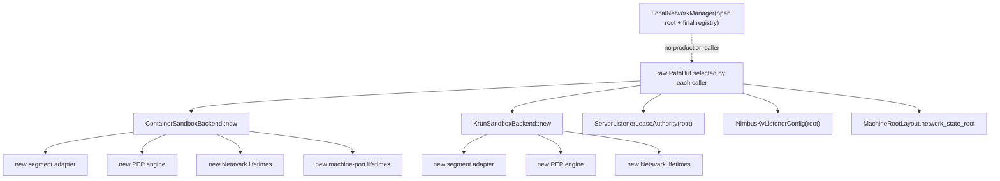
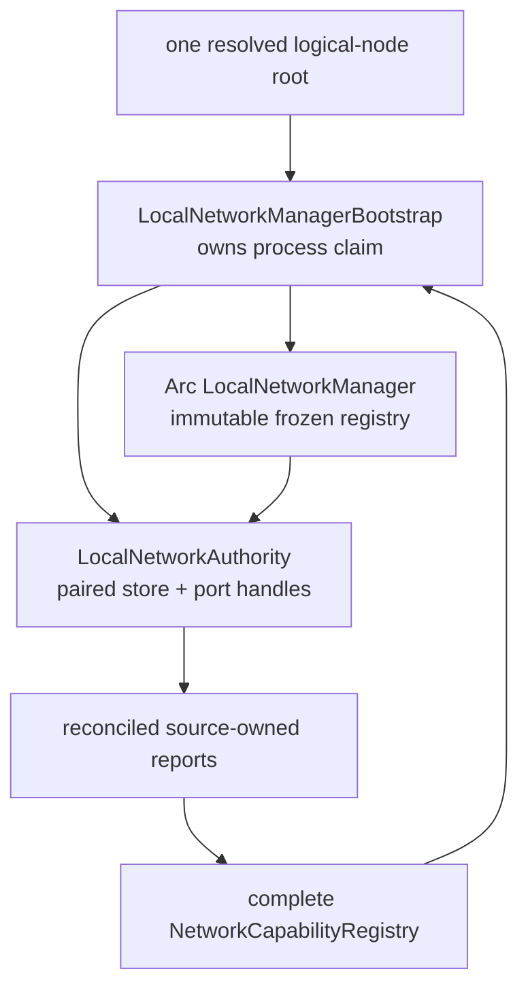

# NNC4.6b Staged Network Composition

Date: 2026-07-28

Status: `complete; sole review finding resolved in proof-only closeout`

Source commit:
`62e743e280dff1c3c2d43dc214b01a270347cd8c`

Source tree:
`88b099b0058e4e80ef4fa15799fe5a599ac558b6`

Owner worktree:
`/Users/jack/src/github.com/nimbus/nimbus-network-architecture-audit`

## Unit Of Value

NNC4.6b makes the existing `LocalNetworkManager` constructible in the only
truthful production order:

```text
resolve one logical-node root
  -> claim it through LocalNetworkManagerBootstrap
  -> derive one paired LocalNetworkAuthority
  -> construct/reconcile source owners with that authority
  -> obtain exact source-owned capability reports
  -> construct the complete admitted registry
  -> consume bootstrap and freeze one LocalNetworkManager
```

The process claim must exist before any dependent adapter can touch portable
network state. The final registry cannot exist until source owners report
their actual supported composition. A staged, consuming construction is
therefore required; a mutable registry or speculative pre-reconciliation
report would weaken the existing NNC4.3 contract.

NNC4.6b stops at the portable manager/authority seam. NNC4.6c gives container
and krun one sandbox-owned process composition. NNC4.6d consumes both seams
for start/dev/Compose/server, while the prospectively split NNC4.6g gives
standalone KV the same typed authority. NNC4.6e owns the separately testable
parent-host versus guest-node machine composition. NNC4.6f closes the
mechanical census.

## Why The Original Item Was Split

The original NNC4.6b sentence named five independently reviewable seams:

1. staged manager construction and immutable registry freeze;
2. sandbox process-local lifecycle sharing;
3. CLI/start/dev/Compose/server production wiring plus independent standalone
   KV parity; and
4. parent-host versus guest-machine authority; and
5. mechanical constructor/root/handle closure.

The read-only audit found material defects in each seam. Reviewing them as one
diff would make the canonical item too large to reason about as one unit of
value. The split is therefore prospective—before implementation or structured
review:

| Item | Acceptance-bearing unit |
| --- | --- |
| NNC4.6b | Staged manager claim, paired authority, and consuming immutable freeze. |
| NNC4.6c | Sandbox-owned OCI process composition and injected container/krun lifecycle sharing. |
| NNC4.6d | CLI/start/dev/Compose/server root and handle wiring plus the real local attachment/ingress registry. |
| NNC4.6g | Standalone KV typed-root and retained-authority parity with an honestly empty registry. |
| NNC4.6e | Host-machine and guest-machine managers, provenance, and independently fenced publication realms. |
| NNC4.6f | Machine-readable constructor/root/handle census and verifier closure. |

Each item gets its own exact fail-before packet, acceptance matrix, one
candidate-frozen structured review, and commit. Review chunks never become
ad hoc work items.

## Read-Only Audit Method

Three bounded audits inspected non-overlapping owners:

| Lane | Scope | Result |
| --- | --- | --- |
| Manager/sandbox | `LocalNetworkManager`, capability registry, container/krun constructors, allocator/IPAM/port/PEP/lifetime seams, runner reconstruction | Found the construction cycle, zero production callers, repeated raw reconstruction, and independently minted process-local lifecycle maps. |
| CLI/server/KV | start/dev/Compose roots, server listener authority, prebound handoff, standalone KV | Found three divergent root policies, silent server authority replacement, and zero production manager/registry construction. |
| Machine/guest | host lifecycle roots and SSH authority, guest Machine API, container runner, gvproxy forwarding | Found repeated raw opens, serialized path authority, machine-delete root mismatch, and a missing parent-host publication lease. |

All three audits reported no changed paths. Owner inspection followed the
manager, capability, sandbox constructor, start/Compose, server listener, KV,
machine root, machine port, guest API, and forwarding call graphs. The
worktree was clean before this proof was written.

Audit-only positive controls, not NNC4.6b completion evidence:

- `nimbus-machine` root tests: `6 passed; 0 failed`;
- machine provider-networking tests: `5 passed; 0 failed`;
- WSL2 pre-listener rejection: `1 passed; 0 failed`;
- machine SSH claim/activation ordering: `1 passed; 0 failed`; and
- guest node-workload/runner handoff: `1 passed; 0 failed`.

## Current Versus Target Composition

### Current



Path equality sometimes causes durable primitives to rendezvous, but there is
no production process composition. Process-local PEP and provider-lifetime
maps remain independent.

### NNC4.6b target



The bootstrap and every authority clone share one private claim token. There
is no interval in which a live derived authority exists but a second process
composition can open. NNC4.6b deliberately does not define how any upper
source owner uses the authority; the next items consume the concrete handle
without adding a callback or reverse dependency.

## Source-Proven Construction Cycle

The current `LocalNetworkManager::open(root, registry)` requires the final
registry up front:

- `crates/nimbus-network/src/manager.rs`.

Truthful sandbox registration is available only after backend construction
has cached startup-reconciliation outcome:

- `crates/nimbus-sandbox/src/backends/container/runtime.rs`;
- `crates/nimbus-sandbox/src/backends/krun/vm.rs`; and
- `crates/nimbus-sandbox/src/backends/capabilities.rs`.

Reconciliation needs the portable store/port authority selected by the
manager. This creates the real cycle:

```text
manager needs final immutable registry
  -> registry needs actual source-owned registration
    -> registration needs reconciled backend
      -> reconciliation needs manager-derived authority
```

NNC4.3 explicitly rejects failed startup reconciliation as a selectable local
attachment composition. It also says capability registration is not a
provider effect or a substitute for runtime readiness. The correct resolution
is staged construction, not moving reconciliation into the registry and not
advertising a configuration-only provider as actual.

## Frozen API Semantics

Exact Rust spelling may adjust to existing naming conventions, but these
semantics are frozen:

```rust
pub struct LocalNetworkManagerBootstrap { /* private shared claim */ }
pub struct LocalNetworkAuthority { /* private shared claim + paired handles */ }

impl LocalNetworkManager {
    pub fn bootstrap(
        root: impl AsRef<Path>,
    ) -> Result<LocalNetworkManagerBootstrap, LocalNetworkManagerError>;

    pub fn authority(&self) -> LocalNetworkAuthority;
}

impl LocalNetworkManagerBootstrap {
    pub fn authority(&self) -> LocalNetworkAuthority;

    pub fn freeze(
        self,
        registry: NetworkCapabilityRegistry,
    ) -> Arc<LocalNetworkManager>;
}

impl LocalNetworkAuthority {
    pub fn state_root(&self) -> &Path;
    pub fn authority_path(&self) -> &Path;
    pub fn state_store(&self) -> LocalNetworkStateStore;
    pub fn port_leases(&self) -> LocalPortLeaseAuthority;

    pub fn authenticate_state_root(
        &self,
        attempted: impl AsRef<Path>,
    ) -> Result<(), LocalNetworkAuthorityMismatch>;
}
```

Required properties:

- only manager/bootstrap can construct the paired authority;
- `LocalNetworkManager::open(root, registry)` remains the concise direct path
  and delegates to `bootstrap(root)?.freeze(registry)`;
- freeze consumes the only bootstrap value and has no setter or second call;
- derived authority clones retain the process claim after bootstrap or manager
  drop;
- the last bootstrap/manager/authority drop releases only the in-process
  composition claim, never durable state;
- a registry-construction failure releases the claim only when no authority
  clone escaped;
- root authentication recognizes canonical, lexical, and existing symlink
  aliases without creating or mutating an attempted divergent root;
- raw store/port primitives remain legal for direct adapters, recovery,
  tests, and admitted separate-process reconstruction; and
- registry data remains process-local immutable composition evidence, not a
  persisted node authority that every process must byte-match.

The authority may internally expose `LocalPortLeaseAuthority` derived from the
already opened store. A public, narrowly named
`LocalPortLeaseAuthority::from_state_store` is acceptable if needed; no second
authority abstraction or store is introduced.

## Deferred NNC4.6c Sandbox-Owned Process Composition

The audit freezes the next item's target sandbox seam:

```rust
pub struct OciNetworkProcess { /* private fields */ }

impl OciNetworkProcess {
    pub fn new(
        authority: LocalNetworkAuthority,
        node_supernet: Cidr,
        tenant_prefix: u8,
    ) -> Result<Arc<Self>, OciNetworkProcessError>;
}
```

It owns exactly:

- the manager-derived paired authority;
- the node super-net and tenant-prefix configuration;
- one configured segment adapter over the paired store;
- one shared `EgressEngine` process lifecycle;
- one shared `NetavarkPortLifetimeRegistry`; and
- one shared container machine-port lifetime registry.

Container and krun gain explicit injected constructors. They must authenticate
their configured `network_state_root`, node super-net, and tenant prefix
against the process composition before startup reconciliation, workload
artifact creation, portable state mutation, provider inspection, cleanup, or
socket/provider work. They never silently overwrite a divergent config.

Direct constructors remain deterministic lower-level adapters. They may build
a private process object for explicit embedding/tests until NNC4.6f classifies
every caller. The systemd runner is a separate OS process and reconstructs the
exact authenticated manifest root; it is not a second in-process manager.

`OciNetworkLayout` remains persisted evidence containing exact workload and
network roots. It is not changed into a runtime handle or manager.

## Current Constructor And Authority Census

### Manager and sandbox

| Current site | Current behavior | Target item/class |
| --- | --- | --- |
| `nimbus-network/src/manager.rs` | Opens final manager only when registry already exists. | NNC4.6b: staged bootstrap plus consuming freeze. |
| `container/runtime.rs` | Creates segment, PEP, Netavark, and machine-port process state per backend. | NNC4.6c: inject one `Arc<OciNetworkProcess>`. |
| `krun/vm.rs` | Independently creates segment, PEP, and Netavark process state. | NNC4.6c: inject the same process object. |
| `oci/network/segment.rs` | Stores a path and opens a store for each operation. | NNC4.6c: process adapter holds a manager-derived store handle. |
| `oci/network/segment/cleanup.rs` | Reconstructs the store from a path. | NNC4.6c: use injected process/store context. |
| `oci/network/ipam.rs` | Reopens by persisted layout path. | NNC4.6c: authenticate layout, then use injected store. |
| `oci/port_lifecycle.rs` | Stores/reopens port authority by path. | NNC4.6c: hold manager-derived port handle. |
| `oci/port_lease.rs` | Lower helper reopens the authority again. | NNC4.6c: accept the injected handle. |
| `container/runtime/provider_context.rs` | Reconstructs a coordinator from config paths. | NNC4.6c/f: in-process path uses process handle; runner remains classified reconstruction. |
| `krun/vm/start.rs` | Reconstructs a coordinator from config paths. | NNC4.6c: in-process path uses process handle. |
| `oci/egress.rs` | Builds a process engine per backend and retains a network root. | NNC4.6c: shared engine plus per-backend artifact roots and injected port handle. |
| `container/runtime/runner.rs` | Separate child authenticates both roots and reconstructs backend. | NNC4.6f: admitted same-node cross-process reconstruction. |

### Deferred production wiring: NNC4.6d and NNC4.6g

| Current site | Defect or gap | Target item |
| --- | --- | --- |
| `nimbus-cli/src/start/config.rs` | Root precedence exists as untyped path policy. | NNC4.6d: one CLI-owned typed logical-node-root resolver. |
| `nimbus-cli/src/start/boot.rs` | Server root is node control root; local Compose backend derives project root. | NNC4.6d: one prepared start composition retains manager, backend/process, registry, and listener handle. |
| `nimbus-cli/src/dev/wire.rs` | Prebind opens raw authority before start owns a manager. | NNC4.6d: stage one prepared composition before any prebind. |
| `nimbus-cli/src/dev/plan.rs` | Runtime listener bundle is hidden inside parsed command state. | NNC4.6d: parsed config stays data; runtime ownership moves to prepared composition. |
| `nimbus-cli/src/compose/project.rs` | Krun workload and network roots are both project-local. | NNC4.6d: project artifacts stay local; exact manager root is injected as network root. |
| `nimbus-cli/src/compose/execution.rs` | Reconstructs backend repeatedly, including inspection commands. | NNC4.6d: one prepared backend/process per command. |
| `nimbus-server/src/construction.rs` | Engine data root can be replaced by a prebound bundle. | NNC4.6d: manager-derived opaque server authority; divergence is typed failure. |
| `nimbus-server/src/listener_lease.rs` | Stores a root and reopens primitive authority for main/siblings. | NNC4.6d: store and clone the manager-derived authority. |
| `nimbus-cli/src/kv.rs` | Root precedence omits start's data/config fallbacks. | NNC4.6g: shared typed root policy and one empty fail-closed manager. |
| `nimbus-kv/src/listener.rs` | Config stores a path and reopens authority. | NNC4.6g: config and live listener retain manager-derived authority. |

NNC4.6d must prove:

- one pointer-identical manager across start, dev prebind, local Compose, and
  server listeners;
- different project workload roots but one node network root;
- exact-port conflict before bind between two projects and across sandbox/server;
- no silent prebound authority replacement;
- root policy parity under explicit control root, environment, config data,
  and default data cases;
- one actual reconciled krun/server bundle for local start;
- empty complete-bundle registries for processes with no attachment/ingress
  pair; and
- no fabricated partial provider.

NNC4.6g must independently prove typed-root parity, retained KV authority,
alias-retarget pinning, divergent-root fail-before, server/KV durable conflict
before KV bind, an honestly empty KV-only registry, and post-bind listening
observability. It is a separate canonical value/review/commit unit, not a
review chunk of NNC4.6d.

### Deferred machine/guest wiring: NNC4.6e

| Current site | Defect or gap | NNC4.6e target |
| --- | --- | --- |
| `nimbus-machine/src/roots.rs` | Artifact constructors can implicitly select network authority. | Artifact roots and canonical manager provenance are separate concepts. |
| `nimbus-cli/src/machine/handlers.rs` | Direct commands repeatedly resolve roots. | One outer host composition per process. |
| `nimbus-cli/src/machine/server_control.rs` | Embedded lifecycle resolves machine roots then overwrites network path. | Inject the existing start manager and retain it. |
| `machine/manager/ports.rs` | Launch, withdraw, and release reopen raw authority from roots. | Pass manager-derived port handle through the lifecycle. |
| `machine/handlers.rs` delete path | Releases using caller roots while artifacts come from persisted config. | Authenticate manager provenance before lease or artifact mutation. |
| `machine/api.rs` | Creates control directory and binds before manager; container network root equals workload root. | Open guest manager first; guest control root is network root and artifacts stay nested. |
| `container/runtime/runner.rs` | Separate guest runner reconstructs serialized roots. | Admitted same-guest-node reconstruction. |
| `oci/network/proxy.rs` | Guest wildcard proxy binds in guest host namespace. | Guest manager owns this `Host` bind. |
| `oci/network/forwarding.rs` | `/expose` makes gvproxy bind on parent host. | Parent manager owns a separate publication lease. |
| `machine/backend.rs` | Sends Machine API start before parent publication authority exists. | Parent reserve/claim batch precedes API I/O. |
| `machine/api.rs` forwarder identity | Guest derives gvproxy identity from guest node/boot ID. | Parent launcher issues/persists handle and generation; guest authenticates it. |
| `nimbus-machine/src/networking.rs` | Source-owned krunkit/vfkit/WSL2 facts are already separate. | Remain separate from attachment/ingress registry; WSL2 stays unavailable. |

Both publication realms are `PortBindRealm::Host` relative to their own OS
node:

```text
guest manager/root
  -> guest wildcard proxy lease + bind

parent manager/root
  -> gvproxy external publication lease + provider effect
```

The same numeric port can be valid in both roots. A second parent claimant
must conflict before Machine API or gvproxy I/O. Timeout, EOF, refusal, or an
untyped response retains the parent fence. Teardown order is:

```text
parent withdraw
  -> guest stop/unexpose
    -> exact parent-provider absence
      -> parent release
```

This closes NNCF24 without moving gvproxy effects out of machine/sandbox.

## Explicit Non-Goals

NNC4.6b does not:

- construct or inject `OciNetworkProcess`;
- wire CLI/start/dev/Compose/server or standalone KV production paths;
- change machine or guest behavior;
- add a third machine role to `NetworkCapabilityRegistry`;
- make WSL2 look like host-managed Netavark/gvproxy;
- inject the manager into `ComputeState` before NNC6.1;
- persist the process capability registry as node authority;
- remove all independently openable store/port primitives;
- implement cluster transport, membership, routing, mesh, or overlays;
- move Netavark, nft, namespace, gvproxy, socket, proxy, policy, TLS,
  service-name, or provider effects into `nimbus-network`;
- use a path, IP address, port, PID, bridge, or provider address as workload
  identity; or
- add compatibility aliases, legacy readers, fallbacks, or feature flags.

## Frozen NNC4.6b Acceptance

| ID | Verifiable success criterion |
| --- | --- |
| B1 | `LocalNetworkManager::bootstrap` claims one canonical process root before dependent construction and exposes a network-owned paired authority. A second same, lexical-alias, symlink-alias, or divergent bootstrap fails with the existing typed duplicate guidance before attempted-root mutation. |
| B2 | Bootstrap, frozen manager, and every `LocalNetworkAuthority` clone share one private claim token. Dropping any non-final owner cannot admit another manager; final drop permits deterministic reopen without changing durable state. |
| B3 | `freeze` consumes the bootstrap exactly once and installs the supplied immutable registry. There is no setter, replacement, hidden lookup, partial-role insertion, callback, or second freeze path. |
| B4 | Failed registry/source assembly leaves no stale claim when no authority escaped. If an authority clone did escape, it deliberately fences a second composition until its final drop. |
| B5 | `authenticate_state_root` is non-mutating and alias-aware. Same, lexical-alias, and existing symlink-alias paths succeed; a divergent path returns typed active/attempted authority evidence before attempted-root creation. It never treats a path as workload identity. |
| B6 | `LocalNetworkManager::open(root, registry)` delegates to the staged path and preserves completed M1-M12 behavior. Raw `LocalNetworkStateStore` and `LocalPortLeaseAuthority` remain legal primitives for transaction, recovery, tests, and admitted cross-process reconstruction. |
| B7 | `nimbus-network -> nimbus-core` remains the only network workspace edge. No socket, provider effect, upper-crate type, async callback, policy, naming, forwarding, cluster, cloud SDK, sandbox process, or machine capability enters `nimbus-network`. |
| B8 | Exact happy/edge/error/concurrency/root-substitution tests, the full network suite and manager-backed process proofs, affected all-target check, strict Clippy, warning-denied rustdoc, dependency/effect scans, live verifier and self-test, format/diff, docs, and site gates pass with exact counts. After B1-B7 and those pre-review gates are green, exactly one item-level Sol/xhigh/fast structured review runs and every finding is dispositioned. |

## Exact Fail-Before Packet

Tests are added before production implementation. A zero-test run is not
evidence. Expected-red output must name only the missing staged-manager,
derived-authority, and typed root-authentication contracts.

### Manager staged claim

Add to `crates/nimbus-network/tests/local_network_manager.rs`:

`manager_bootstrap_freezes_once_and_authority_retains_process_claim`

Assertions cover B1-B6:

- derived state/port handles share the same authority path;
- second same/alias/divergent bootstrap fails before mutation;
- the supplied registry is exact and cannot be replaced;
- manager drop with authority retained remains fenced;
- final drop permits reopen with durable lease intact;
- failed registry assembly without an escaped authority releases the claim;
- failed assembly with a retained authority stays fenced; and
- concurrent bootstrap has one winner without sleep coordination.

Fail-before:

```text
timeout 600 cargo test -p nimbus-network \
  --test local_network_manager \
  manager_bootstrap_freezes_once_and_authority_retains_process_claim \
  --no-run
```

The future NNC4.6c fail-before names and assertions are already recorded in
the deferred sandbox section, but those tests do not enter the NNC4.6b diff.

Fail-before evidence:

- command exited `101`;
- compilation emitted 14 errors;
- the only unresolved imports were `LocalNetworkAuthority` and
  `LocalNetworkManagerBootstrap`;
- every remaining error was the missing `LocalNetworkManager::bootstrap`
  associated function; and
- no existing test, production source, dependency, or provider-effect error
  appeared.

## Implementation Evidence

The private process slot now holds a weak reference to one
`LocalNetworkComposition`. Bootstrap, manager, and authority handles retain
that composition through the same `Arc`; raw store and port primitives remain
independently openable. `freeze` consumes the only bootstrap value and moves
the supplied validated registry into the immutable manager. Direct `open`
delegates to exactly that path.

The first focused run exposed a real root-normalization defect on macOS:
`tempdir()` supplied `/var/...`, while canonical diagnostics used
`/private/var/...`. That made the paired store and manager render
filesystem-equivalent but textually divergent authority paths. Bootstrap now
reopens the initialized store through its canonical root when the supplied
diagnostic path is an alias. The second run proved exact pairing and all
same/lexical/symlink/divergent cases.

Green evidence before candidate freeze:

| Proof | Executed | Failed | Ignored | Result |
| --- | ---: | ---: | ---: | --- |
| Focused manager integration | 2 | 0 | 0 | Pass |
| Real-process port authority | 6 | 0 | 2 | Pass |
| Real-process state store | 2 | 0 | 1 | Pass |
| Full `nimbus-network --all-features` | 200 | 0 | 0 | Pass |
| Affected all-target check | n/a | 0 | n/a | Pass |
| Affected strict Clippy | n/a | 0 | n/a | Pass |
| Warning-denied network rustdoc | n/a | 0 | n/a | Pass |
| Exact workspace dependency edge | 1 (`nimbus-core`) | 0 | 0 | Pass |
| Live static verifier | 15 | 0 | 0 | Pass |
| Static verifier self-test | 45 | 0 | 0 | Pass |
| Format and staged/unstaged diff checks | 3 | 0 | 0 | Pass |
| Docs link/source/fence gate | 108 pages | 0 | 0 | Pass |
| Nimbus docs-site contract | 17 | 0 | 0 | Pass |

The affected check and Clippy commands emitted only the unchanged vendored
`third_party/brotli*` warnings already owned outside this item; owner code
passes `-D warnings`, and no warning was suppressed.

The candidate-frozen executable SHA-256 is
`e15324d8c6ed4f5eef0f5e89b9b9af4b0a28e8d109e4dd1ff7c52782092ba07d`,
computed over the staged diff for `nimbus-network` manager façade/export/test.
Documentation-only routing, plan, and proof edits are outside this digest.

## Implementation Bands

| Band | Work | Completion condition |
| --- | --- | --- |
| B0 | Land and run the exact fail-before packet. | Red output is solely the missing frozen seams; proof records exact exit/test counts. |
| B1 | Refactor the manager claim into a private shared token; add bootstrap, paired authority, typed root authentication, and consuming freeze. | B1-B5 are green; the test proves final-drop and failed-assembly ownership. |
| B2 | Make `open` delegate to the staged path, retain raw recovery/process primitives, and perform only concept-owned modularity cleanup required by the touched network files. | B6-B7 and completed M1-M12 are green; no new effect or dependency enters the crate. |
| B3 | Run complete acceptance/gates, freeze the exact diff/digest, run the one item-level structured review, disposition findings, update the ledger, and commit the exact item. | B1-B8 are green; no accepted finding is unresolved; one item commit exists. |

No later band starts before the prior behavioral gate is green. No structured
review runs on B0-B2 partial work.

## Failure, Rollback, And Reconciliation

| Failure | Required behavior | Proof |
| --- | --- | --- |
| Root/store open fails during bootstrap | No process claim escapes; later valid bootstrap succeeds. | Manager failure/reopen case. |
| Second same/alias/divergent bootstrap | Typed duplicate result before attempted-root creation or mutation. | Direct, lexical, symlink, divergent matrix. |
| Source registration/registry construction fails | Drop releases claim only if no authority escaped; no partial manager/registry is observable. | Failed-assembly cases. |
| Authority clone survives failed assembly | Clone deliberately retains claim and portable handles; second manager fails until final drop. | Escaped-authority case. |
| Root authentication receives a divergent missing path | Typed active/attempted authority evidence is returned without creating the attempted root. | Non-mutating divergent-authentication case. |
| `open` fails before a manager is frozen | The private claim has no surviving owner and a later valid bootstrap succeeds. | Existing M7 plus staged failure/reopen cases. |
| Process exits after durable reservation | Existing cross-process store and restart semantics remain authoritative; reopening the manager preserves the durable lease. | Existing M6/M11/M12 plus staged reopen case. |

NNC4.6c-f retain the already audited backend-topology mismatch, startup
reconciliation failure, shared lifecycle conflict, provider-bind race, runner
reconstruction, CLI root divergence, and parent/guest publication failure
matrices. They are not completion evidence or executable changes for this
item.

Rollback is ordinary code rollback before deployment because Nimbus is
pre-launch. Durable network state is not deleted or rewritten to an older
schema by rollback logic. There is no compatibility reader or dual authority.
Ambiguous provider effects remain fenced and reconciled by their current
effect owners.

## Modularity And Complexity Disposition

Source-derived sizes at audit:

| File | Lines | Disposition |
| --- | ---: | --- |
| `nimbus-network/src/manager.rs` | 184 | Keep the façade readable; move shared claim/root authentication to `manager/authority.rs` if needed. |
| `nimbus-network/src/capability_registry.rs` | 827 | Cohesive; add no staging or provider logic here. |
| `nimbus-network/src/state_store.rs` | 1,957 | No manager/bootstrap switchboard additions. |
| `nimbus-network/src/port_lease.rs` | 1,810 | Only the smallest derived-handle visibility/name change. |

These are the only production modules NNC4.6b may touch. Prefer
`nimbus-network/src/manager/authority.rs` if the staged state machine would
make the façade exceed a coherent single ownership story. Do not split
mechanically.

Deferred NNC4.6c source-derived sizes and constraints:

| File | Lines | Disposition |
| --- | ---: | --- |
| `sandbox/backends/capabilities.rs` | 346 | Retain source facts and refusal behavior here. |
| `container/runtime.rs` | 1,594 | Review band; only narrow constructor/field routing. |
| `container/runtime/planning.rs` | 1,658 | No new composition proof group. |
| `container/runtime/runner.rs` | 1,983 | Put any admitted-reconstruction logic in `runner/network_authority.rs`. |
| `container/runtime/lifecycle.rs` | 2,078 | Mandatory decomposition before adding another test group; do not put NNC4.6c tests here. |
| `krun/vm/lifecycle.rs` | 1,879 | No composition switchboard additions. |
| `krun/vm/tests.rs` | 1,992 | New proof belongs in a child or integration test. |
| `oci/network/ipam.rs` | 1,886 | Narrow handle/context substitution only. |
| `oci/port_lifecycle.rs` | 1,996 | Extract authority/configuration into a concept child before adding state. |
| `oci/port_lease.rs` | 1,509 | Keep transition helpers focused. |

Preferred new concept owners:

- `nimbus-network/src/manager/authority.rs`;
- `nimbus-sandbox/src/backends/oci/network/process.rs`;
- `nimbus-sandbox/src/backends/oci/port_lifecycle/authority.rs`;
- `nimbus-sandbox/src/backends/container/runtime/runner/network_authority.rs`;
- `crates/nimbus-sandbox/tests/production_network_composition.rs`.

NNC4.6d reserves:

- `nimbus-cli/src/start/network_composition.rs`;
- a server listener-authority child plus moved intact listener tests; and
- CLI dev resolved-intent versus prepared-listener separation.

NNC4.6g reserves:

- `nimbus-cli/src/kv.rs`;
- `nimbus-kv/src/listener.rs` and its concept-owned composition tests; and
- standalone KV root-policy parity and post-bind observability.

NNC4.6e reserves:

- `nimbus-cli/src/machine/network_composition.rs`;
- `nimbus-cli/src/machine/publication_authority.rs`; and
- `nimbus-cli/src/machine/api/network_composition.rs`.

## Verification And Proof Matrix

Focused implementation commands:

```text
timeout 600 cargo test -p nimbus-network \
  --test local_network_manager -- --nocapture --test-threads=1

timeout 900 cargo test -p nimbus-testing \
  --test network_port_lease -- --nocapture --test-threads=1

timeout 900 cargo test -p nimbus-testing \
  --test network_state_store -- --nocapture --test-threads=1
```

Affected full suites:

```text
timeout 900 cargo test -p nimbus-network \
  --all-features -- --test-threads=1
```

Quality and boundary gates:

```text
timeout 1800 cargo check \
  -p nimbus-network -p nimbus-testing \
  --all-targets --all-features

timeout 1800 cargo clippy \
  -p nimbus-network -p nimbus-testing \
  --all-targets --all-features --no-deps -- -D warnings

RUSTDOCFLAGS='-D warnings' timeout 900 cargo doc \
  -p nimbus-network \
  --no-deps --all-features

cargo metadata --format-version 1 --no-deps
timeout 900 bash scripts/verify-nimbus-network-control-plane.sh
timeout 900 bash scripts/verify-nimbus-network-control-plane.sh --self-test
cargo fmt --all --check
git diff --check
bash scripts/check-docs.sh
bash scripts/verify-nimbus-docs-site.sh
```

Record exact executed/failed/ignored/skipped counts. The local host is macOS;
Linux Execute/provider cases must be named as target-gated rather than
misreported as locally passing. Known unchanged vendored warnings are
classified by exact owner; no warning is suppressed.

## Seam Checklist

NNC4.6b cannot close unless every answer is `yes`:

1. Is one process claim held before any dependent composition work?
2. Does every derived authority clone retain that exact claim?
3. Is freeze consuming, one-shot, complete-only, and immutable?
4. Can failed assembly expose neither a partial registry nor a stale
   unowned claim?
5. Is root authentication alias-aware, non-mutating, typed, and diagnostic?
6. Does direct `open` delegate to the exact staged state machine?
7. Do completed M1-M12 and raw primitive recovery/process use remain intact?
8. Is the registry installed only by consuming freeze and never mutable?
9. Does `nimbus-network` still have only the `nimbus-core` workspace edge
   and zero provider effects?
10. Are NNC4.6c-f executable paths untouched?
11. Do modularity thresholds and concept ownership pass?
12. Are B1-B8 and every named quality/static/docs gate green with exact
    evidence?
13. Did exactly one full item review run only after the candidate froze?

## Review Cadence

During fail-before, implementation, cleanup, and acceptance convergence, use
focused tests, affected full suites, static gates, and owner inspection. Do
not run structured autoreview on a partial diff.

After B1-B7 and every pre-review portion of B8 is green on one
candidate-frozen item diff, run exactly one structured review with:

```text
engine: Codex
model: gpt-5.6-sol
reasoning: xhigh
service tier: fast
scope: canonical NNC4.6b and B1-B8 only
```

If that review finds an accepted defect that materially changes executable
code, rerun affected proofs and exactly one narrow correction review focused
on that defect. No rerun occurs for proof/ledger wording, formatting, elapsed
time, or non-material cleanup.

## Structured Review Disposition

Exactly one full structured review ran over the complete 88,067-byte local
bundle:

```text
engine: Codex
model: gpt-5.6-sol
reasoning: xhigh
service tier: fast
passes: 1
```

The helper invocation header is the configuration evidence; the isolated
review session correctly noted that model slug and service tier are not
self-introspectable from inside its API response.

The review reported one P2 finding at confidence 0.99: the recovery header
said “B1-B8 are green before review,” even though B8 includes the review, and
this proof retained the stale `fail-before next` status. The finding is
accepted. This closeout now distinguishes B1-B7 plus the pre-review portion of
B8 from the review-bearing completed B8 state, and the proof status is
current. The review reported no executable defect. The correction changes
only plan/proof wording, leaves executable digest
`e15324d8c6ed4f5eef0f5e89b9b9af4b0a28e8d109e4dd1ff7c52782092ba07d`
unchanged, and therefore does not trigger a correction review.

## Current Checkpoint

| Field | Value |
| --- | --- |
| Owned paths | This proof, canonical plan/routing, and `nimbus-network` manager/derived-authority module/export/test plus only the smallest existing derived-port-handle hook if required. |
| Source edits | Manager shared claim, staged bootstrap, paired authority, typed root authentication, consuming freeze, direct-open delegation, public exports, and exact acceptance test are implemented; no NNC4.6c-f executable path changed. |
| Last green | Manager 2/0/0; real-process port 6/0/2; real-process store 2/0/1; full network 200/0/0; affected check/strict Clippy/rustdoc; core-only edge; verifier 15/15 plus self-test 45/45; format/diff; docs 108; site 17/17. |
| Next | Commit the exact six-path item, then begin the standalone NNC4.6c sandbox-process acceptance/fail-before checkpoint. |
| Blocker | None. |
