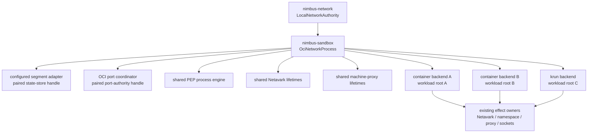

# NNC4.6c OCI Network Process Composition

Date: 2026-07-28

Status: `P0-P5 green; full and narrow correction reviews complete; exact item commit next`

Source commit:
`5166150290952ca4638cb000601f5c38f518ac6a`

Source tree:
`1946832f35ac7f7c98471ef2ff2b9a3656838fe9`

Owner worktree:
`/Users/jack/src/github.com/nimbus/nimbus-network-architecture-audit`

## Unit Of Value

NNC4.6c introduces one sandbox-owned process composition for OCI-family
networking and injects it into container and krun:

```text
LocalNetworkManagerBootstrap
  -> LocalNetworkAuthority
    -> one OciNetworkProcess
      -> configured segment adapter over the paired store
      -> port coordinator over the paired port authority
      -> one PEP engine
      -> one Netavark lifetime registry
      -> one container machine-proxy lifetime registry
        -> injected container backend(s)
        -> injected krun backend(s)
```

This is one reviewable unit because the process object is not truthful if it
shares only some process-global lifetimes while leaving parallel authorities
for the others. It does not wire CLI/start/dev/Compose/server/KV or machine
host/guest roots; NNC4.6d and NNC4.6e retain those units.

The item owns construction and lifecycle authority, not provider effects.
Netavark, nftables, namespaces, sockets, PEP forwarding, gvproxy, persisted
workload artifacts, and cleanup execution stay in their current sandbox/proxy
owners.

## Source-Proven Current State

Current container construction creates four independent authority families:

```text
ContainerSandboxBackend::new
  -> ConfiguredSegmentAllocator(path, String super-net, prefix)
  -> EgressProxyRegistry::with_roots_and_network_state
       -> new Arc<EgressEngine>
  -> NetavarkPortLifetimeRegistry::default
  -> Arc<Mutex<MachinePortProxyRegistry>>::new
```

Current krun construction separately creates three:

```text
KrunSandboxBackend::new
  -> ConfiguredSegmentAllocator(path, String super-net, prefix)
  -> EgressProxyRegistry::with_roots_and_network_state
       -> new Arc<EgressEngine>
  -> NetavarkPortLifetimeRegistry::default
```

The resulting defects are source-proven:

| Current owner/site | Defect |
| --- | --- |
| `container/runtime.rs` and `krun/vm.rs` | Each backend instance mints independent process-local state. |
| `oci/network/segment.rs` | `ConfiguredSegmentAllocator` stores a path and opens a new `SingleNodeSegmentAllocator` for operations. |
| `oci/port_lifecycle.rs` | `OciPortLeaseCoordinator` stores a path; lifecycle operations reopen `LocalPortLeaseAuthority`. |
| `container/runtime/provider_context.rs` | In-process provider context reconstructs port authority from serialized config. |
| `krun/vm/start.rs` | In-process krun coordinator reconstructs port authority from config. |
| `oci/egress.rs` | Registry construction couples a new process engine to backend-specific artifact roots. |
| `oci/port_lifecycle/netavark_lifetime.rs` | The registry is correctly `Arc`-backed, but each backend creates a different root instance. |
| `container/runtime/machine_ports.rs` | The container field owns a fresh map per backend instance. |
| `OciNetworkLayout` | Correctly persists workload and network roots as restart evidence; it is not a runtime handle. |

No production caller yet constructs `LocalNetworkManager`,
`LocalNetworkAuthority`, or a real `NetworkCapabilityRegistry`. NNC4.6d owns
that outer wiring; NNC4.6c provides the concrete, testable seam it will
consume.

## Target Ownership



`OciNetworkProcess` owns the `LocalNetworkAuthority` clone so every injected
backend-derived handle remains fenced to the one process manager. It does not
persist itself. Durable segment, IPAM, and port records remain in
`nimbus-network`; manifests/layouts remain sandbox-owned restart evidence.

## Frozen Public Seam

The target public seam is:

```rust
pub struct OciNetworkProcess { /* private fields */ }

impl OciNetworkProcess {
    pub fn new(
        authority: LocalNetworkAuthority,
        node_supernet: Cidr,
        tenant_prefix: u8,
    ) -> Result<Arc<Self>, OciNetworkProcessError>;
}

impl ContainerSandboxBackend {
    pub fn with_network_process(
        config: ContainerSandboxBackendConfig,
        process: Arc<OciNetworkProcess>,
    ) -> Result<Self, OciNetworkProcessError>;
}

impl KrunSandboxBackend {
    pub fn with_network_process(
        config: KrunSandboxBackendConfig,
        process: Arc<OciNetworkProcess>,
    ) -> Result<Self, OciNetworkProcessError>;
}
```

The exact method names may improve during implementation, but the semantics
are frozen:

1. construction is fallible and effect-free;
2. the topology boundary takes typed `Cidr`, not an unvalidated `String`;
3. `tenant_prefix` must be within the selected super-net and `0..=32`;
4. a process-global weak claim admits exactly one live
   `OciNetworkProcess`; callers clone and inject the returned `Arc`;
5. the object and all injected backends retain the manager-derived authority;
6. backend injection authenticates root, typed super-net, and tenant prefix
   before reconciliation or any other work;
7. mismatch errors retain typed active and attempted values;
8. no setter, lazy second registry, global lookup fallback, callback,
   compatibility shim, or partial construction path exists.

The process object exposes no provider-effect API. Narrow internal accessors
return cloned capability handles to the owning sandbox adapters.

## Composition State And Adapter Rules

### Segment and IPAM authority

The configured segment adapter holds the already opened
`LocalNetworkStateStore` from `LocalNetworkAuthority`. It does not reopen the
root for each call. The adapter freezes:

- the typed node super-net;
- the network lease epoch currently used by the single-node adapter; and
- the per-tenant prefix.

`OciNetworkLayout.network_state_root` is authenticated against the process
before IPAM or cleanup uses it. In-process IPAM/cleanup receives the paired
store context. Separate runner reconstruction remains path-based and is
explicitly named at its constructor.

### Port authority

The in-process `OciPortLeaseCoordinator` holds a cloned
`LocalPortLeaseAuthority`, not a root path. Lower reservation, claim,
activation, failure, withdrawal, recovery, and release helpers accept the
injected handle. Path-based reconstruction remains only for the admitted
separate runner and direct adapter entry points and is mechanically named.

Tenant quota/admission remains distinct from allocation authority. Provider
effects still bind real sockets and report exact evidence; a portable lease
never fabricates provider success.

### PEP engine and artifact roots

One process-owned PEP engine provides the single workload-keyed lifecycle
map. Each backend receives a registry facade combining that engine with its
own decision-log and trust-anchor artifact roots plus the paired port
authority. Sharing the engine must not merge or redirect backend-local files.

The egress PDP remains in `nimbus-egress`; the PEP/forwarding effect remains
in `nimbus-proxy`; the sandbox owns composition and published trust-anchor
artifacts. TLS interception CA ownership does not move.

### Netavark and machine-proxy lifetimes

Every injected container and krun backend clones the same
`NetavarkPortLifetimeRegistry`. Duplicate `(TenantId, SandboxId)` lifecycle
keys conflict across backend facades; teardown through the owning facade is
visible through the shared registry.

Every injected container backend clones the same machine-proxy registry.
Krun does not gain machine-forwarder support or fabricate that capability.
The registry's state types move only if required to put ownership under the
OCI process concept; provider start/stop/unexpose methods remain
container/sandbox owned.

## Construction Ordering

Injected construction is ordered:

```text
authenticate network root
  -> parse/compare typed super-net
    -> compare tenant prefix
      -> derive paired segment/port handles
        -> run startup reconciliation
          -> create backend-local artifact facades
            -> admit source capability report
```

Root/topology mismatch occurs before:

- workload directory creation;
- network-store revision or partition mutation;
- manifest/orphan scan;
- IPAM or segment reconciliation;
- provider inspection;
- PEP, Netavark, namespace, machine-proxy, or socket work; and
- capability registration.

Startup reconciliation failure remains a cached refusal on the constructed
backend so inspect/cleanup can converge while new work and positive capability
registration fail closed. It does not discard durable cleanup evidence or
publish a partial provider.

## Direct And Runner Classification

`ContainerSandboxBackend::new`, `KrunSandboxBackend::new`, and
`with_segment_allocator` remain explicit lower-level direct/test adapters in
this item. They do not silently call `OciNetworkProcess::new`, consult a
global object, or claim to be injected. NNC4.6d removes production outer
callers; NNC4.6f performs final mechanical classification/deletion.

The systemd/container runner is another OS process. It authenticates the exact
serialized network root and reconstructs its own process-local manager/adapter
state. The constructor name and census must say `runner` or
`reconstructed`; it is not an in-process fallback.

No compatibility alias or dual-read path is added. Nimbus is pre-launch.

## Explicit Non-Goals

NNC4.6c does not:

- wire CLI/start/dev/Compose/server/KV;
- freeze a production `NetworkCapabilityRegistry`;
- change host-machine, guest-machine, WSL2, gvproxy, or parent-publication
  behavior;
- remove direct/test or runner reconstruction before their deletion gate;
- change `OciNetworkLayout` into a runtime handle;
- persist process registries;
- move Netavark, nftables, namespaces, sockets, gvproxy, PEP forwarding,
  policy, TLS, service naming, or DNS effects into `nimbus-network`;
- add a workspace dependency to `nimbus-network`;
- add cluster membership, routing, mesh, overlay, Iroh, or transport; or
- use an IP, path, port, PID, provider address, or bridge as workload identity.

## Frozen Acceptance Criteria

| ID | Verifiable success criterion |
| --- | --- |
| C1 | `OciNetworkProcess::new` is effect-free, validates typed topology, retains one `LocalNetworkAuthority`, and returns one `Arc` composition. Invalid prefix/super-net relationships fail with typed evidence before any new durable or artifact path. |
| C2 | Exactly one live OCI process composition is admitted. The lower `LocalNetworkManager` owns the sole process authority claim and rejects a second same/alias/divergent authority handle; the OCI process authenticates canonical configured-root aliases and rejects divergent configured roots with typed active/attempted evidence before effects. Same-authority/topology duplicates are typed, concurrent construction has one winner, and final drop permits deterministic reopen without changing durable state. |
| C3 | Container and krun injected constructors authenticate configured network root, typed super-net, and tenant prefix before reconciliation, artifact creation, durable mutation, provider inspection, cleanup, or capability reporting. The container/krun mismatch matrix is table-driven over all three dimensions. |
| C4 | The configured segment adapter uses the manager-derived store handle and freezes typed topology. Two injected backends observe one segment state/revision; no in-process segment operation reopens authority by path. |
| C5 | In-process IPAM, segment cleanup, and port lifecycle use process-derived store/port handles after authenticating persisted layout evidence. Every retained path-based entry is named and limited to direct/test, separate-runner, or the existing future-cluster lease/cleanup reconstruction boundary. |
| C6 | One process-owned PEP engine is shared across container and krun while decision-log/trust-anchor artifacts remain under their distinct workload roots. A real duplicate workload lifecycle conflicts across facades and teardown/retry is visible across them. |
| C7 | One Netavark lifetime registry is shared across container and krun. A real retained lifetime inserted through one backend conflicts through the other and exact take/cleanup becomes visible to both. |
| C8 | One machine-proxy lifetime registry is shared by every injected container backend. Duplicate start/cleanup state conflicts across facades; krun remains incapable of machine forwarding. |
| C9 | Distinct container/krun workload roots remain artifact-only. Portable segment/IPAM/port state appears only under the exact node authority; no network authority file or portable partition is created beneath a workload root. |
| C10 | Distinct port requests through different injected facades are visible through the manager authority; an overlapping exact host port conflicts before provider bind or other effect. Quota policy remains caller admission, not allocation ownership. |
| C11 | Startup reconciliation failure is cached and refuses new work plus positive source registration without losing cleanup evidence. PlanOnly, unsupported target, and machine-forwarder compositions retain their existing truthful refusal semantics. |
| C12 | Direct/test constructors and the separate runner reconstruction remain explicit and mechanically distinguishable; neither silently consults or creates the injected process composition. `OciNetworkLayout` stays serialized evidence. |
| C13 | `nimbus-network -> nimbus-core` remains the only network workspace edge. No provider effect or upper type enters `nimbus-network`; PDP/PEP, TLS, naming, machine, system projection, and cluster boundaries remain unchanged. |
| C14 | Exact happy/edge/error/concurrency/root-substitution/lifecycle tests, full affected suites, all-target check, strict Clippy, warning-denied rustdoc, dependency/effect/path-constructor scans, live verifier and unchanged self-test, format/diff, docs, and site gates pass with exact counts. After C1-C13 and the pre-review portion of C14 are green, exactly one full Sol/xhigh/fast item review runs and every finding is dispositioned. |

## Exact Fail-Before Packet

Tests land before production implementation. A zero-test run is not evidence.
Expected-red output must name only missing process/injected-constructor/handle
contracts.

Add `crates/nimbus-sandbox/tests/production_network_composition.rs`:

- `injected_backends_reject_divergent_authority_before_effects`;
- `distinct_workload_roots_share_only_portable_node_authority`;
- `same_host_port_conflicts_before_provider_effect`; and
- `startup_failure_never_becomes_registered_capability`.

The mismatch test covers container and krun crossed with root, super-net, and
prefix substitution. It snapshots both roots, authority bytes/revision, and
effect counters before/after. The port test uses real lease transitions and a
provider-effect probe that must remain zero.

Add the concept-owned unit contract under
`backends/oci/network/process/tests.rs`:

- `one_oci_process_composition_has_exactly_one_concurrent_winner`;
- `container_and_krun_share_real_pep_lifecycle_authority`;
- `container_and_krun_share_real_netavark_lifetime_authority`; and
- `container_backends_share_real_machine_proxy_lifetime_authority`.

These tests use existing lifecycle transitions and retained guards. Pointer
equality or a parallel test-only registry is not success evidence.

Fail-before commands:

```text
timeout 900 cargo test -p nimbus-sandbox \
  --test production_network_composition --no-run

timeout 900 cargo test -p nimbus-sandbox \
  oci_network_process_contract --no-run
```

## Failure, Rollback, And Reconciliation

| Failure | Required behavior | Proof |
| --- | --- | --- |
| Authority/store open already failed upstream | No OCI process object exists; no sandbox artifact/effect occurs. | Manager failure proof plus process constructor boundary. |
| Duplicate same/alias/divergent OCI process | Typed active/attempted authority and topology; no second lifecycle registry. | Direct/alias/divergent/concurrent matrix. |
| Invalid tenant prefix for selected super-net | Typed validation failure before registry/store construction or mutation. | Prefix edge/error cases. |
| Backend root differs from process root | Typed `LocalNetworkAuthorityRootMismatch` evidence before attempted-root creation. | Container/krun root substitution. |
| Backend super-net or prefix differs | Typed process mismatch before reconciliation or artifact creation. | Container/krun topology matrix. |
| Startup reconciliation fails | Backend caches exact refusal; no positive capability; cleanup evidence remains retryable. | Injected failure probe and restart inspection. |
| Duplicate PEP/Netavark/machine lifecycle key | Shared owner returns existing typed conflict; no parallel provider effect starts. | Cross-facade lifecycle cases. |
| External binder wins | Existing durable bind-failure path records OS truth; process sharing never promotes a lease to success. | Same-port pre-effect plus existing NNC3 bind suite. |
| Process exits with durable reservation/effect evidence | Durable network state survives; a fresh process reconstructs and reconciles under existing NNC3.8 rules. | Existing subprocess/restart proofs plus affected regressions. |
| Runner reconstructs serialized manifest | Exact root/topology is authenticated; reconstruction is separately named and cannot invent a capability report. | Existing NNC4.6a runner substitution plus constructor scan. |
| Process registry lock is poisoned | Operation fails closed with no map fork or provider retry. | Existing poison handling plus shared-registry regression. |

Rollback is ordinary code rollback before deployment. No durable schema is
changed, deleted, or dual-read. Rollback never releases leases or cleanup
holds. A later binary reopens the existing durable authority through the
current store/lease contracts.

## Implementation Bands

| Band | Work | Completion condition |
| --- | --- | --- |
| P0 | Land the exact fail-before packet. | Both commands are red only on missing frozen seams; exact errors/counts are recorded. |
| P1 | Add typed process claim/topology/authority state and root/topology authentication. | C1-C3 pass; no provider effect or upper dependency is introduced. |
| P2 | Convert configured segment, IPAM/cleanup context, and port coordinator to manager-derived handles while retaining named reconstruction adapters. | C4-C5 and existing segment/IPAM/port behavior are green. |
| P3 | Split process-global PEP state from backend artifact roots; share Netavark and machine-proxy lifetime owners. | C6-C8 pass through real transitions, not pointer checks. |
| P4 | Inject container and krun, preserve workload-root isolation, source refusal, and direct/runner classification. | C9-C13 and constructor/effect scans pass. |
| P5 | Run all C14 gates, freeze exact executable digest, run the one full item review, disposition findings, close ledger, and commit. | C1-C14 are green; no accepted finding is unresolved; one item commit exists. |

No later band starts before the prior behavioral gate is green. No structured
review runs on P0-P4 partial work.

C5's P2 source reconciliation makes one pre-existing boundary explicit rather
than expanding scope: `ClusterSegmentAllocator` already reconstructed live
lease and restricted durable-cleanup capabilities by path. The initial plan
and Recovery Header admitted that future-cluster boundary, while the frozen C5
row accidentally named only direct/test and runner. The production methods are
now mechanically named `reconstruct_for_cluster_lease` and
`reconstruct_for_cluster_cleanup`; allocation remains separate from transport,
and the injected single-node backends never use either path.

## Modularity And Complexity Disposition

Source-derived sizes at audit:

| File | Lines | Disposition |
| --- | ---: | --- |
| `container/runtime.rs` | 1,555 | Review-band exception: this remains the coherent container lifecycle orchestrator; network construction moved to the concept-owned `runtime/network_composition.rs` child and no new tests landed inline. |
| `krun/vm.rs` | 835 | Narrow injected field/lifecycle routing remains coherent; its network-composition child owns injected construction. |
| `oci/network.rs` | 1,320 | Keep as module/re-export root; new logic belongs in `network/process.rs`. |
| `oci/network/segment.rs` | 1,419 | Keep the cohesive allocation state machine here; configured-handle tests moved intact to the 85-line `segment/configured_handle_tests.rs` child. |
| `oci/network/ipam.rs` | 1,945 | Review-band exception: this remains one cohesive IPAM state machine; retained-authority construction/authentication moved to `ipam/authority.rs` and no provider effect entered it. |
| `oci/egress.rs` | 1,450 | Process-engine construction moved to the 29-line `egress/process.rs` child; the backend artifact/lifecycle facade remains below review band. |
| `oci/port_lifecycle.rs` | 1,975 | Review-band exception: this remains one cohesive port coordinator state machine; paired authority construction moved to the 79-line `port_lifecycle/authority.rs` child and tests remain external. |
| `container/runtime/machine_ports.rs` | 1,107 | Provider lifecycle methods stay here; process-owned registry state moved to the OCI process concept child. |
| `container/runtime/lifecycle.rs` | 2,078 | Mandatory no-growth boundary; new tests do not land here. |
| `container/runtime/runner.rs` | 1,984 | Review-band exception: the separate OS-process runner remains one lifecycle owner; this item changes only its constructor call to the explicitly named reconstruction adapter. |
| `container/runtime/launch_cleanup.rs` | 1,981 | Review-band exception: this cohesive crash/restart cleanup proof owner gains only retained-IPAM-handle arguments; no new test or branch lands inline. |
| `container/runtime/tests/provider_cleanup.rs` | 1,531 | Review-band exception: existing provider-cleanup proofs gain only retained-IPAM-handle arguments; new composition behavior is proved in concept-owned children. |
| `krun/vm/lifecycle.rs` | 1,896 | Review-band exception: provider start/cleanup/finality sequencing remains one deep lifecycle owner; the edit only routes retained authorities and the exact Netavark/finality evidence objects. |
| `krun/vm/tests.rs` | 1,993 | Review-band exception: one existing fixture call gains the retained IPAM handle; new composition tests belong in the process child/integration test. |
| `krun/vm/tests/launch_compensation.rs` | 1,609 | Review-band exception: existing compensation proofs use retained port/IPAM/Netavark authority; no new scenario lands inline. |
| `oci/egress/tests.rs` | 1,952 | Review-band exception: one existing concurrency proof consumes the process-retained port handle; new PEP composition contracts remain in `network/process/tests.rs`. |
| `oci/port_lifecycle/tests.rs` | 1,923 | Review-band exception: one existing mixed-provider proof now retains a single test authority handle instead of reopening it; no new scenario lands inline. |

Preferred concept owners:

- `backends/oci/network/process.rs`;
- `backends/oci/network/process/tests.rs`;
- `backends/oci/egress/process.rs`;
- `backends/oci/port_lifecycle/authority.rs`;
- `backends/container/runtime/network_composition.rs`; and
- `tests/production_network_composition.rs`.

Do not split mechanically. A touched file at 2,000 lines or above must be
decomposed along concept ownership. A touched 1,500-1,999-line file needs an
explicit ownership justification and may not receive unrelated tests.

## Verification Matrix

Focused:

```text
timeout 900 cargo test -p nimbus-sandbox \
  --test production_network_composition -- --nocapture --test-threads=1

timeout 900 cargo test -p nimbus-sandbox \
  oci_network_process_contract -- --nocapture --test-threads=1

timeout 900 cargo test -p nimbus-sandbox \
  backends::capabilities::tests:: -- --nocapture --test-threads=1

timeout 900 cargo test -p nimbus-testing \
  --test network_port_lease --test network_state_store \
  -- --nocapture --test-threads=1
```

Affected suites and quality:

```text
timeout 1800 cargo test -p nimbus-sandbox \
  --all-features -- --test-threads=1

timeout 900 cargo test -p nimbus-network \
  --all-features -- --test-threads=1

timeout 1800 cargo check \
  -p nimbus-network -p nimbus-sandbox -p nimbus-testing \
  --all-targets --all-features

timeout 1800 cargo clippy \
  -p nimbus-network -p nimbus-sandbox -p nimbus-testing \
  --all-targets --all-features --no-deps -- -D warnings

RUSTDOCFLAGS='-D warnings' timeout 900 cargo doc \
  -p nimbus-network -p nimbus-sandbox --no-deps --all-features
```

Static/docs:

```text
cargo metadata --format-version 1 --no-deps
timeout 900 bash scripts/verify-nimbus-network-control-plane.sh
timeout 900 bash scripts/verify-nimbus-network-control-plane.sh --self-test
cargo fmt --all --check
git diff --check
bash scripts/check-docs.sh
bash scripts/verify-nimbus-docs-site.sh
```

Record exact executed/failed/ignored/skipped counts. macOS does not prove
Linux Netavark/KVM effects; target-gated cases are named as skipped, while
portable composition/lifecycle authority tests must execute locally. Known
unchanged vendored warnings are classified by exact owner and never
suppressed.

## Seam Checklist

NNC4.6c cannot close unless every answer is `yes`:

1. Does one live OCI process claim precede every injected backend?
2. Does the process retain the exact manager-derived authority?
3. Are root, typed super-net, and prefix authenticated before reconciliation
   or mutation?
4. Do in-process segment/IPAM/port paths use paired handles rather than reopen
   by path?
5. Are remaining reconstruction paths explicit, named, and limited to direct
   adapters, another OS process, tests, or the existing future-cluster
   lease/cleanup boundary?
6. Do container and krun share one real PEP and Netavark lifecycle owner?
7. Do all injected container backends share one machine-proxy lifecycle owner?
8. Do backend-local artifact roots remain distinct?
9. Does the network authority remain absent from workload roots?
10. Do provider effects remain in their current owners and remain the source
    of observed truth?
11. Do source reports remain reconciled and fail closed?
12. Does `OciNetworkLayout` remain evidence rather than authority?
13. Does `nimbus-network` retain exactly one workspace edge and zero effects?
14. Are NNC4.6d-f executable paths untouched?
15. Do modularity thresholds and concept ownership pass?
16. Are C1-C14 and every named gate green with exact evidence?
17. Did exactly one full item review run only after candidate freeze?

## Review Cadence

During fail-before, implementation, cleanup, and acceptance convergence, use
focused tests, affected suites, static checks, and owner inspection. Do not run
structured autoreview on partial work.

After C1-C13 and the pre-review portion of C14 are green on one
candidate-frozen diff, run exactly one structured review:

```text
engine: Codex
model: gpt-5.6-sol
reasoning: xhigh
service tier: fast
scope: canonical NNC4.6c and C1-C14 only
```

An accepted executable finding permits one narrow correction review after
affected proofs rerun. Proof/ledger wording, formatting, non-material cleanup,
elapsed time, or internal bundle chunking do not.

## P5 Pre-Review Verification

The candidate executable state is green before structured review:

| Gate | Exact result |
| --- | --- |
| Focused process composition | 6 passed, 0 failed, 0 ignored. |
| Production composition | 4 passed, 0 failed, 0 ignored. |
| Capability facts | 3 passed, 0 failed, 0 ignored. |
| Real-process store/port harness | 8 passed, 0 failed, 3 ignored. |
| Post-cleanup terminal finality | 4 passed, 0 failed, 0 ignored. |
| Post-cleanup Netavark state machine | 10 passed, 0 failed, 3 ignored. |
| Post-cleanup launch reaper | 7 passed, 0 failed, 2 ignored. |
| Full `nimbus-network` | 200 passed, 0 failed, 0 ignored. |
| Full `nimbus-sandbox --all-features` | 720 passed, 0 failed, 24 ignored across library, helper, capability-registration, and production-composition targets. Zero-test binary/doc targets are reported separately and are not counted as evidence. |
| Affected all-target/all-feature check | Passed for `nimbus-network`, `nimbus-sandbox`, and `nimbus-testing`. |
| Strict Clippy | Passed for all three affected crates with `--no-deps -- -D warnings`. |
| Warning-denied rustdoc | Passed for `nimbus-network` and `nimbus-sandbox` with all features. |
| Dependency/effect/identity verifier | Live verifier 15 passed, 0 failed; adversarial self-test 45 passed, 0 failed. |
| Formatting and diff integrity | `cargo fmt --all --check` and `git diff --check` pass. |
| Documentation | Private/public docs checker validates 108 pages; site verifier passes 17/17 conditions. |

The strict-Clippy convergence pass rejected five loose-argument seams created
by the retained-authority migration. They were corrected without lint
suppression:

- terminal publication now receives one immutable
  `TerminalNetworkFinalityEvidence`;
- Netavark setup/teardown and the provider runner receive one exact
  `OciNetavarkOperation`, removing the prior `too_many_arguments` exception;
  and
- never-realized launch compensation receives one
  `ReservedNetworkLaunchAuthority`.

These are borrowed evidence/authority bundles, not new lifecycle owners. They
do not open state, perform provider effects, or enter `nimbus-network`.
The bind census line anchors were updated to the same classified symbols after
formatting moved them; the live 15/15 plus self-test 45/45 results prove that
no authority classification was added, removed, or weakened.

## Full Review And Accepted Corrections

The one full NNC4.6c item review ran only after C1-C13 and every pre-review C14
gate were green on executable digest
`c05b3ce10397cf4057e861fab0396055536074dcd84c568f54ebd8f2b54ddf19`.
The actual reviewer was GPT-5.6 Sol at `xhigh` reasoning in fast mode. It
reviewed the complete item in one integrated 487,307-byte pass under thread
`019fad3e-5ea0-7932-82b9-4b4ab9d45188` and reported two findings with an
overall incorrect probability of `0.98`.

| Finding | Disposition and proof |
| --- | --- |
| P1: terminal startup reconciliation rejects a persisted canonical network-root alias | **Accepted executable defect.** The added regression first failed 0/1 with `untrusted network layout`. Reconciliation now authenticates the persisted root through the retained authority before comparison, normalizes only the authenticated root spelling, and still compares workload root, tenant, sandbox-derived paths, and all other layout evidence exactly. The alias case and the existing cross-root/no-mutation case each pass 1/0/0; the IPAM filter passes 13/0/0. |
| P2: complete the process-authority substitution matrix | **Accepted proof/test gap with corrected ownership premise.** A second alias/divergent `LocalNetworkAuthority` cannot coexist while the retained manager claim is live; that construction fence belongs to `LocalNetworkManager` and no test-only bypass was introduced. The OCI process contract now proves configured canonical-alias acceptance plus divergent-root typed active/attempted evidence, zero durable mutation, and zero attempted-root creation through `authenticate_backend_config`. C2 now states this two-layer authority invariant. The strengthened process contract passes 1/0/0 and the complete process filter passes 4/0/0 in the sandbox library. |

The corrected executable digest is
`154d79eb2cc926a6346346ad49a64e17e67d9025b7355a1bf8e9ce15855fc942`.
Post-correction verification passes:

- exact alias fail-before: 0 passed, 1 failed, with the expected untrusted
  layout diagnostic;
- corrected alias and retained cross-root safety regressions: 1/0/0 each;
- IPAM: 13/0/0;
- strengthened process contract: 1/0/0; complete process filter: 4/0/0;
- full `nimbus-sandbox --all-features`: 721 passed, 0 failed, 24 ignored
  across the library (713/0/24), guest helper (2/0/0), capability registration
  (2/0/0), and production composition (4/0/0);
- affected all-target/all-feature check, strict Clippy, and warning-denied
  rustdoc pass;
- the exact network workspace edge remains `["nimbus-core"]`;
- live verifier 15/15, adversarial self-test 45/45, format, and diff checks
  pass.

The accepted executable finding permitted exactly one narrow correction review
focused on these two dispositions. No second full-item review was run.

## Narrow Correction Review And Final Disposition

The one narrow GPT-5.6 Sol/`xhigh`/fast correction review ran in a single pass
under thread `019fad58-6d79-74e2-a070-77394bac5b64`. It reported one P1 at
confidence `0.92` and an overall incorrect probability of `0.91`: an accepted
configured-root alias was authenticated once but its symlink spelling remained
in both injected backend configs, so retargeting the alias could redirect later
layout, manifest, runner, or path-based lifecycle work.

The finding is **accepted**. The exact retarget-after-authentication regression
first failed 0/1 because a successful container manifest persisted
`accepted-network-alias` rather than the immutable manager root. The production
fix makes `authenticate_backend_config` return the canonical root retained by
the process authority; both container and krun replace the caller-supplied
spelling with that root before reconciliation, manifest construction, runner
handoff, or any later use. The regression now passes 1/0/0 while executing both
backends, leaving the retargeted foreign root byte-for-byte unchanged, and
proving each manifest persists the exact process root.

Final affected evidence after this material correction:

- production composition: 5/0/0;
- IPAM: 13/0/0;
- process contract: 4/0/0;
- full `nimbus-sandbox --all-features`: 722 passed, 0 failed, 24 ignored
  across the library (713/0/24), guest helper (2/0/0), capability registration
  (2/0/0), and production composition (5/0/0);
- affected all-target/all-feature check, strict Clippy, warning-denied rustdoc,
  live verifier 15/15, exact `["nimbus-core"]` workspace edge, format, diff,
  and owner inspection pass;
- the unchanged verifier self-test remains 45/45, and documentation remains
  108/108 plus site 17/17 before the final ledger wording update.

The final executable digest is
`128b7973b101a33efb713f8601fc9a2579d812c1bd4262e549b44f084e59f5f0`.
Per the item review cadence, the permitted narrow review has been consumed.
This accepted correction is closed by the exact fail-before regression,
affected proofs, static gates, and owner inspection; no further structured
review is warranted.

## Current Checkpoint

| Field | Value |
| --- | --- |
| Owned paths | Canonical plan/routing and this proof; OCI process module/export and concept-owned unit tests; production-composition integration test. |
| Source edits | Typed OCI process claim/error/authentication; injected container/krun composition; retained configured segment/IPAM/port/PEP handles; process-owned PEP, Netavark, and fail-closed machine-proxy lifetimes; explicit direct/runner/future-cluster reconstruction boundaries; concept-owned modularity splits and exact unit/integration tests. |
| Initial reviewed executable diff | SHA-256 `c05b3ce10397cf4057e861fab0396055536074dcd84c568f54ebd8f2b54ddf19` over the complete staged binary diff under `crates/nimbus-sandbox`. |
| First corrected executable diff | SHA-256 `154d79eb2cc926a6346346ad49a64e17e67d9025b7355a1bf8e9ce15855fc942` over the staged binary diff reviewed by the narrow correction pass. |
| Final executable diff | SHA-256 `128b7973b101a33efb713f8601fc9a2579d812c1bd4262e549b44f084e59f5f0` over the complete staged binary diff under `crates/nimbus-sandbox`. Documentation and bind-census checkpoint edits are outside the executable digest. The sandbox index and worktree are byte-identical. |
| Last green | NNC4.6b commit `5166150290952ca4638cb000601f5c38f518ac6a`, tree `1946832f35ac`; manager 2/0/0, subprocess store/port 8/0/3, network 200/0/0, affected quality/static/docs gates, sole review finding dispositioned. |
| P0 acceptance checkpoint | Verifier 15/15, unchanged self-test 45/45, docs 108, site 17/17, format/diff pass. Unit compile exits 101 with one missing process/error library import plus one test-only import of those and the intended process-owned registry-state types. Integration compile exits 101 with the same single process/error library import. No accidental privacy/API error remains. |
| P1 verification | Process unit contracts 4/0/0; production-composition integration 4/0/0. The executed matrix covers typed invalid-prefix/no-mutation evidence, duplicate and concurrent one-winner claims, final-drop reopen, root/super-net/prefix fail-before, distinct workload roots, shared real PEP/Netavark transitions, fail-closed machine registry poison, pre-effect port conflict, and cached startup refusal. |
| P2 verification | Exact canonical-root alias regression 1/0/0; creator recovery 6/0/3; IPAM 11/0/0; terminal finality 4/0/0; Netavark 10/0/3; placement 7/0/0; complete process composition 6/0/0; production composition 4/0/0; full sandbox library 712/0/24. Library check, format, and diff check pass. The injected facades retain one exact segment `Arc`, advance one durable revision stream, and cross-observe allocations. Constructor census classifies all path opens as named direct, separate runner, test-only, or future-cluster lease/cleanup boundaries; no injected in-process operation reopens by path. |
| P2 defect dispositions | Direct IPAM authentication now canonicalizes retained and attempted roots, with an explicit symlink-alias regression. The direct-test adapter stores a genuinely canonical root. The initially added PlanOnly integration assertion was rejected because PlanOnly intentionally owns no attachment authority; the stronger unit proof observes the exact injected adapter and real durable revisions. Container direct/runner segment constructors were swapped and are corrected. Future-cluster reconstruction has explicit capability names. |
| P3 verification | Lifecycle-contract filter 4/0/0; isolated machine lifecycle 1/0/0; source capability module 3/0/0; full sandbox library 712/0/24; format/diff pass. C6 obtains PEP facades from injected container/krun backends, preserves distinct decision-log/trust-anchor roots, rejects a duplicate real `WorkloadPep`, and makes teardown/retry cross-visible. C7 obtains the one Netavark registry through those facades, conflicts on a real retained lifetime, and makes exact take/replacement/take visible across both. C8 drives real machine proxy sockets and durable leases through two independently constructed injected container facades for the same authenticated workload owner: exact reuse is idempotent, substituted start and cleanup generations conflict, teardown through the second facade empties the first facade's registry, releases the socket, and leaves the lease `Released`; poisoning the shared owner fails the other facade closed. |
| P3 boundary dispositions | A facade rooted at a different workload tree correctly rejects another backend's manifest before lifecycle access; the C8 substitution proof therefore uses two injected facades for the same authenticated workload owner rather than weakening manifest-root ownership. Krun's VM, lifecycle, and network-composition sources have zero `machine_port_proxies`/`machine_port_forwarder` matches, and its source-owned attachment registration explicitly passes `false`, so P3 adds no machine capability to krun. The documented `host_managed_attachment_registration` filter selected zero tests and is excluded from evidence; the verification command now selects the actual capability module, which executes 3/0/0. |
| P4 verification | Production composition 4/0/0 proves C9-C11: mismatched root/super-net/prefix fails before mutation/effect; container and krun workload roots contain only their own artifacts while portable authority exists only beneath the node root; each injected facade observes shared host-global conflicts before provider binding; cached reconciliation failure refuses new work and positive capability. C12's constructor census names direct `reconstruct_direct`, separate runner `reconstruct_for_runner`, and injected `with_network_process`, with zero production `OciNetworkProcess::new`. C13 metadata evaluates true for exactly `[nimbus-core]` as the network crate's workspace dependencies; forbidden upper/effect dependencies, socket/provider-effect imports, and NNC4.6d-f owner-path changes are each zero. Stable `nimbus-sandbox.*` provider-ID strings occur only in identity tests and import no upper owner. |
| P5 pre-review verification | Every written pre-review gate is green: focused process 6/0/0, production 4/0/0, capability 3/0/0, real-process store/port 8/0/3, finality 4/0/0, Netavark 10/0/3, reaper 7/0/2, network 200/0/0, sandbox 720/0/24, affected check, strict Clippy, warning-denied rustdoc, exact core-only metadata, verifier 15/15 plus self-test 45/45, format/diff, docs 108, and site 17/17. The retained-authority argument bundles are concept-owned and all touched review-band files have explicit dispositions. |
| Review correction verification | The first P1 alias defect fails 0/1 then passes 1/0/0; cross-root rejection remains 1/0/0; IPAM is 13/0/0; the strengthened P2 process contract is 1/0/0 and its filter is 4/0/0. The narrow review's retargetable-alias finding fails 0/1 then passes 1/0/0 across container and krun. Final production composition is 5/0/0 and full sandbox is 722/0/24. Affected check, strict Clippy, warning-denied rustdoc, exact core-only metadata, verifier 15/15 plus unchanged self-test 45/45, format, and diff pass. |
| Next | Close the canonical ledgers, rerun docs/static closeout, and commit the exact NNC4.6c item. |
| Review | Full item review thread `019fad3e-5ea0-7932-82b9-4b4ab9d45188` accepted P1 alias reconciliation and P2 proof/test findings. The one permitted narrow correction review thread `019fad58-6d79-74e2-a070-77394bac5b64` accepted the retargetable-alias TOCTOU finding. All three findings have exact fail-before and corrected behavioral proof; the final material correction passed affected/static/owner gates. No further review is allowed or warranted. |
| Blocker | None. |
