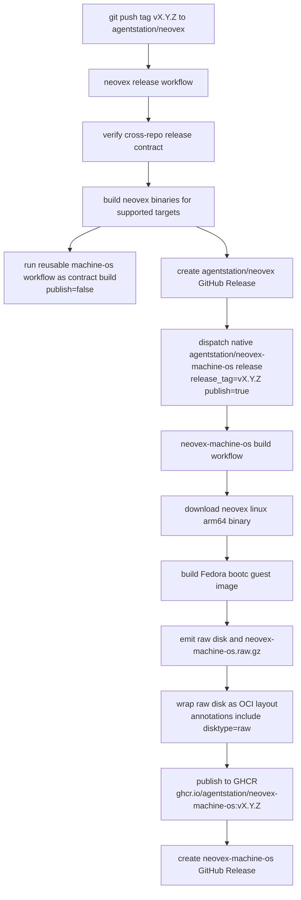
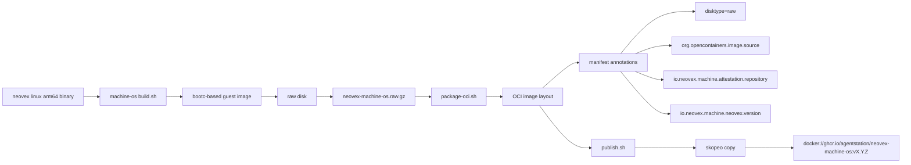
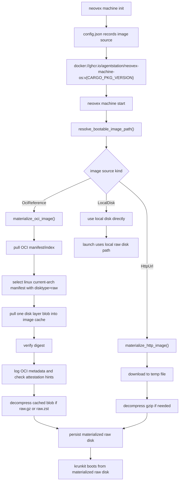
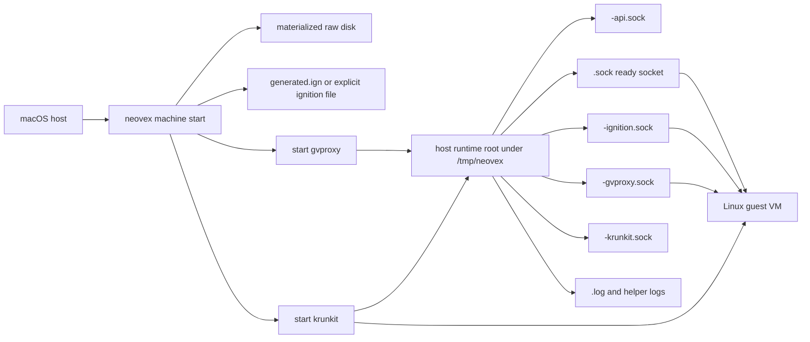
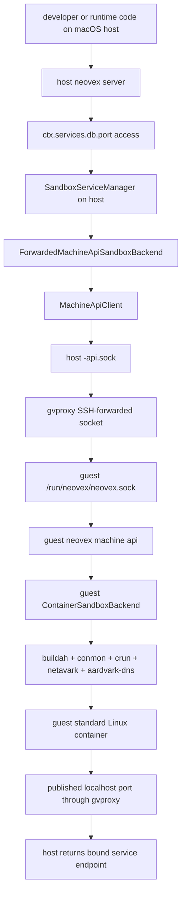
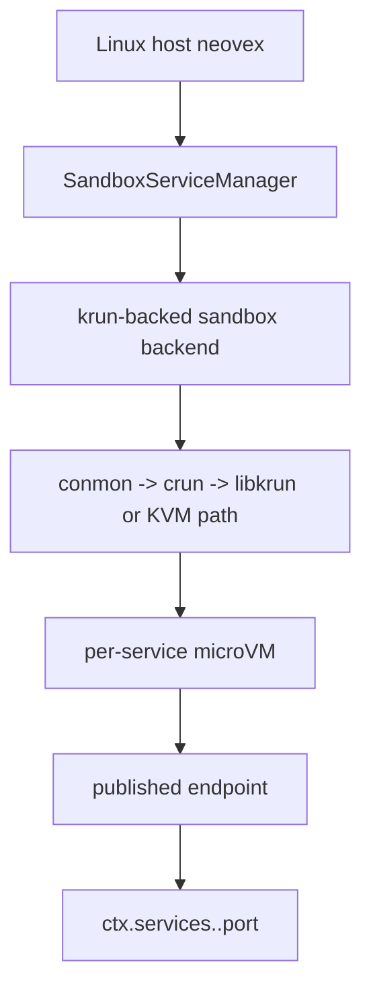

# macOS Machine Image And Control Flows

Current source-backed reference for how Neovex:

- publishes the macOS guest VM image
- version-links that image to a host `neovex` release
- pulls and materializes the guest image on a macOS host
- splits control-plane responsibility between the macOS host and the Linux
  guest

Reviewed against:

- `.github/workflows/release.yml`
- `/Users/jack/src/github.com/agentstation/neovex-machine-os/.github/workflows/build.yml`
- [crates/neovex-bin/src/machine/mod.rs](/Users/jack/src/github.com/agentstation/neovex/crates/neovex-bin/src/machine/mod.rs)
- [crates/neovex-bin/src/machine/manager.rs](/Users/jack/src/github.com/agentstation/neovex/crates/neovex-bin/src/machine/manager.rs)
- [crates/neovex-bin/src/machine/api.rs](/Users/jack/src/github.com/agentstation/neovex/crates/neovex-bin/src/machine/api.rs)
- [crates/neovex-bin/src/machine/client.rs](/Users/jack/src/github.com/agentstation/neovex/crates/neovex-bin/src/machine/client.rs)
- [crates/neovex-bin/src/machine/backend.rs](/Users/jack/src/github.com/agentstation/neovex/crates/neovex-bin/src/machine/backend.rs)
- [crates/neovex-bin/src/service/mod.rs](/Users/jack/src/github.com/agentstation/neovex/crates/neovex-bin/src/service/mod.rs)
- `/Users/jack/src/github.com/agentstation/neovex-machine-os/scripts/package-oci.sh`
- `/Users/jack/src/github.com/agentstation/neovex-machine-os/scripts/publish.sh`

## Overview

The current macOS architecture is a hybrid control plane:

- the macOS host owns the main Neovex server, runtime, storage, and
  `ctx.services.*` activation path
- the Linux guest owns a narrow machine API and standard-container execution
  lane for service workloads
- the guest VM image is built and published by
  `agentstation/neovex-machine-os`
- the host `neovex` binary consumes that image by version-pinned GHCR
  reference

The default image reference recorded by `neovex machine init` is:

```text
docker://ghcr.io/agentstation/neovex-machine-os:v{CARGO_PKG_VERSION}
```

That version pin is intentional: the default macOS guest image should track
the matching host binary release.

## Flow 1: Host Release To Guest Image Release



### What Each Repo Owns

- `agentstation/neovex`
  owns host CLI/server/runtime binaries and the host GitHub Release
- `agentstation/neovex-machine-os`
  owns the guest VM image build, GHCR publish, and machine-image GitHub
  Release

### Why The Flow Is Two-Phase

The host repo uses the machine-os workflow twice for different reasons:

1. reusable workflow call
   proves the cross-repo build contract against the exact host release inputs
2. native workflow dispatch in `agentstation/neovex-machine-os`
   lets the machine-image repo own its own GHCR publish and GitHub Release

That keeps the release ownership aligned with the repo boundary, which mirrors
Podman's `containers/podman` plus `containers/podman-machine-os` split.

## Flow 2: How The Guest Image Is Packaged And Uploaded



### Important Packaging Contract

The host machine manager does not pull an arbitrary OCI image and hope it is a
disk. It looks for a specific artifact shape:

- operating system: `linux`
- architecture: current host-compatible machine arch
- manifest annotation: `disktype=raw`
- exactly one disk layer
- disk layer title suffix such as `.raw`, `.raw.gz`, or `.raw.zst`

That packaging contract is what lets the host treat GHCR as a versioned VM
image registry instead of inventing a separate image service.

## Flow 3: How `neovex` Pulls The VM Image On macOS



### Where The Image Comes From

By default, it comes from GHCR:

```text
ghcr.io/agentstation/neovex-machine-os:v{CARGO_PKG_VERSION}
```

The host supports three source kinds:

- OCI reference
- `http(s)` URL
- local raw disk path

The OCI reference is the canonical release path.

### Where The Image Lands On Disk

For a machine named `default`, Neovex reserves:

- cache directory:
  `state/default/images/`
- materialized bootable raw disk:
  `state/default/images/default.raw`

The manager reuses `default.raw` if it already exists.

## Flow 4: macOS Machine Launch Plumbing



### Socket Roles

- `<machine>-ignition.sock`
  first-boot ignition delivery
- `<machine>.sock`
  machine-ready signal
- `<machine>-api.sock`
  host-local forwarded guest machine API
- `<machine>-gvproxy.sock`
  gvproxy networking socket used by krunkit virtio-net
- `<machine>-krunkit.sock`
  krunkit REST/control endpoint

### Transport Reality

`vsock` exists on macOS here, but its role is narrow:

- first-boot bootstrap
- machine-ready signaling

It is not the generic host API transport.

The host control path uses:

- `gvproxy`
- SSH-backed forwarded Unix socket
- guest target socket: `/run/neovex/neovex.sock`

## Flow 5: Host Runtime To Guest Service Execution



### Current Responsibility Split

Host:

- main Neovex API
- runtime execution
- storage
- `ctx.services.*` activation
- service catalog and manager orchestration

Guest:

- machine API
- build-backed and image-backed service sandbox execution
- standard-container runtime binaries
- published port plumbing for service workloads

This is intentionally not "guest Neovex owns the full product surface". The
current architecture keeps the authoritative Neovex server on the macOS host
and forwards only the service-execution seam into the guest.

## Flow 6: Linux Production Contrast



macOS is different:

- one Linux machine VM per developer environment
- guest standard containers for service workloads
- host Neovex runtime/server remains on macOS

Linux production:

- no outer machine VM
- service workloads can be real per-service microVMs

## Practical Summary

If you want the shortest accurate explanation:

1. `neovex` releases the host binary.
2. That release triggers a matching `neovex-machine-os` guest-image release.
3. The guest image is published to GHCR as a raw-disk OCI artifact tagged with
   the same version.
4. `neovex machine init` records that version-pinned GHCR reference.
5. `neovex machine start` pulls the OCI artifact, selects the `disktype=raw`
   layer, materializes a local raw disk, and boots it with `krunkit`.
6. The host Neovex server talks to the guest machine API through a forwarded
   Unix socket, and the guest starts standard Linux containers for declared
   services.

